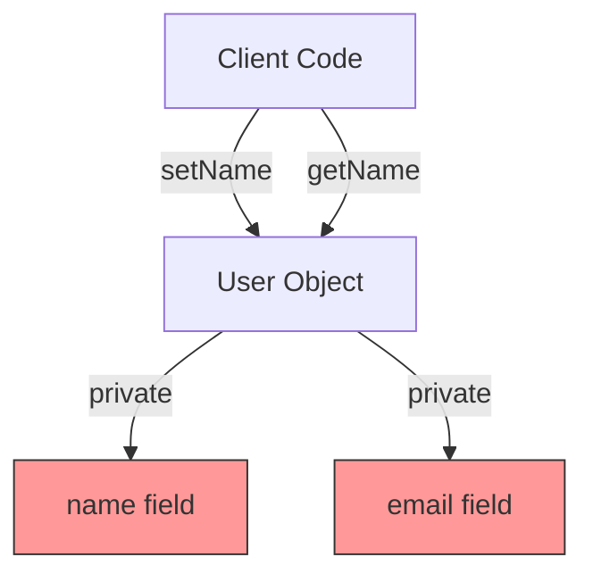
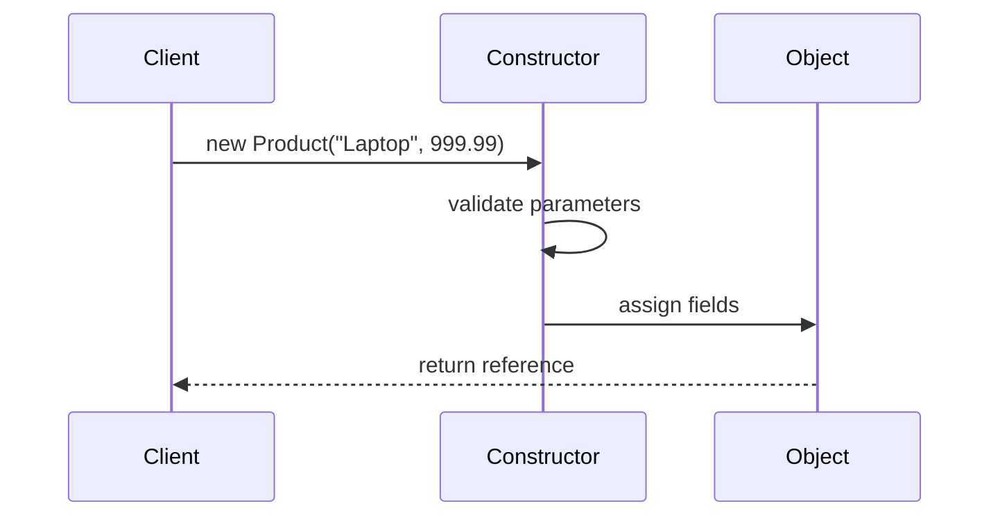
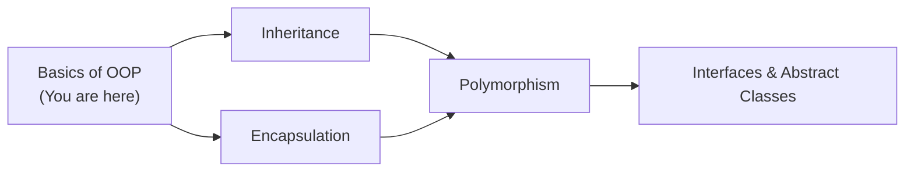
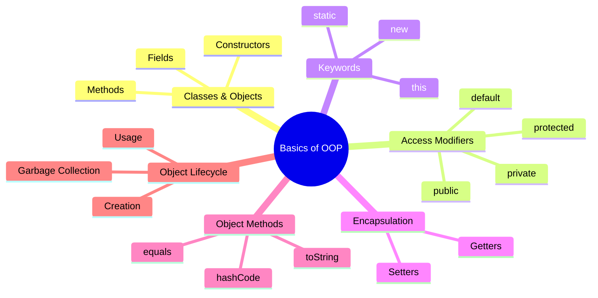
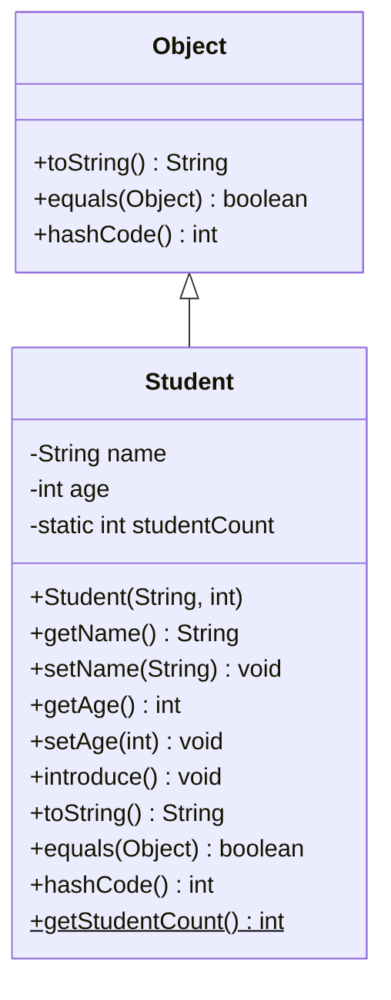
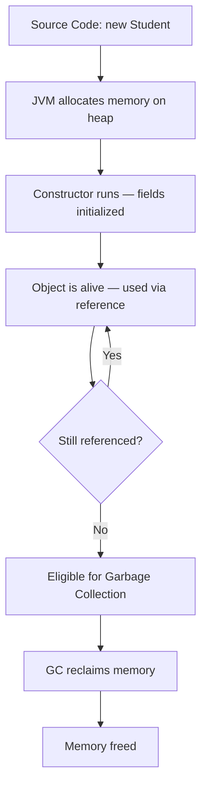

# Basics of OOP — Junior Level

## Table of Contents

1. [Introduction](#introduction)
2. [Prerequisites](#prerequisites)
3. [Glossary](#glossary)
4. [Core Concepts](#core-concepts)
5. [Real-World Analogies](#real-world-analogies)
6. [Mental Models](#mental-models)
7. [Pros & Cons](#pros--cons)
8. [Use Cases](#use-cases)
9. [Code Examples](#code-examples)
10. [Coding Patterns](#coding-patterns)
11. [Clean Code](#clean-code)
12. [Product Use / Feature](#product-use--feature)
13. [Error Handling](#error-handling)
14. [Security Considerations](#security-considerations)
15. [Performance Tips](#performance-tips)
16. [Metrics & Analytics](#metrics--analytics)
17. [Best Practices](#best-practices)
18. [Edge Cases & Pitfalls](#edge-cases--pitfalls)
19. [Common Mistakes](#common-mistakes)
20. [Common Misconceptions](#common-misconceptions)
21. [Tricky Points](#tricky-points)
22. [Test](#test)
23. [Tricky Questions](#tricky-questions)
24. [Cheat Sheet](#cheat-sheet)
25. [Self-Assessment Checklist](#self-assessment-checklist)
26. [Summary](#summary)
27. [What You Can Build](#what-you-can-build)
28. [Further Reading](#further-reading)
29. [Related Topics](#related-topics)
30. [Diagrams & Visual Aids](#diagrams--visual-aids)

---

## Introduction

> Focus: "What is it?" and "How to use it?"

Object-Oriented Programming (OOP) is a programming paradigm that organizes code around **objects** — bundles of data (fields) and behavior (methods). In Java, everything revolves around classes and objects. A **class** is a blueprint, and an **object** is a concrete instance of that blueprint. Understanding OOP basics is the foundation for writing any real Java program, from console apps to enterprise Spring Boot services.

This topic covers: classes, objects, constructors, fields, methods, access modifiers (`public`, `private`, `protected`, default), the `static` keyword, the `this` keyword, encapsulation with getters/setters, the `toString()`, `equals()`, and `hashCode()` methods, object creation with `new`, and the object lifecycle.

---

## Prerequisites

What you should know before studying this topic:

- **Required:** Java basic syntax — how to write `public class Main` with a `main` method
- **Required:** Data types and variables — primitives (`int`, `double`, `boolean`, `String`) and how to declare them
- **Required:** Conditionals and loops — `if/else`, `for`, `while`
- **Helpful but not required:** Arrays — understanding of collections of elements

---

## Glossary

Key terms used in this topic:

| Term | Definition |
|------|-----------|
| **Class** | A blueprint/template that defines what data (fields) and behavior (methods) an object will have |
| **Object** | A concrete instance of a class, created with the `new` keyword |
| **Field** | A variable declared inside a class that holds data (also called an attribute or instance variable) |
| **Method** | A function defined inside a class that describes behavior |
| **Constructor** | A special method called when an object is created; it initializes fields |
| **Access Modifier** | A keyword (`public`, `private`, `protected`, or default) that controls visibility of a class member |
| **Encapsulation** | The practice of hiding internal data and exposing only controlled access via getters/setters |
| **static** | A keyword meaning the member belongs to the class itself, not to any particular object |
| **this** | A keyword that refers to the current object instance |
| **Object Lifecycle** | The stages an object goes through: creation, use, and garbage collection |

---

## Core Concepts

### Concept 1: Classes and Objects

A **class** defines the structure — what fields and methods an object will have. An **object** is created from a class using the `new` keyword. You can create many objects from one class, each with its own field values.

```java
class Dog {
    String name;
    int age;
}
// Creating objects:
Dog myDog = new Dog();
myDog.name = "Buddy";
```

### Concept 2: Fields and Methods

**Fields** store data, **methods** define actions. Together they form the complete behavior of an object.

```java
class Calculator {
    int result; // field

    void add(int value) { // method
        result += value;
    }
}
```

### Concept 3: Constructors

A constructor is a special method with the **same name as the class** and **no return type**. It runs automatically when you call `new`. If you do not write any constructor, Java provides a default no-argument constructor.

```java
class Person {
    String name;
    Person(String name) { // constructor
        this.name = name;
    }
}
```

### Concept 4: Access Modifiers

Java has four access levels that control who can see a field or method:

| Modifier | Class | Package | Subclass | World |
|----------|:-----:|:-------:|:--------:|:-----:|
| `public` | Yes | Yes | Yes | Yes |
| `protected` | Yes | Yes | Yes | No |
| *(default)* | Yes | Yes | No | No |
| `private` | Yes | No | No | No |

### Concept 5: The `static` Keyword

A `static` member belongs to the **class** rather than any object. You access it with `ClassName.member` instead of `object.member`. Static methods cannot use `this` because there is no object context.

### Concept 6: The `this` Keyword

`this` refers to the **current object**. It is used to distinguish between a field and a parameter with the same name, or to pass the current object to another method.

### Concept 7: Encapsulation and Getters/Setters

Encapsulation means making fields `private` and providing `public` getter and setter methods. This protects internal data and lets you add validation.

### Concept 8: toString(), equals(), hashCode()

- `toString()` — returns a human-readable string representation of the object
- `equals()` — checks if two objects are logically equal (by default checks reference, override to compare fields)
- `hashCode()` — returns an integer hash used in `HashMap`/`HashSet` (must be consistent with `equals()`)

### Concept 9: Object Creation with `new` and Object Lifecycle

When you write `new Dog()`, the JVM: (1) allocates memory on the heap, (2) calls the constructor, (3) returns a reference. When no references point to the object, the garbage collector eventually reclaims its memory.

---

## Real-World Analogies

| Concept | Analogy |
|---------|--------|
| **Class vs Object** | A class is like a cookie cutter — the cutter is the blueprint, each cookie is an object. Every cookie has the same shape but can have different decorations (field values). |
| **Constructor** | A constructor is like the assembly line in a factory — it takes raw materials (parameters) and produces a fully assembled product (initialized object). |
| **Access Modifiers** | Think of a house: `public` is the front yard (anyone can see), `private` is your bedroom (only you), `protected` is the family living room (family and close relatives), default is the neighborhood (same street only). |
| **Encapsulation** | A TV remote: you press buttons (public methods) but the internal circuits (private fields) are hidden. You cannot touch the circuit board directly. |

---

## Mental Models

**The intuition:** Think of a Java class as a **form template** (like a government form). The form has blank fields (name, age, address). When you fill in a form, you create an **instance** — a completed form with specific values. Methods are like instructions printed on the form ("sign here", "calculate total").

**Why this model helps:** It reminds you that a class itself holds no data — only objects (filled-in forms) do. It also clarifies why you can have many objects from one class, each with different data.

---

## Pros & Cons

| Pros | Cons |
|------|------|
| Organizes code into logical, reusable units | More verbose than procedural code for small scripts |
| Encapsulation protects data integrity | Requires more upfront design thinking |
| Easy to model real-world entities | Can lead to over-engineering for simple problems |
| Supports code reuse through composition and inheritance | Object creation has a small memory/CPU cost |

### When to use:
- Modeling entities with data and behavior (users, products, orders)
- Building any non-trivial Java application

### When NOT to use:
- Simple utility scripts with no state (use static methods)
- Pure mathematical computations (functional style may be simpler)

---

## Use Cases

- **Use Case 1:** Modeling a `User` in a web application — fields like `name`, `email`, methods like `changePassword()`
- **Use Case 2:** Creating a `BankAccount` class with private `balance`, deposit/withdraw methods, and validation
- **Use Case 3:** Building a `Product` catalog where each product is an object with price, name, and category

---

## Code Examples

### Example 1: Complete Class with All OOP Basics

```java
public class Main {
    public static void main(String[] args) {
        // Creating objects with the 'new' keyword
        Student alice = new Student("Alice", 20);
        Student bob = new Student("Bob", 22);

        // Using methods
        alice.introduce();
        bob.introduce();

        // Using static field
        System.out.println("Total students: " + Student.getStudentCount());

        // toString()
        System.out.println(alice);

        // equals()
        Student aliceCopy = new Student("Alice", 20);
        System.out.println("alice equals aliceCopy: " + alice.equals(aliceCopy));

        // hashCode()
        System.out.println("alice hashCode: " + alice.hashCode());
        System.out.println("aliceCopy hashCode: " + aliceCopy.hashCode());
    }
}

class Student {
    // Private fields (encapsulation)
    private String name;
    private int age;

    // Static field — belongs to the class, not to any object
    private static int studentCount = 0;

    // Constructor — initializes the object
    public Student(String name, int age) {
        this.name = name;   // 'this' distinguishes field from parameter
        this.age = age;
        studentCount++;      // increment class-level counter
    }

    // Getter for name
    public String getName() {
        return name;
    }

    // Setter for name
    public void setName(String name) {
        this.name = name;
    }

    // Getter for age
    public int getAge() {
        return age;
    }

    // Setter with validation
    public void setAge(int age) {
        if (age > 0 && age < 150) {
            this.age = age;
        }
    }

    // Static method — called on the class, not on an object
    public static int getStudentCount() {
        return studentCount;
    }

    // Instance method
    public void introduce() {
        System.out.println("Hi, I'm " + name + ", age " + age);
    }

    // Override toString() for readable output
    @Override
    public String toString() {
        return "Student{name='" + name + "', age=" + age + "}";
    }

    // Override equals() to compare by field values
    @Override
    public boolean equals(Object obj) {
        if (this == obj) return true;                    // same reference
        if (obj == null || getClass() != obj.getClass()) return false;
        Student other = (Student) obj;
        return age == other.age && name.equals(other.name);
    }

    // Override hashCode() — must be consistent with equals()
    @Override
    public int hashCode() {
        return name.hashCode() * 31 + age;
    }
}
```

**What it does:** Demonstrates classes, objects, constructors, `this`, `static`, encapsulation (getters/setters), `toString()`, `equals()`, and `hashCode()` all in one runnable program.

**How to run:** `javac Main.java && java Main`

**Expected output:**
```
Hi, I'm Alice, age 20
Hi, I'm Bob, age 22
Total students: 2
Student{name='Alice', age=20}
alice equals aliceCopy: true
alice hashCode: 64578270
aliceCopy hashCode: 64578270
```

### Example 2: Access Modifiers in Action

```java
public class Main {
    public static void main(String[] args) {
        BankAccount account = new BankAccount("Alice", 1000.0);

        // Public methods are accessible
        account.deposit(500.0);
        account.withdraw(200.0);
        System.out.println(account.getBalance()); // 1300.0

        // account.balance = -999; // ERROR: balance is private!
        // account.owner = "Hacker"; // ERROR: owner is private!
    }
}

class BankAccount {
    private String owner;    // only accessible within this class
    private double balance;  // only accessible within this class

    public BankAccount(String owner, double initialBalance) {
        this.owner = owner;
        this.balance = initialBalance;
    }

    // Public method with validation — controlled access
    public void deposit(double amount) {
        if (amount > 0) {
            balance += amount;
            System.out.println("Deposited " + amount + ". New balance: " + balance);
        }
    }

    public boolean withdraw(double amount) {
        if (amount > 0 && amount <= balance) {
            balance -= amount;
            System.out.println("Withdrew " + amount + ". New balance: " + balance);
            return true;
        }
        System.out.println("Insufficient funds");
        return false;
    }

    // Getter — read-only access to balance
    public double getBalance() {
        return balance;
    }

    public String getOwner() {
        return owner;
    }
}
```

**What it does:** Shows how `private` fields protect data and `public` methods provide controlled access.

**How to run:** `javac Main.java && java Main`

### Example 3: Static vs Instance Members

```java
public class Main {
    public static void main(String[] args) {
        // Static member: accessed via class name
        System.out.println("PI = " + MathHelper.PI);
        System.out.println("Square of 5 = " + MathHelper.square(5));

        // Instance member: requires an object
        Counter c1 = new Counter();
        Counter c2 = new Counter();
        c1.increment();
        c1.increment();
        c2.increment();

        System.out.println("c1 count: " + c1.getCount());      // 2
        System.out.println("c2 count: " + c2.getCount());      // 1
        System.out.println("Total: " + Counter.getTotalCount()); // 3
    }
}

class MathHelper {
    public static final double PI = 3.14159265;

    // Static method — no object needed
    public static int square(int n) {
        return n * n;
    }
}

class Counter {
    private int count = 0;            // instance field — each object has its own
    private static int totalCount = 0; // static field — shared across all objects

    public void increment() {
        count++;
        totalCount++;
    }

    public int getCount() {
        return count;
    }

    public static int getTotalCount() {
        return totalCount;
    }
}
```

**What it does:** Clearly shows the difference between static (class-level) and instance (object-level) members.

**How to run:** `javac Main.java && java Main`

---

## Coding Patterns

### Pattern 1: JavaBean Pattern (Getters/Setters)

**Intent:** Provide controlled read/write access to private fields.
**When to use:** Any class that holds data and needs encapsulation.

```java
public class Main {
    public static void main(String[] args) {
        User user = new User();
        user.setName("Alice");
        user.setEmail("alice@example.com");
        System.out.println(user.getName() + " - " + user.getEmail());
    }
}

class User {
    private String name;
    private String email;

    public String getName() { return name; }
    public void setName(String name) { this.name = name; }
    public String getEmail() { return email; }
    public void setEmail(String email) { this.email = email; }
}
```

**Diagram:**



**Remember:** Always make fields `private` and expose them through getters/setters. This is the foundation of encapsulation.

---

### Pattern 2: Constructor Initialization Pattern

**Intent:** Ensure every object starts in a valid state by requiring essential data at creation time.

```java
public class Main {
    public static void main(String[] args) {
        Product p = new Product("Laptop", 999.99);
        System.out.println(p); // Product{name='Laptop', price=999.99}
    }
}

class Product {
    private final String name;
    private final double price;

    public Product(String name, double price) {
        if (name == null || name.isEmpty()) throw new IllegalArgumentException("Name required");
        if (price < 0) throw new IllegalArgumentException("Price must be >= 0");
        this.name = name;
        this.price = price;
    }

    public String getName() { return name; }
    public double getPrice() { return price; }

    @Override
    public String toString() {
        return "Product{name='" + name + "', price=" + price + "}";
    }
}
```

**Diagram:**



---

### Pattern 3: Static Factory Method

**Intent:** Provide a named, descriptive way to create objects instead of using constructors directly.

```java
public class Main {
    public static void main(String[] args) {
        Color red = Color.fromRGB(255, 0, 0);
        Color blue = Color.fromName("blue");
        System.out.println(red);
        System.out.println(blue);
    }
}

class Color {
    private int r, g, b;
    private String name;

    // Private constructor — only factory methods can create objects
    private Color(int r, int g, int b, String name) {
        this.r = r; this.g = g; this.b = b; this.name = name;
    }

    // Static factory method #1
    public static Color fromRGB(int r, int g, int b) {
        return new Color(r, g, b, "custom");
    }

    // Static factory method #2
    public static Color fromName(String name) {
        switch (name.toLowerCase()) {
            case "red":   return new Color(255, 0, 0, "red");
            case "blue":  return new Color(0, 0, 255, "blue");
            case "green": return new Color(0, 255, 0, "green");
            default: throw new IllegalArgumentException("Unknown color: " + name);
        }
    }

    @Override
    public String toString() {
        return "Color{name='" + name + "', r=" + r + ", g=" + g + ", b=" + b + "}";
    }
}
```

**Remember:** Static factory methods have descriptive names (`fromRGB`, `fromName`) making code more readable than `new Color(...)`.

---

## Clean Code

### Naming (Java conventions)

```java
// ❌ Bad naming
class user {}
void proc(String s) {}
int x = 5;

// ✅ Clean Java naming
class User {}
void processOrder(String orderId) {}
int itemCount = 5;
```

**Java naming rules:**
- Classes: PascalCase (`BankAccount`, `StudentRecord`)
- Methods and variables: camelCase (`getBalance`, `isActive`)
- Constants: UPPER_SNAKE_CASE (`MAX_RETRIES`, `DEFAULT_TIMEOUT`)

---

### Short Methods

```java
// ❌ One method does everything
public void processStudent(String data) {
    // parse... validate... save... notify... 50+ lines
}

// ✅ Each method does one thing
private Student parseStudent(String data) { ... }
private void validateStudent(Student s) { ... }
private void saveStudent(Student s) { ... }
```

**Rule:** If you need to scroll to see a method — it does too much. Aim for 20 lines or fewer.

---

### Comments

```java
// ❌ Noise comment
// set name to Alice
user.setName("Alice");

// ✅ Explains WHY, not WHAT
// Use display name instead of username for GDPR compliance
user.setName(user.getDisplayName());
```

---

## Product Use / Feature

### 1. Spring Framework

- **How it uses OOP Basics:** Every Spring Bean is a Java class with fields, constructors, and methods. Spring manages the lifecycle of these objects (creation, injection, destruction).
- **Why it matters:** Without understanding classes and constructors, you cannot use Spring's dependency injection.

### 2. Android SDK

- **How it uses OOP Basics:** Activities, Views, and Services are all classes. You extend them and override methods like `onCreate()`, `toString()`.
- **Why it matters:** Android development is entirely class-based.

### 3. Hibernate/JPA

- **How it uses OOP Basics:** Entity classes map to database tables. Fields map to columns. Getters/setters are required by JPA specification.
- **Why it matters:** Without proper encapsulation and `equals()`/`hashCode()`, entity management breaks.

---

## Error Handling

### Error 1: NullPointerException on uninitialized objects

```java
Student s = null;
s.introduce(); // NullPointerException!
```

**Why it happens:** The variable `s` does not point to any object.
**How to fix:**

```java
Student s = new Student("Alice", 20); // always initialize with 'new'
s.introduce(); // works fine
```

### Error 2: Compilation Error — accessing private fields from outside

```java
Student s = new Student("Alice", 20);
System.out.println(s.name); // ERROR: name has private access
```

**Why it happens:** `name` is declared `private` — only methods inside the `Student` class can access it.
**How to fix:**

```java
System.out.println(s.getName()); // use the public getter
```

### Error 3: StackOverflowError from `toString()` calling itself

```java
@Override
public String toString() {
    return "Student: " + this; // calls toString() again — infinite recursion!
}
```

**Why it happens:** `this` in string concatenation triggers `toString()` recursively.
**How to fix:**

```java
@Override
public String toString() {
    return "Student{name='" + name + "'}";
}
```

---

## Security Considerations

### 1. Never expose sensitive fields publicly

```java
// ❌ Insecure — password is public
class User {
    public String password; // anyone can read/write!
}

// ✅ Secure — password is private with controlled setter
class User {
    private String passwordHash;

    public void setPassword(String rawPassword) {
        this.passwordHash = hashPassword(rawPassword); // hash before storing
    }

    private String hashPassword(String raw) {
        // use BCrypt or similar in production
        return Integer.toHexString(raw.hashCode());
    }
}
```

**Risk:** Exposing sensitive data through public fields.
**Mitigation:** Always use `private` fields for sensitive data. Never store raw passwords.

### 2. Validate setter inputs

```java
// ❌ No validation — accepts negative age
public void setAge(int age) { this.age = age; }

// ✅ Validate before assigning
public void setAge(int age) {
    if (age < 0 || age > 150) {
        throw new IllegalArgumentException("Invalid age: " + age);
    }
    this.age = age;
}
```

---

## Performance Tips

### Tip 1: Reuse objects instead of creating new ones in loops

```java
// ❌ Creates a new StringBuilder each iteration
for (int i = 0; i < 1000; i++) {
    StringBuilder sb = new StringBuilder();
    sb.append("item ").append(i);
    process(sb.toString());
}

// ✅ Reuse the StringBuilder
StringBuilder sb = new StringBuilder();
for (int i = 0; i < 1000; i++) {
    sb.setLength(0); // clear without reallocating
    sb.append("item ").append(i);
    process(sb.toString());
}
```

**Why it is faster:** Fewer object allocations means less work for the garbage collector.

### Tip 2: Use `static` for stateless utility methods

```java
// ✅ No object creation needed
public class MathUtils {
    public static int max(int a, int b) {
        return a > b ? a : b;
    }
}
// Call: MathUtils.max(5, 10) — no need for 'new MathUtils()'
```

---

## Metrics & Analytics

### What to Measure

| Metric | Why it matters | Tool |
|--------|---------------|------|
| **Object creation rate** | Too many short-lived objects cause GC pressure | VisualVM, JFR |
| **Memory footprint per object** | Bloated objects waste heap space | JOL (Java Object Layout) |

### Basic Instrumentation

```java
// Counting how many objects were created
public class Main {
    public static void main(String[] args) {
        long before = Runtime.getRuntime().freeMemory();
        Student[] students = new Student[10000];
        for (int i = 0; i < 10000; i++) {
            students[i] = new Student("Student" + i, 20);
        }
        long after = Runtime.getRuntime().freeMemory();
        System.out.println("Memory used: " + (before - after) + " bytes");
    }
}
```

---

## Best Practices

- **Make fields private:** Always start with `private` and only open up access if needed.
- **Initialize objects fully in the constructor:** An object should be in a valid state immediately after construction.
- **Override `toString()`:** Every class should have a readable `toString()` for debugging.
- **Override `equals()` and `hashCode()` together:** If you override one, you must override the other.
- **Prefer immutable objects:** Use `final` fields where possible and do not provide setters.

---

## Edge Cases & Pitfalls

### Pitfall 1: Forgetting to override `hashCode()` when overriding `equals()`

```java
// Only equals() overridden — hashCode() uses default (memory address)
Student a = new Student("Alice", 20);
Student b = new Student("Alice", 20);
Set<Student> set = new HashSet<>();
set.add(a);
System.out.println(set.contains(b)); // false! Even though a.equals(b) is true
```

**What happens:** `HashSet` uses `hashCode()` first. Different hash codes mean it never checks `equals()`.
**How to fix:** Always override both `equals()` and `hashCode()`.

### Pitfall 2: Using `==` instead of `equals()` for object comparison

```java
String a = new String("hello");
String b = new String("hello");
System.out.println(a == b);      // false — different references
System.out.println(a.equals(b)); // true — same content
```

---

## Common Mistakes

### Mistake 1: Forgetting `this` in constructors

```java
// ❌ Parameter shadows the field — field remains null
class User {
    private String name;
    public User(String name) {
        name = name; // assigns parameter to itself!
    }
}

// ✅ Use 'this' to refer to the field
class User {
    private String name;
    public User(String name) {
        this.name = name;
    }
}
```

### Mistake 2: Calling instance methods from static context

```java
// ❌ Cannot access instance method from static method
public class Main {
    public void greet() {
        System.out.println("Hello");
    }
    public static void main(String[] args) {
        greet(); // ERROR: non-static method cannot be referenced from static context
    }
}

// ✅ Create an object first, or make the method static
public class Main {
    public static void main(String[] args) {
        Main m = new Main();
        m.greet();
    }
    public void greet() {
        System.out.println("Hello");
    }
}
```

### Mistake 3: Making all fields public

```java
// ❌ No protection — anyone can set invalid data
class Account {
    public double balance; // balance = -99999 is possible!
}

// ✅ Private field with validated setter
class Account {
    private double balance;
    public void setBalance(double b) {
        if (b >= 0) this.balance = b;
    }
}
```

---

## Common Misconceptions

### Misconception 1: "A class is the same as an object"

**Reality:** A class is a blueprint; an object is an instance. `Dog` is a class. `new Dog()` creates an object. You can create hundreds of objects from one class.

**Why people think this:** Beginners often confuse the definition with the instance because they see both in the same file.

### Misconception 2: "`static` means constant"

**Reality:** `static` means the member belongs to the class, not to an instance. It can still change. `static final` makes it a constant.

**Why people think this:** Because constants are often `static final`, people associate `static` with "cannot change".

### Misconception 3: "Getters and setters break encapsulation"

**Reality:** Getters and setters **are** encapsulation. They allow controlled access with validation. Without them, you would need `public` fields which offer zero control.

**Why people think this:** Some advanced developers argue that blindly adding getters/setters is pointless — which is true only when there is no validation logic needed.

---

## Tricky Points

### Tricky Point 1: Default constructor disappears when you define any constructor

```java
class Animal {
    String name;
    Animal(String name) { this.name = name; }
}

Animal a = new Animal();       // ERROR: no default constructor!
Animal b = new Animal("Cat");  // OK
```

**Why it is tricky:** Java only provides a default no-arg constructor if you write **no constructors at all**. The moment you define one, the default disappears.
**Key takeaway:** If you need both parameterized and no-arg constructors, define both explicitly.

### Tricky Point 2: `static` methods cannot use `this`

```java
class Calculator {
    private int value = 10;

    public static int getValue() {
        return this.value; // ERROR: 'this' cannot be used in static context
    }
}
```

**Why it is tricky:** `static` belongs to the class, not any object — there is no `this` to refer to.

---

## Test

### Multiple Choice

**1. What does the `new` keyword do in Java?**

- A) Declares a new variable
- B) Allocates memory on the heap and calls the constructor
- C) Imports a new package
- D) Creates a new class definition

<details>
<summary>Answer</summary>

**B)** — `new` allocates memory for the object on the heap, calls the constructor to initialize it, and returns a reference to the created object.

</details>

**2. Which access modifier makes a field visible only within its own class?**

- A) public
- B) protected
- C) default (no modifier)
- D) private

<details>
<summary>Answer</summary>

**D)** — `private` restricts access to the declaring class only. `protected` allows subclass access, default allows package access, and `public` allows access from everywhere.

</details>

### True or False

**3. If you override `equals()`, you should always override `hashCode()` too.**

<details>
<summary>Answer</summary>

**True** — The contract states: if `a.equals(b)` is true, then `a.hashCode() == b.hashCode()` must be true. Violating this breaks `HashMap` and `HashSet`.

</details>

**4. A `static` method can access instance fields directly.**

<details>
<summary>Answer</summary>

**False** — Static methods belong to the class, not to any object instance. They cannot access instance fields or use `this`.

</details>

### What's the Output?

**5. What does this code print?**

```java
public class Main {
    static int count = 0;
    public Main() { count++; }
    public static void main(String[] args) {
        Main a = new Main();
        Main b = new Main();
        Main c = new Main();
        System.out.println(Main.count);
    }
}
```

<details>
<summary>Answer</summary>

Output: `3`

Explanation: Each `new Main()` calls the constructor, which increments the static `count`. Three objects are created, so `count` becomes 3.

</details>

**6. What does this code print?**

```java
public class Main {
    private String name = "World";
    public Main(String name) {
        // forgot 'this.'
        name = name;
    }
    public static void main(String[] args) {
        Main m = new Main("Java");
        System.out.println(m.name);
    }
}
```

<details>
<summary>Answer</summary>

Output: `World`

Explanation: In the constructor, `name = name` assigns the parameter to itself — the field `this.name` is never changed, so it keeps its default value `"World"`.

</details>

---

## Tricky Questions

**1. What happens if you do not override `toString()` and print an object?**

- A) Compilation error
- B) Prints the field values
- C) Prints the class name followed by `@` and the hash code in hexadecimal
- D) Prints `null`

<details>
<summary>Answer</summary>

**C)** — The default `Object.toString()` returns something like `Student@1a2b3c4d`. It does NOT print field values — you must override `toString()` for that.

</details>

**2. Can a `private` constructor prevent object creation?**

- A) No, `new` always works
- B) Yes, but only if the class is also `final`
- C) Yes — outside code cannot call `new` on the class
- D) Private constructors are not allowed in Java

<details>
<summary>Answer</summary>

**C)** — A `private` constructor means only code inside the class can create instances. This is used in patterns like Singleton and static factory methods.

</details>

**3. What is the difference between `==` and `.equals()` for objects?**

- A) They are the same
- B) `==` compares values, `.equals()` compares references
- C) `==` compares references, `.equals()` compares values (if overridden)
- D) `==` only works with primitives

<details>
<summary>Answer</summary>

**C)** — `==` checks if two references point to the **same object in memory**. `.equals()` checks **logical equality** (same field values) — but only if you override it. By default, `Object.equals()` also uses `==`.

</details>

---

## Cheat Sheet

| What | Syntax | Example |
|------|--------|---------|
| Define a class | `class Name { }` | `class Dog { }` |
| Create an object | `Type var = new Type()` | `Dog d = new Dog()` |
| Constructor | `ClassName(params) { }` | `Dog(String name) { this.name = name; }` |
| Private field | `private Type name;` | `private String name;` |
| Getter | `public Type getName()` | `public String getName() { return name; }` |
| Setter | `public void setName(Type)` | `public void setName(String n) { name = n; }` |
| Static field | `static Type name` | `static int count = 0;` |
| Static method | `static ReturnType name()` | `static int getCount() { return count; }` |
| toString | `public String toString()` | `return "Dog{name=" + name + "}"` |
| equals | `public boolean equals(Object)` | `return this.name.equals(other.name);` |

---

## Self-Assessment Checklist

### I can explain:
- [ ] What a class is and how it differs from an object
- [ ] What a constructor does and when it is called
- [ ] The four access modifiers and what each one allows
- [ ] The difference between `static` and instance members
- [ ] What `this` keyword refers to
- [ ] Why encapsulation matters and how getters/setters implement it
- [ ] The `equals()`/`hashCode()` contract

### I can do:
- [ ] Write a class with private fields, constructors, getters, and setters
- [ ] Override `toString()`, `equals()`, and `hashCode()`
- [ ] Create objects using `new` and call their methods
- [ ] Use static fields and methods correctly
- [ ] Debug common OOP errors like NullPointerException

### I can answer:
- [ ] All test questions in this document
- [ ] "What's the output?" questions correctly

---

## Summary

- **Classes** are blueprints; **objects** are instances created with `new`
- **Constructors** initialize an object's state at creation time
- **Access modifiers** (`public`, `private`, `protected`, default) control visibility
- **Encapsulation** means `private` fields + `public` getters/setters
- **`static`** members belong to the class; instance members belong to each object
- **`this`** refers to the current object
- Always override `toString()`, `equals()`, and `hashCode()` together for data classes
- Objects live on the heap and are cleaned up by the garbage collector when no longer referenced

**Next step:** Learn about Inheritance — how one class can extend another to reuse and specialize behavior.

---

## What You Can Build

### Projects you can create:
- **Student Management System:** A console app with `Student`, `Course`, and `Grade` classes
- **Simple Bank Application:** `BankAccount` class with deposits, withdrawals, and balance tracking
- **Contact Book:** `Contact` class with name, phone, email — stored in an array or list

### Technologies / tools that use this:
- **Spring Boot** — every service, controller, and repository is a class with OOP principles
- **JPA/Hibernate** — entity classes with private fields and getters/setters map to database tables
- **JavaFX** — UI components are objects with properties and methods

### Learning path — what to study next:



---

## Further Reading

- **Official docs:** [Java OOP Tutorial](https://docs.oracle.com/javase/tutorial/java/concepts/) — Oracle's official guide to OOP concepts
- **Book:** Head First Java, Chapters 2-4 — Classes, Objects, and Instance Variables
- **Book:** Effective Java (Bloch), 3rd Edition, Item 10-12 — `equals()`, `hashCode()`, `toString()` contracts
- **Video:** [Java OOP Concepts by Bro Code](https://www.youtube.com/watch?v=Mm06BuD3PlY) — beginner-friendly, visual explanations

---

## Related Topics

- **[Inheritance](../../02-oop/)** — how classes can extend other classes to reuse code
- **[Encapsulation](../../02-oop/)** — deeper dive into data hiding and information protection
- **[Interfaces and Abstract Classes](../../02-oop/)** — contracts that classes must fulfill
- **[Type Casting](../05-type-casting/)** — how objects can be cast between types in class hierarchies

---

## Diagrams & Visual Aids

### Mind Map



### Class Diagram — Student Example



### Object Lifecycle Flowchart


