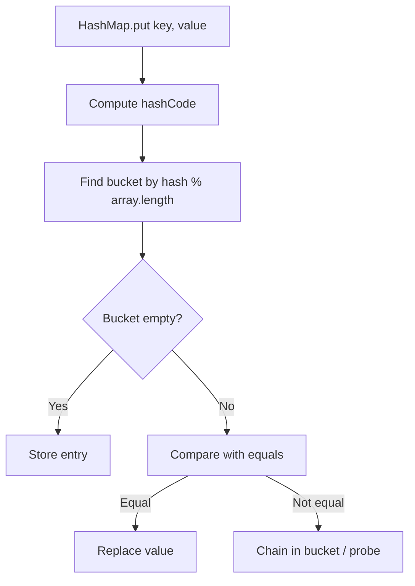
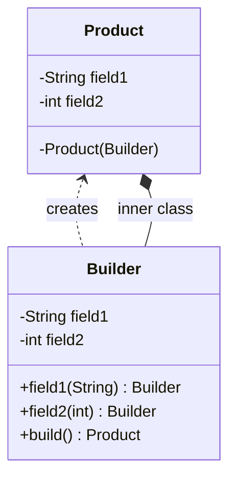
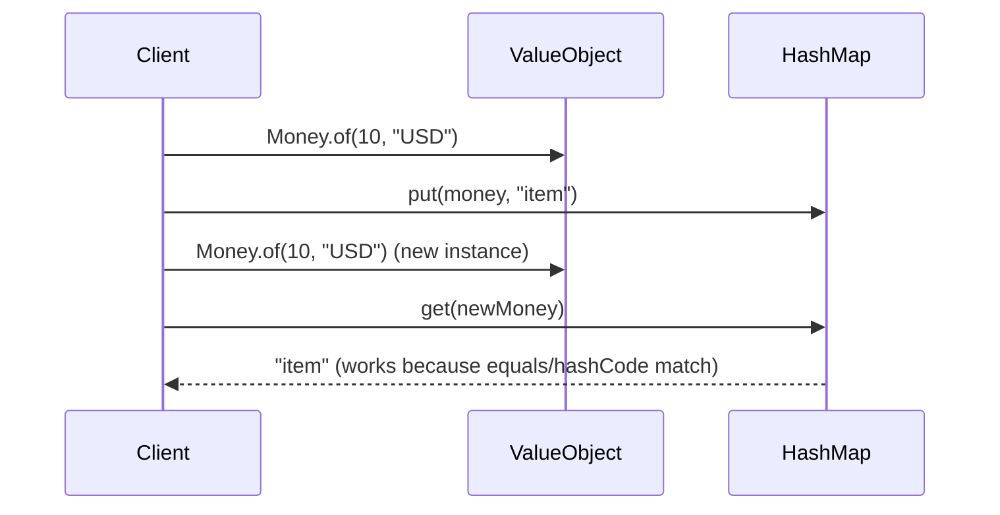
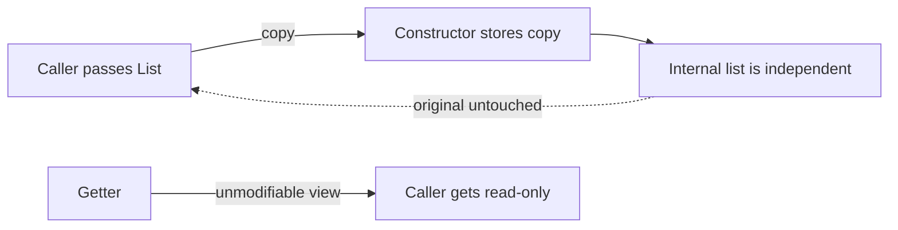
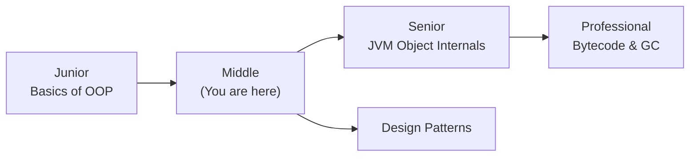
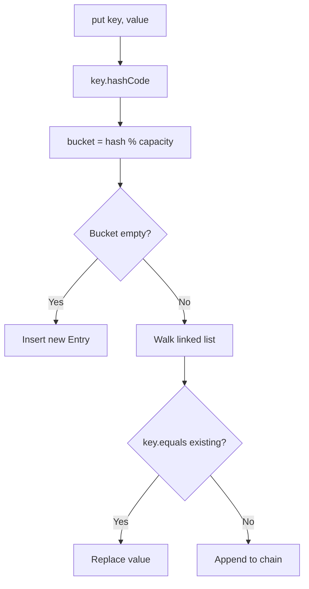
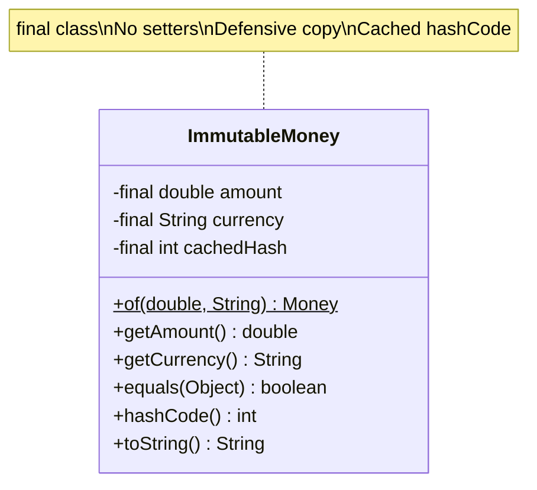

# Basics of OOP — Middle Level

## Table of Contents

1. [Introduction](#introduction)
2. [Core Concepts](#core-concepts)
3. [Evolution & Historical Context](#evolution--historical-context)
4. [Pros & Cons](#pros--cons)
5. [Alternative Approaches](#alternative-approaches)
6. [Use Cases](#use-cases)
7. [Code Examples](#code-examples)
8. [Coding Patterns](#coding-patterns)
9. [Clean Code](#clean-code)
10. [Product Use / Feature](#product-use--feature)
11. [Error Handling](#error-handling)
12. [Security Considerations](#security-considerations)
13. [Performance Optimization](#performance-optimization)
14. [Metrics & Analytics](#metrics--analytics)
15. [Debugging Guide](#debugging-guide)
16. [Best Practices](#best-practices)
17. [Edge Cases & Pitfalls](#edge-cases--pitfalls)
18. [Common Mistakes](#common-mistakes)
19. [Common Misconceptions](#common-misconceptions)
20. [Anti-Patterns](#anti-patterns)
21. [Tricky Points](#tricky-points)
22. [Comparison with Other Languages](#comparison-with-other-languages)
23. [Test](#test)
24. [Tricky Questions](#tricky-questions)
25. [Cheat Sheet](#cheat-sheet)
26. [Self-Assessment Checklist](#self-assessment-checklist)
27. [Summary](#summary)
28. [What You Can Build](#what-you-can-build)
29. [Further Reading](#further-reading)
30. [Related Topics](#related-topics)
31. [Diagrams & Visual Aids](#diagrams--visual-aids)

---

## Introduction

> Focus: "Why?" and "When to use?"

Assumes the reader already knows Java basics — classes, objects, constructors, access modifiers. This level covers:
- **Why** the `equals()`/`hashCode()` contract matters in production (HashMap, HashSet behavior)
- **When** to use `static` vs instance, `private` vs `protected` vs package-private
- Design decisions: immutable objects, defensive copying, Builder pattern
- How OOP basics interact with generics, lambdas, and the Stream API
- Production patterns: Spring beans, JPA entities, DTOs, Value Objects

---

## Core Concepts

### Concept 1: The equals()/hashCode() Contract in Depth

The contract is defined in the `Object` class javadoc:
1. **Reflexive:** `x.equals(x)` must return `true`
2. **Symmetric:** `x.equals(y)` implies `y.equals(x)`
3. **Transitive:** `x.equals(y)` and `y.equals(z)` implies `x.equals(z)`
4. **Consistent:** Multiple calls return the same result if fields have not changed
5. **Non-null:** `x.equals(null)` must return `false`
6. **hashCode rule:** Equal objects **must** have equal hash codes



**Why it matters:** If `hashCode()` is inconsistent with `equals()`, objects "disappear" from HashMaps.

### Concept 2: Immutable Objects

An immutable object cannot be modified after creation. This eliminates an entire class of bugs (shared mutable state, thread safety issues).

**How to make a class immutable:**
1. Declare the class as `final` (prevent subclassing)
2. Make all fields `private final`
3. No setters
4. Defensive copy any mutable fields in the constructor and getter
5. Use constructor or static factory for initialization

### Concept 3: Access Modifier Strategy in Production Code

| Level | Purpose | Example |
|-------|---------|---------|
| `private` | Implementation detail | Helper methods, internal state |
| Package-private (default) | Module internal API | Classes used only within a package |
| `protected` | Extension point | Template Method pattern hooks |
| `public` | External API | Service interfaces, DTOs |

**Rule of thumb:** Start with `private`. Only widen access when there is a concrete reason.

### Concept 4: Static Members — When and Why

Use `static` for:
- **Constants:** `static final` values shared across all instances
- **Utility methods:** Stateless computations (e.g., `Math.max()`)
- **Factory methods:** Named constructors (`LocalDate.of()`, `List.of()`)
- **Counters/Caches:** Class-level shared state (use with caution for thread safety)

Avoid `static` for:
- Mutable shared state in multi-threaded contexts (without synchronization)
- Methods that depend on object state

### Concept 5: The `this` Keyword — Advanced Uses

Beyond field disambiguation, `this` is used for:
- **Constructor chaining:** `this(param)` calls another constructor in the same class
- **Fluent APIs:** `return this` enables method chaining
- **Passing self as argument:** `list.add(this)`

```java
class Config {
    private String host;
    private int port;

    // Constructor chaining
    Config() { this("localhost", 8080); }
    Config(String host, int port) {
        this.host = host;
        this.port = port;
    }

    // Fluent setter — returns this
    Config setHost(String host) {
        this.host = host;
        return this;
    }
}
```

---

## Evolution & Historical Context

**Before Java's OOP model was refined:**
- Java 1.0 (1996): Basic classes, single inheritance, interfaces
- No generics (raw `Object` everywhere, unsafe casts)
- No `@Override` annotation (easy to accidentally overload instead of override)

**How Java evolved:**
- **Java 5 (2004):** Generics, `@Override`, `enum`, autoboxing
- **Java 7 (2011):** Diamond operator (`<>`), try-with-resources
- **Java 14 (2020):** `record` — immutable data classes with auto-generated `equals()`, `hashCode()`, `toString()`
- **Java 16 (2021):** `record` finalized — massively reduces boilerplate for value objects
- **Java 17+ (2021+):** Sealed classes — control which classes can extend your class

```java
// Java 16+ record replaces 50+ lines of boilerplate
public record Point(int x, int y) {}
// Auto-generates: constructor, getters (x(), y()), equals(), hashCode(), toString()
```

---

## Pros & Cons

| Pros | Cons |
|------|------|
| Strong encapsulation prevents invalid state | Boilerplate for simple data classes (pre-records) |
| Type system catches errors at compile time | Over-use of inheritance creates rigid hierarchies |
| Well-defined contracts (`equals`, `hashCode`) | Mutable objects cause thread-safety issues |
| Design patterns have decades of proven solutions | Indirection layers can hurt readability |

### Trade-off analysis:

- **Immutable vs Mutable:** Immutable is safer but requires creating new objects for every change — decide based on object lifetime and mutation frequency
- **Public API surface:** More `public` methods mean more maintenance burden — minimize the public API

### Comparison with alternatives:

| Approach | Pros | Cons | Best for |
|----------|------|------|----------|
| Mutable POJO | Simple, familiar | Thread unsafe, defensive copy needed | Simple internal DTOs |
| Java `record` | Zero boilerplate, immutable | Cannot extend, no mutable fields | Value objects, DTOs |
| Builder pattern | Flexible construction, readable | More code, extra class | Objects with many optional fields |

---

## Alternative Approaches

| Alternative | How it works | When you might use it |
|-------------|--------------|----------------------|
| **Java `record`** | Auto-generates `equals`, `hashCode`, `toString`, getters | Java 16+ projects with immutable value objects |
| **Lombok `@Data`** | Annotation processor generates boilerplate at compile time | Pre-Java 16 projects that want less boilerplate |
| **Kotlin data class** | Language-level support for value objects | Kotlin-first or mixed Kotlin/Java projects |

---

## Use Cases

- **Use Case 1:** Designing a JPA `@Entity` with proper `equals()`/`hashCode()` for Hibernate managed collections
- **Use Case 2:** Creating immutable DTOs for REST API responses in Spring Boot
- **Use Case 3:** Building a thread-safe configuration object using immutable class design
- **Use Case 4:** Implementing the Builder pattern for objects with 10+ optional fields

---

## Code Examples

### Example 1: Production-Quality Immutable Value Object

```java
import java.util.Objects;
import java.util.Collections;
import java.util.List;
import java.util.ArrayList;

public class Main {
    public static void main(String[] args) {
        Money price = Money.of(29.99, "USD");
        Money samePrice = Money.of(29.99, "USD");

        System.out.println(price);                    // Money{amount=29.99, currency='USD'}
        System.out.println(price.equals(samePrice));  // true
        System.out.println(price.hashCode() == samePrice.hashCode()); // true

        // Immutable — no setters, no way to change state
        // price.amount = 0; // ERROR: final field

        // Defensive copy example
        Address addr = new Address("123 Main St", List.of("Apt 4", "Floor 2"));
        System.out.println(addr.getLines()); // [Apt 4, Floor 2]
        // addr.getLines().add("Hacked!"); // throws UnsupportedOperationException
    }
}

// Immutable Value Object — follows all 5 rules
final class Money {
    private final double amount;
    private final String currency;

    // Private constructor — use factory method
    private Money(double amount, String currency) {
        if (amount < 0) throw new IllegalArgumentException("Negative amount");
        this.amount = amount;
        this.currency = Objects.requireNonNull(currency, "Currency required");
    }

    // Static factory method — descriptive name
    public static Money of(double amount, String currency) {
        return new Money(amount, currency);
    }

    public double getAmount() { return amount; }
    public String getCurrency() { return currency; }

    @Override
    public boolean equals(Object o) {
        if (this == o) return true;
        if (o == null || getClass() != o.getClass()) return false;
        Money money = (Money) o;
        return Double.compare(money.amount, amount) == 0
            && currency.equals(money.currency);
    }

    @Override
    public int hashCode() {
        return Objects.hash(amount, currency);
    }

    @Override
    public String toString() {
        return "Money{amount=" + amount + ", currency='" + currency + "'}";
    }
}

// Immutable class with mutable field (List) — needs defensive copy
final class Address {
    private final String street;
    private final List<String> lines;

    public Address(String street, List<String> lines) {
        this.street = street;
        // Defensive copy — prevents caller from mutating our internal list
        this.lines = new ArrayList<>(lines);
    }

    public String getStreet() { return street; }

    // Return unmodifiable view — prevents mutation via getter
    public List<String> getLines() {
        return Collections.unmodifiableList(lines);
    }
}
```

**Why this pattern:** Immutable objects are thread-safe, cacheable, and safe as HashMap keys.
**Trade-offs:** Every modification requires creating a new object, which adds GC pressure.

### Example 2: Java Record vs Traditional Class

```java
import java.util.Objects;

public class Main {
    public static void main(String[] args) {
        // Traditional approach — 30+ lines for a simple data holder
        UserTraditional u1 = new UserTraditional("Alice", "alice@mail.com");

        // Record approach — 1 line
        UserRecord u2 = new UserRecord("Alice", "alice@mail.com");

        System.out.println(u1); // UserTraditional{name='Alice', email='alice@mail.com'}
        System.out.println(u2); // UserRecord[name=Alice, email=alice@mail.com]

        // Both have working equals/hashCode
        UserRecord u3 = new UserRecord("Alice", "alice@mail.com");
        System.out.println(u2.equals(u3)); // true
    }
}

// Traditional class — lots of boilerplate
class UserTraditional {
    private final String name;
    private final String email;

    UserTraditional(String name, String email) {
        this.name = name;
        this.email = email;
    }

    public String getName() { return name; }
    public String getEmail() { return email; }

    @Override
    public boolean equals(Object o) {
        if (this == o) return true;
        if (o == null || getClass() != o.getClass()) return false;
        UserTraditional that = (UserTraditional) o;
        return Objects.equals(name, that.name) && Objects.equals(email, that.email);
    }

    @Override
    public int hashCode() { return Objects.hash(name, email); }

    @Override
    public String toString() {
        return "UserTraditional{name='" + name + "', email='" + email + "'}";
    }
}

// Java 16+ record — one line gives you everything above
record UserRecord(String name, String email) {}
```

**When to use which:** Use records for simple immutable data holders (DTOs, API responses). Use traditional classes when you need mutable state, complex validation, or inheritance.

### Example 3: Builder Pattern for Complex Object Construction

```java
import java.util.Objects;

public class Main {
    public static void main(String[] args) {
        HttpRequest request = new HttpRequest.Builder("https://api.example.com/users")
            .method("POST")
            .header("Content-Type", "application/json")
            .header("Authorization", "Bearer token123")
            .body("{\"name\": \"Alice\"}")
            .timeout(5000)
            .build();

        System.out.println(request);
    }
}

class HttpRequest {
    private final String url;
    private final String method;
    private final String headers;
    private final String body;
    private final int timeout;

    private HttpRequest(Builder builder) {
        this.url = builder.url;
        this.method = builder.method;
        this.headers = builder.headers;
        this.body = builder.body;
        this.timeout = builder.timeout;
    }

    @Override
    public String toString() {
        return "HttpRequest{url='" + url + "', method='" + method
            + "', headers='" + headers + "', body='" + body
            + "', timeout=" + timeout + "}";
    }

    // Static inner Builder class
    static class Builder {
        private final String url;       // required
        private String method = "GET";  // optional with default
        private String headers = "";
        private String body = "";
        private int timeout = 30000;

        Builder(String url) {
            this.url = Objects.requireNonNull(url);
        }

        Builder method(String method) { this.method = method; return this; }
        Builder header(String key, String value) {
            this.headers += key + ": " + value + "\n";
            return this;
        }
        Builder body(String body) { this.body = body; return this; }
        Builder timeout(int ms) { this.timeout = ms; return this; }

        HttpRequest build() {
            return new HttpRequest(this);
        }
    }
}
```

---

## Coding Patterns

### Pattern 1: Builder Pattern (GoF Creational)

**Category:** Creational
**Intent:** Construct complex objects step by step with a fluent API
**When to use:** Objects with many optional parameters (>4)
**When NOT to use:** Simple objects with 1-3 required fields — use constructor

**Structure diagram:**



**Trade-offs:**

| Pros | Cons |
|------|------|
| Readable construction for complex objects | Extra class to maintain |
| Enforces immutability | Slightly more memory (builder object) |
| Optional parameters with defaults | Overkill for simple classes |

---

### Pattern 2: Value Object Pattern

**Category:** Domain-Driven Design
**Intent:** Model a concept with no identity — equality based on field values, not reference
**When to use:** Money, Email, Address, DateRange, Coordinates

**Flow diagram:**



```java
// Value Object — compared by value, not by reference
final class Email {
    private final String address;

    private Email(String address) {
        if (!address.contains("@")) throw new IllegalArgumentException("Invalid email");
        this.address = address.toLowerCase();
    }

    public static Email of(String address) { return new Email(address); }

    @Override
    public boolean equals(Object o) {
        if (this == o) return true;
        if (!(o instanceof Email)) return false;
        return address.equals(((Email) o).address);
    }

    @Override
    public int hashCode() { return address.hashCode(); }

    @Override
    public String toString() { return address; }
}
```

---

### Pattern 3: Defensive Copy Pattern

**Intent:** Protect immutable objects from external mutation of their mutable fields



```java
final class Report {
    private final List<String> items;

    public Report(List<String> items) {
        this.items = new ArrayList<>(items); // defensive copy IN
    }

    public List<String> getItems() {
        return Collections.unmodifiableList(items); // defensive copy OUT
    }
}
```

---

## Clean Code

### Naming & Readability

```java
// ❌ Cryptic
class Dto { String n; String e; }

// ✅ Self-documenting
class UserResponse {
    private final String username;
    private final String email;
}
```

| Element | Java Rule | Example |
|---------|-----------|---------|
| Value Objects | noun describing the value | `Money`, `Email`, `PhoneNumber` |
| DTOs | suffix with context | `UserResponse`, `OrderRequest` |
| Builders | inner static class | `HttpRequest.Builder` |
| Factory methods | descriptive verb | `of()`, `from()`, `valueOf()` |

---

### SOLID — Single Responsibility for Classes

```java
// ❌ God class — user management + email + reporting
class UserManager {
    void saveUser(User u) { /* db logic */ }
    void sendEmail(User u, String msg) { /* email logic */ }
    void generateReport() { /* reporting logic */ }
}

// ✅ Separated responsibilities
class UserRepository { void save(User u) { /* db */ } }
class EmailService { void send(User u, String msg) { /* email */ } }
class UserReportGenerator { void generate() { /* report */ } }
```

---

### DRY — Extract Common Object Construction

```java
// ❌ Repeated validation in every method
public User createUser(String name, String email) {
    if (name == null || name.isBlank()) throw new ValidationException("name required");
    if (email == null || !email.contains("@")) throw new ValidationException("invalid email");
    return new User(name, email);
}

// ✅ Validation in the constructor — DRY
class User {
    private final String name;
    private final String email;

    public User(String name, String email) {
        this.name = Objects.requireNonNull(name, "name required");
        if (!email.contains("@")) throw new IllegalArgumentException("invalid email");
        this.email = email;
    }
}
```

---

## Product Use / Feature

### 1. Spring Framework — Bean Lifecycle and Scopes

- **How it uses OOP Basics:** Spring beans are regular Java objects with constructors, fields, and methods. Spring manages their lifecycle (singleton by default) and injects dependencies via constructors.
- **Scale:** Powers Netflix, Alibaba, and thousands of enterprise applications.
- **Key insight:** Spring relies on proper constructors and access modifiers — `@Service` classes must have a public constructor.

### 2. Hibernate/JPA — Entity Identity

- **How it uses OOP Basics:** JPA entities must implement `equals()` and `hashCode()` correctly for managed collections. The default identity (reference-based) breaks when entities are detached and re-attached.
- **Why this approach:** Database identity (primary key) should drive `equals()`/`hashCode()`, not all fields.

### 3. Jackson (JSON Library) — Serialization/Deserialization

- **How it uses OOP Basics:** Jackson uses getters/setters to serialize objects to JSON and back. It also uses constructors (with `@JsonCreator`) for immutable objects.
- **Key insight:** Naming conventions matter — Jackson maps `getName()` to the JSON field `"name"`.

---

## Error Handling

### Pattern 1: Null Safety with Objects.requireNonNull

```java
import java.util.Objects;

class UserService {
    private final UserRepository repo;

    // Fail fast at construction time, not at usage time
    UserService(UserRepository repo) {
        this.repo = Objects.requireNonNull(repo, "UserRepository must not be null");
    }
}
```

**When to use:** Every constructor that receives object references. Fail fast is better than a NullPointerException later.

### Pattern 2: Validation in the Constructor

```java
class Age {
    private final int value;

    public Age(int value) {
        if (value < 0 || value > 150) {
            throw new IllegalArgumentException("Age must be between 0 and 150, got: " + value);
        }
        this.value = value;
    }

    public int getValue() { return value; }
}
```

### Common Exception Patterns

| Situation | Pattern | Example |
|-----------|---------|---------|
| Null parameter | `Objects.requireNonNull(param, "msg")` | Constructor validation |
| Invalid state | `throw new IllegalStateException("msg")` | Method called before init |
| Invalid argument | `throw new IllegalArgumentException("msg")` | Setter/constructor validation |
| Not found | `throw new NoSuchElementException("msg")` | Lookup methods |

---

## Security Considerations

### 1. Mutable Objects as Map Keys

**Risk level:** Medium

```java
// ❌ Mutable key — object "disappears" from map after mutation
class MutableKey {
    String value;
    MutableKey(String v) { this.value = v; }
    @Override public int hashCode() { return value.hashCode(); }
    @Override public boolean equals(Object o) {
        return o instanceof MutableKey && ((MutableKey) o).value.equals(value);
    }
}

Map<MutableKey, String> map = new HashMap<>();
MutableKey key = new MutableKey("original");
map.put(key, "data");
key.value = "mutated"; // hashCode changes!
System.out.println(map.get(key)); // null — data is "lost"
```

**Mitigation:** Always use immutable objects as Map keys (String, Integer, records, immutable value objects).

### 2. Exposing Internal Mutable State

```java
// ❌ Getter returns internal reference — caller can mutate
class Config {
    private List<String> allowedHosts;
    public List<String> getAllowedHosts() { return allowedHosts; } // dangerous!
}

// ✅ Return unmodifiable copy
public List<String> getAllowedHosts() {
    return Collections.unmodifiableList(allowedHosts);
}
```

### Security Checklist

- [ ] Immutable objects for HashMap keys and shared state
- [ ] Defensive copies for mutable fields in constructors and getters
- [ ] `Objects.requireNonNull()` for all constructor parameters
- [ ] No public fields — always use private + getters

---

## Performance Optimization

### Optimization 1: Object.hashCode() Performance

```java
// ❌ Recalculates hashCode every time
@Override
public int hashCode() {
    return Objects.hash(field1, field2, field3, field4); // creates Object[] every call
}

// ✅ Cache hashCode for immutable objects
private final int cachedHash;

public ImmutableData(String f1, String f2) {
    this.field1 = f1;
    this.field2 = f2;
    this.cachedHash = Objects.hash(f1, f2); // compute once
}

@Override
public int hashCode() { return cachedHash; }
```

**When to optimize:** Only when profiling shows hashCode is a bottleneck (e.g., millions of HashMap lookups).

### Optimization 2: Avoid Unnecessary Object Creation

```java
// ❌ Creates Boolean object every time
Boolean isValid = new Boolean(true); // deprecated since Java 9

// ✅ Use cached instances
Boolean isValid = Boolean.TRUE;      // reuses existing object
Boolean parsed = Boolean.valueOf("true"); // uses cache
```

### Performance Decision Matrix

| Scenario | Approach | Why |
|----------|----------|-----|
| Low traffic | Standard `Objects.hash()` | Readability > micro-optimization |
| Hot path with HashMap | Cache hashCode | Avoid array allocation per call |
| Short-lived DTOs | Mutable POJO | Avoid copying overhead |
| Shared/concurrent | Immutable objects | Thread safety without locks |

---

## Metrics & Analytics

### Key Metrics

| Metric | Type | Description | Alert threshold |
|--------|------|-------------|-----------------|
| **Object allocation rate** | Gauge | Objects created per second | > 10M/s |
| **GC pause time** | Timer | Time spent in garbage collection | p99 > 200ms |
| **Class count** | Gauge | Number of loaded classes | Sudden spike |

### Monitoring with JFR

```bash
# Record object allocation and GC data
java -XX:StartFlightRecording=duration=60s,settings=profile,filename=oop.jfr -jar app.jar

# Analyze with JDK Mission Control
jmc  # open oop.jfr
```

---

## Debugging Guide

### Problem 1: Object Not Found in HashMap

**Symptoms:** `map.get(key)` returns `null` even though you put it in.

**Diagnostic steps:**
1. Check if the key object is mutable and was mutated after insertion
2. Verify `equals()` and `hashCode()` are overridden
3. Add debug logging:

```java
System.out.println("Key hashCode: " + key.hashCode());
System.out.println("Map contains key: " + map.containsKey(key));
for (Map.Entry<?, ?> e : map.entrySet()) {
    System.out.println("Entry key hashCode: " + e.getKey().hashCode()
        + ", equals: " + e.getKey().equals(key));
}
```

**Root cause:** Mutable key was changed after insertion, or `hashCode()` is not consistent with `equals()`.

### Problem 2: toString() Shows Memory Address Instead of Fields

**Symptoms:** Output is `com.example.User@1a2b3c4d`

**Root cause:** `toString()` is not overridden — the default `Object.toString()` is used.

**Fix:** Override `toString()`:
```java
@Override
public String toString() {
    return "User{name='" + name + "', email='" + email + "'}";
}
```

### Useful Tools

| Tool | Command | What it shows |
|------|---------|---------------|
| `jconsole` | `jconsole` | Live object counts, memory usage |
| `jmap` | `jmap -histo <pid>` | Histogram of object instances by class |
| `jol` | JOL library | Exact object memory layout and size |
| `VisualVM` | `visualvm` | Heap dump analysis, object explorer |

---

## Best Practices

- **Always override `equals()`, `hashCode()`, and `toString()` for data classes** — use `Objects.hash()` and `Objects.equals()` for null-safe implementations
- **Prefer immutable objects** — use `final` fields, no setters, and defensive copies. Consider `record` for Java 16+
- **Use `Objects.requireNonNull()` in constructors** — fail fast rather than getting a NullPointerException later
- **Minimize public API surface** — only expose what external classes need. Default to `private`, widen only when needed
- **Favor composition over inheritance** — use "has-a" relationships instead of "is-a" when there is no true type hierarchy
- **Use Java `record` for DTOs and value objects** — eliminates boilerplate and guarantees immutability (Java 16+)
- **Follow Effective Java Item 17:** Minimize mutability. Make every class as immutable as practical.

---

## Edge Cases & Pitfalls

### Pitfall 1: equals() with Inheritance

```java
class Point {
    int x, y;
    @Override
    public boolean equals(Object o) {
        if (!(o instanceof Point)) return false;
        Point p = (Point) o;
        return x == p.x && y == p.y;
    }
}

class ColorPoint extends Point {
    String color;
    @Override
    public boolean equals(Object o) {
        if (!(o instanceof ColorPoint)) return false;
        ColorPoint cp = (ColorPoint) o;
        return super.equals(cp) && color.equals(cp.color);
    }
}

// Symmetry violation!
Point p = new Point(); p.x = 1; p.y = 2;
ColorPoint cp = new ColorPoint(); cp.x = 1; cp.y = 2; cp.color = "red";
System.out.println(p.equals(cp));  // true (Point ignores color)
System.out.println(cp.equals(p));  // false (p is not a ColorPoint!)
```

**Impact:** Violates the `equals()` symmetry contract. Can cause unpredictable behavior in collections.
**Fix:** Use composition instead of inheritance for value objects, or use `getClass() != o.getClass()` instead of `instanceof`.

### Pitfall 2: Static Fields Across ClassLoaders

In application servers (Tomcat, WildFly), each web app may have its own ClassLoader. A `static` field in Class A loaded by ClassLoader 1 is **different** from the same class loaded by ClassLoader 2. This can cause subtle bugs with singletons and static caches.

---

## Common Mistakes

### Mistake 1: Using `instanceof` in `equals()` for non-final classes

```java
// ❌ Allows subclass instances to be "equal" to parent — breaks symmetry
@Override
public boolean equals(Object o) {
    if (!(o instanceof User)) return false; // ColoredUser instanceof User is true!
    ...
}

// ✅ Strict type check for non-final classes
@Override
public boolean equals(Object o) {
    if (o == null || getClass() != o.getClass()) return false;
    ...
}
```

### Mistake 2: Inconsistent equals() and hashCode()

```java
// ❌ equals uses name + age, but hashCode uses only name
@Override
public boolean equals(Object o) {
    User u = (User) o;
    return name.equals(u.name) && age == u.age;
}
@Override
public int hashCode() {
    return name.hashCode(); // WRONG: two users with same name but different age
                            // will hash to same bucket but may not be equal
}
```

**Why it is wrong:** While the contract only requires that equal objects have equal hash codes (not the reverse), a poor hash function causes excessive collisions in HashMaps, degrading performance from O(1) to O(n).

---

## Common Misconceptions

### Misconception 1: "Records are just classes with less code"

**Reality:** Records are semantically different — they are transparent carriers of data. They cannot extend other classes, their fields are always `final`, and they have strict structural equality semantics. They are not suitable for all classes.

### Misconception 2: "equals() and == do the same thing for objects"

**Reality:** `==` checks reference identity (same object in memory). `equals()` checks logical equality (same field values). For `new String("hello") == new String("hello")` the result is `false`, but `.equals()` returns `true`.

**Evidence:**

```java
Integer a = 128;
Integer b = 128;
System.out.println(a == b);      // false (outside -128..127 cache range)
System.out.println(a.equals(b)); // true
```

---

## Anti-Patterns

### Anti-Pattern 1: Anemic Domain Model

```java
// ❌ Class is just a data bag — all logic is in services
class Order {
    private List<Item> items;
    private double total;
    // only getters and setters, no business logic
}

class OrderService {
    public void addItem(Order order, Item item) {
        order.getItems().add(item);
        order.setTotal(order.getTotal() + item.getPrice());
    }
}
```

**Why it is bad:** Breaks encapsulation. Any code can modify `Order` internals. Business rules are scattered across service classes.

**The refactoring:**

```java
// ✅ Rich domain model — logic lives with the data
class Order {
    private final List<Item> items = new ArrayList<>();
    private double total = 0;

    public void addItem(Item item) {
        items.add(item);
        total += item.getPrice();
    }

    public double getTotal() { return total; }
    public List<Item> getItems() { return Collections.unmodifiableList(items); }
}
```

---

## Tricky Points

### Tricky Point 1: Integer Caching and == Comparison

```java
Integer a = 127;
Integer b = 127;
System.out.println(a == b); // true — cached!

Integer c = 128;
Integer d = 128;
System.out.println(c == d); // false — different objects!
```

**What actually happens:** Java caches `Integer` objects for values -128 to 127. Beyond that range, `new Integer` objects are created by autoboxing.
**Why:** JLS 5.1.7 specifies this caching to save memory for common values.

### Tricky Point 2: Static Initializer Block Order

```java
class Init {
    static int x = computeX(); // called first
    static { System.out.println("Static block: x=" + x); } // called second
    static int computeX() { System.out.println("computeX called"); return 42; }
}

// Output:
// computeX called
// Static block: x=42
```

**What actually happens:** Static initializers run in **textual order** from top to bottom when the class is loaded.

---

## Comparison with Other Languages

| Aspect | Java | Kotlin | C# | Python |
|--------|------|--------|-----|--------|
| Class declaration | `class User { }` | `class User { }` | `class User { }` | `class User:` |
| Data class | `record User(...)` (Java 16+) | `data class User(...)` | `record User(...)` (C# 9+) | `@dataclass class User:` |
| Null safety | `Optional`, `@NonNull` | Built-in (`?` suffix) | Built-in (`?` suffix) | `Optional` / `None` |
| Access modifiers | `public/private/protected/default` | `public/private/protected/internal` | `public/private/protected/internal` | Convention (`_prefix`) |
| Immutability | `final` fields, no setters | `val` keyword | `readonly`, `init` setters | Convention only |
| equals/hashCode | Manual or record | Auto with `data class` | Auto with `record` | `__eq__`/`__hash__` |

### Key differences:

- **Java vs Kotlin:** Kotlin has null safety built into the type system (`String?` vs `String`), data classes, and much less boilerplate
- **Java vs C#:** Very similar since C# 9+ records mirror Java records. C# has properties (get/set syntax) built into the language
- **Java vs Python:** Python uses duck typing; Java uses static types. Python has no access modifiers — convention only (`_private`)

---

## Test

### Multiple Choice (harder)

**1. What happens when you use a mutable object as a HashMap key and mutate it after insertion?**

- A) The map automatically updates the bucket
- B) The entry becomes unreachable — `get()` returns `null`
- C) A ConcurrentModificationException is thrown
- D) The map rehashes automatically

<details>
<summary>Answer</summary>

**B)** — The entry remains in the old bucket (based on the old hashCode). After mutation, the new hashCode maps to a different bucket. The map does not know the key changed, so `get()` with the mutated key looks in the wrong bucket and returns `null`.

</details>

**2. Which of these correctly implements `equals()` for a non-final class?**

- A) `if (!(o instanceof MyClass)) return false;`
- B) `if (o == null || getClass() != o.getClass()) return false;`
- C) `if (o.getClass() != MyClass.class) return false;`
- D) `if (!o.getClass().equals(this.getClass())) return false;`

<details>
<summary>Answer</summary>

**B)** — For non-final classes, `getClass()` comparison is correct because it ensures symmetry. `instanceof` would allow a subclass to be "equal" to a parent, breaking symmetry. Option C hardcodes the class name and would break in subclasses. Option D works but is non-idiomatic.

</details>

### Code Analysis

**3. What is wrong with this code?**

```java
public class Main {
    public static void main(String[] args) {
        var map = new java.util.HashMap<Point, String>();
        Point p = new Point(1, 2);
        map.put(p, "origin");
        p.x = 99; // mutate the key
        System.out.println(map.get(p));
        System.out.println(map.get(new Point(1, 2)));
    }
}

class Point {
    int x, y;
    Point(int x, int y) { this.x = x; this.y = y; }
    @Override public int hashCode() { return x * 31 + y; }
    @Override public boolean equals(Object o) {
        if (!(o instanceof Point)) return false;
        Point p = (Point) o;
        return x == p.x && y == p.y;
    }
}
```

<details>
<summary>Answer</summary>

Both `map.get()` calls return `null`.

- `map.get(p)` returns `null` because after mutation (`p.x = 99`), `p.hashCode()` is `99*31+2=3071`, but the entry was stored in the bucket for `1*31+2=33`. The map looks in the wrong bucket.
- `map.get(new Point(1, 2))` returns `null` because even though the hash is correct (33), the `equals()` check compares against the mutated `p` (x=99), which does not match.

**Fix:** Make `Point` immutable (final fields, no setters).

</details>

### Debug This

**4. This code should print `true` but prints `false`. Why?**

```java
public class Main {
    public static void main(String[] args) {
        User a = new User("Alice");
        User b = new User("Alice");
        System.out.println(a.equals(b)); // false!
    }
}

class User {
    private String name;
    User(String name) { this.name = name; }

    // Intended to override equals
    public boolean equals(User other) {
        return this.name.equals(other.name);
    }
}
```

<details>
<summary>Answer</summary>

Bug: The method `equals(User other)` **overloads** rather than **overrides** `Object.equals(Object)`. The parameter type must be `Object`, not `User`.

Fix:
```java
@Override
public boolean equals(Object obj) {
    if (this == obj) return true;
    if (!(obj instanceof User)) return false;
    User other = (User) obj;
    return this.name.equals(other.name);
}
```

Adding `@Override` annotation would have caught this at compile time.

</details>

**5. What does this code print?**

```java
public class Main {
    private static int count = 0;
    private int id;

    public Main() {
        id = ++count;
    }

    public static void main(String[] args) {
        Main a = new Main();
        Main b = new Main();
        Main c = a;
        System.out.println(a.id + " " + b.id + " " + c.id);
        System.out.println(a == c);
        System.out.println(a == b);
    }
}
```

<details>
<summary>Answer</summary>

Output:
```
1 2 1
true
false
```

`a` gets id=1, `b` gets id=2. `c = a` copies the reference (no new object), so `c.id` is also 1. `a == c` is `true` (same reference), `a == b` is `false` (different objects).

</details>

---

## Tricky Questions

**1. Can two non-equal objects have the same `hashCode()`?**

- A) No — equal hash codes imply equal objects
- B) Yes — this is called a hash collision and is perfectly legal
- C) Yes, but only for String objects
- D) No — the JVM prevents this

<details>
<summary>Answer</summary>

**B)** — The contract only requires that equal objects have equal hash codes. The reverse is NOT required. Different objects can (and often do) share the same hash code. This is called a collision and is handled by HashMap via chaining or probing.

</details>

**2. What happens if a `final class` contains a mutable `List` field?**

- A) The list is automatically immutable
- B) The list can still be modified — `final class` only prevents subclassing
- C) Compilation error — final classes cannot have mutable fields
- D) The list becomes a shallow copy

<details>
<summary>Answer</summary>

**B)** — `final` on a class prevents subclassing. `final` on a field prevents reassignment. But neither prevents calling `list.add()` on a mutable list. To make it truly immutable, use `Collections.unmodifiableList()` or `List.copyOf()`.

</details>

---

## Cheat Sheet

| Scenario | Pattern | Key consideration |
|----------|---------|-------------------|
| Simple data holder | `record` (Java 16+) | Auto equals/hashCode/toString |
| Complex construction | Builder pattern | Required vs optional fields |
| Immutable object | `final class`, `final` fields | Defensive copy mutable fields |
| Map key | Immutable value object | Must override equals + hashCode |
| Null safety | `Objects.requireNonNull()` | Fail fast in constructors |

### Decision Matrix

| If you need... | Use... | Because... |
|----------------|--------|------------|
| Immutable DTO | `record` | Zero boilerplate, correct equals/hashCode |
| Mutable entity | Traditional class | JPA/Hibernate requires setters |
| Complex construction | Builder | Readable, enforces required fields |
| Thread-safe shared object | Immutable class | No synchronization needed |

---

## Self-Assessment Checklist

### I can explain:
- [ ] The full `equals()`/`hashCode()` contract and why it matters for HashMap
- [ ] Why immutable objects are preferred and how to create them
- [ ] The difference between `instanceof` and `getClass()` in equals()
- [ ] How Java `record` simplifies value objects

### I can do:
- [ ] Write production-quality equals/hashCode/toString implementations
- [ ] Design immutable classes with defensive copies
- [ ] Use the Builder pattern for complex object construction
- [ ] Write JUnit 5 tests for equals/hashCode contracts

---

## Summary

- The `equals()`/`hashCode()` contract is critical for HashMap/HashSet — always override both together
- Prefer **immutable objects** — use `final` fields, no setters, and defensive copies
- Java `record` (16+) eliminates boilerplate for value objects
- Use `getClass()` comparison in `equals()` for non-final classes to preserve symmetry
- Builder pattern solves the "telescoping constructor" problem for complex objects
- Start with `private` access and only widen when needed

**Key difference from Junior:** Understanding *why* these patterns exist and *when* to apply them — not just *how* to write the syntax.

**Next step:** Explore Senior level — JVM memory layout of objects, object header internals, and optimization patterns at scale.

---

## What You Can Build

### Production systems:
- **REST API with proper DTOs:** Immutable response objects with record or Builder pattern
- **JPA entities with correct identity:** `equals()`/`hashCode()` based on business keys
- **Thread-safe configuration objects:** Immutable config loaded once at startup

### Learning path:



---

## Further Reading

- **Official docs:** [Java Records](https://docs.oracle.com/en/java/javase/17/language/records.html) — Oracle guide to Java records
- **Book:** Effective Java (Bloch), 3rd Edition, Items 10-18 — the definitive guide to equals, hashCode, toString, immutability, and class design
- **Blog:** [Vlad Mihalcea — The best way to implement equals and hashCode with JPA](https://vladmihalcea.com/the-best-way-to-implement-equals-hashcode-and-tostring-with-jpa-and-hibernate/)
- **Video:** [Java Records Explained by JetBrains](https://www.youtube.com/watch?v=gJ9DYC-jsck) — 15 min, covers records with practical examples

---

## Related Topics

- **Inheritance** — how to extend classes and the Liskov Substitution Principle
- **Interfaces & Abstract Classes** — contracts and polymorphism
- **Generics** — type-safe collections and generic classes
- **[Data Types](../03-data-types/)** — primitive vs reference types and autoboxing

---

## Diagrams & Visual Aids

### HashMap Internals with equals/hashCode



### Immutable Object Design



### Object Identity vs Equality

```mermaid
graph TD
    subgraph "== (Identity)"
        A1[ref1] --> O1[Object@0x1A]
        A2[ref2] --> O1
        A3[ref3] --> O2[Object@0x2B]
    end
    subgraph ".equals() (Equality)"
        B1["User(Alice)"] -.->|equals| B2["User(Alice)"]
        B3["User(Alice)"] -.->|not equals| B4["User(Bob)"]
    end
```
