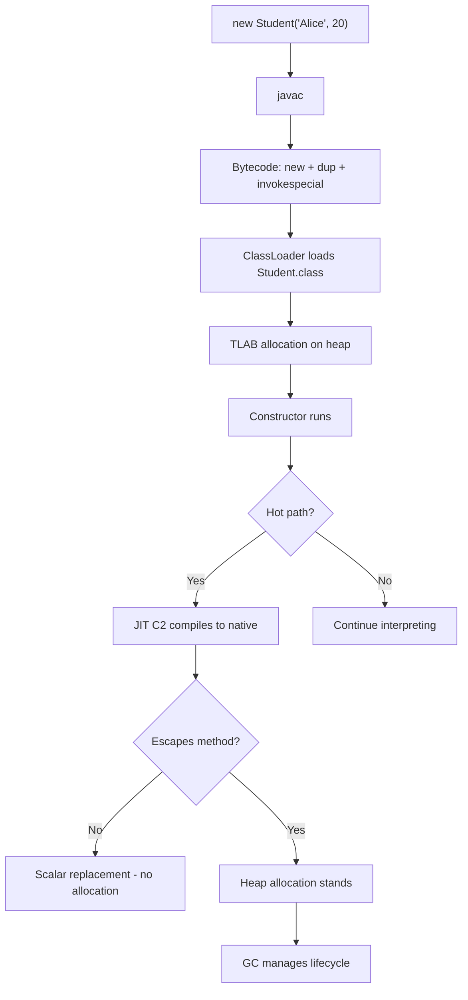
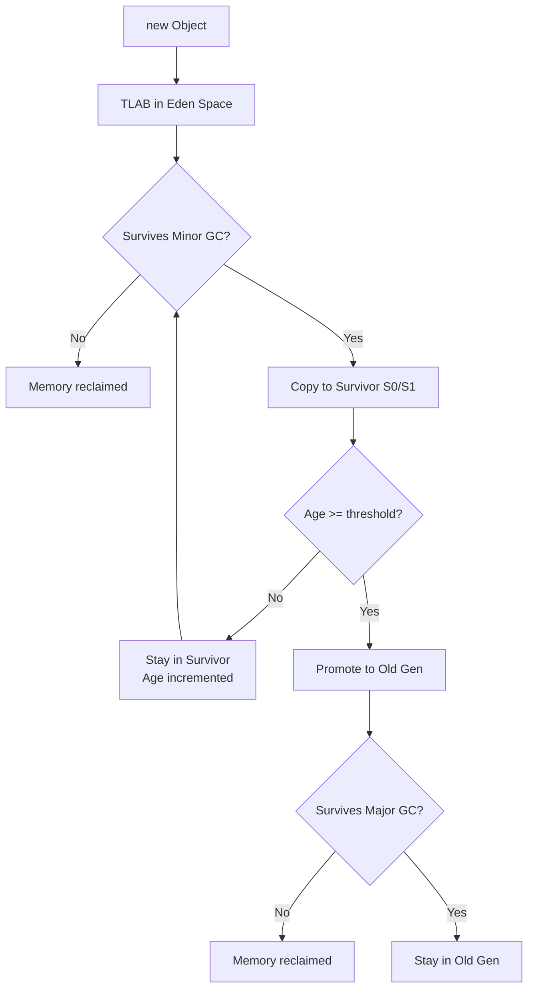
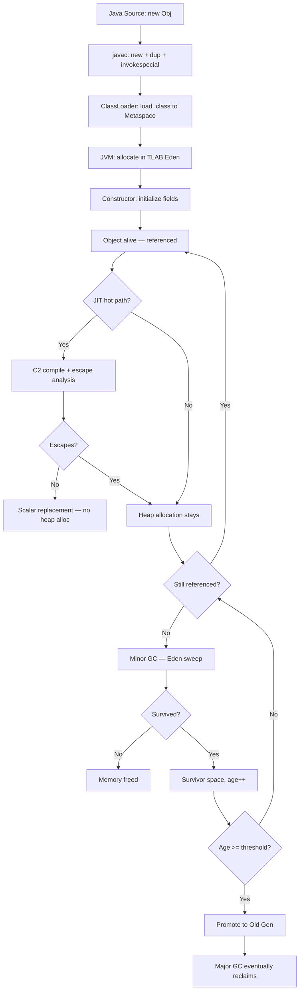
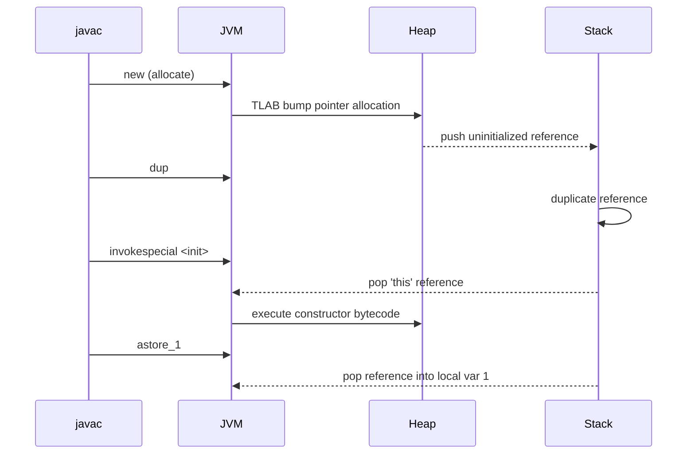
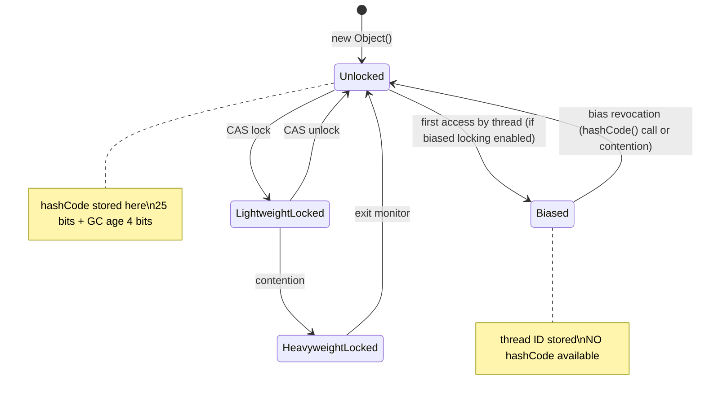

# Basics of OOP — Under the Hood

## Table of Contents

1. [Introduction](#introduction)
2. [How It Works Internally](#how-it-works-internally)
3. [JVM Deep Dive](#jvm-deep-dive)
4. [Bytecode Analysis](#bytecode-analysis)
5. [JIT Compilation](#jit-compilation)
6. [Memory Layout](#memory-layout)
7. [GC Internals](#gc-internals)
8. [Source Code Walkthrough](#source-code-walkthrough)
9. [Performance Internals](#performance-internals)
10. [Edge Cases at the Lowest Level](#edge-cases-at-the-lowest-level)
11. [Test](#test)
12. [Tricky Questions](#tricky-questions)
13. [Summary](#summary)
14. [Further Reading](#further-reading)
15. [Diagrams & Visual Aids](#diagrams--visual-aids)

---

## Introduction

> Focus: "What happens under the hood?"

This document explores what the JVM does internally when you create objects, call methods, and use OOP features. For developers who want to understand:
- What bytecode `javac` generates for `new`, constructors, field access, and method calls
- How the JIT compiler (C1/C2) optimizes object creation and virtual dispatch
- How the GC manages object lifecycle (allocation, promotion, collection)
- What the mark word contains and how it changes during an object's life
- How `invokespecial`, `invokevirtual`, and `invokeinterface` differ at the bytecode level

---

## How It Works Internally

Step-by-step breakdown of what happens when the JVM executes `new Student("Alice", 20)`:

1. **Source code:** `Student s = new Student("Alice", 20);`
2. **javac compiles to bytecode:**
   - `new` instruction — allocates memory, pushes uninitialized reference
   - `dup` — duplicates the reference (one for constructor, one for assignment)
   - `ldc "Alice"` — push string constant
   - `bipush 20` — push integer constant
   - `invokespecial Student.<init>(Ljava/lang/String;I)V` — call constructor
   - `astore_1` — store reference in local variable
3. **Class Loading:** ClassLoader loads `Student.class` into Metaspace
4. **TLAB allocation:** JVM allocates object in Thread-Local Allocation Buffer (bump pointer)
5. **Constructor execution:** Fields initialized, `<init>` bytecode runs
6. **JIT compilation:** After ~10,000 invocations, C2 compiles the hot path to native code
7. **Escape analysis:** If object does not escape, JIT may eliminate allocation entirely
8. **GC:** When unreachable, GC reclaims memory (Young Gen → Old Gen promotion if long-lived)



---

## JVM Deep Dive

### Object Allocation in Detail

**TLAB (Thread-Local Allocation Buffer):**

Every thread has a private region in Eden space. Allocation is a simple bump-pointer operation — no synchronization needed.

```
Thread 1 TLAB:                    Thread 2 TLAB:
┌────────────────────────┐       ┌────────────────────────┐
│ [Object A] [Object B]  │       │ [Object X] [Object Y]  │
│ ▲ allocation pointer   │       │ ▲ allocation pointer   │
│ ···· free space ····   │       │ ···· free space ····   │
└────────────────────────┘       └────────────────────────┘
```

**Allocation fast path (pseudocode from HotSpot):**

```cpp
// From hotspot/src/share/vm/gc/shared/collectedHeap.inline.hpp
inline HeapWord* CollectedHeap::allocate_from_tlab(size_t size) {
    HeapWord* obj = thread->tlab().allocate(size);
    if (obj != NULL) return obj; // fast path: bump pointer
    return allocate_from_tlab_slow(size); // slow path: refill TLAB or Eden
}
```

**Cost:** TLAB allocation takes ~4-5ns. This is why "object creation is expensive" is a myth on modern JVMs.

### Object Header Deep Dive

The mark word (first 8 bytes) changes depending on the object's state:

```
64-bit Mark Word Layout:
┌────────────────────────────────────────────────────────────────┐
│ 64 bits                                                       │
├─────────┬───────┬──────┬──────┬───────────────────────────────┤
│ Unused  │ Hash  │ Age  │ Bias │ Lock                          │
│ 25 bits │25 bits│4 bits│1 bit │ 2 bits                        │
├─────────┴───────┴──────┴──────┴───────────────────────────────┤
│ Normal (unlocked):  hashCode | age | 0 | 01                  │
│ Biased lock:        thread_id | epoch | age | 1 | 01         │
│ Lightweight lock:   lock_record_ptr | 00                     │
│ Heavyweight lock:   monitor_ptr | 10                         │
│ GC mark:           forwarding_ptr | 11                       │
└───────────────────────────────────────────────────────────────┘
```

**Key insight:** The mark word is **overloaded** — different bits have different meanings depending on the lock state tag (last 2-3 bits). This is why computing `identityHashCode()` on a biased-locked object requires bias revocation.

### Virtual Method Dispatch (vtable)

When you call `obj.method()`, the JVM uses a **vtable** (virtual method table):

```
Student.class metadata (in Metaspace):
┌─────────────────────────────────┐
│ vtable                          │
│ [0] toString()  → Student impl  │
│ [1] equals()    → Student impl  │
│ [2] hashCode()  → Student impl  │
│ [3] introduce() → Student impl  │
│ [4] finalize()  → Object impl   │
│ ...                             │
└─────────────────────────────────┘

Runtime dispatch:
  klass_pointer → Student.class → vtable[index] → method address
```

**Bytecode differences:**
- `invokevirtual` — vtable dispatch (polymorphic, O(1) lookup)
- `invokespecial` — direct call (constructors, `super.method()`, `private` methods)
- `invokestatic` — direct call to static method
- `invokeinterface` — itable search (slower than vtable, interface dispatch)

---

## Bytecode Analysis

### Constructor Bytecode

```java
class Student {
    private String name;
    private int age;

    public Student(String name, int age) {
        this.name = name;
        this.age = age;
    }
}
```

**Disassembled with `javap -c -p Student.class`:**

```
public Student(java.lang.String, int);
  Code:
     0: aload_0              // push 'this' reference
     1: invokespecial #1     // call Object.<init>() — super constructor
     4: aload_0              // push 'this'
     5: aload_1              // push 'name' parameter
     6: putfield #2          // this.name = name
     9: aload_0              // push 'this'
    10: iload_2              // push 'age' parameter
    11: putfield #3          // this.age = age
    14: return
```

**Key observations:**
- Every constructor starts by calling `super()` (Object.<init>) via `invokespecial`
- Field assignments use `putfield` (instance) or `putstatic` (static)
- `this` is always at local variable index 0 (`aload_0`)

### Object Creation Bytecode

```java
Student s = new Student("Alice", 20);
```

```
0: new           #4    // allocate memory for Student (returns uninitialized ref)
3: dup                  // duplicate reference on stack
4: ldc           #5    // push "Alice" from constant pool
6: bipush        20    // push integer 20
8: invokespecial #6    // call Student.<init>(String, int)
11: astore_1           // store initialized reference in local var 1
```

**Why `dup`?** The `new` instruction returns a reference, but `invokespecial` consumes it (as `this`). The `dup` ensures one copy is consumed by the constructor and the other is stored in the variable.

### equals() Override Bytecode

```java
@Override
public boolean equals(Object obj) {
    if (this == obj) return true;
    if (obj == null || getClass() != obj.getClass()) return false;
    Student other = (Student) obj;
    return age == other.age && name.equals(other.name);
}
```

```
public boolean equals(java.lang.Object);
  Code:
     0: aload_0
     1: aload_1
     2: if_acmpne     7      // if (this != obj) goto 7
     5: iconst_1
     6: ireturn               // return true
     7: aload_1
     8: ifnull        22     // if (obj == null) goto 22
    11: aload_0
    12: invokevirtual #7     // this.getClass()
    15: aload_1
    16: invokevirtual #7     // obj.getClass()
    19: if_acmpeq     24     // if (same class) goto 24
    22: iconst_0
    23: ireturn               // return false
    24: aload_1
    25: checkcast     #4     // cast obj to Student
    28: astore_2              // store as 'other'
    29: aload_0
    30: getfield      #3     // this.age
    33: aload_2
    34: getfield      #3     // other.age
    37: if_icmpne     54     // if (ages differ) goto false
    40: aload_0
    41: getfield      #2     // this.name
    44: aload_2
    45: getfield      #2     // other.name
    48: invokevirtual #8     // name.equals(other.name)
    51: ireturn
    54: iconst_0
    55: ireturn
```

---

## JIT Compilation

### Escape Analysis and Scalar Replacement

The C2 JIT compiler performs escape analysis to determine if an object reference leaves the method. If not, it can be **scalar replaced** — decomposed into individual local variables.

```java
// Before JIT optimization:
int distance(int x1, int y1, int x2, int y2) {
    Point a = new Point(x1, y1);  // heap allocation
    Point b = new Point(x2, y2);  // heap allocation
    return a.distanceTo(b);
}

// After C2 escape analysis + scalar replacement:
// Point objects eliminated, fields become local variables:
int distance(int x1, int y1, int x2, int y2) {
    // a.x = x1, a.y = y1, b.x = x2, b.y = y2 — all on stack
    int dx = x1 - x2;
    int dy = y1 - y2;
    return (int) Math.sqrt(dx * dx + dy * dy);
}
```

**Verify with JVM flags:**

```bash
java -XX:+PrintCompilation \
     -XX:+UnlockDiagnosticVMOptions \
     -XX:+PrintInlining \
     -XX:+PrintEscapeAnalysis \
     -XX:+PrintEliminateAllocations \
     -jar app.jar
```

### Virtual Call Devirtualization

When the JIT detects that a virtual method call always resolves to the same implementation (monomorphic site), it **devirtualizes** the call — replacing vtable dispatch with a direct call or even inlining.

```
// Bytecode: invokevirtual Student.toString()
// JIT profile: 100% of calls go to Student.toString()

// Before JIT:
movq rax, [obj + klass_offset]  // load klass pointer
movq rax, [rax + vtable_offset] // load vtable entry
call rax                         // indirect call

// After devirtualization:
cmpq [obj + klass_offset], Student.klass  // type guard
jne  uncommon_trap                         // deoptimize if different type
call Student.toString_compiled             // direct call (or inlined)
```

**Megamorphic sites** (3+ receiver types) use inline cache or full vtable lookup, which is 3-5x slower.

---

## Memory Layout

### Detailed Object Layout with JOL

```java
import org.openjdk.jol.info.ClassLayout;

public class Main {
    public static void main(String[] args) {
        System.out.println(ClassLayout.parseInstance(new Student("Alice", 20)).toPrintable());
    }
}
```

**Output (64-bit JVM, compressed oops):**

```
Student object internals:
OFF  SZ               TYPE DESCRIPTION                    VALUE
  0   8                    (object header: mark word)      0x0000000000000001
  8   4                    (object header: klass pointer)  0x00c00840
 12   4            int     Student.age                     20
 16   4   java.lang.String Student.name                    (object)
 20   4                    (object alignment gap)
Instance size: 24 bytes
Space losses: 0 bytes internal + 4 bytes external = 4 bytes total
```

**Field ordering:** The JVM places fields by size (long/double first, then int/float, then short/char, then byte/boolean, then references). This minimizes internal padding.

### Array Object Layout

```
int[] array = new int[5]:
┌─────────────────────────────────┐
│ Mark Word          (8 bytes)    │
│ Klass Pointer      (4 bytes)    │
│ Array Length        (4 bytes)    │ ← arrays have extra 4-byte length field
│ [0] int            (4 bytes)    │
│ [1] int            (4 bytes)    │
│ [2] int            (4 bytes)    │
│ [3] int            (4 bytes)    │
│ [4] int            (4 bytes)    │
└─────────────────────────────────┘
Total: 8 + 4 + 4 + (5 × 4) = 36 bytes → padded to 40 bytes
```

---

## GC Internals

### Object Lifecycle Through GC Generations



### GC Age in the Mark Word

The mark word stores the object's **GC age** (4 bits = max 15). Each time an object survives a minor GC, its age increments. When age reaches `-XX:MaxTenuringThreshold` (default 15 for G1GC), the object is promoted to Old Gen.

```bash
# Verify tenuring behavior
java -XX:+PrintTenuringDistribution -XX:MaxTenuringThreshold=6 -jar app.jar

# Output:
# Desired survivor size 2097152 bytes, new threshold 6 (max 6)
# - age   1:     524288 bytes,     524288 total
# - age   2:     262144 bytes,     786432 total
# - age   3:     131072 bytes,     917504 total
```

### Humongous Objects (G1GC)

Objects larger than half a G1 region (default region size = heap / 2048, minimum 1MB) are allocated directly in the Old Gen as **humongous objects**. They skip Eden entirely and are expensive to collect.

```java
// This creates a humongous object if region size is 1MB
byte[] huge = new byte[600_000]; // ~600KB — humongous in 1MB region

// Avoid: use byte buffer pooling or stream processing
```

---

## Source Code Walkthrough

### Object.hashCode() in HotSpot

From `hotspot/src/share/vm/runtime/synchronizer.cpp`:

```cpp
// The identity hash code is computed lazily and stored in the mark word
intptr_t ObjectSynchronizer::identity_hash_value_for(Handle obj) {
    markOop mark = obj->mark();
    if (mark->is_neutral()) {
        // Object is unlocked — hash may already be stored
        intptr_t hash = mark->hash();
        if (hash != 0) return hash; // return cached hash
    }
    // Compute and install hash
    hash = get_next_hash(Thread::current(), obj());
    // ... install hash in mark word (may require inflation)
    return hash;
}
```

**Hash generation strategies** (`-XX:hashCode=N`):

| Value | Strategy | Description |
|:-----:|----------|-------------|
| 0 | Park-Miller RNG | Global random number generator |
| 1 | Address-based | Object address XORed with thread-local RNG |
| 2 | Always 1 | Testing/debugging only |
| 3 | Sequence counter | Monotonically increasing |
| 4 | Object address | Memory address cast to int |
| **5** | **Marsaglia XOR-shift** | **Default since JDK 8 — thread-local, fast** |

### Object.<init> in the JVM Spec

From JVM Specification Section 2.9.1:
> The special method `<init>` is called an **instance initialization method**. A class can have multiple `<init>` methods (constructor overloading). Before `<init>` returns, it must invoke either another `<init>` of the same class or an `<init>` of the direct superclass.

**Constraint:** The JVM enforces that `<init>` must call `super.<init>()` before accessing any instance fields. This is a bytecode-level check, not just a Java language rule.

---

## Performance Internals

### TLAB Sizing and Refill

```bash
# TLAB diagnostic flags
java -XX:+PrintTLAB \
     -XX:TLABSize=256k \
     -XX:MinTLABSize=2k \
     -XX:TLABRefillWasteFraction=64 \
     -jar app.jar
```

**TLAB refill waste fraction:** If the remaining space in TLAB is less than `TLABSize / TLABRefillWasteFraction`, the JVM discards the remaining space and allocates a new TLAB. Lower values = less waste but more frequent refills.

### Compressed Oops

On 64-bit JVMs with heap < 32GB, **compressed oops** (`-XX:+UseCompressedOops`, enabled by default) reduces object reference size from 8 bytes to 4 bytes:

```
Without compressed oops:        With compressed oops:
Reference: 8 bytes              Reference: 4 bytes
Mark word: 8 bytes              Mark word: 8 bytes
Klass ptr: 8 bytes              Klass ptr: 4 bytes
Header: 16 bytes                Header: 12 bytes
```

**Impact:** A `HashMap.Node` object shrinks from ~48 bytes to ~32 bytes — a 33% reduction. For heap sizes > 32GB, compressed oops are disabled and all references become 8 bytes.

### Object Alignment and False Sharing

JVM aligns objects to 8-byte boundaries. In concurrent code, if two objects are in the same **cache line** (64 bytes on x86), modifying one invalidates the cache for the other thread — **false sharing**.

```java
// ❌ False sharing — both counters in the same cache line
class Counters {
    volatile long counter1; // bytes 16-23
    volatile long counter2; // bytes 24-31 — same cache line!
}

// ✅ Padding to separate cache lines (Java 8+ @Contended)
@jdk.internal.vm.annotation.Contended
class Counter1 { volatile long value; }

@jdk.internal.vm.annotation.Contended
class Counter2 { volatile long value; }
```

---

## Edge Cases at the Lowest Level

### Edge Case 1: Object Resurrection in finalize()

```java
class Zombie {
    static Zombie INSTANCE;

    @Override
    protected void finalize() {
        INSTANCE = this; // resurrects the object!
    }
}

// Object lifecycle:
// 1. Zombie z = new Zombie(); → alive
// 2. z = null; → eligible for GC
// 3. GC runs finalize() → INSTANCE = this → alive again!
// 4. INSTANCE = null → eligible again
// 5. finalize() NOT called again (only called once per object)
// 6. Object is collected without finalize()
```

**Key insight:** `finalize()` is called **at most once** per object. A resurrected object will NOT have `finalize()` called again. This is one reason `finalize()` was deprecated.

### Edge Case 2: Class Unloading and Static Fields

Static fields are stored in the `Class` object, which resides in Metaspace. They are only collected when the ClassLoader that loaded the class is garbage collected.

```java
// In a web application with hot-reloading:
// Old ClassLoader → Old Student.class → static studentCount = 1000
// New ClassLoader → New Student.class → static studentCount = 0
// Both exist simultaneously until old ClassLoader is GC'd
```

This is why static mutable state causes memory leaks in application servers — the old ClassLoader cannot be GC'd if anything references the old static field.

### Edge Case 3: Uninitialized Object Reference

Between `new` (allocation) and `invokespecial` (constructor), the object exists in an **uninitialized** state. The JVM bytecode verifier ensures you cannot use an uninitialized reference — but native code or crafted bytecode can observe it.

```
// Bytecode sequence:
new Student         // allocate — fields are zero-initialized (null, 0, false)
// At this point, the object exists but the constructor has NOT run
// The verifier prevents any getfield/putfield/invokevirtual on this reference
dup
ldc "Alice"
bipush 20
invokespecial Student.<init>  // NOW the object is initialized
astore_1                      // NOW safe to use
```

---

## Test

**1. What JVM instruction is used to call a constructor?**

- A) invokevirtual
- B) invokestatic
- C) invokespecial
- D) invokedynamic

<details>
<summary>Answer</summary>

**C)** — `invokespecial` is used for constructors (`<init>`), `super.method()` calls, and `private` method calls. It performs a **direct** call (no vtable lookup). `invokevirtual` is for regular instance methods.

</details>

**2. What is the default identity hashCode generation strategy in HotSpot JDK 8+?**

- A) Memory address
- B) Random number
- C) Marsaglia XOR-shift (thread-local)
- D) Sequence counter

<details>
<summary>Answer</summary>

**C)** — `-XX:hashCode=5` (Marsaglia XOR-shift) is the default since JDK 8. It is fast (no synchronization), well-distributed, and thread-local. The memory address strategy (`-XX:hashCode=4`) is NOT the default despite the common myth.

</details>

**3. Why does `dup` appear between `new` and `invokespecial` in bytecode?**

- A) It is a JVM optimization
- B) One reference is consumed by the constructor (`this`), the other is stored in the variable
- C) It creates a copy of the object
- D) It is a bug in javac

<details>
<summary>Answer</summary>

**B)** — `new` pushes one reference. `invokespecial` (the constructor) pops it as `this`. Without `dup`, we would have no reference left to store in the local variable. `dup` duplicates the reference: one for the constructor, one for `astore`.

</details>

**4. What happens to the mark word when `hashCode()` is first called on an object?**

<details>
<summary>Answer</summary>

The hash is computed (using the configured hash strategy, default Marsaglia XOR-shift) and **stored in the mark word** in the 25-bit hash field. For biased-locked objects, bias revocation occurs first (a safepoint operation) because the hash bits and the biased thread ID share the same space. Once stored, the hash never changes — even if the object is moved by GC.

</details>

---

## Tricky Questions

**1. Can the JVM allocate an object on the stack instead of the heap?**

- A) Never — Java objects are always heap-allocated
- B) Yes — via escape analysis and scalar replacement
- C) Only for primitive wrappers (Integer, Boolean)
- D) Only with -XX:+StackAllocation flag

<details>
<summary>Answer</summary>

**B)** — The C2 JIT compiler performs escape analysis. If an object does not escape the method, it can be **scalar replaced** — its fields become local variables on the stack. Technically, the "object" never exists as a contiguous memory block on the stack; its fields are decomposed into individual stack slots or registers. This is not true stack allocation but achieves the same effect (zero GC pressure).

</details>

**2. What is the overhead of an empty `new Object()` on a 64-bit JVM with compressed oops?**

- A) 0 bytes — the JIT eliminates it
- B) 8 bytes
- C) 12 bytes
- D) 16 bytes

<details>
<summary>Answer</summary>

**D)** — 8 bytes mark word + 4 bytes compressed klass pointer = 12 bytes header. But JVM aligns objects to 8-byte boundaries, so 4 bytes of padding are added: 12 + 4 = **16 bytes**. If escape analysis eliminates the allocation (answer A scenario), then the effective overhead is 0 — but the question asks about the allocation size, not whether it happens.

</details>

**3. Why was biased locking deprecated in Java 15?**

<details>
<summary>Answer</summary>

Biased locking was deprecated (JEP 374) because:
1. **Conflicts with identity hashCode** — computing hashCode requires bias revocation (safepoint)
2. **Complex codebase** — biased locking adds significant complexity to the HotSpot runtime
3. **Modern hardware** — CAS operations are fast on modern CPUs, reducing the benefit
4. **Safepoint overhead** — bias revocation requires a global safepoint, stalling all threads
5. **Container environments** — short-lived JVMs (common in cloud) rarely benefit from biased locking's warmup phase

</details>

---

## Summary

- Object allocation in TLAB is ~4ns (bump pointer) — creation is cheap, GC is the real cost
- The mark word (8 bytes) is overloaded: stores hashCode, GC age, lock state, and biased thread ID
- `javac` generates `new` + `dup` + `invokespecial` for object creation — `dup` ensures both constructor and assignment get a reference
- C2 JIT performs escape analysis and scalar replacement — non-escaping objects have zero heap allocation
- Virtual dispatch uses vtable (O(1) lookup) — JIT devirtualizes monomorphic call sites
- Compressed oops (default for heap < 32GB) save 4 bytes per reference — significant at scale
- Identity hashCode is computed lazily using Marsaglia XOR-shift and stored permanently in the mark word

---

## Further Reading

- **JVM Spec:** [Chapter 2.9 — Special Methods](https://docs.oracle.com/javase/specs/jvms/se17/html/jvms-2.html#jvms-2.9) — `<init>` and `<clinit>` specification
- **Blog:** [Aleksey Shipilev — JVM Anatomy Quarks #4: TLAB Allocation](https://shipilev.net/jvm/anatomy-quarks/4-tlab-allocation/)
- **Blog:** [Aleksey Shipilev — JVM Anatomy Quarks #25: Implicit Null Checks](https://shipilev.net/jvm/anatomy-quarks/25-implicit-null-checks/)
- **Tool:** [JOL — Java Object Layout](https://openjdk.org/projects/code-tools/jol/)
- **JEP:** [JEP 374: Deprecate and Disable Biased Locking](https://openjdk.org/jeps/374)
- **Book:** Java Performance (Scott Oaks), 2nd Edition — Chapters 4-7

---

## Diagrams & Visual Aids

### Complete Object Lifecycle in JVM



### Bytecode Execution: new Object()



### Mark Word State Transitions


