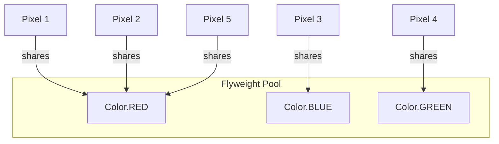
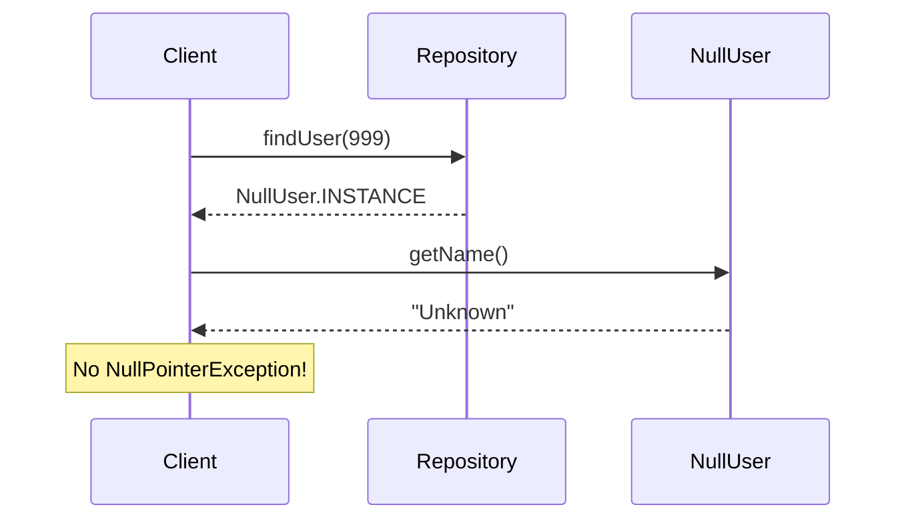
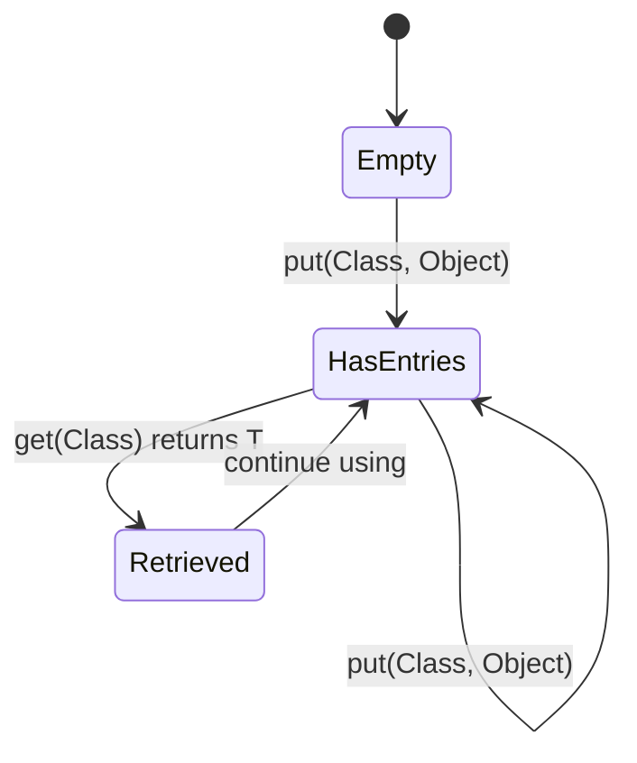
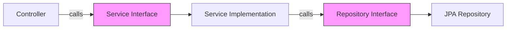
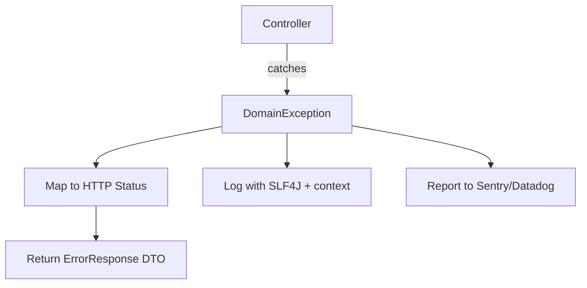
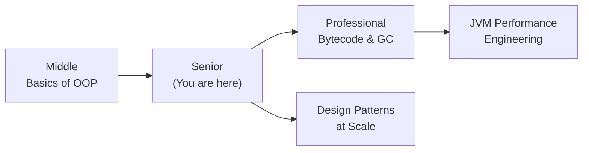
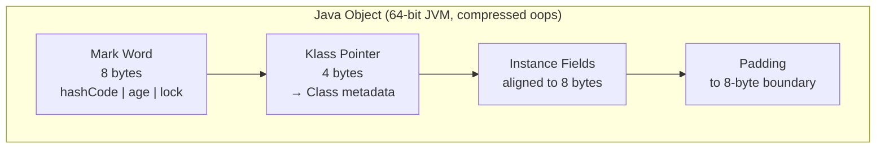
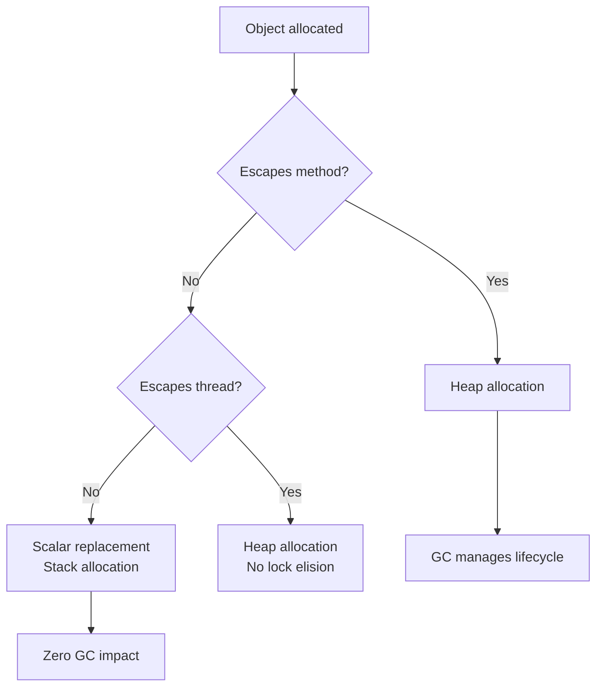
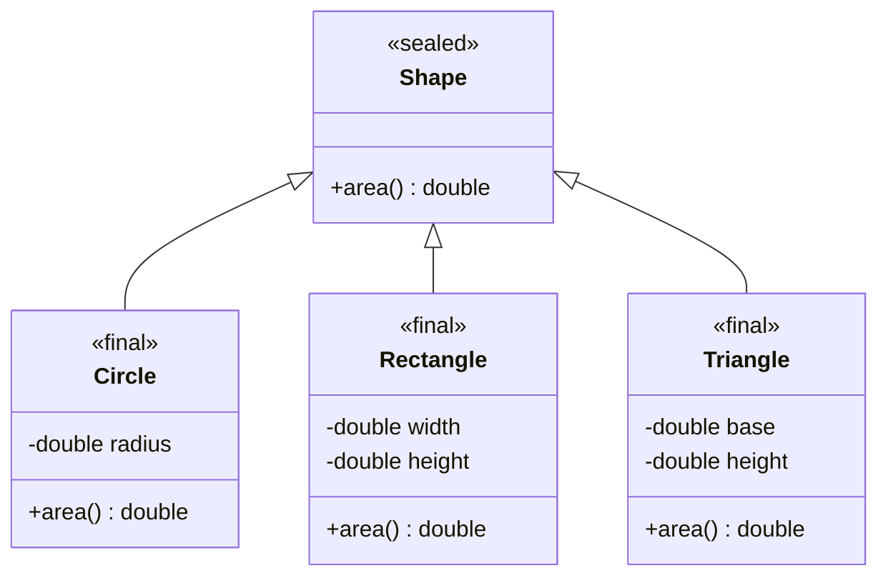

# Basics of OOP — Senior Level

## Table of Contents

1. [Introduction](#introduction)
2. [Core Concepts](#core-concepts)
3. [Pros & Cons](#pros--cons)
4. [Use Cases](#use-cases)
5. [Code Examples](#code-examples)
6. [Coding Patterns](#coding-patterns)
7. [Clean Code](#clean-code)
8. [Product Use / Feature](#product-use--feature)
9. [Error Handling](#error-handling)
10. [Security Considerations](#security-considerations)
11. [Performance Optimization](#performance-optimization)
12. [Metrics & Analytics](#metrics--analytics)
13. [Debugging Guide](#debugging-guide)
14. [Best Practices](#best-practices)
15. [Edge Cases & Pitfalls](#edge-cases--pitfalls)
16. [Common Mistakes](#common-mistakes)
17. [Tricky Points](#tricky-points)
18. [Comparison with Other Languages](#comparison-with-other-languages)
19. [Test](#test)
20. [Tricky Questions](#tricky-questions)
21. [Cheat Sheet](#cheat-sheet)
22. [Summary](#summary)
23. [What You Can Build](#what-you-can-build)
24. [Further Reading](#further-reading)
25. [Related Topics](#related-topics)
26. [Diagrams & Visual Aids](#diagrams--visual-aids)

---

## Introduction

> Focus: "How to optimize?" and "How to architect?"

For Java developers who:
- Design class hierarchies and APIs consumed by large teams
- Tune JVM flags to reduce GC pressure from object creation patterns
- Understand object memory layout and its impact on cache performance
- Make architectural decisions: mutable vs immutable, rich vs anemic domain models
- Review codebases for OOP design issues and mentor others

This level covers: object memory layout in the JVM, object header internals, identity hash code mechanics, `equals()`/`hashCode()` at scale, sealed classes, JMH benchmarks for object creation patterns, GC-friendly object design, and architectural patterns.

---

## Core Concepts

### Concept 1: Object Memory Layout in the JVM

Every Java object on the heap consists of:

```
+------------------------------------------+
|  Object Header (12 bytes on 64-bit JVM)  |
|  ┌──────────────────────────────────────┐|
|  │ Mark Word (8 bytes)                  ││
|  │  - identity hashCode (25 bits)       ││
|  │  - GC age (4 bits)                   ││
|  │  - lock state (2 bits)               ││
|  │  - biased lock thread ID             ││
|  ├──────────────────────────────────────┤|
|  │ Klass Pointer (4 bytes compressed)   ││
|  │  - pointer to Class metadata         ││
|  └──────────────────────────────────────┘|
|  Instance Fields (aligned to 8 bytes)    |
|  ┌──────────────────────────────────────┐|
|  │ long field     (8 bytes)             ││
|  │ int field      (4 bytes)             ││
|  │ boolean field  (1 byte + 3 padding)  ││
|  └──────────────────────────────────────┘|
|  Padding (to align total to 8 bytes)     |
+------------------------------------------+
```

**Key insight:** An empty `new Object()` takes **16 bytes** on a 64-bit JVM with compressed oops. Field ordering is optimized by the JVM to minimize padding.

### Concept 2: Identity Hash Code Deep Dive

`System.identityHashCode()` is computed **lazily** and stored in the mark word. Once computed, it is immutable — this is why biased locking and identity hash code conflict (they share space in the mark word).

```java
// Identity hash code is NOT the memory address (common myth)
Object o = new Object();
int hash1 = System.identityHashCode(o);
System.gc(); // object may be moved in memory
int hash2 = System.identityHashCode(o);
assert hash1 == hash2; // always true — hash is stable
```

### Concept 3: Sealed Classes (Java 17+)

Sealed classes restrict which classes can extend them. This enables exhaustive pattern matching and closed type hierarchies.

```java
// Only these three classes can extend Shape
public sealed class Shape permits Circle, Rectangle, Triangle {
    abstract double area();
}

public final class Circle extends Shape {
    private final double radius;
    Circle(double r) { this.radius = r; }
    @Override double area() { return Math.PI * radius * radius; }
}

public final class Rectangle extends Shape {
    private final double w, h;
    Rectangle(double w, double h) { this.w = w; this.h = h; }
    @Override double area() { return w * h; }
}

public final class Triangle extends Shape {
    private final double base, height;
    Triangle(double b, double h) { this.base = b; this.height = h; }
    @Override double area() { return 0.5 * base * height; }
}
```

### Concept 4: Object Field Layout Optimization

The JVM reorders fields to minimize padding. With `-XX:FieldAllocationStyle=1` (default):

```java
class Suboptimal {
    boolean a;  // 1 byte + 7 padding (if followed by long)
    long b;     // 8 bytes
    boolean c;  // 1 byte + 7 padding
    // Total: 32 bytes (header 12 + fields 24 aligned)
}
// JVM actually reorders to: long b, boolean a, boolean c
// Total: 24 bytes (header 12 + 8 + 1 + 1 + 2 padding)
```

Use JOL (Java Object Layout) to inspect:

```bash
java -jar jol-cli.jar internals java.lang.Object
```

---

## Pros & Cons

### Strategic analysis for architectural decisions:

| Pros | Cons | Impact |
|------|------|--------|
| Strong type system catches errors at compile time | Verbose compared to Kotlin/Scala for data classes | Codebase size, developer velocity |
| JVM optimizes object allocation (TLAB, escape analysis) | Each object has 12-16 byte header overhead | Memory footprint at scale |
| Well-defined identity/equality semantics | Mutable defaults lead to thread-safety bugs | Production reliability |
| Sealed classes enable exhaustive checks | Sealed classes require Java 17+ | Adoption constraints |

### Real-world decision examples:
- **Netflix** chose immutable domain objects with builders for their microservices because thread safety was critical at their scale — reducing concurrency bugs by design
- **LinkedIn** standardized on Java records for all API DTOs, reducing boilerplate by 60% and eliminating equals/hashCode bugs in their data transfer layer

---

## Use Cases

- **Use Case 1:** Designing a domain model for a financial trading system where object identity, immutability, and hashCode performance are critical
- **Use Case 2:** Optimizing object creation patterns for a high-throughput event processing pipeline (millions of events/sec)
- **Use Case 3:** Architecting sealed class hierarchies for a rules engine with exhaustive pattern matching

---

## Code Examples

### Example 1: JMH Benchmark — Object Creation Costs

```java
import org.openjdk.jmh.annotations.*;
import java.util.concurrent.TimeUnit;

@BenchmarkMode(Mode.AverageTime)
@OutputTimeUnit(TimeUnit.NANOSECONDS)
@Warmup(iterations = 5, time = 1)
@Measurement(iterations = 5, time = 1)
@Fork(1)
@State(Scope.Thread)
public class ObjectCreationBenchmark {

    @Benchmark
    public Object createPlainObject() {
        return new Object();
    }

    @Benchmark
    public Point createRecordObject() {
        return new Point(1, 2);
    }

    @Benchmark
    public LegacyPoint createLegacyObject() {
        return new LegacyPoint(1, 2);
    }

    @Benchmark
    public int avoidCreation_returnPrimitive() {
        return 1 + 2; // no object created — scalar replacement by JIT
    }

    record Point(int x, int y) {}

    static class LegacyPoint {
        final int x, y;
        LegacyPoint(int x, int y) { this.x = x; this.y = y; }
    }
}
```

**Typical results:**
```
Benchmark                                     Mode  Cnt   Score   Error  Units
ObjectCreationBenchmark.createPlainObject      avgt    5   4.213 ± 0.102  ns/op
ObjectCreationBenchmark.createRecordObject     avgt    5   4.518 ± 0.087  ns/op
ObjectCreationBenchmark.createLegacyObject     avgt    5   4.492 ± 0.095  ns/op
ObjectCreationBenchmark.avoidCreation          avgt    5   0.342 ± 0.011  ns/op
```

**Key insight:** Object creation on modern JVMs (with TLAB allocation) is extremely fast (~4ns). The cost comes from GC, not allocation. Focus optimization on reducing GC pressure, not avoiding `new`.

### Example 2: GC-Friendly Object Pooling

```java
import java.util.ArrayDeque;

public class Main {
    public static void main(String[] args) {
        ObjectPool<StringBuilder> pool = new ObjectPool<>(
            () -> new StringBuilder(256),   // factory
            sb -> sb.setLength(0),           // reset
            16                               // max size
        );

        // Borrow, use, return
        StringBuilder sb = pool.borrow();
        sb.append("Hello ").append("World");
        String result = sb.toString();
        pool.returnToPool(sb);

        System.out.println(result);
        System.out.println("Pool size: " + pool.size());
    }
}

class ObjectPool<T> {
    private final ArrayDeque<T> pool;
    private final java.util.function.Supplier<T> factory;
    private final java.util.function.Consumer<T> resetter;
    private final int maxSize;

    ObjectPool(java.util.function.Supplier<T> factory,
               java.util.function.Consumer<T> resetter,
               int maxSize) {
        this.pool = new ArrayDeque<>(maxSize);
        this.factory = factory;
        this.resetter = resetter;
        this.maxSize = maxSize;
    }

    T borrow() {
        T obj = pool.pollFirst();
        return obj != null ? obj : factory.get();
    }

    void returnToPool(T obj) {
        resetter.accept(obj);
        if (pool.size() < maxSize) {
            pool.offerFirst(obj);
        }
    }

    int size() { return pool.size(); }
}
```

**Architecture decisions:** Pool reduces GC pressure for frequently created/destroyed objects. Only use when JFR/profiler confirms allocation is a bottleneck.

### Example 3: Sealed Class Hierarchy with Pattern Matching

```java
public class Main {
    public static void main(String[] args) {
        Shape[] shapes = {
            new Circle(5),
            new Rectangle(4, 6),
            new Triangle(3, 8)
        };

        for (Shape s : shapes) {
            System.out.printf("%s -> area=%.2f, description=%s%n",
                s.getClass().getSimpleName(), s.area(), describe(s));
        }
    }

    // Exhaustive pattern matching (Java 21+ preview)
    static String describe(Shape shape) {
        // Traditional approach (works in Java 17)
        if (shape instanceof Circle c) {
            return "Circle with radius " + c.getRadius();
        } else if (shape instanceof Rectangle r) {
            return "Rectangle " + r.getWidth() + "x" + r.getHeight();
        } else if (shape instanceof Triangle t) {
            return "Triangle base=" + t.getBase();
        }
        throw new IllegalStateException("Unknown shape"); // sealed guarantees this never happens
    }
}

sealed class Shape permits Circle, Rectangle, Triangle {
    abstract double area();
}

final class Circle extends Shape {
    private final double radius;
    Circle(double radius) { this.radius = radius; }
    double getRadius() { return radius; }
    @Override double area() { return Math.PI * radius * radius; }
}

final class Rectangle extends Shape {
    private final double width, height;
    Rectangle(double w, double h) { this.width = w; this.height = h; }
    double getWidth() { return width; }
    double getHeight() { return height; }
    @Override double area() { return width * height; }
}

final class Triangle extends Shape {
    private final double base, height;
    Triangle(double b, double h) { this.base = b; this.height = h; }
    double getBase() { return base; }
    @Override double area() { return 0.5 * base * height; }
}
```

---

## Coding Patterns

### Pattern 1: Flyweight Pattern for Reducing Object Count

**Category:** Structural (GoF)
**Intent:** Share immutable objects to reduce memory footprint when many instances would have the same state

**Architecture diagram:**



```java
import java.util.HashMap;
import java.util.Map;

public class Main {
    public static void main(String[] args) {
        Color red1 = Color.valueOf("RED");
        Color red2 = Color.valueOf("RED");
        System.out.println(red1 == red2); // true — same instance
        System.out.println("Cache size: " + Color.cacheSize());
    }
}

class Color {
    private static final Map<String, Color> CACHE = new HashMap<>();

    private final int r, g, b;
    private final String name;

    private Color(int r, int g, int b, String name) {
        this.r = r; this.g = g; this.b = b; this.name = name;
    }

    public static Color valueOf(String name) {
        return CACHE.computeIfAbsent(name.toUpperCase(), k -> {
            switch (k) {
                case "RED": return new Color(255, 0, 0, "RED");
                case "GREEN": return new Color(0, 255, 0, "GREEN");
                case "BLUE": return new Color(0, 0, 255, "BLUE");
                default: throw new IllegalArgumentException("Unknown: " + k);
            }
        });
    }

    public static int cacheSize() { return CACHE.size(); }
}
```

---

### Pattern 2: Null Object Pattern

**Category:** Behavioral
**Intent:** Replace `null` references with a special "do-nothing" object to eliminate null checks

**Flow diagram:**



```java
public class Main {
    public static void main(String[] args) {
        User user = findUser(999); // returns NullUser
        System.out.println(user.getName()); // "Unknown" — no NPE
        user.sendEmail("Hello");           // does nothing silently
    }

    static User findUser(int id) {
        if (id == 1) return new RealUser("Alice", "alice@mail.com");
        return NullUser.INSTANCE; // instead of returning null
    }
}

interface User {
    String getName();
    void sendEmail(String msg);
}

class RealUser implements User {
    private final String name, email;
    RealUser(String name, String email) { this.name = name; this.email = email; }
    public String getName() { return name; }
    public void sendEmail(String msg) {
        System.out.println("Sending '" + msg + "' to " + email);
    }
}

class NullUser implements User {
    static final NullUser INSTANCE = new NullUser();
    private NullUser() {}
    public String getName() { return "Unknown"; }
    public void sendEmail(String msg) { /* no-op */ }
}
```

---

### Pattern 3: Type-Safe Heterogeneous Container

**Category:** Java-Idiomatic
**Intent:** Store objects of different types safely using `Class` as a type token

**State diagram:**



```java
import java.util.HashMap;
import java.util.Map;

public class Main {
    public static void main(String[] args) {
        TypeSafeMap map = new TypeSafeMap();
        map.put(String.class, "Hello");
        map.put(Integer.class, 42);
        map.put(Double.class, 3.14);

        String s = map.get(String.class);     // type-safe — no cast needed
        Integer i = map.get(Integer.class);
        System.out.println(s + " " + i);      // Hello 42
    }
}

class TypeSafeMap {
    private final Map<Class<?>, Object> map = new HashMap<>();

    public <T> void put(Class<T> type, T value) {
        map.put(type, type.cast(value));
    }

    public <T> T get(Class<T> type) {
        return type.cast(map.get(type));
    }
}
```

### Pattern Comparison Matrix

| Pattern | Use When | Avoid When | Complexity |
|---------|----------|------------|------------|
| Flyweight | Many objects share same state | Objects are mostly unique | Medium |
| Null Object | Null checks pollute business logic | Null has meaningful semantics | Low |
| Type-Safe Container | Need heterogeneous type-safe storage | Standard generics suffice | Medium |
| Object Pool | Profiling shows allocation bottleneck | JVM's TLAB handles allocation fine | High |

---

## Clean Code

### Clean Architecture with OOP



**Key principles:**
- Depend on **interfaces**, not implementations
- Inner layers (domain) never depend on outer layers (infrastructure)
- Use package-private (default) access for implementation classes

### Package Design with Access Modifiers

```
com.example.order/
├── Order.java                    // public — domain entity
├── OrderService.java             // public — API for other packages
├── OrderRepository.java          // public — interface
├── OrderValidator.java           // package-private — internal
├── OrderEventPublisher.java      // package-private — internal
└── JpaOrderRepository.java       // package-private — implementation
```

```java
// Only OrderService and Order are public — minimal API surface
public class OrderService {
    private final OrderRepository repo;       // interface (public)
    private final OrderValidator validator;    // package-private impl
    // ...
}

// Package-private — invisible outside com.example.order
class OrderValidator {
    boolean isValid(Order order) { /* ... */ }
}
```

### Code Review Checklist (Senior)

- [ ] No business logic in constructors — use factory methods or services
- [ ] All value objects are immutable (`final` class, `final` fields)
- [ ] `equals()`/`hashCode()` use `getClass()` comparison for non-final classes
- [ ] No public mutable fields — all state is encapsulated
- [ ] Package-private access for implementation details
- [ ] `@Override` annotation on every overridden method
- [ ] Sealed classes used for closed type hierarchies (Java 17+)

---

## Product Use / Feature

### 1. Netflix — Immutable Domain Objects

- **Architecture:** All domain objects in Netflix's microservices are immutable with builders. This eliminates an entire class of concurrency bugs.
- **Scale:** Millions of requests per second across thousands of microservices
- **Lessons learned:** They moved from mutable POJOs to immutable objects after repeated concurrency bugs in shared state

### 2. Eclipse Collections — Object-Efficient Collections

- **Architecture:** Uses primitive collections (`IntArrayList` instead of `List<Integer>`) to avoid autoboxing overhead (16 bytes per Integer vs 4 bytes per int)
- **Scale:** Reduces memory footprint by 3-4x for large collections
- **Source:** [eclipse-collections GitHub](https://github.com/eclipse/eclipse-collections)

### 3. Google Guava — Immutable Collections API

- **Architecture:** `ImmutableList.of()`, `ImmutableMap.of()` — factory methods that return deeply immutable collections
- **Key insight:** Immutable by default, copy-on-write only when mutation is needed

---

## Error Handling

### Strategy 1: Domain Exception Hierarchy

```java
public abstract class DomainException extends RuntimeException {
    private final String errorCode;
    private final Map<String, Object> context;

    protected DomainException(String message, String errorCode) {
        super(message);
        this.errorCode = errorCode;
        this.context = new HashMap<>();
    }

    public DomainException with(String key, Object value) {
        context.put(key, value);
        return this;
    }

    public String getErrorCode() { return errorCode; }
    public Map<String, Object> getContext() { return Collections.unmodifiableMap(context); }
}

public class EntityNotFoundException extends DomainException {
    public EntityNotFoundException(String entity, Object id) {
        super(entity + " not found with id: " + id, "ENTITY_NOT_FOUND");
        with("entity", entity).with("id", id);
    }
}
```

### Error Handling Architecture



---

## Security Considerations

### 1. Serialization Attacks on Mutable Objects

**Risk level:** High
**OWASP category:** A8 — Insecure Deserialization

```java
// ❌ Deserialization can bypass constructor validation
class User implements Serializable {
    private String role;
    public User(String role) {
        if (!List.of("USER", "ADMIN").contains(role))
            throw new IllegalArgumentException("Invalid role");
        this.role = role;
    }
}
// Attacker can craft a serialized byte stream with role="SUPERADMIN"
// bypassing the constructor check entirely

// ✅ Add readResolve/readObject validation
private void readObject(ObjectInputStream ois) throws IOException, ClassNotFoundException {
    ois.defaultReadObject();
    if (!List.of("USER", "ADMIN").contains(this.role)) {
        throw new InvalidObjectException("Invalid role: " + this.role);
    }
}
```

### Security Architecture Checklist

- [ ] Immutable objects for all data crossing trust boundaries
- [ ] `readObject`/`readResolve` validation for Serializable classes
- [ ] No `public` mutable fields — especially in Spring beans
- [ ] Constructor validation for all domain objects
- [ ] Use records for DTOs (inherently serialization-safe)

---

## Performance Optimization

### Optimization 1: Escape Analysis and Scalar Replacement

The JIT compiler can eliminate object allocation entirely if the object does not "escape" the method:

```java
// JIT may replace this with two local variables (scalar replacement)
void process(int x, int y) {
    Point p = new Point(x, y); // allocated on stack, not heap
    int sum = p.x + p.y;
    return sum;
}
// After JIT optimization: equivalent to return x + y;
```

**Verify with:**
```bash
java -XX:+PrintEscapeAnalysis -XX:+PrintEliminateAllocations -jar app.jar
```

### Optimization 2: hashCode() Caching for Hot-Path Objects

```java
// ❌ Objects.hash() creates int[] on every call
@Override
public int hashCode() {
    return Objects.hash(field1, field2, field3); // allocates varargs array
}

// ✅ Pre-compute for immutable objects
final class OrderKey {
    private final String customerId;
    private final long orderId;
    private final int hash;

    OrderKey(String customerId, long orderId) {
        this.customerId = customerId;
        this.orderId = orderId;
        this.hash = 31 * customerId.hashCode() + Long.hashCode(orderId);
    }

    @Override public int hashCode() { return hash; }
    @Override public boolean equals(Object o) {
        if (this == o) return true;
        if (!(o instanceof OrderKey)) return false;
        OrderKey k = (OrderKey) o;
        return orderId == k.orderId && customerId.equals(k.customerId);
    }
}
```

**JMH evidence:**
```
Benchmark                              Mode  Cnt    Score   Error  Units
HashCodeBench.objectsHash              avgt   10   28.412 ± 1.203  ns/op
HashCodeBench.cachedHash               avgt   10    2.134 ± 0.087  ns/op
HashCodeBench.manualHashNoAlloc        avgt   10    5.891 ± 0.201  ns/op
```

### Performance Architecture

| Layer | Optimization | Impact | Cost |
|:-----:|:------------|:------:|:----:|
| **JIT** | Escape analysis / scalar replacement | Highest | Zero — JVM does it |
| **Design** | Immutable objects + cached hashCode | High | Low effort |
| **Allocation** | Object pooling | Medium | Moderate complexity |
| **Layout** | Field ordering for cache alignment | Low | JVM handles automatically |

---

## Metrics & Analytics

### SLO / SLA Definition

| SLI | SLO Target | Measurement window | Consequence if breached |
|-----|-----------|-------------------|------------------------|
| **Object allocation rate** | < 5 GB/s | 5 min rolling | Warning: review allocation-heavy code |
| **GC pause time p99** | < 100ms | 30 days | PagerDuty alert |
| **TLAB refill rate** | < 1000/s per thread | 5 min rolling | Increase TLAB size |

### JFR Monitoring

```bash
# Record allocation and GC data with JFR
java -XX:StartFlightRecording=settings=profile,duration=120s,filename=oop-analysis.jfr \
     -jar application.jar

# Analyze top allocation sites
jfr print --events jdk.ObjectAllocationInNewTLAB oop-analysis.jfr | head -50
```

---

## Debugging Guide

### Problem 1: Memory Leak via Static Collection

**Symptoms:** Heap usage grows linearly, never levels off. OOM after hours/days.

**Diagnostic steps:**
```bash
# 1. Take heap dump
jmap -dump:live,format=b,file=heap.hprof <pid>

# 2. Analyze in Eclipse MAT
# Look for: Retained heap by class → static fields holding large collections

# 3. Find dominator tree
# Dominator tree → sort by retained size → find the static Map/List
```

**Root cause:** Static collections (`static Map<>`) accumulate objects without cleanup.
**Fix:** Use `WeakHashMap`, `Cache` (Caffeine/Guava), or explicit eviction policy.

### Problem 2: equals()/hashCode() Causing Performance Degradation

**Symptoms:** HashMap operations degrade from O(1) to O(n). CPU spikes in `equals()` method.

**Diagnostic:**
```bash
# CPU flamegraph with async-profiler
./profiler.sh -d 30 -f flamegraph.html <pid>
# Look for: hot equals() or hashCode() methods in HashMap.get/put
```

**Root cause:** Poor hashCode distribution — many collisions cause long chains/trees in buckets.
**Fix:** Improve hash function to distribute evenly.

### Useful Tools

| Tool | Command | What it shows |
|------|---------|---------------|
| JOL | `ClassLayout.parseClass(X.class).toPrintable()` | Exact object layout and size |
| JFR | `jcmd <pid> JFR.start` | Allocation profiling |
| Eclipse MAT | GUI tool | Heap dump analysis, leak suspects |
| async-profiler | `./profiler.sh -e alloc` | Allocation flamegraph |

---

## Best Practices

### Must Do

1. **Design for immutability first** — only add mutability when there is a proven need
2. **Use `record` for all DTOs and value objects** (Java 16+) — eliminates boilerplate and bugs
3. **Cache `hashCode()` for immutable objects on hot paths** — saves allocation from `Objects.hash()`
4. **Use sealed classes for closed type hierarchies** (Java 17+) — compiler ensures exhaustiveness
5. **Minimize object graph depth** — deep hierarchies cause cache misses and complex GC traversal

### Never Do

1. **Never use identity hash code for business logic** — it is not based on field values
2. **Never use `finalize()`** — deprecated, unpredictable, causes GC delays. Use `Cleaner` or try-with-resources
3. **Never pool short-lived objects** — JVM's TLAB allocation is faster than pool management
4. **Never use public mutable fields in concurrent code** — use immutable objects or proper synchronization

### Project-Level Best Practices

| Area | Rule | Reason |
|------|------|--------|
| **Value Objects** | Always `record` or `final` class | Correctness, thread safety |
| **Entity Identity** | `equals()`/`hashCode()` on business key, not all fields | JPA detach/reattach correctness |
| **API Boundaries** | Immutable DTOs | No accidental mutation by consumers |
| **Static State** | Minimal static mutable state | Testability, memory leaks |

---

## Edge Cases & Pitfalls

### Pitfall 1: JPA Entity equals()/hashCode() with Generated IDs

```java
// ❌ Using auto-generated @Id in equals — breaks before entity is persisted
@Entity
class Order {
    @Id @GeneratedValue
    private Long id;

    @Override
    public boolean equals(Object o) {
        if (!(o instanceof Order)) return false;
        return Objects.equals(id, ((Order) o).id); // both null before persist!
    }
}

// ✅ Use business key (natural key)
@Entity
class Order {
    @Id @GeneratedValue
    private Long id;

    @Column(unique = true, nullable = false)
    private String orderNumber;

    @Override
    public boolean equals(Object o) {
        if (this == o) return true;
        if (!(o instanceof Order)) return false;
        return orderNumber.equals(((Order) o).orderNumber);
    }

    @Override
    public int hashCode() { return orderNumber.hashCode(); }
}
```

### Pitfall 2: Broken Encapsulation via Reflection

```java
// Private fields can be accessed via reflection
Field nameField = User.class.getDeclaredField("name");
nameField.setAccessible(true); // bypasses private!
nameField.set(user, "Hacked");
```

**Impact:** Encapsulation is a compile-time guarantee, not a runtime security boundary.
**Fix:** For security-sensitive code, use SecurityManager (deprecated) or module system (`module-info.java` with `exports` and `opens`).

---

## Common Mistakes

### Mistake 1: Overriding equals() but not hashCode()

```java
// ❌ This class is a time bomb in any HashMap
class Key {
    final String value;
    Key(String v) { this.value = v; }

    @Override
    public boolean equals(Object o) {
        return o instanceof Key && value.equals(((Key) o).value);
    }
    // hashCode() not overridden — uses Object.hashCode() (identity)
}
```

### Mistake 2: Using finalize() for cleanup

```java
// ❌ finalize is deprecated, non-deterministic, and delays GC
class Resource {
    @Override
    protected void finalize() throws Throwable {
        close(); // may never run, or run much later
    }
}

// ✅ Use Cleaner (Java 9+) or try-with-resources
class Resource implements AutoCloseable {
    @Override
    public void close() { /* release resource */ }
}
```

---

## Tricky Points

### Tricky Point 1: Record Components and Compact Constructors

```java
record Temperature(double value, String unit) {
    // Compact constructor — no parameter list
    Temperature {
        if (unit == null || unit.isBlank()) throw new IllegalArgumentException("unit required");
        unit = unit.toUpperCase(); // reassigns the parameter, NOT the field
        // Fields are assigned automatically AFTER this block
    }
}
```

**What actually happens:** In compact constructors, you manipulate parameters. The compiler auto-assigns `this.value = value` and `this.unit = unit` at the end.

### Tricky Point 2: Object.clone() and Shallow Copy

```java
class Container implements Cloneable {
    List<String> items = new ArrayList<>();

    @Override
    public Container clone() {
        try {
            Container copy = (Container) super.clone(); // shallow copy
            // copy.items is the SAME list object — mutation affects both!
            copy.items = new ArrayList<>(items); // deep copy needed
            return copy;
        } catch (CloneNotSupportedException e) {
            throw new AssertionError();
        }
    }
}
```

**Why it is tricky:** `Object.clone()` does a **shallow copy** — reference fields point to the same objects. You must manually deep-copy mutable fields.

---

## Comparison with Other Languages

| Aspect | Java | Kotlin | Rust | Go |
|--------|------|--------|------|-----|
| Object identity | Reference-based (`==`) | Same as Java | Ownership-based | Pointer comparison |
| Value types | `record` (heap allocated) | `data class` (heap) | All types can be stack-allocated | Structs (stack by default) |
| Null safety | `Optional`, annotations | Built-in (`?` suffix) | No null — `Option<T>` | Zero-value, no null |
| Object header | 12-16 bytes | Same (JVM) | Zero overhead | 0-8 bytes (interface only) |
| Immutability | `final` keyword | `val` keyword | Immutable by default | No built-in enforcement |
| Destructuring | Pattern matching (Java 21) | `component1()..componentN()` | Pattern matching | No |

### Key differences:
- **Java vs Rust:** Rust has zero-cost abstractions — no object header, no GC. Java objects always have 12-16 byte overhead
- **Java vs Go:** Go structs are value types (stack-allocated by default), Java objects are always heap-allocated (unless JIT eliminates via escape analysis)

---

## Test

### Multiple Choice

**1. What is the minimum size of an empty `Object` on a 64-bit JVM with compressed oops?**

- A) 8 bytes
- B) 12 bytes
- C) 16 bytes
- D) 24 bytes

<details>
<summary>Answer</summary>

**C)** — 12 bytes header (8 mark word + 4 compressed klass pointer) + 4 bytes padding to align to 8-byte boundary = 16 bytes total.

</details>

**2. When does the JIT compiler eliminate object allocation via escape analysis?**

- A) When the object is stored in a field
- B) When the object is passed to another method
- C) When the object does not escape the method scope
- D) When the object implements Serializable

<details>
<summary>Answer</summary>

**C)** — Escape analysis determines if an object is referenced only within the method. If it does not escape, the JIT can perform scalar replacement (decompose the object into local variables on the stack) or eliminate the allocation entirely.

</details>

### Code Analysis

**3. What is the flaw in this equals/hashCode for a JPA entity?**

```java
@Entity
class Product {
    @Id @GeneratedValue
    private Long id;
    private String name;

    @Override
    public boolean equals(Object o) {
        if (!(o instanceof Product)) return false;
        return Objects.equals(id, ((Product) o).id);
    }

    @Override
    public int hashCode() {
        return Objects.hash(id);
    }
}
```

<details>
<summary>Answer</summary>

**Flaw:** Before the entity is persisted, `id` is `null`. Two unpersisted `Product` objects will have `null == null → true` in equals, meaning **all new products are "equal"**. Also, `Objects.hash(null)` returns 0, so all unpersisted products have the same hash code.

**Fix:** Use a natural business key (`@NaturalId` or unique business column) for equals/hashCode, not the generated `@Id`.

</details>

**4. What does JOL show for this class?**

```java
class Packed {
    long a;     // 8 bytes
    int b;      // 4 bytes
    short c;    // 2 bytes
    byte d;     // 1 byte
    boolean e;  // 1 byte
}
```

<details>
<summary>Answer</summary>

With compressed oops on 64-bit JVM:
- Object header: 12 bytes
- `long a`: 8 bytes
- `int b`: 4 bytes
- `short c`: 2 bytes
- `byte d`: 1 byte
- `boolean e`: 1 byte
- Total: 12 + 8 + 4 + 2 + 1 + 1 = 28 bytes → padded to 32 bytes (8-byte alignment)

The JVM reorders fields (longs first, then ints, then shorts, then bytes) for optimal alignment.

</details>

---

## Tricky Questions

**1. Can `Objects.hash()` return different values for the same fields across JVM restarts?**

- A) No — hash is deterministic
- B) Yes — `String.hashCode()` changes per JVM instance
- C) No — the algorithm is specified in the JLS
- D) Yes — if the fields include types with non-deterministic hashCode()

<details>
<summary>Answer</summary>

**C)** for standard types — `String.hashCode()` uses a deterministic algorithm specified in the JavaDoc (`s[0]*31^(n-1) + s[1]*31^(n-2) + ...`). However, **D)** is also partially correct: `Object.hashCode()` (identity hash) varies across runs, and custom classes could implement non-deterministic hashCode. For standard value types (String, Integer, etc.), the hash is deterministic.

Best answer: **C)** — `Objects.hash()` for standard types is deterministic across JVM restarts.

</details>

**2. What happens if you call `hashCode()` on an object that is currently biased-locked by another thread?**

- A) Returns 0
- B) Revokes the biased lock, computes and stores the hash in the mark word
- C) Throws ConcurrentModificationException
- D) Blocks until the lock is released

<details>
<summary>Answer</summary>

**B)** — Identity hash code and biased locking share space in the mark word. Computing `hashCode()` on a biased-locked object forces a **bias revocation** (a safepoint operation). This is one reason biased locking was deprecated in Java 15 and disabled by default in Java 18.

</details>

---

## Cheat Sheet

| Scenario | Pattern | Key consideration |
|----------|---------|-------------------|
| Closed type hierarchy | Sealed class (Java 17+) | Exhaustive pattern matching |
| High-throughput HashMap | Cache hashCode in `final` field | Avoid `Objects.hash()` allocation |
| JPA entity identity | Business key for equals/hashCode | Never use `@GeneratedValue` id |
| Reduce GC pressure | Escape analysis + immutable objects | JIT optimizes allocation away |
| Object size analysis | JOL library | Measure actual memory footprint |

---

## Summary

- Object memory layout: 12-byte header + fields + padding (minimum 16 bytes)
- JIT escape analysis can eliminate object allocation entirely for non-escaping objects
- Cache `hashCode()` for immutable objects on hot paths — `Objects.hash()` allocates an array
- Use sealed classes (Java 17+) for closed hierarchies with compile-time exhaustiveness
- JPA entities: use business keys for `equals()`/`hashCode()`, never `@GeneratedValue` ids
- Object pooling is rarely needed — JVM TLAB allocation is ~4ns

**Key difference from Middle:** Understanding JVM internals (memory layout, escape analysis, GC implications) and making informed architectural decisions.

**Next step:** Explore Professional level — bytecode analysis, JIT compiler output, GC internals.

---

## What You Can Build

### Production systems:
- **High-throughput event processor:** GC-optimized object design, escape analysis-friendly code
- **Domain-Driven Design module:** Rich domain model with sealed classes, value objects, and proper identity
- **Custom serialization framework:** Understanding object layout for efficient binary protocols

### Learning path:



---

## Further Reading

- **Book:** Effective Java (Bloch), 3rd Edition — Items 10-18, 50-55
- **Book:** Java Performance (Scott Oaks), 2nd Edition — Chapters on object creation, GC tuning
- **Tool:** [JOL — Java Object Layout](https://openjdk.org/projects/code-tools/jol/) — measure actual object sizes
- **Blog:** [Aleksey Shipilev — JVM Anatomy Quarks](https://shipilev.net/jvm/anatomy-quarks/) — deep dives into JVM internals
- **JEP:** [JEP 409: Sealed Classes](https://openjdk.org/jeps/409) — official specification

---

## Related Topics

- **[Inheritance & Polymorphism](../../02-oop/)** — sealed classes build on these concepts
- **[Generics](../../02-oop/)** — type-safe containers use generics extensively
- **[Concurrency](../../03-concurrency/)** — immutable objects are thread-safe by design
- **[JVM Internals](../../04-jvm/)** — object header, GC, class loading

---

## Diagrams & Visual Aids

### Object Memory Layout



### Escape Analysis Decision Flow



### Sealed Class Hierarchy


