# Java Roadmap — Universal Template

> **A comprehensive template system for generating Java roadmap content across all skill levels.**

---

## Overview

| | Description |
|---|---|
| **Purpose** | Universal template for all Java roadmap topics |
| **Files per topic** | 8 files: `junior.md`, `middle.md`, `senior.md`, `professional.md`, `interview.md`, `tasks.md`, `find-bug.md`, `optimize.md` |
| **Language** | All content must be generated in **English** |
| **Table of Contents** | **Optional** — include only if relevant to the topic. For theory/practice files (`tasks.md`, `find-bug.md`, `optimize.md`) it is NOT required |

### Topic Structure

```
XX-topic-name/
├── junior.md          ← "What?" and "How?"
├── middle.md          ← "Why?" and "When?"
├── senior.md          ← "How to optimize?" and "How to architect?"
├── professional.md    ← "Under the Hood" — JVM, bytecode, GC level
├── interview.md       ← Interview prep across all levels
├── tasks.md           ← Hands-on practice tasks
├── find-bug.md        ← Find and fix bugs in code (10+ exercises)
└── optimize.md        ← Optimize slow/inefficient code (10+ exercises)
```

### Java Roadmap Topics (from roadmap.sh)

**Learn the Basics:** Basic Syntax, Lifecycle of a Program, Data Types, Strings and Methods, Math Operations, Arrays, Conditionals, Loops, Variables and Scopes, Type Casting

**Object Oriented Programming:** Basics of OOP (Classes and Objects, Attributes and Methods, Access Specifiers, Static Keyword, Final Keyword, Nested Classes, Packages), Inheritance, Abstraction, Encapsulation, Method Overloading/Overriding, Interfaces, Lambda Expressions, Enums, Record, Method Chaining, Annotations, Initializer Block, Static vs Dynamic Binding, Pass by Value/Reference, Modules, Optionals

**Exception Handling:** Object Lifecycle

**Concurrency:** Threads, volatile keyword, Java Memory Model, Virtual Threads

**Functional Programming:** High Order Functions, Functional Interfaces, Functional Composition, Lambda Expressions

**Build Tools:** Maven, Gradle, Bazel

**Web Frameworks:** Spring (Spring Boot), Javalin, Quarkus, Play Framework

**Database Access:** JDBC, EBean, Hibernate, Spring Data JPA

**Testing:** JUnit, TestNG, REST Assured, Cucumber-JVM, Mocking (Mockito), JMeter

**Logging Frameworks:** Logback, Log4j2, SLF4J, TinyLog

**Other:** Cryptography, Date and Time, Networking, Regular Expressions

---

## Level Comparison Matrix

| Aspect | Junior | Middle | Senior | Professional |
|:------:|:------:|:------:|:------:|:------------:|
| **Depth** | Basic concepts, simple examples | Practical usage, real-world cases | Architecture, optimization | JVM bytecode, GC internals, class loading |
| **Code** | Hello World level | Production-ready examples | Advanced patterns, benchmarks | Bytecode analysis, JIT output |
| **Tricky Points** | Syntax errors | Generics, streams, concurrency pitfalls | JVM tuning | JVM source, bytecode, memory model |
| **Focus** | "What?" and "How?" | "Why?" and "When?" | "How to improve?" | "What happens under the hood?" |

---
---

# TEMPLATE 1 — `junior.md`

<details open>
<summary><strong>Template Content</strong></summary>

# {{TOPIC_NAME}} — Junior Level

<!-- Table of Contents is OPTIONAL. Include only if the topic has many sections and it helps navigation. Remove this section entirely if not needed. -->

## Table of Contents

1. [Introduction](#introduction)
2. [Prerequisites](#prerequisites)
3. [Glossary](#glossary)
4. [Core Concepts](#core-concepts)
5. [Pros & Cons](#pros--cons)
6. [Use Cases](#use-cases)
7. [Code Examples](#code-examples)
8. [Coding Patterns](#coding-patterns)
9. [Product Use / Feature](#product-use--feature)
10. [Error Handling](#error-handling)
11. [Security Considerations](#security-considerations)
12. [Performance Tips](#performance-tips)
13. [Metrics & Analytics](#metrics--analytics)
14. [Best Practices](#best-practices)
15. [Edge Cases & Pitfalls](#edge-cases--pitfalls)
16. [Common Mistakes](#common-mistakes)
17. [Tricky Points](#tricky-points)
18. [Test](#test)
19. [Tricky Questions](#tricky-questions)
20. [Cheat Sheet](#cheat-sheet)
21. [Summary](#summary)
22. [What You Can Build](#what-you-can-build)
23. [Further Reading](#further-reading)
24. [Related Topics](#related-topics)
25. [Diagrams & Visual Aids](#diagrams--visual-aids)

---

## Introduction

> Focus: "What is it?" and "How to use it?"

Brief explanation of what {{TOPIC_NAME}} is and why a beginner needs to know it.
Keep it simple — assume the reader has basic programming knowledge but is new to Java.

---

## Prerequisites

What you should know before studying this topic:

- **Required:** {{concept 1}} — brief explanation of why
- **Required:** {{concept 2}} — brief explanation of why
- **Helpful but not required:** {{concept 3}}

> List 2-4 prerequisites. Link to related roadmap topics if available.

---

## Glossary

Key terms used in this topic:

| Term | Definition |
|------|-----------|
| **{{Term 1}}** | Simple, one-sentence definition |
| **{{Term 2}}** | Simple, one-sentence definition |
| **{{Term 3}}** | Simple, one-sentence definition |

> 5-10 terms. Keep definitions beginner-friendly.
> These terms will appear throughout the document.

---

## Core Concepts

### Concept 1: {{name}}

Simple explanation with analogy if helpful.

### Concept 2: {{name}}

...

> **Rules:**
> - Each concept should be explained in 3-5 sentences max.
> - Use bullet points for lists.
> - Include small code snippets inline where needed.

---

## Real-World Analogies

Everyday analogies to help you understand {{TOPIC_NAME}} intuitively:

| Concept | Analogy |
|---------|--------|
| **{{Concept 1}}** | {{Analogy — e.g., "A class is like a blueprint for a house — you build many houses from one blueprint"}} |
| **{{Concept 2}}** | {{Analogy — e.g., "An interface is like a contract — anyone who signs agrees to fulfill specific duties"}} |
| **{{Concept 3}}** | {{Analogy}} |

> 2-4 analogies. Use everyday objects and situations.
> Good analogies make complex concepts click instantly.
> Avoid over-stretching analogies — mention where the analogy breaks down.

---

## Mental Models

How to picture {{TOPIC_NAME}} in your head:

**The intuition:** {{A simple mental model — e.g., "Think of a Java object as a record in a database — it has fields (columns) and behaviors (stored procedures)."}}

**Why this model helps:** {{Why visualizing it this way prevents common mistakes}}

> 1-2 mental models. Strong mental models help juniors write code intuitively rather than memorizing syntax.

---

## Pros & Cons

| Pros | Cons |
|------|------|
| {{Advantage 1}} | {{Disadvantage 1}} |
| {{Advantage 2}} | {{Disadvantage 2}} |
| {{Advantage 3}} | {{Disadvantage 3}} |

### When to use:
- {{Scenario where this approach shines}}

### When NOT to use:
- {{Scenario where another approach is better}}

> 3-5 pros and cons each. Be honest — every feature has trade-offs.
> Help juniors make informed decisions about when to use this.

---

## Use Cases

When and where you would use this in real projects:

- **Use Case 1:** Description — e.g., "Building a Spring Boot REST API"
- **Use Case 2:** Description
- **Use Case 3:** Description

> Keep it practical — things a junior Java developer would encounter.

---

## Code Examples

### Example 1: {{title}}

```java
// Full working example with comments
public class Main {
    public static void main(String[] args) {
        System.out.println("Hello, World!");
    }
}
```

**What it does:** Brief explanation of what happens.
**How to run:** `javac Main.java && java Main` or via Maven/Gradle

### Example 2: {{title}}

```java
// Another practical example
```

> **Rules:**
> - Every example must be runnable. Include the `main` method or a clear entry point.
> - Add comments explaining each important line.
> - Show Maven/Gradle setup snippets where dependencies are needed.

---

## Coding Patterns

Common patterns beginners encounter when working with {{TOPIC_NAME}}:

### Pattern 1: {{Basic pattern name for this Java concept}}

**Intent:** {{One sentence — what problem does this pattern solve?}}
**When to use:** {{Simple scenario}}

```java
// Pattern implementation — beginner-friendly with comments
```

**Diagram:**

```mermaid
graph TD
    A[Input] --> B[{{TOPIC_NAME}} Pattern]
    B --> C[Output]
    B --> D[Side Effect / State Change]
```

**Remember:** {{One key takeaway for beginners}}

---

### Pattern 2: {{Another basic pattern}}

**Intent:** {{What it solves}}

```java
// Second pattern example
```

**Diagram:**

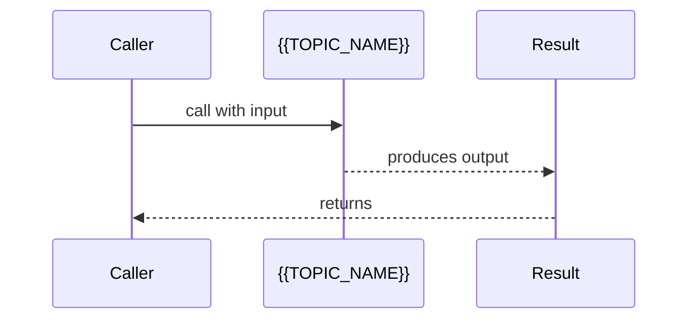

> Include 2-3 patterns. Focus on patterns the beginner WILL encounter.

---

## Clean Code

Basic clean code principles when working with {{TOPIC_NAME}} in Java:

### Naming (Java conventions)

```java
// ❌ Bad
class userData {}
void d(int x) { return x * 2; }
int MAX_count = 100;

// ✅ Clean Java naming
class UserData {}
int doubleValue(int n) { return n * 2; }
static final int MAX_COUNT = 100;
```

**Java naming rules:**
- Classes: PascalCase (`UserService`, `HttpClient`)
- Methods and variables: camelCase (`getUserById`, `isValid`)
- Constants: UPPER_SNAKE_CASE (`MAX_RETRIES`, `DEFAULT_TIMEOUT`)
- Packages: lowercase, dot-separated (`com.example.service`)

---

### Short Methods

```java
// ❌ Too long — parse + validate + save in one method
public void processUser(String json) { /* 60 lines */ }

// ✅ Each method does one thing
private User parseUser(String json) { ... }
private void validateUser(User user) { ... }
private void saveUser(User user) { ... }
```

---

### Javadoc Comments

```java
// ❌ Noise — restates the signature
// Gets user by id
public User getUser(int id) { ... }

// ✅ Explains contract and edge cases
/**
 * Retrieves a user by their unique identifier.
 *
 * @param id the user's database ID (must be positive)
 * @return the User, or null if not found
 * @throws IllegalArgumentException if id <= 0
 */
public User getUser(int id) { ... }
```

> Show Java-specific naming conventions (PascalCase, camelCase, CONSTANT_CASE). Keep examples simple.

---

## Product Use / Feature

How this topic is used in real-world products and tools:

### 1. {{Product/Tool Name}}

- **How it uses {{TOPIC_NAME}}:** Brief description
- **Why it matters:** Practical impact

### 2. {{Product/Tool Name}}

- **How it uses {{TOPIC_NAME}}:** Brief description
- **Why it matters:** Practical impact

### 3. {{Product/Tool Name}}

- **How it uses {{TOPIC_NAME}}:** Brief description
- **Why it matters:** Practical impact

> 3-5 real products/tools. Show how the topic is applied in industry.
> Different from Use Cases — this shows WHERE it's used, not WHEN.

---

## Error Handling

How to handle errors when working with {{TOPIC_NAME}}:

### Error 1: {{Common exception or error type}}

```java
// Code that produces this exception
```

**Why it happens:** Simple explanation.
**How to fix:**

```java
// Corrected code with proper exception handling
try {
    // risky operation
} catch (SpecificException e) {
    // handle exception
}
```

### Error 2: {{Another common exception}}

...

### Exception Handling Pattern

```java
// Recommended exception handling pattern for this topic
try {
    result = someOperation();
} catch (IOException e) {
    logger.error("Operation failed: {}", e.getMessage(), e);
    throw new ServiceException("Failed to process", e);
} finally {
    // cleanup if needed
}
```

> 2-4 common exceptions. Show the error, explain why, and provide the fix.
> Teach checked vs unchecked exceptions and when to use each.

---

## Security Considerations

Security aspects to keep in mind when using {{TOPIC_NAME}}:

### 1. {{Security concern}}

```java
// ❌ Insecure
...

// ✅ Secure
...
```

**Risk:** What could go wrong (data leak, injection, unauthorized access).
**Mitigation:** How to protect against it.

### 2. {{Another security concern}}

...

> 2-4 security considerations relevant to this topic.
> Even juniors should learn secure coding habits from the start.
> Focus on: input validation, data exposure, SQL injection, XSS.

---

## Performance Tips

Basic performance considerations for {{TOPIC_NAME}}:

### Tip 1: {{Performance optimization}}

```java
// ❌ Slow approach
...

// ✅ Faster approach
...
```

**Why it's faster:** Simple explanation (fewer object creations, less GC pressure, etc.)

### Tip 2: {{Another tip}}

...

> 2-4 tips. Keep explanations simple — focus on "what" not "how the JVM works".
> Avoid premature optimization advice — only include tips that are always applicable.

---

## Metrics & Analytics

Key metrics to track when using {{TOPIC_NAME}}:

### What to Measure

| Metric | Why it matters | Tool |
|--------|---------------|------|
| **{{metric 1}}** | {{reason}} | Micrometer, JMX |
| **{{metric 2}}** | {{reason}} | JConsole, VisualVM |

### Basic Instrumentation

```java
import io.micrometer.core.instrument.Counter;
import io.micrometer.core.instrument.MeterRegistry;

Counter counter = Counter.builder("{{topic}}.count")
    .description("Total {{topic}} operations")
    .register(registry);

counter.increment();
```

> **What to expose:** count, errors, latency (ms).
> Keep it simple — 2-3 metrics that tell you "is it working?".

---

## Best Practices

- **Do this:** Explanation
- **Do this:** Explanation
- **Do this:** Explanation

> 3-5 best practices. Keep them actionable and specific to juniors.
> Reference Java naming conventions and code style (Google Java Style Guide).

---

## Edge Cases & Pitfalls

### Pitfall 1: {{name}}

```java
// Code that demonstrates the pitfall
```

**What happens:** Explanation of unexpected behavior.
**How to fix:** Corrected code or approach.

### Pitfall 2: {{name}}

...

---

## Common Mistakes

### Mistake 1: {{description}}

```java
// ❌ Wrong way
...

// ✅ Correct way
...
```

### Mistake 2: {{description}}

...

> 3-5 mistakes that junior Java developers commonly make with this topic.

---

## Common Misconceptions

Things people often believe about {{TOPIC_NAME}} that aren't true:

### Misconception 1: "{{False belief}}"

**Reality:** {{What's actually true}}

**Why people think this:** {{Why this misconception is common}}

### Misconception 2: "{{Another false belief}}"

**Reality:** {{What's actually true}}

> 2-4 misconceptions. Directly address false beliefs.
> These are NOT code mistakes — they are conceptual misunderstandings.

---

## Tricky Points

Things that look simple but have subtle behavior:

### Tricky Point 1: {{name}}

```java
// Code that might surprise a junior
```

**Why it's tricky:** Explanation.
**Key takeaway:** One-line lesson.

---

## Test

### Multiple Choice

**1. {{Question}}?**

- A) Option A
- B) Option B
- C) Option C
- D) Option D

<details>
<summary>Answer</summary>
**C)** — Explanation why C is correct and why others are wrong.
</details>

**2. {{Question}}?**

...

### True or False

**3. {{Statement}}**

<details>
<summary>Answer</summary>
**False** — Explanation.
</details>

### What's the Output?

**4. What does this code print?**

```java
// code snippet
```

<details>
<summary>Answer</summary>
Output: `...`
Explanation: ...
</details>

> 5-8 test questions total. Mix of multiple choice, true/false, and "what's the output".

---

## "What If?" Scenarios

Thought experiments to test your understanding:

**What if {{Unexpected situation}}?**
- **You might think:** {{Intuitive but wrong answer}}
- **But actually:** {{Correct behavior and why}}

**What if {{Another scenario}}?**
- **You might think:** ...
- **But actually:** ...

> 2-3 "What If?" scenarios. Pose hypothetical situations that test edge cases and conceptual limits.

---

## Tricky Questions

Questions designed to confuse — with misleading options:

**1. {{Confusing question}}?**

- A) {{Looks correct but wrong}}
- B) {{Correct answer}}
- C) {{Common misconception}}
- D) {{Partially correct}}

<details>
<summary>Answer</summary>
**B)** — Explanation of why the "obvious" answers are wrong.
</details>

**2. {{Another tricky question}}?**

...

> 3-5 tricky questions. Each should have at least one very convincing wrong answer.

---

## Cheat Sheet

Quick reference for this topic:

| What | Syntax / Command | Example |
|------|-----------------|---------|
| {{Action 1}} | `{{syntax}}` | `{{example}}` |
| {{Action 2}} | `{{syntax}}` | `{{example}}` |
| {{Action 3}} | `{{syntax}}` | `{{example}}` |

> Keep it to 5-10 rows. This should fit on one screen.
> Useful for quick review before interviews or during coding.

---

## Self-Assessment Checklist

Check your understanding of {{TOPIC_NAME}}:

### I can explain:
- [ ] What {{TOPIC_NAME}} is and why it exists
- [ ] When to use it and when NOT to use it
- [ ] {{Specific concept 1}} in my own words
- [ ] {{Specific concept 2}} in my own words

### I can do:
- [ ] Write a basic example from scratch (without looking)
- [ ] Read and understand Java code that uses {{TOPIC_NAME}}
- [ ] Debug simple errors related to this topic
- [ ] Set up a Maven/Gradle project with required dependencies
- [ ] {{Topic-specific practical skill}}

### I can answer:
- [ ] All multiple choice questions in this document
- [ ] "What's the output?" questions correctly

> Adjust checklist items to match the topic.
> If you can't check all boxes, revisit the sections you're unsure about.

---

## Summary

- Key point 1
- Key point 2
- Key point 3

**Next step:** What to learn after this topic.

---

## What You Can Build

Now that you understand {{TOPIC_NAME}}, here's what you can build or use it for:

### Projects you can create:
- **{{Project 1}}:** Brief description — uses {{specific concept from this topic}}
- **{{Project 2}}:** Brief description — combines with {{other Java feature}}
- **{{Project 3}}:** Brief description — practical daily-use tool

### Technologies / tools that use this:
- **Spring Boot** — how knowing {{TOPIC_NAME}} helps you use it
- **Hibernate** — what becomes possible after learning this
- **{{Technology 3}}** — career opportunity or skill unlocked

### Learning path — what to study next:

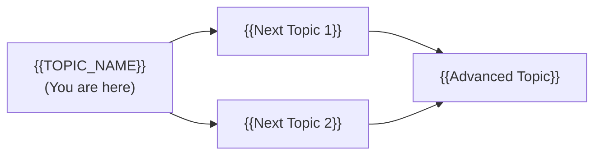

> 3-5 projects and 2-4 technologies/tools.
> Show the practical value of what was learned.
> Include a visual learning path with mermaid diagram.

---

## Further Reading

- **Official docs:** [Java Documentation](https://docs.oracle.com/en/java/)
- **Blog post:** [{{link title}}]({{url}}) — brief description of what you'll learn
- **Video:** [{{link title}}]({{url}}) — duration, what it covers
- **Book chapter:** Effective Java (Bloch), Chapter X — what it covers

> 3-5 resources. Mix of official docs, blog posts, videos, and books.
> Prioritize free, high-quality resources.

---

## Related Topics

Topics to explore next or that connect to this one:

- **[{{Related Topic 1}}](../XX-related-topic/)** — how it connects
- **[{{Related Topic 2}}](../XX-related-topic/)** — how it connects
- **[{{Related Topic 3}}](../XX-related-topic/)** — how it connects

> 2-4 related topics from the roadmap. Show the connection.

---

## Diagrams & Visual Aids

> Include **at least 2-3 visual aids** per document.

### Mind Map

Visual overview of how key concepts in {{TOPIC_NAME}} connect:

```mermaid
mindmap
  root(({{TOPIC_NAME}}))
    Core Concept 1
      Sub-concept A
      Sub-concept B
    Core Concept 2
      Sub-concept C
      Sub-concept D
    Related Topics
      {{Related 1}}
      {{Related 2}}
```

### Visual Type Reference

| Visual Type | Best For | Syntax |
|:----------:|:--------:|:------:|
| **Mermaid Flowchart** | Processes, workflows, decision trees | `graph TD` / `graph LR` |
| **Mermaid Sequence** | Request/response flows, lifecycle | `sequenceDiagram` |
| **Mermaid Class** | Class hierarchies, interfaces | `classDiagram` |
| **Mermaid Mind Map** | Topic overview, concept connections | `mindmap` |
| **ASCII Diagram** | Memory layouts, JVM heap/stack | Box-drawing characters |
| **Comparison Table** | Feature comparisons, trade-offs | Markdown table |

### Example — Class Diagram

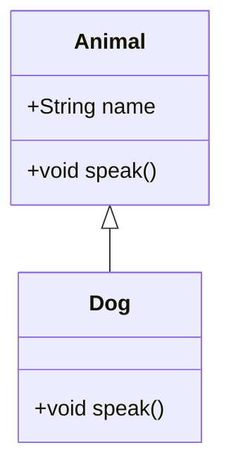

### Example — Sequence Diagram

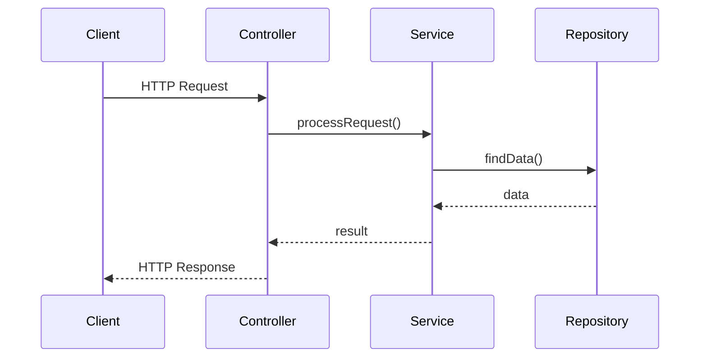

### Example — JVM Memory Layout

```
+---------------------------+
|        JVM Memory         |
|---------------------------|
|  Heap (GC managed)        |
|   Young Gen | Old Gen     |
|---------------------------|
|  Stack (per thread)       |
|   Frame | Frame | Frame   |
|---------------------------|
|  Metaspace (Class data)   |
+---------------------------+
```

</details>

---
---

# TEMPLATE 2 — `middle.md`

<details open>
<summary><strong>Template Content</strong></summary>

# {{TOPIC_NAME}} — Middle Level

<!-- Table of Contents is OPTIONAL. Include only if the topic has many sections and it helps navigation. Remove this section entirely if not needed. -->

## Table of Contents

1. [Introduction](#introduction)
2. [Core Concepts](#core-concepts)
3. [Pros & Cons](#pros--cons)
4. [Use Cases](#use-cases)
5. [Code Examples](#code-examples)
6. [Coding Patterns](#coding-patterns)
7. [Product Use / Feature](#product-use--feature)
8. [Error Handling](#error-handling)
9. [Security Considerations](#security-considerations)
10. [Performance Optimization](#performance-optimization)
11. [Metrics & Analytics](#metrics--analytics)
12. [Debugging Guide](#debugging-guide)
13. [Best Practices](#best-practices)
14. [Edge Cases & Pitfalls](#edge-cases--pitfalls)
15. [Common Mistakes](#common-mistakes)
16. [Tricky Points](#tricky-points)
17. [Comparison with Other Languages](#comparison-with-other-languages)
18. [Test](#test)
19. [Tricky Questions](#tricky-questions)
20. [Cheat Sheet](#cheat-sheet)
21. [Summary](#summary)
22. [What You Can Build](#what-you-can-build)
23. [Further Reading](#further-reading)
24. [Related Topics](#related-topics)
25. [Diagrams & Visual Aids](#diagrams--visual-aids)

---

## Introduction

> Focus: "Why?" and "When to use?"

Assumes the reader already knows Java basics. This level covers:
- Deeper understanding of how {{TOPIC_NAME}} works under the JVM
- Real-world application patterns with Spring Boot
- Production considerations and generics/streams/lambdas usage

---

## Core Concepts

### Concept 1: {{Advanced concept}}

Detailed explanation with diagrams (mermaid) where helpful.

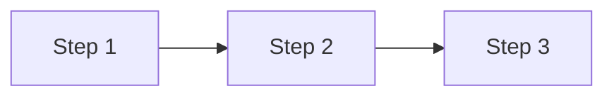

### Concept 2: {{Another concept}}

- How it relates to other Java features (generics, streams, lambdas)
- JVM behavior differences
- Performance implications

> **Rules:**
> - Go deeper than junior. Explain "why" not just "what".
> - Cover generics, streams, lambdas, design patterns in Java context.
> - Include benchmarks or performance data where relevant.

---

## Evolution & Historical Context

Why does {{TOPIC_NAME}} exist? What problem does it solve?

**Before {{TOPIC_NAME}}:**
- How developers solved this problem in Java prior versions
- The pain points and boilerplate of the old approach

**How {{TOPIC_NAME}} changed things:**
- The shift introduced (e.g., Java 8 Streams vs manual iteration)
- Why it became the standard pattern

> Understanding Java's evolution (Java 8, 11, 17, 21 milestones) helps developers appreciate why APIs look the way they do.

---

## Pros & Cons

| Pros | Cons |
|------|------|
| {{Advantage 1 with production context}} | {{Disadvantage 1 with impact analysis}} |
| {{Advantage 2}} | {{Disadvantage 2}} |
| {{Advantage 3}} | {{Disadvantage 3}} |

### Trade-off analysis:

- **{{Trade-off 1}}:** When {{advantage}} outweighs {{disadvantage}} — decision criteria
- **{{Trade-off 2}}:** When to accept {{limitation}} for {{benefit}}

### Comparison with alternatives:

| Approach | Pros | Cons | Best for |
|----------|------|------|----------|
| {{Approach A}} | {{pros}} | {{cons}} | {{scenario}} |
| {{Approach B}} | {{pros}} | {{cons}} | {{scenario}} |

> More nuanced than junior — include trade-off analysis and alternative comparison.

---

## Alternative Approaches (Plan B)

If you couldn't use {{TOPIC_NAME}} for some reason, how else could you solve the problem?

| Alternative | How it works | When you might be forced to use it |
|-------------|--------------|------------------------------------|
| **{{Alternative 1}}** | {{Brief explanation}} | {{e.g., "If targeting Java 7 compatibility"}} |
| **{{Alternative 2}}** | {{Brief explanation}} | {{e.g., "If you need maximum performance"}} |

---

## Use Cases

Real-world, production scenarios:

- **Use Case 1:** {{Spring Boot production scenario}}
- **Use Case 2:** {{Scaling scenario}}
- **Use Case 3:** {{Integration scenario}}

---

## Code Examples

### Example 1: {{Production-ready pattern}}

```java
// Production-quality code with exception handling, logging, etc.
```

**Why this pattern:** Explanation of design decisions.
**Trade-offs:** What you gain and what you sacrifice.

### Example 2: {{Comparison of approaches}}

```java
// Approach A — traditional
...

// Approach B — using streams/lambdas (better for X reason)
...
```

**When to use which:** Decision criteria.

> **Rules:**
> - Code should be production-quality. Include exception handling, SLF4J logging, Spring annotations where relevant.
> - Show comparisons between approaches (e.g., imperative vs functional style).

---

## Coding Patterns

Design patterns and idiomatic patterns for {{TOPIC_NAME}} in production Java code:

### Pattern 1: {{GoF or Java-specific pattern — e.g., Builder, Strategy, Factory}}

**Category:** Creational / Structural / Behavioral / Java-idiomatic
**Intent:** {{What design problem this solves}}
**When to use:** {{Specific scenario}}
**When NOT to use:** {{Counter-indication}}

**Structure diagram:**

```mermaid
classDiagram
    class {{Interface}} {
        <<interface>>
        +{{method()}} {{ReturnType}}
    }
    class {{ConcreteA}} {
        +{{method()}} {{ReturnType}}
    }
    class {{Client}} {
        -{{Interface}} dep
        +use()
    }
    {{Interface}} <|.. {{ConcreteA}}
    {{Client}} --> {{Interface}}
```

**Implementation:**

```java
// Pattern implementation
```

**Trade-offs:**

| ✅ Pros | ❌ Cons |
|---------|---------|
| {{benefit 1}} | {{drawback 1}} |

---

### Pattern 2: {{Another pattern}}

**Flow diagram:**

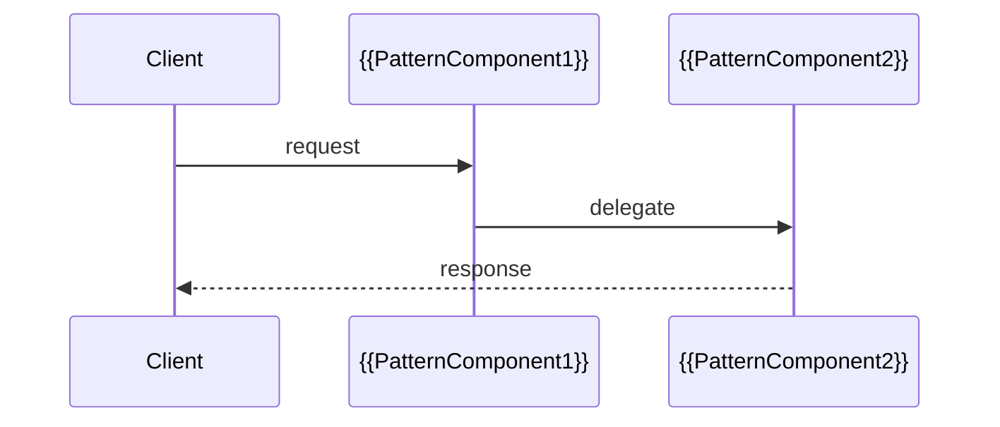

---

### Pattern 3: {{Idiomatic Java pattern}}

```mermaid
graph LR
    A[{{Input}}] -->|transform| B[{{TOPIC_NAME}} idiom]
    B --> C[✅ Idiomatic]
    B -.->|avoids| D[❌ Common mistake]
```

> Include 3-5 patterns. Each MUST have a diagram.

---

## Clean Code

Production-level clean code for {{TOPIC_NAME}} in Java:

### Naming & Readability

```java
// ❌ Cryptic method
byte[] proc(byte[] d, boolean f) { ... }

// ✅ Self-documenting
byte[] compressPayload(byte[] input, boolean includeChecksum) { ... }
```

| Element | Java Rule | Example |
|---------|-----------|---------|
| Methods | verb + noun | `fetchUserById`, `validateToken` |
| Interfaces | noun (what it IS) | `UserRepository`, `PaymentGateway` |
| Exceptions | descriptive suffix | `UserNotFoundException`, `ValidationException` |
| Booleans | `is/has/can` | `isExpired`, `hasPermission` |

---

### SOLID in Java

**Interface Segregation Principle:**
```java
// ❌ Fat interface
public interface UserService {
    User save(User user);
    User findById(Long id);
    void sendEmail(User user, String message);  // wrong! email != user service
    byte[] generateReport();                     // wrong! reporting != user service
}

// ✅ Segregated interfaces
public interface UserWriter { User save(User user); }
public interface UserReader { User findById(Long id); }
public interface UserService extends UserWriter, UserReader {}
```

**Dependency Inversion with Spring:**
```java
// ❌ Depends on concrete class
@Service
public class OrderService {
    private MySQLUserRepository repo = new MySQLUserRepository();
}

// ✅ Depends on interface — Spring injects at runtime
@Service
public class OrderService {
    private final UserRepository repo;

    public OrderService(UserRepository repo) {  // constructor injection
        this.repo = repo;
    }
}
```

---

### DRY in Java

```java
// ❌ Repeated validation logic
public User createUser(String name, String email) {
    if (name == null || name.isEmpty()) throw new ValidationException("name required");
    if (email == null || email.isEmpty()) throw new ValidationException("email required");
    ...
}
public User updateUser(String name, String email) {
    if (name == null || name.isEmpty()) throw new ValidationException("name required");  // copy-paste
    if (email == null || email.isEmpty()) throw new ValidationException("email required"); // copy-paste
    ...
}

// ✅ Extract shared validation
private void validateUserInput(String name, String email) {
    if (name == null || name.isEmpty()) throw new ValidationException("name required");
    if (email == null || email.isEmpty()) throw new ValidationException("email required");
}
```

---

### Java-Specific Smells

```java
// ❌ Inheritance for code reuse (wrong reason)
class EmailSender extends DatabaseConnection { ... }  // no "is-a" relationship

// ✅ Composition over inheritance
class EmailSender {
    private final DatabaseConnection db;
    public EmailSender(DatabaseConnection db) { this.db = db; }
}

// ❌ Returning null
public User findUser(Long id) {
    if (notFound) return null;  // forces null checks everywhere
}

// ✅ Use Optional
public Optional<User> findUser(Long id) {
    if (notFound) return Optional.empty();
}
```

> Focus on Java-specific: interface segregation, DI with Spring, composition vs inheritance.

---

## Product Use / Feature

How this topic is applied in production systems and popular tools:

### 1. {{Product/Tool Name}}

- **How it uses {{TOPIC_NAME}}:** Description with architectural context
- **Scale:** Numbers, traffic, data volume
- **Key insight:** What can be learned from their approach

### 2. {{Product/Tool Name}}

- **How it uses {{TOPIC_NAME}}:** Description
- **Why this approach:** Trade-offs they made

> 3-5 real products. Focus on Spring Boot ecosystem, enterprise Java usage.

---

## Error Handling

Production-grade exception handling patterns for {{TOPIC_NAME}}:

### Pattern 1: {{Exception handling pattern}}

```java
// Production exception handling with Spring @ExceptionHandler
@RestControllerAdvice
public class GlobalExceptionHandler {
    @ExceptionHandler({{CustomException}}.class)
    public ResponseEntity<ErrorResponse> handle{{CustomException}}(
            {{CustomException}} ex) {
        log.error("{{topic}} error: {}", ex.getMessage(), ex);
        return ResponseEntity.status(HttpStatus.BAD_REQUEST)
            .body(new ErrorResponse(ex.getMessage()));
    }
}
```

**When to use:** {{scenario}}

### Pattern 2: {{Custom exception hierarchy}}

```java
// Domain-specific exception hierarchy
public class {{DomainException}} extends RuntimeException {
    private final String errorCode;

    public {{DomainException}}(String message, String errorCode) {
        super(message);
        this.errorCode = errorCode;
    }

    public {{DomainException}}(String message, String errorCode, Throwable cause) {
        super(message, cause);
        this.errorCode = errorCode;
    }
}
```

### Common Exception Patterns

| Situation | Pattern | Example |
|-----------|---------|---------|
| Checked exception wrapping | `throw new RuntimeException("context", e)` | Wrap for cleaner API |
| Specific type check | `catch (IOException e)` | Handle I/O separately |
| Multi-catch | `catch (IOException \| SQLException e)` | Java 7+ syntax |
| Try-with-resources | `try (Resource r = ...)` | Auto-close resources |

> Focus on: checked vs unchecked, Spring exception handling, proper logging with SLF4J.

---

## Security Considerations

Security aspects when using {{TOPIC_NAME}} in production:

### 1. {{Security concern}}

**Risk level:** High / Medium / Low

```java
// ❌ Vulnerable code
...

// ✅ Secure code
...
```

**Attack vector:** How this vulnerability can be exploited.
**Impact:** What happens if exploited.
**Mitigation:** Step-by-step fix.

### Security Checklist

- [ ] {{Check 1}} — why it matters
- [ ] {{Check 2}} — why it matters
- [ ] Input validation at controller layer
- [ ] SQL injection prevention (use PreparedStatement or JPA)
- [ ] Dependency scanning with OWASP Dependency Check

---

## Performance Optimization

Performance considerations and optimizations for {{TOPIC_NAME}}:

### Optimization 1: {{name}}

```java
// ❌ Slow — high object creation / O(n²)
...

// ✅ Fast — reuse / O(n)
...
```

**Benchmark results:**
```
Benchmark                      Mode  Cnt     Score     Error  Units
BenchmarkSlow.measure          avgt   10  15234.123 ± 120.4  ns/op
BenchmarkFast.measure          avgt   10   2041.456 ±  22.1  ns/op
```

**When to optimize:** Only when JFR/async-profiler shows this is a bottleneck.

### Optimization 2: {{name}}

...

### Performance Decision Matrix

| Scenario | Approach | Why |
|----------|----------|-----|
| {{Low traffic}} | {{Simple approach}} | Readability > performance |
| {{High traffic}} | {{Optimized approach}} | Performance critical |
| {{Memory constrained}} | {{Memory-efficient approach}} | Reduce GC pressure |

> Back every claim with JMH benchmarks.
> Include "when NOT to optimize" — premature optimization is the root of all evil.

---

## Metrics & Analytics

Production-grade metrics and observability for {{TOPIC_NAME}}:

### Key Metrics

| Metric | Type | Description | Alert threshold |
|--------|------|-------------|-----------------|
| **{{metric 1}}** | Counter | {{what it counts}} | — |
| **{{metric 2}}** | Gauge | {{what it measures}} | > {{threshold}} |
| **{{metric 3}}** | Timer | {{latency distribution}} | p99 > {{threshold}} |

### Micrometer / Spring Boot Actuator Instrumentation

```java
import io.micrometer.core.instrument.Counter;
import io.micrometer.core.instrument.MeterRegistry;
import io.micrometer.core.instrument.Timer;

@Service
public class {{Topic}}Service {
    private final Counter operationCounter;
    private final Timer operationTimer;

    public {{Topic}}Service(MeterRegistry registry) {
        this.operationCounter = Counter.builder("{{topic}}.operations")
            .tag("status", "success")
            .register(registry);
        this.operationTimer = Timer.builder("{{topic}}.duration")
            .register(registry);
    }
}
```

### Dashboard Panels (Grafana)

| Panel | Query | Visualization |
|-------|-------|---------------|
| Operations/sec | `rate({{topic}}_operations_total[5m])` | Time series |
| Error rate | `rate({{topic}}_operations_total{status="error"}[5m])` | Stat |
| p99 latency | `histogram_quantile(0.99, {{topic}}_duration_seconds_bucket)` | Gauge |

---

## Debugging Guide

How to debug common issues related to {{TOPIC_NAME}}:

### Problem 1: {{Common symptom}}

**Symptoms:** What you see (exception messages, unexpected behavior, performance degradation).

**Diagnostic steps:**
```bash
# JVM thread dump
jstack <pid>

# Heap dump
jmap -dump:format=b,file=heap.hprof <pid>

# JFR recording
jcmd <pid> JFR.start duration=60s filename=recording.jfr
```

**Root cause:** Why this happens.
**Fix:** How to resolve it.

### Problem 2: {{Another common issue}}

...

### Useful Tools

| Tool | Command | What it shows |
|------|---------|---------------|
| `jstack` | `jstack <pid>` | Thread dumps, deadlocks |
| `jmap` | `jmap -heap <pid>` | Heap summary |
| `jconsole` | `jconsole` | Live JVM monitoring |
| `async-profiler` | `./profiler.sh -d 30 -f profile.html <pid>` | CPU/allocation flamegraph |

> 2-4 debugging scenarios with concrete steps.
> Include JVM diagnostic tools: jstack, jmap, jconsole, async-profiler, JFR.

---

## Best Practices

- **Practice 1:** Explanation + code snippet
- **Practice 2:** Explanation + why it matters in production
- **Practice 3:** Explanation + common violation example

> 5-7 practices. More nuanced than junior level.
> Reference Effective Java (Bloch) where applicable.

---

## Edge Cases & Pitfalls

### Pitfall 1: {{Production pitfall}}

```java
// Code that causes issues in production
```

**Impact:** What goes wrong (memory leak, NullPointerException, ConcurrentModificationException, etc.)
**Detection:** How to notice the problem.
**Fix:** Corrected approach.

### Pitfall 2: {{Concurrency/Performance pitfall}}

...

---

## Common Mistakes

### Mistake 1: {{Middle-level mistake}}

```java
// ❌ Looks correct but has subtle issues
...

// ✅ Properly handles edge cases
...
```

**Why it's wrong:** Explanation of subtle issue.

---

## Common Misconceptions

Things even experienced Java developers get wrong about {{TOPIC_NAME}}:

### Misconception 1: "{{False belief}}"

**Reality:** {{What's actually true}}

**Evidence:**
```java
// Code or benchmark that proves the misconception wrong
```

### Misconception 2: "{{Another false belief}}"

**Reality:** {{What's actually true}}

---

## Anti-Patterns

### Anti-Pattern 1: {{Name of anti-pattern}}

```java
// ❌ The Anti-Pattern (looks clean, but scales poorly)
...
```

**Why it's bad:** How it causes pain later.
**The refactoring:** What to use instead.

---

## Tricky Points

### Tricky Point 1: {{Subtle JVM behavior}}

```java
// Code with non-obvious behavior
```

**What actually happens:** Step-by-step explanation.
**Why:** Reference to JLS or JVM spec.

---

## Comparison with Other Languages

How Java handles {{TOPIC_NAME}} compared to other languages:

| Aspect | Java | Kotlin | Go | Scala | C# |
|--------|------|--------|-----|-------|-----|
| {{Aspect 1}} | {{Java approach}} | {{Kotlin approach}} | {{Go approach}} | {{Scala approach}} | {{C# approach}} |
| {{Aspect 2}} | ... | ... | ... | ... | ... |

### Key differences:

- **Java vs Kotlin:** {{main difference and why it matters — e.g., null safety, coroutines}}
- **Java vs Go:** {{main difference and why it matters — e.g., JVM overhead vs compiled binary}}
- **Java vs Scala:** {{main difference — verbosity vs expressiveness}}

> Focus on 2-3 languages most relevant to the topic.
> Highlight Java's unique design decisions and their trade-offs.

---

## Test

### Multiple Choice (harder)

**1. {{Question involving trade-offs or subtle JVM behavior}}?**

- A) ...
- B) ...
- C) ...
- D) ...

<details>
<summary>Answer</summary>
**B)** — Detailed explanation with JLS or JVM spec reference if applicable.
</details>

### Code Analysis

**2. What happens when this code runs with 1000 concurrent threads?**

```java
// concurrent code
```

<details>
<summary>Answer</summary>
Explanation of race condition / deadlock / correct behavior.
</details>

### Debug This

**3. This code has a bug. Find it.**

```java
// buggy code
```

<details>
<summary>Answer</summary>
Bug: ... Fix: ...
</details>

> 6-10 questions. Include code analysis, debugging, and "what happens under load" questions.

---

## Tricky Questions

**1. {{Question that tests deep understanding}}?**

- A) {{Extremely convincing wrong answer}}
- B) ...
- C) ...
- D) {{Correct but counter-intuitive}}

<details>
<summary>Answer</summary>
**D)** — Deep explanation of why the intuitive answer is wrong.
</details>

---

## Cheat Sheet

Quick reference for production use:

| Scenario | Pattern | Key consideration |
|----------|---------|-------------------|
| {{Scenario 1}} | `{{code pattern}}` | {{what to watch for}} |
| {{Scenario 2}} | `{{code pattern}}` | {{what to watch for}} |

### Decision Matrix

| If you need... | Use... | Because... |
|----------------|--------|------------|
| {{need 1}} | {{approach}} | {{reason}} |
| {{need 2}} | {{approach}} | {{reason}} |

---

## Self-Assessment Checklist

### I can explain:
- [ ] Why {{TOPIC_NAME}} is designed this way in Java
- [ ] Trade-offs between different approaches
- [ ] How this topic interacts with the Spring ecosystem

### I can do:
- [ ] Write production-quality Java code using {{TOPIC_NAME}}
- [ ] Write JUnit 5 tests covering edge cases
- [ ] Debug issues using jstack / jmap / async-profiler
- [ ] Review code and identify problems

---

## Summary

- Key insight 1
- Key insight 2
- Key insight 3

**Key difference from Junior:** What deeper understanding was gained.
**Next step:** What to explore at Senior level.

---

## What You Can Build

### Production systems:
- **{{System 1}}:** Description — applies {{specific pattern from this level}}
- **{{System 2}}:** Description — combines {{TOPIC_NAME}} with Spring ecosystem

### Learning path:

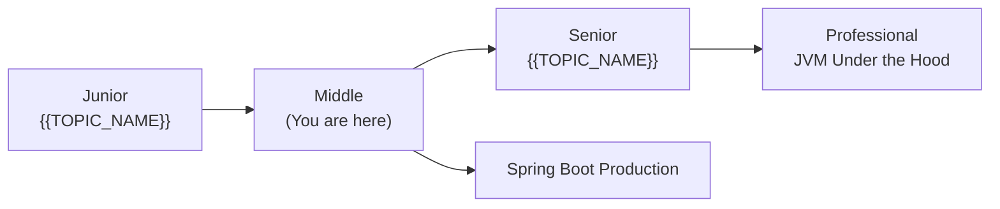

---

## Further Reading

- **Official docs:** [Java Documentation](https://docs.oracle.com/en/java/)
- **Book:** Effective Java (Bloch), 3rd edition — relevant chapter
- **Conference talk:** [{{title}}]({{url}}) — speaker, event, key takeaways
- **Open source:** [Spring Framework source](https://github.com/spring-projects/spring-framework) — how it demonstrates this topic

---

## Related Topics

- **[{{Related Topic 1}}](../XX-related-topic/)** — how it connects
- **[{{Related Topic 2}}](../XX-related-topic/)** — how it connects

---

## Diagrams & Visual Aids

> Include **at least 2-3 visual aids** per document.

### Example — Class Hierarchy

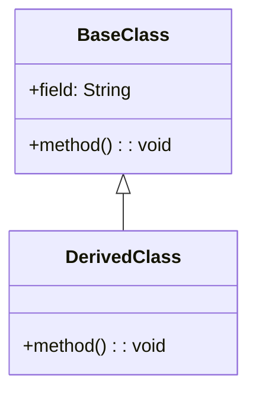

### Example — Sequence Diagram

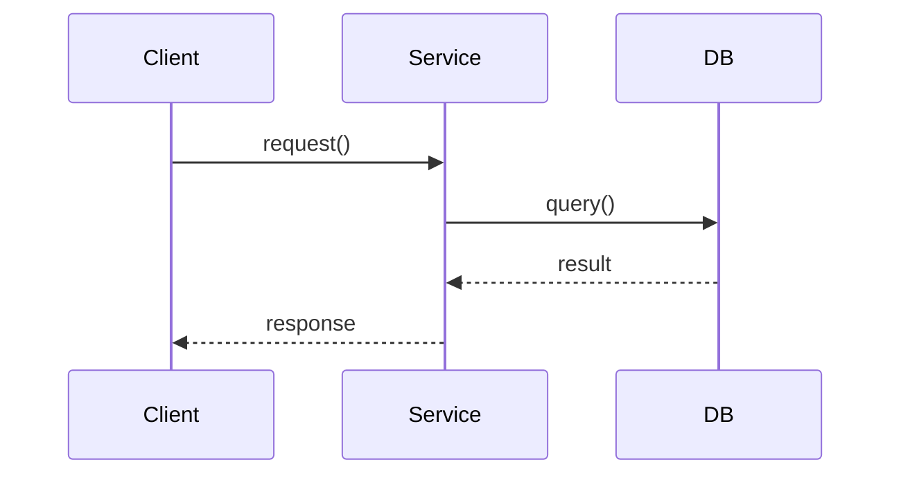

</details>

---
---

# TEMPLATE 3 — `senior.md`

<details open>
<summary><strong>Template Content</strong></summary>

# {{TOPIC_NAME}} — Senior Level

<!-- Table of Contents is OPTIONAL. Include only if the topic has many sections and it helps navigation. Remove this section entirely if not needed. -->

## Table of Contents

1. [Introduction](#introduction)
2. [Core Concepts](#core-concepts)
3. [Pros & Cons](#pros--cons)
4. [Use Cases](#use-cases)
5. [Code Examples](#code-examples)
6. [Coding Patterns](#coding-patterns)
7. [Product Use / Feature](#product-use--feature)
8. [Error Handling](#error-handling)
9. [Security Considerations](#security-considerations)
10. [Performance Optimization](#performance-optimization)
11. [Metrics & Analytics](#metrics--analytics)
12. [Debugging Guide](#debugging-guide)
13. [Best Practices](#best-practices)
14. [Edge Cases & Pitfalls](#edge-cases--pitfalls)
15. [Common Mistakes](#common-mistakes)
16. [Tricky Points](#tricky-points)
17. [Comparison with Other Languages](#comparison-with-other-languages)
18. [Test](#test)
19. [Tricky Questions](#tricky-questions)
20. [Cheat Sheet](#cheat-sheet)
21. [Summary](#summary)
22. [What You Can Build](#what-you-can-build)
23. [Further Reading](#further-reading)
24. [Related Topics](#related-topics)
25. [Diagrams & Visual Aids](#diagrams--visual-aids)

---

## Introduction

> Focus: "How to optimize?" and "How to architect?"

For Java developers who:
- Design systems using the Spring ecosystem at scale
- Tune JVM parameters (G1GC, ZGC, heap sizing, thread pools)
- Handle distributed systems patterns in Java
- Mentor junior/middle developers
- Review and improve codebases

> Senior Java topics include: JVM tuning (GOGC, GOMAXPROCS equivalents: -Xmx, -Xms, -XX:+UseG1GC), Spring ecosystem at scale, distributed systems with Java (microservices, event sourcing), Virtual Threads (Java 21), advanced concurrency patterns.

---

## Core Concepts

### Concept 1: {{Architecture-level concept}}

Deep dive with:
- Design patterns and when to apply them in Java
- JVM performance characteristics
- Comparison with alternative approaches in other languages

```java
// Advanced pattern with detailed annotations
```

### Concept 2: {{Optimization concept}}

JMH benchmark comparisons:

```java
@BenchmarkMode(Mode.AverageTime)
@OutputTimeUnit(TimeUnit.NANOSECONDS)
public class {{Topic}}Benchmark {
    @Benchmark
    public void approachA(Blackhole bh) { ... }

    @Benchmark
    public void approachB(Blackhole bh) { ... }
}
```

Results:
```
Benchmark                     Mode  Cnt     Score    Error  Units
{{Topic}}Benchmark.approachA  avgt   10  1024.123 ± 12.4  ns/op
{{Topic}}Benchmark.approachB  avgt   10   205.456 ±  2.1  ns/op
```

> Every claim about performance must be backed by JMH benchmarks.

---

## Pros & Cons

### Strategic analysis for architectural decisions:

| Pros | Cons | Impact |
|------|------|--------|
| {{Advantage 1}} | {{Disadvantage 1}} | {{Impact on system architecture}} |
| {{Advantage 2}} | {{Disadvantage 2}} | {{Impact on team/maintenance}} |
| {{Advantage 3}} | {{Disadvantage 3}} | {{Impact on performance/scale}} |

### Real-world decision examples:
- **{{Company X}}** chose {{approach}} because {{reasoning}} — result: {{outcome}}
- **{{Company Y}}** avoided {{approach}} because {{reasoning}} — alternative: {{what they used}}

---

## Use Cases

Architectural and system-level scenarios:

- **Use Case 1:** {{System design scenario with Spring Boot}}
- **Use Case 2:** {{JVM tuning scenario}}
- **Use Case 3:** {{Distributed systems with Java pattern}}

---

## Code Examples

### Example 1: {{Architecture pattern}}

```java
// Full implementation of a production pattern
// With dependency injection, exception handling, graceful shutdown
```

**Architecture decisions:** Why this structure.
**Alternatives considered:** What else could work and why this was chosen.

### Example 2: {{JVM performance optimization}}

```java
// Before optimization — causing GC pressure
...

// After optimization — reduced allocations
...
```

> Show real optimization techniques: object pooling, StringBuilder, stream parallelism pitfalls.

---

## Coding Patterns

Architectural and advanced patterns for {{TOPIC_NAME}} in production Java systems:

### Pattern 1: {{Architectural pattern — e.g., CQRS, Circuit Breaker, Saga, Event Sourcing}}

**Category:** Architectural / Distributed Systems / Resilience
**Intent:** {{System-level problem this pattern solves}}

**Architecture diagram:**

```mermaid
graph TD
    subgraph "{{Pattern Name}}"
        A[{{Component 1}}] -->|{{action}}| B[{{Component 2}}]
        B -.->|async| C[{{Component 3}}]
    end
    E[Client] --> A
```

```java
// Production implementation with observability
```

---

### Pattern 2: {{Performance/Concurrency pattern}}

**Flow diagram:**

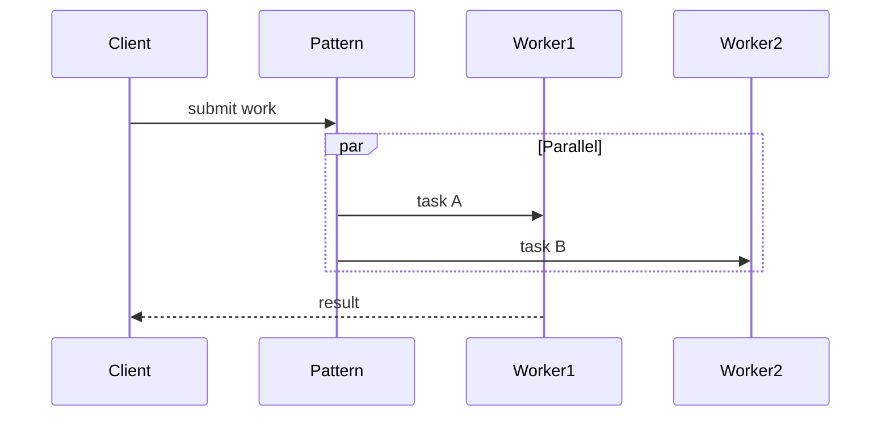

---

### Pattern 3: {{Resilience pattern}}

**State diagram:**

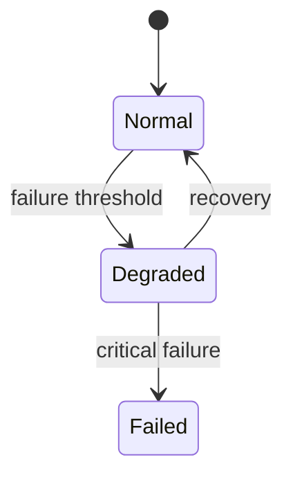

---

### Pattern Comparison Matrix

| Pattern | Use When | Avoid When | Complexity |
|---------|----------|------------|------------|
| {{Pattern 1}} | {{condition}} | {{condition}} | Low/Med/High |
| {{Pattern 2}} | {{condition}} | {{condition}} | Low/Med/High |

> Include 3-5 patterns. Every pattern MUST have a diagram.

---

## Clean Code

Senior-level clean code — architecture and team standards for {{TOPIC_NAME}} in Java:

### Clean Architecture with Spring Layers

```java
// ❌ Controller directly queries DB
@RestController
public class UserController {
    @Autowired private EntityManager em;

    @GetMapping("/users/{id}")
    public User getUser(@PathVariable Long id) {
        return em.find(User.class, id);  // business logic in controller
    }
}

// ✅ Clean layer separation
@Repository public interface UserRepository extends JpaRepository<User, Long> {}

@Service
public class UserService {
    private final UserRepository repo;
    public UserService(UserRepository repo) { this.repo = repo; }
    public User getUser(Long id) { return repo.findById(id).orElseThrow(); }
}

@RestController
public class UserController {
    private final UserService svc;
    public UserController(UserService svc) { this.svc = svc; }
    @GetMapping("/users/{id}") public User getUser(@PathVariable Long id) { return svc.getUser(id); }
}
```

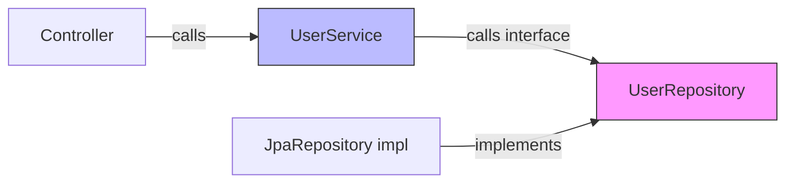

---

### Java Code Smells

| Smell | Java Example | Fix |
|-------|-------------|-----|
| **God class** | `UserManager` with 50 methods | Split by responsibility |
| **Field injection** | `@Autowired private Repo repo;` | Constructor injection |
| **Anemic domain model** | Entity with only getters/setters | Move logic into the entity |
| **Checked exception abuse** | `throws Exception` everywhere | Specific unchecked exceptions |
| **`@Deprecated` without replacement** | `@Deprecated void oldMethod()` | Add `@Deprecated(since="2.0", forRemoval=true)` |

---

### Package Design Rules

```
// ❌ Layer-first packaging (forces opening packages for every feature)
com.example.controllers.UserController
com.example.services.UserService
com.example.repositories.UserRepository

// ✅ Feature-first packaging (high cohesion, low coupling)
com.example.user.UserController
com.example.user.UserService
com.example.user.UserRepository
com.example.order.OrderController
com.example.order.OrderService
```

**Java package rules:**
- Group by feature/domain, not by layer
- Use `package-private` (default) to hide implementation details within a package
- `public` API should be minimal — only expose what external packages need

---

### Code Review Checklist (Java Senior)

- [ ] No business logic in `@Controller` / `@RestController` classes
- [ ] All Spring beans use constructor injection (not `@Autowired` field injection)
- [ ] `Optional` used for nullable return values (no raw `null` returns)
- [ ] Resources closed with try-with-resources
- [ ] No unchecked casts without explanation
- [ ] Exceptions carry meaningful messages and context
- [ ] All public API methods have Javadoc

---

## Best Practices

Java best practices for {{TOPIC_NAME}} — from production Java codebases at scale:

### Must Do ✅

1. **Always close resources with try-with-resources**
   ```java
   // ✅ Auto-closed even on exception
   try (InputStream in = new FileInputStream(file);
        BufferedReader reader = new BufferedReader(new InputStreamReader(in))) {
       return reader.lines().collect(Collectors.joining("\n"));
   }
   ```

2. **Prefer `Optional` over null returns**
   ```java
   // ✅ Forces caller to handle missing value explicitly
   public Optional<User> findByEmail(String email) {
       return userRepository.findByEmail(email);
   }
   user.findByEmail("a@b.com")
       .ifPresent(u -> sendWelcomeEmail(u));
   ```

3. **Use Stream API for collection operations**
   ```java
   // ✅ Declarative, readable
   List<String> activeEmails = users.stream()
       .filter(User::isActive)
       .map(User::getEmail)
       .collect(Collectors.toList());
   ```

4. **Prefer immutable objects with records or final fields**
   ```java
   // ✅ Java 16+ record — immutable by default
   public record UserDTO(Long id, String name, String email) {}

   // ✅ Pre-records: final fields
   public final class Money {
       private final BigDecimal amount;
       private final Currency currency;
   }
   ```

5. **Use constructor injection in Spring — never field injection**
   ```java
   // ✅ Testable without Spring context
   @Service
   public class PaymentService {
       private final PaymentGateway gateway;
       public PaymentService(PaymentGateway gateway) { this.gateway = gateway; }
   }
   ```

### Never Do ❌

1. **Never catch `Exception` or `Throwable` silently**
   ```java
   // ❌ Swallows everything including OutOfMemoryError
   try { ... } catch (Exception e) {}

   // ✅ Catch specific, log with context
   try { ... } catch (IOException e) {
       log.error("Failed to read file {}: {}", path, e.getMessage(), e);
       throw new FileProcessingException("Cannot read " + path, e);
   }
   ```

2. **Never use `@Autowired` field injection in production code** — untestable outside Spring

3. **Never return `null` from public methods** — use `Optional` or throw a specific exception

4. **Never use raw types** (`List` instead of `List<User>`) — bypasses type safety

### Project-Level Best Practices

| Area | Rule | Reason |
|------|------|--------|
| **Code organization** | Feature-first packaging | High cohesion, easy navigation |
| **Error handling** | Specific exceptions with context | Debuggable, meaningful logs |
| **Testing** | JUnit 5 + Mockito + Spring Test | Full coverage at all layers |
| **Performance** | Use connection pooling (HikariCP) | Avoid connection exhaustion |
| **Null safety** | `Optional` + `@NonNull` annotations | Fewer NPEs |
| **Dependencies** | Constructor injection everywhere | Testable, explicit dependencies |

### Java Production Checklist

- [ ] All resources closed via try-with-resources
- [ ] No raw `null` returns — `Optional` used for optional values
- [ ] `@Transactional` boundaries at service layer, not repository
- [ ] `go vet` equivalent: Checkstyle + SpotBugs pass with zero warnings
- [ ] No `System.out.println` — structured logging with SLF4J
- [ ] All secrets from environment / Vault, never hardcoded
- [ ] Dependency versions pinned in `pom.xml` or `build.gradle`

> Every best practice must be {{TOPIC_NAME}}-specific, not generic.

---

## Product Use / Feature

How industry leaders use this topic at scale with Java:

### 1. {{Company/Product Name}}

- **Architecture:** How they implement {{TOPIC_NAME}} in their Java stack
- **Scale:** Specific numbers
- **Lessons learned:** What they changed and why
- **Source:** Blog post, talk, or open-source reference

> 3-5 real-world examples. Reference Netflix, LinkedIn, Uber Java engineering blogs.

---

## Error Handling

Enterprise-grade exception handling strategies for {{TOPIC_NAME}}:

### Strategy 1: {{Error handling architecture}}

```java
// Domain exception hierarchy for large codebases
public abstract class DomainException extends RuntimeException {
    private final String code;
    private final Map<String, Object> metadata;

    protected DomainException(String message, String code) {
        super(message);
        this.code = code;
        this.metadata = new HashMap<>();
    }
}

public class {{SpecificException}} extends DomainException {
    public {{SpecificException}}(String message) {
        super(message, "{{ERROR_CODE}}");
    }
}
```

### Error Handling Architecture

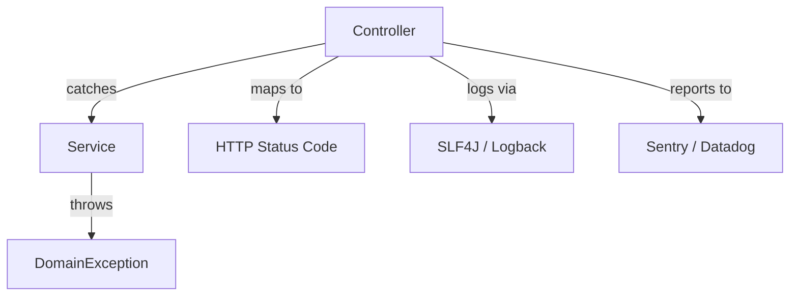

---

## Security Considerations

Security architecture for {{TOPIC_NAME}} at scale:

### 1. {{Critical security concern}}

**Risk level:** Critical
**OWASP category:** {{relevant OWASP category}}

```java
// ❌ Vulnerable
...

// ✅ Secure
...
```

**Attack scenario:** Step-by-step of how an attacker could exploit this.
**Mitigation:** Multiple layers of protection.

### Security Architecture Checklist

- [ ] **Input validation** — validate at controller boundaries (Bean Validation / JSR-380)
- [ ] **SQL injection** — use JPA/PreparedStatement, never string concatenation
- [ ] **Authentication** — Spring Security with proper session management
- [ ] **Authorization** — @PreAuthorize at service layer
- [ ] **Secrets management** — use Vault or env variables, never hardcode
- [ ] **Dependency scanning** — OWASP Dependency Check in Maven/Gradle build
- [ ] **Audit logging** — Spring AOP for security-relevant events

---

## Performance Optimization

Advanced JVM performance optimization strategies for {{TOPIC_NAME}}:

### Optimization 1: G1GC / ZGC Tuning

```bash
# G1GC tuning flags for low-latency applications
java -XX:+UseG1GC \
     -XX:MaxGCPauseMillis=200 \
     -XX:G1HeapRegionSize=16m \
     -Xms4g -Xmx4g \
     -jar application.jar

# ZGC for ultra-low latency (Java 15+)
java -XX:+UseZGC \
     -Xms4g -Xmx4g \
     -jar application.jar
```

### Optimization 2: {{name}}

```java
// Before — causing unnecessary GC pressure
...

// After — reduced allocations / object reuse
...
```

**JFR evidence:**
```bash
# Record with JFR
java -XX:StartFlightRecording=duration=60s,filename=recording.jfr -jar app.jar
# Analyze in JDK Mission Control
```

### Performance Architecture

| Layer | Optimization | Impact | Cost |
|:-----:|:------------|:------:|:----:|
| **Algorithm** | {{approach}} | Highest | Requires redesign |
| **JVM flags** | G1GC tuning, heap sizing | High | Low effort |
| **Application** | StringJoiner, Stream parallelism | Medium | Moderate |
| **I/O** | Connection pooling, batch ops | Varies | May need infra changes |

> Every optimization must have JMH benchmark proof.
> StringJoiner vs StringBuilder: use StringJoiner for delimited output.
> Stream.parallel() pitfall: adds overhead for small datasets — only use for CPU-bound ops on large collections.

---

## Metrics & Analytics

Observability architecture and SLO design for {{TOPIC_NAME}}:

### SLO / SLA Definition

| SLI | SLO Target | Measurement window | Consequence if breached |
|-----|-----------|-------------------|------------------------|
| **{{availability}}** | 99.9% | 30 days | PagerDuty alert |
| **{{latency p99}}** | < {{Xms}} | 5 min rolling | Warning alert |
| **{{error rate}}** | < {{X%}} | 1 hour | Incident created |

### Spring Boot Actuator + Prometheus

```yaml
# application.yml
management:
  endpoints:
    web:
      exposure:
        include: health,metrics,prometheus
  metrics:
    export:
      prometheus:
        enabled: true
```

---

## Debugging Guide

Advanced debugging techniques for {{TOPIC_NAME}} at scale:

### Problem 1: {{Production issue}}

**Diagnostic steps:**
```bash
# Thread dump for deadlock detection
jstack -l <pid> > thread_dump.txt

# Heap analysis
jmap -dump:format=b,file=heap.hprof <pid>
# Analyze with Eclipse MAT or VisualVM

# Async-profiler flamegraph
./profiler.sh -d 30 -e cpu -f profile.html <pid>
```

### Advanced Tools & Techniques

| Tool | Use case | When to use |
|------|----------|-------------|
| `async-profiler` | CPU/allocation flamegraph | Performance bottlenecks |
| `jstack` | Thread dump / deadlock | Concurrency issues |
| `jmap` / Eclipse MAT | Heap dump analysis | Memory leaks |
| `JFR + JMC` | Continuous profiling | Production monitoring |
| IntelliJ IDEA debugger | Step-through debugging | Complex logic bugs |

---

## Best Practices

- **Practice 1:** Explanation + impact on Java codebase
- **Practice 2:** Explanation + when to break this rule
- **Practice 3:** Reference to Effective Java item where applicable

> 5-8 practices. Include team impact and governance.
> Reference Effective Java (Bloch) for canonical Java wisdom.

---

## Edge Cases & Pitfalls

### Pitfall 1: {{Scale pitfall}}

```java
// Code that works fine until 10K connections / 1M records / etc.
```

**At what scale it breaks:** Specific numbers.
**Root cause:** Why it fails (JVM thread model, GC, etc.)
**Solution:** Architecture-level fix.

---

## Postmortems & System Failures

### The {{Company/System}} Outage

- **The goal:** {{What they were trying to achieve}}
- **The mistake:** {{How they misused this Java feature}}
- **The impact:** {{Downtime, data loss, degraded performance}}
- **The fix:** {{How they solved it permanently}}

**Key takeaway:** {{Architectural lesson learned}}

---

## Common Mistakes

### Mistake 1: {{Architectural anti-pattern in Java}}

```java
// ❌ Common but wrong architecture
...

// ✅ Better approach
...
```

**Why seniors still make this mistake:** Context.
**How to prevent:** Code review checklist, PMD/SpotBugs rule, etc.

---

## Tricky Points

### Tricky Point 1: {{JLS / JVM spec subtlety}}

```java
// Code that exploits a subtle Java specification detail
```

**JLS reference:** Java Language Specification section.
**Why this matters:** Real-world impact.

---

## Comparison with Other Languages

| Aspect | Java | Kotlin | Go | Scala | C# |
|--------|:---:|:------:|:---:|:----:|:---:|
| {{Aspect 1}} | {{approach}} | {{approach}} | {{approach}} | {{approach}} | {{approach}} |

### Architectural trade-offs:

- **Java vs Kotlin:** Kotlin's null safety and coroutines vs Java's verbosity and Virtual Threads
- **Java vs Go:** JVM warmup overhead vs Go's instant startup; GC vs GOGC
- **Java vs Scala:** Expressiveness vs simplicity and learnability

---

## Test

### Architecture Questions

**1. You're designing {{system}} with Spring Boot. Which approach is best and why?**

- A) ...
- B) ...
- C) ...
- D) ...

<details>
<summary>Answer</summary>
**C)** — Full architectural reasoning.
</details>

### Performance Analysis

**2. This Java method allocates too much on the heap. How would you optimize it?**

```java
// code with allocation issues
```

<details>
<summary>Answer</summary>
Step-by-step optimization with JMH benchmark results.
</details>

---

## Cheat Sheet

### JVM Tuning Quick Reference

| Goal | JVM Flag | When to use |
|------|----------|-------------|
| Low-latency GC | `-XX:+UseZGC` | Java 15+, latency-sensitive |
| Balanced throughput/latency | `-XX:+UseG1GC` | Most production workloads |
| Max heap size | `-Xmx<size>` | Prevent OOM |
| Min heap size | `-Xms<size>` | Reduce startup GC |
| GC logging | `-Xlog:gc*` | Debugging GC issues |

### Code Review Checklist

- [ ] No String concatenation in loops — use StringBuilder/StringJoiner
- [ ] Stream.parallel() only for CPU-bound, large datasets
- [ ] try-with-resources for all Closeable resources
- [ ] Collections pre-sized when capacity is known
- [ ] No raw types — use generics

---

## Self-Assessment Checklist

### I can architect:
- [ ] Design Spring Boot systems that use {{TOPIC_NAME}} at scale
- [ ] Choose the right JVM GC strategy based on requirements
- [ ] Evaluate trade-offs and document decisions

### I can optimize:
- [ ] Profile using async-profiler / JFR
- [ ] Tune JVM flags for production workloads
- [ ] Know when NOT to optimize

---

## Summary

- Key architectural insight 1
- Key JVM performance insight 2
- Key leadership insight 3

**Senior mindset:** Not just "how" but "when", "why", and "what are the JVM implications".

---

## Further Reading

- **JEP:** [{{JEP title}}]({{url}}) — context on why Java made this design decision
- **Effective Java:** Bloch, 3rd edition — relevant items
- **Conference talk:** [{{talk title}}]({{url}}) — speaker, key insights
- **Blog:** [Netflix Java Engineering](https://netflixtechblog.com/) / [LinkedIn Engineering](https://engineering.linkedin.com/)

---

## Related Topics

- **[{{Related Topic 1}}](../XX-related-topic/)** — architectural connection
- **[{{Related Topic 2}}](../XX-related-topic/)** — performance connection

---

## Diagrams & Visual Aids

> Include **at least 2-3 visual aids** per document.

### Example — Architecture Diagram

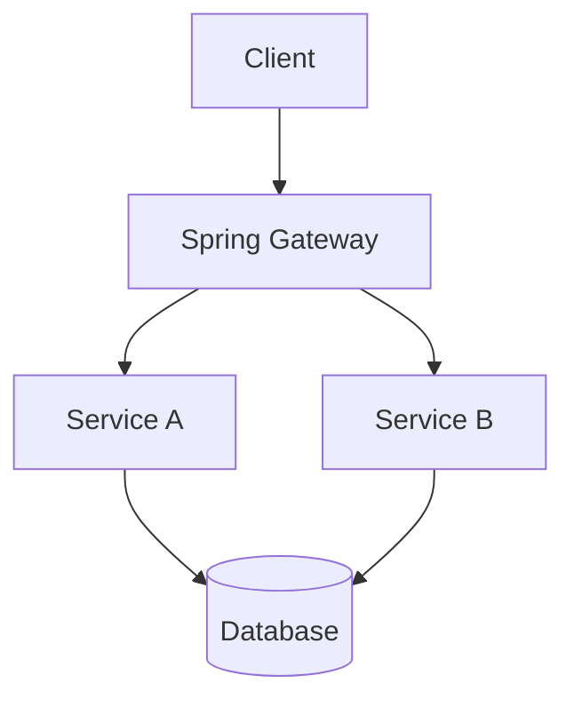

</details>

---
---

# TEMPLATE 4 — `professional.md`

<details open>
<summary><strong>Template Content</strong></summary>

# {{TOPIC_NAME}} — Under the Hood

<!-- Table of Contents is OPTIONAL. Include only if the topic has many sections and it helps navigation. Remove this section entirely if not needed. -->

## Table of Contents

1. [Introduction](#introduction)
2. [How It Works Internally](#how-it-works-internally)
3. [JVM Deep Dive](#jvm-deep-dive)
4. [Bytecode Analysis](#bytecode-analysis)
5. [JIT Compilation](#jit-compilation)
6. [Memory Layout](#memory-layout)
7. [GC Internals](#gc-internals)
8. [Source Code Walkthrough](#source-code-walkthrough)
9. [Query Execution Plan Analysis](#query-execution-plan-analysis)
10. [Performance Internals](#performance-internals)
11. [Edge Cases at the Lowest Level](#edge-cases-at-the-lowest-level)
12. [Test](#test)
13. [Tricky Questions](#tricky-questions)
14. [Summary](#summary)
15. [Further Reading](#further-reading)
16. [Diagrams & Visual Aids](#diagrams--visual-aids)

---

## Introduction

> Focus: "What happens under the hood?"

This document explores what the JVM does internally when you use {{TOPIC_NAME}}.
For developers who want to understand:
- What bytecode the compiler generates
- How the JIT compiler optimizes it
- How the GC manages the memory
- What class loading does
- How the Java Memory Model affects behavior

---

## How It Works Internally

Step-by-step breakdown of what happens when the JVM executes {{feature}}:

1. **Source code** → What you write in `.java`
2. **Bytecode** → What `javac` compiles to `.class`
3. **Class Loading** → How the ClassLoader loads it into the JVM
4. **Interpretation** → First few executions (interpreter)
5. **JIT Compilation** → Hot path compilation by C1/C2 compiler
6. **Machine code** → What actually runs on CPU
7. **GC** → How memory is reclaimed

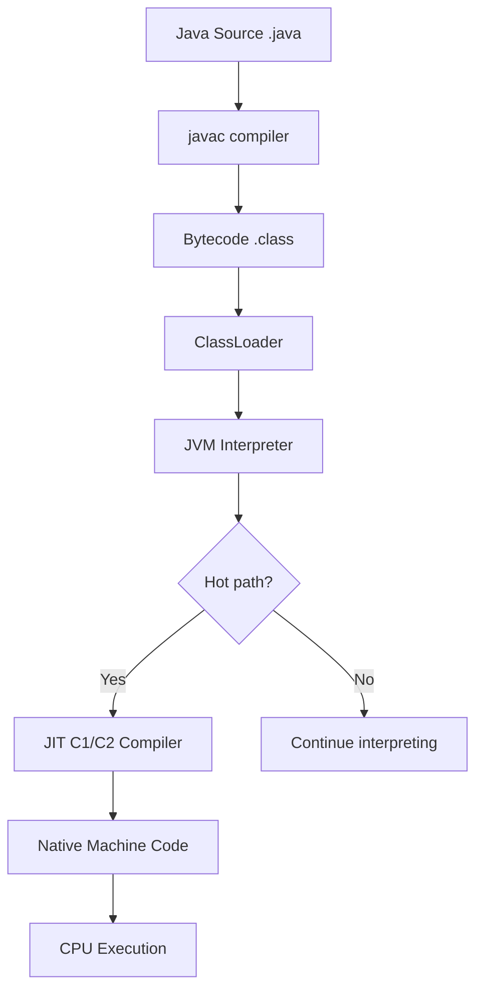

---

## JVM Deep Dive

### How the JVM handles {{feature}}

**Key JVM structures:**

```
JVM Runtime Data Areas:
┌─────────────────────────────────┐
│  Method Area (Metaspace)        │  ← Class metadata, bytecode
│  Class structures, static vars  │
├─────────────────────────────────┤
│  Heap                           │  ← Objects, arrays (GC managed)
│  Young Gen │ Old Gen            │
├─────────────────────────────────┤
│  JVM Stack (per thread)         │  ← Stack frames, local vars
│  Frame │ Frame │ Frame          │
├─────────────────────────────────┤
│  PC Register (per thread)       │  ← Current bytecode instruction
│  Native Method Stack            │
└─────────────────────────────────┘
```

**Key JVM specifications:**
- JVM Specification reference for {{feature}}
- Thread safety guarantees from Java Memory Model
- Happens-before relationships

---

## Bytecode Analysis

What bytecode `javac` generates for {{TOPIC_NAME}}:

```bash
# Compile and disassemble
javac Main.java
javap -c -verbose Main.class
```

```
// javap -c output — annotated
public void {{method}}();
  Code:
     0: {{instruction}}    // explanation
     1: {{instruction}}    // explanation
     2: {{instruction}}    // explanation
```

**What to look for:**
- Number of bytecode instructions
- Stack depth (`max_stack`)
- Local variables count (`max_locals`)
- Object allocations (`new` instructions)
- Method dispatch (`invokevirtual` vs `invokeinterface` vs `invokestatic`)

---

## JIT Compilation

How the JIT compiler optimizes {{TOPIC_NAME}}:

```bash
# Print JIT compilation events
java -XX:+PrintCompilation -jar app.jar

# Print inlining decisions
java -XX:+UnlockDiagnosticVMOptions -XX:+PrintInlining -jar app.jar

# View generated assembly (requires hsdis)
java -XX:+UnlockDiagnosticVMOptions -XX:+PrintAssembly \
     -XX:CompileCommand=print,*ClassName.methodName -jar app.jar
```

**JIT optimizations applied to {{TOPIC_NAME}}:**
- Inlining decisions (C1 vs C2 compiler)
- Escape analysis — stack allocation instead of heap
- Loop unrolling, dead code elimination
- Devirtualization of interface calls

---

## Memory Layout

How objects related to {{TOPIC_NAME}} are laid out in JVM memory:

```
Java Object Layout (64-bit JVM with compressed oops):
+------------------+
|  Object Header   |  12 bytes (mark word + class pointer)
|------------------|
|  Field 1 (int)   |   4 bytes
|  Field 2 (long)  |   8 bytes
|  Field 3 (ref)   |   4 bytes (compressed oop)
|  padding         |   0-7 bytes (alignment to 8 bytes)
+------------------+
```

**Key points:**
- Object header overhead: 12 bytes (compressed oops) or 16 bytes
- Field ordering is reordered by JVM for alignment
- Use JOL (Java Object Layout) to measure actual sizes

```java
// Verify with JOL
import org.openjdk.jol.info.ClassLayout;

System.out.println(ClassLayout.parseClass({{ClassName}}.class).toPrintable());
```

---

## GC Internals

How GC manages {{TOPIC_NAME}}-related objects:

### G1GC Behavior

```bash
# Enable GC logging
java -Xlog:gc*:file=gc.log:time,uptime,level,tags \
     -XX:+UseG1GC \
     -jar app.jar
```

**G1GC regions relevant to {{TOPIC_NAME}}:**
- Young generation (Eden + Survivor): where new objects start
- Old generation: where long-lived objects are promoted
- Humongous regions: objects > 50% of G1 region size

### ZGC Behavior (Java 15+)

```bash
java -XX:+UseZGC -Xlog:gc*:file=gc.log:time -jar app.jar
```

**ZGC advantages for {{TOPIC_NAME}}:**
- Sub-millisecond pauses regardless of heap size
- Concurrent marking and relocation

---

## Source Code Walkthrough

Walking through the actual OpenJDK source code:

**File:** `src/java.base/share/classes/java/{{package}}/{{file}}.java`

```java
// Annotated excerpt from OpenJDK source code
// with line-by-line explanation
```

> Reference specific OpenJDK version (e.g., JDK 21).
> Source: https://github.com/openjdk/jdk

---

## Query Execution Plan Analysis

> This section applies when {{TOPIC_NAME}} involves JVM execution plans (JIT traces, profiling output).

```bash
# Async-profiler allocation profiling
./profiler.sh -d 30 -e alloc -f alloc_profile.html <pid>

# JFR method profiling
jcmd <pid> JFR.start duration=60s filename=recording.jfr
jfr print --events MethodStatistics recording.jfr
```

**Reading JFR output:**
- High `alloc` samples in a method → GC pressure
- High `cpu` samples → JIT hasn't optimized hot path yet

---

## Performance Internals

### JMH Benchmarks with Profiling

```java
@State(Scope.Benchmark)
@BenchmarkMode(Mode.AverageTime)
@OutputTimeUnit(TimeUnit.NANOSECONDS)
public class {{Topic}}Benchmark {
    @Benchmark
    public void measureFeature(Blackhole bh) {
        // benchmark code
    }
}
```

```bash
mvn clean package
java -jar target/benchmarks.jar -prof gc -prof stack
```

**Internal performance characteristics:**
- Object allocation rate (bytes/op)
- GC pauses triggered
- JIT compilation threshold (default: 10K invocations for C2)
- Cache miss impact

---

## Metrics & Analytics (JVM Level)

### JVM Runtime Metrics for {{TOPIC_NAME}}

```java
import java.lang.management.ManagementFactory;
import java.lang.management.MemoryMXBean;
import java.lang.management.GarbageCollectorMXBean;

MemoryMXBean memoryBean = ManagementFactory.getMemoryMXBean();
long heapUsed = memoryBean.getHeapMemoryUsage().getUsed();

List<GarbageCollectorMXBean> gcBeans =
    ManagementFactory.getGarbageCollectorMXBeans();
gcBeans.forEach(gc ->
    System.out.printf("GC: %s, count: %d, time: %dms%n",
        gc.getName(), gc.getCollectionCount(), gc.getCollectionTime()));
```

### Key JVM Metrics for This Feature

| Metric | What it measures | Impact of {{TOPIC_NAME}} |
|--------|-----------------|--------------------------|
| `jvm.memory.heap.used` | Live heap objects | {{how this feature affects it}} |
| `jvm.gc.pause` | GC pause duration | {{how this feature affects it}} |
| `jvm.threads.live` | Active thread count | {{how this feature affects it}} |
| `jvm.classes.loaded` | Loaded class count | {{how this feature affects it}} |

---

## Edge Cases at the Lowest Level

### Edge Case 1: {{name}}

What happens internally when {{extreme scenario}}:

```java
// Code that pushes JVM limits
```

**Internal behavior:** Step-by-step of what JVM does.
**Why it matters:** Impact on production systems.

---

## Test

### Internal Knowledge Questions

**1. What bytecode instruction is generated when {{action}} in Java?**

<details>
<summary>Answer</summary>
`{{bytecode instruction}}` — explanation from `javap -c` output.
</details>

**2. What does this JIT output tell you?**

```
{{PrintCompilation or PrintInlining output}}
```

<details>
<summary>Answer</summary>
Analysis of the JIT compilation output.
</details>

> 5-8 questions. Require knowledge of JVM, bytecode, or GC internals.

---

## Tricky Questions

**1. {{Question about JVM internal behavior that contradicts common assumptions}}?**

<details>
<summary>Answer</summary>
Explanation with proof (JMH benchmark, javap output, or JVM spec reference).
</details>

> 3-5 questions. Should require reading OpenJDK source or JVM spec to answer definitively.

---

## Self-Assessment Checklist

### I can explain internals:
- [ ] What bytecode `javac` generates for this feature (`javap -c`)
- [ ] How the JIT compiler (C1/C2) optimizes it (`-XX:+PrintCompilation`)
- [ ] Memory layout in the JVM heap (JOL analysis)
- [ ] GC behavior when this feature creates/releases objects

### I can analyze:
- [ ] Read and understand `javap -c` bytecode output
- [ ] Interpret JFR/async-profiler flamegraphs
- [ ] Identify performance characteristics from GC logs
- [ ] Predict behavior under extreme heap pressure

### I can prove:
- [ ] Back claims with JMH benchmarks
- [ ] Reference JVM specification or OpenJDK source code
- [ ] Demonstrate internal behavior with JOL, JFR, async-profiler

---

## Summary

- Internal mechanism 1 (bytecode level)
- Internal mechanism 2 (JIT level)
- Internal mechanism 3 (GC level)

**Key takeaway:** Understanding JVM internals helps you write faster, more predictable Java code and tune it for production.

---

## Further Reading

- **OpenJDK source:** [{{class file}}](https://github.com/openjdk/jdk/blob/master/src/java.base/share/classes/{{path}})
- **JEP:** [{{JEP title}}]({{url}})
- **Book:** "Java Performance" (Scott Oaks) — chapter on {{topic}}
- **Talk:** [{{talk about JVM internals}}]({{url}})

---

## Diagrams & Visual Aids

> Include **at least 2-3 visual aids** per document.

### JVM Compilation Pipeline

```mermaid
flowchart TD
    A[Java Source .java] --> B[javac]
    B --> C[Bytecode .class]
    C --> D[ClassLoader]
    D --> E[JVM Interpreter]
    E --> F{10K invocations?}
    F -->|Yes| G[C1 JIT Compiler]
    G --> H{Very hot?}
    H -->|Yes| I[C2 JIT Compiler]
    H -->|No| J[C1 Machine Code]
    I --> K[Optimized Machine Code]
```

### JVM Memory Layout

```
+---------------------------+
|     JVM Memory Model      |
|---------------------------|
|  Metaspace                |  ← Class metadata (off-heap)
|  (class data, bytecode)   |
|---------------------------|
|  Heap                     |  ← GC managed
|  Young Gen   | Old Gen    |
|  Eden|S0|S1  |            |
|---------------------------|
|  Stack (per thread)       |  ← Stack frames, local vars
|  Frame | Frame | Frame    |
|---------------------------|
|  Direct Memory (NIO)      |  ← ByteBuffer.allocateDirect
+---------------------------+
```

</details>

---
---

# TEMPLATE 5 — `interview.md`

<details open>
<summary><strong>Template Content</strong></summary>

# {{TOPIC_NAME}} — Interview Questions

## Table of Contents

1. [Junior Level](#junior-level)
2. [Middle Level](#middle-level)
3. [Senior Level](#senior-level)
4. [Scenario-Based Questions](#scenario-based-questions)
5. [FAQ](#faq)

---

## Junior Level

### 1. {{Basic conceptual question about Java}}?

**Answer:**
Clear, concise explanation that a junior Java developer should be able to give.

---

### 2. {{OOP concept question}}?

**Answer:**
...with a simple Java code example.

```java
// Simple illustrative example
```

---

> 5-7 junior questions. Test basic Java OOP, syntax, and Maven/Gradle setup.

---

## Middle Level

### 4. {{Question about generics, streams, or lambdas}}?

**Answer:**
Detailed answer with real-world Spring Boot context.

```java
// Code example showing Java 8+ feature
```

---

### 5. {{Question about design patterns in Java}}?

**Answer:**
...

---

> 4-6 middle questions. Test practical Java experience and Spring Boot usage.

---

## Senior Level

### 7. {{JVM tuning or architecture question}}?

**Answer:**
Comprehensive answer covering JVM flags, GC selection, and trade-offs.

---

### 8. {{Spring ecosystem at scale question}}?

**Answer:**
...

---

> 4-6 senior questions. Test JVM internals and architectural leadership.

---

## Scenario-Based Questions

### 10. Your Spring Boot application is experiencing long GC pauses. How do you approach this?

**Answer:**
Step-by-step approach:
1. Enable GC logging: `-Xlog:gc*`
2. Analyze with JDK Mission Control
3. Identify promotion failure or humongous allocations
4. Tune G1GC: `-XX:MaxGCPauseMillis`, consider ZGC for Java 15+

---

> 3-5 scenario questions. Test problem-solving under realistic Java production conditions.

---

## FAQ

### Q: What's the difference between checked and unchecked exceptions in Java?

**A:** Clear answer with context about what interviewers are looking for.

### Q: {{Another Java-specific FAQ}}?

**A:** ...

### Q: What do interviewers look for when asking about {{TOPIC_NAME}} in Java?

**A:** Key evaluation criteria:
- **Junior:** Can write the basic syntax and explain what it does
- **Middle:** Can explain trade-offs, uses Java 8+ features correctly
- **Senior:** Can discuss JVM implications, performance, and architectural patterns

</details>

---
---

# TEMPLATE 6 — `tasks.md`

<details open>
<summary><strong>Template Content</strong></summary>

# {{TOPIC_NAME}} — Practical Tasks

## Table of Contents

1. [Junior Tasks](#junior-tasks)
2. [Middle Tasks](#middle-tasks)
3. [Senior Tasks](#senior-tasks)
4. [Questions](#questions)
5. [Mini Projects](#mini-projects)
6. [Challenge](#challenge)

---

## Junior Tasks

### Task 1: {{Simple coding task title}}

**Type:** 💻 Code

**Goal:** {{What skill this practices}}

**Instructions:**
1. ...
2. ...
3. ...

**Starter code:**

```java
public class Main {
    public static void main(String[] args) {
        // TODO: Complete this
    }
}
```

**Expected output:**
```
...
```

**Evaluation criteria:**
- [ ] Code compiles and runs
- [ ] Output matches expected
- [ ] Follows Java naming conventions
- [ ] {{Specific check}}

---

### Task 2: {{Simple design task title}}

**Type:** 🎨 Design

**Goal:** {{What design skill this practices}}

**Deliverable:** {{Diagram, API sketch, class diagram}}

**Example format:**
```mermaid
classDiagram
    class {{ClassName}} {
        +field: Type
        +method(): ReturnType
    }
```

---

> 3-4 junior tasks. Mix of 💻 Code and 🎨 Design tasks.
> Code tasks: simple, guided, with starter code and clear expected output.
> Design tasks: class diagrams, UML, API sketches.

---

## Middle Tasks

### Task 4: {{Spring Boot production-oriented task}}

**Type:** 💻 Code

**Goal:** {{What real-world Java skill this builds}}

**Scenario:** {{Brief context — e.g., "You're building a Spring Boot REST API and need to..."}}

**Requirements:**
- [ ] {{Requirement 1}}
- [ ] Write JUnit 5 tests for your solution
- [ ] Handle exceptions with @ExceptionHandler
- [ ] Use SLF4J for logging

**Hints:**
<details>
<summary>Hint 1</summary>
...
</details>

**Evaluation criteria:**
- [ ] All requirements met
- [ ] Tests pass with JUnit 5 / Mockito
- [ ] Exception handling is proper
- [ ] Code follows Java conventions and Effective Java principles

---

## Senior Tasks

### Task 7: {{JVM tuning / architecture task}}

**Type:** 💻 Code

**Goal:** {{JVM optimization or Spring architecture skill}}

**Scenario:** {{Complex real-world Java problem}}

**Requirements:**
- [ ] {{High-level requirement 1}}
- [ ] Run JMH benchmarks
- [ ] Document JVM flag choices and GC strategy
- [ ] Code review: identify 3 issues in the provided Java code

**Provided code to review/optimize:**

```java
// Sub-optimal Java code that needs improvement
```

---

## Questions

### 1. {{Conceptual Java question}}?

**Answer:**
Clear explanation covering the key Java concept.

---

> 5-10 questions. Mix of JVM, concurrency, Spring, and design pattern questions.

---

## Mini Projects

### Project 1: {{Larger Java project combining concepts}}

**Goal:** {{What this project teaches end-to-end}}

**Description:**
Build a {{description}} using Spring Boot and {{TOPIC_NAME}} concepts.

**Requirements:**
- [ ] {{Feature 1}}
- [ ] JUnit 5 tests with >80% coverage
- [ ] Maven/Gradle build
- [ ] README with setup and usage instructions

**Difficulty:** Junior / Middle / Senior
**Estimated time:** X hours

---

## Challenge

### {{Competitive/Hard Java challenge}}

**Problem:** {{Difficult problem statement}}

**Constraints:**
- Must complete under X ms (measured with JMH)
- Memory usage under X MB (JVM heap)
- No external libraries beyond JDK

**Scoring:**
- Correctness: 50%
- JMH performance: 30%
- Code quality: 20%

</details>

---
---

# TEMPLATE 7 — `find-bug.md`

<details open>
<summary><strong>Template Content</strong></summary>

# {{TOPIC_NAME}} — Find the Bug

> **Practice finding and fixing bugs in Java code related to {{TOPIC_NAME}}.**
> Each exercise contains buggy code — your job is to find the bug, explain why it happens, and fix it.

---

## How to Use

1. Read the buggy code carefully
2. Try to find the bug **without** looking at the hint
3. Write the fix yourself before checking the solution
4. Understand **why** the bug happens — not just how to fix it

### Difficulty Levels

| Level | Description |
|:-----:|:-----------|
| 🟢 | **Easy** — Common beginner mistakes, NullPointerException, basic logic errors |
| 🟡 | **Medium** — ConcurrentModificationException, generics type erasure, off-by-one |
| 🔴 | **Hard** — Memory leaks, race conditions, subtle JVM/JMM behavior |

---

> **Language-specific bugs for Java topics:**
> - NullPointerException (null reference, Optional not checked)
> - ConcurrentModificationException (modifying collection while iterating)
> - Off-heap memory leak (DirectByteBuffer not released)
> - Generics type erasure issue (ClassCastException at runtime)
> - equals()/hashCode() contract violation in HashMap
> - String comparison with == instead of .equals()
> - Integer autoboxing == comparison for values outside -128..127
> - Thread safety: unsynchronized access to shared mutable state

---

## Bug 1: {{Bug title}} 🟢

**What the code should do:** {{Expected behavior}}

```java
public class Main {
    public static void main(String[] args) {
        // Buggy code here
        // The bug should be realistic and related to {{TOPIC_NAME}}
        System.out.println("...");
    }
}
```

**Expected output:**
```
...
```

**Actual output:**
```
...
```

<details>
<summary>💡 Hint</summary>

Look at {{specific area where the bug is}} — what happens when {{condition}}?

</details>

<details>
<summary>🐛 Bug Explanation</summary>

**Bug:** {{What exactly is wrong}}
**Why it happens:** {{Root cause — reference to JLS or JVM spec if relevant}}
**Impact:** {{What goes wrong — wrong output, NPE, ClassCastException, memory leak, etc.}}

</details>

<details>
<summary>✅ Fixed Code</summary>

```java
public class Main {
    public static void main(String[] args) {
        // Fixed code with comments explaining the fix
        System.out.println("...");
    }
}
```

**What changed:** {{One-line summary of the fix}}

</details>

---

## Bug 2: {{Bug title}} 🟢

**What the code should do:** {{Expected behavior}}

```java
// Buggy code
```

<details>
<summary>💡 Hint</summary>
...
</details>

<details>
<summary>🐛 Bug Explanation</summary>

**Bug:** ...
**Why it happens:** ...
**Impact:** ...

</details>

<details>
<summary>✅ Fixed Code</summary>

```java
// Fixed code
```

**What changed:** ...

</details>

---

## Bug 3: {{Bug title}} 🟢

**What the code should do:** {{Expected behavior}}

```java
// Buggy code
```

<details>
<summary>💡 Hint</summary>
...
</details>

<details>
<summary>🐛 Bug Explanation</summary>

**Bug:** ...
**Why it happens:** ...
**Impact:** ...

</details>

<details>
<summary>✅ Fixed Code</summary>

```java
// Fixed code
```

**What changed:** ...

</details>

---

## Bug 4: {{Bug title}} 🟡

**What the code should do:** {{Expected behavior}}

```java
// Buggy code — medium difficulty
// Logic error, ConcurrentModificationException, or type erasure issue
```

**Expected output:**
```
...
```

**Actual output / exception:**
```
...
```

<details>
<summary>💡 Hint</summary>
...
</details>

<details>
<summary>🐛 Bug Explanation</summary>

**Bug:** ...
**Why it happens:** ...
**Impact:** ...

</details>

<details>
<summary>✅ Fixed Code</summary>

```java
// Fixed code
```

**What changed:** ...

</details>

---

## Bug 5: {{Bug title}} 🟡

**What the code should do:** {{Expected behavior}}

```java
// Buggy code — generics or equals/hashCode issue
```

<details>
<summary>💡 Hint</summary>
...
</details>

<details>
<summary>🐛 Bug Explanation</summary>

**Bug:** ...
**Why it happens:** ...
**Impact:** ...

</details>

<details>
<summary>✅ Fixed Code</summary>

```java
// Fixed code
```

**What changed:** ...

</details>

---

## Bug 6: {{Bug title}} 🟡

**What the code should do:** {{Expected behavior}}

```java
// Buggy code — real-world Spring/production pattern with a bug
```

<details>
<summary>💡 Hint</summary>
...
</details>

<details>
<summary>🐛 Bug Explanation</summary>

**Bug:** ...
**Why it happens:** ...
**Impact:** ...

</details>

<details>
<summary>✅ Fixed Code</summary>

```java
// Fixed code
```

**What changed:** ...

</details>

---

## Bug 7: {{Bug title}} 🟡

**What the code should do:** {{Expected behavior}}

```java
// Buggy code — autoboxing or string comparison issue
```

<details>
<summary>💡 Hint</summary>
...
</details>

<details>
<summary>🐛 Bug Explanation</summary>

**Bug:** ...
**Why it happens:** ...
**Impact:** ...

</details>

<details>
<summary>✅ Fixed Code</summary>

```java
// Fixed code
```

**What changed:** ...

</details>

---

## Bug 8: {{Bug title}} 🔴

**What the code should do:** {{Expected behavior}}

```java
// Buggy code — hard to spot
// Off-heap memory leak or race condition
```

**Expected output:**
```
...
```

**Actual output:**
```
... (or: unpredictable / OutOfMemoryError / deadlock)
```

<details>
<summary>💡 Hint</summary>

Run with `-XX:+HeapDumpOnOutOfMemoryError` or use async-profiler allocation profiling.

</details>

<details>
<summary>🐛 Bug Explanation</summary>

**Bug:** ...
**Why it happens:** ...
**Impact:** ...
**JVM spec reference:** {{link or JLS section if applicable}}

</details>

<details>
<summary>✅ Fixed Code</summary>

```java
// Fixed code with detailed comments
```

**What changed:** ...
**Alternative fix:** {{Another valid approach if exists}}

</details>

---

## Bug 9: {{Bug title}} 🔴

**What the code should do:** {{Expected behavior}}

```java
// Buggy code — architecture-level bug
// Works in tests but fails in production under concurrent load
```

<details>
<summary>💡 Hint</summary>
...
</details>

<details>
<summary>🐛 Bug Explanation</summary>

**Bug:** ...
**Why it happens:** ...
**Impact:** ...
**How to detect:** {{jstack for deadlock, async-profiler for race, jmap for memory leak}}

</details>

<details>
<summary>✅ Fixed Code</summary>

```java
// Fixed code
```

**What changed:** ...

</details>

---

## Bug 10: {{Bug title}} 🔴

**What the code should do:** {{Expected behavior}}

```java
// Buggy code — the hardest one
// Multiple subtle issues or a single very tricky JVM-level bug
```

<details>
<summary>💡 Hint</summary>
...
</details>

<details>
<summary>🐛 Bug Explanation</summary>

**Bug:** ...
**Why it happens:** ...
**Impact:** ...

</details>

<details>
<summary>✅ Fixed Code</summary>

```java
// Fixed code
```

**What changed:** ...

</details>

---

## Score Card

Track your progress:

| Bug | Difficulty | Found without hint? | Understood why? | Fixed correctly? |
|:---:|:---------:|:-------------------:|:---------------:|:----------------:|
| 1 | 🟢 | ☐ | ☐ | ☐ |
| 2 | 🟢 | ☐ | ☐ | ☐ |
| 3 | 🟢 | ☐ | ☐ | ☐ |
| 4 | 🟡 | ☐ | ☐ | ☐ |
| 5 | 🟡 | ☐ | ☐ | ☐ |
| 6 | 🟡 | ☐ | ☐ | ☐ |
| 7 | 🟡 | ☐ | ☐ | ☐ |
| 8 | 🔴 | ☐ | ☐ | ☐ |
| 9 | 🔴 | ☐ | ☐ | ☐ |
| 10 | 🔴 | ☐ | ☐ | ☐ |

### Rating:
- **10/10 without hints** → Senior-level Java debugging skills
- **7-9/10** → Solid middle-level understanding
- **4-6/10** → Good junior, keep practicing
- **< 4/10** → Review the topic fundamentals first

> **Rules for content generation:**
> - 10+ bugs per topic (minimum)
> - Distribution: 3 Easy (🟢), 4 Medium (🟡), 3 Hard (🔴)
> - Every bug must be **realistic** — something that actually happens in Java production
> - Buggy code must **compile** — the bug is in logic/behavior, not syntax
> - Hard bugs should involve: NullPointerException chains, ConcurrentModificationException, off-heap memory leaks, generics type erasure

</details>

---
---

# TEMPLATE 8 — `optimize.md`

<details open>
<summary><strong>Template Content</strong></summary>

# {{TOPIC_NAME}} — Optimize the Code

> **Practice optimizing slow, inefficient, or resource-heavy Java code related to {{TOPIC_NAME}}.**
> Each exercise contains working but suboptimal code — your job is to make it faster, leaner, or more efficient.

---

## How to Use

1. Read the slow code and understand what it does
2. Identify the performance bottleneck
3. Write your optimized version
4. Compare with the solution and JMH benchmark results
5. Understand **why** the optimization works

### Difficulty Levels

| Level | Focus |
|:-----:|:------|
| 🟢 | **Easy** — Obvious inefficiencies, simple fixes |
| 🟡 | **Medium** — Algorithmic improvements, allocation reduction |
| 🔴 | **Hard** — GC tuning, zero-allocation patterns, JIT-aware code |

### Optimization Categories

| Category | Icon | Description |
|:--------:|:----:|:-----------|
| **Memory** | 📦 | Reduce allocations, reuse objects, avoid copies |
| **CPU** | ⚡ | Better algorithms, fewer operations, cache efficiency |
| **Concurrency** | 🔄 | Better parallelism, reduce contention, avoid locks |
| **I/O** | 💾 | Batch operations, buffering, connection reuse |

---

> **Java-specific optimization techniques to cover:**
> - `StringJoiner` / `StringBuilder` instead of `+` in loops
> - `Stream.parallel()` pitfalls — overhead for small datasets
> - Object pooling with `Commons Pool` or custom pool
> - G1GC flag tuning: `-XX:MaxGCPauseMillis`, region sizing
> - Pre-size collections: `new ArrayList<>(initialCapacity)`
> - `BufferedReader`/`BufferedWriter` for I/O
> - `CompletableFuture` for async composition
> - `var` (Java 10+) for cleaner local variable declarations

---

## Exercise 1: {{Title}} 🟢 📦

**What the code does:** {{Brief description}}

**The problem:** {{What's slow/inefficient}}

```java
// Slow version — works correctly but wastes resources
public class SlowExample {
    public String buildString(List<String> parts) {
        // Inefficient string concatenation
        String result = "";
        for (String part : parts) {
            result += part; // creates new String object each iteration
        }
        return result;
    }
}
```

**Current benchmark:**
```
Benchmark                    Mode  Cnt     Score    Error  Units
SlowExample.buildString      avgt   10  15234.1 ± 120.4  ns/op
```

<details>
<summary>💡 Hint</summary>

Think about {{specific optimization technique}} — how many String objects are created?

</details>

<details>
<summary>⚡ Optimized Code</summary>

```java
// Fast version — same behavior, better performance
public class FastExample {
    public String buildString(List<String> parts) {
        // Optimized with StringBuilder
        StringBuilder sb = new StringBuilder();
        for (String part : parts) {
            sb.append(part);
        }
        return sb.toString();
    }
}
```

**What changed:**
- {{Change 1}} — why it helps
- {{Change 2}} — why it helps

**Optimized benchmark:**
```
Benchmark                    Mode  Cnt    Score   Error  Units
FastExample.buildString      avgt   10  2041.5 ±  22.1  ns/op
```

**Improvement:** {{X}}x faster, {{Y}}% less memory, {{Z}} fewer allocations

</details>

<details>
<summary>📚 Learn More</summary>

**Why this works:** {{Detailed explanation of the optimization principle}}
**When to apply:** {{Scenarios where this optimization matters}}
**When NOT to apply:** Single string operations — `+` is fine there (compiler optimizes it)

</details>

---

## Exercise 2: {{Title}} 🟢 ⚡

**What the code does:** {{Brief description}}
**The problem:** {{What's slow}}

```java
// Slow version
```

**Current benchmark:**
```
Benchmark    Mode  Cnt  Score  Error  Units
Slow.run     avgt   10  ...
```

<details>
<summary>💡 Hint</summary>
...
</details>

<details>
<summary>⚡ Optimized Code</summary>

```java
// Fast version
```

**What changed:** ...
**Optimized benchmark:**
```
Benchmark    Mode  Cnt  Score  Error  Units
Fast.run     avgt   10  ...
```
**Improvement:** ...

</details>

<details>
<summary>📚 Learn More</summary>
...
</details>

---

## Exercise 3: {{Title}} 🟢 📦

**What the code does:** {{Brief description}}
**The problem:** {{What's slow}}

```java
// Slow version
```

<details>
<summary>💡 Hint</summary>
...
</details>

<details>
<summary>⚡ Optimized Code</summary>

```java
// Fast version
```

**What changed:** ...
**Improvement:** ...

</details>

<details>
<summary>📚 Learn More</summary>
...
</details>

---

## Exercise 4: {{Title}} 🟡 📦

**What the code does:** {{Brief description}}
**The problem:** {{What's slow — medium difficulty}}

```java
// Slow version — allocation-heavy or algorithmically suboptimal
```

<details>
<summary>💡 Hint</summary>
...
</details>

<details>
<summary>⚡ Optimized Code</summary>

```java
// Fast version
```

**What changed:** ...
**Improvement:** ...

</details>

<details>
<summary>📚 Learn More</summary>
...
</details>

---

## Exercise 5: {{Title}} 🟡 ⚡

**What the code does:** {{Brief description}}
**The problem:** {{Stream.parallel() misuse or algorithmic issue}}

```java
// Slow version — Stream.parallel() on small dataset
```

<details>
<summary>💡 Hint</summary>
Stream.parallel() adds thread overhead — only beneficial for large, CPU-bound operations.
</details>

<details>
<summary>⚡ Optimized Code</summary>

```java
// Fast version — sequential or properly parallel
```

**What changed:** ...
**Improvement:** ...

</details>

<details>
<summary>📚 Learn More</summary>
...
</details>

---

## Exercise 6: {{Title}} 🟡 🔄

**What the code does:** {{Brief description}}
**The problem:** {{Concurrency inefficiency — lock contention, Executor misuse, etc.}}

```java
// Slow version — bad concurrency pattern
```

<details>
<summary>💡 Hint</summary>
...
</details>

<details>
<summary>⚡ Optimized Code</summary>

```java
// Fast version — better concurrency pattern
```

**What changed:** ...
**Improvement:** ...

</details>

<details>
<summary>📚 Learn More</summary>
...
</details>

---

## Exercise 7: {{Title}} 🟡 💾

**What the code does:** {{Brief description}}
**The problem:** {{I/O inefficiency — unbuffered reads/writes, missing connection pooling}}

```java
// Slow version — unbuffered I/O
```

<details>
<summary>💡 Hint</summary>
...
</details>

<details>
<summary>⚡ Optimized Code</summary>

```java
// Fast version — buffered I/O
```

**What changed:** ...
**Improvement:** ...

</details>

<details>
<summary>📚 Learn More</summary>
...
</details>

---

## Exercise 8: {{Title}} 🔴 📦

**What the code does:** {{Brief description}}
**The problem:** {{G1GC pressure, object pool needed, or zero-allocation pattern}}

```java
// Slow version — causes excessive GC
```

**Current benchmark:**
```
Benchmark    Mode  Cnt  Score   Error  Units
Slow.run     avgt   10  ...
```

**Profiling output:**
```
async-profiler alloc: {{what the profile reveals}}
```

<details>
<summary>💡 Hint</summary>

Consider object pooling (Apache Commons Pool) or pre-allocation. Check G1GC logs with `-Xlog:gc*`.

</details>

<details>
<summary>⚡ Optimized Code</summary>

```java
// Fast version — object reuse / pool
```

**What changed:**
- {{Change 1}} — detailed explanation
- {{Change 2}} — detailed explanation

**Improvement:** ...

</details>

<details>
<summary>📚 Learn More</summary>

**Advanced concept:** {{Explanation of the optimization at JVM/GC level}}
**JVM flags to consider:** {{relevant GC flags}}

</details>

---

## Exercise 9: {{Title}} 🔴 ⚡

**What the code does:** {{Brief description}}
**The problem:** {{Algorithmic or architectural Java performance issue}}

```java
// Slow version — works at small scale, fails at large scale
```

<details>
<summary>💡 Hint</summary>
...
</details>

<details>
<summary>⚡ Optimized Code</summary>

```java
// Fast version
```

**What changed:** ...
**Improvement:** ...

</details>

<details>
<summary>📚 Learn More</summary>
...
</details>

---

## Exercise 10: {{Title}} 🔴 🔄

**What the code does:** {{Brief description}}
**The problem:** {{Complex optimization requiring architectural rethink}}

```java
// Slow version — the hardest optimization challenge
```

<details>
<summary>💡 Hint</summary>
...
</details>

<details>
<summary>⚡ Optimized Code</summary>

```java
// Fast version — completely restructured
```

**What changed:**
- {{Change 1}}
- {{Change 2}}

**Improvement:** ...

</details>

<details>
<summary>📚 Learn More</summary>
...
</details>

---

## Score Card

| Exercise | Difficulty | Category | Found bottleneck? | Your improvement | Target improvement |
|:--------:|:---------:|:--------:|:-----------------:|:----------------:|:-----------------:|
| 1 | 🟢 | 📦 | ☐ | ___ x | {{X}}x |
| 2 | 🟢 | ⚡ | ☐ | ___ x | {{X}}x |
| 3 | 🟢 | 📦 | ☐ | ___ x | {{X}}x |
| 4 | 🟡 | 📦 | ☐ | ___ x | {{X}}x |
| 5 | 🟡 | ⚡ | ☐ | ___ x | {{X}}x |
| 6 | 🟡 | 🔄 | ☐ | ___ x | {{X}}x |
| 7 | 🟡 | 💾 | ☐ | ___ x | {{X}}x |
| 8 | 🔴 | 📦 | ☐ | ___ x | {{X}}x |
| 9 | 🔴 | ⚡ | ☐ | ___ x | {{X}}x |
| 10 | 🔴 | 🔄 | ☐ | ___ x | {{X}}x |

---

## Optimization Cheat Sheet

Quick reference for common Java optimizations:

| Problem | Solution | Impact |
|:--------|:---------|:------:|
| String `+` in loop | Use `StringBuilder` or `StringJoiner` | High |
| Stream.parallel() on small data | Use sequential stream | High |
| Unknown collection size | Pre-size: `new ArrayList<>(capacity)` | Medium |
| Repeated object creation | Object pooling or ThreadLocal | Medium-High |
| Unbuffered file I/O | `BufferedReader` / `BufferedWriter` | High |
| Synchronized hot path | `ReentrantReadWriteLock` or `ConcurrentHashMap` | High |
| GC pressure | Object reuse, reduce allocations | Medium |
| JDBC N+1 queries | Batch queries or JOIN | Very High |
| Blocking I/O | CompletableFuture / Virtual Threads (Java 21) | High |
| Large heap pauses | Switch to ZGC (`-XX:+UseZGC`) | High |

> **Rules for content generation:**
> - 10+ exercises per topic (minimum)
> - Distribution: 3 Easy (🟢), 4 Medium (🟡), 3 Hard (🔴)
> - Every exercise must have **JMH benchmark data** (before and after)
> - Hard exercises should involve: G1GC/ZGC tuning, object pooling, Virtual Threads
> - Include "When NOT to apply" — e.g., Stream.parallel() overhead warning
> - Include async-profiler evidence for hard exercises

</details>
