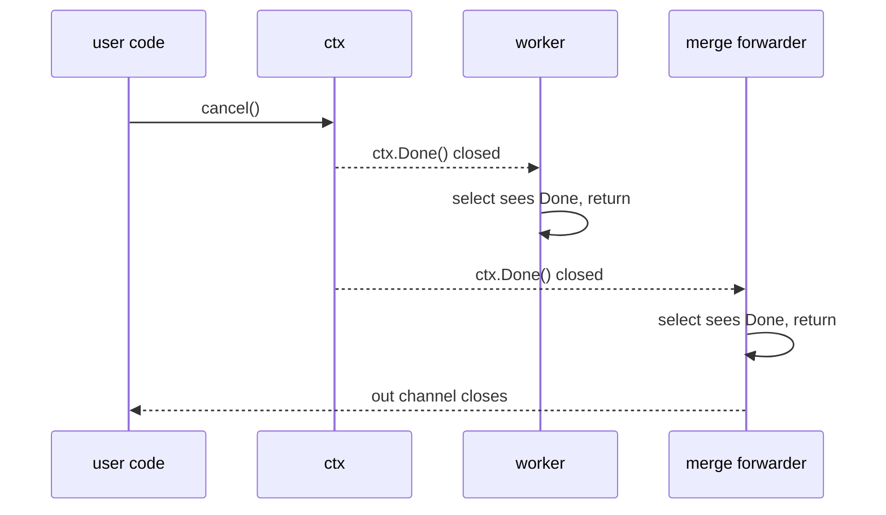

# Fan-In / Fan-Out Inside a Pipeline — Junior Level

## Table of Contents
1. [Introduction](#introduction)
2. [Prerequisites](#prerequisites)
3. [Glossary](#glossary)
4. [Core Concepts](#core-concepts)
5. [Real-World Analogies](#real-world-analogies)
6. [Mental Models](#mental-models)
7. [Pros & Cons](#pros-cons)
8. [Use Cases](#use-cases)
9. [Code Examples](#code-examples)
10. [Coding Patterns](#coding-patterns)
11. [Clean Code](#clean-code)
12. [Product Use / Feature](#product-use-feature)
13. [Error Handling](#error-handling)
14. [Security Considerations](#security-considerations)
15. [Performance Tips](#performance-tips)
16. [Best Practices](#best-practices)
17. [Edge Cases & Pitfalls](#edge-cases-pitfalls)
18. [Common Mistakes](#common-mistakes)
19. [Common Misconceptions](#common-misconceptions)
20. [Tricky Points](#tricky-points)
21. [Test](#test)
22. [Tricky Questions](#tricky-questions)
23. [Cheat Sheet](#cheat-sheet)
24. [Self-Assessment Checklist](#self-assessment-checklist)
25. [Summary](#summary)
26. [What You Can Build](#what-you-can-build)
27. [Further Reading](#further-reading)
28. [Related Topics](#related-topics)
29. [Diagrams & Visual Aids](#diagrams-visual-aids)

---

## Introduction
> Focus: "What is fan-out? What is fan-in? How do I split work across N goroutines and collect the results back into one stream?"

A pipeline in Go is a chain of stages connected by channels. Each stage is one or more goroutines that read from an input channel, do some work, and write to an output channel. So far, so simple — one producer, one transformer, one consumer.

The moment your transformer becomes slow, you want **fan-out**: take that single stage and run N copies of it in parallel, so the work happens N times faster. Each copy reads from the same input channel; the runtime hands each item to whichever copy is ready.

But you cannot leave the data scattered across N output channels. Downstream stages want a single stream. So you need **fan-in**: a small merge stage that reads from all N output channels and writes to one combined output. The pipeline shape goes from a straight line to a diamond and back:

```
producer  ->  fan-out  ->  worker 1  ->\
                          worker 2  ---->  fan-in  ->  consumer
                          worker 3  ->/
                          worker 4  ->/
```

This pattern is the bread and butter of every concurrent Go program that actually does work. Crawlers fan out across URLs. Image processors fan out across files. Log shippers fan out per partition. ETL pipelines fan out per row, fan in to write a CSV. You will write this shape thousands of times in your career.

In this file you will learn:

- What fan-out and fan-in mean, with diagrams you can carry in your head.
- How to write a basic fan-out stage that spawns N workers, all reading from one channel.
- How to write the simplest fan-in function that merges two channels into one.
- The standard recipe for merging N channels with `sync.WaitGroup`.
- Why the merge must close its output channel — and exactly when.
- The most common first-time bugs: leaked goroutines, double-closes, and missed values.
- The vocabulary: "fan-out factor", "n-way merge", "ordered vs unordered merge".

You do not yet need to know `reflect.Select`, weighted scheduling, or the runtime's `selectgo`. Those are senior and professional concerns. Right now, you need to be able to write a fan-out / fan-in pair on a whiteboard without looking it up.

---

## Prerequisites

- **Required:** You know what a goroutine is and how `go f()` works. If `go fmt.Println("hi")` is mysterious, return to the goroutines chapter.
- **Required:** You have used unbuffered and buffered channels, `make(chan T)` versus `make(chan T, n)`, and you know that send and receive on an unbuffered channel block.
- **Required:** You have closed at least one channel with `close(ch)` and read from a closed channel with `for v := range ch { ... }`.
- **Required:** You know `sync.WaitGroup` and the `Add` / `Done` / `Wait` cycle from the goroutines junior file.
- **Helpful:** You have read the very first pipeline example — producer, transformer, consumer connected by channels. The standard reference is the Go blog post *Go Concurrency Patterns: Pipelines and Cancellation*.
- **Helpful:** You have used `select` to receive from two channels. Not strictly required for this file; you will see it appear naturally.

If you can write a function that reads integers from a channel, doubles them, and writes them to another channel, you are ready. Fan-out / fan-in is "do that, but in parallel."

---

## Glossary

| Term | Definition |
|------|-----------|
| **Pipeline** | A series of stages connected by channels. Data flows from stage to stage, possibly being transformed along the way. |
| **Stage** | One unit of a pipeline. May be a single goroutine or a group of goroutines doing the same job. |
| **Fan-out** | Splitting one input stream across N parallel workers. Each worker pulls work from the same input channel. |
| **Fan-in** | Merging N output streams into one. A small "merge" goroutine reads from each input and forwards to a single output. |
| **Worker** | One goroutine inside a fan-out group. All workers in the same stage perform the same job. |
| **Merge function** | The fan-in code itself. The canonical signature is `func merge(cs ...<-chan T) <-chan T`. |
| **n-way merge** | Fan-in with N input channels merged into one output channel. |
| **Ordered merge** | A merge that preserves a per-input ordering (or some global ordering like time) in the output. |
| **Unordered merge** | A merge that emits values in whatever order they arrive. The cheap default. |
| **Fan-out factor** | The number of parallel workers in a fan-out stage. Tunable; often equal to `runtime.NumCPU()` for CPU-bound work. |
| **Backpressure** | The natural slowdown that occurs when a downstream stage cannot keep up: the upstream stage blocks on send, and the producer slows. Channels in Go give you backpressure for free. |
| **Drain** | To consume the remaining values from a channel until it closes. Required when a goroutine exits early but other goroutines may still be sending. |
| **Goroutine leak** | A goroutine that should have exited but did not. The classic fan-in leak is a worker blocked on a send to a merged channel after the caller has stopped reading. |
| **`done` channel** | A `chan struct{}` used to signal "stop." Goroutines select on it inside loops and return when it is closed. The simpler cancellation mechanism before `context.Context`. |
| **`context.Context`** | The standard cancellation and deadline carrier in modern Go. You will use it for fan-out / fan-in in production. |

---

## Core Concepts

### Fan-out is "N goroutines reading from one channel"

The classic single-stage worker pool *is* a fan-out:

```go
in := producer()
for i := 0; i < N; i++ {
    go func() {
        for v := range in {
            process(v)
        }
    }()
}
```

There is one input channel `in`. There are N workers, all reading from `in`. Go's channel runtime makes one critical guarantee: when N goroutines all receive on the same channel and a single value is sent, *exactly one* of them gets it. There is no broadcast, no duplication. The runtime arbitrates.

This is fan-out at its purest: one source, many consumers, work shared automatically.

### Fan-in is "one goroutine reading from N channels"

The mirror image is fan-in: many sources, one consumer. The standard recipe uses one goroutine per input channel, each one forwarding values into a single output channel:

```go
func merge(cs ...<-chan int) <-chan int {
    out := make(chan int)
    var wg sync.WaitGroup
    wg.Add(len(cs))
    for _, c := range cs {
        c := c
        go func() {
            defer wg.Done()
            for v := range c {
                out <- v
            }
        }()
    }
    go func() {
        wg.Wait()
        close(out)
    }()
    return out
}
```

That ten-line function is the centerpiece of every fan-in pattern you will ever write at the junior level. Memorise it. Each input channel gets one dedicated forwarder goroutine. A `WaitGroup` tracks when all forwarders have finished. A separate "closer" goroutine waits for the group to drain, then closes the output. The caller receives a single read-only channel; the caller does not know or care that the data came from multiple sources.

### Fan-out + fan-in together

In a real pipeline you do both at once. The shape is symmetric:

1. Producer sends to one input channel.
2. Fan-out: spawn N workers, each reading from the input channel, each writing to its own output channel.
3. Fan-in: merge those N output channels into one.
4. Consumer reads from the merged channel.

```go
in := produce()
outs := make([]<-chan int, N)
for i := 0; i < N; i++ {
    outs[i] = worker(in)
}
merged := merge(outs...)
for v := range merged {
    consume(v)
}
```

`worker` is a function that returns its output channel. `merge` is the function from the previous section. You have just built a parallel transformer that scales to `N` workers, with no shared state, no mutexes, no fuss.

### The close-of-output rule

This rule is the single most common bug source at the junior level:

> *The merge goroutine — and only the merge goroutine — closes the merged output channel. It does so after all input channels have closed and all per-input forwarders have exited.*

Two corollaries:

- Each fan-out worker must close its own output channel when it has nothing left to send. The merge will not close the per-worker channels for you.
- Never close the same channel twice. Closing an already-closed channel is a runtime panic, and "two goroutines might race to close" is the classic way to hit it.

The split-of-responsibility is: workers close their own channels; the merge closes the merged channel; the caller never closes anything.

### Channels are typed by direction

A polished merge signature uses receive-only `<-chan T` for the inputs and returns a receive-only `<-chan T`. This is enforced by the compiler and prevents the caller from accidentally sending into the merged channel:

```go
func merge(cs ...<-chan int) <-chan int { ... }
```

Pass a `chan int` to `<-chan int` and the conversion is automatic. The result `<-chan int` cannot be sent to — only received from. The directionality makes API misuse a compile-time error.

### Backpressure is built in

If the consumer reads slowly, the merged channel fills up (or, if unbuffered, blocks). The forwarder goroutines then block on `out <- v`. They stop reading from their input channels. Those input channels back up. The upstream workers block. Eventually the producer blocks. The whole pipeline self-regulates. You did nothing special; you got this for free by using unbuffered or modestly-buffered channels.

Add an unbounded buffer (or, worse, drop values silently) and you lose backpressure. The producer outpaces the consumer; memory grows without limit. **Default to unbuffered channels.** Only add buffer when you can articulate why.

### Order is not preserved

Unless you take special action, fan-in does not preserve any ordering. If worker A produces `1, 2, 3` and worker B produces `4, 5, 6` in lockstep, the merged stream might be `1, 4, 2, 5, 3, 6` or `4, 5, 6, 1, 2, 3` or anything else. The arrival order at the merge is whatever the scheduler decides.

If you need order — say, output rows in the same order as input rows — you must add it back: tag each item with a sequence number on input, and have the consumer reorder using a priority queue, or use a more sophisticated *ordered* merge (covered in middle and senior levels).

---

## Real-World Analogies

### Fan-out is a supermarket with multiple checkouts

One queue feeds N cashiers. Whichever cashier is free serves the next customer. The customer does not pick a cashier; the cashier picks the customer. With four cashiers and a steady stream of customers, throughput is roughly 4× a single line. That is fan-out. The "one queue, many servers" model is the supermarket queue model from operations research, sometimes called *M/M/c* — and it maps onto a Go channel and N worker goroutines almost line for line.

### Fan-in is mailroom sorting in reverse

Imagine four delivery trucks pulling up to a single loading dock. Each truck has its own driver. The dock has one conveyor belt going inside. The four drivers walk packages from their trucks onto the conveyor. Inside, one worker picks packages off the belt. From the inside-worker's perspective there is one stream; from outside there are four. The four-driver-one-belt setup is fan-in.

### The diamond shape is a fork-join

A fan-out / fan-in pipeline is structurally the same as fork-join from parallel programming: split work, do it in parallel, join the results. The difference is that in Go the join is a channel close, not an explicit "wait for these N futures." You wait by reading until close.

### Backpressure is a slow checkout

If one cashier is slow, the queue behind that cashier does not magically extend. In the supermarket, customers see one slow cashier and switch to another (manual load balancing). In Go, the runtime does the load balancing: whichever worker is free reads the next value. But if *all* workers are slow, the input queue fills, and the producer eventually has to wait. The system slows down at the rate of its bottleneck — that is backpressure, and it is the desired behaviour.

---

## Mental Models

### Model 1: "Channels are conveyor belts, workers stand around the belt"

Picture a long conveyor belt (the input channel). Around it stand N workers (the fan-out). Each worker grabs whatever item passes in front of them. There is no central dispatcher; the belt and the workers self-organise. The next item belongs to whichever worker finishes their current item first.

This is exactly how Go's channel runtime arbitrates a multi-receiver `<-ch`. The goroutine at the front of the receive queue gets the next send. Workers self-balance: a fast worker handles more items per second than a slow one, automatically.

### Model 2: "Fan-in is plumbing — N pipes into a manifold"

Picture N small pipes flowing into a single manifold (the merged output channel). Each input pipe has its own gate. Water flows through whichever gates are open. When a gate is closed (input channel closed), water stops flowing from that pipe, but other pipes can still flow. Only when *all* gates are closed and the manifold has drained does the downstream pipe also close.

This matches the `merge` function exactly: each input channel closing is one gate closing. The `WaitGroup` is the supervisor checking that all gates are closed before declaring the merged channel done.

### Model 3: "The merge owns the output channel"

There is exactly one party responsible for closing each channel. For the merged output, it is the merge function. Workers own their per-worker output channels and close those. The producer owns the input channel and closes it.

Always ask: "who owns this channel?" If the answer is unclear, the design is buggy. A channel is a producer's contract: when it closes, it says "I am done sending." Only the producer should make that statement.

### Model 4: "Fan-out factor is a knob, not a constant"

How many workers should you spawn? Junior reflex: "as many as you have CPU cores." Sometimes right, often wrong. CPU-bound work scales to about `NumCPU()`. I/O-bound work scales to hundreds, even thousands — the goroutines are cheap and most of them are blocked on I/O at any moment. The right number depends on the work, and you should be willing to measure.

For your first pipelines, start with `runtime.NumCPU()` for CPU work and a tunable number (say, 16 or 64) for I/O work. Make it configurable. Re-measure when traffic grows.

---

## Pros & Cons

### Pros

- **Linear speedup for parallelisable work.** Fan-out is the simplest way to use multiple cores; throughput scales with worker count up to the bottleneck.
- **Backpressure for free.** Unbuffered channels stop the producer when the consumer is slow. No queue overflow logic to write.
- **Composable.** A fan-out / fan-in stage looks like any other stage from the outside: one input channel, one output channel. You can chain them.
- **No shared state.** Workers do not communicate with each other; they only share the input and output channels. No mutexes needed inside the workers.
- **Cancellable.** Add a `context.Context` (or a `done` channel) and the entire diamond shuts down cleanly. The cancellation propagates by readers exiting and channels closing.
- **Self-balancing.** Workers compete for items; faster workers take more. You do not need a manual scheduler.

### Cons

- **Order is lost.** Without extra tagging, output order does not match input order. If you need ordering, you must build it.
- **One slow worker drags everything if work cannot be moved.** If a particular item lands on a slow worker (rare, but possible), the consumer waits. Skewed work distributions hurt.
- **Closing rules are easy to get wrong.** Closing a channel twice is a panic. Closing it too early drops in-flight values. The merge / worker / producer ownership rules must be precise.
- **Leaks are easy.** A forwarder goroutine that is blocked on `out <- v` after the consumer has stopped reading lives forever.
- **More moving parts than a single stage.** N workers plus a merge plus a producer means more goroutines to reason about and more places for bugs.
- **Bounded by the slowest stage.** If your bottleneck is the *merge* itself (e.g., one I/O-bound consumer), adding more workers does nothing.

---

## Use Cases

| Scenario | Why fan-out / fan-in helps |
|---|---|
| Image thumbnail generation | One goroutine reads file paths, N workers resize, one writer saves. Throughput scales with cores. |
| Web crawler | Many URLs, each fetch is I/O-bound, perfect for high fan-out (hundreds of goroutines). |
| Log shipping | Read log lines, parse in parallel, write to a single output (Kafka, S3, etc.). Backpressure stops reading when output is slow. |
| Database row processor | SELECT a million rows, process each in parallel, UPDATE. Bounded fan-out keeps memory predictable. |
| Hash / checksum farm | Hash N files in parallel; merge into a single result stream for indexing. |
| API aggregator | One request fans out to N upstream services; results merge into one response. |

| Scenario | Why fan-out / fan-in does *not* help |
|---|---|
| Single record processed once | No parallelism to exploit. One goroutine is correct. |
| Tight CPU loop, very small per-item work | Channel overhead per item dominates; serial is faster. |
| Strict ordering required and items are tiny | The reorder cost wipes out the parallelism gain. |
| Bottleneck is the consumer, not the worker | Adding workers does nothing. Fix the consumer first. |
| Shared mutable state inside the worker | Mutex contention undoes the parallelism. Refactor before parallelising. |

---

## Code Examples

The examples in this file build up the standard fan-out / fan-in toolkit step by step. All examples compile with Go 1.22+ and most with any modern Go.

### Example 1: A trivial two-channel merge

The simplest fan-in: two channels, one output. Read from each with a dedicated goroutine.

```go
package main

import (
    "fmt"
    "sync"
)

func merge2(a, b <-chan int) <-chan int {
    out := make(chan int)
    var wg sync.WaitGroup
    wg.Add(2)
    go func() {
        defer wg.Done()
        for v := range a {
            out <- v
        }
    }()
    go func() {
        defer wg.Done()
        for v := range b {
            out <- v
        }
    }()
    go func() {
        wg.Wait()
        close(out)
    }()
    return out
}

func gen(name string, n int) <-chan int {
    ch := make(chan int)
    go func() {
        defer close(ch)
        for i := 0; i < n; i++ {
            ch <- i
        }
        _ = name
    }()
    return ch
}

func main() {
    a := gen("a", 3)
    b := gen("b", 3)
    for v := range merge2(a, b) {
        fmt.Println(v)
    }
}
```

You will print six numbers in some interleaving. The exact order is not guaranteed — both senders run concurrently.

### Example 2: N-way merge (the variadic version)

The general form. This is the recipe to memorise.

```go
package main

import (
    "fmt"
    "sync"
)

func merge(cs ...<-chan int) <-chan int {
    out := make(chan int)
    var wg sync.WaitGroup
    wg.Add(len(cs))
    for _, c := range cs {
        c := c
        go func() {
            defer wg.Done()
            for v := range c {
                out <- v
            }
        }()
    }
    go func() {
        wg.Wait()
        close(out)
    }()
    return out
}

func gen(start, count int) <-chan int {
    ch := make(chan int)
    go func() {
        defer close(ch)
        for i := 0; i < count; i++ {
            ch <- start + i
        }
    }()
    return ch
}

func main() {
    a := gen(0, 3)
    b := gen(10, 3)
    c := gen(100, 3)
    for v := range merge(a, b, c) {
        fmt.Println(v)
    }
}
```

Possible output (one of many):

```
0
10
100
1
11
101
2
12
102
```

The order varies between runs. The total is always nine values.

### Example 3: A worker pool that fans in by design

A "worker pool" is fan-out built around a single shared output channel. Each worker writes directly to the same output channel; the pool itself plays the role of merge.

```go
package main

import (
    "fmt"
    "sync"
)

func pool(jobs <-chan int, workers int) <-chan int {
    out := make(chan int)
    var wg sync.WaitGroup
    wg.Add(workers)
    for i := 0; i < workers; i++ {
        go func() {
            defer wg.Done()
            for j := range jobs {
                out <- j * j
            }
        }()
    }
    go func() {
        wg.Wait()
        close(out)
    }()
    return out
}

func main() {
    jobs := make(chan int)
    go func() {
        defer close(jobs)
        for i := 1; i <= 5; i++ {
            jobs <- i
        }
    }()
    for v := range pool(jobs, 3) {
        fmt.Println(v)
    }
}
```

Each worker reads jobs from `jobs` and writes squares to `out`. Three workers share the load. The pool function returns one merged channel. This is the most common fan-out / fan-in shape in production Go.

### Example 4: Fan-out across separate output channels, then merge

Sometimes you want the per-worker outputs visible (e.g., for metrics). Spawn workers that each have their own output channel; merge externally.

```go
package main

import (
    "fmt"
    "sync"
)

func worker(in <-chan int) <-chan int {
    out := make(chan int)
    go func() {
        defer close(out)
        for v := range in {
            out <- v * v
        }
    }()
    return out
}

func merge(cs ...<-chan int) <-chan int {
    out := make(chan int)
    var wg sync.WaitGroup
    wg.Add(len(cs))
    for _, c := range cs {
        c := c
        go func() {
            defer wg.Done()
            for v := range c {
                out <- v
            }
        }()
    }
    go func() {
        wg.Wait()
        close(out)
    }()
    return out
}

func main() {
    in := make(chan int)
    go func() {
        defer close(in)
        for i := 1; i <= 6; i++ {
            in <- i
        }
    }()
    const N = 3
    outs := make([]<-chan int, N)
    for i := 0; i < N; i++ {
        outs[i] = worker(in)
    }
    for v := range merge(outs...) {
        fmt.Println(v)
    }
}
```

Differences from the worker pool:

- Each worker exposes its own output channel.
- The merge is a separate function.

The result is more flexible (you can attach metrics to each worker's channel) at the cost of more goroutines (each worker plus one forwarder per worker in the merge).

### Example 5: Fan-out for a slow consumer (backpressure visible)

Make one worker slow and watch the producer slow with it.

```go
package main

import (
    "fmt"
    "sync"
    "time"
)

func slowConsumer(in <-chan int) {
    for v := range in {
        time.Sleep(10 * time.Millisecond)
        fmt.Println("consumed", v)
    }
}

func merge(cs ...<-chan int) <-chan int {
    out := make(chan int)
    var wg sync.WaitGroup
    wg.Add(len(cs))
    for _, c := range cs {
        c := c
        go func() {
            defer wg.Done()
            for v := range c {
                out <- v
            }
        }()
    }
    go func() {
        wg.Wait()
        close(out)
    }()
    return out
}

func worker(in <-chan int) <-chan int {
    out := make(chan int)
    go func() {
        defer close(out)
        for v := range in {
            out <- v * 2
        }
    }()
    return out
}

func main() {
    in := make(chan int)
    go func() {
        defer close(in)
        for i := 0; i < 20; i++ {
            in <- i
        }
    }()
    outs := []<-chan int{worker(in), worker(in), worker(in)}
    slowConsumer(merge(outs...))
}
```

The producer wants to push 20 items immediately. The consumer eats one per 10 ms. The whole pipeline takes about 200 ms total. The producer waits, the workers wait, the merge waits — nothing fills up unboundedly. That is backpressure doing its job.

### Example 6: Cancellation with a `done` channel

The simplest cancellation. Add a `done` channel and `select` against it inside every send.

```go
package main

import "fmt"

func gen(done <-chan struct{}, start int) <-chan int {
    out := make(chan int)
    go func() {
        defer close(out)
        for i := start; ; i++ {
            select {
            case out <- i:
            case <-done:
                return
            }
        }
    }()
    return out
}

func merge(done <-chan struct{}, cs ...<-chan int) <-chan int {
    out := make(chan int)
    forward := func(c <-chan int) {
        defer func() {
            // signal done via WaitGroup outside; simplified here
        }()
        for v := range c {
            select {
            case out <- v:
            case <-done:
                return
            }
        }
    }
    go func() {
        defer close(out)
        for _, c := range cs {
            forward(c)
        }
    }()
    return out
}

func main() {
    done := make(chan struct{})
    a := gen(done, 0)
    b := gen(done, 100)
    merged := merge(done, a, b)
    seen := 0
    for v := range merged {
        fmt.Println(v)
        seen++
        if seen == 10 {
            close(done)
            break
        }
    }
    // drain to avoid leaks
    for range merged {
    }
}
```

Important detail: after `close(done)`, the merge goroutine may still be sitting on `out <-`. We must drain `merged` to let it exit. In production you would refactor to send everything through a `select` to avoid the trailing drain. This snippet shows the trap; later levels show the cleaner shape.

### Example 7: Cancellation with `context.Context`

The same example, rewritten with `context.Context`. This is what real production code uses.

```go
package main

import (
    "context"
    "fmt"
    "sync"
)

func gen(ctx context.Context, start int) <-chan int {
    out := make(chan int)
    go func() {
        defer close(out)
        for i := start; ; i++ {
            select {
            case out <- i:
            case <-ctx.Done():
                return
            }
        }
    }()
    return out
}

func merge(ctx context.Context, cs ...<-chan int) <-chan int {
    out := make(chan int)
    var wg sync.WaitGroup
    wg.Add(len(cs))
    for _, c := range cs {
        c := c
        go func() {
            defer wg.Done()
            for v := range c {
                select {
                case out <- v:
                case <-ctx.Done():
                    return
                }
            }
        }()
    }
    go func() {
        wg.Wait()
        close(out)
    }()
    return out
}

func main() {
    ctx, cancel := context.WithCancel(context.Background())
    defer cancel()
    a := gen(ctx, 0)
    b := gen(ctx, 100)
    merged := merge(ctx, a, b)
    seen := 0
    for v := range merged {
        fmt.Println(v)
        seen++
        if seen == 10 {
            cancel()
            break
        }
    }
}
```

When `cancel()` is called, `ctx.Done()` is closed. Each generator and each forwarder selects against it and returns. The `WaitGroup` drains, the closer closes `out`, and the `for range merged` loop in `main` terminates. The whole diamond shuts down cleanly with no leaks. This is the recipe for production cancellation.

### Example 8: Bounded fan-out using a semaphore channel

If you want fan-out but not unbounded fan-out — say, "at most 8 concurrent fetches" — use a buffered channel as a semaphore.

```go
package main

import (
    "fmt"
    "sync"
)

func fetch(url string) string {
    return "result(" + url + ")"
}

func main() {
    urls := []string{"a", "b", "c", "d", "e", "f", "g", "h", "i", "j"}
    const maxConcurrent = 3
    sem := make(chan struct{}, maxConcurrent)
    results := make(chan string)
    var wg sync.WaitGroup
    for _, u := range urls {
        wg.Add(1)
        u := u
        go func() {
            defer wg.Done()
            sem <- struct{}{}
            defer func() { <-sem }()
            results <- fetch(u)
        }()
    }
    go func() {
        wg.Wait()
        close(results)
    }()
    for r := range results {
        fmt.Println(r)
    }
}
```

The `sem` channel has capacity 3. Only three goroutines can be in the "between `sem <-` and `<-sem`" region at any moment; the rest block on the send. This is a sharp tool: you spawn many goroutines but bound their concurrency.

### Example 9: The wrong way (closing the merged channel from the producer)

A common first attempt that *looks* right but is wrong:

```go
// WRONG — do not do this
func mergeWrong(cs ...<-chan int) <-chan int {
    out := make(chan int)
    for _, c := range cs {
        c := c
        go func() {
            for v := range c {
                out <- v
            }
            close(out) // BUG: closed once per worker
        }()
    }
    return out
}
```

The first worker to finish closes `out`. The remaining workers try to send on a closed channel — panic. The fix is the `WaitGroup` + closer pattern from Example 2.

### Example 10: The wrong way (forgetting to close at all)

Equally bad in the opposite direction:

```go
// WRONG — never closes
func mergeWrong2(cs ...<-chan int) <-chan int {
    out := make(chan int)
    for _, c := range cs {
        c := c
        go func() {
            for v := range c {
                out <- v
            }
        }()
    }
    return out
}
```

The caller writes `for v := range merged { ... }` and the loop never ends. The pipeline hangs. Always close the merged channel exactly once, after every forwarder has exited.

---

## Coding Patterns

### Pattern 1: The canonical merge function

Memorise this:

```go
func merge[T any](cs ...<-chan T) <-chan T {
    out := make(chan T)
    var wg sync.WaitGroup
    wg.Add(len(cs))
    for _, c := range cs {
        c := c
        go func() {
            defer wg.Done()
            for v := range c {
                out <- v
            }
        }()
    }
    go func() {
        wg.Wait()
        close(out)
    }()
    return out
}
```

Uses generics (Go 1.18+). Pre-generics, write one per type. Memorise the shape: per-input goroutine forwarder, a `WaitGroup`, a closer goroutine. This is the *fan-in* primitive you will reach for many times.

### Pattern 2: Fan-out worker pool

```go
func pool[I, O any](jobs <-chan I, workers int, fn func(I) O) <-chan O {
    out := make(chan O)
    var wg sync.WaitGroup
    wg.Add(workers)
    for i := 0; i < workers; i++ {
        go func() {
            defer wg.Done()
            for j := range jobs {
                out <- fn(j)
            }
        }()
    }
    go func() {
        wg.Wait()
        close(out)
    }()
    return out
}
```

Note: order is not preserved. The function `fn` is applied to each job; results land in `out` in whatever order workers complete. Use this when ordering does not matter.

### Pattern 3: Worker pool with context

Same shape, but accepts `context.Context` to cut off early. The forwarder uses `select` so a slow consumer cannot trap the workers.

```go
func ctxPool[I, O any](ctx context.Context, jobs <-chan I, workers int, fn func(I) O) <-chan O {
    out := make(chan O)
    var wg sync.WaitGroup
    wg.Add(workers)
    for i := 0; i < workers; i++ {
        go func() {
            defer wg.Done()
            for j := range jobs {
                v := fn(j)
                select {
                case out <- v:
                case <-ctx.Done():
                    return
                }
            }
        }()
    }
    go func() {
        wg.Wait()
        close(out)
    }()
    return out
}
```

### Pattern 4: Tagged input for later ordering

If order matters, attach an index on the way in. Reorder downstream.

```go
type Indexed[T any] struct {
    Idx int
    Val T
}

func produceIndexed[T any](src []T) <-chan Indexed[T] {
    out := make(chan Indexed[T])
    go func() {
        defer close(out)
        for i, v := range src {
            out <- Indexed[T]{Idx: i, Val: v}
        }
    }()
    return out
}
```

The consumer can use a small priority queue keyed on `Idx` to re-emit in order. We will cover this fully at middle level.

### Pattern 5: Drain pattern

After cancellation, drain any remaining values so the senders can exit.

```go
go func() {
    for range out {
    }
}()
cancel()
```

This is occasionally necessary in cancellation paths that do not use `context.Context` end to end. Avoid by making every send `select` against `<-ctx.Done()`.

---

## Clean Code

- **Name the channels.** `out`, `in`, `jobs`, `results` — these are good. `ch1`, `ch2` are bad. Channels carry meaning; the names should say so.
- **One owner per channel.** Document which goroutine closes each channel. If a channel has more than one writer, only one is responsible for closing, and they must wait for the others.
- **Receive-only return types.** `func merge(...) <-chan T` is better than `func merge(...) chan T`. Compile-time prevention beats runtime debugging.
- **Keep the merge function tiny.** Five to ten lines. If your merge is doing transformations, it is not a merge — extract.
- **Wrap the closer in its own goroutine.** Never put `close(out)` in the merge's main goroutine body. The closer is a separate trivial goroutine that does `wg.Wait(); close(out)`. This is the pattern.
- **No `defer close()` inside the forwarder.** A forwarder closes nothing. Only the closer goroutine closes. Multiple forwarders calling `close` is a panic.
- **`defer wg.Done()` at the top.** Even if the forwarder panics, `Done` runs and the `WaitGroup` does not deadlock.
- **Avoid hidden buffers.** `make(chan T, 1000)` looks innocent but hides backpressure problems. Start with `make(chan T)` and add buffer only if profiling demands it.

---

## Product Use / Feature

| Product feature | How fan-out / fan-in delivers it |
|---|---|
| Image upload + thumbnails | API receives 1000 images, fans out across N resize workers, fans in results, returns success. |
| Search aggregator | One user query fans out to N search backends, results fan in, top K returned. |
| Spreadsheet export (millions of rows) | Reader fans out rows to formatters, fans in to a single writer goroutine. |
| Batch HTTP fetcher | List of URLs fans out across 64 fetchers, results fan in into a result channel. |
| ML inference batcher | Requests fan in to a batcher, batches fan out to GPU workers, results fan in to per-request reply channels. |
| Log multiplexer | One log line fans out to N sinks (stdout, file, Kafka); each sink is a worker. |

---

## Error Handling

Errors complicate fan-out / fan-in because each worker can fail independently. The patterns:

### 1. Send `Result[T]` over the channel

Combine value and error into a single struct.

```go
type Result[T any] struct {
    Value T
    Err   error
}

func worker(in <-chan int) <-chan Result[int] {
    out := make(chan Result[int])
    go func() {
        defer close(out)
        for v := range in {
            if v < 0 {
                out <- Result[int]{Err: fmt.Errorf("negative: %d", v)}
                continue
            }
            out <- Result[int]{Value: v * 2}
        }
    }()
    return out
}
```

Consumer inspects each `Result`. Cheap and simple.

### 2. Use `errgroup.Group`

The `golang.org/x/sync/errgroup` package gives you fan-out + error propagation in one line per worker.

```go
g, ctx := errgroup.WithContext(ctx)
for i := 0; i < N; i++ {
    g.Go(func() error {
        return doWork(ctx)
    })
}
if err := g.Wait(); err != nil {
    log.Fatal(err)
}
```

First worker error cancels `ctx`. All others observe `ctx.Done()` and exit. Senior level covers `errgroup` in depth.

### 3. Per-worker error channel

Less common; useful when you want to keep going on errors.

```go
errCh := make(chan error, N)
go func() {
    defer wg.Done()
    if err := doWork(); err != nil {
        errCh <- err
    }
}()
```

Buffered so failing workers do not block.

---

## Security Considerations

- **Unbounded fan-out is a DoS knob.** If an attacker controls the input rate and you spawn a goroutine per item, they can exhaust your memory. Always bound fan-out.
- **Backpressure leaks information.** A slow worker stalls the producer. If the attacker can measure that stall, they can profile your pipeline. Usually harmless, but for security-critical timing paths, isolate.
- **Cancellation must reach every goroutine.** A leaked goroutine might still hold an authentication token or session data. Use `context.Context` consistently.
- **Panic in one worker kills the whole process.** Wrap each worker with `recover` if the work can panic on untrusted input.
- **Resource cleanup.** Each worker may hold a DB connection, file handle, or HTTP client. Ensure each worker's exit path releases those.

---

## Performance Tips

- **Match the fan-out factor to the bottleneck, not to `NumCPU`.** For CPU-bound work, `NumCPU` is a good first guess. For I/O-bound work, you want many more.
- **Buffer the merged output cautiously.** A small buffer (capacity 1 or 2) smooths bursty senders. Large buffers hide backpressure problems.
- **Avoid one channel send per tiny item.** Channel ops take ~100-200 ns each. If your per-item work is faster than that, batch.
- **Use `select` on `<-ctx.Done()` inside every blocking send.** Without it, cancellation may take a long time to take effect.
- **Reuse goroutines via pools.** Spawning 100k short-lived goroutines per second is slower than 10 workers handling 10k items each.

Detailed numbers are in senior and professional.

---

## Best Practices

1. The merge function closes the merged channel exactly once.
2. Each worker closes its own output channel exactly once.
3. The producer closes the input channel exactly once.
4. `defer wg.Done()` at the top of each forwarder.
5. `wg.Wait()` runs in a separate closer goroutine — never in the same goroutine that does sends.
6. Use receive-only return types (`<-chan T`).
7. Pass `context.Context` to every stage; select on `<-ctx.Done()` in every blocking send.
8. Start with no buffer; add buffer only when profiling shows benefit.
9. Cancel propagates downward and shuts down the whole diamond.
10. Run `go test -race` against your pipeline tests.

---

## Edge Cases & Pitfalls

### Closing the merged channel from a worker

Already covered. Double close panics. Workers must not close the merged channel.

### Forgetting to close any per-worker channel

The merge's forwarder loop `for v := range c` never terminates. The `WaitGroup` never drains. The closer never runs. The merged channel never closes. Callers hang on `for v := range merged`.

### Sending on a closed channel

If a worker keeps producing values after closing its output, the runtime panics on the next send. Always close at the *end* of work, in a `defer`.

### One worker panics, others keep going

Without `recover`, a panic in one worker kills the program. With `recover` per worker, that worker dies and the others continue — but you lose visibility unless you log the panic.

### Caller stops reading early

The caller reads 5 values from the merged channel and breaks. The forwarders are blocked on `out <- v`. The workers fill their per-worker channels and block. Everything stalls. Leak. Solution: use `context.Context` and select on it inside every blocking send.

### Multiple producers, one merged channel

If you spawn N producers all writing directly to one shared channel, that *is* fan-in — by design. But now you must coordinate closing: who closes? Solution: `WaitGroup` + closer goroutine, just like the merge function.

### Zero inputs to merge

`merge()` with no arguments. The `WaitGroup` counter is 0. `wg.Wait()` returns immediately. The closer runs, closes `out` immediately. The caller sees an empty stream. This is correct; do not special-case.

### One input to merge

`merge(c)` with one argument. Same shape as N inputs. One forwarder, one closer. Slightly wasteful (an extra goroutine), but correct. Some implementations special-case to "just return c," but that breaks the symmetry; usually not worth it at junior level.

---

## Common Mistakes

| Mistake | Fix |
|---|---|
| Closing the merged channel inside a forwarder | Only the closer goroutine closes. Forwarders never close. |
| Forgetting `wg.Add(len(cs))` before spawning | Always `Add` before `go`. |
| Not closing per-worker output channels | Every worker `defer close(out)` at the top. |
| `for v := range merged` never returns | Trace: which channel did not close? Almost always a worker that never exited. |
| Calling `cancel()` but not draining the merged channel | If cancellation is via `done` channel rather than `context`, you may need a drain. With `context.Context` and select-on-Done, no drain. |
| Capturing `c` in the wrong scope | Always rebind `c := c` inside the loop before `go`. (Pre-1.22.) |
| Buffering the merged channel "to be safe" | Hides backpressure. Default to unbuffered. |
| Using `time.Sleep` to wait for the diamond to finish | Use `for range merged` or `wg.Wait`. Never sleep. |

---

## Common Misconceptions

> *"Fan-in preserves order."* — No. Default merge gives whatever interleaving the scheduler produces.

> *"More workers always means more throughput."* — No. Beyond the bottleneck (CPU saturation, downstream consumer rate, network bandwidth), more workers just add scheduler overhead.

> *"Buffered channels mean no backpressure."* — Half right. Buffered channels delay backpressure until the buffer fills. Then it kicks in just like unbuffered.

> *"I can close the merged channel from any of the workers."* — No. The very first close wins; subsequent closes panic. Only the closer goroutine closes.

> *"`context.Cancel()` immediately stops all goroutines."* — No. It closes `ctx.Done()`. Goroutines must select on `<-ctx.Done()` to notice. If they are blocked on a non-select send/receive, they ignore cancellation.

> *"Fan-out is the same as goroutines per request."* — Related, not identical. One goroutine per request is fan-out across an HTTP listener; pipeline fan-out is one stream of work split across workers.

> *"Closing a channel signals 'data ready'."* — No. Close means "no more data ever." Use a buffered channel of size 1, or a sync.Once + value, for one-shot "ready" signals.

> *"`select` always picks fairly."* — Yes, ish. When multiple cases are ready, `select` picks pseudo-randomly. Over many iterations the distribution is fair, but per-iteration there is no order.

---

## Tricky Points

### `c := c` inside the loop (pre-Go 1.22)

```go
for _, c := range cs {
    c := c // necessary pre-1.22
    go func() { for v := range c { out <- v } }()
}
```

Without the rebinding, all goroutines share the same `c`, which holds the *last* value of the loop variable. They all forward from the same channel. In Go 1.22+, the `for ... range` variable is per-iteration, so the rebind is unnecessary — but harmless. Write it anyway for compatibility.

### `defer wg.Done()` vs `wg.Done()` at the end

`defer wg.Done()` always runs, even on panic. Plain `wg.Done()` at the end is skipped on panic, and the closer waits forever. Always `defer`.

### Closer goroutine vs inline close

Why a separate closer goroutine? Because `wg.Wait()` blocks. If it ran in the main flow of the merge function, the merge would not return until all forwarders finished — but the caller needs the channel back *immediately* to start reading. The closer in its own goroutine decouples the two.

### `wg.Add(len(cs))` before vs after `go`

Must be *before*. If you `Add(1)` inside each forwarder, there is a race: `wg.Wait()` in the closer might run before the first `Add`, see counter 0, and close `out` immediately. Always `Add` in the parent.

### Selecting on `ctx.Done()` inside the forwarder

```go
for v := range c {
    select {
    case out <- v:
    case <-ctx.Done():
        return
    }
}
```

This pattern is essential. Without it, a slow consumer plus a cancelled `ctx` traps the forwarder on `out <- v` forever.

### What `for v := range c` does when `c == nil`

Blocks forever. A `nil` channel never closes. If you accidentally pass a `nil` channel to `merge`, the forwarder hangs. Defensive: skip `nil` inputs at the top of `merge`.

### Sending to a closed channel

```go
close(out)
out <- 1 // panic: send on closed channel
```

Always the merge function that closes. Never the workers. Never the producer (the producer only closes its own *input*, not the merged output).

---

## Test

```go
package fanin_test

import (
    "sort"
    "sync"
    "testing"
)

func merge(cs ...<-chan int) <-chan int {
    out := make(chan int)
    var wg sync.WaitGroup
    wg.Add(len(cs))
    for _, c := range cs {
        c := c
        go func() {
            defer wg.Done()
            for v := range c {
                out <- v
            }
        }()
    }
    go func() {
        wg.Wait()
        close(out)
    }()
    return out
}

func gen(values ...int) <-chan int {
    ch := make(chan int)
    go func() {
        defer close(ch)
        for _, v := range values {
            ch <- v
        }
    }()
    return ch
}

func TestMergeAllValues(t *testing.T) {
    a := gen(1, 2, 3)
    b := gen(10, 20, 30)
    c := gen(100, 200, 300)
    var got []int
    for v := range merge(a, b, c) {
        got = append(got, v)
    }
    sort.Ints(got)
    want := []int{1, 2, 3, 10, 20, 30, 100, 200, 300}
    for i := range want {
        if got[i] != want[i] {
            t.Fatalf("at %d: got %d want %d", i, got[i], want[i])
        }
    }
}

func TestMergeZeroInputs(t *testing.T) {
    out := merge()
    if _, ok := <-out; ok {
        t.Fatal("expected closed channel")
    }
}

func TestMergeSingleInput(t *testing.T) {
    a := gen(42)
    out := merge(a)
    if v, ok := <-out; !ok || v != 42 {
        t.Fatalf("got (%d, %v)", v, ok)
    }
    if _, ok := <-out; ok {
        t.Fatal("expected closed")
    }
}
```

Run with `go test -race ./...`. The race detector should report nothing.

---

## Tricky Questions

**Q.** In `merge`, why is the call `close(out)` inside its own goroutine instead of after the `for` loop?

**A.** Because `wg.Wait()` blocks until all forwarders finish, but the caller of `merge` needs the channel back immediately to start reading. The closer goroutine lets `merge` return synchronously while the closing happens asynchronously.

---

**Q.** What happens if I pass the same channel twice to `merge(a, a)`?

**A.** Two forwarders both read from `a`. Each value sent to `a` is consumed by exactly one of them; the merge still produces every value exactly once (no duplication). The `WaitGroup` is `Add(2)`; both forwarders exit when `a` closes; the closer fires. Works correctly, just slightly wasteful.

---

**Q.** I have `merge(a, b)` and I close `a`. Does `merge` return?

**A.** No — not yet. One forwarder exits, the other still reads from `b`. The closer is blocked on `wg.Wait()` until both are done. The merged output stays open. Close `b` too, and the merge finishes.

---

**Q.** The output of `merge(a, b)` is unbuffered. The consumer never reads. What goes wrong?

**A.** The forwarders block on `out <- v` after their first send. They stop reading from their input channels. The input producers block too. Everything deadlocks. With a `done` channel or `context.Context` selecting on every send, the forwarders can exit cleanly when cancellation arrives.

---

**Q.** Why is `defer wg.Done()` better than `wg.Done()` at the end of the forwarder?

**A.** Panic safety. If anything in the forwarder panics, `defer` still runs and the counter decrements. Without `defer`, a panic skips the `Done` call and the closer hangs forever.

---

**Q.** What's the difference between fan-out and "many goroutines each doing its own thing"?

**A.** Fan-out means N goroutines all reading from the *same* input channel. They share work. "Many goroutines each doing its own thing" usually means each goroutine has its own private input. Fan-out is specifically about shared input.

---

## Cheat Sheet

```go
// Canonical fan-in (n-way merge), generic
func merge[T any](cs ...<-chan T) <-chan T {
    out := make(chan T)
    var wg sync.WaitGroup
    wg.Add(len(cs))
    for _, c := range cs {
        c := c
        go func() {
            defer wg.Done()
            for v := range c {
                out <- v
            }
        }()
    }
    go func() { wg.Wait(); close(out) }()
    return out
}

// Worker pool (fan-out with built-in fan-in)
func pool[I, O any](jobs <-chan I, workers int, fn func(I) O) <-chan O {
    out := make(chan O)
    var wg sync.WaitGroup
    wg.Add(workers)
    for i := 0; i < workers; i++ {
        go func() {
            defer wg.Done()
            for j := range jobs {
                out <- fn(j)
            }
        }()
    }
    go func() { wg.Wait(); close(out) }()
    return out
}

// Context-aware send
select {
case out <- v:
case <-ctx.Done():
    return
}

// Receive-only return type
func stage(...) <-chan T { ... }

// Closure ownership rules
// - producer closes input
// - each worker closes its own output
// - merge closes merged output
// - never close someone else's channel
```

---

## Self-Assessment Checklist

- [ ] I can write the canonical `merge` function from memory.
- [ ] I can write a worker pool from memory.
- [ ] I know who closes which channel and why.
- [ ] I can explain why the `close(out)` lives in a separate closer goroutine.
- [ ] I know that fan-in does not preserve order.
- [ ] I can add `context.Context` to a fan-out / fan-in stage and shut it down cleanly.
- [ ] I know what backpressure is and how channels provide it.
- [ ] I can name three ways a fan-in goroutine can leak.
- [ ] I have run `go test -race` against a fan-out / fan-in test.
- [ ] I can choose a fan-out factor for CPU-bound vs I/O-bound work.

---

## Summary

Fan-out splits one stream of work across N parallel goroutines. Fan-in merges N streams back into one. Together they form a diamond shape: producer at the top, workers in the middle, merge at the bottom, consumer reading the final stream. The pattern is the workhorse of concurrent Go.

The mechanical core is short. A worker is a goroutine that reads from an input channel, transforms each value, writes to an output channel, and `defer close(out)`s on exit. A merge takes N receive-only channels and returns one: it spawns a forwarder per input, tracks completion with a `WaitGroup`, and uses a tiny closer goroutine to `close` the merged channel after all forwarders exit.

The rules to never break: only one party closes a channel; each blocking send is guarded by `select` against `ctx.Done()`; `wg.Add` happens before the `go`; the closer runs in its own goroutine. Get these right and the pipeline shuts down cleanly. Get them wrong and you get panics, leaks, or hangs.

Order is not preserved by default. Backpressure is free if you avoid large buffers. Cancellation is by `context.Context`, propagated through every blocking operation. Concurrency is the gain; coordination is your job.

You can now build a parallel image processor, a bounded crawler, a row-by-row ETL with multiple writers, or any other "many things at once, one result stream" shape. The middle level adds ordered merges and production-grade error handling; senior covers `reflect.Select`, weighted scheduling, and partial failure; professional opens the runtime hood.

---

## What You Can Build

After mastering this material:

- A bounded URL fetcher that runs at most N requests in flight, merges results into a CSV.
- An image resizer service that fans out across cores and writes thumbnails in arrival order.
- A log multiplexer that fans a single line into three sinks (stdout, file, network).
- A search aggregator that queries three backends in parallel and returns the union.
- A batch processor that pulls rows from a DB cursor, transforms in parallel, writes back.
- A small map-reduce: split input across N mappers, fan in to one reducer.
- A directory walker that hashes every file in parallel and reports progress on a single channel.

---

## Further Reading

- The Go Blog — *Go Concurrency Patterns: Pipelines and Cancellation* — <https://go.dev/blog/pipelines>
- Effective Go — *Channels* — <https://go.dev/doc/effective_go#channels>
- Sameer Ajmani — *Go Concurrency Patterns: Context* — <https://go.dev/blog/context>
- Rob Pike — *Go Concurrency Patterns* (Google I/O 2012) — <https://www.youtube.com/watch?v=f6kdp27TYZs>
- *The Go Programming Language* (Donovan & Kernighan), chapter 8 "Goroutines and Channels"
- `golang.org/x/sync/errgroup` — <https://pkg.go.dev/golang.org/x/sync/errgroup>

---

## Related Topics

- Channels and `select` — fan-in / fan-out is the canonical use case
- `context.Context` — propagating cancellation through a pipeline
- `sync.WaitGroup` — the joining primitive for fan-in
- `errgroup.Group` — combined fan-out + error propagation
- Pipeline cancellation — preventing leaks in any stage
- Backpressure — channel capacity and the rate-matching effect

---

## Diagrams & Visual Aids

### The diamond shape

```
                           +---------+
                           | producer|
                           +----+----+
                                |
                                v
                         +------+------+
                         |  fan-out    |  (one channel, N readers)
                         +-+--+--+--+--+
                           |  |  |  |
                          (workers, one each)
                           |  |  |  |
                         +-+--+--+--+--+
                         |   fan-in    |  (N channels, one merger)
                         +------+------+
                                |
                                v
                           +----+----+
                           |consumer |
                           +---------+
```

### Channels in the canonical merge

```
        input c1 ---> [forwarder 1] ---\
        input c2 ---> [forwarder 2] -----> out  ---> caller
        input c3 ---> [forwarder 3] ---/
                          ^
                          |
                     [closer goroutine]
                          | wg.Wait(); close(out)
```

### Worker pool flow

```
                  jobs channel
                       |
        +--------+-----+-----+--------+
        |        |     |     |        |
    [worker1][worker2][worker3][worker4]
        |        |     |     |        |
        +--------+-----+-----+--------+
                       |
                  out channel
                       |
                       v
                    consumer
```

### Backpressure cascade

```
producer  ---blocks-->  in chan ---blocks-->  workers
                                                  |
                                                  v
                                              out chan
                                                  |
                                                  v
                                            slow consumer
```

When the consumer is slow, `out` fills. Workers block on `out <- v`. Workers stop reading from `in`. `in` fills. Producer blocks on `in <- v`. The whole system slows to match the consumer.

### Cancellation propagation



### Order is not preserved

```
input :  1, 2, 3, 4, 5, 6
workers: A handles odds, B handles evens
output:  1, 2, 3, 4, 5, 6   (lucky)
or:      1, 2, 4, 3, 5, 6   (typical)
or:      2, 4, 6, 1, 3, 5   (also legal)
```

The output ordering depends on scheduling. There is no guarantee.

### Closing rules summary

```
producer  --closes--> input channel
worker    --closes--> own output channel
merge     --closes--> merged output channel
caller    --closes--> nothing (the caller only reads)
```

---

## Extended Walkthroughs

The point of this section is to slow down and trace through every step of a fan-in / fan-out execution, the way you would on a whiteboard. If the rest of the file has felt like fast theory, this section is the calm reread.

### Walkthrough A: One value, two workers, one merge

Suppose we have a single input value `7` flowing through a fan-out of two workers `W1` and `W2`, then a merge `M` into an output channel `O`. We trace every event in order.

Setup:

```go
in := make(chan int)
out := make(chan int)
// two workers, each reading from in, each owning its own output channel
out1 := make(chan int)
out2 := make(chan int)
go func() {
    defer close(out1)
    for v := range in {
        out1 <- v * v
    }
}()
go func() {
    defer close(out2)
    for v := range in {
        out2 <- v * v
    }
}()
merged := merge(out1, out2)
go func() {
    defer close(in)
    in <- 7
}()
fmt.Println(<-merged)
```

Step 1. The producer goroutine starts. It blocks on `in <- 7` because `in` is unbuffered and no one is reading yet.

Step 2. `W1` and `W2` both start. Both are blocked on `for v := range in`, which is internally `<-in`.

Step 3. The Go runtime sees two goroutines parked on `<-in` and one parked on `in <- 7`. It pairs the producer with one of the workers — say `W1`. The value `7` is transferred. The producer resumes (and immediately finishes, closing `in`). `W1` resumes with `v = 7`.

Step 4. `W1` computes `7 * 7 = 49` and tries `out1 <- 49`. Inside `merge`, forwarder `F1` is reading `for v := range out1`, so it accepts. `F1` then tries `out <- 49`.

Step 5. The caller is reading `<-merged`, which is `<-out`. The send and receive pair up. `49` is printed.

Step 6. `W1` loops back to `<-in`. `in` was closed in step 3 (the producer closed it on exit). `W1`'s `for v := range in` ends. `W1` runs the deferred `close(out1)`.

Step 7. `W2` is still parked on `<-in`. Closed channel reads return the zero value with `ok == false`. `W2`'s `for v := range in` ends similarly. `W2` runs `close(out2)`.

Step 8. `F1` and `F2` see their input channels closed. Both forwarders exit. `wg.Done()` fires twice. The closer goroutine's `wg.Wait()` returns. `close(out)` runs.

Step 9. The caller's loop, if any, ends.

This is exactly the choreography. Trace it once on paper. Then trace it with two values, then with three workers. You will internalise the rules.

### Walkthrough B: Backpressure with five values and a slow consumer

Suppose the producer wants to send five values, the workers are fast, and the consumer is slow. We show how the system blocks at every layer.

```
Tick 0: producer pushes 1, in is unbuffered so it blocks until a worker takes it.
Tick 0: W1 grabs 1, computes 1, tries out1 <- 1. F1 takes it; F1 tries out <- 1.
Tick 0: consumer takes 1 from out, starts processing.
Tick 0: producer pushes 2; W2 grabs it; F2 tries out <- 2; consumer is busy; F2 blocks.
Tick 0: producer pushes 3; W1 free again, grabs 3; F1 tries out <- 3; F2 is blocked, no slot in out; F1 blocks.
Tick 0: producer pushes 4; both workers are mid-send (W1 inside out1->F1 chain, W2 inside out2->F2 chain); producer blocks on in.
```

At this point: consumer is slow, F1 and F2 are both blocked on `out <-`, workers are both blocked on `out{1,2} <-` (because forwarders are blocked further down). Producer is blocked on `in <-`. The whole pipeline is paused, waiting for the consumer.

When the consumer finishes its work and reads the next value, exactly one of F1 or F2 unblocks. The runtime picks one. That forwarder's worker then becomes free. That worker takes the next item from `in`. The producer unblocks.

Throughput is exactly the consumer's rate. Memory usage is bounded: there is at most one in-flight value per worker plus one buffered in any merge buffer plus one in the consumer. No matter how many items the producer wants to push, memory does not grow. That is backpressure.

### Walkthrough C: A leaked goroutine

The same pipeline, but the consumer breaks out early:

```go
seen := 0
for v := range merged {
    fmt.Println(v)
    seen++
    if seen == 2 {
        break
    }
}
// no cancellation, no drain
```

Trace what happens. The producer pushed five values; the consumer read two. Three are stuck somewhere in the pipeline. Specifically:

- F1 or F2 is blocked on `out <- v` (the consumer is no longer reading).
- The other forwarder is also blocked, with its own pending value.
- W1 and W2 are each blocked on `out{1,2} <- v`.
- The producer is blocked on `in <- v` for the fourth value.

All four goroutines (two workers, two forwarders) plus the producer are stuck. They will live until the program exits. That is a goroutine leak.

The fix: use `context.Context`, cancel it when you break out of the loop, and select on `<-ctx.Done()` inside every blocking send. Repeat: every blocking send.

### Walkthrough D: A correctly cancelled pipeline

The same pipeline with `context.Context`:

```go
ctx, cancel := context.WithCancel(context.Background())
defer cancel()

worker := func(ctx context.Context, in <-chan int) <-chan int {
    out := make(chan int)
    go func() {
        defer close(out)
        for v := range in {
            select {
            case out <- v * v:
            case <-ctx.Done():
                return
            }
        }
    }()
    return out
}

producer := func(ctx context.Context, count int) <-chan int {
    out := make(chan int)
    go func() {
        defer close(out)
        for i := 1; i <= count; i++ {
            select {
            case out <- i:
            case <-ctx.Done():
                return
            }
        }
    }()
    return out
}

in := producer(ctx, 5)
o1 := worker(ctx, in)
o2 := worker(ctx, in)
merged := merge(ctx, o1, o2)
seen := 0
for v := range merged {
    fmt.Println(v)
    seen++
    if seen == 2 {
        cancel()
        // do not break — drain through context-cancelled merge
    }
}
```

(Where `merge(ctx, ...)` selects on `<-ctx.Done()` inside its forwarders.)

Trace:

1. Consumer reads two values, then `cancel()` is called. `ctx.Done()` closes.
2. The next iteration the consumer keeps reading from `merged`. Each forwarder, on its next send, picks the `<-ctx.Done()` arm of the select. It returns.
3. The workers, on their next send to their per-worker output, also pick the `<-ctx.Done()` arm. They return. `defer close(out)` runs.
4. The forwarders see their input channels close as a side effect, then themselves had already exited via the Done arm.
5. The producer, on its next send, sees `<-ctx.Done()` and returns. `in` closes.
6. The `wg.Wait()` in `merge`'s closer returns. `close(out)` runs. The consumer's `for v := range merged` exits.

No goroutines remain. The pipeline shut down in O(stages) time, where each stage took at most one channel operation to notice cancellation. This is the production pattern.

### Walkthrough E: Why we use a separate closer goroutine

A reader new to the pattern might try to inline the close:

```go
// BAD: merge does not return until all forwarders finish
func mergeBad(cs ...<-chan int) <-chan int {
    out := make(chan int)
    var wg sync.WaitGroup
    wg.Add(len(cs))
    for _, c := range cs {
        c := c
        go func() {
            defer wg.Done()
            for v := range c {
                out <- v
            }
        }()
    }
    wg.Wait()  // <-- blocks here
    close(out)
    return out
}
```

The caller writes `merged := mergeBad(a, b)`. The call does not return until `wg.Wait()` finishes. But `wg.Wait()` is waiting for forwarders to finish, and the forwarders cannot finish because they are sending on `out` with no receiver — the caller has not even received `out` yet. Classic deadlock.

The separate closer goroutine breaks this circular dependency. `merge` returns the channel immediately; the closer waits independently.

---

## Step-by-Step: Build a Real Pipeline

We will build a fan-out / fan-in pipeline that hashes a list of filenames. This is concrete enough to type and run; small enough to fit in one head.

### Step 1: Define the data

```go
type fileResult struct {
    Path string
    Hash string
    Err  error
}
```

A `fileResult` carries the input filename, the computed hash, and any error.

### Step 2: The producer

Read filenames from a slice and emit them on a channel. Cancellable.

```go
func produceFiles(ctx context.Context, paths []string) <-chan string {
    out := make(chan string)
    go func() {
        defer close(out)
        for _, p := range paths {
            select {
            case out <- p:
            case <-ctx.Done():
                return
            }
        }
    }()
    return out
}
```

### Step 3: The worker

Read a filename, hash the file, emit the result. Cancellable.

```go
func hashWorker(ctx context.Context, in <-chan string) <-chan fileResult {
    out := make(chan fileResult)
    go func() {
        defer close(out)
        for p := range in {
            h, err := hashFile(p)
            res := fileResult{Path: p, Hash: h, Err: err}
            select {
            case out <- res:
            case <-ctx.Done():
                return
            }
        }
    }()
    return out
}

func hashFile(p string) (string, error) {
    f, err := os.Open(p)
    if err != nil {
        return "", err
    }
    defer f.Close()
    h := sha256.New()
    if _, err := io.Copy(h, f); err != nil {
        return "", err
    }
    return hex.EncodeToString(h.Sum(nil)), nil
}
```

### Step 4: The merge

Take N worker output channels and merge them into one.

```go
func mergeResults(ctx context.Context, cs ...<-chan fileResult) <-chan fileResult {
    out := make(chan fileResult)
    var wg sync.WaitGroup
    wg.Add(len(cs))
    for _, c := range cs {
        c := c
        go func() {
            defer wg.Done()
            for v := range c {
                select {
                case out <- v:
                case <-ctx.Done():
                    return
                }
            }
        }()
    }
    go func() {
        wg.Wait()
        close(out)
    }()
    return out
}
```

### Step 5: Wire it together

```go
func hashFiles(ctx context.Context, paths []string, workers int) <-chan fileResult {
    in := produceFiles(ctx, paths)
    outs := make([]<-chan fileResult, workers)
    for i := 0; i < workers; i++ {
        outs[i] = hashWorker(ctx, in)
    }
    return mergeResults(ctx, outs...)
}
```

### Step 6: Use it

```go
func main() {
    ctx, cancel := context.WithCancel(context.Background())
    defer cancel()
    paths := []string{"a.txt", "b.txt", "c.txt", "d.txt"}
    for r := range hashFiles(ctx, paths, 4) {
        if r.Err != nil {
            fmt.Printf("%s: ERR %v\n", r.Path, r.Err)
            continue
        }
        fmt.Printf("%s: %s\n", r.Path, r.Hash)
    }
}
```

A complete, production-shaped fan-out / fan-in pipeline. Cancellable, leak-free, error-aware, bounded fan-out. About 60 lines of code. You can paste this into a fresh project and modify it for any per-item job: hashing, parsing, fetching, transcoding, anything.

### Step 7: Add a timeout

Five-second cap on the whole job:

```go
ctx, cancel := context.WithTimeout(context.Background(), 5*time.Second)
defer cancel()
```

After 5 seconds, every stage sees `<-ctx.Done()` and exits. The caller's `for range` loop ends. Cleanly.

### Step 8: Add metrics

You can wrap each stage with timing. The wrap looks like another stage:

```go
func timeStage[T any](name string, in <-chan T) <-chan T {
    out := make(chan T)
    go func() {
        defer close(out)
        start := time.Now()
        n := 0
        for v := range in {
            out <- v
            n++
        }
        log.Printf("%s: %d items in %v", name, n, time.Since(start))
    }()
    return out
}
```

Insert anywhere in the pipeline:

```go
results := timeStage("hash", mergeResults(ctx, outs...))
```

The wrapping stage adds no logic to the inner stages. It just measures and forwards.

---

## More Code Examples

### Example 11: Counting items as they flow

A small "tee" stage that counts and forwards.

```go
func counter[T any](in <-chan T, count *int64) <-chan T {
    out := make(chan T)
    go func() {
        defer close(out)
        for v := range in {
            atomic.AddInt64(count, 1)
            out <- v
        }
    }()
    return out
}
```

Useful for visibility. The `*int64` is read with `atomic.LoadInt64` elsewhere.

### Example 12: A filter stage

Filter is a worker that emits some values, drops others.

```go
func filter[T any](in <-chan T, keep func(T) bool) <-chan T {
    out := make(chan T)
    go func() {
        defer close(out)
        for v := range in {
            if keep(v) {
                out <- v
            }
        }
    }()
    return out
}
```

Compose with merge:

```go
filtered := merge(filter(a, isPositive), filter(b, isPositive))
```

### Example 13: A take-N stage

Stop after N items.

```go
func take[T any](in <-chan T, n int) <-chan T {
    out := make(chan T)
    go func() {
        defer close(out)
        for i := 0; i < n; i++ {
            v, ok := <-in
            if !ok {
                return
            }
            out <- v
        }
    }()
    return out
}
```

Caller reads at most N values. The upstream stages keep running, possibly producing more values that nobody reads. To avoid leaking the upstream, wrap with `context.Context` and `cancel()` after the take stage finishes.

### Example 14: Round-robin distributor (manual fan-out)

Instead of letting the runtime pick which worker gets each item, you can distribute round-robin. Useful when each item is large and you want predictable load.

```go
func roundRobin[T any](in <-chan T, n int) []<-chan T {
    outs := make([]chan T, n)
    for i := range outs {
        outs[i] = make(chan T)
    }
    go func() {
        defer func() {
            for _, o := range outs {
                close(o)
            }
        }()
        i := 0
        for v := range in {
            outs[i] <- v
            i = (i + 1) % n
        }
    }()
    result := make([]<-chan T, n)
    for i, o := range outs {
        result[i] = o
    }
    return result
}
```

Use case: when fairness is critical and the runtime's automatic balancing is undesirable (e.g., for testing).

### Example 15: Hash-partitioned fan-out

Route items to workers by hash. Same key always to the same worker — useful for stateful workers.

```go
func partition[T any](in <-chan T, key func(T) uint64, n int) []<-chan T {
    outs := make([]chan T, n)
    for i := range outs {
        outs[i] = make(chan T)
    }
    go func() {
        defer func() {
            for _, o := range outs {
                close(o)
            }
        }()
        for v := range in {
            outs[key(v)%uint64(n)] <- v
        }
    }()
    result := make([]<-chan T, n)
    for i, o := range outs {
        result[i] = o
    }
    return result
}
```

If you also fan-in, key-affinity is preserved within a single worker but lost across them.

### Example 16: Fan-out reading from a slice (no producer goroutine)

If the input is already a slice, you do not need a producer. Send directly.

```go
func processSlice[I, O any](items []I, workers int, fn func(I) O) []O {
    jobs := make(chan I)
    out := make(chan O)
    var wg sync.WaitGroup
    wg.Add(workers)
    for i := 0; i < workers; i++ {
        go func() {
            defer wg.Done()
            for j := range jobs {
                out <- fn(j)
            }
        }()
    }
    go func() {
        defer close(jobs)
        for _, it := range items {
            jobs <- it
        }
    }()
    go func() {
        wg.Wait()
        close(out)
    }()
    var result []O
    for v := range out {
        result = append(result, v)
    }
    return result
}
```

Returns a slice in the order results arrived (not the input order). For ordered, see middle level.

### Example 17: Two-stage fan-out

Sometimes one fan-out is not enough. You fan out, fan in, then fan out again for a different operation.

```go
in := produce(ctx)
stage1 := mergeAll(
    decode(ctx, in),
    decode(ctx, in),
)
stage2 := mergeAll(
    transform(ctx, stage1),
    transform(ctx, stage1),
    transform(ctx, stage1),
)
for v := range stage2 {
    emit(v)
}
```

Each stage independently chooses its fan-out factor. Cancel at the top, propagates everywhere.

### Example 18: Fan-out with shared mutable state (the wrong way)

```go
// WRONG: shared counter without sync
counter := 0
for j := range jobs {
    counter++           // race!
    out <- process(j, counter)
}
```

Use `atomic.AddInt64` or a mutex. Or send the counter on a separate channel from a single dedicated goroutine. Race-free worker pools avoid shared mutable state altogether.

### Example 19: Fan-in followed by a sorter

To partially recover order, you can sort the merged stream within a batch:

```go
batch := make([]int, 0, 100)
for v := range merged {
    batch = append(batch, v)
    if len(batch) == cap(batch) {
        sort.Ints(batch)
        for _, x := range batch {
            sorted <- x
        }
        batch = batch[:0]
    }
}
sort.Ints(batch)
for _, x := range batch {
    sorted <- x
}
```

This is *partial* ordering — within each batch, in order; across batches, possibly out of order. For full ordering, use a priority-queue merge (middle level).

### Example 20: Logging the shape

Print the shape of a running pipeline using `runtime.NumGoroutine`:

```go
go func() {
    t := time.NewTicker(500 * time.Millisecond)
    defer t.Stop()
    for range t.C {
        log.Printf("goroutines: %d", runtime.NumGoroutine())
    }
}()
```

If this number keeps growing in a long-running service, you have a leak somewhere. A healthy fan-out / fan-in pipeline has a stable count.

---

## More Coding Patterns

### Pattern 6: Fan-out by sharding on input key

Each worker handles a subset of keys. The dispatcher sends each item to the worker whose shard owns the key.

```go
type shardedPool struct {
    workers []chan Job
}

func newShardedPool(n int, handler func(Job)) *shardedPool {
    p := &shardedPool{workers: make([]chan Job, n)}
    for i := range p.workers {
        p.workers[i] = make(chan Job)
        go func(ch chan Job) {
            for j := range ch {
                handler(j)
            }
        }(p.workers[i])
    }
    return p
}

func (p *shardedPool) submit(j Job) {
    p.workers[j.Key%len(p.workers)] <- j
}
```

Order within a key is preserved; across keys it is not.

### Pattern 7: Worker that returns a stream of values per input

Sometimes a worker emits zero or many outputs per input. Loop inside the worker on output.

```go
func explode(ctx context.Context, in <-chan File) <-chan Line {
    out := make(chan Line)
    go func() {
        defer close(out)
        for f := range in {
            for _, line := range readLines(f) {
                select {
                case out <- line:
                case <-ctx.Done():
                    return
                }
            }
        }
    }()
    return out
}
```

This is a one-to-many transformer. Fan-in is unchanged — many such workers merge into one stream of lines.

### Pattern 8: Worker that batches outputs

A worker that emits one batched value per N inputs.

```go
func batcher(ctx context.Context, in <-chan int, size int) <-chan []int {
    out := make(chan []int)
    go func() {
        defer close(out)
        buf := make([]int, 0, size)
        for v := range in {
            buf = append(buf, v)
            if len(buf) == size {
                select {
                case out <- buf:
                    buf = make([]int, 0, size)
                case <-ctx.Done():
                    return
                }
            }
        }
        if len(buf) > 0 {
            select {
            case out <- buf:
            case <-ctx.Done():
            }
        }
    }()
    return out
}
```

Reduces channel chatter at the cost of latency. Useful for I/O writes that pay a fixed cost per call.

### Pattern 9: Tee — fan-out copy

Send each value to multiple consumers, not split among them. Each consumer sees every value.

```go
func tee[T any](in <-chan T, n int) []<-chan T {
    outs := make([]chan T, n)
    for i := range outs {
        outs[i] = make(chan T)
    }
    go func() {
        defer func() {
            for _, o := range outs {
                close(o)
            }
        }()
        for v := range in {
            for _, o := range outs {
                o <- v
            }
        }
    }()
    result := make([]<-chan T, n)
    for i, o := range outs {
        result[i] = o
    }
    return result
}
```

Note the difference from regular fan-out: in fan-out, each item goes to *one* worker. In tee, each item goes to *every* output. Tee is fan-out *copy*; pool fan-out is fan-out *partition*.

### Pattern 10: Pull-based throttle

Limit rate: at most R items per second.

```go
func throttle[T any](in <-chan T, rate time.Duration) <-chan T {
    out := make(chan T)
    go func() {
        defer close(out)
        t := time.NewTicker(rate)
        defer t.Stop()
        for v := range in {
            <-t.C
            out <- v
        }
    }()
    return out
}
```

Insert before fan-out to cap the request rate to a downstream service.

---

## Extended Common Mistakes

### Mistake: forwarder uses `c` instead of the rebinding

Pre-Go 1.22:

```go
for _, c := range cs {
    go func() { for v := range c { out <- v } }()  // bug
}
```

All N goroutines share the same `c`. Bug.

Fix:

```go
for _, c := range cs {
    c := c
    go func() { for v := range c { out <- v } }()
}
```

Or pass as parameter:

```go
for _, c := range cs {
    go func(c <-chan int) { for v := range c { out <- v } }(c)
}
```

In Go 1.22+, the first form is also correct because the loop variable is per-iteration. But write the explicit form for code that compiles cleanly on every supported version.

### Mistake: closing the input channel from a worker

```go
// WRONG
go func() {
    for v := range in {
        out <- v * v
    }
    close(in) // BUG: workers do not own in
}()
```

The producer owns `in`. Workers must not close it. With multiple workers, exactly one would win the close and the rest would panic on a subsequent send (but the producer is also done by then, so the panic might appear "earlier" depending on scheduling). Either way: never close someone else's channel.

### Mistake: returning a `chan T` instead of `<-chan T`

```go
func worker(in <-chan int) chan int { ... } // BAD
```

The caller can now send to the worker's output. The worker also sends. Two senders, undefined behavior, and likely a close-related panic later. Always return `<-chan T`.

### Mistake: using `select` with a `default` clause inside a producer

```go
for _, v := range items {
    select {
    case out <- v:
    default:
        // dropped
    }
}
```

This drops values when the consumer is slow. Almost never what you want. If you must drop, name the behavior; usually you want to block.

### Mistake: nesting fan-out without bounded concurrency

```go
for u := range urls {
    go func() {
        for p := range pagesIn(u) {
            go process(p) // unbounded
        }
    }()
}
```

The inner `go process(p)` creates a goroutine per page per URL. Out of control. Use a bounded inner pool.

### Mistake: forgetting to drain in non-context cancellation

Pre-`context` code:

```go
done := make(chan struct{})
go func() {
    for v := range merged {
        if shouldStop(v) {
            close(done)
            return
        }
    }
}()
```

After `close(done)`, the merge's forwarders may still be sending. The reader has exited. Unless the forwarders select on `<-done` for *every* send, they block forever. Drain by adding `go func() { for range merged {} }()` after `close(done)`, *or* (better) refactor to select.

### Mistake: assuming `select` is fair within one statement

```go
select {
case v := <-a:
case v := <-b:
}
```

If both `a` and `b` are ready, Go picks one *pseudo-randomly*. Over millions of calls the distribution is fair, but in any one call you cannot predict the winner. If you need priority, structure with nested select.

---

## More Tricky Questions

**Q.** I want to fan-out across 1000 workers for HTTP fetches. Is 1000 goroutines too many?

**A.** Almost certainly fine. Goroutines are cheap, and HTTP fetches are dominated by I/O wait. The real concern is whether your HTTP client allows that many concurrent connections (`Transport.MaxIdleConnsPerHost` etc.). Tune that first.

---

**Q.** My pipeline has fan-out factor 8 but only one CPU core is busy. Why?

**A.** The work is I/O-bound, not CPU-bound. The runtime parks the goroutines waiting for I/O; the one core handles them as they wake. To "use more cores," you would need genuinely CPU-bound work. Adding workers does not create CPU work.

---

**Q.** Does the merge function need to know the number of inputs in advance?

**A.** The canonical `merge(cs ...<-chan T)` does — the `WaitGroup` is `Add(len(cs))`. For *dynamic* inputs (channels added at runtime), you need a different design with `reflect.Select` or a supervisor. Covered at senior level.

---

**Q.** What happens if my worker function panics?

**A.** Unrecovered, the panic kills the program. To survive: wrap the worker body in `defer func() { if r := recover(); r != nil { ... } }()`. Common policy: log and continue, dropping that item.

---

**Q.** Does `close(out)` block?

**A.** No. `close` is non-blocking. It marks the channel closed, wakes any goroutines blocked on receive (they get `ok == false`), and returns.

---

**Q.** Can I `select` between sending on a channel and the channel being full?

**A.** Yes, with a `default`:

```go
select {
case out <- v:
default:
    // out is full (buffered) or no receiver (unbuffered)
}
```

But this is a *drop*, not a wait. If you need to wait, use a different `case` (e.g., `<-ctx.Done()`).

---

**Q.** Inside a fan-out, can different workers have different code?

**A.** Yes, but then it is just two stages, not a fan-out. Fan-out is N copies of the *same* function. Heterogeneous workers belong in a different design — often a router that dispatches by type to type-specific stages.

---

**Q.** What's the difference between fan-in and fan-out *within a pipeline* vs across the whole program?

**A.** "Within a pipeline" means the fan-out / fan-in is internal to one logical stage — input comes from elsewhere, output goes elsewhere, and the inside is fanned. "Across the whole program" might mean fan-out at the top (one event loop, many request handlers) and is more of an architectural shape than a pipeline pattern. Both use the same primitives.

---

## Tracing Exercises

These are mental exercises. For each, predict the behaviour. Then run the code if you can.

### Exercise A

```go
func main() {
    a := make(chan int)
    b := make(chan int)
    go func() { a <- 1 }()
    go func() { b <- 2 }()
    out := merge(a, b)
    fmt.Println(<-out)
    fmt.Println(<-out)
}
```

Predict: deadlock or runs? **Deadlock.** Neither `a` nor `b` is closed. The forwarders keep reading; after delivering one value each, they block on `<-a` and `<-b` forever. The closer's `wg.Wait()` never returns. The main goroutine reads two values, then the third `<-out` (if added) would block. But because main exits after two reads, you actually leak. With only two reads and no further reads, main finishes and the program exits — taking the leaked goroutines with it.

### Exercise B

```go
func main() {
    out := merge()
    v, ok := <-out
    fmt.Println(v, ok)
}
```

Predict: `0 false`. With no inputs, the closer immediately closes `out`. Receive from a closed channel returns the zero value and `ok == false`.

### Exercise C

```go
func main() {
    a := make(chan int)
    close(a)
    for v := range merge(a) {
        fmt.Println(v)
    }
    fmt.Println("done")
}
```

Predict: prints `done`. The forwarder reads from a closed channel, the loop ends immediately, `wg.Done()`, closer closes `out`, the main loop exits.

### Exercise D

```go
func main() {
    a := make(chan int, 3)
    a <- 1
    a <- 2
    a <- 3
    close(a)
    for v := range merge(a) {
        fmt.Println(v)
    }
}
```

Predict: prints `1 2 3` (in that order — only one input means deterministic order). The forwarder drains the buffered channel, the closed-ness propagates, the closer closes `out`, the main loop exits.

### Exercise E

```go
func main() {
    a := make(chan int)
    go func() {
        a <- 1
        a <- 2
        a <- 3
    }()
    merged := merge(a)
    fmt.Println(<-merged)
    fmt.Println(<-merged)
}
```

Predict: prints `1` then `2`. The sender goroutine sends `3` but blocks because no one ever reads it. The forwarder is still alive, holding `2` or `3`. When main exits, the leak goes with the program. Leak in any longer-lived setting.

---

## Sketching It Out

When you sit down to write a fan-out / fan-in stage, sketch the channels and the goroutines on a piece of paper before coding. The sketch should answer:

- Who writes to each channel?
- Who reads from each channel?
- Who closes each channel? (Exactly one writer per channel.)
- How does cancellation reach every goroutine? (Each blocking send needs a select against `<-ctx.Done()`.)
- What is the maximum number of goroutines? (N workers + 1 producer + 1 closer + N forwarders + 1 consumer = 2N+3 typically.)

A two-minute sketch saves an hour of debugging.

---

## Concurrency Primitive Recap

This section is a short refresher on the primitives the fan-in / fan-out patterns rely on. If anything here is unfamiliar, return to the relevant chapter first.

### `chan T`, `<-chan T`, `chan<- T`

Three forms. `chan T` is bidirectional. `<-chan T` is receive-only (read). `chan<- T` is send-only (write). Conversions are implicit when narrowing; you cannot widen.

### `make(chan T)` vs `make(chan T, n)`

The first is unbuffered: every send blocks until a receive happens (and vice versa). The second has capacity `n`: up to `n` sends can happen before a send blocks. Default to unbuffered for backpressure.

### `close(ch)`

Marks a channel as closed. After close, no more sends are allowed (panic on send). Receives drain any remaining buffered values; once empty, return the zero value with `ok == false`. The `for v := range ch` loop terminates when `ch` is closed and drained.

### `select`

Multiplexes over multiple channel operations. Whichever case can proceed first runs. If multiple cases are ready, one is chosen pseudo-randomly. With a `default` clause, the select is non-blocking — if no case is ready, the default runs.

### `sync.WaitGroup`

A counter. `Add(n)` increments. `Done()` decrements. `Wait()` blocks until the counter is 0. The pattern: parent calls `Add` once per child, each child `defer wg.Done()`s, the parent calls `Wait`.

### `context.Context`

Carries cancellation and deadline information. `ctx.Done()` is a channel that closes when the context is cancelled or its deadline expires. `ctx.Err()` returns the cause after `Done()` closes.

The pattern in fan-in / fan-out: pass `ctx` to every stage, select against `<-ctx.Done()` in every blocking operation.

---

## Mini-FAQ

**Q.** Should I always use `errgroup`?

**A.** Often yes, but not always. `errgroup` is great when you want first-error-cancels-all behaviour and your workers fit the `func() error` shape. For per-item results (not first-error), a Result channel or a result struct works better.

**Q.** Should I use `runtime.GOMAXPROCS` to limit fan-out?

**A.** No. `GOMAXPROCS` controls the number of OS threads; it does not control how many goroutines you create. To bound concurrency, use a fixed worker count or a semaphore channel.

**Q.** Are fan-out / fan-in patterns specific to Go?

**A.** No. The fork-join model is everywhere. What is specific to Go is the channel-as-pipeline-edge style and the very low cost of goroutines making "spawn one per input" practical.

**Q.** Why is the closer goroutine necessary?

**A.** Because `wg.Wait()` blocks, but the caller needs the merged channel back to start reading. The closer decouples blocking from the function return.

**Q.** Can I close a channel from inside `select`?

**A.** Yes — `close` is just a function call. But the same closing rules apply: only one writer closes, exactly once.

---

## Patterns vs Anti-Patterns Side by Side

```
PATTERN: producer closes input
    go func() {
        defer close(in)
        for _, v := range items { in <- v }
    }()

ANTI-PATTERN: producer forgets to close
    go func() {
        for _, v := range items { in <- v }
    }()  // workers block forever on <-in

----------------------------------------------------------------

PATTERN: each worker closes its own output
    go func() {
        defer close(out)
        for v := range in { out <- process(v) }
    }()

ANTI-PATTERN: shared output, single close
    go func() {
        for v := range in { sharedOut <- process(v) }
        close(sharedOut)  // race with other workers
    }()

----------------------------------------------------------------

PATTERN: closer goroutine waits then closes
    go func() { wg.Wait(); close(out) }()

ANTI-PATTERN: inline close after Wait in merge body
    wg.Wait()    // blocks the caller forever
    close(out)
    return out

----------------------------------------------------------------

PATTERN: cancellable send
    select {
    case out <- v:
    case <-ctx.Done():
        return
    }

ANTI-PATTERN: plain send, ignores cancellation
    out <- v   // may block forever if no reader
```

---

## A Note on Generics

Generics (Go 1.18+) make fan-out / fan-in code much cleaner. The `merge` and `pool` functions become single, type-safe implementations:

```go
func merge[T any](cs ...<-chan T) <-chan T { ... }
func pool[I, O any](in <-chan I, n int, fn func(I) O) <-chan O { ... }
```

Pre-generics, you wrote one merge per type, or you used `interface{}` and lost type safety. Generics in pipeline code are a no-brainer once your project's minimum Go version supports them.

Some teams choose to write non-generic versions for `chan struct{}` or `chan error` for clarity. That is fine. The generic forms are still recommended for the workhorse types.

---

## Wrap-Up Notes

You have now seen the entire vocabulary of fan-out / fan-in at the junior level: workers, merges, closers, cancellation, backpressure, ownership rules, and the most common bugs. The next section to read is **middle.md**, which deepens these ideas: production-grade error handling, ordered merges, bounded buffers, and a discussion of when fan-out actually helps versus when it does not.

Before moving on, make sure you can do the following without looking anything up:

- Write the canonical `merge` from memory.
- Write a worker pool from memory.
- Draw the diamond and label every channel's writer and reader.
- Explain backpressure to a teammate.
- Demonstrate how to add `context.Context` cancellation to a pipeline.
- List three ways the pattern can leak goroutines.

If you can do all six, you are ready for middle.

---

## Annotated Source: A Complete Mini-Pipeline

Below is a complete, runnable mini-pipeline annotated line by line. It reads integers from a slice, doubles them in parallel across 4 workers, fans the results back in, and prints them. Read every comment.

```go
package main

import (
    "context"
    "fmt"
    "sync"
)

// produce sends each int from src onto the returned channel.
// Producer owns the channel; closes it when src is exhausted or ctx is done.
func produce(ctx context.Context, src []int) <-chan int {
    out := make(chan int)              // producer-owned channel
    go func() {
        defer close(out)               // on exit, signal "no more values"
        for _, v := range src {
            select {
            case out <- v:             // try to send
            case <-ctx.Done():         // honor cancellation
                return
            }
        }
    }()
    return out
}

// worker reads from in, doubles, sends to its own out.
// Each call to worker creates exactly one worker goroutine.
// Worker owns and closes its own out channel.
func worker(ctx context.Context, in <-chan int) <-chan int {
    out := make(chan int)              // worker-owned channel
    go func() {
        defer close(out)               // signal "no more results from this worker"
        for v := range in {            // drain input until producer closes it
            doubled := v * 2
            select {
            case out <- doubled:       // try to send result
            case <-ctx.Done():         // cancellation
                return
            }
        }
    }()
    return out
}

// merge fans in N worker output channels into one.
// merge owns the merged out channel; closes it after every forwarder exits.
func merge(ctx context.Context, cs ...<-chan int) <-chan int {
    out := make(chan int)              // merge-owned channel
    var wg sync.WaitGroup
    wg.Add(len(cs))                    // expect N forwarders to finish
    for _, c := range cs {
        c := c                         // rebind to avoid pre-1.22 loop-var trap
        go func() {                    // one forwarder per input channel
            defer wg.Done()
            for v := range c {
                select {
                case out <- v:
                case <-ctx.Done():
                    return
                }
            }
        }()
    }
    go func() {                        // closer goroutine
        wg.Wait()                      // wait for every forwarder
        close(out)                     // now safe to close
    }()
    return out
}

func main() {
    ctx, cancel := context.WithCancel(context.Background())
    defer cancel()                     // guarantee cancel runs even on early exit

    in := produce(ctx, []int{1, 2, 3, 4, 5, 6, 7, 8})

    const N = 4
    outs := make([]<-chan int, N)
    for i := 0; i < N; i++ {
        outs[i] = worker(ctx, in)      // 4 workers, all reading from the same in
    }
    merged := merge(ctx, outs...)      // 4 forwarders, 1 closer

    for v := range merged {            // caller reads the unified stream
        fmt.Println(v)
    }
    // when merged closes, the for-range exits cleanly
}
```

Total goroutines at peak:

- 1 producer
- 4 workers
- 4 forwarders (inside merge)
- 1 closer
- 1 main

= 11 goroutines for a fan-out factor of 4. That ratio (about 2N + 3) is typical. None of them leak: each has a clear exit condition.

---

## Three Diagrams Worth Memorising

### Diagram 1: The data flow

```
                [1, 2, 3, 4, 5, 6, 7, 8]
                            |
                            v
                       produce()
                            |
                            v
                     +------+------+
                     |      in     |
                     +-+--+--+--+--+
                       |  |  |  |
                      w1 w2 w3 w4
                       |  |  |  |
                       v  v  v  v
                      o1 o2 o3 o4
                       |  |  |  |
                       v  v  v  v
                    f1 f2 f3 f4   (forwarders inside merge)
                       \ | | /
                        \|||/
                         out  (merged)
                          |
                          v
                       caller
```

### Diagram 2: Goroutine lifecycle

```
producer:   [running] -> close(in) -> [exited]
worker N:   [running] -> ctx done OR in closed -> close(outN) -> [exited]
forwarder N:[running] -> outN closed OR ctx done -> wg.Done() -> [exited]
closer:     [running] -> wg.Wait() returns -> close(out) -> [exited]
caller:     [running] -> for range out ends -> [exited]
```

### Diagram 3: Closing order under cancellation

```
1. cancel() called
2. ctx.Done() closes
3. producer's next select picks <-ctx.Done(); producer exits; defer closes in
4. each worker's next select picks <-ctx.Done(); worker exits; defer closes outN
5. each forwarder either picks <-ctx.Done() OR observes outN closed; exits; wg.Done()
6. wg.Wait() returns in closer; closer runs close(out)
7. caller's for-range ends; caller exits
```

This order is approximate. Steps 3-5 can happen in any interleaving — different goroutines exit at slightly different times depending on where they were blocked. The important property is: all of them exit. None leak.

---

## Practice Drills

Spend an hour with these. They cement the pattern.

### Drill 1

Write a `merge` that takes a slice of channels, not a variadic. Same behaviour, different signature.

### Drill 2

Modify `merge` to accept `chan T` (bidirectional) inputs, not `<-chan T`. Compile it. Notice no errors. Then in the caller, accidentally send to one of the "input" channels and watch behaviour change. Conclude: receive-only inputs are a safety net.

### Drill 3

Write a worker that emits two values per input. Adjust the merge — no change needed. Run it. Count outputs.

### Drill 4

Write a fan-out / fan-in pipeline that hashes integers (e.g., `sha256.Sum256(buf)`). Set fan-out to `runtime.NumCPU()`. Time it for 100 000 inputs versus a single-goroutine version. Observe speedup.

### Drill 5

Take the pipeline from Drill 4 and replace the merge function with one that always returns a closed channel immediately. Watch the caller's range loop exit before any work happens. Trace which goroutines are leaked.

### Drill 6

Add `context.WithDeadline` with a deadline of 100 ms to a pipeline that produces 1 000 000 values slowly. Verify the pipeline shuts down at the deadline.

### Drill 7

Convert the worker pool from Example 3 to use `errgroup.Group`. Note where the error type lives, how the cancellation works, and how the closer goroutine changes.

### Drill 8

Build a "tee + merge" pipeline: split a stream into two, double each side, merge back. Compare to "just double" — what do you see?

### Drill 9

Write a fan-out / fan-in pipeline where one worker is deliberately slow. Time the total. Is the throughput limited by the slow worker or the fast ones?

### Drill 10

Write a test using `go test -race` that intentionally races on a shared counter inside the workers. Confirm the race detector catches it. Fix with `atomic.AddInt64`. Re-run to confirm.

---

## Pre-Flight Checklist Before You Ship

Before you merge a PR that adds a fan-out / fan-in pipeline:

- [ ] Every channel has exactly one owner.
- [ ] Every blocking send selects on `<-ctx.Done()`.
- [ ] The merge has a closer goroutine.
- [ ] `wg.Add(N)` runs before `go`, never inside.
- [ ] Each worker `defer close`s its output.
- [ ] Tests run under `go test -race`.
- [ ] Fan-out factor is configurable or sensibly chosen.
- [ ] No `time.Sleep` is used for coordination.
- [ ] All returns from goroutines have a `defer wg.Done()` covering them.
- [ ] When the pipeline cancels, no goroutine survives.
- [ ] When the pipeline finishes normally, the output channel closes.
- [ ] The caller's `for range` always terminates.

If any box is unchecked, fix it before the PR lands.

---

## Closing Thought

Fan-out / fan-in is the first place where Go's concurrency primitives — channels, goroutines, `select`, `sync.WaitGroup`, `context.Context` — combine into a pattern bigger than the sum of its parts. Mastering it is the bridge from "I know how channels work" to "I can build a production pipeline."

The patterns shown here scale up to senior and professional designs without major change. The same closer-goroutine pattern that you wrote for two-channel merges is the same one that powers reactive streams in stateful pipelines. The same `select` on `<-ctx.Done()` that protects a junior demo is what protects a million-request-per-day production service.

Internalise these patterns until they are reflex. Then move on.
