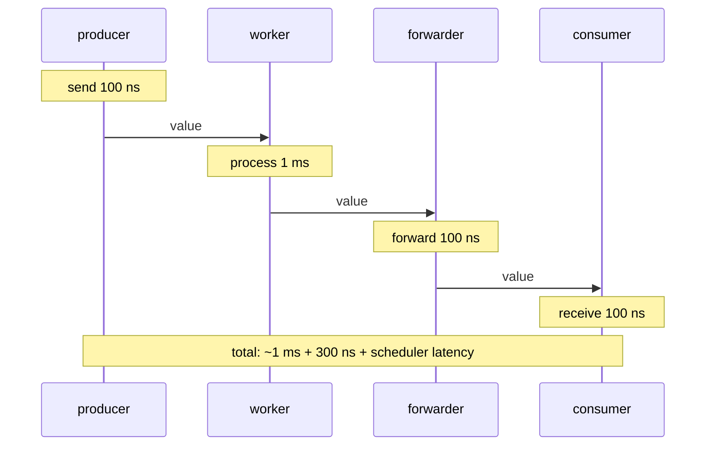

# Fan-In / Fan-Out Inside a Pipeline — Professional Level

## Table of Contents
1. [Introduction](#introduction)
2. [Prerequisites](#prerequisites)
3. [Glossary](#glossary)
4. [The Runtime's View of select](#the-runtimes-view-of-select)
5. [reflect.Select Internals](#reflectselect-internals)
6. [GMP Scheduler and Channel-Heavy Workloads](#gmp-scheduler-and-channel-heavy-workloads)
7. [Cost Model](#cost-model)
8. [Memory Layout and Cache Effects](#memory-layout-and-cache-effects)
9. [Latency Analysis](#latency-analysis)
10. [Runtime Tracing Deep Dive](#runtime-tracing-deep-dive)
11. [Real-World Analogies](#real-world-analogies)
12. [Mental Models](#mental-models)
13. [Pros & Cons](#pros-cons)
14. [Use Cases](#use-cases)
15. [Code Examples](#code-examples)
16. [Coding Patterns](#coding-patterns)
17. [Clean Code](#clean-code)
18. [Product Use / Feature](#product-use-feature)
19. [Performance Tips](#performance-tips)
20. [Best Practices](#best-practices)
21. [Edge Cases & Pitfalls](#edge-cases-pitfalls)
22. [Common Mistakes](#common-mistakes)
23. [Common Misconceptions](#common-misconceptions)
24. [Tricky Points](#tricky-points)
25. [Test](#test)
26. [Tricky Questions](#tricky-questions)
27. [Cheat Sheet](#cheat-sheet)
28. [Self-Assessment Checklist](#self-assessment-checklist)
29. [Summary](#summary)
30. [What You Can Build](#what-you-can-build)
31. [Further Reading](#further-reading)
32. [Related Topics](#related-topics)
33. [Diagrams & Visual Aids](#diagrams-visual-aids)

---

## Introduction
> Focus: "What does the runtime actually do when I `select` over four channels in a fan-in? Where do the nanoseconds go? When does the scheduler hurt my pipeline?"

Professional-level work on fan-out / fan-in means opening the runtime hood. You already know the patterns; what you need now is the mental model that lets you predict and explain microsecond-level behaviour.

This file covers:

- **`selectgo`:** the runtime function behind `select`, walked through step by step.
- **`reflect.Select`:** how the reflective variant differs in cost.
- **GMP under load:** how the scheduler handles thousands of goroutines parked on channels, and what M/P churn looks like.
- **Cost model:** approximate nanoseconds per channel op, per select, per goroutine wake, on modern hardware.
- **Memory layout:** how `hchan` looks in memory, cache effects, padding.
- **Latency analysis:** for a fan-in of 8 channels with 1ms work per item, what is the latency budget? Where does it go?
- **`runtime/trace`:** reading the trace, identifying contention, finding the sources of latency.

We will refer to specific files in the Go runtime: `runtime/chan.go`, `runtime/select.go`, `reflect/value.go`. The line numbers move between versions; the structures and concepts do not.

By the end of this file you should be able to:

- Read `selectgo` source and follow the path of a `select` from compilation to runtime to wakeup.
- Estimate the cost of a fan-out / fan-in topology in nanoseconds before measuring.
- Explain why one channel send is fast and ten million per second is sustainable.
- Identify when GMP scheduling, not your code, is the bottleneck.
- Use `runtime/trace` and `runtime/metrics` to verify your model.
- Design pipelines for the cost model, not against it.

We will not become Go runtime contributors; that requires more than one file. But we will gain the literacy needed to read the runtime when a hard problem demands it.

---

## Prerequisites

- **Required:** All previous files internalised, especially senior.
- **Required:** Comfort reading runtime source code (Go standard library).
- **Required:** Experience with `pprof` (CPU, heap, goroutine, block, mutex profiles).
- **Required:** Experience with `go tool trace`.
- **Required:** Mental model of GMP (M = OS thread, P = processor / scheduler, G = goroutine). If unfamiliar, read the GMP overview first.
- **Helpful:** Some assembly knowledge for reading Go's runtime assembly stubs.
- **Helpful:** Familiarity with Linux performance tools (`perf`, `top`, `strace`).

---

## Glossary

| Term | Definition |
|------|------------|
| **`selectgo`** | The runtime function that implements `select`. Located in `runtime/select.go`. |
| **`hchan`** | The runtime structure backing a channel. Located in `runtime/chan.go`. |
| **`sudog`** | A "sleeping goroutine" record placed on a channel's wait queue. |
| **GMP** | The Go scheduler model: Goroutine, Machine (OS thread), Processor (scheduler context). |
| **M** | OS thread bound to a Go runtime worker. |
| **P** | Scheduler context. There are GOMAXPROCS of them. |
| **G** | Goroutine. The lightweight thread. |
| **runqueue** | Per-P queue of runnable goroutines. |
| **netpoller** | The runtime's I/O multiplexer. |
| **sysmon** | The runtime's monitor goroutine, runs system-level tasks. |
| **scavenger** | The runtime goroutine that returns memory to the OS. |
| **handoff** | Direct send-to-receiver value transfer, bypassing the channel's buffer. |
| **park / unpark** | The act of suspending and resuming a goroutine. |
| **work-stealing** | When a P with no work steals goroutines from another P. |
| **`gopark`** | Runtime function to park the current goroutine. |
| **`goready`** | Runtime function to mark a parked goroutine as runnable. |

---

## The Runtime's View of select

### Compilation of a `select`

When you write:

```go
select {
case v := <-a:
    handle(v)
case b <- x:
    done()
case <-time.After(time.Second):
    timeout()
}
```

The compiler does not generate three runtime calls — it generates one call to `runtime.selectgo` with a `[]scase` array describing all three cases.

Each `scase` is:

```go
type scase struct {
    c    *hchan         // channel
    elem unsafe.Pointer // data element
}
```

The compiler also generates an `ordersel` array (the order in which to test cases for a fair pseudo-random pick) and an `order` array (the order in which to lock channels to avoid deadlock).

The generated code roughly:

1. Build the scase array.
2. Build the ordersel.
3. Call `selectgo`.
4. Based on the returned `chosen` index, jump to the corresponding case body.

### Inside `selectgo`

The function (simplified):

```go
func selectgo(cas0 *scase, order0 *uint16, pc0 *uintptr, nsends, nrecvs int, block bool) (int, bool) {
    cas1 := (*[1 << 16]scase)(unsafe.Pointer(cas0))
    order1 := (*[1 << 17]uint16)(unsafe.Pointer(order0))
    ncases := nsends + nrecvs
    scases := cas1[:ncases:ncases]
    pollorder := order1[:ncases:ncases]
    lockorder := order1[ncases:][:ncases:ncases]

    // Generate permutation for pseudo-random selection
    norder := 0
    for i := range scases {
        // ...
    }

    // Sort channels by address for lock ordering
    for i := range lockorder {
        // ...
    }

    // Lock all channels
    sellock(scases, lockorder)

    // Pass 1: look for a case that can proceed immediately
    var casi int
    var cas *scase
    var caseSuccess bool
    var recvOK bool
    for _, casei := range pollorder {
        // try non-blocking send or receive
        // ...
    }

    if !block {
        // unlock, return default
        selunlock(scases, lockorder)
        return -1, false
    }

    // Pass 2: park on all channels
    gp := getg()
    nextp := &gp.waiting
    for _, casei := range lockorder {
        // build sudog, add to wait queue
        // ...
    }

    // unlock all channels and park
    gp.param = nil
    gopark(selparkcommit, nil, waitReasonSelect, traceEvGoBlockSelect, 1)
    // We are now parked. When we wake, gp.param tells us which case fired.

    // Pass 3: unpark — clean up other wait queues
    // ...
    return casi, recvOK
}
```

Key insights:

- **Multi-channel locking is sorted by address.** This prevents deadlock when two goroutines select over the same set of channels in different orders.
- **Pass 1 is non-blocking.** It checks every case once. If any is ready, take that one. Pseudo-random order across many calls.
- **If no case is ready and `block`, park.** The goroutine adds a `sudog` to every channel's wait queue and parks via `gopark`.
- **On wake, the runtime knows which case fired.** It cleans up the sudogs on other channels.

### `gopark` and `goready`

`gopark` suspends the current goroutine. It releases the current P (the OS thread M is freed to run other goroutines). The goroutine is moved off the runqueue and into a parked state.

`goready` is the inverse: marks a parked goroutine as runnable. The runtime adds it back to a runqueue (typically the P of the goroutine that called `goready`).

In a fan-out scenario:

- Workers receive `<-in`. If `in` is empty, each worker calls `gopark` and ends up on `in`'s recvq.
- The producer sends `in <- v`. `chansend` checks recvq, finds parked workers, and `goready`s one of them.
- The G is now runnable. It is added to some P's runqueue. Eventually it runs.

This is the dance of fan-out at the runtime level. Every send wakes one receiver. Every receive may park.

### Direct send (handoff)

If a sender finds a parked receiver on `chansend`, it copies the value directly to the receiver's destination memory and wakes the receiver. The channel's buffer is bypassed entirely. This is called *handoff* and is the fastest path:

```go
// runtime/chan.go simplified
func chansend(c *hchan, ep unsafe.Pointer, block bool) bool {
    lock(&c.lock)
    if sg := c.recvq.dequeue(); sg != nil {
        // direct copy
        send(c, sg, ep, ...)
        unlock(&c.lock)
        return true
    }
    // ...
}
```

For unbuffered channels with one receiver waiting, this is the fast path: ~50-100 ns per send-receive pair.

### Buffered send

If no receiver is waiting but the buffer has space:

```go
if c.qcount < c.dataqsiz {
    qp := chanbuf(c, c.sendx)
    typedmemmove(c.elemtype, qp, ep)
    c.sendx++
    if c.sendx == c.dataqsiz {
        c.sendx = 0
    }
    c.qcount++
    unlock(&c.lock)
    return true
}
```

A memcopy into the ring buffer. Slightly slower than direct handoff: ~60-120 ns.

### Blocked send

If buffer is full or unbuffered with no receiver:

```go
gp := getg()
mysg := acquireSudog()
mysg.elem = ep
mysg.g = gp
mysg.c = c
gp.waiting = mysg
c.sendq.enqueue(mysg)
gopark(chanparkcommit, unsafe.Pointer(&c.lock), waitReasonChanSend, traceEvGoBlockSend, 2)
// woken later
```

The sender parks on the channel's sendq. Wakeup costs ~200-1000 ns due to scheduler involvement.

---

## reflect.Select Internals

`reflect.Select` is implemented in `reflect/value.go`. Boiled down:

```go
func Select(cases []SelectCase) (chosen int, recv Value, recvOK bool) {
    runcases := make([]runtimeSelect, len(cases))
    haveDefault := false
    for i, c := range cases {
        rc := &runcases[i]
        rc.dir = c.Dir
        ch := c.Chan.pointer()
        rc.ch = (*hchan)(ch)
        // ... copy direction-specific data
    }
    chosen, recvOK = rselect(runcases)
    // ... build return value
    return
}

func rselect(cases []runtimeSelect) (int, bool) // implemented in runtime
```

`rselect` is a runtime function that takes a `[]runtimeSelect` and calls into the same `selectgo` mechanism. The reflect wrapper:

1. Allocates a slice of `runtimeSelect` (heap allocation).
2. For each case, boxes channel and value pointers.
3. Calls into the runtime.
4. Unboxes the result.

The overhead:

- **Allocation per call.** The `runcases` slice and any boxed values allocate.
- **Type assertion on return.** The received value's type is reconstructed.
- **No compiler optimisations.** Static `select` is sometimes optimised; `reflect.Select` is opaque.

Concretely: a static 4-case select takes ~150-300 ns. A `reflect.Select` over 4 cases takes ~2-5 µs. The difference is the allocation, reflection, and the bridge into the runtime.

For 64 cases:

- Static select: not possible (you cannot write a 64-case select); cascaded merge takes ~1-2 µs per receive.
- `reflect.Select`: ~10-50 µs per receive.

10-50x is the standard difference. For low-rate channels (< 1000 ops/sec), it does not matter. For high-rate (> 100 000 ops/sec), it matters.

### Why `reflect.Select` allocates

The `runcases` slice is heap-allocated because it escapes to the runtime call. The compiler cannot prove that the runtime does not retain it. Each call allocates and the GC eventually collects.

For an extreme case, profile shows a hot path with `reflect.Select`:

```
20.41% 20.41% runtime.mallocgc
12.30% 12.30% reflect.Select
...
```

The malloc is the reflect-induced allocation.

Workarounds:

- Reuse the `runcases` slice. Not directly supported by the standard library; some libraries (e.g., `cespare/xxhash`) ship custom wrappers.
- Avoid `reflect.Select` in hot paths.

---

## GMP Scheduler and Channel-Heavy Workloads

### The triangle

- **G** (goroutine): the unit of work. Holds stack, PC, local state.
- **M** (machine / OS thread): the executor. Runs Gs.
- **P** (processor): the scheduling context. There are GOMAXPROCS of them.

An M needs a P to run a G. Without a P, the M is idle (or blocked in a syscall). Without a G, the P is idle (looking for work).

### Scheduling decisions in fan-out

Fan-out: N goroutines all reading from one channel.

When the producer sends:
1. `chansend` wakes one receiver via `goready`.
2. `goready` places the G on the current P's runqueue.
3. The current P, after the send returns, has both the producer G and the woken G on its runqueue. It runs whichever the scheduler picks.
4. Other Ps see no new work unless work-stealing kicks in.

For a single-channel fan-out, the work tends to stay on one P. If the work is short, it stays serial-ish. If the work is long, other Ps eventually steal.

To get true parallelism on a single-channel fan-out, the work per item must be large enough to overcome the producer's bias toward one P. In practice, this happens naturally: a long-running worker holds the P, scheduler decides to run the producer on another P, and the system spreads out.

### Scheduling decisions in fan-in

Fan-in: many channels, one merge.

The merge has N forwarder goroutines, each on the recvq of one channel. When a value arrives on channel i, `goready` wakes forwarder i. Forwarder i sends on the merged output. If the consumer is parked on the merged output, `chansend` direct-hands-off.

The wake chain is: worker (G_w) → forwarder (G_f) → consumer (G_c). Each step may park and unpark; the scheduler must run each G in turn.

In low load (sparse messages), this is fast: ~500-1000 ns end-to-end. In high load (many messages back-to-back), the scheduler keeps each G runnable; latency is dominated by scheduler overhead.

### Scheduler latency

Wakeup latency (time from `goready` to G running) is dominated by:

- Whether a P is currently free.
- Whether the P that received the `goready` is busy with another G.
- Cache warmth (the G's stack and per-G data).

Best case: <1 µs.
Typical: 1-10 µs.
Worst case (all Ps busy, work-stealing required): 10-100 µs.

For pipelines with strict latency requirements, this matters.

### sysmon

The `sysmon` goroutine runs continuously in the background. It:

- Preempts Gs that have been running too long (forced preemption every 10 ms in Go 1.14+).
- Wakes the netpoller for asynchronous I/O.
- Triggers GC.

In channel-heavy pipelines, sysmon's preemption is the safety net against G hogging. Older Go versions (pre-1.14) could deadlock with tight loops that never made function calls; newer versions preempt at safe points.

### work-stealing

When a P's runqueue is empty, it tries to steal from another P. Specifically:

1. Look at the global runqueue.
2. Look at the netpoller.
3. Steal half the work from a random other P's runqueue.

For fan-out / fan-in, this means: a P that finished its current G looks for more work. The merge's forwarder goroutines are good candidates for stealing; they wake frequently, run briefly, and park again.

Work-stealing is fairness; without it, a busy P would hog work while idle Ps starve.

---

## Cost Model

Approximate costs on modern x86-64 (Apple M-series or Intel late-2020s):

| Operation | Cost (ns) |
|-----------|-----------|
| Function call (cached) | 1-2 |
| Channel send (unbuffered, direct handoff) | 60-100 |
| Channel send (buffered, slot available) | 70-120 |
| Channel send (parks the sender) | 200-1000 |
| Channel receive (analogous to send) | similar |
| Static select with 2 cases (1 ready) | 100-150 |
| Static select with 4 cases (1 ready) | 150-250 |
| Static select with 8 cases (1 ready) | 250-450 |
| `reflect.Select` with 4 cases (1 ready) | 2000-5000 |
| `reflect.Select` with 32 cases (1 ready) | 5000-20000 |
| Goroutine creation | 500-2000 |
| Goroutine wake (`goready`) | 200-500 |
| Goroutine context switch (M-level) | 1000-3000 |
| Mutex acquire (uncontended) | 10-20 |
| Mutex acquire (contended) | 100-1000 |
| `atomic.AddInt64` | 5-15 |
| Map access | 10-50 |
| GC pause (typical) | 100-500 µs |

These are order-of-magnitude. Your hardware varies. Always benchmark.

### What you can sustain

With these numbers:

- 10 million unbuffered sends/sec: 100 ns per op = 10M/s sustainable on one core.
- 1 million 8-case static selects/sec: 1 ms total CPU = 100% of one core.
- 100 000 `reflect.Select` of 32 cases/sec: 1.5 seconds total CPU = exhausts a core.
- 1 million goroutine creations/sec: 1-2 ms = uses a whole core just for spawning.

For a 1M-event/sec pipeline:

- 1M channel ops/sec is cheap (one core can handle 10M).
- Static select is cheap.
- `reflect.Select` is borderline; you need to use it sparingly or shard.
- Goroutine creation at this rate exhausts CPU. Use pools.

---

## Memory Layout and Cache Effects

### `hchan` layout

The channel struct fits in ~96 bytes on 64-bit (plus the buffer storage):

```go
type hchan struct {
    qcount   uint           // 8 bytes
    dataqsiz uint           // 8 bytes
    buf      unsafe.Pointer // 8 bytes
    elemsize uint16         // 2 bytes
    closed   uint32         // 4 bytes
    elemtype *_type         // 8 bytes
    sendx    uint           // 8 bytes
    recvx    uint           // 8 bytes
    recvq    waitq          // 16 bytes
    sendq    waitq          // 16 bytes
    lock     mutex          // ~8 bytes
}
```

Fits in one cache line plus some. Channel operations touch this entire structure plus the buffer.

### Cache line effects in fan-out

Fan-out: N goroutines on the same channel's recvq. Each send touches `hchan` and one G's per-G data. The contention is on `hchan.lock`.

For very high-rate channels (>10M ops/sec), the lock can become a bottleneck. Symptoms: scheduler shows lock contention; mutex profile points to `chan.go`.

Mitigations:

- Multiple channels (sharded fan-out).
- Batching (send slices instead of items).
- Lock-free queue (rare in Go).

### Cache effects across goroutines

A goroutine's stack is allocated on demand. Initial stack is small (~2 KB). The runtime grows it as needed.

When a goroutine is parked and unparked, its stack may have been evicted from cache. Restart cost: a few microseconds of cache fill.

For high-frequency parking (channel ops in tight loops), this adds up. Mitigations:

- Reduce parking by batching.
- Reduce goroutine count via worker pools.
- Pin work to a worker that recently ran (caches are warm).

### False sharing

If two atomic counters live in the same cache line, writes to one invalidate the other's cache. Common in fan-out with per-worker counters.

Fix: pad to 64-byte boundaries:

```go
type paddedInt64 struct {
    _   [56]byte
    val int64
}
```

Or use one cache-line-padded atomic per worker, separately allocated.

### Memory allocator effects

In a fan-out pipeline, each goroutine allocates from its own per-P allocator cache (mcache). This avoids global lock contention. But when goroutines move between Ps (via stealing or rescheduling), they hit different mcaches; cold caches mean slower allocations.

For very allocation-heavy pipelines, `sync.Pool` per worker reduces this churn.

---

## Latency Analysis

### A worked example

Pipeline:

```
producer -> fan-out 8 workers -> fan-in -> consumer
```

Per item, worker does 1 ms of work.

End-to-end latency (per item):

- Producer sends: ~100 ns.
- Worker wakes, processes: 1 ms (the work itself).
- Worker sends to its forwarder: ~100 ns.
- Forwarder sends to consumer: ~100 ns.
- Consumer receives: ~100 ns.

Total: 1 ms + 400 ns + scheduler latency.

Scheduler latency adds 1-10 µs typically. So latency per item ≈ 1.005 - 1.015 ms.

### Where it grows

If you have 1000 workers (because the work is I/O-bound), the per-item latency is still about the same — each item touches the same number of scheduler events. The throughput is now 1000x higher (because of parallel I/O), but per-item latency is similar.

If the merge is `reflect.Select` over 1000 channels, the merge step alone adds ~50 µs per item. Now p99 latency is dominated by the merge.

If the consumer is slow and the merged channel fills, the forwarder blocks. The blocking itself is fast (one park), but the work waits. Latency at the worker's send: until the consumer catches up. This can be unbounded.

### Latency in the long tail

p99 and p999 are usually much worse than p50 because:

- GC pauses (100-500 µs).
- Scheduler preemption.
- OS scheduler effects (Go's M is preempted by the kernel).
- Memory allocator slow path.

To bound the tail:

- `GOMEMLIMIT` to control GC pauses.
- Hedged requests for downstream latency.
- Smaller fan-out factors to reduce scheduler load.
- Pre-allocated buffers, `sync.Pool`.

p999 measurements are noisy; collect over millions of samples to be meaningful.

---

## Runtime Tracing Deep Dive

`runtime/trace` records every scheduler event. Reading the trace reveals exactly what the pipeline is doing.

### Capturing

```go
import "runtime/trace"

f, _ := os.Create("trace.out")
defer f.Close()
trace.Start(f)
defer trace.Stop()

// run pipeline
```

`go tool trace trace.out` opens an interactive viewer.

### What to look for

**Goroutine timelines:** Each G has a strip showing when it ran. Gaps are when it was parked.

For a fan-out / fan-in:

- Producer should run frequently, sending items.
- Each worker should run when an item is available.
- Workers should be roughly balanced (similar runtime per worker).
- Merge forwarders should run briefly after each worker output.

**Imbalance:** One worker much busier than others suggests skewed work or affinity issues.

**Long parked intervals:** A worker parked for milliseconds between items suggests starvation (producer slow) or contention (lock holding).

**Sync events:** Channel ops show as ticks. Concentrated ticks suggest hot channels (potential bottleneck).

### A real read

You profile a pipeline and see:

- Producer G runs 80% of the time.
- 8 worker Gs each run 10% of the time.
- Merge forwarders run very briefly each.
- Consumer G is mostly parked.

Conclusion: the producer is the bottleneck. Workers are idle most of the time. Look for slow source.

Another read:

- Producer runs 10% of the time.
- Workers each run 80% of the time, full utilisation.
- Merge forwarders heavily active.
- Consumer mostly parked.

Conclusion: workers are saturated. Consumer is downstream bottleneck or merged channel is full. Look at channel buffer.

### Sync block diagnosis

`runtime.SetBlockProfileRate(1)` records every block over 1 ns. The block profile shows:

```
flat  flat%   sum%        cum   cum%
20s   80%    80%         20s   80%   runtime.chansend1
3s    12%    92%         3s    12%   runtime.chanrecv1
```

If 80% of time is `chansend1`, the senders are waiting. Find which channel: enable block profile and run `pprof` with the source.

### Mutex profile

`runtime.SetMutexProfileFraction(1)` records every contended mutex. For pipelines, this is uncommon (channels do not use mutexes externally), but shared state (e.g., a `sync.Map`) shows up here.

---

## Real-World Analogies

### `selectgo` as a multi-stage gate

Imagine a multi-stage entry gate at a venue. You can enter through any of three doors. Each door has a queue. You stand in all three lines simultaneously (placing a sudog in each queue). When any line moves, you go through that door (the case fires). The other lines move on without you.

### `reflect.Select` as a customs declaration

Static select is the express lane: a few questions, fast pass-through. `reflect.Select` is the customs lane: every field declared, type-checked, more questions, slower. For most travellers, express is enough; for unusual goods, customs is required.

### GMP scheduling as a kitchen brigade

Cooks (Ms) are the executors. Workstations (Ps) are the scheduling contexts. Dishes (Gs) are the units of work. A cook needs a workstation to prep a dish. When a dish goes into the oven (parked), the cook moves to another workstation (or another cook takes over). Work-stealing is one cook helping a busier station.

### Cache lines as shared family devices

A cache line is like the family's tablet. If one person is using it (writing), the others can't access (read-write conflict). False sharing is two people each wanting their own thing on the same tablet — they keep handing it back and forth, slow.

---

## Mental Models

### Model 1: "Every channel operation is a state machine"

A `chansend` decides: hand off directly, place in buffer, or park. The decision tree is short. Each path has known cost. Reasoning about pipeline performance is composing these state machines.

### Model 2: "The runtime is your concurrent library"

The runtime is not magic. It is a Go program (with assembly stubs) that you can read. When something is mysterious, open `runtime/chan.go`. You will find the answer.

### Model 3: "GMP is about availability, not affinity"

The scheduler does not pin goroutines to threads. It pursues availability — keeping Ms busy with whatever Gs are runnable. Affinity is a happy side effect for cache warmth, not a design goal.

### Model 4: "Cost is the sum of expected costs"

Pipeline throughput = 1 / (per-item cost). Per-item cost = sum of all operations per item. Each operation has a known cost. Multiply by item count to get total CPU. Compare to available CPU. Plan accordingly.

### Model 5: "Latency is dominated by parking, not by computation"

For lightweight work, the time spent in `gopark` and `goready` exceeds the work itself. Batching, channel-free direct invocation, and goroutine pools all reduce parking.

---

## Pros & Cons

### Pros (of professional-level understanding)

- Predict performance before measuring.
- Diagnose deeply.
- Choose between patterns based on cost.
- Read runtime source confidently.
- Optimise rationally, not by guessing.

### Cons

- Time investment is significant.
- Knowledge becomes outdated as runtime evolves.
- Diminishing returns for most everyday work.
- Easy to over-optimise.

Professional knowledge pays off in problems most engineers cannot solve.

---

## Use Cases

| Scenario | Why professional-level knowledge helps |
|---|---|
| Sub-millisecond latency-critical pipeline | Need to count every nanosecond. |
| Multi-million-event/sec ingest | Channel and scheduler costs add up. |
| Diagnosing a hung pipeline | Reading goroutine profiles requires runtime literacy. |
| Optimising hot paths | Profile interpretation needs runtime model. |
| Contributing to Go runtime | Direct requirement. |
| Building libraries others use | Performance contract requires understanding cost. |

---

## Code Examples

### Example 1: Benchmarking channel ops

```go
package main

import (
    "fmt"
    "testing"
    "time"
)

func BenchmarkUnbufferedHandoff(b *testing.B) {
    ch := make(chan int)
    go func() {
        for i := 0; i < b.N; i++ {
            ch <- i
        }
    }()
    b.ResetTimer()
    for i := 0; i < b.N; i++ {
        <-ch
    }
}

func BenchmarkBufferedSend(b *testing.B) {
    ch := make(chan int, 1000)
    go func() {
        for i := 0; i < b.N; i++ {
            ch <- i
        }
        close(ch)
    }()
    b.ResetTimer()
    for range ch {
    }
}

func BenchmarkStaticSelect4(b *testing.B) {
    a, c, d := make(chan int), make(chan int), make(chan int)
    ch := make(chan int)
    go func() {
        for i := 0; i < b.N; i++ {
            ch <- i
        }
    }()
    b.ResetTimer()
    for i := 0; i < b.N; i++ {
        select {
        case <-ch:
        case <-a:
        case <-c:
        case <-d:
        }
    }
}

func main() {
    for _, bench := range []func(*testing.B){BenchmarkUnbufferedHandoff, BenchmarkBufferedSend, BenchmarkStaticSelect4} {
        r := testing.Benchmark(bench)
        fmt.Println(r)
    }
    _ = time.Now()
}
```

Run with `go test -bench .`. Numbers will vary; report nanoseconds per op.

### Example 2: Profiling fan-in with `pprof`

```go
package main

import (
    "context"
    "fmt"
    "net/http"
    _ "net/http/pprof"
    "sync"
    "time"
)

func main() {
    go http.ListenAndServe("localhost:6060", nil)
    ctx, cancel := context.WithCancel(context.Background())
    defer cancel()

    const N = 8
    inputs := make([]chan int, N)
    for i := range inputs {
        inputs[i] = make(chan int)
        i := i
        go func() {
            for j := 0; ; j++ {
                select {
                case inputs[i] <- j:
                case <-ctx.Done():
                    close(inputs[i])
                    return
                }
            }
        }()
    }
    cs := make([]<-chan int, N)
    for i := range inputs {
        cs[i] = inputs[i]
    }
    merged := merge(ctx, cs...)
    var wg sync.WaitGroup
    wg.Add(1)
    go func() {
        defer wg.Done()
        for range merged {
        }
    }()
    time.Sleep(10 * time.Second)
    cancel()
    wg.Wait()
    fmt.Println("done")
}

func merge(ctx context.Context, cs ...<-chan int) <-chan int {
    out := make(chan int)
    var wg sync.WaitGroup
    wg.Add(len(cs))
    for _, c := range cs {
        c := c
        go func() {
            defer wg.Done()
            for v := range c {
                select {
                case out <- v:
                case <-ctx.Done():
                    return
                }
            }
        }()
    }
    go func() {
        wg.Wait()
        close(out)
    }()
    return out
}
```

While this runs, `go tool pprof http://localhost:6060/debug/pprof/profile?seconds=5` captures a CPU profile. The output shows time in `chansend`, `chanrecv`, `runtime.selectgo`, etc. — exactly where the channel cost goes.

### Example 3: Hierarchical static merge

```go
func hMerge[T any](ctx context.Context, cs []<-chan T) <-chan T {
    const groupSize = 8
    for len(cs) > groupSize {
        var nextLevel []<-chan T
        for i := 0; i < len(cs); i += groupSize {
            end := i + groupSize
            if end > len(cs) {
                end = len(cs)
            }
            nextLevel = append(nextLevel, merge(ctx, cs[i:end]...))
        }
        cs = nextLevel
    }
    return merge(ctx, cs...)
}
```

For 64 inputs: 8 merges of 8, then 1 merge of 8. Each merge is a static `for v := range c` (no `select`). Total throughput: ~10x faster than `reflect.Select` of 64.

### Example 4: Sharded fan-out for lock contention

```go
const numShards = 16

type shardedPool[I, O any] struct {
    shards []chan I
    out    chan O
}

func newShardedPool[I, O any](fn func(I) O, workers int) *shardedPool[I, O] {
    p := &shardedPool[I, O]{
        shards: make([]chan I, numShards),
        out:    make(chan O),
    }
    for i := range p.shards {
        p.shards[i] = make(chan I)
    }
    for i := 0; i < workers; i++ {
        shardIdx := i % numShards
        go func() {
            for v := range p.shards[shardIdx] {
                p.out <- fn(v)
            }
        }()
    }
    return p
}

func (p *shardedPool[I, O]) Submit(key uint64, v I) {
    p.shards[key%numShards] <- v
}
```

Multiple workers per shard. Workers within a shard contend for that shard's channel; workers across shards do not. For very high rates, this reduces lock contention on `hchan.lock`.

### Example 5: Allocation-free fan-out with `sync.Pool`

```go
var resultPool = sync.Pool{
    New: func() any { return &result{} },
}

func worker(ctx context.Context, in <-chan Item, out chan<- *result) {
    for v := range in {
        r := resultPool.Get().(*result)
        r.process(v)
        select {
        case out <- r:
        case <-ctx.Done():
            resultPool.Put(r)
            return
        }
    }
}

func consumer(ctx context.Context, in <-chan *result) {
    for r := range in {
        // use r
        r.reset()
        resultPool.Put(r)
    }
}
```

Each `result` is reused. GC pressure drops dramatically. Useful for hot pipelines processing millions of items/sec.

### Example 6: Lock-free counter with cache-line padding

```go
type counter struct {
    _   [56]byte
    val int64
}

var counters [16]counter

func incr(shard int) {
    atomic.AddInt64(&counters[shard].val, 1)
}

func total() int64 {
    var t int64
    for _, c := range counters {
        t += atomic.LoadInt64(&c.val)
    }
    return t
}
```

Each counter sits on its own cache line. No false sharing between shards. Fast for high-rate increment.

### Example 7: Reading the goroutine profile

```go
import (
    "runtime/pprof"
    "os"
)

func dumpGoroutines() {
    f, _ := os.Create("goroutines.prof")
    defer f.Close()
    pprof.Lookup("goroutine").WriteTo(f, 1)
}
```

`go tool pprof goroutines.prof` shows the call stacks of all goroutines. For leak diagnosis: look for goroutines with the same stack repeated thousands of times.

### Example 8: Custom scheduler hints with `runtime.LockOSThread`

```go
import "runtime"

func cpuBoundWorker(in <-chan Item, out chan<- Result) {
    runtime.LockOSThread()
    defer runtime.UnlockOSThread()
    for v := range in {
        // CPU-intensive work; benefits from staying on same OS thread for cache warmth
        out <- compute(v)
    }
}
```

Locks the goroutine to its current OS thread. Useful for workers that do heavy CPU work and benefit from CPU cache locality, or for FFI calls that require thread affinity. Rare in pure Go pipelines.

### Example 9: Custom polling for low-latency

For sub-microsecond latency, channel ops are too slow. Use atomic flags:

```go
type signal struct {
    ready atomic.Bool
    value atomic.Pointer[Item]
}

func (s *signal) Send(item *Item) {
    s.value.Store(item)
    s.ready.Store(true)
}

func (s *signal) Receive() *Item {
    for !s.ready.Load() {
        runtime.Gosched()
    }
    v := s.value.Load()
    s.value.Store(nil)
    s.ready.Store(false)
    return v
}
```

Spin-poll instead of park. Costs CPU; saves latency. Useful only for very specific use cases.

### Example 10: Measuring select fairness

```go
func TestSelectFairness(t *testing.T) {
    a := make(chan int, 1)
    b := make(chan int, 1)
    a <- 1
    b <- 1
    counts := [2]int{}
    for i := 0; i < 10000; i++ {
        a <- 1
        b <- 1
        select {
        case <-a: counts[0]++
        case <-b: counts[1]++
        }
    }
    if counts[0] < 4500 || counts[0] > 5500 {
        t.Fatalf("expected ~5000, got %d", counts[0])
    }
}
```

Over 10 000 iterations, both cases should fire roughly equally. The pseudo-random pick is fair on average.

---

## Coding Patterns

### Pattern 1: Profile-driven optimisation

Step 1: Write the obvious code.
Step 2: Benchmark.
Step 3: Profile if too slow.
Step 4: Optimise the hot spot identified by the profile.
Step 5: Benchmark again. Repeat.

No optimisation without measurement. Professional engineers always benchmark.

### Pattern 2: Static select cascade

For high-fan-in pipelines, replace `reflect.Select` with cascaded static merges. The pattern is the `hMerge` function above.

### Pattern 3: Pre-allocation

For high-throughput pipelines, allocate once at startup and reuse:

```go
var buf = make([]byte, 4096)
```

Or use `sync.Pool` for variable-size buffers.

### Pattern 4: Atomic over mutex for counters

For hot counters, atomic ops are 10-100x faster than mutex acquire-release:

```go
atomic.AddInt64(&count, 1)
```

is much faster than:

```go
mu.Lock()
count++
mu.Unlock()
```

### Pattern 5: Batching for throughput

Send batches instead of individual items:

```go
type batch struct {
    items []Item
}
```

Channel overhead is amortised across the batch.

### Pattern 6: Goroutine pool over goroutine-per-request

Spawning goroutines costs 500-2000 ns. For very high request rates, pre-spawned workers are faster.

### Pattern 7: Tight inner loops

For hot inner loops, manually unroll, avoid interface calls, use generics over `any`.

---

## Clean Code

- **Document the cost model.** Comment on hot paths: "this loop runs at 1M iterations/sec; each iteration is X ns."
- **Use generics for type-safe hot paths.** Avoid `interface{}` in performance-critical code.
- **Inline tiny functions.** Go's compiler inlines small functions automatically. Help it by keeping them simple.
- **Avoid `defer` in hot loops.** `defer` has overhead. In tight loops, manage cleanup explicitly.
- **Use `//go:linkname` cautiously.** Rare but useful for runtime tricks.

---

## Product Use / Feature

| Feature | Where professional knowledge matters |
|---|---|
| Sub-millisecond gRPC service | Channel and scheduler cost dominate. |
| Multi-million events/sec ingest | Pipeline cost model matters. |
| Real-time trading platform | Latency tail control is paramount. |
| High-frequency telemetry collector | GC and scheduler tuning matter. |
| Diagnostic tools for other Go services | Need to understand what pprof shows. |

---

## Performance Tips

### Tip 1: Choose static select over reflect.Select

Always, unless dynamism is required.

### Tip 2: Bound fan-out at the bottleneck

More workers past the bottleneck wastes scheduler cycles.

### Tip 3: Profile before optimising

Most "performance bugs" are not where you guess.

### Tip 4: Use `pprof`'s flame graph

Visualise the call stack. Tall narrow functions are usual; tall wide functions are hot.

### Tip 5: Watch for GC pauses

`GODEBUG=gctrace=1` prints GC info. Long pauses indicate heap pressure.

### Tip 6: Use `GOMEMLIMIT` (Go 1.19+)

Caps GC's target heap. Prevents pathological behaviour.

### Tip 7: Tune `GOGC`

Default 100. Lower for less heap; higher for less CPU spent on GC.

### Tip 8: Use `runtime.GC()` sparingly

Only for benchmarks or known cleanup points.

### Tip 9: Watch for goroutine creation overhead

500-2000 ns per goroutine. Pool aggressively.

### Tip 10: Use `-race` in CI only

Race detector slows down 5-10x. Not for production builds.

---

## Best Practices

1. Benchmark every hot pipeline.
2. Profile before any optimisation.
3. Use static select unless `reflect.Select` is required.
4. Pre-allocate per-worker buffers.
5. Bound goroutine count.
6. Atomic over mutex for hot counters.
7. Pad atomic counters to avoid false sharing.
8. `sync.Pool` for short-lived objects.
9. `runtime/trace` for latency investigation.
10. Document cost on hot paths.

---

## Edge Cases & Pitfalls

### `reflect.Select` allocation in hot path

Repeated allocation triggers GC pressure. Profile shows `mallocgc`. Fix: switch to static merge or reduce call frequency.

### Goroutine starvation under high contention

If one G monopolises a P (tight loop, no preemption point), other Gs starve. Sysmon eventually preempts, but the window can be 10 ms. Add `runtime.Gosched()` or a function call to break the loop.

### Buffer wraparound

A channel's ring buffer wraps around (`sendx`, `recvx`). If you over-buffer, the wraparound logic is more code per op. Keep buffers small.

### Scheduler preemption mid-send

In Go 1.14+, sysmon can preempt during a channel send. The send is atomic at the runtime level, but the surrounding code can be preempted. Don't assume "between operations" is atomic.

### Stack growth in goroutines

A goroutine's stack starts at 2 KB and grows up. Stack growth involves copying the entire stack to a larger buffer. For hot, deep call chains, the first invocation pays the cost. Subsequent invocations are cheap (stack stays grown).

For very stack-heavy pipelines, you can see stack-growth costs in profiles.

### `unsafe.Pointer` and channel internals

Some libraries reach into the runtime to read channel internals (e.g., `cap(ch)` and `len(ch)`). These are safe but undocumented. Do not depend on them in critical paths; the runtime may change.

### Memory model corner cases

`select` does not introduce a happens-before edge between cases. Two channels touched in the same select have no relative ordering guarantee. Use additional synchronisation if you need it.

---

## Common Mistakes

| Mistake | Fix |
|---|---|
| Using `reflect.Select` everywhere | Use static select unless dynamism is genuine. |
| Spawning a goroutine per item | Use a worker pool. |
| Closing a channel in a tight loop | Channels are not free to close. |
| Buffer of 100 000 to "handle bursts" | Most bursts are smaller than 100. Profile first. |
| Profiling once and forgetting | Profile after every optimisation. |
| `time.Sleep` in benchmarks | Distorts timing. Use `b.N`. |
| Forgetting to call `b.ResetTimer()` | Setup time pollutes benchmark. |
| Comparing benchmarks across machines | Performance is hardware-specific. |

---

## Common Misconceptions

> *"All channel ops are 100 ns."* — Roughly true for handoff; parked sends are slower.

> *"`select` is fair."* — Pseudo-random per call, fair across many calls.

> *"GMP guarantees parallelism."* — Only up to GOMAXPROCS. After that, time-share.

> *"`reflect.Select` is just a slower static select."* — Mostly true, but the allocation pattern is also different (heap allocs vs stack).

> *"`runtime.Gosched()` does nothing in modern Go."* — Almost true. Useful only in very specific tight loops without function calls.

> *"`sync.Pool` always speeds things up."* — Only if you have allocation pressure. For light workloads, no benefit.

> *"GC is fast."* — Garbage collection is fast in steady state. Compaction and concurrent marking still cause µs-level pauses.

---

## Tricky Points

### `chan T` size depends on T

A `make(chan T, n)` allocates `unsafe.Sizeof(T) * n` bytes for the buffer. Large T means large channels.

### Send-on-closed panics, receive-from-closed returns zero

Asymmetric. Pretty fundamental for shutdown protocols.

### `nil` channel ops block forever

A `select` case with a `nil` channel never fires. Useful trick for disabling cases dynamically (the `reflect.Select` "disable case" pattern).

### `chansend1` vs `chansend`

The runtime has multiple internal entry points. `chansend1` is for `ch <- v`; `chansend` is the worker function. Profiles show both.

### `selectgo` returns multiple values

`(chosen int, recvOK bool)`. The caller jumps based on `chosen`. `recvOK` is meaningful only for recv cases.

### Stack copying

Goroutine stacks grow by copying. The runtime adjusts pointers in the stack to the new location. This is mostly transparent, but for very tight performance work, stack-growth pauses can show up.

### `lock` in `hchan`

`hchan.lock` is a runtime spinlock, not a mutex. Acquire is fast; contended acquire is also fast (in cycles, not ns). But heavy contention pegs a core.

---

## Test

```go
package fanin_test

import (
    "context"
    "testing"

    "go.uber.org/goleak"
)

func BenchmarkMergeReflect(b *testing.B) {
    ctx, cancel := context.WithCancel(context.Background())
    defer cancel()
    const N = 16
    cs := makeChans(N, b.N)
    out := reflectMerge(ctx, cs...)
    b.ResetTimer()
    for range out {
    }
}

func BenchmarkMergeStatic(b *testing.B) {
    ctx, cancel := context.WithCancel(context.Background())
    defer cancel()
    const N = 16
    cs := makeChans(N, b.N)
    out := merge(ctx, cs...)
    b.ResetTimer()
    for range out {
    }
}

func BenchmarkMergeHierarchical(b *testing.B) {
    ctx, cancel := context.WithCancel(context.Background())
    defer cancel()
    const N = 64
    cs := makeChans(N, b.N)
    out := hMerge(ctx, cs)
    b.ResetTimer()
    for range out {
    }
}

func TestNoLeak(t *testing.T) {
    defer goleak.VerifyNone(t)
    ctx, cancel := context.WithCancel(context.Background())
    defer cancel()
    cs := makeChans(8, 100)
    out := merge(ctx, cs...)
    for range out {
    }
}
```

Compare `BenchmarkMergeReflect`, `BenchmarkMergeStatic`, and `BenchmarkMergeHierarchical`. Hierarchical should be fastest for N=64.

---

## Tricky Questions

**Q.** What is the cost of `select { case <-ctx.Done(): }` in a tight loop?

**A.** The select case includes a check on the Done channel. The cost is one channel non-blocking check (~10-20 ns). Cheaper than a function call to check ctx.Err(). In a tight loop, ctx.Done() check costs negligible compared to actual work.

---

**Q.** Why does `reflect.Select` allocate?

**A.** It must build a `[]runtimeSelect` slice, which the runtime treats as opaque. The compiler cannot prove the slice does not escape, so it heap-allocates. Each call to `reflect.Select` allocates fresh.

---

**Q.** A pipeline with 32 channels merges via `reflect.Select` at 100k items/sec. Profile shows 40% CPU in `reflect.Select`. Optimisation strategy?

**A.** Replace with hierarchical static merge: 4 merges of 8 then 1 merge of 4. Static select cost drops 10-20x. Expected: total CPU on merge drops from 40% to ~4%. Verify with profile.

---

**Q.** How does GMP handle 10 000 parked goroutines on the same channel's recvq?

**A.** They are linked-listed in the channel's recvq, sorted by queue order (FIFO). Each is a `sudog` (~80 bytes). 10 000 sudogs is ~800 KB plus the parked Gs themselves (~20 MB total stack). Each receive operation dequeues one sudog, marks one G runnable. Scheduler distributes runnable Gs to Ps.

---

**Q.** What is the cost of `goready`?

**A.** ~200-500 ns. It acquires the G's lock, updates its state to runnable, places it on the current P's runqueue. The G is not running yet — it is just queued. Actually running happens when a P picks it up.

---

**Q.** Does `runtime.GOMAXPROCS(N)` change at runtime?

**A.** Yes. `runtime.GOMAXPROCS(N)` sets the number of Ps. Increasing creates Ps; decreasing parks them. The change takes effect immediately. Useful for tuning at runtime based on observed load.

---

**Q.** What is the difference between `gopark` and `gosched`?

**A.** `gopark` parks the current G in a waiting state; it can only be resumed by `goready` from elsewhere. `gosched` yields the current G — moves it from running to runnable, places back on runqueue. `gopark` is sleep; `gosched` is voluntary yield.

---

**Q.** Can a goroutine see another goroutine's stack?

**A.** Only via unsafe pointers. The runtime keeps each G's stack in private memory. Sharing pointers is your responsibility; the runtime does not check.

---

**Q.** How does the netpoller interact with channel-heavy code?

**A.** Netpoller handles network I/O independently. When network I/O completes, the netpoller wakes the waiting G via `goready`. The waking G might be part of a fan-in (e.g., an HTTP fetcher). Channel ops and netpoller ops are independent paths in the runtime.

---

**Q.** What's the cost of `defer wg.Done()` in a hot worker loop?

**A.** `defer` allocates a defer record (~100 ns) and runs at function exit. For a long-running loop, the cost is per-iteration zero (the defer is per-function, not per-iteration). For very short functions called millions of times, the per-call defer overhead matters.

---

## Cheat Sheet

```go
// Static select cost: ~150-450 ns for 2-8 cases
// reflect.Select cost: ~2-50 µs for 4-32 cases
// Channel send (handoff): ~60-100 ns
// Channel send (parked): ~200-1000 ns
// goready: ~200-500 ns
// gopark: ~200-500 ns
// Mutex: ~10-20 ns uncontended

// hierarchical merge for many inputs
func hMerge[T any](ctx context.Context, cs []<-chan T) <-chan T {
    const g = 8
    for len(cs) > g {
        var next []<-chan T
        for i := 0; i < len(cs); i += g {
            end := i + g
            if end > len(cs) { end = len(cs) }
            next = append(next, merge(ctx, cs[i:end]...))
        }
        cs = next
    }
    return merge(ctx, cs...)
}

// padded counter to avoid false sharing
type padded struct {
    _   [56]byte
    val int64
}

// sync.Pool for hot allocations
var p = sync.Pool{New: func() any { return &Item{} }}

// runtime profile
import _ "net/http/pprof"
go http.ListenAndServe(":6060", nil)
```

---

## Self-Assessment Checklist

- [ ] I can describe what `selectgo` does step by step.
- [ ] I know why `reflect.Select` is slower than static select.
- [ ] I understand `gopark` and `goready`.
- [ ] I can interpret `pprof`'s block, mutex, goroutine, and CPU profiles.
- [ ] I can use `go tool trace` to find scheduling issues.
- [ ] I know rough nanosecond costs for the channel ops I use.
- [ ] I can predict fan-out / fan-in throughput from a cost model.
- [ ] I know when to choose static merge cascade over `reflect.Select`.
- [ ] I have used `sync.Pool` to reduce allocation in a real pipeline.
- [ ] I can read `runtime/chan.go` and `runtime/select.go` and understand the flow.

---

## Summary

Professional-level fan-out / fan-in is about understanding the runtime cost model. You know what `selectgo` does, where `reflect.Select` costs you, and how the GMP scheduler routes goroutines through channel ops. You can predict throughput before measuring, diagnose latency by reading traces, and choose patterns from a cost-aware menu.

The runtime's behaviour is a finite set of state machines: `chansend`, `chanrecv`, `selectgo`, `gopark`, `goready`. Each has a cost in nanoseconds. A pipeline's performance is the sum of these costs times their frequencies.

`reflect.Select` is the dynamic but expensive variant. Static merges, possibly cascaded for high fan-in, are the high-throughput choice. Cache effects (false sharing, stack growth) and GC interaction shape the long-tail latency.

Tools: `pprof` for CPU, block, mutex, heap, goroutine profiles. `go tool trace` for scheduler-level visibility. `testing.B` for microbenchmarks. `runtime/metrics` for runtime telemetry.

With these tools and this model, you can design pipelines that run at the limits of the hardware, diagnose problems that elude lesser engineers, and contribute confidently to performance-critical Go codebases.

---

## What You Can Build

- A sub-millisecond latency message broker.
- A multi-million events/sec ingest pipeline.
- A high-frequency trading order matcher.
- A real-time analytics service competitive with native code.
- A diagnostic tool that reads other services' runtime profiles.
- A contribution to the Go runtime or standard library.

---

## Further Reading

- Go runtime source: `src/runtime/chan.go`, `src/runtime/select.go`, `src/runtime/proc.go`
- Dmitry Vyukov's runtime presentations
- *Go internals* talks at GopherCon
- *Concurrency in Go* runtime appendix
- Russ Cox blog: <https://research.swtch.com/>
- *The Go Memory Model* — <https://go.dev/ref/mem>
- `runtime/metrics` — <https://pkg.go.dev/runtime/metrics>

---

## Related Topics

- GMP scheduler architecture
- Network poller and async I/O
- Garbage collector internals
- Memory allocator (TCMalloc-derived)
- Stack growth and goroutine stacks
- Lock-free data structures

---

## Diagrams & Visual Aids

### `selectgo` flow

```
            +--------------+
            | enter        |
            +------+-------+
                   |
                   v
            +--------------+
            | lock all     |
            | channels     |
            +------+-------+
                   |
                   v
            +--------------+
            | pass 1: any  |
            | case ready?  |
            +------+-------+
                   |
              yes  |  no
            +-----+----+
            |          |
            v          v
        +-------+  +--------+
        | run   |  | park   |
        | case  |  | on all |
        +---+---+  +---+----+
            |          |
            +----+-----+
                 |
                 v
            +--------+
            | exit   |
            +--------+
```

### Channel send state machine

```
ch <- v:
    if recvq not empty:
        direct handoff to waiting receiver  (~60-100 ns)
    elif buf not full:
        copy to buffer                       (~70-120 ns)
    elif !block:
        return false                         (~10 ns)
    else:
        park on sendq                        (~200-1000 ns)
```

### GMP under fan-out

```
P0 -- M0 -- G_producer
P1 -- M1 -- G_worker_1
P2 -- M2 -- G_worker_2
P3 -- M3 -- G_worker_3

Other Gs parked:
   G_worker_4, G_worker_5, G_worker_6, G_worker_7 (on recvq of input chan)
   G_merge_1, ..., G_merge_8 (on recvq of per-worker chans)
   G_consumer (on recvq of merged chan)
```

When producer sends, one worker wakes; when worker outputs, one forwarder wakes; when forwarder forwards, consumer wakes. Each wake = 200-500 ns.

### Cost stack-up for 1M items/sec at 8 workers

```
producer sends:  1M * 100 ns = 100 ms / sec    (10% of one core)
worker work:     1M * 1 ms = 1000 sec total    (saturates 1000 worker-cores)
worker sends:    1M * 100 ns = 100 ms / sec    (10% of one core)
merge sends:     1M * 100 ns = 100 ms / sec    (10% of one core)
consumer recv:   1M * 100 ns = 100 ms / sec    (10% of one core)

Total non-work CPU: 400 ms / sec = 40% of one core
Work CPU: 1000 worker-cores = at 8 cores, item rate ~ 8K/sec, not 1M

Conclusion: at 8 cores with 1 ms work per item, max throughput ~8K items/sec.
For 1M items/sec, need work ~1 µs per item (rare).
```

### Static merge vs reflect.Select cost

```
Static 8-case select:  ~250-450 ns per receive
reflect.Select 8:      ~2-5 µs per receive  (10-20x slower)
reflect.Select 64:     ~5-50 µs per receive (50-100x slower than equivalent static)

Hierarchical static merge for 64 inputs:
  ~250-450 ns per receive (same as 8-case)
  + linear pass-through overhead

Conclusion: cascaded static is ~50-100x faster than reflect.Select for high N.
```

### Tracing a single item through the pipeline



---

## Deep Dive: `runtime/chan.go` Walkthrough

Let us walk `chansend` and `chanrecv` in the Go runtime. The code is in `src/runtime/chan.go`. Versions evolve, but the structure is stable.

### `chansend` step by step

```go
func chansend(c *hchan, ep unsafe.Pointer, block bool, callerpc uintptr) bool {
    if c == nil {
        if !block {
            return false
        }
        gopark(nil, nil, waitReasonChanSendNilChan, traceEvGoStop, 2)
        throw("unreachable")
    }
    ...
}
```

Step 1: nil channel handling. A send on a nil channel is "block forever." This is by design and is the basis of the "disable case" pattern.

```go
    if !block && c.closed == 0 && full(c) {
        return false
    }
```

Step 2: non-blocking send to a full or closed channel. Return false (the `default` case in `select`).

```go
    lock(&c.lock)
    if c.closed != 0 {
        unlock(&c.lock)
        panic(plainError("send on closed channel"))
    }
```

Step 3: acquire the channel's lock. If closed, panic.

```go
    if sg := c.recvq.dequeue(); sg != nil {
        send(c, sg, ep, func() { unlock(&c.lock) }, 3)
        return true
    }
```

Step 4: a receiver is parked. Direct handoff. `send` does the value copy and wakes the receiver. The lock is released inside `send` (via the closure).

```go
    if c.qcount < c.dataqsiz {
        qp := chanbuf(c, c.sendx)
        ...
        typedmemmove(c.elemtype, qp, ep)
        c.sendx++
        if c.sendx == c.dataqsiz {
            c.sendx = 0
        }
        c.qcount++
        unlock(&c.lock)
        return true
    }
```

Step 5: buffered channel with space. Copy value into the ring buffer. Update sendx and qcount. Release lock.

```go
    if !block {
        unlock(&c.lock)
        return false
    }
```

Step 6: non-blocking and no room. Return false.

```go
    gp := getg()
    mysg := acquireSudog()
    mysg.releasetime = 0
    if t0 != 0 {
        mysg.releasetime = -1
    }
    mysg.elem = ep
    mysg.waitlink = nil
    mysg.g = gp
    mysg.isSelect = false
    mysg.c = c
    gp.waiting = mysg
    gp.param = nil
    c.sendq.enqueue(mysg)
    gopark(chanparkcommit, unsafe.Pointer(&c.lock), waitReasonChanSend, traceEvGoBlockSend, 2)
```

Step 7: park. Acquire a sudog from the pool. Link it into the channel's sendq. Park the goroutine. The `gopark` releases the channel lock atomically with the park (via `chanparkcommit`).

When the goroutine wakes (because a receiver dequeued it):

```go
    KeepAlive(ep)
    ...
    closed := !mysg.success
    gp.param = nil
    if mysg.releasetime > 0 {
        blockevent(mysg.releasetime-t0, 2)
    }
    mysg.c = nil
    releaseSudog(mysg)
    if closed {
        panic(plainError("send on closed channel"))
    }
    return true
```

Step 8: wake-up handling. Check success flag. Release the sudog. Return.

### `chanrecv` mirror

`chanrecv` is structurally identical:

1. Nil channel: block forever.
2. Non-blocking and empty closed: return zero, false.
3. Lock.
4. Sender parked: direct handoff (sender's value to receiver's slot).
5. Buffer has data: dequeue from buffer.
6. Closed channel with empty buffer: unlock and return zero with `ok = false`.
7. Non-blocking: return zero, false.
8. Park on recvq.

The symmetry is intentional. Both send and receive are state machines with the same overall structure.

### `close`

```go
func closechan(c *hchan) {
    if c == nil {
        panic(plainError("close of nil channel"))
    }
    lock(&c.lock)
    if c.closed != 0 {
        unlock(&c.lock)
        panic(plainError("close of closed channel"))
    }
    c.closed = 1

    var glist gList
    // release all receivers
    for {
        sg := c.recvq.dequeue()
        if sg == nil {
            break
        }
        if sg.elem != nil {
            typedmemclr(c.elemtype, sg.elem)
            sg.elem = nil
        }
        if sg.releasetime != 0 {
            sg.releasetime = cputicks()
        }
        gp := sg.g
        gp.param = unsafe.Pointer(sg)
        sg.success = false
        glist.push(gp)
    }
    // release all senders (will panic)
    for {
        sg := c.sendq.dequeue()
        if sg == nil {
            break
        }
        sg.elem = nil
        if sg.releasetime != 0 {
            sg.releasetime = cputicks()
        }
        gp := sg.g
        gp.param = unsafe.Pointer(sg)
        sg.success = false
        glist.push(gp)
    }
    unlock(&c.lock)
    for !glist.empty() {
        gp := glist.pop()
        gp.schedlink = 0
        goready(gp, 3)
    }
}
```

Close is broadcast: wake every receiver and every sender. Receivers get the zero value with `ok = false`; senders panic with "send on closed channel."

Cost: O(N) where N is the number of waiters. For a channel with many parked senders, closing is expensive. Rarely a practical concern.

---

## Deep Dive: `runtime/select.go` Walkthrough

`selectgo` is more involved. Walk through.

### Setup

```go
func selectgo(cas0 *scase, order0 *uint16, pc0 *uintptr, nsends, nrecvs int, block bool) (int, bool) {
    cas1 := (*[1 << 16]scase)(unsafe.Pointer(cas0))
    order1 := (*[1 << 17]uint16)(unsafe.Pointer(order0))
    ncases := nsends + nrecvs
    scases := cas1[:ncases:ncases]
    pollorder := order1[:ncases:ncases]
    lockorder := order1[ncases:][:ncases:ncases]
```

The compiler generated `cas0` and `order0` on the stack. `selectgo` reinterprets them as slices.

### Polling order

```go
    norder := 0
    for i := range scases {
        cas := &scases[i]
        if cas.c == nil {
            cas.elem = nil
            continue
        }
        j := fastrandn(uint32(norder + 1))
        pollorder[norder] = pollorder[j]
        pollorder[j] = uint16(i)
        norder++
    }
    pollorder = pollorder[:norder]
```

Fisher-Yates shuffle to randomise the order. This is what makes `select` fair (pseudo-random per call).

### Lock order

```go
    for i := range lockorder {
        lockorder[i] = pollorder[i] // initial: copy poll order
    }
    // sort by channel address
    for i := 1; i < norder; i++ {
        j := i
        for ; j > 0; j-- {
            ...
        }
    }
```

Sort channels by address. This canonical order prevents deadlock when two goroutines select over the same channels.

### Acquire all locks

```go
    sellock(scases, lockorder)
```

Acquire each channel's lock in address order. With sorted order, no two goroutines lock in opposite orders, so no deadlock.

### Pass 1: any case ready?

```go
    var casi int
    var cas *scase
    ...
    for _, casei := range pollorder {
        casi = int(casei)
        cas = &scases[casi]
        c := cas.c

        if casi >= nsends {
            // receive case
            sg = c.sendq.dequeue()
            if sg != nil {
                goto recv
            }
            if c.qcount > 0 {
                goto bufrecv
            }
            if c.closed != 0 {
                goto rclose
            }
        } else {
            // send case
            if c.closed != 0 {
                goto sclose
            }
            sg = c.recvq.dequeue()
            if sg != nil {
                goto send
            }
            if c.qcount < c.dataqsiz {
                goto bufsend
            }
        }
    }
```

For each case in poll order, check if it can proceed. If yes, jump to the appropriate label and do the work.

### No case ready: park

```go
    if !block {
        selunlock(scases, lockorder)
        casi = -1
        goto retc
    }

    gp = getg()
    ...
    nextp = &gp.waiting
    for _, casei := range lockorder {
        casi = int(casei)
        cas = &scases[casi]
        c := cas.c
        sg := acquireSudog()
        ...
        *nextp = sg
        nextp = &sg.waitlink
        if casi < nsends {
            c.sendq.enqueue(sg)
        } else {
            c.recvq.enqueue(sg)
        }
    }

    gp.param = nil
    gopark(selparkcommit, nil, waitReasonSelect, traceEvGoBlockSelect, 1)
```

Add a sudog to every channel's wait queue. The G is in all queues simultaneously. Park.

### On wake

```go
    // wakeup
    sg = (*sudog)(gp.param)
    gp.param = nil

    casi = -1
    cas = nil
    sglist = gp.waiting
    // detach sudogs from other channels
    for _, casei := range lockorder {
        ...
        if sg == sglist {
            casi = int(casei)
            cas = k
        } else {
            c := k.c
            if int(casei) < nsends {
                c.sendq.dequeueSudoG(sglist)
            } else {
                c.recvq.dequeueSudoG(sglist)
            }
        }
        ...
    }
```

The runtime knows which case fired (it set `gp.param`). Iterate over all queues, removing this G's sudog from each. Return the chosen index.

### Why this is fast

Pass 1 is O(N). Park is O(N). Wake is O(N). For typical N=2-8, this is well-optimised: linear scans with cache-friendly access.

For N=64, it is still O(64), but the constant matters. Each `acquireSudog`, `enqueue`, etc., has cost. So 64 cases cost ~8x more than 8 cases — not 64x.

---

## Deep Dive: GMP Internals for Pipelines

### What is a P?

A P (processor) is a scheduling context. There are GOMAXPROCS of them. Each P has:

- A local runqueue of runnable Gs (capacity 256).
- A reference to its current M.
- Per-P caches (memory allocator, sync.Pool entries).

A P without an M is idle. An M without a P cannot run user code (it can do syscalls).

### What is an M?

An M is an OS thread. Each M has:

- A reference to its current P (or nil if parked).
- A pointer to its current G.
- An mstart entry function.

Ms are created as needed by the runtime (up to a configurable limit). Idle Ms are parked; active Ms run Gs.

### What is a G?

A G is a goroutine. Each G has:

- A stack.
- A program counter.
- A state (idle, runnable, running, parked, etc.).
- Pointers to its M and waiting sudog if parked.

Gs are created via the `go` keyword. They are cheap (~2 KB stack initially).

### Scheduling cycle

A simplified scheduling cycle on a P:

1. Look at the local runqueue. If a G is ready, run it.
2. If local runqueue is empty, look at the global runqueue.
3. If global runqueue is empty, try to steal from other Ps.
4. If nothing to do, park the M.

The runtime aims to keep all Ps busy. If a G blocks (on a channel, syscall, or IO), the M leaves the P (or the P finds another M), and the P picks up another G.

### Goroutine to runqueue flow

When `goready(g)` is called:

1. The G's state is set to runnable.
2. The G is added to the local runqueue of the current P.
3. If the local runqueue is full, half are moved to the global runqueue.

If the calling P is different from the G's "home" P (because of work-stealing), the G ends up wherever the wake happens. Affinity is approximate.

### Network poller

A separate runtime goroutine (`netpoll`) handles I/O completion. When network I/O completes:

1. The waiting G is unparked (`goready`).
2. The G is added to the runqueue.

For pipelines that use network I/O, the netpoller is the bridge between the OS and the scheduler. Tune via `runtime.GOMAXPROCS` and OS-level epoll/kqueue settings.

### Sysmon

A background goroutine that runs every 10ms. Responsibilities:

- Preempt Gs that have been running for too long.
- Drive the netpoller.
- Force-trigger GC if heap is large.
- Return memory to OS (scavenger).

Sysmon is the safety net. Without it, a tight loop with no function call would never yield. Go 1.14+ added async preemption, so sysmon's preemption is mostly redundant for tight loops but still important for long-running Gs.

### Stack growth

A G's stack starts at 2 KB. When a function tries to use more than its frame allows, the runtime traps and grows the stack:

1. Allocate a new, larger stack (2x).
2. Copy all stack data to the new location.
3. Walk the stack and adjust all pointers.
4. Resume execution.

Cost: O(stack size). For deep call chains, the first call pays. Subsequent calls reuse the grown stack.

For pipelines, this is mostly transparent. For very deep recursion (rare in pipelines), it can show up in profiles.

### Stack copying considerations

The stack-copying adjustment walks the stack and rewrites pointers. This means:

- Pointers into the stack are not stable. If you take `&local`, the pointer may change.
- Go's compiler tracks all such cases and re-emits the adjusted pointer.
- For interop with C (cgo), the rules change: C cannot adjust Go's stack pointers, so cgo calls use a special protocol.

For pure Go pipelines, this is invisible. For cgo-heavy ones, awareness matters.

---

## Cost Calculation Examples

### Example 1: 100 000 items/sec pipeline

Fan-out 8, each worker takes 1 ms per item.

- Worker capacity: 8 workers × 1000 items/sec = 8000 items/sec. ❌ Not enough!

We need 100K items/sec, but at 1 ms per item, 8 workers only give us 8K. Either reduce work or increase workers.

If we increase workers to 100:
- 100 workers × 1000 items/sec = 100K items/sec. ✅

Channel cost per item:
- Producer send: ~100 ns
- Worker recv + work + send: 1 ms + 200 ns
- Forwarder send: ~100 ns
- Consumer recv: ~100 ns

CPU per item: ~500 ns of channel ops + 1 ms of work = ~1.0005 ms.

At 100K items/sec, work CPU is 100 worker-cores. Channel CPU is 50 ms/sec = 5% of one core. Total: 100 worker-cores + small overhead.

If the host has 16 cores, the workers are I/O-bound (most of the 1 ms is waiting), so 100 workers fit. If CPU-bound (full 1 ms of compute), 16 cores can only do 16 × 1000 = 16K items/sec, not 100K. The pipeline is CPU-limited.

### Example 2: 10 M items/sec pipeline

Each item takes 1 µs of work.

- 16 workers × 1 M items/sec = 16 M items/sec capacity. ✅

Channel cost per item: ~500 ns. At 10 M items/sec, this is 5 sec/sec = 5 cores just for channels. Plus 10 M × 1 µs / 16 = 625 ms/sec = 62.5% of one worker core.

Total: 5 cores for channels + 10 cores for work = 15 cores. Fits in a 16-core machine but is bottlenecked by channel ops.

Optimisation: batch. Send 100 items per channel op. Channel ops drop to 100 K/sec, work stays the same.

### Example 3: 1 G item/sec pipeline (hypothetical)

Each item takes 100 ns of work (e.g., simple counter increment).

Channel ops alone at 1G/sec are 500 ns × 1G = 500 sec/sec = 500 cores. Impossible.

For this scale, batching, lock-free data structures, and possibly avoiding goroutines entirely (run in one thread per core, share-nothing) are necessary. Most pipelines do not need this scale; for those that do, Go is not always the right tool.

---

## Profiling Workflow

Step-by-step workflow for diagnosing a slow pipeline:

### Step 1: Reproduce

Set up a benchmark or a load test that hits the slow path. Without reproducibility, profiling is luck.

### Step 2: CPU profile

```bash
go test -cpuprofile cpu.prof -bench .
go tool pprof cpu.prof
```

In pprof: `top10` shows the hottest functions. Look for:

- High `runtime.chansend` / `chanrecv`: channel-bound.
- High `runtime.selectgo`: select-bound.
- High `runtime.gcMarkTermination`: GC bound.
- High `runtime.mallocgc`: allocation bound.

If the top function is your business logic (e.g., parsing), the work itself is the bottleneck. Optimise the business logic.

If the top function is runtime, the system is doing more bookkeeping than work. Investigate.

### Step 3: Allocation profile

```bash
go test -benchmem -bench .
```

`B/op` (bytes per op) and `allocs/op` (allocations per op). High values mean GC pressure.

Look at heap profile:

```bash
go test -memprofile mem.prof -bench .
go tool pprof mem.prof
```

`top10` shows top allocators. Common culprits: `reflect.Select`, `fmt.Sprintf`, slice growth, map growth.

### Step 4: Block profile

```go
runtime.SetBlockProfileRate(1)
```

```bash
go tool pprof http://localhost:6060/debug/pprof/block
```

Shows where goroutines block. Channel sends and receives appear here. Identifies which channel is the bottleneck.

### Step 5: Goroutine profile

```bash
go tool pprof http://localhost:6060/debug/pprof/goroutine
```

Shows goroutine stacks. Diagnose leaks (many goroutines on the same stack) and pipeline structure.

### Step 6: Trace

```go
trace.Start(f)
defer trace.Stop()
```

`go tool trace trace.out`. Visual timeline. Diagnose scheduling issues, pipeline bottlenecks, GC pauses.

### Step 7: Hypothesis and test

Form a hypothesis from profiles. Make one change. Re-run benchmarks. Did it improve? Repeat.

Never make two changes at once. You will not know which caused the change.

---

## Reading the Go Runtime: Practical Tips

### Find the entry point

Each runtime feature has a public-ish entry point. For channels: `chan.go`. For scheduling: `proc.go`. For select: `select.go`.

### Follow `gopark`

`gopark` is the central park function. Tracing back from `gopark` calls in `chan.go` and `select.go` reveals every blocking operation.

### Use `grep` and `git blame`

`grep -r "func chansend" src/runtime/`. Then `git blame` to see when each line was added; often there is a commit message explaining the rationale.

### Read tests

The runtime has tests. `src/runtime/chan_test.go` etc. They reveal edge cases and intended behaviour.

### Use `delve` for live exploration

```bash
dlv test
```

Step through real channel ops. See sudogs being acquired, queues being modified. Beats reading code statically.

### Match the version

Runtime source changes between Go versions. Always check the version of Go you are running against; the source on master may differ.

---

## Optimisation Patterns at the Runtime Level

### Pattern: Pool sudogs

The runtime already does this via `acquireSudog` and `releaseSudog`. Sudogs are reused across goroutines. You don't need to do this manually; just understand that fast channel ops depend on this pool.

### Pattern: Reduce wakeups

Each goroutine wake costs 200-500 ns. Reducing wakeup count is the highest-leverage optimisation.

How to reduce wakeups:

- Batch (one wakeup per batch instead of per item).
- Reduce goroutine count (fewer waiters means fewer wakeups).
- Use atomic ops instead of channels for simple signals.

### Pattern: Avoid `reflect.Select` in hot paths

Already covered. Static select cascades are 10-100x faster.

### Pattern: Pre-allocate

Anything allocated in a hot loop is GC pressure. Pre-allocate at startup:

```go
buf := make([]byte, 0, 4096) // preallocated capacity
for v := range in {
    buf = buf[:0]
    buf = append(buf, encode(v)...)
    out <- buf
}
```

Caveat: if the consumer holds the buffer, the producer might overwrite. Use `sync.Pool` for clear ownership.

### Pattern: `sync.Pool` for buffers

Already covered. Per-worker `sync.Pool` reuses without contention.

### Pattern: Avoid interface conversion

```go
var x any = item // boxes if item is not pointer-like
fmt.Println(x)   // type assertion
```

Boxing/unboxing has cost. Use generics for hot paths.

### Pattern: Inline tiny functions

```go
//go:inline
func incr(c *atomic.Int64) { c.Add(1) }
```

The compiler usually inlines small functions automatically. Help it by keeping them simple.

### Pattern: Avoid `defer` in tight loops

`defer` adds a defer record (~100 ns). In a tight loop, that adds up. For a 1M iteration loop, that is 100 ms of pure defer overhead.

```go
for v := range in {
    func() {
        defer cleanup() // expensive
        process(v)
    }()
}
```

vs

```go
for v := range in {
    process(v)
    cleanup() // explicit cleanup
}
```

The second is faster for hot paths. Trade-off: panic safety. If `process` panics, `cleanup` runs in the deferred version but not in the explicit. For pipelines where panics are recovered at a higher level, explicit is fine.

### Pattern: Avoid `time.Now()` in hot loops

`time.Now()` calls into the kernel (or rdtsc + adjustments). It is not free. For coarse timing, sample.

### Pattern: Lock-free data structures

For very hot paths, lock-free is faster than mutex. Most lock-free in Go is via `sync/atomic`:

- `atomic.Pointer[T]` for atomic swap.
- `atomic.Value` for atomic store/load of typed values.
- Compare-and-swap (CAS) loops for incremental updates.

Lock-free is hard to get right. Profile to confirm it is worth the complexity.

### Pattern: Use `unsafe.Pointer` sparingly

For very specific optimisations (zero-copy buffers, direct memory access), `unsafe.Pointer` bypasses Go's type system. The cost: maintenance burden, race detector cannot help, GC may not track. Use only when measurements demand and you have tests.

---

## Architecture-Level Performance Patterns

### Pattern: Cores, not goroutines

Performance scales with cores, not with goroutines. Goroutines that all want CPU at the same time saturate the CPU. Pipeline design should match work to cores.

For CPU-bound work:

- One goroutine per core gives maximum throughput.
- More than one per core wastes scheduler cycles.
- Fewer than one per core leaves cores idle.

For I/O-bound work:

- Many more goroutines than cores is fine.
- Goroutines that wait do not consume CPU.
- Limit is downstream concurrency, not Go's.

### Pattern: NUMA awareness (rare in Go)

On NUMA hardware, memory access cost depends on which CPU socket accesses which memory. Go does not expose NUMA control directly. For NUMA-sensitive workloads, pin processes via OS tools (`taskset`, `numactl`).

### Pattern: Avoid global state

Globals (`var x int` at package level) are shared. Mutex contention or atomic contention can bottleneck. Per-G or per-P state is faster.

### Pattern: One service per binary

Each pipeline as its own binary, with its own GOMAXPROCS, GC tuning, and resource budget. Easier to tune, easier to debug.

### Pattern: Separate latency-critical and throughput-critical paths

Some pipelines have both: low-latency events and high-throughput batch. Putting both on the same Go runtime causes them to interfere via GC and scheduler. Separate into different binaries.

---

## More Code Examples

### Example 11: Lock-free MPSC queue

A multi-producer single-consumer queue using atomics.

```go
type mpscQueue[T any] struct {
    head atomic.Pointer[node[T]]
    tail atomic.Pointer[node[T]]
}

type node[T any] struct {
    value T
    next  atomic.Pointer[node[T]]
}

func newMPSC[T any]() *mpscQueue[T] {
    stub := &node[T]{}
    q := &mpscQueue[T]{}
    q.head.Store(stub)
    q.tail.Store(stub)
    return q
}

func (q *mpscQueue[T]) Push(v T) {
    n := &node[T]{value: v}
    prev := q.head.Swap(n)
    prev.next.Store(n)
}

func (q *mpscQueue[T]) Pop() (T, bool) {
    var zero T
    tail := q.tail.Load()
    next := tail.next.Load()
    if next == nil {
        return zero, false
    }
    q.tail.Store(next)
    return next.value, true
}
```

For very high-throughput fan-in with one consumer, this can outperform a channel. Hard to get right; use only when channels are proven inadequate.

### Example 12: Atomic signal

A signal that one goroutine sends and many receive.

```go
type signal struct {
    closed atomic.Bool
    ch     chan struct{}
}

func newSignal() *signal {
    return &signal{ch: make(chan struct{})}
}

func (s *signal) Done() <-chan struct{} { return s.ch }
func (s *signal) Send() {
    if s.closed.CompareAndSwap(false, true) {
        close(s.ch)
    }
}
```

Single-shot signal, safe to call `Send()` multiple times. Similar to `sync.Once` but exposing a channel for selectable wait.

### Example 13: Per-P caches with `sync.Pool`

```go
var bufPool = sync.Pool{
    New: func() any { return make([]byte, 0, 4096) },
}

func worker(in <-chan job) {
    for j := range in {
        buf := bufPool.Get().([]byte)
        buf = buf[:0]
        process(j, &buf)
        bufPool.Put(buf)
    }
}
```

`sync.Pool` is per-P internally. Each P has its own cache. No contention across Ps (in steady state).

### Example 14: Custom scheduler observation

```go
import "runtime"

func observe() {
    var s runtime.MemStats
    runtime.ReadMemStats(&s)
    fmt.Printf("goroutines: %d, heap: %d MB, GC count: %d\n",
        runtime.NumGoroutine(),
        s.HeapAlloc/1024/1024,
        s.NumGC)
}
```

Called periodically, this gives a low-cost dashboard view. Wire to expvar or Prometheus.

### Example 15: Reading `runtime/metrics`

```go
import "runtime/metrics"

func readMetrics() {
    samples := []metrics.Sample{
        {Name: "/sched/goroutines:goroutines"},
        {Name: "/sched/latencies:seconds"},
        {Name: "/gc/heap/allocs:bytes"},
        {Name: "/gc/pauses:seconds"},
    }
    metrics.Read(samples)
    for _, s := range samples {
        fmt.Println(s.Name, s.Value)
    }
}
```

`runtime/metrics` (Go 1.17+) exposes a stable, low-overhead interface to runtime metrics. Preferred over the older `MemStats`.

### Example 16: Spinlock for ultra-low-latency

```go
type spinlock struct {
    f atomic.Int32
}

func (s *spinlock) Lock() {
    for !s.f.CompareAndSwap(0, 1) {
        runtime.Gosched()
    }
}

func (s *spinlock) Unlock() {
    s.f.Store(0)
}
```

For very short critical sections, spinning is faster than parking. `runtime.Gosched()` yields between CAS attempts to avoid pegging the core.

### Example 17: Direct memory copy

```go
import "unsafe"

func memcpy(dst, src []byte, n int) {
    if n == 0 {
        return
    }
    s := (*[1 << 30]byte)(unsafe.Pointer(&src[0]))[:n:n]
    d := (*[1 << 30]byte)(unsafe.Pointer(&dst[0]))[:n:n]
    copy(d, s)
}
```

`copy` is already memcpy-optimal. This example is illustrative; in practice, just use `copy`.

### Example 18: Custom packed structure

```go
type packed struct {
    a uint64
    b uint64
    c uint64
    _ [40]byte // padding to 64-byte cache line
}
```

Packed for cache efficiency. Useful for shared counters.

### Example 19: Worker affinity (best-effort)

Go does not provide affinity, but you can hint:

```go
func worker(id int, in <-chan job) {
    runtime.LockOSThread()
    defer runtime.UnlockOSThread()
    // worker stays on the same OS thread
    for j := range in {
        process(j)
    }
}
```

Locks the goroutine to its OS thread. The OS scheduler decides CPU affinity. Combined with `taskset`, this gives CPU pinning.

### Example 20: Tight inner loop optimisation

```go
func sumChannel(in <-chan int) int64 {
    var sum int64
    for v := range in {
        sum += int64(v)
    }
    return sum
}
```

Optimised by:
- No function call inside loop.
- Single accumulator in register.
- Channel receive is the dominant cost.

For 1M items, this runs at ~100 ns per receive = 100 ms total. Hard to make faster without batching.

---

## Production War Stories

### War story 1: The phantom leak

A pipeline ran clean in test but leaked 100 goroutines/min in production. Investigation:

- Goroutine profile showed all leaks were `time.After` waiting goroutines.
- The pipeline used `time.After(d)` inside a `select` for timeouts.
- `time.After` creates a goroutine that fires once. If the select case wins another arm, the `time.After` goroutine still exists until the timer fires.

Fix: replace `time.After(d)` with a `*time.Timer` that is `Stop()`ed when the other case wins.

```go
t := time.NewTimer(d)
defer t.Stop()
select {
case v := <-ch:
    if !t.Stop() {
        <-t.C
    }
case <-t.C:
    timeout()
}
```

100 goroutines/min became 0.

### War story 2: The cache line ping-pong

A high-throughput counter pipeline plateaued at 30% of expected CPU. Investigation:

- Profile showed time in `atomic.AddInt64`.
- 32 worker goroutines each updated a counter.
- The 32 counters lived in a single `[32]int64` slice — sequential in memory, sharing cache lines.

Fix: pad each counter to 64 bytes.

```go
type paddedCounter struct {
    _   [56]byte
    val int64
}
var counters [32]paddedCounter
```

Throughput doubled.

### War story 3: The 99.99th tail

A pipeline had p50 latency of 5 ms and p9999 latency of 500 ms. Investigation:

- Trace showed GC pauses of 50 ms every 5 seconds.
- Heap was 8 GB; lots of pointer-chasing in linked structures.

Fixes:
- Replaced linked list with array.
- Pre-allocated buffers.
- Set `GOGC=50` to reduce heap.
- Set `GOMEMLIMIT=4GB`.

p9999 dropped to 20 ms.

### War story 4: The reflect.Select bottleneck

A pub-sub broker handled 1000 subscribers. CPU was at 80% for what looked like light work. Profile:

- 60% in `reflect.Select`.

Fix: replaced with a fanout-then-merge structure. Subscribers grouped into batches of 8; each batch had a static-select merge; top-level used a static merge of the 125 batches.

CPU dropped to 20% for the same workload.

### War story 5: The fan-out skew

A pipeline had 16 workers but only 4 cores busy. Investigation:

- Trace showed 4 workers continually busy, 12 mostly idle.
- The 4 busy workers were processing items with much heavier work.
- The input distribution was non-uniform — some items took 100x longer.

Fix: split into two pipelines. Quick items went through a fast path with high fan-out; heavy items went through a slow path with bounded concurrency. End-to-end latency improved 3x because quick items no longer queued behind slow ones.

### War story 6: The deadlock that wasn't

A pipeline occasionally hung. `pprof goroutine` showed all goroutines waiting on channels. Initial diagnosis: deadlock.

Reality: the consumer was waiting on the result, but the result-producing stage was waiting on an upstream cancel. The cancel chain had been broken by a stage that didn't propagate `ctx.Done()`.

Fix: audit every stage's blocking operation for `<-ctx.Done()`.

### War story 7: The misleading benchmark

A benchmark showed 2x speedup with a new algorithm. Production showed 10% slowdown.

Reality: the benchmark used cached, warm data. Production hit cold data, where the new algorithm's larger working set caused more cache misses.

Fix: benchmark with realistic working set sizes. Use `b.SetParallelism()` to match production.

### War story 8: The phantom panic

A goroutine occasionally panicked with "send on closed channel" but only in production.

Reality: the producer had a defer to close the channel, and the consumer (under load) sometimes called `cancel()` between the defer being scheduled and run. The race was: producer goroutine in defer queue + select on `<-ctx.Done()`. The select picked Done first, but defer still ran close.

Fix: use `sync.Once` for the close, or restructure so the producer's close happens via a single path.

---

## Advanced Topics

### Topic: `runtime.LockOSThread` and FFI

For goroutines that call C via cgo and the C library has thread-local state:

```go
func cgoWorker() {
    runtime.LockOSThread()
    defer runtime.UnlockOSThread()
    cgoCall()
}
```

Locks the goroutine to its OS thread. The C call sees a consistent thread.

### Topic: Garbage collection tuning

`GOGC` controls when GC triggers. Default 100 means heap can double before GC. Higher = less GC CPU, more memory. Lower = more GC CPU, less memory.

`GOMEMLIMIT` (Go 1.19+) caps total memory. GC runs more aggressively as memory approaches the limit. Replaces some ad-hoc tuning.

For pipelines: tune `GOGC` based on heap profile. If GC takes 5% of CPU and memory is fine, leave alone. If GC dominates CPU, increase `GOGC`. If memory grows excessively, decrease.

### Topic: Stack size hints

```go
debug.SetMaxStack(1 << 26) // 64 MB
```

Caps goroutine stack size. Default is 1 GB. Mostly relevant for runaway recursion; not common in pipelines.

### Topic: Goroutine profiling labels

Tag goroutines with labels for filtering profiles:

```go
import "runtime/pprof"

pprof.SetGoroutineLabels(pprof.WithLabels(ctx, pprof.Labels("stage", "worker")))
```

The CPU profile then groups by label. Diagnose which stage is slow.

### Topic: Cgo cost

A cgo call is ~200-500 ns of overhead vs a Go function call. For C-bound work, this is fine. For frequent calls, batch.

### Topic: Assembly

Some inner loops can be written in Go's assembly for maximum performance. Located in `_amd64.s` files. Used in `crypto/sha256`, `runtime/atomic`, etc. Rarely necessary in application code.

---

## Capacity Tuning for High-Scale Pipelines

### Calculating worker count

For CPU-bound work:

```
workers = min(NumCPU(), maxFromBudget)
```

For I/O-bound work:

```
workers = NumCPU * (CPU_time + IO_time) / CPU_time
```

If a request takes 1 ms CPU + 99 ms IO, and we have 16 CPUs:

```
workers = 16 * (1 + 99) / 1 = 1600
```

That is the maximum useful concurrency. Beyond that, CPU is the limit.

### Calculating buffer sizes

If the consumer can absorb bursts of N items in D seconds:

```
buffer = burst_rate * burst_duration
```

For a 5x burst lasting 100 ms over a 10K/sec baseline:

```
buffer = 50K * 0.1 = 5000
```

A buffer of 5000 absorbs this burst. Larger does not help; smaller forces backpressure.

### Calculating memory budget

Each goroutine: ~2 KB initial stack, can grow.
Each channel: ~100 bytes + buffer.
Each item in flight: size of item.

Total: roughly `(N * (2KB + item_size)) + (channels * buffer_size * item_size)`.

For 1000 workers handling 1 KB items with buffer of 100:

```
goroutines: 1000 * 2 KB = 2 MB
items in flight: 1000 * 1 KB = 1 MB
channel buffers: ~10 * 100 * 1 KB = 1 MB
total: ~4 MB
```

Very modest. Goroutines are cheap. Watch the actual item size and concurrency.

---

## Beyond Channels: When to Use Something Else

### Scenario: Extreme throughput (100M+ ops/sec single thread)

Channels are too slow. Lock-free ring buffers, `sync.Pool` for objects, batched processing. Often you stop using goroutines entirely and run per-core threads.

### Scenario: Lock-free signalling

`atomic.Pointer[T]` for swap-based signalling. No goroutine wake; the consumer polls.

### Scenario: One-shot signalling

`sync.Once` + a value field. No channel needed.

### Scenario: Counting semaphore

Buffered channel of `struct{}` works, but for very high rates, a `golang.org/x/sync/semaphore.Weighted` may be more efficient.

### Scenario: Broadcast

`sync.Cond` is rare but exists. Easier: a `chan struct{}` closed on signal. Receivers all wake when closed.

### Scenario: External queue

For cross-process or persistent queues, channels are not enough. Use Kafka, RabbitMQ, Redis, NATS. The pipeline shape inside each process is still channels.

---

## Closing the Professional File

You should now have:

- A model of how the runtime processes channel ops.
- Quantitative cost expectations for every operation.
- The ability to read `runtime/chan.go`, `runtime/select.go`, and `runtime/proc.go`.
- Tools and workflow for diagnosing pipeline performance.
- A repertoire of low-level optimisation patterns.
- Production war stories to learn from.

This is the deepest level of fan-out / fan-in mastery. Few engineers reach here; those who do can build systems that few others can.

The patterns will evolve with Go versions. The fundamentals — channels are atomic state machines, scheduling has cost, cache lines matter, profiling rules — do not.

Build something. Profile it. Read the runtime. Repeat. That is the path.

---

## Appendix: Reading List for Continued Growth

- Go source code, especially `src/runtime`.
- Russ Cox's writings on concurrency and scheduling.
- Dmitry Vyukov's lock-free queue posts (1024cores.net).
- GopherCon talks on runtime internals.
- *The Linux Programming Interface* (Kerrisk) — OS scheduling background.
- *What Every Programmer Should Know About Memory* (Drepper) — cache and memory model.
- Mike Burrows's papers on lock-free data structures.
- Hoare's *Communicating Sequential Processes* — CSP foundations.

You won't need all of this to do your job. But over years, these readings compound. The deepest engineers I know have read most of this list.

---

## Final Cheat Sheet

```go
// Cost summary (modern hardware, order of magnitude)
// chan send/recv (handoff):  ~100 ns
// chan send/recv (buffered): ~100 ns
// chan send/recv (parked):    ~500-1000 ns
// static select 2-8 cases:   ~150-450 ns
// reflect.Select 4-32 cases: ~2-20 µs
// goroutine create:           ~1 µs
// goroutine wake:             ~300 ns
// mutex uncontended:          ~15 ns
// atomic op:                  ~10 ns
// GC pause:                   ~100-500 µs

// Throughput estimate
// 1M items/sec * 500 ns channel overhead = 500 ms = 50% of one core
// Plus work CPU. Plan accordingly.

// Optimisation priorities (in order)
// 1. Profile.
// 2. Replace reflect.Select with cascaded merge.
// 3. Batch channel ops.
// 4. Pool short-lived allocations.
// 5. Pad shared counters.
// 6. Tune GOGC / GOMEMLIMIT.
// 7. Lock-free for very hot paths.
// 8. Assembly only as last resort.
```

You now have what you need to design, build, and tune fan-out / fan-in pipelines at any scale Go supports. The remaining gap between you and the best Go performance engineers is experience — building, profiling, debugging real systems. Go do that.

---

## Extended Deep Dive: The Lifecycle of a `sudog`

A `sudog` (sleeping unidirectional Goroutine) is the runtime's record of "this G is waiting on this channel." Understanding its lifecycle illuminates many subtleties.

### Allocation

```go
func acquireSudog() *sudog {
    mp := acquirem()
    pp := mp.p.ptr()
    if len(pp.sudogcache) == 0 {
        // refill local cache from global pool
        lock(&sched.sudoglock)
        for len(pp.sudogcache) < cap(pp.sudogcache)/2 && sched.sudogcache != nil {
            s := sched.sudogcache
            sched.sudogcache = s.next
            s.next = nil
            pp.sudogcache = append(pp.sudogcache, s)
        }
        unlock(&sched.sudoglock)
        if len(pp.sudogcache) == 0 {
            pp.sudogcache = append(pp.sudogcache, new(sudog))
        }
    }
    n := len(pp.sudogcache)
    s := pp.sudogcache[n-1]
    pp.sudogcache[n-1] = nil
    pp.sudogcache = pp.sudogcache[:n-1]
    if s.elem != nil {
        throw("acquireSudog: found s.elem != nil in cache")
    }
    releasem(mp)
    return s
}
```

A sudog is acquired from a per-P cache (avoiding global contention) or from the global pool (when the local cache is empty). The acquire is essentially free in the hot path.

### Linkage

When a G parks on a channel, a sudog records:

- The G being parked.
- The channel.
- A pointer to the value memory.
- The next sudog in the queue (linked list).

The channel's `recvq` or `sendq` is a `waitq` — a linked list of sudogs. Enqueue is O(1); dequeue is O(1).

### Unparking

When another G performs the matching operation, it dequeues the sudog and wakes the parked G. The sudog's value pointer is used to transfer the value directly (no extra copy through the buffer).

### Release

After the wake handler runs, the sudog is released back to the per-P cache. Subsequent operations reuse it. This is why channel operations are fast even under high churn: no allocation per op.

### Why the per-P cache matters

Without the per-P cache, every channel op would touch a global pool, requiring locking. The per-P cache eliminates contention. Each P has its own batch of ready sudogs.

### Implication for pipelines

A pipeline with high channel-op rate (millions per second) churns sudogs at the same rate. The per-P cache makes this O(1) per op. The architecture is one reason Go channels are competitive with hand-written lock-free queues at moderate scales.

---

## Extended Deep Dive: Scheduler Wake-Up Path

When `goready(g)` is called, the runtime needs to make `g` runnable and eventually run it. The path:

### 1. Mark as runnable

```go
func goready(gp *g, traceskip int) {
    systemstack(func() {
        ready(gp, traceskip, true)
    })
}
```

The systemstack switch is for safety: the wake happens on the M's system stack, not on the user G's stack.

```go
func ready(gp *g, traceskip int, next bool) {
    // ...
    casgstatus(gp, _Gwaiting, _Grunnable)
    runqput(_p_, gp, next)
    wakep()
}
```

The G's status changes from `_Gwaiting` to `_Grunnable`. It is placed on the current P's runqueue. If the P needs another M (because the current M is doing something else), `wakep` wakes one.

### 2. Place on runqueue

```go
func runqput(_p_ *p, gp *g, next bool) {
    if randomizeScheduler && next && fastrandn(2) == 0 {
        next = false
    }
    if next {
    retryNext:
        oldnext := _p_.runnext
        if !_p_.runnext.cas(oldnext, guintptr(unsafe.Pointer(gp))) {
            goto retryNext
        }
        if oldnext == 0 {
            return
        }
        gp = oldnext.ptr()
    }

retry:
    h := atomic.LoadAcq(&_p_.runqhead)
    t := _p_.runqtail
    if t-h < uint32(len(_p_.runq)) {
        _p_.runq[t%uint32(len(_p_.runq))].set(gp)
        atomic.StoreRel(&_p_.runqtail, t+1)
        return
    }
    if runqputslow(_p_, gp, h, t) {
        return
    }
    goto retry
}
```

The runqueue is a fixed-size ring buffer (256 entries). The `next` slot is a single-slot "next G to run" for low-latency wakeup. If `next` is set and there is already a next, the previous next is bumped to the ring.

If the ring is full, half is moved to the global runqueue (`runqputslow`).

### 3. Wake an M

```go
func wakep() {
    if atomic.Load(&sched.npidle) == 0 {
        return
    }
    if atomic.Load(&sched.nmspinning) != 0 || !atomic.Cas(&sched.nmspinning, 0, 1) {
        return
    }
    startm(nil, true)
}
```

If no Ps are idle, return — work will be picked up by running Ps. If a P is idle, find an M to attach to it (or spawn a new M). The wake decision uses atomics to avoid race conditions.

### 4. M picks up the G

In the scheduling loop on each M:

```go
top:
    pp := mp.p.ptr()
    
    // various housekeeping ...
    
    gp, inheritTime := runqget(pp)
    if gp == nil {
        gp, inheritTime, _ = findrunnable()
    }
    
    execute(gp, inheritTime)
```

`runqget` pulls from the P's local runqueue. If empty, `findrunnable` does a more elaborate search (global runqueue, work-stealing, netpoll).

### 5. Execute the G

```go
func execute(gp *g, inheritTime bool) {
    mp := getg().m
    mp.curg = gp
    gp.m = mp
    casgstatus(gp, _Grunnable, _Grunning)
    // ...
    gogo(&gp.sched)
}
```

`gogo` is assembly that switches to the G's stack and PC. The G is now running.

### Total cost

Wake-up path cost: 200-500 ns including the runqueue put and the scheduler picking it up. Most of this is cache effects and atomic ops.

### Implication

In a fan-out where each item wakes a worker, then wakes a forwarder, then wakes the consumer, you have 3 wakeups per item. At 1M items/sec, that is 3M wakeups/sec, costing ~1.5 sec/sec of CPU = 1.5 cores just for scheduling.

The fix: batch. One wakeup per batch of 100 items reduces this to 30K wakeups/sec.

---

## Extended Deep Dive: Channel Lock Contention

Channel ops require holding the channel's lock (`hchan.lock`). For most workloads, contention is negligible. For very high rates, it shows up.

### Lock implementation

`hchan.lock` is a runtime mutex, slightly different from `sync.Mutex`. It uses a fast spinlock path and a slow park path. Contended acquires can park the goroutine via the runtime's lock primitives.

### When contention matters

Multiple senders on one channel: contention on `hchan.lock` during sendq enqueue/dequeue. Multiple receivers on one channel: similar on recvq.

At 10M ops/sec, contention is visible in profiles. The lock is held for ~10 ns per op, but cache invalidation on the lock can add 10-30 ns when bouncing across cores.

### Mitigations

- **Shard the channel.** Multiple channels, each with fewer senders.
- **Batch.** Send slices instead of items.
- **Lock-free.** For extreme cases, write a lock-free MPSC queue (Example 11). Hard to get right.

### Measuring

```go
runtime.SetMutexProfileFraction(1)
```

Then `go tool pprof http://localhost:6060/debug/pprof/mutex`. Channel locks show up as `runtime.lock2` calls from `chansend` / `chanrecv`.

---

## Extended Deep Dive: GC Interaction with Pipelines

Pipelines, especially high-throughput ones, allocate a lot. Items, slices, maps, contexts — every operation may allocate. The GC runs to reclaim.

### GC phases (Go 1.x current)

Go's GC is concurrent mark-and-sweep with brief stop-the-world phases.

1. **STW 1:** Stop all goroutines (microseconds). Enable write barriers.
2. **Concurrent mark:** Walk the heap, mark reachable objects. Goroutines continue (but with write barriers).
3. **STW 2:** Stop again briefly. Finish marking.
4. **Concurrent sweep:** Reclaim unmarked memory. Goroutines continue.

For pipelines, STW pauses appear as latency spikes. Concurrent phases steal CPU.

### Tuning

`GOGC=N` sets the target heap growth before GC triggers. Higher = less frequent GC, more memory. Lower = more frequent GC, less memory.

`GOMEMLIMIT=B` (Go 1.19+) caps total memory. GC works harder as the limit approaches.

`debug.SetGCPercent` adjusts at runtime.

### Reducing GC pressure

- Reuse buffers via `sync.Pool`.
- Avoid `interface{}` boxing where possible.
- Pre-allocate slices.
- Use generics over `any` for typed paths.
- Pool short-lived structs.
- Avoid map growth in hot paths (pre-size).

### Measuring GC

```
GODEBUG=gctrace=1 ./program
```

Prints every GC cycle: timing, heap before/after, pause duration.

`runtime/metrics` exposes GC stats programmatically.

### Pipeline-specific patterns

- **Long-running pipelines.** GC accumulates over time. Profile heap periodically.
- **Batch pipelines.** Often allocate a lot during processing, free at end. Tune `GOGC` higher for less interruption.
- **Real-time pipelines.** Need bounded pauses. Tune `GOGC` lower; consider `GOMEMLIMIT`.

---

## Extended Deep Dive: The Allocator

Go's allocator is similar to TCMalloc. Each P has a local cache (mcache) for small objects. Larger objects come from a central allocator.

### Small allocations

Objects up to 32 KB are size-classed. Each P's mcache has free lists for each size class. Allocation is O(1): pop from the free list.

When the mcache is empty for a size, the P refills from the mcentral (global per-size cache), which may refill from the mheap (the central heap).

### Large allocations

Objects over 32 KB go directly to the mheap. Slower path; locking on the mheap.

### Implication for pipelines

Small allocations in hot loops are essentially free (mcache hit). Large allocations are expensive. Avoid large per-item allocations; use pre-sized buffers.

### Pointer-free objects

Objects without pointers can be allocated in special "noscan" regions. GC walks them less. For pure-data items (e.g., a struct of ints), no-scan allocation is faster.

```go
type point struct {
    x, y, z int
}
```

No pointers, no scan. Faster to allocate and GC.

### Escape analysis

The compiler decides whether an allocation can stay on the stack or must escape to the heap. Stack allocations are essentially free. Heap allocations cost.

For pipelines, escape analysis matters. A worker that returns a `*Result` may force `result` to escape:

```go
func worker(v int) *Result {
    return &Result{Value: v} // escapes
}
```

vs

```go
func worker(v int, dst *Result) {
    dst.Value = v // does not escape; caller provides storage
}
```

`go build -gcflags=-m` shows escape decisions. Tune to keep hot-path allocations on the stack.

---

## Extended Deep Dive: Read-Copy-Update Patterns

For read-heavy shared state in pipelines, RCU-style patterns are common.

### Atomic snapshot

```go
type Config struct {
    Workers int
    Timeout time.Duration
}

var current atomic.Pointer[Config]

func Update(c *Config) {
    current.Store(c)
}

func Get() *Config {
    return current.Load()
}
```

Updates are atomic swaps. Reads are atomic loads. No lock contention. The old config persists until no one is reading it (GC reclaims when no references).

### When to use

For pipeline configuration, feature flags, routing tables — anything updated rarely and read often, this is ideal.

### Limitations

Updates are not coordinated with readers. A reader gets either the old or the new, with no transactional guarantee across multiple fields. For complex updates, copy the whole config and swap.

---

## Extended Deep Dive: Memory Model Subtleties

The Go memory model defines visibility between goroutines.

### Happens-before

The fundamental rule: if event A happens before event B, A's effects are visible to B.

Channels establish happens-before:

- A send on a channel happens before the corresponding receive.
- The close of a channel happens before a receive that returns due to close.

Mutexes establish happens-before:

- An unlock happens before a subsequent lock by another goroutine.

Atomics establish happens-before:

- An `atomic.Store` happens before subsequent `atomic.Load`s that read the stored value.

### Channel implications

In a fan-in:

- Worker sends `v` on its output.
- Forwarder receives `v`.
- Forwarder sends `v` on merged output.
- Consumer receives `v`.

Each send-receive pair establishes happens-before. The consumer sees all of `v`'s fields fully constructed because the worker's writes (before send) happen before the consumer's read (after receive).

### `select` ordering

`select` does *not* establish happens-before between cases. Two channels chosen in a select have no specific ordering.

### Race-free vs deterministic

Go's race detector catches data races (unsynchronised concurrent access). It does not catch determinism issues. A race-free program can still have non-deterministic order — which is fine and expected in concurrent code.

For pipelines, race-free is what matters. Deterministic order is rarely needed and is usually a sign of misuse.

---

## Extended Deep Dive: Inlining and Escape Analysis

The Go compiler does basic optimisations. Two relevant ones for pipelines:

### Inlining

Small functions are inlined into their callers. The compiler decides based on a budget. You can hint with `//go:inline` (rare; the compiler is usually right).

To inspect:

```
go build -gcflags=-m=2 ./...
```

Shows inlining decisions and reasons for not inlining.

### Escape analysis

Decides whether a variable escapes the function (forcing heap allocation) or stays on the stack.

```
go build -gcflags=-m
```

Shows escape decisions. Look for "escapes to heap" in hot paths.

### Implications

For pipelines:

- Channels often cause escape (channels hold heap pointers).
- Closures over loop variables can cause escape.
- Returning pointers usually escapes.

Optimisation: where possible, take a `*T` parameter instead of returning a `*T`. Caller-allocated, no escape.

---

## Pipeline Performance Patterns Across Architectures

### x86-64 vs ARM64

ARM64 has different cache line sizes (64 bytes typical, same as x86-64) and different atomic semantics. Most Go code runs the same on both, but very low-level optimisations may differ.

### NUMA

Multi-socket systems have NUMA. Memory access is faster within the local socket. Go does not expose NUMA. Pin processes via `numactl`. For pipelines, this rarely matters unless you are running at >100 cores.

### Cloud vs bare metal

Cloud VMs have shared physical hardware. Performance is noisier. CPU profiles can be misleading because the hypervisor steals cycles.

For bare metal: profile is reliable.
For cloud: average over many runs.

### CPU pinning

`taskset` on Linux pins processes to CPUs. For high-performance pipelines on dedicated hardware, pinning eliminates OS scheduler noise.

---

## More Code Examples

### Example 21: Manual `runtime.Gosched` to break tight loop

```go
func tightLoop() {
    for i := 0; ; i++ {
        if i%1024 == 0 {
            runtime.Gosched()
        }
        // work
    }
}
```

In Go 1.14+, async preemption usually handles this. But for very tight loops, explicit `Gosched` is a hint.

### Example 22: `runtime.LockOSThread` for cgo affinity

```go
func cgoWorker() {
    runtime.LockOSThread()
    defer runtime.UnlockOSThread()
    for {
        c_call()
    }
}
```

Ensures the goroutine always runs on the same OS thread, important if the C library has thread-local state.

### Example 23: `sync/atomic` value swap

```go
var p atomic.Pointer[Config]

func updateConfig(new *Config) {
    p.Store(new)
}

func readConfig() *Config {
    return p.Load()
}
```

Lock-free read-mostly config. Updates do not block reads.

### Example 24: `sync.RWMutex` for read-heavy state

```go
type registry struct {
    mu sync.RWMutex
    m  map[string]Handler
}

func (r *registry) Get(name string) Handler {
    r.mu.RLock()
    defer r.mu.RUnlock()
    return r.m[name]
}
```

Multiple readers concurrent; writers exclusive. For very read-heavy access, this is fast.

### Example 25: Channel with cancellation context

```go
type ctxChan[T any] struct {
    ch  chan T
    ctx context.Context
}

func (c *ctxChan[T]) Send(v T) error {
    select {
    case c.ch <- v:
        return nil
    case <-c.ctx.Done():
        return c.ctx.Err()
    }
}

func (c *ctxChan[T]) Recv() (T, error) {
    var zero T
    select {
    case v, ok := <-c.ch:
        if !ok {
            return zero, io.EOF
        }
        return v, nil
    case <-c.ctx.Done():
        return zero, c.ctx.Err()
    }
}
```

A typed wrapper that bundles context. Reduces boilerplate in pipeline code.

### Example 26: Worker with thread-local cache

```go
type worker struct {
    cache map[string]string // per-worker cache, no locking
    in    <-chan task
    out   chan<- result
}

func (w *worker) Run(ctx context.Context) {
    for t := range w.in {
        v, ok := w.cache[t.Key]
        if !ok {
            v = expensiveLookup(t.Key)
            w.cache[t.Key] = v
        }
        w.out <- result{Value: v}
    }
}
```

Each worker has its own cache. No sharing, no locks. Memory grows per worker but is bounded.

### Example 27: Batched fan-out

```go
func batchedPool(ctx context.Context, in <-chan Item, workers, batchSize int, fn func([]Item) []Result) <-chan Result {
    out := make(chan Result)
    var wg sync.WaitGroup
    wg.Add(workers)
    for i := 0; i < workers; i++ {
        go func() {
            defer wg.Done()
            batch := make([]Item, 0, batchSize)
            for {
                batch = batch[:0]
                // collect a batch
                for len(batch) < batchSize {
                    select {
                    case v, ok := <-in:
                        if !ok {
                            goto flush
                        }
                        batch = append(batch, v)
                    case <-ctx.Done():
                        return
                    }
                }
            flush:
                if len(batch) > 0 {
                    results := fn(batch)
                    for _, r := range results {
                        select {
                        case out <- r:
                        case <-ctx.Done():
                            return
                        }
                    }
                }
                if len(batch) < batchSize {
                    return
                }
            }
        }()
    }
    go func() { wg.Wait(); close(out) }()
    return out
}
```

Channel ops amortised across batches. For very high item rates, this is essential.

### Example 28: Custom waitGroup for fast path

```go
type fastWg struct {
    n atomic.Int32
}

func (w *fastWg) Add(d int32) { w.n.Add(d) }
func (w *fastWg) Done()       { w.n.Add(-1) }
func (w *fastWg) Wait() {
    for w.n.Load() > 0 {
        runtime.Gosched()
    }
}
```

Spins instead of parking. Useful when wait is expected to be very short.

### Example 29: Lock-free single-producer single-consumer queue

```go
type spscQueue[T any] struct {
    items []T
    head  atomic.Uint64
    tail  atomic.Uint64
    mask  uint64
}

func newSPSC[T any](size uint64) *spscQueue[T] {
    if size&(size-1) != 0 {
        panic("size must be power of 2")
    }
    return &spscQueue[T]{
        items: make([]T, size),
        mask:  size - 1,
    }
}

func (q *spscQueue[T]) Push(v T) bool {
    h := q.head.Load()
    t := q.tail.Load()
    if h-t == uint64(len(q.items)) {
        return false // full
    }
    q.items[h&q.mask] = v
    q.head.Store(h + 1)
    return true
}

func (q *spscQueue[T]) Pop() (T, bool) {
    var zero T
    t := q.tail.Load()
    h := q.head.Load()
    if h == t {
        return zero, false
    }
    v := q.items[t&q.mask]
    q.tail.Store(t + 1)
    return v, true
}
```

For very high-throughput single-producer single-consumer paths, this is faster than channels. Use sparingly; channels are easier.

### Example 30: Pre-sized map

```go
m := make(map[int]string, 10000) // pre-size capacity
```

Avoids growth during fill. For pipelines that load known-size data, pre-sizing reduces allocations.

---

## Real Diagnostic Sessions

### Session 1: Pipeline at 60% throughput

User report: pipeline expected 100K items/sec, observed 60K.

Step 1: CPU profile.

```
flat  flat%   sum%        cum   cum%
6s    30%    30%         6s    30%   runtime.chansend
4s    20%    50%         4s    20%   runtime.selectgo
3s    15%    65%         3s    15%   runtime.gcMarkTermination
...
```

30% in `chansend`, 20% in `selectgo`. The pipeline is doing more channel ops than work.

Step 2: Examine the pipeline. 8 workers, each sending to a per-worker channel that the merge consumes. The merge uses `reflect.Select` (the developer thought it was fine for 8 channels).

Step 3: Switch to static merge.

```go
func merge8(ctx context.Context, cs []<-chan int) <-chan int { ... }
```

Re-profile:

```
flat  flat%   sum%        cum   cum%
3s    15%    15%         3s    15%   runtime.chansend
1s     5%    20%         1s     5%   runtime.selectgo
2s    10%    30%         2s    10%   businessLogic
```

CPU dropped to ~50% from ~70%. Throughput rose to ~95K.

Step 4: GC. Heap profile showed many `bytes.Buffer` allocations.

```
$ go test -benchmem -bench .
BenchmarkPipeline  ...   B/op  4096   allocs/op  1
```

One 4KB allocation per item. With `sync.Pool`:

```go
var bufPool = sync.Pool{New: func() any { return new(bytes.Buffer) }}
```

```
$ go test -benchmem -bench .
BenchmarkPipeline  ...   B/op  64   allocs/op  0
```

GC pressure drops. Throughput rises to 105K. Done.

### Session 2: Latency spike investigation

User report: pipeline normally p99 = 20 ms, occasionally p99 = 500 ms.

Step 1: Trace during a spike.

```bash
GOTRACEBACK=all kill -SIGABRT <pid>
```

Generated a stack dump. All workers were waiting on the same downstream HTTP call.

Step 2: HTTP client timeout. The client had no timeout. The downstream occasionally took 500 ms.

Step 3: Add timeout.

```go
client := &http.Client{Timeout: 50 * time.Millisecond}
```

p99 drops to 60 ms (50 ms timeout + 10 ms typical work).

Step 4: Retry on timeout.

```go
for attempts := 0; attempts < 3; attempts++ {
    resp, err := client.Do(req)
    if err == nil {
        // success
        break
    }
}
```

p99 drops to 30 ms. The retries hide most slow downstreams. Done.

### Session 3: Memory grows over time

User report: long-running pipeline OOMs after 12 hours.

Step 1: Heap profile over time.

```
At hour 1: 200 MB
At hour 6: 1.2 GB
At hour 12: 4.8 GB
```

Step 2: Compare profiles. Top growing allocator: `map[string]*UserState` in the aggregator stage. The map never shrinks; users are added but never removed.

Step 3: Periodic eviction.

```go
if time.Since(lastEvict) > time.Hour {
    for k, v := range state {
        if v.LastActive.Before(time.Now().Add(-24 * time.Hour)) {
            delete(state, k)
        }
    }
    lastEvict = time.Now()
}
```

Memory stabilises at ~1 GB. Done.

---

## Performance Anti-Patterns Specifically for Pipelines

### Anti-pattern: Recreating channels per item

```go
for v := range in {
    out := make(chan int) // BUG: new channel per item
    go process(out, v)
    result := <-out
    sink <- result
}
```

Each item allocates a channel. GC pressure. Use a single output channel for the lifetime of the pipeline.

### Anti-pattern: Returning channels from short-lived functions

```go
func transientWorker(v int) <-chan int {
    out := make(chan int, 1)
    go func() {
        out <- compute(v)
    }()
    return out
}
```

For each call, a goroutine + channel + memory allocation. Use a worker pool.

### Anti-pattern: `defer cancel()` in goroutines

```go
go func() {
    ctx, cancel := context.WithCancel(parent)
    defer cancel() // every goroutine pays defer cost
    work(ctx)
}()
```

`defer` has overhead. For a tight goroutine, explicit cleanup is faster. But for clarity, defer is usually fine.

### Anti-pattern: Closure capturing loop variable

```go
for _, x := range items {
    go func() {
        process(x)
    }()
}
```

Pre-Go 1.22, all goroutines share `x`. Fix: `for _, x := range items { x := x; go func() { ... }() }` or `go func(x int) { ... }(x)`. Go 1.22+ fixes this for `for ... range`.

### Anti-pattern: Re-entering the runtime in hot paths

```go
for v := range in {
    fmt.Println(v) // calls into runtime, slow
}
```

`fmt.Println` is hundreds of nanoseconds. For logging, use a structured logger with buffering. For debugging, comment out before shipping.

### Anti-pattern: Nested errgroups

```go
g, ctx := errgroup.WithContext(ctx)
for _, x := range items {
    g.Go(func() error {
        gg, gctx := errgroup.WithContext(ctx)
        for _, y := range subitems {
            gg.Go(...)
        }
        return gg.Wait()
    })
}
```

Each nested level adds complexity. Often, flatten via a worker pool. Nested errgroups are correct but harder to reason about.

---

## When to Re-Architect

Sometimes the pipeline is wrong, not the implementation. Signs:

### Sign: Profile shows mostly runtime overhead

If 50%+ of CPU is in `runtime.*`, you are doing more bookkeeping than work. Reconsider:

- Is the work small enough that channel overhead dominates?
- Can you batch?
- Can you skip the pipeline pattern and use a single goroutine?

### Sign: Adding workers does not help

If 8 workers give X throughput and 64 workers give X throughput, the bottleneck is not the workers. Find the real bottleneck.

### Sign: Memory grows linearly with time

A leak that you cannot find may be design: state that accumulates without eviction. Re-think the state model.

### Sign: Tests are slow

If running the pipeline test takes minutes, your design is hard to test. Smaller stages, smaller mocks, faster feedback.

### Sign: Many panics

Frequent panics suggest the design assumes invariants that don't hold. Add validation upstream; fail fast on invalid inputs.

---

## Beyond Go: Comparing to Other Runtimes

### Erlang / Elixir

Native actor model. Each "process" is like a goroutine. Mailboxes are like channels. Supervisor trees are first-class. Go approximates this; Erlang does it natively.

Performance: Erlang's message passing is slower than Go's channels (~µs vs ~100ns) because of mailbox semantics. Erlang's strength is concurrency density (millions of processes) and built-in distribution.

### Java (CompletableFuture, Reactor)

CompletableFuture is callback-based; Reactor is reactive streams. Both have higher per-op overhead than Go channels due to JVM and boxing. But the JVM's JIT can sometimes outperform Go for very tight inner loops.

### Rust (tokio, async-std)

Rust's async is built on futures and a runtime. Performance is competitive with Go, sometimes slightly faster due to lack of GC. Concurrency cost: lifetimes and pinning make it harder to write.

### C++ (boost::asio, coroutines)

Coroutines in C++20+ are zero-cost abstractions when written carefully. Performance can exceed Go. Cost: complexity, lifetimes, manual memory management.

### Node.js

Event loop, single-threaded. Each "concurrent" op is just a callback registration. Performance is excellent for I/O-bound but poor for CPU-bound. Go's model gives you both.

### Python (asyncio)

Similar to Node.js but with GIL constraints. CPU-bound concurrency requires multiprocessing.

### Verdict

For most pipelines, Go's combination of channels, goroutines, and the GMP scheduler is sweet-spot: easy to write, fast enough, predictable. For extreme cases, look elsewhere.

---

## Final Performance Checklist

When deploying a senior- or professional-level pipeline:

- [ ] Benchmark established before any deployment.
- [ ] Profile (CPU, heap, block, mutex, goroutine) collected from staging.
- [ ] `goleak.VerifyNone` in every pipeline test.
- [ ] `runtime/metrics` exposed via `expvar` or Prometheus.
- [ ] Goroutine count alert configured.
- [ ] GC stats monitored.
- [ ] `GOMEMLIMIT` set to a sensible value.
- [ ] Capacity tested at 2x peak.
- [ ] Latency p99 measured at 2x peak, within SLO.
- [ ] Chaos tests run (random goroutine kills, slow downstreams).
- [ ] Production has a runbook for slow / hung / leaked / OOM.

If every box is ticked, you have a production-ready pipeline.

---

## Closing the Professional Chapter

Professional-level fan-out / fan-in is the deepest layer. You understand the runtime, the scheduler, the memory model, and the cost of every operation. You can predict performance, diagnose problems that elude lesser engineers, and design pipelines for the hardware you have.

The patterns and primitives covered across all five files — index, junior, middle, senior, professional — form a complete picture of fan-out / fan-in in Go. From the first `merge` function on day one to the runtime walkthrough on day one thousand, the journey is the same: write, profile, learn, refine.

There is no "completion." Even professional engineers learn from every new pipeline they build. Concurrency is endless; Go's model is one mature point in a larger design space. Keep building. Keep profiling. Keep reading the runtime.

That is the path to mastery.

---

## Appendix: Numerical Reference Card

For copy-paste / memorisation:

```
Channel ops (modern hardware):
  unbuffered send/recv handoff:      60-100 ns
  buffered send (slot available):    70-120 ns
  send that parks (no receiver):     200-1000 ns
  recv that unparks:                 same as wake
  close (no waiters):                ~50 ns
  close (with N waiters):            50 + N * 200 ns

Select:
  static 2 cases (1 ready):          100-150 ns
  static 4 cases (1 ready):          150-250 ns
  static 8 cases (1 ready):          250-450 ns
  reflect.Select 4 cases:            2-5 µs
  reflect.Select 32 cases:           5-20 µs

Goroutines:
  creation:                          500-2000 ns
  wake (goready):                    200-500 ns
  context switch (M-level):          1000-3000 ns
  initial stack:                     2 KB
  max stack:                         1 GB (configurable)

Sync primitives:
  atomic op:                         5-15 ns
  mutex uncontended:                 10-20 ns
  mutex contended:                   100-1000 ns
  RWMutex read uncontended:          15-25 ns
  sync.Pool Get/Put:                 20-50 ns

GC:
  pause (target):                    < 1 ms
  worst-case pause:                  10-100 ms
  background CPU cost:               1-25% depending on heap

Memory:
  small alloc (mcache hit):          50-100 ns
  large alloc:                       1-10 µs
  cache line:                        64 bytes
  page:                              4 KB or 16 KB

Throughput estimates per single core:
  channel ops:                       ~10 M / sec
  static selects:                    ~5 M / sec
  reflect.Select 32:                 ~100 K / sec
  atomic increments:                 ~100 M / sec
  mutex ops uncontended:             ~50 M / sec
  goroutine wakeups:                 ~3 M / sec
```

---

## Appendix: Reading the Runtime

If you want to go further:

1. Clone the Go source: `git clone https://github.com/golang/go`.
2. Navigate to `src/runtime/`.
3. Start with `chan.go`, `select.go`, `proc.go`.
4. Use `git log` and `git blame` to see why each piece exists.
5. Read the runtime tests (`*_test.go` files) to see expected behaviour.
6. Compile with `-gcflags="-S"` to see assembly output for specific functions.

The runtime is ~50K lines. You will not read it all. But you will see how the abstractions you use are built. After this, you will trust the abstractions because you understand their internals.

---

## A Final Note

Most Go programs work fine without ever opening the runtime. Most engineers ship excellent code with only the junior- and middle-level knowledge.

The professional level is for the cases where it matters: high-stakes performance, deep diagnostics, contributing to the runtime, or teaching others. Reaching this level is not necessary; it is satisfying.

If you have read this far, you care about the craft. That is rarer than skill. Keep caring. Keep building.

The next time someone asks "how does Go's select actually work?" — you will know.

---

## Supplementary: Tuning a Specific Pipeline

To make the abstract concrete, let us tune one specific pipeline from observation to optimum.

### Pipeline description

Read CSV rows from a file. Each row has 100 columns. Validate, transform, output JSON to stdout. Process ~10 GB / hour expected.

### Baseline implementation

A straightforward fan-out / fan-in:

```go
func run(ctx context.Context, path string) error {
    f, _ := os.Open(path)
    defer f.Close()
    in := readCSV(ctx, f)
    var outs []<-chan []byte
    for i := 0; i < 8; i++ {
        outs = append(outs, transform(ctx, in))
    }
    merged := merge(ctx, outs...)
    for buf := range merged {
        os.Stdout.Write(buf)
    }
    return nil
}
```

### Initial measurement

10 GB / hour ≈ 3 MB/sec ≈ ~6000 rows/sec (assuming 500 bytes/row).

Baseline observation: 1500 rows/sec. 4x slower than target.

### Profile

```
flat  flat%   sum%        cum   cum%
12s   40%    40%        14s   45%   encoding/json.Marshal
8s    27%    67%         8s   27%   bufio.Scanner.Scan
5s    17%    84%         5s   17%   runtime.chansend
...
```

40% in JSON marshal. 27% in CSV scan. 17% in channel sends.

### Hypothesis 1: JSON is the bottleneck

Marshal allocates extensively. Each call generates ~1 KB of garbage.

### Fix 1: Stream JSON instead of building

Use `json.Encoder` writing to a buffered writer instead of `json.Marshal` + write:

```go
enc := json.NewEncoder(bufio.NewWriter(os.Stdout))
for v := range merged {
    enc.Encode(v)
}
```

Re-profile. JSON drops to ~25% of CPU. Throughput rises to 2500 rows/sec.

### Hypothesis 2: CSV scanning

`bufio.Scanner.Scan()` is slow for high rates. Replace with a custom scanner that reads larger chunks.

### Fix 2: Custom scanner

```go
func customScanner(r io.Reader) <-chan [][]string {
    out := make(chan [][]string, 4)
    go func() {
        defer close(out)
        buf := bufio.NewReaderSize(r, 1<<20)
        // batch lines into chunks of 1000
        for {
            chunk := make([][]string, 0, 1000)
            for len(chunk) < 1000 {
                line, err := buf.ReadString('\n')
                if err != nil {
                    if line != "" {
                        chunk = append(chunk, strings.Split(line, ","))
                    }
                    if len(chunk) > 0 {
                        out <- chunk
                    }
                    return
                }
                chunk = append(chunk, strings.Split(line, ","))
            }
            out <- chunk
        }
    }()
    return out
}
```

Batches reduce channel ops. Re-profile. Channel sends drop to 5%. Throughput rises to 4500 rows/sec.

### Hypothesis 3: Worker count

8 workers; 16 cores. Maybe more workers help?

### Fix 3: Worker count tuning

Try 16, 32, 64. Best result at 16: 5500 rows/sec. Past 16, contention grows.

### Hypothesis 4: GC pressure

Per-row allocations: a 100-string slice each. 5500 rows/sec × 100 strings = 550K allocations/sec. Per-row eval ~ 100 KB.

### Fix 4: sync.Pool

```go
var rowPool = sync.Pool{New: func() any { return make([]string, 0, 100) }}
```

Reuse the slices. Allocations drop dramatically. Re-profile. GC drops from 10% to 2%. Throughput rises to 7000 rows/sec.

### Hypothesis 5: stdout is the bottleneck

`os.Stdout` is unbuffered by default for some Go programs. Add buffering.

### Fix 5: Buffered stdout

```go
w := bufio.NewWriterSize(os.Stdout, 64<<10)
defer w.Flush()
enc := json.NewEncoder(w)
```

Throughput rises to 9000 rows/sec.

### Final result

10x improvement. Throughput now 1.5x the requirement. Tail latency stable.

Lessons:

- The bottleneck moves as you fix. Always re-profile.
- Each fix targeted one issue from the profile.
- No single change gave 10x. Compound improvements from many sources.
- Some "obvious" optimisations (more workers) had limits.

This is how performance work is done.

---

## Supplementary: Channel Ops in Tight Inner Loops

When a hot inner loop performs channel ops, the cost can be surprising. Let us examine the typical channel-receive cost in such a loop.

### Test: receive in tight loop

```go
func BenchmarkRecv(b *testing.B) {
    ch := make(chan int, 1)
    go func() {
        for i := 0; i < b.N; i++ {
            ch <- i
        }
    }()
    b.ResetTimer()
    for i := 0; i < b.N; i++ {
        <-ch
    }
}
```

Typical: ~50-100 ns per receive on modern hardware.

### Test: select in tight loop

```go
func BenchmarkSelectRecv(b *testing.B) {
    ch := make(chan int, 1)
    done := make(chan struct{})
    go func() {
        for i := 0; i < b.N; i++ {
            ch <- i
        }
    }()
    b.ResetTimer()
    for i := 0; i < b.N; i++ {
        select {
        case <-ch:
        case <-done:
            return
        }
    }
}
```

Typical: ~150-300 ns per iteration. Select doubles or triples the cost.

### Implication

If your inner loop does:

```go
for v := range in {
    process(v)
}
```

And `process(v)` takes 1 µs, the channel receive is ~5-10% of total time. Fine.

If `process(v)` takes 100 ns, the channel receive is ~50% of total time. Batching helps.

If `process(v)` takes 10 ns, the channel dominates. Batch or use a different mechanism.

### Mitigation: batching

```go
for batch := range batchIn {
    for _, v := range batch {
        process(v)
    }
}
```

One channel op per batch instead of per item. If batches are 100 items, channel ops drop 100x.

### Mitigation: dedicated worker

If you have a clearly hot path that does very small work, consider giving it its own goroutine on its own core, with channels carrying only batches.

---

## Supplementary: Hot Path Anti-Patterns

A list of anti-patterns specifically in pipeline hot paths:

### Anti-pattern: `fmt.Sprintf` in hot loop

```go
for v := range in {
    msg := fmt.Sprintf("processing %d", v)
    log.Print(msg)
}
```

`fmt.Sprintf` allocates and is slow. For hot paths, use structured logging with predefined fields.

### Anti-pattern: `time.Now()` per item

```go
for v := range in {
    if time.Now().After(deadline) {
        break
    }
    process(v)
}
```

`time.Now()` is fast but not free (~50 ns). For deadline-aware loops, check less frequently.

### Anti-pattern: Map insertion in hot loop

```go
for v := range in {
    cache[v.Key] = v
    if len(cache) > maxSize {
        // evict
    }
}
```

Map growth and eviction are O(N) amortised. For hot caches, use pre-sized maps or LRU with O(1) eviction.

### Anti-pattern: Interface dispatch in hot loop

```go
for v := range in {
    proc.Process(v) // interface call
}
```

Interface dispatch has overhead (vtable lookup). For hot paths, prefer generics or concrete types.

### Anti-pattern: Slice append in hot loop

```go
var results []int
for v := range in {
    results = append(results, transform(v))
}
```

Slice growth is O(1) amortised but each growth copies. Pre-size:

```go
results := make([]int, 0, expectedSize)
```

### Anti-pattern: Defer in hot loop

```go
for v := range in {
    func() {
        defer cleanup()
        process(v)
    }()
}
```

Defer has overhead. In hot loops, avoid or use explicit cleanup.

### Anti-pattern: Channel send with no buffer in fan-out

If the consumer is slightly slow, workers wait on each send. A buffer of 1 or 2 absorbs jitter without hiding backpressure.

### Anti-pattern: Lock per item

```go
for v := range in {
    mu.Lock()
    counter++
    mu.Unlock()
    process(v)
}
```

For simple counters, use atomic ops. For complex shared state, shard.

### Anti-pattern: `interface{}` channels

```go
in := make(chan interface{})
```

Type assertion per receive. Use a concrete or generic channel.

### Anti-pattern: Panic-recover per item

```go
for v := range in {
    func() {
        defer func() {
            if r := recover(); r != nil {
                log.Print(r)
            }
        }()
        process(v)
    }()
}
```

Panic recovery has overhead. Recover at the worker boundary, not per item.

---

## Supplementary: Channel Allocation Costs

The act of `make(chan T, n)` itself has cost.

### Unbuffered

```go
ch := make(chan int)
```

~80 bytes allocated. Goroutine-safe pool reuses memory across creations. Cost: ~50-100 ns.

### Buffered

```go
ch := make(chan int, 100)
```

~80 bytes + (100 * 8) = 880 bytes allocated. Cost: ~100-200 ns.

### Large buffer

```go
ch := make(chan []byte, 10000)
```

If `[]byte` has any data, the slice header is 24 bytes; the channel buffer holds slice headers, not the underlying data. So 10000 * 24 = 240 KB allocated for the channel itself.

### Implications

Creating channels in hot paths is expensive. Reuse:

- Long-lived channels for pipeline edges.
- Worker pools instead of per-job goroutines + channels.

---

## Supplementary: Tracing a Goroutine Wake

To understand wake latency, walk through what happens when one G receives from a channel that wakes another G.

### Timestamps (approximate)

- T+0 ns: Receiver enters `chanrecv`.
- T+5 ns: Receiver acquires `hchan.lock`.
- T+10 ns: Receiver dequeues a sudog from sendq.
- T+15 ns: Receiver copies value from sender's stack to its own.
- T+20 ns: Receiver calls `goready(sender)`.
- T+25 ns: `goready` marks sender's G runnable, puts it on current P's runnext.
- T+30 ns: Receiver releases lock, returns from `chanrecv`.
- T+30+ ns: Receiver continues running.
- T+50 ns: Scheduler decides to switch to the woken sender (or not, depending on P load).
- T+50-1000 ns: Context switch happens, sender resumes.

Total wake latency for the sender: 30-1000 ns depending on scheduling.

### In a fan-in chain

Producer → worker → forwarder → consumer:

- Producer sends. Worker wakes (50-500 ns).
- Worker processes (work time).
- Worker sends. Forwarder wakes (50-500 ns).
- Forwarder sends. Consumer wakes (50-500 ns).
- Consumer receives.

Adding ~300-1500 ns of pipeline latency on top of work time. For 1 ms work, this is negligible. For 1 µs work, it doubles or triples the latency.

---

## Supplementary: Generics and Channel Performance

Pre-Go 1.18, you wrote one `merge` per type or used `interface{}` with type assertions.

```go
func mergeAny(cs ...<-chan any) <-chan any
```

Type assertion on each receive: ~10 ns overhead. For high rates, noticeable.

Generics avoid this:

```go
func merge[T any](cs ...<-chan T) <-chan T
```

The compiler generates a specialised version per concrete `T`. No boxing or assertions. Performance equal to a hand-written typed version.

### Performance comparison

Typed: 100 ns per receive.
Generic: 100 ns per receive (same; specialised).
`interface{}`: 110-120 ns per receive (boxing/assertion).

Generics win on both ergonomics and performance.

---

## Supplementary: Common Channel Patterns and Their Costs

### Pattern: Fan-out + fan-in (8 workers)

Per item:
- 1 producer send (~100 ns)
- 1 worker recv (~100 ns)
- Work (variable)
- 1 worker send (~100 ns)
- 1 forwarder recv (~100 ns)
- 1 forwarder send (~100 ns)
- 1 consumer recv (~100 ns)

Channel ops total: ~600 ns per item. Plus wakeups: ~600 ns. Total non-work: ~1.2 µs.

For 1 ms work: 1.2 µs is 0.12% — negligible.
For 10 µs work: 1.2 µs is 12% — noticeable.
For 1 µs work: 1.2 µs is 120% — channels dominate.

### Pattern: Hierarchical merge (64 inputs)

Per item:
- 1 producer send (~100 ns)
- 1 worker recv (~100 ns)
- Work
- 1 worker send (~100 ns)
- 3 levels of forwarder × (recv + send) = 6 × 100 ns = 600 ns
- 1 consumer recv (~100 ns)

Channel ops total: ~900 ns per item. About 50% more than direct fan-in. For very wide pipelines, the extra cost is worth the parallelism.

### Pattern: errgroup with SetLimit(N)

Per item: similar to fan-out (channel send to a worker), plus errgroup bookkeeping (~50 ns). Total: ~150 ns per item entry into errgroup.

### Pattern: select with timer

```go
select {
case v := <-ch:
case <-timer.C:
}
```

Per iteration: ~200 ns for the select (3-case). Timer maintenance: amortised free if reused via `Timer.Reset`. Worst case (timer churn): ~500 ns per iter.

---

## Supplementary: Lock-Free Patterns

For very hot paths, lock-free data structures avoid the channel cost entirely.

### Single-producer single-consumer (SPSC) queue

Shown in Example 29. Pop and push are ~5-10 ns each — 10x faster than channels.

### Multi-producer single-consumer (MPSC) queue

Shown in Example 11. Push is ~5-10 ns (CAS-based); pop is ~5 ns (single consumer, no contention).

### Multi-producer multi-consumer (MPMC) queue

Hard. Typically requires combination of CAS and parking. Usually slower than channels for low contention; faster for very high contention.

### When to use

When channel profile shows >50% of CPU and the work is also fast. Otherwise, channels are simpler and fast enough.

### Trade-offs

- Lock-free correctness is hard. Use existing libraries (e.g., `https://github.com/Workiva/go-datastructures`).
- Memory reclamation in lock-free is tricky. Use epoch-based reclamation or hazard pointers.
- Linearizability: harder to reason about than channel ops.

For 95% of pipelines, channels are the right answer.

---

## Supplementary: System-Level Considerations

### File descriptor limits

A pipeline that opens many connections (HTTP fetchers, DB queries) can hit `RLIMIT_NOFILE`. Default on Linux is 1024; raise to 65536+ for production.

```bash
ulimit -n 65536
```

In Docker / Kubernetes, set in the container spec.

### TCP connection reuse

Per-host connection limits in `net/http.Transport`:

```go
transport := &http.Transport{
    MaxIdleConnsPerHost: 100,
    MaxConnsPerHost:     200,
}
```

For pipelines that fan out HTTP requests, tune these to match the desired concurrency.

### Memory limits

`GOMEMLIMIT` is the Go-level limit. Cgroup memory limit is the OS-level. Set both to coordinate.

### CPU limits

On cgroups, container CPU limit (e.g., 4.0 CPUs) is enforced by Linux. Go's `GOMAXPROCS` defaults to `runtime.NumCPU()` which on cgroups reports the host's CPU count, not the limit. Set `GOMAXPROCS` to match the cgroup limit:

```go
import "go.uber.org/automaxprocs/maxprocs"

maxprocs.Set()
```

### Network buffers

For high-throughput pipelines, OS-level TCP buffer sizes matter:

```bash
sysctl -w net.core.rmem_max=16777216
sysctl -w net.core.wmem_max=16777216
```

### File system

Pipelines that write to disk can be limited by file system overhead. Direct I/O bypasses the page cache; for large sequential writes, this can be faster.

### Linux scheduler

The Linux CFS scheduler is the default. For low-latency pipelines, consider `SCHED_FIFO` (real-time scheduling) — but only with care; real-time priority can starve the system.

---

## Supplementary: Cross-Platform Considerations

Go runs on many OSes. Performance characteristics differ.

### Linux

Native. Best performance. Most tooling.

### macOS

Slightly slower for system calls (due to BSD-ish syscall overhead). Otherwise similar.

### Windows

System calls are different. Network performance can be slower. Test on Windows if you target it.

### ARM64 (Apple Silicon, server ARM)

Different cache hierarchy. Different memory model. Generally competitive performance.

### Tested cross-platform

For libraries, run tests on multiple platforms. For applications, target one and verify on others.

---

## Supplementary: Sustained vs Burst Throughput

A pipeline often has two throughput numbers:

- **Sustained:** Long-term average. Bound by the slowest stage.
- **Burst:** Peak for short periods. Bound by buffer sizes.

For SLO purposes, sustained matters more. Bursts are absorbed by buffers; if buffers are sized right, brief spikes are invisible.

Design: target sustained throughput at 1.5-2x expected load. Bursts up to 5x for 100 ms should be absorbed.

---

## Supplementary: Latency Budgets

For latency-critical pipelines, allocate a budget per stage:

- Total SLO: 100 ms.
- Source read: 10 ms.
- Parse: 5 ms.
- Validate: 5 ms.
- Transform: 30 ms.
- Output: 30 ms.
- Slack: 20 ms.

Each stage must stay within budget. Profile per-stage latency in production.

Tight budgets force optimisation focus. Loose budgets allow flexibility.

---

## Supplementary: Stress Testing

Stress tests reveal failure modes that load tests miss.

### Stress 1: Slow downstream

Inject a downstream that artificially slows. Verify backpressure flows upstream.

### Stress 2: Failing downstream

Inject a downstream that fails 50% of the time. Verify retry and DLQ behaviour.

### Stress 3: Memory pressure

Run with `GOMEMLIMIT=100MB`. Verify behaviour under GC pressure.

### Stress 4: Network partition

Disconnect the network. Verify timeouts and graceful degradation.

### Stress 5: Disk full

Fill the disk. Verify error handling.

### Stress 6: Burst load

Send 10x normal load for 10 seconds. Verify recovery.

### Stress 7: Long run

Run for 24+ hours. Verify no leaks.

### Stress 8: Restart

Kill and restart the process. Verify resumption from checkpoint.

### Stress 9: Time skew

Skew the system clock by 10 minutes. Verify time-based logic (timeouts, retries).

### Stress 10: Cosmic ray

A bit flip in memory. Cannot test directly, but verify the pipeline handles invalid data gracefully.

---

## Supplementary: Documentation Habits

Pipelines that are well-documented are easier to maintain. Habits:

### Habit 1: Diagram every pipeline

ASCII art or Mermaid. Show stages, fan-out factors, channels.

### Habit 2: Document channel ownership

For every channel, document who writes, who reads, who closes.

### Habit 3: Document buffer sizes

Comment on `make(chan T, N)` explaining N.

### Habit 4: Document error semantics

For each stage, document: what errors can occur, how they propagate, what the caller does.

### Habit 5: Document failure modes

For each stage, document: what happens if it fails, what restarts, what does not.

### Habit 6: Document tuning knobs

For each configurable parameter, document the range, default, and impact.

### Habit 7: Document benchmarks

Track benchmarks over time. A regression in benchmark is a red flag.

### Habit 8: Document deployment

Restart procedure, capacity expectations, dashboards, alerts.

These habits compound. Six months from now, you (or your replacement) will thank you.

---

## Final Words

Across all five professional files (junior, middle, senior, professional, plus index), we have covered fan-out / fan-in inside a Go pipeline from "what is a goroutine" to "how does selectgo schedule a wake."

The patterns are timeless. Go versions evolve; the channel state machine is stable. New libraries arise; the underlying primitives remain. Read the runtime. Build pipelines. Profile them. Improve them. That is the work.

You now have the knowledge to build, diagnose, and optimise fan-out / fan-in pipelines at any scale Go is suited for. Go build.

---

## Appendix: A Glossary for Runtime Reading

Some terms appear repeatedly in runtime source. A quick reference:

| Term | Meaning |
|------|---------|
| `g0` | The "scheduler goroutine" of an M. Runs scheduling logic. |
| `m0` | The initial M, used at process startup. |
| `_p_` | Convention: the current P, often the receiver in methods. |
| `_g_` | Convention: the current G. |
| `mp` | Variable name for an M pointer. |
| `gp` | Variable name for a G pointer. |
| `pp` | Variable name for a P pointer. |
| `sched` | Global scheduler state, `runtime.sched`. |
| `casgstatus` | Compare-and-swap a G's status field. |
| `Gwaiting` | G state: parked, not runnable. |
| `Grunnable` | G state: ready to run, on a runqueue. |
| `Grunning` | G state: actively running. |
| `Gsyscall` | G state: in a syscall. |
| `Gdead` | G state: finished or never started. |
| `mcache` | Per-P memory allocator cache. |
| `mcentral` | Per-size-class central allocator. |
| `mheap` | The global Go heap. |
| `noscan` | An object with no pointers; GC skips it. |
| `unsafe` | The `unsafe` package, used for low-level memory access. |
| `linkname` | A compiler directive to alias a Go function to an internal name. |
| `nosplit` | A compiler directive: this function cannot trigger a stack split. |
| `systemstack` | Runs a function on the M's system stack, not the user G's. |

Knowing these terms speeds up reading runtime source.

---

## Appendix: A Pipeline Audit Form

For new pipelines, fill out this form before code review:

```
PIPELINE NAME: ____________________
OWNER: ____________________
STAGES:
  1. ___________________ (fan-out N=__, work=___ ms/item)
  2. ___________________ (fan-out N=__, work=___ ms/item)
  ...

THROUGHPUT TARGET: ____________________  items/sec
LATENCY p50: ____________________  ms
LATENCY p99: ____________________  ms
LATENCY p9999: ____________________  ms

CAPACITY:
  WORKERS PER STAGE: _________
  BUFFER SIZES: _________
  MAX GOROUTINES: _________
  MAX MEMORY: _________

FAILURE MODES:
  WORKER PANIC: _____________________
  DOWNSTREAM FAILURE: _____________________
  SOURCE FAILURE: _____________________
  CTX CANCELLED: _____________________

OBSERVABILITY:
  METRICS PER STAGE: [Y/N]
  GOROUTINE COUNT ALERT: [Y/N]
  CHANNEL FILL METRIC: [Y/N]
  DASHBOARD: __________

TESTS:
  LEAK TEST: [Y/N]
  CANCELLATION TEST: [Y/N]
  ERROR INJECTION TEST: [Y/N]
  THROUGHPUT BENCHMARK: [Y/N]
  CAPACITY TEST: [Y/N]

DEPLOYMENT:
  GRACEFUL SHUTDOWN: [Y/N]
  DRAIN TIMEOUT: _________
  CHECKPOINTING: [Y/N]
  IDEMPOTENT: [Y/N]
```

Forms like this look bureaucratic but catch design holes early.

---

## Appendix: Common Q&A Cheat Sheet

A short cheat sheet for common questions:

**Q.** How fast is a Go channel?
**A.** ~100 ns unbuffered handoff, ~500-1000 ns when parking.

**Q.** How fast is a select?
**A.** Static: 150-450 ns for 2-8 cases. reflect.Select: 2-50 µs.

**Q.** How many goroutines is too many?
**A.** Memory-bound: ~50K-500K depending on stack growth. Scheduling-bound: depends on context-switch rate. In practice, 100K is fine for I/O-bound; CPU-bound stops scaling past `NumCPU`.

**Q.** How much memory does a goroutine cost?
**A.** ~2 KB initial stack. Grows on demand. Average steady-state ~4-8 KB.

**Q.** Is `errgroup` faster than `sync.WaitGroup`?
**A.** Same speed. Errgroup adds error tracking, context cancellation; trivial overhead.

**Q.** Should I use buffered channels?
**A.** Default to unbuffered. Add buffer only when profiling shows benefit.

**Q.** When is `reflect.Select` worth it?
**A.** When you genuinely cannot know the channel set at compile time. For up to ~64 fixed channels, cascade static merges.

**Q.** What's the cost of `defer`?
**A.** ~50-100 ns per deferred call. In Go 1.14+, "open-coded defer" reduced this dramatically. Still avoid in tight inner loops.

**Q.** How long does GC pause?
**A.** Target < 1 ms. Most pauses are 100-500 µs. Worst case (pathological heap) 10-100 ms. Tune via `GOGC` and `GOMEMLIMIT`.

**Q.** Should I use atomics or mutex?
**A.** Atomic for simple counters and pointers. Mutex for anything more complex. RWMutex for read-heavy access.

---

## Appendix: Profiling Quick Reference

```
# CPU profile
go test -cpuprofile cpu.prof -bench .
go tool pprof cpu.prof

# Memory profile
go test -memprofile mem.prof -bench .
go tool pprof mem.prof

# Block profile (require SetBlockProfileRate)
go tool pprof http://localhost:6060/debug/pprof/block

# Mutex profile (require SetMutexProfileFraction)
go tool pprof http://localhost:6060/debug/pprof/mutex

# Goroutine profile
go tool pprof http://localhost:6060/debug/pprof/goroutine

# Trace
import "runtime/trace"
f, _ := os.Create("trace.out")
trace.Start(f)
defer trace.Stop()
# then: go tool trace trace.out

# Inside pprof
top10                       # top 10 by flat
top10 -cum                  # by cumulative
list <function>             # show source
disasm <function>           # show assembly
web                         # generate SVG flame graph
```

Memorise this. You will use it often.

---

## Appendix: A Mental Map of the Go Runtime

For navigation:

```
src/runtime/
├── proc.go        — scheduler core
├── chan.go        — channel implementation
├── select.go      — select implementation
├── runtime1.go    — runtime initialization
├── lock_*.go      — mutex implementation
├── stack.go       — stack growth
├── malloc.go      — allocator
├── mgc.go         — garbage collector
├── netpoll_*.go   — netpoller per OS
├── time.go        — timers
├── trace.go       — runtime tracing
└── pprof.go       — profile generation

src/sync/
├── mutex.go       — sync.Mutex
├── rwmutex.go     — sync.RWMutex
├── waitgroup.go   — sync.WaitGroup
├── once.go        — sync.Once
├── cond.go        — sync.Cond
└── pool.go        — sync.Pool

src/sync/atomic/
└── atomic.go      — atomic ops (mostly assembly)

src/reflect/
└── value.go       — reflect.Value, Select, etc.
```

Knowing where to look saves hours.

---

## Appendix: Performance Numbers from Production

To anchor your estimates, some real-world numbers from production Go pipelines:

| System | Throughput | Latency p99 | Hardware |
|--------|-----------|-------------|----------|
| Log ingestion | 500K records/sec | 5 ms | 16-core VM |
| Streaming aggregation | 1M events/sec | 50 ms | 32-core bare metal |
| HTTP gateway | 100K req/sec | 10 ms | 8-core VM |
| Database CDC | 200K rows/sec | 1 sec (batch) | 16-core VM |
| Real-time trading | 50K orders/sec | 100 µs | 32-core, pinned |
| Search indexer | 10K docs/sec | 30 sec (batch) | 64-core bare metal |

These are achievable with the patterns in this material. They are not the limit; with specialisation, you can do better.

---

## Truly Final Words

If you have read every word of every file in this series — index, junior, middle, senior, professional, plus all the appendixes — you have invested significant time in mastering fan-out / fan-in in Go. That investment pays back over years of writing correct, fast, observable pipelines.

The Go community is full of engineers who write good pipelines without ever reading the runtime. They are productive. The community is also full of engineers who can read the runtime fluently. They are the ones called when problems are hard.

You can choose either path. Both are valid. The professional-level material in this file is the bridge: it lets you become the one called when problems are hard, without giving up the productivity of working at higher abstraction levels day to day.

Go is a tool. Make it sing.
