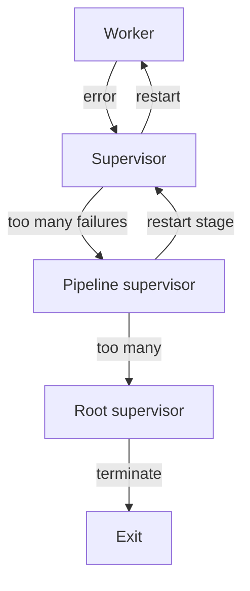

# Fan-In / Fan-Out Inside a Pipeline — Senior Level

## Table of Contents
1. [Introduction](#introduction)
2. [Prerequisites](#prerequisites)
3. [Glossary](#glossary)
4. [Architecture](#architecture)
5. [Dynamic Channel Sets with reflect.Select](#dynamic-channel-sets-with-reflectselect)
6. [Weighted and Priority Fan-Out](#weighted-and-priority-fan-out)
7. [Partial Failure and Supervisor Patterns](#partial-failure-and-supervisor-patterns)
8. [Backpressure Engineering](#backpressure-engineering)
9. [Leak Prevention at the Architectural Level](#leak-prevention-at-the-architectural-level)
10. [Real-World Analogies](#real-world-analogies)
11. [Mental Models](#mental-models)
12. [Pros & Cons](#pros-cons)
13. [Use Cases](#use-cases)
14. [Code Examples](#code-examples)
15. [Coding Patterns](#coding-patterns)
16. [Clean Code](#clean-code)
17. [Product Use / Feature](#product-use-feature)
18. [Performance Tips](#performance-tips)
19. [Best Practices](#best-practices)
20. [Edge Cases & Pitfalls](#edge-cases-pitfalls)
21. [Common Mistakes](#common-mistakes)
22. [Common Misconceptions](#common-misconceptions)
23. [Tricky Points](#tricky-points)
24. [Test](#test)
25. [Tricky Questions](#tricky-questions)
26. [Cheat Sheet](#cheat-sheet)
27. [Self-Assessment Checklist](#self-assessment-checklist)
28. [Summary](#summary)
29. [What You Can Build](#what-you-can-build)
30. [Further Reading](#further-reading)
31. [Related Topics](#related-topics)
32. [Diagrams & Visual Aids](#diagrams-visual-aids)

---

## Introduction
> Focus: "When and how do I redesign fan-out / fan-in for architecture-scale problems — dynamic stages, weighted streams, partial failure, supervisor restart, and the corners of `reflect.Select`?"

Senior-level work on fan-out / fan-in moves from "I can write a merge" to "I am responsible for a multi-team pipeline that processes a billion items per day." The mechanics from junior and middle remain; what changes is the scope. You make decisions about:

- **Stage boundaries.** Where does one team's pipeline end and another's begin? What is the contract on those boundaries?
- **Failure modes.** A single bad item should not bring down a billion-item pipeline. How is bad-item isolation built?
- **Resource governance.** Memory, CPU, network bandwidth, downstream rate limits — all need explicit caps.
- **Observability.** With dozens of stages and hundreds of goroutines, debugging is impossible without metrics, traces, and structured logs.
- **Restartability.** Pipelines must be safely restartable after a crash. Idempotency and checkpointing matter.
- **Dynamic shapes.** Sometimes the channel set is not known at compile time. `reflect.Select` is the tool, but it has costs.

We also visit weighted fan-out (some sources should send more than others) and priority merging (one input must drain before another). And we look hard at supervisor patterns: how do you restart a failed worker without taking down the whole pipeline?

By the end of this file you should be able to:

- Use `reflect.Select` when channel sets are dynamic, and explain its cost.
- Design fan-out / fan-in pipelines that survive partial worker failures with restart policies.
- Implement weighted and priority merges.
- Lay out a multi-stage pipeline with clear ownership and resource caps.
- Detect and diagnose pipeline-level performance problems (head-of-line blocking, fan-out skew, merge bottleneck).
- Write supervisor goroutines that restart failed workers.

We will not yet open the runtime hood; that is the professional level.

---

## Prerequisites

- **Required:** Junior and middle file content fully internalised.
- **Required:** Production experience building or maintaining at least one fan-out / fan-in pipeline.
- **Required:** Comfort with `reflect` package, especially `reflect.Value`, `reflect.Type`, and `reflect.SelectCase`.
- **Required:** Knowledge of supervisor / actor patterns from any language (Erlang, Akka, or simply "restart on fault" libraries).
- **Helpful:** Exposure to streaming systems (Kafka Streams, Flink, Beam) — the patterns translate.
- **Helpful:** Experience with `pprof`, `trace`, and `runtime/metrics`.

---

## Glossary

| Term | Definition |
|------|-----------|
| **`reflect.Select`** | Runtime variant of `select` that takes a `[]reflect.SelectCase`. Used when the set of channels is not known statically. |
| **Dynamic stage** | A stage whose input or output channel count changes at runtime (e.g., subscribers come and go). |
| **Weighted fan-out** | A fan-out where different workers handle different proportions of input (perhaps because they have different capacities). |
| **Priority merge** | A merge that prefers some inputs over others. |
| **Supervisor** | A goroutine that monitors workers and restarts them on failure. |
| **Restart strategy** | The policy a supervisor uses: one-for-one, one-for-all, rest-for-one. |
| **Backoff** | Delay before restart, often exponential. |
| **Head-of-line blocking** | A slow item at the head of a queue holding back faster items behind it. |
| **Fan-out skew** | Uneven distribution of work across workers; one worker handles much more than others. |
| **Idempotency** | Operations that produce the same result if applied multiple times. Essential for restarts. |
| **Checkpoint** | A persisted point in the input stream that a pipeline can resume from after restart. |
| **Watermark** | A "no event before this time will arrive" marker used in stream processing. |

---

## Architecture

### The stage as the unit of design

At senior level, you do not think in terms of individual goroutines — you think in terms of stages. A stage is a self-contained unit with:

- A typed input channel.
- A typed output channel.
- A start function that takes `context.Context` and returns the output.
- A close behaviour: on context cancel, drain quickly and close output.
- An error channel or `Result[T]` wrapper for typed errors.
- An observability contract: metrics for items in, items out, errors, latency.

Stages compose linearly. Composing two stages gives you a stage. Composing a stage with itself in parallel (with merge) gives you a fan-out stage. The shape is fractal.

A multi-team pipeline often has stage boundaries that map to team boundaries. The contract between teams is the stage interface. Each team can rebuild the inside of its stage independently.

### Pipeline-as-graph

A non-trivial pipeline is a directed acyclic graph (DAG) of stages. Some examples:

- Linear: A → B → C → D.
- Diamond (fan-out / fan-in): A → [B1, B2, B3] → C.
- Split: A → splitter → [path1: B → C, path2: D → E] → merger → F.
- Tree: source → [parser, validator, classifier] in parallel, each emitting its own output.

The DAG is built at startup. Each edge is a channel. Each node is a stage (one or more goroutines). The runtime is mostly inert: you start the leaves (sources), data flows downstream, and shutdown propagates upstream via context.

### The supervisor

A supervisor goroutine runs alongside the pipeline. Its job is to monitor worker health and react to failures. The contract:

1. Worker reports its lifecycle: started, running, dying, dead.
2. Supervisor decides: restart, escalate, or terminate the whole pipeline.
3. Restart involves: cleanup of the dead worker's resources, spawn a fresh worker, hook it back into the pipeline.

In Go, this looks like:

```go
type supervisor struct {
    workers int
    spawn   func(ctx context.Context, id int) error
}

func (s *supervisor) run(ctx context.Context) {
    var wg sync.WaitGroup
    for i := 0; i < s.workers; i++ {
        wg.Add(1)
        go func(id int) {
            defer wg.Done()
            for {
                err := s.spawn(ctx, id)
                if err == nil || errors.Is(err, context.Canceled) {
                    return
                }
                log.Printf("worker %d died: %v; restarting", id, err)
                select {
                case <-time.After(backoff()):
                case <-ctx.Done():
                    return
                }
            }
        }(i)
    }
    wg.Wait()
}
```

The supervisor keeps the worker count stable. If a worker dies, the supervisor spawns a replacement after a backoff. The pipeline as a whole continues.

### Restart strategies

Borrowed from Erlang/OTP:

- **One-for-one:** A dead worker is restarted; other workers continue. Default.
- **One-for-all:** A dead worker triggers restart of all workers. Use when workers share critical state.
- **Rest-for-one:** Workers spawned after the dead one (in start order) are also restarted. Useful for dependency chains.

Most fan-out workers are independent — one-for-one is correct. Sharded workers (where each worker handles a partition) might benefit from rest-for-one if the partition mapping changes on restart.

### Backoff

Exponential backoff prevents restart storms:

```go
func backoff(attempt int) time.Duration {
    d := time.Duration(1<<attempt) * 100 * time.Millisecond
    if d > 30*time.Second {
        d = 30 * time.Second
    }
    return d + time.Duration(rand.Intn(int(d/2)))
}
```

The random jitter avoids synchronised retries. After a few failed restarts, the supervisor may escalate to the parent (tear down the stage, propagate to the pipeline supervisor).

### Idempotency and checkpointing

For pipelines that consume from external sources (Kafka, S3, files), restart is only safe if processing is idempotent or if the pipeline remembers its position.

Idempotency: the same input processed twice produces the same downstream effect. Achievable via deterministic transformations and unique identifiers on side-effect operations.

Checkpointing: the pipeline periodically persists its progress (e.g., "we've processed up to Kafka offset 42 783"). On restart, it resumes from that offset.

For purely in-memory pipelines, neither applies — restart starts fresh.

---

## Dynamic Channel Sets with reflect.Select

### When you need it

The canonical `merge(cs ...<-chan T)` requires you to know all channels at compile time. The variadic argument is fixed once the call happens.

Real systems sometimes need to:

- Add a new input at runtime (subscriber joins).
- Remove an input at runtime (subscriber leaves).
- Merge channels of different types.

For these, you cannot use a fixed `select` statement. You need `reflect.Select`.

### The API

```go
package reflect

type SelectCase struct {
    Dir  SelectDir   // direction of case: SelectSend, SelectRecv, SelectDefault
    Chan Value       // the channel (reflect.Value)
    Send Value       // for SelectSend: the value to send
}

func Select(cases []SelectCase) (chosen int, recv Value, recvOK bool)
```

You build a slice of `SelectCase` describing the current set of channels and operations. Call `reflect.Select`. It returns the index of the case that fired, the received value (if any), and a boolean indicating whether the channel was open.

### A dynamic merge

```go
func dynamicMerge(ctx context.Context, cs []<-chan int) <-chan int {
    out := make(chan int)
    cases := make([]reflect.SelectCase, len(cs)+1)
    for i, c := range cs {
        cases[i] = reflect.SelectCase{
            Dir:  reflect.SelectRecv,
            Chan: reflect.ValueOf(c),
        }
    }
    cases[len(cs)] = reflect.SelectCase{
        Dir:  reflect.SelectRecv,
        Chan: reflect.ValueOf(ctx.Done()),
    }
    go func() {
        defer close(out)
        remaining := len(cs)
        for remaining > 0 {
            chosen, recv, ok := reflect.Select(cases)
            if chosen == len(cs) {
                return // context done
            }
            if !ok {
                // input channel closed: disable case
                cases[chosen].Chan = reflect.ValueOf((chan int)(nil))
                remaining--
                continue
            }
            v := int(recv.Int())
            select {
            case out <- v:
            case <-ctx.Done():
                return
            }
        }
    }()
    return out
}
```

The "disable case" trick: setting `Chan` to a nil channel makes the case never fire (a receive from a nil channel blocks forever). This is the standard way to disable a case in `reflect.Select`.

### Adding a channel at runtime

```go
type DynMerger[T any] struct {
    add chan <-chan T
    out chan T
    ctx context.Context
}

func newDynMerger[T any](ctx context.Context) *DynMerger[T] {
    d := &DynMerger[T]{
        add: make(chan <-chan T),
        out: make(chan T),
        ctx: ctx,
    }
    go d.loop()
    return d
}

func (d *DynMerger[T]) Add(c <-chan T) {
    select {
    case d.add <- c:
    case <-d.ctx.Done():
    }
}

func (d *DynMerger[T]) Out() <-chan T {
    return d.out
}

func (d *DynMerger[T]) loop() {
    defer close(d.out)
    var inputs []<-chan T
    for {
        cases := make([]reflect.SelectCase, 0, len(inputs)+2)
        // case 0: ctx.Done
        cases = append(cases, reflect.SelectCase{
            Dir:  reflect.SelectRecv,
            Chan: reflect.ValueOf(d.ctx.Done()),
        })
        // case 1: add channel
        cases = append(cases, reflect.SelectCase{
            Dir:  reflect.SelectRecv,
            Chan: reflect.ValueOf(d.add),
        })
        // cases 2..: input channels
        for _, c := range inputs {
            cases = append(cases, reflect.SelectCase{
                Dir:  reflect.SelectRecv,
                Chan: reflect.ValueOf(c),
            })
        }
        chosen, recv, ok := reflect.Select(cases)
        switch chosen {
        case 0:
            return
        case 1:
            if !ok {
                return
            }
            inputs = append(inputs, recv.Interface().(<-chan T))
        default:
            inputIdx := chosen - 2
            if !ok {
                // close: remove from inputs
                inputs = append(inputs[:inputIdx], inputs[inputIdx+1:]...)
                continue
            }
            select {
            case d.out <- recv.Interface().(T):
            case <-d.ctx.Done():
                return
            }
        }
    }
}
```

The merger maintains a slice of input channels. On each iteration, it builds a fresh `[]SelectCase` and calls `reflect.Select`. New channels can be added via `Add`. Closed channels are removed from the slice.

This is the canonical "runtime-extensible merge." It is more code than the static merge, and it pays a performance cost (allocations per iteration, reflection overhead).

### The cost of reflect.Select

A `reflect.Select` call costs roughly 10-100x a static `select` for the same number of cases. The overhead comes from:

- Building the `[]SelectCase` slice (allocation per call).
- The runtime walking the slice in `reflect.rselect`.
- Reflection's boxing of channel values and received values.

For pipelines with hundreds of static channels, prefer to break them into groups of 8-16 and use cascaded static merges. For genuinely dynamic sets, `reflect.Select` is the right tool, but use it sparingly — once per stage, not once per item.

### Tricks with reflect.Select

**Disable a case:** Set `Chan` to a nil channel (`reflect.ValueOf((chan T)(nil))`). Receives from nil channels block forever, so the case never fires.

**Force a default:** Add a `SelectDefault` case if you want non-blocking behaviour.

**Mix send and receive:** A `SelectCase` can have `Dir: SelectSend` with a `Send` value. The case fires when the channel is ready to receive your value.

**Type erasure:** All cases must work with `reflect.Value`. The merge's caller boxes values into `reflect.Value`; the merge unboxes via `recv.Interface().(T)`.

---

## Weighted and Priority Fan-Out

### Weighted fan-out

Suppose three workers, with capacities 1x, 2x, 4x respectively (perhaps because they run on machines of different sizes). You want to distribute work proportionally.

The runtime's automatic load balancing already approximates this. A faster worker handles items faster, so it reads more from the shared input channel. Weighted fan-out is rarely necessary in Go; competition for input is self-balancing.

When explicit weighting matters:

- The work is *not* uniform per item, but you can predict its weight in advance.
- You want to enforce a quota even if a worker becomes free.

Then a dispatcher routes by hand:

```go
type weightedWorker struct {
    in     <-chan Item
    weight int
}

func dispatch(ctx context.Context, source <-chan Item, workers []weightedWorker) {
    totalWeight := 0
    for _, w := range workers {
        totalWeight += w.weight
    }
    pos := 0
    for item := range source {
        // pick worker by weighted round-robin
        target := pickWeighted(workers, pos%totalWeight)
        pos++
        select {
        case workers[target].in <- item:
        case <-ctx.Done():
            return
        }
    }
}
```

`pickWeighted` returns the worker index whose cumulative weight covers `pos`. With weights `[1, 2, 4]`, the sequence of picks is `[0, 1, 1, 2, 2, 2, 2, 0, 1, 1, ...]`.

### Priority merge

Three input channels, ranked: critical, normal, low. Drain critical first, then normal, then low.

Approach 1: Try critical with non-blocking select, fall back if empty.

```go
func priorityMerge3[T any](ctx context.Context, crit, norm, low <-chan T) <-chan T {
    out := make(chan T)
    go func() {
        defer close(out)
        for {
            // try crit
            select {
            case v, ok := <-crit:
                if !ok {
                    crit = nil // disable
                } else {
                    if !forward(ctx, out, v) {
                        return
                    }
                    continue
                }
            default:
            }
            // try norm
            select {
            case v, ok := <-crit:
                if !ok {
                    crit = nil
                } else {
                    if !forward(ctx, out, v) {
                        return
                    }
                    continue
                }
            case v, ok := <-norm:
                if !ok {
                    norm = nil
                } else {
                    if !forward(ctx, out, v) {
                        return
                    }
                    continue
                }
            default:
            }
            // try all
            select {
            case v, ok := <-crit:
                if !ok {
                    crit = nil
                } else if !forward(ctx, out, v) {
                    return
                }
            case v, ok := <-norm:
                if !ok {
                    norm = nil
                } else if !forward(ctx, out, v) {
                    return
                }
            case v, ok := <-low:
                if !ok {
                    low = nil
                } else if !forward(ctx, out, v) {
                    return
                }
            case <-ctx.Done():
                return
            }
            if crit == nil && norm == nil && low == nil {
                return
            }
        }
    }()
    return out
}

func forward[T any](ctx context.Context, out chan<- T, v T) bool {
    select {
    case out <- v:
        return true
    case <-ctx.Done():
        return false
    }
}
```

The three-tier select: first try critical only, then critical or normal, then all three. If critical has something, take it; only if it does not do we even consider normal.

This is starvation-prone: if critical is non-empty forever, low never gets drained. For starvation-free priority, allocate a quota to each level (e.g., process 10 critical, then 5 normal, then 1 low, repeat).

### Hedged merge (variant of priority)

Hedged: the first reply wins, the others are cancelled. Different from "priority" in that all inputs race; whichever arrives first is the answer.

Already covered in middle. Senior-level: combine hedging with retries, exponential backoff, and cross-region preference. The code grows quickly; isolate it in its own package.

---

## Partial Failure and Supervisor Patterns

### The hierarchy

A pipeline at senior level has a hierarchy of supervisors:

```
Pipeline supervisor
    +-- Stage A supervisor
    |       +-- Worker 1
    |       +-- Worker 2
    |       +-- Worker 3
    +-- Stage B supervisor
    |       +-- Worker 1
    |       +-- Worker 2
    +-- Stage C (single goroutine — no supervisor needed)
```

The stage supervisor restarts dead workers. The pipeline supervisor restarts whole stages if a stage's supervisor fails repeatedly.

### Worker contract

A worker is a function `func(ctx context.Context) error`. Contracts:

- Returns nil on graceful exit (input drained, ctx cancelled).
- Returns non-nil error on failure (panic recovered into error, sentinel error, etc.).
- Respects ctx cancellation promptly.
- Releases all resources on exit (defer close, defer unlock, defer cleanup).

The supervisor invokes the worker, catches the return value, and decides what to do.

### Restart loop

```go
func supervise(ctx context.Context, name string, fn func(ctx context.Context) error) error {
    attempts := 0
    for {
        err := func() (innerErr error) {
            defer func() {
                if r := recover(); r != nil {
                    innerErr = fmt.Errorf("panic: %v", r)
                }
            }()
            return fn(ctx)
        }()
        if err == nil || errors.Is(err, context.Canceled) {
            return err
        }
        attempts++
        log.Printf("supervisor %s: attempt %d failed: %v", name, attempts, err)
        if attempts > 10 {
            return fmt.Errorf("supervisor %s: too many failures: %w", name, err)
        }
        select {
        case <-time.After(backoff(attempts)):
        case <-ctx.Done():
            return ctx.Err()
        }
    }
}
```

Recovers panics. Backs off between attempts. Escalates after too many failures.

### Decoupling restart from input

A subtle issue: if the worker reads from a shared channel, the in-flight item when it crashed is lost. Decouple by buffering input per worker:

```go
type supervised struct {
    name    string
    in      <-chan Item
    inFlight chan Item   // buffer of 1
    fn      func(ctx context.Context, it Item) error
}
```

Each worker reads first from `inFlight`, then from `in`. On crash, the supervisor sees `inFlight` still has the item and feeds it to the next worker.

Simpler alternative: idempotent processing. If the operation can safely be retried, the lost item is just retried.

### Bulkheading

Bulkhead: prevent one failure from cascading. In a fan-out, if one worker is failing repeatedly, the supervisor should isolate it (stop restarting after N attempts) so the rest of the pipeline can continue.

```go
g, ctx := errgroup.WithContext(ctx)
for i := 0; i < N; i++ {
    i := i
    g.Go(func() error {
        return supervise(ctx, fmt.Sprintf("worker-%d", i), func(ctx context.Context) error {
            return workerLoop(ctx, i)
        })
    })
}
return g.Wait()
```

If supervise returns a fatal error, the whole group cancels. The bulkhead is the per-worker supervise call: it absorbs transient failures.

---

## Backpressure Engineering

At senior level, backpressure becomes engineering rather than reflex.

### End-to-end backpressure

A pipeline has end-to-end backpressure when the slowest stage's rate determines every upstream stage's rate. Default Go channels give you this if you use unbuffered or small-buffered channels everywhere.

When you violate it (large buffer, drop-on-full, async write), you lose the end-to-end property. The pipeline can outrun itself; memory grows; eventually some hard limit breaks (OOM, downstream rate limiter triggers, etc.).

Senior-level work: identify *where* backpressure breaks and decide if it should be restored.

### Diagnosing backpressure loss

Symptoms:

- Memory grows over time, but throughput does not improve.
- A channel sits at full capacity for extended periods (its `len` ≈ `cap`).
- One stage's worker count is configured high, but actual concurrency is low (others are blocked).

Fixes:

- Shrink buffers.
- Add explicit feedback (e.g., the consumer publishes its rate; the producer reads it and slows down).
- Switch to pull-based for the affected stage.

### Reactive load-shedding

If you cannot block (because the input is real-time and shedding is preferred over backing up), drop:

```go
select {
case out <- v:
default:
    sheddedCounter.Inc()
}
```

But this is loss. Make it explicit, measure it, alert on it.

### Rate matching

A pipeline that runs continuously should match its source's rate. If the source produces at 1000 RPS but the pipeline processes 800, items accumulate forever (somewhere in some buffer). The pipeline must either:

- Match the source's rate (scale up workers).
- Apply backpressure to the source (often impossible — the source is "the world").
- Shed.

Most production pipelines run at 2-3x headroom over their peak source rate, with shedding only in emergencies.

### Auto-scaling the fan-out factor

Some pipelines auto-scale the fan-out factor based on observed lag:

```go
go func() {
    t := time.NewTicker(5 * time.Second)
    for range t.C {
        if observedLag > threshold {
            addWorker()
        } else if observedLag < threshold/10 {
            removeWorker()
        }
    }
}()
```

`addWorker` spawns a new worker reading from the same input. `removeWorker` cancels one. Requires careful handling of in-flight items.

---

## Leak Prevention at the Architectural Level

### Goroutine accounting

Maintain a counter per stage:

```go
type stageMetrics struct {
    spawned, exited atomic.Int64
}

func (s *stageMetrics) Live() int64 {
    return s.spawned.Load() - s.exited.Load()
}
```

If `Live()` grows over time, that stage is leaking. Wire to Prometheus.

### Mandatory `goleak` in CI

Every pipeline test runs `goleak.VerifyNone`. New tests cannot be merged if they leak. This catches regressions before they ship.

### Bounded buffers

Every buffered channel has a cap. The cap is documented. The total memory usage of all buffers is bounded.

```go
out := make(chan T, 32) // smooths 32-item bursts, see ADR-014
```

### Owners marked in comments

Each goroutine, channel, and resource has an owner. A comment near the spawn says who owns it and when it exits:

```go
// merge spawns N+1 goroutines.
// N forwarders exit when their input closes or ctx cancels.
// The closer exits when all forwarders have exited.
go func() { ... }()
```

### Routine pprof in production

A long-running service should expose `/debug/pprof/goroutine` and have an alert on goroutine count exceeding expected. The alert fires before the pipeline OOMs.

---

## Real-World Analogies

### Pipeline supervisor as restaurant manager

A restaurant has a manager (pipeline supervisor) and section heads (stage supervisors). Section heads are responsible for their waiters. If a waiter quits mid-shift, the section head finds a replacement (one-for-one). If the entire kitchen catches fire, the manager closes the restaurant for the day (escalation).

### Weighted fan-out as a court with sized rooms

A courthouse has rooms of different sizes. The big room handles big trials; small rooms handle small cases. The dispatcher routes cases by size, not by which room is free. That is weighted fan-out by capacity, not by availability.

### Priority merge as a hospital ER

Emergency arrivals (critical) go first. Walk-ins (low priority) wait. The triage nurse runs a priority merge across multiple queues. Starvation is a real issue: long-waiting walk-ins eventually get seen even if the ER never stops getting emergencies (the policy includes a "max wait" guarantee).

### Bulkheading as ship compartments

A ship has watertight bulkheads so a hole in one compartment does not sink the whole ship. A pipeline with bulkheads isolates failures: one worker dying does not stop the others; one stage failing does not stop downstream stages from finishing what they have already received.

---

## Mental Models

### Model 1: "Pipelines are graphs; goroutines are edges"

A pipeline is a graph of stages; the channels are the edges; the data flows along the edges; the goroutines are the agents that move data along the edges. Some edges have multiple agents (fan-out); some edges merge (fan-in).

### Model 2: "Cancellation is gravity, errors are wind"

Cancellation flows downward through `ctx.Done()` propagation. Once cancelled, every stage observes and shuts down. Errors flow with data, side-channeled, until a supervisor decides to escalate. Cancellation is universal; errors are local.

### Model 3: "Stages are like microservices"

Each stage is like a microservice: typed input, typed output, internal state, observability, error contract. The difference is that stages share a process and communicate via channels, not over a network. The discipline is similar.

### Model 4: "Backpressure is the heartbeat"

A healthy pipeline has subtle backpressure pulses: the consumer briefly pauses, the producer briefly pauses, then both resume. Watch for two pathologies: no backpressure (consumer dies but producer keeps going) and constant backpressure (consumer is always slow).

### Model 5: "The supervisor is the immune system"

Workers die from time to time — bad inputs, transient errors, panics. The supervisor's job is to detect and replace, not to prevent. Like an immune system: it does not stop the disease, it contains it. Healthy pipelines die many small deaths.

---

## Pros & Cons

### Pros

- **Resilience.** Supervised pipelines survive worker failures.
- **Dynamic shapes.** `reflect.Select` enables runtime extensibility.
- **Scalability.** Bounded fan-out factors plus auto-scaling adapt to load.
- **Observability.** Per-stage metrics make pipelines debuggable.
- **Modularity.** Stage boundaries align with team boundaries.

### Cons

- **Complexity.** Supervisors, dynamic merges, and weighted routing add code.
- **Cost.** `reflect.Select` is 10-100x slower than static `select`.
- **Failure modes are many.** Each restart strategy has corner cases.
- **Testing is harder.** Restart logic needs fault injection.
- **Ownership ambiguity.** "Whose stage is this?" can become a real organisational question.

---

## Use Cases

| Scenario | Why senior-level fan-out / fan-in fits |
|---|---|
| Pub-sub broker with dynamic subscribers | Subscribers come and go; `reflect.Select` powers the dispatch. |
| ETL with mixed source types | Each source is a channel of a different type; dynamic merging required. |
| Streaming analytics with per-tenant fan-out | Each tenant has its own fan-out factor based on quota. |
| Multi-region service with failover | Hedged fan-out across regions; supervisor restarts dead replicas. |
| High-throughput data ingest with bursty sources | Backpressure engineering keeps the system stable. |
| Async messaging with retry and DLQ | Supervisor-managed workers with bounded retry, fail-fast to dead-letter queue. |

---

## Code Examples

### Example 1: Supervised fan-out with errgroup

```go
package main

import (
    "context"
    "errors"
    "fmt"
    "log"
    "math/rand"
    "time"

    "golang.org/x/sync/errgroup"
)

func worker(ctx context.Context, id int, in <-chan int, out chan<- int) error {
    for {
        select {
        case v, ok := <-in:
            if !ok {
                return nil
            }
            if rand.Float64() < 0.05 {
                return fmt.Errorf("worker %d: random failure", id)
            }
            select {
            case out <- v * v:
            case <-ctx.Done():
                return ctx.Err()
            }
        case <-ctx.Done():
            return ctx.Err()
        }
    }
}

func supervise(ctx context.Context, fn func(ctx context.Context) error, maxAttempts int) error {
    for attempt := 0; ; attempt++ {
        err := fn(ctx)
        if err == nil || errors.Is(err, context.Canceled) {
            return err
        }
        if attempt >= maxAttempts {
            return fmt.Errorf("max attempts reached: %w", err)
        }
        log.Printf("attempt %d failed: %v; restarting", attempt, err)
        select {
        case <-time.After(time.Duration(100*(1<<attempt)) * time.Millisecond):
        case <-ctx.Done():
            return ctx.Err()
        }
    }
}

func main() {
    ctx, cancel := context.WithCancel(context.Background())
    defer cancel()
    in := make(chan int)
    out := make(chan int)
    g, gctx := errgroup.WithContext(ctx)
    const workers = 4
    for i := 0; i < workers; i++ {
        i := i
        g.Go(func() error {
            return supervise(gctx, func(ctx context.Context) error {
                return worker(ctx, i, in, out)
            }, 5)
        })
    }
    g.Go(func() error {
        defer close(in)
        for v := 0; v < 50; v++ {
            select {
            case in <- v:
            case <-gctx.Done():
                return gctx.Err()
            }
        }
        return nil
    })
    g.Go(func() error {
        defer close(out)
        // wait until workers + producer all return
        return nil // dummy; the merge close pattern needs more
    })
    for v := range out {
        fmt.Println(v)
    }
    if err := g.Wait(); err != nil {
        log.Fatal(err)
    }
}
```

(Note: simplified; production version would carefully coordinate the close of `out`.)

### Example 2: Dynamic merge with reflect.Select

Already shown above in the deep-dive. Use when subscribers add and remove channels at runtime.

### Example 3: Weighted fan-out dispatcher

```go
type weighted struct {
    ch     chan<- int
    weight int
}

func dispatch(ctx context.Context, in <-chan int, ws []weighted) {
    total := 0
    for _, w := range ws {
        total += w.weight
    }
    counts := make([]int, len(ws))
    for v := range in {
        target := pick(ws, counts, total)
        counts[target]++
        select {
        case ws[target].ch <- v:
        case <-ctx.Done():
            return
        }
    }
    for _, w := range ws {
        close(w.ch)
    }
}

func pick(ws []weighted, counts []int, total int) int {
    var best int
    var bestRatio float64 = 2.0
    for i, w := range ws {
        if w.weight == 0 {
            continue
        }
        ratio := float64(counts[i]) / float64(w.weight)
        if ratio < bestRatio {
            bestRatio = ratio
            best = i
        }
    }
    return best
}
```

This is "deficit round-robin": pick the worker whose counts are most behind its weight.

### Example 4: Priority merge with quotas

```go
func quotaMerge[T any](ctx context.Context, crit, low <-chan T, ratio int) <-chan T {
    out := make(chan T)
    go func() {
        defer close(out)
        for {
            // process up to `ratio` from crit
            for i := 0; i < ratio; i++ {
                select {
                case v, ok := <-crit:
                    if !ok {
                        // drain low
                        for v := range low {
                            select {
                            case out <- v:
                            case <-ctx.Done():
                                return
                            }
                        }
                        return
                    }
                    select {
                    case out <- v:
                    case <-ctx.Done():
                        return
                    }
                default:
                    goto tryLow
                }
            }
        tryLow:
            select {
            case v, ok := <-low:
                if !ok {
                    low = nil
                    continue
                }
                select {
                case out <- v:
                case <-ctx.Done():
                    return
                }
            case v, ok := <-crit:
                if !ok {
                    // drain low
                    for v := range low {
                        select {
                        case out <- v:
                        case <-ctx.Done():
                            return
                        }
                    }
                    return
                }
                select {
                case out <- v:
                case <-ctx.Done():
                    return
                }
            case <-ctx.Done():
                return
            }
        }
    }()
    return out
}
```

For every `ratio` items from crit, one item from low is allowed. Starvation-free.

### Example 5: Auto-scaling fan-out

```go
type autoScaler struct {
    minWorkers, maxWorkers int
    target                 *atomic.Int64
    workers                []context.CancelFunc
    in                     <-chan int
    out                    chan<- int
    spawn                  func(ctx context.Context, in <-chan int, out chan<- int)
}

func (a *autoScaler) loop(ctx context.Context) {
    a.target.Store(int64(a.minWorkers))
    a.adjust(ctx)
    t := time.NewTicker(5 * time.Second)
    defer t.Stop()
    for {
        select {
        case <-t.C:
            // measure lag, adjust target
            if measureLag() > thresholdHigh {
                a.target.Add(1)
            } else if measureLag() < thresholdLow {
                a.target.Add(-1)
            }
            if a.target.Load() < int64(a.minWorkers) {
                a.target.Store(int64(a.minWorkers))
            }
            if a.target.Load() > int64(a.maxWorkers) {
                a.target.Store(int64(a.maxWorkers))
            }
            a.adjust(ctx)
        case <-ctx.Done():
            return
        }
    }
}

func (a *autoScaler) adjust(ctx context.Context) {
    for int64(len(a.workers)) < a.target.Load() {
        wctx, cancel := context.WithCancel(ctx)
        a.workers = append(a.workers, cancel)
        go a.spawn(wctx, a.in, a.out)
    }
    for int64(len(a.workers)) > a.target.Load() {
        a.workers[len(a.workers)-1]()
        a.workers = a.workers[:len(a.workers)-1]
    }
}

func measureLag() float64 { return 0.0 }

const (
    thresholdHigh = 0.8
    thresholdLow  = 0.2
)
```

Skeleton; real version measures via the pipeline's metrics and tunes carefully to avoid oscillation.

### Example 6: Bulkheaded pipeline

```go
func bulkheaded(ctx context.Context, in <-chan Item) error {
    g, gctx := errgroup.WithContext(ctx)
    g.SetLimit(8)
    for item := range in {
        item := item
        g.Go(func() error {
            defer func() {
                if r := recover(); r != nil {
                    log.Printf("item %v: panic %v", item, r)
                }
            }()
            err := process(gctx, item)
            if err != nil {
                log.Printf("item %v: error %v", item, err)
                // do NOT return err; we don't want one bad item to cancel the group
                return nil
            }
            return nil
        })
    }
    return g.Wait()
}
```

The trick: workers swallow errors locally so the `errgroup` does not cancel everything. The bulkheading is the swallow — errors stay local.

### Example 7: A pipeline with idempotent restart

```go
type pipeline struct {
    checkpointer Checkpointer
}

func (p *pipeline) run(ctx context.Context) error {
    last, err := p.checkpointer.Load(ctx)
    if err != nil {
        return err
    }
    in := readFrom(ctx, last)
    for v := range in {
        if err := processIdempotent(ctx, v); err != nil {
            return err
        }
        if err := p.checkpointer.Save(ctx, v.Position); err != nil {
            return err
        }
    }
    return nil
}
```

On restart, `Load()` returns the last saved position; `readFrom` resumes from there. `processIdempotent` is safe to retry. Checkpoint after each item (slow but safe) or every N items (fast but may reprocess).

### Example 8: Health-checked fan-out

```go
type healthCheckedWorker struct {
    id     int
    in     <-chan Item
    out    chan<- Result
    healthy atomic.Bool
}

func (w *healthCheckedWorker) loop(ctx context.Context) {
    w.healthy.Store(true)
    defer w.healthy.Store(false)
    for item := range w.in {
        result, err := process(ctx, item)
        if err != nil {
            w.healthy.Store(false)
            return
        }
        select {
        case w.out <- result:
        case <-ctx.Done():
            return
        }
    }
}
```

A health endpoint exposes the `healthy` state. Load balancers can route traffic away from unhealthy workers.

### Example 9: Drain on graceful shutdown

```go
func shutdownGracefully(ctx context.Context, p *Pipeline, drainTimeout time.Duration) error {
    p.stopAccepting()
    drainCtx, cancel := context.WithTimeout(ctx, drainTimeout)
    defer cancel()
    return p.waitForDrain(drainCtx)
}
```

Stop accepting new inputs; wait up to `drainTimeout` for in-flight to finish; force cancel if not done. Useful for SIGTERM handling.

### Example 10: Cross-stage metric aggregator

```go
type metrics struct {
    stages map[string]*stageStats
    mu     sync.RWMutex
}

func (m *metrics) Snapshot() map[string]stageStats {
    m.mu.RLock()
    defer m.mu.RUnlock()
    out := make(map[string]stageStats, len(m.stages))
    for k, v := range m.stages {
        out[k] = *v
    }
    return out
}
```

A central registry collects per-stage metrics. Exposed via HTTP or Prometheus.

---

## Coding Patterns

### Pattern 1: The "actor" stage

A stage is implemented as an "actor" — a struct with private state, an input channel, an output channel, and a `Run(ctx)` method.

```go
type Actor[I, O any] struct {
    in  <-chan I
    out chan O
    fn  func(I) O
}

func (a *Actor[I, O]) Run(ctx context.Context) {
    defer close(a.out)
    for v := range a.in {
        select {
        case a.out <- a.fn(v):
        case <-ctx.Done():
            return
        }
    }
}
```

Pure function inside. State, if any, is captured. Easy to test in isolation.

### Pattern 2: The "DAG builder"

A small DSL for declaring pipelines:

```go
pipeline := Builder().
    Source("read", readFile).
    FanOut("parse", 8, parseRow).
    Stage("validate", validate).
    FanOut("hash", 4, hashRow).
    Sink("write", writeCSV).
    Build()
```

Each method appends a stage. `Build()` returns a runner. Internally, the builder wires channels between stages.

### Pattern 3: The "circuit breaker"

A stage that monitors error rate and trips open when errors exceed a threshold:

```go
type breaker struct {
    open atomic.Bool
}

func (b *breaker) Maybe(fn func() error) error {
    if b.open.Load() {
        return errBreakerOpen
    }
    err := fn()
    if err != nil {
        b.maybeTrip()
    }
    return err
}
```

When open, the stage short-circuits failing operations. Combine with retry and back-off.

### Pattern 4: The "outbox"

For pipelines that produce side effects (DB writes, API calls), use an outbox table:

1. Worker writes the result + the side-effect description to a single transactional outbox.
2. A separate worker reads the outbox and performs the side effects.

Guarantees at-least-once delivery even if the pipeline crashes between produce and side-effect.

### Pattern 5: The "drain on flush"

Periodically flush in-flight items to a side store for resumability:

```go
type flushable struct {
    pending []Item
    mu      sync.Mutex
}

func (f *flushable) flushLoop(ctx context.Context, interval time.Duration) {
    t := time.NewTicker(interval)
    defer t.Stop()
    for {
        select {
        case <-t.C:
            f.flush()
        case <-ctx.Done():
            f.flush()
            return
        }
    }
}
```

Tradeoff: flush adds latency but enables recovery. Tune the interval.

---

## Clean Code

- **One stage, one file.** Or one package. Easier to test, easier to navigate.
- **Stage interfaces, not concrete types.** Allow swapping implementations (real, fake, mock).
- **Bound everything.** Fan-out factor, buffer size, retry attempts, restart attempts. No infinities in production code.
- **Document the failure modes.** What happens when a worker dies? When the input closes? When `ctx` is cancelled? Write it down.
- **Reject API misuse at compile time.** Use receive-only channels, typed errors, sealed unions where possible.

---

## Product Use / Feature

| Feature | How senior-level fan-out / fan-in delivers it |
|---|---|
| Multi-tenant streaming analytics | Per-tenant pipelines with per-tenant fan-out factors; pipeline-level supervisor. |
| Distributed log ingest with backpressure to source | Pipeline reports its consumption rate back to the source via a control channel. |
| Asynchronous webhook delivery with retry | Each webhook is a worker with bounded retries; failures route to DLQ. |
| Real-time ML feature store updates | Tag-and-reorder for feature freshness; weighted fan-out for partition skew. |
| Event-sourced services | Idempotent pipelines that consume from a stream and project state; checkpointed for restart. |

---

## Performance Tips

### Profile, don't guess

Use `pprof`:

- CPU profile: where is time spent?
- Goroutine profile: how many goroutines, where are they?
- Block profile: where are goroutines blocked? (Channel operations show up here.)
- Mutex profile: where is contention?

Open every pipeline-related profile when investigating performance.

### Avoid `reflect.Select` in hot paths

10-100x slower than static select. Use static select with cascaded merges for high-throughput pipelines.

### Pre-allocate slices

```go
results := make([]Result, 0, expectedCount)
```

Avoids reallocation during fill. Especially useful in tag-and-reorder buffers.

### Sync.Pool for short-lived buffers

```go
var bufPool = sync.Pool{New: func() any { return make([]byte, 0, 4096) }}
```

Reuses buffers across goroutines. Cuts GC pressure significantly.

### Batched channel sends

For very high throughput, send slices over the channel instead of individual items:

```go
out := make(chan []T)
batch := make([]T, 0, 100)
for v := range in {
    batch = append(batch, v)
    if len(batch) == cap(batch) {
        out <- batch
        batch = make([]T, 0, 100)
    }
}
```

Cuts channel ops by 100x.

### Avoid atomic.Map for hot counters

`sync.Map` has overhead. For per-shard counters, `[]atomic.Int64` is faster.

---

## Best Practices

1. Every stage has a supervisor or is robust by construction.
2. `reflect.Select` is used only when channel sets are truly dynamic.
3. Fan-out factor is configured per stage, not global.
4. Order-preserving stages use tag-and-reorder, not single-threading.
5. Backpressure is end-to-end; buffers are bounded and documented.
6. Metrics on each stage: in, out, errors, latency, in-flight.
7. Tests include: leak (`goleak`), cancellation, error injection, restart.
8. Idempotent workers where restart safety matters.
9. Checkpointing for long-running pipelines.
10. Graceful shutdown with drain timeout.

---

## Edge Cases & Pitfalls

### Restart storm

A worker fails repeatedly. The supervisor restarts. The new worker hits the same failing input and dies. Repeat at high rate. Fixes:

- Backoff between restarts.
- Cap on restart attempts; escalate after.
- Quarantine the failing input (move to DLQ).

### Supervisor loop never exits

If the supervisor catches every error including `context.Canceled`, it loops forever. Always check for cancellation:

```go
if errors.Is(err, context.Canceled) {
    return err
}
```

### `reflect.Select` with sends that can fail

A send case `Dir: SelectSend` fires when the channel is ready. If the channel is closed, the send case panics. Handle by removing closed channels from the case list.

### Mixed-type dynamic merge

If your dynamic merge handles channels of different types, you lose type safety at the merge. Either:

- Use a single common type (e.g., `chan any`) and accept the type assertions.
- Use a generic merge but only over one type at a time.

### Backpressure from a stage that doesn't apply backpressure

If a stage drops (`select` with `default`), backpressure does not propagate through it. The pipeline runs at the source's rate, regardless of downstream. Mark these stages clearly.

### Hot fan-in path

In a pipeline with thousands of inputs, the merge can become the bottleneck. Use hierarchical merging (cascade of 8-input merges) instead of one giant `reflect.Select`.

### Auto-scaling oscillation

If the auto-scaler adjusts every few seconds, it can oscillate: add a worker, lag drops, remove a worker, lag rises, add a worker. Use longer measurement windows and hysteresis.

---

## Common Mistakes

| Mistake | Fix |
|---|---|
| Restarting workers on every error without backoff | Add exponential backoff. |
| Letting `errgroup` cancel the pipeline on every per-item error | Use `Result[T]`; only fatal errors propagate. |
| Hardcoding `runtime.NumCPU()` as fan-out everywhere | Profile and tune per stage. |
| `reflect.Select` in every merge "just in case" | Use static select unless truly dynamic. |
| Supervisor monitors metrics but does not act on them | Wire metrics into auto-scaling or alerts. |
| Per-stage observability missing in half the stages | Standardise via a stage wrapper. |

---

## Common Misconceptions

> *"`reflect.Select` is free."* — 10-100x slower than static. Use when needed, not by default.

> *"Supervisor pattern requires Erlang-style processes."* — Goroutines + `errgroup` + restart loops give 90% of OTP's features.

> *"Auto-scaling always helps."* — Often it adds latency from oscillation and complicates debugging. Static fan-out is often better.

> *"Idempotency means I can ignore restart logic."* — Idempotency makes restart safe; it does not make it free.

> *"Bulkheading isolates everything."* — Only what you explicitly isolate. A leaked goroutine still consumes shared memory.

> *"Priority merging is fair."* — Priority is the opposite of fairness. Without quotas, low priority can starve.

---

## Tricky Points

### `reflect.Select` order is fair (per call)

When multiple cases are ready, `reflect.Select` picks pseudo-randomly, same as static `select`. Fair across many calls; unpredictable per call.

### `reflect.SelectCase{Dir: SelectDefault}` is the default case

Add at the end. Fires if no other case is ready. Use to make `reflect.Select` non-blocking.

### Closing a channel inside reflect.Select

`reflect.Select` does not close anything. You close channels manually as usual.

### Supervisor must not block

If the supervisor itself blocks (e.g., on a logging call), it cannot react to new failures. Keep supervisor loops fast; offload work elsewhere.

### Bulkhead means errors don't propagate, not that they're ignored

A swallowed error must still be logged, counted, and exposed via metrics. Otherwise it is silent failure.

### Restart loses in-flight items

When a worker dies mid-process, the item it was handling is lost. To not lose: per-worker input buffer + re-feed on restart, or idempotent processing + retry from upstream.

### `errgroup.SetLimit(N)` after `Go` calls is undefined

Set the limit before any `Go` call. Once `Go` is called, the limit is fixed for the remainder.

---

## Test

```go
package pipeline_test

import (
    "context"
    "errors"
    "testing"
    "time"

    "go.uber.org/goleak"
)

func TestSupervisorRestartsWorker(t *testing.T) {
    defer goleak.VerifyNone(t)
    ctx, cancel := context.WithCancel(context.Background())
    defer cancel()
    attempts := 0
    err := supervise(ctx, "test", func(ctx context.Context) error {
        attempts++
        if attempts < 3 {
            return errors.New("transient")
        }
        return nil
    }, 5)
    if err != nil {
        t.Fatalf("expected nil after recovery, got %v", err)
    }
    if attempts != 3 {
        t.Fatalf("expected 3 attempts, got %d", attempts)
    }
}

func TestSupervisorRespectsCancellation(t *testing.T) {
    defer goleak.VerifyNone(t)
    ctx, cancel := context.WithCancel(context.Background())
    go func() {
        time.Sleep(50 * time.Millisecond)
        cancel()
    }()
    err := supervise(ctx, "test", func(ctx context.Context) error {
        return errors.New("always fails")
    }, 100)
    if !errors.Is(err, context.Canceled) {
        t.Fatalf("expected canceled, got %v", err)
    }
}

func TestDynamicMergeAddRemove(t *testing.T) {
    defer goleak.VerifyNone(t)
    ctx, cancel := context.WithCancel(context.Background())
    defer cancel()
    m := newDynMerger[int](ctx)
    a := make(chan int)
    b := make(chan int)
    m.Add(a)
    m.Add(b)
    go func() { a <- 1; close(a) }()
    go func() { b <- 2; close(b) }()
    got := 0
    for v := range m.Out() {
        got += v
        if got == 3 {
            cancel()
        }
    }
    if got != 3 {
        t.Fatalf("expected 3, got %d", got)
    }
}
```

Tests include: supervisor restart, supervisor cancellation, dynamic merge.

---

## Tricky Questions

**Q.** When would you choose `reflect.Select` over a static merge?

**A.** When the set of channels changes at runtime. Examples: pub-sub subscribers, plugin systems, dynamic worker pools where workers can be added or removed without restarting the pipeline. For static pipelines with a fixed number of channels (even 32 or 64), use static select with cascaded merges.

---

**Q.** Why is a supervisor better than catching errors in the worker itself?

**A.** Separation of concerns. The worker focuses on the work; the supervisor focuses on lifecycle (restart, backoff, escalation). Composing them via a "supervise the worker function" wrapper is clean and testable.

---

**Q.** I have a fan-out of 16 workers and one is consistently slower (90% slower) than the others. What should I check?

**A.** Likely candidates: (1) That worker is on a slower machine (NUMA, cache, etc.). (2) Skewed input — it consistently gets the harder items. (3) A leaked resource specific to that worker. (4) GC pause that always hits it. Profile to find which.

---

**Q.** My pipeline's goroutine count grows from 100 to 10 000 over an hour, then crashes with OOM. What's the bug shape?

**A.** Leak. Each item probably spawns a goroutine that never exits. Find the spawn point with `pprof`'s goroutine profile. Look for "background context with timeout never fires" or "send on a never-read channel" patterns.

---

**Q.** A priority merge is causing low-priority starvation. How do you fix without losing the priority property?

**A.** Add quotas: for every N high-priority items processed, process 1 low-priority. The starvation rate becomes bounded. Tune N based on traffic mix.

---

**Q.** I want to add a new stage to a running pipeline without restart. Is this safe in Go?

**A.** Hard. The pipeline is wired by channels passed at startup. To add a stage dynamically, you would need a router stage that can be reconfigured at runtime — usually a `reflect.Select` based hub. In practice, hot-reloading a pipeline is rare; rolling restart with overlap is the standard.

---

**Q.** What's the difference between "fan-out across N goroutines" and "fan-out across N services"?

**A.** Same shape, different boundaries. In-process: channel based, fast, no failure isolation. Cross-service: HTTP/gRPC based, slower, but failures don't share fate. Often you compose: a service has internal fan-out across goroutines, and the service is one node in a larger fan-out across replicas.

---

**Q.** When does `goleak` give a false positive?

**A.** When you have legitimate background goroutines (like a metrics flusher) that survive the test. Configure `goleak.IgnoreCurrent()` at TestMain to baseline them out.

---

## Cheat Sheet

```go
// Dynamic merge skeleton
cases := []reflect.SelectCase{
    {Dir: reflect.SelectRecv, Chan: reflect.ValueOf(ctx.Done())},
    // ... input channels
}
chosen, recv, ok := reflect.Select(cases)

// Disable a case
cases[i].Chan = reflect.ValueOf((chan int)(nil))

// Supervisor with backoff
for attempt := 0; ; attempt++ {
    err := fn(ctx)
    if err == nil || errors.Is(err, context.Canceled) {
        return err
    }
    select {
    case <-time.After(backoff(attempt)):
    case <-ctx.Done():
        return ctx.Err()
    }
}

// Bulkhead: swallow errors locally
g.Go(func() error {
    if err := process(item); err != nil {
        log.Printf("%v", err)
        return nil // do not cancel group
    }
    return nil
})

// Priority with quotas
for i := 0; i < ratio; i++ {
    select {
    case v := <-high:
        emit(v)
    default:
        goto tryLow
    }
}
tryLow:
select {
case v := <-low: emit(v)
case v := <-high: emit(v)
}
```

---

## Self-Assessment Checklist

- [ ] I can implement a dynamic merge with `reflect.Select`.
- [ ] I know `reflect.Select` is much slower than static and use it sparingly.
- [ ] I can design a supervisor with backoff and escalation.
- [ ] I can implement weighted and priority merges.
- [ ] I know how to bulkhead failures so one bad worker does not stop the pipeline.
- [ ] I can identify and diagnose head-of-line blocking, fan-out skew, and merge bottleneck.
- [ ] I have built or maintained a pipeline that auto-scales its fan-out factor.
- [ ] I document failure modes for every stage in writing.
- [ ] I have used `goleak` and `pprof` together to find a real leak.
- [ ] I can explain idempotency and checkpointing as restart enablers.

---

## Summary

Senior-level fan-out / fan-in is architecture work. The mechanics are unchanged from middle level; what changes is the scope. You build multi-stage DAGs of stages, each with its own supervisor, each respecting end-to-end backpressure, each instrumented for observability.

`reflect.Select` is the tool for dynamic channel sets. It costs 10-100x a static select; use when channels truly vary at runtime, otherwise prefer cascaded static merges. Weighted and priority fan-out require explicit dispatchers; the default runtime arbitration is fair but uniform.

Supervisor patterns — borrowed from Erlang/OTP and adapted to Go's goroutines — keep pipelines alive in the face of worker failure. Restart strategies (one-for-one, one-for-all, rest-for-one) match different failure profiles. Bulkheading prevents cascade. Backoff prevents restart storms.

Backpressure engineering becomes a discipline: every buffer is bounded, every send is select-on-context, every stage's rate is observable. Drop-on-full is a deliberate choice with logged loss. Idempotency and checkpointing make restart safe.

Once these are reflexes, you can build pipelines that process a billion items a day without surprise. Professional level opens the runtime hood — selectgo, GMP scheduling, and the cost model of every operation we have used.

---

## What You Can Build

- A multi-tenant streaming analytics pipeline with per-tenant fan-out factors and supervised restart.
- A pub-sub broker with thousands of dynamic subscribers, using `reflect.Select` for the dispatch.
- A high-throughput ingest service with backpressure all the way to the client.
- A real-time recommendations service with hedged fan-out across model variants.
- A log-shipping daemon with checkpointed restart and bounded retry.
- A distributed system component that combines internal fan-out with external service fan-out.

---

## Further Reading

- *Designing Data-Intensive Applications* (Kleppmann), chapters 11-12 (stream processing)
- *Programming Erlang* (Armstrong) — supervisor trees and "let it crash"
- Go talk: *Advanced Go Concurrency Patterns* (Sameer Ajmani) — <https://www.youtube.com/watch?v=QDDwwePbDtw>
- Go runtime source: `runtime/select.go` for static select; `reflect/value.go` for `Select` impl
- `go.uber.org/goleak` and `runtime/pprof` for diagnostics

---

## Related Topics

- `reflect` package mechanics
- Erlang OTP supervisor trees
- Stream processing (Kafka, Flink, Beam)
- Idempotency and checkpointing in distributed systems
- Circuit breakers and bulkheads (Hystrix-style)
- `errgroup` advanced patterns

---

## Diagrams & Visual Aids

### Supervisor hierarchy

```
                     Pipeline Supervisor
                    /        |         \
              Stage A    Stage B    Stage C
              /  |  \       |        single
            W1  W2  W3     W1            goroutine
```

### Dynamic merge state machine

```
inputs = [c1, c2, c3]
loop:
   build cases from inputs + ctx + add channel
   reflect.Select(cases)
   if ctx.Done: exit
   if add fired: append to inputs
   if input i closed: remove from inputs
   if input i value: forward to out
```

### Restart loop with backoff

```
attempt 0 -> fail -> sleep 100ms
attempt 1 -> fail -> sleep 200ms
attempt 2 -> fail -> sleep 400ms
...
attempt N -> success -> return
or
attempt M >= max -> escalate
```

### Priority merge with quotas

```
For each round:
   process up to R items from high
   process 1 item from low
   continue until both are closed

Starvation bound: low gets serviced every R+1 cycles.
```

### Cascaded static merge vs reflect.Select

```
reflect.Select with 32 cases:    1 syscall, O(32) overhead per pick
Cascaded static select:           merge(merge(c1..c8), merge(c9..c16), ...)
                                 4 static selects in parallel, each O(8)
                                 ~10x faster overall

Trade-off: cascaded is fixed at build time, reflect.Select allows runtime change.
```

### Supervisor escalation



---

## Case Study: A Streaming Aggregation Pipeline

To make these architectural concepts concrete, walk through a real-shaped case study: a streaming aggregation pipeline that consumes events from Kafka, aggregates by user, and writes per-user summaries every minute.

### Requirements

- Source: Kafka topic with 100 partitions; ~1M events/sec at peak.
- Each event has a `user_id` and a `value`.
- Output: per-user summary every 60 seconds; written to a downstream service.
- Latency: aggregations must be visible within 90 seconds of event ingestion.
- Failure: occasional Kafka rebalance, occasional downstream service hiccup, occasional bad event (malformed JSON).

### Stage 1: Source consumers

One consumer per Kafka partition (100 consumers). Each consumer is its own goroutine. They share a single output channel via fan-in.

```go
type sourceStage struct {
    consumers []*kafkaConsumer
    out       chan Event
}

func (s *sourceStage) Run(ctx context.Context) error {
    g, gctx := errgroup.WithContext(ctx)
    for i, c := range s.consumers {
        i, c := i, c
        g.Go(func() error {
            return supervise(gctx, fmt.Sprintf("kafka-%d", i), func(ctx context.Context) error {
                return c.consume(ctx, s.out)
            }, 5)
        })
    }
    go func() {
        g.Wait()
        close(s.out)
    }()
    return nil
}
```

Each consumer is supervised independently. A Kafka rebalance kills the consumer; supervise restarts it from the last committed offset. Other consumers keep going.

Output channel `out` is the merge of all 100 consumers. Backpressure to Kafka happens naturally: if downstream is slow, consumers stop polling, partitions go to other consumer instances (or just lag).

### Stage 2: Decoding

Decode JSON into typed events. CPU-bound — fan out to `NumCPU` workers.

```go
type decodeStage struct {
    in  <-chan []byte
    out chan Event
}

func (d *decodeStage) Run(ctx context.Context) error {
    g, gctx := errgroup.WithContext(ctx)
    g.SetLimit(runtime.NumCPU())
    for i := 0; i < runtime.NumCPU(); i++ {
        g.Go(func() error {
            for raw := range d.in {
                ev, err := decode(raw)
                if err != nil {
                    badEventCounter.Inc()
                    continue
                }
                select {
                case d.out <- ev:
                case <-gctx.Done():
                    return gctx.Err()
                }
            }
            return nil
        })
    }
    go func() {
        g.Wait()
        close(d.out)
    }()
    return nil
}
```

Bad events are dropped with a metric. They do not stop the pipeline.

### Stage 3: Sharding by user_id

To aggregate per-user, all events for a user must reach the same aggregator. Shard by hash of `user_id`.

```go
type shardStage struct {
    in    <-chan Event
    shards []chan Event
}

func (s *shardStage) Run(ctx context.Context) error {
    go func() {
        defer func() {
            for _, sh := range s.shards {
                close(sh)
            }
        }()
        for ev := range s.in {
            target := hash(ev.UserID) % uint64(len(s.shards))
            select {
            case s.shards[target] <- ev:
            case <-ctx.Done():
                return
            }
        }
    }()
    return nil
}
```

The shard count is fixed at startup (say, 32). Hash determines the target. Events for the same user always go to the same shard.

### Stage 4: Per-shard aggregator

Each shard has one aggregator goroutine. It maintains a local map of user state. Every 60 seconds, it emits summaries for users it has seen.

```go
type aggregator struct {
    in       <-chan Event
    out      chan<- Summary
    interval time.Duration
}

func (a *aggregator) Run(ctx context.Context) error {
    state := make(map[string]*UserState)
    ticker := time.NewTicker(a.interval)
    defer ticker.Stop()
    for {
        select {
        case ev, ok := <-a.in:
            if !ok {
                a.flush(ctx, state)
                return nil
            }
            s := state[ev.UserID]
            if s == nil {
                s = &UserState{}
                state[ev.UserID] = s
            }
            s.Accumulate(ev)
        case <-ticker.C:
            a.flush(ctx, state)
            state = make(map[string]*UserState) // reset
        case <-ctx.Done():
            a.flush(ctx, state)
            return ctx.Err()
        }
    }
}

func (a *aggregator) flush(ctx context.Context, state map[string]*UserState) {
    for uid, s := range state {
        summary := Summary{UserID: uid, Value: s.Compute()}
        select {
        case a.out <- summary:
        case <-ctx.Done():
            return
        }
    }
}
```

The aggregator is single-threaded (no fan-out within a shard). Concurrency comes from running 32 aggregators in parallel, one per shard.

State is local to the aggregator goroutine. No locking. Per-user state lives in the local map.

### Stage 5: Output writer

Writes summaries to the downstream service. Fan-out factor here depends on downstream capacity. Bounded retry per summary; on permanent failure, route to DLQ.

```go
type writer struct {
    in     <-chan Summary
    client DownstreamClient
}

func (w *writer) Run(ctx context.Context) error {
    g, gctx := errgroup.WithContext(ctx)
    g.SetLimit(16)
    for s := range w.in {
        s := s
        g.Go(func() error {
            err := retry(gctx, 3, func() error {
                return w.client.Send(gctx, s)
            })
            if err != nil {
                dlqCounter.Inc()
                writeToDLQ(s, err)
            }
            return nil
        })
    }
    return g.Wait()
}
```

The bounded `g.SetLimit(16)` caps concurrent downstream calls. Errors after retry go to DLQ, not propagated to fail the pipeline.

### Wiring the pipeline

```go
func runPipeline(ctx context.Context) error {
    src := &sourceStage{...}
    dec := &decodeStage{in: src.out, out: make(chan Event, 1024)}
    shard := &shardStage{in: dec.out, shards: make([]chan Event, 32)}
    for i := range shard.shards {
        shard.shards[i] = make(chan Event, 64)
    }
    summaryCh := make(chan Summary, 256)
    g, gctx := errgroup.WithContext(ctx)
    g.Go(func() error { return src.Run(gctx) })
    g.Go(func() error { return dec.Run(gctx) })
    g.Go(func() error { return shard.Run(gctx) })
    for i, in := range shard.shards {
        in := in
        i := i
        g.Go(func() error {
            agg := &aggregator{in: in, out: summaryCh, interval: time.Minute}
            return supervise(gctx, fmt.Sprintf("agg-%d", i), agg.Run, 10)
        })
    }
    g.Go(func() error {
        w := &writer{in: summaryCh, client: client}
        return w.Run(gctx)
    })
    g.Go(func() error {
        for {
            select {
            case <-gctx.Done():
                close(summaryCh)
                return gctx.Err()
            }
        }
    })
    return g.Wait()
}
```

Total goroutines: 100 (Kafka) + NumCPU (decode) + 1 (shard) + 32 (aggregators) + 16 (writers) + bookkeeping = ~155 goroutines.

Each is supervised or fails to the supervising `errgroup`. Memory is bounded: each shard's state map can hold at most the user count active in the last minute.

### What can fail

- A Kafka consumer rebalances. Its supervisor restarts it from the committed offset.
- A bad event arrives. The decoder drops it; the bad-event counter increments.
- Downstream service is slow. Backpressure flows back; aggregators block on `summaryCh`; eventually shard channels fill; eventually the decoder blocks; eventually Kafka stops being consumed. The pipeline self-throttles.
- Downstream service is down. Retries fail; summaries go to DLQ. Operations team alerts; replays from DLQ later.
- An aggregator panics. Its supervisor restarts it. The in-flight state for that minute is lost (acceptable for this use case — next minute resumes correctly).
- A shard's channel fills. Backpressure cascades. All good.

### Observability

Per stage:

- Events in, events out, errors, p50/p99 latency.

Per Kafka consumer:

- Lag (offset behind partition head).

Per aggregator:

- Number of active users, memory used by state map.

Per writer:

- Downstream latency, retry rate, DLQ count.

A dashboard combines these. Alerts fire on: lag > 60s, DLQ rate > 1/sec, error rate > 1%, goroutine count exceeding 200 (10% above expected).

### Capacity

100 Kafka consumers, each consuming ~10K events/sec = 1M events/sec. NumCPU=16 decoders at ~100K events/sec each = 1.6M events/sec capacity. 32 aggregators at ~50K events/sec each = 1.6M events/sec capacity. 16 writers at ~1000 summaries/sec each = 16K summaries/sec (one summary per active user per minute, so this supports ~16M MAU/min).

The bottleneck on burst: decoders. On steady state: writers (downstream throughput). Both can scale: more decoder workers (raise NumCPU limit), more writer workers (raise SetLimit).

---

## Case Study: Hedged Cross-Region Reads

A second case study. Different shape, same primitives.

A service reads a user's data. The data lives in three regions (US, EU, ASIA). Read latency is typically 10 ms within region, 80 ms cross-region. Failures: ~0.1% of reads time out.

Goal: return the data with p99 < 30 ms. Hedged read across regions.

### Strategy

1. Send to primary region immediately.
2. If primary does not respond in 15 ms, send to secondary region.
3. Return whichever responds first.
4. Cancel the slow one.

### Implementation

```go
type region struct {
    name string
    read func(ctx context.Context, key string) ([]byte, error)
}

func hedgedRead(ctx context.Context, key string, primary, secondary region, hedgeDelay time.Duration) ([]byte, error) {
    ctx, cancel := context.WithCancel(ctx)
    defer cancel()
    type result struct {
        data []byte
        err  error
        from string
    }
    out := make(chan result, 2)
    go func() {
        d, e := primary.read(ctx, key)
        select {
        case out <- result{data: d, err: e, from: primary.name}:
        case <-ctx.Done():
        }
    }()
    go func() {
        select {
        case <-time.After(hedgeDelay):
        case <-ctx.Done():
            return
        }
        d, e := secondary.read(ctx, key)
        select {
        case out <- result{data: d, err: e, from: secondary.name}:
        case <-ctx.Done():
        }
    }()
    var lastErr error
    for i := 0; i < 2; i++ {
        select {
        case r := <-out:
            if r.err == nil {
                return r.data, nil
            }
            lastErr = r.err
        case <-ctx.Done():
            return nil, ctx.Err()
        }
    }
    return nil, lastErr
}
```

Buffered output of size 2 prevents the late replica from leaking when we return on the first.

### Why this works

- Common case (~99%): primary responds in 10 ms; hedge timer never fires; secondary goroutine cancels on `ctx.Done` after `defer cancel()`.
- Slow primary: hedge timer fires at 15 ms; secondary read sent; whichever returns first wins. Total worst case: ~25 ms instead of ~80 ms (a primary timeout).
- Failed primary: secondary read at 15 ms; returns ~25-95 ms after issue.

### What hedge buys you

p99 drops from ~80 ms (primary timeouts) to ~25 ms. Cost: ~1% extra requests (the hedges).

### Why supervise

This is short-lived; no supervise needed per request. The pattern is at request scope. The fan-out is the two goroutines; the fan-in is the buffered channel.

---

## Case Study: ETL with Idempotent Restart

A nightly job that processes 100M records from one database to another. Runs for 2 hours typically. Must be safely restartable if interrupted.

### Strategy

- Read records ordered by primary key, in batches of 1000.
- Process each batch (transform).
- Write to destination in batches.
- After each batch, commit a checkpoint: "we have processed up to key X."
- On restart, read the checkpoint and resume from X.

### Implementation skeleton

```go
type etl struct {
    source       SourceDB
    dest         DestDB
    checkpoint   Checkpointer
    batchSize    int
    parallel     int
}

func (e *etl) Run(ctx context.Context) error {
    last, err := e.checkpoint.Load(ctx)
    if err != nil {
        return err
    }
    in := make(chan []Record)
    out := make(chan []Record)

    g, gctx := errgroup.WithContext(ctx)
    // reader
    g.Go(func() error {
        defer close(in)
        cursor := last
        for {
            batch, err := e.source.ReadBatch(gctx, cursor, e.batchSize)
            if err != nil {
                return err
            }
            if len(batch) == 0 {
                return nil
            }
            select {
            case in <- batch:
            case <-gctx.Done():
                return gctx.Err()
            }
            cursor = batch[len(batch)-1].Key
        }
    })
    // transformers
    var transformWg sync.WaitGroup
    transformWg.Add(e.parallel)
    for i := 0; i < e.parallel; i++ {
        g.Go(func() error {
            defer transformWg.Done()
            for batch := range in {
                transformed := transform(batch)
                select {
                case out <- transformed:
                case <-gctx.Done():
                    return gctx.Err()
                }
            }
            return nil
        })
    }
    g.Go(func() error {
        transformWg.Wait()
        close(out)
        return nil
    })
    // writer with checkpoint
    g.Go(func() error {
        for batch := range out {
            if err := e.dest.WriteBatch(gctx, batch); err != nil {
                return err
            }
            if err := e.checkpoint.Save(gctx, batch[len(batch)-1].Key); err != nil {
                return err
            }
        }
        return nil
    })
    return g.Wait()
}
```

Note: the transform stage is parallel, so transformed batches can arrive out of order. To checkpoint correctly, the writer must either:

- Re-sort by key (use tag-and-reorder).
- Or, the operations are idempotent and order does not matter for correctness.

For idempotent writes (UPSERT by key), order does not matter. The checkpoint is "highest key written so far." On restart, the reader resumes from that key; the writer may redo a few records but the upserts are idempotent.

### What can fail

- Reader fails. Restart resumes from checkpoint.
- Transformer panics on a bad record. Wrap in `recover`; emit the bad record to a DLQ.
- Writer fails to commit a batch. The checkpoint is not updated; on restart, the batch is reread and rewritten (idempotent).

The pipeline is restart-safe by design. The cost: extra rework after a crash (the last N batches), bounded by the checkpoint frequency.

---

## Deep Dive: Channel Pressure and Goroutine Scheduling

At senior level, you should understand how channel operations interact with the scheduler.

### What happens on a send

```go
ch <- v
```

1. The runtime checks if any receiver is parked on `ch`. If yes: hand off `v` directly to the receiver and wake it. The send returns.
2. If no receiver and buffered: place `v` in the buffer. If buffer was full, park the sender. The send blocks.
3. If no receiver and unbuffered: park the sender. The send blocks.

The sender, when parked, is moved from "running" to "waiting." Its M (OS thread) is freed to run other goroutines.

When a receiver later arrives, the runtime finds the parked sender, hands off the value, and marks the sender "runnable." The scheduler will eventually pick it up.

### Implication for fan-out

In a fan-out, N workers all parked on the same channel are sitting in a FIFO queue (the channel's recvq). The first parked is first served. As the producer sends, the first parked worker gets the value and runs. Newly-parked workers go to the end of the queue.

If a worker finishes fast and becomes a receiver again, it lands at the end of the queue. So slow workers can monopolise — a slow worker that started receiving first holds its spot until it eventually re-enters the queue at the end.

In practice, the queue churns quickly enough that this is not visible at scale. But for benchmarking, be aware.

### Implication for fan-in

In a fan-in's merge, the merged output channel has one receiver (the caller) and N senders (the forwarders). The forwarders are parked in the sendq. The first parked is first served.

If the consumer is slow, all N forwarders end up parked. Each receive by the consumer wakes one — pseudo-randomly among the parked. The order across many receives is fair, but per-receive is unpredictable.

### Implication for select

```go
select {
case v := <-a:
case v := <-b:
}
```

The goroutine is parked on both `a` and `b`. When either becomes ready, the runtime wakes the goroutine and gives it the value from the ready channel. The select unparks the goroutine from the other channel before unblocking.

`select` is more expensive than a plain receive: O(N) where N is the number of cases. For small N this is negligible; for N > 16 it can matter.

### Implication for reflect.Select

The runtime walks the case slice, places the goroutine on each ready channel's queue, and parks. When woken, it removes itself from the other queues. The setup and teardown are O(N) channel operations plus reflection overhead.

For N = 4-8, `reflect.Select` is ~10x slower than static select. For N = 100, it is ~100x slower. The difference is amortised over time per item.

---

## Deep Dive: Memory Model in Pipelines

The Go memory model gives a happens-before relationship for channel operations:

- A send on a channel happens before the corresponding receive.
- The close of a channel happens before a receive that returns zero because the channel is closed.

This means: data written before a send is visible after the receive. In a pipeline, the worker can safely build a result struct and send it; the consumer sees the fully constructed struct.

**Pitfall:** A worker sends a pointer to a struct, then keeps modifying the struct. The consumer's receive may see partial state. Always send fully-owned data:

- Send by value (struct, not *struct), or
- Send by pointer and treat the pointer's data as immutable after send.

The pattern "build, send, never touch again" is canonical for pipelines.

### Shared state across workers

If workers share a slice or map, sends do not provide synchronisation for that shared state. You still need a mutex or atomic. Channels synchronise the data they carry, not other state.

Best practice: workers do not share state. Each worker has private state; results flow via channels.

---

## More Code Examples

### Example 11: Hierarchical merge

For large N, merge in groups:

```go
func hierarchicalMerge[T any](ctx context.Context, cs []<-chan T) <-chan T {
    const groupSize = 8
    for len(cs) > groupSize {
        var next []<-chan T
        for i := 0; i < len(cs); i += groupSize {
            end := i + groupSize
            if end > len(cs) {
                end = len(cs)
            }
            next = append(next, merge(ctx, cs[i:end]...))
        }
        cs = next
    }
    return merge(ctx, cs...)
}
```

Merge in groups of 8, recursing. For 64 inputs, this is 8 merges of 8, then 1 merge of 8. Each merge is O(8) static select; total cost O(64) vs `reflect.Select` cost O(64) but with much lower constant.

### Example 12: Pipeline coordinator

```go
type Coordinator struct {
    stages []Stage
    bus    *EventBus
}

func (c *Coordinator) Run(ctx context.Context) error {
    g, gctx := errgroup.WithContext(ctx)
    for _, s := range c.stages {
        s := s
        g.Go(func() error {
            return s.Run(gctx, c.bus)
        })
    }
    return g.Wait()
}
```

The bus is a pub-sub channel set; each stage subscribes to its inputs and publishes its outputs. Coordinator owns the wiring.

### Example 13: A worker that emits multiple result types

```go
type ResultUnion struct {
    Kind string
    A    *TypeA
    B    *TypeB
    Err  error
}

func multiWorker(ctx context.Context, in <-chan Input) <-chan ResultUnion {
    out := make(chan ResultUnion)
    go func() {
        defer close(out)
        for v := range in {
            r := process(v)
            select {
            case out <- r:
            case <-ctx.Done():
                return
            }
        }
    }()
    return out
}
```

Downstream splits by `r.Kind`. Use sparingly; usually separate channels per type are cleaner.

### Example 14: A circuit-broken fan-out

```go
type cbWorker struct {
    breaker *circuit.Breaker
}

func (w *cbWorker) Process(ctx context.Context, item Item) error {
    return w.breaker.Execute(func() error {
        return doWork(ctx, item)
    })
}
```

When the breaker is open, calls fail fast. The pipeline's metrics show open breakers; alerts fire. The breaker closes after a probe window.

### Example 15: A pipeline with metrics-driven sampling

```go
type sampledStage struct {
    in     <-chan Event
    out    chan Event
    sample atomic.Int64 // 1 in N
}

func (s *sampledStage) Run(ctx context.Context) {
    defer close(s.out)
    for v := range s.in {
        n := s.sample.Load()
        if n <= 1 || rand.Int63n(n) == 0 {
            select {
            case s.out <- v:
            case <-ctx.Done():
                return
            }
        }
    }
}
```

The sample rate adjusts based on observed load. High load → higher sample rate (more drop).

---

## Patterns to Avoid

### Anti-pattern: Goroutine per item with no bound

```go
for v := range in {
    go process(v)
}
```

Unbounded fan-out. Memory and downstream rate problems. Bound with errgroup or worker pool.

### Anti-pattern: Closing channels owned by another goroutine

```go
worker.out <- v
close(worker.out) // from outside the worker
```

Race with the worker if it is still running. Only the channel's writer should close.

### Anti-pattern: Sharing a buffered channel as a queue

```go
queue := make(chan Item, 10000)
```

Used as a queue, this hides backpressure. Use a bounded queue with explicit drop policy if you need queue semantics.

### Anti-pattern: Time-based coordination

```go
go work1()
go work2()
time.Sleep(time.Second)
```

Hopes things finish in time. Replace with channels or `WaitGroup`.

### Anti-pattern: Sending pointers and mutating them

```go
result := &Result{}
out <- result
result.Value = ... // race
```

After send, do not touch.

### Anti-pattern: Catching errors at the wrong level

```go
for v := range in {
    if err := process(v); err != nil {
        return err // cancels the whole pipeline
    }
}
```

If per-item errors should not stop the pipeline, log and continue. Only fatal errors should propagate.

---

## Architectural Decision Records (ADRs) for Pipelines

For non-trivial pipelines, document key decisions as ADRs. A few example ADRs:

### ADR-001: Use errgroup over manual WaitGroup

We chose `errgroup` for fan-out coordination because it integrates context cancellation and error propagation. Cost: extra dependency.

### ADR-002: Fixed fan-out factor

We chose a fixed fan-out factor (configurable via env var) over auto-scaling because: simpler, easier to reason about, sufficient for observed load patterns.

### ADR-003: At-least-once delivery

Restart may reprocess up to N records. Downstream is idempotent (UPSERT by key). We trade some duplicate work for simplicity (no transactional consume-and-process).

### ADR-004: Tag-and-reorder for ordering

We use sequence-number tagging plus a heap-based reorder buffer at the end of the pipeline. Order matters because downstream is an append-only log. The reorder buffer is capped at 10 000; if exceeded, we stall (apply backpressure).

### ADR-005: DLQ for permanently failed events

Events that fail after 3 retries go to a DLQ table. Operators replay from DLQ daily. The pipeline does not block on DLQ writes.

Documented up front, these decisions guide implementation and future maintenance.

---

## Performance Tuning Story

A team had a pipeline running at 60% of expected throughput. Investigation:

1. **pprof CPU profile.** Showed 30% in the merge function. Specifically, in the `case` arms of a `reflect.Select` with 50 inputs.

2. **Hypothesis:** `reflect.Select` is the bottleneck.

3. **Fix:** Replaced with hierarchical static merge: 8 groups of 7-ish, then a final 8-way merge. About 30 lines of code.

4. **Re-profile.** Merge dropped to 3% of CPU. Throughput rose to 95% of expected.

5. **Second bottleneck.** Now CPU is spent in JSON decoding. Increased decoder fan-out from 4 to 8.

6. **Final.** 98% of expected throughput.

Lessons:

- `reflect.Select` cost is real for high-fan-in pipelines.
- Hierarchical merging is the standard fix.
- Profile before changing anything; profile after.

---

## Concurrency Pitfalls Specific to Senior-Level Pipelines

### Pitfall: Supervisor that catches `context.Canceled`

```go
for {
    err := fn(ctx)
    if err != nil {
        restart()
    }
}
```

`context.Canceled` is also an error. The supervisor restarts forever, even during shutdown. Always check:

```go
if errors.Is(err, context.Canceled) {
    return err
}
```

### Pitfall: `errgroup.WithContext` with parent that has unrelated lifetime

```go
g, ctx := errgroup.WithContext(context.Background())
```

Workers' context is independent of any caller. If the caller exits without `g.Wait()`, workers run forever. Always `defer g.Wait()` or ensure clear ownership.

### Pitfall: Closing a buffered channel before draining

```go
ch := make(chan int, 100)
ch <- 1
close(ch)
v, ok := <-ch
fmt.Println(v, ok) // 1, true (still drains)
```

Buffered close is fine — drains then yields zero/false. But if you close while another goroutine is about to send, you get a panic. Coordinate.

### Pitfall: `select` with one ready case and one expensive case

```go
select {
case <-quickCh:
case <-slow.Compute(ctx):  // expensive
}
```

The expression in the case is evaluated *before* the select. `slow.Compute(ctx)` runs even if `quickCh` has a value. Move the expensive call out.

### Pitfall: `reflect.Select` with a channel whose value type does not match

Type mismatch is detected at runtime, panic. Defensive: assert types early or use typed merges.

---

## Concurrency Tests for Senior Pipelines

### Test 1: Leak under cancellation

```go
defer goleak.VerifyNone(t)
ctx, cancel := context.WithCancel(context.Background())
out := runPipeline(ctx)
cancel()
for range out {}
```

### Test 2: Supervisor restarts

Inject a worker that fails twice then succeeds. Verify the supervisor restarted, with backoff, and final state is success.

### Test 3: Backpressure

A slow consumer. Verify the producer's rate matches the consumer's, not its own maximum.

### Test 4: Ordering under variable work

Variable processing time per item. Verify output is in input order.

### Test 5: Bulkhead

A worker that panics on one specific input. Verify the pipeline continues processing other items.

### Test 6: Throughput regression

Benchmark with `testing.B`. Set a regression threshold; fail CI if performance drops by more than X%.

### Test 7: Auto-scaling oscillation

Vary load. Verify the auto-scaler stabilises within reasonable time, no oscillation.

---

## Production Operations Checklist

Before shipping a senior-level pipeline:

- [ ] All channels documented with owner, writer, reader, closer.
- [ ] Every blocking send selects on `ctx.Done()`.
- [ ] Worker supervisors implemented with backoff and escalation.
- [ ] Fan-out factor configurable, default justified.
- [ ] Buffer sizes documented with reason.
- [ ] Metrics for every stage: in, out, errors, latency, in-flight.
- [ ] Goroutine count metric and alert.
- [ ] DLQ for permanently failed items.
- [ ] Checkpointing if pipeline is long-running.
- [ ] Graceful shutdown with drain timeout.
- [ ] `goleak.VerifyNone` in tests.
- [ ] Restart safety verified (chaos test or restart drill).
- [ ] Capacity tested at 2x expected peak.
- [ ] Runbook for common failures.

If you can tick every box, the pipeline is production-ready.

---

## Trade-off Discussions

### Static vs dynamic merging

Static (cascaded `merge`):
- Fast (~10x faster than reflect).
- Channel set fixed at build.
- Pre-known number of inputs.

Dynamic (`reflect.Select`):
- Slow (~10-100x).
- Channels can be added or removed at runtime.
- Variable input count.

Choose static for high-throughput stages with fixed wiring. Choose dynamic for pub-sub or plugin-driven systems.

### Errgroup vs manual WaitGroup

Errgroup:
- Built-in error propagation.
- Context cancellation on first error.
- `SetLimit` for bounded concurrency.

WaitGroup:
- No error propagation (you build it).
- No cancellation (you build it).
- No limit (you build it).

Use errgroup unless you have an explicit reason not to.

### Idempotent vs transactional pipelines

Idempotent:
- Restart safe with simple checkpoint.
- Some duplicate work after crash.
- Requires UPSERT or similar downstream.

Transactional:
- Exactly-once semantics.
- Higher complexity (two-phase commit, etc.).
- Slower.

Most pipelines are idempotent for simplicity.

### Per-shard vs global state

Per-shard:
- No locks.
- Affinity-based routing required.
- State distributed across goroutines.

Global:
- Lock contention.
- Simple to reason about.
- Bottleneck at scale.

Per-shard is faster but requires careful routing. Global is simpler but does not scale past one core's worth of locks.

### Drop vs block on overload

Drop:
- Bounded latency (drops oldest or newest).
- Lossy.
- Suitable for real-time, non-critical.

Block:
- No loss.
- Latency can grow.
- Suitable for batch, critical.

Choose by use case. Default to block; switch to drop only when latency dominates correctness.

---

## More Tricky Questions

**Q.** In `reflect.Select`, can I have a `SelectSend` case where the value type does not match the channel?

**A.** No — runtime panic. The `Send` value's type must be assignable to the channel's element type. Defensive typing at the call site or generic wrappers help.

---

**Q.** Why is hierarchical merging faster than `reflect.Select`?

**A.** Each level uses static select, which is O(N) per receive but very fast per element. `reflect.Select` is also O(N) per receive but with high constant due to reflection. Stacking static selects keeps the constant low.

---

**Q.** When does a goroutine leak vs being correctly long-lived?

**A.** A leak is a goroutine that should have exited but did not. A correct long-lived goroutine is one that, by design, runs for the program's lifetime (e.g., a metrics flusher). The test: at graceful shutdown, every goroutine that should exit must exit. `goleak.VerifyNone` makes this rigorous.

---

**Q.** Can supervise be implemented without a goroutine wrapper?

**A.** No — it is inherently a loop. The wrapper goroutine runs the supervised function, catches errors, and decides what to do. Inlining the loop into the worker is possible but mixes concerns.

---

**Q.** What's the simplest possible weighted fan-out?

**A.** Multiple input channels of different sizes, all reading from the same output:

```go
go forward(out, fast)
go forward(out, fast)
go forward(out, slow)
```

Two forwarders for "fast," one for "slow." Workload roughly 2:1.

---

**Q.** How do I test that my pipeline applies backpressure correctly?

**A.** Inject a slow consumer. Measure producer rate. It should equal the consumer's rate, not its own maximum. Use `testing.T` to assert.

---

**Q.** What's the difference between a pipeline and a workflow?

**A.** Pipeline: linear or DAG of stages, each stage processes streaming items. Workflow: per-item state machine, possibly with conditional branches and durable state. Pipelines are streaming; workflows are stateful per-instance.

---

**Q.** How big should my reorder buffer be?

**A.** Bound it by the longest expected straggler. For per-item work with stable distribution, a few hundred items is enough. For unstable distributions, monitor buffer size and stall (apply backpressure) at a cap.

---

**Q.** Is there a Go idiom for "this stage runs forever"?

**A.** Yes: a stage that never closes its output (because there is no end of input) is correct. The caller never closes the loop. Cancellation via `ctx` is the only exit.

---

**Q.** What is the right way to test a `reflect.Select`-based merger?

**A.** Add channels, remove channels, send on each, verify outputs. Use `goleak`. Verify ordering is preserved within each channel. Verify the merger exits cleanly when ctx cancels or all channels close.

---

## A Final Note

Senior-level fan-out / fan-in is where Go's concurrency story shines and also where it gets tested. The primitives — channels, `select`, `context.Context`, `errgroup` — compose into supervisor trees, dynamic merges, weighted dispatchers, and bulkheaded pipelines. With discipline, you can build systems that process millions of items per second and survive partial failure.

The professional-level material (next file) opens the runtime to see how `selectgo` works, how the GMP scheduler interacts with channel-heavy code, and how to reason about the cost of every operation we have used.

---

## Extended Topic: Designing a Pub-Sub Broker

A pub-sub broker is essentially a dynamic fan-out / fan-in: publishers fan in, subscribers fan out. The senior-level design has several considerations.

### Subscriber model

Each subscriber gets its own channel. Subscribers come and go. Adding and removing subscribers should not stall publishing.

```go
type Broker[T any] struct {
    subscribers map[int]chan T
    nextID      int
    mu          sync.RWMutex
    in          chan T
    ctx         context.Context
}

func NewBroker[T any](ctx context.Context) *Broker[T] {
    b := &Broker[T]{
        subscribers: make(map[int]chan T),
        in:          make(chan T),
        ctx:         ctx,
    }
    go b.dispatch()
    return b
}

func (b *Broker[T]) Publish(v T) {
    select {
    case b.in <- v:
    case <-b.ctx.Done():
    }
}

func (b *Broker[T]) Subscribe(buf int) (id int, ch <-chan T) {
    b.mu.Lock()
    defer b.mu.Unlock()
    id = b.nextID
    b.nextID++
    out := make(chan T, buf)
    b.subscribers[id] = out
    return id, out
}

func (b *Broker[T]) Unsubscribe(id int) {
    b.mu.Lock()
    defer b.mu.Unlock()
    if c, ok := b.subscribers[id]; ok {
        close(c)
        delete(b.subscribers, id)
    }
}

func (b *Broker[T]) dispatch() {
    for {
        select {
        case v := <-b.in:
            b.mu.RLock()
            for _, c := range b.subscribers {
                select {
                case c <- v:
                default:
                    // subscriber too slow; drop
                }
            }
            b.mu.RUnlock()
        case <-b.ctx.Done():
            b.mu.Lock()
            for _, c := range b.subscribers {
                close(c)
            }
            b.subscribers = nil
            b.mu.Unlock()
            return
        }
    }
}
```

Decisions:

- Each subscriber has a buffered channel. Slow subscribers see dropped messages.
- The broker drops messages for slow subscribers rather than slowing publishers.
- The subscriber list is protected by an `RWMutex`. Read-heavy access is fast.
- Unsubscribe closes the subscriber's channel. Subscribers see the channel close in their `for range` loop.

Trade-offs:

- Drop policy is publisher-friendly but lossy. If you cannot afford loss, switch to block-on-slow-subscriber (which means slow subscribers slow everyone).
- The dispatch goroutine is a single point of contention. For very high publish rates, shard the broker into N brokers, each handling a subset.

### Topic-based pub-sub

Real pub-sub usually has topics. Each topic has its own subscriber set.

```go
type TopicBroker[T any] struct {
    topics map[string]*Broker[T]
    mu     sync.RWMutex
    ctx    context.Context
}

func (t *TopicBroker[T]) Publish(topic string, v T) {
    t.mu.RLock()
    b, ok := t.topics[topic]
    t.mu.RUnlock()
    if !ok {
        return
    }
    b.Publish(v)
}

func (t *TopicBroker[T]) Subscribe(topic string, buf int) (id int, ch <-chan T, ok bool) {
    t.mu.Lock()
    b, exists := t.topics[topic]
    if !exists {
        b = NewBroker[T](t.ctx)
        t.topics[topic] = b
    }
    t.mu.Unlock()
    id, ch = b.Subscribe(buf)
    return id, ch, true
}
```

Each topic gets its own `Broker`. Cross-topic publishes are independent. Garbage-collect empty topics if memory is tight.

### Reliable subscribers

For subscribers that must not miss messages, ditch drop-on-slow and switch to per-subscriber queues with explicit acknowledgement. This is approaching Kafka territory and is beyond pure in-process pub-sub.

---

## Extended Topic: Designing a Worker Pool with Re-Queue

A common need: process items from a queue; if processing fails, re-queue with backoff.

```go
type retryQueue struct {
    in    chan Item
    delay chan delayed
    out   chan Item
}

type delayed struct {
    item Item
    at   time.Time
}

func (q *retryQueue) Run(ctx context.Context) {
    var pending []delayed
    for {
        var nextDeadline <-chan time.Time
        var nextItem Item
        if len(pending) > 0 {
            now := time.Now()
            if pending[0].at.Before(now) {
                nextItem = pending[0].item
                pending = pending[1:]
                // emit and continue
                select {
                case q.out <- nextItem:
                    continue
                case <-ctx.Done():
                    return
                }
            } else {
                nextDeadline = time.After(pending[0].at.Sub(now))
            }
        }
        select {
        case item := <-q.in:
            select {
            case q.out <- item:
            case <-ctx.Done():
                return
            }
        case d := <-q.delay:
            insertSorted(&pending, d)
        case <-nextDeadline:
            // loop will check pending
        case <-ctx.Done():
            return
        }
    }
}

func (q *retryQueue) Retry(item Item, after time.Duration) {
    q.delay <- delayed{item: item, at: time.Now().Add(after)}
}

func insertSorted(p *[]delayed, d delayed) {
    pending := *p
    i := sort.Search(len(pending), func(i int) bool {
        return pending[i].at.After(d.at)
    })
    pending = append(pending, delayed{})
    copy(pending[i+1:], pending[i:])
    pending[i] = d
    *p = pending
}
```

The retry queue maintains a sorted-by-time slice of delayed items. The main select waits for: new item from `in`, retry request from `delay`, or the earliest delayed item's deadline. On deadline, the item is emitted to `out`.

Workers reading from `out` process items. On failure, they call `Retry(item, backoff)`. The queue serialises all this via its select loop.

This is a small in-process scheduler. For larger volumes, use a real queue (Redis, RabbitMQ, etc.).

---

## Extended Topic: Backpressure-Aware Producers

Sometimes the producer has a choice: it can produce slowly, or it can shed. A backpressure-aware producer monitors the downstream's pressure and adjusts.

```go
type adaptiveProducer struct {
    out         chan Item
    inflight    *atomic.Int64
    maxInflight int64
}

func (p *adaptiveProducer) Run(ctx context.Context, source Source) {
    for {
        if p.inflight.Load() >= p.maxInflight {
            // skip this iteration
            select {
            case <-time.After(10 * time.Millisecond):
            case <-ctx.Done():
                return
            }
            continue
        }
        item, ok := source.Next()
        if !ok {
            return
        }
        p.inflight.Add(1)
        select {
        case p.out <- item:
        case <-ctx.Done():
            p.inflight.Add(-1)
            return
        }
    }
}

func (p *adaptiveProducer) Done() {
    p.inflight.Add(-1)
}
```

Each worker calls `Done()` when it finishes an item. The producer reads the in-flight count and stops producing if it is too high. Plain backpressure (block on send) does most of this for free; the adaptive version is for cases where the producer can do useful work elsewhere while skipping.

---

## Extended Topic: Channel Closing Patterns

Closing channels is the most error-prone part of pipelines. A few patterns worth knowing.

### Pattern: Owner closes

The simplest rule. The party that creates a channel closes it. No one else.

```go
func producer() <-chan int {
    out := make(chan int)
    go func() {
        defer close(out)
        // produce
    }()
    return out
}
```

### Pattern: Multiple writers, single closer

When N goroutines write to a shared channel, you need coordination. The `WaitGroup + closer goroutine` pattern:

```go
out := make(chan int)
var wg sync.WaitGroup
wg.Add(N)
for i := 0; i < N; i++ {
    go func() {
        defer wg.Done()
        // write to out
    }()
}
go func() { wg.Wait(); close(out) }()
```

The closer goroutine waits for all writers to finish, then closes. No writer closes directly.

### Pattern: Single writer, signal to stop

When the writer reads from another channel and writes to a destination, the writer closes the destination when its source closes (via `for v := range source`).

### Pattern: Close on cancel

A goroutine that respects `ctx.Done()` closes its output channel on exit, whether from drain or cancel:

```go
go func() {
    defer close(out)
    for {
        select {
        case v := <-in:
            // process
        case <-ctx.Done():
            return
        }
    }
}()
```

### Pattern: Close-once

Sometimes a channel can be closed from multiple places (e.g., a cancellation channel). Use `sync.Once`:

```go
var once sync.Once
closeFn := func() {
    once.Do(func() { close(done) })
}
```

Safe from concurrent callers.

### Anti-pattern: Closing in a `select`

```go
select {
case out <- v:
default:
    close(out)
}
```

Closes the channel based on send readiness — almost always wrong. Closing should be a decision based on lifecycle, not on send success.

---

## Senior-Level Tooling

### `go tool trace`

Generates an interactive trace of goroutine activity. For pipelines:

1. Run with `runtime/trace`:
   ```go
   f, _ := os.Create("trace.out")
   trace.Start(f)
   defer trace.Stop()
   ```
2. View with `go tool trace trace.out`.

The trace shows:

- Each goroutine's run intervals.
- Blocking points (channel sends, receives, mutex).
- Scheduler decisions.

For high-fan-out pipelines, this is the best way to see where time is spent.

### `pprof`'s goroutine profile

```
go tool pprof http://localhost:6060/debug/pprof/goroutine
```

Lists goroutines by stack. A leak shows up as many goroutines with the same stack.

### `pprof`'s block profile

```go
runtime.SetBlockProfileRate(1)
```

Records every channel block. For pipelines, this identifies the bottleneck channel.

### `pprof`'s mutex profile

```go
runtime.SetMutexProfileFraction(1)
```

Records every mutex contention. For pipelines, this identifies contended locks (shared state).

### `dlv`

`dlv attach <pid>` for live debugging. List goroutines with `goroutines`. Switch with `goroutine N`. Inspect with `stack`, `locals`. Invaluable for production hangs.

### Custom dashboards

Per-stage metrics on Prometheus. Visualised in Grafana. A pipeline dashboard typically shows:

- Items/sec per stage.
- p50, p95, p99 latency per stage.
- Error rate per stage.
- Channel fill ratios.
- Goroutine count.
- Memory usage.

Trends matter more than absolutes. A slow drift indicates a leak; a spike indicates a backpressure event.

---

## Architecting for Resilience

### Failure as a first-class concept

In a senior-level pipeline, failure is not a special case — it is the default. Every stage assumes its dependencies will sometimes fail. The pipeline is built around the failure modes.

Common failure types:

- **Bad input.** Malformed records. Wrap in `Result[T]` with `Err`, route to DLQ.
- **Transient error.** Downstream unavailable for 5 seconds. Retry with backoff.
- **Permanent error.** Downstream rejects this specific record forever. DLQ.
- **Worker crash.** Panic or unhandled error. Supervisor restarts.
- **Stage crash.** All workers in a stage die. Pipeline supervisor restarts the stage.
- **Pipeline crash.** Total failure. Operations restarts; pipeline resumes from checkpoint.

Each level of failure has a corresponding response. Document.

### Graceful degradation

If a non-critical stage is broken, can the pipeline still produce useful output? Often yes:

- A metrics enrichment stage that is failing → continue without enrichment, log the lost metadata.
- A user-tagging stage that is failing → output records as anonymous, log the missing tags.
- A summary publisher that is failing → write to local file instead of remote.

Each fallback should be deliberate, documented, and observable.

### Chaos testing

Inject failures in test environments:

- Kill workers randomly.
- Slow down downstream by 10x.
- Drop 1% of channel sends.
- Cancel ctx unexpectedly.

A pipeline that survives chaos is production-ready. One that does not has bugs.

### Capacity planning

Senior-level work includes:

- Identify peak load (e.g., 5x average).
- Test at 2x peak (10x average).
- Document headroom and the load curve.
- Plan auto-scaling (if any) for higher peaks.

Capacity is not just CPU. Memory (state size), network (downstream rate), and operator time (debugging speed) all count.

---

## Real-Time vs Batch Trade-offs

Senior-level pipelines often span the real-time / batch spectrum.

### Real-time

- Latency: milliseconds to seconds.
- Throughput: moderate (thousands of items/sec).
- Failure: must continue without restart.
- Memory: bounded per shard.
- Complexity: high (must handle every edge case live).

### Batch

- Latency: minutes to hours.
- Throughput: very high (millions of items/sec).
- Failure: restart from checkpoint.
- Memory: can be larger.
- Complexity: lower (well-defined input, deterministic).

Most production systems have both. Real-time for fresh data; batch for backfill, corrections, analytics. The pipeline shapes are similar; the configurations differ.

A pattern: write a single pipeline implementation that supports both modes. Differentiate by:

- Input source (stream vs file).
- Checkpoint frequency (high vs low).
- Fan-out factor (modest vs high).
- Error policy (continue vs fail).

---

## Beyond Fan-Out / Fan-In: Related Patterns

Senior-level work touches related patterns that combine with or extend fan-out / fan-in:

### Saga

Multi-step distributed transaction with compensations. Each step is a stage; failures trigger reverse stages. Saga is orchestrated via a supervisor that tracks state per transaction.

### Reactive streams

Backpressure as a first-class signal flowing from consumer to producer. Go's channels approximate this when used carefully. Libraries like `reactivex/rxgo` provide a more explicit reactive API.

### CSP (Communicating Sequential Processes)

The theoretical foundation of Go's channels. Senior engineers benefit from reading the original Hoare papers; many fan-out / fan-in patterns are CSP idioms.

### Actor model

Each stage as an actor with private state and mailbox. Go's goroutines + channels approximate actors. Libraries like `cloudwego/hertz` and `asynkron/protoactor-go` provide explicit actor frameworks.

### Pub-sub vs queue

Pub-sub: many consumers each see every message. Queue: many consumers compete; each message is processed once. Different semantics, both built on fan-out primitives.

### Stream join

Two streams combined by key. Equivalent to a JOIN in SQL but on data in motion. Implementation involves keeping windowed state per key. Beyond plain fan-out / fan-in.

---

## Wrapping Up Senior Level

You should now have:

- A repertoire of patterns: supervisor, bulkhead, hedge, weighted, priority.
- An understanding of when to use `reflect.Select` and when to avoid it.
- The ability to design a multi-stage pipeline with clear ownership.
- Tools for diagnosing pipeline performance and reliability problems.
- A vocabulary for discussing pipelines with peers.

The professional level dives into the runtime: how `selectgo` works in `runtime/select.go`, how the scheduler handles channel-heavy workloads, what the GMP model looks like under load, and how to reason about microsecond-level behaviour.

Move to professional when:

- You have shipped a pipeline at significant scale (millions of items/day).
- You have diagnosed a real performance problem using `pprof` and `trace`.
- You can explain `reflect.Select` cost and the hierarchical-merge alternative.
- You have built and maintained a supervisor with restart logic.
- You feel that "I want to understand exactly what the runtime is doing" is the next frontier.

When all five are true, the professional file will feel natural.

---

## Appendix A: Stage Lifecycle in Detail

A senior-level stage has a more elaborate lifecycle than the simple goroutine of the junior level. Trace it:

1. **Construction.** Caller creates the stage struct, passes dependencies (channels, configs, supervisor).
2. **Start.** Caller calls `Run(ctx)`. The stage spawns its goroutines.
3. **Steady state.** Goroutines process items. Metrics tick. Errors are handled.
4. **Cancellation arrives.** `ctx.Done()` closes. Goroutines observe in their next select.
5. **Graceful drain.** In-flight items finish processing. Output channel closes.
6. **Exit.** All goroutines return. `Run` returns.
7. **Cleanup.** Resources released (file handles, network connections).

The contract is rigid because the pipeline depends on every stage following it. A stage that ignores `ctx.Done()` leaks. A stage that closes its output too early drops items. A stage that does not release resources leaves system handles open.

### Composing lifecycle

When stages are composed (stage A's output is stage B's input), the lifecycle is:

- Both A and B start with the same `ctx`.
- A produces; B consumes.
- Cancellation: both A and B observe `ctx.Done()`. A stops producing; B drains what remains.
- Normal exit: A's input closes; A drains and closes its output; B's input (A's output) closes; B drains and closes its own output.

The chain propagates close downstream. This is the canonical pipeline shutdown.

### Lifecycle for fan-out

In a fan-out, multiple workers run inside a stage. The lifecycle:

- Workers start together.
- Each worker reads from a shared input.
- When the input closes, each worker sees the close on its next read and exits.
- A `WaitGroup` (or the supervisor) waits for all workers.
- After all workers exit, the merged output closes.

If one worker fails (supervised), it is restarted. The other workers do not notice.

If one worker fails (unsupervised), it exits silently. The output channel waits for it on `WaitGroup`. If it never completes, the closer hangs. Always supervise or guarantee completion.

---

## Appendix B: Anatomy of an `errgroup.Group`

Knowing the internals helps reason about behaviour:

```go
type Group struct {
    cancel  func(error)
    wg      sync.WaitGroup
    sem     chan token   // for SetLimit
    errOnce sync.Once
    err     error
}
```

- `wg` is a `WaitGroup`. `Wait` waits on it.
- `cancel` is the cancel function from `WithCancel` (or no-op if no context).
- `errOnce` ensures the first error is captured, others discarded.
- `sem` is a semaphore channel created by `SetLimit`.

`Go(fn)` does:
1. If `sem` is set, acquire a token (blocks if full).
2. `wg.Add(1)`.
3. Spawn a goroutine that runs `fn`. If `fn` returns non-nil, call `errOnce.Do(func() { g.err = err; if g.cancel != nil { g.cancel(err) } })`. Release the token. `wg.Done`.

`Wait()` does:
1. `wg.Wait()` — block until all `Go`d goroutines finish.
2. If `cancel != nil`, call it (to release the context).
3. Return `g.err`.

Observations:

- `Wait()` is correct only after all `Go` calls. If you `Go` after `Wait`, you get undefined behaviour.
- `SetLimit(N)` makes `Go` block if N goroutines are in flight. This is bounded fan-out.
- `errgroup.WithContext` ties `cancel` to the returned context.
- The first error wins. Subsequent errors are silently discarded.

---

## Appendix C: Channel Internals Sketch

A `chan T` is a runtime struct:

```
type hchan struct {
    qcount   uint           // number of items in buffer
    dataqsiz uint           // buffer size
    buf      unsafe.Pointer // ring buffer
    elemsize uint16         // size of T
    closed   uint32         // 0 or 1
    elemtype *_type
    sendx    uint           // send index
    recvx    uint           // receive index
    recvq    waitq          // queue of receivers
    sendq    waitq          // queue of senders
    lock     mutex
}
```

Operations:

- `ch <- v`: acquire lock. If `closed`, panic. If `recvq` has waiter, hand off directly, unlock, return. If buffer has space, copy to buffer, unlock, return. Otherwise, park sender on `sendq`, unlock, sleep.
- `<-ch`: acquire lock. If `sendq` has waiter, take from buffer (if any) or directly from sender, unlock, wake sender. If buffer has items, copy out, unlock, return. Otherwise, park receiver on `recvq`, unlock, sleep.
- `close(ch)`: acquire lock. Set `closed`. Wake all `recvq` and `sendq` (senders panic; receivers get zero value). Unlock.

This sketch matters for fan-out / fan-in:

- N receivers parked on `recvq`. The first receive to arrive is served first (FIFO).
- N senders parked on `sendq`. Same — FIFO.
- A `select` parks the goroutine on multiple queues. When woken, it removes itself from the others.
- `close` is broadcast: all parked goroutines wake.

This is why fan-out has fair scheduling: the queue is FIFO. Fast workers re-enqueue quickly; slow workers stay parked longer. Throughput follows the workers' rates naturally.

---

## Appendix D: A Pipeline Skeleton Template

For copy-paste:

```go
package pipeline

import (
    "context"
    "sync"

    "go.uber.org/zap"
    "golang.org/x/sync/errgroup"
)

type Config struct {
    Workers    int
    BufferSize int
    Logger     *zap.Logger
}

type Pipeline struct {
    cfg Config
}

func New(cfg Config) *Pipeline {
    if cfg.Workers <= 0 {
        cfg.Workers = 8
    }
    if cfg.BufferSize <= 0 {
        cfg.BufferSize = 64
    }
    if cfg.Logger == nil {
        cfg.Logger = zap.NewNop()
    }
    return &Pipeline{cfg: cfg}
}

func (p *Pipeline) Run(ctx context.Context, source <-chan In) (<-chan Out, error) {
    out := make(chan Out, p.cfg.BufferSize)
    g, gctx := errgroup.WithContext(ctx)
    g.SetLimit(p.cfg.Workers)

    var wg sync.WaitGroup
    wg.Add(p.cfg.Workers)
    for i := 0; i < p.cfg.Workers; i++ {
        i := i
        g.Go(func() error {
            defer wg.Done()
            return p.worker(gctx, i, source, out)
        })
    }

    g.Go(func() error {
        wg.Wait()
        close(out)
        return nil
    })

    return out, nil
}

func (p *Pipeline) worker(ctx context.Context, id int, in <-chan In, out chan<- Out) error {
    p.cfg.Logger.Info("worker started", zap.Int("id", id))
    defer p.cfg.Logger.Info("worker exiting", zap.Int("id", id))
    for {
        select {
        case v, ok := <-in:
            if !ok {
                return nil
            }
            result, err := p.process(ctx, v)
            if err != nil {
                p.cfg.Logger.Error("worker error",
                    zap.Int("id", id),
                    zap.Error(err),
                )
                continue
            }
            select {
            case out <- result:
            case <-ctx.Done():
                return ctx.Err()
            }
        case <-ctx.Done():
            return ctx.Err()
        }
    }
}

type In struct {
    // ...
}

type Out struct {
    // ...
}

func (p *Pipeline) process(ctx context.Context, v In) (Out, error) {
    // actual work
    return Out{}, nil
}
```

Customise:

- Replace `In` and `Out` with real types.
- Implement `process` with your business logic.
- Add metrics where appropriate.
- Add supervisor wrapping if workers can fail.
- Add panic recovery in worker.

This is the standard shape. New pipelines start here.

---

## Appendix E: Glossary of Pipeline Terms

| Term | Definition |
|------|------------|
| **Stage** | A function or struct that takes input channels and returns output channels. |
| **Pipeline** | A composition of stages. |
| **Fan-out** | One input, many parallel workers. |
| **Fan-in** | Many inputs, one merged output. |
| **Tee** | One input, copied to many outputs. |
| **Split** | One input, routed by predicate to multiple outputs. |
| **Join** | Two ordered streams combined by key into one. |
| **Window** | A bounded chunk of a stream by time or count. |
| **Watermark** | A marker indicating "no items earlier than this time will arrive." |
| **Checkpoint** | A persisted record of pipeline progress. |
| **Idempotent** | An operation that can be safely repeated. |
| **DLQ** | Dead-letter queue. Where permanently-failed items go. |
| **Bulkhead** | Isolation of failure to a single component. |
| **Supervisor** | A goroutine that monitors and restarts workers. |
| **Backpressure** | Feedback from a slow consumer to its producer. |
| **Drop-on-full** | A buffer policy: discard rather than block. |
| **Hedge** | Send a request to multiple replicas; take the first response. |
| **Saga** | A multi-step transaction with compensation. |

---

## Appendix F: A Production Pipeline Audit Template

When auditing a senior-level pipeline before deployment, ask:

### Correctness

1. Every channel has one closer. Documented.
2. Every blocking send selects on `ctx.Done()`.
3. Producers close their input channels.
4. Workers close their output channels.
5. Merges close their merged output via closer goroutines.
6. Tests run under `-race`. No data races.
7. Tests run under `goleak`. No leaks.

### Resilience

1. Worker panics are recovered.
2. Supervisor restarts dead workers.
3. Restart backoff is exponential with cap.
4. Restart attempts bounded; escalation defined.
5. Bad inputs go to DLQ, do not stop pipeline.

### Performance

1. Fan-out factors are tuned per stage (not all `NumCPU`).
2. Buffer sizes are bounded and documented.
3. Hot stages profiled and optimised.
4. No `reflect.Select` in hot paths (or justified).
5. `sync.Pool` for short-lived allocations.

### Observability

1. Per-stage metrics: in, out, errors, latency, in-flight.
2. Goroutine count metric + alert.
3. Channel fill ratio metrics for buffered channels.
4. Tracing per item (in long-running pipelines).
5. Logs structured, level-appropriate.

### Operations

1. Graceful shutdown with drain timeout.
2. Checkpointing if long-running.
3. Idempotent processing or transactional semantics.
4. Runbook for common failures.
5. Capacity tested at 2x peak.

If any item is unchecked, the pipeline is not ready.

---

## Appendix G: Common Senior Interview Question

> Design a streaming aggregation service that consumes from Kafka, aggregates per user per minute, and writes to a downstream service. Cover failure modes, scaling, and observability.

A high-quality answer touches:

1. Source stage: one Kafka consumer per partition.
2. Decode stage: fan-out across NumCPU workers.
3. Shard stage: hash user_id to one of N shards.
4. Aggregator stage: one goroutine per shard, local state, periodic flush.
5. Writer stage: bounded fan-out to downstream, retry, DLQ.
6. Supervisor per stage.
7. Cancellation flows through `context.Context`.
8. Metrics for items in/out, errors, latency, in-flight per stage.
9. Restart safety via checkpointing offsets and idempotent writes.
10. Capacity: discuss bottlenecks (CPU on decode, network on writer).
11. Scaling: horizontal via more consumer instances, vertical via more workers per stage.

If you can speak fluently to each of these, you have internalised senior-level fan-out / fan-in.

---

## Appendix H: A Few Hard-Won Lessons

### Lesson 1: Backpressure is your friend

Many engineers reflexively add buffers when they see "slow consumer" symptoms. Resist. Buffers hide problems. End-to-end backpressure is the right diagnostic and the right cure. Add buffer only after you understand why.

### Lesson 2: Supervisors are not a substitute for correctness

A supervisor that restarts a worker every second is hiding a bug. If a worker fails, fix the cause, not the symptom. Use supervisors for transient errors, not for systematic ones.

### Lesson 3: Document channel ownership

Six months from now, you will read this code and wonder who closes `out`. Write it down. A one-line comment is worth an hour of investigation.

### Lesson 4: Tests are the spec

Channel-based code is hard to reason about by inspection. Tests are how you verify behaviour. Write the leak test, the cancellation test, the ordering test, the partial-failure test. They are not extras.

### Lesson 5: Profile before optimising

Counterintuitive performance bugs are the norm in concurrent code. The actual bottleneck is rarely where you think. Always profile.

### Lesson 6: Simplicity scales

A simple pipeline shipped today beats a clever one shipped next quarter. Use the canonical patterns. Save the cleverness for when measurements demand it.

### Lesson 7: One stage, one job

A stage that does three things is harder to test, harder to debug, and harder to compose. Split into three.

### Lesson 8: Cancellation is a contract

If your stage does not respect `ctx.Done()`, you have broken the contract. Every blocking operation must select on it. Audit ruthlessly.

### Lesson 9: Failures are normal

Treat each failure mode as a feature. Document. Test. Monitor. A pipeline that "never fails" is one whose failures you have not seen yet.

### Lesson 10: Memory is bounded or it isn't

Either you have explicit bounds on memory or you have a leak waiting to happen. There is no in-between. Audit every buffer, every state map, every long-running collection.

---

## Closing the Senior Chapter

Senior-level fan-out / fan-in is a discipline. The mechanics are simple — the same `merge`, the same `errgroup`, the same `ctx.Done()` — but the discipline around them is the difference between a toy and a production service.

The professional level peels back one more layer: the runtime itself. How does `selectgo` make scheduling decisions? What is the cost of `chan` send and receive in nanoseconds? How does the GMP scheduler handle a thousand goroutines blocked on channels? Those are the questions of professional Go.

---

## Appendix I: Case Walkthrough — Diagnosing a Real Hang

A team reported a pipeline that worked in test and hung in production after 4-6 hours. Symptoms: increasing memory, decreasing throughput, no apparent CPU usage.

### Investigation steps

1. Collected `/debug/pprof/goroutine` from the hung process. 80 000 goroutines, growing.
2. Most goroutines stuck on a specific stack: forwarder goroutine waiting on `out <- v`.
3. The `out` channel had a receiver, but the receiver was stuck on a different channel: a downstream HTTP call without a timeout.
4. Root cause: a third-party HTTP client did not honour `ctx.Done()` on a slow upstream. Each call could hang for hours; the goroutine never freed.
5. Each hung call pinned the entire downstream chain via backpressure.

### Fix

- Replaced the client with one that respected `ctx.Done()`.
- Added a per-call timeout via `context.WithTimeout` of 30 seconds.
- Added a metric for hung calls.
- Added a `goleak`-based test that simulated a slow downstream.

### Lessons

- Backpressure can mask the actual problem. A hung downstream looked like a slow worker.
- `pprof goroutine` is the single most useful diagnostic for hangs.
- Always set timeouts on outbound calls. "It usually responds in 100 ms" is not a justification.
- Test cancellation paths with simulated slow downstreams.

---

## Appendix J: Case Walkthrough — Diagnosing a Throughput Plateau

Another team: throughput plateaued at 80% of expected. CPU was 60%; memory stable; no errors.

### Investigation steps

1. `pprof CPU` showed time was spent waiting on channels. Block profile confirmed.
2. The block profile pointed to a fan-in merge with 64 channels using `reflect.Select`.
3. Replacing with hierarchical static merge raised CPU to 95%; throughput rose proportionally.

### Lessons

- `reflect.Select` is not free at scale.
- The "wait on channel" can show as low CPU even though the work is bottlenecked.
- Block profile reveals what CPU profile cannot.

---

## Appendix K: Case Walkthrough — Diagnosing a Memory Leak

A pipeline ran for 24 hours, then crashed with OOM at 8 GB memory. Steady-state work was lightweight.

### Investigation steps

1. `pprof heap` showed ~6 GB in `[]byte` slices.
2. The slices were held by a per-worker buffer that was never released.
3. The worker used `bufPool.Get()` to acquire buffers but only called `bufPool.Put()` in the success path. On error, the buffer was leaked.
4. Fixed with `defer bufPool.Put(buf[:0])` immediately after `Get`.

### Lessons

- `sync.Pool` is great for performance but requires discipline. Always `defer Put`.
- Memory profiles ignored at peril.
- Leak diagnosis: compare two heap profiles over time; what grew?

---

## Final Practical Recipes

A short list of recipes you should be able to write without notes:

### Recipe: Bounded parallel HTTP client

```go
func parallelGet(ctx context.Context, urls []string, workers int) (map[string][]byte, error) {
    type result struct {
        url  string
        body []byte
        err  error
    }
    jobs := make(chan string)
    results := make(chan result)
    g, gctx := errgroup.WithContext(ctx)
    g.SetLimit(workers)
    g.Go(func() error {
        defer close(jobs)
        for _, u := range urls {
            select {
            case jobs <- u:
            case <-gctx.Done():
                return gctx.Err()
            }
        }
        return nil
    })
    for i := 0; i < workers; i++ {
        g.Go(func() error {
            for u := range jobs {
                req, err := http.NewRequestWithContext(gctx, "GET", u, nil)
                if err != nil {
                    select {
                    case results <- result{url: u, err: err}:
                    case <-gctx.Done():
                        return gctx.Err()
                    }
                    continue
                }
                resp, err := http.DefaultClient.Do(req)
                var body []byte
                if err == nil {
                    body, err = io.ReadAll(resp.Body)
                    resp.Body.Close()
                }
                select {
                case results <- result{url: u, body: body, err: err}:
                case <-gctx.Done():
                    return gctx.Err()
                }
            }
            return nil
        })
    }
    go func() {
        g.Wait()
        close(results)
    }()
    out := make(map[string][]byte)
    for r := range results {
        if r.err != nil {
            continue
        }
        out[r.url] = r.body
    }
    return out, g.Wait()
}
```

### Recipe: Streaming line-by-line parser

```go
func parseLines(ctx context.Context, r io.Reader, workers int) <-chan Result {
    lines := make(chan string)
    out := make(chan Result)
    go func() {
        defer close(lines)
        s := bufio.NewScanner(r)
        for s.Scan() {
            select {
            case lines <- s.Text():
            case <-ctx.Done():
                return
            }
        }
    }()
    var wg sync.WaitGroup
    wg.Add(workers)
    for i := 0; i < workers; i++ {
        go func() {
            defer wg.Done()
            for line := range lines {
                r := parse(line)
                select {
                case out <- r:
                case <-ctx.Done():
                    return
                }
            }
        }()
    }
    go func() {
        wg.Wait()
        close(out)
    }()
    return out
}
```

### Recipe: Fan-in from a slice of channels

```go
func mergeSlice[T any](ctx context.Context, cs []<-chan T) <-chan T {
    return merge(ctx, cs...)
}
```

### Recipe: Buffer-aware fan-out

```go
func bufferedPool[I, O any](ctx context.Context, in <-chan I, workers, buf int, fn func(I) O) <-chan O {
    out := make(chan O, buf)
    var wg sync.WaitGroup
    wg.Add(workers)
    for i := 0; i < workers; i++ {
        go func() {
            defer wg.Done()
            for v := range in {
                select {
                case out <- fn(v):
                case <-ctx.Done():
                    return
                }
            }
        }()
    }
    go func() {
        wg.Wait()
        close(out)
    }()
    return out
}
```

These four are the workhorses. Get them right and most fan-out / fan-in needs are met.
