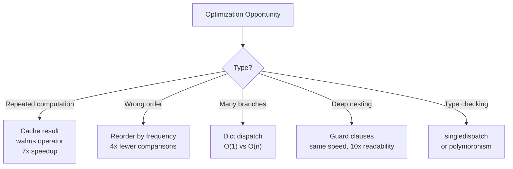

# Conditionals — Optimize the Code

> **Practice optimizing slow, inefficient, or poorly structured conditional code.**
> Each exercise contains working but suboptimal code — your job is to make it faster, cleaner, or more maintainable.

---

## How to Use

1. Read the original code and understand what it does
2. Identify the performance or design problem
3. Write an optimized version
4. Compare with the reference solution
5. Measure the improvement where applicable

### Optimization Categories

| Category | Description |
|:--------:|:-----------|
| **Speed** | Reduce execution time |
| **Readability** | Make code clearer and more maintainable |
| **Architecture** | Improve design for extensibility |
| **Memory** | Reduce memory usage |

---

## Exercise 1: Redundant Condition Checks (Speed) 🟢

**Problem:** This function checks the same conditions multiple times.

```python
def classify_and_act(value):
    result = ""

    if value > 0 and value < 10:
        result += "small positive, "
    if value > 0 and value < 10 and value % 2 == 0:
        result += "small even, "
    if value > 0 and value >= 10:
        result += "large positive, "
    if value > 0 and value >= 10 and value % 2 == 0:
        result += "large even, "
    if value <= 0:
        result += "non-positive, "
    if value == 0:
        result += "zero, "

    return result.rstrip(", ")
```

<details>
<summary>Optimized Solution</summary>

```python
def classify_and_act(value):
    parts = []

    if value > 0:
        if value < 10:
            parts.append("small positive")
            if value % 2 == 0:
                parts.append("small even")
        else:
            parts.append("large positive")
            if value % 2 == 0:
                parts.append("large even")
    else:
        parts.append("non-positive")
        if value == 0:
            parts.append("zero")

    return ", ".join(parts)
```

**Why it's better:**
- `value > 0` is checked once instead of 4 times
- `value < 10` is checked once instead of 2 times
- Uses list + `join()` instead of string concatenation (O(n) vs O(n^2))
- Nested structure reflects the logical hierarchy

</details>

---

## Exercise 2: Long if-elif Chain (Architecture) 🟡

**Problem:** Adding a new file type requires modifying the function.

```python
def get_file_info(extension):
    if extension == ".py":
        return {"type": "Python", "category": "programming", "icon": "python.svg"}
    elif extension == ".js":
        return {"type": "JavaScript", "category": "programming", "icon": "js.svg"}
    elif extension == ".ts":
        return {"type": "TypeScript", "category": "programming", "icon": "ts.svg"}
    elif extension == ".html":
        return {"type": "HTML", "category": "web", "icon": "html.svg"}
    elif extension == ".css":
        return {"type": "CSS", "category": "web", "icon": "css.svg"}
    elif extension == ".json":
        return {"type": "JSON", "category": "data", "icon": "json.svg"}
    elif extension == ".csv":
        return {"type": "CSV", "category": "data", "icon": "csv.svg"}
    elif extension == ".xml":
        return {"type": "XML", "category": "data", "icon": "xml.svg"}
    elif extension == ".md":
        return {"type": "Markdown", "category": "docs", "icon": "md.svg"}
    elif extension == ".txt":
        return {"type": "Text", "category": "docs", "icon": "txt.svg"}
    elif extension == ".pdf":
        return {"type": "PDF", "category": "docs", "icon": "pdf.svg"}
    elif extension == ".jpg" or extension == ".jpeg":
        return {"type": "JPEG", "category": "image", "icon": "jpg.svg"}
    elif extension == ".png":
        return {"type": "PNG", "category": "image", "icon": "png.svg"}
    elif extension == ".gif":
        return {"type": "GIF", "category": "image", "icon": "gif.svg"}
    else:
        return {"type": "Unknown", "category": "other", "icon": "unknown.svg"}
```

<details>
<summary>Optimized Solution</summary>

```python
from dataclasses import dataclass


@dataclass(frozen=True)
class FileInfo:
    type: str
    category: str
    icon: str


# Data-driven: easy to add, remove, or load from config
FILE_REGISTRY: dict[str, FileInfo] = {
    ".py":    FileInfo("Python", "programming", "python.svg"),
    ".js":    FileInfo("JavaScript", "programming", "js.svg"),
    ".ts":    FileInfo("TypeScript", "programming", "ts.svg"),
    ".html":  FileInfo("HTML", "web", "html.svg"),
    ".css":   FileInfo("CSS", "web", "css.svg"),
    ".json":  FileInfo("JSON", "data", "json.svg"),
    ".csv":   FileInfo("CSV", "data", "csv.svg"),
    ".xml":   FileInfo("XML", "data", "data.svg"),
    ".md":    FileInfo("Markdown", "docs", "md.svg"),
    ".txt":   FileInfo("Text", "docs", "txt.svg"),
    ".pdf":   FileInfo("PDF", "docs", "pdf.svg"),
    ".jpg":   FileInfo("JPEG", "image", "jpg.svg"),
    ".jpeg":  FileInfo("JPEG", "image", "jpg.svg"),
    ".png":   FileInfo("PNG", "image", "png.svg"),
    ".gif":   FileInfo("GIF", "image", "gif.svg"),
}

UNKNOWN = FileInfo("Unknown", "other", "unknown.svg")


def get_file_info(extension: str) -> dict:
    info = FILE_REGISTRY.get(extension.lower(), UNKNOWN)
    return {"type": info.type, "category": info.category, "icon": info.icon}
```

**Why it's better:**
- O(1) dictionary lookup instead of O(n) if-elif chain
- Adding a new file type = adding one line to the dictionary
- Registry can be loaded from a config file or database
- Case-insensitive with `.lower()`
- Dataclass provides structure and immutability

</details>

---

## Exercise 3: Repeated Expensive Computation (Speed) 🟡

**Problem:** The expensive function is called multiple times.

```python
import time

def expensive_calculation(data):
    """Simulates an expensive computation."""
    time.sleep(0.01)  # Simulate work
    return sum(data) / len(data) if data else 0

def analyze(data):
    if expensive_calculation(data) > 100:
        print(f"High: {expensive_calculation(data)}")
        if expensive_calculation(data) > 200:
            print(f"Very high: {expensive_calculation(data)}")
            return "critical"
        return "warning"
    elif expensive_calculation(data) > 50:
        print(f"Medium: {expensive_calculation(data)}")
        return "caution"
    else:
        print(f"Low: {expensive_calculation(data)}")
        return "normal"
```

<details>
<summary>Optimized Solution</summary>

```python
def analyze(data):
    result = expensive_calculation(data)  # Call ONCE

    if result > 200:
        print(f"Very high: {result}")
        return "critical"
    elif result > 100:
        print(f"High: {result}")
        return "warning"
    elif result > 50:
        print(f"Medium: {result}")
        return "caution"
    else:
        print(f"Low: {result}")
        return "normal"
```

**Alternative with walrus operator:**

```python
def analyze(data):
    if (result := expensive_calculation(data)) > 200:
        print(f"Very high: {result}")
        return "critical"
    elif result > 100:
        print(f"High: {result}")
        return "warning"
    elif result > 50:
        print(f"Medium: {result}")
        return "caution"
    else:
        print(f"Low: {result}")
        return "normal"
```

**Why it's better:**
- Original calls `expensive_calculation()` up to 7 times (each takes 10ms = 70ms)
- Optimized version calls it once (10ms) — 7x faster
- Also reordered conditions: check > 200 before > 100 (was nested, now flat)

</details>

---

## Exercise 4: Deeply Nested Conditions (Readability) 🟡

**Problem:** The nesting makes this code hard to read and maintain.

```python
def process_order(order):
    if order is not None:
        if order.get("status") == "active":
            if order.get("items"):
                if order.get("payment"):
                    if order["payment"].get("verified"):
                        total = sum(item["price"] * item["qty"] for item in order["items"])
                        if total > 0:
                            if order.get("shipping_address"):
                                return {
                                    "status": "ready",
                                    "total": total,
                                    "address": order["shipping_address"],
                                }
                            else:
                                return {"status": "error", "message": "No shipping address"}
                        else:
                            return {"status": "error", "message": "Invalid total"}
                    else:
                        return {"status": "error", "message": "Payment not verified"}
                else:
                    return {"status": "error", "message": "No payment info"}
            else:
                return {"status": "error", "message": "No items in order"}
        else:
            return {"status": "error", "message": "Order is not active"}
    else:
        return {"status": "error", "message": "Order is None"}
```

<details>
<summary>Optimized Solution</summary>

```python
def process_order(order):
    """Process an order using guard clauses — flat and readable."""
    if order is None:
        return {"status": "error", "message": "Order is None"}

    if order.get("status") != "active":
        return {"status": "error", "message": "Order is not active"}

    if not order.get("items"):
        return {"status": "error", "message": "No items in order"}

    if not order.get("payment"):
        return {"status": "error", "message": "No payment info"}

    if not order["payment"].get("verified"):
        return {"status": "error", "message": "Payment not verified"}

    total = sum(item["price"] * item["qty"] for item in order["items"])
    if total <= 0:
        return {"status": "error", "message": "Invalid total"}

    if not order.get("shipping_address"):
        return {"status": "error", "message": "No shipping address"}

    return {
        "status": "ready",
        "total": total,
        "address": order["shipping_address"],
    }
```

**Why it's better:**
- Maximum nesting depth: 1 (was 8)
- Each validation is independently readable
- Easy to add new validations — just add another guard clause
- Error messages are at the same indentation level as the check

</details>

---

## Exercise 5: Condition Ordering (Speed) 🟡

**Problem:** Conditions are checked in the wrong order for the data distribution.

```python
def classify_request(request):
    """
    Data distribution (based on production logs):
    - 70% are "read" requests
    - 20% are "write" requests
    - 5% are "admin" requests
    - 3% are "health_check" requests
    - 2% are other
    """
    if request["type"] == "admin":          # 5% — checked first!
        return handle_admin(request)
    elif request["type"] == "health_check": # 3% — checked second!
        return handle_health_check(request)
    elif request["type"] == "write":        # 20% — checked third!
        return handle_write(request)
    elif request["type"] == "read":         # 70% — checked LAST!
        return handle_read(request)
    else:
        return handle_unknown(request)
```

<details>
<summary>Optimized Solution</summary>

```python
# Solution 1: Reorder by frequency
def classify_request(request):
    req_type = request["type"]

    if req_type == "read":                  # 70% — checked first!
        return handle_read(request)
    elif req_type == "write":               # 20% — checked second
        return handle_write(request)
    elif req_type == "admin":               # 5%
        return handle_admin(request)
    elif req_type == "health_check":        # 3%
        return handle_health_check(request)
    else:                                   # 2%
        return handle_unknown(request)


# Solution 2: Dictionary dispatch — O(1) for all cases
HANDLERS = {
    "read": handle_read,
    "write": handle_write,
    "admin": handle_admin,
    "health_check": handle_health_check,
}

def classify_request_v2(request):
    handler = HANDLERS.get(request["type"], handle_unknown)
    return handler(request)
```

**Why it's better:**
- Solution 1: 70% of requests now require only 1 comparison instead of 4
- Solution 2: Always O(1) regardless of the type distribution
- Also extracted `request["type"]` into a local variable (avoids repeated dict lookup)

</details>

---

## Exercise 6: Boolean Expression Simplification (Readability) 🟢

**Problem:** These boolean expressions are unnecessarily complex.

```python
def check_access(user):
    # Expression 1: Redundant comparison
    if user.is_active == True:
        pass

    # Expression 2: Double negation
    if not (not user.is_admin):
        pass

    # Expression 3: Redundant else
    if user.age >= 18:
        is_adult = True
    else:
        is_adult = False

    # Expression 4: Verbose None check
    if user.email != None:
        has_email = True
    else:
        has_email = False

    # Expression 5: Unnecessary conditional
    if len(user.permissions) > 0:
        has_permissions = True
    else:
        has_permissions = False

    return is_adult and has_email and has_permissions
```

<details>
<summary>Optimized Solution</summary>

```python
def check_access(user):
    # Expression 1: Direct truthiness
    if user.is_active:
        pass

    # Expression 2: Remove double negation
    if user.is_admin:
        pass

    # Expression 3: Direct assignment
    is_adult = user.age >= 18

    # Expression 4: Identity check for None
    has_email = user.email is not None

    # Expression 5: Truthiness of collections
    has_permissions = bool(user.permissions)

    return is_adult and has_email and has_permissions


# Even more concise:
def check_access_v2(user):
    return (
        user.age >= 18
        and user.email is not None
        and user.permissions
    )
```

**Rules applied:**
- Never compare booleans to `True`/`False` — use directly
- `not not x` = `x`
- `if cond: var = True else: var = False` = `var = cond`
- Use `is not None` instead of `!= None`
- Use truthiness for collection emptiness checks

</details>

---

## Exercise 7: Type-Checking Cascade (Architecture) 🔴

**Problem:** Adding a new type requires modifying the function.

```python
def serialize(obj):
    if isinstance(obj, str):
        return f'"{obj}"'
    elif isinstance(obj, bool):  # Must be before int! bool is subclass of int
        return "true" if obj else "false"
    elif isinstance(obj, int):
        return str(obj)
    elif isinstance(obj, float):
        return f"{obj:.6f}"
    elif isinstance(obj, list):
        items = ", ".join(serialize(item) for item in obj)
        return f"[{items}]"
    elif isinstance(obj, dict):
        pairs = ", ".join(f"{serialize(k)}: {serialize(v)}" for k, v in obj.items())
        return f"{{{pairs}}}"
    elif isinstance(obj, type(None)):
        return "null"
    elif isinstance(obj, tuple):
        items = ", ".join(serialize(item) for item in obj)
        return f"({items})"
    else:
        raise TypeError(f"Cannot serialize: {type(obj)}")
```

<details>
<summary>Optimized Solution</summary>

```python
from functools import singledispatch


@singledispatch
def serialize(obj) -> str:
    raise TypeError(f"Cannot serialize: {type(obj)}")


@serialize.register(str)
def _(obj: str) -> str:
    return f'"{obj}"'


@serialize.register(bool)
def _(obj: bool) -> str:
    return "true" if obj else "false"


@serialize.register(int)
def _(obj: int) -> str:
    return str(obj)


@serialize.register(float)
def _(obj: float) -> str:
    return f"{obj:.6f}"


@serialize.register(list)
def _(obj: list) -> str:
    return f"[{', '.join(serialize(item) for item in obj)}]"


@serialize.register(dict)
def _(obj: dict) -> str:
    pairs = ", ".join(f"{serialize(k)}: {serialize(v)}" for k, v in obj.items())
    return f"{{{pairs}}}"


@serialize.register(type(None))
def _(obj: None) -> str:
    return "null"


@serialize.register(tuple)
def _(obj: tuple) -> str:
    return f"({', '.join(serialize(item) for item in obj)})"


def main():
    data = {"name": "Alice", "age": 30, "scores": [95, 87, 92], "active": True}
    print(serialize(data))
    # {"name": "Alice", "age": 30, "scores": [95, 87, 92], "active": true}


if __name__ == "__main__":
    main()
```

**Why it's better:**
- Open/Closed Principle: add new types without modifying existing code
- `singledispatch` handles `bool`/`int` ordering automatically (MRO-based dispatch)
- Each serializer is independent and testable
- Third-party code can register new types: `serialize.register(MyClass)(my_handler)`

</details>

---

## Exercise 8: Redundant State Checks (Speed) 🟡

**Problem:** The same state is checked in multiple places.

```python
class UserProcessor:
    def process(self, user):
        # Check 1: Authentication
        if not user.get("authenticated"):
            return "Not authenticated"

        # Check 2: Authorization (repeats authentication check!)
        if user.get("authenticated") and not user.get("authorized"):
            return "Not authorized"

        # Check 3: Email verification (repeats both checks!)
        if user.get("authenticated") and user.get("authorized") and not user.get("email_verified"):
            return "Email not verified"

        # Check 4: Active status (repeats ALL checks!)
        if user.get("authenticated") and user.get("authorized") and user.get("email_verified") and not user.get("active"):
            return "Account inactive"

        # If all checks pass...
        if user.get("authenticated") and user.get("authorized") and user.get("email_verified") and user.get("active"):
            return "Access granted"

        return "Unknown state"
```

<details>
<summary>Optimized Solution</summary>

```python
class UserProcessor:
    def process(self, user):
        """Guard clause pattern — each check is independent and runs only once."""
        if not user.get("authenticated"):
            return "Not authenticated"

        if not user.get("authorized"):
            return "Not authorized"

        if not user.get("email_verified"):
            return "Email not verified"

        if not user.get("active"):
            return "Account inactive"

        return "Access granted"
```

**Why it's better:**
- Each condition is checked exactly once (was checked up to 5 times)
- No redundant checks — if you reach line N, all previous checks have passed
- No "Unknown state" possible — every path is covered
- Half the lines, much easier to read

</details>

---

## Exercise 9: match-case Misuse (Readability) 🔴

**Problem:** Using match-case where simpler patterns work better.

```python
def get_season(month: int) -> str:
    match month:
        case 1:
            return "Winter"
        case 2:
            return "Winter"
        case 3:
            return "Spring"
        case 4:
            return "Spring"
        case 5:
            return "Spring"
        case 6:
            return "Summer"
        case 7:
            return "Summer"
        case 8:
            return "Summer"
        case 9:
            return "Autumn"
        case 10:
            return "Autumn"
        case 11:
            return "Autumn"
        case 12:
            return "Winter"
        case _:
            raise ValueError(f"Invalid month: {month}")
```

<details>
<summary>Optimized Solution</summary>

```python
# Solution 1: OR patterns in match-case
def get_season(month: int) -> str:
    match month:
        case 12 | 1 | 2:
            return "Winter"
        case 3 | 4 | 5:
            return "Spring"
        case 6 | 7 | 8:
            return "Summer"
        case 9 | 10 | 11:
            return "Autumn"
        case _:
            raise ValueError(f"Invalid month: {month}")


# Solution 2: Dictionary lookup (even simpler)
SEASONS = {
    12: "Winter", 1: "Winter", 2: "Winter",
    3: "Spring", 4: "Spring", 5: "Spring",
    6: "Summer", 7: "Summer", 8: "Summer",
    9: "Autumn", 10: "Autumn", 11: "Autumn",
}

def get_season_v2(month: int) -> str:
    if season := SEASONS.get(month):
        return season
    raise ValueError(f"Invalid month: {month}")


# Solution 3: Computed lookup (no data duplication)
def get_season_v3(month: int) -> str:
    if not 1 <= month <= 12:
        raise ValueError(f"Invalid month: {month}")
    seasons = ["Winter", "Spring", "Spring", "Spring",
               "Summer", "Summer", "Summer", "Autumn",
               "Autumn", "Autumn", "Winter", "Winter"]
    return seasons[month - 1]
```

**Why it's better:**
- Solution 1: 5 cases instead of 13 — OR patterns reduce duplication
- Solution 2: O(1) lookup, data-driven
- Solution 3: O(1) array index, most compact

</details>

---

## Exercise 10: Conditional Import Overhead (Speed) 🔴

**Problem:** Modules are imported inside conditionals that run frequently.

```python
def format_data(data, format_type):
    if format_type == "json":
        import json
        return json.dumps(data, indent=2)
    elif format_type == "yaml":
        import yaml
        return yaml.dump(data, default_flow_style=False)
    elif format_type == "toml":
        import tomli_w
        return tomli_w.dumps(data)
    elif format_type == "csv":
        import csv
        import io
        output = io.StringIO()
        writer = csv.DictWriter(output, fieldnames=data[0].keys())
        writer.writeheader()
        writer.writerows(data)
        return output.getvalue()
    else:
        raise ValueError(f"Unknown format: {format_type}")
```

<details>
<summary>Optimized Solution</summary>

```python
import json
import csv
import io
from typing import Any

# Lazy imports for optional dependencies
_yaml = None
_tomli_w = None


def _get_yaml():
    global _yaml
    if _yaml is None:
        import yaml
        _yaml = yaml
    return _yaml


def _get_tomli_w():
    global _tomli_w
    if _tomli_w is None:
        import tomli_w
        _tomli_w = tomli_w
    return _tomli_w


def _format_json(data: Any) -> str:
    return json.dumps(data, indent=2)


def _format_yaml(data: Any) -> str:
    return _get_yaml().dump(data, default_flow_style=False)


def _format_toml(data: Any) -> str:
    return _get_tomli_w().dumps(data)


def _format_csv(data: list[dict]) -> str:
    output = io.StringIO()
    writer = csv.DictWriter(output, fieldnames=data[0].keys())
    writer.writeheader()
    writer.writerows(data)
    return output.getvalue()


FORMATTERS: dict[str, callable] = {
    "json": _format_json,
    "yaml": _format_yaml,
    "toml": _format_toml,
    "csv": _format_csv,
}


def format_data(data: Any, format_type: str) -> str:
    formatter = FORMATTERS.get(format_type)
    if formatter is None:
        raise ValueError(f"Unknown format: {format_type}. Available: {list(FORMATTERS)}")
    return formatter(data)
```

**Why it's better:**
- Standard library imports (`json`, `csv`) are at the top level (Python caches them, but the lookup is still overhead)
- Optional dependencies (`yaml`, `tomli_w`) use lazy loading — imported once, then cached
- Dictionary dispatch replaces if-elif chain
- Each formatter is an independent, testable function
- Adding a new format = adding a function + one dict entry

</details>

---

## Exercise 11: Condition with Unnecessary Computation (Speed) 🟡

**Problem:** Both sides of `and` are always evaluated logically.

```python
def search_database(query):
    """Expensive database search — takes 100ms."""
    import time
    time.sleep(0.1)
    return [{"id": 1, "name": "Alice"}, {"id": 2, "name": "Bob"}]

def validate_results(results):
    """Validate search results."""
    return all(r.get("id") and r.get("name") for r in results)

def search_and_validate(query, skip_validation=False):
    results = search_database(query)
    # Bug: validation always runs even when skip_validation is True
    if results and validate_results(results) or skip_validation:
        return results
    return []
```

<details>
<summary>Optimized Solution</summary>

```python
def search_and_validate(query, skip_validation=False):
    results = search_database(query)

    if not results:
        return []

    if skip_validation:
        return results

    if validate_results(results):
        return results

    return []
```

**Why it's better:**
- Original has operator precedence bug: `(results and validate_results(results)) or skip_validation`
- This means `validate_results()` runs even when `skip_validation=True`
- Optimized version skips validation entirely when `skip_validation=True`
- Guard clauses make the logic obvious
- Each condition is independent and easy to reason about

</details>

---

## Exercise 12: Polymorphism over Conditionals (Architecture) 🔴

**Problem:** Every new notification type requires modifying this function.

```python
def send_notification(notification):
    ntype = notification["type"]

    if ntype == "email":
        recipient = notification["email"]
        subject = notification["subject"]
        body = notification["body"]
        # ... send email logic
        print(f"Email to {recipient}: {subject}")
        return True
    elif ntype == "sms":
        phone = notification["phone"]
        message = notification["message"]
        # ... send SMS logic
        print(f"SMS to {phone}: {message}")
        return True
    elif ntype == "push":
        device_id = notification["device_id"]
        title = notification["title"]
        body = notification["body"]
        # ... send push notification logic
        print(f"Push to {device_id}: {title}")
        return True
    elif ntype == "slack":
        channel = notification["channel"]
        message = notification["message"]
        # ... send Slack message logic
        print(f"Slack to {channel}: {message}")
        return True
    else:
        raise ValueError(f"Unknown notification type: {ntype}")
```

<details>
<summary>Optimized Solution</summary>

```python
from abc import ABC, abstractmethod
from dataclasses import dataclass


class Notification(ABC):
    @abstractmethod
    def send(self) -> bool: ...

    @abstractmethod
    def describe(self) -> str: ...


@dataclass
class EmailNotification(Notification):
    email: str
    subject: str
    body: str

    def send(self) -> bool:
        print(f"Email to {self.email}: {self.subject}")
        return True

    def describe(self) -> str:
        return f"Email({self.email})"


@dataclass
class SmsNotification(Notification):
    phone: str
    message: str

    def send(self) -> bool:
        print(f"SMS to {self.phone}: {self.message}")
        return True

    def describe(self) -> str:
        return f"SMS({self.phone})"


@dataclass
class PushNotification(Notification):
    device_id: str
    title: str
    body: str

    def send(self) -> bool:
        print(f"Push to {self.device_id}: {self.title}")
        return True

    def describe(self) -> str:
        return f"Push({self.device_id})"


@dataclass
class SlackNotification(Notification):
    channel: str
    message: str

    def send(self) -> bool:
        print(f"Slack to {self.channel}: {self.message}")
        return True

    def describe(self) -> str:
        return f"Slack({self.channel})"


# No conditionals needed!
def send_notification(notification: Notification) -> bool:
    return notification.send()


def main():
    notifications: list[Notification] = [
        EmailNotification("alice@example.com", "Hello", "Welcome!"),
        SmsNotification("+1234567890", "Your code: 1234"),
        PushNotification("device_abc", "New message", "You have a new message"),
        SlackNotification("#general", "Deployment complete"),
    ]

    for n in notifications:
        print(f"Sending {n.describe()}...")
        send_notification(n)


if __name__ == "__main__":
    main()
```

**Why it's better:**
- Zero conditionals in `send_notification()`
- Adding a new type = adding a new class (Open/Closed Principle)
- Each notification type is self-contained and testable
- Type safety: IDE and mypy catch invalid notification structures
- Dataclasses provide clear structure instead of dict-guessing

</details>

---

## Summary

| Exercise | Category | Key Optimization |
|----------|----------|------------------|
| 1. Redundant checks | Speed | Nest related conditions, check once |
| 2. Long if-elif | Architecture | Dictionary dispatch + dataclass registry |
| 3. Repeated computation | Speed | Cache result, use walrus operator |
| 4. Deep nesting | Readability | Guard clauses (early returns) |
| 5. Condition ordering | Speed | Most frequent condition first |
| 6. Boolean simplification | Readability | Remove redundant comparisons |
| 7. Type-checking cascade | Architecture | `singledispatch` for type-based logic |
| 8. Redundant state checks | Speed | Guard clauses eliminate re-checks |
| 9. match-case misuse | Readability | OR patterns, dictionary, array index |
| 10. Import overhead | Speed | Lazy imports + dictionary dispatch |
| 11. Precedence bug | Speed | Guard clauses avoid precedence issues |
| 12. Notification types | Architecture | Polymorphism eliminates conditionals |

### Performance Impact Diagram


