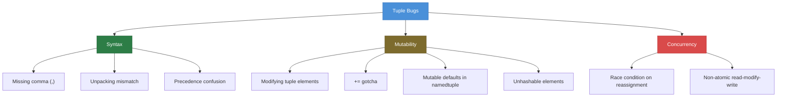
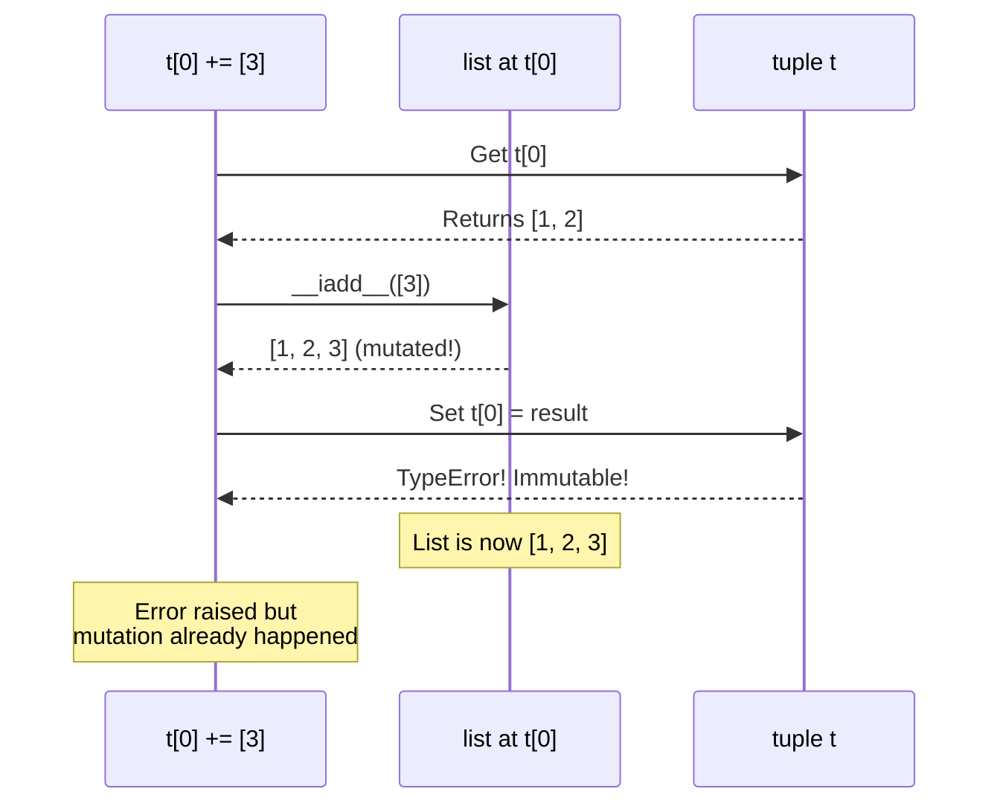

# Python Tuples — Find the Bug

> Find and fix the bug in each code snippet. Each exercise has a difficulty level and a hidden solution.

---

## Score Card

| # | Difficulty | Bug Topic | Found? | Fixed? |
|---|:----------:|-----------|:------:|:------:|
| 1 | Easy | Single-element tuple missing comma | [ ] | [ ] |
| 2 | Easy | Unpacking mismatch | [ ] | [ ] |
| 3 | Easy | Trying to modify a tuple | [ ] | [ ] |
| 4 | Medium | Mutable element in tuple used as dict key | [ ] | [ ] |
| 5 | Medium | Named tuple mutable default | [ ] | [ ] |
| 6 | Medium | Tuple concatenation type error | [ ] | [ ] |
| 7 | Medium | The += gotcha with mutable elements | [ ] | [ ] |
| 8 | Hard | Sort key returning wrong type | [ ] | [ ] |
| 9 | Hard | Named tuple inheritance trap | [ ] | [ ] |
| 10 | Hard | Tuple packing precedence bug | [ ] | [ ] |
| 11 | Hard | Pickle incompatibility with named tuples | [ ] | [ ] |
| 12 | Hard | Thread-unsafe tuple rebuilding | [ ] | [ ] |

**Total found: ___ / 12**
**Total fixed: ___ / 12**

---

## Easy (3 Bugs)

### Bug 1: Single-Element Tuple Missing Comma

```python
def get_allowed_extensions():
    """Return a tuple of allowed file extensions."""
    return (".jpg", ".png", ".gif")


def get_error_code():
    """Return a tuple containing a single error code."""
    return (404)


if __name__ == "__main__":
    extensions = get_allowed_extensions()
    print(f"Extensions: {extensions}")
    print(f"Type: {type(extensions)}")  # <class 'tuple'> - OK

    error = get_error_code()
    print(f"Error: {error}")
    print(f"Type: {type(error)}")  # Expected: <class 'tuple'>, Got: <class 'int'>

    # This crashes:
    for code in error:
        print(f"Code: {code}")
```

**Actual output:**
```
TypeError: 'int' object is not iterable
```

<details>
<summary>Hint</summary>

What makes a tuple with a single element different from just parentheses around a value?

</details>

<details>
<summary>Solution</summary>

**Bug:** `(404)` is just the integer `404` in parentheses. A single-element tuple requires a trailing comma.

```python
def get_error_code():
    """Return a tuple containing a single error code."""
    return (404,)  # FIX: trailing comma makes it a tuple


if __name__ == "__main__":
    error = get_error_code()
    print(f"Type: {type(error)}")  # <class 'tuple'>
    for code in error:
        print(f"Code: {code}")  # Code: 404
```

**Key rule:** Always use a trailing comma for single-element tuples: `(value,)`.

</details>

---

### Bug 2: Unpacking Mismatch

```python
def get_user_info():
    """Return user information as a tuple."""
    return ("Alice", 30, "alice@example.com", True)


def display_user():
    """Display user information."""
    name, age, email = get_user_info()
    print(f"Name: {name}")
    print(f"Age: {age}")
    print(f"Email: {email}")


if __name__ == "__main__":
    display_user()
```

**Actual output:**
```
ValueError: too many values to unpack (expected 3)
```

<details>
<summary>Hint</summary>

Count the number of elements returned by `get_user_info()` and the number of variables on the left side of the unpacking.

</details>

<details>
<summary>Solution</summary>

**Bug:** The function returns 4 values but only 3 variables are used for unpacking.

```python
def display_user():
    """Display user information."""
    # FIX Option 1: Unpack all values
    name, age, email, is_active = get_user_info()

    # FIX Option 2: Use * to ignore extras
    # name, age, email, *_ = get_user_info()

    print(f"Name: {name}")
    print(f"Age: {age}")
    print(f"Email: {email}")
```

**Key rule:** The number of variables must match the number of tuple elements, or use `*` to capture extras.

</details>

---

### Bug 3: Trying to Modify a Tuple

```python
def update_scores(scores: tuple, index: int, new_score: int) -> tuple:
    """Update a score at a given index."""
    scores[index] = new_score
    return scores


if __name__ == "__main__":
    student_scores = (85, 92, 78, 95, 88)
    updated = update_scores(student_scores, 2, 90)
    print(f"Updated scores: {updated}")
```

**Actual output:**
```
TypeError: 'tuple' object does not support item assignment
```

<details>
<summary>Hint</summary>

Tuples are immutable. You need to create a new tuple with the modified value.

</details>

<details>
<summary>Solution</summary>

**Bug:** Tuples cannot be modified in place. You must create a new tuple.

```python
def update_scores(scores: tuple, index: int, new_score: int) -> tuple:
    """Update a score at a given index — returns new tuple."""
    # FIX: Convert to list, modify, convert back
    scores_list = list(scores)
    scores_list[index] = new_score
    return tuple(scores_list)

    # Alternative: use slicing
    # return scores[:index] + (new_score,) + scores[index + 1:]


if __name__ == "__main__":
    student_scores = (85, 92, 78, 95, 88)
    updated = update_scores(student_scores, 2, 90)
    print(f"Updated scores: {updated}")  # (85, 92, 90, 95, 88)
```

</details>

---

## Medium (4 Bugs)

### Bug 4: Mutable Element in Tuple Used as Dict Key

```python
def build_route_cache():
    """Cache distances between routes."""
    cache = {}

    routes = [
        (["New York", "flights"], ["London", "hotels"], 5570),
        (["Tokyo", "flights"], ["Sydney", "hotels"], 7820),
    ]

    for origin, destination, distance in routes:
        key = (origin, destination)
        cache[key] = distance

    return cache


if __name__ == "__main__":
    cache = build_route_cache()
    print(cache)
```

**Actual output:**
```
TypeError: unhashable type: 'list'
```

<details>
<summary>Hint</summary>

A tuple is hashable only if <strong>all</strong> its elements are hashable. Lists are not hashable.

</details>

<details>
<summary>Solution</summary>

**Bug:** The route data uses lists (mutable, unhashable) inside tuples used as dict keys.

```python
def build_route_cache():
    """Cache distances between routes."""
    cache = {}

    routes = [
        (("New York", "flights"), ("London", "hotels"), 5570),  # FIX: tuples instead of lists
        (("Tokyo", "flights"), ("Sydney", "hotels"), 7820),
    ]

    for origin, destination, distance in routes:
        key = (origin, destination)  # Now fully hashable
        cache[key] = distance

    return cache


if __name__ == "__main__":
    cache = build_route_cache()
    for (origin, dest), dist in cache.items():
        print(f"  {origin} -> {dest}: {dist} km")
```

**Key rule:** Use only immutable types (tuples, strings, numbers, frozensets) in tuples that will be used as dict keys or set elements.

</details>

---

### Bug 5: Named Tuple Mutable Default

```python
from typing import NamedTuple


class Config(NamedTuple):
    name: str
    tags: list[str] = []
    options: dict[str, str] = {}


if __name__ == "__main__":
    c1 = Config(name="Service A")
    c2 = Config(name="Service B")

    c1.tags.append("production")
    c1.options["env"] = "prod"

    print(f"c1 tags: {c1.tags}")     # ['production']
    print(f"c2 tags: {c2.tags}")     # Expected: [], Got: ['production']!
    print(f"c2 options: {c2.options}")  # Expected: {}, Got: {'env': 'prod'}!
```

<details>
<summary>Hint</summary>

Default values for mutable types in named tuples have the same problem as mutable default arguments in functions — the default object is shared across all instances.

</details>

<details>
<summary>Solution</summary>

**Bug:** Mutable defaults (`[]`, `{}`) are shared across all instances. When `c1.tags.append("production")` mutates the default list, `c2.tags` sees the same list.

```python
from typing import NamedTuple, Optional


class Config(NamedTuple):
    name: str
    tags: tuple[str, ...] = ()       # FIX: use immutable defaults
    options: tuple[tuple[str, str], ...] = ()  # FIX: use tuple of pairs

    # Alternative: use None and handle in factory method
    # tags: Optional[tuple[str, ...]] = None


if __name__ == "__main__":
    c1 = Config(name="Service A", tags=("production",))
    c2 = Config(name="Service B")

    print(f"c1 tags: {c1.tags}")  # ('production',)
    print(f"c2 tags: {c2.tags}")  # ()  — independent!
```

**Key rule:** Never use mutable objects (`list`, `dict`, `set`) as default values in named tuples. Use immutable alternatives (`tuple`, `frozenset`) or `None`.

</details>

---

### Bug 6: Tuple Concatenation Type Error

```python
def build_sequence(start: tuple, items: list) -> tuple:
    """Build a sequence by adding items to a starting tuple."""
    result = start
    for item in items:
        result = result + item  # Add each item
    return result


if __name__ == "__main__":
    base = (1, 2, 3)
    extras = [4, 5, 6]
    result = build_sequence(base, extras)
    print(result)  # Expected: (1, 2, 3, 4, 5, 6)
```

**Actual output:**
```
TypeError: can only concatenate tuple (not "int") to tuple
```

<details>
<summary>Hint</summary>

You can only concatenate a tuple with another tuple, not with a single integer. How do you make a single value into a tuple?

</details>

<details>
<summary>Solution</summary>

**Bug:** `result + item` tries to concatenate a tuple with an integer. You need to wrap `item` in a tuple.

```python
def build_sequence(start: tuple, items: list) -> tuple:
    """Build a sequence by adding items to a starting tuple."""
    result = start
    for item in items:
        result = result + (item,)  # FIX: wrap item in a single-element tuple
    return result

    # Better approach (avoid O(n^2)):
    # return start + tuple(items)


if __name__ == "__main__":
    base = (1, 2, 3)
    extras = [4, 5, 6]
    result = build_sequence(base, extras)
    print(result)  # (1, 2, 3, 4, 5, 6)
```

**Note:** The loop approach is O(n^2). The better solution is `start + tuple(items)` which is O(n).

</details>

---

### Bug 7: The += Gotcha with Mutable Elements

```python
def add_tag(config: tuple, tag: str) -> None:
    """Add a tag to the first element (a list) of the config tuple."""
    config[0] += [tag]
    print(f"Tags after adding '{tag}': {config[0]}")


if __name__ == "__main__":
    tags = ["web", "api"]
    config = (tags, "production", 8080)

    print(f"Before: {config}")
    add_tag(config, "v2")
    print(f"After: {config}")
```

**Actual output:**
```
Before: (['web', 'api'], 'production', 8080)
TypeError: 'tuple' object does not support item assignment
```

But if you catch the error and check `config`, the list IS modified!

<details>
<summary>Hint</summary>

This is the famous Python `+=` gotcha. The `+=` operator on a list performs `list.__iadd__()` (which mutates the list) and THEN tries to assign the result back to `config[0]` (which fails).

</details>

<details>
<summary>Solution</summary>

**Bug:** `config[0] += [tag]` does two things:
1. Calls `list.__iadd__([tag])` which mutates the list (succeeds)
2. Tries `config[0] = result` which fails (tuple is immutable)

```python
def add_tag(config: tuple, tag: str) -> None:
    """Add a tag to the first element (a list) of the config tuple."""
    # FIX: Use .append() or .extend() directly — no assignment back to tuple
    config[0].append(tag)
    print(f"Tags after adding '{tag}': {config[0]}")


if __name__ == "__main__":
    tags = ["web", "api"]
    config = (tags, "production", 8080)

    print(f"Before: {config}")
    add_tag(config, "v2")
    print(f"After: {config}")
    # (['web', 'api', 'v2'], 'production', 8080)
```

**Better design:** Avoid mutable objects inside tuples. Use a named tuple with immutable fields:

```python
from typing import NamedTuple

class Config(NamedTuple):
    tags: tuple[str, ...]
    env: str
    port: int

config = Config(tags=("web", "api"), env="production", port=8080)
# To add a tag, create a new Config:
new_config = config._replace(tags=config.tags + ("v2",))
```

</details>

---

## Hard (5 Bugs)

### Bug 8: Sort Key Returning Wrong Type

```python
from typing import NamedTuple


class Student(NamedTuple):
    name: str
    grade: str
    gpa: float


def sort_students(students: list[Student]) -> list[Student]:
    """Sort students by GPA (descending), then by name (ascending)."""
    return sorted(students, key=lambda s: -s.gpa, s.name)


if __name__ == "__main__":
    students = [
        Student("Alice", "A", 3.9),
        Student("Bob", "B", 3.5),
        Student("Charlie", "A", 3.9),
        Student("Diana", "B+", 3.7),
    ]

    for s in sort_students(students):
        print(f"  {s.name}: {s.gpa}")
```

**Actual output:**
```
SyntaxError: positional argument follows keyword argument
```

<details>
<summary>Hint</summary>

The lambda function has a syntax error. To sort by multiple criteria, the key function should return a tuple.

</details>

<details>
<summary>Solution</summary>

**Bug:** The `key` parameter has invalid syntax. To sort by multiple criteria, return a tuple from the key function.

```python
def sort_students(students: list[Student]) -> list[Student]:
    """Sort students by GPA (descending), then by name (ascending)."""
    # FIX: Return a tuple as the sort key
    return sorted(students, key=lambda s: (-s.gpa, s.name))


if __name__ == "__main__":
    students = [
        Student("Alice", "A", 3.9),
        Student("Bob", "B", 3.5),
        Student("Charlie", "A", 3.9),
        Student("Diana", "B+", 3.7),
    ]

    for s in sort_students(students):
        print(f"  {s.name}: {s.gpa}")
    # Alice: 3.9
    # Charlie: 3.9
    # Diana: 3.7
    # Bob: 3.5
```

**Key pattern:** Multi-criteria sorting uses tuple keys: `key=lambda x: (criteria1, criteria2, ...)`. Negate numeric values for descending order.

</details>

---

### Bug 9: Named Tuple Inheritance Trap

```python
from typing import NamedTuple


class Point2D(NamedTuple):
    x: float
    y: float


class Point3D(Point2D):
    z: float = 0.0


if __name__ == "__main__":
    p = Point3D(1.0, 2.0, 3.0)
    print(f"Point: ({p.x}, {p.y}, {p.z})")
    print(f"Is tuple: {isinstance(p, tuple)}")
    print(f"Length: {len(p)}")  # Expected: 3, Got: 2!
```

<details>
<summary>Hint</summary>

Named tuples do not support true inheritance. Subclassing a `NamedTuple` creates a regular class that adds attributes as instance variables, NOT as tuple fields.

</details>

<details>
<summary>Solution</summary>

**Bug:** Subclassing a `NamedTuple` does not extend the tuple fields. `Point3D` inherits from `Point2D` as a regular class. The `z` field becomes a class-level attribute, not a tuple element.

```python
from typing import NamedTuple


# FIX: Define Point3D as its own NamedTuple with all fields
class Point2D(NamedTuple):
    x: float
    y: float


class Point3D(NamedTuple):
    x: float
    y: float
    z: float = 0.0


if __name__ == "__main__":
    p = Point3D(1.0, 2.0, 3.0)
    print(f"Point: ({p.x}, {p.y}, {p.z})")
    print(f"Is tuple: {isinstance(p, tuple)}")
    print(f"Length: {len(p)}")  # 3
```

**Key rule:** Named tuples do not support extending fields through inheritance. Always define all fields in each named tuple class.

</details>

---

### Bug 10: Tuple Packing Precedence Bug

```python
def calculate_range(numbers: list[int]) -> tuple[int, int, int]:
    """Return (min, max, range) of the numbers."""
    lo = min(numbers)
    hi = max(numbers)
    return lo, hi, hi - lo


def display_range():
    """Display the range calculation."""
    result = calculate_range([5, 2, 8, 1, 9])
    print(f"Min: {result[0]}, Max: {result[1]}, Range: {result[2]}")

    # Attempt inline unpacking with condition
    lo, hi, r = 1, 10, 10 - 1

    # Bug is here:
    values = "Min", lo, "Max", hi, "Range", hi - lo
    print(f"Values: {values}")
    print(f"Expected 6 elements, got: {len(values)}")

    # Another precedence issue:
    result = 1, 2 + 3
    print(f"Expected (1, 2, 3), got: {result}")
```

<details>
<summary>Hint</summary>

The comma operator has the <strong>lowest precedence</strong> of all Python operators. So `hi - lo` is evaluated as a single expression before tuple packing, and `2 + 3` evaluates to `5`, not creating three separate elements.

</details>

<details>
<summary>Solution</summary>

**Bug:** Comma has lower precedence than `-` and `+`, so:
- `"Min", lo, "Max", hi, "Range", hi - lo` creates a 6-element tuple (correct, but `hi - lo` is one value, not two)
- `1, 2 + 3` creates `(1, 5)` not `(1, 2, 3)`

```python
def display_range():
    lo, hi = 1, 10

    # This is actually correct — hi - lo = 9 is one element
    values = ("Min", lo, "Max", hi, "Range", hi - lo)
    print(f"Values: {values}")  # ('Min', 1, 'Max', 10, 'Range', 9)
    print(f"6 elements: {len(values)}")  # 6

    # FIX: Use explicit parentheses to control grouping
    result = (1, 2 + 3)    # (1, 5) — two elements
    print(f"Two elements: {result}")

    # If you want (1, 2, 3):
    result = (1, 2, 3)     # Three elements
    print(f"Three elements: {result}")

    # Common trap in return statements:
    # return x, y + z  means return (x, y+z)  — two elements!
    # return x, y, z   means return (x, y, z) — three elements!
```

**Key rule:** Be explicit with parentheses when mixing arithmetic and tuple packing. The comma has the lowest precedence.

</details>

---

### Bug 11: Pickle Incompatibility with Named Tuples

```python
import pickle
from typing import NamedTuple


def save_data():
    """Save data using pickle."""

    class Record(NamedTuple):
        name: str
        value: float

    data = [Record("temperature", 98.6), Record("pressure", 1013.25)]
    with open("/tmp/data.pkl", "wb") as f:
        pickle.dump(data, f)


def load_data():
    """Load data from pickle."""
    with open("/tmp/data.pkl", "rb") as f:
        return pickle.load(f)


if __name__ == "__main__":
    save_data()
    loaded = load_data()
    print(loaded)
```

**Actual output:**
```
AttributeError: Can't get attribute 'Record' on <module '__main__'>
```

<details>
<summary>Hint</summary>

When pickle loads an object, it needs to find the class definition in the same scope. If the named tuple is defined inside a function, pickle cannot find it during deserialization.

</details>

<details>
<summary>Solution</summary>

**Bug:** The `Record` named tuple is defined inside `save_data()`, so pickle cannot find it at module level during `load_data()`.

```python
import pickle
from typing import NamedTuple


# FIX: Define named tuple at MODULE level so pickle can find it
class Record(NamedTuple):
    name: str
    value: float


def save_data():
    data = [Record("temperature", 98.6), Record("pressure", 1013.25)]
    with open("/tmp/data.pkl", "wb") as f:
        pickle.dump(data, f)


def load_data():
    with open("/tmp/data.pkl", "rb") as f:
        return pickle.load(f)


if __name__ == "__main__":
    save_data()
    loaded = load_data()
    print(loaded)  # [Record(name='temperature', value=98.6), ...]
```

**Key rule:** Always define named tuples at module level if they will be serialized (pickle, multiprocessing, etc.).

</details>

---

### Bug 12: Thread-Unsafe Tuple Rebuilding

```python
import threading
from typing import NamedTuple


class Counter(NamedTuple):
    value: int


shared_counter = Counter(0)


def increment(n: int) -> None:
    """Increment the shared counter n times."""
    global shared_counter
    for _ in range(n):
        # Read current value and create new tuple
        current = shared_counter.value
        shared_counter = Counter(current + 1)


if __name__ == "__main__":
    threads = [threading.Thread(target=increment, args=(100_000,)) for _ in range(4)]
    for t in threads:
        t.start()
    for t in threads:
        t.join()

    print(f"Expected: 400000, Got: {shared_counter.value}")
    # Got something less than 400000 — race condition!
```

<details>
<summary>Hint</summary>

Even though tuples are immutable, the <strong>reassignment</strong> of the global variable is not atomic. Reading the current value and creating a new tuple is a multi-step operation that can be interleaved between threads.

</details>

<details>
<summary>Solution</summary>

**Bug:** The read-modify-write pattern (`current = shared_counter.value; shared_counter = Counter(current + 1)`) is not atomic. Two threads can read the same value and both write `value + 1`, losing one increment.

```python
import threading
from typing import NamedTuple


class Counter(NamedTuple):
    value: int


shared_counter = Counter(0)
lock = threading.Lock()  # FIX: Add a lock


def increment(n: int) -> None:
    global shared_counter
    for _ in range(n):
        with lock:  # FIX: Protect the read-modify-write
            current = shared_counter.value
            shared_counter = Counter(current + 1)


if __name__ == "__main__":
    threads = [threading.Thread(target=increment, args=(100_000,)) for _ in range(4)]
    for t in threads:
        t.start()
    for t in threads:
        t.join()

    print(f"Expected: 400000, Got: {shared_counter.value}")  # 400000
```

**Key lesson:** Tuple immutability makes individual reads safe, but compound operations (read + compute + write) still need synchronization. Use locks, `threading.Lock`, or atomic operations.

</details>

---

## Diagrams

### Diagram 1: Bug Categories



### Diagram 2: The += Gotcha Visualized


