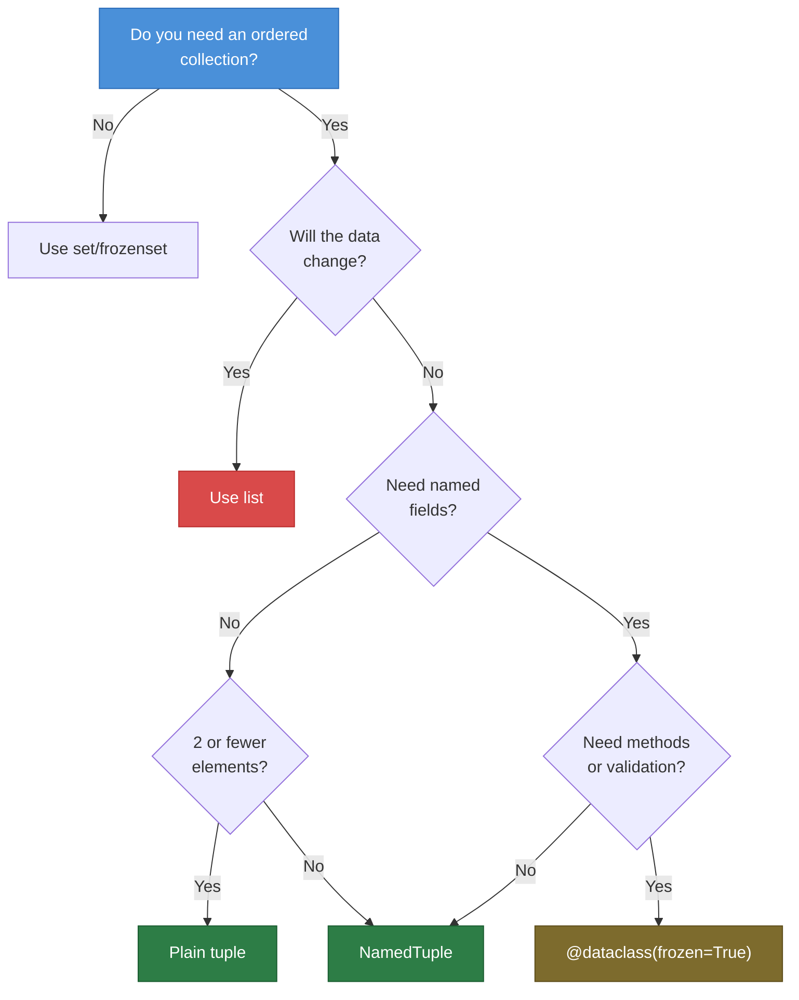
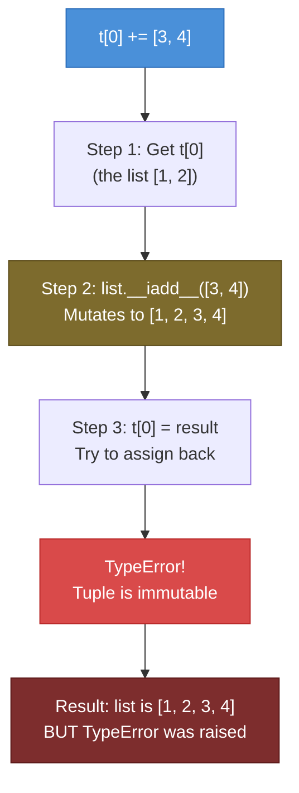

# Python Tuples — Interview Questions

## Table of Contents

1. [Junior Level](#junior-level)
2. [Middle Level](#middle-level)
3. [Senior Level](#senior-level)
4. [Scenario-Based Questions](#scenario-based-questions)
5. [FAQ](#faq)

---

## Junior Level

### 1. What is a tuple in Python? How is it different from a list?

**Answer:**
A tuple is an ordered, immutable sequence of elements. Unlike lists, tuples cannot be modified after creation — you cannot add, remove, or change elements.

```python
# Tuple — immutable
t = (1, 2, 3)
# t[0] = 99  # TypeError: 'tuple' object does not support item assignment

# List — mutable
l = [1, 2, 3]
l[0] = 99  # Works fine

# Key differences:
# 1. Mutability: lists are mutable, tuples are immutable
# 2. Syntax: list uses [], tuple uses ()
# 3. Performance: tuples are faster and use less memory
# 4. Hashability: tuples can be dict keys, lists cannot
# 5. Methods: lists have ~11 methods, tuples have only 2 (count, index)
```

---

### 2. How do you create a single-element tuple?

**Answer:**
You must include a trailing comma. Without the comma, parentheses are just grouping:

```python
# NOT a tuple — just an integer in parentheses
not_tuple = (42)
print(type(not_tuple))  # <class 'int'>

# THIS is a single-element tuple
single = (42,)
print(type(single))     # <class 'tuple'>

# Also works without parentheses
also_single = 42,
print(type(also_single))  # <class 'tuple'>
```

---

### 3. What is tuple unpacking? Give an example.

**Answer:**
Tuple unpacking assigns each element of a tuple to a separate variable in a single statement:

```python
# Basic unpacking
point = (10, 20, 30)
x, y, z = point
print(x, y, z)  # 10 20 30

# Swap variables using tuple packing/unpacking
a, b = 1, 2
a, b = b, a  # RHS creates tuple (2, 1), then unpacks
print(a, b)  # 2 1

# Star unpacking (Python 3+)
first, *rest = (1, 2, 3, 4, 5)
print(first)  # 1
print(rest)   # [2, 3, 4, 5]  — note: rest is a LIST
```

---

### 4. What are the only two methods available on tuples?

**Answer:**
`count()` and `index()`:

```python
t = (1, 3, 5, 3, 7, 3)

# count() — how many times a value appears
print(t.count(3))   # 3

# index() — position of first occurrence
print(t.index(3))   # 1

# index with start/stop range
print(t.index(3, 2))  # 3 (search from index 2)
```

---

### 5. Can tuples be used as dictionary keys? Why or why not?

**Answer:**
Yes, but only if **all elements are hashable**:

```python
# Works — all elements are immutable
coords = {}
coords[(0, 0)] = "origin"
coords[(1, 2)] = "point A"
print(coords[(0, 0)])  # origin

# Fails — list inside tuple is not hashable
try:
    bad = {}
    bad[(1, [2, 3])] = "value"
except TypeError as e:
    print(e)  # unhashable type: 'list'
```

---

### 6. What is the output of this code?

```python
a = (1, 2, 3)
b = (1, 2, 3)
print(a == b)
print(a is b)
```

<details>
<summary>Answer</summary>

```
True
True  (or False, depending on context)
```

`a == b` is always `True` — tuples compare element by element.

`a is b` depends on CPython's constant folding. In a compiled module, the compiler may intern the constant tuple, making both variables point to the same object. In the interactive REPL, they may be separate objects.

**Rule:** Always use `==` for value comparison. Never rely on `is` for tuples.

</details>

---

### 7. What happens when you try to sort a tuple?

**Answer:**

```python
t = (5, 2, 8, 1, 4)

# Cannot sort in-place (tuples are immutable)
# t.sort()  # AttributeError: 'tuple' object has no attribute 'sort'

# Use sorted() — returns a LIST
sorted_list = sorted(t)
print(sorted_list)     # [1, 2, 4, 5, 8]

# Convert back to tuple if needed
sorted_tuple = tuple(sorted(t))
print(sorted_tuple)    # (1, 2, 4, 5, 8)
```

---

## Middle Level

### 8. Explain the difference between `collections.namedtuple` and `typing.NamedTuple`.

**Answer:**

```python
from collections import namedtuple
from typing import NamedTuple

# collections.namedtuple — function-based syntax
Point1 = namedtuple("Point1", ["x", "y"])

# typing.NamedTuple — class-based syntax with type annotations
class Point2(NamedTuple):
    x: float
    y: float
    label: str = "origin"  # default value

# Both produce identical runtime behavior:
p1 = Point1(1.0, 2.0)
p2 = Point2(1.0, 2.0)

print(isinstance(p1, tuple))  # True
print(isinstance(p2, tuple))  # True

# Key differences:
# 1. typing.NamedTuple supports type annotations → better IDE support, mypy
# 2. typing.NamedTuple supports default values more naturally
# 3. typing.NamedTuple allows docstrings and method definitions
# 4. collections.namedtuple is a function call, less readable for complex types

# typing.NamedTuple with methods:
class Vector(NamedTuple):
    """A 2D vector with magnitude calculation."""
    x: float
    y: float

    @property
    def magnitude(self) -> float:
        return (self.x ** 2 + self.y ** 2) ** 0.5

v = Vector(3.0, 4.0)
print(v.magnitude)  # 5.0
```

---

### 9. Explain the `+=` gotcha with mutable elements inside a tuple.

**Answer:**
This is a famous Python gotcha that combines mutation and immutability:

```python
t = ([1, 2],)

try:
    t[0] += [3, 4]
except TypeError as e:
    print(f"Exception: {e}")

print(f"But t is now: {t}")  # ([1, 2, 3, 4],)
```

**Step-by-step:**
1. `t[0]` retrieves the list `[1, 2]`
2. `+= [3, 4]` calls `list.__iadd__([3, 4])` which **mutates** the list to `[1, 2, 3, 4]`
3. The result is then assigned back: `t[0] = result` — this **fails** because tuples are immutable

So you get **both** a mutation AND a TypeError. The list was modified before the assignment failed.

**Workaround:** Use direct mutation methods instead of `+=`:

```python
t = ([1, 2],)
t[0].extend([3, 4])  # No error — does not try to assign back
print(t)  # ([1, 2, 3, 4],)
```

---

### 10. When should you use a tuple vs a dataclass vs a dict?

**Answer:**

| Use Case | Best Choice | Why |
|----------|-------------|-----|
| 2-3 related values, no names needed | `tuple` | Lightest weight, built-in |
| Structured data with named fields, immutable | `typing.NamedTuple` | Readable, type-safe, hashable |
| Structured data with named fields, mutable | `@dataclass` | Methods, validation, mutability |
| Structured data, immutable, need methods | `@dataclass(frozen=True)` | Hashable + methods |
| Dynamic keys, unknown structure | `dict` | Flexible, but no type safety |

```python
# Quick return values → tuple
def divmod_custom(a, b):
    return a // b, a % b

# Configuration → NamedTuple
from typing import NamedTuple
class Config(NamedTuple):
    host: str
    port: int = 8080

# Domain model → dataclass
from dataclasses import dataclass
@dataclass
class User:
    name: str
    age: int
    email: str
```

---

### 11. How does tuple comparison work? What is lexicographic ordering?

**Answer:**
Tuples compare element by element from left to right (lexicographic order):

```python
# Compare first elements; if equal, compare second; and so on
print((1, 2, 3) < (1, 2, 4))   # True  (3 < 4)
print((1, 2, 3) < (1, 3, 0))   # True  (2 < 3, stops here)
print((1, 2, 3) < (2, 0, 0))   # True  (1 < 2, stops here)

# Shorter tuples are "less than" longer tuples if all elements match
print((1, 2) < (1, 2, 3))      # True

# Practical use: multi-key sorting
students = [("Alice", 90), ("Bob", 90), ("Charlie", 85)]
students.sort()  # Sorts by name first, then by score (tuple comparison)
print(students)
# [('Alice', 90), ('Bob', 90), ('Charlie', 85)]

# Sort by score (descending), then by name (ascending)
students.sort(key=lambda s: (-s[1], s[0]))
print(students)
# [('Alice', 90), ('Bob', 90), ('Charlie', 85)]
```

---

### 12. What is tuple packing? How does it differ from unpacking?

**Answer:**

```python
# PACKING: grouping values into a tuple (comma creates the tuple)
packed = 1, 2, 3  # This is packing — parentheses are optional
print(type(packed))  # <class 'tuple'>

# UNPACKING: extracting tuple elements into variables
a, b, c = packed
print(a, b, c)  # 1 2 3

# They are inverse operations:
# Packing:   values → tuple
# Unpacking: tuple → variables

# Combined in one line (swap):
x, y = 10, 20   # Right side packs (10, 20), left side unpacks
x, y = y, x     # Right side packs (20, 10), left side unpacks
print(x, y)      # 20 10

# Function argument unpacking
def greet(name, age):
    print(f"{name} is {age}")

args = ("Alice", 30)
greet(*args)  # Unpack tuple as positional arguments
```

---

## Senior Level

### 13. Why are tuples faster than lists in CPython?

**Answer:**
Three main reasons:

1. **Constant folding:** The CPython compiler pre-builds constant tuples at compile time:

```python
import dis

# Tuple: single LOAD_CONST instruction
dis.dis(lambda: (1, 2, 3))
# LOAD_CONST  1 ((1, 2, 3))

# List: multiple instructions
dis.dis(lambda: [1, 2, 3])
# LOAD_CONST  1 (1)
# LOAD_CONST  2 (2)
# LOAD_CONST  3 (3)
# BUILD_LIST  3
```

2. **Free list caching:** CPython maintains free lists for small tuples (size 0-19). Deallocated tuples are cached and reused, avoiding `malloc`/`free` overhead.

3. **No over-allocation:** Lists allocate extra space for future `append()` calls. Tuples allocate exactly the right amount of memory.

---

### 14. Explain how tuples interact with the garbage collector.

**Answer:**

```python
import gc

# CPython optimization: tuples containing ONLY atomic types
# are UNTRACKED from the cyclic GC

t1 = (1, "hello", True, None)
t2 = (1, [2, 3])

print(gc.is_tracked(t1))  # False — all elements are atomic
print(gc.is_tracked(t2))  # True — contains a list (container type)

# Why? Tuples with only atomic elements CANNOT form reference cycles.
# Untracking them reduces GC overhead.

# The optimization is in _PyTuple_MaybeUntrack() in tupleobject.c:
# After setting all elements, CPython checks if any element is a
# "container" type (list, dict, set, other tuples with containers).
# If not, the tuple is removed from GC tracking.

# Impact: In data-heavy applications with millions of tuples of
# simple values, this significantly reduces GC pause times.
```

---

### 15. How would you implement an immutable configuration system using tuples?

**Answer:**

```python
from typing import NamedTuple, Optional
import os
import json


class DatabaseConfig(NamedTuple):
    host: str
    port: int
    name: str
    user: str
    password: str
    pool_size: int = 5

    @classmethod
    def from_env(cls) -> "DatabaseConfig":
        return cls(
            host=os.environ.get("DB_HOST", "localhost"),
            port=int(os.environ.get("DB_PORT", "5432")),
            name=os.environ.get("DB_NAME", "app"),
            user=os.environ.get("DB_USER", "admin"),
            password=os.environ.get("DB_PASSWORD", ""),
            pool_size=int(os.environ.get("DB_POOL_SIZE", "5")),
        )

    def __repr__(self) -> str:
        """Hide password in repr for security."""
        return (f"DatabaseConfig(host={self.host!r}, port={self.port}, "
                f"name={self.name!r}, user={self.user!r}, "
                f"password='***', pool_size={self.pool_size})")


class AppConfig(NamedTuple):
    db: DatabaseConfig
    debug: bool
    secret_key: str
    allowed_hosts: tuple[str, ...]

    @classmethod
    def from_env(cls) -> "AppConfig":
        hosts = os.environ.get("ALLOWED_HOSTS", "localhost").split(",")
        return cls(
            db=DatabaseConfig.from_env(),
            debug=os.environ.get("DEBUG", "false").lower() == "true",
            secret_key=os.environ.get("SECRET_KEY", "dev-secret"),
            allowed_hosts=tuple(hosts),
        )


if __name__ == "__main__":
    config = AppConfig.from_env()
    print(config)
    print(f"DB: {config.db}")
    print(f"Debug: {config.debug}")
    print(f"Hosts: {config.allowed_hosts}")

    # Immutable — cannot accidentally modify
    # config.debug = True  # AttributeError!
    # config.db.port = 3306  # AttributeError!

    # Create variation for testing
    test_db = config.db._replace(name="app_test", host="localhost")
    test_config = config._replace(db=test_db, debug=True)
    print(f"\nTest config: {test_config}")
```

---

### 16. What is the memory difference between a tuple, named tuple, dict, and dataclass for the same data?

**Answer:**

```python
import sys
from collections import namedtuple
from typing import NamedTuple
from dataclasses import dataclass

# Define types
NT = namedtuple("NT", ["name", "age", "email"])

class TypedNT(NamedTuple):
    name: str
    age: int
    email: str

@dataclass
class DC:
    name: str
    age: int
    email: str

@dataclass(slots=True)
class SlotDC:
    name: str
    age: int
    email: str

# Create instances
data = ("Alice", 30, "alice@example.com")
plain_tuple = data
named_tuple = NT(*data)
typed_nt = TypedNT(*data)
dc = DC(*data)
slot_dc = SlotDC(*data)
dictionary = {"name": data[0], "age": data[1], "email": data[2]}

results = [
    ("Plain tuple", plain_tuple),
    ("namedtuple", named_tuple),
    ("NamedTuple", typed_nt),
    ("dataclass", dc),
    ("slots dataclass", slot_dc),
    ("dict", dictionary),
]

for name, obj in results:
    print(f"  {name:20s}: {sys.getsizeof(obj):4d} bytes")

# Typical output (64-bit):
#   Plain tuple         :   64 bytes
#   namedtuple          :   64 bytes  (same as plain tuple!)
#   NamedTuple          :   64 bytes  (same as plain tuple!)
#   dataclass           :   48 bytes  (but has __dict__ overhead)
#   slots dataclass     :   56 bytes
#   dict                :  184 bytes
```

---

### 17. Explain structural pattern matching with tuples (Python 3.10+).

**Answer:**

```python
# Python 3.10+ match/case with tuples

def classify_point(point: tuple) -> str:
    match point:
        case (0, 0):
            return "origin"
        case (x, 0):
            return f"on x-axis at x={x}"
        case (0, y):
            return f"on y-axis at y={y}"
        case (x, y) if x == y:
            return f"on diagonal at ({x}, {y})"
        case (x, y):
            return f"point at ({x}, {y})"
        case _:
            return "not a 2D point"


# Test
points = [(0, 0), (5, 0), (0, 3), (4, 4), (2, 7), (1, 2, 3)]
for p in points:
    print(f"  {str(p):12s} -> {classify_point(p)}")

# Works with named tuples too:
from typing import NamedTuple

class Command(NamedTuple):
    action: str
    target: str
    flags: tuple[str, ...] = ()

def execute(cmd: Command) -> str:
    match cmd:
        case Command(action="delete", target=t, flags=f) if "--force" in f:
            return f"Force deleting {t}"
        case Command(action="delete", target=t):
            return f"Confirm delete {t}?"
        case Command(action=a, target=t):
            return f"Executing {a} on {t}"

cmds = [
    Command("delete", "file.txt", ("--force",)),
    Command("delete", "data.csv"),
    Command("deploy", "app-v2"),
]
for c in cmds:
    print(f"  {c} -> {execute(c)}")
```

---

## Scenario-Based Questions

### Scenario 1: Optimizing a Caching System

**Question:** You have a function that takes multiple parameters and you want to cache results. How would you use tuples for this?

**Answer:**

```python
from functools import lru_cache
from typing import Any


# Approach 1: lru_cache (requires hashable arguments)
@lru_cache(maxsize=1024)
def expensive_query(table: str, filters: tuple[tuple[str, str], ...],
                    limit: int) -> list[dict]:
    """Simulated expensive database query."""
    print(f"  Computing for {table} with {len(filters)} filters...")
    return [{"table": table, "filters": filters, "limit": limit}]


# Usage: pass tuples (hashable) instead of dicts (not hashable)
result1 = expensive_query("users", (("age", ">30"), ("active", "true")), 100)
result2 = expensive_query("users", (("age", ">30"), ("active", "true")), 100)
# Second call hits cache — no "Computing..." message

print(f"Cache info: {expensive_query.cache_info()}")


# Approach 2: Manual cache with tuple keys
class QueryCache:
    def __init__(self, max_size: int = 1000) -> None:
        self._cache: dict[tuple, Any] = {}
        self._max_size = max_size

    def get_or_compute(self, key: tuple, compute_fn) -> Any:
        if key not in self._cache:
            if len(self._cache) >= self._max_size:
                # Evict oldest (simple FIFO)
                oldest_key = next(iter(self._cache))
                del self._cache[oldest_key]
            self._cache[key] = compute_fn()
        return self._cache[key]


cache = QueryCache(max_size=100)
key = ("users", "active", 100)  # Composite tuple key
result = cache.get_or_compute(key, lambda: {"data": "expensive result"})
print(f"Cached: {result}")
```

---

### Scenario 2: Processing CSV Data

**Question:** You receive CSV rows as tuples. How do you process them efficiently?

**Answer:**

```python
from typing import NamedTuple
from collections import defaultdict
import csv
from io import StringIO


class SaleRecord(NamedTuple):
    date: str
    product: str
    quantity: int
    price: float
    region: str

    @property
    def total(self) -> float:
        return self.quantity * self.price


def parse_csv(csv_text: str) -> tuple[SaleRecord, ...]:
    """Parse CSV into immutable SaleRecord tuples."""
    reader = csv.reader(StringIO(csv_text))
    next(reader)  # skip header
    return tuple(
        SaleRecord(
            date=row[0],
            product=row[1],
            quantity=int(row[2]),
            price=float(row[3]),
            region=row[4],
        )
        for row in reader
    )


def analyze_sales(records: tuple[SaleRecord, ...]) -> dict:
    """Analyze sales data using tuple operations."""
    # Group by (product, region) using tuple key
    by_product_region: dict[tuple[str, str], list[SaleRecord]] = defaultdict(list)
    for record in records:
        key = (record.product, record.region)
        by_product_region[key].append(record)

    # Calculate totals per group
    summary = {}
    for (product, region), sales in by_product_region.items():
        total_revenue = sum(s.total for s in sales)
        total_qty = sum(s.quantity for s in sales)
        summary[(product, region)] = {
            "revenue": total_revenue,
            "quantity": total_qty,
            "avg_price": total_revenue / total_qty if total_qty else 0,
        }

    return summary


if __name__ == "__main__":
    csv_data = """date,product,quantity,price,region
2024-01-15,Widget,10,29.99,North
2024-01-15,Gadget,5,49.99,South
2024-01-16,Widget,8,29.99,North
2024-01-16,Widget,12,27.99,South
2024-01-17,Gadget,3,49.99,North"""

    records = parse_csv(csv_data)
    print(f"Parsed {len(records)} records")

    summary = analyze_sales(records)
    for (product, region), stats in sorted(summary.items()):
        print(f"  {product} ({region}): "
              f"${stats['revenue']:.2f} revenue, "
              f"{stats['quantity']} units, "
              f"${stats['avg_price']:.2f} avg")
```

---

### Scenario 3: API Response Validation

**Question:** How would you use named tuples to validate and structure API responses?

**Answer:**

```python
from typing import NamedTuple, Optional
import json


class APIResponse(NamedTuple):
    status: int
    data: dict
    error: Optional[str]
    headers: tuple[tuple[str, str], ...]

    @classmethod
    def from_raw(cls, status: int, body: str,
                 headers: dict[str, str]) -> "APIResponse":
        """Parse raw API response into structured tuple."""
        try:
            data = json.loads(body)
            error = data.get("error")
        except json.JSONDecodeError as e:
            data = {}
            error = f"Invalid JSON: {e}"

        header_tuple = tuple(sorted(headers.items()))
        return cls(status=status, data=data, error=error, headers=header_tuple)

    @property
    def is_success(self) -> bool:
        return 200 <= self.status < 300 and self.error is None

    @property
    def is_error(self) -> bool:
        return self.status >= 400 or self.error is not None


def process_responses(responses: tuple[APIResponse, ...]) -> dict:
    """Analyze a batch of API responses."""
    success = tuple(r for r in responses if r.is_success)
    errors = tuple(r for r in responses if r.is_error)

    return {
        "total": len(responses),
        "success": len(success),
        "errors": len(errors),
        "error_codes": tuple(r.status for r in errors),
    }


if __name__ == "__main__":
    raw_responses = [
        (200, '{"user": "Alice", "id": 1}', {"Content-Type": "application/json"}),
        (404, '{"error": "Not found"}', {"Content-Type": "application/json"}),
        (200, '{"items": [1, 2, 3]}', {"Content-Type": "application/json"}),
        (500, 'Internal Server Error', {"Content-Type": "text/plain"}),
    ]

    responses = tuple(
        APIResponse.from_raw(status, body, headers)
        for status, body, headers in raw_responses
    )

    for r in responses:
        symbol = "OK" if r.is_success else "ERR"
        print(f"  [{symbol}] {r.status}: {r.data or r.error}")

    stats = process_responses(responses)
    print(f"\nStats: {stats}")
```

---

## FAQ

### Q: Are tuples always faster than lists?

**A:** For creation and memory usage, yes. For iteration and element access, the difference is negligible. For membership testing (`in`), both are O(n) — use a `set` or `frozenset` if you need fast lookups.

### Q: Should I always use named tuples instead of plain tuples?

**A:** Use named tuples when the tuple has 3+ fields or when the meaning of each position is not obvious. For simple pairs like `(x, y)` or function return values like `(min, max)`, plain tuples are fine.

### Q: Can named tuples have methods?

**A:** `typing.NamedTuple` supports methods and properties. `collections.namedtuple` does not directly, but you can subclass it.

### Q: Is `tuple()` the same as `()`?

**A:** Both create an empty tuple, and in CPython they return the **same singleton object**:

```python
print(tuple() is ())  # True
```

### Q: Why does Python need both tuples and lists?

**A:** They serve different purposes:
- **Tuples** = heterogeneous, fixed-structure data (like C structs): `(name, age, email)`
- **Lists** = homogeneous, variable-length collections: `[1, 2, 3, 4, 5]`

In practice, both can hold any types, but the semantic difference guides which to use.

### Q: Can I subclass tuple?

**A:** Yes. `namedtuple` and `NamedTuple` are built on tuple subclassing. You can also subclass `tuple` directly:

```python
class FrozenList(tuple):
    """A list-like interface backed by an immutable tuple."""
    def __new__(cls, iterable=()):
        return super().__new__(cls, iterable)

    def __repr__(self):
        return f"FrozenList({list(self)})"

fl = FrozenList([1, 2, 3])
print(fl)        # FrozenList([1, 2, 3])
print(fl[0])     # 1
print(hash(fl))  # Works! It's a tuple underneath
```

---

## Diagrams & Visual Aids

### Diagram 1: Interview Topic Coverage Map

```mermaid
graph TD
    T["Python Tuples<br/>Interview Topics"]
    T --> J["Junior"]
    T --> M["Middle"]
    T --> S["Senior"]

    J --> J1["Creation & syntax"]
    J --> J2["Single element (,)"]
    J --> J3["Unpacking basics"]
    J --> J4["count() & index()"]
    J --> J5["Dict keys"]

    M --> M1["namedtuple vs NamedTuple"]
    M --> M2["+= gotcha"]
    M --> M3["Tuple vs dataclass"]
    M --> M4["Lexicographic comparison"]
    M --> M5["Packing vs unpacking"]

    S --> S1["CPython constant folding"]
    S --> S2["GC tracking/untracking"]
    S --> S3["Free list caching"]
    S --> S4["Memory comparison"]
    S --> S5["Pattern matching"]

    style T fill:#4a90d9,stroke:#2a6cb9,color:#fff
    style J fill:#2d7d46,stroke:#1a5c30,color:#fff
    style M fill:#7d6b2d,stroke:#5c4c1a,color:#fff
    style S fill:#7d2d2d,stroke:#5c1a1a,color:#fff
```



### Diagram 2: Tuple Decision Tree



### Diagram 3: The += Gotcha Flow


