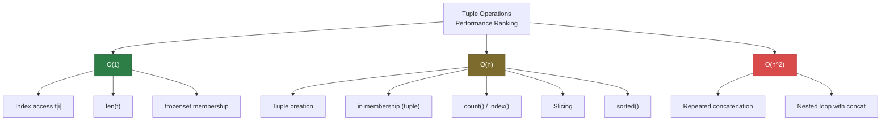
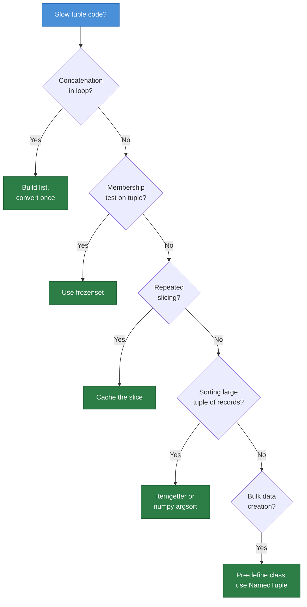
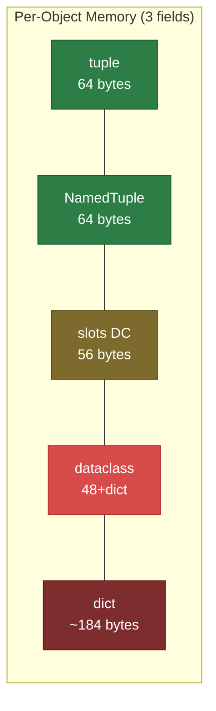

# Python Tuples — Optimization Exercises

> Optimize each slow tuple pattern. Measure the improvement with `timeit`.

---

## Score Card

| # | Difficulty | Topic | Type | Optimized? | Speedup |
|---|:----------:|-------|:----:|:----------:|:-------:|
| 1 | Easy | Tuple concatenation in loop vs list+convert | CPU | [ ] | ___x |
| 2 | Easy | Membership test: tuple vs set | CPU | [ ] | ___x |
| 3 | Easy | Named tuple creation overhead | CPU | [ ] | ___x |
| 4 | Medium | Tuple as dict key vs string key | CPU | [ ] | ___x |
| 5 | Medium | Tuple unpacking vs indexing | CPU | [ ] | ___x |
| 6 | Medium | Repeated tuple slicing vs caching | CPU | [ ] | ___x |
| 7 | Medium | NamedTuple vs dataclass(slots) for bulk data | Memory | [ ] | ___x |
| 8 | Hard | Tuple of tuples vs flat tuple with stride | Memory/CPU | [ ] | ___x |
| 9 | Hard | Frozen dict-like lookup with tuples | CPU | [ ] | ___x |
| 10 | Hard | Large tuple sort vs numpy argsort | CPU | [ ] | ___x |
| 11 | Hard | Tuple hashability for memoization | CPU | [ ] | ___x |
| 12 | Hard | Batch tuple creation with map vs comprehension | CPU | [ ] | ___x |

**Total optimized: ___ / 12**

---

## Exercise 1: Tuple Concatenation in Loop vs List+Convert

**Difficulty:** Easy

```python
import timeit

# SLOW: Building a large tuple by repeated concatenation
def build_tuple_slow(n: int) -> tuple:
    """O(n^2) — each += copies the entire existing tuple."""
    result = ()
    for i in range(n):
        result += (i,)
    return result


N = 50_000
slow_time = timeit.timeit(lambda: build_tuple_slow(N), number=1)
print(f"Slow (concatenation): {slow_time:.4f}s")
```

<details>
<summary>Hint</summary>

Each `result += (i,)` creates a **new** tuple of size `len(result) + 1`, copying all existing elements. Total work: 1 + 2 + 3 + ... + n = O(n^2). Build a list and convert once at the end.

</details>

<details>
<summary>Optimized Solution</summary>

```python
import timeit

N = 50_000

# SLOW: O(n^2) concatenation
def build_tuple_slow(n: int) -> tuple:
    result = ()
    for i in range(n):
        result += (i,)
    return result

# FAST: O(n) — build list, convert once
def build_tuple_fast(n: int) -> tuple:
    return tuple(range(n))

# FAST Alternative: generator expression
def build_tuple_genexpr(n: int) -> tuple:
    return tuple(i for i in range(n))

slow_time = timeit.timeit(lambda: build_tuple_slow(N), number=1)
fast_time = timeit.timeit(lambda: build_tuple_fast(N), number=1)
gen_time = timeit.timeit(lambda: build_tuple_genexpr(N), number=1)

print(f"Slow (concatenation):  {slow_time:.4f}s")
print(f"Fast (tuple(range)):   {fast_time:.6f}s")
print(f"Fast (genexpr):        {gen_time:.6f}s")
print(f"Speedup (range):       {slow_time / fast_time:.0f}x")
print(f"Speedup (genexpr):     {slow_time / gen_time:.0f}x")
# Typical speedup: 100-1000x
```

**Why it's faster:** `tuple(range(n))` allocates the final tuple once and fills it directly. No intermediate tuple objects are created.

</details>

---

## Exercise 2: Membership Test — Tuple vs Set

**Difficulty:** Easy

```python
import timeit

# SLOW: Membership test on a large tuple — O(n) linear scan
VALID_CODES = tuple(range(10_000))

def validate_code_slow(code: int) -> bool:
    """Check if code is valid using tuple membership."""
    return code in VALID_CODES


# Test with worst case (element not in collection)
slow_time = timeit.timeit(lambda: validate_code_slow(-1), number=100_000)
print(f"Slow (tuple `in`): {slow_time:.4f}s")
```

<details>
<summary>Hint</summary>

`in` on a tuple is O(n) — it scans every element. A `frozenset` provides O(1) lookup while remaining immutable.

</details>

<details>
<summary>Optimized Solution</summary>

```python
import timeit

VALID_CODES_TUPLE = tuple(range(10_000))
VALID_CODES_SET = frozenset(range(10_000))  # Immutable set

def validate_slow(code: int) -> bool:
    return code in VALID_CODES_TUPLE  # O(n)

def validate_fast(code: int) -> bool:
    return code in VALID_CODES_SET  # O(1)

# Worst case: element not found
slow_time = timeit.timeit(lambda: validate_slow(-1), number=100_000)
fast_time = timeit.timeit(lambda: validate_fast(-1), number=100_000)

print(f"Slow (tuple `in`):     {slow_time:.4f}s")
print(f"Fast (frozenset `in`): {fast_time:.4f}s")
print(f"Speedup:               {slow_time / fast_time:.0f}x")

# Best case: element found early
slow_best = timeit.timeit(lambda: validate_slow(0), number=100_000)
fast_best = timeit.timeit(lambda: validate_fast(0), number=100_000)
print(f"\nBest case (first element):")
print(f"  Tuple: {slow_best:.4f}s, Set: {fast_best:.4f}s")
# Typical speedup: 100-1000x for worst case
```

**Why it's faster:** `frozenset` uses a hash table for O(1) average-case lookups. Use `frozenset` when you need immutability + fast membership testing.

</details>

---

## Exercise 3: Named Tuple Creation Overhead

**Difficulty:** Easy

```python
import timeit
from collections import namedtuple

# SLOW: Creating namedtuple class inside a loop
def create_points_slow(n: int) -> list:
    """Recreating the namedtuple class on each call."""
    results = []
    for i in range(n):
        Point = namedtuple("Point", ["x", "y"])  # Class created every iteration!
        results.append(Point(i, i * 2))
    return results


N = 10_000
slow_time = timeit.timeit(lambda: create_points_slow(N), number=10)
print(f"Slow (class inside loop): {slow_time:.4f}s")
```

<details>
<summary>Hint</summary>

`namedtuple("Point", ...)` creates a new **class** each call. Class creation is expensive. Define the class once outside the loop.

</details>

<details>
<summary>Optimized Solution</summary>

```python
import timeit
from collections import namedtuple
from typing import NamedTuple

# Define class ONCE outside the loop
Point = namedtuple("Point", ["x", "y"])

class TypedPoint(NamedTuple):
    x: int
    y: int

def create_points_slow(n: int) -> list:
    results = []
    for i in range(n):
        P = namedtuple("P", ["x", "y"])  # Class created every iteration!
        results.append(P(i, i * 2))
    return results

def create_points_fast(n: int) -> list:
    return [Point(i, i * 2) for i in range(n)]

def create_points_typed(n: int) -> list:
    return [TypedPoint(i, i * 2) for i in range(n)]

def create_points_plain(n: int) -> list:
    return [(i, i * 2) for i in range(n)]

N = 10_000
for name, func in [
    ("namedtuple in loop", create_points_slow),
    ("namedtuple pre-defined", create_points_fast),
    ("NamedTuple pre-defined", create_points_typed),
    ("plain tuple", create_points_plain),
]:
    t = timeit.timeit(lambda f=func: f(N), number=10)
    print(f"  {name:30s}: {t:.4f}s")
# Typical: pre-defined is 10-50x faster than in-loop class creation
```

</details>

---

## Exercise 4: Tuple as Dict Key vs String Key

**Difficulty:** Medium

```python
import timeit

# Setup: building lookup tables with different key types
N = 10_000

# SLOW: Building string keys with f-string formatting
def build_and_lookup_string(n: int) -> int:
    """Use formatted strings as keys."""
    cache = {}
    for i in range(n):
        for j in range(10):
            cache[f"{i},{j}"] = i * j

    total = 0
    for i in range(n):
        total += cache[f"{i},5"]
    return total


slow_time = timeit.timeit(lambda: build_and_lookup_string(N), number=5)
print(f"Slow (string keys): {slow_time:.4f}s")
```

<details>
<summary>Hint</summary>

String formatting (`f"{i},{j}"`) creates a new string object each time. Tuple keys `(i, j)` are cheaper to create and hash.

</details>

<details>
<summary>Optimized Solution</summary>

```python
import timeit

N = 10_000

def build_and_lookup_string(n: int) -> int:
    cache = {}
    for i in range(n):
        for j in range(10):
            cache[f"{i},{j}"] = i * j
    total = 0
    for i in range(n):
        total += cache[f"{i},5"]
    return total

def build_and_lookup_tuple(n: int) -> int:
    cache = {}
    for i in range(n):
        for j in range(10):
            cache[(i, j)] = i * j
    total = 0
    for i in range(n):
        total += cache[(i, 5)]
    return total

slow_time = timeit.timeit(lambda: build_and_lookup_string(N), number=5)
fast_time = timeit.timeit(lambda: build_and_lookup_tuple(N), number=5)

print(f"String keys: {slow_time:.4f}s")
print(f"Tuple keys:  {fast_time:.4f}s")
print(f"Speedup:     {slow_time / fast_time:.1f}x")
# Typical speedup: 1.5-3x
```

**Why it's faster:** Tuple creation `(i, j)` avoids string formatting overhead. Tuple hashing combines two integer hashes, while string hashing processes each character.

</details>

---

## Exercise 5: Tuple Unpacking vs Indexing

**Difficulty:** Medium

```python
import timeit

# Compare accessing tuple elements by index vs unpacking
data = tuple((i, i * 2, i * 3) for i in range(100_000))

# Approach 1: Index access
def sum_by_index(data: tuple) -> int:
    total = 0
    for item in data:
        total += item[0] + item[1] + item[2]
    return total

# Approach 2: Unpacking
def sum_by_unpack(data: tuple) -> int:
    total = 0
    for a, b, c in data:
        total += a + b + c
    return total

idx_time = timeit.timeit(lambda: sum_by_index(data), number=50)
unp_time = timeit.timeit(lambda: sum_by_unpack(data), number=50)

print(f"Index access:  {idx_time:.4f}s")
print(f"Unpacking:     {unp_time:.4f}s")
print(f"Faster:        {'unpacking' if unp_time < idx_time else 'indexing'}")
```

<details>
<summary>Hint</summary>

Unpacking uses `UNPACK_SEQUENCE` bytecode which is optimized for tuples in CPython. Index access uses `BINARY_SUBSCR` which is more general. Try measuring both.

</details>

<details>
<summary>Optimized Solution</summary>

```python
import timeit

data = tuple((i, i * 2, i * 3) for i in range(100_000))

def sum_by_index(data: tuple) -> int:
    total = 0
    for item in data:
        total += item[0] + item[1] + item[2]
    return total

def sum_by_unpack(data: tuple) -> int:
    total = 0
    for a, b, c in data:
        total += a + b + c
    return total

# Even faster: avoid Python loop entirely
def sum_by_builtin(data: tuple) -> int:
    return sum(a + b + c for a, b, c in data)

idx_time = timeit.timeit(lambda: sum_by_index(data), number=50)
unp_time = timeit.timeit(lambda: sum_by_unpack(data), number=50)
blt_time = timeit.timeit(lambda: sum_by_builtin(data), number=50)

print(f"Index access:    {idx_time:.4f}s")
print(f"Unpacking:       {unp_time:.4f}s")
print(f"sum() + genexpr: {blt_time:.4f}s")
print(f"Speedup (unpack vs index): {idx_time / unp_time:.2f}x")
print(f"Speedup (sum vs index):    {idx_time / blt_time:.2f}x")
```

**Why it's faster:** `UNPACK_SEQUENCE` is a specialized bytecode for tuple unpacking. It directly accesses the internal array without going through the general subscription machinery. Using `sum()` with a generator moves the loop into C.

</details>

---

## Exercise 6: Repeated Tuple Slicing vs Caching

**Difficulty:** Medium

```python
import timeit

# SLOW: Repeatedly slicing the same tuple
large_tuple = tuple(range(1_000_000))

def process_slow(data: tuple) -> int:
    """Process different ranges, re-slicing each time."""
    total = 0
    for _ in range(100):
        chunk = data[100_000:200_000]  # Creates new tuple each time
        total += sum(chunk)
    return total

slow_time = timeit.timeit(lambda: process_slow(large_tuple), number=5)
print(f"Slow (re-slicing): {slow_time:.4f}s")
```

<details>
<summary>Hint</summary>

Each slice creates a new tuple object. If you access the same slice repeatedly, cache the result.

</details>

<details>
<summary>Optimized Solution</summary>

```python
import timeit

large_tuple = tuple(range(1_000_000))

def process_slow(data: tuple) -> int:
    total = 0
    for _ in range(100):
        chunk = data[100_000:200_000]  # New tuple created each time!
        total += sum(chunk)
    return total

def process_fast(data: tuple) -> int:
    chunk = data[100_000:200_000]  # Slice once, reuse
    total = 0
    for _ in range(100):
        total += sum(chunk)
    return total

slow_time = timeit.timeit(lambda: process_slow(large_tuple), number=5)
fast_time = timeit.timeit(lambda: process_fast(large_tuple), number=5)

print(f"Slow (re-slicing):  {slow_time:.4f}s")
print(f"Fast (cached slice): {fast_time:.4f}s")
print(f"Speedup:            {slow_time / fast_time:.1f}x")
```

**Why it's faster:** Each tuple slice allocates a new tuple and copies `n` pointers. Caching the slice eliminates 99 redundant allocations and copies.

</details>

---

## Exercise 7: NamedTuple vs Dataclass(slots) for Bulk Data

**Difficulty:** Medium

```python
import timeit
import sys
from typing import NamedTuple
from dataclasses import dataclass

# Compare memory for 1M records

class RecordNT(NamedTuple):
    x: float
    y: float
    z: float
    label: str

@dataclass
class RecordDC:
    x: float
    y: float
    z: float
    label: str

N = 100_000

# Measure creation time
nt_time = timeit.timeit(
    lambda: [RecordNT(1.0, 2.0, 3.0, "test") for _ in range(N)],
    number=5
)
dc_time = timeit.timeit(
    lambda: [RecordDC(1.0, 2.0, 3.0, "test") for _ in range(N)],
    number=5
)

print(f"NamedTuple creation: {nt_time:.4f}s")
print(f"Dataclass creation:  {dc_time:.4f}s")
```

<details>
<summary>Hint</summary>

For bulk data, `@dataclass(slots=True)` can be competitive with named tuples. But named tuples benefit from CPython's tuple free list. Measure both memory and CPU.

</details>

<details>
<summary>Optimized Solution</summary>

```python
import timeit
import sys
import tracemalloc
from typing import NamedTuple
from dataclasses import dataclass


class RecordNT(NamedTuple):
    x: float
    y: float
    z: float
    label: str

@dataclass
class RecordDC:
    x: float
    y: float
    z: float
    label: str

@dataclass(slots=True)
class RecordSlotDC:
    x: float
    y: float
    z: float
    label: str

N = 100_000

# Creation benchmark
for name, cls in [("NamedTuple", RecordNT), ("dataclass", RecordDC),
                   ("slots dataclass", RecordSlotDC)]:
    t = timeit.timeit(lambda c=cls: [c(1.0, 2.0, 3.0, "test") for _ in range(N)], number=5)
    print(f"  {name:20s} creation: {t:.4f}s")

# Memory benchmark
print("\nMemory usage:")
for name, cls in [("NamedTuple", RecordNT), ("dataclass", RecordDC),
                   ("slots dataclass", RecordSlotDC)]:
    tracemalloc.start()
    data = [cls(1.0, 2.0, 3.0, "test") for _ in range(N)]
    current, peak = tracemalloc.get_traced_memory()
    tracemalloc.stop()
    print(f"  {name:20s}: {current / 1024 / 1024:.1f} MB")
    del data

# Single object size
print("\nSingle object size:")
print(f"  NamedTuple:       {sys.getsizeof(RecordNT(1.0, 2.0, 3.0, 'test'))} bytes")
print(f"  dataclass:        {sys.getsizeof(RecordDC(1.0, 2.0, 3.0, 'test'))} bytes")
print(f"  slots dataclass:  {sys.getsizeof(RecordSlotDC(1.0, 2.0, 3.0, 'test'))} bytes")

# Result: NamedTuple is typically fastest to create and uses least memory
# slots dataclass is close but slightly larger
```

**Summary:** For read-heavy bulk data, NamedTuple wins on both memory and creation speed. For data that needs mutation or methods, use `@dataclass(slots=True)`.

</details>

---

## Exercise 8: Tuple of Tuples vs Flat Tuple with Stride

**Difficulty:** Hard

```python
import timeit
import sys

# SLOW: Tuple of tuples (nested) for 2D grid
def create_grid_nested(rows: int, cols: int) -> tuple[tuple[int, ...], ...]:
    return tuple(
        tuple(i * cols + j for j in range(cols))
        for i in range(rows)
    )

def access_nested(grid, row: int, col: int) -> int:
    return grid[row][col]

ROWS, COLS = 1000, 1000
grid_nested = create_grid_nested(ROWS, COLS)

create_time = timeit.timeit(lambda: create_grid_nested(ROWS, COLS), number=5)
access_time = timeit.timeit(lambda: access_nested(grid_nested, 500, 500), number=1_000_000)

print(f"Nested: create={create_time:.4f}s, access={access_time:.4f}s")
print(f"Memory: ~{sys.getsizeof(grid_nested) + sum(sys.getsizeof(row) for row in grid_nested):,} bytes")
```

<details>
<summary>Hint</summary>

A flat tuple with index arithmetic `row * cols + col` avoids the overhead of nested tuple objects and double indirection.

</details>

<details>
<summary>Optimized Solution</summary>

```python
import timeit
import sys

ROWS, COLS = 1000, 1000

# SLOW: Nested tuples
def create_grid_nested(rows, cols):
    return tuple(tuple(i * cols + j for j in range(cols)) for i in range(rows))

def access_nested(grid, row, col):
    return grid[row][col]

# FAST: Flat tuple with stride
def create_grid_flat(rows, cols):
    return tuple(i * cols + j for i in range(rows) for j in range(cols))

def access_flat(grid, row, col, cols):
    return grid[row * cols + col]

grid_nested = create_grid_nested(ROWS, COLS)
grid_flat = create_grid_flat(ROWS, COLS)

# Creation benchmark
nested_create = timeit.timeit(lambda: create_grid_nested(ROWS, COLS), number=5)
flat_create = timeit.timeit(lambda: create_grid_flat(ROWS, COLS), number=5)

# Access benchmark
nested_access = timeit.timeit(lambda: access_nested(grid_nested, 500, 500), number=1_000_000)
flat_access = timeit.timeit(lambda: access_flat(grid_flat, 500, 500, COLS), number=1_000_000)

print(f"Create - Nested: {nested_create:.4f}s, Flat: {flat_create:.4f}s")
print(f"Access - Nested: {nested_access:.4f}s, Flat: {flat_access:.4f}s")

# Memory comparison
nested_mem = sys.getsizeof(grid_nested) + sum(sys.getsizeof(r) for r in grid_nested)
flat_mem = sys.getsizeof(grid_flat)
print(f"Memory - Nested: {nested_mem:,} bytes, Flat: {flat_mem:,} bytes")
print(f"Memory savings: {(1 - flat_mem / nested_mem) * 100:.0f}%")
```

**Why it's faster:** Flat tuple eliminates 1000 inner tuple objects (each with ~40 bytes overhead). Access uses a single index operation instead of two.

</details>

---

## Exercise 9: Frozen Dict-like Lookup with Tuples

**Difficulty:** Hard

```python
import timeit

# SLOW: Using tuple of pairs for dict-like lookup
config_pairs = tuple((f"key_{i}", f"value_{i}") for i in range(1000))

def lookup_slow(pairs: tuple, key: str) -> str:
    """Linear scan through tuple of pairs — O(n)."""
    for k, v in pairs:
        if k == key:
            return v
    raise KeyError(key)

slow_time = timeit.timeit(lambda: lookup_slow(config_pairs, "key_999"), number=10_000)
print(f"Slow (linear scan): {slow_time:.4f}s")
```

<details>
<summary>Hint</summary>

Convert the tuple of pairs to a `dict` or `types.MappingProxyType` for O(1) lookups while maintaining immutability semantics.

</details>

<details>
<summary>Optimized Solution</summary>

```python
import timeit
from types import MappingProxyType

# SLOW: O(n) linear scan
config_pairs = tuple((f"key_{i}", f"value_{i}") for i in range(1000))

def lookup_slow(pairs: tuple, key: str) -> str:
    for k, v in pairs:
        if k == key:
            return v
    raise KeyError(key)

# FAST: Convert to dict for O(1) lookups
config_dict = dict(config_pairs)

# FAST + Immutable: MappingProxyType (read-only dict view)
config_frozen = MappingProxyType(dict(config_pairs))

slow_time = timeit.timeit(lambda: lookup_slow(config_pairs, "key_999"), number=10_000)
dict_time = timeit.timeit(lambda: config_dict["key_999"], number=10_000)
frozen_time = timeit.timeit(lambda: config_frozen["key_999"], number=10_000)

print(f"Slow (tuple scan):     {slow_time:.4f}s")
print(f"Fast (dict):           {dict_time:.4f}s")
print(f"Fast (MappingProxy):   {frozen_time:.4f}s")
print(f"Speedup (dict):        {slow_time / dict_time:.0f}x")
print(f"Speedup (frozen):      {slow_time / frozen_time:.0f}x")

# MappingProxyType is read-only:
try:
    config_frozen["new_key"] = "value"
except TypeError as e:
    print(f"\nImmutability: {e}")
```

**Why it's faster:** Dictionary uses hash table for O(1) lookups. `MappingProxyType` wraps a dict with a read-only view, providing both O(1) access and immutability.

</details>

---

## Exercise 10: Large Tuple Sort vs NumPy Argsort

**Difficulty:** Hard

```python
import timeit

# SLOW: Sorting a large tuple of tuples by second element
data = tuple((f"item_{i}", i % 1000, i * 3.14) for i in range(500_000))

def sort_slow(data: tuple) -> tuple:
    """Sort tuple of records by second element."""
    return tuple(sorted(data, key=lambda x: x[1]))

slow_time = timeit.timeit(lambda: sort_slow(data), number=3)
print(f"Slow (sorted with key): {slow_time:.4f}s")
```

<details>
<summary>Hint</summary>

For numeric sorting of large datasets, extract the sort key into a numpy array, use `np.argsort()`, and reindex.

</details>

<details>
<summary>Optimized Solution</summary>

```python
import timeit
import numpy as np

data = tuple((f"item_{i}", i % 1000, i * 3.14) for i in range(500_000))

# SLOW: Python sorted() with key function
def sort_slow(data: tuple) -> tuple:
    return tuple(sorted(data, key=lambda x: x[1]))

# FAST: numpy argsort on extracted keys
def sort_fast(data: tuple) -> tuple:
    keys = np.array([item[1] for item in data], dtype=np.int64)
    indices = np.argsort(keys, kind='mergesort')  # stable sort
    return tuple(data[i] for i in indices)

# MEDIUM: Operator.itemgetter (faster key function)
from operator import itemgetter
def sort_medium(data: tuple) -> tuple:
    return tuple(sorted(data, key=itemgetter(1)))

slow_time = timeit.timeit(lambda: sort_slow(data), number=3)
med_time = timeit.timeit(lambda: sort_medium(data), number=3)
fast_time = timeit.timeit(lambda: sort_fast(data), number=3)

print(f"Slow (lambda key):       {slow_time:.4f}s")
print(f"Medium (itemgetter):     {med_time:.4f}s")
print(f"Fast (numpy argsort):    {fast_time:.4f}s")
print(f"Speedup (itemgetter):    {slow_time / med_time:.1f}x")
print(f"Speedup (numpy):         {slow_time / fast_time:.1f}x")
```

**Why it's faster:** `operator.itemgetter` is a C-implemented callable, faster than a Python lambda. NumPy's argsort operates on a contiguous C array without Python object overhead per comparison.

</details>

---

## Exercise 11: Tuple Hashability for Memoization

**Difficulty:** Hard

```python
import timeit

# SLOW: Converting args to string for cache key
def fibonacci_slow(n: int, memo: dict = {}) -> int:
    key = str(n)  # String key — slow conversion
    if key in memo:
        return memo[key]
    if n <= 1:
        return n
    result = fibonacci_slow(n - 1) + fibonacci_slow(n - 2)
    memo[key] = result
    return result

slow_time = timeit.timeit(lambda: fibonacci_slow(30, {}), number=10_000)
print(f"Slow (string keys): {slow_time:.4f}s")
```

<details>
<summary>Hint</summary>

Integers are already hashable. Use them directly as dict keys. For multi-argument functions, use tuples as keys. Or use `functools.lru_cache`.

</details>

<details>
<summary>Optimized Solution</summary>

```python
import timeit
from functools import lru_cache

# SLOW: String conversion for cache key
def fibonacci_slow(n: int, memo: dict = None) -> int:
    if memo is None:
        memo = {}
    key = str(n)
    if key in memo:
        return memo[key]
    if n <= 1:
        return n
    result = fibonacci_slow(n - 1, memo) + fibonacci_slow(n - 2, memo)
    memo[key] = result
    return result

# FAST: Direct integer key (already hashable)
def fibonacci_fast(n: int, memo: dict = None) -> int:
    if memo is None:
        memo = {}
    if n in memo:
        return memo[n]
    if n <= 1:
        return n
    result = fibonacci_fast(n - 1, memo) + fibonacci_fast(n - 2, memo)
    memo[n] = result
    return result

# FASTEST: lru_cache (C-implemented cache)
@lru_cache(maxsize=None)
def fibonacci_cached(n: int) -> int:
    if n <= 1:
        return n
    return fibonacci_cached(n - 1) + fibonacci_cached(n - 2)

slow_time = timeit.timeit(lambda: fibonacci_slow(30), number=10_000)
fast_time = timeit.timeit(lambda: fibonacci_fast(30), number=10_000)

fibonacci_cached.cache_clear()
cached_time = timeit.timeit(lambda: (fibonacci_cached.cache_clear(), fibonacci_cached(30)), number=10_000)

print(f"Slow (str keys):    {slow_time:.4f}s")
print(f"Fast (int keys):    {fast_time:.4f}s")
print(f"Fastest (lru_cache): {cached_time:.4f}s")
print(f"Speedup (int):       {slow_time / fast_time:.1f}x")
print(f"Speedup (lru):       {slow_time / cached_time:.1f}x")
```

**Why it's faster:** `str(n)` creates a new string object each time. Integer keys use the integer's hash directly. `lru_cache` is implemented in C and uses an optimized dictionary.

</details>

---

## Exercise 12: Batch Tuple Creation — map vs Comprehension

**Difficulty:** Hard

```python
import timeit

# Compare different ways to create a tuple of transformed data

data = list(range(1_000_000))

# Approach 1: Tuple comprehension (generator expression)
def via_genexpr(data):
    return tuple(x * 2 + 1 for x in data)

# Approach 2: map()
def via_map(data):
    return tuple(map(lambda x: x * 2 + 1, data))

# Approach 3: List comprehension then convert
def via_listcomp(data):
    return tuple([x * 2 + 1 for x in data])

for name, func in [("genexpr", via_genexpr), ("map+lambda", via_map), ("listcomp", via_listcomp)]:
    t = timeit.timeit(lambda f=func: f(data), number=10)
    print(f"  {name:15s}: {t:.4f}s")
```

<details>
<summary>Hint</summary>

`map()` with a C-implemented function (not a lambda) is fastest. Also consider whether you can avoid the transformation entirely by using numpy.

</details>

<details>
<summary>Optimized Solution</summary>

```python
import timeit
from operator import mul

data = list(range(1_000_000))

# Different approaches
def via_genexpr(data):
    return tuple(x * 2 + 1 for x in data)

def via_map_lambda(data):
    return tuple(map(lambda x: x * 2 + 1, data))

def via_listcomp(data):
    return tuple([x * 2 + 1 for x in data])

# Fastest pure Python: avoid lambda in map
def via_map_no_lambda(data):
    # For simple operations, use itertools or built-in functions
    # But for x*2+1, we can't avoid a callable
    return tuple(map(lambda x: x * 2 + 1, data))

# Fastest overall: numpy
import numpy as np
def via_numpy(data):
    arr = np.array(data)
    return tuple((arr * 2 + 1).tolist())

def via_numpy_direct(data):
    arr = np.asarray(data)
    return tuple((arr * 2 + 1).tolist())

for name, func in [
    ("genexpr", via_genexpr),
    ("map+lambda", via_map_lambda),
    ("listcomp+tuple", via_listcomp),
    ("numpy", via_numpy),
]:
    t = timeit.timeit(lambda f=func: f(data), number=10)
    print(f"  {name:20s}: {t:.4f}s")

# Key insight: listcomp+tuple is often fastest in pure Python because
# list comprehension pre-allocates and avoids generator overhead.
# numpy is fastest for numeric data if you can tolerate the conversion cost.
```

**Why:** List comprehension allocates the result list in one go (known size), while generator expressions don't know the final size. `tuple()` from a list is a simple memcpy of pointers. For numeric data, numpy vectorizes the computation in C.

</details>

---

## Diagrams

### Diagram 1: Performance Hierarchy



### Diagram 2: Optimization Decision Flow



### Diagram 3: Memory Comparison


