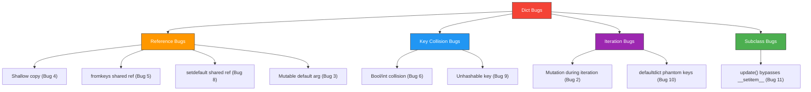
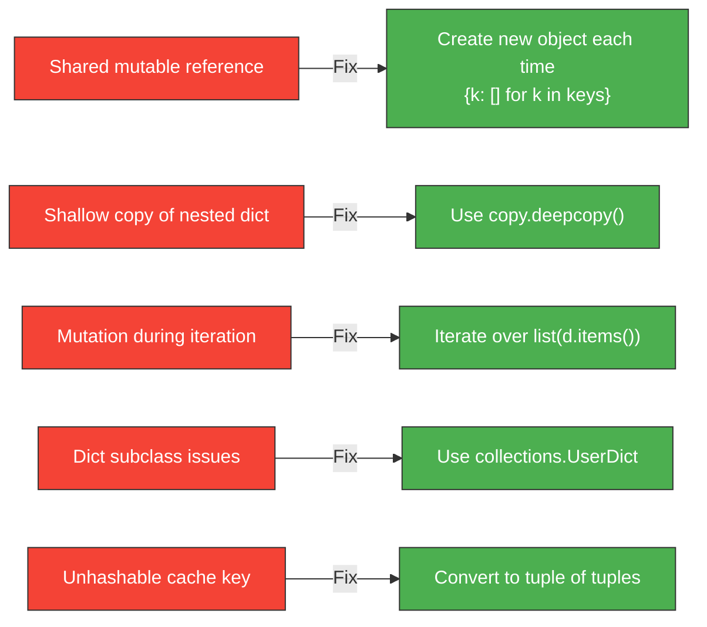

# Dictionaries — Find the Bug

> Find and fix the bug in each code snippet. Each exercise has a difficulty level and a hint.

---

## Score Card

| # | Difficulty | Bug Type | Found? | Fixed? |
|---|:----------:|----------|:------:|:------:|
| 1 | Easy | Wrong access method | [ ] | [ ] |
| 2 | Easy | Mutation during iteration | [ ] | [ ] |
| 3 | Easy | Mutable default argument | [ ] | [ ] |
| 4 | Medium | Shallow copy | [ ] | [ ] |
| 5 | Medium | fromkeys shared reference | [ ] | [ ] |
| 6 | Medium | Boolean/int key collision | [ ] | [ ] |
| 7 | Medium | Dict comprehension scope | [ ] | [ ] |
| 8 | Hard | setdefault mutable value | [ ] | [ ] |
| 9 | Hard | Unhashable dict key | [ ] | [ ] |
| 10 | Hard | defaultdict unexpected creation | [ ] | [ ] |
| 11 | Hard | update() in dict subclass | [ ] | [ ] |

**Total: ___ / 11**

---

## Easy Bugs

### Bug 1: Accessing Nested Data

```python
def get_user_email(data: dict) -> str:
    """Extract user email from API response."""
    return data["user"]["contact"]["email"]


response = {"user": {"name": "Alice", "contact": {"phone": "555-0101"}}}
email = get_user_email(response)
print(email)
```

**Hint:** What happens if a key doesn't exist in the nested dict?

<details>
<summary>Bug & Fix</summary>

**Bug:** `"email"` key does not exist in the `contact` dict, causing `KeyError: 'email'`.

**Fix:**
```python
def get_user_email(data: dict) -> str:
    """Extract user email from API response safely."""
    return data.get("user", {}).get("contact", {}).get("email", "no-email@example.com")


response = {"user": {"name": "Alice", "contact": {"phone": "555-0101"}}}
email = get_user_email(response)
print(email)  # "no-email@example.com"
```

</details>

---

### Bug 2: Removing Items During Iteration

```python
def remove_low_scores(scores: dict[str, int], threshold: int) -> dict[str, int]:
    """Remove students with scores below the threshold."""
    for name, score in scores.items():
        if score < threshold:
            del scores[name]
    return scores


results = {"Alice": 95, "Bob": 42, "Charlie": 71, "Diana": 38}
passing = remove_low_scores(results, 50)
print(passing)
```

**Hint:** Can you modify a dict while iterating over it?

<details>
<summary>Bug & Fix</summary>

**Bug:** `RuntimeError: dictionary changed size during iteration`. You cannot delete items from a dict while iterating over it.

**Fix:**
```python
def remove_low_scores(scores: dict[str, int], threshold: int) -> dict[str, int]:
    """Remove students with scores below the threshold."""
    # Iterate over a copy of items
    for name, score in list(scores.items()):
        if score < threshold:
            del scores[name]
    return scores


# Alternative (more Pythonic):
def remove_low_scores_v2(scores: dict[str, int], threshold: int) -> dict[str, int]:
    return {name: score for name, score in scores.items() if score >= threshold}


results = {"Alice": 95, "Bob": 42, "Charlie": 71, "Diana": 38}
passing = remove_low_scores(results, 50)
print(passing)  # {'Alice': 95, 'Charlie': 71}
```

</details>

---

### Bug 3: Mutable Default Argument

```python
def add_tag(item: str, tags: dict[str, list[str]] = {}) -> dict[str, list[str]]:
    """Add a tag to the registry."""
    category = item[0].upper()
    if category not in tags:
        tags[category] = []
    tags[category].append(item)
    return tags


result1 = add_tag("apple")
print(result1)  # {'A': ['apple']}

result2 = add_tag("banana")
print(result2)  # Expected: {'B': ['banana']}, Got: ???
```

**Hint:** What happens with mutable default arguments in Python?

<details>
<summary>Bug & Fix</summary>

**Bug:** The default `tags={}` is created **once** and shared across all calls. `result2` contains both `"apple"` and `"banana"` because the same dict is reused.

**Output:** `{'A': ['apple'], 'B': ['banana']}` (not what was expected)

**Fix:**
```python
def add_tag(item: str, tags: dict[str, list[str]] | None = None) -> dict[str, list[str]]:
    """Add a tag to the registry."""
    if tags is None:
        tags = {}
    category = item[0].upper()
    if category not in tags:
        tags[category] = []
    tags[category].append(item)
    return tags


result1 = add_tag("apple")
print(result1)  # {'A': ['apple']}

result2 = add_tag("banana")
print(result2)  # {'B': ['banana']} — correct!
```

</details>

---

## Medium Bugs

### Bug 4: Shallow Copy of Nested Dict

```python
def create_user_copy(user: dict) -> dict:
    """Create an independent copy of user data."""
    return user.copy()


original = {
    "name": "Alice",
    "preferences": {"theme": "dark", "language": "en"},
}

backup = create_user_copy(original)
backup["preferences"]["theme"] = "light"

print(f"Original theme: {original['preferences']['theme']}")
# Expected: "dark", Got: ???
```

**Hint:** Does `.copy()` copy nested objects?

<details>
<summary>Bug & Fix</summary>

**Bug:** `.copy()` is a **shallow copy** — it copies top-level keys but nested dicts are still shared references. Modifying `backup["preferences"]` also modifies `original["preferences"]`.

**Output:** `Original theme: light` (mutated!)

**Fix:**
```python
import copy


def create_user_copy(user: dict) -> dict:
    """Create an independent deep copy of user data."""
    return copy.deepcopy(user)


original = {
    "name": "Alice",
    "preferences": {"theme": "dark", "language": "en"},
}

backup = create_user_copy(original)
backup["preferences"]["theme"] = "light"

print(f"Original theme: {original['preferences']['theme']}")
# Output: "dark" — safe!
```

</details>

---

### Bug 5: `fromkeys` Shared Mutable Default

```python
def create_schedule() -> dict[str, list[str]]:
    """Create an empty weekly schedule."""
    days = ["Mon", "Tue", "Wed", "Thu", "Fri"]
    schedule = dict.fromkeys(days, [])
    return schedule


schedule = create_schedule()
schedule["Mon"].append("Meeting")
print(schedule)
# Expected: {'Mon': ['Meeting'], 'Tue': [], ...}
# Got: ???
```

**Hint:** Does `fromkeys` create a separate list for each key?

<details>
<summary>Bug & Fix</summary>

**Bug:** `dict.fromkeys(days, [])` assigns the **same list object** to all keys. Appending to one modifies all.

**Output:** `{'Mon': ['Meeting'], 'Tue': ['Meeting'], 'Wed': ['Meeting'], ...}`

**Fix:**
```python
def create_schedule() -> dict[str, list[str]]:
    """Create an empty weekly schedule."""
    days = ["Mon", "Tue", "Wed", "Thu", "Fri"]
    schedule = {day: [] for day in days}  # Each key gets its own list
    return schedule


schedule = create_schedule()
schedule["Mon"].append("Meeting")
print(schedule)
# {'Mon': ['Meeting'], 'Tue': [], 'Wed': [], 'Thu': [], 'Fri': []}
```

</details>

---

### Bug 6: Boolean/Integer Key Collision

```python
def count_types(items: list) -> dict:
    """Count items by their value, treating booleans and ints separately."""
    counts = {}
    for item in items:
        counts[item] = counts.get(item, 0) + 1
    return counts


data = [True, 1, False, 0, True, 1]
result = count_types(data)
print(result)
# Expected: {True: 2, 1: 2, False: 1, 0: 1}
# Got: ???
```

**Hint:** What is `True == 1` and `hash(True) == hash(1)` in Python?

<details>
<summary>Bug & Fix</summary>

**Bug:** In Python, `True == 1` and `False == 0`, and they have the same hash values. So `True` and `1` are treated as the **same key**, as are `False` and `0`.

**Output:** `{True: 4, False: 2}` (booleans and ints merged)

**Fix:**
```python
def count_types(items: list) -> dict[tuple[type, object], int]:
    """Count items by (type, value) to distinguish booleans from ints."""
    counts: dict[tuple[type, object], int] = {}
    for item in items:
        key = (type(item), item)
        counts[key] = counts.get(key, 0) + 1
    return counts


data = [True, 1, False, 0, True, 1]
result = count_types(data)
print(result)
# {(<class 'bool'>, True): 2, (<class 'int'>, 1): 2,
#  (<class 'bool'>, False): 1, (<class 'int'>, 0): 1}
```

</details>

---

### Bug 7: Overwriting in Dict Comprehension

```python
def group_by_length(words: list[str]) -> dict[int, str]:
    """Group words by their length."""
    return {len(word): word for word in words}


words = ["cat", "dog", "elephant", "ant", "bee"]
groups = group_by_length(words)
print(groups)
# Expected all words grouped, Got: ???
```

**Hint:** What happens when a dict comprehension encounters duplicate keys?

<details>
<summary>Bug & Fix</summary>

**Bug:** The dict comprehension overwrites the value when duplicate keys occur. Words of the same length (`"cat"`, `"dog"`, `"ant"` are all length 3) keep only the **last** one.

**Output:** `{3: 'ant', 8: 'elephant'}` (missing 'cat', 'dog', 'bee')

**Fix:**
```python
from collections import defaultdict


def group_by_length(words: list[str]) -> dict[int, list[str]]:
    """Group words by their length."""
    groups: defaultdict[int, list[str]] = defaultdict(list)
    for word in words:
        groups[len(word)].append(word)
    return dict(groups)


words = ["cat", "dog", "elephant", "ant", "bee"]
groups = group_by_length(words)
print(groups)
# {3: ['cat', 'dog', 'ant', 'bee'], 8: ['elephant']}
```

</details>

---

## Hard Bugs

### Bug 8: setdefault with Mutable Value Side Effect

```python
def register_events(events: list[tuple[str, str]]) -> dict[str, list[str]]:
    """Register events by category."""
    registry: dict[str, list[str]] = {}
    shared_list: list[str] = []

    for category, event in events:
        registry.setdefault(category, shared_list).append(event)

    return registry


events = [("sports", "football"), ("music", "concert"), ("sports", "tennis")]
result = register_events(events)
print(result)
# Expected: {'sports': ['football', 'tennis'], 'music': ['concert']}
# Got: ???
```

**Hint:** What object does `setdefault` insert when the key is missing?

<details>
<summary>Bug & Fix</summary>

**Bug:** `setdefault(category, shared_list)` inserts the **same** `shared_list` object for every new category. All categories point to the same list.

**Output:** `{'sports': ['football', 'concert', 'tennis'], 'music': ['football', 'concert', 'tennis']}`

**Fix:**
```python
def register_events(events: list[tuple[str, str]]) -> dict[str, list[str]]:
    """Register events by category."""
    registry: dict[str, list[str]] = {}
    for category, event in events:
        registry.setdefault(category, []).append(event)  # New list each time
    return registry


events = [("sports", "football"), ("music", "concert"), ("sports", "tennis")]
result = register_events(events)
print(result)
# {'sports': ['football', 'tennis'], 'music': ['concert']}
```

</details>

---

### Bug 9: Using Dict as Cache Key

```python
def memoize(func):
    """Simple memoization decorator."""
    cache = {}

    def wrapper(*args, **kwargs):
        key = (args, kwargs)
        if key not in cache:
            cache[key] = func(*args, **kwargs)
        return cache[key]

    return wrapper


@memoize
def process(data: dict) -> int:
    return sum(data.values())


result = process({"a": 1, "b": 2})
print(result)
```

**Hint:** Can a dict be part of a hashable tuple?

<details>
<summary>Bug & Fix</summary>

**Bug:** `kwargs` is a dict, which is **unhashable**. Creating the tuple `(args, kwargs)` raises `TypeError: unhashable type: 'dict'`. Additionally, `data` (a dict) passed as a positional argument is also unhashable.

**Fix:**
```python
def memoize(func):
    """Simple memoization decorator with hashable key conversion."""
    cache = {}

    def wrapper(*args, **kwargs):
        # Convert unhashable args to hashable form
        hashable_args = tuple(
            tuple(sorted(a.items())) if isinstance(a, dict) else a
            for a in args
        )
        hashable_kwargs = tuple(sorted(kwargs.items()))
        key = (hashable_args, hashable_kwargs)
        if key not in cache:
            cache[key] = func(*args, **kwargs)
        return cache[key]

    return wrapper


@memoize
def process(data: dict) -> int:
    return sum(data.values())


result = process({"a": 1, "b": 2})
print(result)  # 3
```

</details>

---

### Bug 10: defaultdict Unexpected Key Creation

```python
from collections import defaultdict


def check_permissions(
    user_perms: defaultdict[str, set[str]],
    resource: str,
    action: str,
) -> bool:
    """Check if user has permission for an action on a resource."""
    return action in user_perms[resource]


perms: defaultdict[str, set[str]] = defaultdict(set)
perms["files"].add("read")
perms["files"].add("write")

# Check permissions
has_access = check_permissions(perms, "database", "read")
print(has_access)   # False
print(dict(perms))  # Expected only 'files', Got: ???
```

**Hint:** What happens when you access a missing key in a `defaultdict`?

<details>
<summary>Bug & Fix</summary>

**Bug:** Accessing `user_perms["database"]` in a `defaultdict` **creates** the key with a default value (`set()`). After the check, `perms` now contains `{'files': {'read', 'write'}, 'database': set()}` — a phantom empty entry.

**Fix:**
```python
from collections import defaultdict


def check_permissions(
    user_perms: defaultdict[str, set[str]],
    resource: str,
    action: str,
) -> bool:
    """Check if user has permission for an action on a resource."""
    # Use 'in' first to avoid creating phantom keys
    if resource not in user_perms:
        return False
    return action in user_perms[resource]


# Alternative: use .get() (works because defaultdict inherits from dict)
def check_permissions_v2(
    user_perms: defaultdict[str, set[str]],
    resource: str,
    action: str,
) -> bool:
    return action in user_perms.get(resource, set())


perms: defaultdict[str, set[str]] = defaultdict(set)
perms["files"].add("read")
perms["files"].add("write")

has_access = check_permissions(perms, "database", "read")
print(has_access)    # False
print(dict(perms))   # {'files': {'read', 'write'}} — no phantom key!
```

</details>

---

### Bug 11: Dict Subclass with update()

```python
class LoggingDict(dict):
    """A dict that logs all insertions."""

    def __init__(self, *args, **kwargs):
        self.log: list[str] = []
        super().__init__(*args, **kwargs)

    def __setitem__(self, key, value):
        self.log.append(f"SET {key}={value}")
        super().__setitem__(key, value)


d = LoggingDict(a=1, b=2)
d["c"] = 3
d.update({"d": 4, "e": 5})

print(d.log)
# Expected: ['SET a=1', 'SET b=2', 'SET c=3', 'SET d=4', 'SET e=5']
# Got: ???
```

**Hint:** Does `dict.__init__()` and `dict.update()` call `__setitem__` in CPython?

<details>
<summary>Bug & Fix</summary>

**Bug:** CPython's `dict.__init__()` and `dict.update()` are implemented in C and call the internal `insertdict()` directly, **bypassing** the Python-level `__setitem__`. Only direct `d["c"] = 3` calls `__setitem__`.

**Output:** `['SET c=3']` (only one entry logged)

**Fix:** Use `collections.UserDict` instead of subclassing `dict`:
```python
from collections import UserDict


class LoggingDict(UserDict):
    """A dict that logs all insertions."""

    def __init__(self, *args, **kwargs):
        self.log: list[str] = []
        super().__init__(*args, **kwargs)

    def __setitem__(self, key, value):
        self.log.append(f"SET {key}={value}")
        super().__setitem__(key, value)


d = LoggingDict(a=1, b=2)
d["c"] = 3
d.update({"d": 4, "e": 5})

print(d.log)
# ['SET a=1', 'SET b=2', 'SET c=3', 'SET d=4', 'SET e=5']
```

</details>

---

## Diagrams

### Bug Category Overview



### Common Fix Patterns


