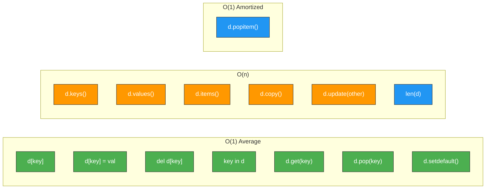

# Dictionaries — Interview Questions

---

## Junior Level (7 Questions)

### Q1: What is a dictionary in Python and how is it different from a list?

<details>
<summary>Answer</summary>

A dictionary is a **mapping type** that stores **key-value pairs**. Key differences from lists:

| Feature | Dict | List |
|---------|------|------|
| Access | By key: `d["name"]` | By index: `lst[0]` |
| Order | Insertion-ordered (3.7+) | Insertion-ordered |
| Duplicates | Keys must be unique | Duplicates allowed |
| Key types | Hashable only | N/A (uses integer indices) |
| Lookup | O(1) average | O(n) for search, O(1) by index |
| Syntax | `{"key": "value"}` | `[1, 2, 3]` |

```python
my_list = [1, 2, 3]          # Access by index: my_list[0] -> 1
my_dict = {"a": 1, "b": 2}   # Access by key: my_dict["a"] -> 1
```

</details>

### Q2: What is the difference between `d["key"]` and `d.get("key")`?

<details>
<summary>Answer</summary>

- `d["key"]` raises **KeyError** if the key doesn't exist
- `d.get("key")` returns **None** if the key doesn't exist
- `d.get("key", default)` returns **default** if the key doesn't exist

```python
data = {"name": "Alice"}

# Square brackets — crashes on missing key
try:
    print(data["age"])  # KeyError: 'age'
except KeyError:
    pass

# .get() — returns None or default
print(data.get("age"))        # None
print(data.get("age", 25))    # 25
print(data.get("name"))       # Alice
```

**When to use which:**
- Use `[]` when the key **must** exist (failure indicates a bug)
- Use `.get()` when the key is **optional**

</details>

### Q3: How do you iterate over a dictionary?

<details>
<summary>Answer</summary>

Three ways to iterate:

```python
scores = {"Alice": 95, "Bob": 87, "Charlie": 92}

# 1. Over keys (default)
for name in scores:
    print(name)  # Alice, Bob, Charlie

# 2. Over values
for score in scores.values():
    print(score)  # 95, 87, 92

# 3. Over key-value pairs (most common)
for name, score in scores.items():
    print(f"{name}: {score}")
```

`.items()` returns `dict_items` — a **view object** that reflects changes to the dict.

</details>

### Q4: Can you use a list as a dictionary key? Why or why not?

<details>
<summary>Answer</summary>

**No.** Lists are **unhashable** because they are mutable. Dict keys must be hashable — their hash value must remain constant.

```python
# This fails:
# d = {[1, 2]: "value"}  # TypeError: unhashable type: 'list'

# Use a tuple instead (immutable, therefore hashable):
d = {(1, 2): "value"}
print(d[(1, 2)])  # "value"
```

**Hashable types:** `int`, `str`, `float`, `bool`, `tuple` (of hashables), `frozenset`
**Unhashable types:** `list`, `dict`, `set`

</details>

### Q5: What does `dict.setdefault()` do?

<details>
<summary>Answer</summary>

`setdefault(key, default)` does two things:
1. If `key` exists: returns its value (does not change anything)
2. If `key` is missing: inserts `key: default` and returns `default`

```python
config = {"host": "localhost"}

# Key exists — returns existing value, does nothing
result = config.setdefault("host", "0.0.0.0")
print(result)   # "localhost" (not changed)

# Key missing — inserts and returns default
result = config.setdefault("port", 8080)
print(result)   # 8080
print(config)   # {"host": "localhost", "port": 8080}
```

It's equivalent to:
```python
if key not in d:
    d[key] = default
return d[key]
```

</details>

### Q6: How do you merge two dictionaries?

<details>
<summary>Answer</summary>

Multiple ways, in order of preference:

```python
a = {"x": 1, "y": 2}
b = {"y": 3, "z": 4}

# 1. | operator (Python 3.9+) — creates new dict
merged = a | b
print(merged)  # {'x': 1, 'y': 3, 'z': 4}

# 2. |= operator (Python 3.9+) — modifies in-place
a_copy = a.copy()
a_copy |= b
print(a_copy)  # {'x': 1, 'y': 3, 'z': 4}

# 3. ** unpacking (Python 3.5+)
merged = {**a, **b}
print(merged)  # {'x': 1, 'y': 3, 'z': 4}

# 4. update() — modifies in-place
a_copy = a.copy()
a_copy.update(b)
print(a_copy)  # {'x': 1, 'y': 3, 'z': 4}
```

In all cases, the **last value wins** when keys conflict (`y` comes from `b`).

</details>

### Q7: What is a dict comprehension? Give an example.

<details>
<summary>Answer</summary>

A dict comprehension is a concise way to create dictionaries from iterables:

```python
# Syntax: {key_expr: value_expr for item in iterable if condition}

# Squares
squares = {x: x**2 for x in range(1, 6)}
print(squares)  # {1: 1, 2: 4, 3: 9, 4: 16, 5: 25}

# Filtering
scores = {"Alice": 95, "Bob": 45, "Charlie": 72}
passing = {name: score for name, score in scores.items() if score >= 50}
print(passing)  # {'Alice': 95, 'Charlie': 72}

# Swapping keys and values
inverted = {v: k for k, v in scores.items()}
print(inverted)  # {95: 'Alice', 45: 'Bob', 72: 'Charlie'}
```

</details>

---

## Middle Level (7 Questions)

### Q8: How are Python dictionaries implemented internally?

<details>
<summary>Answer</summary>

CPython dicts use a **hash table with open addressing** and a **compact two-table layout** (since Python 3.6):

1. **Index table** (sparse): Maps `hash(key) & mask` to an entry index. Uses 1/2/4/8 bytes per slot depending on table size.
2. **Entries array** (dense): Stores `(hash, key, value)` tuples packed in **insertion order**.

Key characteristics:
- **Table size** is always a power of 2
- **Load factor** threshold: 2/3 (resize when > 66% full)
- **Collision resolution**: perturbation-based probing (`j = (5*j + 1 + perturb) & mask; perturb >>= 5`)
- **Insertion order** preserved because entries are appended to the dense array

```python
# The compact layout saves memory and preserves order "for free"
# Old layout: sparse table with (hash, key, value) per slot — lots of empty slots
# New layout: small index table + packed entries array
```

</details>

### Q9: What is `defaultdict` and when should you use it instead of a regular dict?

<details>
<summary>Answer</summary>

`defaultdict` auto-creates missing keys using a factory function. Use it when you need to **group**, **count**, or **accumulate** values.

```python
from collections import defaultdict

# Grouping
groups = defaultdict(list)
for word in ["apple", "banana", "avocado"]:
    groups[word[0]].append(word)
print(dict(groups))  # {'a': ['apple', 'avocado'], 'b': ['banana']}

# Counting
counts = defaultdict(int)
for char in "mississippi":
    counts[char] += 1
print(dict(counts))  # {'m': 1, 'i': 4, 's': 4, 'p': 2}

# Nested defaults
tree = defaultdict(lambda: defaultdict(list))
tree["users"]["admin"].append("Alice")
```

**When NOT to use:**
- When missing key access should raise an error (use regular dict)
- When you only need counting (use `Counter` instead)

</details>

### Q10: What is the difference between `dict.copy()` and `copy.deepcopy(dict)`?

<details>
<summary>Answer</summary>

```python
import copy

original = {"users": [{"name": "Alice"}, {"name": "Bob"}]}

# Shallow copy — nested objects are still shared
shallow = original.copy()
shallow["users"].append({"name": "Charlie"})
print(len(original["users"]))  # 3 — original was mutated!

# Deep copy — everything is recursively copied
original2 = {"users": [{"name": "Alice"}, {"name": "Bob"}]}
deep = copy.deepcopy(original2)
deep["users"].append({"name": "Charlie"})
print(len(original2["users"]))  # 2 — original is safe
```

| Aspect | `dict.copy()` | `copy.deepcopy()` |
|--------|:---:|:---:|
| Copies top-level keys/values | Yes | Yes |
| Copies nested objects | No (shared references) | Yes (recursive) |
| Performance | Fast O(n) | Slow (recursive + cycle detection) |
| Use when | Flat dicts only | Nested mutable structures |

</details>

### Q11: What is `Counter` and how does its arithmetic work?

<details>
<summary>Answer</summary>

`Counter` is a `dict` subclass for counting hashable objects:

```python
from collections import Counter

a = Counter("aabbbcc")  # Counter({'b': 3, 'a': 2, 'c': 2})
b = Counter("abcddd")   # Counter({'d': 3, 'a': 1, 'b': 1, 'c': 1})

# Addition: sum counts
print(a + b)  # Counter({'b': 4, 'a': 3, 'd': 3, 'c': 3})

# Subtraction: subtract (keep only positive)
print(a - b)  # Counter({'b': 2, 'a': 1, 'c': 1})

# Intersection: minimum of each
print(a & b)  # Counter({'a': 1, 'b': 1, 'c': 1})

# Union: maximum of each
print(a | b)  # Counter({'b': 3, 'd': 3, 'a': 2, 'c': 2})

# Most common
print(a.most_common(2))  # [('b', 3), ('a', 2)]

# Total count (Python 3.10+)
print(a.total())  # 7
```

Key difference from regular dict: accessing a missing key returns `0`, not `KeyError`.

</details>

### Q12: Explain dict views (`keys()`, `values()`, `items()`).

<details>
<summary>Answer</summary>

Dict views are **live, dynamic references** to the dict's data — they reflect changes:

```python
d = {"a": 1, "b": 2}
keys = d.keys()
items = d.items()

print(list(keys))   # ['a', 'b']
d["c"] = 3          # Modify the dict
print(list(keys))   # ['a', 'b', 'c'] — view reflects change!
print(list(items))  # [('a', 1), ('b', 2), ('c', 3)]

# Views support set operations (keys and items)
d1 = {"a": 1, "b": 2, "c": 3}
d2 = {"b": 2, "c": 4, "d": 5}

# Common keys
print(d1.keys() & d2.keys())   # {'b', 'c'}
# Keys only in d1
print(d1.keys() - d2.keys())   # {'a'}
# Items in common (key AND value must match)
print(d1.items() & d2.items()) # {('b', 2)}
```

**Warning:** Don't modify a dict while iterating over a view — `RuntimeError`.

</details>

### Q13: What is `ChainMap` and when would you use it?

<details>
<summary>Answer</summary>

`ChainMap` groups multiple dicts into a single view. Lookups search each dict in order:

```python
from collections import ChainMap

defaults = {"color": "blue", "size": "M"}
user_prefs = {"color": "red"}
session = {"size": "L", "theme": "dark"}

config = ChainMap(session, user_prefs, defaults)
print(config["color"])  # "red" (from user_prefs — first match wins)
print(config["size"])   # "L" (from session)
print(config["theme"])  # "dark" (from session)

# Mutations only affect the first dict
config["new_key"] = "value"
print(session)  # {'size': 'L', 'theme': 'dark', 'new_key': 'value'}
```

**Use cases:**
- Configuration layering (defaults < env < CLI args)
- Variable scoping (like Python's LEGB rule)
- Template contexts

**vs. merging:** ChainMap is lazy (no data copy), supports adding/removing scopes, but lookup is slower (O(n) dicts to search).

</details>

### Q14: What is `MappingProxyType` and why would you use it?

<details>
<summary>Answer</summary>

`MappingProxyType` creates a **read-only view** of a dictionary:

```python
from types import MappingProxyType

mutable = {"host": "localhost", "port": 8080}
readonly = MappingProxyType(mutable)

print(readonly["host"])  # "localhost" — reading works

try:
    readonly["port"] = 3000  # TypeError!
except TypeError as e:
    print(e)  # 'mappingproxy' object does not support item assignment

# Changes to the original are reflected
mutable["debug"] = True
print(readonly["debug"])  # True — it's a view, not a copy
```

**Use cases:**
- Exposing config that should not be modified
- Class `__dict__` is a mappingproxy (prevents accidental attribute corruption)
- API boundaries where you want to prevent mutation

</details>

---

## Senior Level (6 Questions)

### Q15: Explain the compact dict layout introduced in Python 3.6.

<details>
<summary>Answer</summary>

Before 3.6, dicts used a single sparse hash table where each slot stored `(hash, key, value)` — or was empty. With 8 slots and 3 entries, 5 slots wasted 24 bytes each.

The compact layout uses **two arrays**:
1. **Index table** (sparse): Small integers mapping hash slots to entry indices
2. **Entries array** (dense): `(hash, key, value)` packed in insertion order

```
Old layout (pre-3.6):
  Slot 0: EMPTY (24 bytes wasted)
  Slot 1: (hash_age, "age", 30)
  Slot 2: EMPTY (24 bytes wasted)
  Slot 3: (hash_name, "name", "Alice")
  ...

New compact layout (3.6+):
  Index: [_, 1, _, 0, _, 2, _, _]   <- 1 byte each (8 bytes total)
  Entries:
    [0]: (hash_name, "name", "Alice")   <- insertion order
    [1]: (hash_age, "age", 30)
    [2]: (hash_city, "city", "NYC")
```

**Benefits:**
- ~25% less memory for typical dicts
- Insertion order preserved naturally (entries appended to dense array)
- Better cache locality (entries are contiguous)

</details>

### Q16: How does Python handle hash collisions in dicts?

<details>
<summary>Answer</summary>

CPython uses **open addressing with perturbation-based probing**:

```c
j = hash & mask;           // Initial slot
perturb = hash;

while (slot_occupied_by_different_key) {
    j = (5 * j + 1 + perturb) & mask;
    perturb >>= 5;         // Gradually shift out perturbation
}
```

This is better than linear probing because:
- It uses **all bits** of the hash (not just low bits)
- As `perturb` shifts right, eventually `j = (5*j + 1) & mask` which visits all slots in a power-of-2 table
- Avoids the **clustering** problem of linear probing

```python
# When perturb reaches 0, the sequence becomes:
# j = (5*j + 1) & mask
# For mask=7 (table_size=8), starting at j=0:
# 0 -> 1 -> 6 -> 7 -> 4 -> 5 -> 2 -> 3 -> 0 (visits all 8 slots)
```

</details>

### Q17: What is key sharing (split table) dicts and when does it break?

<details>
<summary>Answer</summary>

CPython optimizes instance `__dict__` by **sharing the keys object** across all instances of the same class:

```python
class Point:
    def __init__(self, x, y):
        self.x = x
        self.y = y

p1 = Point(1, 2)  # __dict__ = split table: shared keys + own values
p2 = Point(3, 4)  # __dict__ = split table: same shared keys + own values
# Only ONE PyDictKeysObject for both instances
```

**Key sharing breaks when:**
1. An instance gets an **extra attribute**: `p1.z = 5`
2. An attribute is **deleted**: `del p1.x`
3. The attribute insertion **order differs** between instances

When broken, that instance's `__dict__` converts to a regular combined table.

**Best practice:** Set all attributes in `__init__` and don't add/remove attributes afterward.

</details>

### Q18: How does `dict.__missing__` work and how is it used?

<details>
<summary>Answer</summary>

`__missing__` is called by `__getitem__` when a key is not found. Only `[]` access triggers it — `.get()` does not.

```python
class CaseInsensitiveDict(dict):
    """Dict that treats keys as case-insensitive."""

    def __missing__(self, key):
        # Search for case-insensitive match
        for k, v in self.items():
            if k.lower() == key.lower():
                return v
        raise KeyError(key)

    def __contains__(self, key):
        return any(k.lower() == key.lower() for k in self.keys())


d = CaseInsensitiveDict(Hello="world", Python="awesome")
print(d["hello"])   # "world" — __missing__ finds case-insensitive match
print(d["PYTHON"])  # "awesome"
print("hello" in d) # True
```

`defaultdict` uses `__missing__` internally:
```python
# defaultdict.__missing__ calls self.default_factory()
# and inserts the result before returning it
```

</details>

### Q19: How would you implement a thread-safe dict with fine-grained locking?

<details>
<summary>Answer</summary>

```python
import threading
from typing import Any, Hashable


class ShardedDict:
    """Thread-safe dict using sharded locks for reduced contention."""

    def __init__(self, num_shards: int = 16) -> None:
        self._num_shards = num_shards
        self._shards: list[dict[Any, Any]] = [{} for _ in range(num_shards)]
        self._locks: list[threading.Lock] = [threading.Lock() for _ in range(num_shards)]

    def _get_shard(self, key: Hashable) -> int:
        return hash(key) % self._num_shards

    def __getitem__(self, key: Hashable) -> Any:
        shard = self._get_shard(key)
        with self._locks[shard]:
            return self._shards[shard][key]

    def __setitem__(self, key: Hashable, value: Any) -> None:
        shard = self._get_shard(key)
        with self._locks[shard]:
            self._shards[shard][key] = value

    def get(self, key: Hashable, default: Any = None) -> Any:
        shard = self._get_shard(key)
        with self._locks[shard]:
            return self._shards[shard].get(key, default)

    def increment(self, key: Hashable, amount: int = 1) -> int:
        shard = self._get_shard(key)
        with self._locks[shard]:
            val = self._shards[shard].get(key, 0) + amount
            self._shards[shard][key] = val
            return val


# Test with concurrent access
sd = ShardedDict()

def worker(prefix: str, n: int):
    for i in range(n):
        sd.increment(f"{prefix}_{i % 10}")

threads = [
    threading.Thread(target=worker, args=(f"t{t}", 10_000))
    for t in range(8)
]
for t in threads:
    t.start()
for t in threads:
    t.join()

total = sum(sd.get(f"t{t}_{i}", 0) for t in range(8) for i in range(10))
print(f"Total: {total}")  # 80,000 (correct)
```

Sharding reduces lock contention because different keys likely hit different shards.

</details>

### Q20: What is the `ma_version_tag` in CPython dicts and how does the specializing interpreter use it?

<details>
<summary>Answer</summary>

`ma_version_tag` is a `uint64_t` counter in `PyDictObject` that increments on every mutation (insert, update, delete). It enables **inline caching** in the specializing adaptive interpreter (PEP 659, Python 3.11+).

**How it works:**
1. When a `LOAD_ATTR` or `LOAD_GLOBAL` bytecode accesses a dict attribute, the interpreter records the dict's version tag and the key's position.
2. On subsequent executions, it checks if the version tag matches. If so, it skips the full hash lookup and goes directly to the cached position.
3. If the version tag changed, the cache is invalidated and a full lookup is performed.

```python
import dis

def global_access():
    return len([1, 2, 3])  # len is looked up in builtins.__dict__

# Python 3.11+ specializes this to LOAD_GLOBAL_BUILTIN
# which caches the builtins dict version + index
dis.dis(global_access)
```

**Implications:**
- Modifying `globals()` or `builtins.__dict__` at runtime invalidates all cached lookups, degrading performance.
- This is why monkey-patching builtins is particularly expensive.

</details>

---

## Expert / Tricky Questions (4 Questions)

### Q21: What is the output and why?

```python
d = {}
d[1] = "int"
d[True] = "bool"
d[1.0] = "float"
print(d)
print(len(d))
```

<details>
<summary>Answer</summary>

```
{1: 'float'}
1
```

`1 == True == 1.0` and `hash(1) == hash(True) == hash(1.0)`, so they all map to the **same key**. The key retains the value from the first insertion (`1`), but each assignment overwrites the value. Final value is `"float"`.

</details>

### Q22: What is wrong with this code?

```python
cache = {}

def memoize(func):
    def wrapper(*args, **kwargs):
        key = (args, kwargs)
        if key not in cache:
            cache[key] = func(*args, **kwargs)
        return cache[key]
    return wrapper

@memoize
def add(a, b):
    return a + b

add(1, 2)
```

<details>
<summary>Answer</summary>

`kwargs` is a `dict`, which is **unhashable**. `(args, kwargs)` raises `TypeError: unhashable type: 'dict'`.

**Fix:** Convert kwargs to a hashable form:
```python
def memoize(func):
    def wrapper(*args, **kwargs):
        key = (args, tuple(sorted(kwargs.items())))
        if key not in cache:
            cache[key] = func(*args, **kwargs)
        return cache[key]
    return wrapper
```

Or use `functools.lru_cache` which handles this properly.

</details>

### Q23: Why does `dict.update()` not call `__setitem__` in subclasses?

<details>
<summary>Answer</summary>

In CPython, `dict.update()` and `dict.__init__()` are implemented in C and call the **C-level** `insertdict()` directly, bypassing Python-level `__setitem__`:

```python
class LoggingDict(dict):
    def __setitem__(self, key, value):
        print(f"Setting {key}={value}")
        super().__setitem__(key, value)

d = LoggingDict(a=1, b=2)  # No output! __init__ bypasses __setitem__
d["c"] = 3                  # "Setting c=3" — this one calls __setitem__
d.update({"d": 4})          # No output! update bypasses __setitem__
```

**Fix:** Override `update()` and `__init__()` too, or use `collections.UserDict` which routes everything through `__setitem__`:

```python
from collections import UserDict

class LoggingDict(UserDict):
    def __setitem__(self, key, value):
        print(f"Setting {key}={value}")
        super().__setitem__(key, value)

d = LoggingDict(a=1, b=2)   # "Setting a=1", "Setting b=2"
d.update({"c": 3})           # "Setting c=3"
```

</details>

### Q24: How does `dict.pop()` handle the "dummy" entry left behind, and why doesn't it trigger a resize?

<details>
<summary>Answer</summary>

When an entry is deleted via `pop()` or `del`, CPython:
1. Marks the **index slot** as `DKIX_DUMMY` (-2) — not empty (-1)
2. Sets the entry's key and value to `NULL` in the entries array
3. Does **not** compact the entries array (to preserve order of remaining entries)

**Why dummy entries matter:**
- During probing, `EMPTY` stops the search, but `DUMMY` means "keep probing" — there might be a key inserted after this one that used this slot during its probe sequence.
- Without dummies, deleting a key could make other keys unreachable.

**Why no shrinking:**
- CPython dicts **never shrink** in place. The table only grows.
- After many deletes, the table may be oversized. The only way to reclaim space is to create a new dict: `d = {k: v for k, v in d.items()}`
- This is a deliberate trade-off: shrinking would require rehashing all entries, which is expensive and would invalidate the version tag / inline caches.

```python
import sys

d = {i: i for i in range(1000)}
print(f"After 1000 inserts: {sys.getsizeof(d):,} bytes")

for i in range(999):
    del d[i]
print(f"After 999 deletes:  {sys.getsizeof(d):,} bytes")  # Same size!

d = {k: v for k, v in d.items()}  # Rebuild
print(f"After rebuild:      {sys.getsizeof(d):,} bytes")   # Much smaller
```

</details>

---

## Diagrams

### Diagram 1: Interview Topic Map

```mermaid
graph TD
    A["Dict Interview Topics"] --> J["Junior"]
    A --> M["Middle"]
    A --> S["Senior"]
    A --> E["Expert"]

    J --> J1["Creation & Access"]
    J --> J2["Methods: get, pop, update"]
    J --> J3["Iteration patterns"]
    J --> J4["Comprehensions"]

    M --> M1["Hash table internals"]
    M --> M2["defaultdict, Counter"]
    M --> M3["Views & ChainMap"]
    M --> M4["Shallow vs deep copy"]

    S --> S1["Compact layout"]
    S --> S2["Key sharing / split table"]
    S --> S3["Thread safety"]
    S --> S4["__missing__ hook"]

    E --> E1["Perturbation probing"]
    E --> E2["Version tag / watchers"]
    E --> E3["UserDict vs dict subclass"]
    E --> E4["Dummy entries & resize"]

    style A fill:#4CAF50,stroke:#333,color:#fff
    style J fill:#2196F3,stroke:#333,color:#fff
    style M fill:#FF9800,stroke:#333,color:#fff
    style S fill:#9C27B0,stroke:#333,color:#fff
    style E fill:#F44336,stroke:#333,color:#fff
```



### Diagram 2: Dict Method Complexity



Note: `len(d)` is actually O(1) — CPython stores `ma_used`. It is listed under O(n) group for layout only; creating the views is O(1) but iterating them is O(n).
