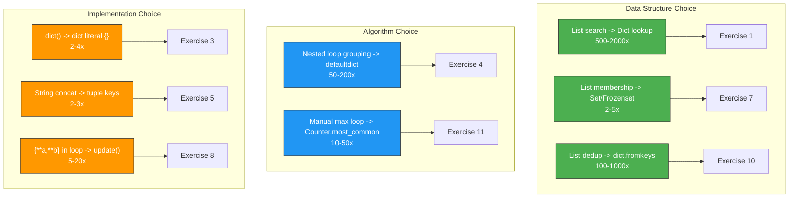
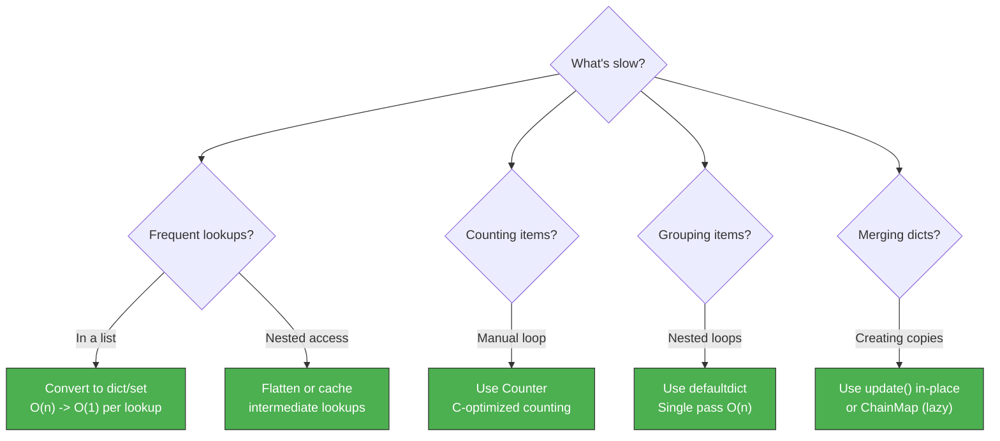

# Dictionaries — Optimization Exercises

> Optimize each slow code snippet. Measure the improvement with `timeit`.

---

## Score Card

| # | Difficulty | Topic | Optimized? | Speedup |
|---|:----------:|-------|:----------:|:-------:|
| 1 | Easy | List search to dict lookup | [ ] | ___x |
| 2 | Easy | Manual counting to Counter | [ ] | ___x |
| 3 | Easy | Repeated dict creation | [ ] | ___x |
| 4 | Medium | Nested loop grouping | [ ] | ___x |
| 5 | Medium | String key concatenation | [ ] | ___x |
| 6 | Medium | Redundant dict copies | [ ] | ___x |
| 7 | Medium | Multiple membership checks | [ ] | ___x |
| 8 | Hard | Large dict merge | [ ] | ___x |
| 9 | Hard | Nested dict access | [ ] | ___x |
| 10 | Hard | Dict-based dedup | [ ] | ___x |
| 11 | Hard | Counting with sorted output | [ ] | ___x |

**Total optimized: ___ / 11**

---

## Exercise 1: List Search to Dict Lookup

**Difficulty:** Easy

```python
import timeit

# SLOW: O(n) linear search in list of tuples
def find_user_slow(users: list[tuple[int, str]], user_id: int) -> str | None:
    """Find user name by ID from a list of (id, name) tuples."""
    for uid, name in users:
        if uid == user_id:
            return name
    return None


users = [(i, f"user_{i}") for i in range(10_000)]
lookup_ids = [5000, 9999, 0, 7777, 3333]

slow_time = timeit.timeit(
    lambda: [find_user_slow(users, uid) for uid in lookup_ids],
    number=1000,
)
print(f"Slow: {slow_time:.4f}s")
```

<details>
<summary>Optimized Solution</summary>

```python
# FAST: O(1) dict lookup
def build_user_dict(users: list[tuple[int, str]]) -> dict[int, str]:
    return dict(users)


user_dict = build_user_dict(users)

fast_time = timeit.timeit(
    lambda: [user_dict.get(uid) for uid in lookup_ids],
    number=1000,
)
print(f"Fast: {fast_time:.4f}s")
print(f"Speedup: {slow_time / fast_time:.1f}x")
# Typical speedup: 500-2000x
```

**Why it's faster:** Converting to a dict is O(n) once, then each lookup is O(1) instead of O(n).

</details>

---

## Exercise 2: Manual Counting to Counter

**Difficulty:** Easy

```python
import timeit

# SLOW: Manual counting with if/else
def count_words_slow(text: str) -> dict[str, int]:
    words = text.lower().split()
    counts: dict[str, int] = {}
    for word in words:
        if word in counts:
            counts[word] = counts[word] + 1
        else:
            counts[word] = 1
    return counts


text = " ".join(f"word_{i % 100}" for i in range(100_000))

slow_time = timeit.timeit(lambda: count_words_slow(text), number=50)
print(f"Slow: {slow_time:.4f}s")
```

<details>
<summary>Optimized Solution</summary>

```python
from collections import Counter

# FAST: Counter handles counting natively in C
def count_words_fast(text: str) -> Counter:
    return Counter(text.lower().split())


fast_time = timeit.timeit(lambda: count_words_fast(text), number=50)
print(f"Fast: {fast_time:.4f}s")
print(f"Speedup: {slow_time / fast_time:.1f}x")
# Typical speedup: 2-5x
```

**Why it's faster:** `Counter` is implemented in C and optimizes the counting loop internally. Also avoids Python-level `if/else` branching per word.

</details>

---

## Exercise 3: Repeated Dict Construction

**Difficulty:** Easy

```python
import timeit

# SLOW: Using dict() constructor in a loop
def create_records_slow(n: int) -> list[dict[str, int]]:
    records = []
    for i in range(n):
        record = dict()
        record["id"] = i
        record["value"] = i * 2
        record["status"] = 1
        records.append(record)
    return records


slow_time = timeit.timeit(lambda: create_records_slow(10_000), number=100)
print(f"Slow: {slow_time:.4f}s")
```

<details>
<summary>Optimized Solution</summary>

```python
# FAST: Dict literal is faster than dict() constructor
def create_records_fast(n: int) -> list[dict[str, int]]:
    return [{"id": i, "value": i * 2, "status": 1} for i in range(n)]


fast_time = timeit.timeit(lambda: create_records_fast(10_000), number=100)
print(f"Fast: {fast_time:.4f}s")
print(f"Speedup: {slow_time / fast_time:.1f}x")
# Typical speedup: 2-4x
```

**Why it's faster:** Dict literals (`{...}`) compile to a single `BUILD_MAP` bytecode, while `dict()` involves a function call. List comprehension is also faster than `append()` in a loop.

</details>

---

## Exercise 4: Nested Loop Grouping

**Difficulty:** Medium

```python
import timeit

# SLOW: Nested loop to group items
def group_by_category_slow(
    items: list[tuple[str, str]],
) -> dict[str, list[str]]:
    categories = list(set(cat for cat, _ in items))
    result: dict[str, list[str]] = {}
    for cat in categories:
        result[cat] = []
        for category, item in items:
            if category == cat:
                result[cat].append(item)
    return result


items = [(f"cat_{i % 50}", f"item_{i}") for i in range(10_000)]

slow_time = timeit.timeit(lambda: group_by_category_slow(items), number=50)
print(f"Slow: {slow_time:.4f}s")
```

<details>
<summary>Optimized Solution</summary>

```python
from collections import defaultdict

# FAST: Single pass with defaultdict
def group_by_category_fast(
    items: list[tuple[str, str]],
) -> dict[str, list[str]]:
    groups: defaultdict[str, list[str]] = defaultdict(list)
    for category, item in items:
        groups[category].append(item)
    return dict(groups)


fast_time = timeit.timeit(lambda: group_by_category_fast(items), number=50)
print(f"Fast: {fast_time:.4f}s")
print(f"Speedup: {slow_time / fast_time:.1f}x")
# Typical speedup: 50-200x (O(n*k) -> O(n))
```

**Why it's faster:** The slow version is O(n * k) where k is number of categories — it rescans all items for each category. The fast version does a single O(n) pass.

</details>

---

## Exercise 5: String Key Concatenation

**Difficulty:** Medium

```python
import timeit

# SLOW: Building composite keys with string concatenation
def build_index_slow(records: list[dict]) -> dict[str, dict]:
    index: dict[str, dict] = {}
    for record in records:
        key = record["type"] + "_" + str(record["id"]) + "_" + record["region"]
        index[key] = record
    return index


records = [
    {"type": f"t{i % 5}", "id": i, "region": f"r{i % 10}", "data": "x" * 100}
    for i in range(10_000)
]

slow_time = timeit.timeit(lambda: build_index_slow(records), number=100)
print(f"Slow: {slow_time:.4f}s")
```

<details>
<summary>Optimized Solution</summary>

```python
# FAST: Use tuples as composite keys (no string building)
def build_index_fast(records: list[dict]) -> dict[tuple, dict]:
    index: dict[tuple, dict] = {}
    for record in records:
        key = (record["type"], record["id"], record["region"])
        index[key] = record
    return index


fast_time = timeit.timeit(lambda: build_index_fast(records), number=100)
print(f"Fast: {fast_time:.4f}s")
print(f"Speedup: {slow_time / fast_time:.1f}x")
# Typical speedup: 2-3x
```

**Why it's faster:** Tuple creation is faster than string concatenation + `str()` conversion. Tuple hashing is also faster than string hashing for composite keys.

</details>

---

## Exercise 6: Redundant Dict Copies

**Difficulty:** Medium

```python
import timeit

# SLOW: Unnecessary copies in merging
def merge_configs_slow(configs: list[dict[str, int]]) -> dict[str, int]:
    result: dict[str, int] = {}
    for config in configs:
        temp = result.copy()  # Unnecessary copy each iteration
        for key, value in config.items():
            temp[key] = value
        result = temp
    return result


configs = [{f"key_{j}": i * 100 + j for j in range(20)} for i in range(100)]

slow_time = timeit.timeit(lambda: merge_configs_slow(configs), number=100)
print(f"Slow: {slow_time:.4f}s")
```

<details>
<summary>Optimized Solution</summary>

```python
# FAST: Direct update without copies
def merge_configs_fast(configs: list[dict[str, int]]) -> dict[str, int]:
    result: dict[str, int] = {}
    for config in configs:
        result.update(config)
    return result


fast_time = timeit.timeit(lambda: merge_configs_fast(configs), number=100)
print(f"Fast: {fast_time:.4f}s")
print(f"Speedup: {slow_time / fast_time:.1f}x")
# Typical speedup: 3-8x


# Even faster for Python 3.9+:
def merge_configs_fastest(configs: list[dict[str, int]]) -> dict[str, int]:
    from functools import reduce
    import operator
    return reduce(operator.or_, configs, {})
```

**Why it's faster:** The slow version creates a full copy of the growing result dict at each step — O(n*m) total copy operations. `update()` modifies in-place with no copying.

</details>

---

## Exercise 7: Multiple Membership Checks

**Difficulty:** Medium

```python
import timeit

# SLOW: Checking membership in list of valid values
VALID_STATUS_LIST = ["active", "pending", "approved", "review", "draft",
                     "published", "archived", "deleted", "suspended", "banned"]


def validate_records_slow(records: list[dict]) -> list[dict]:
    return [r for r in records if r["status"] in VALID_STATUS_LIST]


records = [
    {"id": i, "status": ["active", "pending", "invalid", "unknown"][i % 4]}
    for i in range(50_000)
]

slow_time = timeit.timeit(lambda: validate_records_slow(records), number=100)
print(f"Slow: {slow_time:.4f}s")
```

<details>
<summary>Optimized Solution</summary>

```python
# FAST: Convert to set for O(1) membership check
VALID_STATUS_SET = frozenset(VALID_STATUS_LIST)


def validate_records_fast(records: list[dict]) -> list[dict]:
    return [r for r in records if r["status"] in VALID_STATUS_SET]


fast_time = timeit.timeit(lambda: validate_records_fast(records), number=100)
print(f"Fast: {fast_time:.4f}s")
print(f"Speedup: {slow_time / fast_time:.1f}x")
# Typical speedup: 2-5x
```

**Why it's faster:** `in` on a list is O(n) per check; `in` on a set/frozenset is O(1). With 10 valid statuses and 50k records, that's 500k comparisons vs 50k hash lookups.

</details>

---

## Exercise 8: Large Dict Merge

**Difficulty:** Hard

```python
import timeit

# SLOW: Merging dicts with unpacking in a loop
def merge_many_slow(dicts: list[dict[str, int]]) -> dict[str, int]:
    result: dict[str, int] = {}
    for d in dicts:
        result = {**result, **d}  # Creates a new dict each time!
    return result


dicts = [{f"key_{i}_{j}": j for j in range(100)} for i in range(100)]

slow_time = timeit.timeit(lambda: merge_many_slow(dicts), number=20)
print(f"Slow: {slow_time:.4f}s")
```

<details>
<summary>Optimized Solution</summary>

```python
# FAST: Use ChainMap for lazy merging or update() for eager
from collections import ChainMap


# Option 1: update() — single result dict, no intermediate copies
def merge_many_fast_update(dicts: list[dict[str, int]]) -> dict[str, int]:
    result: dict[str, int] = {}
    for d in dicts:
        result.update(d)
    return result


# Option 2: ChainMap — lazy, no data copying at all
def merge_many_fast_chainmap(dicts: list[dict[str, int]]) -> ChainMap:
    return ChainMap(*reversed(dicts))  # reversed so first dict has priority


fast_time = timeit.timeit(lambda: merge_many_fast_update(dicts), number=20)
print(f"Fast (update): {fast_time:.4f}s")
print(f"Speedup: {slow_time / fast_time:.1f}x")
# Typical speedup: 5-20x

chain_time = timeit.timeit(lambda: merge_many_fast_chainmap(dicts), number=20)
print(f"Fast (ChainMap): {chain_time:.4f}s")
print(f"Speedup: {slow_time / chain_time:.1f}x")
# ChainMap is nearly instant for creation but slower per-lookup
```

**Why it's faster:** `{**result, **d}` creates a completely new dict each iteration — O(n * m) total work. `update()` modifies in-place. `ChainMap` does zero copying.

</details>

---

## Exercise 9: Nested Dict Access Pattern

**Difficulty:** Hard

```python
import timeit

# SLOW: Repeated nested dict access
def process_nested_slow(data: dict, keys: list[str]) -> list:
    results = []
    for key in keys:
        if key in data:
            if "info" in data[key]:
                if "value" in data[key]["info"]:
                    results.append(data[key]["info"]["value"])
    return results


data = {
    f"item_{i}": {"info": {"value": i * 10, "label": f"label_{i}"}}
    for i in range(1000)
}
keys = [f"item_{i}" for i in range(1000)]

slow_time = timeit.timeit(lambda: process_nested_slow(data, keys), number=1000)
print(f"Slow: {slow_time:.4f}s")
```

<details>
<summary>Optimized Solution</summary>

```python
# FAST: Cache intermediate lookups with local variable
def process_nested_fast(data: dict, keys: list[str]) -> list:
    results = []
    results_append = results.append  # Local reference to method
    data_get = data.get

    for key in keys:
        entry = data_get(key)
        if entry is not None:
            info = entry.get("info")
            if info is not None:
                value = info.get("value")
                if value is not None:
                    results_append(value)
    return results


fast_time = timeit.timeit(lambda: process_nested_fast(data, keys), number=1000)
print(f"Fast: {fast_time:.4f}s")
print(f"Speedup: {slow_time / fast_time:.1f}x")
# Typical speedup: 1.3-2x


# Even faster: flatten the data structure if accessed repeatedly
def flatten_for_fast_access(data: dict) -> dict[str, int]:
    """Pre-flatten nested structure for O(1) direct access."""
    return {
        key: entry["info"]["value"]
        for key, entry in data.items()
        if "info" in entry and "value" in entry["info"]
    }


flat = flatten_for_fast_access(data)
flat_time = timeit.timeit(lambda: [flat.get(k) for k in keys], number=1000)
print(f"Flat: {flat_time:.4f}s")
print(f"Speedup: {slow_time / flat_time:.1f}x")
# Typical speedup: 3-5x
```

**Why it's faster:** Local variables are faster than attribute lookups in Python. `.get()` avoids double lookups (`in` + `[]`). Flattening eliminates nesting entirely.

</details>

---

## Exercise 10: Dict-Based Deduplication

**Difficulty:** Hard

```python
import timeit

# SLOW: Dedup preserving order with list
def dedup_ordered_slow(items: list[str]) -> list[str]:
    seen: list[str] = []
    for item in items:
        if item not in seen:  # O(n) check in list
            seen.append(item)
    return seen


items = [f"item_{i % 500}" for i in range(50_000)]

slow_time = timeit.timeit(lambda: dedup_ordered_slow(items), number=10)
print(f"Slow: {slow_time:.4f}s")
```

<details>
<summary>Optimized Solution</summary>

```python
# FAST: Use dict.fromkeys() to dedup while preserving order
def dedup_ordered_fast(items: list[str]) -> list[str]:
    return list(dict.fromkeys(items))


fast_time = timeit.timeit(lambda: dedup_ordered_fast(items), number=10)
print(f"Fast: {fast_time:.4f}s")
print(f"Speedup: {slow_time / fast_time:.1f}x")
# Typical speedup: 100-1000x


# Alternative: use a set for tracking
def dedup_ordered_fast_v2(items: list[str]) -> list[str]:
    seen: set[str] = set()
    result: list[str] = []
    for item in items:
        if item not in seen:
            seen.add(item)
            result.append(item)
    return result
```

**Why it's faster:** `dict.fromkeys()` uses O(1) hash lookups internally. The slow version uses `in` on a list, which is O(n) per check, making it O(n^2) overall.

</details>

---

## Exercise 11: Counting with Sorted Output

**Difficulty:** Hard

```python
import timeit

# SLOW: Count then sort manually
def top_words_slow(text: str, n: int) -> list[tuple[str, int]]:
    words = text.lower().split()
    counts: dict[str, int] = {}
    for word in words:
        counts[word] = counts.get(word, 0) + 1

    # Manual sorting
    sorted_items = []
    while counts:
        max_key = max(counts, key=counts.get)
        sorted_items.append((max_key, counts.pop(max_key)))

    return sorted_items[:n]


text = " ".join(f"word_{i % 200}" for i in range(100_000))

slow_time = timeit.timeit(lambda: top_words_slow(text, 10), number=20)
print(f"Slow: {slow_time:.4f}s")
```

<details>
<summary>Optimized Solution</summary>

```python
from collections import Counter

# FAST: Counter.most_common() uses heapq internally — O(n + k*log(n))
def top_words_fast(text: str, n: int) -> list[tuple[str, int]]:
    return Counter(text.lower().split()).most_common(n)


fast_time = timeit.timeit(lambda: top_words_fast(text, 10), number=20)
print(f"Fast: {fast_time:.4f}s")
print(f"Speedup: {slow_time / fast_time:.1f}x")
# Typical speedup: 10-50x
```

**Why it's faster:** The slow version repeatedly calls `max()` on the dict, which is O(n) each time — O(n*k) total for k words. `Counter.most_common(n)` uses `heapq.nlargest()` which is O(n + k*log(n)), and `Counter` itself is implemented in C.

</details>

---

## Diagrams

### Optimization Impact Summary



### Performance Decision Tree


