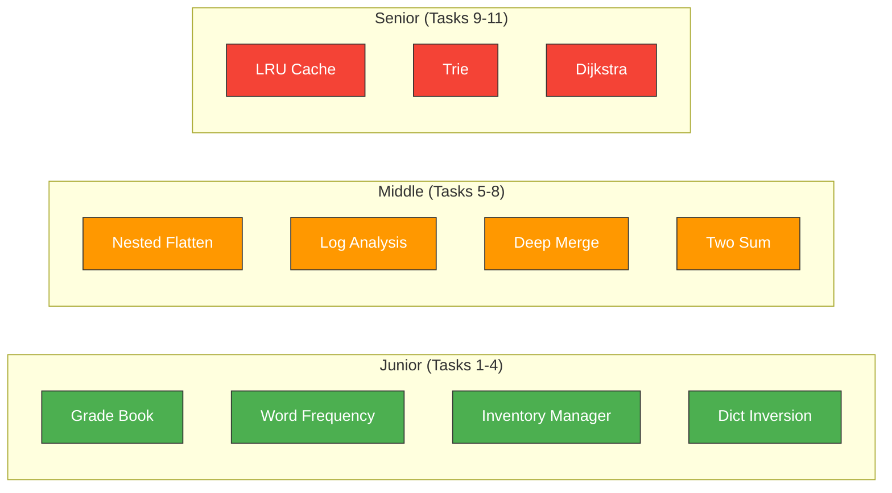

# Dictionaries — Practice Tasks

---

## Junior Tasks (4)

### Task 1: Student Grade Book

**Difficulty:** Easy
**Goal:** Create a grade book that stores student names and their grades.

```python
def grade_book(students: list[tuple[str, int]]) -> dict[str, str]:
    """Convert a list of (name, score) tuples to a grade book.

    Grading scale:
        90-100: "A"
        80-89:  "B"
        70-79:  "C"
        60-69:  "D"
        0-59:   "F"

    Args:
        students: List of (name, score) tuples.

    Returns:
        Dict mapping student names to letter grades.

    Examples:
        >>> grade_book([("Alice", 95), ("Bob", 72)])
        {'Alice': 'A', 'Bob': 'C'}
        >>> grade_book([("Charlie", 59)])
        {'Charlie': 'F'}
        >>> grade_book([])
        {}
    """
    # YOUR CODE HERE
    pass
```

<details>
<summary>Solution</summary>

```python
def grade_book(students: list[tuple[str, int]]) -> dict[str, str]:
    def letter_grade(score: int) -> str:
        if score >= 90: return "A"
        if score >= 80: return "B"
        if score >= 70: return "C"
        if score >= 60: return "D"
        return "F"

    return {name: letter_grade(score) for name, score in students}


# Tests
assert grade_book([("Alice", 95), ("Bob", 72)]) == {"Alice": "A", "Bob": "C"}
assert grade_book([("Charlie", 59)]) == {"Charlie": "F"}
assert grade_book([]) == {}
assert grade_book([("A", 90), ("B", 80), ("C", 70), ("D", 60), ("F", 50)]) == {
    "A": "A", "B": "B", "C": "C", "D": "D", "F": "F"
}
print("All tests passed!")
```

</details>

---

### Task 2: Word Frequency Counter

**Difficulty:** Easy
**Goal:** Count the frequency of each word in a text.

```python
def word_frequency(text: str) -> dict[str, int]:
    """Count the frequency of each word (case-insensitive).

    Args:
        text: Input string with words separated by spaces.

    Returns:
        Dict mapping lowercase words to their frequency.

    Examples:
        >>> word_frequency("hello world hello")
        {'hello': 2, 'world': 1}
        >>> word_frequency("")
        {}
    """
    # YOUR CODE HERE
    pass
```

<details>
<summary>Solution</summary>

```python
def word_frequency(text: str) -> dict[str, int]:
    if not text.strip():
        return {}
    freq: dict[str, int] = {}
    for word in text.lower().split():
        freq[word] = freq.get(word, 0) + 1
    return freq


# Tests
assert word_frequency("hello world hello") == {"hello": 2, "world": 1}
assert word_frequency("") == {}
assert word_frequency("Python python PYTHON") == {"python": 3}
assert word_frequency("one") == {"one": 1}
print("All tests passed!")
```

</details>

---

### Task 3: Inventory Manager

**Difficulty:** Easy
**Goal:** Manage a simple product inventory.

```python
def manage_inventory(
    inventory: dict[str, int],
    operations: list[tuple[str, str, int]],
) -> dict[str, int]:
    """Apply operations to an inventory.

    Operations:
        ("add", product, quantity)    — add stock
        ("sell", product, quantity)   — remove stock (min 0)
        ("remove", product, 0)       — remove product entirely

    Args:
        inventory: Current inventory {product: quantity}.
        operations: List of (action, product, quantity) tuples.

    Returns:
        Updated inventory (products with 0 quantity should remain).

    Examples:
        >>> manage_inventory({"apple": 10}, [("sell", "apple", 3)])
        {'apple': 7}
        >>> manage_inventory({}, [("add", "banana", 5)])
        {'banana': 5}
    """
    # YOUR CODE HERE
    pass
```

<details>
<summary>Solution</summary>

```python
def manage_inventory(
    inventory: dict[str, int],
    operations: list[tuple[str, str, int]],
) -> dict[str, int]:
    result = inventory.copy()
    for action, product, quantity in operations:
        if action == "add":
            result[product] = result.get(product, 0) + quantity
        elif action == "sell":
            current = result.get(product, 0)
            result[product] = max(0, current - quantity)
        elif action == "remove":
            result.pop(product, None)
    return result


# Tests
assert manage_inventory({"apple": 10}, [("sell", "apple", 3)]) == {"apple": 7}
assert manage_inventory({}, [("add", "banana", 5)]) == {"banana": 5}
assert manage_inventory({"x": 5}, [("sell", "x", 10)]) == {"x": 0}
assert manage_inventory({"a": 1}, [("remove", "a", 0)]) == {}
assert manage_inventory(
    {"a": 10, "b": 5},
    [("sell", "a", 3), ("add", "b", 10), ("add", "c", 7)],
) == {"a": 7, "b": 15, "c": 7}
print("All tests passed!")
```

</details>

---

### Task 4: Dict Inversion

**Difficulty:** Easy
**Goal:** Invert a dictionary (swap keys and values), handling duplicate values.

```python
def invert_dict(d: dict[str, int]) -> dict[int, list[str]]:
    """Invert a dict so values become keys, mapping to lists of original keys.

    Examples:
        >>> invert_dict({"a": 1, "b": 2, "c": 1})
        {1: ['a', 'c'], 2: ['b']}
        >>> invert_dict({})
        {}
    """
    # YOUR CODE HERE
    pass
```

<details>
<summary>Solution</summary>

```python
def invert_dict(d: dict[str, int]) -> dict[int, list[str]]:
    result: dict[int, list[str]] = {}
    for key, value in d.items():
        result.setdefault(value, []).append(key)
    return result


# Tests
assert invert_dict({"a": 1, "b": 2, "c": 1}) == {1: ["a", "c"], 2: ["b"]}
assert invert_dict({}) == {}
assert invert_dict({"x": 5}) == {5: ["x"]}
print("All tests passed!")
```

</details>

---

## Middle Tasks (4)

### Task 5: Nested Dict Flattening

**Difficulty:** Medium
**Goal:** Flatten a nested dict into a single-level dict with dot-separated keys.

```python
def flatten_dict(
    d: dict,
    parent_key: str = "",
    separator: str = ".",
) -> dict[str, object]:
    """Flatten a nested dictionary.

    Examples:
        >>> flatten_dict({"a": 1, "b": {"c": 2, "d": {"e": 3}}})
        {'a': 1, 'b.c': 2, 'b.d.e': 3}
        >>> flatten_dict({"x": {"y": 1}}, parent_key="root")
        {'root.x.y': 1}
        >>> flatten_dict({})
        {}
    """
    # YOUR CODE HERE
    pass
```

<details>
<summary>Solution</summary>

```python
def flatten_dict(
    d: dict,
    parent_key: str = "",
    separator: str = ".",
) -> dict[str, object]:
    items: list[tuple[str, object]] = []
    for key, value in d.items():
        new_key = f"{parent_key}{separator}{key}" if parent_key else key
        if isinstance(value, dict):
            items.extend(flatten_dict(value, new_key, separator).items())
        else:
            items.append((new_key, value))
    return dict(items)


# Tests
assert flatten_dict({"a": 1, "b": {"c": 2, "d": {"e": 3}}}) == {
    "a": 1, "b.c": 2, "b.d.e": 3
}
assert flatten_dict({"x": {"y": 1}}, parent_key="root") == {"root.x.y": 1}
assert flatten_dict({}) == {}
assert flatten_dict({"a": {"b": {"c": {"d": 1}}}}) == {"a.b.c.d": 1}
print("All tests passed!")
```

</details>

---

### Task 6: Group By with Counter

**Difficulty:** Medium
**Goal:** Group and count items using `defaultdict` and `Counter`.

```python
from collections import Counter, defaultdict


def analyze_logs(logs: list[dict[str, str]]) -> dict[str, dict[str, int]]:
    """Analyze server logs — group by status code and count methods per status.

    Args:
        logs: List of dicts with "method", "path", "status" keys.

    Returns:
        Dict mapping status codes to Counter of HTTP methods.

    Examples:
        >>> logs = [
        ...     {"method": "GET", "path": "/", "status": "200"},
        ...     {"method": "POST", "path": "/api", "status": "200"},
        ...     {"method": "GET", "path": "/missing", "status": "404"},
        ...     {"method": "GET", "path": "/", "status": "200"},
        ... ]
        >>> result = analyze_logs(logs)
        >>> result["200"]
        Counter({'GET': 2, 'POST': 1})
        >>> result["404"]
        Counter({'GET': 1})
    """
    # YOUR CODE HERE
    pass
```

<details>
<summary>Solution</summary>

```python
from collections import Counter, defaultdict


def analyze_logs(logs: list[dict[str, str]]) -> dict[str, Counter]:
    groups: defaultdict[str, list[str]] = defaultdict(list)
    for log in logs:
        groups[log["status"]].append(log["method"])
    return {status: Counter(methods) for status, methods in groups.items()}


# Tests
logs = [
    {"method": "GET", "path": "/", "status": "200"},
    {"method": "POST", "path": "/api", "status": "200"},
    {"method": "GET", "path": "/missing", "status": "404"},
    {"method": "GET", "path": "/", "status": "200"},
]
result = analyze_logs(logs)
assert result["200"] == Counter({"GET": 2, "POST": 1})
assert result["404"] == Counter({"GET": 1})
assert "500" not in result
print("All tests passed!")
```

</details>

---

### Task 7: Deep Merge

**Difficulty:** Medium
**Goal:** Recursively merge two nested dicts.

```python
def deep_merge(base: dict, override: dict) -> dict:
    """Recursively merge override into base (override wins on conflict).

    - If both values are dicts, merge recursively.
    - Otherwise, override's value wins.
    - Neither input dict should be modified.

    Examples:
        >>> deep_merge({"a": 1, "b": {"c": 2}}, {"b": {"d": 3}})
        {'a': 1, 'b': {'c': 2, 'd': 3}}
        >>> deep_merge({"a": 1}, {"a": 2})
        {'a': 2}
        >>> deep_merge({}, {"x": 1})
        {'x': 1}
    """
    # YOUR CODE HERE
    pass
```

<details>
<summary>Solution</summary>

```python
def deep_merge(base: dict, override: dict) -> dict:
    result = base.copy()
    for key, value in override.items():
        if key in result and isinstance(result[key], dict) and isinstance(value, dict):
            result[key] = deep_merge(result[key], value)
        else:
            result[key] = value
    return result


# Tests
assert deep_merge({"a": 1, "b": {"c": 2}}, {"b": {"d": 3}}) == {
    "a": 1, "b": {"c": 2, "d": 3}
}
assert deep_merge({"a": 1}, {"a": 2}) == {"a": 2}
assert deep_merge({}, {"x": 1}) == {"x": 1}
assert deep_merge({"a": {"b": {"c": 1}}}, {"a": {"b": {"d": 2}}}) == {
    "a": {"b": {"c": 1, "d": 2}}
}
# Ensure original dicts are not modified
base = {"a": {"b": 1}}
override = {"a": {"c": 2}}
result = deep_merge(base, override)
assert base == {"a": {"b": 1}}
assert override == {"a": {"c": 2}}
print("All tests passed!")
```

</details>

---

### Task 8: Two Sum with Dict

**Difficulty:** Medium
**Goal:** Find two numbers that sum to a target using a dict for O(n) solution.

```python
def two_sum(nums: list[int], target: int) -> tuple[int, int] | None:
    """Find indices of two numbers that add up to target.

    Args:
        nums: List of integers.
        target: Target sum.

    Returns:
        Tuple of (index1, index2) or None if no solution.

    Examples:
        >>> two_sum([2, 7, 11, 15], 9)
        (0, 1)
        >>> two_sum([3, 3], 6)
        (0, 1)
        >>> two_sum([1, 2, 3], 10)
    """
    # YOUR CODE HERE
    pass
```

<details>
<summary>Solution</summary>

```python
def two_sum(nums: list[int], target: int) -> tuple[int, int] | None:
    seen: dict[int, int] = {}  # value -> index
    for i, num in enumerate(nums):
        complement = target - num
        if complement in seen:
            return (seen[complement], i)
        seen[num] = i
    return None


# Tests
assert two_sum([2, 7, 11, 15], 9) == (0, 1)
assert two_sum([3, 3], 6) == (0, 1)
assert two_sum([1, 2, 3], 10) is None
assert two_sum([1, 5, 3, 7], 8) == (1, 2)
print("All tests passed!")
```

</details>

---

## Senior Tasks (3)

### Task 9: LRU Cache Implementation

**Difficulty:** Hard
**Goal:** Implement a full LRU cache with O(1) operations.

```python
from collections import OrderedDict
from typing import TypeVar, Generic, Hashable, Callable

K = TypeVar("K", bound=Hashable)
V = TypeVar("V")


class LRUCache(Generic[K, V]):
    """LRU Cache with O(1) get and put operations.

    When capacity is exceeded, the least recently used item is evicted.

    Examples:
        >>> cache = LRUCache(2)
        >>> cache.put("a", 1)
        >>> cache.put("b", 2)
        >>> cache.get("a")
        1
        >>> cache.put("c", 3)  # Evicts "b"
        >>> cache.get("b") is None
        True
    """

    def __init__(self, capacity: int) -> None:
        # YOUR CODE HERE
        pass

    def get(self, key: K) -> V | None:
        # YOUR CODE HERE
        pass

    def put(self, key: K, value: V) -> None:
        # YOUR CODE HERE
        pass

    def __len__(self) -> int:
        # YOUR CODE HERE
        pass
```

<details>
<summary>Solution</summary>

```python
from collections import OrderedDict
from typing import TypeVar, Generic, Hashable

K = TypeVar("K", bound=Hashable)
V = TypeVar("V")


class LRUCache(Generic[K, V]):
    def __init__(self, capacity: int) -> None:
        self._capacity = capacity
        self._cache: OrderedDict[K, V] = OrderedDict()

    def get(self, key: K) -> V | None:
        if key not in self._cache:
            return None
        self._cache.move_to_end(key)
        return self._cache[key]

    def put(self, key: K, value: V) -> None:
        if key in self._cache:
            self._cache.move_to_end(key)
        elif len(self._cache) >= self._capacity:
            self._cache.popitem(last=False)
        self._cache[key] = value

    def __len__(self) -> int:
        return len(self._cache)


# Tests
cache: LRUCache[str, int] = LRUCache(2)
cache.put("a", 1)
cache.put("b", 2)
assert cache.get("a") == 1
cache.put("c", 3)  # Evicts "b"
assert cache.get("b") is None
assert cache.get("c") == 3
cache.put("d", 4)  # Evicts "a"
assert cache.get("a") is None
assert len(cache) == 2

# Update existing key
cache2: LRUCache[str, int] = LRUCache(2)
cache2.put("a", 1)
cache2.put("b", 2)
cache2.put("a", 10)  # Update "a", should not evict
assert cache2.get("a") == 10
assert cache2.get("b") == 2
assert len(cache2) == 2
print("All tests passed!")
```

</details>

---

### Task 10: Trie (Prefix Tree) with Dicts

**Difficulty:** Hard
**Goal:** Implement a Trie data structure using nested dicts.

```python
class Trie:
    """Trie (prefix tree) using nested dicts.

    Examples:
        >>> t = Trie()
        >>> t.insert("apple")
        >>> t.search("apple")
        True
        >>> t.search("app")
        False
        >>> t.starts_with("app")
        True
    """

    def __init__(self) -> None:
        # YOUR CODE HERE
        pass

    def insert(self, word: str) -> None:
        # YOUR CODE HERE
        pass

    def search(self, word: str) -> bool:
        # YOUR CODE HERE
        pass

    def starts_with(self, prefix: str) -> bool:
        # YOUR CODE HERE
        pass

    def autocomplete(self, prefix: str, limit: int = 5) -> list[str]:
        """Return up to `limit` words that start with prefix."""
        # YOUR CODE HERE
        pass
```

<details>
<summary>Solution</summary>

```python
class Trie:
    END = "$"

    def __init__(self) -> None:
        self._root: dict = {}

    def insert(self, word: str) -> None:
        node = self._root
        for char in word:
            node = node.setdefault(char, {})
        node[self.END] = True

    def search(self, word: str) -> bool:
        node = self._find_node(word)
        return node is not None and self.END in node

    def starts_with(self, prefix: str) -> bool:
        return self._find_node(prefix) is not None

    def _find_node(self, prefix: str) -> dict | None:
        node = self._root
        for char in prefix:
            if char not in node:
                return None
            node = node[char]
        return node

    def autocomplete(self, prefix: str, limit: int = 5) -> list[str]:
        node = self._find_node(prefix)
        if node is None:
            return []
        results: list[str] = []
        self._dfs(node, prefix, results, limit)
        return results

    def _dfs(self, node: dict, path: str, results: list[str], limit: int) -> None:
        if len(results) >= limit:
            return
        if self.END in node:
            results.append(path)
        for char in sorted(node):
            if char != self.END:
                self._dfs(node[char], path + char, results, limit)


# Tests
t = Trie()
t.insert("apple")
t.insert("app")
t.insert("application")
t.insert("banana")
t.insert("apply")

assert t.search("apple") is True
assert t.search("app") is True
assert t.search("ap") is False
assert t.starts_with("app") is True
assert t.starts_with("ban") is True
assert t.starts_with("xyz") is False

completions = t.autocomplete("app")
assert completions == ["app", "apple", "application", "apply"]

completions = t.autocomplete("app", limit=2)
assert completions == ["app", "apple"]

assert t.autocomplete("xyz") == []
print("All tests passed!")
```

</details>

---

### Task 11: Graph Shortest Path with Dict

**Difficulty:** Hard
**Goal:** Implement Dijkstra's algorithm using dicts.

```python
import heapq


def dijkstra(
    graph: dict[str, list[tuple[str, int]]],
    start: str,
) -> dict[str, int]:
    """Find shortest distances from start to all reachable nodes.

    Args:
        graph: Adjacency dict {node: [(neighbor, weight), ...]}.
        start: Starting node.

    Returns:
        Dict mapping each reachable node to its shortest distance.

    Examples:
        >>> g = {"A": [("B", 1), ("C", 4)], "B": [("C", 2)], "C": []}
        >>> dijkstra(g, "A")
        {'A': 0, 'B': 1, 'C': 3}
    """
    # YOUR CODE HERE
    pass
```

<details>
<summary>Solution</summary>

```python
import heapq


def dijkstra(
    graph: dict[str, list[tuple[str, int]]],
    start: str,
) -> dict[str, int]:
    distances: dict[str, int] = {start: 0}
    heap: list[tuple[int, str]] = [(0, start)]

    while heap:
        dist, node = heapq.heappop(heap)
        if dist > distances.get(node, float("inf")):
            continue
        for neighbor, weight in graph.get(node, []):
            new_dist = dist + weight
            if new_dist < distances.get(neighbor, float("inf")):
                distances[neighbor] = new_dist
                heapq.heappush(heap, (new_dist, neighbor))

    return distances


# Tests
g = {"A": [("B", 1), ("C", 4)], "B": [("C", 2)], "C": []}
assert dijkstra(g, "A") == {"A": 0, "B": 1, "C": 3}

g2 = {
    "A": [("B", 1), ("C", 5)],
    "B": [("C", 2), ("D", 4)],
    "C": [("D", 1)],
    "D": [],
}
assert dijkstra(g2, "A") == {"A": 0, "B": 1, "C": 3, "D": 4}

assert dijkstra({"A": []}, "A") == {"A": 0}
print("All tests passed!")
```

</details>

---

## Diagrams

### Task Difficulty Distribution


