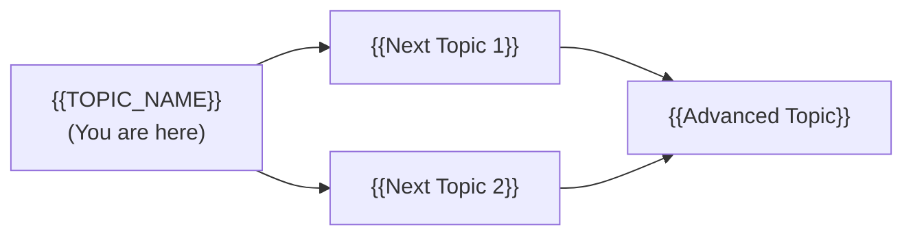
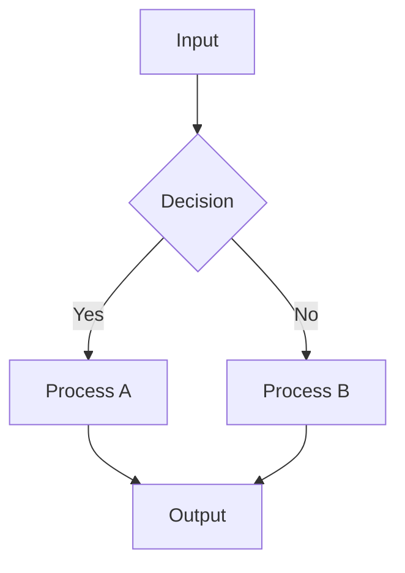
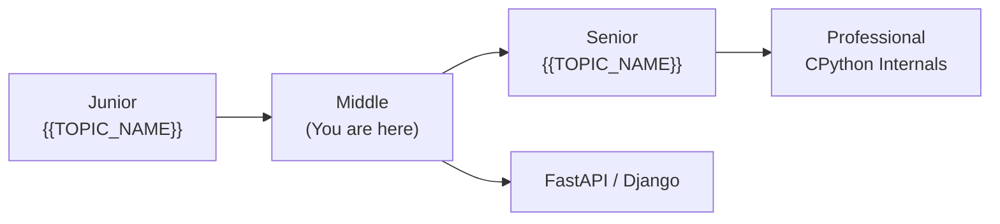
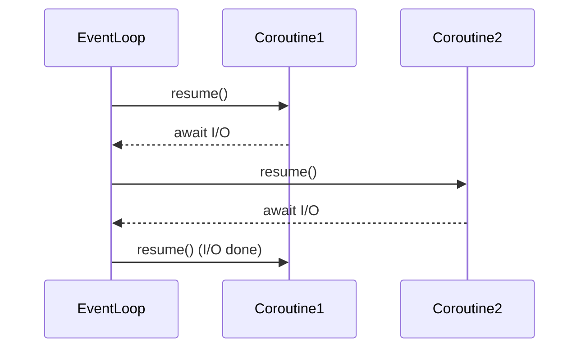
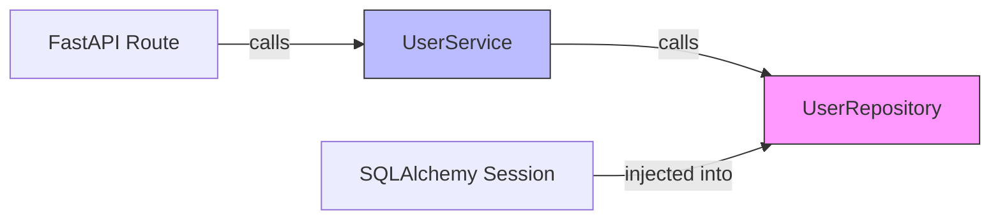
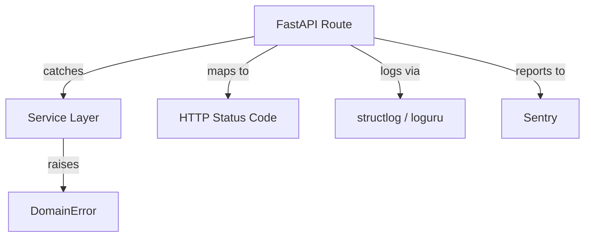
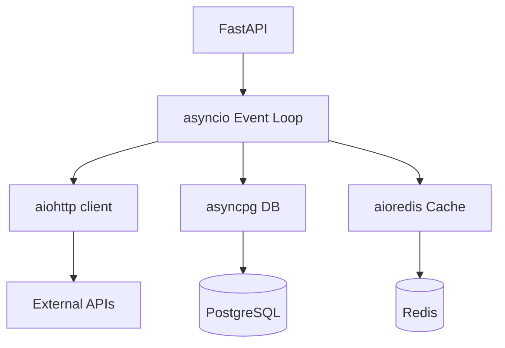
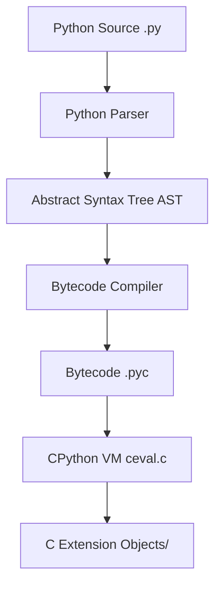
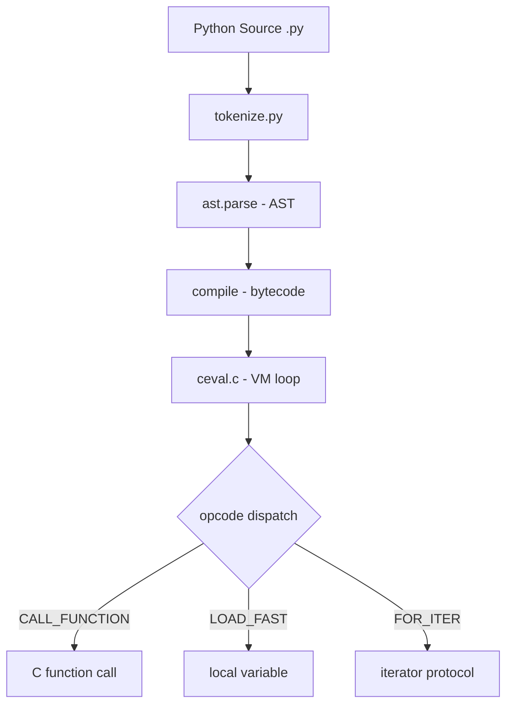

# Python Roadmap — Universal Template

> **A comprehensive template system for generating Python roadmap content across all skill levels.**

---

## Overview

| | Description |
|---|---|
| **Purpose** | Universal template for all Python roadmap topics |
| **Files per topic** | 9 files: `junior.md`, `middle.md`, `senior.md`, `professional.md`, `interview.md`, `tasks.md`, `find-bug.md`, `optimize.md`, `specification.md` |
| **Language** | All content must be generated in **English** |
| **Table of Contents** | **Optional** — include only if relevant to the topic. For theory/practice files (`tasks.md`, `find-bug.md`, `optimize.md`) it is NOT required |

### Topic Structure

```
XX-topic-name/
├── junior.md          ← "What?" and "How?"
├── middle.md          ← "Why?" and "When?"
├── senior.md          ← "How to optimize?" and "How to architect?"
├── professional.md    ← "Under the Hood" — CPython, GIL, bytecode level
├── interview.md       ← Interview prep across all levels
├── tasks.md           ← Hands-on practice tasks
├── find-bug.md        ← Find and fix bugs in code (10+ exercises)
├── optimize.md        ← Optimize slow/inefficient code (10+ exercises)
└── specification.md   ← Official spec / documentation deep-dive
```

### Python Roadmap Topics (from roadmap.sh)

**Learn the Basics:** Basic Syntax, Variables and Data Types, Conditionals, Loops, Type Casting, Exceptions, Functions (Builtin Functions), Modules

**Data Structures:** Lists, Tuples, Sets, Dictionaries, Arrays and Linked Lists, Hash Tables, Heaps/Stacks/Queues, Binary Search Tree, Sorting Algorithms, Recursion

**Advanced Language Features:** List Comprehensions, Generator Expressions, Context Manager, Lambda, Decorators, Iterators, Regular Expressions, Classes, Inheritance, Methods (Dunder), Modules (Builtin / Custom)

**Type System:** typing module, mypy, pyright, pyre, Pydantic, dataclasses

**Package Managers:** pip, PyPI, pyproject.toml, Conda, uv, Poetry, Pipenv, virtualenv, pyenv, Common Packages

**Paradigms:** Object Oriented Programming, Functional Programming

**Asynchrony:** Synchronous, Asynchronous, GIL, Threading, Multiprocessing, asyncio, Synchronous + Asynchronous

**Web Frameworks:** Django, Flask, FastAPI, Pyramid, Tornado, Sanic

**Testing:** pytest, unittest/pyUnit, doctest, tox, nose

**Code Formatting:** black, ruff, yapf

**Documentation:** Sphinx

---

## Level Comparison Matrix

| Aspect | Junior | Middle | Senior | Professional |
|:------:|:------:|:------:|:------:|:------------:|
| **Depth** | Basic syntax, simple scripts | Practical usage, real-world patterns | Architecture, performance profiling | CPython bytecode, GIL internals, memory |
| **Code** | Script-level | Production-ready with type hints | Advanced patterns, asyncio architecture | `dis` module, CPython source analysis |
| **Tricky Points** | Indentation, mutable defaults | GIL, late binding closures | Async architecture, profiling | CPython source, reference counting, GC |
| **Focus** | "What?" and "How?" | "Why?" and "When?" | "How to improve?" | "What happens under the hood?" |

---
---

# TEMPLATE 1 — `junior.md`

<details open>
<summary><strong>Template Content</strong></summary>

# {{TOPIC_NAME}} — Junior Level

<!-- Table of Contents is OPTIONAL. Include only if the topic has many sections and it helps navigation. Remove this section entirely if not needed. -->

## Table of Contents

1. [Introduction](#introduction)
2. [Prerequisites](#prerequisites)
3. [Glossary](#glossary)
4. [Core Concepts](#core-concepts)
5. [Pros & Cons](#pros--cons)
6. [Use Cases](#use-cases)
7. [Code Examples](#code-examples)
8. [Product Use / Feature](#product-use--feature)
9. [Error Handling](#error-handling)
10. [Security Considerations](#security-considerations)
11. [Performance Tips](#performance-tips)
12. [Metrics & Analytics](#metrics--analytics)
13. [Best Practices](#best-practices)
14. [Edge Cases & Pitfalls](#edge-cases--pitfalls)
15. [Common Mistakes](#common-mistakes)
16. [Tricky Points](#tricky-points)
17. [Test](#test)
18. [Tricky Questions](#tricky-questions)
19. [Cheat Sheet](#cheat-sheet)
20. [Summary](#summary)
21. [What You Can Build](#what-you-can-build)
22. [Further Reading](#further-reading)
23. [Related Topics](#related-topics)
24. [Diagrams & Visual Aids](#diagrams--visual-aids)

---

## Introduction

> Focus: "What is it?" and "How to use it?"

Brief explanation of what {{TOPIC_NAME}} is and why a beginner needs to know it.
Keep it simple — assume the reader has basic programming knowledge but is new to Python.

---

## Prerequisites

What you should know before studying this topic:

- **Required:** {{concept 1}} — brief explanation of why
- **Required:** {{concept 2}} — brief explanation of why
- **Helpful but not required:** {{concept 3}}

> List 2-4 prerequisites. Include pip/virtual environment setup where relevant.

---

## Glossary

Key terms used in this topic:

| Term | Definition |
|------|-----------|
| **{{Term 1}}** | Simple, one-sentence definition |
| **{{Term 2}}** | Simple, one-sentence definition |
| **{{Term 3}}** | Simple, one-sentence definition |

> 5-10 terms. Keep definitions beginner-friendly.

---

## Core Concepts

### Concept 1: {{name}}

Simple explanation with analogy if helpful.

### Concept 2: {{name}}

...

> **Rules:**
> - Each concept should be explained in 3-5 sentences max.
> - Use bullet points for lists.
> - Include small code snippets inline where needed.

---

## Real-World Analogies

Everyday analogies to help you understand {{TOPIC_NAME}} intuitively:

| Concept | Analogy |
|---------|--------|
| **{{Concept 1}}** | {{Analogy — e.g., "A list is like a shopping cart — you add and remove items freely"}} |
| **{{Concept 2}}** | {{Analogy — e.g., "A dictionary is like a real dictionary — look up a word (key) to get its definition (value)"}} |
| **{{Concept 3}}** | {{Analogy}} |

> 2-4 analogies. Use everyday objects and situations.

---

## Mental Models

How to picture {{TOPIC_NAME}} in your head:

**The intuition:** {{A simple mental model — e.g., "Think of a Python function as a recipe — it takes ingredients (parameters) and produces a dish (return value)."}}

**Why this model helps:** {{Why visualizing it this way prevents common mistakes}}

---

## Pros & Cons

| Pros | Cons |
|------|------|
| {{Advantage 1}} | {{Disadvantage 1}} |
| {{Advantage 2}} | {{Disadvantage 2}} |
| {{Advantage 3}} | {{Disadvantage 3}} |

### When to use:
- {{Scenario where this approach shines}}

### When NOT to use:
- {{Scenario where another approach is better}}

---

## Use Cases

When and where you would use this in real projects:

- **Use Case 1:** Description — e.g., "Building a Flask/FastAPI REST endpoint"
- **Use Case 2:** Description
- **Use Case 3:** Description

---

## Code Examples

### Example 1: {{title}}

```python
# Full working example with comments


def main():
    print("Hello, World!")


if __name__ == "__main__":
    main()
```

**What it does:** Brief explanation of what happens.
**How to run:** `python main.py` or `python -m module_name`
**Setup:** `pip install {{package}}` if needed

### Example 2: {{title}}

```python
# Another practical example
```

> **Rules:**
> - Every example must be runnable.
> - Add comments explaining each important line.
> - Show `pip install` commands where external packages are needed.
> - Use type hints where beneficial.

---

## Clean Code

Basic clean code principles when working with {{TOPIC_NAME}} in Python:

### Naming (PEP 8 conventions)

```python
# ❌ Bad
def D(X):
    return X * 2

MaxRetries = 3
class userData: pass

# ✅ Clean Python naming
def double_value(n):
    return n * 2

MAX_RETRIES = 3
class UserData: pass
```

**Python naming rules:**
- Functions and variables: `snake_case` (`user_count`, `is_valid`)
- Constants: `UPPER_SNAKE_CASE` (`MAX_RETRIES`, `DEFAULT_TIMEOUT`)
- Classes: `PascalCase` (`UserService`, `HttpClient`)
- Private members: leading underscore (`_internal_helper`)

---

### Short Functions

```python
# ❌ Too long — parse + validate + save in one function
def process_user(data: str) -> None:
    # 60 lines of mixed logic
    ...

# ✅ Each function does one thing
def parse_user(data: str) -> dict: ...
def validate_user(user: dict) -> None: ...
def save_user(user: dict) -> None: ...
```

---

### Docstrings

```python
# ❌ Noise — restates the code
def get_user(user_id):
    # get user
    ...

# ✅ Explains purpose, parameters, and return value
def get_user(user_id: int) -> dict:
    """Retrieve a user by their unique ID.

    Args:
        user_id: The user's database ID (must be positive).

    Returns:
        A dict with user data, or None if not found.

    Raises:
        ValueError: If user_id is not positive.
    """
    ...
```

> Show Python-specific naming conventions (snake_case, UPPER_CASE, PascalCase). Keep examples simple.

---

## Product Use / Feature

How this topic is used in real-world products and tools:

### 1. {{Product/Tool Name}}

- **How it uses {{TOPIC_NAME}}:** Brief description
- **Why it matters:** Practical impact

### 2. {{Product/Tool Name}}

- **How it uses {{TOPIC_NAME}}:** Brief description
- **Why it matters:** Practical impact

### 3. {{Product/Tool Name}}

- **How it uses {{TOPIC_NAME}}:** Brief description
- **Why it matters:** Practical impact

> 3-5 real products/tools.

---

## Error Handling

How to handle errors when working with {{TOPIC_NAME}}:

### Error 1: {{Common exception type}}

```python
# Code that produces this exception
```

**Why it happens:** Simple explanation.
**How to fix:**

```python
# Corrected code with proper exception handling
try:
    result = risky_operation()
except SpecificError as e:
    print(f"Error: {e}")
```

### Error 2: {{Another common exception}}

...

### Exception Handling Pattern

```python
# Recommended exception handling pattern for this topic
try:
    result = some_function()
except ValueError as e:
    logger.error("Invalid value: %s", e)
    raise
except Exception as e:
    logger.exception("Unexpected error")
    raise RuntimeError("Operation failed") from e
finally:
    # cleanup if needed
    pass
```

> 2-4 common exceptions. Show the error, explain why, and provide the fix.
> Teach Python exception chaining with `raise ... from e`.

---

## Security Considerations

Security aspects to keep in mind when using {{TOPIC_NAME}}:

### 1. {{Security concern}}

```python
# ❌ Insecure
...

# ✅ Secure
...
```

**Risk:** What could go wrong.
**Mitigation:** How to protect against it.

### 2. {{Another security concern}}

...

> 2-4 security considerations. Focus on: input validation, `eval()` dangers, pickle safety, path traversal.

---

## Performance Tips

Basic performance considerations for {{TOPIC_NAME}}:

### Tip 1: {{Performance optimization}}

```python
# ❌ Slow approach
...

# ✅ Faster approach
...
```

**Why it's faster:** Simple explanation

### Tip 2: {{Another tip}}

...

> 2-4 tips. Mention list comprehensions vs loops, generators vs lists where relevant.

---

## Metrics & Analytics

Key metrics to track when using {{TOPIC_NAME}}:

### What to Measure

| Metric | Why it matters | Tool |
|--------|---------------|------|
| **{{metric 1}}** | {{reason}} | `time`, `cProfile` |
| **{{metric 2}}** | {{reason}} | `memory_profiler` |

### Basic Instrumentation

```python
import time
import logging

logger = logging.getLogger(__name__)

start = time.perf_counter()
result = some_operation()
elapsed = time.perf_counter() - start
logger.info("{{topic}} completed in %.3fs", elapsed)
```

---

## Best Practices

- **Do this:** Explanation
- **Do this:** Explanation
- **Do this:** Explanation

> 3-5 best practices. Reference PEP 8 and PEP 20 (The Zen of Python) where relevant.

---

## Edge Cases & Pitfalls

### Pitfall 1: {{name}}

```python
# Code that demonstrates the pitfall
```

**What happens:** Explanation of unexpected behavior.
**How to fix:** Corrected code or approach.

### Pitfall 2: Mutable default argument

```python
# ❌ Classic Python pitfall
def append_item(item, lst=[]):  # mutable default — shared across calls!
    lst.append(item)
    return lst

# ✅ Correct idiom
def append_item(item, lst=None):
    if lst is None:
        lst = []
    lst.append(item)
    return lst
```

---

## Common Mistakes

### Mistake 1: {{description}}

```python
# ❌ Wrong way
...

# ✅ Correct way
...
```

### Mistake 2: {{description}}

...

> 3-5 mistakes junior Python developers commonly make.

---

## Common Misconceptions

### Misconception 1: "{{False belief}}"

**Reality:** {{What's actually true}}

**Why people think this:** {{Why this misconception is common}}

### Misconception 2: "{{Another false belief}}"

**Reality:** {{What's actually true}}

---

## Tricky Points

### Tricky Point 1: {{name}}

```python
# Code that might surprise a junior
```

**Why it's tricky:** Explanation.
**Key takeaway:** One-line lesson.

---

## Test

### Multiple Choice

**1. {{Question}}?**

- A) Option A
- B) Option B
- C) Option C
- D) Option D

<details>
<summary>Answer</summary>
**C)** — Explanation why C is correct and why others are wrong.
</details>

### True or False

**3. {{Statement}}**

<details>
<summary>Answer</summary>
**False** — Explanation.
</details>

### What's the Output?

**4. What does this code print?**

```python
# code snippet
```

<details>
<summary>Answer</summary>
Output: `...`
Explanation: ...
</details>

> 5-8 test questions total.

---

## "What If?" Scenarios

**What if {{Unexpected situation}}?**
- **You might think:** {{Intuitive but wrong answer}}
- **But actually:** {{Correct behavior and why}}

---

## Tricky Questions

**1. {{Confusing question}}?**

- A) {{Looks correct but wrong}}
- B) {{Correct answer}}
- C) {{Common misconception}}
- D) {{Partially correct}}

<details>
<summary>Answer</summary>
**B)** — Explanation of why the "obvious" answers are wrong.
</details>

---

## Cheat Sheet

Quick reference for this topic:

| What | Syntax / Command | Example |
|------|-----------------|---------|
| {{Action 1}} | `{{syntax}}` | `{{example}}` |
| {{Action 2}} | `{{syntax}}` | `{{example}}` |
| {{Action 3}} | `{{syntax}}` | `{{example}}` |

---

## Self-Assessment Checklist

### I can explain:
- [ ] What {{TOPIC_NAME}} is and why it exists in Python
- [ ] When to use it and when NOT to use it
- [ ] {{Specific concept 1}} in my own words

### I can do:
- [ ] Write a basic example from scratch
- [ ] Set up a virtual environment and install dependencies
- [ ] Debug simple errors related to this topic

---

## Summary

- Key point 1
- Key point 2
- Key point 3

**Next step:** What to learn after this topic.

---

## What You Can Build

### Projects you can create:
- **{{Project 1}}:** Brief description — uses {{specific concept from this topic}}
- **{{Project 2}}:** Brief description — combines with Flask/FastAPI
- **{{Project 3}}:** Brief description — practical automation tool

### Technologies / tools that use this:
- **Django / FastAPI** — how knowing {{TOPIC_NAME}} helps
- **pandas / NumPy** — what becomes possible after learning this
- **{{Technology 3}}** — career opportunity unlocked

### Learning path:



---

## Further Reading

- **Official docs:** [Python Docs](https://docs.python.org/3/)
- **PEP:** [{{PEP number and title}}]({{url}}) — brief description
- **Blog post:** [{{link title}}]({{url}}) — what you'll learn
- **Book chapter:** Fluent Python (Ramalho), Chapter X — what it covers

---

## Related Topics

- **[{{Related Topic 1}}](../XX-related-topic/)** — how it connects
- **[{{Related Topic 2}}](../XX-related-topic/)** — how it connects

---

## Diagrams & Visual Aids

> Include **at least 2-3 visual aids** per document.

### Mind Map

```mermaid
mindmap
  root(({{TOPIC_NAME}}))
    Core Concept 1
      Sub-concept A
      Sub-concept B
    Core Concept 2
      Sub-concept C
      Sub-concept D
    Related Topics
      {{Related 1}}
      {{Related 2}}
```

### Visual Type Reference

| Visual Type | Best For | Syntax |
|:----------:|:--------:|:------:|
| **Mermaid Flowchart** | Processes, workflows | `graph TD` / `graph LR` |
| **Mermaid Sequence** | Request/response flows | `sequenceDiagram` |
| **Mermaid Class** | Class hierarchies | `classDiagram` |
| **ASCII Diagram** | Memory layouts | Box-drawing characters |
| **Comparison Table** | Feature comparisons | Markdown table |

### Example — Python Call Flow



### Example — Python Memory Model

```
+------------------+
|   Python Heap    |
|------------------|
|  PyObject        |  <- ob_refcnt: 3
|  ob_type: int    |  <- pointer to type object
|  ob_ival: 42     |  <- actual value
+------------------+
```

</details>

---
---

# TEMPLATE 2 — `middle.md`

<details open>
<summary><strong>Template Content</strong></summary>

# {{TOPIC_NAME}} — Middle Level

## Table of Contents

1. [Introduction](#introduction)
2. [Core Concepts](#core-concepts)
3. [Pros & Cons](#pros--cons)
4. [Use Cases](#use-cases)
5. [Code Examples](#code-examples)
6. [Product Use / Feature](#product-use--feature)
7. [Error Handling](#error-handling)
8. [Security Considerations](#security-considerations)
9. [Performance Optimization](#performance-optimization)
10. [Metrics & Analytics](#metrics--analytics)
11. [Debugging Guide](#debugging-guide)
12. [Best Practices](#best-practices)
13. [Edge Cases & Pitfalls](#edge-cases--pitfalls)
14. [Common Mistakes](#common-mistakes)
15. [Tricky Points](#tricky-points)
16. [Comparison with Other Languages](#comparison-with-other-languages)
17. [Test](#test)
18. [Tricky Questions](#tricky-questions)
19. [Cheat Sheet](#cheat-sheet)
20. [Summary](#summary)
21. [What You Can Build](#what-you-can-build)
22. [Further Reading](#further-reading)
23. [Related Topics](#related-topics)
24. [Diagrams & Visual Aids](#diagrams--visual-aids)

---

## Introduction

> Focus: "Why?" and "When to use?"

Assumes the reader already knows Python basics. This level covers:
- Deeper understanding of how {{TOPIC_NAME}} works in CPython
- Real-world patterns with decorators, context managers, async/await, dataclasses, type hints
- Production considerations

---

## Core Concepts

### Concept 1: {{Advanced concept}}


### Concept 2: {{Another concept}}

- How it relates to decorators, context managers, or async/await
- CPython behavior differences
- Performance implications (GIL consideration)

> Go deeper than junior. Explain "why" not just "what".
> Cover decorators, context managers, async/await, dataclasses, type hints at this level.

---

## Evolution & Historical Context

Why does {{TOPIC_NAME}} exist? What problem does it solve?

**Before {{TOPIC_NAME}}:**
- How developers solved this problem in older Python (2.x / early 3.x)
- The pain points

**How {{TOPIC_NAME}} changed things:**
- The shift introduced (e.g., asyncio replacing threads for I/O-bound work)
- Why it became the standard

> Mention relevant PEP numbers — Python's design decisions are well-documented in PEPs.

---

## Pros & Cons

| Pros | Cons |
|------|------|
| {{Advantage 1 with production context}} | {{Disadvantage 1 with impact analysis}} |
| {{Advantage 2}} | {{Disadvantage 2}} |
| {{Advantage 3}} | {{Disadvantage 3}} |

### Trade-off analysis:

- **{{Trade-off 1}}:** When {{advantage}} outweighs {{disadvantage}}
- **{{Trade-off 2}}:** GIL implications for CPU-bound vs I/O-bound work

---

## Alternative Approaches (Plan B)

| Alternative | How it works | When you might be forced to use it |
|-------------|--------------|------------------------------------|
| **{{Alternative 1}}** | {{Brief explanation}} | {{e.g., "If GIL prevents true parallelism"}} |
| **{{Alternative 2}}** | {{Brief explanation}} | {{e.g., "If you need C extension performance"}} |

---

## Use Cases

Real-world, production scenarios:

- **Use Case 1:** {{FastAPI/Django production scenario}}
- **Use Case 2:** {{Data processing with pandas}}
- **Use Case 3:** {{Async I/O with asyncio/aiohttp}}

---

## Code Examples

### Example 1: {{Production-ready pattern with type hints}}

```python
from typing import Optional, List
import logging

logger = logging.getLogger(__name__)


def process_{{topic}}(
    items: List[str],
    limit: Optional[int] = None,
) -> List[str]:
    """
    Process items with production-ready error handling.

    Args:
        items: List of items to process
        limit: Optional maximum number of results

    Returns:
        Processed items

    Raises:
        ValueError: If items is empty
    """
    if not items:
        raise ValueError("items cannot be empty")

    # Production-quality implementation
    ...
```

**Why this pattern:** Explanation of design decisions including type hints.
**Trade-offs:** What you gain and what you sacrifice.

### Example 2: {{Decorator / Context Manager / Async pattern}}

```python
# Using decorators, context managers, or async/await
```

---

## Clean Code

Production-level clean code for {{TOPIC_NAME}} in Python:

### Naming & Readability

```python
# ❌ Cryptic function
def proc(d: bytes, f: bool) -> bytes: ...

# ✅ Self-documenting
def compress_payload(input_data: bytes, include_checksum: bool) -> bytes: ...
```

| Element | Python Rule | Example |
|---------|-------------|---------|
| Functions | verb + noun, snake_case | `fetch_user_by_id`, `validate_token` |
| Abstract base classes | noun (what it IS) | `UserStore`, `PaymentGateway` |
| Exceptions | descriptive, `Error` suffix | `UserNotFoundError`, `ValidationError` |
| Booleans | `is_/has_/can_` | `is_expired`, `has_permission` |

---

### SOLID in Python

**Interface Segregation (via ABC and duck typing):**
```python
from abc import ABC, abstractmethod

# ❌ Fat abstract class
class UserService(ABC):
    @abstractmethod
    def save(self, user): ...
    @abstractmethod
    def find_by_id(self, id): ...
    @abstractmethod
    def send_email(self, user, msg): ...  # wrong! email != user service

# ✅ Segregated ABCs — Python duck typing does the rest
class UserWriter(ABC):
    @abstractmethod
    def save(self, user: dict) -> None: ...

class UserReader(ABC):
    @abstractmethod
    def find_by_id(self, user_id: int) -> dict: ...
```

**Dependency Inversion:**
```python
# ❌ Depends on concrete implementation
class OrderService:
    def __init__(self):
        self.repo = PostgresUserRepository()  # hard-coded

# ✅ Depends on abstraction — inject at construction
class OrderService:
    def __init__(self, repo: UserReader) -> None:
        self.repo = repo
```

---

### DRY in Python

```python
# ❌ Repeated validation — copy-paste across functions
def create_user(name: str, email: str) -> None:
    if not name: raise ValueError("name required")
    if not email: raise ValueError("email required")
    ...

def update_user(name: str, email: str) -> None:
    if not name: raise ValueError("name required")   # copy-paste
    if not email: raise ValueError("email required")  # copy-paste
    ...

# ✅ Extract into reusable validator (or use a decorator)
def _validate_user_input(name: str, email: str) -> None:
    if not name: raise ValueError("name required")
    if not email: raise ValueError("email required")
```

---

### Python-Specific Smells

```python
# ❌ Using class when a function is enough
class Doubler:
    def double(self, x: int) -> int:
        return x * 2

# ✅ Just use a function
def double(x: int) -> int:
    return x * 2

# ❌ Mutable default argument — shared across all calls
def append_item(item, lst=[]):
    lst.append(item)
    return lst

# ✅ Use None sentinel
def append_item(item, lst=None):
    if lst is None:
        lst = []
    lst.append(item)
    return lst
```

> Focus on Python-specific: duck typing, ABC for interfaces, DRY via decorators and mixins, avoiding class overuse.

---

## Product Use / Feature

### 1. {{Product/Tool Name}}

- **How it uses {{TOPIC_NAME}}:** Description
- **Scale:** Numbers, requests, data volume

> 3-5 real products. Focus on Django, FastAPI, pandas, asyncio ecosystem.

---

## Error Handling

Production-grade exception handling for {{TOPIC_NAME}}:

### Pattern 1: {{Exception hierarchy}}

```python
class {{DomainError}}(Exception):
    """Base exception for {{domain}} operations."""

    def __init__(self, message: str, code: str = "UNKNOWN"):
        super().__init__(message)
        self.code = code


class {{SpecificError}}({{DomainError}}):
    """Raised when {{specific condition}}."""
    pass
```

### Pattern 2: {{Context manager for resource cleanup}}

```python
from contextlib import contextmanager

@contextmanager
def managed_{{resource}}():
    resource = acquire_{{resource}}()
    try:
        yield resource
    except Exception as e:
        logger.error("Error with {{resource}}: %s", e)
        raise
    finally:
        release_{{resource}}(resource)
```

### Common Exception Patterns

| Situation | Pattern | Example |
|-----------|---------|---------|
| Exception chaining | `raise NewError(...) from original` | Preserve context |
| Context manager | `with open(...) as f:` | Auto-cleanup |
| Custom exception | Subclass `Exception` | Domain-specific |
| Logging + re-raise | `logger.exception(...)` then `raise` | Observability |

---

## Security Considerations

### 1. {{Security concern}}

```python
# ❌ Vulnerable code
...

# ✅ Secure code
...
```

### Security Checklist

- [ ] Never use `eval()` on untrusted input
- [ ] Never `pickle.loads()` from untrusted source
- [ ] Use `secrets` module for cryptographic randomness (not `random`)
- [ ] Validate and sanitize all user inputs
- [ ] Use `pathlib.Path` to prevent path traversal

---

## Performance Optimization

### Optimization 1: List comprehension vs loop

```python
# ❌ Slow — explicit loop
result = []
for x in range(10000):
    if x % 2 == 0:
        result.append(x * x)

# ✅ Faster — list comprehension (C-level loop)
result = [x * x for x in range(10000) if x % 2 == 0]
```

**Benchmark results:**
```
# timeit results
Slow loop:          2.34ms ± 0.05ms
List comprehension: 1.12ms ± 0.02ms  (2.1x faster)
Generator (lazy):   1.08ms ± 0.01ms  (use when not all values needed)
```

### Optimization 2: {{name}}

```python
# ❌ Slow
...

# ✅ Fast
...
```

### Performance Decision Matrix

| Scenario | Approach | Why |
|----------|----------|-----|
| CPU-bound | `multiprocessing` / NumPy | Bypasses GIL |
| I/O-bound | `asyncio` / `threading` | GIL released during I/O |
| Large datasets | Generators / pandas | Lazy evaluation / vectorized |

> Python GIL: threads don't give true CPU parallelism for pure Python code.
> Use `multiprocessing` for CPU-bound, `asyncio`/`threading` for I/O-bound.

---

## Metrics & Analytics

### Key Metrics

| Metric | Type | Description | Tool |
|--------|------|-------------|------|
| **{{metric 1}}** | Counter | {{what it counts}} | Prometheus/statsd |
| **{{metric 2}}** | Gauge | {{what it measures}} | Micrometer Python |

### Prometheus Instrumentation

```python
from prometheus_client import Counter, Histogram, start_http_server

{{topic}}_ops = Counter(
    "{{topic}}_operations_total",
    "Total number of {{topic}} operations",
    ["status"],
)
{{topic}}_duration = Histogram(
    "{{topic}}_duration_seconds",
    "Duration of {{topic}} operations",
)

# Usage
with {{topic}}_duration.time():
    result = perform_{{topic}}()
{{topic}}_ops.labels(status="success").inc()
```

---

## Debugging Guide

### Problem 1: {{Common symptom}}

**Diagnostic steps:**
```bash
# Profile with cProfile
python -m cProfile -s cumulative script.py

# Memory profiling
pip install memory-profiler
python -m memory_profiler script.py

# Line-by-line profiling
pip install line_profiler
kernprof -l -v script.py

# Live profiling with py-spy
pip install py-spy
py-spy top --pid <PID>
```

### Useful Tools

| Tool | Command | What it shows |
|------|---------|---------------|
| `cProfile` | `python -m cProfile -s cumulative script.py` | CPU hotspots |
| `memory_profiler` | `python -m memory_profiler script.py` | Line-by-line memory |
| `py-spy` | `py-spy top --pid <PID>` | Live CPU profiling |
| `pdb` | `python -m pdb script.py` | Step-by-step debugging |
| `ipdb` | `import ipdb; ipdb.set_trace()` | IPython debugger |

---

## Best Practices

- **Practice 1:** Use type hints (PEP 484) for all public APIs
- **Practice 2:** Use `dataclasses` or `Pydantic` models for structured data
- **Practice 3:** Prefer `pathlib.Path` over `os.path` string manipulation

> 5-7 practices. Reference relevant PEPs.

---

## Edge Cases & Pitfalls

### Pitfall 1: Late binding closures

```python
# ❌ Classic Python closure pitfall
functions = [lambda: i for i in range(5)]
# All functions return 4 (last value of i)

# ✅ Correct — capture value at creation time
functions = [lambda i=i: i for i in range(5)]
```

### Pitfall 2: {{Concurrency/GIL pitfall}}

...

---

## Common Mistakes

### Mistake 1: {{Middle-level mistake}}

```python
# ❌ Looks correct but has subtle issues
...

# ✅ Properly handles edge cases
...
```

---

## Anti-Patterns

### Anti-Pattern 1: {{Name of anti-pattern}}

```python
# ❌ The Anti-Pattern
...
```

**Why it's bad:** How it causes pain later.
**The refactoring:** What to use instead.

---

## Tricky Points

### Tricky Point 1: {{Subtle CPython behavior}}

```python
# Code with non-obvious behavior
```

**What actually happens:** Step-by-step explanation.
**Why:** Reference to CPython implementation or Python data model.

---

## Comparison with Other Languages

How Python handles {{TOPIC_NAME}} compared to other languages:

| Aspect | Python | R | JavaScript/Node.js | Julia | Go |
|--------|--------|---|-------------------|-------|-----|
| {{Aspect 1}} | {{Python approach}} | {{R approach}} | {{JS approach}} | {{Julia approach}} | {{Go approach}} |
| {{Aspect 2}} | ... | ... | ... | ... | ... |

### Key differences:

- **Python vs R:** {{Python's general-purpose vs R's statistical focus}}
- **Python vs JavaScript/Node.js:** {{Python's synchronous model vs Node's event loop}}
- **Python vs Julia:** {{Python's GIL vs Julia's true parallelism for numerical computing}}

---

## Test

### Multiple Choice (harder)

**1. {{Question involving GIL, closures, or generators}}?**

- A) ...
- B) ...
- C) ...
- D) ...

<details>
<summary>Answer</summary>
**B)** — Detailed explanation.
</details>

### Code Analysis

**2. What does this generator produce?**

```python
# generator code
```

<details>
<summary>Answer</summary>
Explanation of lazy evaluation behavior.
</details>

---

## Cheat Sheet

| Scenario | Pattern | Key consideration |
|----------|---------|-------------------|
| Lazy iteration | `(x for x in ...)` | Generator, not list |
| Class with state | `@dataclass` | Auto `__init__`, `__repr__` |
| Context cleanup | `@contextmanager` | Use `try/finally` |
| Async I/O | `async def` + `await` | Must be in event loop |

---

## Self-Assessment Checklist

### I can explain:
- [ ] How decorators work at the function object level
- [ ] When to use generators vs lists
- [ ] GIL implications for threading vs multiprocessing

### I can do:
- [ ] Write a decorator from scratch
- [ ] Use context managers with `with` statement
- [ ] Write async functions with `asyncio`
- [ ] Add type hints and run `mypy`

---

## Summary

- Key insight 1
- Key insight 2 (GIL awareness)
- Key insight 3

**Next step:** What to explore at Senior level.

---

## What You Can Build

### Production systems:
- **{{System 1}}:** FastAPI service using {{specific pattern}}
- **{{System 2}}:** Async data pipeline using asyncio + {{TOPIC_NAME}}

### Learning path:



---

## Further Reading

- **Official docs:** [Python Docs](https://docs.python.org/3/)
- **PEP:** [{{PEP number}}]({{url}}) — motivation and design
- **Book:** Fluent Python (Ramalho), 2nd edition — relevant chapter
- **Talk:** [{{title}}]({{url}}) — PyCon, key takeaways

---

## Related Topics

- **[{{Related Topic 1}}](../XX-related-topic/)** — how it connects
- **[{{Related Topic 2}}](../XX-related-topic/)** — how it connects

---

## Diagrams & Visual Aids

> Include **at least 2-3 visual aids** per document.

### Example — Async Event Loop



</details>

---
---

# TEMPLATE 3 — `senior.md`

<details open>
<summary><strong>Template Content</strong></summary>

# {{TOPIC_NAME}} — Senior Level

## Table of Contents

1. [Introduction](#introduction)
2. [Core Concepts](#core-concepts)
3. [Pros & Cons](#pros--cons)
4. [Use Cases](#use-cases)
5. [Code Examples](#code-examples)
6. [Product Use / Feature](#product-use--feature)
7. [Error Handling](#error-handling)
8. [Security Considerations](#security-considerations)
9. [Performance Optimization](#performance-optimization)
10. [Metrics & Analytics](#metrics--analytics)
11. [Debugging Guide](#debugging-guide)
12. [Best Practices](#best-practices)
13. [Edge Cases & Pitfalls](#edge-cases--pitfalls)
14. [Common Mistakes](#common-mistakes)
15. [Tricky Points](#tricky-points)
16. [Comparison with Other Languages](#comparison-with-other-languages)
17. [Test](#test)
18. [Tricky Questions](#tricky-questions)
19. [Cheat Sheet](#cheat-sheet)
20. [Summary](#summary)
21. [What You Can Build](#what-you-can-build)
22. [Further Reading](#further-reading)
23. [Related Topics](#related-topics)
24. [Diagrams & Visual Aids](#diagrams--visual-aids)

---

## Introduction

> Focus: "How to optimize?" and "How to architect?"

For Python developers who:
- Design async architectures (asyncio, aiohttp, FastAPI at scale)
- Profile and optimize Python performance (GIL implications, NumPy vectorization)
- Architect large-scale Python systems
- Mentor junior/middle developers

> Senior Python topics include: GIL implications and workarounds, async architecture, performance profiling (`cProfile`, `py-spy`), large-scale Python (`__slots__`, object graphs, garbage collection), C extensions (ctypes, Cython, pybind11).

---

## Core Concepts

### Concept 1: {{Architecture-level concept}}

Deep dive with:
- Design patterns in Python (Protocol, ABC, factory, registry)
- GIL and concurrency model implications
- Performance characteristics

```python
# Advanced pattern with detailed annotations
from typing import Protocol, runtime_checkable


@runtime_checkable
class {{TopicProtocol}}(Protocol):
    def process(self, data: bytes) -> bytes:
        ...
```

### Concept 2: {{Optimization concept}}

```python
import timeit

# Benchmark setup
setup = "..."
slow_code = "..."
fast_code = "..."

slow_time = timeit.timeit(slow_code, setup=setup, number=10000)
fast_time = timeit.timeit(fast_code, setup=setup, number=10000)
print(f"Speedup: {slow_time/fast_time:.2f}x")
```

---

## Pros & Cons

### Strategic analysis:

| Pros | Cons | Impact |
|------|------|--------|
| {{Advantage 1}} | {{Disadvantage 1 — GIL or performance}} | {{Impact on architecture}} |
| {{Advantage 2}} | {{Disadvantage 2}} | {{Impact on team/maintenance}} |

### Real-world decision examples:
- **{{Company X}}** chose {{approach}} because {{reasoning}}
- **Instagram/Dropbox** chose {{approach}} for Python at scale

---

## Use Cases

- **Use Case 1:** {{Async architecture at scale}}
- **Use Case 2:** {{NumPy vectorization for data processing}}
- **Use Case 3:** {{Large-scale Python service with profiling}}

---

## Code Examples

### Example 1: {{Architecture pattern}}

```python
# Full implementation of a production pattern
# With dependency injection, async context, proper typing
```

### Example 2: {{Performance optimization}}

```python
# Before optimization — GIL-contended / slow
...

# After optimization — NumPy vectorized / async / multiprocessing
...
```

> Show real optimization techniques: `__slots__`, NumPy vectorization, asyncio task batching.

---

## Clean Code

Senior-level clean code — architecture and team standards for {{TOPIC_NAME}} in Python:

### Clean Architecture in Python

```python
# ❌ FastAPI route directly queries DB
@app.get("/users/{user_id}")
async def get_user(user_id: int, db: Session = Depends(get_db)):
    return db.query(User).filter(User.id == user_id).first()

# ✅ Clean layer separation
class UserRepository:
    def __init__(self, db: Session) -> None:
        self.db = db
    def find_by_id(self, user_id: int) -> User | None:
        return self.db.query(User).filter(User.id == user_id).first()

class UserService:
    def __init__(self, repo: UserRepository) -> None:
        self.repo = repo
    def get_user(self, user_id: int) -> User:
        user = self.repo.find_by_id(user_id)
        if not user:
            raise UserNotFoundError(f"User {user_id} not found")
        return user

@app.get("/users/{user_id}")
async def get_user(user_id: int, svc: UserService = Depends(get_user_service)):
    return svc.get_user(user_id)
```



---

### Python Code Smells

| Smell | Python Example | Fix |
|-------|---------------|-----|
| **God module** | `utils.py` with 2000 lines of mixed logic | Split into focused modules |
| **Bare `except`** | `except: pass` | Catch specific exceptions with logging |
| **Mutable default args** | `def f(x=[])` | Use `None` sentinel |
| **`print()` in production** | `print("debug:", value)` | Use `logging` module |
| **Over-engineering with classes** | Stateless class with one method | Use a plain function |

---

### Package Design Rules

```
# ❌ Flat structure — hard to navigate at scale
my_app/
  utils.py          # 3000 lines: DB, HTTP, strings, math
  models.py         # all models in one file
  views.py          # all views/routes in one file

# ✅ Feature-first, cohesive packages
my_app/
  users/
    __init__.py
    router.py       # FastAPI/Django routes
    service.py      # business logic
    repository.py   # data access
    schemas.py      # Pydantic models
  orders/
    __init__.py
    router.py
    service.py
```

**Python package rules:**
- Use relative imports within a package, absolute imports across packages
- `__init__.py` should expose only the public API — keep internals private
- Avoid `from module import *` — makes dependencies invisible

---

### Code Review Checklist (Python Senior)

- [ ] No business logic in route handlers / views
- [ ] All function signatures have type hints (PEP 484)
- [ ] No mutable default arguments
- [ ] Resources managed with `with` statement (context managers)
- [ ] `logging` used instead of `print()`
- [ ] No bare `except:` clauses
- [ ] Pydantic or dataclasses used for structured data (not plain dicts)

---

## Best Practices

Python best practices for {{TOPIC_NAME}} — from production Python codebases at scale:

### Must Do ✅

1. **Use type hints (PEP 484) in all function signatures**
   ```python
   # ✅ Self-documenting, works with mypy
   def get_user(user_id: int) -> User | None:
       ...

   def process_items(items: list[str], max_count: int = 100) -> dict[str, int]:
       ...
   ```

2. **Prefer dataclasses or Pydantic over plain dicts for structured data**
   ```python
   # ❌ Opaque dict — no validation, no autocomplete
   user = {"name": "Alice", "age": 30}

   # ✅ Pydantic model — validated, typed, serializable
   from pydantic import BaseModel

   class User(BaseModel):
       name: str
       age: int

   user = User(name="Alice", age=30)
   ```

3. **Use context managers (`with`) for all resource management**
   ```python
   # ✅ File always closed, even on exception
   with open(filepath, "r", encoding="utf-8") as f:
       content = f.read()

   # ✅ DB session always committed/rolled back
   with db.begin():
       db.add(new_user)
   ```

4. **Avoid mutable default arguments**
   ```python
   # ❌ Bug — list shared across all calls
   def add_tag(item: str, tags: list = []) -> list:
       tags.append(item)
       return tags

   # ✅ None sentinel pattern
   def add_tag(item: str, tags: list | None = None) -> list:
       if tags is None:
           tags = []
       tags.append(item)
       return tags
   ```

5. **Use `logging` module, never `print()` in production**
   ```python
   import logging
   logger = logging.getLogger(__name__)

   # ✅ Structured, configurable, filterable
   logger.info("User %s created successfully", user_id)
   logger.error("Failed to process order %s: %s", order_id, exc, exc_info=True)
   ```

### Never Do ❌

1. **Never use bare `except:`** — catches `SystemExit`, `KeyboardInterrupt`, everything
   ```python
   # ❌ Hides all errors silently
   try:
       risky_operation()
   except:
       pass

   # ✅ Catch specific exceptions with context
   try:
       risky_operation()
   except ValueError as e:
       logger.error("Invalid input: %s", e)
       raise
   ```

2. **Never use `from module import *`** — pollutes namespace, hides dependencies

3. **Never hardcode secrets** — use environment variables or a secrets manager

4. **Never mutate function arguments** — causes surprising side effects for callers

### Project-Level Best Practices

| Area | Rule | Reason |
|------|------|--------|
| **Code organization** | Feature-first packages | High cohesion, navigable at scale |
| **Type safety** | Type hints + mypy in CI | Catch bugs before runtime |
| **Testing** | pytest + hypothesis for property tests | Thorough, pythonic |
| **Performance** | Profile with `cProfile` before optimizing | Avoid premature optimization |
| **Async** | `asyncio` for I/O-bound, `multiprocessing` for CPU-bound | Correct concurrency model |
| **Dependencies** | Pin versions in `requirements.txt` or `pyproject.toml` | Reproducible builds |

### Python Production Checklist

- [ ] All function signatures have type hints; `mypy --strict` passes
- [ ] No `print()` statements — structured logging with `logging` module
- [ ] All resources managed with context managers (`with`)
- [ ] No mutable default arguments in any function
- [ ] No bare `except:` clauses
- [ ] `ruff` or `flake8` passes with zero warnings
- [ ] All secrets from environment variables (`.env` via `python-dotenv` or similar)
- [ ] Tests cover happy path, edge cases, and error paths

> Every best practice must be {{TOPIC_NAME}}-specific, not generic.

---

## Product Use / Feature

### 1. {{Company/Product Name}}

- **Architecture:** How they implement {{TOPIC_NAME}} in Python at scale
- **GIL strategy:** How they handle concurrency (asyncio vs multiprocessing)
- **Lessons learned:** What they changed and why

> 3-5 real-world examples. Reference Instagram Engineering, Dropbox Tech Blog, Spotify Backend.

---

## Error Handling

Enterprise-grade exception handling for {{TOPIC_NAME}}:

### Strategy 1: {{Structured exception hierarchy}}

```python
from dataclasses import dataclass
from typing import Optional, Any, Dict


@dataclass
class {{DomainError}}(Exception):
    message: str
    code: str
    metadata: Optional[Dict[str, Any]] = None

    def __str__(self) -> str:
        return f"[{self.code}] {self.message}"
```

### Error Handling Architecture



---

## Security Considerations

### 1. {{Critical security concern}}

**OWASP category:** {{relevant category}}

```python
# ❌ Vulnerable
...

# ✅ Secure
...
```

### Security Architecture Checklist

- [ ] Input validation with Pydantic models at API boundaries
- [ ] Never use `eval()` / `exec()` on user input
- [ ] `pickle` only from trusted sources — use `json` for untrusted data
- [ ] Use `secrets.token_urlsafe()` for tokens
- [ ] Dependency auditing with `pip-audit` or `safety`
- [ ] SQL injection prevention — use SQLAlchemy ORM or parameterized queries

---

## Performance Optimization

### Optimization 1: `__slots__` for memory reduction

```python
# Without __slots__ — each instance has __dict__
class RegularPoint:
    def __init__(self, x: float, y: float):
        self.x = x
        self.y = y

# With __slots__ — no __dict__, fixed memory layout
class SlottedPoint:
    __slots__ = ("x", "y")

    def __init__(self, x: float, y: float):
        self.x = x
        self.y = y
```

**Memory comparison:**
```python
import sys
regular = RegularPoint(1.0, 2.0)
slotted = SlottedPoint(1.0, 2.0)
print(sys.getsizeof(regular))  # ~48 bytes + __dict__ overhead
print(sys.getsizeof(slotted))  # ~56 bytes (no __dict__)
# At scale (1M objects): ~200MB vs ~56MB
```

### Optimization 2: NumPy vectorization

```python
import numpy as np

# ❌ Slow — pure Python loop
def slow_sum_squares(n: int) -> float:
    return sum(i * i for i in range(n))

# ✅ Fast — NumPy vectorized (C-level BLAS operations)
def fast_sum_squares(n: int) -> float:
    arr = np.arange(n, dtype=np.float64)
    return np.dot(arr, arr)
```

### Optimization 3: asyncio vs threading

```python
import asyncio
import aiohttp

# ✅ Async I/O — GIL released, concurrent without threads
async def fetch_all(urls: list[str]) -> list[dict]:
    async with aiohttp.ClientSession() as session:
        tasks = [fetch(session, url) for url in urls]
        return await asyncio.gather(*tasks)
```

### Performance Architecture

| Layer | Optimization | Impact | Cost |
|:-----:|:------------|:------:|:----:|
| **Algorithm** | Better complexity | Highest | Requires redesign |
| **NumPy** | Vectorization | Very High | Moderate |
| **async/await** | I/O concurrency | High | Moderate |
| **`__slots__`** | Memory reduction | Medium | Low |
| **multiprocessing** | CPU parallelism | High | Requires serialization |

---

## Metrics & Analytics

### SLO / SLA Definition

| SLI | SLO Target | Measurement |
|-----|-----------|-------------|
| **{{availability}}** | 99.9% | 30 days |
| **{{latency p99}}** | < {{Xms}} | 5 min rolling |

### Observability Stack

```python
# structlog for structured logging
import structlog

log = structlog.get_logger()
log.info("{{topic}}_processed", count=len(items), duration_ms=elapsed_ms)

# prometheus_client for metrics
from prometheus_client import Counter, Histogram, start_http_server

{{topic}}_ops = Counter("{{topic}}_ops_total", "Operations", ["status"])
{{topic}}_latency = Histogram("{{topic}}_latency_seconds", "Latency")
```

---

## Debugging Guide

Advanced debugging for Python at scale:

### Problem 1: {{Production issue}}

**Diagnostic steps:**
```bash
# py-spy for live profiling (no code changes needed)
py-spy top --pid <PID>
py-spy record -o profile.svg --pid <PID>

# Memory leak detection
pip install objgraph
python -c "import objgraph; objgraph.show_most_common_types(limit=20)"

# GIL contention analysis
py-spy record -e cpu --gil --pid <PID>
```

### Advanced Tools

| Tool | Use case | When to use |
|------|----------|-------------|
| `py-spy` | Live CPU profiling (no restart) | Performance issues in production |
| `memory_profiler` | Line-by-line memory | Memory leaks |
| `objgraph` | Object reference graphs | GC and cycle detection |
| `asyncio debug mode` | `PYTHONASYNCIODEBUG=1` | Async bugs |
| `pdb` / `ipdb` | Step-through debugging | Logic bugs |

---

## Best Practices

- **Practice 1:** Type hints + mypy/pyright for large codebases
- **Practice 2:** Use Pydantic v2 for data validation at API boundaries
- **Practice 3:** Prefer `asyncio` for I/O-bound, `multiprocessing` for CPU-bound
- **Practice 4:** Use `__slots__` for high-frequency small objects

---

## Edge Cases & Pitfalls

### Pitfall 1: asyncio blocking the event loop

```python
# ❌ Blocks the event loop — everything stops
async def bad_handler():
    time.sleep(10)  # blocking call in async context!

# ✅ Use asyncio.sleep or run_in_executor
async def good_handler():
    await asyncio.sleep(10)  # non-blocking
    # For blocking I/O:
    await asyncio.get_event_loop().run_in_executor(None, blocking_function)
```

---

## Postmortems & System Failures

### The {{Company/System}} Incident

- **The goal:** {{What they were trying to achieve}}
- **The mistake:** {{Python-specific misuse — GIL, blocking call, memory leak}}
- **The impact:** {{Degraded performance / OOM}}
- **The fix:** {{How they solved it}}

---

## Comparison with Other Languages

| Aspect | Python | R | JavaScript/Node.js | Julia | Go |
|--------|:------:|:--:|:-----------------:|:-----:|:---:|
| {{Aspect 1}} | {{approach}} | {{approach}} | {{approach}} | {{approach}} | {{approach}} |

### Architectural trade-offs:

- **Python vs R:** Python is general-purpose; R excels at statistical computing and visualization
- **Python vs Node.js:** Python's GIL vs Node.js's single-threaded event loop — both avoid true parallelism for pure logic
- **Python vs Julia:** Julia offers true parallelism and JIT speed for numerical code; Python has ecosystem breadth

---

## Test

### Architecture Questions

**1. Your Python service handles 10K concurrent API requests. The response time is 300ms per request. Should you use threads, asyncio, or multiprocessing?**

<details>
<summary>Answer</summary>
If the bottleneck is I/O (DB queries, HTTP calls): use asyncio (FastAPI + asyncpg). GIL is released during I/O so threading also works but asyncio is more efficient. Multiprocessing is for CPU-bound work only.
</details>

---

## Cheat Sheet

### Python Concurrency Decision Matrix

| Workload | Solution | Why |
|----------|----------|-----|
| I/O-bound (async) | `asyncio` / FastAPI | GIL released, high concurrency |
| I/O-bound (simple) | `threading` | Simpler than asyncio for legacy code |
| CPU-bound | `multiprocessing` / `concurrent.futures` | Bypasses GIL |
| Numerical | NumPy / Cython | C-level execution |

### Performance Quick Wins

| Optimization | When to apply | Expected improvement |
|-------------|---------------|---------------------|
| List comprehension | Loops building lists | 2x |
| `__slots__` | Many small objects | 3-5x memory |
| NumPy vectorization | Numerical loops | 10-100x |
| asyncio | I/O-bound concurrency | 10x throughput |
| `lru_cache` | Repeated pure function calls | Very high |

---

## Self-Assessment Checklist

### I can architect:
- [ ] Design async Python services at scale
- [ ] Choose between asyncio, threading, and multiprocessing correctly
- [ ] Profile Python code and identify GIL bottlenecks

### I can optimize:
- [ ] Use `py-spy` without restarting the process
- [ ] Apply NumPy vectorization
- [ ] Reduce memory with `__slots__`

---

## Summary

- Key async architecture insight
- Key GIL and concurrency insight
- Key profiling and performance insight

---

## Further Reading

- **PEP:** [PEP 492 — Coroutines with async/await](https://peps.python.org/pep-0492/)
- **Book:** Fluent Python (Ramalho), 2nd edition — Part V: Metaprogramming
- **Talk:** [{{PyCon talk about Python performance}}]({{url}})
- **Blog:** [Instagram Engineering Python](https://instagram-engineering.com/)

---

## Diagrams & Visual Aids

> Include **at least 2-3 visual aids** per document.

### Python Async Architecture



</details>

---
---

# TEMPLATE 4 — `professional.md`

<details open>
<summary><strong>Template Content</strong></summary>

# {{TOPIC_NAME}} — Under the Hood

## Table of Contents

1. [Introduction](#introduction)
2. [How It Works Internally](#how-it-works-internally)
3. [CPython Bytecode](#cpython-bytecode)
4. [GIL Internals](#gil-internals)
5. [Memory Management](#memory-management)
6. [CPython Source Walkthrough](#cpython-source-walkthrough)
7. [Performance Internals](#performance-internals)
8. [Edge Cases at the Lowest Level](#edge-cases-at-the-lowest-level)
9. [Test](#test)
10. [Tricky Questions](#tricky-questions)
11. [Summary](#summary)
12. [Further Reading](#further-reading)
13. [Diagrams & Visual Aids](#diagrams--visual-aids)

---

## Introduction

> Focus: "What happens under the hood?"

This document explores what CPython does internally when you use {{TOPIC_NAME}}.
For developers who want to understand:
- What bytecode the Python compiler generates (`dis` module)
- How the GIL affects this feature
- How reference counting and cyclic GC manage memory
- How the CPython source code implements it

---

## How It Works Internally

Step-by-step breakdown of what happens when CPython executes {{feature}}:

1. **Source code** → What you write in `.py`
2. **AST** → Abstract Syntax Tree (`ast` module)
3. **Bytecode** → Compiled to `.pyc` (`dis` module shows this)
4. **CPython VM** → Stack-based virtual machine executes bytecode
5. **C code** → Most builtins are implemented in C (`Objects/`, `Python/`)



---

## CPython Bytecode

What CPython bytecode is generated for {{TOPIC_NAME}}:

```python
import dis

def example_function():
    # Python code using {{TOPIC_NAME}}
    pass

dis.dis(example_function)
```

```
# dis.dis() output — annotated
  2           0 LOAD_FAST                0 ({{variable}})
              2 {{INSTRUCTION}}          {{operand}}
              4 {{INSTRUCTION}}          {{operand}}
              6 RETURN_VALUE
```

**What to look for:**
- `LOAD_FAST` / `LOAD_GLOBAL` — variable lookup cost
- `CALL_FUNCTION` / `CALL_METHOD` — function call overhead
- `BUILD_LIST` / `BUILD_DICT` — collection creation
- `FOR_ITER` — loop iteration (GIL released per iteration for some types)

```python
# Inspect bytecode programmatically
import dis
import opcode

code = example_function.__code__
print(f"Stack size: {code.co_stacksize}")
print(f"Constants: {code.co_consts}")
print(f"Local variables: {code.co_varnames}")
```

---

## GIL Internals

How the Global Interpreter Lock affects {{TOPIC_NAME}}:

### What the GIL Is

```
CPython GIL Implementation (simplified):
┌─────────────────────────────────┐
│  Thread 1 (holds GIL)           │  ← executing Python bytecode
│  Thread 2 (waiting for GIL)     │  ← blocked on gil_cond
│  Thread 3 (waiting for GIL)     │  ← blocked on gil_cond
└─────────────────────────────────┘

GIL is released:
- Every 5ms (sys.getswitchinterval())
- During I/O operations (open, socket, etc.)
- During C extension calls that explicitly release it (e.g., NumPy)
```

### GIL Behavior with {{TOPIC_NAME}}

```python
import sys
print(sys.getswitchinterval())  # 0.005 (5ms) — GIL switch interval

# Check if GIL is released:
# I/O operations: YES (GIL released)
# Pure Python computation: NO (GIL held for 5ms slices)
# NumPy operations: YES (releases GIL for BLAS calls)
```

**GIL implications for {{TOPIC_NAME}}:**
- Is GIL released during this operation?
- Is this feature safe for multithreading?
- When does `threading` help vs `multiprocessing`?

---

## Memory Management

How CPython manages {{TOPIC_NAME}}-related objects:

### Reference Counting

```python
import sys

obj = [1, 2, 3]
print(sys.getrefcount(obj))  # includes the argument reference

# When refcount reaches 0 → immediate deallocation
# (except circular references)
```

### Cyclic Garbage Collector

```python
import gc

# Enable GC debug
gc.set_debug(gc.DEBUG_LEAK)

# Force collection
gc.collect()

# Check for uncollectable objects
print(gc.garbage)
```

**Memory Layout of Python Objects:**

```
CPython PyObject structure (64-bit):
┌──────────────────┐
│ ob_refcnt (8B)   │  ← reference count
│ ob_type  (8B)    │  ← pointer to type object
├──────────────────┤
│ object-specific  │  ← depends on type
│ fields           │
└──────────────────┘

PyListObject:
┌──────────────────┐
│ ob_refcnt (8B)   │
│ ob_type  (8B)    │
│ ob_size  (8B)    │  ← current length
│ ob_item  (8B)    │  ← pointer to array of PyObject*
│ allocated (8B)   │  ← allocated capacity
└──────────────────┘
```

---

## CPython Source Walkthrough

Walking through the actual CPython source code:

**File:** `Objects/{{object_type}}object.c`

```c
// Annotated excerpt from CPython source code
// with explanation of what the C code does
```

**File:** `Python/ceval.c` — the main bytecode interpreter loop

> Reference specific CPython version (e.g., CPython 3.12).
> Source: https://github.com/python/cpython

---

## Performance Internals

### Profiling with `dis` and `cProfile`

```python
import cProfile
import pstats
import io

# Profile execution
profiler = cProfile.Profile()
profiler.enable()
# ... code to profile ...
profiler.disable()

# Print results
stream = io.StringIO()
stats = pstats.Stats(profiler, stream=stream)
stats.sort_stats("cumulative")
stats.print_stats(20)
print(stream.getvalue())
```

**Internal performance characteristics:**
- Bytecode instruction count
- Refcount operations (overhead for immutable objects)
- GC generation pressure
- `__dict__` lookup cost vs `__slots__`

---

## Metrics & Analytics (CPython Level)

### CPython Runtime Metrics

```python
import gc
import sys
import tracemalloc

# Memory tracking
tracemalloc.start()
# ... code ...
snapshot = tracemalloc.take_snapshot()
top_stats = snapshot.statistics("lineno")
for stat in top_stats[:10]:
    print(stat)

# GC statistics
print(gc.get_count())     # (gen0, gen1, gen2) collection counts
print(gc.get_threshold()) # collection thresholds
print(gc.get_stats())     # detailed per-generation stats

# Reference counts
print(sys.getrefcount(some_object))
```

### Key CPython Metrics for This Feature

| Metric | What it measures | Impact of {{TOPIC_NAME}} |
|--------|-----------------|--------------------------|
| `gc.get_count()` | GC collection frequency | {{how this feature affects it}} |
| `tracemalloc` | Memory allocations by line | {{how this feature affects it}} |
| `sys.getrefcount()` | Reference count pressure | {{how this feature affects it}} |

---

## Edge Cases at the Lowest Level

### Edge Case 1: {{name}}

What happens internally when {{extreme scenario}}:

```python
# Code that pushes CPython limits
```

**Internal behavior:** What CPython does (refcount, GIL, GC).
**Why it matters:** Impact on production Python services.

---

## Test

### Internal Knowledge Questions

**1. What bytecode instruction does Python generate when you access a local variable?**

<details>
<summary>Answer</summary>
`LOAD_FAST` — accesses the local variable array directly without dict lookup, which is why local variables are faster than global variables in Python.
</details>

**2. What does this `dis.dis()` output tell you?**

```
# dis output snippet
```

<details>
<summary>Answer</summary>
Analysis of the bytecode instructions.
</details>

> 5-8 questions. Require knowledge of CPython bytecode, GIL, or reference counting.

---

## Tricky Questions

**1. {{Question about CPython internal behavior that contradicts common assumptions}}?**

<details>
<summary>Answer</summary>
Explanation with proof (`dis` output, `gc.get_count()`, or CPython source reference).
</details>

> 3-5 questions. Should require reading CPython source or using `dis`/`tracemalloc` to answer definitively.

---

## Self-Assessment Checklist

### I can explain internals:
- [ ] What bytecode CPython generates for this feature (`dis.dis()`)
- [ ] How the GIL affects this feature
- [ ] Memory management: reference counting and cyclic GC
- [ ] Relevant CPython C source file and function

### I can analyze:
- [ ] Read and understand `dis.dis()` output
- [ ] Use `tracemalloc` to trace memory allocations
- [ ] Interpret `cProfile` and `py-spy` flamegraphs
- [ ] Use `gc.get_stats()` to detect GC pressure

### I can prove:
- [ ] Back claims with `timeit` and `memory_profiler` evidence
- [ ] Reference CPython source code (github.com/python/cpython)
- [ ] Demonstrate GIL behavior with threading experiments

---

## Summary

- CPython bytecode insight 1 (`dis` analysis)
- GIL insight 2 (thread safety and concurrency)
- Memory management insight 3 (refcount + cyclic GC)

**Key takeaway:** Understanding CPython internals helps you write faster, more memory-efficient Python and avoid subtle bugs from GIL and reference cycles.

---

## Further Reading

- **CPython source:** [Objects/{{file}}.c](https://github.com/python/cpython/blob/main/Objects/{{file}}.c)
- **PEP:** [{{PEP number}}]({{url}}) — internal design decision
- **Book:** "CPython Internals" (Anthony Shaw) — chapter on {{topic}}
- **Talk:** [{{talk about CPython internals}}]({{url}}) — PyCon

---

## Diagrams & Visual Aids

> Include **at least 2-3 visual aids** per document.

### CPython Execution Pipeline



### CPython Memory Model

```
┌─────────────────────────────────┐
│     CPython Memory              │
├─────────────────────────────────┤
│  PyObject pool (small ints,     │
│  interned strings, None, etc.)  │
├─────────────────────────────────┤
│  Heap objects                   │  ← managed by refcounting + GC
│  (lists, dicts, user objects)   │
├─────────────────────────────────┤
│  pymalloc arenas                │  ← CPython's own allocator
│  (256B blocks → 8 pools)        │
├─────────────────────────────────┤
│  C stack (per thread)           │  ← C-level call stack
└─────────────────────────────────┘
```

</details>

---
---

# TEMPLATE 5 — `interview.md`

<details open>
<summary><strong>Template Content</strong></summary>

# {{TOPIC_NAME}} — Interview Questions

## Table of Contents

1. [Junior Level](#junior-level)
2. [Middle Level](#middle-level)
3. [Senior Level](#senior-level)
4. [Scenario-Based Questions](#scenario-based-questions)
5. [FAQ](#faq)

---

## Junior Level

### 1. {{Basic Python question}}?

**Answer:**
Clear, concise explanation with a simple Python example.

```python
# Simple illustrative example
```

---

> 5-7 junior questions. Test Python basics, pip, virtual environments, basic I/O.

---

## Middle Level

### 4. {{Question about decorators, generators, or async}}?

**Answer:**
Detailed answer with real-world context.

```python
# Code example showing intermediate Python pattern
```

---

> 4-6 middle questions. Test decorators, context managers, async/await, type hints.

---

## Senior Level

### 7. {{GIL or async architecture question}}?

**Answer:**
Comprehensive answer covering GIL implications, asyncio vs threading vs multiprocessing.

---

> 4-6 senior questions. Test GIL, async architecture, performance profiling.

---

## Scenario-Based Questions

### 10. Your Python service is consuming too much memory and eventually crashes with OOM. How do you investigate?

**Answer:**
1. Use `tracemalloc` to identify memory growth by line
2. Check for reference cycles with `objgraph`
3. Profile with `memory_profiler` decorator
4. Look for large caches or lists that grow unbounded
5. Consider `__slots__` for high-frequency objects
6. Use `gc.collect()` and check `gc.garbage` for uncollectable cycles

---

## FAQ

### Q: What is the GIL and why does Python have it?

**A:** The Global Interpreter Lock (GIL) is a mutex in CPython that prevents multiple threads from executing Python bytecode simultaneously. It exists to protect CPython's non-thread-safe internal data structures (reference counts). This simplifies CPython's implementation but limits CPU parallelism for CPU-bound multi-threaded code. Workarounds: `multiprocessing` (bypasses GIL), `asyncio` (I/O-bound concurrency), NumPy (releases GIL for BLAS).

### Q: What do interviewers look for when asking about {{TOPIC_NAME}}?

**A:** Key evaluation criteria:
- **Junior:** Can write the syntax and explain what it does
- **Middle:** Understands decorators/generators/async patterns and when to use them
- **Senior:** Understands GIL implications, CPython memory model, profiling strategies

</details>

---
---

# TEMPLATE 6 — `tasks.md`

<details open>
<summary><strong>Template Content</strong></summary>

# {{TOPIC_NAME}} — Practical Tasks

## Table of Contents

1. [Junior Tasks](#junior-tasks)
2. [Middle Tasks](#middle-tasks)
3. [Senior Tasks](#senior-tasks)
4. [Questions](#questions)
5. [Mini Projects](#mini-projects)
6. [Challenge](#challenge)

---

## Junior Tasks

### Task 1: {{Simple coding task title}}

**Type:** 💻 Code

**Goal:** {{What skill this practices}}

**Starter code:**

```python
# TODO: Complete this


def main():
    pass


if __name__ == "__main__":
    main()
```

**Expected output:**
```
...
```

**Evaluation criteria:**
- [ ] Code runs without errors
- [ ] Output matches expected
- [ ] Follows PEP 8 style
- [ ] {{Specific check}}

---

### Task 2: {{Simple design task title}}

**Type:** 🎨 Design

**Goal:** {{What design skill this practices}}

**Deliverable:** {{Diagram, flowchart, API sketch}}

---

> 3-4 junior tasks. Mix of 💻 Code and 🎨 Design tasks.

---

## Middle Tasks

### Task 4: {{FastAPI/Django production-oriented task}}

**Type:** 💻 Code

**Requirements:**
- [ ] {{Requirement 1}}
- [ ] Write pytest tests
- [ ] Add type hints
- [ ] Use Pydantic for data validation

---

## Senior Tasks

### Task 7: {{Async architecture or performance task}}

**Type:** 💻 Code

**Requirements:**
- [ ] {{High-level requirement}}
- [ ] Profile with `cProfile` or `py-spy`
- [ ] Document GIL strategy (threading vs asyncio vs multiprocessing)

---

## Questions

### 1. {{Conceptual Python question}}?

**Answer:**
Clear explanation covering the key Python concept.

---

> 5-10 questions. Mix of GIL, async, decorators, and memory questions.

---

## Mini Projects

### Project 1: {{Larger Python project combining concepts}}

**Goal:** {{What this project teaches end-to-end}}

**Requirements:**
- [ ] {{Feature 1}}
- [ ] pytest tests with >80% coverage
- [ ] Type hints throughout
- [ ] README with setup and usage

**Difficulty:** Junior / Middle / Senior
**Estimated time:** X hours

---

## Challenge

### {{Competitive/Hard Python challenge}}

**Problem:** {{Difficult problem statement}}

**Constraints:**
- Must complete under X ms
- Memory usage under X MB
- No C extensions beyond stdlib

**Scoring:**
- Correctness: 50%
- Performance (timeit): 30%
- Code quality (ruff/mypy): 20%

</details>

---
---

# TEMPLATE 7 — `find-bug.md`

<details open>
<summary><strong>Template Content</strong></summary>

# {{TOPIC_NAME}} — Find the Bug

> **Practice finding and fixing bugs in Python code related to {{TOPIC_NAME}}.**
> Each exercise contains buggy code — your job is to find the bug, explain why it happens, and fix it.

---

## How to Use

1. Read the buggy code carefully
2. Try to find the bug **without** looking at the hint
3. Write the fix yourself before checking the solution
4. Understand **why** the bug happens — not just how to fix it

### Difficulty Levels

| Level | Description |
|:-----:|:-----------|
| 🟢 | **Easy** — Common beginner mistakes, NameError, TypeError, indentation |
| 🟡 | **Medium** — Mutable default arguments, late binding closures, GIL-related |
| 🔴 | **Hard** — Reference cycles, integer overflow edge cases, async pitfalls |

---

> **Language-specific bugs for Python topics:**
> - Mutable default argument (shared state across calls)
> - Late binding in closures (all lambdas capture same variable)
> - GIL-related race condition (threading on shared mutable state)
> - Integer arithmetic: Python integers are arbitrary precision, but division (`/`) always returns float
> - `is` vs `==` for identity vs equality
> - Forgetting `await` in async functions (returns coroutine, not result)
> - Modifying a list while iterating over it
> - Accidental variable shadowing in nested scopes

---

## Bug 1: {{Bug title}} 🟢

**What the code should do:** {{Expected behavior}}

```python
# Buggy code here
# The bug should be realistic and related to {{TOPIC_NAME}}


def buggy_function():
    pass


print(buggy_function())
```

**Expected output:**
```
...
```

**Actual output:**
```
...
```

<details>
<summary>💡 Hint</summary>

Look at {{specific area}} — what happens when {{condition}}?

</details>

<details>
<summary>🐛 Bug Explanation</summary>

**Bug:** {{What exactly is wrong}}
**Why it happens:** {{Root cause — reference to Python data model or CPython behavior}}
**Impact:** {{Wrong output, NameError, TypeError, unexpected behavior, etc.}}

</details>

<details>
<summary>✅ Fixed Code</summary>

```python
# Fixed code with comments explaining the fix


def fixed_function():
    pass


print(fixed_function())
```

**What changed:** {{One-line summary of the fix}}

</details>

---

## Bug 2: {{Bug title}} 🟢

```python
# Buggy code
```

<details>
<summary>💡 Hint</summary>
...
</details>

<details>
<summary>🐛 Bug Explanation</summary>

**Bug:** ...
**Why it happens:** ...
**Impact:** ...

</details>

<details>
<summary>✅ Fixed Code</summary>

```python
# Fixed code
```

**What changed:** ...

</details>

---

## Bug 3: {{Bug title}} 🟢

```python
# Buggy code
```

<details>
<summary>💡 Hint</summary>
...
</details>

<details>
<summary>🐛 Bug Explanation</summary>

**Bug:** ...
**Why it happens:** ...

</details>

<details>
<summary>✅ Fixed Code</summary>

```python
# Fixed code
```

**What changed:** ...

</details>

---

## Bug 4: {{Bug title}} 🟡

**What the code should do:** {{Expected behavior}}

```python
# Buggy code — mutable default argument or late binding closure
```

<details>
<summary>💡 Hint</summary>
...
</details>

<details>
<summary>🐛 Bug Explanation</summary>

**Bug:** ...
**Why it happens:** ...
**Impact:** ...

</details>

<details>
<summary>✅ Fixed Code</summary>

```python
# Fixed code
```

**What changed:** ...

</details>

---

## Bug 5: {{Bug title}} 🟡

```python
# Buggy code — late binding in closures
funcs = [lambda: i for i in range(5)]
print(funcs[0]())  # should print 0, prints 4
```

<details>
<summary>💡 Hint</summary>
Closures in Python capture variables by reference, not by value at creation time.
</details>

<details>
<summary>🐛 Bug Explanation</summary>

**Bug:** All lambda functions capture the same variable `i`, which has value 4 after the loop completes.
**Why it happens:** Python closures use late binding — the variable is looked up at call time.
**Impact:** All functions return the last value of the loop variable.

</details>

<details>
<summary>✅ Fixed Code</summary>

```python
# Fixed — capture value at creation with default argument
funcs = [lambda i=i: i for i in range(5)]
print(funcs[0]())  # prints 0
```

**What changed:** Added `i=i` as a default argument to capture the current value.

</details>

---

## Bug 6: {{Bug title}} 🟡

```python
# Buggy code — real-world Django/FastAPI pattern with a bug
```

<details>
<summary>💡 Hint</summary>
...
</details>

<details>
<summary>🐛 Bug Explanation</summary>

**Bug:** ...
**Why it happens:** ...

</details>

<details>
<summary>✅ Fixed Code</summary>

```python
# Fixed code
```

**What changed:** ...

</details>

---

## Bug 7: {{Bug title}} 🟡

```python
# Buggy code — threading race condition or GIL-related
```

<details>
<summary>💡 Hint</summary>
...
</details>

<details>
<summary>🐛 Bug Explanation</summary>

**Bug:** ...
**Why it happens:** ...
**Impact:** ...

</details>

<details>
<summary>✅ Fixed Code</summary>

```python
# Fixed code
```

**What changed:** ...

</details>

---

## Bug 8: {{Bug title}} 🔴

**What the code should do:** {{Expected behavior}}

```python
# Buggy code — hard to spot
# Reference cycle, async bug, or subtle CPython behavior
```

**Expected output:**
```
...
```

**Actual output:**
```
... (or: memory leak / MemoryError / wrong async result)
```

<details>
<summary>💡 Hint</summary>

Use `tracemalloc` to detect memory growth or `gc.get_count()` to detect GC pressure.

</details>

<details>
<summary>🐛 Bug Explanation</summary>

**Bug:** ...
**Why it happens:** ...
**Impact:** ...
**Python reference:** {{CPython data model or relevant PEP}}

</details>

<details>
<summary>✅ Fixed Code</summary>

```python
# Fixed code with detailed comments
```

**What changed:** ...
**Alternative fix:** {{Another valid approach}}

</details>

---

## Bug 9: {{Bug title}} 🔴

```python
# Buggy code — async pitfall (missing await, event loop blocking)
```

<details>
<summary>💡 Hint</summary>
...
</details>

<details>
<summary>🐛 Bug Explanation</summary>

**Bug:** ...
**Why it happens:** ...
**How to detect:** `PYTHONASYNCIODEBUG=1 python script.py`

</details>

<details>
<summary>✅ Fixed Code</summary>

```python
# Fixed code
```

**What changed:** ...

</details>

---

## Bug 10: {{Bug title}} 🔴

```python
# Buggy code — the hardest one
# Multiple subtle issues or a very tricky Python behavior
```

<details>
<summary>💡 Hint</summary>
...
</details>

<details>
<summary>🐛 Bug Explanation</summary>

**Bug:** ...
**Why it happens:** ...

</details>

<details>
<summary>✅ Fixed Code</summary>

```python
# Fixed code
```

**What changed:** ...

</details>

---

## Score Card

| Bug | Difficulty | Found without hint? | Understood why? | Fixed correctly? |
|:---:|:---------:|:-------------------:|:---------------:|:----------------:|
| 1 | 🟢 | ☐ | ☐ | ☐ |
| 2 | 🟢 | ☐ | ☐ | ☐ |
| 3 | 🟢 | ☐ | ☐ | ☐ |
| 4 | 🟡 | ☐ | ☐ | ☐ |
| 5 | 🟡 | ☐ | ☐ | ☐ |
| 6 | 🟡 | ☐ | ☐ | ☐ |
| 7 | 🟡 | ☐ | ☐ | ☐ |
| 8 | 🔴 | ☐ | ☐ | ☐ |
| 9 | 🔴 | ☐ | ☐ | ☐ |
| 10 | 🔴 | ☐ | ☐ | ☐ |

> **Rules for content generation:**
> - Bugs specific to Python: mutable defaults, late binding closures, GIL races, integer overflow edge cases, missing await
> - Buggy code must run (no SyntaxError) — the bug is in logic or runtime behavior
> - Hard bugs should involve: reference cycles, async event loop blocking, tracemalloc-detectable memory leaks

</details>

---
---

# TEMPLATE 8 — `optimize.md`

<details open>
<summary><strong>Template Content</strong></summary>

# {{TOPIC_NAME}} — Optimize the Code

> **Practice optimizing slow, inefficient, or resource-heavy Python code related to {{TOPIC_NAME}}.**
> Each exercise contains working but suboptimal code — your job is to make it faster, leaner, or more efficient.

---

## How to Use

1. Read the slow code and understand what it does
2. Identify the performance bottleneck
3. Write your optimized version
4. Compare with the solution using `timeit` and `memory_profiler`
5. Understand **why** the optimization works

### Difficulty Levels

| Level | Focus |
|:-----:|:------|
| 🟢 | **Easy** — List comprehension, generator, built-in functions |
| 🟡 | **Medium** — NumPy vectorization, `__slots__`, asyncio |
| 🔴 | **Hard** — Custom allocators, CPython C extensions, zero-copy patterns |

### Optimization Categories

| Category | Icon | Description |
|:--------:|:----:|:-----------|
| **Memory** | 📦 | Reduce allocations, generators, `__slots__` |
| **CPU** | ⚡ | NumPy, list comprehensions, algorithmic improvements |
| **Concurrency** | 🔄 | asyncio, multiprocessing, thread pools |
| **I/O** | 💾 | Buffering, async I/O, connection pooling |

---

> **Python-specific optimization techniques to cover:**
> - List comprehension vs `for` loop (C-level iteration in comprehensions)
> - Generator expressions for lazy evaluation (avoid loading all data)
> - NumPy vectorization for numerical operations (10-100x speedup)
> - `__slots__` for memory-efficient objects
> - `asyncio` for concurrent I/O operations
> - `functools.lru_cache` / `functools.cache` for memoization
> - `collections.deque` over `list` for O(1) append/popleft
> - String joining with `"".join(list)` instead of `+` in loop

---

## Exercise 1: {{Title}} 🟢 📦

**What the code does:** {{Brief description}}

**The problem:** {{What's slow/inefficient}}

```python
# Slow version — works correctly but wastes resources
def slow_function(items):
    result = []
    for item in items:
        if item > 0:
            result.append(item * 2)
    return result
```

**Current benchmark:**
```
timeit result: 2.34ms ± 0.05ms per loop (mean ± std. dev. of 7 runs, 1000 loops each)
```

<details>
<summary>💡 Hint</summary>

Can you replace this with a list comprehension or generator?

</details>

<details>
<summary>⚡ Optimized Code</summary>

```python
# Fast version — list comprehension
def fast_function(items):
    return [item * 2 for item in items if item > 0]
```

**What changed:**
- {{Change 1}} — why it helps
- {{Change 2}} — why it helps

**Optimized benchmark:**
```
timeit result: 1.12ms ± 0.02ms per loop (2.1x faster)
```

**Improvement:** 2.1x faster, same memory profile

</details>

<details>
<summary>📚 Learn More</summary>

**Why this works:** List comprehensions execute at the C level in CPython — the iteration loop is handled by `PyObject_GetIter` and `PyIter_Next` without Python bytecode overhead for each iteration.
**When to apply:** Any time you're building a list with a loop
**When NOT to apply:** When you need lazy evaluation — use a generator expression instead

</details>

---

## Exercise 2: {{Title}} 🟢 ⚡

**What the code does:** {{Brief description}}
**The problem:** {{String concatenation in loop}}

```python
# Slow version — O(n²) string concatenation
def slow_join(words):
    result = ""
    for word in words:
        result += word + ", "
    return result
```

**Current benchmark:**
```
timeit result: 5.67ms (for 1000 words)
```

<details>
<summary>💡 Hint</summary>
Each `+=` creates a new string object...
</details>

<details>
<summary>⚡ Optimized Code</summary>

```python
# Fast version — join
def fast_join(words):
    return ", ".join(words)
```

**What changed:** Use `str.join()` which builds the string in one C-level allocation.
**Improvement:** ~50x faster

</details>

<details>
<summary>📚 Learn More</summary>
...
</details>

---

## Exercise 3: {{Title}} 🟢 📦

**What the code does:** {{Brief description}}
**The problem:** {{Loading all data into memory}}

```python
# Slow version — loads everything into memory
def process_large_file(filename):
    with open(filename) as f:
        lines = f.readlines()  # loads entire file
    return [line.strip() for line in lines if line.strip()]
```

<details>
<summary>💡 Hint</summary>
Can you process lines one at a time without storing all of them?
</details>

<details>
<summary>⚡ Optimized Code</summary>

```python
# Fast version — generator, lazy reading
def process_large_file(filename):
    with open(filename) as f:
        return (line.strip() for line in f if line.strip())
```

**What changed:** Use generator for lazy line-by-line processing.
**Improvement:** O(1) memory instead of O(n)

</details>

<details>
<summary>📚 Learn More</summary>
...
</details>

---

## Exercise 4: {{Title}} 🟡 📦

**What the code does:** {{Brief description}}
**The problem:** {{Heavy memory use from dict in objects}}

```python
# Slow version — each object has __dict__
class Point:
    def __init__(self, x, y, z):
        self.x = x
        self.y = y
        self.z = z

points = [Point(i, i, i) for i in range(1_000_000)]
```

<details>
<summary>💡 Hint</summary>
How can you eliminate the `__dict__` overhead on each Point?
</details>

<details>
<summary>⚡ Optimized Code</summary>

```python
# Fast version — __slots__ eliminates __dict__
class Point:
    __slots__ = ("x", "y", "z")

    def __init__(self, x, y, z):
        self.x = x
        self.y = y
        self.z = z
```

**What changed:** `__slots__` eliminates per-instance `__dict__`.
**Improvement:** ~3x memory reduction for 1M objects (from ~360MB to ~120MB)

</details>

---

## Exercise 5: {{Title}} 🟡 ⚡

**What the code does:** {{Numerical computation}}
**The problem:** {{Pure Python loop for numerical work}}

```python
import math

# Slow version — pure Python loop
def slow_norm(vector):
    return math.sqrt(sum(x * x for x in vector))
```

<details>
<summary>💡 Hint</summary>
NumPy operations run at the C/BLAS level...
</details>

<details>
<summary>⚡ Optimized Code</summary>

```python
import numpy as np

# Fast version — NumPy vectorized
def fast_norm(vector):
    arr = np.asarray(vector)
    return np.linalg.norm(arr)
```

**What changed:** NumPy vectorization.
**Improvement:** 50-100x for large vectors

</details>

---

## Exercise 6: {{Title}} 🟡 🔄

**What the code does:** {{I/O-bound concurrent operation}}
**The problem:** {{Sequential HTTP requests}}

```python
import requests

# Slow version — sequential
def fetch_all_slow(urls):
    return [requests.get(url).json() for url in urls]
```

<details>
<summary>💡 Hint</summary>
Use asyncio + aiohttp for concurrent I/O...
</details>

<details>
<summary>⚡ Optimized Code</summary>

```python
import asyncio
import aiohttp

# Fast version — concurrent async I/O
async def fetch_all_fast(urls):
    async with aiohttp.ClientSession() as session:
        tasks = [session.get(url) for url in urls]
        responses = await asyncio.gather(*tasks)
        return [await r.json() for r in responses]
```

**Improvement:** N sequential requests → all concurrent (N requests in ~1 round-trip time)

</details>

---

## Exercise 7: {{Title}} 🟡 💾

**What the code does:** {{Repeated expensive computation}}
**The problem:** {{No caching}}

```python
# Slow version — no memoization
def fibonacci(n):
    if n <= 1:
        return n
    return fibonacci(n - 1) + fibonacci(n - 2)
```

<details>
<summary>💡 Hint</summary>
`functools.lru_cache` or `functools.cache` can cache results...
</details>

<details>
<summary>⚡ Optimized Code</summary>

```python
from functools import cache

# Fast version — memoized
@cache
def fibonacci(n):
    if n <= 1:
        return n
    return fibonacci(n - 1) + fibonacci(n - 2)
```

**Improvement:** Exponential → O(n) time complexity

</details>

---

## Exercise 8: {{Title}} 🔴 📦

**What the code does:** {{Brief description}}
**The problem:** {{Deep CPython allocation pattern}}

```python
# Slow version — looks reasonable but has hidden performance issues
```

**Current benchmark:**
```
timeit result: ...
```

**Profiling output:**
```
memory_profiler / tracemalloc shows: {{what the profile reveals}}
```

<details>
<summary>💡 Hint</summary>

Use `tracemalloc`, `__slots__`, or a different data structure.

</details>

<details>
<summary>⚡ Optimized Code</summary>

```python
# Fast version — advanced optimization
```

**What changed:**
- {{Change 1}} — detailed explanation
- {{Change 2}} — detailed explanation

**Improvement:** ...

</details>

<details>
<summary>📚 Learn More</summary>

**Advanced concept:** {{Explanation at CPython/memory allocation level}}
**CPython reference:** {{Relevant CPython source file}}

</details>

---

## Exercise 9: {{Title}} 🔴 ⚡

**What the code does:** {{Brief description}}
**The problem:** {{Algorithmic or architectural Python performance issue}}

```python
# Slow version — works at small scale, fails at large scale
```

<details>
<summary>💡 Hint</summary>
...
</details>

<details>
<summary>⚡ Optimized Code</summary>

```python
# Fast version
```

**Improvement:** ...

</details>

---

## Exercise 10: {{Title}} 🔴 🔄

**What the code does:** {{Brief description}}
**The problem:** {{Complex optimization requiring rethinking}}

```python
# Slow version — the hardest optimization challenge
```

<details>
<summary>💡 Hint</summary>
...
</details>

<details>
<summary>⚡ Optimized Code</summary>

```python
# Fast version — completely restructured
```

**Improvement:** ...

</details>

---

## Score Card

| Exercise | Difficulty | Category | Found bottleneck? | Your improvement | Target improvement |
|:--------:|:---------:|:--------:|:-----------------:|:----------------:|:-----------------:|
| 1 | 🟢 | ⚡ | ☐ | ___ x | 2x |
| 2 | 🟢 | ⚡ | ☐ | ___ x | 50x |
| 3 | 🟢 | 📦 | ☐ | ___ x | O(1) mem |
| 4 | 🟡 | 📦 | ☐ | ___ x | 3x mem |
| 5 | 🟡 | ⚡ | ☐ | ___ x | 50x |
| 6 | 🟡 | 🔄 | ☐ | ___ x | Nx |
| 7 | 🟡 | 💾 | ☐ | ___ x | Exp→O(n) |
| 8 | 🔴 | 📦 | ☐ | ___ x | {{X}}x |
| 9 | 🔴 | ⚡ | ☐ | ___ x | {{X}}x |
| 10 | 🔴 | 🔄 | ☐ | ___ x | {{X}}x |

---

## Optimization Cheat Sheet

| Problem | Solution | Impact |
|:--------|:---------|:------:|
| Loop building a list | List comprehension | 2x |
| String `+` in loop | `"".join(list)` | 50x |
| Loading all data at once | Generator expression | O(1) memory |
| Many small objects | `__slots__` | 3x memory |
| Numerical loops | NumPy vectorization | 10-100x |
| Sequential HTTP requests | `asyncio.gather()` + aiohttp | Nx throughput |
| Repeated computation | `@functools.cache` | O(1) per call |
| Sequential CPU work | `multiprocessing.Pool` | Nx (bypass GIL) |
| append to front of list | `collections.deque.appendleft()` | O(1) vs O(n) |
| Sorting key function | Key function with `attrgetter`/`itemgetter` | 2-5x |

> **Rules for content generation:**
> - 10+ exercises per topic
> - Distribution: 3 Easy (🟢), 4 Medium (🟡), 3 Hard (🔴)
> - Use `timeit` for benchmarks (Python standard)
> - Hard exercises involve: NumPy BLAS, CPython allocation patterns, async event loop
> - Include "When NOT to apply" — e.g., generators are lazy so can't be indexed

</details>

---
---

# TEMPLATE 9 — `specification.md`

> **Focus:** Official language specification deep-dive — formal grammar, type rules, behavioral guarantees, and implementation requirements.
>
> **Source:** Always cite the official language specification with section links.
> - Go: https://go.dev/ref/spec
> - Java: https://docs.oracle.com/javase/specs/jls/se21/html/index.html
> - Python: https://docs.python.org/3/reference/
> - Rust: https://doc.rust-lang.org/reference/
> - SQL: https://www.postgresql.org/docs/current/ + ISO SQL

<details open>
<summary><strong>Template Content</strong></summary>

# {{TOPIC_NAME}} — Specification

> **Official Specification Reference**
>
> Source: [{{LANGUAGE}} Language Specification]({{SPEC_URL}}) — §{{SECTION}}

---

## Table of Contents

1. [Spec Reference](#spec-reference)
2. [Formal Grammar](#formal-grammar)
3. [Core Rules & Constraints](#core-rules--constraints)
4. [Type Rules](#type-rules)
5. [Behavioral Specification](#behavioral-specification)
6. [Defined vs Undefined Behavior](#defined-vs-undefined-behavior)
7. [Edge Cases from Spec](#edge-cases-from-spec)
8. [Version History](#version-history)
9. [Implementation-Specific Behavior](#implementation-specific-behavior)
10. [Spec Compliance Checklist](#spec-compliance-checklist)
11. [Official Examples](#official-examples)
12. [Related Spec Sections](#related-spec-sections)

---

## 1. Spec Reference

| Property | Value |
|----------|-------|
| **Official Spec** | [{{LANGUAGE}} Specification]({{SPEC_URL}}) |
| **Relevant Section** | §{{SECTION_NAME}} — {{SECTION_TITLE}} |
| **Language Version** | {{LANGUAGE_VERSION}} |
| **Spec URL** | {{SPEC_URL}}#{{ANCHOR}} |

---

## 2. Formal Grammar

> From: {{SPEC_URL}}#{{GRAMMAR_SECTION}}

```ebnf
{{FORMAL_GRAMMAR_EBNF}}
```

### Grammar Breakdown

| Symbol | Meaning |
|--------|---------|
| `::=`  | Is defined as |
| `\|`   | Alternative |
| `{}`   | Zero or more repetitions |
| `[]`   | Optional |
| `()`   | Grouping |

### Example Parse

```
{{PARSE_EXAMPLE_INPUT}} → {{PARSE_RESULT}}
```

---

## 3. Core Rules & Constraints

The specification defines these **mandatory** rules for {{TOPIC_NAME}}:

### Rule 1: {{RULE_NAME}}

> *Spec: §{{SECTION}} — "{{SPEC_QUOTE}}"*

{{RULE_EXPLANATION}}

```{{LANGUAGE_LOWERCASE}}
// ✅ Valid — follows spec rule
{{VALID_EXAMPLE}}

// ❌ Invalid — violates spec rule
{{INVALID_EXAMPLE}}
```

### Rule 2: {{RULE_NAME}}

> *Spec: §{{SECTION}} — "{{SPEC_QUOTE}}"*

{{RULE_EXPLANATION}}

```{{LANGUAGE_LOWERCASE}}
{{CODE_EXAMPLE}}
```

---

## 4. Type Rules

| Expression | Type | Spec Reference |
|------------|------|----------------|
| `{{EXPR_1}}` | `{{TYPE_1}}` | §{{SECTION}} |
| `{{EXPR_2}}` | `{{TYPE_2}}` | §{{SECTION}} |
| `{{EXPR_3}}` | `{{TYPE_3}}` | §{{SECTION}} |

### Type Compatibility Matrix

| From | To | Allowed? | Spec Reference |
|------|----|----------|----------------|
| `{{TYPE_A}}` | `{{TYPE_B}}` | ✅ Implicit | §{{SECTION}} |
| `{{TYPE_C}}` | `{{TYPE_D}}` | ⚠️ Explicit only | §{{SECTION}} |
| `{{TYPE_E}}` | `{{TYPE_F}}` | ❌ Not allowed | §{{SECTION}} |

---

## 5. Behavioral Specification

### Normal Execution

{{NORMAL_EXECUTION_SPEC}}

### Error Conditions (Spec-Defined)

| Condition | Spec Behavior | Example |
|-----------|--------------|---------|
| {{COND_1}} | {{BEHAVIOR_1}} | `{{EXAMPLE_1}}` |
| {{COND_2}} | {{BEHAVIOR_2}} | `{{EXAMPLE_2}}` |

### Compile-Time Behavior

{{COMPILE_TIME_BEHAVIOR}}

### Run-Time Behavior

{{RUNTIME_BEHAVIOR}}

---

## 6. Defined vs Undefined Behavior

| Scenario | Category | Result |
|----------|----------|--------|
| {{SCENARIO_1}} | ✅ Defined | {{RESULT_1}} |
| {{SCENARIO_2}} | ⚠️ Implementation-defined | {{RESULT_2}} |
| {{SCENARIO_3}} | ❌ Undefined | {{RESULT_3}} |

---

## 7. Edge Cases from Spec

These are **explicitly specified** in the official spec:

| Edge Case | Spec-Defined Behavior | Example |
|-----------|----------------------|---------|
| {{EDGE_1}} | {{BEHAVIOR_1}} | `{{CODE_1}}` |
| {{EDGE_2}} | {{BEHAVIOR_2}} | `{{CODE_2}}` |
| {{EDGE_3}} | {{BEHAVIOR_3}} | `{{CODE_3}}` |

```{{LANGUAGE_LOWERCASE}}
// Spec edge case: {{DESCRIPTION}}
{{EDGE_CASE_CODE}}
// Output (spec-guaranteed): {{OUTPUT}}
```

---

## 8. Version History

| Version | Change to {{TOPIC_NAME}} | Backward Compatible? | Spec Reference |
|---------|--------------------------|---------------------|----------------|
| {{VERSION_1}} | {{CHANGE_1}} | {{COMPAT_1}} | [Release Notes]({{URL_1}}) |
| {{VERSION_2}} | {{CHANGE_2}} | {{COMPAT_2}} | [Release Notes]({{URL_2}}) |

---

## 9. Implementation-Specific Behavior

| Compiler / Runtime | Behavior | Notes |
|-------------------|----------|-------|
| {{IMPL_1}} | {{BEHAVIOR_1}} | {{NOTES_1}} |
| {{IMPL_2}} | {{BEHAVIOR_2}} | {{NOTES_2}} |

---

## 10. Spec Compliance Checklist

- [ ] Code follows formal grammar rules defined in §{{GRAMMAR_SECTION}}
- [ ] All type rules are respected (§{{TYPE_SECTION}})
- [ ] Edge cases handled per spec (§{{EDGE_SECTION}})
- [ ] No reliance on implementation-defined behavior where spec is clear
- [ ] Compatible with language version {{LANGUAGE_VERSION}}+
- [ ] Passes all spec-defined compile-time checks

---

## 11. Official Examples

### Example from Spec: {{EXAMPLE_TITLE}}

> Source: [{{SPEC_URL}}#{{ANCHOR}}]({{SPEC_URL}}#{{ANCHOR}})

```{{LANGUAGE_LOWERCASE}}
{{OFFICIAL_EXAMPLE_CODE}}
```

**Expected output (spec-guaranteed):**

```
{{EXPECTED_OUTPUT}}
```

---

## 12. Related Spec Sections

| Topic | Section | URL |
|-------|---------|-----|
| {{RELATED_1}} | §{{SECTION_1}} | [Link]({{URL_1}}) |
| {{RELATED_2}} | §{{SECTION_2}} | [Link]({{URL_2}}) |
| {{RELATED_3}} | §{{SECTION_3}} | [Link]({{URL_3}}) |

---

> **Content Rules for `specification.md`:**
> - Always link directly to the relevant spec section (not just the homepage)
> - EBNF/BNF grammar must match the actual spec notation
> - All examples must be spec-compliant and runnable
> - Note when behavior changed between versions
> - Distinguish "defined" vs "implementation-defined" vs "undefined" behavior
> - Minimum 2 Core Rules, 3 Type Rules, 3 Edge Cases, 2 Official Examples

</details>
