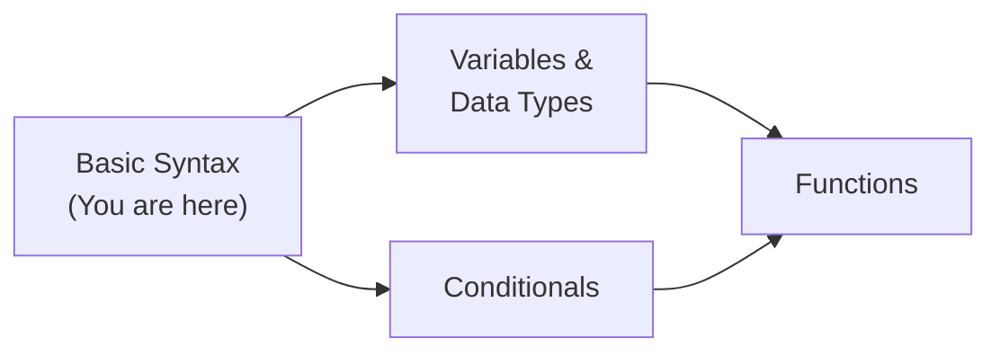
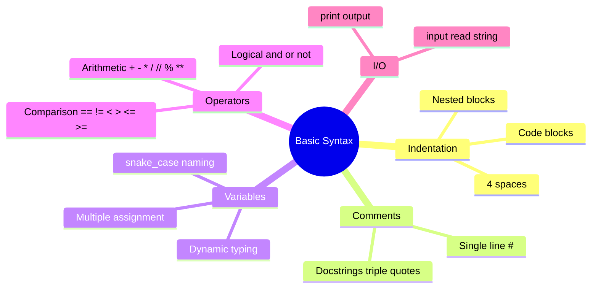
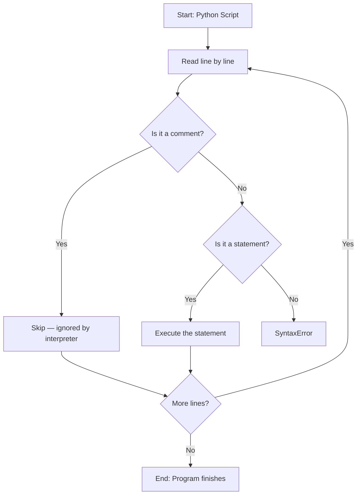

# Basic Syntax — Junior Level

## Table of Contents

1. [Introduction](#introduction)
2. [Prerequisites](#prerequisites)
3. [Glossary](#glossary)
4. [Core Concepts](#core-concepts)
5. [Real-World Analogies](#real-world-analogies)
6. [Mental Models](#mental-models)
7. [Pros & Cons](#pros--cons)
8. [Use Cases](#use-cases)
9. [Code Examples](#code-examples)
10. [Product Use / Feature](#product-use--feature)
11. [Error Handling](#error-handling)
12. [Security Considerations](#security-considerations)
13. [Performance Tips](#performance-tips)
14. [Metrics & Analytics](#metrics--analytics)
15. [Best Practices](#best-practices)
16. [Edge Cases & Pitfalls](#edge-cases--pitfalls)
17. [Common Mistakes](#common-mistakes)
18. [Tricky Points](#tricky-points)
19. [Test](#test)
20. [Tricky Questions](#tricky-questions)
21. [Cheat Sheet](#cheat-sheet)
22. [Summary](#summary)
23. [What You Can Build](#what-you-can-build)
24. [Further Reading](#further-reading)
25. [Diagrams & Visual Aids](#diagrams--visual-aids)

---

## Introduction

> Focus: "What is it?" and "How to use it?"

Python basic syntax is the set of rules that define how a Python program is written and interpreted. Unlike many languages that use braces `{}` and semicolons `;`, Python uses **indentation** and **newlines** to structure code. Understanding basic syntax is the foundation for everything you will ever write in Python — from simple scripts to complex web applications.

---

## Prerequisites

What you should know before studying this topic:

- **Required:** Basic computer literacy — you need to be comfortable using a terminal/command line
- **Required:** Python installed on your machine — you need Python 3.8+ to follow along
- **Helpful but not required:** Experience with any other programming language — helps with understanding general concepts like variables and operators

---

## Glossary

Key terms used in this topic:

| Term | Definition |
|------|-----------|
| **Indentation** | Whitespace (spaces or tabs) at the beginning of a line that defines code blocks |
| **Comment** | Text in code that Python ignores, used for documentation (starts with `#`) |
| **Docstring** | A multi-line string used to document modules, classes, or functions (triple quotes `"""`) |
| **Variable** | A name that refers to a value stored in memory |
| **Dynamic Typing** | Python determines the type of a variable at runtime, not at compile time |
| **Keyword** | A reserved word that has special meaning in Python (e.g., `if`, `for`, `def`) |
| **Operator** | A symbol that performs an operation on values (e.g., `+`, `-`, `==`) |
| **Expression** | A combination of values, variables, and operators that produces a result |
| **Statement** | A complete instruction that Python can execute (e.g., `x = 5`) |
| **snake_case** | Naming convention where words are separated by underscores (`my_variable`) |

---

## Core Concepts

### Concept 1: Indentation

Python uses indentation (typically 4 spaces) to define code blocks. Other languages use braces `{}`, but Python enforces visual structure. If your indentation is wrong, Python will raise an `IndentationError`.

```python
# Correct indentation
if True:
    print("This is inside the if block")
    print("This is also inside")
print("This is outside the if block")
```

### Concept 2: Comments and Docstrings

Comments start with `#` and are ignored by Python. Docstrings are triple-quoted strings used to document functions, classes, and modules. Docstrings become the `__doc__` attribute of the object.

```python
# This is a single-line comment

"""
This is a docstring.
It can span multiple lines.
"""

def greet(name):
    """Return a greeting message for the given name."""
    return f"Hello, {name}!"
```

### Concept 3: print() and input()

`print()` outputs text to the console. `input()` reads text from the user. These are your primary tools for interacting with users in console applications.

```python
name = input("What is your name? ")  # reads a string from user
print(f"Hello, {name}!")             # outputs formatted text
```

### Concept 4: Variables and Dynamic Typing

In Python, you do not need to declare a variable's type. Simply assign a value, and Python figures out the type automatically. You can even reassign a variable to a different type.

```python
x = 10        # x is an int
x = "hello"   # now x is a str — no error!
y = 3.14      # y is a float
```

### Concept 5: Naming Conventions

Python follows `snake_case` for variables and functions, `PascalCase` for classes, and `UPPER_SNAKE_CASE` for constants:

```python
user_name = "Alice"          # variable: snake_case
MAX_RETRIES = 3              # constant: UPPER_SNAKE_CASE
class UserProfile: pass      # class: PascalCase
def get_user_name(): pass    # function: snake_case
```

### Concept 6: Operators

Python supports arithmetic (`+`, `-`, `*`, `/`, `//`, `%`, `**`), comparison (`==`, `!=`, `<`, `>`, `<=`, `>=`), logical (`and`, `or`, `not`), and assignment (`=`, `+=`, `-=`) operators.

```python
a = 10
b = 3
print(a + b)    # 13 — addition
print(a // b)   # 3  — floor division
print(a ** b)   # 1000 — exponentiation
print(a % b)    # 1  — modulo (remainder)
```

### Concept 7: Line Continuation and Multiple Assignment

Long lines can be broken with a backslash `\` or by using parentheses. Python also supports multiple assignment in a single line.

```python
# Line continuation with backslash
total = 1 + 2 + 3 + \
        4 + 5 + 6

# Line continuation with parentheses (preferred)
total = (1 + 2 + 3 +
         4 + 5 + 6)

# Multiple assignment
x, y, z = 1, 2, 3
a = b = c = 0   # all three are 0
```

### Concept 8: Keywords

Python has reserved keywords that cannot be used as variable names. You can see them with `import keyword; print(keyword.kwlist)`. Examples: `if`, `else`, `for`, `while`, `def`, `class`, `return`, `import`, `True`, `False`, `None`.

---

## Real-World Analogies

| Concept | Analogy |
|---------|--------|
| **Indentation** | Like paragraphs in a book — indentation shows which sentences belong together under a heading |
| **Variables** | Like labeled jars in a kitchen — the label (name) helps you find what's inside (value), and you can replace the contents anytime |
| **Comments** | Like sticky notes on a recipe — they help you remember why you did something, but they don't change the dish |
| **Dynamic Typing** | Like a universal container — the same box can hold books, toys, or food without changing the box itself |

---

## Mental Models

**The intuition:** Think of a Python program as a recipe. Each line is a step. Indentation groups steps that belong together (like sub-steps under "Prepare the sauce"). Variables are ingredients with labels, and `print()` is serving the dish to the table.

**Why this model helps:** It prevents the common mistake of forgetting indentation — you would never write sub-steps at the same level as main steps in a recipe.

---

## Pros & Cons

| Pros | Cons |
|------|------|
| Clean, readable syntax — looks almost like English | Indentation errors can be hard to spot (tabs vs spaces) |
| No boilerplate — no `main()` function required, no type declarations | Dynamic typing can lead to runtime errors that static typing would catch |
| Easy to learn — minimal syntax to memorize | Whitespace sensitivity — moving code can break indentation |
| Multiple assignment saves lines | Implicit line endings can cause confusion for beginners |

### When to use:
- Scripting, automation, data analysis, web backends, machine learning — Python syntax shines in readability-focused projects

### When NOT to use:
- Performance-critical systems (use C/Rust) or mobile apps (use Swift/Kotlin)

---

## Use Cases

- **Use Case 1:** Writing quick automation scripts — Python's simple syntax makes it ideal for one-off tasks
- **Use Case 2:** Teaching programming — the clean syntax removes barriers for beginners
- **Use Case 3:** Building REST APIs with Flask/FastAPI — minimal boilerplate to get started
- **Use Case 4:** Data exploration in Jupyter notebooks — `print()` and `input()` for interactive analysis

---

## Code Examples

### Example 1: Hello World and User Interaction

```python
# hello.py — A simple interactive program

def main():
    # Get user's name
    name = input("Enter your name: ")

    # Get user's age (input always returns a string)
    age_str = input("Enter your age: ")
    age = int(age_str)  # convert string to integer

    # Print a greeting with f-string formatting
    print(f"Hello, {name}! You are {age} years old.")
    print(f"In 10 years, you will be {age + 10}.")


if __name__ == "__main__":
    main()
```

**What it does:** Asks for the user's name and age, then prints a formatted greeting.
**How to run:** `python hello.py`

### Example 2: Working with Operators and Variables

```python
# calculator.py — Basic arithmetic operations

def main():
    a = 15
    b = 4

    print(f"{a} + {b} = {a + b}")      # Addition: 19
    print(f"{a} - {b} = {a - b}")      # Subtraction: 11
    print(f"{a} * {b} = {a * b}")      # Multiplication: 60
    print(f"{a} / {b} = {a / b}")      # Division: 3.75 (always float)
    print(f"{a} // {b} = {a // b}")    # Floor division: 3
    print(f"{a} % {b} = {a % b}")      # Modulo: 3
    print(f"{a} ** {b} = {a ** b}")    # Exponentiation: 50625

    # Comparison operators
    print(f"{a} > {b}: {a > b}")       # True
    print(f"{a} == {b}: {a == b}")     # False

    # Logical operators
    x = True
    y = False
    print(f"x and y: {x and y}")       # False
    print(f"x or y: {x or y}")         # True
    print(f"not x: {not x}")           # False


if __name__ == "__main__":
    main()
```

**What it does:** Demonstrates all Python operators with examples.
**How to run:** `python calculator.py`

### Example 3: Indentation and Code Blocks

```python
# blocks.py — Demonstrating code structure

def check_number(n):
    """Check if a number is positive, negative, or zero."""
    if n > 0:
        print(f"{n} is positive")
        if n > 100:
            print("It's a large number!")
    elif n < 0:
        print(f"{n} is negative")
    else:
        print("It's zero")


def main():
    numbers = [42, -7, 0, 150]
    for num in numbers:
        check_number(num)
        print("---")  # separator


if __name__ == "__main__":
    main()
```

**What it does:** Shows nested indentation with if/elif/else and loops.
**How to run:** `python blocks.py`

---

## Clean Code

Basic clean code principles when working with Python basic syntax:

### Naming (PEP 8 conventions)

```python
# ❌ Bad
def D(X):
    return X * 2

MaxRetries = 3
class userData: pass

# ✅ Clean Python naming
def double_value(n):
    return n * 2

MAX_RETRIES = 3
class UserData: pass
```

**Python naming rules:**
- Functions and variables: `snake_case` (`user_count`, `is_valid`)
- Constants: `UPPER_SNAKE_CASE` (`MAX_RETRIES`, `DEFAULT_TIMEOUT`)
- Classes: `PascalCase` (`UserService`, `HttpClient`)
- Private members: leading underscore (`_internal_helper`)

---

## Product Use / Feature

### 1. Django

- **How it uses Basic Syntax:** Django projects use Python's indentation, naming conventions, and dynamic typing throughout models, views, and templates
- **Why it matters:** Understanding basic syntax is essential to read and write Django code

### 2. Flask

- **How it uses Basic Syntax:** Flask route handlers are simple Python functions using `def`, indentation, and `return`
- **Why it matters:** Flask's minimalism means you interact directly with Python syntax more than framework abstractions

### 3. Jupyter Notebooks

- **How it uses Basic Syntax:** Each cell executes Python statements — `print()`, variables, and expressions are the primary tools
- **Why it matters:** Data scientists rely on basic syntax for exploratory analysis

---

## Error Handling

### Error 1: IndentationError

```python
# This code produces IndentationError
if True:
print("hello")  # not indented!
```

**Why it happens:** Python expects an indented block after `if`, `for`, `def`, `class`, etc.
**How to fix:**

```python
if True:
    print("hello")  # properly indented with 4 spaces
```

### Error 2: SyntaxError from missing colon

```python
# Missing colon after if
if True
    print("hello")
```

**Why it happens:** Python requires a colon `:` at the end of `if`, `for`, `while`, `def`, `class` statements.
**How to fix:**

```python
if True:
    print("hello")
```

### Error 3: NameError from undefined variable

```python
print(message)  # NameError: name 'message' is not defined
```

**Why it happens:** You used a variable before assigning it a value.
**How to fix:**

```python
message = "Hello"
print(message)
```

---

## Security Considerations

### 1. Never use eval() on user input

```python
# ❌ Insecure — user can execute arbitrary code
user_input = input("Enter expression: ")
result = eval(user_input)  # DANGER: user could type __import__('os').system('rm -rf /')

# ✅ Secure — parse and validate input
user_input = input("Enter a number: ")
try:
    result = int(user_input)
except ValueError:
    print("Invalid number")
```

**Risk:** `eval()` executes arbitrary Python code, allowing code injection attacks.
**Mitigation:** Use `int()`, `float()`, or a safe parser like `ast.literal_eval()` for simple expressions.

### 2. Be careful with input()

```python
# ❌ Trusting user input without validation
filename = input("Enter filename: ")
with open(filename) as f:  # user could enter /etc/passwd
    print(f.read())

# ✅ Validate and sanitize
import os
filename = input("Enter filename: ")
safe_dir = "/app/data"
filepath = os.path.join(safe_dir, os.path.basename(filename))
```

**Risk:** Path traversal attacks if user input is used directly in file paths.
**Mitigation:** Use `os.path.basename()` or `pathlib.Path` to sanitize paths.

---

## Performance Tips

### Tip 1: Use f-strings instead of concatenation

```python
# ❌ Slow — multiple string concatenations
result = "Hello, " + name + "! You are " + str(age) + " years old."

# ✅ Faster — f-string (single string operation)
result = f"Hello, {name}! You are {age} years old."
```

**Why it's faster:** f-strings are compiled to efficient bytecode, while `+` concatenation creates intermediate string objects.

### Tip 2: Use multiple assignment for swapping

```python
# ❌ Extra variable
temp = a
a = b
b = temp

# ✅ Pythonic swap
a, b = b, a
```

**Why it's faster:** Python handles the swap internally using tuple packing/unpacking — no extra variable needed.

---

## Metrics & Analytics

### What to Measure

| Metric | Why it matters | Tool |
|--------|---------------|------|
| **Script execution time** | Know if your script is fast enough | `time` module, `timeit` |
| **Line count** | Measure code complexity | `wc -l` or IDE stats |

### Basic Instrumentation

```python
import time

start = time.perf_counter()
# ... your code here ...
elapsed = time.perf_counter() - start
print(f"Script completed in {elapsed:.3f}s")
```

---

## Best Practices

- **Use 4 spaces for indentation** — never mix tabs and spaces (PEP 8)
- **Use meaningful variable names** — `user_age` is better than `x`
- **Add comments for "why", not "what"** — the code shows "what", comments explain "why"
- **Use f-strings for formatting** — cleaner and faster than `%` or `.format()`
- **Follow PEP 8** — the official Python style guide for consistent code

---

## Edge Cases & Pitfalls

### Pitfall 1: Tabs vs Spaces

```python
# Mixing tabs and spaces causes TabError in Python 3
if True:
    print("spaces")    # 4 spaces
	print("tab")       # 1 tab — TabError!
```

**What happens:** `TabError: inconsistent use of tabs and spaces in indentation`
**How to fix:** Configure your editor to always use 4 spaces. Never use tabs.

### Pitfall 2: Integer division gotcha

```python
# Division always returns float in Python 3
result = 10 / 2
print(result)      # 5.0 (float, not int!)
print(type(result)) # <class 'float'>

# Use // for integer division
result = 10 // 2
print(result)      # 5 (int)
```

---

## Common Mistakes

### Mistake 1: Using = instead of ==

```python
# ❌ Wrong — assignment instead of comparison
if x = 5:  # SyntaxError!
    print("five")

# ✅ Correct — comparison
if x == 5:
    print("five")
```

### Mistake 2: Forgetting that input() returns a string

```python
# ❌ Wrong — comparing string to int
age = input("Your age: ")
if age > 18:   # TypeError: '>' not supported between str and int
    print("Adult")

# ✅ Correct — convert to int first
age = int(input("Your age: "))
if age > 18:
    print("Adult")
```

### Mistake 3: Using a Python keyword as a variable name

```python
# ❌ SyntaxError — 'class' is a keyword
class = "Math 101"

# ✅ Use a different name
course_class = "Math 101"
```

---

## Common Misconceptions

### Misconception 1: "Python doesn't have types"

**Reality:** Python is **dynamically typed**, not untyped. Every value has a type (`int`, `str`, `float`, etc.) — Python just determines it at runtime instead of compile time.

**Why people think this:** Because you don't write type declarations like `int x = 5;`.

### Misconception 2: "Indentation is just cosmetic"

**Reality:** In Python, indentation is **syntactically significant**. It defines code blocks. Wrong indentation changes the program's behavior or causes errors.

**Why people think this:** In most other languages (C, Java, JavaScript), indentation is optional and only for readability.

---

## Tricky Points

### Tricky Point 1: Chained comparison

```python
x = 5
print(1 < x < 10)   # True — Python supports chained comparisons!
print(1 < x > 3)    # True — (1 < 5) and (5 > 3)
```

**Why it's tricky:** Most languages don't support chained comparisons. In JavaScript, `1 < 5 < 3` evaluates to `True` because `(1 < 5)` is `true`, and `true < 3` (coerced to `1 < 3`) is `true`.
**Key takeaway:** Python evaluates chained comparisons as `a < b < c` → `(a < b) and (b < c)`.

### Tricky Point 2: Multiple assignment unpacking

```python
a, *b, c = [1, 2, 3, 4, 5]
print(a)  # 1
print(b)  # [2, 3, 4]
print(c)  # 5
```

**Why it's tricky:** The `*` operator captures "the rest" into a list.
**Key takeaway:** Use `*` for flexible unpacking.

---

## Test

### Multiple Choice

**1. What does Python use to define code blocks?**

- A) Curly braces `{}`
- B) Parentheses `()`
- C) Indentation (whitespace)
- D) Keywords like `begin`/`end`

<details>
<summary>Answer</summary>
**C)** — Python uses indentation to define code blocks. This is one of its most distinctive features.
</details>

**2. What is the output of `print(type(10 / 3))`?**

- A) `<class 'int'>`
- B) `<class 'float'>`
- C) `<class 'double'>`
- D) `<class 'str'>`

<details>
<summary>Answer</summary>
**B)** — The `/` operator always returns a float in Python 3, even when both operands are integers.
</details>

### True or False

**3. In Python, you must declare a variable's type before using it.**

<details>
<summary>Answer</summary>
**False** — Python uses dynamic typing. You simply assign a value: `x = 5`. No type declaration needed.
</details>

**4. Comments in Python start with `//`.**

<details>
<summary>Answer</summary>
**False** — Python comments start with `#`. The `//` is the floor division operator.
</details>

### What's the Output?

**5. What does this code print?**

```python
x, y = 10, 20
x, y = y, x
print(x, y)
```

<details>
<summary>Answer</summary>
Output: `20 10`
Explanation: Python swaps the values using tuple packing/unpacking. After the swap, `x` is `20` and `y` is `10`.
</details>

**6. What does this code print?**

```python
a = b = c = []
a.append(1)
print(b)
```

<details>
<summary>Answer</summary>
Output: `[1]`
Explanation: `a`, `b`, and `c` all point to the **same** list object. When you append to `a`, you're modifying the same list that `b` and `c` reference.
</details>

**7. What happens when you run this code?**

```python
print("Hello"
      " World")
```

<details>
<summary>Answer</summary>
Output: `Hello World`
Explanation: Python automatically concatenates adjacent string literals. The parentheses allow implicit line continuation.
</details>

---

## Tricky Questions

**1. What is the output?**

```python
x = 256
y = 256
print(x is y)

a = 257
b = 257
print(a is b)
```

- A) `True`, `True`
- B) `True`, `False`
- C) `False`, `False`
- D) `False`, `True`

<details>
<summary>Answer</summary>
**B)** — CPython caches small integers from -5 to 256. So `x` and `y` point to the same object (`is` returns `True`). For 257, Python creates separate objects, so `is` returns `False`. Note: this behavior is implementation-specific and may differ in interactive mode vs scripts.
</details>

**2. What does this print?**

```python
print(0.1 + 0.2 == 0.3)
```

- A) `True`
- B) `False`
- C) `Error`
- D) `None`

<details>
<summary>Answer</summary>
**B)** — Due to floating-point representation, `0.1 + 0.2` equals `0.30000000000000004`, not exactly `0.3`. Use `math.isclose(0.1 + 0.2, 0.3)` for reliable comparison.
</details>

**3. Is this valid Python?**

```python
x = (
    1 +
    2 +
    3
)
print(x)
```

- A) Yes, prints `6`
- B) No, SyntaxError
- C) Yes, prints `(1 + 2 + 3)`
- D) Yes, prints `123`

<details>
<summary>Answer</summary>
**A)** — Parentheses allow implicit line continuation. The expression `1 + 2 + 3` evaluates to `6`.
</details>

---

## Cheat Sheet

| What | Syntax / Command | Example |
|------|-----------------|---------|
| Print to console | `print(value)` | `print("Hello")` |
| Read user input | `input(prompt)` | `name = input("Name: ")` |
| Single-line comment | `# comment` | `# calculate total` |
| Docstring | `"""text"""` | `"""This function adds two numbers."""` |
| Variable assignment | `name = value` | `age = 25` |
| Multiple assignment | `a, b = val1, val2` | `x, y = 10, 20` |
| Swap variables | `a, b = b, a` | `x, y = y, x` |
| Floor division | `a // b` | `7 // 2  # 3` |
| Exponentiation | `a ** b` | `2 ** 10  # 1024` |
| Check type | `type(value)` | `type(42)  # <class 'int'>` |
| Line continuation | `\` or `()` | `total = (a +`<br>`         b)` |
| f-string | `f"text {var}"` | `f"Hello, {name}!"` |

---

## Self-Assessment Checklist

### I can explain:
- [ ] What indentation means in Python and why it matters
- [ ] The difference between `=` and `==`
- [ ] What dynamic typing means
- [ ] How `print()` and `input()` work

### I can do:
- [ ] Write a simple Python script from scratch
- [ ] Use variables, operators, and f-strings
- [ ] Read and fix `IndentationError` and `SyntaxError`
- [ ] Follow PEP 8 naming conventions

---

## Summary

- Python uses **indentation** (4 spaces) to define code blocks — not braces
- **Comments** start with `#`; **docstrings** use triple quotes `"""`
- Variables don't need type declarations — Python is **dynamically typed**
- Use `snake_case` for variables/functions, `PascalCase` for classes, `UPPER_SNAKE_CASE` for constants
- `print()` outputs to the console; `input()` reads from the user (always returns a string)
- Python supports **chained comparisons** (`1 < x < 10`) and **multiple assignment** (`a, b = 1, 2`)

**Next step:** Learn about Variables and Data Types to understand Python's type system in depth.

---

## What You Can Build

### Projects you can create:
- **Interactive Calculator:** Uses `input()`, operators, and type conversion
- **Mad Libs Game:** Uses `input()`, f-strings, and `print()` for a word game
- **Unit Converter:** Combines variables, operators, and user interaction

### Technologies / tools that use this:
- **Django / Flask / FastAPI** — all web frameworks start with Python basic syntax
- **pandas / NumPy** — data science starts with understanding variables and operators
- **Ansible / Fabric** — DevOps automation relies on clean Python scripts

### Learning path:



---

## Further Reading

- **Official docs:** [Python Tutorial](https://docs.python.org/3/tutorial/index.html)
- **PEP:** [PEP 8 — Style Guide for Python Code](https://peps.python.org/pep-0008/) — the definitive guide for Python code style
- **Book:** "Automate the Boring Stuff with Python" (Al Sweigart), Chapter 1 — Python basics
- **Interactive:** [Python.org Shell](https://www.python.org/shell/) — try Python in the browser

---

## Related Topics

- **[Variables and Data Types](../02-variables-and-data-types/)** — deeper dive into Python's type system
- **[Conditionals](../03-conditionals/)** — control flow with if/elif/else

---

## Diagrams & Visual Aids

### Mind Map



### Python Program Flow



### Indentation Structure

```
Python Indentation Model:
┌──────────────────────────────┐
│ def greet(name):             │  ← function definition (level 0)
│     if name:                 │  ← if block (level 1, 4 spaces)
│         msg = f"Hi {name}"   │  ← if body (level 2, 8 spaces)
│         print(msg)           │  ← still level 2
│     else:                    │  ← else block (level 1)
│         print("Hello!")      │  ← else body (level 2)
│     return                   │  ← back to level 1
└──────────────────────────────┘
```
