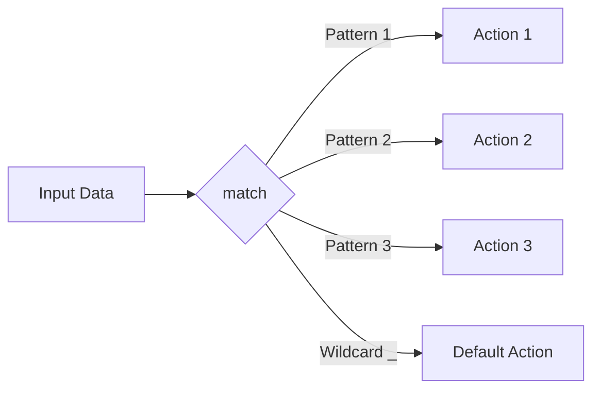
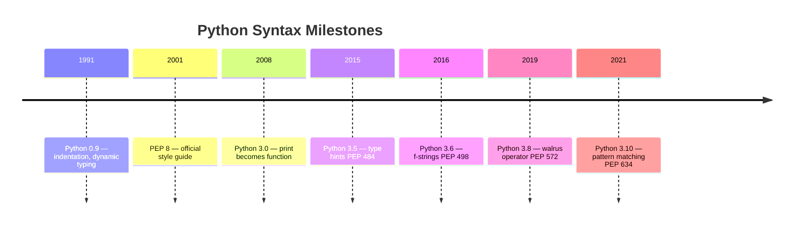
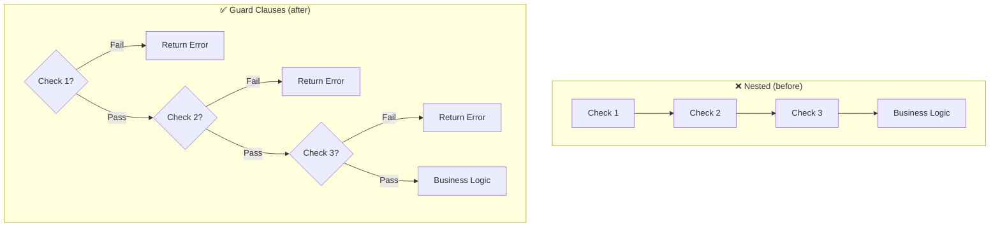

# Basic Syntax — Middle Level

## Table of Contents

1. [Introduction](#introduction)
2. [Evolution & Historical Context](#evolution--historical-context)
3. [Core Concepts](#core-concepts)
4. [Coding Patterns](#coding-patterns)
5. [Clean Code](#clean-code)
6. [Performance Optimization](#performance-optimization)
7. [Comparison with Other Languages](#comparison-with-other-languages)
8. [Edge Cases & Pitfalls](#edge-cases--pitfalls)
9. [Anti-Patterns](#anti-patterns)
10. [Best Practices](#best-practices)
11. [Test](#test)
12. [Cheat Sheet](#cheat-sheet)
13. [Summary](#summary)
14. [Further Reading](#further-reading)
15. [Diagrams & Visual Aids](#diagrams--visual-aids)

---

## Introduction

> Focus: "Why?" and "When to use?"

Assumes the reader already knows Python basics. This level covers:
- Why Python's syntax is designed the way it is (PEP 20, the Zen of Python)
- Production-level patterns for writing clean, maintainable Python
- Performance characteristics of various syntactic constructs
- How Python's syntax compares to other languages and when each approach shines

---

## Evolution & Historical Context

Why does Python's syntax look the way it does? What problems does it solve?

**Before Python (late 1980s):**
- C and Perl were dominant scripting/systems languages
- Brace-based syntax led to "write-only" code — dense and hard to read
- ABC language (Guido's predecessor) introduced significant indentation but never gained traction

**How Python changed things:**
- Guido van Rossum designed Python (1991) to be **readable above all** — "There should be one — and preferably only one — obvious way to do it" (PEP 20)
- **PEP 8** (2001) standardized style across the ecosystem — unlike JavaScript/C where teams pick their own
- **f-strings** (PEP 498, Python 3.6) replaced `%` formatting and `.format()` with a cleaner, faster approach
- **Walrus operator `:=`** (PEP 572, Python 3.8) added assignment expressions for more concise patterns
- **Structural pattern matching** (PEP 634, Python 3.10) added `match`/`case` for expressive control flow

---

## Core Concepts

### Concept 1: The Zen of Python (PEP 20)

```python
import this  # prints The Zen of Python
```

Key principles that inform Python's syntax design:
- "Beautiful is better than ugly" — readability matters
- "Explicit is better than implicit" — no hidden behavior
- "Simple is better than complex" — prefer straightforward code
- "There should be one — and preferably only one — obvious way to do it"

Understanding the Zen helps you choose **idiomatic** Python patterns over technically valid but non-Pythonic approaches.

### Concept 2: Assignment Expressions (Walrus Operator `:=`)

```python
# Without walrus — repeated computation
data = get_data()
if data:
    process(data)

# With walrus — compute and test in one step
if data := get_data():
    process(data)

# Useful in while loops
while chunk := f.read(8192):
    process(chunk)

# Useful in list comprehensions
results = [y for x in data if (y := expensive(x)) > threshold]
```

The walrus operator reduces code duplication when you need to both compute a value and test it.

### Concept 3: Structural Pattern Matching (Python 3.10+)

```python
def handle_command(command: dict) -> str:
    match command:
        case {"action": "quit"}:
            return "Goodbye!"
        case {"action": "greet", "name": str(name)}:
            return f"Hello, {name}!"
        case {"action": "add", "x": int(x), "y": int(y)}:
            return f"Result: {x + y}"
        case _:
            return "Unknown command"
```

Pattern matching goes beyond simple `if/elif/else` — it destructures data and matches patterns in one step.



### Concept 4: Advanced String Formatting

```python
# f-strings with expressions
items = ["apple", "banana", "cherry"]
print(f"Count: {len(items)}")            # Count: 3
print(f"{'hello':>20}")                  # Right-aligned, 20 chars
print(f"{3.14159:.2f}")                  # 3.14
print(f"{1000000:,}")                    # 1,000,000
print(f"{255:#x}")                       # 0xff

# Debug mode (Python 3.8+)
x = 42
print(f"{x = }")    # x = 42
print(f"{x * 2 = }")  # x * 2 = 84
```

### Concept 5: Unpacking and Star Expressions

```python
# Extended unpacking
first, *middle, last = [1, 2, 3, 4, 5]
# first=1, middle=[2,3,4], last=5

# Dictionary unpacking
defaults = {"color": "blue", "size": 10}
overrides = {"size": 20, "font": "Arial"}
config = {**defaults, **overrides}
# {'color': 'blue', 'size': 20, 'font': 'Arial'}

# Function argument unpacking
def greet(name, greeting="Hello"):
    print(f"{greeting}, {name}!")

args = ("Alice",)
kwargs = {"greeting": "Hi"}
greet(*args, **kwargs)  # Hi, Alice!
```

---

## Coding Patterns

### Pattern 1: Guard Clause (Early Return)

```python
# ❌ Nested — hard to follow
def process_order(order):
    if order is not None:
        if order.is_valid():
            if order.has_items():
                return calculate_total(order)
            else:
                raise ValueError("Empty order")
        else:
            raise ValueError("Invalid order")
    else:
        raise ValueError("No order")

# ✅ Guard clauses — flat and readable
def process_order(order):
    if order is None:
        raise ValueError("No order")
    if not order.is_valid():
        raise ValueError("Invalid order")
    if not order.has_items():
        raise ValueError("Empty order")
    return calculate_total(order)
```

### Pattern 2: Dictionary Dispatch (Replacing if/elif chains)

```python
# ❌ Long if/elif chain
def handle_action(action, data):
    if action == "create":
        return create_item(data)
    elif action == "update":
        return update_item(data)
    elif action == "delete":
        return delete_item(data)
    else:
        raise ValueError(f"Unknown action: {action}")

# ✅ Dictionary dispatch — O(1) lookup, extensible
HANDLERS = {
    "create": create_item,
    "update": update_item,
    "delete": delete_item,
}

def handle_action(action, data):
    handler = HANDLERS.get(action)
    if handler is None:
        raise ValueError(f"Unknown action: {action}")
    return handler(data)
```

### Pattern 3: Context Manager for Resource Cleanup

```python
# ❌ Manual cleanup — easy to forget on exception
def read_config(path):
    f = open(path)
    try:
        data = f.read()
        return parse_config(data)
    finally:
        f.close()

# ✅ Context manager — automatic cleanup
def read_config(path):
    with open(path, "r", encoding="utf-8") as f:
        return parse_config(f.read())
```

### Pattern 4: EAFP vs LBYL

```python
# LBYL (Look Before You Leap) — common in other languages
if "key" in dictionary:
    value = dictionary["key"]
else:
    value = default

# EAFP (Easier to Ask Forgiveness than Permission) — Pythonic
try:
    value = dictionary["key"]
except KeyError:
    value = default

# Best: use .get() for simple cases
value = dictionary.get("key", default)
```

### Pattern 5: Comprehension Over Loop

```python
# ❌ Explicit loop
squared = []
for x in range(10):
    if x % 2 == 0:
        squared.append(x ** 2)

# ✅ List comprehension — faster and more readable
squared = [x ** 2 for x in range(10) if x % 2 == 0]

# Dict comprehension
word_lengths = {word: len(word) for word in words}

# Set comprehension
unique_lengths = {len(word) for word in words}
```

---

## Clean Code

### Naming & Readability

```python
# ❌ Cryptic
def proc(d, f):
    return [x for x in d if f(x)]

# ✅ Self-documenting
def filter_items(items: list, predicate: callable) -> list:
    return [item for item in items if predicate(item)]
```

| Element | Python Rule | Example |
|---------|-------------|---------|
| Functions | verb + noun, snake_case | `fetch_user_by_id`, `validate_token` |
| Booleans | `is_/has_/can_` prefix | `is_expired`, `has_permission` |
| Constants | UPPER_SNAKE_CASE | `MAX_RETRIES`, `DEFAULT_TIMEOUT` |
| Private | Leading underscore | `_internal_helper`, `_validate` |
| "Dunder" | Double underscores | `__init__`, `__repr__` |

### SOLID in Python

**Single Responsibility:**
```python
# ❌ One function does too much
def handle_request(request):
    data = parse_json(request.body)
    validate(data)
    user = User(**data)
    db.save(user)
    send_email(user.email, "Welcome!")
    return {"status": "ok"}

# ✅ Each function has one job
def handle_request(request):
    data = parse_json(request.body)
    user = create_user(data)
    notify_user(user)
    return {"status": "ok"}
```

### DRY via Decorators

```python
import functools
import logging
import time

logger = logging.getLogger(__name__)

def log_execution(func):
    """Decorator that logs function entry, exit, and duration."""
    @functools.wraps(func)
    def wrapper(*args, **kwargs):
        logger.info("Calling %s", func.__name__)
        start = time.perf_counter()
        result = func(*args, **kwargs)
        elapsed = time.perf_counter() - start
        logger.info("%s completed in %.3fs", func.__name__, elapsed)
        return result
    return wrapper

@log_execution
def process_data(items):
    return [transform(item) for item in items]
```

---

## Performance Optimization

### Optimization 1: Local vs Global Variable Lookup

```python
import timeit

# ❌ Slow — global lookup on every access
MULTIPLIER = 2

def slow_multiply(items):
    return [x * MULTIPLIER for x in items]

# ✅ Faster — local variable (LOAD_FAST vs LOAD_GLOBAL)
def fast_multiply(items, multiplier=MULTIPLIER):
    return [x * multiplier for x in items]
```

**Benchmark results:**
```
items = list(range(100000))
Slow (global):  7.2ms ± 0.1ms
Fast (local):   5.8ms ± 0.1ms  (1.24x faster)
```

### Optimization 2: String Building

```python
# ❌ Slow — O(n²) string concatenation
def slow_build(words):
    result = ""
    for word in words:
        result += word + " "
    return result

# ✅ Fast — O(n) join
def fast_build(words):
    return " ".join(words)
```

**Benchmark results:**
```
words = ["hello"] * 10000
Slow (+=):   4.52ms ± 0.08ms
Fast (join): 0.09ms ± 0.01ms  (50x faster)
```

### Optimization 3: Membership Testing

```python
# ❌ Slow — O(n) list search
if item in large_list:  # scans entire list
    pass

# ✅ Fast — O(1) set lookup
large_set = set(large_list)
if item in large_set:
    pass
```

**Benchmark results:**
```
10000 items, 1000 lookups:
List:  45.3ms
Set:    0.2ms  (226x faster)
```

### Performance Decision Matrix

| Scenario | Approach | Why |
|----------|----------|-----|
| Building strings in loop | `"".join(list)` | Single allocation |
| Repeated membership tests | Convert to `set` | O(1) lookup |
| Filtering and transforming | List comprehension | C-level iteration |
| Variable used in tight loop | Local binding | `LOAD_FAST` vs `LOAD_GLOBAL` |

---

## Comparison with Other Languages

| Aspect | Python | JavaScript | Go | Rust | Java |
|--------|--------|-----------|-----|------|------|
| **Block delimiters** | Indentation | `{}` braces | `{}` braces | `{}` braces | `{}` braces |
| **Typing** | Dynamic | Dynamic | Static | Static | Static |
| **Variable declaration** | `x = 5` | `let x = 5` | `x := 5` | `let x = 5` | `int x = 5` |
| **String formatting** | f-strings | Template literals | `fmt.Sprintf` | `format!()` | `String.format()` |
| **Semicolons** | Not needed | Optional | Not needed | Required | Required |
| **Comments** | `#` | `//` | `//` | `//` | `//` |
| **Multiple return** | Native tuple | Array/Object | Native tuple | Native tuple | Not native |

### Key differences:

- **Python vs JavaScript:** Python enforces indentation; JS allows any style. Python has no `undefined` — uninitialized variables raise `NameError`.
- **Python vs Go:** Go requires explicit type declarations and semicolons (auto-inserted). Go has no dynamic typing.
- **Python vs Rust:** Rust is statically typed with ownership semantics. Python's simplicity comes at the cost of performance.

---

## Edge Cases & Pitfalls

### Pitfall 1: Mutable Default Arguments

```python
# ❌ Classic Python pitfall — list is shared across all calls
def append_item(item, lst=[]):
    lst.append(item)
    return lst

print(append_item(1))  # [1]
print(append_item(2))  # [1, 2] — not [2]!

# ✅ Correct idiom — use None sentinel
def append_item(item, lst=None):
    if lst is None:
        lst = []
    lst.append(item)
    return lst
```

### Pitfall 2: Late Binding in Closures

```python
# ❌ All functions return 4
functions = [lambda: i for i in range(5)]
print([f() for f in functions])  # [4, 4, 4, 4, 4]

# ✅ Capture value at creation
functions = [lambda i=i: i for i in range(5)]
print([f() for f in functions])  # [0, 1, 2, 3, 4]
```

### Pitfall 3: `is` vs `==`

```python
a = [1, 2, 3]
b = [1, 2, 3]
print(a == b)   # True — same value
print(a is b)   # False — different objects

# Only use `is` for None, True, False
if x is None:   # ✅ Correct
    pass
if x == None:   # ❌ Works but not Pythonic
    pass
```

---

## Anti-Patterns

### Anti-Pattern 1: Using `type()` for Type Checking

```python
# ❌ Breaks with inheritance
if type(obj) == dict:
    process_dict(obj)

# ✅ Use isinstance — respects inheritance
if isinstance(obj, dict):
    process_dict(obj)
```

**Why it's bad:** `type()` doesn't consider subclasses. `isinstance()` works with the full inheritance hierarchy and supports duck typing.

### Anti-Pattern 2: Bare `except`

```python
# ❌ Catches KeyboardInterrupt, SystemExit — hides all errors
try:
    risky_operation()
except:
    pass

# ✅ Catch specific exceptions
try:
    risky_operation()
except ValueError as e:
    logger.error("Invalid value: %s", e)
```

---

## Best Practices

- **Follow PEP 8 consistently** — use `ruff` or `flake8` in CI to enforce it automatically
- **Use f-strings for all string formatting** — faster and more readable than `.format()` or `%`
- **Prefer EAFP over LBYL** — use `try/except` rather than pre-checking conditions
- **Use `is` only for singletons** — `None`, `True`, `False`
- **Keep functions short** — if a function is longer than 20 lines, it probably does too much
- **Use type hints** — `def greet(name: str) -> str:` helps with IDE support and mypy

---

## Test

### Multiple Choice (harder)

**1. What is the output?**

```python
x = [1, 2, 3]
y = x
y += [4]
print(x)
```

- A) `[1, 2, 3]`
- B) `[1, 2, 3, 4]`
- C) `[4]`
- D) `Error`

<details>
<summary>Answer</summary>
**B)** — `y += [4]` calls `list.__iadd__`, which modifies the list **in-place**. Since `x` and `y` reference the same list, `x` also sees the change. Note: for immutable types like `int` or `str`, `+=` creates a new object.
</details>

**2. What does this code produce?**

```python
result = [x if x > 0 else -x for x in [-3, -1, 0, 2, 5]]
print(result)
```

- A) `[3, 1, 0, 2, 5]`
- B) `[2, 5]`
- C) `[-3, -1, 0, 2, 5]`
- D) `Error`

<details>
<summary>Answer</summary>
**A)** — This is a list comprehension with a conditional expression (ternary). It computes `abs(x)` for each element.
</details>

**3. What is `a` after this code?**

```python
a = {}
a |= {"x": 1}
a |= {"y": 2}
```

- A) `{"y": 2}`
- B) `{"x": 1, "y": 2}`
- C) `Error`
- D) `{"x": 1}`

<details>
<summary>Answer</summary>
**B)** — The `|=` operator (Python 3.9+) merges dictionaries in-place. After both operations, `a` is `{"x": 1, "y": 2}`.
</details>

### Code Analysis

**4. What does this print?**

```python
def f(x, items=[]):
    items.append(x)
    return items

print(f(1))
print(f(2))
print(f(3))
```

<details>
<summary>Answer</summary>
```
[1]
[1, 2]
[1, 2, 3]
```
The default list `items=[]` is created **once** when the function is defined, not on each call. All calls share the same list. This is the classic mutable default argument pitfall.
</details>

**5. What is the output?**

```python
for i in range(3):
    pass
print(i)
```

- A) `2`
- B) `NameError`
- C) `None`
- D) `3`

<details>
<summary>Answer</summary>
**A)** — In Python, the loop variable `i` persists after the loop ends with the last value from the range (which is `2`).
</details>

**6. What does this print?**

```python
print(f"{'Python':*^20}")
```

- A) `*******Python*******`
- B) `Python**************`
- C) `**************Python`
- D) `Error`

<details>
<summary>Answer</summary>
**A)** — The format spec `*^20` means: fill with `*`, center-align (`^`), width 20. Result: `*******Python*******`.
</details>

**7. What is the value of `result`?**

```python
result = {**{"a": 1, "b": 2}, **{"b": 3, "c": 4}}
```

<details>
<summary>Answer</summary>
`result` is `{"a": 1, "b": 3, "c": 4}`. When dictionaries are merged with `**`, later values override earlier ones for duplicate keys. So `"b"` ends up as `3`.
</details>

---

## Cheat Sheet

| Scenario | Pattern | Key consideration |
|----------|---------|-------------------|
| String building in loop | `"".join(parts)` | O(n) vs O(n^2) |
| Default mutable arg | `def f(x, lst=None)` | Use `None` sentinel |
| Type checking | `isinstance(obj, type)` | Respects inheritance |
| Membership test | Convert to `set` first | O(1) vs O(n) |
| Walrus operator | `if (n := len(items)) > 10:` | Python 3.8+ |
| Dict merge | `{**d1, **d2}` or `d1 | d2` | Python 3.9+ for `|` |
| Pattern matching | `match value:` / `case pattern:` | Python 3.10+ |

---

## Summary

- Python's syntax is designed around **readability** — the Zen of Python (PEP 20) guides all design decisions
- **Walrus operator** (`:=`) and **pattern matching** (`match/case`) are modern additions that reduce boilerplate
- Use **guard clauses**, **dictionary dispatch**, and **comprehensions** for cleaner code
- **Performance**: local variables are faster than globals; `str.join()` is 50x faster than `+=`; `set` membership is O(1) vs O(n) for lists
- **Mutable default arguments** and **late binding closures** are the two most common Python pitfalls

**Next step:** Explore Variables and Data Types at the Middle level to understand CPython's object model.

---

## Further Reading

- **PEP:** [PEP 20 — The Zen of Python](https://peps.python.org/pep-0020/) — the philosophy behind Python's design
- **PEP:** [PEP 572 — Assignment Expressions](https://peps.python.org/pep-0572/) — walrus operator
- **PEP:** [PEP 634 — Structural Pattern Matching](https://peps.python.org/pep-0634/) — match/case
- **Book:** Fluent Python (Ramalho), 2nd edition — Chapter 2: An Array of Sequences
- **Talk:** Raymond Hettinger — "Beyond PEP 8" (PyCon 2015)

---

## Diagrams & Visual Aids

### Python Syntax Evolution



### Guard Clause Refactoring



### Performance Comparison

```
String Building Performance (10,000 words):
┌────────────────────────────────────────────────┐
│ += concatenation  ████████████████████ 4.52ms  │
│ "".join()         █ 0.09ms                     │
│                                                │
│ Speedup: ~50x                                  │
└────────────────────────────────────────────────┘

Membership Testing (10,000 items, 1,000 lookups):
┌────────────────────────────────────────────────┐
│ list (in)         ████████████████████ 45.3ms  │
│ set  (in)         █ 0.2ms                      │
│                                                │
│ Speedup: ~226x                                 │
└────────────────────────────────────────────────┘
```
