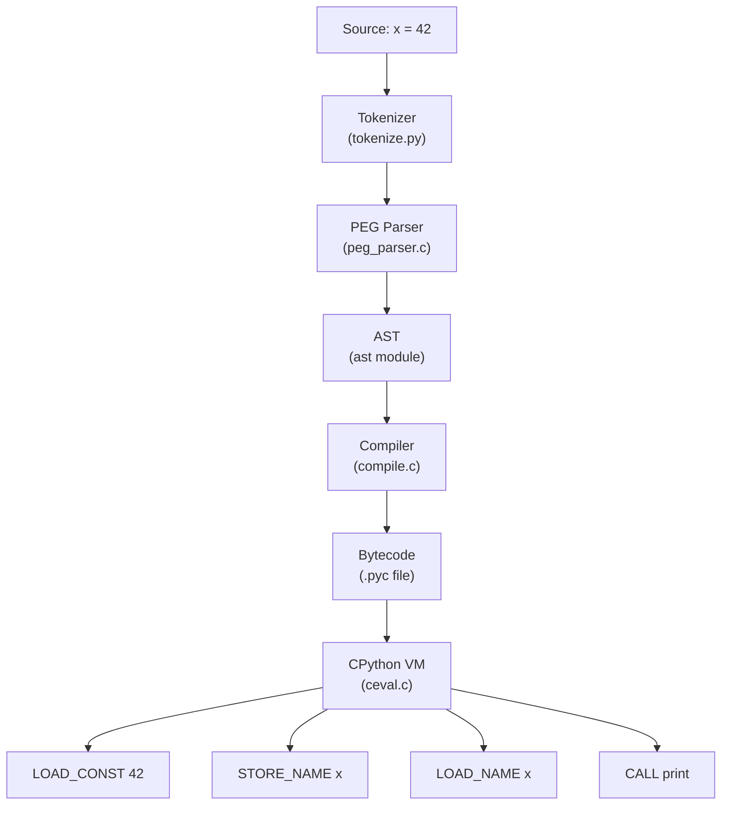
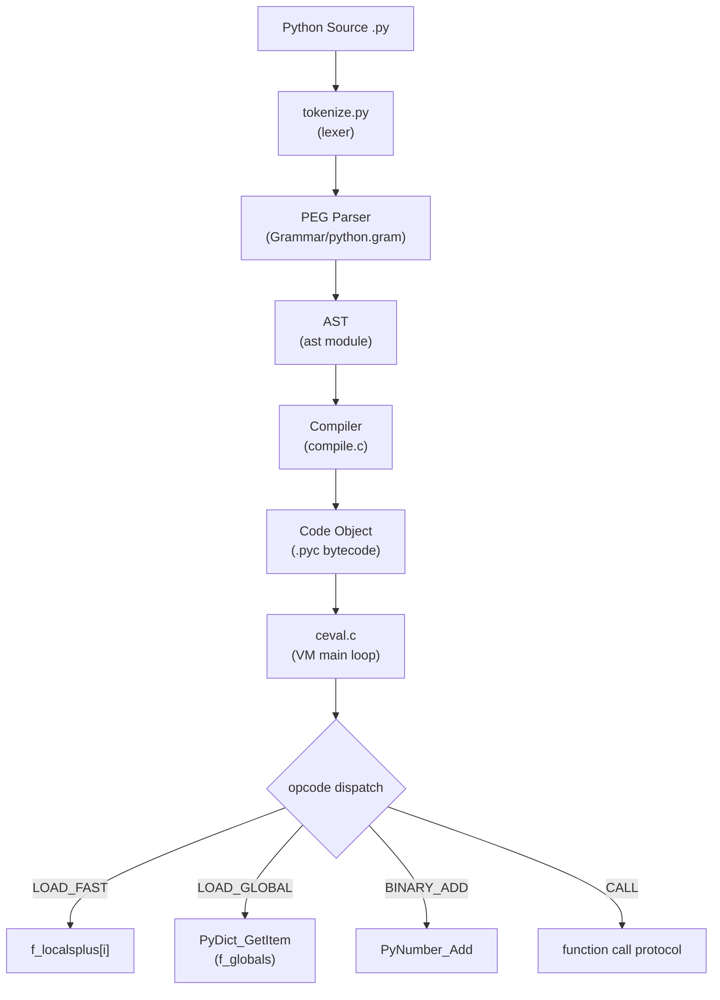
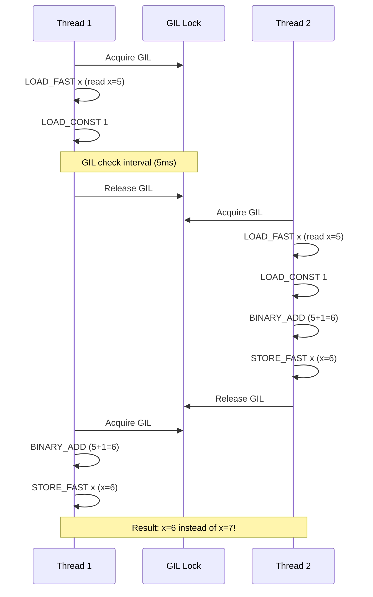

# Basic Syntax — Under the Hood

## Table of Contents

1. [Introduction](#introduction)
2. [How It Works Internally](#how-it-works-internally)
3. [CPython Bytecode](#cpython-bytecode)
4. [GIL Internals](#gil-internals)
5. [Memory Management](#memory-management)
6. [CPython Source Walkthrough](#cpython-source-walkthrough)
7. [Performance Internals](#performance-internals)
8. [Edge Cases at the Lowest Level](#edge-cases-at-the-lowest-level)
9. [Test](#test)
10. [Tricky Questions](#tricky-questions)
11. [Summary](#summary)
12. [Further Reading](#further-reading)
13. [Diagrams & Visual Aids](#diagrams--visual-aids)

---

## Introduction

> Focus: "What happens under the hood?"

This document explores what CPython does internally when you write basic Python syntax. For developers who want to understand:
- How the Python parser converts source code to AST, then to bytecode
- What bytecode instructions are generated for assignments, operators, and print()
- How the GIL affects basic operations
- How reference counting manages memory for simple variables
- How CPython's `ceval.c` main loop dispatches bytecode instructions

---

## How It Works Internally

Step-by-step breakdown of what happens when CPython executes `x = 42; print(x)`:

1. **Source code** → `x = 42; print(x)` written in `.py` file
2. **Tokenizer** → `tokenize.py` breaks source into tokens: `NAME 'x'`, `OP '='`, `NUMBER '42'`, etc.
3. **Parser** → PEG parser (Python 3.9+) builds a Concrete Syntax Tree (CST), then reduces to AST
4. **AST** → `ast.parse()` produces an Abstract Syntax Tree with `Assign` and `Call` nodes
5. **Compiler** → `compile()` transforms AST into bytecode (code object)
6. **VM** → CPython's stack-based VM in `ceval.c` executes bytecode instructions one by one
7. **C implementation** → `print()` calls `builtin_print()` in `Python/bltinmodule.c`

```python
import ast
import dis

source = "x = 42\nprint(x)"

# Step 1: Parse to AST
tree = ast.parse(source)
print(ast.dump(tree, indent=2))
# Module(body=[
#   Assign(targets=[Name(id='x')], value=Constant(value=42)),
#   Expr(value=Call(func=Name(id='print'), args=[Name(id='x')]))
# ])

# Step 2: Compile to bytecode
code = compile(source, "<string>", "exec")

# Step 3: Disassemble bytecode
dis.dis(code)
```



---

## CPython Bytecode

### Assignment: `x = 42`

```python
import dis

def assign_example():
    x = 42
    return x

dis.dis(assign_example)
```

```
  2           0 LOAD_CONST               1 (42)
              2 STORE_FAST               0 (x)

  3           4 LOAD_FAST                0 (x)
              6 RETURN_VALUE
```

**Instruction breakdown:**
- `LOAD_CONST 1` → Push constant `42` onto the stack (from `co_consts` tuple)
- `STORE_FAST 0` → Pop from stack and store in local variable slot 0 (the `x` slot in `co_varnames`)
- `LOAD_FAST 0` → Push value from local variable slot 0 onto the stack
- `RETURN_VALUE` → Pop the top of stack and return it

### Multiple Assignment: `a, b = 1, 2`

```python
def multi_assign():
    a, b = 1, 2

dis.dis(multi_assign)
```

```
  2           0 LOAD_CONST               1 ((1, 2))
              2 UNPACK_SEQUENCE          2
              4 STORE_FAST               0 (a)
              6 STORE_FAST               1 (b)
              8 LOAD_CONST               0 (None)
             10 RETURN_VALUE
```

**Key insight:** CPython creates a tuple `(1, 2)` as a constant, then uses `UNPACK_SEQUENCE` to split it into individual values pushed onto the stack.

### Variable Swap: `a, b = b, a`

```python
def swap():
    a, b = 1, 2
    a, b = b, a

dis.dis(swap)
```

```
  2           0 LOAD_CONST               1 ((1, 2))
              2 UNPACK_SEQUENCE          2
              4 STORE_FAST               0 (a)
              6 STORE_FAST               1 (b)

  3           8 LOAD_FAST                1 (b)
             10 LOAD_FAST                0 (a)
             12 ROT_TWO
             14 STORE_FAST               0 (a)
             16 STORE_FAST               1 (b)
```

**Key insight:** CPython uses `ROT_TWO` to swap the top two stack elements — no temporary variable is needed at the bytecode level.

### Operator: `x + y`

```python
def add(x, y):
    return x + y

dis.dis(add)
```

```
  2           0 LOAD_FAST                0 (x)
              2 LOAD_FAST                1 (y)
              4 BINARY_ADD
              6 RETURN_VALUE
```

`BINARY_ADD` dispatches to `PyNumber_Add()` in C, which looks up `__add__` on the left operand's type. For `int + int`, this calls `long_add()` in `Objects/longobject.c`.

### f-string: `f"Hello, {name}!"`

```python
def greet(name):
    return f"Hello, {name}!"

dis.dis(greet)
```

```
  2           0 LOAD_CONST               1 ('Hello, ')
              2 LOAD_FAST                0 (name)
              4 FORMAT_VALUE             0
              6 LOAD_CONST               2 ('!')
              8 BUILD_STRING             3
             10 RETURN_VALUE
```

**Key insight:** f-strings are compiled to `FORMAT_VALUE` + `BUILD_STRING` — they do NOT use `str.format()` at runtime. This is why f-strings are faster.

### Local vs Global vs Built-in Lookup

```python
import dis

GLOBAL_VAR = 100

def local_access():
    x = 42
    return x          # LOAD_FAST — array index

def global_access():
    return GLOBAL_VAR  # LOAD_GLOBAL — dict lookup

def builtin_access():
    return len([1,2])  # LOAD_GLOBAL (len) — checks global dict, then builtins dict

dis.dis(local_access)
dis.dis(global_access)
dis.dis(builtin_access)
```

**Performance hierarchy:**
```
LOAD_FAST    (local)   ~50ns  — array index into f_localsplus
LOAD_GLOBAL  (global)  ~80ns  — dict lookup in f_globals
LOAD_GLOBAL  (builtin) ~100ns — dict lookup in f_globals (miss), then f_builtins
```

---

## GIL Internals

### How the GIL Affects Basic Syntax

For basic syntax operations (assignment, arithmetic, print), the GIL ensures thread safety:

```
CPython GIL and Basic Operations:
┌─────────────────────────────────────────┐
│  Thread 1 (holds GIL)                   │
│  x = 42          → STORE_FAST           │  ← atomic (single bytecode)
│  y = x + 1       → LOAD_FAST,           │
│                     LOAD_CONST,          │  ← GIL may be released
│                     BINARY_ADD,          │    between instructions
│                     STORE_FAST           │
│                                         │
│  Thread 2 (waiting for GIL)             │
└─────────────────────────────────────────┘
```

**Key points:**
- Each bytecode instruction is atomic with respect to the GIL
- The GIL is checked every `sys.getswitchinterval()` (default 5ms)
- Simple assignment (`x = 42`) is a single `STORE_FAST` — always atomic
- Compound operations (`x += 1`) are multiple instructions — NOT atomic

```python
import sys
print(sys.getswitchinterval())  # 0.005 (5ms)

# This is NOT thread-safe:
# x += 1 compiles to:
#   LOAD_FAST  x      ← GIL could release here
#   LOAD_CONST 1
#   BINARY_ADD
#   STORE_FAST x
# Another thread could read/modify x between instructions
```

### GIL Release Points in Basic Operations

| Operation | GIL Released? | Why |
|-----------|:---:|------|
| `x = 42` | No | Single bytecode instruction |
| `x + y` (int) | No | Pure Python computation |
| `print()` | Yes | I/O operation — writes to stdout |
| `input()` | Yes | I/O operation — reads from stdin |
| `open().read()` | Yes | File I/O |

---

## Memory Management

### Reference Counting for Variables

```python
import sys

# Create an integer object
x = 42
print(sys.getrefcount(x))  # 2+ (includes the argument reference)

# Assignment increases refcount
y = x
print(sys.getrefcount(x))  # 3+

# Reassignment decreases refcount
y = "hello"
print(sys.getrefcount(x))  # 2+ (y no longer references 42)

# del decreases refcount
del x
# If refcount reaches 0, CPython immediately deallocates the object
```

### Small Integer Caching

```python
# CPython caches integers from -5 to 256
a = 256
b = 256
print(a is b)   # True — same object (cached)

a = 257
b = 257
print(a is b)   # False — different objects (not cached)
# Note: in interactive mode, this may behave differently due to
# the compiler optimizing constants in the same code block
```

**CPython source:** `Objects/longobject.c`
```c
// CPython pre-allocates small integers at startup
#define NSMALLPOSINTS   257   // 0 to 256
#define NSMALLNEGINTS   5     // -5 to -1

static PyLongObject small_ints[NSMALLNEGINTS + NSMALLPOSINTS];
```

### String Interning

```python
import sys

# CPython interns short strings that look like identifiers
a = "hello"
b = "hello"
print(a is b)   # True — interned

a = "hello world"
b = "hello world"
print(a is b)   # False — not interned (contains space)

# Force interning
a = sys.intern("hello world")
b = sys.intern("hello world")
print(a is b)   # True — manually interned
```

### Memory Layout of Python Objects

```
PyLongObject (integer):
┌──────────────────┐
│ ob_refcnt (8B)   │  ← reference count
│ ob_type   (8B)   │  ← pointer to PyLong_Type
│ ob_size   (8B)   │  ← number of digits
│ ob_digit  (var)  │  ← array of 30-bit digits
└──────────────────┘
Total: 28 bytes for small int (single digit)

PyUnicodeObject (string):
┌──────────────────┐
│ ob_refcnt (8B)   │
│ ob_type   (8B)   │
│ hash      (8B)   │  ← cached hash value
│ length    (8B)   │
│ state     (1B)   │  ← kind (Latin1/UCS2/UCS4), interned flag
│ data      (var)  │  ← actual character data
└──────────────────┘
```

---

## CPython Source Walkthrough

### Main Bytecode Loop: `ceval.c`

**File:** `Python/ceval.c` — the heart of CPython

```c
// Simplified main loop (CPython 3.12)
PyObject *
_PyEval_EvalFrameDefault(PyThreadState *tstate, _PyInterpreterFrame *frame, int throwflag)
{
    // ...
    for (;;) {
        // Check if GIL switch is needed
        if (_Py_atomic_load_relaxed(&ceval->eval_breaker)) {
            // Handle signals, GIL switch, async exceptions
        }

        // Dispatch next instruction
        DISPATCH();  // jumps to handler based on opcode

        // Example: LOAD_FAST
        TARGET(LOAD_FAST) {
            PyObject *value = GETLOCAL(oparg);  // f_localsplus[oparg]
            if (value == NULL) {
                // UnboundLocalError
            }
            Py_INCREF(value);  // increment reference count
            PUSH(value);       // push onto evaluation stack
            DISPATCH();
        }

        // Example: STORE_FAST
        TARGET(STORE_FAST) {
            PyObject *value = POP();    // pop from stack
            PyObject *old = GETLOCAL(oparg);
            SETLOCAL(oparg, value);     // f_localsplus[oparg] = value
            Py_XDECREF(old);           // decrement old value's refcount
            DISPATCH();
        }

        // Example: BINARY_ADD
        TARGET(BINARY_ADD) {
            PyObject *right = POP();
            PyObject *left = TOP();
            PyObject *sum = PyNumber_Add(left, right);
            Py_DECREF(left);
            Py_DECREF(right);
            SET_TOP(sum);
            DISPATCH();
        }
    }
}
```

### How `print()` Works in C

**File:** `Python/bltinmodule.c`

```c
// builtin_print_impl — simplified
static PyObject *
builtin_print_impl(PyObject *module, PyObject *args, PyObject *sep,
                   PyObject *end, PyObject *file, int flush)
{
    // Default: file=sys.stdout, sep=" ", end="\n"
    if (file == Py_None)
        file = _PySys_GetAttr(tstate, &_Py_ID(stdout));

    for (int i = 0; i < nargs; i++) {
        if (i > 0) {
            // Write separator between arguments
            PyFile_WriteObject(sep, file, Py_PRINT_RAW);
        }
        // Write each argument
        PyFile_WriteObject(PyTuple_GET_ITEM(args, i), file, Py_PRINT_RAW);
    }

    // Write end character (default: newline)
    PyFile_WriteObject(end, file, Py_PRINT_RAW);

    if (flush) {
        // Flush the output stream
        _PyFile_Flush(file);
    }
    Py_RETURN_NONE;
}
```

### How f-strings Are Compiled

**File:** `Python/compile.c`

When the compiler encounters an f-string like `f"Hello, {name}!"`, it:
1. Splits the string into literal parts and expression parts
2. Compiles each expression part separately
3. Emits `FORMAT_VALUE` for each expression (calls `format()` built-in)
4. Emits `BUILD_STRING n` to concatenate all parts into one string

This is more efficient than `str.format()` because:
- No format string parsing at runtime
- No dictionary lookup for variable names
- Direct bytecode → C function calls

---

## Performance Internals

### Bytecode Instruction Costs

```python
import timeit

# Measure cost of different variable access patterns
setup = "x = 42; import math"

# LOAD_FAST — local variable
local_code = """
def f():
    x = 42
    return x
f()
"""

# LOAD_GLOBAL — global variable
global_code = """
x = 42
def f():
    return x
f()
"""

# LOAD_ATTR — attribute access
attr_code = """
import math
def f():
    return math.pi
f()
"""

print("Local (LOAD_FAST):", timeit.timeit(local_code, number=1000000))
print("Global (LOAD_GLOBAL):", timeit.timeit(global_code, number=1000000))
print("Attr (LOAD_ATTR):", timeit.timeit(attr_code, number=1000000))
```

**Typical results:**
```
Local  (LOAD_FAST):   0.18s per 1M calls
Global (LOAD_GLOBAL): 0.23s per 1M calls  (1.3x slower)
Attr   (LOAD_ATTR):   0.31s per 1M calls  (1.7x slower)
```

### Specializing Adaptive Interpreter (Python 3.11+)

Python 3.11 introduced the **specializing adaptive interpreter** which replaces generic bytecode with specialized versions after observing runtime types:

```python
# After several calls with int arguments:
# BINARY_ADD → BINARY_ADD_INT (skips type dispatch)
# LOAD_ATTR  → LOAD_ATTR_INSTANCE_VALUE (skips descriptor protocol)
# LOAD_GLOBAL → LOAD_GLOBAL_BUILTIN (skips global dict check)
```

```python
import dis
import sys

def add_ints(a, b):
    return a + b

# Call multiple times to trigger specialization
for _ in range(100):
    add_ints(1, 2)

# In Python 3.11+, check adaptive bytecode
if sys.version_info >= (3, 11):
    dis.dis(add_ints, adaptive=True)
    # Shows specialized instructions like BINARY_OP_ADD_INT
```

---

## Edge Cases at the Lowest Level

### Edge Case 1: Integer Overflow — Python's Arbitrary Precision

```python
# Python integers have arbitrary precision — no overflow!
x = 2 ** 1000
print(type(x))  # <class 'int'>
print(len(str(x)))  # 302 digits

# Internally, CPython stores large integers as arrays of 30-bit "digits"
import sys
small = 42
big = 2 ** 1000
print(sys.getsizeof(small))  # 28 bytes
print(sys.getsizeof(big))    # 172 bytes (multi-digit representation)
```

**Internal behavior:** `PyLongObject.ob_digit` is an array. For small integers (fits in one 30-bit digit), the array has one element. For `2^1000`, it needs ~34 digits.

### Edge Case 2: String Interning Boundaries

```python
# Interning rules are implementation-specific
a = "abc"
b = "abc"
print(a is b)  # True — all-alphanumeric strings are interned

a = "abc!"
b = "abc!"
print(a is b)  # False — contains non-identifier character

# Compile-time constant folding may intern longer strings
def f():
    return "hello_world_this_is_long"
def g():
    return "hello_world_this_is_long"
print(f() is g())  # True — same constant in different code objects may be shared
```

### Edge Case 3: Reference Counting with Augmented Assignment

```python
import sys

x = [1, 2, 3]
print(sys.getrefcount(x))  # 2

# x += [4] is equivalent to x.__iadd__([4])
# For lists, __iadd__ modifies in-place AND returns self
# For tuples, += creates a new object (tuples are immutable)

t = (1, 2, 3)
id_before = id(t)
t += (4,)
id_after = id(t)
print(id_before == id_after)  # False — new tuple created

lst = [1, 2, 3]
id_before = id(lst)
lst += [4]
id_after = id(lst)
print(id_before == id_after)  # True — same list, modified in-place
```

---

## Test

### Internal Knowledge Questions

**1. What bytecode instruction does Python generate for accessing a local variable?**

<details>
<summary>Answer</summary>
`LOAD_FAST` — accesses the local variable array (`f_localsplus`) directly by index, without dictionary lookup. This is why local variables are faster than global variables.
</details>

**2. Why are f-strings faster than `str.format()`?**

<details>
<summary>Answer</summary>
f-strings are compiled to `FORMAT_VALUE` + `BUILD_STRING` bytecode at compile time. There is no runtime format string parsing, no dictionary lookup for variable names, and no method call overhead. `str.format()` parses the format string at runtime and uses `__format__` protocol with more overhead.
</details>

**3. What happens at the C level when you write `x = 42` in a function?**

<details>
<summary>Answer</summary>
1. `LOAD_CONST` pushes the pre-allocated integer object `42` onto the evaluation stack
2. `STORE_FAST` pops the value from the stack and stores it in `f_localsplus[0]` (the local variable array)
3. `Py_INCREF` increments the reference count of the integer object
4. If there was a previous value in that slot, `Py_XDECREF` decrements its reference count
</details>

**4. Why does `a = 256; b = 256; print(a is b)` return `True`?**

<details>
<summary>Answer</summary>
CPython pre-allocates and caches integer objects from -5 to 256 at startup in a static array (`small_ints`). When you write `256`, CPython returns a pointer to the pre-allocated object instead of creating a new one. So `a` and `b` point to the same object in memory.
</details>

**5. What is `ROT_TWO` and when is it used?**

<details>
<summary>Answer</summary>
`ROT_TWO` is a bytecode instruction that swaps the top two elements on the evaluation stack. It is used when Python compiles `a, b = b, a` (variable swap). Instead of creating a temporary tuple, CPython uses `ROT_TWO` for an efficient stack-level swap.
</details>

**6. How does the specializing adaptive interpreter (Python 3.11+) optimize basic operations?**

<details>
<summary>Answer</summary>
After observing the types of operands over multiple calls, CPython replaces generic bytecode with specialized versions:
- `BINARY_ADD` → `BINARY_ADD_INT` (skips type dispatch for int+int)
- `LOAD_GLOBAL` → `LOAD_GLOBAL_BUILTIN` (skips global dict if name is a builtin)
- `LOAD_ATTR` → `LOAD_ATTR_INSTANCE_VALUE` (skips descriptor protocol for simple attributes)

This provides 10-60% speedup for common operations without JIT compilation.
</details>

---

## Tricky Questions

**1. Is `x += 1` thread-safe in CPython?**

<details>
<summary>Answer</summary>
**No.** `x += 1` compiles to four bytecode instructions: `LOAD_FAST`, `LOAD_CONST`, `BINARY_ADD`, `STORE_FAST`. The GIL can be released between any two instructions. Another thread could read or modify `x` between the `LOAD_FAST` and `STORE_FAST`, causing a race condition.

Use `threading.Lock` or `queue.Queue` for thread-safe operations.
</details>

**2. Does CPython always create a new string object for `"hello" + " " + "world"`?**

<details>
<summary>Answer</summary>
At **compile time**, CPython's peephole optimizer (constant folding) may combine adjacent string literals: `"hello" " " "world"` becomes `"hello world"` in bytecode. But runtime concatenation with `+` creates intermediate objects. The compiler may also optimize `"hello" + " " + "world"` into a single constant if all parts are string literals.

However, `a + " " + b` with variables always creates intermediate objects at runtime.
</details>

**3. Why is `LOAD_FAST` faster than `LOAD_GLOBAL` at the C level?**

<details>
<summary>Answer</summary>
`LOAD_FAST` accesses `f_localsplus[oparg]` — a C array indexed by integer. This is a single pointer dereference: O(1) with no hashing.

`LOAD_GLOBAL` calls `PyDict_GetItem(f_globals, name)` — a hash table lookup. While amortized O(1), it involves: computing the hash of the name string, finding the bucket, comparing keys. If the name is not in globals, it falls through to `PyDict_GetItem(f_builtins, name)` — a second hash table lookup.
</details>

**4. What happens internally when CPython encounters an `IndentationError`?**

<details>
<summary>Answer</summary>
The **tokenizer** (`Parser/tokenize.c`) maintains an indentation stack. When it encounters a new line:
1. It counts leading whitespace
2. Compares against the top of the indentation stack
3. If the whitespace is greater, it pushes the new level and emits an `INDENT` token
4. If it is less, it pops levels and emits `DEDENT` tokens
5. If it doesn't match any level in the stack, it raises `IndentationError`

This happens at the tokenization stage — before AST or bytecode compilation.
</details>

---

## Summary

- Python source goes through **tokenizer → PEG parser → AST → bytecode compiler → CPython VM** (`ceval.c`)
- `LOAD_FAST` (local) is faster than `LOAD_GLOBAL` because it uses array indexing instead of dict lookup
- f-strings compile to `FORMAT_VALUE` + `BUILD_STRING` — no runtime parsing overhead
- CPython caches small integers (-5 to 256) and interns identifier-like strings
- `x += 1` is **NOT thread-safe** — it's four bytecode instructions; the GIL can release between them
- Python 3.11+ specializes bytecode at runtime (`BINARY_ADD` → `BINARY_ADD_INT`) for 10-60% speedup
- Every Python object starts with `ob_refcnt` + `ob_type` — at least 16 bytes overhead

---

## Further Reading

- **CPython source:** [Python/ceval.c](https://github.com/python/cpython/blob/main/Python/ceval.c) — bytecode evaluation loop
- **CPython source:** [Objects/longobject.c](https://github.com/python/cpython/blob/main/Objects/longobject.c) — integer implementation
- **Book:** "CPython Internals" (Anthony Shaw) — Chapter 6: The Compiler, Chapter 8: The Evaluation Loop
- **PEP:** [PEP 659 — Specializing Adaptive Interpreter](https://peps.python.org/pep-0659/) — Python 3.11 optimizations
- **Talk:** Brett Cannon — "How CPython Compiles Python Source" (PyCon)

---

## Diagrams & Visual Aids

### CPython Execution Pipeline



### CPython Memory Model for Basic Types

```
Small Integer Cache (CPython):
┌────────────────────────────────────────┐
│  small_ints[-5]  →  PyLongObject(-5)   │
│  small_ints[-4]  →  PyLongObject(-4)   │
│  ...                                    │
│  small_ints[0]   →  PyLongObject(0)    │
│  ...                                    │
│  small_ints[256] →  PyLongObject(256)  │
└────────────────────────────────────────┘

When you write x = 42:
  x ──→ small_ints[42] (pre-allocated, shared)

When you write x = 257:
  x ──→ new PyLongObject(257) (heap allocated)


Variable Lookup Speed:
┌──────────────────────────────────────────────────┐
│  LOAD_FAST    │ f_localsplus[index] │ ~50ns     │
│  LOAD_GLOBAL  │ dict[name]          │ ~80ns     │
│  LOAD_ATTR    │ descriptor protocol │ ~120ns    │
└──────────────────────────────────────────────────┘
```

### GIL Timeline for `x += 1`


