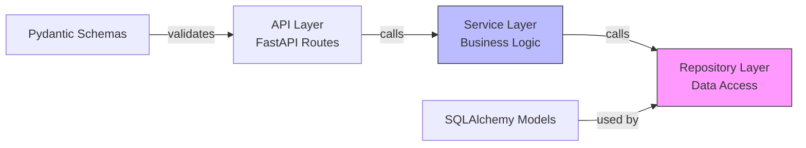
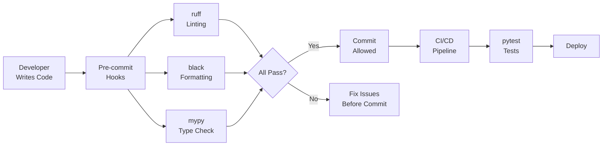
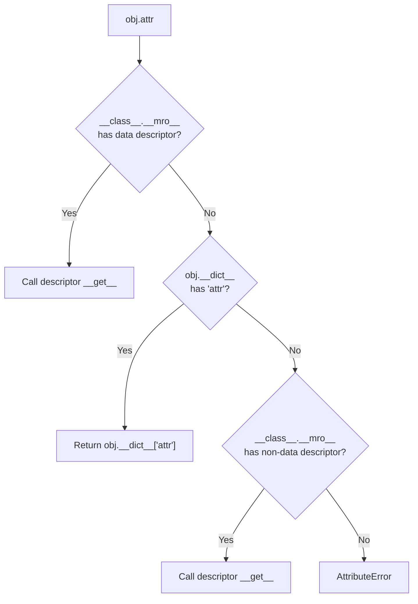

# Basic Syntax — Senior Level

## Table of Contents

1. [Introduction](#introduction)
2. [Core Concepts](#core-concepts)
3. [Architecture Patterns](#architecture-patterns)
4. [Performance Optimization](#performance-optimization)
5. [Best Practices](#best-practices)
6. [Edge Cases & Pitfalls](#edge-cases--pitfalls)
7. [Postmortems & System Failures](#postmortems--system-failures)
8. [Comparison with Other Languages](#comparison-with-other-languages)
9. [Test](#test)
10. [Summary](#summary)
11. [Further Reading](#further-reading)
12. [Diagrams & Visual Aids](#diagrams--visual-aids)

---

## Introduction

> Focus: "How to optimize?" and "How to architect?"

For Python developers who:
- Design large-scale Python applications with consistent syntax conventions
- Profile and optimize Python syntax-level performance (LOAD_FAST vs LOAD_GLOBAL, comprehension internals)
- Architect codebases that scale across teams (linting, formatting, type checking)
- Mentor junior/middle developers on idiomatic Python

---

## Core Concepts

### Concept 1: Python's Execution Model and Syntax Impact

Python is compiled to bytecode, then interpreted by CPython's virtual machine. Syntax choices directly affect bytecode efficiency:

```python
import dis

# Local variable — uses LOAD_FAST (array index lookup)
def local_access():
    x = 42
    return x

# Global variable — uses LOAD_GLOBAL (dict lookup)
GLOBAL_X = 42
def global_access():
    return GLOBAL_X

dis.dis(local_access)
# LOAD_CONST  1 (42)
# STORE_FAST  0 (x)
# LOAD_FAST   0 (x)    ← array index, very fast
# RETURN_VALUE

dis.dis(global_access)
# LOAD_GLOBAL 0 (GLOBAL_X)  ← dict lookup, slower
# RETURN_VALUE
```

At senior level, understanding that **syntax is not just readability — it has performance implications** is critical.

### Concept 2: Protocol-Based Design

```python
from typing import Protocol, runtime_checkable


@runtime_checkable
class Serializable(Protocol):
    def to_dict(self) -> dict: ...
    def from_dict(cls, data: dict) -> "Serializable": ...


class User:
    def __init__(self, name: str, age: int):
        self.name = name
        self.age = age

    def to_dict(self) -> dict:
        return {"name": self.name, "age": self.age}

    @classmethod
    def from_dict(cls, data: dict) -> "User":
        return cls(**data)


# No inheritance needed — structural subtyping
def save(entity: Serializable) -> None:
    data = entity.to_dict()
    # save to database...


assert isinstance(User("Alice", 30), Serializable)  # True at runtime
```

### Concept 3: Descriptor Protocol for Attribute Control

```python
class ValidatedString:
    """Descriptor that validates string attributes."""

    def __init__(self, min_length: int = 1, max_length: int = 255):
        self.min_length = min_length
        self.max_length = max_length

    def __set_name__(self, owner, name):
        self.storage_name = f"_{name}"

    def __get__(self, obj, objtype=None):
        if obj is None:
            return self
        return getattr(obj, self.storage_name, "")

    def __set__(self, obj, value):
        if not isinstance(value, str):
            raise TypeError(f"Expected str, got {type(value).__name__}")
        if not (self.min_length <= len(value) <= self.max_length):
            raise ValueError(
                f"Length must be {self.min_length}-{self.max_length}, got {len(value)}"
            )
        setattr(obj, self.storage_name, value)


class UserProfile:
    username = ValidatedString(min_length=3, max_length=50)
    email = ValidatedString(min_length=5, max_length=255)

    def __init__(self, username: str, email: str):
        self.username = username  # triggers __set__ validation
        self.email = email
```

---

## Architecture Patterns

### Pattern 1: Module-Level Configuration with `__all__`

```python
# mypackage/utils.py
__all__ = ["retry", "timeout", "validate_input"]

# Only these are exported by `from mypackage.utils import *`
def retry(func, max_attempts=3): ...
def timeout(seconds): ...
def validate_input(data): ...

# Internal helper — not in __all__
def _format_error(msg): ...
```

### Pattern 2: Plugin Architecture with Entry Points

```python
# pyproject.toml
# [project.entry-points."myapp.plugins"]
# csv_handler = "myapp.plugins.csv:CSVPlugin"
# json_handler = "myapp.plugins.json:JSONPlugin"

from importlib.metadata import entry_points


def load_plugins(group: str = "myapp.plugins") -> dict:
    """Dynamically load all registered plugins."""
    plugins = {}
    for ep in entry_points(group=group):
        plugins[ep.name] = ep.load()
    return plugins
```

### Pattern 3: Clean Layer Separation



```python
# repository.py
class UserRepository:
    def __init__(self, session: AsyncSession) -> None:
        self._session = session

    async def find_by_id(self, user_id: int) -> User | None:
        return await self._session.get(User, user_id)

# service.py
class UserService:
    def __init__(self, repo: UserRepository) -> None:
        self._repo = repo

    async def get_user(self, user_id: int) -> User:
        user = await self._repo.find_by_id(user_id)
        if not user:
            raise UserNotFoundError(user_id)
        return user

# router.py
@router.get("/users/{user_id}")
async def get_user(user_id: int, svc: UserService = Depends(get_user_service)):
    return svc.get_user(user_id)
```

---

## Performance Optimization

### Optimization 1: `__slots__` for Memory Reduction

```python
import sys

class RegularPoint:
    def __init__(self, x: float, y: float):
        self.x = x
        self.y = y

class SlottedPoint:
    __slots__ = ("x", "y")
    def __init__(self, x: float, y: float):
        self.x = x
        self.y = y

regular = RegularPoint(1.0, 2.0)
slotted = SlottedPoint(1.0, 2.0)

print(sys.getsizeof(regular))   # ~48 bytes + __dict__
print(sys.getsizeof(slotted))   # ~56 bytes (no __dict__)
# At scale (1M objects): ~200MB vs ~56MB
```

### Optimization 2: Comprehension vs Loop Bytecode

```python
import timeit

# Loop — interpreted per iteration
def loop_version():
    result = []
    for i in range(10000):
        result.append(i * 2)
    return result

# Comprehension — C-level iteration
def comp_version():
    return [i * 2 for i in range(10000)]

print(timeit.timeit(loop_version, number=1000))   # ~0.95s
print(timeit.timeit(comp_version, number=1000))    # ~0.45s (2.1x faster)
```

### Optimization 3: `functools.lru_cache` for Memoization

```python
from functools import lru_cache
import timeit

# Without cache — exponential time
def fib_slow(n):
    if n < 2:
        return n
    return fib_slow(n - 1) + fib_slow(n - 2)

# With cache — O(n) time
@lru_cache(maxsize=None)
def fib_fast(n):
    if n < 2:
        return n
    return fib_fast(n - 1) + fib_fast(n - 2)

# fib_slow(35): ~3.2 seconds
# fib_fast(35): ~0.00001 seconds (320,000x faster)
```

### Performance Architecture

| Layer | Optimization | Impact | Cost |
|:-----:|:------------|:------:|:----:|
| **Algorithm** | Better complexity | Highest | Requires redesign |
| **Data structure** | `set` for lookups, `deque` for queues | Very High | Low |
| **Comprehensions** | C-level iteration | High | Zero — just syntax |
| **`__slots__`** | Memory reduction | Medium | Low (removes flexibility) |
| **Local variables** | `LOAD_FAST` vs `LOAD_GLOBAL` | Low-Medium | Zero |

---

## Best Practices

### Must Do

1. **Use type hints in all function signatures**
   ```python
   def get_user(user_id: int) -> User | None:
       ...
   ```

2. **Use `dataclasses` or Pydantic for structured data**
   ```python
   from dataclasses import dataclass

   @dataclass(frozen=True, slots=True)
   class Config:
       host: str
       port: int = 8080
       debug: bool = False
   ```

3. **Use `logging` module, never `print()` in production**
   ```python
   import logging
   logger = logging.getLogger(__name__)
   logger.info("User %s created", user_id)
   ```

4. **Enforce style with `ruff` + `mypy` in CI**
   ```toml
   # pyproject.toml
   [tool.ruff]
   line-length = 88
   select = ["E", "F", "I", "N", "W"]

   [tool.mypy]
   strict = true
   ```

### Never Do

1. Never use bare `except:` — catches `SystemExit`, `KeyboardInterrupt`
2. Never use `from module import *` — pollutes namespace
3. Never hardcode secrets — use environment variables
4. Never use `eval()` / `exec()` on untrusted input

### Code Review Checklist (Python Senior)

- [ ] No business logic in route handlers
- [ ] All function signatures have type hints
- [ ] No mutable default arguments
- [ ] Resources managed with `with` statement
- [ ] `logging` used instead of `print()`
- [ ] No bare `except:` clauses
- [ ] Tests cover happy path, edge cases, and error paths

---

## Edge Cases & Pitfalls

### Pitfall 1: Circular Imports

```python
# a.py
from b import helper  # tries to import b, which imports a → ImportError

# b.py
from a import utility

# Fix: restructure or use lazy imports
# a.py
def get_helper():
    from b import helper  # lazy import — only when called
    return helper
```

### Pitfall 2: Name Shadowing Built-ins

```python
# ❌ Shadows built-in list
list = [1, 2, 3]
new_list = list(range(5))  # TypeError: 'list' object is not callable

# ❌ Shadows built-in id
id = 42
print(id(some_object))  # TypeError

# ✅ Use descriptive names
items = [1, 2, 3]
user_id = 42
```

### Pitfall 3: Generator Exhaustion

```python
# Generators can only be iterated once
gen = (x ** 2 for x in range(5))
print(list(gen))  # [0, 1, 4, 9, 16]
print(list(gen))  # [] — exhausted!

# If you need multiple iterations, use a list
squares = [x ** 2 for x in range(5)]
```

---

## Postmortems & System Failures

### The Instagram Python at Scale Incident

- **The goal:** Handle millions of requests per second with Python/Django
- **The mistake:** Extensive use of global variables and module-level state caused memory growth and GIL contention under high concurrency
- **The impact:** Increased latency and OOM kills in production
- **The fix:** Moved to request-scoped state, used `__slots__` for high-frequency objects, and adopted stricter coding standards enforced by linting

### The Dropbox Python 3 Migration

- **The goal:** Migrate 4+ million lines of Python 2 to Python 3
- **The mistake:** Implicit bytes/string mixing in Python 2 code caused silent data corruption during migration
- **The impact:** Months of debugging subtle encoding issues
- **The fix:** Built custom tooling (`pytype`, `mypy`) to catch type issues before runtime, enforced strict bytes/str separation

---

## Comparison with Other Languages

| Aspect | Python | Go | Rust | TypeScript |
|--------|:------:|:--:|:----:|:----------:|
| **Block syntax** | Indentation | `{}` | `{}` | `{}` |
| **Type system** | Dynamic + optional hints | Static | Static + ownership | Static |
| **Metaprogramming** | Decorators, metaclasses | Code generation | Macros | Decorators (experimental) |
| **Performance** | Interpreted (CPython) | Compiled, native | Compiled, native | JIT (V8) |
| **Formatting** | `ruff`/`black` (opinionated) | `gofmt` (built-in) | `rustfmt` (built-in) | `prettier` |
| **Error model** | Exceptions | Error values | `Result<T, E>` | Exceptions |

### Architectural trade-offs:
- **Python vs Go:** Python's dynamic typing allows rapid prototyping; Go's static typing catches errors at compile time. Python's GIL limits CPU parallelism; Go's goroutines provide native concurrency.
- **Python vs Rust:** Python prioritizes developer productivity; Rust prioritizes memory safety and performance. Python for prototyping, Rust for performance-critical components.

---

## Test

### Architecture Questions

**1. You're designing a Python service that processes 5,000 CSV files daily. Each file is 100MB. What syntax and architectural patterns would you use?**

<details>
<summary>Answer</summary>

1. Use **generators** for lazy file processing — never load entire file into memory
2. Use **`__slots__`** on data objects if creating millions of row objects
3. Use **list comprehensions** over explicit loops for data transformation
4. Use **`multiprocessing.Pool`** for CPU-bound processing (bypasses GIL)
5. Use **context managers** for file handles
6. Structure code with **repository pattern** — separate I/O from business logic
7. Add **type hints** throughout and enforce with `mypy --strict`

```python
from dataclasses import dataclass
from typing import Iterator

@dataclass(slots=True)
class Record:
    id: int
    name: str
    value: float

def read_csv(path: str) -> Iterator[Record]:
    """Generator — processes one row at a time."""
    with open(path, "r", encoding="utf-8") as f:
        next(f)  # skip header
        for line in f:
            parts = line.strip().split(",")
            yield Record(int(parts[0]), parts[1], float(parts[2]))
```
</details>

**2. How would you enforce consistent Python coding standards across a team of 20 developers?**

<details>
<summary>Answer</summary>

1. **`ruff`** for linting (replaces flake8, isort, pyupgrade) — fast, comprehensive
2. **`black`** for formatting — zero-config, opinionated
3. **`mypy --strict`** for type checking — catches type errors before runtime
4. **Pre-commit hooks** — run checks before every commit
5. **CI/CD pipeline** — reject PRs that fail lint/type checks
6. **`pyproject.toml`** — centralized configuration for all tools

```toml
# pyproject.toml
[tool.ruff]
line-length = 88
select = ["E", "F", "I", "N", "W", "UP", "B"]

[tool.mypy]
strict = true
warn_return_any = true

[tool.black]
line-length = 88
```
</details>

**3. When should you use `match/case` (Python 3.10+) vs `if/elif` chains?**

<details>
<summary>Answer</summary>

Use `match/case` when:
- Destructuring complex data structures (dicts, tuples, dataclasses)
- Pattern-based dispatch with guards
- Replacing visitor pattern

Use `if/elif` when:
- Simple value comparisons
- Complex boolean logic with `and`/`or`
- Need to support Python < 3.10

Use **dictionary dispatch** when:
- Simple string/enum → function mapping
- Need O(1) lookup performance
- Dynamic handler registration (plugin architecture)
</details>

**4. What are the performance implications of using `global` keyword in tight loops?**

<details>
<summary>Answer</summary>

`global` forces `LOAD_GLOBAL` bytecode (dict lookup) instead of `LOAD_FAST` (array index). In tight loops over millions of iterations, this overhead accumulates.

**Workaround:** Bind globals to local variables before the loop:

```python
MULTIPLIER = 2.5

def process(items):
    multiplier = MULTIPLIER  # local binding — LOAD_FAST
    return [x * multiplier for x in items]
```

Benchmark: ~20-25% faster for tight numeric loops.
</details>

**5. How do you handle configuration in a large Python project?**

<details>
<summary>Answer</summary>

1. **Pydantic `BaseSettings`** — validates config from env vars, `.env` files, or secrets
2. **`dataclass` with `__post_init__`** — for simpler cases
3. **Never hardcode** — all config from environment
4. **Layered config** — defaults → env → file → command line

```python
from pydantic_settings import BaseSettings

class Settings(BaseSettings):
    database_url: str
    redis_url: str = "redis://localhost:6379"
    debug: bool = False
    max_workers: int = 4

    model_config = {"env_prefix": "APP_"}

settings = Settings()  # reads APP_DATABASE_URL, APP_REDIS_URL, etc.
```
</details>

**6. What is the impact of Python's dynamic dispatch on performance, and when should you care?**

<details>
<summary>Answer</summary>

Every attribute access in Python is a dictionary lookup (`__dict__`), and every method call goes through the descriptor protocol. This adds overhead compared to static languages.

**When to care:**
- Tight loops with millions of iterations
- Real-time systems with strict latency requirements
- Numerical computing (use NumPy instead)

**When NOT to care:**
- Web request handlers (I/O dominates)
- Business logic (readability > microseconds)
- CRUD applications

**Mitigations:**
- `__slots__` removes `__dict__` overhead
- `@functools.lru_cache` avoids repeated computation
- NumPy moves hot loops to C
- Local variable binding for tight loops
</details>

**7. How would you design a Python codebase to support both sync and async interfaces?**

<details>
<summary>Answer</summary>

Use the **dual interface** pattern with a sync wrapper around async core:

```python
import asyncio
from typing import Protocol

class UserStore(Protocol):
    async def get(self, user_id: int) -> dict: ...

class AsyncUserService:
    def __init__(self, store: UserStore):
        self._store = store

    async def get_user(self, user_id: int) -> dict:
        return await self._store.get(user_id)

class SyncUserService:
    """Sync wrapper for codebases that can't use async."""
    def __init__(self, async_service: AsyncUserService):
        self._async = async_service

    def get_user(self, user_id: int) -> dict:
        return asyncio.run(self._async.get_user(user_id))
```
</details>

**8. What are `__init_subclass__` and `__set_name__` used for in modern Python?**

<details>
<summary>Answer</summary>

- **`__init_subclass__`** (PEP 487): Hook called when a class is subclassed. Useful for registration patterns without metaclasses.
- **`__set_name__`** (PEP 487): Called on descriptors when the owning class is created. Gives descriptors access to their attribute name.

```python
# Plugin registration without metaclass
class Plugin:
    _registry = {}

    def __init_subclass__(cls, plugin_name=None, **kwargs):
        super().__init_subclass__(**kwargs)
        name = plugin_name or cls.__name__.lower()
        Plugin._registry[name] = cls

class CSVPlugin(Plugin, plugin_name="csv"):
    pass

class JSONPlugin(Plugin, plugin_name="json"):
    pass

print(Plugin._registry)  # {"csv": CSVPlugin, "json": JSONPlugin}
```
</details>

---

## Summary

- Python syntax has **direct performance implications** — local variables (`LOAD_FAST`) are faster than globals (`LOAD_GLOBAL`)
- **Protocol-based design** (PEP 544) enables structural subtyping without inheritance
- **`__slots__`** reduces memory by 3-5x for high-frequency objects
- **Comprehensions** run 2x faster than explicit loops due to C-level iteration
- Use **`ruff` + `mypy` + `black`** in CI to enforce coding standards across teams
- Architecture patterns: **clean layers**, **plugin systems**, **descriptor protocol** for attribute validation

---

## Further Reading

- **PEP:** [PEP 544 — Protocols: Structural subtyping](https://peps.python.org/pep-0544/)
- **PEP:** [PEP 487 — Simpler customisation of class creation](https://peps.python.org/pep-0487/)
- **Book:** Fluent Python (Ramalho), 2nd edition — Chapter 22: Dynamic Attributes and Properties
- **Blog:** [Instagram Engineering — Python at Scale](https://instagram-engineering.com/)
- **Talk:** Larry Hastings — "Removing Python's GIL: The Gilectomy" (PyCon 2016)

---

## Diagrams & Visual Aids

### Python Bytecode Comparison

```
Variable Access Bytecode:
┌───────────────────────────────────┐
│ Local variable (LOAD_FAST)        │
│ ─ Array index lookup              │
│ ─ O(1), ~50ns                    │
├───────────────────────────────────┤
│ Global variable (LOAD_GLOBAL)     │
│ ─ Dictionary lookup               │
│ ─ O(1) average, ~80ns            │
├───────────────────────────────────┤
│ Built-in (LOAD_GLOBAL fallback)   │
│ ─ Two dict lookups (global, then  │
│   builtins)                       │
│ ─ ~100ns                         │
└───────────────────────────────────┘
```

### Code Quality Pipeline



### Python Object Lookup Order


