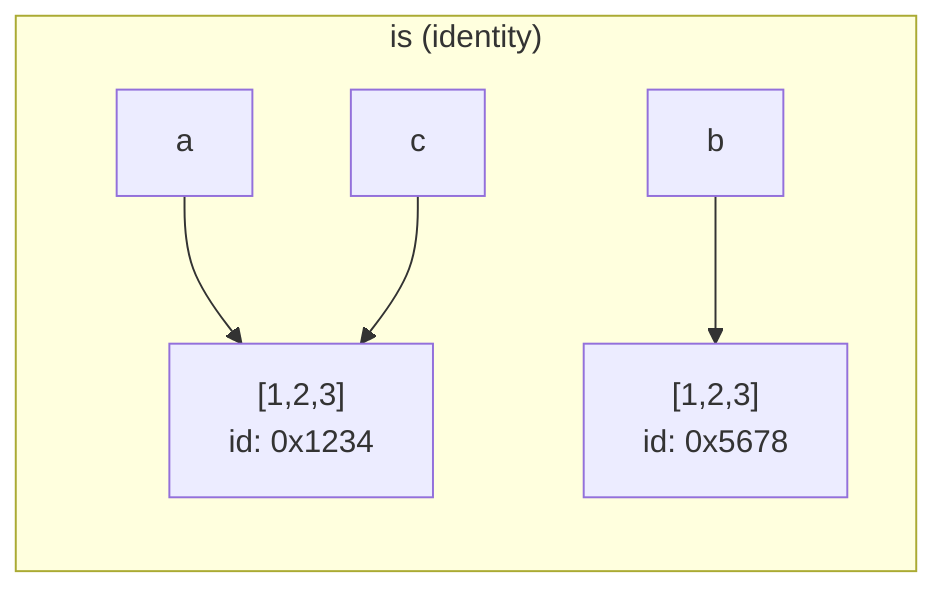
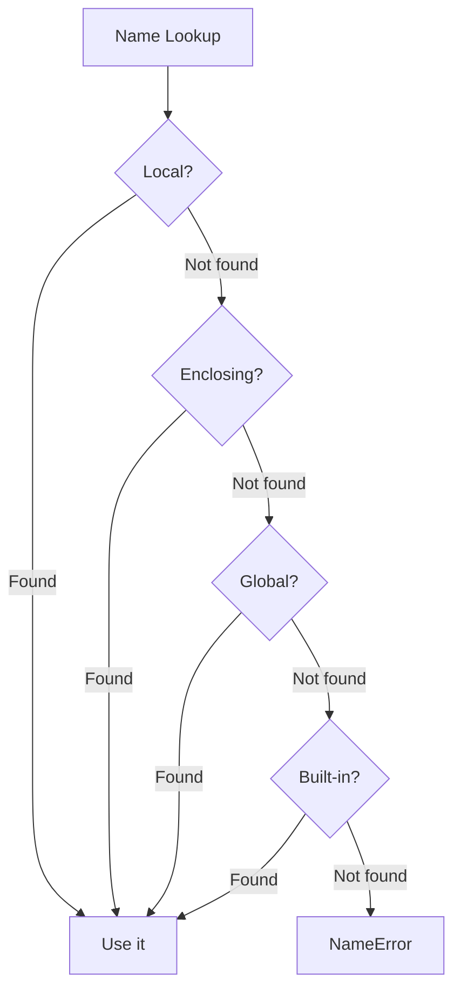
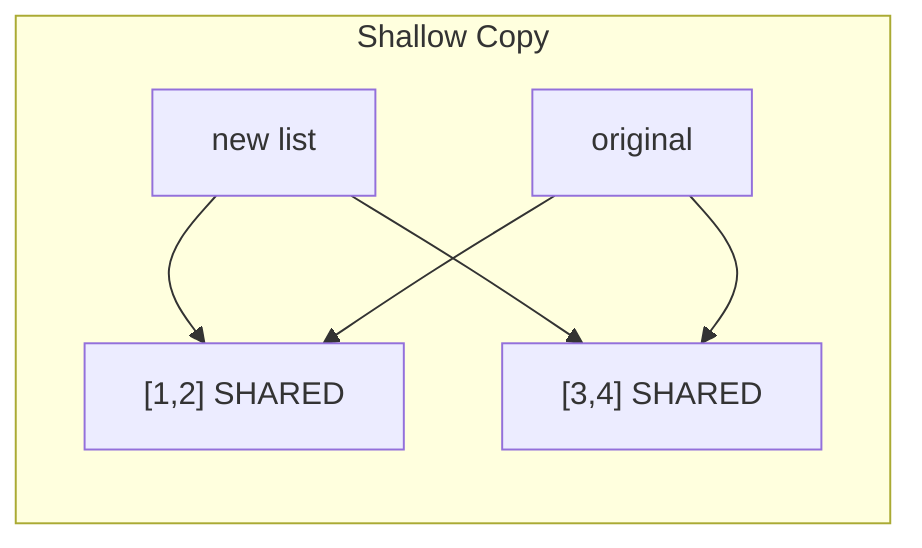

# Variables and Data Types — Interview Questions

## Table of Contents

1. [Junior Level Questions](#junior-level-questions)
2. [Middle Level Questions](#middle-level-questions)
3. [Senior Level Questions](#senior-level-questions)
4. [Professional Level Questions](#professional-level-questions)
5. [Coding Challenges](#coding-challenges)
6. [System Design Questions](#system-design-questions)
7. [Behavioral / Scenario Questions](#behavioral--scenario-questions)

---

## Junior Level Questions

### Q1: What are the basic data types in Python?

<details>
<summary>Answer</summary>

Python has these core built-in types:

| Type | Example | Mutable? |
|------|---------|----------|
| `int` | `42`, `-7`, `1_000` | No |
| `float` | `3.14`, `1e10` | No |
| `complex` | `3+4j` | No |
| `str` | `"hello"`, `'world'` | No |
| `bool` | `True`, `False` | No |
| `NoneType` | `None` | No |
| `list` | `[1, 2, 3]` | Yes |
| `dict` | `{"a": 1}` | Yes |
| `tuple` | `(1, 2, 3)` | No |
| `set` | `{1, 2, 3}` | Yes |

```python
# Verify types
print(type(42))        # <class 'int'>
print(type(3.14))      # <class 'float'>
print(type("hello"))   # <class 'str'>
print(type(True))      # <class 'bool'>
print(type(None))      # <class 'NoneType'>
```

**Key point:** All values in Python are objects. Even `int` and `bool` are full objects with methods.

</details>

---

### Q2: What is the difference between `is` and `==`?

<details>
<summary>Answer</summary>

- `==` compares **values** (calls `__eq__`)
- `is` compares **identity** (checks if two names point to the same object in memory)

```python
a = [1, 2, 3]
b = [1, 2, 3]
c = a

print(a == b)   # True — same value
print(a is b)   # False — different objects
print(a is c)   # True — same object

# Use 'is' only for singletons:
x = None
print(x is None)    # Correct
print(x == None)    # Works but bad practice (PEP 8)
```



**Rule of thumb:** Use `==` for everything except `None`, `True`, `False` checks.

</details>

---

### Q3: What is the difference between mutable and immutable types?

<details>
<summary>Answer</summary>

**Immutable:** value cannot be changed after creation. Any "modification" creates a new object.
- `int`, `float`, `str`, `tuple`, `frozenset`, `bool`, `None`

**Mutable:** value can be changed in place. The `id()` stays the same.
- `list`, `dict`, `set`, `bytearray`

```python
# Immutable: str
s = "hello"
print(id(s))       # e.g., 140...100
s = s + " world"
print(id(s))       # e.g., 140...200 — DIFFERENT object

# Mutable: list
lst = [1, 2, 3]
print(id(lst))     # e.g., 140...300
lst.append(4)
print(id(lst))     # e.g., 140...300 — SAME object
```

**Why it matters for interviews:**
- Mutable defaults in functions are shared across calls (classic bug)
- Mutable objects cannot be used as dict keys or set members
- Passing mutable objects to functions allows the function to modify the caller's data

</details>

---

### Q4: How does Python handle variable naming? What are the rules?

<details>
<summary>Answer</summary>

**Rules:**
1. Must start with a letter (a-z, A-Z) or underscore (`_`)
2. Can contain letters, digits (0-9), and underscores
3. Case-sensitive (`name` != `Name`)
4. Cannot be a Python keyword (`if`, `for`, `class`, etc.)

**Conventions (PEP 8):**

| Type | Convention | Example |
|------|-----------|---------|
| Variable | snake_case | `user_name` |
| Function | snake_case | `get_user()` |
| Constant | UPPER_SNAKE_CASE | `MAX_RETRIES` |
| Class | PascalCase | `UserProfile` |
| Private | leading underscore | `_internal` |
| Name-mangled | double underscore | `__private` |
| Dunder | double both sides | `__init__` |

```python
# Valid
user_name = "Alice"
_private_var = 42
__mangled = "hidden"
count2 = 10

# Invalid
# 2count = 10      # starts with digit
# my-var = 5       # hyphen
# class = "hello"  # keyword
```

</details>

---

### Q5: What does `type()` vs `isinstance()` do? When to use which?

<details>
<summary>Answer</summary>

```python
x = True

# type() returns the exact type
print(type(x))                   # <class 'bool'>
print(type(x) == bool)           # True
print(type(x) == int)            # False — exact match only

# isinstance() checks type AND its superclasses
print(isinstance(x, bool))       # True
print(isinstance(x, int))        # True — bool is subclass of int
print(isinstance(x, (int, str))) # True — checks multiple types
```

**When to use which:**
- `isinstance()` — preferred in production code, respects inheritance
- `type()` — use when you need the exact type, not subclasses

```python
# Real-world example: polymorphism
def double(value):
    if isinstance(value, (int, float)):  # Handles int, float, bool, Decimal subclasses
        return value * 2
    if isinstance(value, str):
        return value + value
    raise TypeError(f"Cannot double {type(value).__name__}")
```

</details>

---

### Q6: What is `None` and how should you check for it?

<details>
<summary>Answer</summary>

`None` is Python's null value. It is the sole instance of `NoneType`. It is a singleton — there is only one `None` object in the entire interpreter.

```python
# Always use 'is' for None checks (PEP 8)
x = None

# Correct
if x is None:
    print("No value")

if x is not None:
    print("Has value")

# Incorrect (works but bad practice)
if x == None:     # Calls __eq__ which can be overridden
    print("No value")

# Falsy check (different meaning!)
if not x:         # True for None, but also for 0, "", [], False
    print("Falsy")
```

**Common use:** default function arguments.

```python
def greet(name: str | None = None) -> str:
    if name is None:
        return "Hello, stranger!"
    return f"Hello, {name}!"
```

</details>

---

### Q7: What is the output of this code?

```python
a = [1, 2, 3]
b = a
b.append(4)
print(a)
```

<details>
<summary>Answer</summary>

Output: `[1, 2, 3, 4]`

`b = a` does not copy the list. Both `a` and `b` point to the same list object. When you modify through `b`, `a` sees the change too.

```python
# To create an independent copy:
b = a.copy()        # shallow copy
b = list(a)          # shallow copy
b = a[:]             # shallow copy
import copy
b = copy.deepcopy(a) # deep copy (for nested structures)
```

</details>

---

## Middle Level Questions

### Q8: Explain Python's LEGB scope rule with an example.

<details>
<summary>Answer</summary>

LEGB stands for: **Local -> Enclosing -> Global -> Built-in**

Python resolves variable names by searching these scopes in order:

```python
x = "global"                    # Global scope

def outer():
    x = "enclosing"             # Enclosing scope

    def inner():
        x = "local"             # Local scope
        print(x)                # "local" — found in Local

    def inner2():
        print(x)                # "enclosing" — found in Enclosing

    inner()
    inner2()

outer()
print(x)                        # "global" — found in Global
print(len)                      # <built-in function len> — found in Built-in
```



**Modifying outer scopes:**
- `global x` — declares x as global (skip local scope)
- `nonlocal x` — declares x from the nearest enclosing scope

</details>

---

### Q9: What is the mutable default argument pitfall?

<details>
<summary>Answer</summary>

Default arguments are evaluated once at function definition time, not at each call. If the default is mutable (list, dict, set), it is shared across all calls.

```python
# BUG: shared mutable default
def add_item(item, items=[]):
    items.append(item)
    return items

print(add_item("a"))  # ['a']
print(add_item("b"))  # ['a', 'b'] — BUG! Expected ['b']
print(add_item("c"))  # ['a', 'b', 'c']

# FIX: use None sentinel
def add_item(item, items=None):
    if items is None:
        items = []
    items.append(item)
    return items

print(add_item("a"))  # ['a']
print(add_item("b"))  # ['b'] — correct!
```

**Why this happens:** The default `[]` is created once when `def` is executed. The same list object is reused for every call that does not provide `items`.

**Follow-up:** You can inspect default values with `add_item.__defaults__`.

</details>

---

### Q10: What is the difference between shallow copy and deep copy?

<details>
<summary>Answer</summary>

```python
import copy

original = [[1, 2], [3, 4]]

# Shallow copy: new outer container, same inner objects
shallow = copy.copy(original)
shallow[0].append(99)
print(original)  # [[1, 2, 99], [3, 4]] — inner list was shared!

# Reset
original = [[1, 2], [3, 4]]

# Deep copy: new outer AND inner containers
deep = copy.deepcopy(original)
deep[0].append(99)
print(original)  # [[1, 2], [3, 4]] — independent!
```



| Method | New container? | New nested objects? | Use when |
|--------|:-:|:-:|------|
| Assignment (`b = a`) | No | No | Need an alias |
| `copy.copy()` | Yes | No | Flat structures |
| `copy.deepcopy()` | Yes | Yes | Nested structures |

</details>

---

### Q11: How do type hints work in Python? Do they affect runtime?

<details>
<summary>Answer</summary>

Type hints are annotations that describe expected types. They have **no runtime effect** by default — Python does not enforce them.

```python
from typing import Optional

def greet(name: str, age: int) -> str:
    return f"Hello, {name}! Age: {age}"

# These "work" at runtime despite wrong types:
result = greet(42, "hello")  # No error! Python ignores hints at runtime
print(result)                # "Hello, 42! Age: hello"

# Type hints are stored in __annotations__:
print(greet.__annotations__)
# {'name': <class 'str'>, 'age': <class 'int'>, 'return': <class 'str'>}
```

**How to enforce types:**
1. **Static analysis:** `mypy greet.py` or `pyright` (catches errors before runtime)
2. **Runtime validation:** Pydantic, beartype, or manual `isinstance()` checks

```python
# With Pydantic (runtime validation)
from pydantic import BaseModel

class User(BaseModel):
    name: str
    age: int

user = User(name="Alice", age=30)   # OK
# user = User(name="Alice", age="thirty")  # ValidationError at runtime
```

</details>

---

### Q12: What is `id()` and when would you use it?

<details>
<summary>Answer</summary>

`id()` returns the unique identity (memory address in CPython) of an object. Two objects with the same `id()` are the same object in memory.

```python
a = [1, 2, 3]
b = a
c = [1, 2, 3]

print(id(a))           # e.g., 140234866357520
print(id(b))           # same as id(a) — b is an alias
print(id(c))           # different — c is a different object
print(a is b)          # True — same id
print(a is c)          # False — different id

# Practical use: debugging aliasing issues
def debug_refs(*args):
    for i, obj in enumerate(args):
        print(f"  arg[{i}]: id={id(obj)}, value={obj!r}")
```

**When to use:**
- Debugging to check if two variables point to the same object
- Understanding caching/interning behavior
- Never for value comparison (use `==` instead)

</details>

---

### Q13: What is the output? Explain why.

```python
def f(a, b=[]):
    b.append(a)
    return b

print(f(1))
print(f(2, []))
print(f(3))
```

<details>
<summary>Answer</summary>

```
[1]
[2]
[1, 3]
```

**Explanation:**
1. `f(1)` — uses default `b=[]`, appends 1, returns `[1]`. The default list now contains `[1]`.
2. `f(2, [])` — uses a NEW list `[]`, appends 2, returns `[2]`. The default list is still `[1]`.
3. `f(3)` — uses the default list again (which is `[1]`), appends 3, returns `[1, 3]`.

The second call does not affect the default because a new list was explicitly passed.

</details>

---

## Senior Level Questions

### Q14: How does Python's garbage collector handle reference cycles?

<details>
<summary>Answer</summary>

CPython uses two mechanisms:

1. **Reference counting** (primary) — each object has `ob_refcnt`. When it reaches 0, the object is immediately freed. Cannot handle cycles.

2. **Generational GC** (secondary) — detects and collects reference cycles.

```python
import gc

class Node:
    def __init__(self, name):
        self.name = name
        self.ref = None

# Create a cycle
a = Node("A")
b = Node("B")
a.ref = b
b.ref = a  # a -> b -> a (cycle)

# Delete external references
del a, b
# refcount of both Nodes is still 1 (from the cycle)
# Only the GC can clean this up

collected = gc.collect()
print(f"Collected {collected} objects")
```

**Generational GC:**
- 3 generations: gen0 (young), gen1, gen2 (old)
- New objects start in gen0
- Objects that survive collection are promoted
- Thresholds: `(700, 10, 10)` by default
- Uses a variant of tri-color marking to find unreachable cycles

**When GC cannot collect:**
- Objects with `__del__` and cycles (before Python 3.4 / PEP 442)
- Python 3.4+ can handle this via safe finalization

</details>

---

### Q15: Explain `__slots__` and its impact on memory and performance.

<details>
<summary>Answer</summary>

By default, each Python instance has a `__dict__` (a dict) for storing attributes. `__slots__` replaces this with a fixed-size array, saving ~100+ bytes per instance.

```python
import sys

class Regular:
    def __init__(self, x, y):
        self.x = x
        self.y = y

class Slotted:
    __slots__ = ("x", "y")
    def __init__(self, x, y):
        self.x = x
        self.y = y

r = Regular(1.0, 2.0)
s = Slotted(1.0, 2.0)

print(f"Regular: {sys.getsizeof(r)} + {sys.getsizeof(r.__dict__)} = "
      f"{sys.getsizeof(r) + sys.getsizeof(r.__dict__)} bytes")
print(f"Slotted: {sys.getsizeof(s)} bytes")

# Slotted instances cannot have arbitrary attributes:
# s.z = 3  # AttributeError: 'Slotted' object has no attribute 'z'
```

**Trade-offs:**

| Feature | With `__dict__` | With `__slots__` |
|---------|:---:|:---:|
| Memory per instance | Higher (~200+ bytes) | Lower (~56-80 bytes) |
| Attribute access speed | Dict lookup | Array index (faster) |
| Dynamic attributes | Yes | No |
| Weak references | Yes | Only if `__weakref__` in slots |
| Inheritance | Straightforward | Must be consistent across hierarchy |

</details>

---

### Q16: What is the descriptor protocol and how does it relate to types?

<details>
<summary>Answer</summary>

Descriptors are objects that define `__get__`, `__set__`, and/or `__delete__`. They power `property`, `classmethod`, `staticmethod`, and `__slots__`.

```python
class Validated:
    """Descriptor that validates type on assignment."""
    def __init__(self, expected_type):
        self.expected_type = expected_type

    def __set_name__(self, owner, name):
        self.name = name
        self.storage = f"_validated_{name}"

    def __get__(self, obj, objtype=None):
        if obj is None:
            return self
        return getattr(obj, self.storage, None)

    def __set__(self, obj, value):
        if not isinstance(value, self.expected_type):
            raise TypeError(
                f"{self.name} must be {self.expected_type.__name__}, "
                f"got {type(value).__name__}"
            )
        setattr(obj, self.storage, value)


class Product:
    name = Validated(str)
    price = Validated(int)

    def __init__(self, name: str, price: int):
        self.name = name    # Goes through Validated.__set__
        self.price = price

p = Product("Widget", 999)
# p.price = "free"  # TypeError: price must be int, got str
```

**Descriptor lookup order:** data descriptor > instance `__dict__` > non-data descriptor > class `__dict__`

</details>

---

### Q17: What is the output? This is a classic interview trap.

```python
t = ([1, 2],)
try:
    t[0] += [3, 4]
except TypeError as e:
    print(f"Error: {e}")
finally:
    print(f"t = {t}")
```

<details>
<summary>Answer</summary>

```
Error: 'tuple' object does not support item assignment
t = ([1, 2, 3, 4],)
```

**Why both error AND mutation happen:**

`t[0] += [3, 4]` compiles to:
1. `t[0].__iadd__([3, 4])` — this SUCCEEDS, modifying the list in place. Returns the same list.
2. `t[0] = <result>` — this FAILS with `TypeError` because tuples are immutable.

The list was already mutated in step 1 before the error in step 2.

```python
import dis
dis.dis("t[0] += [3, 4]")
# LOAD_NAME       t
# LOAD_CONST      0
# DUP_TOP_TWO
# BINARY_SUBSCR          <- t[0] (succeeds)
# LOAD_CONST      (3, 4) as list
# INPLACE_ADD             <- list.__iadd__([3,4]) (succeeds, mutates list)
# ROT_THREE
# STORE_SUBSCR            <- t[0] = result (FAILS — tuple immutable)
```

</details>

---

## Professional Level Questions

### Q18: How does CPython represent integers internally?

<details>
<summary>Answer</summary>

CPython uses arbitrary-precision arithmetic. Internally, integers are stored as arrays of "digits" in `PyLongObject`:

```c
// Include/cpython/longintrepr.h
struct _longobject {
    PyObject_VAR_HEAD       // ob_refcnt + ob_type + ob_size
    digit ob_digit[1];      // flexible array of 30-bit digits
};
```

- Each `digit` is a `uint32_t` using only 30 bits (0 to 2^30-1)
- `ob_size` encodes both the number of digits and the sign (negative = negative ob_size)
- Small integers (-5 to 256) are pre-allocated as singletons

```python
import sys

# Size grows in steps of 4 bytes (one digit = 4 bytes, 30 bits used)
for n in [0, 2**29, 2**30, 2**59, 2**60, 2**89, 2**90]:
    print(f"  {n:>30}: {sys.getsizeof(n)} bytes")

# Memory layout:
# ob_refcnt:  8 bytes
# ob_type:    8 bytes
# ob_size:    8 bytes  (number of digits + sign)
# ob_digit[]: 4 bytes per digit
# Total: 28 bytes for 0-digit int, +4 per additional digit
```

</details>

---

### Q19: Explain the pymalloc allocator and its arena/pool/block structure.

<details>
<summary>Answer</summary>

CPython has a custom allocator for small objects (<= 512 bytes):

```
Level 3: Arenas (256 KB)
    ├── Pool 0 (4 KB) — size class 16
    ├── Pool 1 (4 KB) — size class 32
    ├── Pool 2 (4 KB) — size class 16
    └── ...

Level 2: Pools (4 KB = system page)
    ├── Block 0 (16 bytes)
    ├── Block 1 (16 bytes)
    ├── Block 2 (16 bytes) — FREE
    └── ...

Level 1: Blocks (8, 16, 24, ..., 512 bytes)
    — The actual memory used by PyObject
```

**Key details:**
- 64 size classes: 8, 16, 24, ..., 512 bytes (increments of 8)
- Each pool serves one size class
- Free blocks are managed as a singly-linked free list within each pool
- Arenas are sorted by the number of free pools (most empty arenas are freed first)
- Objects > 512 bytes go to system `malloc()`

**Why it matters:**
- Reduces fragmentation for Python's many small objects
- Avoids system `malloc()` overhead for frequent allocations
- Arenas can be released back to the OS (unlike some malloc implementations)

</details>

---

### Q20: How does the GIL interact with reference counting?

<details>
<summary>Answer</summary>

The GIL (Global Interpreter Lock) exists primarily to make reference counting thread-safe:

```python
# Without the GIL, this would be a data race:
# Thread 1: Py_INCREF(obj)  ->  reads ob_refcnt=1, writes 2
# Thread 2: Py_DECREF(obj)  ->  reads ob_refcnt=1, writes 0 -> FREES object
# Thread 1: obj is now freed -> USE-AFTER-FREE BUG

# The GIL ensures only one thread executes Python bytecode at a time:
# Thread 1: [acquire GIL] Py_INCREF(obj) [release GIL]
# Thread 2: [acquire GIL] Py_DECREF(obj) [release GIL]
```

**Why not per-object locks instead?**
- Per-object locks would add 8+ bytes to every PyObject
- Lock acquisition/release on every INCREF/DECREF would be extremely slow
- Risk of deadlocks with fine-grained locking
- The GIL is a single lock that protects all objects — simple and fast

**Python 3.13+ (PEP 703) — experimental free-threading:**
- Removes the GIL as an experimental option
- Uses biased reference counting and deferred reference counting
- Per-object locks where needed
- Significant changes to the C API

```python
import sys
print(f"Python version: {sys.version}")
# Check if free-threaded build
print(f"GIL enabled: {sys._is_gil_enabled() if hasattr(sys, '_is_gil_enabled') else 'N/A'}")
```

</details>

---

## Coding Challenges

### Challenge 1: Implement `deepcopy` for Simple Types

```python
"""
Implement a simplified deep_copy function that handles:
- int, float, str, bool, None (return as-is — immutable)
- list (deep copy each element)
- dict (deep copy each key and value)
- tuple (deep copy each element)

Do NOT use copy.deepcopy.
"""

def deep_copy(obj):
    # Your implementation here
    pass


# Test cases
assert deep_copy(42) == 42
assert deep_copy("hello") == "hello"

original = {"a": [1, 2, [3, 4]], "b": {"c": 5}}
copied = deep_copy(original)
assert copied == original
assert copied is not original
assert copied["a"] is not original["a"]
assert copied["a"][2] is not original["a"][2]
assert copied["b"] is not original["b"]
print("All tests passed!")
```

<details>
<summary>Solution</summary>

```python
def deep_copy(obj):
    if isinstance(obj, (int, float, str, bool, type(None))):
        return obj  # Immutable — safe to share
    if isinstance(obj, list):
        return [deep_copy(item) for item in obj]
    if isinstance(obj, tuple):
        return tuple(deep_copy(item) for item in obj)
    if isinstance(obj, dict):
        return {deep_copy(k): deep_copy(v) for k, v in obj.items()}
    if isinstance(obj, set):
        return {deep_copy(item) for item in obj}
    raise TypeError(f"Cannot deep copy {type(obj).__name__}")
```

</details>

---

### Challenge 2: Variable Scope Debugger

```python
"""
Write a function that takes a function and returns information about
its variable scopes: local variables, free variables (closures),
and global references.
"""

def analyze_scope(func) -> dict:
    # Your implementation here
    pass


# Test
x = 10

def outer():
    y = 20
    def inner(a, b):
        z = a + b + y + x
        return z
    return inner

fn = outer()
info = analyze_scope(fn)
print(info)
# Expected output similar to:
# {
#     "name": "inner",
#     "locals": ["a", "b", "z"],
#     "free_vars": ["y"],
#     "globals_used": ["x"],
# }
```

<details>
<summary>Solution</summary>

```python
import dis
import types


def analyze_scope(func: types.FunctionType) -> dict:
    code = func.__code__
    return {
        "name": code.co_name,
        "locals": list(code.co_varnames),
        "free_vars": list(code.co_freevars),
        "globals_used": [
            name for name in code.co_names
            if name not in dir(__builtins__) if not isinstance(__builtins__, dict)
            else name not in __builtins__
        ],
    }
```

</details>

---

### Challenge 3: Type-Safe Registry

```python
"""
Implement a type-safe registry where:
- register(key, value) stores a value with type information
- get(key, expected_type) returns the value only if it matches the expected type
- Raise TypeError if type mismatch
"""

class TypeSafeRegistry:
    # Your implementation here
    pass


# Test
registry = TypeSafeRegistry()
registry.register("name", "Alice")
registry.register("age", 30)
registry.register("scores", [95, 87, 92])

assert registry.get("name", str) == "Alice"
assert registry.get("age", int) == 30
assert registry.get("scores", list) == [95, 87, 92]

try:
    registry.get("name", int)  # Should raise TypeError
    assert False, "Should have raised TypeError"
except TypeError:
    pass

print("All tests passed!")
```

<details>
<summary>Solution</summary>

```python
from typing import TypeVar, Type

T = TypeVar("T")


class TypeSafeRegistry:
    def __init__(self) -> None:
        self._store: dict[str, object] = {}

    def register(self, key: str, value: object) -> None:
        self._store[key] = value

    def get(self, key: str, expected_type: Type[T]) -> T:
        if key not in self._store:
            raise KeyError(f"Key '{key}' not found")
        value = self._store[key]
        if not isinstance(value, expected_type):
            raise TypeError(
                f"Expected {expected_type.__name__} for key '{key}', "
                f"got {type(value).__name__}"
            )
        return value  # type: ignore[return-value]

    def keys(self) -> list[str]:
        return list(self._store.keys())
```

</details>

---

## System Design Questions

### Q21: How would you design a configuration system that is type-safe, immutable, and environment-aware?

<details>
<summary>Answer</summary>

**Requirements:** Type-safe, immutable, reads from env vars with defaults, validates at construction.

```python
from dataclasses import dataclass
from typing import Final
import os


@dataclass(frozen=True, slots=True)
class DatabaseConfig:
    host: str = "localhost"
    port: int = 5432
    name: str = "mydb"
    pool_size: int = 10

    def __post_init__(self) -> None:
        if not 1 <= self.port <= 65535:
            raise ValueError(f"Invalid port: {self.port}")
        if self.pool_size < 1:
            raise ValueError(f"pool_size must be >= 1: {self.pool_size}")


@dataclass(frozen=True, slots=True)
class AppConfig:
    debug: bool = False
    db: DatabaseConfig = DatabaseConfig()
    secret_key: str = ""

    def __post_init__(self) -> None:
        if not self.debug and not self.secret_key:
            raise ValueError("secret_key required in production")


def load_config() -> AppConfig:
    """Load config from environment with type validation."""
    return AppConfig(
        debug=os.getenv("DEBUG", "false").lower() == "true",
        db=DatabaseConfig(
            host=os.getenv("DB_HOST", "localhost"),
            port=int(os.getenv("DB_PORT", "5432")),
            name=os.getenv("DB_NAME", "mydb"),
            pool_size=int(os.getenv("DB_POOL_SIZE", "10")),
        ),
        secret_key=os.getenv("SECRET_KEY", "dev-key-change-in-prod"),
    )
```

**Key decisions:**
- `frozen=True` — immutable after construction
- `slots=True` — memory efficient
- `__post_init__` — validation at construction time
- Environment variables with typed defaults
- Nested configs for organization

</details>

---

## Behavioral / Scenario Questions

### Q22: You inherited a codebase with no type hints. How would you introduce them?

<details>
<summary>Answer</summary>

**Phased approach:**

1. **Start with CI:** Add `mypy` to CI in `--ignore-missing-imports` mode. No failures initially.

2. **Annotate new code:** All new functions must have type hints (code review rule).

3. **Annotate critical paths first:** Payment processing, auth, data models. Use `reveal_type()` in mypy for debugging.

4. **Use `monkeytype` or `pytype` for auto-generation:**
   ```bash
   pip install monkeytype
   monkeytype run my_app.py
   monkeytype stub my_module
   ```

5. **Gradual strictness:** Start with `mypy --config-file=mypy.ini`:
   ```ini
   [mypy]
   python_version = 3.11
   warn_return_any = true
   warn_unused_configs = true

   [mypy-legacy_module.*]
   ignore_errors = true
   ```

6. **Full strict mode** once most code is annotated:
   ```bash
   mypy --strict src/
   ```

**Timeline:** 6-12 months for a large codebase. Prioritize public APIs and data models.

</details>

---

### Q23: A production service is using too much memory. How do you diagnose whether data types are the cause?

<details>
<summary>Answer</summary>

**Step-by-step diagnosis:**

```python
# 1. Check overall memory usage
import resource
print(f"Peak RSS: {resource.getrusage(resource.RUSAGE_SELF).ru_maxrss / 1024:.1f} MB")

# 2. Use tracemalloc to find top allocators
import tracemalloc
tracemalloc.start()
# ... run the operation ...
snapshot = tracemalloc.take_snapshot()
for stat in snapshot.statistics("lineno")[:10]:
    print(stat)

# 3. Count objects by type
import gc
from collections import Counter
type_counts = Counter(type(obj).__name__ for obj in gc.get_objects())
for obj_type, count in type_counts.most_common(10):
    print(f"  {obj_type}: {count:,}")

# 4. Check for obvious waste
import sys
# Are you using dicts where __slots__ would work?
# Are you storing millions of small objects?
# Are you caching too aggressively?
```

**Common fixes:**
- Replace `class` with `__slots__` class (saves ~50% per instance)
- Replace `dict` with `NamedTuple` for read-only records
- Use `array.array` or `numpy` instead of `list[int]` for numeric data
- Use generators instead of lists for pipeline processing
- Use `weakref` for caches

</details>
