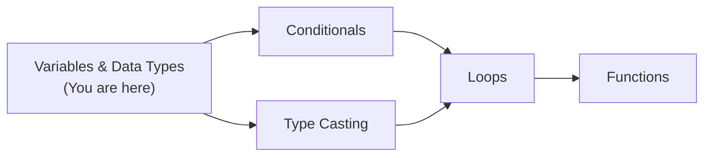
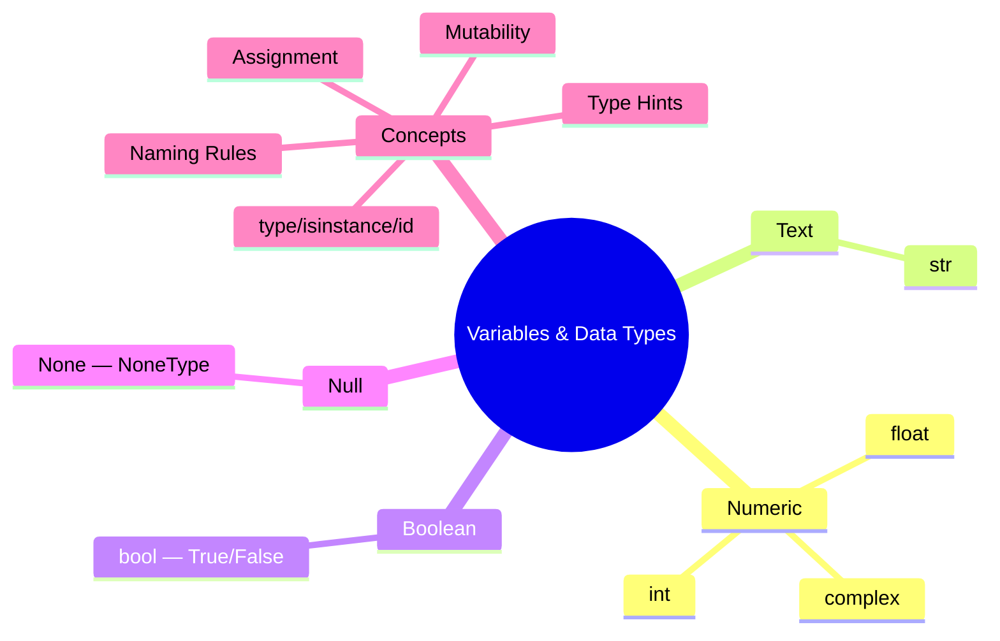
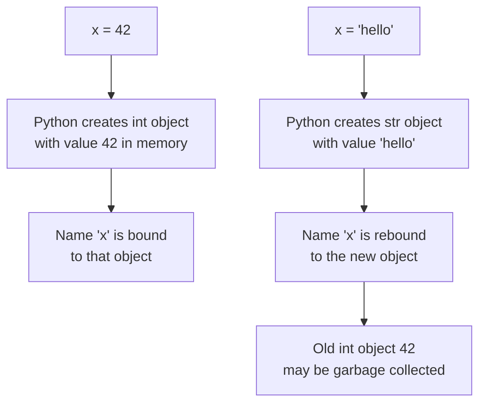
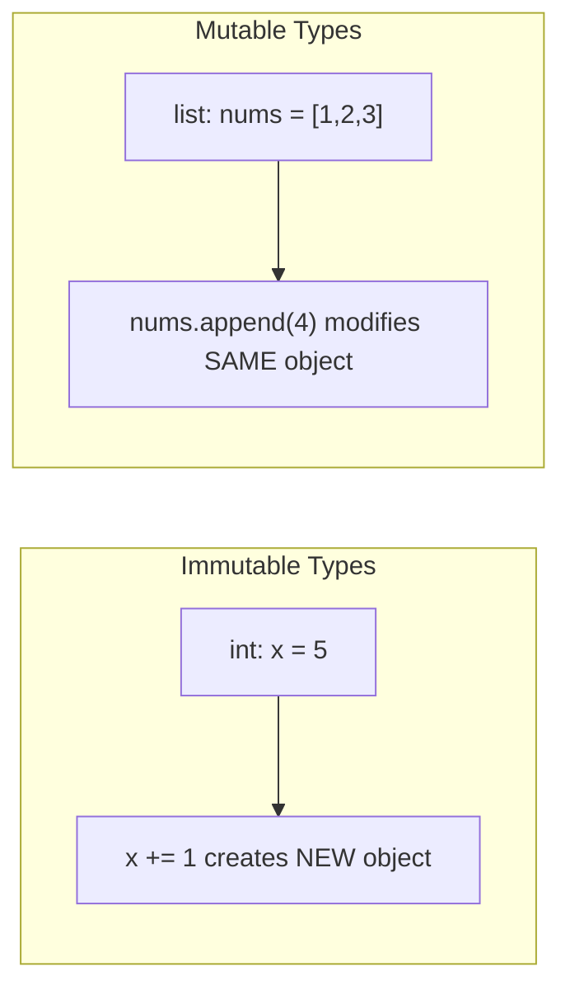

# Variables and Data Types — Junior Level

## Table of Contents

1. [Introduction](#introduction)
2. [Prerequisites](#prerequisites)
3. [Glossary](#glossary)
4. [Core Concepts](#core-concepts)
5. [Real-World Analogies](#real-world-analogies)
6. [Mental Models](#mental-models)
7. [Pros & Cons](#pros--cons)
8. [Use Cases](#use-cases)
9. [Code Examples](#code-examples)
10. [Clean Code](#clean-code)
11. [Product Use / Feature](#product-use--feature)
12. [Error Handling](#error-handling)
13. [Security Considerations](#security-considerations)
14. [Performance Tips](#performance-tips)
15. [Metrics & Analytics](#metrics--analytics)
16. [Best Practices](#best-practices)
17. [Edge Cases & Pitfalls](#edge-cases--pitfalls)
18. [Common Mistakes](#common-mistakes)
19. [Common Misconceptions](#common-misconceptions)
20. [Tricky Points](#tricky-points)
21. [Test](#test)
22. [Tricky Questions](#tricky-questions)
23. [Cheat Sheet](#cheat-sheet)
24. [Summary](#summary)
25. [What You Can Build](#what-you-can-build)
26. [Further Reading](#further-reading)
27. [Related Topics](#related-topics)
28. [Diagrams & Visual Aids](#diagrams--visual-aids)

---

## Introduction

> Focus: "What is it?" and "How to use it?"

Variables are names that refer to values stored in memory. Data types define what kind of value a variable holds — a number, text, True/False, or nothing at all. In Python, you do not need to declare a variable's type explicitly; Python figures it out automatically at runtime (dynamic typing). Understanding variables and data types is the absolute foundation of every Python program you will ever write.

---

## Prerequisites

What you should know before studying this topic:

- **Required:** Python installed (3.8+) — you need to run code examples in a terminal or IDE
- **Required:** Basic Syntax — indentation, comments, print(), and how to run a `.py` file
- **Helpful but not required:** Experience with any other programming language — helps with understanding the concept of variables

---

## Glossary

Key terms used in this topic:

| Term | Definition |
|------|-----------|
| **Variable** | A name that refers to a value stored in memory |
| **Data Type** | The category of a value (int, float, str, bool, etc.) |
| **Dynamic Typing** | Python determines the type of a variable at runtime, not at write time |
| **Immutable** | An object whose value cannot be changed after creation (int, float, str, tuple) |
| **Mutable** | An object whose value can be changed in place (list, dict, set) |
| **Assignment** | Binding a name to a value using `=` |
| **Type Hint** | An optional annotation that tells the reader what type a variable should hold |
| **None** | Python's special "nothing" value, similar to null in other languages |
| **Reference** | A pointer-like link from a variable name to an object in memory |
| **Literal** | A fixed value written directly in code, like `42`, `"hello"`, or `True` |

---

## Core Concepts

### Concept 1: Variable Assignment

In Python, you create a variable simply by assigning a value to a name with `=`. No `let`, `var`, or type declaration is needed. The variable name is a label that points to an object in memory.

```python
# Simple variable assignment
name = "Alice"       # str
age = 25             # int
height = 5.7         # float
is_student = True    # bool
nothing = None       # NoneType
```

### Concept 2: Multiple Assignment

Python allows assigning multiple variables in a single line, and also swapping values without a temporary variable.

```python
# Multiple assignment
x, y, z = 1, 2, 3

# Same value to multiple variables
a = b = c = 0

# Swapping values
x, y = y, x  # x is now 2, y is now 1
```

### Concept 3: Numeric Types (int, float, complex)

- **int** — whole numbers with unlimited precision: `42`, `-7`, `1_000_000`
- **float** — decimal numbers (64-bit IEEE 754): `3.14`, `-0.001`, `1e10`
- **complex** — numbers with a real and imaginary part: `3+4j`

```python
count = 42              # int
pi = 3.14159            # float
big = 1_000_000         # int (underscores for readability)
c = 2 + 3j              # complex
print(c.real, c.imag)   # 2.0, 3.0
```

### Concept 4: String Type (str)

Strings are sequences of characters enclosed in single, double, or triple quotes. They are **immutable** — once created, individual characters cannot be changed.

```python
greeting = "Hello, World!"
multiline = """This is
a multi-line string."""
raw = r"C:\new\folder"     # raw string — backslashes are literal

# String operations
print(len(greeting))       # 13
print(greeting[0])         # H
print(greeting.upper())    # HELLO, WORLD!
```

### Concept 5: Boolean Type (bool)

Booleans represent `True` or `False`. In Python, `bool` is a subclass of `int`, so `True == 1` and `False == 0`.

```python
is_active = True
is_deleted = False

# Booleans in arithmetic
print(True + True)    # 2
print(False * 10)     # 0

# Truthy and falsy values
print(bool(0))        # False
print(bool(""))       # False
print(bool(42))       # True
print(bool("hello"))  # True
```

### Concept 6: None Type

`None` is Python's way of saying "no value" or "nothing here." It is the only value of type `NoneType`. Always compare with `is`, not `==`.

```python
result = None
print(type(result))   # <class 'NoneType'>

# Correct comparison
if result is None:
    print("No result yet")
```

### Concept 7: type(), isinstance(), and id()

These built-in functions help you inspect variables at runtime.

```python
x = 42
print(type(x))              # <class 'int'>
print(isinstance(x, int))   # True
print(isinstance(x, (int, float)))  # True — checks multiple types
print(id(x))                # Memory address (e.g., 140234866357520)
```

### Concept 8: Variable Naming Rules

- Must start with a letter or underscore (`_`)
- Can contain letters, digits, and underscores
- Case-sensitive (`name` and `Name` are different)
- Cannot be a Python keyword (`if`, `for`, `class`, etc.)
- Convention: `snake_case` for variables and functions

```python
# Valid names
user_name = "Alice"
_private = 42
count2 = 10

# Invalid names (these cause SyntaxError)
# 2count = 10        # starts with digit
# my-var = 5         # hyphen not allowed
# class = "hello"    # reserved keyword
```

---

## Real-World Analogies

| Concept | Analogy |
|---------|--------|
| **Variable** | A labeled jar — the label (name) tells you what's inside, and you can replace the contents anytime |
| **Data Type** | The shape of the jar — a round jar holds liquids (numbers), a box holds letters (strings), a switch is on/off (bool) |
| **Immutable** | A printed book — you can read it, copy it, but you cannot erase a word on the page; you have to print a new book |
| **None** | An empty labeled jar — the jar exists, it has a label, but there is nothing inside |

---

## Mental Models

**The intuition:** Think of Python variables as sticky notes on objects. The sticky note has the name, and it is stuck onto an object in memory. When you reassign, you peel the sticky note off one object and stick it on another. The old object still exists until nothing points to it.

**Why this model helps:** It explains why `a = [1, 2, 3]; b = a; b.append(4)` also changes `a` — both sticky notes point to the same list object.

---

## Pros & Cons

| Pros | Cons |
|------|------|
| No type declarations needed — faster to write | Bugs from accidental type changes can hide until runtime |
| Dynamic typing makes prototyping quick | Large codebases need type hints to stay maintainable |
| Unlimited precision integers — no overflow | Floats have precision issues (0.1 + 0.2 != 0.3) |
| Everything is an object — consistent model | Slightly slower than statically typed languages |

### When to use:
- Scripting, data analysis, prototyping — anywhere speed of development matters

### When NOT to use:
- Performance-critical numerical code — consider NumPy arrays or C extensions instead of plain Python types

---

## Use Cases

- **Use Case 1:** Storing user input — `name = input("Enter your name: ")`
- **Use Case 2:** Configuration values — `MAX_RETRIES = 3`
- **Use Case 3:** Data processing — reading CSV rows into typed variables
- **Use Case 4:** API responses — parsing JSON into Python dicts and extracting typed fields

---

## Code Examples

### Example 1: Exploring All Basic Types

```python
# All basic data types in one place

def explore_types():
    # Numeric types
    age: int = 25
    price: float = 19.99
    coordinates: complex = 3 + 4j

    # Text type
    name: str = "Alice"

    # Boolean type
    is_active: bool = True

    # None type
    middle_name = None

    # Inspect each variable
    variables = {
        "age": age,
        "price": price,
        "coordinates": coordinates,
        "name": name,
        "is_active": is_active,
        "middle_name": middle_name,
    }

    for var_name, value in variables.items():
        print(f"{var_name:15} = {str(value):15} | type: {type(value).__name__:10} | id: {id(value)}")


if __name__ == "__main__":
    explore_types()
```

**What it does:** Creates one variable of each basic type and prints its value, type, and memory id.
**How to run:** `python explore_types.py`

### Example 2: Mutability vs Immutability Demonstration

```python
# Demonstrating mutable vs immutable behavior

def mutability_demo():
    # Immutable: int
    x = 10
    print(f"Before: x = {x}, id = {id(x)}")
    x += 1
    print(f"After:  x = {x}, id = {id(x)}")  # Different id! New object created

    print()

    # Mutable: list
    nums = [1, 2, 3]
    print(f"Before: nums = {nums}, id = {id(nums)}")
    nums.append(4)
    print(f"After:  nums = {nums}, id = {id(nums)}")  # Same id! Modified in place

    print()

    # Immutable: str
    greeting = "Hello"
    print(f"Before: greeting = '{greeting}', id = {id(greeting)}")
    greeting = greeting + " World"
    print(f"After:  greeting = '{greeting}', id = {id(greeting)}")  # Different id!


if __name__ == "__main__":
    mutability_demo()
```

**What it does:** Shows that immutable types create new objects when modified, while mutable types change in place.
**How to run:** `python mutability_demo.py`

### Example 3: Type Hints Basics

```python
# Basic type hints for better code readability

def greet(name: str, age: int) -> str:
    """Return a greeting message with name and age."""
    return f"Hello, {name}! You are {age} years old."


def calculate_average(numbers: list[float]) -> float:
    """Calculate the average of a list of numbers."""
    if not numbers:
        return 0.0
    return sum(numbers) / len(numbers)


def find_user(user_id: int) -> dict | None:
    """Find a user by ID. Returns None if not found."""
    users = {1: {"name": "Alice"}, 2: {"name": "Bob"}}
    return users.get(user_id)


if __name__ == "__main__":
    print(greet("Alice", 25))
    print(calculate_average([85.5, 90.0, 78.5]))
    print(find_user(1))
    print(find_user(99))
```

**What it does:** Demonstrates how to add type hints to function parameters and return types.
**How to run:** `python type_hints_demo.py`

---

## Clean Code

Basic clean code principles when working with variables and data types:

### Naming (PEP 8 conventions)

```python
# Bad
x = "Alice"
n = 25
f = True

# Clean Python naming
user_name = "Alice"
user_age = 25
is_verified = True

MAX_LOGIN_ATTEMPTS = 5  # constant
```

**Python naming rules:**
- Variables and functions: `snake_case` (`user_count`, `is_valid`)
- Constants: `UPPER_SNAKE_CASE` (`MAX_RETRIES`, `DEFAULT_TIMEOUT`)
- Classes: `PascalCase` (`UserProfile`, `HttpClient`)
- Private members: leading underscore (`_internal_value`)

---

## Product Use / Feature

### 1. Django ORM

- **How it uses variables and data types:** Model fields map directly to Python types — `IntegerField`, `CharField`, `BooleanField`, `FloatField`
- **Why it matters:** Understanding Python types helps you define database schemas correctly

### 2. pandas

- **How it uses variables and data types:** DataFrames store columns as specific dtypes (int64, float64, object, bool)
- **Why it matters:** Type mismatches cause errors in data analysis; knowing types prevents them

### 3. Flask / FastAPI

- **How it uses variables and data types:** Route parameters are typed — `@app.get("/users/{user_id}")` with `user_id: int`
- **Why it matters:** FastAPI uses type hints for automatic validation and documentation

---

## Error Handling

### Error 1: NameError — Using a variable before assigning it

```python
# This raises NameError
print(username)  # NameError: name 'username' is not defined
```

**Why it happens:** The variable has not been assigned a value yet.
**How to fix:**

```python
username = "Alice"
print(username)
```

### Error 2: TypeError — Mixing incompatible types

```python
# This raises TypeError
age = 25
message = "I am " + age  # TypeError: can only concatenate str to str
```

**Why it happens:** Python does not implicitly convert types.
**How to fix:**

```python
age = 25
message = "I am " + str(age)
# Or use f-strings (preferred)
message = f"I am {age}"
```

### Error 3: AttributeError — Wrong method for the type

```python
# This raises AttributeError
number = 42
number.upper()  # AttributeError: 'int' object has no attribute 'upper'
```

**Why it happens:** `.upper()` is a string method, not an int method.
**How to fix:**

```python
text = "hello"
text.upper()  # "HELLO"
```

---

## Security Considerations

### 1. Never use `eval()` on user input

```python
# Insecure — user can execute arbitrary code
user_input = input("Enter value: ")
result = eval(user_input)  # DANGEROUS!

# Secure — use specific type conversion
user_input = input("Enter a number: ")
try:
    result = int(user_input)
except ValueError:
    print("Invalid number")
```

**Risk:** `eval("__import__('os').system('rm -rf /')")` executes arbitrary system commands.
**Mitigation:** Always use `int()`, `float()`, or `json.loads()` for type conversion of user input.

### 2. Sensitive data in variables

```python
# Insecure — password stays in memory as a string
password = "my_secret_password"

# Better — use getpass and clear when done
import getpass
password = getpass.getpass("Password: ")
# Process password...
del password  # Remove reference (not guaranteed to clear memory)
```

---

## Performance Tips

### Tip 1: Use f-strings instead of concatenation

```python
# Slow — creates intermediate string objects
result = "Hello, " + name + "! You are " + str(age) + " years old."

# Fast — f-strings are compiled to efficient bytecode
result = f"Hello, {name}! You are {age} years old."
```

**Why it's faster:** f-strings are parsed at compile time and avoid creating temporary string objects.

### Tip 2: Use `isinstance()` instead of `type()` for checking

```python
# Less efficient and does not handle subclasses
if type(x) == int:
    ...

# Better — handles subclasses correctly
if isinstance(x, int):
    ...
```

---

## Metrics & Analytics

### What to Measure

| Metric | Why it matters | Tool |
|--------|---------------|------|
| **Object count by type** | Memory leaks from accumulating objects | `sys.getsizeof()`, `objgraph` |
| **String allocation** | Excessive string concatenation wastes memory | `tracemalloc` |

### Basic Instrumentation

```python
import sys

x = 42
name = "Hello, World!"
nums = [1, 2, 3, 4, 5]

print(f"int size:  {sys.getsizeof(x)} bytes")
print(f"str size:  {sys.getsizeof(name)} bytes")
print(f"list size: {sys.getsizeof(nums)} bytes")
```

---

## Best Practices

- **Use descriptive names:** `user_age` instead of `a`, `total_price` instead of `tp`
- **Use type hints:** Even as a beginner, `age: int = 25` makes code self-documenting
- **Use constants for magic numbers:** `MAX_RETRIES = 3` instead of a bare `3` in code
- **Compare None with `is`:** `if x is None` not `if x == None`
- **Prefer f-strings:** `f"Hello, {name}"` over `"Hello, " + name` or `"Hello, %s" % name`

---

## Edge Cases & Pitfalls

### Pitfall 1: Floating-point precision

```python
print(0.1 + 0.2)          # 0.30000000000000004
print(0.1 + 0.2 == 0.3)   # False!
```

**What happens:** Floats use binary representation (IEEE 754) and cannot represent 0.1 exactly.
**How to fix:**

```python
from decimal import Decimal
print(Decimal("0.1") + Decimal("0.2") == Decimal("0.3"))  # True

# Or use math.isclose for comparisons
import math
print(math.isclose(0.1 + 0.2, 0.3))  # True
```

### Pitfall 2: Integer caching

```python
a = 256
b = 256
print(a is b)  # True — CPython caches integers -5 to 256

a = 257
b = 257
print(a is b)  # May be False! (outside cache range)
```

**What happens:** CPython pre-allocates integer objects for -5 to 256 for performance.
**How to fix:** Always use `==` for value comparison, not `is`.

---

## Common Mistakes

### Mistake 1: Using `=` instead of `==`

```python
# Wrong — this is assignment, not comparison
if x = 5:   # SyntaxError in Python (unlike C/Java where it silently works)
    print("five")

# Correct
if x == 5:
    print("five")
```

### Mistake 2: Forgetting that strings are immutable

```python
# Wrong — strings cannot be modified in place
name = "Alice"
name[0] = "a"  # TypeError: 'str' object does not support item assignment

# Correct — create a new string
name = "a" + name[1:]  # "alice"
```

### Mistake 3: Confusing `is` and `==`

```python
a = [1, 2, 3]
b = [1, 2, 3]

print(a == b)  # True — same value
print(a is b)  # False — different objects in memory

# Use == for value comparison
# Use is only for None, True, False, and identity checks
```

---

## Common Misconceptions

### Misconception 1: "Variables store values directly"

**Reality:** In Python, variables are references (name tags) pointing to objects in memory. The value lives in the object, not in the variable name itself.

**Why people think this:** In languages like C, a variable is a memory location that holds a value. Python works differently — names are bound to objects.

### Misconception 2: "Python has no types because you don't declare them"

**Reality:** Python is strongly typed AND dynamically typed. Every value has a definite type — Python just infers it at runtime instead of requiring you to write it.

**Why people think this:** People confuse "no type declarations" with "no types."

---

## Tricky Points

### Tricky Point 1: Boolean is a subclass of int

```python
print(isinstance(True, int))   # True
print(True + True)              # 2
print(True * 10)                # 10
print({True: "yes", 1: "one"}) # {True: 'one'} — True and 1 are the same key!
```

**Why it's tricky:** `bool` inherits from `int`, so `True == 1` and `False == 0`. This means they hash to the same value and can collide in dictionaries.
**Key takeaway:** Be careful using booleans as dictionary keys alongside integers.

### Tricky Point 2: Chained assignment creates shared references

```python
a = b = [1, 2, 3]
a.append(4)
print(b)  # [1, 2, 3, 4] — b is the SAME list!
```

**Why it's tricky:** `a = b = [1, 2, 3]` makes both names point to the same mutable object.
**Key takeaway:** For mutable objects, assign separately: `a = [1, 2, 3]; b = [1, 2, 3]`.

---

## Test

### Multiple Choice

**1. What is the type of `x = 3.14`?**

- A) int
- B) str
- C) float
- D) double

<details>
<summary>Answer</summary>
<strong>C)</strong> — Python has no <code>double</code> type. All decimal numbers are <code>float</code> (64-bit IEEE 754).
</details>

**2. What does `type(True)` return?**

- A) `<class 'int'>`
- B) `<class 'bool'>`
- C) `<class 'str'>`
- D) `<class 'NoneType'>`

<details>
<summary>Answer</summary>
<strong>B)</strong> — <code>True</code> is of type <code>bool</code>. Even though <code>bool</code> is a subclass of <code>int</code>, <code>type()</code> returns the most specific type.
</details>

### True or False

**3. In Python, `None == False` evaluates to `True`.**

<details>
<summary>Answer</summary>
<strong>False</strong> — <code>None == False</code> is <code>False</code>. <code>None</code> is its own type (<code>NoneType</code>) and is not equal to <code>False</code>. However, <code>bool(None)</code> returns <code>False</code> (it is falsy).
</details>

**4. Python integers have a maximum size limit.**

<details>
<summary>Answer</summary>
<strong>False</strong> — Python integers have arbitrary precision. They can grow as large as your memory allows, unlike C/Java where <code>int</code> is 32 or 64 bits.
</details>

### What's the Output?

**5. What does this code print?**

```python
a = 256
b = 256
print(a is b)
```

<details>
<summary>Answer</summary>
Output: <code>True</code>
Explanation: CPython caches integers from -5 to 256. Both <code>a</code> and <code>b</code> point to the same cached object.
</details>

**6. What does this code print?**

```python
x, y = 10, 20
x, y = y, x
print(x, y)
```

<details>
<summary>Answer</summary>
Output: <code>20 10</code>
Explanation: Python evaluates the right side fully before assigning, enabling swap without a temporary variable.
</details>

---

## Tricky Questions

**1. What does `{True: "a", 1: "b", 1.0: "c"}` evaluate to?**

- A) `{True: "a", 1: "b", 1.0: "c"}`
- B) `{True: "c"}`
- C) `{1: "c"}`
- D) `{True: "a"}`

<details>
<summary>Answer</summary>
<strong>B)</strong> — <code>True == 1 == 1.0</code> and they all hash to the same value. Python keeps the first key (<code>True</code>) but updates the value to the last one (<code>"c"</code>). Result: <code>{True: "c"}</code>.
</details>

**2. What is the output?**

```python
a = "hello"
b = "hello"
print(a is b)
```

- A) Always `True`
- B) Always `False`
- C) Implementation-dependent
- D) Raises an error

<details>
<summary>Answer</summary>
<strong>C)</strong> — CPython interns short strings, so this is usually <code>True</code> in practice. But the Python language specification does not guarantee it. Always use <code>==</code> for string comparison.
</details>

---

## Cheat Sheet

| What | Syntax | Example |
|------|--------|---------|
| Assign a variable | `name = value` | `x = 42` |
| Multiple assignment | `a, b = val1, val2` | `x, y = 1, 2` |
| Check type | `type(x)` | `type(42)` -> `<class 'int'>` |
| Check instance | `isinstance(x, T)` | `isinstance(42, int)` -> `True` |
| Get memory id | `id(x)` | `id(42)` -> `140...` |
| None check | `x is None` | `if result is None:` |
| Type hint | `name: type = value` | `age: int = 25` |
| f-string | `f"text {var}"` | `f"Hello, {name}"` |
| Swap values | `a, b = b, a` | `x, y = y, x` |
| Integer separator | `1_000_000` | `budget = 1_000_000` |

---

## Summary

- Variables in Python are names (references) bound to objects — not containers holding values
- Python has six core built-in types for beginners: `int`, `float`, `complex`, `str`, `bool`, and `NoneType`
- Use `type()` to inspect, `isinstance()` to check, and `id()` to see memory address
- Immutable types (`int`, `float`, `str`, `bool`, `tuple`) create new objects on modification
- Mutable types (`list`, `dict`, `set`) are modified in place
- Always compare with `is` for `None`, and `==` for values
- Use type hints (`age: int = 25`) for self-documenting code

**Next step:** Learn Conditionals (`if/elif/else`) to make decisions based on variable values.

---

## What You Can Build

### Projects you can create:
- **Unit Converter:** Convert temperatures, distances, weights — uses int/float arithmetic and type conversion
- **User Profile Card:** Collect name (str), age (int), is_active (bool) and display a formatted card
- **Calculator:** Take two numbers and an operator, return the result — practices type checking and conversion

### Technologies / tools that use this:
- **Django / FastAPI** — knowing Python types is essential for defining models and API schemas
- **pandas / NumPy** — column dtypes and array types build directly on Python's type system
- **JSON / APIs** — parsing JSON maps directly to Python dicts, lists, strings, ints, floats, bools, and None

### Learning path:



---

## Further Reading

- **Official docs:** [Built-in Types](https://docs.python.org/3/library/stdtypes.html)
- **PEP 526:** [Syntax for Variable Annotations](https://peps.python.org/pep-0526/) — type hints for variables
- **PEP 484:** [Type Hints](https://peps.python.org/pep-0484/) — the original type hints PEP
- **Book:** Fluent Python (Ramalho), Chapter 6 — Object References, Mutability, and Recycling

---

## Related Topics

- **[Basic Syntax](../01-basic-syntax/)** — foundational syntax that variables build upon
- **[Type Casting](../05-type-casting/)** — converting between data types
- **[Conditionals](../03-conditionals/)** — using boolean values in decision-making

---

## Diagrams & Visual Aids

### Mind Map



### Variable Assignment Flow



### Mutable vs Immutable Comparison


