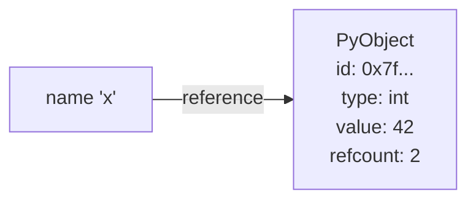
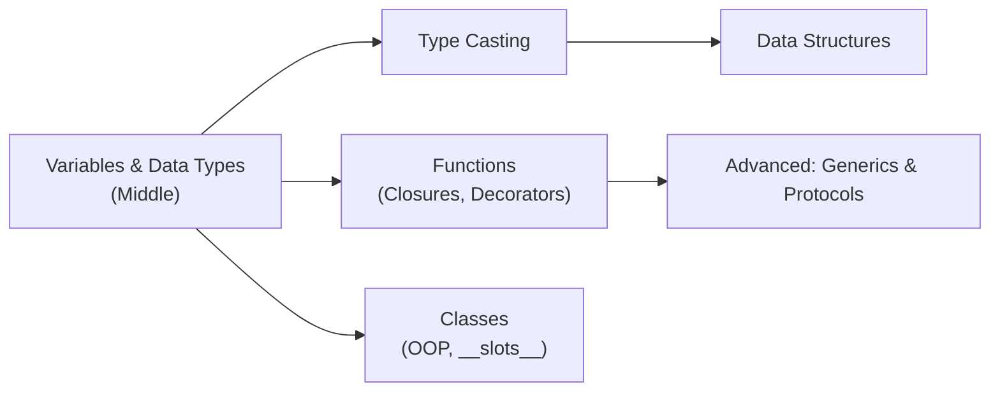
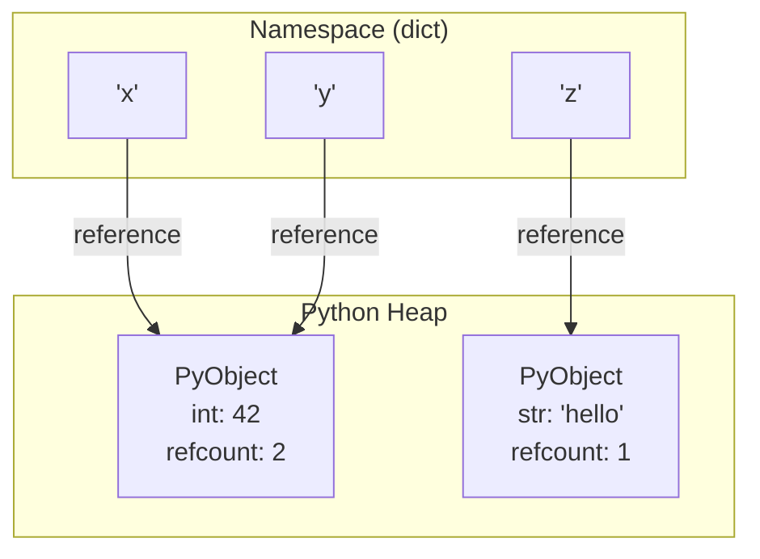
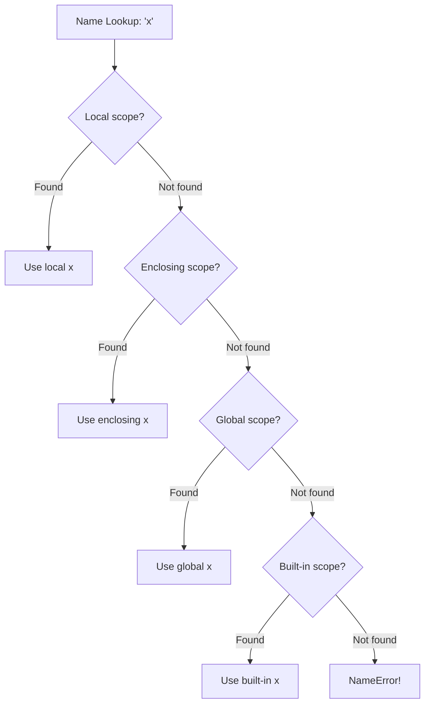
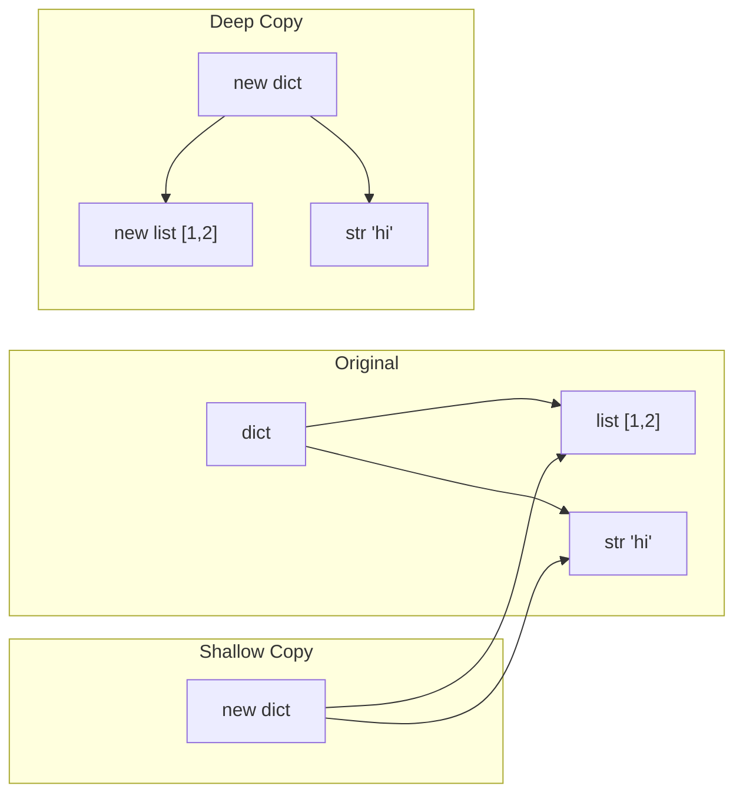

# Variables and Data Types — Middle Level

## Table of Contents

1. [Introduction](#introduction)
2. [Core Concepts](#core-concepts)
3. [Evolution & Historical Context](#evolution--historical-context)
4. [Pros & Cons](#pros--cons)
5. [Alternative Approaches](#alternative-approaches)
6. [Use Cases](#use-cases)
7. [Code Examples](#code-examples)
8. [Clean Code](#clean-code)
9. [Product Use / Feature](#product-use--feature)
10. [Error Handling](#error-handling)
11. [Security Considerations](#security-considerations)
12. [Performance Optimization](#performance-optimization)
13. [Debugging Guide](#debugging-guide)
14. [Best Practices](#best-practices)
15. [Edge Cases & Pitfalls](#edge-cases--pitfalls)
16. [Common Mistakes](#common-mistakes)
17. [Tricky Points](#tricky-points)
18. [Comparison with Other Languages](#comparison-with-other-languages)
19. [Test](#test)
20. [Tricky Questions](#tricky-questions)
21. [Cheat Sheet](#cheat-sheet)
22. [Summary](#summary)
23. [What You Can Build](#what-you-can-build)
24. [Further Reading](#further-reading)
25. [Related Topics](#related-topics)
26. [Diagrams & Visual Aids](#diagrams--visual-aids)

---

## Introduction

> Focus: "Why?" and "When to use?"

At the middle level, you move beyond knowing what types exist to understanding **how Python manages them internally**, when to choose one over another in production, and how to leverage the type system for robust, maintainable code. This level covers Python's object model, reference semantics, the `typing` module for production code, scope rules (LEGB), and the interplay between mutability and program correctness.

---

## Core Concepts

### Concept 1: Everything is an Object

In Python, every value is an object — integers, strings, functions, classes, even `None`. Every object has three things: an **identity** (`id()`), a **type** (`type()`), and a **value**.

```python
import sys

x = 42
print(id(x))          # Identity — memory address
print(type(x))        # Type — <class 'int'>
print(x)              # Value — 42
print(sys.getrefcount(x))  # Reference count (usually > 1 due to interning)
```



### Concept 2: Reference Semantics and Aliasing

Assignment in Python does not copy values — it creates a new reference to the same object. This is critical for mutable types.

```python
# Aliasing with mutable types
a = [1, 2, 3]
b = a              # b is an alias for the same list
b.append(4)
print(a)           # [1, 2, 3, 4] — a is also affected!

# Creating independent copies
import copy
c = a.copy()       # shallow copy
d = copy.deepcopy(a)  # deep copy — nested objects are also copied

c.append(5)
print(a)           # [1, 2, 3, 4] — unaffected
```

### Concept 3: LEGB Scope Rule

Python resolves variable names using the LEGB rule: **Local -> Enclosing -> Global -> Built-in**.

```python
x = "global"           # Global scope

def outer():
    x = "enclosing"    # Enclosing scope

    def inner():
        x = "local"    # Local scope
        print(x)       # "local"

    inner()
    print(x)           # "enclosing"

outer()
print(x)               # "global"
```

```python
# Using global and nonlocal keywords
counter = 0

def increment():
    global counter
    counter += 1

def make_counter():
    count = 0
    def inc():
        nonlocal count
        count += 1
        return count
    return inc

c = make_counter()
print(c())  # 1
print(c())  # 2
```

### Concept 4: Type Hints in Production

Type hints combined with `mypy` or `pyright` catch bugs before runtime. Middle-level developers should use them consistently.

```python
from typing import Optional, Union, Final
from collections.abc import Sequence

# Optional — can be None
def find_user(user_id: int) -> Optional[dict]:
    users = {1: {"name": "Alice"}}
    return users.get(user_id)

# Union — multiple possible types (Python 3.10+ use |)
def process(value: int | str) -> str:
    return str(value)

# Final — constant that should not be reassigned
MAX_CONNECTIONS: Final[int] = 100

# Sequence — accepts list, tuple, or any sequence
def first_element(items: Sequence[int]) -> int:
    return items[0]
```

### Concept 5: Interning and Caching

CPython optimizes memory by reusing objects for commonly used values.

```python
# Integer interning: -5 to 256 are cached
a = 256
b = 256
print(a is b)   # True — same cached object

a = 257
b = 257
print(a is b)   # False in interactive mode (may be True in scripts due to peephole optimizer)

# String interning: simple identifier-like strings are interned
s1 = "hello"
s2 = "hello"
print(s1 is s2)  # True — interned

s1 = "hello world"
s2 = "hello world"
print(s1 is s2)  # May be False — not interned (contains space)

# Manual interning
import sys
s1 = sys.intern("hello world")
s2 = sys.intern("hello world")
print(s1 is s2)  # True — forced interning
```

### Concept 6: `__slots__` and Memory Optimization

For classes with many instances, `__slots__` reduces memory by eliminating the per-instance `__dict__`.

```python
import sys

class PointRegular:
    def __init__(self, x: float, y: float):
        self.x = x
        self.y = y

class PointSlots:
    __slots__ = ("x", "y")
    def __init__(self, x: float, y: float):
        self.x = x
        self.y = y

r = PointRegular(1.0, 2.0)
s = PointSlots(1.0, 2.0)

print(sys.getsizeof(r.__dict__))  # ~104 bytes for the dict
# PointSlots has no __dict__ — much smaller per instance
```

---

## Evolution & Historical Context

**Before type hints (pre-Python 3.5):**
- Developers relied on docstrings and naming conventions to communicate types
- Tools like `isinstance()` checks scattered throughout code
- No static analysis for type errors

**PEP 484 (Python 3.5) changed everything:**
- Introduced the `typing` module and function annotations for types
- Enabled `mypy`, `pyright`, and IDE type checking
- Gradual adoption — type hints are optional and do not affect runtime

**PEP 526 (Python 3.6):**
- Variable annotations: `age: int = 25`
- Class variable annotations for dataclasses

**PEP 604 (Python 3.10):**
- Union syntax: `int | str` instead of `Union[int, str]`
- `X | None` instead of `Optional[X]`

---

## Pros & Cons

| Pros | Cons |
|------|------|
| Dynamic typing enables rapid prototyping | Type errors surface only at runtime without static checking |
| Type hints provide optional safety net | Type hints add verbosity and maintenance overhead |
| Everything-is-an-object model is consistent | Object overhead means higher memory per value than C |
| Reference semantics enable shared state efficiently | Aliasing bugs are common with mutable objects |

### Trade-off analysis:

- **Dynamic vs Static:** Dynamic typing is faster to write but riskier in production. Use type hints + mypy for critical paths.
- **Mutability:** Mutable defaults are convenient but cause subtle bugs. Prefer immutable defaults.

---

## Alternative Approaches

| Alternative | How it works | When to use it |
|-------------|-------------|----------------|
| **dataclasses** | Auto-generate `__init__`, `__repr__`, etc. from type annotations | Structured data with typed fields |
| **NamedTuple** | Immutable, typed tuple with named fields | Read-only structured data |
| **Pydantic** | Runtime validation using type hints | API input validation |
| **attrs** | Similar to dataclasses, more features, works pre-3.7 | Backward compatibility |

```python
from dataclasses import dataclass
from typing import NamedTuple

@dataclass
class User:
    name: str
    age: int
    is_active: bool = True

class Point(NamedTuple):
    x: float
    y: float

u = User("Alice", 30)
p = Point(1.0, 2.0)
print(u)        # User(name='Alice', age=30, is_active=True)
print(p.x)      # 1.0
```

---

## Use Cases

- **Use Case 1:** FastAPI request/response models — Pydantic uses type hints for automatic validation
- **Use Case 2:** Data pipeline processing — explicit types prevent silent data corruption
- **Use Case 3:** Configuration management — `Final` and `dataclass` for typed, validated configs

---

## Code Examples

### Example 1: Production-Ready Type-Safe Configuration

```python
from dataclasses import dataclass, field
from typing import Final
import os


# Constants
DEFAULT_PORT: Final[int] = 8080
DEFAULT_HOST: Final[str] = "0.0.0.0"


@dataclass(frozen=True)  # frozen=True makes it immutable
class AppConfig:
    """Application configuration with validated types."""
    host: str = DEFAULT_HOST
    port: int = DEFAULT_PORT
    debug: bool = False
    allowed_origins: tuple[str, ...] = ("http://localhost",)

    def __post_init__(self) -> None:
        if not 1 <= self.port <= 65535:
            raise ValueError(f"Port must be 1-65535, got {self.port}")
        if not self.host:
            raise ValueError("Host cannot be empty")

    @classmethod
    def from_env(cls) -> "AppConfig":
        """Create config from environment variables."""
        return cls(
            host=os.getenv("APP_HOST", DEFAULT_HOST),
            port=int(os.getenv("APP_PORT", str(DEFAULT_PORT))),
            debug=os.getenv("APP_DEBUG", "false").lower() == "true",
        )


if __name__ == "__main__":
    config = AppConfig.from_env()
    print(config)
    # AppConfig is immutable — config.port = 9999 raises FrozenInstanceError
```

**Why this pattern:** `frozen=True` prevents accidental mutation. `__post_init__` validates at construction time. Type hints enable IDE autocompletion and mypy checking.

### Example 2: Deep Copy vs Shallow Copy

```python
import copy


def demonstrate_copy_behavior() -> None:
    """Show the difference between shallow and deep copy."""
    original = {
        "name": "Alice",
        "scores": [95, 87, 92],
        "meta": {"level": 3},
    }

    shallow = copy.copy(original)
    deep = copy.deepcopy(original)

    # Modify nested mutable object
    original["scores"].append(100)
    original["meta"]["level"] = 5

    print(f"Original scores: {original['scores']}")  # [95, 87, 92, 100]
    print(f"Shallow scores:  {shallow['scores']}")    # [95, 87, 92, 100] — shared!
    print(f"Deep scores:     {deep['scores']}")       # [95, 87, 92] — independent

    print(f"Original meta: {original['meta']}")       # {'level': 5}
    print(f"Shallow meta:  {shallow['meta']}")        # {'level': 5} — shared!
    print(f"Deep meta:     {deep['meta']}")           # {'level': 3} — independent


if __name__ == "__main__":
    demonstrate_copy_behavior()
```

### Example 3: Scope and Closure Patterns

```python
from typing import Callable


def make_multiplier(factor: int) -> Callable[[int], int]:
    """Create a closure that multiplies by a fixed factor."""
    def multiplier(x: int) -> int:
        return x * factor  # 'factor' comes from enclosing scope
    return multiplier


def make_counter(start: int = 0) -> dict[str, Callable]:
    """Create a counter with increment and get operations."""
    count = start

    def increment() -> int:
        nonlocal count
        count += 1
        return count

    def get() -> int:
        return count

    def reset() -> None:
        nonlocal count
        count = start

    return {"increment": increment, "get": get, "reset": reset}


if __name__ == "__main__":
    double = make_multiplier(2)
    triple = make_multiplier(3)
    print(double(5))   # 10
    print(triple(5))   # 15

    counter = make_counter()
    counter["increment"]()
    counter["increment"]()
    print(counter["get"]())   # 2
    counter["reset"]()
    print(counter["get"]())   # 0
```

---

## Clean Code

### Naming & Readability

```python
# Bad — what do these variables represent?
d: dict = {}
f: bool = True
n: int = 0

# Good — self-documenting with type hints
user_cache: dict[int, str] = {}
is_authenticated: bool = True
retry_count: int = 0
```

| Element | Python Rule | Example |
|---------|-------------|---------|
| Functions | verb + noun, snake_case | `fetch_user_by_id`, `validate_token` |
| Type aliases | PascalCase | `UserId = int`, `Headers = dict[str, str]` |
| Constants | UPPER_SNAKE_CASE | `MAX_RETRIES`, `DEFAULT_TIMEOUT` |
| Booleans | `is_/has_/can_` prefix | `is_expired`, `has_permission` |

### SOLID — Dependency Inversion with Types

```python
from abc import ABC, abstractmethod


class UserRepository(ABC):
    @abstractmethod
    def find_by_id(self, user_id: int) -> dict | None: ...


class PostgresUserRepository(UserRepository):
    def find_by_id(self, user_id: int) -> dict | None:
        # database query
        return {"id": user_id, "name": "Alice"}


class UserService:
    def __init__(self, repo: UserRepository) -> None:  # Depends on abstraction
        self._repo = repo

    def get_user(self, user_id: int) -> dict:
        user = self._repo.find_by_id(user_id)
        if user is None:
            raise ValueError(f"User {user_id} not found")
        return user
```

---

## Product Use / Feature

### 1. FastAPI

- **How it uses types:** Pydantic models defined with type hints auto-generate OpenAPI docs and validate requests
- **Scale:** Thousands of production APIs rely on type-driven validation

### 2. Django REST Framework

- **How it uses types:** Serializer fields enforce types on API input/output
- **Scale:** Powers APIs for Instagram, Pinterest, and other large-scale services

### 3. pandas

- **How it uses types:** Column dtypes (`int64`, `float64`, `object`, `category`) determine memory layout and operations
- **Scale:** Millions of rows processed with type-aware optimizations

---

## Error Handling

### Pattern 1: Custom Exception Hierarchy

```python
class DataTypeError(Exception):
    """Base exception for data type operations."""
    def __init__(self, message: str, expected_type: type, actual_type: type):
        super().__init__(message)
        self.expected_type = expected_type
        self.actual_type = actual_type


class ValidationError(DataTypeError):
    """Raised when input fails type validation."""
    pass


def validate_age(value: object) -> int:
    if not isinstance(value, int):
        raise ValidationError(
            f"Expected int, got {type(value).__name__}",
            expected_type=int,
            actual_type=type(value),
        )
    if value < 0 or value > 150:
        raise ValueError(f"Age must be 0-150, got {value}")
    return value
```

### Pattern 2: Type-Safe Parsing with Error Handling

```python
import json
import logging
from typing import Any

logger = logging.getLogger(__name__)


def safe_parse_config(raw: str) -> dict[str, Any]:
    """Parse JSON config with type validation."""
    try:
        data = json.loads(raw)
    except json.JSONDecodeError as e:
        logger.error("Invalid JSON: %s", e)
        raise ValueError("Config must be valid JSON") from e

    if not isinstance(data, dict):
        raise TypeError(f"Config must be a dict, got {type(data).__name__}")

    return data
```

---

## Security Considerations

### 1. Pickle Deserialization

```python
import pickle

# NEVER unpickle untrusted data — arbitrary code execution!
# data = pickle.loads(untrusted_bytes)  # DANGEROUS

# Safe alternative: use JSON for data exchange
import json
data = json.loads('{"name": "Alice", "age": 30}')
```

### 2. Type Confusion Attacks

```python
# Bad — trusting that input is the right type
def process_payment(amount):
    # If amount is a string like "0" it passes truthiness check but fails math
    if amount:
        charge(amount)

# Good — validate type explicitly
def process_payment(amount: float) -> None:
    if not isinstance(amount, (int, float)):
        raise TypeError(f"amount must be numeric, got {type(amount).__name__}")
    if amount <= 0:
        raise ValueError("amount must be positive")
    charge(amount)
```

### Security Checklist

- [ ] Never use `eval()`, `exec()`, or `pickle.loads()` on untrusted input
- [ ] Validate types at API boundaries
- [ ] Use Pydantic or dataclass validation for structured input
- [ ] Log type mismatches for monitoring

---

## Performance Optimization

### Tip 1: Use `__slots__` for Memory-Heavy Classes

```python
import sys

class UserDict:
    def __init__(self, name: str, age: int):
        self.name = name
        self.age = age

class UserSlots:
    __slots__ = ("name", "age")
    def __init__(self, name: str, age: int):
        self.name = name
        self.age = age

# Memory comparison
u1 = UserDict("Alice", 30)
u2 = UserSlots("Alice", 30)
print(f"With __dict__: {sys.getsizeof(u1) + sys.getsizeof(u1.__dict__)} bytes")
print(f"With __slots__: {sys.getsizeof(u2)} bytes")  # Significantly smaller
```

### Tip 2: String Interning for Repeated Lookups

```python
import sys

# When you have millions of repeated string comparisons
keys = [sys.intern(f"field_{i % 100}") for i in range(1_000_000)]
# Interned strings use `is` comparison (pointer comparison) — O(1) vs O(n) for ==
```

### Tip 3: Avoid Repeated isinstance() Checks

```python
# Slow — checking type in a loop
def process_items_slow(items: list) -> list[str]:
    result = []
    for item in items:
        if isinstance(item, int):
            result.append(str(item))
        elif isinstance(item, str):
            result.append(item)
    return result

# Fast — use a dispatch dict
def process_items_fast(items: list) -> list[str]:
    handlers = {int: str, str: lambda x: x, float: lambda x: f"{x:.2f}"}
    return [handlers.get(type(item), str)(item) for item in items]
```

---

## Debugging Guide

### Using `type()` and `isinstance()` for Debugging

```python
def debug_variable(name: str, value: object) -> None:
    """Print comprehensive debug info about a variable."""
    print(f"Name:     {name}")
    print(f"Value:    {value!r}")
    print(f"Type:     {type(value).__name__}")
    print(f"Id:       {id(value)}")
    print(f"Bool:     {bool(value)}")
    print(f"Mutable:  {hasattr(value, '__setitem__') or hasattr(value, 'append')}")
    print()
```

### Common Debugging Scenarios

```python
# Scenario: "Why did my list change?"
import sys

a = [1, 2, 3]
b = a
print(f"a is b: {a is b}")                    # True — same object
print(f"sys.getrefcount(a): {sys.getrefcount(a)}")  # 3 (a, b, and getrefcount arg)

# Fix: use .copy() or list()
b = a.copy()
print(f"a is b: {a is b}")                    # False — different objects
```

---

## Best Practices

- **Use type hints everywhere in production code** — enables mypy, IDE support, and self-documentation
- **Prefer immutable types for function defaults** — `None` instead of `[]` or `{}`
- **Use `Final` for constants** — `MAX_SIZE: Final[int] = 1000` prevents reassignment (with mypy)
- **Use `dataclass` or `NamedTuple` for structured data** — not plain dicts
- **Validate types at system boundaries** — API endpoints, file I/O, user input
- **Run `mypy --strict` in CI** — catches type errors before deployment

---

## Edge Cases & Pitfalls

### Pitfall 1: Late Binding Closures

```python
# Bug: all functions reference the same variable
functions = []
for i in range(5):
    functions.append(lambda: i)

print([f() for f in functions])  # [4, 4, 4, 4, 4] — NOT [0, 1, 2, 3, 4]

# Fix: capture the value with a default argument
functions = []
for i in range(5):
    functions.append(lambda i=i: i)

print([f() for f in functions])  # [0, 1, 2, 3, 4]
```

### Pitfall 2: Mutable Default Arguments

```python
# Bug: list is shared across all calls
def add_item(item: str, items: list[str] = []) -> list[str]:
    items.append(item)
    return items

print(add_item("a"))  # ['a']
print(add_item("b"))  # ['a', 'b'] — BUG!

# Fix: use None as default
def add_item(item: str, items: list[str] | None = None) -> list[str]:
    if items is None:
        items = []
    items.append(item)
    return items
```

### Pitfall 3: Float Equality

```python
# Never compare floats with ==
total = 0.0
for _ in range(10):
    total += 0.1
print(total == 1.0)  # False!

# Fix: use math.isclose or decimal
import math
print(math.isclose(total, 1.0))  # True
```

---

## Common Mistakes

### Mistake 1: Confusing `is` and `==`

```python
# Bad — using is for value comparison
a = 1000
b = 1000
if a is b:  # May be False! 'is' checks identity, not value
    print("equal")

# Good — use == for value comparison
if a == b:  # Always True for equal values
    print("equal")
```

### Mistake 2: Using global state when closures would work

```python
# Bad — polluting global namespace
counter = 0
def increment():
    global counter
    counter += 1

# Good — use closure
def make_counter():
    count = 0
    def increment():
        nonlocal count
        count += 1
        return count
    return increment
```

### Mistake 3: Not using type hints in function signatures

```python
# Bad — no idea what types are expected
def process(data, flag):
    ...

# Good — self-documenting
def process(data: list[dict[str, str]], flag: bool = False) -> int:
    ...
```

---

## Tricky Points

### Tricky Point 1: Augmented Assignment with Immutable Types

```python
x = (1, 2, 3)
try:
    x += (4, 5)       # This WORKS — creates a new tuple
    print(x)           # (1, 2, 3, 4, 5)
except TypeError:
    pass

# But with a tuple containing a mutable element:
t = ([1, 2],)
try:
    t[0] += [3, 4]    # Raises TypeError AND modifies the list!
except TypeError:
    print(t)           # ([1, 2, 3, 4],) — the list WAS modified!
```

### Tricky Point 2: String Multiplication and Identity

```python
a = "x" * 5     # "xxxxx"
b = "xxxxx"
print(a == b)    # True
print(a is b)    # May be True (interned) or False — implementation detail

# Safe rule: ALWAYS use == for value comparison
```

---

## Comparison with Other Languages

| Feature | Python | JavaScript | Java | Go |
|---------|--------|-----------|------|-----|
| **Typing** | Dynamic, strong | Dynamic, weak | Static, strong | Static, strong |
| **Type hints** | Optional (PEP 484) | TypeScript (separate) | Built-in | Built-in |
| **Null** | `None` | `null` / `undefined` | `null` | zero value |
| **Integer overflow** | Never (arbitrary precision) | Loses precision at 2^53 | `int` wraps at 2^31 | Wraps at 2^63 |
| **Mutability** | Per-type (list=mutable, tuple=immutable) | Objects mutable, primitives not | Final keyword | No immutable collections |
| **Scope** | LEGB rule | Function/block scope | Block scope | Block scope |

---

## Test

### Multiple Choice

**1. What does the LEGB rule stand for?**

- A) Local, External, Global, Built-in
- B) Local, Enclosing, Global, Built-in
- C) Lexical, Enclosing, Global, Base
- D) Local, Enclosing, General, Built-in

<details>
<summary>Answer</summary>
<strong>B)</strong> — LEGB stands for Local, Enclosing, Global, Built-in. Python searches these scopes in order when resolving a name.
</details>

**2. What is the output?**

```python
a = [1, 2, 3]
b = a
b += [4, 5]
print(a)
```

- A) `[1, 2, 3]`
- B) `[1, 2, 3, 4, 5]`
- C) Error
- D) `[4, 5]`

<details>
<summary>Answer</summary>
<strong>B)</strong> — For lists, <code>b += [4, 5]</code> calls <code>b.__iadd__([4, 5])</code> which modifies the list in place. Since <code>a</code> and <code>b</code> reference the same list, <code>a</code> is also <code>[1, 2, 3, 4, 5]</code>.
</details>

### True or False

**3. `sys.intern()` makes string comparison O(1).**

<details>
<summary>Answer</summary>
<strong>True</strong> — Interned strings can be compared with <code>is</code> (pointer comparison), which is O(1) regardless of string length.
</details>

**4. `nonlocal` allows a nested function to modify a global variable.**

<details>
<summary>Answer</summary>
<strong>False</strong> — <code>nonlocal</code> modifies a variable in the nearest enclosing scope (not global). To modify a global variable, use the <code>global</code> keyword.
</details>

### What's the Output?

**5. What does this code print?**

```python
a = (1, 2, 3)
b = (1, 2, 3)
print(a is b)
```

<details>
<summary>Answer</summary>
Output: likely <code>True</code> in CPython (tuples of constants may be interned by the peephole optimizer), but this is an implementation detail. Always use <code>==</code> for value comparison.
</details>

**6. What does this code print?**

```python
def f(x, items=[]):
    items.append(x)
    return items

print(f(1))
print(f(2))
print(f(3))
```

<details>
<summary>Answer</summary>
Output:

<pre>
[1]
[1, 2]
[1, 2, 3]
</pre>

The default list is created once at function definition time and shared across all calls. This is the classic mutable default argument pitfall.
</details>

---

## Tricky Questions

**1. What does this code print?**

```python
x = 256
y = 256
print(x is y)

x = 257
y = 257
print(x is y)
```

- A) `True`, `True`
- B) `True`, `False`
- C) `False`, `False`
- D) It depends on the execution context

<details>
<summary>Answer</summary>
<strong>D)</strong> — In the interactive REPL, it prints <code>True</code>, <code>False</code> (integers -5 to 256 are cached). But in a <code>.py</code> script, the compiler may fold both 257 literals into one constant, making both <code>True</code>. The behavior is implementation-dependent.
</details>

**2. What is the output?**

```python
t = ([1, 2],)
try:
    t[0] += [3]
except TypeError as e:
    print(e)
print(t)
```

- A) Error message, then `([1, 2],)`
- B) Error message, then `([1, 2, 3],)`
- C) No error, `([1, 2, 3],)`
- D) Error message only

<details>
<summary>Answer</summary>
<strong>B)</strong> — <code>t[0] += [3]</code> first calls <code>t[0].__iadd__([3])</code> which succeeds (list is mutable), then tries <code>t[0] = t[0]</code> which fails because tuples are immutable. So the list IS modified, but the assignment raises <code>TypeError</code>.
</details>

---

## Cheat Sheet

| What | Syntax | Example |
|------|--------|---------|
| Type alias | `TypeName = type` | `UserId = int` |
| Optional | `X \| None` | `age: int \| None = None` |
| Final constant | `Final[T]` | `MAX: Final[int] = 100` |
| Shallow copy | `obj.copy()` / `copy.copy()` | `b = a.copy()` |
| Deep copy | `copy.deepcopy(obj)` | `b = copy.deepcopy(a)` |
| Global variable | `global var` | `global counter` |
| Nonlocal variable | `nonlocal var` | `nonlocal count` |
| Intern string | `sys.intern(s)` | `s = sys.intern("key")` |
| Reference count | `sys.getrefcount(obj)` | `sys.getrefcount(x)` |
| Frozen dataclass | `@dataclass(frozen=True)` | Immutable instances |

---

## Summary

- Python variables are references to objects — understanding aliasing prevents mutable state bugs
- The LEGB rule governs scope: Local -> Enclosing -> Global -> Built-in
- Use `global` and `nonlocal` sparingly — prefer return values and closures
- Type hints (`typing` module) are essential for production Python — use `mypy --strict` in CI
- CPython interns small integers (-5 to 256) and some strings — never rely on `is` for value comparison
- Shallow copy vs deep copy matters for nested mutable structures
- `__slots__` saves memory for classes with many instances
- `Final` marks constants, `frozen=True` makes dataclasses immutable

**Next step:** Learn about Type Casting to convert between types safely in production code.

---

## What You Can Build

### Projects you can create:
- **Type-safe configuration system** — uses dataclasses, Final, and type validation
- **Data validation library** — custom validators using isinstance and type hints
- **Scope-aware template engine** — uses closures and nonlocal for variable resolution

### Learning path:



---

## Further Reading

- **Official docs:** [Data Model](https://docs.python.org/3/reference/datamodel.html)
- **PEP 484:** [Type Hints](https://peps.python.org/pep-0484/)
- **PEP 526:** [Variable Annotations](https://peps.python.org/pep-0526/)
- **PEP 591:** [Adding a final qualifier to typing](https://peps.python.org/pep-0591/)
- **Book:** Fluent Python (Ramalho), Chapter 6 — Object References, Mutability, and Recycling
- **Book:** Effective Python (Slatkin), Item 21 — Know How Closures Interact with Variable Scope

---

## Related Topics

- **[Basic Syntax](../01-basic-syntax/)** — foundational syntax and naming conventions
- **[Type Casting](../05-type-casting/)** — converting between types safely
- **[Functions](../07-functions/)** — closures, scope, and type-hinted signatures
- **[Dictionaries](../11-dictionaries/)** — understanding hash, `__eq__`, and key types

---

## Diagrams & Visual Aids

### Python Object Model



### LEGB Scope Resolution



### Copy Behavior


