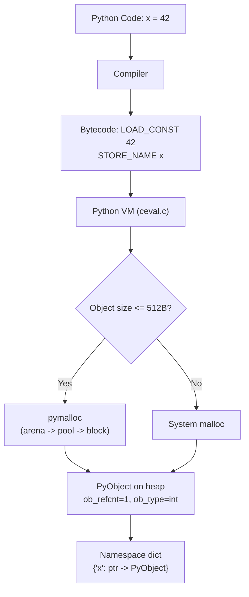
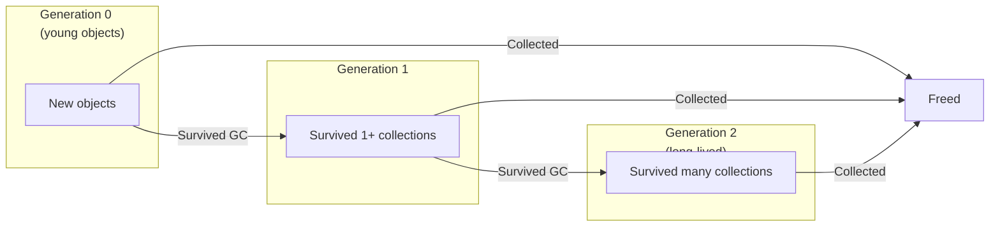
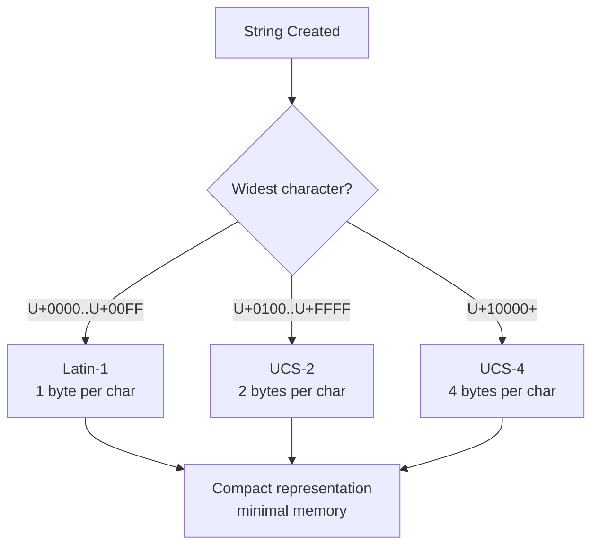

# Variables and Data Types — Professional Level

## Table of Contents

1. [Introduction](#introduction)
2. [CPython Object Model Internals](#cpython-object-model-internals)
3. [PyObject and PyVarObject](#pyobject-and-pyvarobject)
4. [Integer Implementation (PyLongObject)](#integer-implementation-pylongobject)
5. [Float Implementation (PyFloatObject)](#float-implementation-pyfloatobject)
6. [String Implementation (PyUnicodeObject)](#string-implementation-pyunicodeobject)
7. [Boolean and None Singletons](#boolean-and-none-singletons)
8. [Reference Counting Internals](#reference-counting-internals)
9. [Garbage Collector Internals](#garbage-collector-internals)
10. [Small Object Allocator (obmalloc)](#small-object-allocator-obmalloc)
11. [Bytecode Analysis with dis](#bytecode-analysis-with-dis)
12. [Interning and Caching Internals](#interning-and-caching-internals)
13. [GIL and Type Operations](#gil-and-type-operations)
14. [Code Examples](#code-examples)
15. [Test](#test)
16. [Tricky Questions](#tricky-questions)
17. [Summary](#summary)
18. [Further Reading](#further-reading)
19. [Diagrams & Visual Aids](#diagrams--visual-aids)

---

## Introduction

> Focus: "What happens under the hood?" — CPython internals, bytecode, GIL, memory allocators

At the professional level, you go beyond Python-the-language into CPython-the-implementation. You understand how variables are represented as C structs, how reference counting works at the C level, how the garbage collector detects cycles, how the small object allocator manages memory, and how the GIL affects type operations. This knowledge is essential for writing C extensions, debugging interpreter-level issues, and understanding performance at the deepest level.

---

## CPython Object Model Internals

Every Python object is a C struct that begins with a `PyObject` header. This is defined in `Include/object.h`:

```c
// Simplified from CPython source: Include/object.h
typedef struct _object {
    Py_ssize_t ob_refcnt;     // Reference count (8 bytes on 64-bit)
    PyTypeObject *ob_type;     // Pointer to type object (8 bytes)
} PyObject;

// For variable-size objects (list, tuple, str, int):
typedef struct {
    PyObject ob_base;
    Py_ssize_t ob_size;        // Number of items (8 bytes)
} PyVarObject;
```

```
+--------------------+
| PyObject (16 bytes)|
|--------------------|
| ob_refcnt: 8 bytes |  <- Py_ssize_t (signed size)
| ob_type:   8 bytes |  <- pointer to PyTypeObject
+--------------------+

+--------------------+
| PyVarObject        |
|--------------------|
| ob_refcnt: 8 bytes |
| ob_type:   8 bytes |
| ob_size:   8 bytes |  <- number of elements
+--------------------+
```

You can verify this from Python:

```python
import ctypes
import sys

x = 42

# Read raw memory: first 8 bytes = ob_refcnt
refcount_from_memory = ctypes.c_ssize_t.from_address(id(x)).value
refcount_from_api = sys.getrefcount(x)  # +1 for the getrefcount argument

print(f"refcount (memory): {refcount_from_memory}")
print(f"refcount (API):    {refcount_from_api}")
print(f"id(x) = {id(x)} = {hex(id(x))}")
```

---

## PyObject and PyVarObject

### The Type Object (PyTypeObject)

Every type (int, str, list, etc.) is itself a `PyTypeObject` — a large C struct containing function pointers for all operations (tp_hash, tp_richcompare, tp_repr, etc.).

```python
import sys

# The type object for int
int_type = type(42)
print(f"type(42) = {int_type}")                    # <class 'int'>
print(f"type(type(42)) = {type(int_type)}")        # <class 'type'>
print(f"type(type) = {type(type)}")                # <class 'type'> — metaclass

# Size of the type object itself
print(f"Size of int type object: {sys.getsizeof(int)} bytes")   # ~1000+ bytes
print(f"Size of str type object: {sys.getsizeof(str)} bytes")
```

```
Type Hierarchy:
                    type
                   /    \
                int      str      float     list     ...
               /          \
           bool          (subclasses)
```

---

## Integer Implementation (PyLongObject)

CPython integers use arbitrary-precision arithmetic. Internally, they are stored as an array of "digits" where each digit is a 30-bit value (on 64-bit platforms):

```c
// Simplified from CPython: Include/cpython/longintrepr.h
struct _longobject {
    PyObject_VAR_HEAD          // ob_refcnt + ob_type + ob_size
    digit ob_digit[1];         // Array of 30-bit digits
};
// digit = uint32_t, but only 30 bits used per digit (2^30 = 1,073,741,824)
```

```python
import sys
import math

# Integer sizes grow with value
for exp in [0, 15, 30, 60, 90, 300, 1000]:
    n = 2 ** exp
    size = sys.getsizeof(n)
    digits_needed = max(1, math.ceil((exp + 1) / 30))  # 30 bits per digit
    print(f"2^{exp:4d}: {size:4d} bytes, ~{digits_needed} internal digit(s)")

# Output shows step-wise growth:
# 2^   0:   28 bytes, ~1 internal digit(s)
# 2^  15:   28 bytes, ~1 internal digit(s)
# 2^  30:   32 bytes, ~2 internal digit(s)
# 2^  60:   36 bytes, ~3 internal digit(s)
# ...
```

### Small Integer Cache

CPython pre-allocates integer objects for -5 to 256 in `Objects/longobject.c`:

```python
import ctypes

# All integers -5 to 256 are pre-allocated singletons
# You can verify they share the same id:
for i in range(-5, 257):
    a = i
    b = int(str(i))  # Force creation through different path
    assert a is b, f"Failed for {i}"

print("All integers -5 to 256 are cached singletons")

# Outside the cache, new objects are created:
a = 257
b = 257
print(f"257: a is b = {a is b}")  # May vary by context
```

---

## Float Implementation (PyFloatObject)

Floats are a fixed-size C `double` (IEEE 754 64-bit):

```c
// Simplified from CPython: Include/cpython/floatobject.h
typedef struct {
    PyObject_HEAD              // ob_refcnt + ob_type (16 bytes)
    double ob_fval;            // The actual float value (8 bytes)
} PyFloatObject;
// Total: 24 bytes per float object
```

```python
import sys
import struct

x = 3.14

# Float is always 24 bytes regardless of value
print(f"sys.getsizeof(0.0) = {sys.getsizeof(0.0)}")         # 24
print(f"sys.getsizeof(1e308) = {sys.getsizeof(1e308)}")      # 24
print(f"sys.getsizeof(float('inf')) = {sys.getsizeof(float('inf'))}")  # 24

# Examine IEEE 754 representation
packed = struct.pack('d', 3.14)
print(f"3.14 as bytes: {packed.hex()}")
print(f"3.14 as bits:  {bin(int.from_bytes(packed, 'little'))}")

# Float free list — CPython reuses float objects
# When a float is deallocated, it goes to a free list (up to 100 objects)
# Next float allocation pulls from this free list instead of malloc
```

### Float Free List

```python
import gc

def demonstrate_float_free_list():
    """CPython maintains a free list for float objects for fast allocation."""
    # Create and destroy many floats
    for _ in range(1000):
        x = 3.14  # Allocated from free list after first cycle
        del x      # Returned to free list, not freed

    # This is why float creation is fast despite being heap-allocated
    import timeit
    t = timeit.timeit("x = 3.14", number=10_000_000)
    print(f"10M float assignments: {t:.3f}s")


if __name__ == "__main__":
    demonstrate_float_free_list()
```

---

## String Implementation (PyUnicodeObject)

CPython 3.3+ (PEP 393) uses compact string representation with three possible internal encodings:

```c
// Simplified — actual implementation in Include/cpython/unicodeobject.h
// Strings use the smallest encoding that fits all characters:
// - Latin-1 (1 byte per char) for ASCII/Latin characters
// - UCS-2 (2 bytes per char) for BMP characters
// - UCS-4 (4 bytes per char) for full Unicode
```

```python
import sys

# String size depends on the widest character
ascii_str = "hello"          # Latin-1: 1 byte per char
latin_str = "hello\u00e9"   # Latin-1: 1 byte per char (e-acute fits in Latin-1)
bmp_str = "hello\u4e16"     # UCS-2: 2 bytes per char (Chinese character)
full_str = "hello\U0001F600" # UCS-4: 4 bytes per char (emoji)

for s, label in [(ascii_str, "ASCII"), (latin_str, "Latin-1"),
                  (bmp_str, "BMP"), (full_str, "Full Unicode")]:
    print(f"{label:15s}: '{s}' -> {sys.getsizeof(s)} bytes, len={len(s)}")

# Output:
# ASCII          : 'hello' -> 54 bytes, len=5
# Latin-1        : 'hello...' -> 55 bytes, len=6
# BMP            : 'hello...' -> 66 bytes, len=6  (switched to 2-byte encoding)
# Full Unicode   : 'hello...' -> 80 bytes, len=6  (switched to 4-byte encoding)
```

### String Interning Mechanism

```python
import sys

# CPython interns:
# 1. String literals that look like identifiers (compile time)
# 2. Strings explicitly interned with sys.intern()
# 3. Some attribute names and dict keys

a = "hello"
b = "hello"
print(f"Literal interning:  a is b = {a is b}")  # True

# Strings with spaces are NOT automatically interned
a = "hello world"
b = "hello world"
print(f"Space string:       a is b = {a is b}")  # Usually True in scripts (compile-time folding)

# Dynamic strings are NOT interned
a = "hello"
b = "".join(["h", "e", "l", "l", "o"])
print(f"Dynamic string:     a is b = {a is b}")  # Usually False

# Force interning
a = sys.intern("hello world!")
b = sys.intern("hello world!")
print(f"sys.intern():       a is b = {a is b}")  # True
```

---

## Boolean and None Singletons

`True`, `False`, and `None` are singleton objects — only one instance exists in the interpreter:

```python
import ctypes
import sys

# None is a singleton
a = None
b = None
print(f"None: id(a) = {id(a)}, id(b) = {id(b)}, same = {a is b}")  # True

# True and False are singletons
print(f"True:  id = {id(True)},  refcount = {sys.getrefcount(True)}")
print(f"False: id = {id(False)}, refcount = {sys.getrefcount(False)}")
print(f"None:  id = {id(None)},  refcount = {sys.getrefcount(None)}")

# bool is a subclass of int — True IS the int 1
print(f"True == 1:   {True == 1}")     # True
print(f"True is 1:   {True is 1}")     # May be True (1 is in int cache)
print(f"hash(True):  {hash(True)}")    # 1
print(f"hash(1):     {hash(1)}")       # 1

# You cannot create new bool instances — bool() always returns True or False singleton
print(f"bool(42) is True: {bool(42) is True}")   # True
print(f"bool(0) is False: {bool(0) is False}")    # True
```

---

## Reference Counting Internals

Reference counting is CPython's primary memory management mechanism, implemented at the C level:

```python
import sys
import ctypes


def show_refcount_operations():
    """Demonstrate reference counting at the C level."""

    # Create an object
    obj = [1, 2, 3]
    base_count = sys.getrefcount(obj) - 1  # -1 for getrefcount's own reference

    print(f"After creation:           refcount = {base_count}")

    # Assignment increases refcount
    alias = obj
    print(f"After alias = obj:        refcount = {sys.getrefcount(obj) - 1}")

    # Container reference
    container = {"data": obj}
    print(f"After dict ref:           refcount = {sys.getrefcount(obj) - 1}")

    # Function argument (temporarily increases refcount)
    def check(x):
        print(f"Inside function call:     refcount = {sys.getrefcount(x) - 1}")
    check(obj)

    # Deleting references decreases refcount
    del alias
    print(f"After del alias:          refcount = {sys.getrefcount(obj) - 1}")

    del container
    print(f"After del container:      refcount = {sys.getrefcount(obj) - 1}")


def read_raw_refcount(obj):
    """Read ob_refcnt directly from memory using ctypes."""
    # id(obj) gives the memory address of the PyObject
    # ob_refcnt is the first field (offset 0)
    return ctypes.c_ssize_t.from_address(id(obj)).value


if __name__ == "__main__":
    show_refcount_operations()

    print("\n--- Raw memory read ---")
    x = object()
    print(f"sys.getrefcount(x) = {sys.getrefcount(x)}")
    print(f"Raw ob_refcnt      = {read_raw_refcount(x)}")
```

---

## Garbage Collector Internals

CPython's GC handles reference cycles that reference counting cannot clean up. It uses a generational collection algorithm:

```python
import gc
import sys


def explore_gc_internals():
    """Explore CPython's garbage collector internals."""

    # GC has 3 generations
    print("=== GC Generations ===")
    for i, stats in enumerate(gc.get_stats()):
        print(f"Gen {i}: collections={stats['collections']}, "
              f"collected={stats['collected']}, uncollectable={stats['uncollectable']}")

    # Thresholds: how many allocations trigger collection
    thresholds = gc.get_threshold()
    print(f"\nThresholds: gen0={thresholds[0]}, gen1={thresholds[1]}, gen2={thresholds[2]}")
    # Default: (700, 10, 10)
    # Gen0 collects after 700 new allocations
    # Gen1 collects after 10 gen0 collections
    # Gen2 collects after 10 gen1 collections

    # Count objects tracked by GC per generation
    print(f"\nObjects per generation:")
    for i, count in enumerate(gc.get_count()):
        print(f"  Gen {i}: {count} objects")


def demonstrate_gc_cycle_detection():
    """Show how GC detects and collects reference cycles."""
    gc.collect()  # Start clean

    class CycleNode:
        def __init__(self, name):
            self.name = name
            self.ref = None

    # Create a reference cycle
    a = CycleNode("A")
    b = CycleNode("B")
    a.ref = b
    b.ref = a

    # Both have refcount > 0, but are unreachable after del
    id_a, id_b = id(a), id(b)
    del a, b

    # Before GC: objects still exist (refcount > 0 due to cycle)
    print(f"\nBefore gc.collect():")
    print(f"  Unreachable objects: {gc.collect()}")

    # GC uses a tri-color marking algorithm to find unreachable cycles


def show_gc_callbacks():
    """Register a callback to monitor GC activity."""
    def gc_callback(phase, info):
        if phase == "start":
            print(f"  GC start: generation={info['generation']}")
        elif phase == "stop":
            print(f"  GC stop:  collected={info['collected']}, "
                  f"uncollectable={info['uncollectable']}")

    gc.callbacks.append(gc_callback)
    print("\n=== GC Callback Demo ===")
    gc.collect()
    gc.callbacks.remove(gc_callback)


if __name__ == "__main__":
    explore_gc_internals()
    demonstrate_gc_cycle_detection()
    show_gc_callbacks()
```

---

## Small Object Allocator (obmalloc)

CPython uses a custom memory allocator (`pymalloc`) for small objects (<= 512 bytes). It uses a hierarchy: arenas -> pools -> blocks.

```
Memory Hierarchy:
+------------------------------------------+
|              Arena (256 KB)               |
|------------------------------------------|
|  +----------+  +----------+  +--------+  |
|  | Pool     |  | Pool     |  | Pool   |  |
|  | (4 KB)   |  | (4 KB)   |  | (4 KB) |  |
|  |----------|  |----------|  |--------|  |
|  | block    |  | block    |  | block  |  |
|  | block    |  | block    |  | block  |  |
|  | block    |  | block    |  | block  |  |
|  | ...      |  | ...      |  | ...    |  |
|  +----------+  +----------+  +--------+  |
+------------------------------------------+

Block sizes: 8, 16, 24, 32, ..., 512 bytes (in 8-byte increments)
Each pool handles blocks of one specific size class.
```

```python
import sys


def analyze_allocator_behavior():
    """Observe pymalloc behavior through object size patterns."""

    # Objects <= 512 bytes use pymalloc
    # Objects > 512 bytes use system malloc

    # Size classes are multiples of 8 bytes
    print("=== Size Class Analysis ===")
    for size in [0, 1, 8, 9, 16, 17, 24, 25, 32, 48, 64, 128, 256, 512, 513]:
        data = b"\x00" * size
        actual_size = sys.getsizeof(data)
        # pymalloc rounds up to nearest 8-byte boundary
        print(f"bytes({size:4d}): getsizeof={actual_size:4d}, "
              f"allocator={'pymalloc' if actual_size <= 512 else 'system malloc'}")

    # Memory stats (if Python built with PYMEM_DEBUG)
    try:
        import _tracemalloc
        print(f"\ntracemalloc available: {hasattr(_tracemalloc, 'get_traced_memory')}")
    except ImportError:
        pass


if __name__ == "__main__":
    analyze_allocator_behavior()
```

---

## Bytecode Analysis with dis

Understanding how Python compiles variable operations to bytecode:

```python
import dis


def bytecode_variable_operations():
    """Analyze bytecode for variable and type operations."""

    # Simple assignment
    print("=== Simple Assignment ===")
    code1 = compile("x = 42", "<string>", "exec")
    dis.dis(code1)
    # LOAD_CONST 0 (42)
    # STORE_NAME 0 (x)

    print("\n=== Type Check ===")
    code2 = compile("isinstance(x, int)", "<string>", "eval")
    dis.dis(code2)

    print("\n=== Augmented Assignment ===")
    def augmented():
        x = 10
        x += 5      # BINARY_ADD + STORE_FAST (not in-place for int)
        return x
    dis.dis(augmented)

    print("\n=== Multiple Assignment ===")
    def multiple():
        x, y, z = 1, 2, 3  # UNPACK_SEQUENCE
        return x + y + z
    dis.dis(multiple)

    print("\n=== Global vs Local ===")
    def global_access():
        global G
        G = 42  # STORE_GLOBAL
    dis.dis(global_access)

    print("\n=== Closure ===")
    def make_closure():
        x = 10
        def inner():
            return x  # LOAD_DEREF — from closure cell
        return inner
    dis.dis(make_closure)


def compare_name_operations():
    """Compare LOAD_FAST vs LOAD_GLOBAL vs LOAD_DEREF bytecodes."""

    GLOBAL_VAR = 42

    def local_access():
        x = 42
        return x  # LOAD_FAST — array index, O(1)

    def global_access():
        return GLOBAL_VAR  # LOAD_GLOBAL — dict lookup, slower

    print("=== Local Access (LOAD_FAST) ===")
    dis.dis(local_access)

    print("\n=== Global Access (LOAD_GLOBAL) ===")
    dis.dis(global_access)

    # Benchmark
    import timeit
    local_time = timeit.timeit(local_access, number=10_000_000)
    global_time = timeit.timeit(global_access, number=10_000_000)
    print(f"\nLocal access:  {local_time:.3f}s")
    print(f"Global access: {global_time:.3f}s")
    print(f"Local is {global_time/local_time:.1f}x faster")


if __name__ == "__main__":
    bytecode_variable_operations()
    print("\n" + "=" * 60)
    compare_name_operations()
```

---

## Interning and Caching Internals

### How CPython Implements Interning

```python
import sys
import gc


def explore_interning_details():
    """Explore CPython's string and integer interning mechanisms."""

    # 1. Integer interning: pre-allocated array of PyLongObjects
    # Defined in Objects/longobject.c: NSMALLPOSINTS=257, NSMALLNEGINTS=5
    print("=== Integer Cache ===")
    for i in [-6, -5, 0, 256, 257]:
        a = i
        # Force creation through a different code path
        b = int(float(i))
        print(f"  {i:4d}: a is b = {a is b}")

    # 2. String interning: stored in a global dict
    print("\n=== String Interning ===")

    # Compile-time interning (identifier-like strings)
    a = "hello"
    b = "hello"
    print(f"  'hello' (literal):    a is b = {a is b}")  # True

    # Runtime strings are NOT interned by default
    a = "".join(["h", "e", "l", "l", "o"])
    b = "".join(["h", "e", "l", "l", "o"])
    print(f"  'hello' (dynamic):    a is b = {a is b}")  # False

    # sys.intern() adds to the intern dict
    a = sys.intern(a)
    b = sys.intern(b)
    print(f"  'hello' (interned):   a is b = {a is b}")  # True

    # 3. Constant folding by peephole optimizer
    print("\n=== Constant Folding ===")
    # The compiler folds constant expressions at compile time
    import dis
    code = compile("x = 2 + 3", "<string>", "exec")
    dis.dis(code)
    # Shows LOAD_CONST 5 (not LOAD_CONST 2, LOAD_CONST 3, BINARY_ADD)


def measure_intern_performance():
    """Benchmark string comparison with and without interning."""
    import timeit

    # Without interning
    setup_no_intern = '''
a = "".join(["l", "o", "n", "g", "_", "k", "e", "y", "_", "n", "a", "m", "e"])
b = "".join(["l", "o", "n", "g", "_", "k", "e", "y", "_", "n", "a", "m", "e"])
'''

    # With interning
    setup_intern = '''
import sys
a = sys.intern("".join(["l", "o", "n", "g", "_", "k", "e", "y", "_", "n", "a", "m", "e"]))
b = sys.intern("".join(["l", "o", "n", "g", "_", "k", "e", "y", "_", "n", "a", "m", "e"]))
'''

    t_eq = timeit.timeit("a == b", setup=setup_no_intern, number=10_000_000)
    t_is = timeit.timeit("a is b", setup=setup_intern, number=10_000_000)

    print(f"  == (not interned): {t_eq:.3f}s")
    print(f"  is (interned):     {t_is:.3f}s")
    print(f"  Speedup: {t_eq / t_is:.1f}x")


if __name__ == "__main__":
    explore_interning_details()
    print("\n=== Intern Performance ===")
    measure_intern_performance()
```

---

## GIL and Type Operations

The Global Interpreter Lock (GIL) protects reference counting but affects how type operations behave in multi-threaded code:

```python
import threading
import sys
import time


def demonstrate_gil_and_refcount():
    """Show how GIL protects reference counting."""

    shared_list = [1, 2, 3]
    errors = []

    def modify_shared():
        for _ in range(1_000_000):
            # These operations are atomic under the GIL:
            # - STORE_NAME (simple assignment)
            # - LOAD_FAST (local variable access)
            # But compound operations are NOT atomic:
            local = shared_list  # Atomic — GIL held for this bytecode
            # shared_list += [4]  # NOT atomic — multiple bytecodes

    threads = [threading.Thread(target=modify_shared) for _ in range(4)]
    start = time.perf_counter()
    for t in threads:
        t.start()
    for t in threads:
        t.join()
    elapsed = time.perf_counter() - start

    print(f"4 threads completed in {elapsed:.3f}s")
    print(f"Final refcount of shared_list: {sys.getrefcount(shared_list)}")


def demonstrate_atomic_operations():
    """Show which operations are atomic under the GIL."""
    import dis

    print("=== Atomic (single bytecode) ===")
    # x = y  ->  LOAD_FAST + STORE_FAST
    code = compile("x = y", "<string>", "exec")
    dis.dis(code)

    print("\n=== NOT Atomic (multiple bytecodes) ===")
    # x += 1  ->  LOAD_FAST + LOAD_CONST + BINARY_ADD + STORE_FAST
    def inc():
        x = 0
        x += 1
    dis.dis(inc)

    print("\nNote: Even single bytecodes may release the GIL for I/O operations")


if __name__ == "__main__":
    demonstrate_gil_and_refcount()
    print()
    demonstrate_atomic_operations()
```

---

## Code Examples

### Example 1: Custom Object with C-Level Inspection

```python
import ctypes
import struct
import sys


def inspect_object_header(obj) -> None:
    """Read the PyObject header from raw memory."""
    addr = id(obj)

    # Read ob_refcnt (first 8 bytes)
    refcnt = ctypes.c_ssize_t.from_address(addr).value

    # Read ob_type pointer (next 8 bytes)
    type_ptr = ctypes.c_void_p.from_address(addr + 8).value

    print(f"Object: {obj!r}")
    print(f"  Address:    {hex(addr)}")
    print(f"  ob_refcnt:  {refcnt}")
    print(f"  ob_type:    {hex(type_ptr)} -> {type(obj).__name__}")
    print(f"  id(type):   {hex(id(type(obj)))}")
    print(f"  type match: {type_ptr == id(type(obj))}")
    print(f"  getsizeof:  {sys.getsizeof(obj)} bytes")
    print()


if __name__ == "__main__":
    inspect_object_header(42)
    inspect_object_header(3.14)
    inspect_object_header("hello")
    inspect_object_header([1, 2, 3])
    inspect_object_header(None)
    inspect_object_header(True)
```

### Example 2: Tracking Object Lifecycle

```python
import gc
import weakref
import sys


class TrackedObject:
    """Object that reports its lifecycle events."""
    _instances = 0

    def __init__(self, name: str):
        TrackedObject._instances += 1
        self.name = name
        self.instance_number = TrackedObject._instances
        print(f"  [CREATED]  {self} (total: {TrackedObject._instances})")

    def __repr__(self) -> str:
        return f"TrackedObject({self.name!r}, #{self.instance_number})"

    def __del__(self):
        TrackedObject._instances -= 1
        print(f"  [DELETED]  TrackedObject({self.name!r}, #{self.instance_number}) "
              f"(remaining: {TrackedObject._instances})")


def lifecycle_demo():
    """Demonstrate object creation, reference counting, and destruction."""
    print("=== Object Lifecycle ===\n")

    print("1. Create object:")
    obj = TrackedObject("alpha")
    print(f"   refcount: {sys.getrefcount(obj) - 1}")

    print("\n2. Create alias:")
    alias = obj
    print(f"   refcount: {sys.getrefcount(obj) - 1}")

    print("\n3. Create weak reference:")
    weak = weakref.ref(obj)
    print(f"   refcount: {sys.getrefcount(obj) - 1}")  # Unchanged — weak refs don't count
    print(f"   weak() is obj: {weak() is obj}")

    print("\n4. Delete alias:")
    del alias
    print(f"   refcount: {sys.getrefcount(obj) - 1}")

    print("\n5. Delete last strong reference:")
    del obj
    print(f"   weak() is None: {weak() is None}")  # True — object was collected

    print("\n6. Create reference cycle:")
    a = TrackedObject("cycle_a")
    b = TrackedObject("cycle_b")
    a.ref = b
    b.ref = a
    del a, b
    print("   After del — objects not yet collected (cycle)")
    collected = gc.collect()
    print(f"   gc.collect() freed {collected} objects")


if __name__ == "__main__":
    lifecycle_demo()
```

---

## Test

### Multiple Choice

**1. How many bytes does a CPython `float` object occupy?**

- A) 8 bytes (just the C double)
- B) 16 bytes (header only)
- C) 24 bytes (header + double)
- D) 28 bytes (like int)

<details>
<summary>Answer</summary>
<strong>C)</strong> — A float object has: <code>ob_refcnt</code> (8) + <code>ob_type</code> (8) + <code>ob_fval</code> (8) = 24 bytes.
</details>

**2. Which bytecode instruction is used for local variable access?**

- A) `LOAD_NAME`
- B) `LOAD_GLOBAL`
- C) `LOAD_FAST`
- D) `LOAD_DEREF`

<details>
<summary>Answer</summary>
<strong>C)</strong> — <code>LOAD_FAST</code> uses an array index for O(1) access to local variables. <code>LOAD_GLOBAL</code> does a dict lookup (slower). <code>LOAD_DEREF</code> accesses closure variables via cell objects.
</details>

**3. What is the size of a single "digit" in CPython's arbitrary-precision integer?**

- A) 8 bits
- B) 16 bits
- C) 30 bits
- D) 32 bits

<details>
<summary>Answer</summary>
<strong>C)</strong> — CPython uses 30-bit digits (stored in <code>uint32_t</code>) on 64-bit platforms. This allows carry bits during arithmetic operations without overflow.
</details>

### What's the Output?

**4. What does this code print?**

```python
import sys
print(sys.getsizeof(True), sys.getsizeof(0))
```

<details>
<summary>Answer</summary>
Output: <code>28 28</code> — Both <code>True</code> (a bool, subclass of int) and <code>0</code> (an int) occupy 28 bytes. The bool singleton is the same size as a small integer.
</details>

---

## Tricky Questions

**1. Why does `sys.getrefcount(x)` always return at least 2?**

<details>
<summary>Answer</summary>
Because calling <code>sys.getrefcount(x)</code> creates a temporary reference to <code>x</code> as the function argument. So the count is always 1 more than expected. The "real" refcount is <code>sys.getrefcount(x) - 1</code>.
</details>

**2. Why can't you create a weak reference to an integer?**

<details>
<summary>Answer</summary>
Built-in immutable types like <code>int</code>, <code>str</code>, <code>tuple</code>, <code>bytes</code>, and <code>NoneType</code> do not allocate space for weak reference lists (<code>tp_weaklistoffset = 0</code> in their type object). This is a deliberate design choice: these objects are often shared (interned/cached), and weak references would add overhead to the most common objects. User-defined classes support weak references by default.
</details>

**3. What happens to the GIL during a `Py_INCREF` / `Py_DECREF` operation?**

<details>
<summary>Answer</summary>
The GIL must be held during <code>Py_INCREF</code> and <code>Py_DECREF</code> to ensure atomicity of reference count updates. Without the GIL, concurrent increment/decrement could corrupt the reference count, leading to premature deallocation or memory leaks. This is the primary reason the GIL exists — it makes reference counting thread-safe without per-object locks (which would be prohibitively slow).
</details>

---

## Summary

- Every CPython object starts with a 16-byte header (`ob_refcnt` + `ob_type`)
- Integers use 30-bit digit arrays for arbitrary precision; small integers (-5 to 256) are cached
- Floats are fixed 24 bytes (header + C double); a free list accelerates allocation
- Strings use adaptive encoding (Latin-1 / UCS-2 / UCS-4) based on the widest character (PEP 393)
- `True`, `False`, `None` are singletons — only one instance exists
- Reference counting is the primary GC mechanism; cyclic GC handles reference cycles
- `pymalloc` handles objects <= 512 bytes using arenas (256 KB) -> pools (4 KB) -> blocks
- `LOAD_FAST` (local) is faster than `LOAD_GLOBAL` (dict lookup) — prefer local variables in hot loops
- The GIL ensures reference counting is thread-safe but limits CPU parallelism

---

## Further Reading

- **CPython Source:** [Objects/longobject.c](https://github.com/python/cpython/blob/main/Objects/longobject.c)
- **CPython Source:** [Objects/unicodeobject.c](https://github.com/python/cpython/blob/main/Objects/unicodeobject.c)
- **CPython Source:** [Objects/obmalloc.c](https://github.com/python/cpython/blob/main/Objects/obmalloc.c)
- **PEP 393:** [Flexible String Representation](https://peps.python.org/pep-0393/)
- **PEP 442:** [Safe object finalization](https://peps.python.org/pep-0442/)
- **Book:** CPython Internals (Anthony Shaw) — chapters on objects and memory
- **Book:** Inside the Python Virtual Machine (Obi Ike-Nwosu)

---

## Diagrams & Visual Aids

### CPython Memory Architecture



### Generational GC



### String Internal Encoding (PEP 393)


