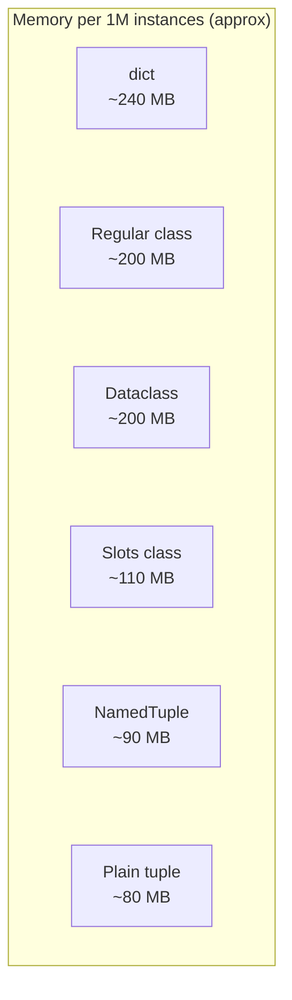
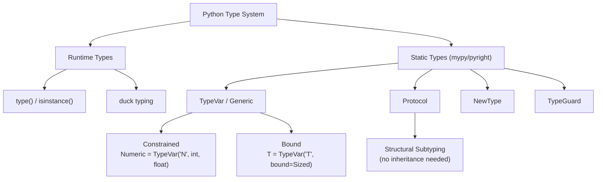

# Variables and Data Types — Senior Level

## Table of Contents

1. [Introduction](#introduction)
2. [Core Concepts](#core-concepts)
3. [Architecture Patterns](#architecture-patterns)
4. [Performance Profiling](#performance-profiling)
5. [Code Examples](#code-examples)
6. [Advanced Type System](#advanced-type-system)
7. [Memory Management](#memory-management)
8. [Debugging & Profiling](#debugging--profiling)
9. [Best Practices at Scale](#best-practices-at-scale)
10. [Edge Cases & Pitfalls](#edge-cases--pitfalls)
11. [Test](#test)
12. [Tricky Questions](#tricky-questions)
13. [Summary](#summary)
14. [Further Reading](#further-reading)
15. [Diagrams & Visual Aids](#diagrams--visual-aids)

---

## Introduction

> Focus: "How to optimize?" and "How to architect?"

At the senior level, variables and data types are no longer about syntax — they are about **architecture decisions**, **memory efficiency**, **performance profiling**, and **advanced type system design**. You need to understand how Python's object model impacts performance at scale, how to design type hierarchies for large codebases, and how to profile and optimize memory usage.

---

## Core Concepts

### Concept 1: Python's Object Model at Scale

Every Python object carries overhead: `ob_refcnt` (8 bytes), `ob_type` (8 bytes), plus type-specific data. For millions of objects, this matters enormously.

```python
import sys

# Size of basic types
print(f"int(0):        {sys.getsizeof(0)} bytes")        # 28
print(f"int(2**30):    {sys.getsizeof(2**30)} bytes")     # 32
print(f"int(2**60):    {sys.getsizeof(2**60)} bytes")     # 36
print(f"float(0.0):    {sys.getsizeof(0.0)} bytes")       # 24
print(f"str(''):       {sys.getsizeof('')} bytes")         # 49
print(f"str('hello'):  {sys.getsizeof('hello')} bytes")   # 54
print(f"bool(True):    {sys.getsizeof(True)} bytes")      # 28
print(f"None:          {sys.getsizeof(None)} bytes")      # 16
print(f"list([]):      {sys.getsizeof([])} bytes")        # 56
print(f"dict({{}}):      {sys.getsizeof({})} bytes")      # 64
print(f"tuple(()):     {sys.getsizeof(())} bytes")        # 40
```

### Concept 2: Memory Layout Strategies

When storing millions of records, the choice between `dict`, `dataclass`, `NamedTuple`, `__slots__`, and arrays has massive memory implications.

```python
import sys
from dataclasses import dataclass
from typing import NamedTuple


class PointDict:
    def __init__(self, x: float, y: float):
        self.x = x
        self.y = y


@dataclass
class PointDataclass:
    x: float
    y: float


@dataclass
class PointSlots:
    __slots__ = ("x", "y")
    x: float
    y: float


class PointNamedTuple(NamedTuple):
    x: float
    y: float


def measure_memory(cls, label: str, n: int = 100_000) -> None:
    """Measure total memory for n instances."""
    import tracemalloc
    tracemalloc.start()
    objects = [cls(1.0, 2.0) for _ in range(n)]
    current, peak = tracemalloc.get_traced_memory()
    tracemalloc.stop()
    print(f"{label:20s}: {current / 1024 / 1024:.2f} MB for {n:,} instances")
    del objects


if __name__ == "__main__":
    measure_memory(PointDict, "Regular class")
    measure_memory(PointDataclass, "Dataclass")
    measure_memory(PointSlots, "Slots dataclass")
    measure_memory(PointNamedTuple, "NamedTuple")
```

### Concept 3: Descriptor Protocol and Type Enforcement

Descriptors are the mechanism behind `property`, `classmethod`, `staticmethod`, and `__slots__`. Use them for custom type validation at attribute level.

```python
from typing import Any


class TypedField:
    """Descriptor that enforces type at assignment time."""

    def __init__(self, name: str, expected_type: type) -> None:
        self.name = name
        self.expected_type = expected_type
        self.storage_name = f"_typed_{name}"

    def __set_name__(self, owner: type, name: str) -> None:
        self.name = name
        self.storage_name = f"_typed_{name}"

    def __get__(self, obj: Any, objtype: type | None = None) -> Any:
        if obj is None:
            return self
        return getattr(obj, self.storage_name, None)

    def __set__(self, obj: Any, value: Any) -> None:
        if not isinstance(value, self.expected_type):
            raise TypeError(
                f"{self.name} must be {self.expected_type.__name__}, "
                f"got {type(value).__name__}"
            )
        setattr(obj, self.storage_name, value)


class User:
    name = TypedField("name", str)
    age = TypedField("age", int)

    def __init__(self, name: str, age: int) -> None:
        self.name = name
        self.age = age


if __name__ == "__main__":
    u = User("Alice", 30)
    print(u.name, u.age)   # Alice 30

    try:
        u.age = "thirty"   # TypeError: age must be int, got str
    except TypeError as e:
        print(e)
```

---

## Architecture Patterns

### Pattern 1: Type-Driven Domain Modeling

Use NewType and branded types to prevent mixing domain concepts that share the same underlying type.

```python
from typing import NewType

UserId = NewType("UserId", int)
OrderId = NewType("OrderId", int)
Money = NewType("Money", int)  # cents


def get_user(user_id: UserId) -> dict:
    """Fetch user by ID."""
    return {"id": user_id, "name": "Alice"}


def get_order(order_id: OrderId) -> dict:
    """Fetch order by ID."""
    return {"id": order_id, "total": Money(9999)}


# mypy catches this mistake:
uid = UserId(42)
# get_order(uid)  # mypy error: Argument 1 has incompatible type "UserId"; expected "OrderId"
```

### Pattern 2: Protocol-Based Structural Typing

Protocols define interfaces without inheritance — Python's answer to Go interfaces.

```python
from typing import Protocol, runtime_checkable


@runtime_checkable
class Serializable(Protocol):
    def to_dict(self) -> dict: ...


@runtime_checkable
class HasId(Protocol):
    @property
    def id(self) -> int: ...


@dataclass
class User:
    id: int
    name: str
    email: str

    def to_dict(self) -> dict:
        return {"id": self.id, "name": self.name, "email": self.email}


def save_entity(entity: Serializable & HasId) -> None:
    """Save any entity that is serializable and has an ID."""
    data = entity.to_dict()
    print(f"Saving entity {entity.id}: {data}")


if __name__ == "__main__":
    from dataclasses import dataclass

    user = User(id=1, name="Alice", email="alice@example.com")
    save_entity(user)
    print(isinstance(user, Serializable))  # True — runtime check works
```

### Pattern 3: Immutable Value Objects

```python
from dataclasses import dataclass
from functools import cached_property


@dataclass(frozen=True, slots=True)
class Money:
    """Immutable value object for monetary amounts."""
    amount: int         # stored in cents to avoid float precision issues
    currency: str = "USD"

    def __post_init__(self) -> None:
        if self.amount < 0:
            raise ValueError(f"Amount cannot be negative: {self.amount}")
        if len(self.currency) != 3:
            raise ValueError(f"Currency must be 3-letter ISO code: {self.currency}")

    @cached_property
    def dollars(self) -> float:
        return self.amount / 100

    def __add__(self, other: "Money") -> "Money":
        if self.currency != other.currency:
            raise ValueError(f"Cannot add {self.currency} and {other.currency}")
        return Money(self.amount + other.amount, self.currency)

    def __str__(self) -> str:
        return f"${self.dollars:,.2f} {self.currency}"


if __name__ == "__main__":
    price = Money(1999)
    tax = Money(160)
    total = price + tax
    print(f"Price: {price}")   # $19.99 USD
    print(f"Tax:   {tax}")     # $1.60 USD
    print(f"Total: {total}")   # $21.59 USD
```

---

## Performance Profiling

### Profiling Object Creation

```python
import timeit
from dataclasses import dataclass
from typing import NamedTuple


class PointDict:
    def __init__(self, x: float, y: float):
        self.x = x
        self.y = y

@dataclass
class PointDC:
    x: float
    y: float

@dataclass
class PointSlots:
    __slots__ = ("x", "y")
    x: float
    y: float

class PointNT(NamedTuple):
    x: float
    y: float


def benchmark(label: str, stmt: str, n: int = 1_000_000) -> None:
    t = timeit.timeit(stmt, globals=globals(), number=n)
    print(f"{label:25s}: {t:.3f}s ({n:,} iterations)")


if __name__ == "__main__":
    benchmark("Regular class", "PointDict(1.0, 2.0)")
    benchmark("Dataclass", "PointDC(1.0, 2.0)")
    benchmark("Slots dataclass", "PointSlots(1.0, 2.0)")
    benchmark("NamedTuple", "PointNT(1.0, 2.0)")
    benchmark("Plain tuple", "(1.0, 2.0)")
    benchmark("Plain dict", "{'x': 1.0, 'y': 2.0}")
```

### Profiling Memory with tracemalloc

```python
import tracemalloc
import linecache


def profile_memory_allocation() -> None:
    """Profile memory allocation with detailed traceback."""
    tracemalloc.start(25)  # Store 25 frames

    # Simulate data processing
    users = [{"name": f"user_{i}", "age": 20 + i % 50} for i in range(100_000)]
    names = [u["name"] for u in users]
    ages = [u["age"] for u in users]

    snapshot = tracemalloc.take_snapshot()
    top_stats = snapshot.statistics("lineno")

    print("Top 5 memory allocations:")
    for stat in top_stats[:5]:
        print(f"  {stat}")

    tracemalloc.stop()


if __name__ == "__main__":
    profile_memory_allocation()
```

---

## Code Examples

### Example 1: Generic Repository with Type Safety

```python
from typing import TypeVar, Generic, Protocol
from dataclasses import dataclass, field


class HasId(Protocol):
    @property
    def id(self) -> int: ...


T = TypeVar("T", bound=HasId)


class InMemoryRepository(Generic[T]):
    """Type-safe in-memory repository."""

    def __init__(self) -> None:
        self._store: dict[int, T] = {}

    def save(self, entity: T) -> None:
        self._store[entity.id] = entity

    def find_by_id(self, entity_id: int) -> T | None:
        return self._store.get(entity_id)

    def find_all(self) -> list[T]:
        return list(self._store.values())

    def delete(self, entity_id: int) -> bool:
        return self._store.pop(entity_id, None) is not None

    def count(self) -> int:
        return len(self._store)


@dataclass
class User:
    id: int
    name: str
    email: str


@dataclass
class Product:
    id: int
    title: str
    price: int  # cents


if __name__ == "__main__":
    user_repo: InMemoryRepository[User] = InMemoryRepository()
    user_repo.save(User(1, "Alice", "alice@example.com"))
    user_repo.save(User(2, "Bob", "bob@example.com"))

    print(user_repo.find_by_id(1))  # User(id=1, name='Alice', ...)
    print(user_repo.count())         # 2

    product_repo: InMemoryRepository[Product] = InMemoryRepository()
    product_repo.save(Product(1, "Widget", 999))
    # product_repo.save(User(3, "Charlie", "c@example.com"))  # mypy error!
```

### Example 2: WeakRef for Cache without Memory Leaks

```python
import weakref
from dataclasses import dataclass


@dataclass
class ExpensiveResource:
    """Simulates a resource that is costly to create."""
    name: str
    data: bytes = b""

    def __del__(self) -> None:
        print(f"  [GC] {self.name} deleted")


class ResourceCache:
    """Cache using weak references — entries are GC'd when no strong refs remain."""

    def __init__(self) -> None:
        self._cache: dict[str, weakref.ref[ExpensiveResource]] = {}

    def get_or_create(self, name: str) -> ExpensiveResource:
        ref = self._cache.get(name)
        if ref is not None:
            obj = ref()
            if obj is not None:
                print(f"  [CACHE HIT] {name}")
                return obj

        print(f"  [CACHE MISS] Creating {name}")
        obj = ExpensiveResource(name, b"x" * 1024)
        self._cache[name] = weakref.ref(obj, lambda r, n=name: self._cleanup(n))
        return obj

    def _cleanup(self, name: str) -> None:
        self._cache.pop(name, None)
        print(f"  [CACHE] Removed dead reference: {name}")


if __name__ == "__main__":
    cache = ResourceCache()

    r1 = cache.get_or_create("resource_a")
    r2 = cache.get_or_create("resource_a")  # Cache hit
    print(f"Same object: {r1 is r2}")         # True

    del r1, r2  # Both strong references gone — GC can collect
    import gc; gc.collect()

    r3 = cache.get_or_create("resource_a")  # Cache miss — re-created
```

---

## Advanced Type System

### Generics with TypeVar Constraints

```python
from typing import TypeVar, Callable
from decimal import Decimal

# Constrained TypeVar — only these specific types
Numeric = TypeVar("Numeric", int, float, Decimal)


def clamp(value: Numeric, min_val: Numeric, max_val: Numeric) -> Numeric:
    """Clamp a value to a range. Works with int, float, or Decimal."""
    if value < min_val:
        return min_val
    if value > max_val:
        return max_val
    return value


# Bound TypeVar — any subclass of a bound
from collections.abc import Sized
S = TypeVar("S", bound=Sized)


def is_empty(container: S) -> bool:
    """Check if any Sized container is empty."""
    return len(container) == 0


if __name__ == "__main__":
    print(clamp(15, 0, 10))                       # 10
    print(clamp(3.14, 0.0, 2.0))                  # 2.0
    print(clamp(Decimal("1.5"), Decimal("0"), Decimal("1")))  # Decimal('1')

    print(is_empty([]))       # True
    print(is_empty("hello"))  # False
```

### TypeGuard for Type Narrowing

```python
from typing import TypeGuard, Any


def is_list_of_strings(val: list[Any]) -> TypeGuard[list[str]]:
    """Runtime check that narrows type for mypy."""
    return all(isinstance(item, str) for item in val)


def process_strings(items: list[Any]) -> str:
    if is_list_of_strings(items):
        # mypy knows items is list[str] here
        return ", ".join(items)
    raise TypeError("Expected list of strings")


if __name__ == "__main__":
    print(process_strings(["a", "b", "c"]))  # "a, b, c"
    try:
        process_strings([1, 2, 3])
    except TypeError as e:
        print(e)
```

---

## Memory Management

### Reference Counting and Garbage Collection

```python
import gc
import sys
import weakref


def demonstrate_refcount() -> None:
    """Show how reference counting works."""
    a = [1, 2, 3]
    print(f"After creation:    refcount = {sys.getrefcount(a) - 1}")  # -1 for getrefcount arg

    b = a
    print(f"After b = a:       refcount = {sys.getrefcount(a) - 1}")

    c = [a, a]
    print(f"After c = [a, a]:  refcount = {sys.getrefcount(a) - 1}")

    del b
    print(f"After del b:       refcount = {sys.getrefcount(a) - 1}")

    del c
    print(f"After del c:       refcount = {sys.getrefcount(a) - 1}")


def demonstrate_cyclic_gc() -> None:
    """Show garbage collection of reference cycles."""
    gc.collect()  # Clear any pending collections
    gc.set_debug(gc.DEBUG_STATS)

    # Create a reference cycle
    a = []
    b = []
    a.append(b)
    b.append(a)

    # Both have refcount > 0 but are unreachable
    weak_a = weakref.ref(a)
    del a, b

    gc.collect()  # GC detects and collects the cycle
    print(f"a still exists: {weak_a() is not None}")  # False

    gc.set_debug(0)


if __name__ == "__main__":
    demonstrate_refcount()
    print()
    demonstrate_cyclic_gc()
```

---

## Debugging & Profiling

### Memory Leak Detection

```python
import gc
import sys
from collections import Counter


def find_memory_leaks() -> None:
    """Detect potential memory leaks by tracking object counts."""
    gc.collect()
    before = Counter(type(obj).__name__ for obj in gc.get_objects())

    # Simulate some work that might leak
    leaked_lists = []
    for i in range(10_000):
        data = {"index": i, "values": list(range(10))}
        leaked_lists.append(data)  # Intentional "leak"

    gc.collect()
    after = Counter(type(obj).__name__ for obj in gc.get_objects())

    # Find types with significant growth
    print("Object count changes:")
    for obj_type, count in (after - before).most_common(10):
        if count > 100:
            print(f"  {obj_type:20s}: +{count:,}")


if __name__ == "__main__":
    find_memory_leaks()
```

### objgraph for Visualization

```python
# pip install objgraph
import objgraph


def analyze_references() -> None:
    """Show back-references to understand why objects are kept alive."""
    x = [1, 2, 3]
    y = {"data": x}
    z = (x, y)

    # Show what references x
    objgraph.show_backrefs(
        [x],
        max_depth=3,
        filename="backrefs.png",  # Requires graphviz
        too_many=10,
    )

    # Show most common types
    objgraph.show_most_common_types(limit=10)

    # Show growth between snapshots
    objgraph.show_growth(limit=5)
```

---

## Best Practices at Scale

- **Use Protocols over ABC when possible** — structural typing reduces coupling
- **Use `frozen=True, slots=True` dataclasses for value objects** — immutability + memory efficiency
- **Use NewType for domain IDs** — prevents mixing `UserId` with `OrderId`
- **Profile before optimizing** — `tracemalloc` and `cProfile` first, then optimize
- **Use `weakref` for caches** — prevent memory leaks from caches holding strong references
- **Prefer `tuple` over `list` for immutable sequences** — smaller memory footprint and hashable
- **Use `__slots__` when creating millions of instances** — saves ~40% memory per instance
- **Run `mypy --strict` in CI** — catches type errors, unused ignores, and missing annotations

---

## Edge Cases & Pitfalls

### Pitfall 1: Circular References with `__del__`

```python
import gc

class Node:
    def __init__(self, name: str):
        self.name = name
        self.parent: "Node | None" = None
        self.children: list["Node"] = []

    def add_child(self, child: "Node") -> None:
        child.parent = self
        self.children.append(child)

    def __del__(self):
        # WARNING: __del__ with circular refs can prevent GC in older Python
        print(f"Deleting {self.name}")


# Create circular reference
root = Node("root")
child = Node("child")
root.add_child(child)  # root -> child -> root (via parent)

del root, child
gc.collect()  # GC handles this in Python 3.4+ (PEP 442)

# Fix: use weakref for back-references
import weakref

class SafeNode:
    def __init__(self, name: str):
        self.name = name
        self._parent: weakref.ref["SafeNode"] | None = None
        self.children: list["SafeNode"] = []

    @property
    def parent(self) -> "SafeNode | None":
        return self._parent() if self._parent else None

    def add_child(self, child: "SafeNode") -> None:
        child._parent = weakref.ref(self)
        self.children.append(child)
```

### Pitfall 2: `hash()` Consistency with `__eq__`

```python
# If you define __eq__, you MUST define __hash__ (or set __hash__ = None)
class BadPoint:
    def __init__(self, x: int, y: int):
        self.x = x
        self.y = y

    def __eq__(self, other: object) -> bool:
        if not isinstance(other, BadPoint):
            return NotImplemented
        return self.x == other.x and self.y == other.y

    # Python sets __hash__ = None when __eq__ is defined without __hash__
    # This makes BadPoint unhashable — cannot be used in sets or as dict keys


class GoodPoint:
    def __init__(self, x: int, y: int):
        self.x = x
        self.y = y

    def __eq__(self, other: object) -> bool:
        if not isinstance(other, GoodPoint):
            return NotImplemented
        return self.x == other.x and self.y == other.y

    def __hash__(self) -> int:
        return hash((self.x, self.y))
```

---

## Test

### Multiple Choice

**1. What is the memory overhead per Python object?**

- A) 0 bytes — Python is memory-efficient
- B) 8 bytes for reference count only
- C) At least 16 bytes (refcount + type pointer)
- D) Exactly 28 bytes for all types

<details>
<summary>Answer</summary>
<strong>C)</strong> — Every CPython object has at minimum <code>ob_refcnt</code> (8 bytes) and <code>ob_type</code> (8 bytes). Most types add more: int adds the value, str adds length + characters, etc.
</details>

**2. Which data structure uses the least memory per instance for fixed-field objects?**

- A) Regular class with `__dict__`
- B) `@dataclass` (default)
- C) `@dataclass(slots=True)`
- D) `dict`

<details>
<summary>Answer</summary>
<strong>C)</strong> — <code>__slots__</code> eliminates the per-instance <code>__dict__</code>, saving approximately 100+ bytes per instance. NamedTuple is also comparable.
</details>

### What's the Output?

**3. What does this code print?**

```python
import sys
a = "hello"
b = sys.intern("hello")
print(a is b)
```

<details>
<summary>Answer</summary>
Output: <code>True</code> — CPython automatically interns string literals that look like identifiers. <code>sys.intern()</code> on an already-interned string returns the same object.
</details>

**4. What does this code print?**

```python
from dataclasses import dataclass

@dataclass(frozen=True)
class Config:
    host: str = "localhost"
    port: int = 8080

c = Config()
try:
    c.port = 9090
except Exception as e:
    print(type(e).__name__)
```

<details>
<summary>Answer</summary>
Output: <code>FrozenInstanceError</code> — <code>frozen=True</code> makes the dataclass immutable. Any attribute assignment raises <code>dataclasses.FrozenInstanceError</code>.
</details>

---

## Tricky Questions

**1. What happens when you use `weakref.ref()` on an `int`?**

- A) Works normally
- B) Raises `TypeError`
- C) Returns `None`
- D) Creates a strong reference

<details>
<summary>Answer</summary>
<strong>B)</strong> — <code>weakref.ref(42)</code> raises <code>TypeError: cannot create weak reference to 'int' object</code>. Built-in immutable types (int, str, tuple, etc.) do not support weak references. Only user-defined classes and some built-in mutable types support them.
</details>

**2. What is the output?**

```python
from typing import TypeVar, Generic

T = TypeVar("T")

class Box(Generic[T]):
    def __init__(self, value: T) -> None:
        self.value = value

b = Box[int](42)
print(type(b))
print(isinstance(b, Box))
print(isinstance(b, Box[int]))
```

- A) `Box[int]`, `True`, `True`
- B) `Box`, `True`, `TypeError`
- C) `Box[int]`, `True`, `TypeError`
- D) `Box`, `True`, `True`

<details>
<summary>Answer</summary>
<strong>B)</strong> — At runtime, <code>Box[int](42)</code> creates a plain <code>Box</code> instance — generics are erased at runtime. <code>isinstance(b, Box[int])</code> raises <code>TypeError</code> because parameterized generics cannot be used with <code>isinstance</code>.
</details>

---

## Summary

- Python's object overhead (16+ bytes per object) impacts memory at scale — profile with `tracemalloc`
- Use `__slots__` and `frozen=True` dataclasses for memory-efficient, immutable value objects
- Descriptors enable custom type enforcement at attribute assignment time
- `NewType` and `Protocol` create type-safe domain models without runtime overhead
- `TypeGuard` enables custom type narrowing for mypy
- `weakref` prevents memory leaks in caches and observer patterns
- Circular references with `__del__` can prevent garbage collection — use weakrefs for back-references
- Always define `__hash__` when defining `__eq__` for hashable types

**Next step:** Dive into the Professional level to understand CPython's internal object representation, reference counting, and GC at the C source code level.

---

## Further Reading

- **Official docs:** [Descriptor HowTo Guide](https://docs.python.org/3/howto/descriptor.html)
- **PEP 544:** [Protocols: Structural Subtyping](https://peps.python.org/pep-0544/)
- **PEP 647:** [User-Defined Type Guards](https://peps.python.org/pep-0647/)
- **PEP 591:** [Adding a final qualifier to typing](https://peps.python.org/pep-0591/)
- **Book:** Fluent Python (Ramalho), Chapter 22 — Dynamic Attributes and Properties
- **Book:** CPython Internals (Shaw) — Understanding object layout

---

## Related Topics

- **[Functions](../07-functions/)** — closures, decorators, and generic callables
- **[Dictionaries](../11-dictionaries/)** — hash tables and `__hash__`/`__eq__` protocol
- **[Lists](../08-lists/)** — memory layout of dynamic arrays

---

## Diagrams & Visual Aids

### Object Memory Layout

```
+---------------------------+
|      PyObject Header      |
|---------------------------|
|  ob_refcnt:  Py_ssize_t  |  8 bytes  — reference count
|  ob_type:    *PyTypeObject|  8 bytes  — pointer to type
|---------------------------|
|      Type-Specific Data   |
|  (int: ob_digit[])        |  variable — actual value
|  (str: length + chars)    |
|  (list: *ob_item + len)   |
+---------------------------+
```

### Memory Comparison by Data Structure



### Type System Architecture


