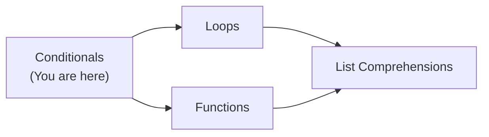
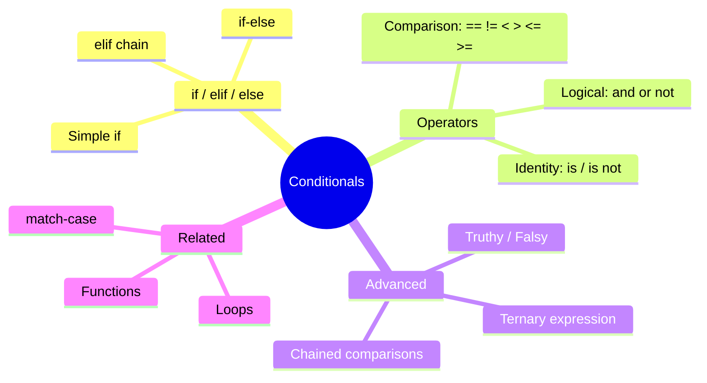
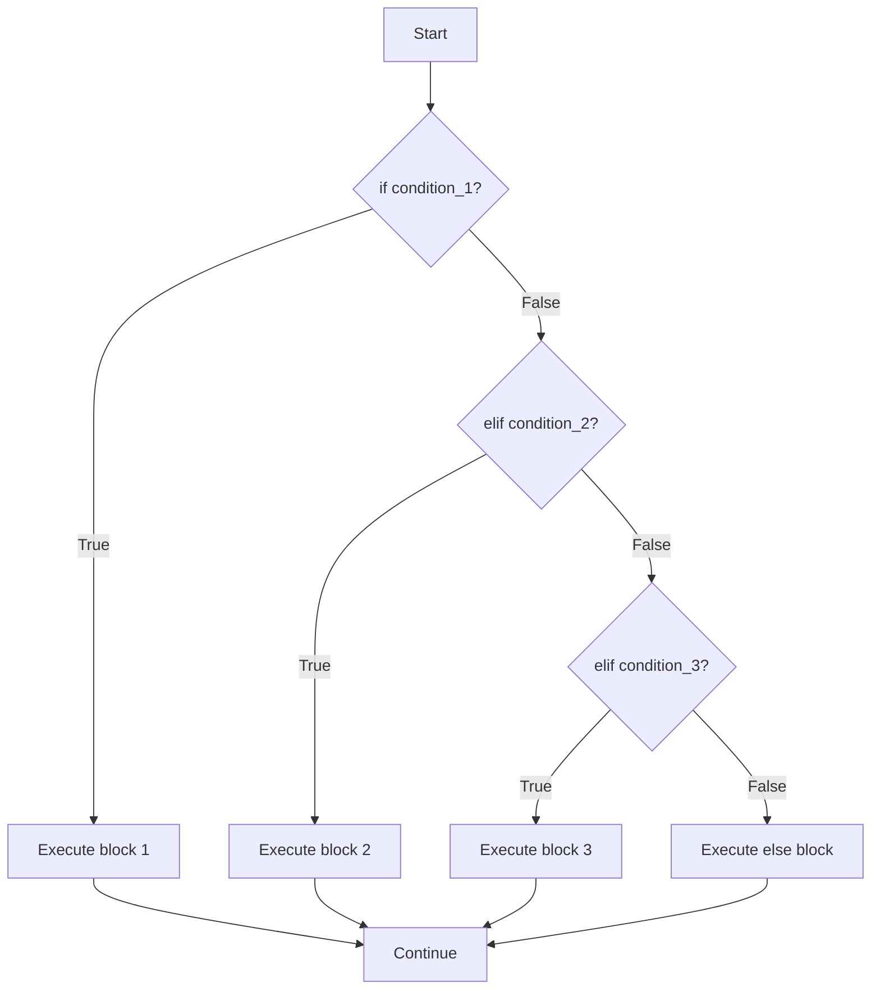
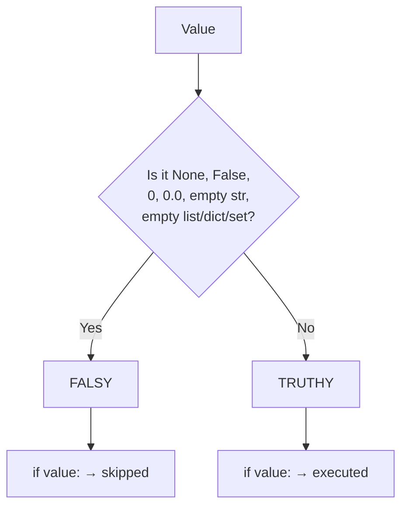

# Conditionals — Junior Level

## Table of Contents

1. [Introduction](#introduction)
2. [Prerequisites](#prerequisites)
3. [Glossary](#glossary)
4. [Core Concepts](#core-concepts)
5. [Real-World Analogies](#real-world-analogies)
6. [Mental Models](#mental-models)
7. [Pros & Cons](#pros--cons)
8. [Use Cases](#use-cases)
9. [Code Examples](#code-examples)
10. [Product Use / Feature](#product-use--feature)
11. [Error Handling](#error-handling)
12. [Security Considerations](#security-considerations)
13. [Performance Tips](#performance-tips)
14. [Metrics & Analytics](#metrics--analytics)
15. [Best Practices](#best-practices)
16. [Edge Cases & Pitfalls](#edge-cases--pitfalls)
17. [Common Mistakes](#common-mistakes)
18. [Common Misconceptions](#common-misconceptions)
19. [Tricky Points](#tricky-points)
20. [Test](#test)
21. [Tricky Questions](#tricky-questions)
22. [Cheat Sheet](#cheat-sheet)
23. [Summary](#summary)
24. [What You Can Build](#what-you-can-build)
25. [Further Reading](#further-reading)
26. [Related Topics](#related-topics)
27. [Diagrams & Visual Aids](#diagrams--visual-aids)

---

## Introduction

> Focus: "What is it?" and "How to use it?"

Conditionals are the decision-making tools in Python. They allow your program to choose different paths of execution based on whether a condition is `True` or `False`. Without conditionals, your program would always do the same thing every time it runs. With conditionals, your program can react to user input, data, and circumstances — making it actually useful.

Python provides `if`, `elif`, and `else` statements, comparison operators (`==`, `!=`, `<`, `>`, `<=`, `>=`), logical operators (`and`, `or`, `not`), and a ternary expression for inline conditions.

---

## Prerequisites

What you should know before studying this topic:

- **Required:** Basic Syntax — you need to understand indentation, print(), and variable assignment
- **Required:** Variables and Data Types — you need to know about int, float, str, bool, and how Python assigns types dynamically
- **Helpful but not required:** Basic understanding of boolean logic (True/False)

---

## Glossary

Key terms used in this topic:

| Term | Definition |
|------|-----------|
| **Condition** | An expression that evaluates to `True` or `False` |
| **if statement** | Executes a block of code only when its condition is `True` |
| **elif** | Short for "else if" — checks another condition when the previous `if`/`elif` was `False` |
| **else** | Executes when all preceding `if`/`elif` conditions are `False` |
| **Comparison operator** | Operators like `==`, `!=`, `<`, `>` that compare two values |
| **Logical operator** | `and`, `or`, `not` — combine or invert boolean expressions |
| **Ternary expression** | A one-line conditional: `value_if_true if condition else value_if_false` |
| **Truthy** | A value that Python treats as `True` in a boolean context (e.g., non-zero numbers, non-empty strings) |
| **Falsy** | A value that Python treats as `False` in a boolean context (e.g., `0`, `""`, `None`, `[]`) |
| **Nested condition** | An `if` statement placed inside another `if` statement |

---

## Core Concepts

### Concept 1: The `if` Statement

The most basic conditional. If the condition is `True`, the indented code block runs. If `False`, Python skips it entirely.

```python
age = 18
if age >= 18:
    print("You are an adult")  # This runs because 18 >= 18 is True
```

### Concept 2: `if-else`

When you need two paths — one for `True` and one for `False`:

```python
temperature = 35
if temperature > 30:
    print("It's hot outside")
else:
    print("It's not that hot")
```

### Concept 3: `if-elif-else` Chain

When you have more than two possible paths:

```python
score = 85
if score >= 90:
    grade = "A"
elif score >= 80:
    grade = "B"
elif score >= 70:
    grade = "C"
elif score >= 60:
    grade = "D"
else:
    grade = "F"
print(f"Your grade: {grade}")  # Output: Your grade: B
```

**Important:** Python checks conditions from top to bottom and stops at the first `True` condition. Only one branch executes.

### Concept 4: Comparison Operators

| Operator | Meaning | Example | Result |
|----------|---------|---------|--------|
| `==` | Equal to | `5 == 5` | `True` |
| `!=` | Not equal to | `5 != 3` | `True` |
| `<` | Less than | `3 < 5` | `True` |
| `>` | Greater than | `5 > 3` | `True` |
| `<=` | Less than or equal | `5 <= 5` | `True` |
| `>=` | Greater than or equal | `4 >= 5` | `False` |

### Concept 5: Logical Operators

Combine multiple conditions using `and`, `or`, and `not`:

```python
age = 25
has_license = True

# and — both must be True
if age >= 18 and has_license:
    print("You can drive")

# or — at least one must be True
is_weekend = False
is_holiday = True
if is_weekend or is_holiday:
    print("No work today!")

# not — inverts the boolean
is_raining = False
if not is_raining:
    print("Let's go outside")
```

### Concept 6: Ternary Expression (Conditional Expression)

A one-liner for simple if-else assignments:

```python
age = 20
status = "adult" if age >= 18 else "minor"
print(status)  # Output: adult
```

### Concept 7: Truthy and Falsy Values

Python treats certain values as `False` in boolean context:

```python
# Falsy values in Python:
# False, 0, 0.0, "", [], (), {}, set(), None, 0j

name = ""
if name:
    print(f"Hello, {name}")
else:
    print("Name is empty!")  # This runs because "" is falsy

items = [1, 2, 3]
if items:
    print(f"List has {len(items)} items")  # This runs because non-empty list is truthy
```

### Concept 8: Nested Conditions

An `if` inside another `if`:

```python
age = 25
has_ticket = True

if age >= 18:
    if has_ticket:
        print("Welcome to the concert!")
    else:
        print("You need a ticket")
else:
    print("You must be 18 or older")
```

### Concept 9: Chained Comparisons

Python allows mathematical-style chaining:

```python
age = 25
# Instead of: age >= 18 and age <= 65
if 18 <= age <= 65:
    print("Working age")

x = 5
if 1 < x < 10:
    print("x is between 1 and 10")
```

---

## Real-World Analogies

| Concept | Analogy |
|---------|--------|
| **if statement** | Like a traffic light — green means go (execute code), red means stop (skip code) |
| **if-elif-else** | Like a restaurant menu with price ranges — you check your budget against each option until you find one that fits |
| **Logical operators** | Like requirements for a job — `and` means you need ALL qualifications, `or` means you need at least one |
| **Ternary expression** | Like a quick yes/no decision — "Coffee if awake, else tea" |

---

## Mental Models

**The intuition:** Think of conditionals as a series of gates or checkpoints. Your program walks through them in order. At each gate, there's a guard who checks a condition. If you pass, you enter; if not, you move to the next gate. Only one gate lets you through.

**Why this model helps:** It prevents the common mistake of thinking multiple `elif` branches can execute. Only the first matching gate opens.

---

## Pros & Cons

| Pros | Cons |
|------|------|
| Readable and intuitive — almost like English | Deeply nested ifs become hard to read |
| Flexible — any expression can be a condition | Long if-elif chains can be hard to maintain |
| Truthy/falsy system reduces boilerplate | Truthy/falsy can cause subtle bugs for beginners |
| Chained comparisons are clean and Pythonic | Missing `elif` (using `if` instead) can cause logic errors |

### When to use:
- Anytime your program needs to make a decision based on data, user input, or state

### When NOT to use:
- When you have many exact-value matches — consider a dictionary dispatch or `match-case` (Python 3.10+) instead

---

## Use Cases

When and where you would use this in real projects:

- **Use Case 1:** Form validation — check if user input meets requirements (non-empty, correct format, within range)
- **Use Case 2:** Access control — check if a user has permission to perform an action
- **Use Case 3:** Game logic — determine outcomes based on player choices, health, score
- **Use Case 4:** API responses — return different HTTP status codes based on request validity

---

## Code Examples

### Example 1: Simple Login Validator

```python
# Simple login checker

def validate_login(username: str, password: str) -> str:
    """Check if login credentials are valid."""
    if not username:
        return "Username cannot be empty"
    if not password:
        return "Password cannot be empty"
    if len(password) < 8:
        return "Password must be at least 8 characters"
    if username == "admin" and password == "secret123":
        return "Login successful!"
    return "Invalid username or password"


def main():
    # Test cases
    print(validate_login("", "pass"))           # Username cannot be empty
    print(validate_login("admin", ""))           # Password cannot be empty
    print(validate_login("admin", "short"))      # Password must be at least 8 characters
    print(validate_login("admin", "secret123"))  # Login successful!
    print(validate_login("admin", "wrong1234"))  # Invalid username or password


if __name__ == "__main__":
    main()
```

**What it does:** Validates username and password with multiple checks.
**How to run:** `python login_validator.py`

### Example 2: Grade Calculator with Ternary

```python
# Grade calculator with input validation

def calculate_grade(score: int) -> str:
    """Convert a numeric score to a letter grade."""
    valid = "Valid" if 0 <= score <= 100 else "Invalid"
    if valid == "Invalid":
        return "Score must be between 0 and 100"

    if score >= 90:
        return "A"
    elif score >= 80:
        return "B"
    elif score >= 70:
        return "C"
    elif score >= 60:
        return "D"
    else:
        return "F"


def main():
    scores = [95, 82, 67, 45, 105, -5]
    for s in scores:
        result = calculate_grade(s)
        print(f"Score {s}: {result}")


if __name__ == "__main__":
    main()
```

**What it does:** Converts numeric scores to letter grades with input validation.
**How to run:** `python grade_calculator.py`

### Example 3: Temperature Advisor

```python
# Weather advice based on multiple conditions

def weather_advice(temp: float, is_raining: bool, wind_speed: float) -> str:
    """Give weather-based advice using nested conditions and logical operators."""
    if temp < 0:
        advice = "Stay inside, it's freezing!"
    elif temp < 10:
        if is_raining:
            advice = "Cold and rainy — wear a warm waterproof jacket"
        else:
            advice = "Cold but dry — a warm coat will do"
    elif temp < 25:
        if is_raining and wind_speed > 20:
            advice = "Stormy weather — bring an umbrella and hold on tight"
        elif is_raining:
            advice = "Light rain — bring an umbrella"
        elif wind_speed > 20:
            advice = "Windy but dry — a light jacket is enough"
        else:
            advice = "Perfect weather — enjoy your day!"
    else:
        advice = "Hot day — stay hydrated and wear sunscreen"

    return advice


def main():
    print(weather_advice(-5, False, 10))    # Stay inside, it's freezing!
    print(weather_advice(7, True, 5))       # Cold and rainy — wear a warm waterproof jacket
    print(weather_advice(20, True, 25))     # Stormy weather — bring an umbrella and hold on tight
    print(weather_advice(22, False, 5))     # Perfect weather — enjoy your day!
    print(weather_advice(35, False, 10))    # Hot day — stay hydrated and wear sunscreen


if __name__ == "__main__":
    main()
```

**What it does:** Provides weather advice using nested conditions and logical operators.
**How to run:** `python weather_advice.py`

---

## Clean Code

### Naming

```python
# Bad — unclear condition
if x > 18 and y:
    do_something()

# Good — descriptive variables
is_adult = age >= 18
has_valid_ticket = ticket is not None
if is_adult and has_valid_ticket:
    allow_entry()
```

**Rule:** Extract complex conditions into named boolean variables. This makes the `if` statement read like English.

### Avoid Deep Nesting — Use Early Returns

```python
# Bad — deeply nested
def process_order(order):
    if order:
        if order.is_valid:
            if order.has_payment:
                ship(order)

# Good — early returns (guard clauses)
def process_order(order):
    if not order:
        return
    if not order.is_valid:
        return
    if not order.has_payment:
        return
    ship(order)
```

---

## Product Use / Feature

### 1. Django Web Framework

- **How it uses Conditionals:** Template tags (``) and view logic for routing, permissions, and form validation
- **Why it matters:** Every web request involves dozens of conditional checks

### 2. Python's `json` Module

- **How it uses Conditionals:** Type-checking to determine how to serialize different Python objects (dict, list, str, int, etc.)
- **Why it matters:** Shows how conditionals handle polymorphic data

### 3. pip (Package Installer)

- **How it uses Conditionals:** Checks Python version, OS, architecture to determine which package wheel to download
- **Why it matters:** Real-world dependency resolution relies heavily on conditionals

---

## Error Handling

### Error 1: SyntaxError — Missing Colon

```python
# This causes SyntaxError
if x > 5
    print("big")
```

**Why it happens:** Python requires a colon `:` after `if`, `elif`, and `else`.
**How to fix:**

```python
if x > 5:
    print("big")
```

### Error 2: IndentationError

```python
if True:
print("hello")  # IndentationError: expected an indented block
```

**Why it happens:** The code block after `if` must be indented.
**How to fix:**

```python
if True:
    print("hello")
```

### Error 3: TypeError — Uncomparable Types

```python
# TypeError: '<' not supported between instances of 'str' and 'int'
if "hello" < 5:
    print("less")
```

**Why it happens:** Python 3 does not allow comparing strings with numbers.
**How to fix:** Ensure both sides of the comparison are the same type, or convert them.

```python
user_input = "25"
if int(user_input) < 5:
    print("less")
```

---

## Security Considerations

### 1. Never Use `eval()` for Condition Parsing

```python
# NEVER do this — user can inject arbitrary code
user_condition = input("Enter condition: ")
if eval(user_condition):  # DANGEROUS!
    print("True")

# Instead, parse the input safely
allowed_values = {"yes", "no", "true", "false"}
user_input = input("Enter yes/no: ").lower()
if user_input in allowed_values:
    print(f"You chose: {user_input}")
```

**Risk:** `eval()` executes arbitrary Python code. A user could type `__import__('os').system('rm -rf /')`.
**Mitigation:** Use explicit parsing, dictionaries, or `ast.literal_eval()` for safe evaluation.

### 2. Timing Attacks with String Comparison

```python
# Vulnerable to timing attacks for secret comparison
if user_token == secret_token:
    grant_access()

# Use constant-time comparison for secrets
import hmac
if hmac.compare_digest(user_token, secret_token):
    grant_access()
```

**Risk:** Character-by-character comparison leaks information about how many characters match.
**Mitigation:** Use `hmac.compare_digest()` for comparing secrets.

---

## Performance Tips

### Tip 1: Order Conditions by Likelihood

```python
# If 90% of users are regular users, check that first
if user.role == "regular":
    handle_regular()
elif user.role == "admin":
    handle_admin()
elif user.role == "superadmin":
    handle_superadmin()
```

**Why it's faster:** Python evaluates conditions top-to-bottom and stops at the first `True`. Put the most common case first.

### Tip 2: Use Short-Circuit Evaluation

```python
# Python stops evaluating 'and' at the first False
# Python stops evaluating 'or' at the first True
if items and items[0] > 10:  # Safe! Won't access items[0] if items is empty
    process(items[0])
```

**Why it's faster:** Avoids unnecessary computation and prevents errors.

---

## Metrics & Analytics

### What to Measure

| Metric | Why it matters | Tool |
|--------|---------------|------|
| **Branch coverage** | Ensures all if/elif/else paths are tested | `coverage.py`, `pytest-cov` |
| **Cyclomatic complexity** | Counts the number of independent paths through code | `radon`, `flake8` |

### Basic Instrumentation

```python
import time
import logging

logger = logging.getLogger(__name__)

def process_request(request):
    start = time.perf_counter()

    if request.method == "GET":
        result = handle_get(request)
    elif request.method == "POST":
        result = handle_post(request)
    else:
        result = handle_unknown(request)

    elapsed = time.perf_counter() - start
    logger.info("Request %s processed in %.3fs", request.method, elapsed)
    return result
```

---

## Best Practices

- **Do this:** Use `elif` instead of multiple `if` statements when conditions are mutually exclusive
- **Do this:** Extract complex conditions into named boolean variables for readability
- **Do this:** Use guard clauses (early returns) instead of deep nesting
- **Do this:** Use `in` for membership testing: `if status in ("active", "pending")`
- **Do this:** Use truthy/falsy checks for collections: `if items:` instead of `if len(items) > 0:`

---

## Edge Cases & Pitfalls

### Pitfall 1: Using `=` Instead of `==`

```python
# SyntaxError in Python (not a silent bug like in C)
if x = 5:   # SyntaxError: invalid syntax
    pass

# Correct
if x == 5:
    pass
```

**What happens:** Python prevents this mistake at the syntax level (unlike C/C++).

### Pitfall 2: Float Comparison

```python
# This may surprise you:
x = 0.1 + 0.2
if x == 0.3:
    print("Equal")    # This does NOT print!
else:
    print(f"Not equal: {x}")  # Output: Not equal: 0.30000000000000004

# Fix: use math.isclose()
import math
if math.isclose(x, 0.3):
    print("Close enough!")  # This prints
```

### Pitfall 3: `is` vs `==`

```python
a = [1, 2, 3]
b = [1, 2, 3]
print(a == b)  # True — same value
print(a is b)  # False — different objects in memory

# Use == for value comparison
# Use 'is' only for None, True, False
if a is None:
    print("a is None")
```

---

## Common Mistakes

### Mistake 1: Multiple `if` Instead of `elif`

```python
# Wrong — all conditions are checked independently
score = 95
if score >= 90:
    print("A")  # Prints
if score >= 80:
    print("B")  # Also prints! This is wrong.
if score >= 70:
    print("C")  # Also prints!

# Correct — only the first matching branch runs
score = 95
if score >= 90:
    print("A")  # Only this prints
elif score >= 80:
    print("B")
elif score >= 70:
    print("C")
```

### Mistake 2: Comparing to `True`/`False` Explicitly

```python
# Redundant
if is_valid == True:
    pass
if is_empty == False:
    pass

# Pythonic
if is_valid:
    pass
if not is_empty:
    pass
```

### Mistake 3: Empty `if` Body

```python
# SyntaxError: you cannot have an empty block
if condition:
    # TODO: implement later

# Use 'pass' as a placeholder
if condition:
    pass  # TODO: implement later
```

---

## Common Misconceptions

### Misconception 1: "`elif` is the same as writing separate `if` statements"

**Reality:** `elif` is part of the same conditional chain. Once one branch is `True`, all subsequent `elif`/`else` are skipped. Separate `if` statements are independent — each one is evaluated regardless.

**Why people think this:** Both seem to check conditions. The difference only matters when multiple conditions can be `True` simultaneously.

### Misconception 2: "`0`, `""`, and `[]` are the same as `None`"

**Reality:** They are all falsy, but they are different types with different meanings. `0` is an integer, `""` is an empty string, `[]` is an empty list, and `None` is the absence of a value. Use `is None` to check specifically for `None`.

---

## Tricky Points

### Tricky Point 1: Short-Circuit Evaluation

```python
def expensive_check():
    print("This is expensive!")
    return True

# With 'or', if the first condition is True, the second is never evaluated
x = 5
if x > 0 or expensive_check():
    print("Passed")
# Output: Passed (expensive_check() was never called!)
```

**Why it's tricky:** The second condition may have side effects that never execute.
**Key takeaway:** `and` stops at the first `False`, `or` stops at the first `True`.

### Tricky Point 2: Chained Comparisons Can Surprise You

```python
# This is valid Python:
print(1 < 2 < 3)    # True  (1 < 2 and 2 < 3)
print(1 < 2 > 0)    # True  (1 < 2 and 2 > 0)

# But this might confuse you:
print(1 < 3 > 2)    # True  (1 < 3 and 3 > 2)
print(1 > 3 < 5)    # False (1 > 3 is False, short-circuits)
```

**Why it's tricky:** Chained comparisons are expanded with `and`, which is not how other languages work.
**Key takeaway:** `a < b < c` means `a < b and b < c`, not `(a < b) < c`.

---

## Test

### Multiple Choice

**1. What does this code print?**

```python
x = 10
if x > 5:
    print("A")
elif x > 8:
    print("B")
else:
    print("C")
```

- A) A and B
- B) A
- C) B
- D) C

<details>
<summary>Answer</summary>

**B)** — Only "A" prints. Even though `x > 8` is also `True`, `elif` is skipped once the first `if` matches.

</details>

**2. Which of these values is truthy in Python?**

- A) `0`
- B) `""`
- C) `" "` (a single space)
- D) `None`

<details>
<summary>Answer</summary>

**C)** — A string containing a space `" "` is truthy because it is not empty. All other options are falsy.

</details>

### True or False

**3. In Python, `elif` is just a shortcut for writing `else: if`.**

<details>
<summary>Answer</summary>

**True** — `elif` is syntactically equivalent to `else:` followed by an `if`, but without the extra indentation level. It is the Pythonic way.

</details>

### What's the Output?

**4. What does this code print?**

```python
a = []
b = ""
c = 0
d = None

result = a or b or c or d or "default"
print(result)
```

<details>
<summary>Answer</summary>

Output: `default`

Explanation: `or` returns the first truthy value. `a`, `b`, `c`, and `d` are all falsy, so it reaches `"default"` which is truthy and returns it.

</details>

**5. What does this code print?**

```python
x = 5
result = "even" if x % 2 == 0 else "odd"
print(result)
```

<details>
<summary>Answer</summary>

Output: `odd`

Explanation: `5 % 2 == 0` is `False` (5 % 2 is 1), so the ternary returns `"odd"`.

</details>

**6. What does this code print?**

```python
print(bool(0), bool(""), bool([]), bool(None))
print(bool(1), bool(" "), bool([0]), bool(0.1))
```

<details>
<summary>Answer</summary>

Output:
```
False False False False
True True True True
```

Explanation: First line — all falsy values. Second line — all truthy: `1` is non-zero, `" "` is non-empty, `[0]` is a non-empty list, `0.1` is non-zero.

</details>

---

## Tricky Questions

**1. What does this code print?**

```python
x = 0
print(x or "zero")
print(x and "zero")
```

- A) `0` and `0`
- B) `zero` and `0`
- C) `zero` and `zero`
- D) `0` and `zero`

<details>
<summary>Answer</summary>

**B)** — `x or "zero"`: `x` is falsy (0), so `or` returns the second operand: `"zero"`. `x and "zero"`: `x` is falsy (0), so `and` short-circuits and returns `0`.

</details>

**2. Is this valid Python?**

```python
if (n := 10) > 5:
    print(n)
```

- A) No, it's a SyntaxError
- B) Yes, it prints 10
- C) Yes, it prints True
- D) It depends on the Python version

<details>
<summary>Answer</summary>

**D)** — This uses the walrus operator (`:=`) introduced in Python 3.8. On Python 3.8+, it prints `10`. On earlier versions, it's a SyntaxError.

</details>

---

## Cheat Sheet

| What | Syntax | Example |
|------|--------|---------|
| Simple if | `if condition:` | `if x > 0: print("positive")` |
| if-else | `if ... else ...` | `if x > 0: ... else: ...` |
| elif chain | `if ... elif ... else` | `if x > 0: ... elif x == 0: ... else: ...` |
| Ternary | `a if cond else b` | `"yes" if ok else "no"` |
| Logical AND | `a and b` | `if x > 0 and x < 10:` |
| Logical OR | `a or b` | `if x < 0 or x > 100:` |
| Logical NOT | `not a` | `if not is_valid:` |
| Chained comparison | `a < b < c` | `if 0 < x < 100:` |
| Membership test | `x in collection` | `if status in ("ok", "done"):` |
| Identity check | `x is None` | `if result is None:` |

---

## Self-Assessment Checklist

### I can explain:
- [ ] What `if`, `elif`, and `else` do and how they differ
- [ ] The difference between `==` and `is`
- [ ] What truthy and falsy values are
- [ ] How short-circuit evaluation works

### I can do:
- [ ] Write if-elif-else chains correctly
- [ ] Use ternary expressions for simple conditions
- [ ] Use logical operators to combine conditions
- [ ] Avoid common mistakes like `=` vs `==` and float comparison

---

## Summary

- **`if`/`elif`/`else`** control which code path executes based on conditions
- **Comparison operators** (`==`, `!=`, `<`, `>`, `<=`, `>=`) compare values
- **Logical operators** (`and`, `or`, `not`) combine or invert boolean expressions
- **Ternary expressions** (`a if cond else b`) are one-line conditionals
- **Truthy/falsy** values let you write cleaner condition checks
- **Chained comparisons** (`a < b < c`) are Pythonic and readable

**Next step:** Learn about Loops (`for`, `while`) — they combine with conditionals to build powerful control flow.

---

## What You Can Build

### Projects you can create:
- **Number guessing game:** Use conditionals to compare guesses with the secret number
- **Simple calculator:** Route to different operations (add, subtract, multiply, divide) based on user input
- **Password strength checker:** Evaluate passwords against multiple criteria using logical operators

### Technologies / tools that use this:
- **Django / Flask** — every view function uses conditionals for request routing and validation
- **pandas** — conditional filtering with boolean indexing (`df[df['age'] > 18]`)
- **pytest** — assertions are conditional checks that verify expected behavior

### Learning path:



---

## Further Reading

- **Official docs:** [Python `if` Statements](https://docs.python.org/3/tutorial/controlflow.html#if-statements)
- **PEP 308:** [Conditional Expressions](https://peps.python.org/pep-0308/) — the ternary operator proposal
- **PEP 636:** [Structural Pattern Matching Tutorial](https://peps.python.org/pep-0636/) — match-case in Python 3.10+
- **Book chapter:** Fluent Python (Ramalho), Chapter 1 — The Python Data Model and truthiness

---

## Related Topics

- **[Basic Syntax](../01-basic-syntax/)** — foundation for writing any Python code including conditions
- **[Variables and Data Types](../02-variables-and-data-types/)** — understanding types is essential for comparisons
- **[Loops](../04-loops/)** — loops often contain conditionals for filtering and control flow

---

## Diagrams & Visual Aids

### Mind Map



### if-elif-else Flow



### Truthy / Falsy Decision


