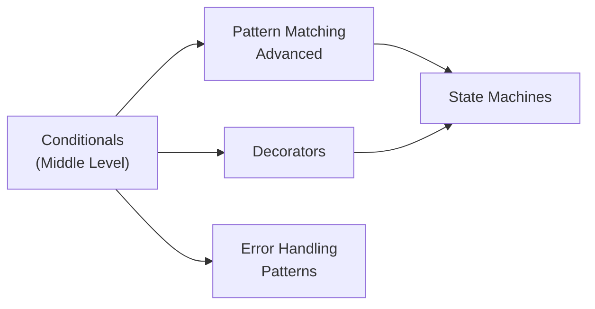
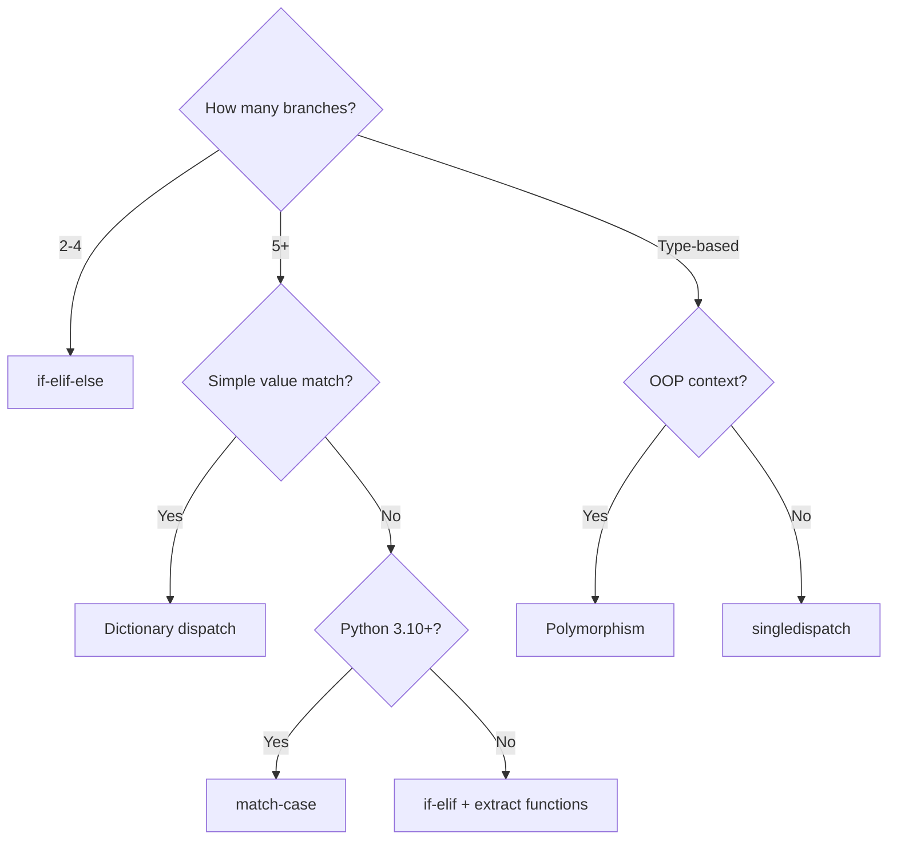
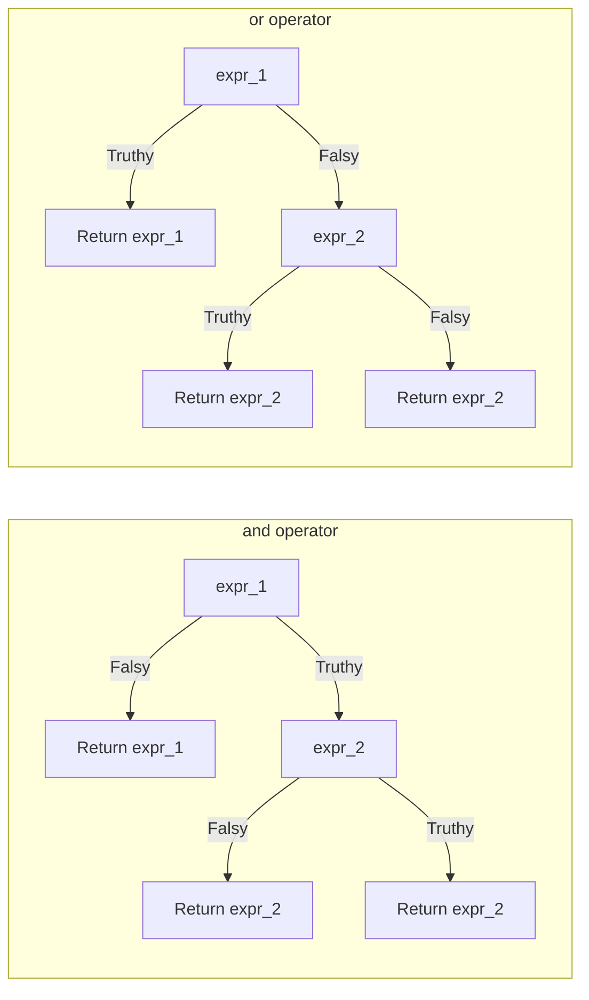
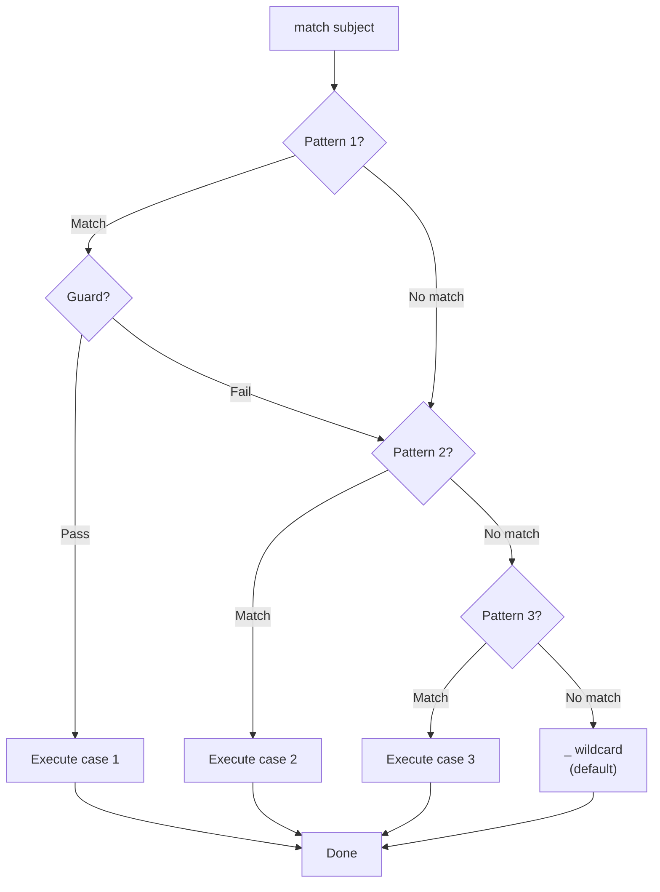

# Conditionals — Middle Level

## Table of Contents

1. [Introduction](#introduction)
2. [Core Concepts](#core-concepts)
3. [Evolution & Historical Context](#evolution--historical-context)
4. [Pros & Cons](#pros--cons)
5. [Alternative Approaches](#alternative-approaches)
6. [Use Cases](#use-cases)
7. [Code Examples](#code-examples)
8. [Clean Code](#clean-code)
9. [Product Use / Feature](#product-use--feature)
10. [Error Handling](#error-handling)
11. [Security Considerations](#security-considerations)
12. [Performance Optimization](#performance-optimization)
13. [Debugging Guide](#debugging-guide)
14. [Best Practices](#best-practices)
15. [Edge Cases & Pitfalls](#edge-cases--pitfalls)
16. [Common Mistakes](#common-mistakes)
17. [Comparison with Other Languages](#comparison-with-other-languages)
18. [Tricky Points](#tricky-points)
19. [Test](#test)
20. [Tricky Questions](#tricky-questions)
21. [Cheat Sheet](#cheat-sheet)
22. [Summary](#summary)
23. [What You Can Build](#what-you-can-build)
24. [Further Reading](#further-reading)
25. [Related Topics](#related-topics)
26. [Diagrams & Visual Aids](#diagrams--visual-aids)

---

## Introduction

> Focus: "Why?" and "When to use?"

You already know how to write `if`/`elif`/`else`. At this level, we explore **why** Python's conditionals work the way they do, how to use them in production code with type hints and design patterns, and when to choose alternatives like dictionary dispatch, `match-case`, or polymorphism.

Key topics at this level:
- The walrus operator (`:=`) and when it shines
- `match-case` structural pattern matching (Python 3.10+)
- Dictionary dispatch as an `if-elif` alternative
- Short-circuit evaluation patterns in production code
- Custom `__bool__` and `__eq__` for user-defined types
- Type-safe conditionals with type hints and `Optional`

---

## Core Concepts

### Concept 1: The Walrus Operator `:=` (PEP 572)

The walrus operator assigns a value to a variable **as part of an expression**. This eliminates the need for a separate assignment line:

```python
# Without walrus — requires extra line
data = input("Enter data: ")
if data:
    process(data)

# With walrus — assignment inside the condition
if data := input("Enter data: "):
    process(data)

# Real-world: filtering while reading
import re
text = "Order #12345 confirmed"
if match := re.search(r"#(\d+)", text):
    order_id = match.group(1)
    print(f"Found order: {order_id}")  # Found order: 12345
```

**When to use:** When you need to both test and use a value. Common with regex matches, file reading, and API responses.

**When NOT to use:** When it reduces readability. Simple assignments do not need `:=`.

### Concept 2: `match-case` Structural Pattern Matching (PEP 634, Python 3.10+)

Pattern matching goes beyond simple value comparison — it can destructure data:

```python
# Basic value matching
def http_status(status: int) -> str:
    match status:
        case 200:
            return "OK"
        case 301 | 302:
            return "Redirect"
        case 404:
            return "Not Found"
        case 500:
            return "Internal Server Error"
        case _:
            return f"Unknown status: {status}"


# Structural pattern matching — destructuring
def process_command(command: tuple) -> str:
    match command:
        case ("quit",):
            return "Goodbye!"
        case ("hello", name):
            return f"Hello, {name}!"
        case ("add", x, y) if isinstance(x, (int, float)) and isinstance(y, (int, float)):
            return f"Result: {x + y}"
        case ("add", *args):
            return f"Cannot add: {args}"
        case _:
            return "Unknown command"


def main():
    print(http_status(200))                      # OK
    print(http_status(404))                      # Not Found
    print(process_command(("hello", "Alice")))    # Hello, Alice!
    print(process_command(("add", 3, 5)))         # Result: 8
    print(process_command(("add", "a", "b")))     # Cannot add: ('a', 'b')


if __name__ == "__main__":
    main()
```

### Concept 3: Dictionary Dispatch Pattern

Replace long `if-elif` chains with dictionary lookups for cleaner, faster, and more extensible code:

```python
from typing import Callable

def add(a: float, b: float) -> float:
    return a + b

def subtract(a: float, b: float) -> float:
    return a - b

def multiply(a: float, b: float) -> float:
    return a * b

def divide(a: float, b: float) -> float:
    if b == 0:
        raise ValueError("Cannot divide by zero")
    return a / b


# Dictionary dispatch — O(1) lookup instead of O(n) if-elif chain
OPERATIONS: dict[str, Callable[[float, float], float]] = {
    "+": add,
    "-": subtract,
    "*": multiply,
    "/": divide,
}


def calculate(op: str, a: float, b: float) -> float:
    if handler := OPERATIONS.get(op):
        return handler(a, b)
    raise ValueError(f"Unknown operation: {op}")


def main():
    print(calculate("+", 10, 3))   # 13.0
    print(calculate("/", 10, 3))   # 3.333...
    print(calculate("*", 4, 5))    # 20.0


if __name__ == "__main__":
    main()
```

### Concept 4: Custom `__bool__` and `__eq__`

Control how your objects behave in conditional contexts:

```python
class Account:
    """A bank account that is truthy when balance is positive."""

    def __init__(self, name: str, balance: float):
        self.name = name
        self.balance = balance

    def __bool__(self) -> bool:
        """Account is truthy if balance is positive."""
        return self.balance > 0

    def __eq__(self, other: object) -> bool:
        """Two accounts are equal if they have the same name and balance."""
        if not isinstance(other, Account):
            return NotImplemented
        return self.name == other.name and self.balance == other.balance


def main():
    rich = Account("Alice", 1000)
    broke = Account("Bob", 0)
    negative = Account("Charlie", -50)

    # __bool__ in action
    if rich:
        print(f"{rich.name} has money")     # Alice has money
    if not broke:
        print(f"{broke.name} is broke")     # Bob is broke
    if not negative:
        print(f"{negative.name} is in debt")  # Charlie is in debt

    # __eq__ in action
    a1 = Account("Alice", 1000)
    a2 = Account("Alice", 1000)
    print(a1 == a2)    # True
    print(a1 is a2)    # False — different objects


if __name__ == "__main__":
    main()
```

### Concept 5: Short-Circuit Patterns in Production

```python
from typing import Optional

# Pattern 1: Default value with 'or'
def get_display_name(user: dict) -> str:
    return user.get("display_name") or user.get("username") or "Anonymous"

# Pattern 2: Safe attribute access with 'and'
def get_city(user: Optional[dict]) -> Optional[str]:
    return user and user.get("address") and user["address"].get("city")

# Pattern 3: Conditional execution with 'and'
DEBUG = True
DEBUG and print("Debug mode enabled")  # Prints only when DEBUG is True

# Pattern 4: Walrus operator with short-circuit
import os
def get_config_value(key: str) -> str:
    if value := os.environ.get(key):
        return value
    if value := load_from_file(key):
        return value
    return "default"

def load_from_file(key: str) -> Optional[str]:
    # Simplified example
    config = {"db_host": "localhost", "db_port": "5432"}
    return config.get(key)
```

---

## Evolution & Historical Context

### Before Python 2.5: No Ternary Expression

```python
# Ugly workaround before PEP 308 (Python 2.5)
result = condition and true_value or false_value  # Bug-prone!

# This fails when true_value is falsy:
x = True and 0 or "fallback"  # Returns "fallback" instead of 0!

# PEP 308 (Python 2.5+) — proper ternary
result = true_value if condition else false_value  # Always correct
```

### Before Python 3.8: No Walrus Operator

```python
# Before PEP 572 — repeated computation or extra variable
line = fp.readline()
while line:
    process(line)
    line = fp.readline()

# PEP 572 (Python 3.8+) — walrus operator
while line := fp.readline():
    process(line)
```

### Before Python 3.10: No match-case

```python
# Before PEP 634 — chains of if-elif or dictionary dispatch
def handle_event(event):
    if event["type"] == "click":
        handle_click(event)
    elif event["type"] == "hover":
        handle_hover(event)
    elif event["type"] == "scroll":
        handle_scroll(event)

# PEP 634 (Python 3.10+) — structural pattern matching
def handle_event(event):
    match event:
        case {"type": "click", "x": x, "y": y}:
            handle_click(x, y)
        case {"type": "hover", "element": elem}:
            handle_hover(elem)
        case {"type": "scroll", "delta": delta}:
            handle_scroll(delta)
```

---

## Pros & Cons

| Pros | Cons |
|------|------|
| `match-case` enables powerful destructuring | `match-case` requires Python 3.10+ — not available everywhere |
| Walrus operator reduces code duplication | Walrus operator can reduce readability if overused |
| Dictionary dispatch is O(1) and extensible | Dictionary dispatch loses type safety without careful typing |
| Short-circuit evaluation enables safe chaining | Short-circuit side effects can be surprising |

### Trade-off analysis:

- **if-elif vs dictionary dispatch:** Use `if-elif` when you have fewer than 5 cases or need complex conditions. Use dictionary dispatch when you have many simple value-to-action mappings.
- **if-elif vs match-case:** Use `match-case` when you need structural destructuring. Use `if-elif` for simple value checks or when supporting Python < 3.10.

---

## Alternative Approaches

| Alternative | How it works | When you might be forced to use it |
|-------------|--------------|-------------------------------------|
| **Dictionary dispatch** | Map values to callables in a dict | Many branches with simple value matching |
| **Polymorphism** | Override methods in subclasses | Object-oriented code with type-based branching |
| **Strategy pattern** | Inject behavior via function/class | When branching logic changes at runtime |
| **functools.singledispatch** | Dispatch based on argument type | Type-based branching without if-isinstance chains |

```python
from functools import singledispatch

@singledispatch
def process(data):
    raise TypeError(f"Unsupported type: {type(data)}")

@process.register(str)
def _(data: str):
    return f"String: {data.upper()}"

@process.register(int)
def _(data: int):
    return f"Integer: {data * 2}"

@process.register(list)
def _(data: list):
    return f"List with {len(data)} items"


def main():
    print(process("hello"))     # String: HELLO
    print(process(42))          # Integer: 84
    print(process([1, 2, 3]))   # List with 3 items


if __name__ == "__main__":
    main()
```

---

## Use Cases

Real-world, production scenarios:

- **Use Case 1:** FastAPI request validation — conditionally return 400/403/404 responses based on input checks
- **Use Case 2:** ETL pipeline branching — different transformation logic for different data sources (CSV, JSON, Parquet)
- **Use Case 3:** Feature flags — conditionally enable/disable features based on configuration
- **Use Case 4:** State machines — transition between states based on events using `match-case` or dictionary dispatch

---

## Code Examples

### Example 1: Feature Flag System with Type Hints

```python
from typing import Any
from dataclasses import dataclass, field


@dataclass
class FeatureFlags:
    """Simple feature flag system using conditional logic."""
    _flags: dict[str, bool] = field(default_factory=dict)

    def enable(self, flag: str) -> None:
        self._flags[flag] = True

    def disable(self, flag: str) -> None:
        self._flags[flag] = False

    def is_enabled(self, flag: str) -> bool:
        return self._flags.get(flag, False)

    def execute_if_enabled(self, flag: str, action: Any) -> Any:
        """Execute action only if feature flag is enabled."""
        if self.is_enabled(flag):
            return action() if callable(action) else action
        return None


def main():
    flags = FeatureFlags()
    flags.enable("dark_mode")
    flags.enable("new_dashboard")
    flags.disable("experimental_api")

    # Conditional execution based on feature flags
    if flags.is_enabled("dark_mode"):
        print("Dark mode is ON")

    if not flags.is_enabled("experimental_api"):
        print("Experimental API is disabled")

    # Using execute_if_enabled
    result = flags.execute_if_enabled(
        "new_dashboard",
        lambda: "Rendering new dashboard..."
    )
    print(result)  # Rendering new dashboard...


if __name__ == "__main__":
    main()
```

### Example 2: State Machine with match-case (Python 3.10+)

```python
from enum import Enum
from dataclasses import dataclass


class OrderState(Enum):
    PENDING = "pending"
    CONFIRMED = "confirmed"
    SHIPPED = "shipped"
    DELIVERED = "delivered"
    CANCELLED = "cancelled"


@dataclass
class Order:
    order_id: str
    state: OrderState = OrderState.PENDING

    def transition(self, event: str) -> str:
        """Transition order state based on event using match-case."""
        match (self.state, event):
            case (OrderState.PENDING, "confirm"):
                self.state = OrderState.CONFIRMED
                return f"Order {self.order_id}: pending -> confirmed"
            case (OrderState.PENDING, "cancel"):
                self.state = OrderState.CANCELLED
                return f"Order {self.order_id}: pending -> cancelled"
            case (OrderState.CONFIRMED, "ship"):
                self.state = OrderState.SHIPPED
                return f"Order {self.order_id}: confirmed -> shipped"
            case (OrderState.SHIPPED, "deliver"):
                self.state = OrderState.DELIVERED
                return f"Order {self.order_id}: shipped -> delivered"
            case (state, event):
                return f"Invalid transition: {state.value} + {event}"


def main():
    order = Order("ORD-001")
    print(order.transition("confirm"))    # pending -> confirmed
    print(order.transition("ship"))       # confirmed -> shipped
    print(order.transition("deliver"))    # shipped -> delivered
    print(order.transition("confirm"))    # Invalid transition: delivered + confirm


if __name__ == "__main__":
    main()
```

### Example 3: Safe Configuration Loader with Walrus Operator

```python
import os
from typing import Optional


def get_config(
    key: str,
    default: Optional[str] = None,
    required: bool = False,
) -> Optional[str]:
    """
    Load configuration value from multiple sources with fallback chain.
    Priority: environment variable > .env file simulation > default.
    """
    # Check environment variable first (walrus operator)
    if value := os.environ.get(key):
        return value

    # Simulate .env file lookup
    env_file: dict[str, str] = {
        "DATABASE_URL": "postgresql://localhost:5432/mydb",
        "REDIS_URL": "redis://localhost:6379/0",
    }
    if value := env_file.get(key):
        return value

    # Use default or raise if required
    if required and default is None:
        raise ValueError(f"Required config '{key}' is missing")

    return default


def main():
    # Set an env variable for testing
    os.environ["API_KEY"] = "sk-test-12345"

    print(get_config("API_KEY"))                           # sk-test-12345 (from env)
    print(get_config("DATABASE_URL"))                      # postgresql://... (from .env)
    print(get_config("MISSING_KEY", default="fallback"))   # fallback
    print(get_config("CACHE_TTL", default="300"))          # 300

    try:
        get_config("SECRET", required=True)
    except ValueError as e:
        print(f"Error: {e}")  # Error: Required config 'SECRET' is missing


if __name__ == "__main__":
    main()
```

---

## Clean Code

### Replace Type Checking with Polymorphism

```python
# Bad — type checking with if-elif
def calculate_area(shape: dict) -> float:
    if shape["type"] == "circle":
        return 3.14159 * shape["radius"] ** 2
    elif shape["type"] == "rectangle":
        return shape["width"] * shape["height"]
    elif shape["type"] == "triangle":
        return 0.5 * shape["base"] * shape["height"]
    else:
        raise ValueError(f"Unknown shape: {shape['type']}")

# Good — polymorphism eliminates conditionals
from abc import ABC, abstractmethod
import math

class Shape(ABC):
    @abstractmethod
    def area(self) -> float: ...

class Circle(Shape):
    def __init__(self, radius: float):
        self.radius = radius
    def area(self) -> float:
        return math.pi * self.radius ** 2

class Rectangle(Shape):
    def __init__(self, width: float, height: float):
        self.width = width
        self.height = height
    def area(self) -> float:
        return self.width * self.height
```

### Use Guard Clauses for Validation

```python
# Bad — arrow code
def process_payment(user, amount, currency):
    if user is not None:
        if user.is_active:
            if amount > 0:
                if currency in SUPPORTED_CURRENCIES:
                    # actual logic buried deep
                    execute_payment(user, amount, currency)

# Good — guard clauses with early returns
def process_payment(user, amount, currency):
    if user is None:
        raise ValueError("User is required")
    if not user.is_active:
        raise PermissionError("User is inactive")
    if amount <= 0:
        raise ValueError("Amount must be positive")
    if currency not in SUPPORTED_CURRENCIES:
        raise ValueError(f"Unsupported currency: {currency}")

    execute_payment(user, amount, currency)
```

---

## Product Use / Feature

### 1. FastAPI

- **How it uses Conditionals:** Dependency injection with conditional validation, HTTPException routing, Pydantic validators
- **Scale:** Used by Microsoft, Netflix, Uber for high-performance APIs

### 2. pandas

- **How it uses Conditionals:** `df.where()`, `df.mask()`, `np.where()`, boolean indexing — all built on conditional logic
- **Scale:** Processes millions of rows with vectorized conditional operations

### 3. Celery (Task Queue)

- **How it uses Conditionals:** Task routing, retry logic, state machine transitions — all based on conditional checks
- **Scale:** Handles millions of async tasks per day at companies like Instagram

---

## Error Handling

### Pattern 1: Conditional Exception Hierarchy

```python
class PaymentError(Exception):
    """Base exception for payment operations."""
    def __init__(self, message: str, code: str = "PAYMENT_ERROR"):
        super().__init__(message)
        self.code = code

class InsufficientFundsError(PaymentError):
    """Raised when account balance is too low."""
    def __init__(self, balance: float, amount: float):
        super().__init__(
            f"Insufficient funds: balance={balance}, required={amount}",
            code="INSUFFICIENT_FUNDS"
        )
        self.balance = balance
        self.amount = amount

class InvalidCurrencyError(PaymentError):
    """Raised when currency is not supported."""
    pass


def process_payment(balance: float, amount: float, currency: str) -> str:
    SUPPORTED = {"USD", "EUR", "GBP"}
    if currency not in SUPPORTED:
        raise InvalidCurrencyError(f"Unsupported: {currency}", "INVALID_CURRENCY")
    if amount <= 0:
        raise PaymentError("Amount must be positive", "INVALID_AMOUNT")
    if balance < amount:
        raise InsufficientFundsError(balance, amount)
    return f"Payment of {amount} {currency} processed"


def main():
    test_cases = [
        (1000, 500, "USD"),
        (100, 500, "USD"),
        (1000, 500, "BTC"),
        (1000, -50, "USD"),
    ]
    for balance, amount, currency in test_cases:
        try:
            print(process_payment(balance, amount, currency))
        except InsufficientFundsError as e:
            print(f"Insufficient funds: {e}")
        except InvalidCurrencyError as e:
            print(f"Bad currency: {e}")
        except PaymentError as e:
            print(f"Payment error [{e.code}]: {e}")


if __name__ == "__main__":
    main()
```

---

## Security Considerations

### 1. Avoid Truthy/Falsy for Security Checks

```python
# DANGEROUS — empty string and 0 are falsy but may be valid
def check_permission(user_role):
    if user_role:  # Bug: role=0 could be a valid role ID!
        grant_access()

# SAFE — explicit check
def check_permission(user_role):
    if user_role is not None:
        grant_access()
```

### 2. Prevent Injection in Dynamic Conditions

```python
# NEVER build conditions from user input
user_filter = input("Enter filter: ")
# eval(f"record.{user_filter}")  # NEVER DO THIS

# SAFE — whitelist allowed fields
ALLOWED_FILTERS = {"name", "age", "status"}
field = input("Filter by field: ")
if field in ALLOWED_FILTERS:
    value = record.get(field)
```

### Security Checklist

- [ ] Never use `eval()` or `exec()` with user-provided conditions
- [ ] Use `is None` instead of falsy checks for security-sensitive values
- [ ] Use `hmac.compare_digest()` for secret comparison
- [ ] Validate all inputs before using them in conditions

---

## Performance Optimization

### 1. Dictionary Dispatch vs if-elif Performance

```python
import timeit

def if_elif_dispatch(op: str, a: float, b: float) -> float:
    if op == "+":
        return a + b
    elif op == "-":
        return a - b
    elif op == "*":
        return a * b
    elif op == "/":
        return a / b
    raise ValueError(f"Unknown: {op}")


ops = {
    "+": lambda a, b: a + b,
    "-": lambda a, b: a - b,
    "*": lambda a, b: a * b,
    "/": lambda a, b: a / b,
}

def dict_dispatch(op: str, a: float, b: float) -> float:
    if handler := ops.get(op):
        return handler(a, b)
    raise ValueError(f"Unknown: {op}")


def main():
    # Benchmark: worst case (last branch "/"")
    t1 = timeit.timeit(lambda: if_elif_dispatch("/", 10, 3), number=1_000_000)
    t2 = timeit.timeit(lambda: dict_dispatch("/", 10, 3), number=1_000_000)
    print(f"if-elif:   {t1:.3f}s")
    print(f"dict:      {t2:.3f}s")
    print(f"Dict is {'faster' if t2 < t1 else 'slower'} by {abs(t1 - t2):.3f}s")


if __name__ == "__main__":
    main()
```

### 2. Avoid Repeated Computation in Conditions

```python
# Bad — calls expensive_fn() twice
if expensive_fn(data) > threshold:
    result = expensive_fn(data)  # computed AGAIN!

# Good — walrus operator
if (result := expensive_fn(data)) > threshold:
    process(result)

# Good — explicit variable
result = expensive_fn(data)
if result > threshold:
    process(result)
```

---

## Debugging Guide

### Debugging Conditional Logic

```python
import logging

logging.basicConfig(level=logging.DEBUG)
logger = logging.getLogger(__name__)

def classify_user(age: int, role: str, is_active: bool) -> str:
    logger.debug("Inputs: age=%d, role=%s, is_active=%s", age, role, is_active)

    if not is_active:
        logger.debug("Branch: inactive user")
        return "inactive"

    if age < 18:
        logger.debug("Branch: minor")
        return "minor"

    if role == "admin":
        logger.debug("Branch: admin")
        return "admin"

    logger.debug("Branch: default regular user")
    return "regular"
```

### Common Debugging Patterns

| Issue | Diagnosis | Fix |
|-------|-----------|-----|
| Wrong branch executes | Add `print(repr(value))` to check actual types | Ensure correct type comparison |
| Condition always True/False | Check for assignment `=` vs comparison `==` | Use linting (flake8, ruff) |
| Unreachable code | Check if an earlier condition catches all cases | Reorder conditions |
| `None` not handled | Missing `is None` check | Add explicit None guard |

---

## Best Practices

- **Do this:** Use `match-case` for structural destructuring (Python 3.10+)
- **Do this:** Use dictionary dispatch for 5+ simple value-to-action mappings
- **Do this:** Use the walrus operator to avoid repeated computation
- **Do this:** Prefer polymorphism over type-checking `if-elif` chains
- **Do this:** Use `enum.Enum` for finite sets of states instead of string comparisons
- **Avoid:** More than 3 levels of nesting — refactor with guard clauses or extract functions

---

## Edge Cases & Pitfalls

### Pitfall 1: Mutable Default in Conditional Logic

```python
# Bug: default list is shared across calls
def add_item(item, items=[]):
    if item not in items:
        items.append(item)
    return items

print(add_item("a"))  # ['a']
print(add_item("b"))  # ['a', 'b'] — items persists!

# Fix: use None sentinel
def add_item(item, items=None):
    if items is None:
        items = []
    if item not in items:
        items.append(item)
    return items
```

### Pitfall 2: `or` Returns a Value, Not a Boolean

```python
# 'or' returns the first truthy operand, not True/False
result = 0 or "" or [] or "fallback"
print(result)       # "fallback"
print(type(result)) # <class 'str'>

# This can cause type confusion
port = user_input or 8080  # If user_input is "0", it's truthy! But if it's 0 (int), it's falsy.
```

### Pitfall 3: `None` Check vs Falsy Check

```python
def process(value=None):
    # Bug: this also rejects 0, "", [], False
    if not value:
        value = "default"

    # Correct: only replace None
    if value is None:
        value = "default"
```

---

## Common Mistakes

### Mistake 1: Not Using Enum for State Comparison

```python
# Bad — typo-prone string comparison
if status == "actve":  # Typo! No error raised
    activate_user()

# Good — Enum catches typos at definition time
from enum import Enum

class Status(Enum):
    ACTIVE = "active"
    INACTIVE = "inactive"

if user_status == Status.ACTIVE:
    activate_user()
```

### Mistake 2: Forgetting `break` Behavior (match-case has no fall-through)

```python
# Unlike C/Java switch, Python match-case does NOT fall through
match status:
    case "ok":
        print("Success")
        # No need for 'break' — only this case executes
    case "error":
        print("Error")
```

---

## Comparison with Other Languages

| Feature | Python | JavaScript | Java | Go |
|---------|--------|------------|------|------|
| Ternary | `a if c else b` | `c ? a : b` | `c ? a : b` | No ternary |
| Switch/match | `match-case` (3.10+) | `switch` | `switch` | `switch` |
| Fall-through | No | Yes (without break) | Yes (without break) | No |
| Truthy/falsy | Rich (0, "", [], None) | Rich (0, "", null, undefined) | No (boolean only) | No (boolean only) |
| Walrus | `:=` (3.8+) | No | No | `:=` (short variable declaration) |
| Chained comparison | `1 < x < 10` | No | No | No |
| Pattern destructuring | Yes (match-case) | Yes (destructuring) | Yes (Java 21+) | No |

---

## Tricky Points

### Tricky Point 1: `match-case` Guards

```python
# Guards add extra conditions to patterns
def classify_number(n: int) -> str:
    match n:
        case n if n < 0:
            return "negative"
        case 0:
            return "zero"
        case n if n % 2 == 0:
            return "positive even"
        case _:
            return "positive odd"

print(classify_number(-5))   # negative
print(classify_number(0))    # zero
print(classify_number(4))    # positive even
print(classify_number(7))    # positive odd
```

### Tricky Point 2: `or` and `and` Return Values, Not Booleans

```python
# 'and' returns the first falsy value, or the last value if all truthy
print(1 and 2 and 3)     # 3 (all truthy — returns last)
print(1 and 0 and 3)     # 0 (first falsy)

# 'or' returns the first truthy value, or the last value if all falsy
print(0 or "" or 42)     # 42 (first truthy)
print(0 or "" or None)   # None (all falsy — returns last)

# This matters for type annotations!
from typing import Union
def get_name(first: str, last: str) -> str:
    return first or last or "Unknown"  # Returns str, not bool
```

---

## Test

### Multiple Choice

**1. What does this code print?**

```python
match ("hello", 42):
    case (str(s), int(n)) if n > 40:
        print(f"{s}: {n}")
    case (str(s), int(n)):
        print(f"{s}: small {n}")
    case _:
        print("no match")
```

- A) `hello: 42`
- B) `hello: small 42`
- C) `no match`
- D) SyntaxError

<details>
<summary>Answer</summary>

**A)** — The first case matches: the tuple contains a str and an int, and 42 > 40 satisfies the guard.

</details>

**2. What does `x := 5` do outside of an expression?**

- A) Assigns 5 to x
- B) SyntaxError
- C) Creates a named expression
- D) Same as `x = 5`

<details>
<summary>Answer</summary>

**B)** — The walrus operator `:=` can only be used inside expressions (like `if`, `while`, list comprehensions). A bare `x := 5` as a statement is a SyntaxError.

</details>

### What's the Output?

**3. What does this code print?**

```python
values = [0, 1, "", "hello", None, [], [1]]
truthy = [v for v in values if v]
print(truthy)
```

<details>
<summary>Answer</summary>

Output: `[1, 'hello', [1]]`

Explanation: Only truthy values pass the filter. `0`, `""`, `None`, and `[]` are all falsy.

</details>

**4. What does this code print?**

```python
x = 5
result = x > 3 and "yes" or "no"
print(result)

y = 0
result2 = y > 3 and "yes" or "no"
print(result2)
```

<details>
<summary>Answer</summary>

Output:
```
yes
no
```

Explanation: `x > 3` is `True`, so `True and "yes"` returns `"yes"`, then `"yes" or "no"` returns `"yes"`. For `y`, `y > 3` is `False`, so `False and "yes"` returns `False`, then `False or "no"` returns `"no"`.

</details>

---

## Tricky Questions

**1. What does this code print?**

```python
x = [1, 2, 3]
y = [1, 2, 3]
print(x == y, x is y)

a = 256
b = 256
print(a == b, a is b)

c = 257
d = 257
print(c == d, c is d)
```

<details>
<summary>Answer</summary>

```
True False
True True
True False
```

Explanation: `x == y` is True (same values), `x is y` is False (different objects). For small integers (-5 to 256), CPython caches them, so `a is b` is True. For 257, CPython creates separate objects, so `c is d` is False. **Never rely on `is` for integer comparison.**

</details>

---

## Cheat Sheet

| Pattern | Syntax | Use When |
|---------|--------|----------|
| Guard clause | `if not x: return` | Validation at function start |
| Walrus operator | `if (n := f()) > 0:` | Need to test and use a value |
| Dict dispatch | `ops[key](args)` | 5+ value-to-action mappings |
| match-case | `match x: case ...:` | Structural destructuring (3.10+) |
| Ternary | `a if cond else b` | Simple inline conditions |
| Short-circuit default | `x = val or default` | Fallback for falsy values |
| Enum comparison | `if s == Status.OK:` | Finite state sets |
| singledispatch | `@singledispatch` | Type-based dispatch |

---

## Summary

- **Walrus operator** (`:=`) eliminates repeated computation in conditions
- **`match-case`** (3.10+) provides structural pattern matching with destructuring
- **Dictionary dispatch** replaces long if-elif chains with O(1) lookups
- **Custom `__bool__`** lets your objects define truthiness
- **Short-circuit evaluation** enables safe chaining patterns
- **Guard clauses** flatten nested conditions for readability

**Next step:** Learn about advanced patterns — decorators, context managers, and how they interact with conditional logic.

---

## What You Can Build

### Projects:
- **HTTP router** — dispatch requests to handlers based on method and path using match-case
- **CLI tool** — parse and route commands using structural pattern matching
- **Rule engine** — evaluate business rules from configuration using dictionary dispatch

### Learning path:



---

## Further Reading

- **PEP 572:** [Assignment Expressions](https://peps.python.org/pep-0572/) — the walrus operator
- **PEP 634:** [Structural Pattern Matching](https://peps.python.org/pep-0634/) — match-case specification
- **PEP 636:** [Pattern Matching Tutorial](https://peps.python.org/pep-0636/) — practical guide
- **Book:** Fluent Python (Ramalho), Chapter 3 — Dictionaries and Sets (dispatch patterns)
- **Blog:** [Real Python — Structural Pattern Matching](https://realpython.com/python-match-case/)

---

## Related Topics

- **[Basic Syntax](../01-basic-syntax/)** — foundation for all control flow
- **[Loops](../04-loops/)** — combining conditionals with iteration
- **[Functions](../07-functions/)** — guard clauses, dispatch patterns
- **[Exceptions](../06-exceptions/)** — conditional error handling

---

## Diagrams & Visual Aids

### Conditional Strategy Decision Tree



### Short-Circuit Evaluation Flow



### match-case Pattern Matching Flow


