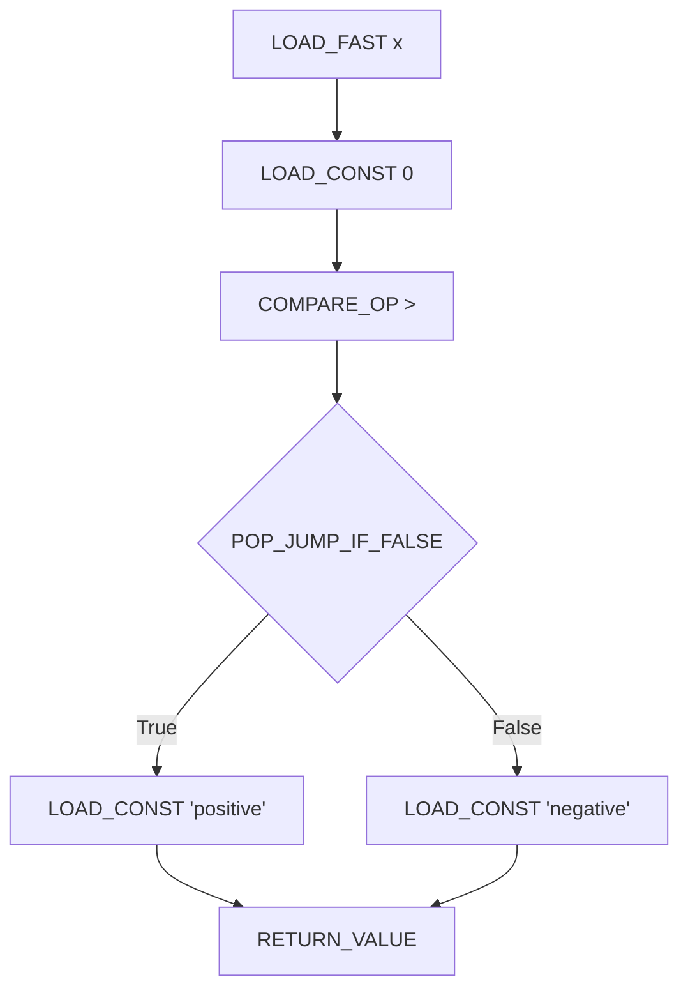
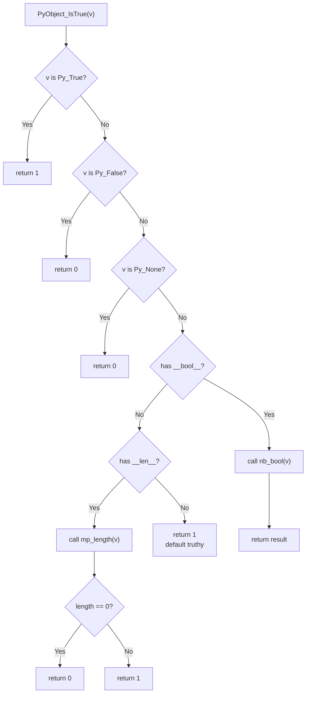
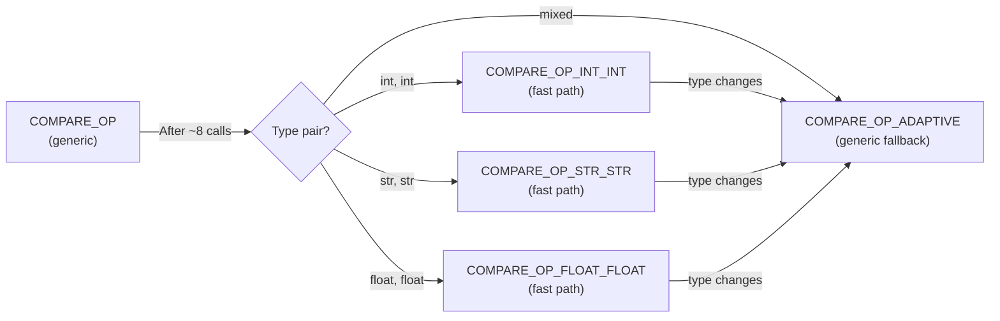

# Conditionals — Professional Level

## Table of Contents

1. [Introduction](#introduction)
2. [CPython Bytecode Analysis](#cpython-bytecode-analysis)
3. [Compiler Optimizations](#compiler-optimizations)
4. [match-case Internals](#match-case-internals)
5. [Boolean Object Internals](#boolean-object-internals)
6. [Comparison Protocol Deep Dive](#comparison-protocol-deep-dive)
7. [Peephole Optimizer](#peephole-optimizer)
8. [Branch Prediction at the CPU Level](#branch-prediction-at-the-cpu-level)
9. [Memory Layout and Caching](#memory-layout-and-caching)
10. [Code Examples](#code-examples)
11. [Edge Cases & Pitfalls](#edge-cases--pitfalls)
12. [Tricky Points](#tricky-points)
13. [Test](#test)
14. [Summary](#summary)
15. [Diagrams & Visual Aids](#diagrams--visual-aids)

---

## Introduction

> Focus: "What happens under the hood?" — CPython bytecode, compiler, and runtime internals.

At the professional level, we examine exactly what CPython does when you write `if`, `elif`, `else`, `match-case`, and conditional expressions. We study the bytecode instructions, the comparison protocol (`__eq__`, `__lt__`, `__bool__`), compiler optimizations, and how Python's evaluation model interacts with CPU branch prediction.

Understanding this level helps you:
- Write truly optimal conditional code
- Debug subtle issues in custom `__eq__`/`__bool__` implementations
- Understand match-case compilation strategy
- Reason about performance at the instruction level

---

## CPython Bytecode Analysis

### Simple if-else Bytecode

```python
import dis

def simple_if(x):
    if x > 0:
        return "positive"
    else:
        return "negative"

dis.dis(simple_if)
```

Output (CPython 3.12+):

```
  2           RESUME                   0

  3           LOAD_FAST                0 (x)
              LOAD_CONST               1 (0)
              COMPARE_OP               4 (>)
              POP_JUMP_IF_FALSE       L1

  4           LOAD_CONST               2 ('positive')
              RETURN_VALUE

  5     L1:   LOAD_CONST               3 ('negative')
              RETURN_VALUE
```

**Key instructions:**
- `COMPARE_OP` — performs the comparison, pushes True/False onto the stack
- `POP_JUMP_IF_FALSE` — pops the top of stack; if falsy, jumps to the else branch
- No `JUMP_FORWARD` needed here because both branches `RETURN_VALUE`

### if-elif-else Bytecode

```python
import dis

def grade(score):
    if score >= 90:
        return "A"
    elif score >= 80:
        return "B"
    elif score >= 70:
        return "C"
    else:
        return "F"

dis.dis(grade)
```

```
  3           LOAD_FAST                0 (score)
              LOAD_CONST               1 (90)
              COMPARE_OP               5 (>=)
              POP_JUMP_IF_FALSE       L1

  4           LOAD_CONST               2 ('A')
              RETURN_VALUE

  6     L1:   LOAD_FAST                0 (score)
              LOAD_CONST               3 (80)
              COMPARE_OP               5 (>=)
              POP_JUMP_IF_FALSE       L2

  7           LOAD_CONST               4 ('B')
              RETURN_VALUE

  9     L2:   LOAD_FAST                0 (score)
              LOAD_CONST               5 (70)
              COMPARE_OP               5 (>=)
              POP_JUMP_IF_FALSE       L3

 10           LOAD_CONST               6 ('C')
              RETURN_VALUE

 12     L3:   LOAD_CONST               7 ('F')
              RETURN_VALUE
```

**Observation:** Each `elif` is a separate `COMPARE_OP` + `POP_JUMP_IF_FALSE`. The chain is linear — worst case checks all N conditions.

### Ternary Expression Bytecode

```python
import dis

def ternary(x):
    return "pos" if x > 0 else "neg"

dis.dis(ternary)
```

```
  2           LOAD_FAST                0 (x)
              LOAD_CONST               1 (0)
              COMPARE_OP               4 (>)
              POP_JUMP_IF_FALSE       L1
              LOAD_CONST               2 ('pos')
              RETURN_VALUE
        L1:   LOAD_CONST               3 ('neg')
              RETURN_VALUE
```

**Observation:** The ternary expression compiles to the same bytecode as `if-else`. There is no performance difference.

### Logical Operators Bytecode

```python
import dis

def logical_ops(a, b):
    return a and b

dis.dis(logical_ops)
```

```
  2           LOAD_FAST                0 (a)
              COPY                     1
              POP_JUMP_IF_FALSE       L1
              POP_TOP
              LOAD_FAST                1 (b)
        L1:   RETURN_VALUE
```

**Key insight:** `and` does NOT always evaluate both operands. It uses `COPY` + `POP_JUMP_IF_FALSE` to implement short-circuit evaluation. If `a` is falsy, `b` is never loaded.

---

## Compiler Optimizations

### Constant Folding

CPython's peephole optimizer evaluates constant expressions at compile time:

```python
import dis

def constant_fold():
    if True:
        return "always"
    else:
        return "never"

dis.dis(constant_fold)
```

```
  # CPython 3.12+ optimizes away the dead branch entirely:
  2           LOAD_CONST               1 ('always')
              RETURN_VALUE
```

The `if True` check and the else branch are completely eliminated at compile time.

### Dead Code Elimination

```python
import dis

def dead_code(x):
    if False:
        return "dead"  # This code is eliminated at compile time
    return "alive"

dis.dis(dead_code)
# Only the "alive" return remains in bytecode
```

### Chained Comparison Optimization

```python
import dis

def chained(x):
    return 0 < x < 10

def unchained(x):
    return 0 < x and x < 10

print("=== Chained ===")
dis.dis(chained)
print("\n=== Unchained ===")
dis.dis(unchained)
```

**Chained bytecode:**
```
  LOAD_CONST 0
  LOAD_FAST  x
  SWAP 2
  COPY 2
  COMPARE_OP <
  POP_JUMP_IF_FALSE ...
  LOAD_CONST 10
  COMPARE_OP <
  ...
```

**Observation:** Chained comparison evaluates `x` only once, while the unchained version loads `x` twice. For expensive expressions, chaining is more efficient.

---

## match-case Internals

### How CPython Compiles match-case

```python
import dis

def match_demo(command):
    match command:
        case "quit":
            return 0
        case "hello":
            return 1
        case _:
            return -1

dis.dis(match_demo)
```

**Key insight:** In CPython 3.10+, `match-case` with literal patterns compiles to a series of equality checks — essentially the same as `if-elif`:

```
  LOAD_FAST    command
  LOAD_CONST   "quit"
  COMPARE_OP   ==
  POP_JUMP_IF_FALSE  L1
  LOAD_CONST   0
  RETURN_VALUE
L1:
  LOAD_FAST    command
  LOAD_CONST   "hello"
  COMPARE_OP   ==
  POP_JUMP_IF_FALSE  L2
  ...
```

### Structural Pattern Matching — Class Patterns

```python
import dis
from dataclasses import dataclass

@dataclass
class Point:
    x: float
    y: float

def match_point(obj):
    match obj:
        case Point(x=0, y=0):
            return "origin"
        case Point(x=x, y=0):
            return f"x-axis at {x}"
        case Point(x=0, y=y):
            return f"y-axis at {y}"
        case Point(x=x, y=y):
            return f"point({x}, {y})"

dis.dis(match_point)
```

**Key instructions for class patterns:**
- `CHECK_MATCH` — verifies the subject matches the class
- `MATCH_MAPPING` / `MATCH_SEQUENCE` / `MATCH_CLASS` — specialized opcodes for pattern matching
- CPython 3.10+ added these opcodes specifically for `match-case`

---

## Boolean Object Internals

### `bool` as a Subclass of `int`

```python
# CPython source (Objects/boolobject.c):
# PyBool_Type is a subclass of PyLong_Type

print(bool.__bases__)   # (<class 'int'>,)
print(bool.__mro__)     # (<class 'bool'>, <class 'int'>, <class 'object'>)

# True and False are singleton int objects:
print(id(True))          # Always the same id
print(True is True)      # True — singleton
print(int(True))         # 1
print(int(False))        # 0

# bool() calls __bool__ or __len__:
class MyObj:
    def __bool__(self):
        print("__bool__ called!")
        return True

if MyObj():  # __bool__ called!
    print("truthy")
```

### The Truth-Testing Protocol

CPython evaluates truthiness in this order:

1. Call `__bool__()` if defined — must return `True` or `False`
2. Call `__len__()` if defined — truthy if non-zero
3. Object is always truthy (if neither is defined)

```python
import dis

def truth_test(obj):
    if obj:
        return True
    return False

dis.dis(truth_test)
```

```
  LOAD_FAST     obj
  POP_JUMP_IF_FALSE  ...
```

`POP_JUMP_IF_FALSE` internally calls `PyObject_IsTrue()`:

```c
// CPython source: Objects/object.c
int PyObject_IsTrue(PyObject *v)
{
    Py_ssize_t res;
    if (v == Py_True)       // Fast path for True
        return 1;
    if (v == Py_False)      // Fast path for False
        return 0;
    if (v == Py_None)       // Fast path for None
        return 0;
    // Try __bool__
    if (tp->tp_as_number && tp->tp_as_number->nb_bool) {
        res = (*tp->tp_as_number->nb_bool)(v);
        ...
    }
    // Try __len__
    if (tp->tp_as_mapping && tp->tp_as_mapping->mp_length) {
        res = (*tp->tp_as_mapping->mp_length)(v);
        ...
    }
    return 1;  // Default: truthy
}
```

---

## Comparison Protocol Deep Dive

### Rich Comparison Methods

Python uses six comparison dunder methods:

```python
class Temperature:
    """Custom comparison protocol example."""

    def __init__(self, celsius: float):
        self.celsius = celsius

    def __eq__(self, other):
        if not isinstance(other, Temperature):
            return NotImplemented
        return self.celsius == other.celsius

    def __lt__(self, other):
        if not isinstance(other, Temperature):
            return NotImplemented
        return self.celsius < other.celsius

    def __le__(self, other):
        if not isinstance(other, Temperature):
            return NotImplemented
        return self.celsius <= other.celsius

    def __gt__(self, other):
        if not isinstance(other, Temperature):
            return NotImplemented
        return self.celsius > other.celsius

    def __ge__(self, other):
        if not isinstance(other, Temperature):
            return NotImplemented
        return self.celsius >= other.celsius

    def __hash__(self):
        return hash(self.celsius)

    def __repr__(self):
        return f"Temperature({self.celsius}C)"
```

### How `COMPARE_OP` Works Internally

```c
// CPython source: Python/ceval.c (simplified)
// COMPARE_OP dispatches to:
static PyObject* cmp_outcome(int op, PyObject *v, PyObject *w) {
    switch (op) {
        case PyCmp_EQ:  return PyObject_RichCompare(v, w, Py_EQ);
        case PyCmp_NE:  return PyObject_RichCompare(v, w, Py_NE);
        case PyCmp_LT:  return PyObject_RichCompare(v, w, Py_LT);
        case PyCmp_LE:  return PyObject_RichCompare(v, w, Py_LE);
        case PyCmp_GT:  return PyObject_RichCompare(v, w, Py_GT);
        case PyCmp_GE:  return PyObject_RichCompare(v, w, Py_GE);
        case PyCmp_IS:  // v is w — pointer comparison!
        case PyCmp_IS_NOT:  // v is not w
        case PyCmp_IN:  // v in w — calls __contains__
        case PyCmp_NOT_IN:  // v not in w
    }
}
```

### `is` vs `==` at the Bytecode Level

```python
import dis

def identity_check(x):
    return x is None

def equality_check(x):
    return x == None

dis.dis(identity_check)
# LOAD_FAST x
# LOAD_CONST None
# IS_OP 0        <-- pointer comparison, O(1)
# RETURN_VALUE

dis.dis(equality_check)
# LOAD_FAST x
# LOAD_CONST None
# COMPARE_OP ==  <-- calls __eq__, potentially O(n)
# RETURN_VALUE
```

**Performance:** `is` is a single pointer comparison (C-level `==`). `==` invokes the rich comparison protocol, which may call Python-level `__eq__`.

---

## Peephole Optimizer

### What the Peephole Optimizer Does to Conditionals

```python
import dis

# Optimization 1: Constant folding in conditions
def opt1():
    x = 2 + 3  # Folded to x = 5 at compile time
    if x:
        return True

# Optimization 2: Jump optimization
def opt2(x):
    if not not x:  # Optimized to just testing x
        return True

# Optimization 3: Dead branch elimination
def opt3():
    if __debug__:  # Eliminated when running with -O flag
        assert True

# Check the bytecode
for fn in [opt1, opt2, opt3]:
    print(f"\n=== {fn.__name__} ===")
    dis.dis(fn)
```

### Bytecode Specialization (CPython 3.11+ Adaptive Interpreter)

CPython 3.11 introduced **adaptive specialization** — the interpreter replaces generic bytecode with type-specialized versions after profiling:

```python
# After several calls, COMPARE_OP becomes:
# COMPARE_OP_INT_INT  — fast path for int comparisons
# COMPARE_OP_STR_STR  — fast path for string comparisons
# COMPARE_OP_FLOAT_FLOAT — fast path for float comparisons

# You can inspect specialization with:
import dis
import sys

def compare_ints(a: int, b: int) -> bool:
    return a < b

# Warm up the adaptive interpreter
for i in range(100):
    compare_ints(i, i + 1)

if sys.version_info >= (3, 11):
    dis.dis(compare_ints, adaptive=True)
    # Shows specialized opcodes like COMPARE_OP_INT_INT
```

---

## Branch Prediction at the CPU Level

### Why Condition Order Matters at the Hardware Level

```python
"""
CPython's main loop (ceval.c) uses a computed goto or switch statement
to dispatch bytecodes. Modern CPUs use branch predictors to speculate
which branch will be taken.

When Python evaluates:
    if condition_A:      # Predicted based on history
        ...
    elif condition_B:    # CPU may mispredict after A is false
        ...

Misprediction penalty: 10-30 CPU cycles per misprediction.

For hot loops, ordering conditions by probability improves performance
because the CPU's branch predictor learns the pattern.
"""

import timeit

def predictable_branch(data: list[int]) -> int:
    """Sorted data = predictable branches = fast."""
    count = 0
    for x in data:
        if x < 500:  # After sorting, this is True then always False
            count += 1
    return count

def unpredictable_branch(data: list[int]) -> int:
    """Random data = unpredictable branches = slow."""
    count = 0
    for x in data:
        if x < 500:
            count += 1
    return count


def main():
    import random
    random.seed(42)

    sorted_data = list(range(1000))
    random_data = sorted_data.copy()
    random.shuffle(random_data)

    t1 = timeit.timeit(lambda: predictable_branch(sorted_data), number=10_000)
    t2 = timeit.timeit(lambda: unpredictable_branch(random_data), number=10_000)

    print(f"Sorted (predictable):   {t1:.3f}s")
    print(f"Random (unpredictable): {t2:.3f}s")
    print(f"Ratio: {t2/t1:.2f}x")


if __name__ == "__main__":
    main()
```

---

## Memory Layout and Caching

### Small Integer Caching and `is` Behavior

```python
# CPython caches integers from -5 to 256 (Objects/longobject.c)
# This affects identity comparisons:

a = 256
b = 256
print(a is b)  # True — cached

a = 257
b = 257
print(a is b)  # False — different objects (in REPL; may vary in scripts)

# String interning:
s1 = "hello"
s2 = "hello"
print(s1 is s2)  # True — interned by compiler

s3 = "hello world!"
s4 = "hello world!"
print(s3 is s4)  # May be True in script (compiler optimization), False in REPL


# Verify with sys.intern:
import sys
s5 = sys.intern("dynamic_string_" + str(42))
s6 = sys.intern("dynamic_string_" + str(42))
print(s5 is s6)  # True — explicitly interned
```

### Object Identity vs Equality — PyObject Layout

```
+------------------+           +------------------+
|   PyObject (a)   |           |   PyObject (b)   |
|------------------|           |------------------|
|  ob_refcnt: 1    |           |  ob_refcnt: 1    |
|  ob_type: int    |           |  ob_type: int    |
|  ob_ival: 257    |           |  ob_ival: 257    |
+------------------+           +------------------+
   id(a) = 0xABC                  id(b) = 0xDEF

a == b  → True  (ob_ival comparison)
a is b  → False (different addresses: 0xABC != 0xDEF)
```

---

## Code Examples

### Example 1: Bytecode Inspector for Conditionals

```python
import dis
import sys
from io import StringIO
from types import CodeType


def analyze_conditional(func) -> dict:
    """Analyze a function's conditional bytecode instructions."""
    instructions = list(dis.get_instructions(func))

    stats = {
        "total_instructions": len(instructions),
        "comparisons": 0,
        "jumps": 0,
        "jump_targets": set(),
        "comparison_ops": [],
    }

    for instr in instructions:
        if "COMPARE" in instr.opname:
            stats["comparisons"] += 1
            stats["comparison_ops"].append(instr.argval)
        if "JUMP" in instr.opname:
            stats["jumps"] += 1
            if instr.argval is not None:
                stats["jump_targets"].add(instr.argval)

    stats["jump_targets"] = len(stats["jump_targets"])
    return stats


def example_function(x, y, z):
    if x > 0 and y > 0:
        if z > 0:
            return "all positive"
        return "z not positive"
    elif x == y:
        return "x equals y"
    else:
        return "default"


def main():
    print("=== Bytecode ===")
    dis.dis(example_function)

    print("\n=== Analysis ===")
    stats = analyze_conditional(example_function)
    for key, value in stats.items():
        print(f"  {key}: {value}")

    print(f"\n  Python version: {sys.version}")
    print(f"  Bytecode size: {len(example_function.__code__.co_code)} bytes")


if __name__ == "__main__":
    main()
```

### Example 2: Custom Truth-Testing with Profiling

```python
import time
from dataclasses import dataclass


@dataclass
class LazyQuery:
    """Object that evaluates truthiness by running a query."""
    _query: str
    _result: list | None = None
    _bool_call_count: int = 0

    def _execute(self) -> list:
        if self._result is None:
            # Simulate database query
            time.sleep(0.001)
            self._result = [1, 2, 3] if "valid" in self._query else []
        return self._result

    def __bool__(self) -> bool:
        """Truth test triggers query execution."""
        self._bool_call_count += 1
        return bool(self._execute())

    def __len__(self) -> int:
        return len(self._execute())


def main():
    valid_query = LazyQuery("SELECT * FROM valid_table")
    empty_query = LazyQuery("SELECT * FROM empty_table")

    # bool() called implicitly
    if valid_query:
        print(f"Valid query has {len(valid_query)} results")
        print(f"  __bool__ was called {valid_query._bool_call_count} time(s)")

    if not empty_query:
        print(f"Empty query returned no results")
        print(f"  __bool__ was called {empty_query._bool_call_count} time(s)")

    # Demonstrating that bool() caches the query result
    for _ in range(5):
        bool(valid_query)
    print(f"After 6 total bool() calls: __bool__ called {valid_query._bool_call_count} times")
    print(f"  But query only executed once (result cached)")


if __name__ == "__main__":
    main()
```

---

## Edge Cases & Pitfalls

### Pitfall 1: `NotImplemented` vs `NotImplementedError`

```python
class Weight:
    def __init__(self, kg: float):
        self.kg = kg

    def __eq__(self, other):
        if not isinstance(other, Weight):
            # CORRECT: return NotImplemented (Python tries the reflected operation)
            return NotImplemented
            # WRONG: raise NotImplementedError (crashes immediately)
        return self.kg == other.kg


# When you return NotImplemented:
# 1. Python tries other.__eq__(self)
# 2. If that also returns NotImplemented, result is False
# 3. No exception is raised

w = Weight(70)
print(w == 70)         # False (after trying both sides)
print(w == Weight(70)) # True
```

### Pitfall 2: `__bool__` Must Return `bool`

```python
class Bad:
    def __bool__(self):
        return 1  # TypeError! __bool__ must return bool, not int

class Good:
    def __bool__(self):
        return True  # Correct

# Even though bool is a subclass of int, __bool__ MUST return True or False
```

---

## Tricky Points

### Tricky Point 1: Comparison Chaining with Side Effects

```python
call_count = 0

def tricky():
    global call_count
    call_count += 1
    return 5

# How many times is tricky() called?
result = 1 < tricky() < 10
print(f"Result: {result}, calls: {call_count}")
# Result: True, calls: 1  (NOT 2!)

# In chained comparison, the middle expression is evaluated only ONCE
# Even though logically it means: 1 < tricky() and tricky() < 10
# CPython optimizes: evaluates tricky() once and reuses the result
```

### Tricky Point 2: `match-case` and `__eq__` Interaction

```python
class AlwaysEqual:
    def __eq__(self, other):
        return True

obj = AlwaysEqual()

match "anything":
    case obj:
        # This does NOT match! Pattern variables are names, not values.
        # 'obj' here captures the subject into a NEW variable named 'obj'
        print(f"Captured: {obj}")  # Prints: Captured: anything

# To match against a value, use dotted name or guard:
class Constants:
    obj = AlwaysEqual()

match "anything":
    case Constants.obj:
        print("Matched via dotted name and __eq__")  # This works!
```

---

## Test

**1. Which CPython bytecode instruction implements short-circuit `and`?**

- A) `BINARY_AND`
- B) `JUMP_IF_TRUE_OR_POP`
- C) `POP_JUMP_IF_FALSE` (with `COPY`)
- D) `COMPARE_OP`

<details>
<summary>Answer</summary>

**C)** — `and` is compiled to `COPY` the first value, then `POP_JUMP_IF_FALSE`. If the first value is falsy, it jumps over the second operand. `BINARY_AND` is the bitwise `&` operator.

</details>

**2. What does `PyObject_IsTrue()` check first?**

- A) `__len__`
- B) `__bool__`
- C) Identity with `Py_True`
- D) `__eq__` with `True`

<details>
<summary>Answer</summary>

**C)** — CPython first checks if the object IS `Py_True` or `Py_False` (pointer comparison for fast path), then `Py_None`, then tries `__bool__`, then `__len__`.

</details>

**3. In a chained comparison `a < f() < b`, how many times is `f()` called?**

<details>
<summary>Answer</summary>

**Once.** CPython evaluates `f()` once and uses `COPY` to duplicate the result on the stack for both comparisons. This is a significant optimization over the equivalent `a < f() and f() < b`.

</details>

**4. Why does `match-case` with literal string patterns NOT compile to a hash table lookup?**

<details>
<summary>Answer</summary>

Because `match-case` uses `__eq__` for comparison, and the subject could be a custom class with a non-standard `__eq__`. CPython cannot assume hash-based equality. It compiles to sequential `COMPARE_OP ==` checks, similar to `if-elif`. However, the compiler may reorder patterns for optimization.

</details>

---

## Summary

- **Bytecode:** `if`/`elif`/`else` compiles to `COMPARE_OP` + `POP_JUMP_IF_FALSE` chains
- **Ternary** compiles to identical bytecode as `if-else` — no performance difference
- **Short-circuit** uses `COPY` + `POP_JUMP_IF_FALSE` to skip evaluation
- **Chained comparisons** evaluate the middle expression only once via `COPY`
- **`match-case`** compiles to sequential equality checks (not hash tables)
- **`PyObject_IsTrue()`** fast-paths `True`, `False`, `None` before calling `__bool__`/`__len__`
- **CPython 3.11+** specializes `COMPARE_OP` for int/str/float pairs
- **`is`** is a pointer comparison; `==` invokes the rich comparison protocol
- **Branch prediction** affects performance in tight loops — sorted data is faster

---

## Diagrams & Visual Aids

### CPython if-else Bytecode Flow



### PyObject_IsTrue Decision Flow



### Adaptive Specialization Pipeline (CPython 3.11+)


