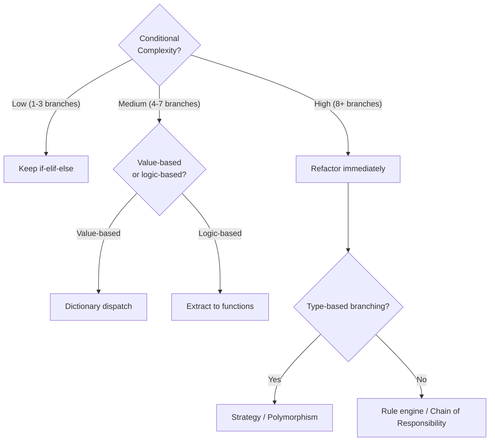
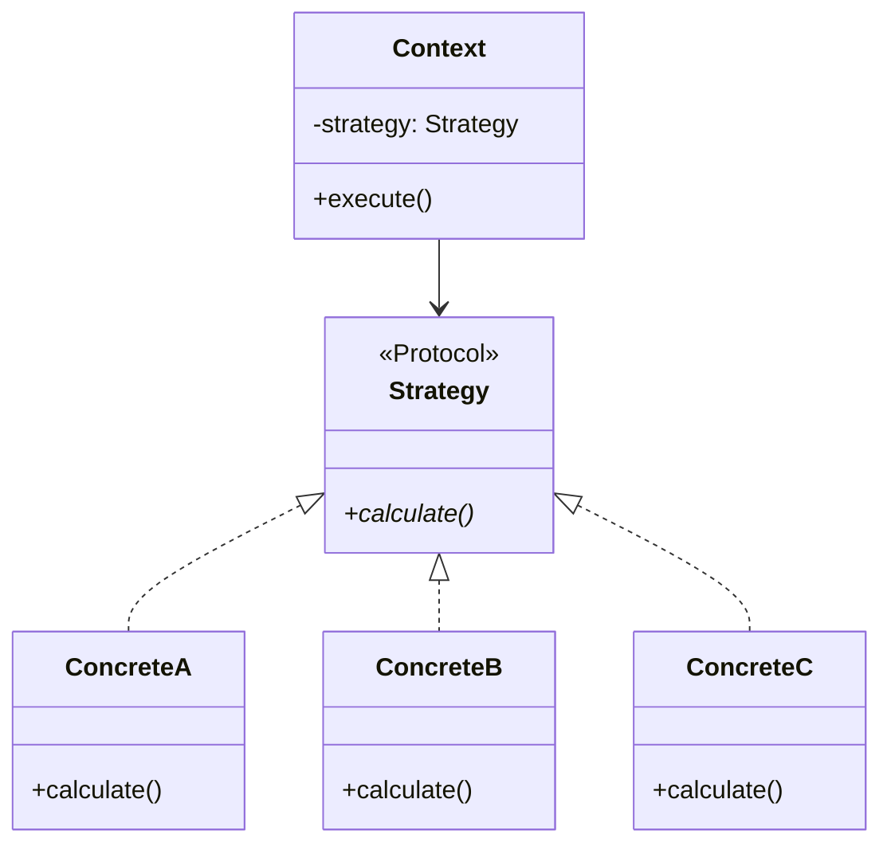
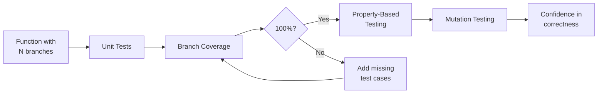

# Conditionals — Senior Level

## Table of Contents

1. [Introduction](#introduction)
2. [Core Concepts](#core-concepts)
3. [Architecture Patterns](#architecture-patterns)
4. [Performance Profiling](#performance-profiling)
5. [Code Examples](#code-examples)
6. [Production Patterns](#production-patterns)
7. [Refactoring Guide](#refactoring-guide)
8. [Testing Conditional Logic](#testing-conditional-logic)
9. [Metrics & Observability](#metrics--observability)
10. [Edge Cases & Pitfalls](#edge-cases--pitfalls)
11. [Tricky Points](#tricky-points)
12. [Test](#test)
13. [Cheat Sheet](#cheat-sheet)
14. [Summary](#summary)
15. [Diagrams & Visual Aids](#diagrams--visual-aids)

---

## Introduction

> Focus: "How to optimize?" and "How to architect?"

At the senior level, conditionals are not just about making decisions — they are about **designing systems** where the right decisions happen at the right abstraction level with minimal complexity and maximal testability.

Key concerns:
- Eliminating conditional complexity through design patterns (Strategy, Chain of Responsibility, Visitor)
- Measuring and reducing cyclomatic complexity
- Branch prediction and performance implications
- Table-driven logic for maintainable business rules
- Type-safe conditionals with `Protocol`, `TypeGuard`, and exhaustiveness checking
- Testing every branch path with property-based testing

---

## Core Concepts

### Concept 1: Cyclomatic Complexity and Why It Matters

Cyclomatic complexity counts the number of independent execution paths through code. Each `if`, `elif`, `and`, `or` adds a path. High complexity means more tests needed and more bugs.

```python
# Cyclomatic complexity = 7 (every condition is a branch)
def calculate_discount(user, cart) -> float:
    if user.is_premium and cart.total > 100:      # +2 (if + and)
        if cart.has_coupon:                         # +1
            return 0.25
        return 0.15
    elif user.is_premium:                           # +1
        return 0.10
    elif cart.total > 200:                          # +1
        if cart.items_count > 5:                    # +1
            return 0.12
        return 0.08
    return 0.0


# Refactored: table-driven, complexity = 1
from dataclasses import dataclass
from typing import Callable

@dataclass(frozen=True)
class DiscountRule:
    name: str
    condition: Callable
    discount: float
    priority: int

DISCOUNT_RULES: list[DiscountRule] = [
    DiscountRule("premium_coupon", lambda u, c: u.is_premium and c.total > 100 and c.has_coupon, 0.25, 1),
    DiscountRule("premium_high",   lambda u, c: u.is_premium and c.total > 100, 0.15, 2),
    DiscountRule("premium_base",   lambda u, c: u.is_premium, 0.10, 3),
    DiscountRule("bulk_order",     lambda u, c: c.total > 200 and c.items_count > 5, 0.12, 4),
    DiscountRule("high_value",     lambda u, c: c.total > 200, 0.08, 5),
]

def calculate_discount_v2(user, cart) -> float:
    """Table-driven discount calculation — O(n) rules, but easy to maintain."""
    for rule in sorted(DISCOUNT_RULES, key=lambda r: r.priority):
        if rule.condition(user, cart):
            return rule.discount
    return 0.0
```

### Concept 2: TypeGuard for Type-Safe Conditionals (Python 3.10+)

```python
from typing import TypeGuard, Union


def is_string_list(val: list[Union[str, int]]) -> TypeGuard[list[str]]:
    """Type guard: narrows type to list[str] when True."""
    return all(isinstance(item, str) for item in val)


def process_items(items: list[Union[str, int]]) -> str:
    if is_string_list(items):
        # Type checker knows items is list[str] here
        return ", ".join(items)
    # Type checker knows items may contain int here
    return ", ".join(str(i) for i in items)


def main():
    print(process_items(["a", "b", "c"]))   # a, b, c
    print(process_items([1, "b", 3]))        # 1, b, 3


if __name__ == "__main__":
    main()
```

### Concept 3: Exhaustiveness Checking with `assert_never`

```python
from typing import assert_never
from enum import Enum


class Color(Enum):
    RED = "red"
    GREEN = "green"
    BLUE = "blue"


def color_hex(color: Color) -> str:
    match color:
        case Color.RED:
            return "#FF0000"
        case Color.GREEN:
            return "#00FF00"
        case Color.BLUE:
            return "#0000FF"
        case _ as unreachable:
            assert_never(unreachable)  # Mypy/pyright will error if a case is missing


def main():
    for c in Color:
        print(f"{c.name}: {color_hex(c)}")


if __name__ == "__main__":
    main()
```

### Concept 4: Protocol-Based Dispatch

```python
from typing import Protocol, runtime_checkable


@runtime_checkable
class Renderable(Protocol):
    def render(self) -> str: ...


@runtime_checkable
class Serializable(Protocol):
    def to_dict(self) -> dict: ...


class HtmlWidget:
    def render(self) -> str:
        return "<div>Widget</div>"

class JsonData:
    def to_dict(self) -> dict:
        return {"type": "data", "value": 42}

class HybridComponent:
    def render(self) -> str:
        return "<span>Hybrid</span>"
    def to_dict(self) -> dict:
        return {"type": "hybrid"}


def process(obj: object) -> str:
    """Process object based on which protocols it satisfies."""
    match (isinstance(obj, Renderable), isinstance(obj, Serializable)):
        case (True, True):
            return f"Both: {obj.render()} | {obj.to_dict()}"
        case (True, False):
            return f"Renderable: {obj.render()}"
        case (False, True):
            return f"Serializable: {obj.to_dict()}"
        case _:
            return f"Unknown: {repr(obj)}"


def main():
    print(process(HtmlWidget()))       # Renderable: <div>Widget</div>
    print(process(JsonData()))         # Serializable: {'type': 'data', 'value': 42}
    print(process(HybridComponent()))  # Both: <span>Hybrid</span> | {'type': 'hybrid'}
    print(process("plain string"))     # Unknown: 'plain string'


if __name__ == "__main__":
    main()
```

---

## Architecture Patterns

### Pattern 1: Strategy Pattern — Eliminating if-elif

```python
from abc import ABC, abstractmethod
from typing import Protocol


class PricingStrategy(Protocol):
    def calculate(self, base_price: float) -> float: ...


class RegularPricing:
    def calculate(self, base_price: float) -> float:
        return base_price


class PremiumPricing:
    def calculate(self, base_price: float) -> float:
        return base_price * 0.8  # 20% discount


class WholesalePricing:
    def calculate(self, base_price: float) -> float:
        return base_price * 0.6  # 40% discount


class PricingContext:
    """Context that delegates pricing to a strategy — no if-elif needed."""

    _strategies: dict[str, PricingStrategy] = {
        "regular": RegularPricing(),
        "premium": PremiumPricing(),
        "wholesale": WholesalePricing(),
    }

    @classmethod
    def get_price(cls, tier: str, base_price: float) -> float:
        strategy = cls._strategies.get(tier)
        if strategy is None:
            raise ValueError(f"Unknown pricing tier: {tier}")
        return strategy.calculate(base_price)


def main():
    print(f"Regular:   ${PricingContext.get_price('regular', 100):.2f}")
    print(f"Premium:   ${PricingContext.get_price('premium', 100):.2f}")
    print(f"Wholesale: ${PricingContext.get_price('wholesale', 100):.2f}")


if __name__ == "__main__":
    main()
```

### Pattern 2: Chain of Responsibility

```python
from __future__ import annotations
from abc import ABC, abstractmethod
from dataclasses import dataclass
from typing import Optional


@dataclass
class Request:
    path: str
    method: str
    user_role: str
    body: Optional[dict] = None


class Middleware(ABC):
    """Chain of Responsibility: each handler decides to process or pass along."""
    _next: Optional[Middleware] = None

    def set_next(self, handler: Middleware) -> Middleware:
        self._next = handler
        return handler

    def handle(self, request: Request) -> str:
        if self._next:
            return self._next.handle(request)
        return "Request reached end of chain"

    @abstractmethod
    def process(self, request: Request) -> Optional[str]: ...


class AuthMiddleware(Middleware):
    def process(self, request: Request) -> Optional[str]:
        if request.user_role == "anonymous":
            return "401 Unauthorized"
        return None

    def handle(self, request: Request) -> str:
        if result := self.process(request):
            return result
        return super().handle(request)


class RateLimitMiddleware(Middleware):
    _request_count: dict[str, int] = {}

    def process(self, request: Request) -> Optional[str]:
        count = self._request_count.get(request.path, 0) + 1
        self._request_count[request.path] = count
        if count > 100:
            return "429 Too Many Requests"
        return None

    def handle(self, request: Request) -> str:
        if result := self.process(request):
            return result
        return super().handle(request)


class RouteHandler(Middleware):
    def process(self, request: Request) -> Optional[str]:
        return f"200 OK: {request.method} {request.path}"

    def handle(self, request: Request) -> str:
        if result := self.process(request):
            return result
        return super().handle(request)


def main():
    # Build chain: Auth -> RateLimit -> Route
    auth = AuthMiddleware()
    rate_limit = RateLimitMiddleware()
    route = RouteHandler()
    auth.set_next(rate_limit).set_next(route)

    requests = [
        Request("/api/users", "GET", "admin"),
        Request("/api/users", "GET", "anonymous"),
        Request("/api/data", "POST", "user", {"key": "value"}),
    ]

    for req in requests:
        print(f"{req.method} {req.path} [{req.user_role}] -> {auth.handle(req)}")


if __name__ == "__main__":
    main()
```

### Pattern 3: Rule Engine

```python
from dataclasses import dataclass, field
from typing import Any, Callable
import operator


@dataclass
class Rule:
    """A declarative rule: field op value -> action."""
    field: str
    op: str
    value: Any
    action: str
    priority: int = 0

    _OPERATORS: dict[str, Callable] = field(default_factory=lambda: {
        "==": operator.eq,
        "!=": operator.ne,
        ">": operator.gt,
        "<": operator.lt,
        ">=": operator.ge,
        "<=": operator.le,
        "in": lambda a, b: a in b,
        "contains": lambda a, b: b in a,
    }, repr=False)

    def evaluate(self, data: dict) -> bool:
        field_value = data.get(self.field)
        if field_value is None:
            return False
        op_func = self._OPERATORS.get(self.op)
        if op_func is None:
            raise ValueError(f"Unknown operator: {self.op}")
        return op_func(field_value, self.value)


class RuleEngine:
    def __init__(self, rules: list[Rule]):
        self.rules = sorted(rules, key=lambda r: r.priority)

    def evaluate(self, data: dict) -> list[str]:
        """Return all matching actions."""
        return [rule.action for rule in self.rules if rule.evaluate(data)]

    def first_match(self, data: dict) -> str | None:
        """Return the first matching action."""
        for rule in self.rules:
            if rule.evaluate(data):
                return rule.action
        return None


def main():
    rules = [
        Rule("age", "<", 18, "redirect_to_kids_section", priority=1),
        Rule("age", ">=", 65, "apply_senior_discount", priority=2),
        Rule("country", "in", ["US", "CA"], "show_north_america_pricing", priority=3),
        Rule("cart_total", ">", 100, "offer_free_shipping", priority=4),
    ]

    engine = RuleEngine(rules)

    users = [
        {"age": 15, "country": "US", "cart_total": 50},
        {"age": 70, "country": "UK", "cart_total": 150},
        {"age": 30, "country": "CA", "cart_total": 200},
    ]

    for user in users:
        actions = engine.evaluate(user)
        print(f"User {user}: {actions}")


if __name__ == "__main__":
    main()
```

---

## Performance Profiling

### Branch Prediction and Condition Ordering

```python
import timeit
import random


def ordered_conditions(values: list[int]) -> int:
    """Most likely condition first — optimized for branch prediction."""
    count = 0
    for v in values:
        if v < 50:        # 50% likely — check first
            count += 1
        elif v < 80:      # 30% likely
            count += 2
        elif v < 95:      # 15% likely
            count += 3
        else:              # 5% likely
            count += 4
    return count


def reversed_conditions(values: list[int]) -> int:
    """Least likely condition first — suboptimal ordering."""
    count = 0
    for v in values:
        if v >= 95:       # 5% likely — checked first (wasteful)
            count += 4
        elif v >= 80:     # 15% likely
            count += 3
        elif v >= 50:     # 30% likely
            count += 2
        else:             # 50% likely — checked last
            count += 1
    return count


def main():
    random.seed(42)
    values = [random.randint(0, 99) for _ in range(1_000_000)]

    t1 = timeit.timeit(lambda: ordered_conditions(values), number=10)
    t2 = timeit.timeit(lambda: reversed_conditions(values), number=10)

    print(f"Ordered (likely first):   {t1:.3f}s")
    print(f"Reversed (unlikely first): {t2:.3f}s")
    print(f"Difference: {abs(t1 - t2):.3f}s ({abs(t1 - t2) / max(t1, t2) * 100:.1f}%)")


if __name__ == "__main__":
    main()
```

### Profiling Conditional Logic with cProfile

```python
import cProfile
import pstats
from io import StringIO


def complex_classifier(data: list[dict]) -> dict[str, int]:
    """Classify records — profile to find bottleneck branches."""
    counts = {"high": 0, "medium": 0, "low": 0, "invalid": 0}

    for record in data:
        score = record.get("score", 0)
        category = record.get("category", "")

        if not isinstance(score, (int, float)):
            counts["invalid"] += 1
        elif score > 90 and category in ("premium", "enterprise"):
            counts["high"] += 1
        elif score > 50 or category == "standard":
            counts["medium"] += 1
        else:
            counts["low"] += 1

    return counts


def main():
    data = [
        {"score": i % 100, "category": ["basic", "standard", "premium", "enterprise"][i % 4]}
        for i in range(500_000)
    ]

    profiler = cProfile.Profile()
    profiler.enable()
    result = complex_classifier(data)
    profiler.disable()

    stream = StringIO()
    stats = pstats.Stats(profiler, stream=stream).sort_stats("cumulative")
    stats.print_stats(10)
    print(stream.getvalue())
    print(f"Results: {result}")


if __name__ == "__main__":
    main()
```

---

## Code Examples

### Example 1: Exhaustive match-case with Dataclasses

```python
from dataclasses import dataclass
from typing import assert_never


@dataclass
class TextMessage:
    sender: str
    content: str

@dataclass
class ImageMessage:
    sender: str
    url: str
    width: int
    height: int

@dataclass
class SystemMessage:
    event: str
    details: dict

Message = TextMessage | ImageMessage | SystemMessage


def format_message(msg: Message) -> str:
    """Format message — exhaustiveness checked by assert_never."""
    match msg:
        case TextMessage(sender=s, content=c):
            return f"[{s}]: {c}"
        case ImageMessage(sender=s, url=u, width=w, height=h):
            return f"[{s}]: Image {w}x{h} @ {u}"
        case SystemMessage(event=e, details=d):
            return f"[SYSTEM] {e}: {d}"
        case _ as unreachable:
            assert_never(unreachable)


def main():
    messages: list[Message] = [
        TextMessage("Alice", "Hello!"),
        ImageMessage("Bob", "https://example.com/img.png", 800, 600),
        SystemMessage("user_joined", {"user": "Charlie"}),
    ]

    for msg in messages:
        print(format_message(msg))


if __name__ == "__main__":
    main()
```

### Example 2: Visitor Pattern — Zero Conditionals

```python
from abc import ABC, abstractmethod
from dataclasses import dataclass


# AST nodes
class Expr(ABC):
    @abstractmethod
    def accept(self, visitor: "ExprVisitor") -> str: ...

@dataclass
class NumberExpr(Expr):
    value: float
    def accept(self, visitor: "ExprVisitor") -> str:
        return visitor.visit_number(self)

@dataclass
class BinaryExpr(Expr):
    left: Expr
    op: str
    right: Expr
    def accept(self, visitor: "ExprVisitor") -> str:
        return visitor.visit_binary(self)

@dataclass
class UnaryExpr(Expr):
    op: str
    operand: Expr
    def accept(self, visitor: "ExprVisitor") -> str:
        return visitor.visit_unary(self)


# Visitor — no if-elif needed
class ExprVisitor(ABC):
    @abstractmethod
    def visit_number(self, expr: NumberExpr) -> str: ...
    @abstractmethod
    def visit_binary(self, expr: BinaryExpr) -> str: ...
    @abstractmethod
    def visit_unary(self, expr: UnaryExpr) -> str: ...


class PrettyPrinter(ExprVisitor):
    def visit_number(self, expr: NumberExpr) -> str:
        return str(expr.value)

    def visit_binary(self, expr: BinaryExpr) -> str:
        left = expr.left.accept(self)
        right = expr.right.accept(self)
        return f"({left} {expr.op} {right})"

    def visit_unary(self, expr: UnaryExpr) -> str:
        operand = expr.operand.accept(self)
        return f"({expr.op}{operand})"


def main():
    # Represent: -(3 + 4) * 2
    expr = BinaryExpr(
        UnaryExpr("-", BinaryExpr(NumberExpr(3), "+", NumberExpr(4))),
        "*",
        NumberExpr(2),
    )
    printer = PrettyPrinter()
    print(expr.accept(printer))  # ((-(3.0 + 4.0)) * 2.0)


if __name__ == "__main__":
    main()
```

---

## Production Patterns

### Feature Flag with Gradual Rollout

```python
import hashlib
from dataclasses import dataclass, field


@dataclass
class FeatureFlag:
    name: str
    enabled: bool = False
    rollout_percentage: int = 0  # 0-100
    allowed_users: set[str] = field(default_factory=set)

    def is_enabled_for(self, user_id: str) -> bool:
        """Determine if feature is enabled for a specific user."""
        if not self.enabled:
            return False
        if user_id in self.allowed_users:
            return True
        if self.rollout_percentage >= 100:
            return True
        if self.rollout_percentage <= 0:
            return bool(self.allowed_users)
        # Deterministic hash-based rollout
        hash_val = int(hashlib.md5(f"{self.name}:{user_id}".encode()).hexdigest(), 16)
        return (hash_val % 100) < self.rollout_percentage


def main():
    flag = FeatureFlag(
        name="new_checkout",
        enabled=True,
        rollout_percentage=50,
        allowed_users={"admin_001"},
    )

    test_users = [f"user_{i:03d}" for i in range(20)]
    enabled_count = sum(1 for u in test_users if flag.is_enabled_for(u))
    print(f"Enabled for {enabled_count}/{len(test_users)} users (~50% expected)")
    print(f"Admin always enabled: {flag.is_enabled_for('admin_001')}")


if __name__ == "__main__":
    main()
```

---

## Refactoring Guide

### Step-by-Step: From if-elif Hell to Clean Architecture

```python
# BEFORE: 15+ conditions, cyclomatic complexity = 16
def handle_notification_bad(event_type, user, data):
    if event_type == "signup":
        if user.email_verified:
            send_welcome_email(user)
        else:
            send_verification_email(user)
    elif event_type == "purchase":
        if data["amount"] > 100:
            send_receipt(user, data)
            if user.is_premium:
                add_loyalty_points(user, data["amount"])
        else:
            send_receipt(user, data)
    elif event_type == "password_reset":
        send_reset_link(user)
    # ... 10 more event types


# AFTER: Strategy + registry pattern
from typing import Protocol

class NotificationHandler(Protocol):
    def handle(self, user, data: dict) -> None: ...

class SignupHandler:
    def handle(self, user, data: dict) -> None:
        if user.email_verified:
            send_welcome_email(user)
        else:
            send_verification_email(user)

class PurchaseHandler:
    def handle(self, user, data: dict) -> None:
        send_receipt(user, data)
        if data.get("amount", 0) > 100 and user.is_premium:
            add_loyalty_points(user, data["amount"])

class PasswordResetHandler:
    def handle(self, user, data: dict) -> None:
        send_reset_link(user)

# Registry — add new handlers without modifying existing code (OCP)
HANDLERS: dict[str, NotificationHandler] = {
    "signup": SignupHandler(),
    "purchase": PurchaseHandler(),
    "password_reset": PasswordResetHandler(),
}

def handle_notification(event_type: str, user, data: dict) -> None:
    handler = HANDLERS.get(event_type)
    if handler is None:
        raise ValueError(f"Unknown event: {event_type}")
    handler.handle(user, data)
```

---

## Testing Conditional Logic

### Property-Based Testing with Hypothesis

```python
# test_conditionals.py
from hypothesis import given, strategies as st


def classify_age(age: int) -> str:
    if age < 0:
        raise ValueError("Age cannot be negative")
    if age < 13:
        return "child"
    if age < 18:
        return "teenager"
    if age < 65:
        return "adult"
    return "senior"


# Property-based tests ensure ALL branches are covered
@given(st.integers(min_value=0, max_value=12))
def test_child(age):
    assert classify_age(age) == "child"


@given(st.integers(min_value=13, max_value=17))
def test_teenager(age):
    assert classify_age(age) == "teenager"


@given(st.integers(min_value=18, max_value=64))
def test_adult(age):
    assert classify_age(age) == "adult"


@given(st.integers(min_value=65, max_value=200))
def test_senior(age):
    assert classify_age(age) == "senior"


@given(st.integers(max_value=-1))
def test_negative_raises(age):
    import pytest
    with pytest.raises(ValueError):
        classify_age(age)


# Boundary testing
def test_boundaries():
    assert classify_age(0) == "child"
    assert classify_age(12) == "child"
    assert classify_age(13) == "teenager"
    assert classify_age(17) == "teenager"
    assert classify_age(18) == "adult"
    assert classify_age(64) == "adult"
    assert classify_age(65) == "senior"
```

### Branch Coverage Report

```python
# Run with: pytest --cov=module --cov-branch --cov-report=term-missing
# Example output:
#
# Name              Stmts   Miss Branch BrPart  Cover   Missing
# module.py           50      2     20      1    95%    42-43
#
# BrPart = partial branch coverage (some branches of a condition not taken)
```

---

## Metrics & Observability

### Measuring Conditional Complexity

```python
# Install: pip install radon
# Run: radon cc module.py -s -a

# Example output:
# module.py
#     F 1:0 calculate_discount - C (12)  <-- Too complex!
#     F 15:0 validate_input - A (3)      <-- Good
#
# Grades: A(1-5), B(6-10), C(11-15), D(16-20), E(21-25), F(26+)

# In CI/CD pipeline:
# radon cc src/ -n C --total-average  # Fail if any function is C or worse
```

### Conditional Branch Monitoring

```python
import logging
from functools import wraps
from typing import Callable, Any

logger = logging.getLogger(__name__)


def monitor_branches(func: Callable) -> Callable:
    """Decorator that logs which branch was taken for observability."""
    branch_counts: dict[str, int] = {}

    @wraps(func)
    def wrapper(*args, **kwargs):
        result = func(*args, **kwargs)
        branch = str(result)
        branch_counts[branch] = branch_counts.get(branch, 0) + 1

        # Log branch distribution periodically
        total = sum(branch_counts.values())
        if total % 1000 == 0:
            distribution = {k: f"{v/total*100:.1f}%" for k, v in branch_counts.items()}
            logger.info("Branch distribution for %s: %s", func.__name__, distribution)

        return result

    wrapper.branch_counts = branch_counts  # type: ignore
    return wrapper


@monitor_branches
def classify_request(method: str, path: str) -> str:
    if method == "GET" and path.startswith("/api"):
        return "api_read"
    elif method == "POST" and path.startswith("/api"):
        return "api_write"
    elif method == "GET":
        return "page_view"
    else:
        return "other"


def main():
    import random
    methods = ["GET", "POST", "PUT", "DELETE"]
    paths = ["/api/users", "/api/data", "/home", "/about", "/api/orders"]

    for _ in range(5000):
        classify_request(random.choice(methods), random.choice(paths))

    print("Branch distribution:")
    total = sum(classify_request.branch_counts.values())
    for branch, count in sorted(classify_request.branch_counts.items()):
        print(f"  {branch}: {count} ({count/total*100:.1f}%)")


if __name__ == "__main__":
    main()
```

---

## Edge Cases & Pitfalls

### Pitfall 1: `__eq__` Without `__hash__`

```python
class Token:
    def __init__(self, value: str):
        self.value = value

    def __eq__(self, other):
        if not isinstance(other, Token):
            return NotImplemented
        return self.value == other.value

    # Bug: Python sets __hash__ to None when you define __eq__!
    # Token objects cannot be used in sets or as dict keys

# Fix: define __hash__ too
class Token:
    def __init__(self, value: str):
        self.value = value

    def __eq__(self, other):
        if not isinstance(other, Token):
            return NotImplemented
        return self.value == other.value

    def __hash__(self):
        return hash(self.value)
```

### Pitfall 2: match-case Variable Capture vs Constant

```python
HTTP_OK = 200
HTTP_NOT_FOUND = 404

status = 200
match status:
    case HTTP_OK:       # Bug! This captures any value into a NEW variable named HTTP_OK
        print("OK")     # Always matches!
    case HTTP_NOT_FOUND:
        print("Not found")

# Fix: use dotted names or guards
class StatusCodes:
    OK = 200
    NOT_FOUND = 404

match status:
    case StatusCodes.OK:        # Dotted name = constant comparison
        print("OK")
    case StatusCodes.NOT_FOUND:
        print("Not found")
```

---

## Tricky Points

### Tricky Point 1: `bool` is a Subclass of `int`

```python
print(isinstance(True, int))   # True!
print(True + True)              # 2
print(True == 1)                # True
print(False == 0)               # True

# This affects match-case:
match True:
    case 1:
        print("Matched 1!")     # This prints! True == 1

# And dictionary keys:
d = {True: "bool_true", 1: "int_one"}
print(d)          # {True: 'int_one'} — key collision!
print(len(d))     # 1, not 2!
```

### Tricky Point 2: Walrus Operator Scope in Comprehensions

```python
# Walrus operator in comprehension leaks to enclosing scope
results = [y := x * 2 for x in range(5)]
print(y)  # 8 — y leaks out of the comprehension!

# This is intentional (PEP 572) but can be surprising
```

---

## Test

**1. What is the cyclomatic complexity of this function?**

```python
def f(a, b, c):
    if a and b:
        if c:
            return 1
        return 2
    elif b or c:
        return 3
    return 4
```

- A) 3
- B) 4
- C) 5
- D) 6

<details>
<summary>Answer</summary>

**C) 5** — Base complexity = 1. +1 for `if a`, +1 for `and b`, +1 for `if c`, +1 for `elif`, +1 for `or c`. Total = 1 + 4 branches = 5 independent paths.

</details>

**2. What does this print?**

```python
match {"action": "buy", "item": "book", "qty": 3}:
    case {"action": "buy", "item": str(name), "qty": int(n)} if n > 1:
        print(f"Bulk buy: {n}x {name}")
    case {"action": "buy", "item": str(name)}:
        print(f"Single buy: {name}")
    case _:
        print("Unknown")
```

<details>
<summary>Answer</summary>

Output: `Bulk buy: 3x book`

The first case matches: "action" is "buy", "item" is a str captured as `name`, "qty" is an int captured as `n`, and the guard `n > 1` passes (3 > 1).

</details>

**3. What does `assert_never` do at runtime vs type-checking time?**

<details>
<summary>Answer</summary>

At **type-checking time** (mypy/pyright): it reports an error if the argument could be any type other than `Never`, meaning a match-case or if-elif chain is not exhaustive.

At **runtime**: if somehow reached, it raises `AssertionError`. It should never be reached in correctly typed code.

</details>

---

## Cheat Sheet

| Pattern | When | Complexity Impact |
|---------|------|-------------------|
| Guard clauses | Validation | Reduces nesting |
| Dictionary dispatch | 5+ value matches | O(1) lookup |
| Strategy pattern | Behavior varies by type | Eliminates if-elif |
| Chain of Responsibility | Sequential checks | Decouples handlers |
| Rule engine | Configurable business logic | Externalized conditions |
| `TypeGuard` | Type narrowing | Type-safe branches |
| `assert_never` | Exhaustiveness checking | Catches missing cases |
| Visitor pattern | AST / tree processing | Zero conditionals |

---

## Summary

- **Cyclomatic complexity** measures conditional complexity — keep it below 10 per function
- **Strategy, Chain of Responsibility, Visitor** patterns replace complex if-elif chains
- **Table-driven logic** (rule engines) makes business rules configurable without code changes
- **TypeGuard** and **assert_never** provide type-safe conditional narrowing
- **Branch ordering** by likelihood improves performance
- **Property-based testing** ensures all conditional paths are exercised

**Next step:** Understand how CPython implements conditionals at the bytecode level (Professional level).

---

## Diagrams & Visual Aids

### Refactoring Decision Tree



### Strategy Pattern Architecture



### Conditional Testing Coverage


