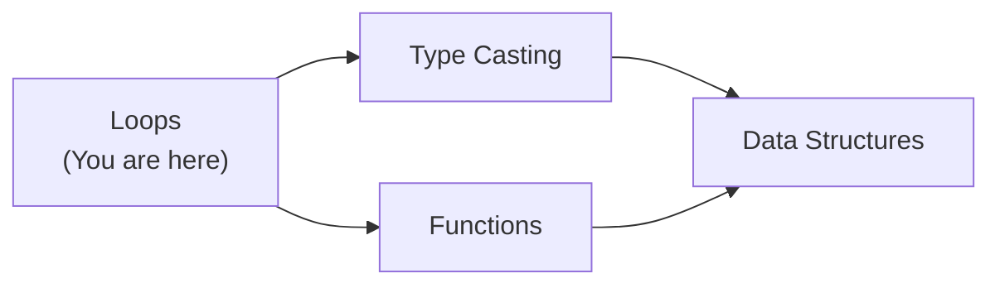
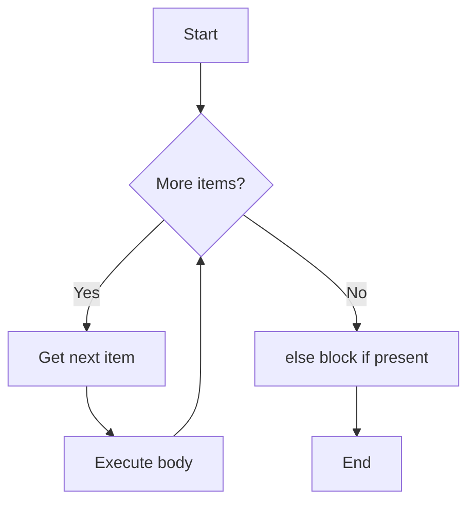
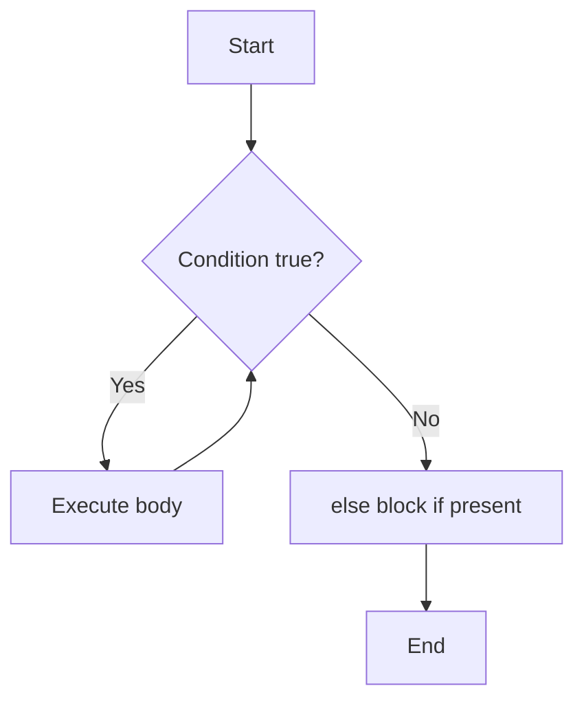

# Python Loops — Junior Level

## Table of Contents

1. [Introduction](#introduction)
2. [Prerequisites](#prerequisites)
3. [Glossary](#glossary)
4. [Core Concepts](#core-concepts)
5. [Real-World Analogies](#real-world-analogies)
6. [Mental Models](#mental-models)
7. [Pros & Cons](#pros--cons)
8. [Use Cases](#use-cases)
9. [Code Examples](#code-examples)
10. [Clean Code](#clean-code)
11. [Product Use / Feature](#product-use--feature)
12. [Error Handling](#error-handling)
13. [Security Considerations](#security-considerations)
14. [Performance Tips](#performance-tips)
15. [Metrics & Analytics](#metrics--analytics)
16. [Best Practices](#best-practices)
17. [Edge Cases & Pitfalls](#edge-cases--pitfalls)
18. [Common Mistakes](#common-mistakes)
19. [Common Misconceptions](#common-misconceptions)
20. [Tricky Points](#tricky-points)
21. [Test](#test)
22. [Tricky Questions](#tricky-questions)
23. [Cheat Sheet](#cheat-sheet)
24. [Self-Assessment Checklist](#self-assessment-checklist)
25. [Summary](#summary)
26. [What You Can Build](#what-you-can-build)
27. [Further Reading](#further-reading)
28. [Related Topics](#related-topics)
29. [Diagrams & Visual Aids](#diagrams--visual-aids)

---

## Introduction

> Focus: "What is it?" and "How to use it?"

**Loops** let you repeat a block of code multiple times without writing it over and over. Every program that processes lists, reads files, or waits for user input relies on loops. Python provides two main loop types: `for` (iterate over a sequence) and `while` (repeat while a condition is true).

---

## Prerequisites

What you should know before studying this topic:

- **Required:** Basic Python syntax — how to write and run a `.py` file
- **Required:** Variables and data types — understanding strings, integers, lists
- **Required:** Conditionals (`if`/`elif`/`else`) — loops often contain conditions
- **Helpful but not required:** Functions — helps organize loop-heavy code

---

## Glossary

| Term | Definition |
|------|-----------|
| **Iteration** | One pass through the body of a loop |
| **Iterable** | Any object you can loop over (list, string, range, dict, set, file) |
| **Iterator** | An object that produces the next value on demand (`__next__()`) |
| **`for` loop** | A loop that iterates over each element in a sequence |
| **`while` loop** | A loop that repeats as long as a condition is `True` |
| **`break`** | Immediately exits the loop |
| **`continue`** | Skips the rest of the current iteration and jumps to the next one |
| **`range()`** | Built-in that generates a sequence of integers |
| **`enumerate()`** | Wraps an iterable and yields `(index, value)` pairs |
| **`zip()`** | Combines two or more iterables element by element |

---

## Core Concepts

### Concept 1: The `for` Loop

The `for` loop iterates over each element in an iterable. Python does **not** use C-style `for(i=0; i<n; i++)`; instead, it iterates directly over items.

```python
fruits = ["apple", "banana", "cherry"]
for fruit in fruits:
    print(fruit)
# Output: apple, banana, cherry (one per line)
```

### Concept 2: The `while` Loop

The `while` loop keeps running as long as its condition evaluates to `True`. You must ensure the condition eventually becomes `False`, or you get an infinite loop.

```python
count = 0
while count < 5:
    print(count)
    count += 1
# Output: 0, 1, 2, 3, 4
```

### Concept 3: `range()`

`range()` generates a sequence of integers. It takes up to three arguments: `range(start, stop, step)`. The `stop` value is **exclusive**.

```python
for i in range(5):         # 0, 1, 2, 3, 4
    print(i)

for i in range(2, 8):      # 2, 3, 4, 5, 6, 7
    print(i)

for i in range(0, 10, 2):  # 0, 2, 4, 6, 8
    print(i)
```

### Concept 4: `enumerate()`

When you need both the index and the value while looping, use `enumerate()` instead of manual index tracking.

```python
colors = ["red", "green", "blue"]
for index, color in enumerate(colors):
    print(f"{index}: {color}")
# 0: red
# 1: green
# 2: blue
```

### Concept 5: `zip()`

`zip()` pairs elements from multiple iterables together. It stops at the shortest iterable.

```python
names = ["Alice", "Bob", "Charlie"]
scores = [85, 92, 78]
for name, score in zip(names, scores):
    print(f"{name}: {score}")
# Alice: 85
# Bob: 92
# Charlie: 78
```

### Concept 6: `break` and `continue`

- `break` exits the loop entirely.
- `continue` skips the current iteration and moves to the next.

```python
# break — stop at first negative number
numbers = [3, 7, -1, 4, 9]
for n in numbers:
    if n < 0:
        break
    print(n)
# Output: 3, 7

# continue — skip odd numbers
for n in range(6):
    if n % 2 != 0:
        continue
    print(n)
# Output: 0, 2, 4
```

### Concept 7: `else` Clause on Loops

Python loops can have an `else` block that runs **only if the loop completes without hitting `break`**.

```python
for n in [2, 4, 6]:
    if n % 2 != 0:
        break
else:
    print("All numbers are even!")
# Output: All numbers are even!
```

### Concept 8: Nested Loops

A loop inside another loop. The inner loop runs completely for each iteration of the outer loop.

```python
for row in range(3):
    for col in range(3):
        print(f"({row},{col})", end=" ")
    print()
# (0,0) (0,1) (0,2)
# (1,0) (1,1) (1,2)
# (2,0) (2,1) (2,2)
```

### Concept 9: Iterating Over Different Data Types

```python
# Strings
for char in "Python":
    print(char, end=" ")  # P y t h o n

# Dictionaries
person = {"name": "Alice", "age": 30}
for key, value in person.items():
    print(f"{key}: {value}")

# Sets
unique = {1, 2, 3}
for item in unique:
    print(item)
```

### Concept 10: List Comprehensions (Basics)

A concise way to create a new list by transforming or filtering elements.

```python
# Traditional loop
squares = []
for x in range(5):
    squares.append(x ** 2)

# List comprehension — same result
squares = [x ** 2 for x in range(5)]
# [0, 1, 4, 9, 16]

# With filter
evens = [x for x in range(10) if x % 2 == 0]
# [0, 2, 4, 6, 8]
```

---

## Real-World Analogies

| Concept | Analogy |
|---------|--------|
| **`for` loop** | Reading each page of a book one by one — you go through every page from start to finish |
| **`while` loop** | Stirring soup until it boils — you keep stirring as long as the condition (not boiling) holds |
| **`break`** | Finding your keys and stopping the search — once found, you stop looking through drawers |
| **`continue`** | Skipping a song you don't like in a playlist — the playlist keeps playing, you just skip one |

---

## Mental Models

**The intuition:** Think of a `for` loop as a conveyor belt — items come one at a time, you process each, and they move on. A `while` loop is like a traffic light — it keeps cycling until the condition changes.

**Why this model helps:** It makes clear that `for` is best when you know what you're iterating over, and `while` is best when you're waiting for a condition to change.

---

## Pros & Cons

| Pros | Cons |
|------|------|
| Eliminates code duplication | Infinite loops if condition never becomes `False` |
| Makes code readable and compact | Deeply nested loops hurt readability |
| `for` loops handle iteration automatically | `while` loops require manual state management |
| List comprehensions are very Pythonic | List comprehensions can be hard to read if overly complex |

### When to use:
- Processing every item in a collection
- Repeating an action until a condition is met
- Building new lists/dicts from existing data

### When NOT to use:
- When a built-in function like `sum()`, `max()`, `map()` does the job
- When recursion is more natural (e.g., tree traversal)

---

## Use Cases

- **Use Case 1:** Reading lines from a file — `for line in open("data.txt")`
- **Use Case 2:** Processing API responses — looping through a list of JSON records
- **Use Case 3:** User input validation — `while` loop until valid input is entered
- **Use Case 4:** Building transformed data — list comprehension to clean a dataset

---

## Code Examples

### Example 1: Counting Word Frequencies

```python
# Count how many times each word appears in a sentence
sentence = "the cat sat on the mat the cat"
words = sentence.split()

word_count = {}
for word in words:
    if word in word_count:
        word_count[word] += 1
    else:
        word_count[word] = 1

print(word_count)
# {'the': 3, 'cat': 2, 'sat': 1, 'on': 1, 'mat': 1}
```

**What it does:** Splits a sentence into words and counts each word's occurrences.
**How to run:** `python word_count.py`

### Example 2: FizzBuzz

```python
# Classic FizzBuzz problem
for i in range(1, 21):
    if i % 15 == 0:
        print("FizzBuzz")
    elif i % 3 == 0:
        print("Fizz")
    elif i % 5 == 0:
        print("Buzz")
    else:
        print(i)
```

**What it does:** Prints numbers 1-20, replacing multiples of 3 with "Fizz", multiples of 5 with "Buzz", and multiples of both with "FizzBuzz".

### Example 3: User Input Loop

```python
# Keep asking until valid input
while True:
    age_str = input("Enter your age: ")
    if age_str.isdigit() and int(age_str) > 0:
        age = int(age_str)
        break
    print("Invalid input. Please enter a positive number.")

print(f"Your age is {age}")
```

**What it does:** Repeatedly prompts the user for input until a valid positive integer is entered.

### Example 4: Multiplication Table with Nested Loops

```python
# Print a 5x5 multiplication table
for i in range(1, 6):
    for j in range(1, 6):
        print(f"{i * j:4}", end="")
    print()
# Output:
#    1   2   3   4   5
#    2   4   6   8  10
#    3   6   9  12  15
#    4   8  12  16  20
#    5  10  15  20  25
```

### Example 5: Using `enumerate()` and `zip()` Together

```python
# Pair students with grades and display with rank
students = ["Alice", "Bob", "Charlie"]
grades = [95, 87, 92]

for rank, (student, grade) in enumerate(zip(students, grades), start=1):
    print(f"Rank {rank}: {student} — {grade} points")
# Rank 1: Alice — 95 points
# Rank 2: Bob — 87 points
# Rank 3: Charlie — 92 points
```

---

## Clean Code

### Naming (PEP 8 conventions)

```python
# ❌ Bad — single-letter or unclear names
for x in y:
    d[x] = d.get(x, 0) + 1

# ✅ Clean — descriptive names
for word in words:
    word_count[word] = word_count.get(word, 0) + 1
```

### Short Functions

```python
# ❌ Too long — loop + process + save in one block
for item in items:
    # 20 lines of validation
    # 20 lines of transformation
    # 10 lines of saving
    ...

# ✅ Extract into functions
for item in items:
    validated = validate(item)
    transformed = transform(validated)
    save(transformed)
```

### Use Pythonic Idioms

```python
# ❌ C-style index loop
for i in range(len(items)):
    print(items[i])

# ✅ Pythonic — iterate directly
for item in items:
    print(item)

# ❌ Manual counter
i = 0
for item in items:
    print(i, item)
    i += 1

# ✅ Use enumerate
for i, item in enumerate(items):
    print(i, item)
```

---

## Product Use / Feature

### 1. Django ORM

- **How it uses Loops:** QuerySet iteration — `for user in User.objects.all()` lazily fetches rows from the database
- **Why it matters:** Understanding loops helps you process database records efficiently

### 2. pandas

- **How it uses Loops:** `iterrows()`, `itertuples()`, and vectorized operations replace explicit loops
- **Why it matters:** Knowing when to loop vs. vectorize is crucial for data work

### 3. Flask/FastAPI

- **How it uses Loops:** Template rendering loops (`` in Jinja2), processing request data
- **Why it matters:** Every web app loops over data to render pages or process forms

---

## Error Handling

### Error 1: `TypeError` — Iterating Over Non-Iterable

```python
# ❌ This causes TypeError
for item in 42:
    print(item)
# TypeError: 'int' object is not iterable
```

**Why it happens:** You can only loop over iterables (lists, strings, ranges, etc.), not plain integers.
**How to fix:**

```python
# ✅ Use range() for counting
for item in range(42):
    print(item)
```

### Error 2: `IndexError` — Manual Index Out of Range

```python
# ❌ Off-by-one error
items = [10, 20, 30]
for i in range(len(items) + 1):
    print(items[i])  # IndexError when i == 3
```

**Why it happens:** `range(len(items) + 1)` generates one extra index.
**How to fix:**

```python
# ✅ Use range(len(items)) or iterate directly
for item in items:
    print(item)
```

### Error 3: Modifying a List While Iterating

```python
# ❌ Causes skipped elements or RuntimeError with dicts
numbers = [1, 2, 3, 4, 5]
for n in numbers:
    if n % 2 == 0:
        numbers.remove(n)
print(numbers)  # [1, 3, 5]? No — result is [1, 3, 5] sometimes, but unreliable
```

**How to fix:**

```python
# ✅ Create a new list
numbers = [1, 2, 3, 4, 5]
numbers = [n for n in numbers if n % 2 != 0]
print(numbers)  # [1, 3, 5]
```

---

## Security Considerations

### 1. Infinite Loop Denial of Service

```python
# ❌ User-controlled loop without limit
user_count = int(input("How many times? "))
for i in range(user_count):
    expensive_operation()

# ✅ Set a maximum limit
MAX_ITERATIONS = 10_000
user_count = min(int(input("How many times? ")), MAX_ITERATIONS)
for i in range(user_count):
    expensive_operation()
```

**Risk:** A malicious user could request billions of iterations, exhausting CPU.
**Mitigation:** Always cap loop counts from user input.

### 2. Never Use `eval()` in a Loop

```python
# ❌ Extremely dangerous — arbitrary code execution
commands = ["print('hi')", "__import__('os').system('rm -rf /')"]
for cmd in commands:
    eval(cmd)

# ✅ Use a whitelist of allowed operations
ALLOWED = {"greet": lambda: print("hi")}
for cmd_name in command_names:
    if cmd_name in ALLOWED:
        ALLOWED[cmd_name]()
```

---

## Performance Tips

### Tip 1: Use List Comprehensions Over Manual Loops

```python
# ❌ Slower
result = []
for x in range(10000):
    result.append(x ** 2)

# ✅ Faster — runs at C speed internally
result = [x ** 2 for x in range(10000)]
```

**Why it's faster:** List comprehensions are optimized at the bytecode level and avoid repeated `.append()` method lookups.

### Tip 2: Avoid Repeated Lookups in Loops

```python
# ❌ Slower — looks up len() every iteration
for i in range(len(data)):
    process(data[i])

# ✅ Faster — iterate directly
for item in data:
    process(item)
```

### Tip 3: Use `join()` Instead of String Concatenation in Loops

```python
# ❌ Very slow for large strings — creates new string each time
result = ""
for word in words:
    result += word + " "

# ✅ Much faster
result = " ".join(words)
```

---

## Metrics & Analytics

### What to Measure

| Metric | Why it matters | Tool |
|--------|---------------|------|
| **Loop execution time** | Identify slow loops | `time.perf_counter()` |
| **Iteration count** | Verify expected iterations | Manual counter |

### Basic Instrumentation

```python
import time

start = time.perf_counter()
for i in range(1_000_000):
    _ = i * i
elapsed = time.perf_counter() - start
print(f"Loop completed in {elapsed:.4f}s")
```

---

## Best Practices

- **Iterate directly** over items instead of using index-based access
- **Use `enumerate()`** when you need both index and value
- **Use `zip()`** to iterate over multiple sequences in parallel
- **Prefer list comprehensions** for simple transformations
- **Avoid modifying** the collection you are iterating over
- **Keep loop bodies short** — extract complex logic into functions

---

## Edge Cases & Pitfalls

### Pitfall 1: Modifying a List During Iteration

```python
# ❌ Skips elements
items = [1, 2, 3, 4, 5]
for item in items:
    if item == 2:
        items.remove(item)
print(items)  # [1, 3, 4, 5] — 3 was skipped!
```

**What happens:** When you remove an element, the list shifts left. The iterator advances and skips the next element.
**How to fix:** Use a list comprehension or iterate over a copy: `for item in items[:]:`

### Pitfall 2: `range()` Stop Value is Exclusive

```python
for i in range(5):
    print(i)  # Prints 0, 1, 2, 3, 4 — NOT 5
```

### Pitfall 3: Infinite `while` Loop

```python
# ❌ Forgot to update the condition variable
count = 0
while count < 5:
    print(count)
    # Missing: count += 1  — this runs forever!
```

---

## Common Mistakes

### Mistake 1: Using `range(len())` Instead of Direct Iteration

```python
# ❌ Unpythonic
for i in range(len(names)):
    print(names[i])

# ✅ Pythonic
for name in names:
    print(name)
```

### Mistake 2: Creating a List Just to Loop Over It

```python
# ❌ Wasteful — creates a list in memory
for item in list(range(1_000_000)):
    pass

# ✅ range() is already iterable — no list needed
for item in range(1_000_000):
    pass
```

### Mistake 3: Forgetting `break` in a `while True` Loop

```python
# ❌ Runs forever — no exit condition
while True:
    data = input("Enter data: ")
    process(data)
    # Missing break condition!
```

---

## Common Misconceptions

### Misconception 1: "`for` loops always use numbers"

**Reality:** Python `for` loops iterate over **any iterable** — lists, strings, dicts, files, generators, custom objects. They are not counter-based like C's `for` loop.

**Why people think this:** Other languages use `for(i=0; i<n; i++)`, which is index-based.

### Misconception 2: "`break` only works in `for` loops"

**Reality:** `break` works in both `for` and `while` loops. It exits the **innermost** loop only.

### Misconception 3: "List comprehensions are always better than loops"

**Reality:** List comprehensions are great for simple transformations, but complex logic with multiple conditions, side effects, or error handling should stay as regular loops for readability.

---

## Tricky Points

### Tricky Point 1: `else` on Loops

```python
for n in range(2, 10):
    for x in range(2, n):
        if n % x == 0:
            break
    else:
        print(f"{n} is prime")
# Output: 2 is prime, 3 is prime, 5 is prime, 7 is prime
```

**Why it's tricky:** The `else` runs when the loop finishes **without** `break`. Most beginners expect it to work like `if/else`.
**Key takeaway:** Think of it as "no-break" — the `else` runs when no `break` was triggered.

### Tricky Point 2: Loop Variable Scope

```python
for i in range(5):
    pass
print(i)  # 4 — the variable still exists after the loop!
```

**Why it's tricky:** In Python, loop variables are **not** scoped to the loop. They persist after the loop ends.
**Key takeaway:** The loop variable holds its last value after the loop completes.

---

## Test

### Multiple Choice

**1. What does `range(2, 8, 2)` produce?**

- A) `[2, 4, 6, 8]`
- B) `[2, 4, 6]`
- C) `[2, 3, 4, 5, 6, 7]`
- D) `[2, 8, 2]`

<details>
<summary>Answer</summary>
<strong>B)</strong> — <code>range(2, 8, 2)</code> starts at 2, goes up to (but not including) 8, stepping by 2. So it produces 2, 4, 6.
</details>

**2. What happens when `break` is executed inside a nested loop?**

- A) Both loops stop
- B) Only the innermost loop stops
- C) The program exits
- D) A `SyntaxError` occurs

<details>
<summary>Answer</summary>
<strong>B)</strong> — <code>break</code> only exits the innermost loop that contains it.
</details>

### True or False

**3. The `else` block of a `for` loop runs when the loop condition becomes `False`.**

<details>
<summary>Answer</summary>
<strong>False</strong> — A <code>for</code> loop doesn't have a "condition" that becomes <code>False</code>. The <code>else</code> block runs when the loop finishes iterating without hitting a <code>break</code>.
</details>

**4. `enumerate()` returns a list of tuples.**

<details>
<summary>Answer</summary>
<strong>False</strong> — <code>enumerate()</code> returns an <code>enumerate</code> object (an iterator), not a list. You can convert it to a list with <code>list(enumerate(...))</code>.
</details>

### What's the Output?

**5. What does this code print?**

```python
for i in range(3):
    pass
print(i)
```

<details>
<summary>Answer</summary>
Output: <code>2</code>
The loop variable <code>i</code> persists after the loop ends and holds its last value.
</details>

**6. What does this code print?**

```python
for i in range(5):
    if i == 3:
        break
else:
    print("done")
print(i)
```

<details>
<summary>Answer</summary>
Output: <code>3</code>
The <code>else</code> block does NOT run because <code>break</code> was executed. Only <code>print(i)</code> runs, and <code>i</code> is 3.
</details>

**7. What is the output?**

```python
nums = [1, 2, 3]
result = [x * 2 for x in nums if x != 2]
print(result)
```

<details>
<summary>Answer</summary>
Output: <code>[2, 6]</code>
The comprehension skips <code>x = 2</code> due to the filter <code>if x != 2</code>, then doubles 1 and 3.
</details>

---

## Tricky Questions

**1. What does `list(zip([1, 2, 3], [4, 5]))` return?**

- A) `[(1, 4), (2, 5), (3, None)]`
- B) `[(1, 4), (2, 5)]`
- C) `Error`
- D) `[(1, 4), (2, 5), (3,)]`

<details>
<summary>Answer</summary>
<strong>B)</strong> — <code>zip()</code> stops at the shortest iterable. The third element of the first list is dropped. Use <code>itertools.zip_longest()</code> to include all elements.
</details>

**2. How many times does this inner loop body execute?**

```python
for i in range(3):
    for j in range(4):
        pass
```

- A) 3
- B) 4
- C) 7
- D) 12

<details>
<summary>Answer</summary>
<strong>D)</strong> — The inner loop runs 4 times for each of the 3 outer iterations: 3 x 4 = 12.
</details>

---

## Cheat Sheet

| What | Syntax | Example |
|------|--------|---------|
| Basic for loop | `for x in iterable:` | `for x in [1,2,3]: print(x)` |
| While loop | `while condition:` | `while n < 10: n += 1` |
| Range (start, stop, step) | `range(start, stop, step)` | `range(0, 10, 2)` → 0,2,4,6,8 |
| Enumerate | `enumerate(iterable, start)` | `for i, v in enumerate(lst):` |
| Zip | `zip(iter1, iter2)` | `for a, b in zip(x, y):` |
| Break | `break` | Exit innermost loop |
| Continue | `continue` | Skip to next iteration |
| Else on loop | `for/while ... else:` | Runs if no `break` |
| List comprehension | `[expr for x in iter if cond]` | `[x*2 for x in range(5)]` |

---

## Self-Assessment Checklist

### I can explain:
- [ ] The difference between `for` and `while` loops
- [ ] What `break`, `continue`, and `else` do in loops
- [ ] How `range()`, `enumerate()`, and `zip()` work
- [ ] What an iterable vs. an iterator is

### I can do:
- [ ] Write a `for` loop over lists, strings, dicts, and sets
- [ ] Write a `while` loop with proper exit conditions
- [ ] Use nested loops for 2D data
- [ ] Write basic list comprehensions
- [ ] Debug infinite loops

---

## Summary

- **`for` loops** iterate over any iterable — prefer them when you know what you're iterating over
- **`while` loops** repeat until a condition becomes `False` — use them for unknown iteration counts
- **`range()`** generates integer sequences; **`enumerate()`** gives index+value; **`zip()`** pairs iterables
- **`break`** exits a loop; **`continue`** skips one iteration; **`else`** runs if no `break` occurred
- **List comprehensions** are concise one-liner loops for building new lists
- **Never modify** a list while iterating over it

**Next step:** Learn about Type Casting and how Python converts between data types.

---

## What You Can Build

### Projects you can create:
- **Number guessing game:** `while` loop that keeps asking until the user guesses correctly
- **File line counter:** `for` loop that reads and counts lines in a text file
- **Simple grade calculator:** Loop through student scores and compute averages

### Technologies / tools that use this:
- **Django / FastAPI** — looping over query results, template rendering
- **pandas** — understanding when to loop vs. use vectorized operations
- **Automation scripts** — processing files, directories, API responses

### Learning path:



---

## Further Reading

- **Official docs:** [Python `for` statement](https://docs.python.org/3/tutorial/controlflow.html#for-statements)
- **Official docs:** [Python `while` statement](https://docs.python.org/3/reference/compound_stmts.html#while)
- **Official docs:** [`range()`](https://docs.python.org/3/library/stdtypes.html#range)
- **Book:** Fluent Python (Ramalho), Chapter 17 — Iterables, Iterators, and Generators

---

## Related Topics

- **[Conditionals](../03-conditionals/)** — loops often contain `if/elif/else` logic
- **[Type Casting](../05-type-casting/)** — converting loop values between types
- **[List Comprehensions](../../02-data-structures/)** — advanced use of comprehension syntax
- **[Functions](../07-functions/)** — encapsulating loop logic into reusable functions

---

## Diagrams & Visual Aids

### `for` Loop Flow



### `while` Loop Flow



### Mind Map

```mermaid
mindmap
  root((Python Loops))
    for loop
      iterate over list
      iterate over string
      iterate over dict
      range()
      enumerate()
      zip()
    while loop
      condition-based
      infinite loop + break
      user input validation
    Control
      break
      continue
      else clause
    Patterns
      nested loops
      list comprehension
      loop + accumulator
```
