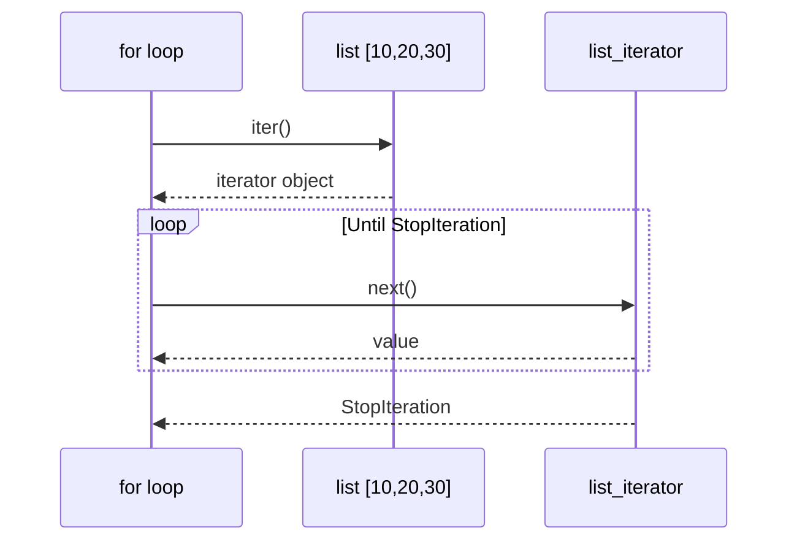
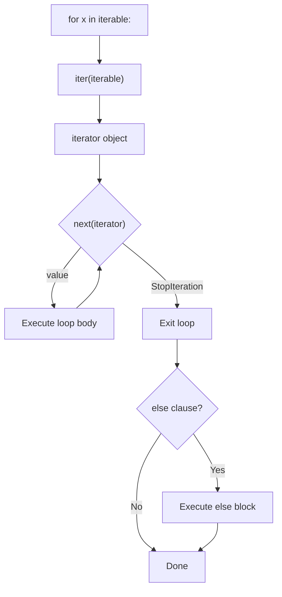
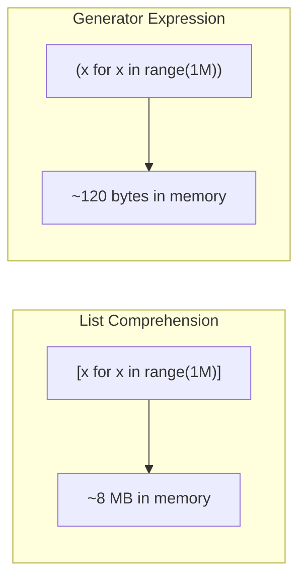
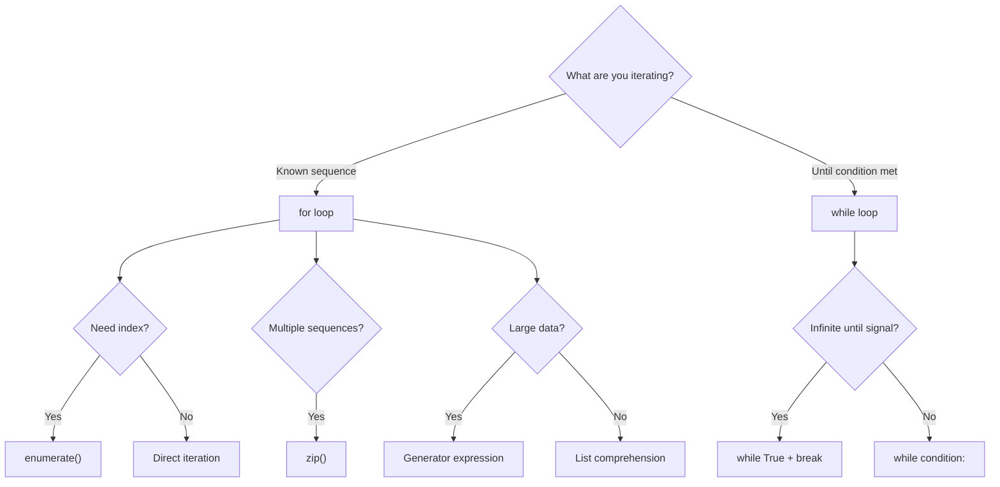

# Python Loops — Middle Level

## Table of Contents

1. [Introduction](#introduction)
2. [Core Concepts](#core-concepts)
3. [Evolution & Historical Context](#evolution--historical-context)
4. [Pros & Cons](#pros--cons)
5. [Alternative Approaches](#alternative-approaches)
6. [Use Cases](#use-cases)
7. [Code Examples](#code-examples)
8. [Coding Patterns](#coding-patterns)
9. [Clean Code](#clean-code)
10. [Product Use / Feature](#product-use--feature)
11. [Error Handling](#error-handling)
12. [Security Considerations](#security-considerations)
13. [Performance Optimization](#performance-optimization)
14. [Metrics & Analytics](#metrics--analytics)
15. [Debugging Guide](#debugging-guide)
16. [Best Practices](#best-practices)
17. [Edge Cases & Pitfalls](#edge-cases--pitfalls)
18. [Anti-Patterns](#anti-patterns)
19. [Comparison with Other Languages](#comparison-with-other-languages)
20. [Test](#test)
21. [Cheat Sheet](#cheat-sheet)
22. [Summary](#summary)
23. [Diagrams & Visual Aids](#diagrams--visual-aids)

---

## Introduction

> Focus: "Why?" and "When to use?"

At the middle level you already know `for` and `while`. Now we explore **why** Python loops behave the way they do, how the iterator protocol drives everything, how to pick the right looping construct for production code, and where performance traps hide.

Topics covered:
- Iterator protocol (`__iter__` / `__next__`)
- Generator functions and expressions
- `itertools` essentials
- Loop performance profiling with `timeit`
- GIL implications for loop-heavy code
- Type-hinted, production-ready loop patterns

---

## Core Concepts

### Concept 1: The Iterator Protocol

Every `for` loop in Python calls `iter()` on the iterable to get an iterator, then calls `next()` repeatedly until `StopIteration` is raised.

```python
nums = [10, 20, 30]
it = iter(nums)        # Get iterator
print(next(it))        # 10
print(next(it))        # 20
print(next(it))        # 30
# next(it) -> StopIteration
```



### Concept 2: Generator Functions

Generators are functions that `yield` values one at a time, creating an iterator lazily without storing all values in memory.

```python
from typing import Generator

def fibonacci(limit: int) -> Generator[int, None, None]:
    """Generate Fibonacci numbers up to limit."""
    a, b = 0, 1
    while a < limit:
        yield a
        a, b = b, a + b

for num in fibonacci(100):
    print(num, end=" ")
# 0 1 1 2 3 5 8 13 21 34 55 89
```

**Why generators matter:** They consume O(1) memory regardless of sequence length. A list of 10 million items takes ~80 MB; a generator takes ~120 bytes.

### Concept 3: Generator Expressions

Like list comprehensions but with parentheses — they produce values lazily.

```python
# List comprehension — stores all values in memory
squares_list = [x**2 for x in range(1_000_000)]  # ~8 MB

# Generator expression — lazy, O(1) memory
squares_gen = (x**2 for x in range(1_000_000))  # ~120 bytes

# Use when you only need to iterate once
total = sum(x**2 for x in range(1_000_000))
```

### Concept 4: `itertools` — The Loop Toolbox

```python
import itertools

# chain — flatten multiple iterables into one
for item in itertools.chain([1, 2], [3, 4], [5]):
    print(item, end=" ")  # 1 2 3 4 5

# product — cartesian product (replaces nested loops)
for a, b in itertools.product("AB", range(3)):
    print(f"{a}{b}", end=" ")  # A0 A1 A2 B0 B1 B2

# islice — slice an iterator (can't use [start:stop] on iterators)
for item in itertools.islice(range(100), 5, 10):
    print(item, end=" ")  # 5 6 7 8 9

# groupby — group consecutive identical elements
data = [("A", 1), ("A", 2), ("B", 3), ("B", 4)]
for key, group in itertools.groupby(data, key=lambda x: x[0]):
    print(key, list(group))
# A [('A', 1), ('A', 2)]
# B [('B', 3), ('B', 4)]
```

### Concept 5: Walrus Operator in Loops (Python 3.8+)

```python
import re

# ❌ Without walrus — repeated call
line = input()
while line != "quit":
    process(line)
    line = input()

# ✅ With walrus operator
while (line := input()) != "quit":
    process(line)

# Pattern matching in loops
pattern = re.compile(r"\d+")
text = "abc 123 def 456"
pos = 0
while (match := pattern.search(text, pos)):
    print(match.group())
    pos = match.end()
```

---

## Evolution & Historical Context

**Before iterators (Python 1.x):**
- Loops used `range()` which returned actual lists — `range(1_000_000)` created a million-element list
- No generators, no `yield` keyword

**Python 2.2 — Iterators and Generators (PEP 234, PEP 255):**
- The iterator protocol (`__iter__`, `__next__`) was formalized
- `yield` keyword introduced, enabling lazy evaluation

**Python 3.0:**
- `range()` became lazy (what was `xrange()` in Python 2)
- `zip()`, `map()`, `filter()` became lazy iterators
- `dict.keys()`, `dict.values()`, `dict.items()` return views, not lists

**Python 3.8 — Walrus Operator (PEP 572):**
- `:=` assignment expression allows assignment inside loop conditions

---

## Pros & Cons

| Pros | Cons |
|------|------|
| Iterator protocol makes any object loopable | GIL prevents true CPU parallelism in pure Python loops |
| Generators enable memory-efficient streaming | Generator exhaustion — can only iterate once |
| `itertools` eliminates complex nested loops | `itertools` has a learning curve |
| List comprehensions are 30-50% faster than equivalent `for` loops | Complex comprehensions sacrifice readability |

### Trade-off analysis:
- **Memory vs. Speed:** Generators save memory but add per-item overhead from `yield`/`next()`
- **Readability vs. Performance:** List comprehensions are faster but nested comprehensions are unreadable
- **GIL:** CPU-bound loops don't benefit from `threading`; use `multiprocessing` or NumPy instead

---

## Alternative Approaches

| Alternative | How it works | When to use |
|-------------|--------------|-------------|
| **`map()` + `filter()`** | Apply function to each element without explicit loop | Simple transformations, functional style |
| **NumPy vectorization** | C-level operations on arrays | Numerical computation, 10-100x faster |
| **`functools.reduce()`** | Accumulate values across iterable | When you need a single aggregated result |
| **Recursion** | Function calls itself | Tree/graph traversal, but beware stack limit (default 1000) |
| **`multiprocessing.Pool.map()`** | Parallel loop across CPU cores | CPU-bound loops, bypasses GIL |

---

## Use Cases

- **Use Case 1:** Streaming large CSV files — generator reads line by line, never loads entire file
- **Use Case 2:** FastAPI response streaming — `yield` chunks via `StreamingResponse`
- **Use Case 3:** ETL pipeline — `itertools.chain()` to merge data from multiple sources
- **Use Case 4:** Batch API calls — loop with `asyncio.gather()` for concurrent I/O

---

## Code Examples

### Example 1: Custom Iterator Class

```python
from typing import Iterator

class Countdown:
    """Iterator that counts down from n to 1."""

    def __init__(self, start: int) -> None:
        self.current = start

    def __iter__(self) -> Iterator[int]:
        return self

    def __next__(self) -> int:
        if self.current <= 0:
            raise StopIteration
        value = self.current
        self.current -= 1
        return value

for num in Countdown(5):
    print(num, end=" ")  # 5 4 3 2 1
```

### Example 2: Generator Pipeline (Lazy Processing)

```python
from typing import Generator, Iterable
import os

def read_lines(path: str) -> Generator[str, None, None]:
    """Lazily read lines from a file."""
    with open(path) as f:
        for line in f:
            yield line.strip()

def filter_non_empty(lines: Iterable[str]) -> Generator[str, None, None]:
    """Skip blank lines."""
    for line in lines:
        if line:
            yield line

def parse_csv_row(lines: Iterable[str]) -> Generator[list[str], None, None]:
    """Split each line by comma."""
    for line in lines:
        yield line.split(",")

# Pipeline — processes file lazily, O(1) memory
pipeline = parse_csv_row(filter_non_empty(read_lines("data.csv")))
for row in pipeline:
    print(row)
```

### Example 3: Replacing Nested Loops with `itertools.product`

```python
import itertools

# ❌ Deeply nested — hard to read
for size in ["S", "M", "L"]:
    for color in ["Red", "Blue"]:
        for material in ["Cotton", "Polyester"]:
            print(f"{size}-{color}-{material}")

# ✅ Flat with itertools.product
sizes = ["S", "M", "L"]
colors = ["Red", "Blue"]
materials = ["Cotton", "Polyester"]

for size, color, material in itertools.product(sizes, colors, materials):
    print(f"{size}-{color}-{material}")
```

---

## Coding Patterns

### Pattern 1: Sliding Window

```python
from typing import List
from collections import deque

def sliding_window_max(nums: List[int], k: int) -> List[int]:
    """Find maximum in each window of size k."""
    if not nums or k == 0:
        return []

    dq: deque[int] = deque()  # indices of potential maximums
    result: List[int] = []

    for i, num in enumerate(nums):
        # Remove elements outside window
        while dq and dq[0] < i - k + 1:
            dq.popleft()
        # Remove smaller elements — they can't be max
        while dq and nums[dq[-1]] < num:
            dq.pop()
        dq.append(i)

        if i >= k - 1:
            result.append(nums[dq[0]])

    return result

print(sliding_window_max([1, 3, -1, -3, 5, 3, 6, 7], 3))
# [3, 3, 5, 5, 6, 7]
```

### Pattern 2: Two Pointers

```python
def two_sum_sorted(nums: list[int], target: int) -> tuple[int, int] | None:
    """Find two indices whose values sum to target (sorted array)."""
    left, right = 0, len(nums) - 1
    while left < right:
        current = nums[left] + nums[right]
        if current == target:
            return left, right
        elif current < target:
            left += 1
        else:
            right -= 1
    return None

print(two_sum_sorted([1, 3, 5, 7, 11], 10))  # (1, 3) -> 3 + 7 = 10
```

### Pattern 3: Accumulator with `defaultdict`

```python
from collections import defaultdict
from typing import List, Dict

def group_by_length(words: List[str]) -> Dict[int, List[str]]:
    """Group words by their length."""
    groups: Dict[int, List[str]] = defaultdict(list)
    for word in words:
        groups[len(word)].append(word)
    return dict(groups)

print(group_by_length(["hi", "hello", "hey", "world"]))
# {2: ['hi'], 5: ['hello', 'world'], 3: ['hey']}
```

### Pattern 4: Batching / Chunking

```python
from typing import Generator, List, TypeVar

T = TypeVar("T")

def batch(items: List[T], size: int) -> Generator[List[T], None, None]:
    """Yield successive chunks of given size."""
    for i in range(0, len(items), size):
        yield items[i:i + size]

# Process large dataset in chunks of 100
data = list(range(350))
for chunk in batch(data, 100):
    print(f"Processing batch of {len(chunk)} items")
# Processing batch of 100 items
# Processing batch of 100 items
# Processing batch of 100 items
# Processing batch of 50 items
```

### Pattern 5: Retry Loop with Exponential Backoff

```python
import time
import random
from typing import TypeVar, Callable

T = TypeVar("T")

def retry_with_backoff(
    func: Callable[[], T],
    max_retries: int = 3,
    base_delay: float = 1.0,
) -> T:
    """Retry a function with exponential backoff and jitter."""
    for attempt in range(max_retries):
        try:
            return func()
        except Exception as e:
            if attempt == max_retries - 1:
                raise
            delay = base_delay * (2 ** attempt) + random.uniform(0, 1)
            print(f"Attempt {attempt + 1} failed: {e}. Retrying in {delay:.1f}s")
            time.sleep(delay)
    raise RuntimeError("Unreachable")  # for type checker

# Usage
# result = retry_with_backoff(lambda: requests.get("https://api.example.com").json())
```

---

## Clean Code

### Production-Quality Loop Naming

```python
# ❌ Cryptic
for d in ds:
    if d["s"] == "a":
        r.append(d)

# ✅ Self-documenting
for document in documents:
    if document["status"] == "active":
        active_docs.append(document)
```

### SOLID — Single Responsibility in Loops

```python
# ❌ Loop does too much: validate, transform, save
for record in records:
    if not record.get("email"):
        continue
    record["email"] = record["email"].lower()
    db.save(record)

# ✅ Separate concerns
validated = (r for r in records if r.get("email"))
normalized = ({**r, "email": r["email"].lower()} for r in validated)
for record in normalized:
    db.save(record)
```

---

## Product Use / Feature

### 1. FastAPI — Streaming Responses

- **How it uses Loops:** `StreamingResponse` accepts a generator that `yield`s chunks
- **Scale:** Handles files of arbitrary size with constant memory

### 2. pandas — `itertuples()` vs Vectorization

- **How it uses Loops:** `itertuples()` is 10x faster than `iterrows()`, but vectorized operations are 100x faster than both
- **Lesson:** Avoid explicit Python loops over DataFrames

### 3. Celery — Task Batching

- **How it uses Loops:** Groups tasks into batches using chunk patterns for distributed processing
- **Scale:** Millions of tasks processed in parallel

---

## Error Handling

### Pattern 1: Graceful Loop with Error Collection

```python
from dataclasses import dataclass, field
from typing import List

@dataclass
class ProcessingResult:
    successes: int = 0
    failures: int = 0
    errors: List[str] = field(default_factory=list)

def process_batch(items: List[dict]) -> ProcessingResult:
    result = ProcessingResult()
    for i, item in enumerate(items):
        try:
            validate_and_save(item)
            result.successes += 1
        except ValueError as e:
            result.failures += 1
            result.errors.append(f"Item {i}: {e}")
    return result
```

### Common Exception Patterns in Loops

| Situation | Pattern | Example |
|-----------|---------|---------|
| Skip bad items | `try/except` + `continue` | Log error, skip to next |
| Fail fast | `try/except` + `break` | First error stops all |
| Collect errors | Accumulate into list | Report all failures at end |
| Retry | Nested loop or helper | Exponential backoff |

---

## Security Considerations

### 1. ReDoS in Loop-Based Regex Matching

```python
import re

# ❌ Catastrophic backtracking — exponential time
evil_pattern = re.compile(r"(a+)+b")
# evil_pattern.match("a" * 30)  # hangs for minutes

# ✅ Use atomic groups or bounded quantifiers
safe_pattern = re.compile(r"a+b")
```

### 2. Resource Exhaustion via Unbounded Generators

```python
# ❌ No limit on data consumption
def read_all(stream):
    for chunk in stream:
        yield chunk  # could be infinite

# ✅ Add size limit
def read_limited(stream, max_bytes: int = 10_000_000):
    total = 0
    for chunk in stream:
        total += len(chunk)
        if total > max_bytes:
            raise ValueError("Data exceeds maximum allowed size")
        yield chunk
```

---

## Performance Optimization

### Optimization 1: List Comprehension vs. Loop with `append`

```python
import timeit

# ❌ Slow — method lookup + call overhead per iteration
def loop_append(n: int) -> list:
    result = []
    for i in range(n):
        result.append(i * i)
    return result

# ✅ Fast — C-level loop, no method lookup
def list_comp(n: int) -> list:
    return [i * i for i in range(n)]

n = 100_000
t1 = timeit.timeit(lambda: loop_append(n), number=100)
t2 = timeit.timeit(lambda: list_comp(n), number=100)
print(f"Loop append: {t1:.3f}s")
print(f"List comp:   {t2:.3f}s")
# Typical result: list comp is 30-50% faster
```

### Optimization 2: Local Variable Caching

```python
import timeit
import math

data = list(range(100_000))

# ❌ Slow — global function lookup each iteration
def slow():
    result = []
    for x in data:
        result.append(math.sqrt(x))
    return result

# ✅ Fast — cache function reference locally
def fast():
    sqrt = math.sqrt       # Local lookup is faster
    append = [].append     # But cleaner to use comprehension
    result = []
    _append = result.append
    _sqrt = math.sqrt
    for x in data:
        _append(_sqrt(x))
    return result

# ✅ Best — list comprehension
def fastest():
    sqrt = math.sqrt
    return [sqrt(x) for x in data]
```

### Performance Decision Matrix

| Scenario | Approach | Why |
|----------|----------|-----|
| Simple transform | List comprehension | 30-50% faster than loop |
| Large data, single pass | Generator expression | O(1) memory |
| Numerical computation | NumPy vectorization | 10-100x faster, C-level |
| CPU-bound loop | `multiprocessing` | Bypasses GIL |
| I/O-bound loop | `asyncio` / `threading` | Concurrent I/O |
| Nested loops (cartesian) | `itertools.product` | Flat, no nesting overhead |

---

## Metrics & Analytics

### Key Metrics

| Metric | Type | Description | Tool |
|--------|------|-------------|------|
| **Iterations/sec** | Counter | Loop throughput | `timeit` |
| **Memory per iteration** | Gauge | Memory consumption pattern | `memory_profiler` |
| **Total loop time** | Histogram | End-to-end duration | `time.perf_counter()` |

### Profiling a Loop

```python
import cProfile

def process_data():
    data = range(1_000_000)
    result = [x ** 2 for x in data if x % 2 == 0]
    return sum(result)

cProfile.run("process_data()")
```

---

## Debugging Guide

### Problem 1: Loop Runs Fewer Times Than Expected

**Diagnostic steps:**
1. Add `print(f"Iteration {i}")` at the start of the body
2. Check if `break` or `continue` is triggered early
3. Verify the iterable length: `print(len(items))`
4. Check if you are modifying the collection during iteration

### Problem 2: Generator Appears Empty

**Cause:** Generator was already consumed.

```python
gen = (x for x in range(5))
list(gen)  # [0, 1, 2, 3, 4]
list(gen)  # [] — exhausted!
```

**Fix:** Use `itertools.tee()` or recreate the generator.

### Useful Tools

| Tool | Command | What it shows |
|------|---------|---------------|
| `timeit` | `python -m timeit "..."` | Precise loop timing |
| `cProfile` | `python -m cProfile script.py` | Function-level CPU time |
| `line_profiler` | `kernprof -l -v script.py` | Line-by-line timing |
| `memory_profiler` | `python -m memory_profiler script.py` | Memory per line |

---

## Best Practices

- **Use generators** for large data — avoid loading everything into memory
- **Prefer `itertools`** over hand-written nested loops
- **Use type hints** on generator functions: `Generator[YieldType, SendType, ReturnType]`
- **Profile before optimizing** — use `timeit` to measure actual impact
- **Avoid premature optimization** — readable code first, optimize hot loops later
- **Use `enumerate()`** instead of manual counters
- **Cap iteration counts** for user-supplied data to prevent DoS

---

## Edge Cases & Pitfalls

### Pitfall 1: Late Binding Closures in Loops

```python
# ❌ All lambdas capture the SAME variable
funcs = [lambda: i for i in range(5)]
print([f() for f in funcs])  # [4, 4, 4, 4, 4]

# ✅ Capture by default argument
funcs = [lambda i=i: i for i in range(5)]
print([f() for f in funcs])  # [0, 1, 2, 3, 4]
```

### Pitfall 2: Generator Exhaustion

```python
gen = (x for x in range(3))
print(3 in gen)  # True (consumes 0, 1, 2, 3)
print(2 in gen)  # False — generator is exhausted
```

### Pitfall 3: `dict` Ordering Assumptions

```python
# Since Python 3.7, dicts maintain insertion order.
# But relying on iteration order in algorithms that
# require sorting is still a bug.
d = {"b": 2, "a": 1}
for k in d:
    print(k)  # b, a — insertion order, NOT alphabetical
```

---

## Anti-Patterns

### Anti-Pattern 1: Using a Loop When a Built-in Exists

```python
# ❌ Manual loop for sum
total = 0
for n in numbers:
    total += n

# ✅ Built-in
total = sum(numbers)

# ❌ Manual loop for existence check
found = False
for item in items:
    if item == target:
        found = True
        break

# ✅ Use `in` operator
found = target in items
```

### Anti-Pattern 2: Appending to String in a Loop

```python
# ❌ O(n^2) — creates a new string every iteration
result = ""
for word in words:
    result += word + " "

# ✅ O(n) — single allocation
result = " ".join(words)
```

---

## Comparison with Other Languages

| Aspect | Python | JavaScript | Go | Rust | Java |
|--------|--------|-----------|-----|------|------|
| For-each | `for x in items:` | `for (x of items)` | `for _, x := range items` | `for x in &items` | `for (var x : items)` |
| Index loop | `for i in range(n):` | `for (let i=0; i<n; i++)` | `for i := 0; i < n; i++` | `for i in 0..n` | `for (int i=0; i<n; i++)` |
| Generators | `yield` keyword | `function*` | No direct equivalent | `impl Iterator` | No direct equivalent |
| Lazy range | `range()` is lazy | No built-in lazy range | N/A | `0..n` is lazy | `IntStream.range()` |
| Loop else | `for...else` | Not available | Not available | Not available | Not available |
| Parallel iteration | `zip()` | Manual index | Multiple range vars | `.zip()` on iterators | Manual index |

### Key differences:
- **Python vs JavaScript:** Python's `for` always iterates over iterables; JS has `for...of`, `for...in`, and C-style `for`
- **Python vs Go:** Go's `range` returns index+value; Python's `enumerate()` is equivalent
- **Python vs Rust:** Rust iterators are zero-cost abstractions; Python iterators have per-call overhead

---

## Test

### Multiple Choice

**1. What is the output?**

```python
gen = (x for x in range(5))
print(sum(gen))
print(sum(gen))
```

- A) `10` then `10`
- B) `10` then `0`
- C) `10` then `StopIteration`
- D) `Error`

<details>
<summary>Answer</summary>
<strong>B)</strong> — The generator is exhausted after the first <code>sum()</code>. The second <code>sum()</code> gets an empty iterator and returns 0.
</details>

**2. What does `itertools.chain([1,2], [3,4])` return?**

- A) `[[1,2], [3,4]]`
- B) `[1, 2, 3, 4]`
- C) An iterator yielding `1, 2, 3, 4`
- D) `(1, 2, 3, 4)`

<details>
<summary>Answer</summary>
<strong>C)</strong> — <code>itertools.chain</code> returns a <strong>lazy iterator</strong>, not a list. Use <code>list()</code> to materialize it.
</details>

**3. What is the output?**

```python
funcs = [lambda: i for i in range(3)]
print(funcs[0]())
```

- A) `0`
- B) `1`
- C) `2`
- D) `Error`

<details>
<summary>Answer</summary>
<strong>C)</strong> — Late binding closure. All lambdas reference the same variable <code>i</code>, which is 2 after the loop.
</details>

### Code Analysis

**4. What does this generator produce?**

```python
def gen():
    for i in range(3):
        yield i
        yield i * 10

print(list(gen()))
```

<details>
<summary>Answer</summary>
<code>[0, 0, 1, 10, 2, 20]</code> — Each iteration yields twice: the value and the value times 10.
</details>

**5. What is the output?**

```python
result = []
for i in range(3):
    for j in range(3):
        if j == 1:
            break
        result.append((i, j))
print(result)
```

<details>
<summary>Answer</summary>
<code>[(0, 0), (1, 0), (2, 0)]</code> — <code>break</code> exits only the inner loop. The outer loop continues. Each inner loop only processes j=0 before breaking at j=1.
</details>

**6. What happens here?**

```python
d = {"a": 1, "b": 2, "c": 3}
for key in d:
    if key == "b":
        del d[key]
```

<details>
<summary>Answer</summary>
<code>RuntimeError: dictionary changed size during iteration</code> — You cannot modify a dict's size while iterating over it. Use <code>for key in list(d):</code> instead.
</details>

### True or False

**7. `range(10)` creates a list of 10 integers in memory.**

<details>
<summary>Answer</summary>
<strong>False</strong> — In Python 3, <code>range()</code> is a lazy sequence. It computes values on demand and uses O(1) memory regardless of size.
</details>

**8. A generator function can be iterated over multiple times.**

<details>
<summary>Answer</summary>
<strong>False</strong> — A generator object can only be iterated once. After exhaustion, calling <code>next()</code> raises <code>StopIteration</code>. You must call the generator function again to create a new generator object.
</details>

---

## Cheat Sheet

| Scenario | Pattern | Key consideration |
|----------|---------|-------------------|
| Lazy iteration | `(x for x in ...)` | One-time use, O(1) memory |
| Flatten nested | `itertools.chain.from_iterable()` | Lazy, no intermediate list |
| Cartesian product | `itertools.product(a, b)` | Replaces nested loops |
| Batch/chunk | `range(0, len(data), size)` | Slice in loop body |
| Retry | `for attempt in range(max):` | `try/except` + `break` on success |
| Parallel zip | `zip(a, b)` | Stops at shortest |
| Parallel zip (longest) | `itertools.zip_longest(a, b)` | Fills with `fillvalue` |
| Custom iterator | `__iter__` + `__next__` | Raise `StopIteration` to end |

---

## Summary

- **Iterator protocol** (`__iter__`/`__next__`) powers all Python loops
- **Generators** enable lazy evaluation with `yield` — use for large/infinite sequences
- **`itertools`** replaces hand-written complex loops with efficient, readable alternatives
- **List comprehensions** are 30-50% faster than `for` + `append` for simple transforms
- **Late binding closures** are the #1 loop-related bug at the middle level
- **Never modify** a collection's size during iteration — use copies or comprehensions
- **Profile first** with `timeit` and `cProfile` before optimizing loops

**Next step:** Explore Senior-level loop optimization — bytecode analysis, C extensions, and async iteration.

---

## Diagrams & Visual Aids

### Iterator Protocol Flow



### Generator vs List Memory



### Loop Selection Decision Tree


