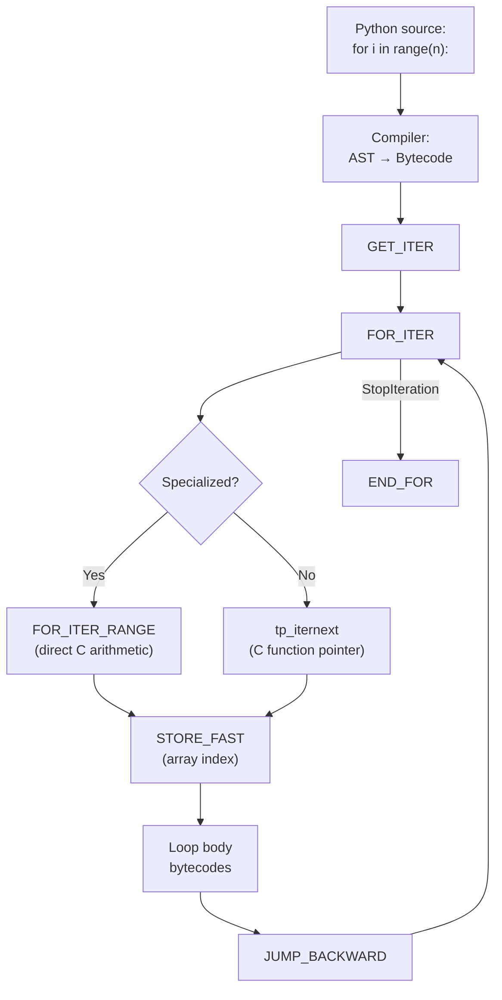
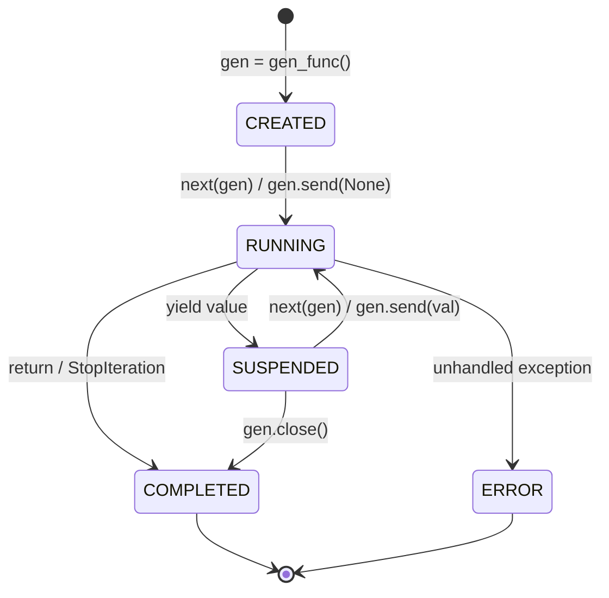
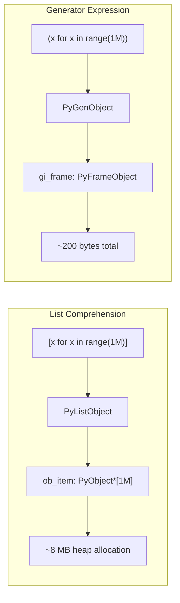

# Python Loops — Professional Level

## Table of Contents

1. [Introduction](#introduction)
2. [CPython Bytecode Analysis](#cpython-bytecode-analysis)
3. [Loop Optimization in CPython](#loop-optimization-in-cpython)
4. [The Iterator Protocol at C Level](#the-iterator-protocol-at-c-level)
5. [GIL and Loop Performance](#gil-and-loop-performance)
6. [Memory Layout and Reference Counting](#memory-layout-and-reference-counting)
7. [Specialized Bytecode (Python 3.11+)](#specialized-bytecode-python-311)
8. [Generator Internals](#generator-internals)
9. [Comparison: CPython vs PyPy Loop Performance](#comparison-cpython-vs-pypy-loop-performance)
10. [Diagrams & Visual Aids](#diagrams--visual-aids)

---

## Introduction

> Focus: "What happens under the hood?"

At the professional level, we look inside CPython to understand:
- How the bytecode compiler translates loops
- What opcodes execute during `for` and `while` iterations
- How the GIL affects loop-heavy code
- How Python 3.11+ adaptive specialization speeds up loops
- Generator frame suspension at the C level

---

## CPython Bytecode Analysis

### Disassembling a `for` Loop

```python
import dis

def simple_for():
    result = []
    for i in range(10):
        result.append(i * 2)
    return result

dis.dis(simple_for)
```

```
  # Bytecode output (Python 3.12):
  2           RESUME                   0

  3           BUILD_LIST               0
              STORE_FAST               0 (result)

  4           LOAD_GLOBAL              0 (range)
              LOAD_CONST               1 (10)
              CALL                     1
              GET_ITER
        >>    FOR_ITER                 14 (to 52)
              STORE_FAST               1 (i)

  5           LOAD_FAST                0 (result)
              LOAD_ATTR                1 (append)
              LOAD_FAST                1 (i)
              LOAD_CONST               2 (2)
              BINARY_OP                5 (*)
              CALL                     1
              POP_TOP
              JUMP_BACKWARD            16 (to 22)

        >>    END_FOR

  6           LOAD_FAST                0 (result)
              RETURN_VALUE
```

**Key opcodes explained:**

| Opcode | What it does |
|--------|-------------|
| `GET_ITER` | Calls `iter()` on the iterable (TOS), pushes iterator |
| `FOR_ITER` | Calls `__next__()` on iterator. If `StopIteration`, jumps to `END_FOR` |
| `STORE_FAST` | Stores TOS in local variable (fast slot) |
| `JUMP_BACKWARD` | Unconditional jump back to `FOR_ITER` |
| `END_FOR` | Cleans up iterator from stack |

### Disassembling a `while` Loop

```python
import dis

def simple_while():
    i = 0
    while i < 10:
        i += 1
    return i

dis.dis(simple_while)
```

```
  2           RESUME                   0
              LOAD_CONST               1 (0)
              STORE_FAST               0 (i)

  3     >>    LOAD_FAST                0 (i)
              LOAD_CONST               2 (10)
              COMPARE_OP               2 (<)
              POP_JUMP_IF_FALSE        10 (to 34)

  4           LOAD_FAST                0 (i)
              LOAD_CONST               3 (1)
              BINARY_OP               13 (+=)
              STORE_FAST               0 (i)
              JUMP_BACKWARD            12 (to 10)

  5     >>    LOAD_FAST                0 (i)
              RETURN_VALUE
```

**Key insight:** A `while` loop uses `COMPARE_OP` + `POP_JUMP_IF_FALSE` on each iteration, while a `for` loop uses `FOR_ITER` which is a single opcode that handles both the `next()` call and the `StopIteration` check.

### List Comprehension Bytecode

```python
import dis

def list_comp():
    return [i * 2 for i in range(10)]

dis.dis(list_comp)
```

```
  # Python 3.12 inlines comprehensions (no separate code object)
  2           RESUME                   0
              LOAD_GLOBAL              0 (range)
              LOAD_CONST               1 (10)
              CALL                     1
              GET_ITER
              LOAD_FAST_AND_CLEAR      0 (i)
              SWAP                     2
              BUILD_LIST               0
              SWAP                     2
        >>    FOR_ITER                 7 (to 44)
              STORE_FAST               0 (i)
              LOAD_FAST                0 (i)
              LOAD_CONST               2 (2)
              BINARY_OP                5 (*)
              LIST_APPEND              2
              JUMP_BACKWARD            9 (to 26)
        >>    END_FOR
              SWAP                     2
              STORE_FAST               0 (i)
              RETURN_VALUE
```

**Why comprehensions are faster:** `LIST_APPEND` is a single opcode that directly calls `list.append` at the C level, bypassing Python method lookup and call overhead. Compare this to the `for` loop version which does `LOAD_ATTR` (append) + `CALL`.

---

## Loop Optimization in CPython

### Peephole Optimizer

CPython's bytecode compiler applies peephole optimizations:

```python
import dis

# Constant folding — computed at compile time
def const_fold():
    for i in range(10):
        x = 2 * 3 * 4  # Compiler computes 24 at compile time

dis.dis(const_fold)
# LOAD_CONST shows 24, not 2, 3, 4 separately
```

### `LOAD_FAST` vs `LOAD_GLOBAL` vs `LOAD_DEREF`

```python
import dis
import timeit

x_global = 42

def loop_global():
    """Uses LOAD_GLOBAL — hash table lookup each time."""
    total = 0
    for i in range(1_000_000):
        total += x_global
    return total

def loop_local():
    """Uses LOAD_FAST — array index lookup (C array)."""
    x_local = 42
    total = 0
    for i in range(1_000_000):
        total += x_local
    return total

# LOAD_FAST is ~20-40% faster than LOAD_GLOBAL
# Because local variables are stored in a C array (f_localsplus)
# and accessed by index, while globals require dict lookup.

dis.dis(loop_global)  # Shows LOAD_GLOBAL
dis.dis(loop_local)   # Shows LOAD_FAST
```

**CPython frame layout:**

```
+---------------------------+
|     PyFrameObject         |
|---------------------------|
|  f_code: PyCodeObject*    |
|  f_locals: PyObject*      |  <- locals dict (only if needed)
|  f_localsplus[]:           |  <- C array for fast locals
|    [0] = total             |     LOAD_FAST 0
|    [1] = x_local           |     LOAD_FAST 1
|    [2] = i                 |     LOAD_FAST 2
+---------------------------+
```

### Why `range()` is Fast

`range()` is not a generator — it's a dedicated C type (`PyRangeObject`) with:
- O(1) `__contains__` — `999999 in range(1_000_000)` doesn't iterate
- O(1) `__len__` — computed mathematically
- Specialized `FOR_ITER` path in CPython that avoids boxing integers in some cases

```python
import timeit

# O(1) membership test — computed arithmetically
print(999_999_999 in range(1_000_000_000))  # True, instant

# vs O(n) for a generator
# print(999_999_999 in (x for x in range(1_000_000_000)))  # Very slow
```

---

## The Iterator Protocol at C Level

### CPython's `tp_iternext` Slot

Every iterable type in CPython has a `tp_iternext` C function pointer in its type object:

```c
// Simplified from CPython source: Objects/listobject.c
static PyObject *
listiter_next(listiterobject *it)
{
    PyListObject *seq = it->it_seq;
    if (seq == NULL)
        return NULL;

    if (it->it_index < PyList_GET_SIZE(seq)) {
        PyObject *item = PyList_GET_ITEM(seq, it->it_index);
        ++it->it_index;
        Py_INCREF(item);
        return item;
    }

    it->it_seq = NULL;
    Py_DECREF(seq);
    return NULL;  // signals StopIteration
}
```

**Key points:**
- No Python-level method call overhead — `tp_iternext` is a direct C function call
- `FOR_ITER` opcode calls `tp_iternext` directly via the type slot
- Returning `NULL` (without setting an exception) signals `StopIteration` at C level

### The `FOR_ITER` Opcode Implementation

```c
// Simplified from CPython source: Python/ceval.c
case TARGET(FOR_ITER): {
    PyObject *iter = TOP();
    PyObject *next = (*Py_TYPE(iter)->tp_iternext)(iter);
    if (next != NULL) {
        PUSH(next);
        DISPATCH();
    }
    if (_PyErr_Occurred(tstate)) {
        if (!_PyErr_ExceptionMatches(tstate, PyExc_StopIteration)) {
            goto error;
        }
        _PyErr_Clear(tstate);
    }
    /* iterator ended normally */
    STACK_SHRINK(1);
    Py_DECREF(iter);
    JUMPBY(oparg);  // jump to END_FOR
    DISPATCH();
}
```

---

## GIL and Loop Performance

### GIL Release Points in Loops

The GIL is released approximately every 5ms (controlled by `sys.getswitchinterval()`). In a tight loop:

```python
import sys
print(sys.getswitchinterval())  # 0.005 (5ms default)

# Tight CPU-bound loop — GIL is held for up to 5ms at a time
# Other threads are blocked during this time
def cpu_bound():
    total = 0
    for i in range(10_000_000):
        total += i * i
    return total
```

### When GIL is Released in Loops

| Operation in loop body | GIL released? | Why |
|----------------------|---------------|-----|
| Pure Python computation | No (held until switch interval) | Bytecode execution holds GIL |
| `time.sleep()` | Yes | C function releases GIL |
| File I/O (`open`, `read`) | Yes | C I/O functions release GIL |
| `socket.recv()` | Yes | Network I/O releases GIL |
| NumPy operations | Yes | C extension releases GIL |
| `re.match()` | Yes | Regex engine releases GIL |

### Measuring GIL Contention

```python
import threading
import time

def cpu_work(n: int) -> int:
    total = 0
    for i in range(n):
        total += i * i
    return total

N = 50_000_000

# Sequential — baseline
start = time.perf_counter()
cpu_work(N)
cpu_work(N)
sequential = time.perf_counter() - start

# Threaded — GIL prevents true parallelism
start = time.perf_counter()
t1 = threading.Thread(target=cpu_work, args=(N,))
t2 = threading.Thread(target=cpu_work, args=(N,))
t1.start(); t2.start()
t1.join(); t2.join()
threaded = time.perf_counter() - start

print(f"Sequential: {sequential:.2f}s")
print(f"Threaded:   {threaded:.2f}s")
# Threaded is often SLOWER due to GIL contention overhead!
```

---

## Memory Layout and Reference Counting

### Loop Variable Reference Counting

```python
import sys

# Each iteration: old reference is DECREF'd, new reference is INCREF'd
items = [object() for _ in range(5)]

for item in items:
    # At this point:
    # - 'item' holds a reference (refcount +1)
    # - items[i] still holds a reference
    print(sys.getrefcount(item))  # 3 (item, items[i], getrefcount arg)

# After the loop:
# 'item' still references the LAST element
print(sys.getrefcount(items[-1]))  # 3 (item, items[-1], getrefcount arg)
```

### Memory Impact of Loop Patterns

```python
import sys
import tracemalloc

tracemalloc.start()

# Pattern 1: List — all objects alive simultaneously
snapshot1_start = tracemalloc.take_snapshot()
data_list = [i ** 2 for i in range(100_000)]
total_list = sum(data_list)
snapshot1_end = tracemalloc.take_snapshot()

# Pattern 2: Generator — one object at a time
snapshot2_start = tracemalloc.take_snapshot()
total_gen = sum(i ** 2 for i in range(100_000))
snapshot2_end = tracemalloc.take_snapshot()

# Compare memory
stats1 = snapshot1_end.compare_to(snapshot1_start, "lineno")
stats2 = snapshot2_end.compare_to(snapshot2_start, "lineno")

print("List approach top allocations:")
for stat in stats1[:3]:
    print(f"  {stat}")

print("Generator approach top allocations:")
for stat in stats2[:3]:
    print(f"  {stat}")
```

---

## Specialized Bytecode (Python 3.11+)

### Adaptive Specialization

Python 3.11 introduced the **specializing adaptive interpreter**. Frequently executed bytecodes are replaced with type-specialized versions:

```python
import dis

def typed_loop():
    total = 0
    for i in range(1000):
        total += i
    return total

# After warming up (executing several times), CPython replaces:
# BINARY_OP (+=)  ->  BINARY_OP_ADD_INT  (specialized for int+int)
# LOAD_FAST       ->  LOAD_FAST__LOAD_FAST (superinstruction)
# FOR_ITER        ->  FOR_ITER_RANGE (specialized for range)

# You can see specialization stats:
# python -X showstatistics script.py (Python 3.12+)
```

### Specialized Opcodes for Loops

| Generic Opcode | Specialized Version | When Used |
|---------------|-------------------|-----------|
| `FOR_ITER` | `FOR_ITER_RANGE` | Iterating over `range()` |
| `FOR_ITER` | `FOR_ITER_LIST` | Iterating over a `list` |
| `FOR_ITER` | `FOR_ITER_TUPLE` | Iterating over a `tuple` |
| `BINARY_OP` | `BINARY_OP_ADD_INT` | `total += int_value` |
| `COMPARE_OP` | `COMPARE_OP_INT` | `i < n` with ints |
| `LOAD_ATTR` | `LOAD_ATTR_METHOD` | `list.append` method load |

### `FOR_ITER_RANGE` Optimization

```c
// Simplified from CPython 3.12 source
case TARGET(FOR_ITER_RANGE): {
    _PyRangeIterObject *r = (_PyRangeIterObject *)TOP();
    // Direct C-level integer comparison — no Python objects!
    if (r->index < r->len) {
        long value = r->start + (long)(r->index++) * r->step;
        // Create Python int only when needed
        PyObject *res = PyLong_FromLong(value);
        PUSH(res);
        DISPATCH();
    }
    // ... handle end of range
}
```

This is significantly faster than the generic `FOR_ITER` because:
1. No `tp_iternext` function pointer call
2. Direct C integer arithmetic (no PyObject overhead until the value is pushed)
3. Inlined into the eval loop

---

## Generator Internals

### Generator Frame Suspension

When a generator `yield`s, its entire execution frame is **suspended** — saved to the heap so it can be resumed later.

```python
import dis
import sys

def gen_example():
    x = 10
    yield x    # Frame is suspended here
    x += 20
    yield x    # Frame is suspended here again
    return x

# The generator object holds a reference to the frame
g = gen_example()
print(type(g))  # <class 'generator'>
print(g.gi_frame)  # <frame at 0x...> — the suspended frame
print(g.gi_frame.f_locals)  # {} (not yet started)

next(g)  # Runs until first yield
print(g.gi_frame.f_locals)  # {'x': 10}

next(g)  # Runs until second yield
print(g.gi_frame.f_locals)  # {'x': 30}

try:
    next(g)  # Raises StopIteration with value 30
except StopIteration as e:
    print(f"Return value: {e.value}")  # 30
    print(g.gi_frame)  # None — frame is released
```

### Generator Memory Layout

```
+------------------------+
|   PyGenObject          |
|------------------------|
|  gi_frame: PyFrame*    | -> Suspended frame (on heap)
|  gi_code: PyCode*      | -> Code object
|  gi_name: "gen_example"|
|  gi_qualname: ...      |
|  gi_weakreflist: ...   |
+------------------------+
         |
         v
+------------------------+
|   PyFrameObject        |
|------------------------|
|  f_code: PyCode*       |
|  f_lasti: 12           | <- Last executed bytecode offset
|  f_localsplus[]:       |
|    [0] = x (10)        | <- Local variables preserved
|  f_stacktop: ...       | <- Value stack state preserved
+------------------------+
```

### `yield from` at C Level

`yield from` doesn't just forward values — it creates a **delegation** that passes `send()`, `throw()`, and `close()` through:

```python
import dis

def delegator():
    yield from sub_gen()

def sub_gen():
    yield 1
    yield 2

dis.dis(delegator)
# Key opcode: SEND (Python 3.12) or GET_YIELD_FROM_ITER + YIELD_VALUE
```

The `SEND` opcode (Python 3.12+) handles the full delegation protocol in a single opcode, making `yield from` more efficient than manual delegation.

---

## Comparison: CPython vs PyPy Loop Performance

```python
"""
Benchmark comparing CPython and PyPy loop performance.
Run with both interpreters to see the difference.
"""
import time

def fibonacci_loop(n: int) -> int:
    a, b = 0, 1
    for _ in range(n):
        a, b = b, a + b
    return a

def matrix_multiply(n: int) -> list:
    A = [[i + j for j in range(n)] for i in range(n)]
    B = [[i * j for j in range(n)] for i in range(n)]
    C = [[0] * n for _ in range(n)]
    for i in range(n):
        for j in range(n):
            for k in range(n):
                C[i][j] += A[i][k] * B[k][j]
    return C

# Benchmark
for name, func, args in [
    ("fibonacci(1M)", fibonacci_loop, (1_000_000,)),
    ("matrix_mul(100)", matrix_multiply, (100,)),
]:
    start = time.perf_counter()
    func(*args)
    elapsed = time.perf_counter() - start
    print(f"{name}: {elapsed:.3f}s")

# Typical results:
# CPython 3.12:  fibonacci: 0.120s, matrix: 0.450s
# PyPy 3.10:     fibonacci: 0.008s, matrix: 0.015s  (15-30x faster)
#
# PyPy's JIT compiler:
# 1. Traces the hot loop
# 2. Generates machine code with type specialization
# 3. Removes Python object overhead (unboxes integers)
# 4. Applies loop-invariant code motion
# 5. Eliminates bounds checks when safe
```

---

## Diagrams & Visual Aids

### CPython Loop Execution Flow



### Generator State Machine



### Memory: List vs Generator in Loop


