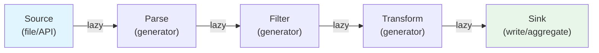
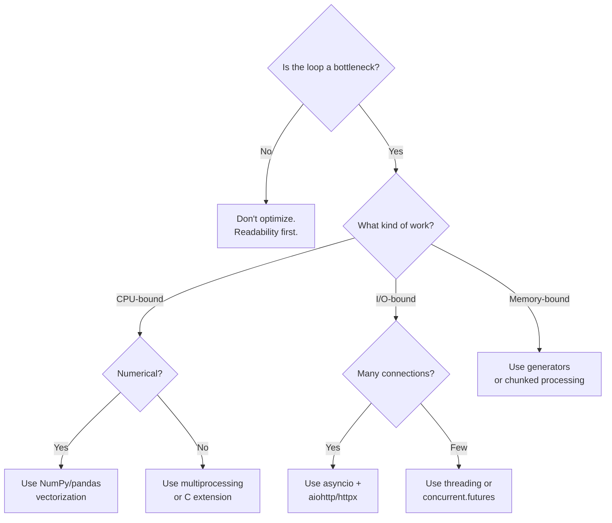

# Python Loops — Senior Level

## Table of Contents

1. [Introduction](#introduction)
2. [Architecture & Design](#architecture--design)
3. [Advanced Iteration Patterns](#advanced-iteration-patterns)
4. [Performance Benchmarks](#performance-benchmarks)
5. [Async Iteration](#async-iteration)
6. [Memory Profiling](#memory-profiling)
7. [Best Practices for Production](#best-practices-for-production)
8. [Advanced `itertools` Recipes](#advanced-itertools-recipes)
9. [Loop Optimization Techniques](#loop-optimization-techniques)
10. [Testing Loop-Heavy Code](#testing-loop-heavy-code)
11. [Test](#test)
12. [Diagrams & Visual Aids](#diagrams--visual-aids)

---

## Introduction

> Focus: "How to optimize?" and "How to architect?"

At the senior level, loops become an architectural concern. You need to know:
- When to use synchronous vs. asynchronous iteration
- How to profile and optimize loop-heavy code paths
- How to design generator pipelines for data processing
- How to parallelize CPU-bound loops effectively
- Memory implications of different iteration strategies

---

## Architecture & Design

### Generator Pipeline Architecture

The generator pipeline pattern composes multiple generator stages into a data processing pipeline. Each stage is lazy and processes one item at a time, keeping memory constant regardless of data size.

```python
from typing import Generator, Iterable, TypeVar
import json
import gzip

T = TypeVar("T")

# Stage 1: Read compressed data
def read_gzipped_lines(path: str) -> Generator[str, None, None]:
    with gzip.open(path, "rt") as f:
        yield from f

# Stage 2: Parse JSON
def parse_json(lines: Iterable[str]) -> Generator[dict, None, None]:
    for line in lines:
        try:
            yield json.loads(line)
        except json.JSONDecodeError:
            continue  # Skip malformed lines

# Stage 3: Filter
def filter_active(records: Iterable[dict]) -> Generator[dict, None, None]:
    for record in records:
        if record.get("status") == "active":
            yield record

# Stage 4: Transform
def enrich(records: Iterable[dict]) -> Generator[dict, None, None]:
    for record in records:
        record["processed_at"] = "2024-01-01"
        yield record

# Compose pipeline — O(1) memory for any file size
def process_file(path: str) -> Generator[dict, None, None]:
    lines = read_gzipped_lines(path)
    parsed = parse_json(lines)
    active = filter_active(parsed)
    enriched = enrich(active)
    yield from enriched
```

### Coroutine-Based Pipeline (Send Protocol)

```python
from typing import Generator

def running_average() -> Generator[float, float, None]:
    """Coroutine that computes running average via send()."""
    total = 0.0
    count = 0
    average = 0.0
    while True:
        value = yield average
        total += value
        count += 1
        average = total / count

# Usage
avg = running_average()
next(avg)  # Prime the coroutine
print(avg.send(10))   # 10.0
print(avg.send(20))   # 15.0
print(avg.send(30))   # 20.0
avg.close()
```

---

## Advanced Iteration Patterns

### Pattern 1: Context-Managed Iterator

```python
from contextlib import contextmanager
from typing import Generator, Iterator
import sqlite3

@contextmanager
def query_rows(db_path: str, sql: str) -> Generator[Iterator[tuple], None, None]:
    """Iterate over database rows with guaranteed connection cleanup."""
    conn = sqlite3.connect(db_path)
    try:
        cursor = conn.execute(sql)
        yield cursor  # cursor is an iterator
    finally:
        conn.close()

# Usage — connection is always closed
with query_rows("app.db", "SELECT * FROM users") as rows:
    for row in rows:
        print(row)
```

### Pattern 2: Infinite Iterator with State

```python
from typing import Iterator
import itertools

class RateLimiter:
    """Iterator that yields tokens at a controlled rate."""

    def __init__(self, max_per_second: float) -> None:
        self.interval = 1.0 / max_per_second
        self.last_call = 0.0

    def __iter__(self) -> Iterator[float]:
        return self

    def __next__(self) -> float:
        import time
        now = time.monotonic()
        elapsed = now - self.last_call
        if elapsed < self.interval:
            time.sleep(self.interval - elapsed)
        self.last_call = time.monotonic()
        return self.last_call

# Usage: rate-limited API calls
limiter = RateLimiter(max_per_second=5)
for _, token_time in zip(range(10), limiter):
    make_api_call()
```

### Pattern 3: Parallel Map with `concurrent.futures`

```python
from concurrent.futures import ProcessPoolExecutor, as_completed
from typing import List, Callable, TypeVar
import os

T = TypeVar("T")
R = TypeVar("R")

def parallel_map(
    func: Callable[[T], R],
    items: List[T],
    max_workers: int | None = None,
) -> List[R]:
    """Parallel map using process pool — bypasses GIL."""
    workers = max_workers or os.cpu_count()
    results: List[R] = [None] * len(items)  # type: ignore

    with ProcessPoolExecutor(max_workers=workers) as executor:
        future_to_idx = {
            executor.submit(func, item): idx
            for idx, item in enumerate(items)
        }
        for future in as_completed(future_to_idx):
            idx = future_to_idx[future]
            results[idx] = future.result()

    return results

# Usage
def heavy_computation(n: int) -> int:
    return sum(i * i for i in range(n))

results = parallel_map(heavy_computation, [100_000, 200_000, 300_000])
```

---

## Performance Benchmarks

### Benchmark 1: Loop Variants Comparison

```python
import timeit
from functools import reduce

N = 1_000_000

def bench_for_loop():
    result = []
    for i in range(N):
        result.append(i * 2)
    return result

def bench_list_comp():
    return [i * 2 for i in range(N)]

def bench_map():
    return list(map(lambda i: i * 2, range(N)))

def bench_numpy():
    import numpy as np
    arr = np.arange(N)
    return arr * 2

benchmarks = {
    "for + append": bench_for_loop,
    "list comprehension": bench_list_comp,
    "map()": bench_map,
    "numpy": bench_numpy,
}

for name, func in benchmarks.items():
    t = timeit.timeit(func, number=10) / 10
    print(f"{name:25s}: {t*1000:.2f} ms")

# Typical results (Python 3.12, x86_64):
# for + append             : 85.20 ms
# list comprehension       : 52.40 ms  (1.6x faster)
# map()                    : 78.30 ms  (slightly faster than loop)
# numpy                    :  2.10 ms  (40x faster)
```

### Benchmark 2: Generator vs List for Aggregation

```python
import timeit
import sys

N = 10_000_000

def sum_list():
    return sum([i for i in range(N)])

def sum_generator():
    return sum(i for i in range(N))

def sum_range():
    return sum(range(N))

# Memory comparison
list_mem = sys.getsizeof([i for i in range(10_000)])
gen_mem = sys.getsizeof(i for i in range(10_000))
print(f"List memory:      {list_mem:>10,} bytes")
print(f"Generator memory: {gen_mem:>10,} bytes")

# Speed comparison
for name, func in [("sum(list)", sum_list), ("sum(gen)", sum_generator), ("sum(range)", sum_range)]:
    t = timeit.timeit(func, number=5) / 5
    print(f"{name:15s}: {t*1000:.1f} ms")

# Typical results:
# List memory:       87,624 bytes
# Generator memory:      200 bytes
# sum(list)        : 620.3 ms
# sum(gen)         : 430.1 ms
# sum(range)       : 180.5 ms  (C-optimized path)
```

### Benchmark 3: Nested Loops vs `itertools.product`

```python
import timeit
import itertools

def nested_loops():
    result = []
    for a in range(100):
        for b in range(100):
            for c in range(100):
                result.append(a + b + c)
    return result

def product_flat():
    return [a + b + c for a, b, c in itertools.product(range(100), repeat=3)]

t1 = timeit.timeit(nested_loops, number=3) / 3
t2 = timeit.timeit(product_flat, number=3) / 3
print(f"Nested loops:       {t1*1000:.1f} ms")
print(f"itertools.product:  {t2*1000:.1f} ms")
# itertools.product is typically 10-20% faster
```

---

## Async Iteration

### `async for` with `__aiter__` / `__anext__`

```python
import asyncio
from typing import AsyncIterator

class AsyncCounter:
    """Async iterator that yields values with delays."""

    def __init__(self, limit: int) -> None:
        self.limit = limit
        self.current = 0

    def __aiter__(self) -> AsyncIterator[int]:
        return self

    async def __anext__(self) -> int:
        if self.current >= self.limit:
            raise StopAsyncIteration
        self.current += 1
        await asyncio.sleep(0.01)  # Simulate async I/O
        return self.current

async def main():
    async for value in AsyncCounter(5):
        print(value)

asyncio.run(main())
```

### Async Generator

```python
import asyncio
import aiohttp
from typing import AsyncGenerator

async def fetch_pages(
    urls: list[str],
    concurrency: int = 10,
) -> AsyncGenerator[tuple[str, str], None]:
    """Fetch multiple URLs concurrently, yielding results as they arrive."""
    semaphore = asyncio.Semaphore(concurrency)

    async def fetch_one(session: aiohttp.ClientSession, url: str) -> tuple[str, str]:
        async with semaphore:
            async with session.get(url) as resp:
                return url, await resp.text()

    async with aiohttp.ClientSession() as session:
        tasks = [asyncio.create_task(fetch_one(session, url)) for url in urls]
        for coro in asyncio.as_completed(tasks):
            yield await coro

async def main():
    urls = [f"https://httpbin.org/get?page={i}" for i in range(20)]
    async for url, content in fetch_pages(urls):
        print(f"Got {len(content)} chars from {url}")

# asyncio.run(main())
```

### Async Comprehensions

```python
import asyncio

async def get_value(i: int) -> int:
    await asyncio.sleep(0.01)
    return i * i

async def main():
    # Async list comprehension
    results = [await get_value(i) for i in range(10)]
    print(results)

    # Async generator expression — lazy
    async def gen():
        for i in range(10):
            yield await get_value(i)

    async for val in gen():
        print(val)

asyncio.run(main())
```

---

## Memory Profiling

### Comparing Iteration Strategies

```python
# Run with: python -m memory_profiler script.py
from memory_profiler import profile

@profile
def list_approach():
    """Stores all items in memory."""
    data = [i ** 2 for i in range(1_000_000)]
    total = sum(data)
    return total

@profile
def generator_approach():
    """Processes one item at a time."""
    total = sum(i ** 2 for i in range(1_000_000))
    return total

@profile
def chunked_approach():
    """Processes in fixed-size chunks."""
    total = 0
    chunk_size = 10_000
    for start in range(0, 1_000_000, chunk_size):
        chunk = [i ** 2 for i in range(start, min(start + chunk_size, 1_000_000))]
        total += sum(chunk)
    return total

# Typical memory_profiler output:
# list_approach:      Peak ~40 MB  (stores 1M integers)
# generator_approach: Peak ~0.1 MB (one integer at a time)
# chunked_approach:   Peak ~0.5 MB (10K integers at a time)
```

### Memory Layout of Loop Variables

```
+------------------+     +------------------+
|  for i in range  |     |  list comprehension|
|  (1_000_000):    |     |  [x for x in     |
|                  |     |   range(1M)]      |
|  Stack: ~56 bytes|     |                   |
|  (just 'i')      |     |  Heap: ~8 MB      |
|                  |     |  (1M PyObject*)    |
+------------------+     +------------------+
        |                         |
  O(1) memory               O(n) memory
```

---

## Best Practices for Production

### 1. Use Structured Logging in Loops

```python
import logging
import time

logger = logging.getLogger(__name__)

def process_items(items: list[dict]) -> None:
    total = len(items)
    start = time.perf_counter()

    for i, item in enumerate(items, 1):
        try:
            result = process(item)
            if i % 1000 == 0:
                elapsed = time.perf_counter() - start
                rate = i / elapsed
                logger.info(
                    "Progress: %d/%d (%.1f%%) | %.0f items/sec",
                    i, total, 100 * i / total, rate,
                )
        except Exception:
            logger.exception("Failed to process item %d: %r", i, item)
```

### 2. Graceful Shutdown in Long-Running Loops

```python
import signal
import sys
from typing import Iterator

class GracefulShutdown:
    """Handle SIGTERM/SIGINT for clean loop exit."""

    def __init__(self) -> None:
        self.should_stop = False
        signal.signal(signal.SIGTERM, self._handler)
        signal.signal(signal.SIGINT, self._handler)

    def _handler(self, signum: int, frame) -> None:
        print(f"\nReceived signal {signum}, shutting down gracefully...")
        self.should_stop = True

shutdown = GracefulShutdown()

def worker(tasks: Iterator[dict]) -> None:
    for task in tasks:
        if shutdown.should_stop:
            print("Completing current task and exiting...")
            break
        process(task)
    print("Worker finished cleanly")
```

### 3. Progress Tracking with `tqdm`

```python
from tqdm import tqdm
from typing import List

def process_with_progress(items: List[dict]) -> List[dict]:
    results = []
    for item in tqdm(items, desc="Processing", unit="items"):
        result = expensive_transform(item)
        results.append(result)
    return results

# With generators — use tqdm with total parameter
def stream_process(items, total: int):
    for item in tqdm(items, total=total, desc="Streaming"):
        yield transform(item)
```

### 4. Type-Safe Iteration with Protocols

```python
from typing import Protocol, Iterator, runtime_checkable

@runtime_checkable
class Paginated(Protocol):
    """Protocol for paginated data sources."""

    def has_next(self) -> bool: ...
    def next_page(self) -> list[dict]: ...

class PaginatedIterator:
    """Convert any Paginated source into an iterator."""

    def __init__(self, source: Paginated) -> None:
        self.source = source
        self.buffer: list[dict] = []
        self.index = 0

    def __iter__(self) -> Iterator[dict]:
        return self

    def __next__(self) -> dict:
        while self.index >= len(self.buffer):
            if not self.source.has_next():
                raise StopIteration
            self.buffer = self.source.next_page()
            self.index = 0
        item = self.buffer[self.index]
        self.index += 1
        return item
```

---

## Advanced `itertools` Recipes

### Recipe 1: Windowed Iteration

```python
import itertools
from collections import deque
from typing import Iterable, Generator, TypeVar

T = TypeVar("T")

def sliding_window(iterable: Iterable[T], n: int) -> Generator[tuple[T, ...], None, None]:
    """sliding_window('ABCDEF', 3) -> ABC BCD CDE DEF"""
    it = iter(iterable)
    window = deque(itertools.islice(it, n), maxlen=n)
    if len(window) == n:
        yield tuple(window)
    for x in it:
        window.append(x)
        yield tuple(window)

for window in sliding_window(range(7), 3):
    print(window)
# (0, 1, 2), (1, 2, 3), (2, 3, 4), (3, 4, 5), (4, 5, 6)
```

### Recipe 2: Partition by Predicate

```python
from typing import Callable, Iterable, Tuple, List, TypeVar
import itertools

T = TypeVar("T")

def partition(
    predicate: Callable[[T], bool],
    iterable: Iterable[T],
) -> Tuple[List[T], List[T]]:
    """Split iterable into (true_items, false_items)."""
    t1, t2 = itertools.tee(iterable)
    return (
        [x for x in t1 if predicate(x)],
        [x for x in t2 if not predicate(x)],
    )

evens, odds = partition(lambda x: x % 2 == 0, range(10))
print(f"Evens: {evens}")  # [0, 2, 4, 6, 8]
print(f"Odds:  {odds}")   # [1, 3, 5, 7, 9]
```

### Recipe 3: Flattening Nested Structures

```python
from typing import Any, Generator
from collections.abc import Iterable

def flatten(nested: Any, max_depth: int = -1) -> Generator[Any, None, None]:
    """Recursively flatten nested iterables (except strings)."""
    if max_depth == 0 or not isinstance(nested, Iterable) or isinstance(nested, (str, bytes)):
        yield nested
        return
    for item in nested:
        yield from flatten(item, max_depth - 1 if max_depth > 0 else -1)

data = [1, [2, 3], [[4, 5], [6]], "hello"]
print(list(flatten(data)))
# [1, 2, 3, 4, 5, 6, 'hello']
```

---

## Loop Optimization Techniques

### Technique 1: Loop Invariant Hoisting

```python
import math

data = [1.5, 2.7, 3.8, 4.2] * 100_000

# ❌ Slow — attribute lookup every iteration
def slow():
    result = []
    for x in data:
        result.append(math.floor(x))
    return result

# ✅ Fast — hoist lookups outside loop
def fast():
    floor = math.floor
    result = []
    append = result.append
    for x in data:
        append(floor(x))
    return result

# ✅ Best — list comprehension
def fastest():
    floor = math.floor
    return [floor(x) for x in data]
```

### Technique 2: Avoiding Repeated Dictionary Lookups

```python
# ❌ Slow — two dict lookups per iteration
def count_slow(words: list[str]) -> dict[str, int]:
    counts: dict[str, int] = {}
    for word in words:
        if word in counts:      # lookup 1
            counts[word] += 1   # lookup 2
        else:
            counts[word] = 1
    return counts

# ✅ Fast — single lookup with .get()
def count_get(words: list[str]) -> dict[str, int]:
    counts: dict[str, int] = {}
    for word in words:
        counts[word] = counts.get(word, 0) + 1
    return counts

# ✅ Best — collections.Counter
from collections import Counter
def count_counter(words: list[str]) -> dict[str, int]:
    return dict(Counter(words))
```

### Technique 3: Batch I/O Operations

```python
import sqlite3
from typing import List

# ❌ Slow — one INSERT per iteration (1 transaction per row)
def insert_slow(conn: sqlite3.Connection, items: List[dict]) -> None:
    for item in items:
        conn.execute(
            "INSERT INTO items (name, value) VALUES (?, ?)",
            (item["name"], item["value"]),
        )
        conn.commit()  # commit per row!

# ✅ Fast — batch INSERT with single transaction
def insert_fast(conn: sqlite3.Connection, items: List[dict]) -> None:
    conn.executemany(
        "INSERT INTO items (name, value) VALUES (?, ?)",
        [(item["name"], item["value"]) for item in items],
    )
    conn.commit()  # single commit for all rows
```

---

## Testing Loop-Heavy Code

### Testing Generators

```python
import pytest
from typing import Generator

def paginate(items: list, page_size: int) -> Generator[list, None, None]:
    for i in range(0, len(items), page_size):
        yield items[i:i + page_size]

class TestPaginate:
    def test_even_split(self):
        result = list(paginate([1, 2, 3, 4], 2))
        assert result == [[1, 2], [3, 4]]

    def test_uneven_split(self):
        result = list(paginate([1, 2, 3, 4, 5], 2))
        assert result == [[1, 2], [3, 4], [5]]

    def test_empty_input(self):
        result = list(paginate([], 2))
        assert result == []

    def test_page_size_larger_than_input(self):
        result = list(paginate([1, 2], 10))
        assert result == [[1, 2]]

    def test_laziness(self):
        """Verify generator doesn't compute all values upfront."""
        gen = paginate(list(range(1000)), 10)
        first_page = next(gen)
        assert first_page == list(range(10))
        # Generator still has more pages
```

### Property-Based Testing with Hypothesis

```python
from hypothesis import given, strategies as st

@given(st.lists(st.integers()), st.integers(min_value=1, max_value=100))
def test_paginate_preserves_all_items(items, page_size):
    pages = list(paginate(items, page_size))
    flattened = [item for page in pages for item in page]
    assert flattened == items

@given(st.lists(st.integers(), min_size=1), st.integers(min_value=1, max_value=100))
def test_paginate_page_sizes(items, page_size):
    pages = list(paginate(items, page_size))
    for page in pages[:-1]:  # all but last
        assert len(page) == page_size
    assert 0 < len(pages[-1]) <= page_size
```

---

## Test

### Multiple Choice

**1. What is the time complexity of `x in list` inside a loop of n iterations over a list of m elements?**

- A) O(n)
- B) O(m)
- C) O(n * m)
- D) O(n + m)

<details>
<summary>Answer</summary>
<strong>C)</strong> — <code>x in list</code> is O(m) for each of n iterations. Use a set for O(1) lookups: O(n + m) total.
</details>

**2. What happens when you call `next()` on an exhausted generator?**

- A) Returns `None`
- B) Raises `StopIteration`
- C) Restarts the generator
- D) Returns the last value

<details>
<summary>Answer</summary>
<strong>B)</strong> — <code>StopIteration</code> is raised. Generators cannot be restarted; you must create a new one.
</details>

**3. Which is the most memory-efficient for `sum(f(x) for x in range(10_000_000))`?**

- A) `sum([f(x) for x in range(10_000_000)])`
- B) `sum(f(x) for x in range(10_000_000))`
- C) `sum(map(f, range(10_000_000)))`
- D) B and C are equivalent in memory

<details>
<summary>Answer</summary>
<strong>D)</strong> — Both the generator expression and <code>map()</code> are lazy and use O(1) memory. The list comprehension (A) allocates the entire list.
</details>

**4. What does `yield from` do differently than a `for` loop with `yield`?**

- A) Nothing — they are identical
- B) `yield from` also propagates `send()` and `throw()` to the sub-generator
- C) `yield from` is faster but doesn't support `StopIteration`
- D) `yield from` creates a list first

<details>
<summary>Answer</summary>
<strong>B)</strong> — <code>yield from</code> creates a transparent bidirectional channel: <code>send()</code>, <code>throw()</code>, and <code>close()</code> are all forwarded to the sub-generator. A manual <code>for</code>+<code>yield</code> loop only forwards values.
</details>

**5. In a `ProcessPoolExecutor`, why can't you use a lambda as the target function?**

- A) Lambdas are not callable
- B) Lambdas cannot be pickled (serialized)
- C) Lambdas don't support arguments
- D) ProcessPoolExecutor only accepts classes

<details>
<summary>Answer</summary>
<strong>B)</strong> — <code>multiprocessing</code> serializes functions with <code>pickle</code>. Lambdas and local functions cannot be pickled. Define functions at module level instead.
</details>

**6. What is the output?**

```python
def gen():
    yield 1
    return "done"
    yield 2

g = gen()
print(next(g))
try:
    next(g)
except StopIteration as e:
    print(e.value)
```

<details>
<summary>Answer</summary>
Output: <code>1</code> then <code>done</code>. The <code>return</code> value in a generator becomes the <code>value</code> attribute of the <code>StopIteration</code> exception. <code>yield 2</code> is unreachable.
</details>

**7. What pattern should you use for a loop that retries on failure with backoff?**

<details>
<summary>Answer</summary>

```python
import time
for attempt in range(max_retries):
    try:
        result = operation()
        break  # success
    except TransientError:
        if attempt == max_retries - 1:
            raise
        time.sleep(2 ** attempt)
else:
    raise RuntimeError("All retries exhausted")
```

The `else` clause runs if no `break` occurred (all retries failed without the final `raise` being hit).
</details>

**8. What is wrong with this async code?**

```python
async def fetch_all(urls):
    results = []
    for url in urls:
        resp = await aiohttp.get(url)
        results.append(await resp.text())
    return results
```

<details>
<summary>Answer</summary>
It fetches URLs <strong>sequentially</strong>, not concurrently. Each <code>await</code> blocks until the previous request completes. Use <code>asyncio.gather()</code> or <code>asyncio.as_completed()</code> to fetch concurrently:

```python
async def fetch_all(urls):
    async with aiohttp.ClientSession() as session:
        tasks = [session.get(url) for url in urls]
        responses = await asyncio.gather(*tasks)
        return [await r.text() for r in responses]
```
</details>

**9. Why is `sum(range(n))` faster than `sum(i for i in range(n))`?**

<details>
<summary>Answer</summary>
CPython's <code>sum()</code> has a fast path for <code>range</code> objects — it uses the arithmetic formula <code>n*(n-1)/2</code> internally (or a C-level optimized loop). The generator expression adds Python-level <code>yield</code>/<code>next()</code> overhead per element.
</details>

**10. What is the difference between `itertools.tee(gen, 2)` and creating two separate generators?**

<details>
<summary>Answer</summary>
<code>tee()</code> creates two independent iterators from a single iterable, but it must <strong>buffer</strong> any items consumed by one iterator but not yet consumed by the other. If one iterator advances far ahead, the buffer grows unboundedly. Two separate generators each read from the source independently (if the source supports it), with no shared buffer.
</details>

**11. How would you optimize a loop that checks membership in a large list?**

<details>
<summary>Answer</summary>

Convert the list to a `set` before the loop:

```python
# ❌ O(n * m) — list lookup is O(m)
for item in items:
    if item in large_list:  # O(m)
        process(item)

# ✅ O(n + m) — set lookup is O(1)
large_set = set(large_list)  # O(m) one-time
for item in items:
    if item in large_set:  # O(1)
        process(item)
```
</details>

**12. What design pattern makes generator pipelines testable?**

<details>
<summary>Answer</summary>
<strong>Dependency Injection</strong> — each pipeline stage is a standalone generator function that takes an iterable as input. This makes each stage independently testable:

```python
def test_filter_stage():
    input_data = [{"status": "active"}, {"status": "inactive"}]
    result = list(filter_active(input_data))
    assert len(result) == 1
```

Each stage can be tested with a plain list as input, without needing the full pipeline.
</details>

---

## Diagrams & Visual Aids

### Generator Pipeline Architecture



### Sync vs Async Iteration

```mermaid
sequenceDiagram
    participant Loop as Event Loop
    participant Gen as Async Generator
    participant IO as Network I/O

    Loop->>Gen: __anext__()
    Gen->>IO: await fetch(url1)
    Note over Loop: Other tasks run while waiting
    IO-->>Gen: response1
    Gen-->>Loop: yield response1

    Loop->>Gen: __anext__()
    Gen->>IO: await fetch(url2)
    Note over Loop: Other tasks run while waiting
    IO-->>Gen: response2
    Gen-->>Loop: yield response2

    Loop->>Gen: __anext__()
    Gen-->>Loop: StopAsyncIteration
```

### Loop Optimization Decision Tree


