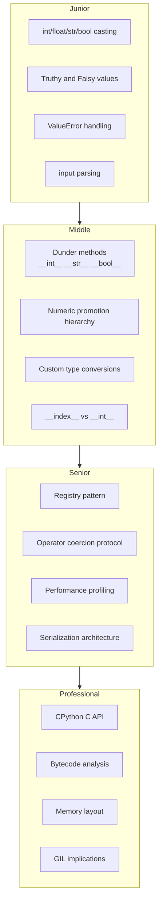
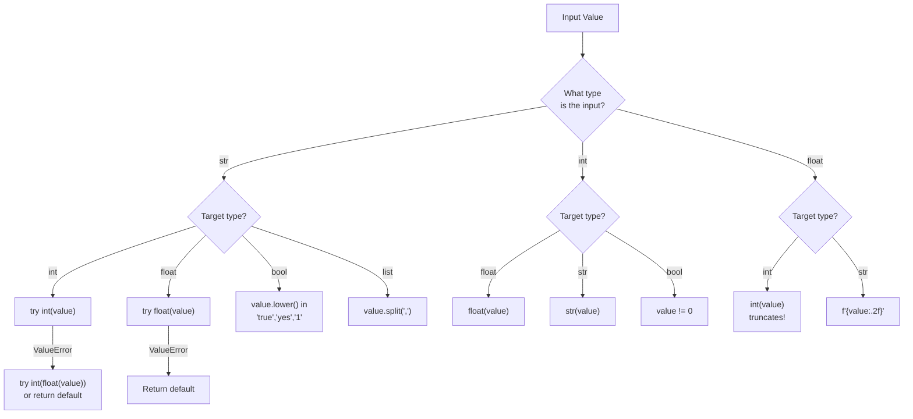
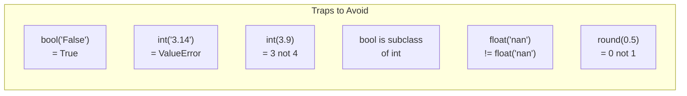

# Python Type Casting -- Interview Preparation

## Table of Contents

1. [Junior Level Questions](#junior-level-questions)
2. [Middle Level Questions](#middle-level-questions)
3. [Senior Level Questions](#senior-level-questions)
4. [Professional Level Questions](#professional-level-questions)
5. [Coding Challenges](#coding-challenges)
6. [System Design Questions](#system-design-questions)
7. [Quick-Fire Round](#quick-fire-round)
8. [Diagrams & Visual Aids](#diagrams--visual-aids)

---

## Junior Level Questions

### Q1: What is the difference between implicit and explicit type casting?

<details>
<summary>Answer</summary>

**Explicit casting** is when you manually convert a value using a built-in function:
```python
x = int("42")       # str -> int
y = float(10)        # int -> float
z = str(3.14)        # float -> str
```

**Implicit casting** (type coercion) is when Python automatically converts a type during an operation:
```python
result = 5 + 2.5     # int is promoted to float -> 7.5
total = True + 3     # bool is promoted to int -> 4
```

Python only does implicit casting for numeric types in the hierarchy: `bool -> int -> float -> complex`. It never implicitly converts strings to numbers.

</details>

---

### Q2: What values are falsy in Python?

<details>
<summary>Answer</summary>

```python
# All falsy values in Python:
falsy_values = [
    False,      # bool
    0,          # int zero
    0.0,        # float zero
    0j,         # complex zero
    "",          # empty string
    [],          # empty list
    (),          # empty tuple
    {},          # empty dict
    set(),       # empty set
    frozenset(), # empty frozenset
    None,        # NoneType
    range(0),    # empty range
    b"",         # empty bytes
    bytearray(), # empty bytearray
]

for val in falsy_values:
    assert bool(val) == False, f"{val!r} should be falsy"

# Everything else is truthy:
assert bool("0") == True        # non-empty string
assert bool([0]) == True        # non-empty list
assert bool("False") == True    # non-empty string
assert bool(-1) == True         # non-zero int
assert bool(0.001) == True      # non-zero float
print("All assertions passed!")
```

</details>

---

### Q3: What happens when you do `int("3.14")`?

<details>
<summary>Answer</summary>

It raises a `ValueError`:
```python
try:
    int("3.14")
except ValueError as e:
    print(e)  # invalid literal for int() with base 10: '3.14'
```

`int()` can only parse strings that represent integers. To convert a float string to int, you must go through `float` first:
```python
result = int(float("3.14"))  # 3
```

This is a very common interview trap question.

</details>

---

### Q4: What is the output of `bool("False")`?

<details>
<summary>Answer</summary>

```python
print(bool("False"))  # True
```

`"False"` is a **non-empty string**, so it is truthy. Only `bool("")` returns `False`. The string's content does not matter -- only whether it is empty or not.

To properly parse boolean strings:
```python
def parse_bool(s: str) -> bool:
    return s.lower() in ("true", "yes", "1", "on")

print(parse_bool("False"))  # False
print(parse_bool("True"))   # True
```

</details>

---

### Q5: What is the difference between `int()` and `round()`?

<details>
<summary>Answer</summary>

```python
# int() TRUNCATES toward zero (removes decimals)
print(int(3.7))    # 3
print(int(-3.7))   # -3
print(int(3.2))    # 3

# round() ROUNDS to nearest (with banker's rounding for .5)
print(round(3.7))   # 4
print(round(-3.7))  # -4
print(round(3.2))   # 3

# Banker's rounding (round half to even):
print(round(0.5))   # 0  (not 1!)
print(round(1.5))   # 2
print(round(2.5))   # 2  (not 3!)
print(round(3.5))   # 4
```

Key difference: `int()` always truncates toward zero, `round()` rounds to nearest with ties going to the nearest even number (banker's rounding, IEEE 754).

</details>

---

### Q6: How do `ord()` and `chr()` work?

<details>
<summary>Answer</summary>

```python
# ord() converts a single character to its Unicode code point (integer)
print(ord('A'))     # 65
print(ord('a'))     # 97
print(ord('0'))     # 48
print(ord(' '))     # 32

# chr() converts an integer to its Unicode character
print(chr(65))      # 'A'
print(chr(97))      # 'a'
print(chr(128013))  # snake emoji

# They are inverse operations:
assert chr(ord('Z')) == 'Z'
assert ord(chr(100)) == 100

# Common use: Caesar cipher
def caesar(text, shift):
    result = []
    for ch in text:
        if ch.isalpha():
            base = ord('A') if ch.isupper() else ord('a')
            result.append(chr((ord(ch) - base + shift) % 26 + base))
        else:
            result.append(ch)
    return ''.join(result)

print(caesar("Hello", 3))  # Khoor
```

</details>

---

## Middle Level Questions

### Q7: How does `bool` relate to `int` in Python?

<details>
<summary>Answer</summary>

`bool` is a **subclass** of `int`:

```python
print(isinstance(True, int))    # True
print(issubclass(bool, int))    # True

# True == 1, False == 0
print(True + True)               # 2
print(True * 10)                  # 10
print(sum([True, False, True]))   # 2

# This is by design (PEP 285)
# It means booleans work in arithmetic contexts
# Useful for counting: sum(x > 0 for x in data)
```

**Important interview trap:** When checking types, always check `bool` before `int`:
```python
value = True
if isinstance(value, bool):
    print("It's a bool")
elif isinstance(value, int):
    print("It's an int")
# Without the bool check first, True would match int
```

</details>

---

### Q8: What dunder methods control type casting for custom objects?

<details>
<summary>Answer</summary>

```python
class SmartValue:
    def __init__(self, value):
        self.value = value

    def __int__(self):
        """Called by int(obj)."""
        return int(self.value)

    def __float__(self):
        """Called by float(obj)."""
        return float(self.value)

    def __str__(self):
        """Called by str(obj), print(obj), f-strings."""
        return f"SmartValue({self.value})"

    def __repr__(self):
        """Called by repr(obj), REPL display."""
        return f"SmartValue({self.value!r})"

    def __bool__(self):
        """Called by bool(obj), if obj:, while obj:."""
        return bool(self.value)

    def __index__(self):
        """Called for slicing, bin(), hex(), oct()."""
        return int(self.value)

    def __complex__(self):
        """Called by complex(obj)."""
        return complex(self.value)

    def __bytes__(self):
        """Called by bytes(obj)."""
        return str(self.value).encode()


v = SmartValue(42)
print(int(v))       # 42 via __int__
print(float(v))     # 42.0 via __float__
print(str(v))       # SmartValue(42) via __str__
print(bool(v))      # True via __bool__
print(bin(v))        # 0b101010 via __index__
```

**Resolution order for `bool(obj)`:**
1. `__bool__()` if defined
2. `__len__()` if defined (returns `False` if 0, else `True`)
3. `True` by default (all objects are truthy unless they say otherwise)

</details>

---

### Q9: What is the difference between `__str__` and `__repr__`?

<details>
<summary>Answer</summary>

```python
import datetime

d = datetime.datetime(2024, 1, 15, 10, 30)

# __str__: human-readable, for end users
print(str(d))    # 2024-01-15 10:30:00

# __repr__: developer-readable, unambiguous, ideally eval()-able
print(repr(d))   # datetime.datetime(2024, 1, 15, 10, 30)

# When __str__ is not defined, Python falls back to __repr__
class Foo:
    def __repr__(self):
        return "Foo()"

print(str(Foo()))   # Foo() (falls back to __repr__)

# f-string behavior:
# f"{obj}"    -> calls __str__
# f"{obj!r}"  -> calls __repr__
# f"{obj!s}"  -> calls __str__ (explicit)
```

**Interview answer:** `__str__` is for end users (readability), `__repr__` is for developers (debuggability). If you only implement one, implement `__repr__` because `str()` falls back to it.

</details>

---

### Q10: How does `int()` handle different number bases?

<details>
<summary>Answer</summary>

```python
# int(string, base) -- base can be 0 or 2-36

# Explicit bases
print(int('FF', 16))       # 255 (hexadecimal)
print(int('1010', 2))      # 10 (binary)
print(int('77', 8))        # 63 (octal)
print(int('Z', 36))        # 35 (base 36: 0-9 + A-Z)

# Base 0: auto-detect from prefix
print(int('0xFF', 0))      # 255
print(int('0b1010', 0))    # 10
print(int('0o77', 0))      # 63
print(int('42', 0))        # 42 (decimal)

# Reverse: int to string representation
print(bin(255))   # '0b11111111'
print(hex(255))   # '0xff'
print(oct(255))   # '0o377'

# Custom base conversion (base 2-36)
def to_base(n: int, base: int) -> str:
    if n == 0:
        return '0'
    digits = '0123456789abcdefghijklmnopqrstuvwxyz'
    result = []
    is_negative = n < 0
    n = abs(n)
    while n:
        result.append(digits[n % base])
        n //= base
    if is_negative:
        result.append('-')
    return ''.join(reversed(result))

print(to_base(255, 16))  # 'ff'
print(to_base(42, 2))    # '101010'
```

</details>

---

### Q11: How do you safely parse environment variables in Python?

<details>
<summary>Answer</summary>

```python
import os
from typing import TypeVar, Type, Optional

T = TypeVar('T')


def get_env(key: str, target_type: Type[T], default: T) -> T:
    """Safely get and cast an environment variable."""
    raw = os.environ.get(key)
    if raw is None:
        return default

    if target_type is bool:
        return raw.lower() in ('true', 'yes', '1', 'on')

    try:
        return target_type(raw)
    except (ValueError, TypeError):
        return default


# Usage
debug = get_env("DEBUG", bool, False)
port = get_env("PORT", int, 8080)
rate = get_env("RATE_LIMIT", float, 1.0)
host = get_env("HOST", str, "localhost")
```

This is a common pattern in Django, Flask, and FastAPI applications.

</details>

---

## Senior Level Questions

### Q12: Explain the numeric coercion protocol in CPython.

<details>
<summary>Answer</summary>

When Python evaluates `a + b` with mixed types:

1. Python calls `type(a).__add__(a, b)`
2. If it returns `NotImplemented`, Python tries `type(b).__radd__(b, a)`
3. If that also returns `NotImplemented`, Python raises `TypeError`

For built-in numeric types, the coercion hierarchy is:
```
bool -> int -> float -> complex
```

The "wider" type always wins:
```python
# Internally:
# int.__add__(3, 2.5)  -> returns NotImplemented (doesn't know about float)
# float.__radd__(2.5, 3) -> converts 3 to float, returns 5.5

print(3 + 2.5)           # float: 5.5
print(True + 3)           # int: 4 (bool is subclass of int)
print(2.5 + (1 + 2j))    # complex: (3.5+2j)
```

**Key insight:** Python does NOT use a separate coercion step (unlike Python 2's `__coerce__`). Each operator method is responsible for handling type mismatches or returning `NotImplemented`.

</details>

---

### Q13: How would you design a type conversion system for a data pipeline?

<details>
<summary>Answer</summary>

```python
from typing import Any, Callable, Dict, Tuple, Type, Optional
from dataclasses import dataclass


@dataclass
class ConversionRule:
    converter: Callable[[Any], Any]
    validator: Optional[Callable[[Any], bool]] = None
    error_handler: Optional[Callable[[Any, Exception], Any]] = None


class DataPipeline:
    """Extensible type conversion pipeline with validation and error handling."""

    def __init__(self):
        self._rules: Dict[str, ConversionRule] = {}

    def register(self, field: str, converter: Callable,
                 validator: Callable = None, on_error: Callable = None):
        self._rules[field] = ConversionRule(converter, validator, on_error)

    def convert(self, record: Dict[str, str]) -> Dict[str, Any]:
        result = {}
        errors = []

        for field, raw_value in record.items():
            if field not in self._rules:
                result[field] = raw_value
                continue

            rule = self._rules[field]
            try:
                converted = rule.converter(raw_value)
                if rule.validator and not rule.validator(converted):
                    raise ValueError(f"Validation failed for {field}={converted}")
                result[field] = converted
            except Exception as e:
                if rule.error_handler:
                    result[field] = rule.error_handler(raw_value, e)
                else:
                    errors.append((field, raw_value, str(e)))

        if errors:
            result["__errors__"] = errors
        return result


# Usage
pipeline = DataPipeline()
pipeline.register("age", int, validator=lambda x: 0 < x < 150, on_error=lambda v, e: None)
pipeline.register("salary", float, on_error=lambda v, e: 0.0)
pipeline.register("active", lambda s: s.lower() in ("true", "yes", "1"))
pipeline.register("tags", lambda s: [t.strip() for t in s.split(",")])

record = {"age": "30", "salary": "bad", "active": "yes", "tags": "python, coding"}
print(pipeline.convert(record))
# {'age': 30, 'salary': 0.0, 'active': True, 'tags': ['python', 'coding']}
```

</details>

---

### Q14: What is `__index__` and why is it separate from `__int__`?

<details>
<summary>Answer</summary>

`__index__` was introduced in PEP 357 to handle a specific problem: some objects can be losslessly represented as integers (for use in slicing, indexing, `bin()`, `hex()`, `oct()`), but `__int__` allows lossy conversions (e.g., `int(3.14)` returns `3`).

```python
# __int__ can be lossy:
class Temperature:
    def __init__(self, celsius):
        self.celsius = celsius
    def __int__(self):
        return int(self.celsius)  # Lossy: 36.6 -> 36

# __index__ must be exact (lossless):
class Byte:
    def __init__(self, value):
        assert 0 <= value <= 255
        self.value = value
    def __index__(self):
        return self.value  # Exact integer

b = Byte(65)
data = bytes(range(256))
print(data[b])     # Uses __index__ -- exact integer needed
print(bin(b))       # Uses __index__
print(hex(b))       # Uses __index__
```

**Key rule:** If your object represents an exact integer, implement `__index__`. If the conversion is lossy (like float-to-int), only implement `__int__`.

</details>

---

## Professional Level Questions

### Q15: How does CPython implement `int("42")` at the C level?

<details>
<summary>Answer</summary>

The call path in CPython:

1. `type.__call__(int, "42")` dispatches to `long_new()` in `Objects/longobject.c`
2. `long_new()` detects string input and calls `PyLong_FromUnicodeObject()`
3. `PyLong_FromUnicodeObject()` extracts the UTF-8 bytes and calls `PyLong_FromString()`
4. `PyLong_FromString()` implements a digit-by-digit parser:
   - Handles sign (`+`/`-`)
   - Auto-detects base from prefix (`0x`, `0b`, `0o`)
   - Converts ASCII digits to numeric values
   - Uses an optimized base conversion algorithm (not naive multiply-and-add for large numbers)
5. For small results (-5 to 256), returns a pre-cached object from `small_ints[]`
6. For larger results, allocates a new `PyLongObject` with the appropriate number of 30-bit digits

```python
import sys

# Verify small int caching
a = int("100")
b = int("100")
print(a is b)  # True (cached)

c = int("257")
d = int("257")
print(c is d)  # False (not cached)

# Large integers use variable-length digit arrays
big = int("9" * 1000)  # 1000-digit number
print(sys.getsizeof(big))  # Much larger than a small int
```

</details>

---

### Q16: Explain the GIL implications of bulk type casting.

<details>
<summary>Answer</summary>

```python
import threading
import time

def cast_strings(strings):
    return [int(s) for s in strings]

data = [str(i) for i in range(1_000_000)]

# Sequential
start = time.perf_counter()
cast_strings(data)
seq = time.perf_counter() - start

# 4 threads
start = time.perf_counter()
chunks = [data[i::4] for i in range(4)]
threads = [threading.Thread(target=cast_strings, args=(c,)) for c in chunks]
for t in threads:
    t.start()
for t in threads:
    t.join()
par = time.perf_counter() - start

print(f"Sequential: {seq:.3f}s")
print(f"4 threads:  {par:.3f}s")
# No speedup because int() holds the GIL

# Solution: use multiprocessing for true parallelism
from multiprocessing import Pool

start = time.perf_counter()
with Pool(4) as pool:
    results = pool.map(cast_strings, chunks)
mp = time.perf_counter() - start
print(f"4 processes: {mp:.3f}s")
```

The GIL is held during all built-in type conversion functions (`int()`, `float()`, `str()`, etc.) because they operate on Python objects. For CPU-bound casting of large datasets, `multiprocessing` or NumPy (which releases the GIL for array operations) is the correct solution.

</details>

---

## Coding Challenges

### Challenge 1: Implement a Universal Converter

Write a function that converts any value to the target type with graceful fallbacks.

```python
# Your implementation here
def universal_cast(value, target_type, default=None):
    """Convert value to target_type with fallback to default."""
    pass
```

<details>
<summary>Solution</summary>

```python
from typing import Any, Type, TypeVar, Optional

T = TypeVar('T')


def universal_cast(value: Any, target_type: Type[T], default: Optional[T] = None) -> Optional[T]:
    """Convert value to target_type with fallback to default."""
    # Already the right type
    if isinstance(value, target_type) and not (target_type is int and isinstance(value, bool)):
        return value

    # Special handling for bool
    if target_type is bool:
        if isinstance(value, str):
            return value.lower() in ('true', 'yes', '1', 'on')
        return bool(value)

    # Try direct conversion
    try:
        return target_type(value)
    except (ValueError, TypeError):
        pass

    # Try via intermediate types
    if target_type is int and isinstance(value, str):
        try:
            return int(float(value))  # "3.14" -> 3
        except (ValueError, TypeError):
            pass

    return default


# Tests
assert universal_cast("42", int) == 42
assert universal_cast("3.14", int) == 3
assert universal_cast("hello", int, -1) == -1
assert universal_cast("true", bool) is True
assert universal_cast("off", bool) is False
assert universal_cast(42, str) == "42"
assert universal_cast([1, 2], tuple) == (1, 2)
assert universal_cast(True, int) == 1
print("All tests passed!")
```

</details>

---

### Challenge 2: Type-Safe Configuration Parser

```python
# Implement a config parser that casts env vars to the correct types
# based on type annotations in a dataclass

from dataclasses import dataclass

@dataclass
class AppConfig:
    debug: bool = False
    port: int = 8080
    host: str = "localhost"
    rate_limit: float = 1.0
    workers: int = 4
    allowed_origins: list = None  # comma-separated string -> list

# Parse from dict of strings (simulating env vars)
env = {
    "DEBUG": "true",
    "PORT": "3000",
    "HOST": "0.0.0.0",
    "RATE_LIMIT": "2.5",
    "WORKERS": "8",
    "ALLOWED_ORIGINS": "http://localhost,http://example.com",
}
```

<details>
<summary>Solution</summary>

```python
from dataclasses import dataclass, fields
from typing import Any, Dict, get_type_hints


@dataclass
class AppConfig:
    debug: bool = False
    port: int = 8080
    host: str = "localhost"
    rate_limit: float = 1.0
    workers: int = 4
    allowed_origins: list = None


def parse_config(cls, env: Dict[str, str]):
    """Parse a dataclass config from a dict of string values."""
    hints = get_type_hints(cls)
    kwargs = {}

    for f in fields(cls):
        env_key = f.name.upper()
        if env_key not in env:
            continue

        raw = env[env_key]
        target = hints[f.name]

        if target is bool:
            kwargs[f.name] = raw.lower() in ('true', 'yes', '1', 'on')
        elif target is list:
            kwargs[f.name] = [s.strip() for s in raw.split(',')]
        else:
            try:
                kwargs[f.name] = target(raw)
            except (ValueError, TypeError):
                pass  # Use default

    return cls(**kwargs)


env = {
    "DEBUG": "true",
    "PORT": "3000",
    "HOST": "0.0.0.0",
    "RATE_LIMIT": "2.5",
    "WORKERS": "8",
    "ALLOWED_ORIGINS": "http://localhost,http://example.com",
}

config = parse_config(AppConfig, env)
print(config)
# AppConfig(debug=True, port=3000, host='0.0.0.0', rate_limit=2.5,
#           workers=8, allowed_origins=['http://localhost', 'http://example.com'])
assert config.debug is True
assert config.port == 3000
assert isinstance(config.allowed_origins, list)
print("All assertions passed!")
```

</details>

---

## System Design Questions

### Q17: Design a data ingestion system that handles type casting for 1M+ records per second.

<details>
<summary>Answer</summary>

Key design decisions:

1. **Use columnar processing** -- Convert entire columns at once (NumPy/Pandas) rather than row-by-row
2. **Schema-first approach** -- Define expected types upfront so casting can be vectorized
3. **Multi-process pipeline** -- Use `multiprocessing.Pool` to parallelize across CPU cores (bypass GIL)
4. **Batch error handling** -- Collect errors per batch, do not stop on individual failures
5. **Memory-mapped files** -- Use `mmap` for large files to avoid loading everything into RAM
6. **Arrow/Parquet format** -- Apache Arrow provides zero-copy type casting across languages

```python
# Architecture sketch
import multiprocessing as mp
from typing import Dict, List

def cast_chunk(chunk: List[Dict[str, str]], schema: Dict[str, type]) -> List[Dict]:
    """Cast a chunk of records according to schema."""
    results = []
    for record in chunk:
        cast_record = {}
        for field, target_type in schema.items():
            try:
                cast_record[field] = target_type(record.get(field, ""))
            except (ValueError, TypeError):
                cast_record[field] = None
        results.append(cast_record)
    return results

# Parallel execution
schema = {"id": int, "value": float, "name": str}
# chunks = split_data_into_chunks(raw_data, num_chunks=mp.cpu_count())
# with mp.Pool() as pool:
#     results = pool.starmap(cast_chunk, [(c, schema) for c in chunks])
```

</details>

---

## Quick-Fire Round

Answer each in one sentence.

**Q1:** `int(True)` = ?
<details><summary>Answer</summary>`1` -- because `bool` is a subclass of `int`.</details>

**Q2:** `list("abc")` = ?
<details><summary>Answer</summary>`['a', 'b', 'c']` -- iterating over a string yields characters.</details>

**Q3:** `float("inf") > 10**100` = ?
<details><summary>Answer</summary>`True` -- infinity is greater than any finite number.</details>

**Q4:** `float("nan") == float("nan")` = ?
<details><summary>Answer</summary>`False` -- NaN is not equal to anything, including itself (IEEE 754).</details>

**Q5:** `tuple({1: 'a', 2: 'b'})` = ?
<details><summary>Answer</summary>`(1, 2)` -- iterating over a dict yields its keys.</details>

**Q6:** `bool([False])` = ?
<details><summary>Answer</summary>`True` -- the list is non-empty (it has one element).</details>

**Q7:** `int(0.9999999999999999)` = ?
<details><summary>Answer</summary>`0` -- `int()` truncates toward zero.</details>

**Q8:** `int(0.99999999999999999)` = ?
<details><summary>Answer</summary>`1` -- the float literal `0.99999999999999999` is rounded to `1.0` by IEEE 754 before `int()` sees it.</details>

**Q9:** `str(None)` = ?
<details><summary>Answer</summary>`'None'` -- the string representation of `None`.</details>

**Q10:** `set([1, 2, 3]) == frozenset([1, 2, 3])` = ?
<details><summary>Answer</summary>`True` -- `set` and `frozenset` compare equal if they contain the same elements.</details>

---

## Diagrams & Visual Aids

### Diagram 1: Interview Knowledge Map by Level



### Diagram 2: Type Conversion Decision Flowchart



### Diagram 3: Common Interview Traps


