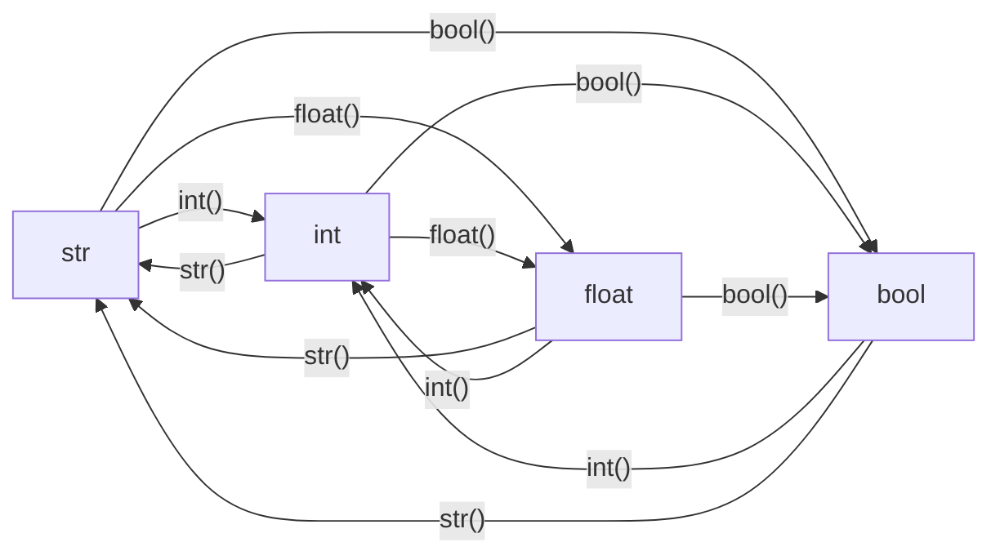
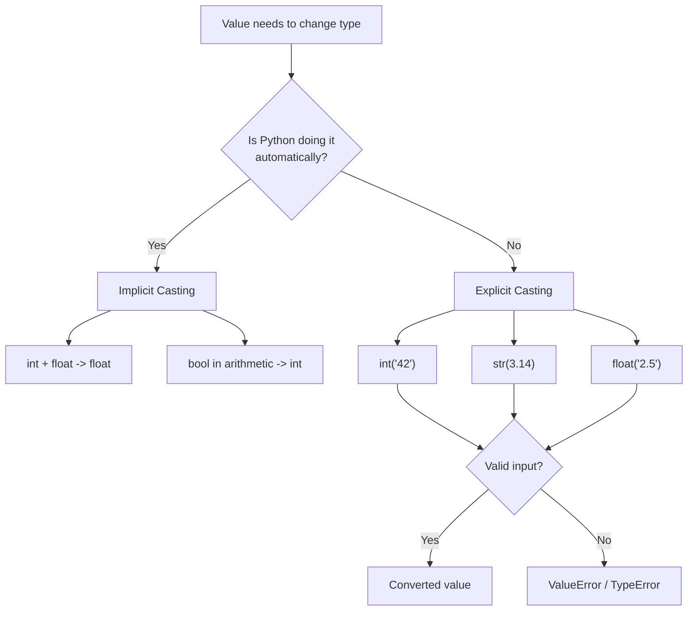
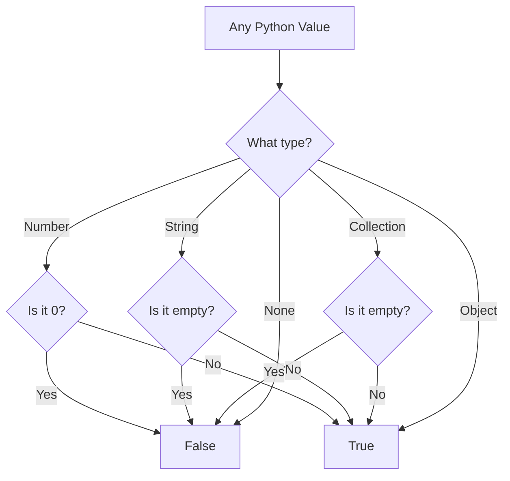

# Python Type Casting -- Junior Level

## Table of Contents

1. [Introduction](#introduction)
2. [Prerequisites](#prerequisites)
3. [Glossary](#glossary)
4. [Core Concepts](#core-concepts)
5. [Real-World Analogies](#real-world-analogies)
6. [Mental Models](#mental-models)
7. [Pros & Cons](#pros--cons)
8. [Use Cases](#use-cases)
9. [Code Examples](#code-examples)
10. [Clean Code](#clean-code)
11. [Product Use / Feature](#product-use--feature)
12. [Error Handling](#error-handling)
13. [Security Considerations](#security-considerations)
14. [Performance Tips](#performance-tips)
15. [Metrics & Analytics](#metrics--analytics)
16. [Best Practices](#best-practices)
17. [Edge Cases & Pitfalls](#edge-cases--pitfalls)
18. [Common Mistakes](#common-mistakes)
19. [Common Misconceptions](#common-misconceptions)
20. [Tricky Points](#tricky-points)
21. [Test](#test)
22. [Tricky Questions](#tricky-questions)
23. [Cheat Sheet](#cheat-sheet)
24. [Self-Assessment Checklist](#self-assessment-checklist)
25. [Summary](#summary)
26. [What You Can Build](#what-you-can-build)
27. [Further Reading](#further-reading)
28. [Related Topics](#related-topics)
29. [Diagrams & Visual Aids](#diagrams--visual-aids)

---

## Introduction

> Focus: "What is it?" and "How to use it?"

**Type casting** (also called type conversion) is the process of converting a value from one data type to another. For example, turning the string `"42"` into the integer `42`, or converting an integer `10` to a float `10.0`. Every Python program that reads user input, processes files, or communicates over a network needs type casting because data often arrives as strings and must be converted to numbers (or other types) before you can do anything useful with it.

Python provides built-in functions like `int()`, `float()`, `str()`, and `bool()` for explicit conversions, and also performs some conversions automatically (implicit casting).

---

## Prerequisites

What you should know before studying this topic:

- **Required:** Basic Python syntax -- how to write and run a `.py` file
- **Required:** Variables and data types -- understanding `int`, `float`, `str`, `bool`, `list`, `tuple`, `set`, `dict`
- **Required:** Conditionals (`if`/`elif`/`else`) -- helps understand truthiness and `bool()` casting
- **Helpful but not required:** Functions -- helps organize conversion logic

---

## Glossary

| Term | Definition |
|------|-----------|
| **Type casting** | Converting a value from one data type to another |
| **Explicit conversion** | When you intentionally convert a type using a built-in function like `int()` or `str()` |
| **Implicit conversion** | When Python automatically converts a type during an operation (e.g., `int + float` becomes `float`) |
| **Type coercion** | Another name for implicit conversion -- Python "coerces" one type into another |
| **Truthy** | A value that evaluates to `True` when converted to `bool` |
| **Falsy** | A value that evaluates to `False` when converted to `bool` (e.g., `0`, `""`, `None`, `[]`) |
| **`int()`** | Built-in function that converts a value to an integer |
| **`float()`** | Built-in function that converts a value to a floating-point number |
| **`str()`** | Built-in function that converts a value to a string |
| **`bool()`** | Built-in function that converts a value to a boolean (`True` or `False`) |

---

## Core Concepts

### Concept 1: Explicit Type Casting with Built-in Functions

Python provides built-in functions to convert between types. You call the target type as a function and pass the value to convert.

```python
# String to integer
age_str = "25"
age = int(age_str)
print(age, type(age))  # 25 <class 'int'>

# Integer to float
x = float(10)
print(x)  # 10.0

# Number to string
price = str(19.99)
print(price, type(price))  # 19.99 <class 'str'>

# Value to boolean
print(bool(1))    # True
print(bool(0))    # False
print(bool(""))   # False
print(bool("hi")) # True
```

### Concept 2: Implicit Type Casting (Type Coercion)

Python automatically converts types in certain operations. When you mix `int` and `float` in arithmetic, the `int` is promoted to `float`.

```python
# Python automatically converts int to float
result = 5 + 2.5
print(result, type(result))  # 7.5 <class 'float'>

# Boolean is treated as int in arithmetic
total = True + True + False
print(total)  # 2 (True=1, False=0)

# String concatenation requires explicit conversion
name = "Alice"
age = 30
# print(name + age)  # TypeError!
print(name + " is " + str(age))  # Alice is 30
```

### Concept 3: Converting Between Collection Types

You can convert between `list`, `tuple`, `set`, and `dict` using their built-in constructors.

```python
# List to tuple
my_list = [1, 2, 3]
my_tuple = tuple(my_list)
print(my_tuple)  # (1, 2, 3)

# Tuple to set (removes duplicates)
my_tuple = (1, 2, 2, 3, 3)
my_set = set(my_tuple)
print(my_set)  # {1, 2, 3}

# Set to list
my_set = {3, 1, 2}
my_list = list(my_set)
print(sorted(my_list))  # [1, 2, 3]

# List of pairs to dict
pairs = [("a", 1), ("b", 2), ("c", 3)]
my_dict = dict(pairs)
print(my_dict)  # {'a': 1, 'b': 2, 'c': 3}
```

### Concept 4: Number System Conversions

Python has built-in functions for converting between number systems and character codes.

```python
# Integer to binary, hex, octal strings
print(bin(42))   # '0b101010'
print(hex(255))  # '0xff'
print(oct(8))    # '0o10'

# Character to ASCII code and back
print(ord('A'))  # 65
print(chr(65))   # 'A'

# Convert from binary/hex/octal strings to int
print(int('101010', 2))  # 42 (binary to int)
print(int('ff', 16))     # 255 (hex to int)
print(int('10', 8))      # 8 (octal to int)
```

### Concept 5: The `complex()` Function

Python supports complex numbers with `complex()`.

```python
# Create complex numbers
z1 = complex(3, 4)      # 3 + 4j
z2 = complex("2+5j")    # 2 + 5j (from string)
print(z1)               # (3+4j)
print(z1.real)          # 3.0
print(z1.imag)          # 4.0
```

---

## Real-World Analogies

| Concept | Analogy |
|---------|--------|
| **Explicit casting** | Like converting currency -- you go to an exchange counter (function) and explicitly ask to convert dollars to euros |
| **Implicit casting** | Like your phone automatically adjusting time zones when you travel -- it happens behind the scenes |
| **Type mismatch error** | Like trying to plug a US charger into a European outlet -- the shapes (types) do not match |
| **bool() casting** | Like a light switch -- everything is either ON (truthy) or OFF (falsy), no matter what the original value was |

---

## Mental Models

How to picture type casting in your head:

**The intuition:** Think of each data type as a different shaped container. Type casting is like pouring water (your data) from one container shape into another. Sometimes the water fits perfectly (`int` to `float`), sometimes you lose some (`float` to `int` drops decimals), and sometimes it just does not work (`"hello"` to `int`).

**Why this model helps:** It reminds you that conversions can lose information (truncation) or fail entirely (ValueError), so you should always validate input before casting.

---

## Pros & Cons

| Pros | Cons |
|------|------|
| Makes data interoperable between different types | Can lose precision (`float` to `int` truncates) |
| Simple, readable syntax (`int()`, `str()`, etc.) | Can raise exceptions on invalid input |
| Implicit casting reduces boilerplate code | Implicit casting can hide bugs |
| Essential for user input processing | Beginners may confuse which direction to cast |

### When to use:
- Processing user input (always arrives as `str`)
- Preparing data for calculations or display
- Converting between collection types

### When NOT to use:
- When types are already correct -- unnecessary casting adds noise
- When you are unsure of the input format -- validate first, cast second

---

## Use Cases

- **Use Case 1:** Reading user input -- `input()` always returns a string, so you need `int()` or `float()` to do math
- **Use Case 2:** Parsing CSV/JSON data -- numeric fields arrive as strings and need conversion
- **Use Case 3:** Displaying results -- converting numbers to strings for `print()` or template formatting
- **Use Case 4:** Database operations -- converting between Python types and SQL types
- **Use Case 5:** Removing duplicates -- converting a `list` to a `set` and back

---

## Code Examples

### Example 1: Temperature Converter

```python
def celsius_to_fahrenheit(celsius_str: str) -> str:
    """Convert a Celsius temperature string to Fahrenheit."""
    celsius = float(celsius_str)          # str -> float
    fahrenheit = celsius * 9 / 5 + 32
    return str(round(fahrenheit, 1))      # float -> str

# Test
temp_input = "100"
result = celsius_to_fahrenheit(temp_input)
print(f"{temp_input}C = {result}F")  # 100C = 212.0F
```

**What it does:** Converts a string temperature from Celsius to Fahrenheit, demonstrating str-to-float and float-to-str casting.

### Example 2: Safe Input Conversion

```python
def get_positive_integer(prompt: str) -> int:
    """Repeatedly ask the user until they enter a valid positive integer."""
    while True:
        user_input = input(prompt)
        try:
            value = int(user_input)
            if value > 0:
                return value
            print("Please enter a positive number.")
        except ValueError:
            print(f"'{user_input}' is not a valid integer. Try again.")

# Usage:
# age = get_positive_integer("Enter your age: ")
# print(f"You are {age} years old.")
```

**What it does:** Safely converts user input to an integer with validation and error handling.

### Example 3: Collection Type Conversions

```python
def unique_sorted_items(items: list) -> list:
    """Remove duplicates and return a sorted list."""
    unique = set(items)     # list -> set (removes duplicates)
    result = list(unique)   # set -> list
    result.sort()           # sort in place
    return result

# Test
words = ["banana", "apple", "cherry", "apple", "banana"]
print(unique_sorted_items(words))  # ['apple', 'banana', 'cherry']
```

**What it does:** Shows practical collection type conversion for deduplication.

### Example 4: Number System Display

```python
def number_info(n: int) -> None:
    """Display a number in decimal, binary, hex, and octal."""
    print(f"Decimal:  {n}")
    print(f"Binary:   {bin(n)}")
    print(f"Hex:      {hex(n)}")
    print(f"Octal:    {oct(n)}")
    print(f"Character:{chr(n) if 32 <= n <= 126 else 'N/A'}")

number_info(65)
# Decimal:  65
# Binary:   0b1000001
# Hex:      0x41
# Octal:    0o101
# Character:A
```

---

## Clean Code

### Naming

```python
# Bad
x = int(y)
a = str(b)

# Good -- descriptive names show intent
user_age = int(age_input)
price_display = str(total_price)
unique_tags = list(set(raw_tags))
```

### Avoid Unnecessary Casting

```python
# Bad -- x is already an int
x = 42
y = int(x)  # unnecessary

# Good -- cast only when types differ
x = 42
y = x  # already the right type
```

### Use f-strings Instead of str() for Display

```python
# Verbose
message = "Score: " + str(score) + " out of " + str(total)

# Clean -- f-string handles conversion automatically
message = f"Score: {score} out of {total}"
```

---

## Product Use / Feature

### 1. Django Web Framework

- **How it uses Type Casting:** URL parameters and form data arrive as strings; Django casts them to `int`, `float`, `date`, etc. via model fields and form validators.
- **Why it matters:** Ensures data integrity before database storage.

### 2. pandas (Data Analysis Library)

- **How it uses Type Casting:** `astype()` converts DataFrame columns between types; `pd.to_numeric()`, `pd.to_datetime()` handle messy real-world data.
- **Why it matters:** Data analysis requires consistent types for aggregation and visualization.

### 3. Flask / FastAPI

- **How it uses Type Casting:** Query parameters from HTTP requests are strings; frameworks cast them to typed function parameters automatically.
- **Why it matters:** Type safety in API endpoints prevents bugs and improves documentation.

---

## Error Handling

### Error 1: `ValueError` -- Invalid Literal

```python
# This raises ValueError
int("hello")
# ValueError: invalid literal for int() with base 10: 'hello'
```

**Why it happens:** The string does not represent a valid integer.

**How to fix:**

```python
def safe_int(value: str, default: int = 0) -> int:
    """Convert string to int, returning default on failure."""
    try:
        return int(value)
    except ValueError:
        return default

print(safe_int("42"))      # 42
print(safe_int("hello"))   # 0
print(safe_int("", -1))    # -1
```

### Error 2: `TypeError` -- Unsupported Operand Types

```python
# This raises TypeError
result = "Age: " + 25
# TypeError: can only concatenate str (not "int") to str
```

**Why it happens:** Python does not implicitly convert `int` to `str` for concatenation.

**How to fix:**

```python
# Option 1: Explicit conversion
result = "Age: " + str(25)

# Option 2: f-string (preferred)
result = f"Age: {25}"
```

### Error 3: `ValueError` -- Float String to int()

```python
# This raises ValueError
int("3.14")
# ValueError: invalid literal for int() with base 10: '3.14'
```

**How to fix:**

```python
# Convert to float first, then to int
value = int(float("3.14"))
print(value)  # 3
```

---

## Security Considerations

### 1. Never Use `eval()` for Type Conversion

```python
# INSECURE -- eval can execute arbitrary code
user_input = "__import__('os').system('rm -rf /')"
# result = eval(user_input)  # DANGEROUS!

# SAFE -- use specific conversion functions
result = int(user_input)  # Raises ValueError safely
```

**Risk:** `eval()` executes any Python expression, enabling code injection attacks.
**Mitigation:** Always use `int()`, `float()`, `str()`, etc. for type conversion.

### 2. Validate Before Casting

```python
# UNSAFE -- no validation
age = int(input("Age: "))  # Crashes on non-numeric input

# SAFE -- validate first
user_input = input("Age: ")
if user_input.isdigit():
    age = int(user_input)
else:
    print("Invalid age")
```

---

## Performance Tips

### Tip 1: Use f-strings Instead of str() + Concatenation

```python
import timeit

name = "Alice"
age = 30

# Slow: string concatenation with str()
slow = timeit.timeit(lambda: "Name: " + str(name) + ", Age: " + str(age), number=1_000_000)

# Fast: f-string
fast = timeit.timeit(lambda: f"Name: {name}, Age: {age}", number=1_000_000)

print(f"Concatenation: {slow:.3f}s")
print(f"f-string:      {fast:.3f}s")
# f-strings are typically 2-3x faster
```

### Tip 2: Use `set()` for Deduplication Instead of Manual Loops

```python
# Slow: manual deduplication
def unique_slow(items):
    result = []
    for item in items:
        if item not in result:
            result.append(item)
    return result

# Fast: set conversion
def unique_fast(items):
    return list(set(items))  # O(n) vs O(n^2)
```

---

## Metrics & Analytics

| Metric | Why it matters | Tool |
|--------|---------------|------|
| **Conversion success rate** | Tracks how often user input is valid | Custom logging |
| **Conversion time** | Matters for bulk data processing | `time.perf_counter()` |
| **ValueError frequency** | Indicates bad data or poor UI guidance | `logging` module |

```python
import time
import logging

logger = logging.getLogger(__name__)

start = time.perf_counter()
converted_values = [int(x) for x in string_list]
elapsed = time.perf_counter() - start
logger.info("Converted %d values in %.3fs", len(converted_values), elapsed)
```

---

## Best Practices

- **Always validate before casting:** Use `try/except` or `.isdigit()` checks before converting user input.
- **Use f-strings for string formatting:** Avoid `str()` + concatenation when displaying values.
- **Be explicit about truncation:** When converting `float` to `int`, use `round()`, `math.floor()`, or `math.ceil()` to show intent.
- **Prefer collection constructors for type conversion:** Use `list()`, `tuple()`, `set()` to convert between iterables.
- **Never use `eval()` for parsing:** Always use specific type constructors.

---

## Edge Cases & Pitfalls

### Pitfall 1: `int()` Truncates, It Does Not Round

```python
print(int(3.9))    # 3 (not 4!)
print(int(-3.9))   # -3 (truncates toward zero)

# If you want rounding:
print(round(3.9))  # 4
```

### Pitfall 2: `bool()` on Non-Empty Collections

```python
print(bool([]))       # False (empty list)
print(bool([0]))      # True (non-empty, even though element is falsy!)
print(bool(""))       # False (empty string)
print(bool(" "))      # True (space is a character!)
print(bool("False"))  # True (non-empty string!)
```

### Pitfall 3: `float("inf")` and `float("nan")`

```python
x = float("inf")
print(x > 1_000_000_000)  # True
print(x + 1 == x)          # True (still infinity)

y = float("nan")
print(y == y)  # False! NaN is not equal to itself
```

---

## Common Mistakes

### Mistake 1: Forgetting That `input()` Returns a String

```python
# Wrong
age = input("Age: ")
if age > 18:  # TypeError: '>' not supported between str and int
    print("Adult")

# Correct
age = int(input("Age: "))
if age > 18:
    print("Adult")
```

### Mistake 2: Converting "3.14" Directly to int()

```python
# Wrong
value = int("3.14")  # ValueError!

# Correct
value = int(float("3.14"))  # 3
```

### Mistake 3: Comparing Types Instead of Casting

```python
# Wrong
user_input = input("Number: ")
if type(user_input) == int:  # Always False! input() returns str
    print("It's a number")

# Correct
try:
    number = int(user_input)
    print("It's a number")
except ValueError:
    print("Not a number")
```

---

## Common Misconceptions

### Misconception 1: "`int()` rounds floats"

**Reality:** `int()` truncates toward zero, it does not round. `int(3.9)` is `3`, not `4`. Use `round()` for rounding.

**Why people think this:** In everyday life, we round 3.9 to 4, so people assume `int()` does the same.

### Misconception 2: "`bool('False')` returns `False`"

**Reality:** `bool('False')` returns `True` because `'False'` is a non-empty string. Only `bool('')` is `False`.

**Why people think this:** The string says "False", so it seems logical it would be `False`.

### Misconception 3: "Python automatically converts strings to numbers when needed"

**Reality:** Python does NOT implicitly convert strings to numbers. `"5" + 3` raises `TypeError`, unlike JavaScript where it would produce `"53"`.

**Why people think this:** Coming from JavaScript or PHP where loose typing handles such conversions automatically.

---

## Tricky Points

### Tricky Point 1: Boolean Arithmetic

```python
# Booleans are subclass of int
print(True + True)    # 2
print(True * 10)      # 10
print(sum([True, False, True, True]))  # 3
print(isinstance(True, int))  # True
```

**Why it's tricky:** `bool` is a subclass of `int` in Python, so `True` behaves like `1` and `False` like `0` in arithmetic.
**Key takeaway:** This is useful for counting truthy values with `sum()`.

### Tricky Point 2: `int()` with Different Bases

```python
print(int('0xFF', 16))   # 255
print(int('0b1010', 2))  # 10
print(int('0o77', 8))    # 63
print(int('10', 2))      # 2 (not 10!)
print(int('10', 8))      # 8 (not 10!)
```

**Why it's tricky:** The base parameter changes what the digits mean.

---

## Test

Test your understanding of type casting:

**Q1:** What is the output of `int(3.99)`?

<details>
<summary>Answer</summary>

`3` -- `int()` truncates, it does not round.

</details>

**Q2:** What is `bool([])`?

<details>
<summary>Answer</summary>

`False` -- empty collections are falsy.

</details>

**Q3:** What happens with `int("3.14")`?

<details>
<summary>Answer</summary>

`ValueError` -- you must convert to `float` first: `int(float("3.14"))`.

</details>

**Q4:** What is `bool("0")`?

<details>
<summary>Answer</summary>

`True` -- `"0"` is a non-empty string. Only `bool("")` is `False`.

</details>

**Q5:** What is the output of `True + True + False`?

<details>
<summary>Answer</summary>

`2` -- `True` is `1`, `False` is `0` in arithmetic.

</details>

**Q6:** What does `float("inf") == float("inf")` return?

<details>
<summary>Answer</summary>

`True` -- infinity equals infinity. But `float("nan") == float("nan")` is `False`.

</details>

---

## Tricky Questions

**Q1:** What is `int(True)`?

<details>
<summary>Answer</summary>

`1` -- `bool` is a subclass of `int`, and `True` has integer value `1`.

</details>

**Q2:** What is `list("hello")`?

<details>
<summary>Answer</summary>

`['h', 'e', 'l', 'l', 'o']` -- iterating over a string yields individual characters.

</details>

**Q3:** What is `tuple({3: 'a', 1: 'b', 2: 'c'})`?

<details>
<summary>Answer</summary>

`(3, 1, 2)` -- iterating over a dict yields its keys (in insertion order since Python 3.7).

</details>

---

## Cheat Sheet

| From | To | Function | Example | Result |
|------|----|----------|---------|--------|
| `str` | `int` | `int()` | `int("42")` | `42` |
| `str` | `float` | `float()` | `float("3.14")` | `3.14` |
| `int` | `str` | `str()` | `str(42)` | `"42"` |
| `float` | `int` | `int()` | `int(3.9)` | `3` (truncates) |
| `int` | `float` | `float()` | `float(10)` | `10.0` |
| `any` | `bool` | `bool()` | `bool(0)` | `False` |
| `int` | `bin` | `bin()` | `bin(10)` | `"0b1010"` |
| `int` | `hex` | `hex()` | `hex(255)` | `"0xff"` |
| `int` | `oct` | `oct()` | `oct(8)` | `"0o10"` |
| `char` | `int` | `ord()` | `ord('A')` | `65` |
| `int` | `char` | `chr()` | `chr(65)` | `"A"` |
| `list` | `tuple` | `tuple()` | `tuple([1,2])` | `(1, 2)` |
| `list` | `set` | `set()` | `set([1,1,2])` | `{1, 2}` |
| `pairs` | `dict` | `dict()` | `dict([("a",1)])` | `{"a": 1}` |
| `str` | `complex` | `complex()` | `complex("3+4j")` | `(3+4j)` |

---

## Self-Assessment Checklist

- [ ] I can convert between `int`, `float`, and `str` using built-in functions
- [ ] I understand the difference between implicit and explicit type casting
- [ ] I know what values are truthy and falsy in Python
- [ ] I can handle `ValueError` when casting fails
- [ ] I can convert between `list`, `tuple`, `set`, and `dict`
- [ ] I know how to use `bin()`, `hex()`, `oct()`, `ord()`, and `chr()`
- [ ] I never use `eval()` for type conversion

---

## Summary

Type casting converts values between data types. Python supports **explicit** casting via built-in functions (`int()`, `float()`, `str()`, `bool()`, `list()`, `tuple()`, `set()`, `dict()`, `complex()`) and **implicit** casting (automatic promotion in expressions). Always validate input before casting, handle `ValueError` and `TypeError`, and prefer f-strings for string formatting. Remember that `int()` truncates (does not round), `bool()` checks emptiness/zeroness, and `eval()` is never safe for conversion.

---

## What You Can Build

- **Unit converter** -- convert temperatures, distances, weights with input parsing
- **Calculator CLI** -- parse user-entered numbers and operations
- **CSV parser** -- read rows of strings and convert to appropriate types
- **Character code explorer** -- display ASCII/Unicode values for input characters
- **Number base converter** -- convert between decimal, binary, hex, and octal

---

## Further Reading

- [Python Official Docs: Built-in Functions](https://docs.python.org/3/library/functions.html)
- [Python Official Docs: Numeric Types](https://docs.python.org/3/library/stdtypes.html#numeric-types-int-float-complex)
- [Real Python: Basic Data Types in Python](https://realpython.com/python-data-types/)
- [PEP 285 -- Adding a bool Type](https://peps.python.org/pep-0285/)

---

## Related Topics

- [Variables and Data Types](../02-variables-and-data-types/) -- understanding what types exist
- [Conditionals](../03-conditionals/) -- truthiness is core to `if` statements
- [Exceptions](../06-exceptions/) -- handling `ValueError` and `TypeError`
- [Functions](../07-functions/) -- wrapping conversion logic in reusable functions

---

## Diagrams & Visual Aids

### Diagram 1: Type Casting Overview



### Diagram 2: Implicit vs Explicit Casting



### Diagram 3: Truthiness Decision Tree


