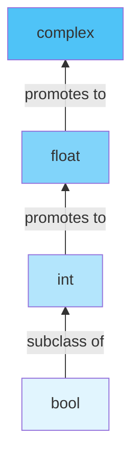
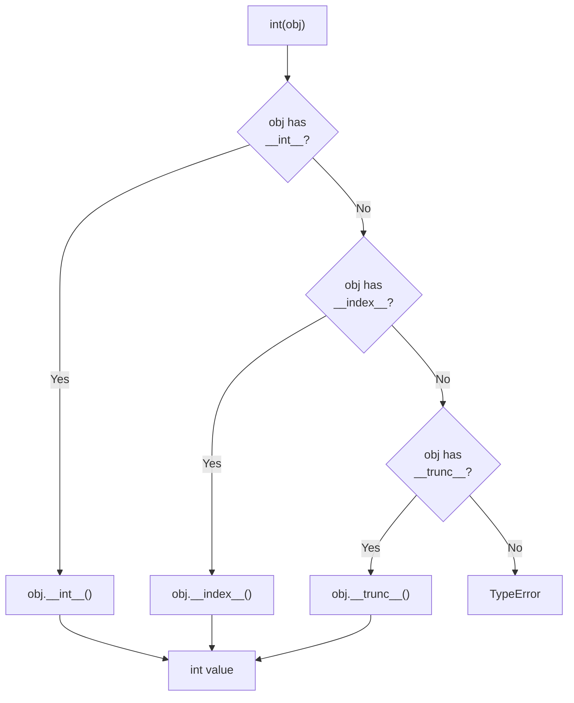
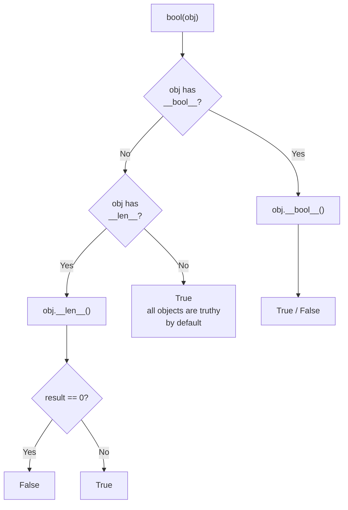

# Python Type Casting -- Middle Level

## Table of Contents

1. [Introduction](#introduction)
2. [Prerequisites](#prerequisites)
3. [Deep Dive: How Casting Actually Works](#deep-dive-how-casting-actually-works)
4. [Casting Rules and Hierarchy](#casting-rules-and-hierarchy)
5. [Advanced Conversion Patterns](#advanced-conversion-patterns)
6. [Custom Type Conversion with Dunder Methods](#custom-type-conversion-with-dunder-methods)
7. [Real-World Patterns](#real-world-patterns)
8. [Type Casting in Data Pipelines](#type-casting-in-data-pipelines)
9. [Error Handling Strategies](#error-handling-strategies)
10. [Performance Considerations](#performance-considerations)
11. [Testing Type Conversions](#testing-type-conversions)
12. [Best Practices](#best-practices)
13. [Edge Cases & Pitfalls](#edge-cases--pitfalls)
14. [Common Mistakes at Middle Level](#common-mistakes-at-middle-level)
15. [Tricky Points](#tricky-points)
16. [Test](#test)
17. [Cheat Sheet](#cheat-sheet)
18. [Diagrams & Visual Aids](#diagrams--visual-aids)

---

## Introduction

> Focus: "Why?" and "When?"

At the middle level, you understand **what** type casting does. Now it is time to understand **why** Python's casting system works the way it does, **when** to apply specific patterns, and how to implement custom type conversions for your own classes. You will learn how Python resolves type conflicts in expressions, how to build robust data processing pipelines with proper casting, and how to leverage dunder methods (`__int__`, `__float__`, `__str__`, `__bool__`, `__index__`) to make your objects castable.

---

## Prerequisites

- **Required:** Junior-level type casting -- all built-in conversion functions
- **Required:** Classes and OOP basics -- understanding `__init__`, `__repr__`, methods
- **Required:** Exception handling -- `try/except/else/finally` patterns
- **Required:** Type hints -- basic annotations with `int`, `str`, `Optional`, `Union`
- **Helpful:** `collections.abc` -- understanding of ABCs and protocols

---

## Deep Dive: How Casting Actually Works

### The Constructor Pattern

Every type conversion function in Python is actually a **class constructor**. When you call `int("42")`, you are calling the `int` class with a string argument. The `int.__new__` method handles the conversion.

```python
# These are all class constructors, not simple functions
print(type(int))    # <class 'type'>
print(type(float))  # <class 'type'>
print(type(str))    # <class 'type'>
print(type(bool))   # <class 'type'>

# int() calls int.__new__(int, "42") internally
result = int.__new__(int, "42")
print(result)  # 42
```

### The Dunder Method Protocol

When Python needs to convert an object, it looks for specific dunder methods:

```python
class Temperature:
    def __init__(self, celsius: float):
        self.celsius = celsius

    def __int__(self) -> int:
        """Called by int(temperature_obj)."""
        return int(self.celsius)

    def __float__(self) -> float:
        """Called by float(temperature_obj)."""
        return self.celsius

    def __str__(self) -> str:
        """Called by str(temperature_obj) and print()."""
        return f"{self.celsius:.1f}C"

    def __bool__(self) -> bool:
        """Called by bool(temperature_obj) and in if-statements."""
        return self.celsius != 0.0

    def __repr__(self) -> str:
        """Called by repr(temperature_obj) and in REPL."""
        return f"Temperature({self.celsius!r})"


t = Temperature(36.6)
print(int(t))       # 36
print(float(t))     # 36.6
print(str(t))       # 36.6C
print(bool(t))      # True
print(repr(t))      # Temperature(36.6)

# bool() in conditionals
if t:
    print("Non-zero temperature")
```

### The `__index__` Method

`__index__` is used when Python needs an exact integer (for slicing, indexing, `bin()`, `hex()`, `oct()`):

```python
class PageNumber:
    def __init__(self, page: int):
        self._page = page

    def __index__(self) -> int:
        """Used by slicing, bin(), hex(), oct(), and as list index."""
        return self._page

    def __int__(self) -> int:
        return self._page


p = PageNumber(5)
my_list = [10, 20, 30, 40, 50, 60]

print(my_list[p])   # 60 -- uses __index__
print(bin(p))        # 0b101 -- uses __index__
print(hex(p))        # 0x5 -- uses __index__
print(int(p))        # 5 -- uses __int__
```

---

## Casting Rules and Hierarchy

### Numeric Promotion Hierarchy

Python follows a strict hierarchy for implicit numeric conversions:

```python
# bool -> int -> float -> complex
# When mixing types, Python promotes to the "wider" type

result1 = True + 3          # bool + int -> int: 4
result2 = 3 + 2.5           # int + float -> float: 5.5
result3 = 2.5 + (1 + 2j)   # float + complex -> complex: (3.5+2j)
result4 = True + 2.5        # bool -> int -> float: 3.5

print(type(result1))  # <class 'int'>
print(type(result2))  # <class 'float'>
print(type(result3))  # <class 'complex'>
print(type(result4))  # <class 'float'>
```

### The `__radd__` / Reflected Operators Pattern

When the left operand does not know how to handle the operation, Python tries the right operand's reflected method:

```python
class Meters:
    def __init__(self, value: float):
        self.value = value

    def __add__(self, other):
        if isinstance(other, (int, float)):
            return Meters(self.value + other)
        if isinstance(other, Meters):
            return Meters(self.value + other.value)
        return NotImplemented

    def __radd__(self, other):
        """Called when: other + Meters (and other.__add__ returns NotImplemented)."""
        return self.__add__(other)

    def __float__(self):
        return self.value

    def __repr__(self):
        return f"Meters({self.value})"


m = Meters(5.0)
print(m + 3)        # Meters(8.0) -- __add__
print(3 + m)        # Meters(8.0) -- int.__add__ fails -> Meters.__radd__
print(m + m)        # Meters(10.0)
print(float(m))     # 5.0
```

---

## Advanced Conversion Patterns

### Pattern 1: Multi-format String Parsing

```python
from typing import Optional
import re


def smart_int(value: str) -> Optional[int]:
    """Parse an integer from various string formats."""
    value = value.strip()

    # Handle hex
    if value.lower().startswith(('0x', '#')):
        clean = value.lstrip('#').lstrip('0x').lstrip('0X')
        return int(clean, 16) if clean else 0

    # Handle binary
    if value.lower().startswith('0b'):
        return int(value, 2)

    # Handle octal
    if value.lower().startswith('0o'):
        return int(value, 8)

    # Handle comma-separated numbers: "1,000,000"
    if ',' in value:
        value = value.replace(',', '')

    # Handle float strings: "3.14" -> 3
    if '.' in value:
        return int(float(value))

    try:
        return int(value)
    except ValueError:
        return None


# Tests
assert smart_int("42") == 42
assert smart_int("0xFF") == 255
assert smart_int("#FF") == 255
assert smart_int("0b1010") == 10
assert smart_int("0o77") == 63
assert smart_int("1,000,000") == 1_000_000
assert smart_int("3.14") == 3
assert smart_int("hello") is None
print("All tests passed!")
```

### Pattern 2: Type-Safe Conversion with Union Types

```python
from typing import Union


def to_number(value: Union[str, int, float, bool]) -> Union[int, float]:
    """Convert any reasonable value to a number.

    Booleans are converted to int (True->1, False->0).
    Strings are parsed as int or float.
    """
    if isinstance(value, bool):
        # Must check bool before int (bool is subclass of int)
        return int(value)

    if isinstance(value, int):
        return value

    if isinstance(value, float):
        return value

    # It's a string
    value = value.strip()
    try:
        # Try int first
        return int(value)
    except ValueError:
        try:
            return float(value)
        except ValueError:
            raise ValueError(f"Cannot convert {value!r} to a number")


# Tests
assert to_number(42) == 42
assert to_number(3.14) == 3.14
assert to_number("100") == 100
assert to_number("2.5") == 2.5
assert to_number(True) == 1
assert to_number(False) == 0
print("All tests passed!")
```

### Pattern 3: Enum-Aware Casting

```python
from enum import IntEnum, Enum


class Priority(IntEnum):
    LOW = 1
    MEDIUM = 2
    HIGH = 3
    CRITICAL = 4


class Color(Enum):
    RED = "red"
    GREEN = "green"
    BLUE = "blue"


# IntEnum values can be used as int directly
p = Priority.HIGH
print(int(p))      # 3
print(p + 1)       # 4 (works because IntEnum is int subclass)
print(p > 2)       # True

# Regular Enum requires explicit access to .value
c = Color.RED
print(c.value)     # "red"
# print(int(c))    # TypeError -- Color is not IntEnum

# Converting string to Enum member
priority_from_str = Priority["HIGH"]      # By name
priority_from_int = Priority(3)           # By value
color_from_str = Color("red")             # By value
print(priority_from_str, priority_from_int, color_from_str)
```

---

## Custom Type Conversion with Dunder Methods

### Full Protocol Implementation

```python
import math


class Money:
    """A class that supports all standard type conversions."""

    def __init__(self, amount: float, currency: str = "USD"):
        self._amount = round(amount, 2)
        self._currency = currency

    # -- Numeric conversions --
    def __int__(self) -> int:
        return int(self._amount)

    def __float__(self) -> float:
        return float(self._amount)

    def __complex__(self) -> complex:
        return complex(self._amount)

    # -- String conversions --
    def __str__(self) -> str:
        return f"{self._currency} {self._amount:,.2f}"

    def __repr__(self) -> str:
        return f"Money({self._amount!r}, {self._currency!r})"

    # -- Boolean conversion --
    def __bool__(self) -> bool:
        return self._amount != 0

    # -- Index conversion (for use in slicing, bin(), hex(), oct()) --
    def __index__(self) -> int:
        if self._amount != int(self._amount):
            raise TypeError("Cannot use fractional Money as index")
        return int(self._amount)

    # -- Format protocol --
    def __format__(self, spec: str) -> str:
        if spec == "short":
            return f"{self._currency}{self._amount:.0f}"
        if spec == "full":
            return f"{self._amount:,.2f} {self._currency}"
        return str(self)

    # -- Comparison for truthiness context --
    def __eq__(self, other):
        if isinstance(other, Money):
            return self._amount == other._amount and self._currency == other._currency
        return NotImplemented

    def __hash__(self):
        return hash((self._amount, self._currency))


# Usage
price = Money(1234.56, "USD")
print(int(price))         # 1234
print(float(price))       # 1234.56
print(str(price))         # USD 1,234.56
print(repr(price))        # Money(1234.56, 'USD')
print(bool(price))        # True
print(bool(Money(0)))     # False
print(f"{price:short}")   # USD1235
print(f"{price:full}")    # 1,234.56 USD

# __index__ usage
whole = Money(5)
print(bin(whole))          # 0b101
items = ["a", "b", "c", "d", "e", "f"]
print(items[whole])        # f
```

---

## Real-World Patterns

### Pattern 1: Configuration Parsing

```python
from typing import Any, Dict


class Config:
    """Parse configuration values from string-based sources."""

    TRUTHY = {"true", "yes", "1", "on", "enabled"}
    FALSY = {"false", "no", "0", "off", "disabled"}

    @staticmethod
    def as_bool(value: str) -> bool:
        """Convert common string representations to bool."""
        lower = value.strip().lower()
        if lower in Config.TRUTHY:
            return True
        if lower in Config.FALSY:
            return False
        raise ValueError(f"Cannot interpret {value!r} as boolean")

    @staticmethod
    def as_int(value: str, default: int = 0) -> int:
        try:
            return int(value)
        except (ValueError, TypeError):
            return default

    @staticmethod
    def as_float(value: str, default: float = 0.0) -> float:
        try:
            return float(value)
        except (ValueError, TypeError):
            return default

    @staticmethod
    def as_list(value: str, sep: str = ",") -> list:
        """Split a string into a list, stripping whitespace."""
        return [item.strip() for item in value.split(sep) if item.strip()]


# Simulating environment variable parsing
env = {
    "DEBUG": "true",
    "PORT": "8080",
    "RATE_LIMIT": "1.5",
    "ALLOWED_HOSTS": "localhost, 127.0.0.1, example.com",
    "VERBOSE": "off",
}

debug = Config.as_bool(env["DEBUG"])           # True
port = Config.as_int(env["PORT"])              # 8080
rate = Config.as_float(env["RATE_LIMIT"])      # 1.5
hosts = Config.as_list(env["ALLOWED_HOSTS"])   # ['localhost', '127.0.0.1', 'example.com']
verbose = Config.as_bool(env["VERBOSE"])       # False

print(f"debug={debug}, port={port}, rate={rate}, hosts={hosts}, verbose={verbose}")
```

### Pattern 2: Data Cleaning Pipeline

```python
from typing import List, Dict, Any, Optional
from datetime import datetime


def clean_record(raw: Dict[str, str]) -> Dict[str, Any]:
    """Clean and cast a raw string-based record to proper types."""
    def safe_float(val: str) -> Optional[float]:
        try:
            return float(val) if val.strip() else None
        except ValueError:
            return None

    def safe_date(val: str) -> Optional[datetime]:
        for fmt in ("%Y-%m-%d", "%m/%d/%Y", "%d.%m.%Y"):
            try:
                return datetime.strptime(val.strip(), fmt)
            except ValueError:
                continue
        return None

    return {
        "name": str(raw.get("name", "")).strip().title(),
        "age": int(raw["age"]) if raw.get("age", "").isdigit() else None,
        "salary": safe_float(raw.get("salary", "")),
        "active": raw.get("active", "").lower() in ("true", "yes", "1"),
        "hire_date": safe_date(raw.get("hire_date", "")),
    }


# Test
raw_data = [
    {"name": "alice smith", "age": "30", "salary": "75000.50", "active": "yes", "hire_date": "2023-01-15"},
    {"name": "BOB JONES", "age": "bad", "salary": "", "active": "false", "hire_date": "12/25/2022"},
    {"name": "charlie", "age": "25", "salary": "60000", "active": "1", "hire_date": "31.12.2021"},
]

for record in raw_data:
    cleaned = clean_record(record)
    print(cleaned)
```

---

## Type Casting in Data Pipelines

### Using `map()` for Bulk Conversion

```python
# Convert a list of string numbers to integers
raw_values = ["1", "2", "3", "4", "5"]
numbers = list(map(int, raw_values))
print(numbers)  # [1, 2, 3, 4, 5]

# Convert with error handling using a generator
def safe_map(func, iterable):
    """Apply func to each item, yielding (value, error) tuples."""
    for item in iterable:
        try:
            yield (func(item), None)
        except (ValueError, TypeError) as e:
            yield (None, str(e))


data = ["10", "20", "bad", "40", "N/A"]
for value, error in safe_map(int, data):
    if error:
        print(f"  Skipped: {error}")
    else:
        print(f"  Converted: {value}")
```

### Using `struct` for Binary Data Casting

```python
import struct

# Pack Python values into binary bytes
packed = struct.pack(">if", 42, 3.14)  # big-endian int + float
print(packed)           # b'\x00\x00\x00*@H\xf5\xc3'
print(len(packed))      # 8 bytes

# Unpack binary bytes back to Python values
integer, floating = struct.unpack(">if", packed)
print(integer, floating)  # 42 3.140000104904175

# Useful for network protocols, file formats, hardware communication
```

---

## Error Handling Strategies

### Strategy 1: The Converter Pattern

```python
from typing import TypeVar, Type, Optional, Callable

T = TypeVar('T')


def convert(value: str, target: Type[T], default: Optional[T] = None,
            validator: Optional[Callable[[T], bool]] = None) -> Optional[T]:
    """Generic type converter with validation."""
    try:
        result = target(value)
        if validator and not validator(result):
            return default
        return result
    except (ValueError, TypeError):
        return default


# Usage
age = convert("25", int, default=0, validator=lambda x: 0 < x < 150)
print(age)  # 25

bad_age = convert("-5", int, default=0, validator=lambda x: 0 < x < 150)
print(bad_age)  # 0 (failed validation)

price = convert("19.99", float, default=0.0)
print(price)  # 19.99

invalid = convert("abc", int, default=-1)
print(invalid)  # -1
```

### Strategy 2: Logging Failed Conversions

```python
import logging
from typing import List, Tuple

logger = logging.getLogger(__name__)


def batch_convert(values: List[str], target_type: type) -> Tuple[list, list]:
    """Convert a batch of values, separating successes and failures."""
    successes = []
    failures = []

    for i, val in enumerate(values):
        try:
            successes.append(target_type(val))
        except (ValueError, TypeError) as e:
            failures.append((i, val, str(e)))
            logger.warning("Conversion failed at index %d: %r -> %s", i, val, e)

    return successes, failures


# Test
data = ["1", "2.5", "three", "4", "", "6"]
good, bad = batch_convert(data, int)
print(f"Converted: {good}")   # [1, 4, 6]
print(f"Failed: {bad}")       # [(1, '2.5', ...), (2, 'three', ...), (4, '', ...)]
```

---

## Performance Considerations

### Benchmarking Different Conversion Approaches

```python
import timeit

data = [str(i) for i in range(100_000)]

# Method 1: list comprehension with int()
t1 = timeit.timeit(lambda: [int(x) for x in data], number=50)

# Method 2: map(int, ...)
t2 = timeit.timeit(lambda: list(map(int, data)), number=50)

# Method 3: numpy (if available)
try:
    import numpy as np
    t3 = timeit.timeit(lambda: np.array(data, dtype=int), number=50)
    print(f"numpy:              {t3:.3f}s")
except ImportError:
    t3 = None

print(f"List comprehension: {t1:.3f}s")
print(f"map(int, ...):      {t2:.3f}s")
# map() is typically 10-20% faster than comprehension for simple casts
```

### Caching Repeated Conversions

```python
from functools import lru_cache


@lru_cache(maxsize=1024)
def parse_color(hex_str: str) -> tuple:
    """Parse a hex color string to an (R, G, B) tuple. Cached."""
    hex_str = hex_str.lstrip('#')
    return (
        int(hex_str[0:2], 16),
        int(hex_str[2:4], 16),
        int(hex_str[4:6], 16),
    )


# First call parses; subsequent calls hit the cache
print(parse_color("#FF5733"))  # (255, 87, 51)
print(parse_color("#FF5733"))  # cached
print(parse_color.cache_info())
```

---

## Testing Type Conversions

```python
import unittest


class TestTypeCasting(unittest.TestCase):
    """Test custom type conversion functions."""

    def test_int_from_valid_string(self):
        self.assertEqual(int("42"), 42)

    def test_int_from_float_string_raises(self):
        with self.assertRaises(ValueError):
            int("3.14")

    def test_float_preserves_precision(self):
        self.assertAlmostEqual(float("3.14159"), 3.14159, places=5)

    def test_bool_truthy_values(self):
        for val in [1, -1, "hello", [1], {1: 2}]:
            self.assertTrue(bool(val), f"{val!r} should be truthy")

    def test_bool_falsy_values(self):
        for val in [0, 0.0, "", [], {}, set(), None, False]:
            self.assertFalse(bool(val), f"{val!r} should be falsy")

    def test_collection_roundtrip(self):
        original = [1, 2, 3]
        self.assertEqual(list(tuple(original)), original)

    def test_set_removes_duplicates(self):
        self.assertEqual(set([1, 1, 2, 2, 3]), {1, 2, 3})

    def test_dict_from_pairs(self):
        pairs = [("a", 1), ("b", 2)]
        self.assertEqual(dict(pairs), {"a": 1, "b": 2})

    def test_int_truncates_not_rounds(self):
        self.assertEqual(int(3.9), 3)
        self.assertEqual(int(-3.9), -3)

    def test_ord_chr_roundtrip(self):
        for char in "AZaz09":
            self.assertEqual(chr(ord(char)), char)


if __name__ == "__main__":
    unittest.main()
```

---

## Best Practices

- **Check `bool` before `int` in isinstance:** Since `bool` is a subclass of `int`, `isinstance(True, int)` is `True`. Always check `isinstance(x, bool)` first.
- **Implement `__repr__` alongside `__str__`:** `__repr__` is for debugging, `__str__` is for display. Both are important.
- **Use `__index__` for integer-like objects:** If your class represents an integer value and should work with slicing/indexing, implement `__index__`.
- **Prefer `map()` over comprehensions for simple type casts:** `list(map(int, strings))` is slightly faster and more idiomatic for pure type conversion.
- **Always return `NotImplemented` from dunder methods on type mismatch:** This lets Python try the reflected method on the other operand.
- **Use type hints to document expected conversions:** `def process(value: Union[str, int]) -> int:` makes intent clear.

---

## Edge Cases & Pitfalls

### Pitfall 1: `bool` is a Subclass of `int`

```python
# This catches True/False as well!
isinstance(True, int)   # True
isinstance(False, int)  # True

# Always check bool FIRST
def classify(value):
    if isinstance(value, bool):
        return "boolean"
    elif isinstance(value, int):
        return "integer"
    return "other"

print(classify(True))   # "boolean" (correct)
print(classify(42))     # "integer" (correct)
```

### Pitfall 2: `float` Precision Loss

```python
# Float has limited precision
print(int(float("999999999999999999")))  # 1000000000000000000 (wrong!)
print(int("999999999999999999"))          # 999999999999999999 (correct)

# Lesson: Don't route through float when you need exact large integers
```

### Pitfall 3: `dict()` Silently Overwrites Duplicate Keys

```python
pairs = [("a", 1), ("b", 2), ("a", 3)]
result = dict(pairs)
print(result)  # {'a': 3, 'b': 2} -- first 'a' is silently overwritten!
```

---

## Common Mistakes at Middle Level

### Mistake 1: Not Returning `NotImplemented`

```python
class Celsius:
    def __init__(self, temp):
        self.temp = temp

    # Bad: raises TypeError instead of letting Python try __radd__
    def __add__(self, other):
        if not isinstance(other, Celsius):
            raise TypeError("Can only add Celsius")  # BAD
        return Celsius(self.temp + other.temp)

    # Good: return NotImplemented
    def __add__(self, other):
        if isinstance(other, (int, float)):
            return Celsius(self.temp + other)
        if isinstance(other, Celsius):
            return Celsius(self.temp + other.temp)
        return NotImplemented  # Let Python try other.__radd__
```

### Mistake 2: Forgetting `__hash__` When Defining `__eq__`

```python
class Point:
    def __init__(self, x, y):
        self.x = x
        self.y = y

    def __eq__(self, other):
        return isinstance(other, Point) and self.x == other.x and self.y == other.y

    # If you define __eq__, Python sets __hash__ to None!
    # You MUST define __hash__ explicitly to use Point in sets/dicts
    def __hash__(self):
        return hash((self.x, self.y))
```

---

## Tricky Points

### Tricky Point 1: `str()` vs `repr()` vs `format()`

```python
import datetime

d = datetime.date(2024, 1, 15)
print(str(d))       # 2024-01-15 (human-readable via __str__)
print(repr(d))      # datetime.date(2024, 1, 15) (developer-readable via __repr__)
print(f"{d:%B %d}")  # January 15 (custom formatting via __format__)

# In f-strings:
# f"{obj}"    calls str(obj)     -> obj.__str__() -> obj.__repr__()
# f"{obj!r}"  calls repr(obj)    -> obj.__repr__()
# f"{obj!s}"  calls str(obj)     -> obj.__str__()
```

### Tricky Point 2: `__bool__` vs `__len__`

```python
class Container:
    def __init__(self, items):
        self.items = items

    def __len__(self):
        return len(self.items)

    # If __bool__ is NOT defined, Python falls back to __len__
    # __len__() == 0 -> False, otherwise True


c = Container([])
print(bool(c))  # False (because len(c) == 0)

c = Container([1, 2])
print(bool(c))  # True (because len(c) == 2)
```

---

## Test

**Q1:** What dunder method does `int(obj)` call?

<details>
<summary>Answer</summary>

`obj.__int__()`. If not defined, it tries `obj.__index__()` (for int subclasses) or `obj.__trunc__()`.

</details>

**Q2:** What is the numeric promotion order in Python?

<details>
<summary>Answer</summary>

`bool` -> `int` -> `float` -> `complex`. The "wider" type wins in mixed-type operations.

</details>

**Q3:** Why does `isinstance(True, int)` return `True`?

<details>
<summary>Answer</summary>

Because `bool` is a subclass of `int` in Python. `True` is literally `int` with value `1`.

</details>

**Q4:** What happens if you define `__eq__` but not `__hash__`?

<details>
<summary>Answer</summary>

Python sets `__hash__` to `None`, making the object unhashable. You cannot use it in sets or as dict keys.

</details>

**Q5:** What is the difference between `__int__` and `__index__`?

<details>
<summary>Answer</summary>

`__int__` is called by `int()`. `__index__` is called when an exact integer is needed: slicing, indexing, `bin()`, `hex()`, `oct()`. `__index__` must return an exact `int`, while `__int__` can involve lossy conversion (e.g., truncation).

</details>

---

## Cheat Sheet

| Dunder Method | Called By | Purpose |
|---------------|-----------|---------|
| `__int__(self)` | `int(obj)` | Convert to integer |
| `__float__(self)` | `float(obj)` | Convert to float |
| `__complex__(self)` | `complex(obj)` | Convert to complex |
| `__str__(self)` | `str(obj)`, `print(obj)` | Human-readable string |
| `__repr__(self)` | `repr(obj)`, REPL | Developer-readable string |
| `__bool__(self)` | `bool(obj)`, `if obj:` | Truthiness |
| `__index__(self)` | `lst[obj]`, `bin(obj)` | Exact integer |
| `__format__(self, spec)` | `f"{obj:spec}"` | Custom formatting |
| `__bytes__(self)` | `bytes(obj)` | Convert to bytes |

---

## Diagrams & Visual Aids

### Diagram 1: Numeric Type Promotion Hierarchy



### Diagram 2: Dunder Method Resolution for Type Casting



### Diagram 3: bool() Resolution Order


