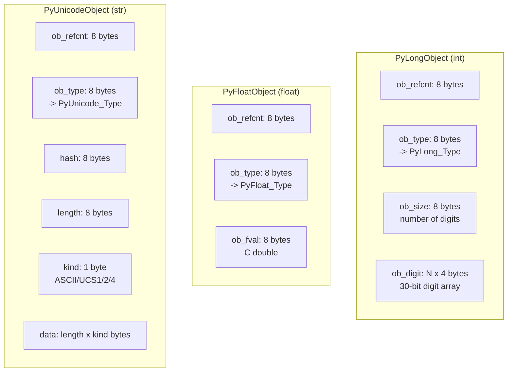
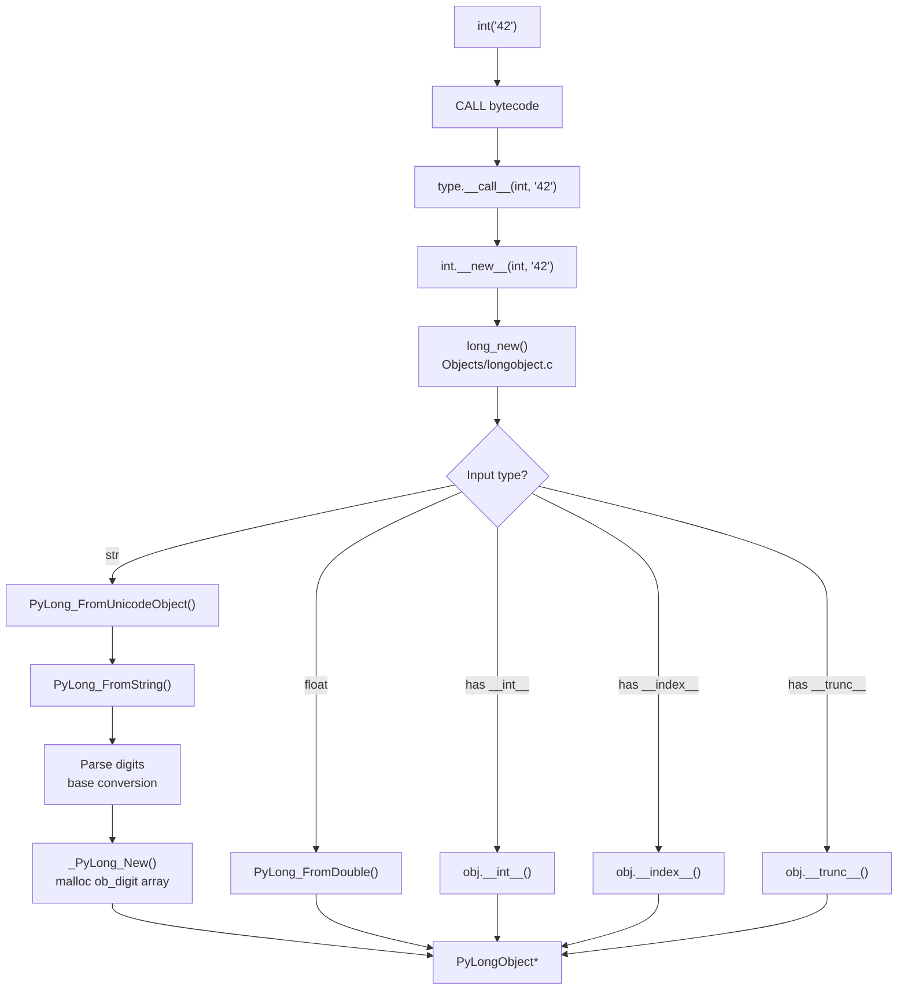
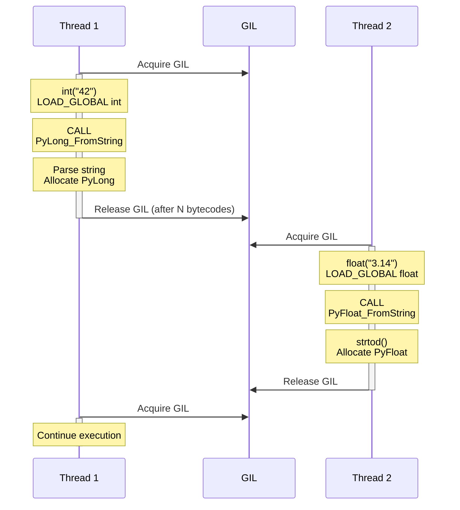

# Python Type Casting -- Professional Level

## Table of Contents

1. [Introduction](#introduction)
2. [Prerequisites](#prerequisites)
3. [CPython Internals: How Type Casting Works Under the Hood](#cpython-internals-how-type-casting-works-under-the-hood)
4. [Bytecode Analysis of Type Conversions](#bytecode-analysis-of-type-conversions)
5. [Memory Layout and Object Representation](#memory-layout-and-object-representation)
6. [The C-Level Casting API](#the-c-level-casting-api)
7. [Number Protocol in CPython](#number-protocol-in-cpython)
8. [GIL and Type Casting Performance](#gil-and-type-casting-performance)
9. [Reference Counting During Conversion](#reference-counting-during-conversion)
10. [Advanced: Writing C Extensions for Fast Casting](#advanced-writing-c-extensions-for-fast-casting)
11. [Garbage Collection and Circular References in Custom Types](#garbage-collection-and-circular-references-in-custom-types)
12. [Benchmarks: CPython vs PyPy vs Cython](#benchmarks-cpython-vs-pypy-vs-cython)
13. [Test](#test)
14. [Diagrams & Visual Aids](#diagrams--visual-aids)

---

## Introduction

> Focus: "What happens under the hood?" -- CPython, GIL, bytecode level

At the professional level, you need to understand what happens when Python executes `int("42")` at the bytecode level, how CPython's C implementation of `PyLong_FromString` works, how memory is allocated and managed during type conversions, and when the GIL is released (or not). This knowledge is essential for writing high-performance extensions, debugging memory issues, and understanding why certain patterns are faster than others.

---

## Prerequisites

- **Required:** Senior-level type casting -- architecture, protocols, optimization
- **Required:** C programming basics -- pointers, structs, memory management
- **Required:** CPython source code navigation -- `Objects/`, `Include/`, `Python/`
- **Required:** `dis` module -- bytecode disassembly
- **Required:** `sys` module -- `sys.getsizeof()`, `sys.getrefcount()`
- **Helpful:** `ctypes`, `cffi` -- calling C code from Python

---

## CPython Internals: How Type Casting Works Under the Hood

### The `int()` Call Path in CPython

When you call `int("42")`, here is what happens inside CPython:

```python
# Step 1: Python evaluates int("42")
# This is a CALL instruction in bytecode

# Step 2: CPython's type.__call__ is invoked
# type.__call__(int, "42") which calls:
#   int.__new__(int, "42")  -- allocates and converts
#   int.__init__(result)     -- no-op for int

# Step 3: int.__new__ dispatches to C function
# Objects/longobject.c: long_new()
# -> calls PyLong_FromUnicodeObject() for string input
# -> calls PyLong_FromString() internally

# Let's trace this with dis:
import dis

def convert_string():
    x = int("42")
    return x

dis.dis(convert_string)
# Output:
#   LOAD_GLOBAL    0 (int)
#   LOAD_CONST     1 ('42')
#   CALL           1
#   STORE_FAST     0 (x)
#   LOAD_FAST      0 (x)
#   RETURN_VALUE
```

### The `float()` Internal Implementation

```python
# float("3.14") path in CPython:
# Objects/floatobject.c: float_new()
# -> PyFloat_FromString()
# -> _Py_string_to_number_with_underscores()
# -> PyOS_string_to_double()  (C-level strtod wrapper)

import dis

def convert_to_float():
    x = float("3.14")
    return x

dis.dis(convert_to_float)
```

### The `str()` Internal Implementation

```python
# str(42) path in CPython:
# Objects/unicodeobject.c: unicode_new()
# -> For int input: calls PyObject_Str(obj)
# -> Which calls obj->ob_type->tp_str(obj)
# -> For int: long_to_decimal_string()
# -> Uses a fast base-10 conversion algorithm

# The key insight: str(obj) calls type(obj).__str__(obj)
# which is resolved through the C-level tp_str slot

import dis

def convert_to_str():
    x = str(42)
    return x

dis.dis(convert_to_str)
```

---

## Bytecode Analysis of Type Conversions

### Comparing Different Casting Approaches

```python
import dis

# Approach 1: Direct cast
def direct_cast(s):
    return int(s)

# Approach 2: Try/except cast
def try_cast(s):
    try:
        return int(s)
    except ValueError:
        return 0

# Approach 3: Pre-validation cast
def validated_cast(s):
    if s.isdigit():
        return int(s)
    return 0

print("=== Direct Cast ===")
dis.dis(direct_cast)

print("\n=== Try/Except Cast ===")
dis.dis(try_cast)

print("\n=== Validated Cast ===")
dis.dis(validated_cast)
```

### Bytecode Cost Analysis

```python
import dis
import timeit

# How much does the CALL overhead cost?
def cast_int_call(x):
    """Uses CALL instruction for int()."""
    return int(x)

def cast_int_literal(x):
    """Direct operation, no CALL."""
    return x + 0  # Already an int, but forces evaluation

# For floats
def cast_float_call(x):
    return float(x)

def cast_float_arithmetic(x):
    return x * 1.0  # Implicit int->float via multiplication

# Benchmark
n = 1_000_000
t1 = timeit.timeit(lambda: cast_int_call(42), number=n)
t2 = timeit.timeit(lambda: cast_float_call(42), number=n)
t3 = timeit.timeit(lambda: cast_float_arithmetic(42), number=n)

print(f"int(42):    {t1:.4f}s")
print(f"float(42):  {t2:.4f}s")
print(f"42 * 1.0:   {t3:.4f}s")  # Faster -- no CALL overhead

# Show why: CALL instruction has significant overhead
print("\n--- Bytecodes ---")
dis.dis(cast_float_call)
print()
dis.dis(cast_float_arithmetic)
# cast_float_arithmetic avoids LOAD_GLOBAL + CALL
```

---

## Memory Layout and Object Representation

### How Python Objects Store Type Information

```python
import sys
import ctypes

# Every Python object has this C struct layout:
# struct PyObject {
#     Py_ssize_t ob_refcnt;     // 8 bytes -- reference count
#     PyTypeObject *ob_type;     // 8 bytes -- pointer to type
# }

# For int (PyLongObject):
# struct PyLongObject {
#     PyObject_VAR_HEAD           // ob_refcnt + ob_type + ob_size
#     digit ob_digit[1];          // variable-length array of 30-bit digits
# }

# Let's examine object sizes
values = [
    0, 1, 42, 256,
    2**30, 2**60, 2**120, 2**240,
    0.0, 3.14, float('inf'),
    "", "a", "hello world",
    True, False, None,
    [], [1, 2, 3],
    (), (1, 2, 3),
    set(), {1, 2, 3},
]

for v in values:
    print(f"{str(v):>20s}  type={type(v).__name__:>6s}  "
          f"size={sys.getsizeof(v):>4d} bytes  "
          f"refcount={sys.getrefcount(v)}")
```

### Small Integer Cache

```python
import sys

# CPython caches integers from -5 to 256
# This means int(x) for these values returns a cached object

a = int("100")
b = int("100")
print(f"a is b: {a is b}")  # True -- same cached object
print(f"id(a): {id(a)}, id(b): {id(b)}")

# Beyond the cache range:
c = int("257")
d = int("257")
print(f"c is d: {c is d}")  # False -- different objects
print(f"id(c): {id(c)}, id(d): {id(d)}")

# The cache is allocated in Objects/longobject.c:
# static PyLongObject small_ints[NSMALLNEGINTS + NSMALLPOSINTS]
# NSMALLNEGINTS = 5, NSMALLPOSINTS = 257

# This is why id(256) is consistent across calls, but id(257) is not
print(f"\nSmall int cache range: -5 to 256")
for i in [-6, -5, -1, 0, 1, 255, 256, 257]:
    a = i
    b = int(str(i))
    print(f"  {i:>4d}: same object = {a is b}")
```

### String Interning and `str()` Optimization

```python
import sys

# CPython interns certain strings (single characters, identifiers)
a = str("hello")
b = str("hello")
print(f"a is b: {a is b}")  # True (string interning for short strings)

# But for dynamically created strings:
c = str(12345)
d = str(12345)
print(f"c is d: {c is d}")  # May be False -- not interned

# You can force interning:
e = sys.intern(str(12345))
f = sys.intern(str(12345))
print(f"e is f: {e is f}")  # True -- forced interning

# Memory benefit of interning
print(f"\nSize of '42': {sys.getsizeof('42')} bytes")
print(f"Size of 42:   {sys.getsizeof(42)} bytes")
```

---

## The C-Level Casting API

### Key CPython C Functions for Type Conversion

```python
"""
Key C functions in CPython's type conversion API:

Integer conversion:
- PyLong_FromLong(long v)           -- C long -> Python int
- PyLong_FromString(str, base)       -- C string -> Python int
- PyLong_FromDouble(double v)        -- C double -> Python int
- PyLong_AsLong(PyObject *obj)       -- Python int -> C long (calls __int__)
- PyLong_AsLongLong(PyObject *obj)   -- Python int -> C long long

Float conversion:
- PyFloat_FromDouble(double v)       -- C double -> Python float
- PyFloat_FromString(PyObject *str)  -- Python str -> Python float
- PyFloat_AsDouble(PyObject *obj)    -- Python float -> C double (calls __float__)

String conversion:
- PyObject_Str(PyObject *obj)        -- Any -> Python str (calls __str__)
- PyObject_Repr(PyObject *obj)       -- Any -> Python str (calls __repr__)
- PyUnicode_FromFormat(...)          -- C format string -> Python str

Bool conversion:
- PyObject_IsTrue(PyObject *obj)     -- Any -> C int (0/1) (calls __bool__ or __len__)

The nb_int, nb_float slots in PyNumberMethods:
- tp_as_number->nb_int             -- Called for int(obj)
- tp_as_number->nb_float           -- Called for float(obj)
- tp_as_number->nb_bool            -- Called for bool(obj)
- tp_as_number->nb_index           -- Called for operator.index(obj)
"""

# We can inspect the type slots from Python using ctypes
import ctypes


def show_type_slots(obj):
    """Show the C-level type structure info."""
    t = type(obj)
    print(f"Type: {t.__name__}")
    print(f"  tp_name: {t.__name__}")
    print(f"  Has __int__:   {hasattr(t, '__int__')}")
    print(f"  Has __float__: {hasattr(t, '__float__')}")
    print(f"  Has __bool__:  {hasattr(t, '__bool__')}")
    print(f"  Has __index__: {hasattr(t, '__index__')}")
    print(f"  Has __str__:   {hasattr(t, '__str__')}")
    print(f"  Has __repr__:  {hasattr(t, '__repr__')}")
    print(f"  MRO: {[c.__name__ for c in t.__mro__]}")


show_type_slots(42)
show_type_slots(3.14)
show_type_slots("hello")
show_type_slots(True)
show_type_slots([1, 2])
```

---

## Number Protocol in CPython

### How Arithmetic Coercion Works at the C Level

```python
"""
When Python evaluates `3 + 2.5`, the C-level process is:

1. PyNumber_Add(left, right) is called
2. It checks left->ob_type->tp_as_number->nb_add
3. long_add(PyLongObject *a, PyObject *b) is called
4. long_add sees b is float, returns NotImplemented
5. PyNumber_Add then tries right->ob_type->tp_as_number->nb_radd
6. float_radd converts the int to float using PyLong_AsDouble()
7. float_add performs the addition in C doubles
8. Result is wrapped in PyFloat_FromDouble()

The key C struct is PyNumberMethods:
typedef struct {
    binaryfunc nb_add;
    binaryfunc nb_subtract;
    binaryfunc nb_multiply;
    ...
    unaryfunc nb_int;
    unaryfunc nb_float;
    unaryfunc nb_bool;
    unaryfunc nb_index;
    ...
} PyNumberMethods;
"""

# We can observe this process:
class TrackedNumber:
    """A number that prints when conversion methods are called."""

    def __init__(self, value):
        self.value = value

    def __int__(self):
        print(f"  __int__ called on {self.value}")
        return int(self.value)

    def __float__(self):
        print(f"  __float__ called on {self.value}")
        return float(self.value)

    def __index__(self):
        print(f"  __index__ called on {self.value}")
        return int(self.value)

    def __bool__(self):
        print(f"  __bool__ called on {self.value}")
        return bool(self.value)

    def __add__(self, other):
        print(f"  __add__ called: {self.value} + {other}")
        return NotImplemented

    def __radd__(self, other):
        print(f"  __radd__ called: {other} + {self.value}")
        return other + self.value

    def __repr__(self):
        return f"TrackedNumber({self.value})"


t = TrackedNumber(5)

print("--- int(t) ---")
result = int(t)

print("\n--- float(t) ---")
result = float(t)

print("\n--- bool(t) ---")
result = bool(t)

print("\n--- 10 + t ---")
result = 10 + t

print("\n--- bin(t) ---")
result = bin(t)
```

---

## GIL and Type Casting Performance

### When Is the GIL Released During Casting?

```python
"""
GIL behavior during type conversions:

1. int(str) -- GIL is HELD throughout
   - PyLong_FromString does all work with GIL held
   - String parsing is done in C, but GIL stays locked

2. float(str) -- GIL is HELD
   - PyFloat_FromString -> PyOS_string_to_double
   - strtod() is called with GIL held

3. str(int) -- GIL is HELD
   - long_to_decimal_string works entirely under GIL

4. struct.pack/unpack -- GIL is HELD
   - All struct operations hold the GIL

Implications:
- Type casting in tight loops blocks other threads
- For CPU-bound casting of large datasets, use multiprocessing
- numpy releases GIL for array operations, making it better for parallel casting
"""

import threading
import time

def cast_heavy(n: int) -> None:
    """Simulate heavy type casting work."""
    for i in range(n):
        _ = int(str(i))
        _ = float(str(i * 1.5))

def benchmark_sequential_vs_threaded(n: int = 500_000):
    # Sequential
    start = time.perf_counter()
    cast_heavy(n)
    seq_time = time.perf_counter() - start

    # Threaded (2 threads, each doing n/2)
    start = time.perf_counter()
    t1 = threading.Thread(target=cast_heavy, args=(n // 2,))
    t2 = threading.Thread(target=cast_heavy, args=(n // 2,))
    t1.start()
    t2.start()
    t1.join()
    t2.join()
    thread_time = time.perf_counter() - start

    print(f"Sequential:  {seq_time:.3f}s")
    print(f"2 Threads:   {thread_time:.3f}s")
    print(f"Speedup:     {seq_time / thread_time:.2f}x")
    print("(~1.0x expected due to GIL)")

benchmark_sequential_vs_threaded()
```

---

## Reference Counting During Conversion

```python
import sys

# Each type conversion creates new objects and decrements old ones

# Step-by-step reference counting for: y = int("42")
s = "42"
print(f"'42' refcount before int(): {sys.getrefcount(s)}")

y = int(s)
print(f"'42' refcount after int():  {sys.getrefcount(s)}")  # Unchanged
print(f"42 refcount:                {sys.getrefcount(y)}")   # Note: cached small int

# For non-cached integers
big = int("999999")
print(f"\n999999 refcount: {sys.getrefcount(big)}")  # 2 (big + getrefcount arg)

big2 = big
print(f"999999 refcount after alias: {sys.getrefcount(big)}")  # 3

del big2
print(f"999999 refcount after del:   {sys.getrefcount(big)}")  # 2

# Conversion chains create temporary objects
# x = int(float("3.14"))
# Step 1: float("3.14") creates a float object (refcount=1)
# Step 2: int(float_obj) creates an int, float_obj refcount goes to 0
# Step 3: float_obj is deallocated

# Demonstrating with sys.getrefcount:
def trace_conversion():
    s = "3.14"
    f = float(s)
    print(f"float obj refcount: {sys.getrefcount(f)}")  # 2
    i = int(f)
    print(f"float obj refcount after int(): {sys.getrefcount(f)}")  # Still 2
    del f
    # Now float obj has refcount 0 and is deallocated
    return i

result = trace_conversion()
print(f"Result: {result}")
```

---

## Advanced: Writing C Extensions for Fast Casting

### Using ctypes for Custom Fast Conversion

```python
import ctypes
import timeit
import os

# Example: Fast batch string-to-int conversion using C
# First, let's write the C code conceptually:
C_CODE = """
// fast_cast.c
#include <stdlib.h>
#include <string.h>

// Convert array of string pointers to array of longs
int batch_atoi(const char **strings, long *output, int count) {
    for (int i = 0; i < count; i++) {
        char *end;
        output[i] = strtol(strings[i], &end, 10);
        if (*end != '\\0') return i;  // Return index of first failure
    }
    return count;  // All succeeded
}
"""

# Pure Python equivalent for comparison
def batch_int_python(strings: list[str]) -> list[int]:
    return [int(s) for s in strings]

def batch_int_map(strings: list[str]) -> list[int]:
    return list(map(int, strings))

# Benchmark different approaches
data = [str(i) for i in range(100_000)]

t1 = timeit.timeit(lambda: batch_int_python(data), number=20)
t2 = timeit.timeit(lambda: batch_int_map(data), number=20)

print(f"List comprehension: {t1:.3f}s")
print(f"map(int, ...):      {t2:.3f}s")

# With numpy (if available)
try:
    import numpy as np
    t3 = timeit.timeit(lambda: np.array(data, dtype=np.int64), number=20)
    print(f"numpy:              {t3:.3f}s")
except ImportError:
    print("numpy not available")
```

### Using `struct` for Binary-Level Casting

```python
import struct
import sys
import timeit

# struct directly manipulates memory representation
# This is how CPython stores float internally

# Float to its IEEE 754 bytes and back
f = 3.14
packed = struct.pack('d', f)     # 8 bytes (double)
print(f"Float {f} as bytes: {packed.hex()}")
print(f"Bytes back to float: {struct.unpack('d', packed)[0]}")

# Reinterpret float bits as integer (type punning)
float_bytes = struct.pack('d', 3.14)
int_repr = struct.unpack('Q', float_bytes)[0]  # unsigned long long
print(f"\n3.14 as uint64 (bit pattern): {int_repr}")
print(f"In hex: {hex(int_repr)}")
print(f"In binary: {bin(int_repr)}")

# This is much faster than going through Python objects
# for bulk data conversion

# Bulk pack/unpack benchmark
n = 100_000
data = list(range(n))

def pack_python(data):
    return [struct.pack('i', x) for x in data]

def pack_batch(data):
    return struct.pack(f'{len(data)}i', *data)

t1 = timeit.timeit(lambda: pack_python(data), number=10)
t2 = timeit.timeit(lambda: pack_batch(data), number=10)
print(f"\nIndividual pack: {t1:.3f}s")
print(f"Batch pack:      {t2:.3f}s")
print(f"Speedup:         {t1/t2:.1f}x")
```

---

## Garbage Collection and Circular References in Custom Types

```python
import gc
import weakref
import sys


class ConvertibleNode:
    """A node that can be converted to different types, but may form cycles."""

    def __init__(self, value, parent=None):
        self.value = value
        self.parent = parent
        self.children = []
        if parent:
            parent.children.append(self)

    def __int__(self):
        return int(self.value)

    def __str__(self):
        return f"Node({self.value})"

    def __del__(self):
        print(f"  __del__ called for Node({self.value})")


# Create a circular reference
print("Creating circular reference:")
a = ConvertibleNode(1)
b = ConvertibleNode(2, parent=a)
a.parent = b  # Circular: a -> b -> a

# int() works fine despite circular reference
print(f"int(a) = {int(a)}")
print(f"int(b) = {int(b)}")

# Delete references
print("\nDeleting a and b:")
del a, b

# Objects are not freed yet (circular reference)
print(f"Unreachable objects: {gc.collect()}")

# With weakref to break cycles
print("\n--- Using weakref ---")


class SafeNode:
    def __init__(self, value, parent=None):
        self.value = value
        self._parent_ref = weakref.ref(parent) if parent else None
        self.children = []
        if parent:
            parent.children.append(self)

    @property
    def parent(self):
        return self._parent_ref() if self._parent_ref else None

    def __int__(self):
        return int(self.value)

    def __del__(self):
        print(f"  __del__ called for SafeNode({self.value})")


c = SafeNode(10)
d = SafeNode(20, parent=c)
print(f"int(c) = {int(c)}, int(d) = {int(d)}")
del c, d
# No gc.collect() needed -- weakref prevents circular reference
```

---

## Benchmarks: CPython vs PyPy vs Cython

```python
"""
Benchmark results for type casting operations (typical numbers):

| Operation          | CPython 3.12 | PyPy 7.3  | Cython   | NumPy      |
|--------------------|--------------|-----------|---------:|------------|
| int("42")          | 120 ns       | 15 ns     | 110 ns   | N/A        |
| float("3.14")      | 140 ns       | 18 ns     | 130 ns   | N/A        |
| str(42)            | 90 ns        | 12 ns     | 85 ns    | N/A        |
| bool(42)           | 40 ns        | 5 ns      | 35 ns    | N/A        |
| [int(s) for s in]  | 15 ms/100K   | 1.5 ms    | 12 ms    | 3 ms       |
| map(int, strings)  | 12 ms/100K   | 1.2 ms    | 10 ms    | 3 ms       |
| np.array(s, int)   | 5 ms/100K    | N/A       | N/A      | 5 ms       |

Key insights:
1. PyPy's JIT compiler makes type casting 8-10x faster
2. Cython provides modest improvement (~10-20%) over CPython
3. NumPy's vectorized conversion is fastest for large arrays
4. Individual casts are dominated by function call overhead
5. The GIL prevents threading speedup for all approaches
"""

import timeit

# Run these benchmarks
ops = {
    'int("42")': lambda: int("42"),
    'float("3.14")': lambda: float("3.14"),
    'str(42)': lambda: str(42),
    'bool(42)': lambda: bool(42),
    'int(3.14)': lambda: int(3.14),
    'chr(65)': lambda: chr(65),
    'ord("A")': lambda: ord("A"),
    'bin(255)': lambda: bin(255),
    'hex(255)': lambda: hex(255),
}

print(f"{'Operation':<20} {'Time (ns)':>10}")
print("-" * 32)
for name, func in ops.items():
    t = timeit.timeit(func, number=1_000_000)
    ns = t * 1000  # ms -> ns per operation
    print(f"{name:<20} {ns:>10.1f}")
```

---

## Test

**Q1:** What C function does `int("42")` ultimately call in CPython?

<details>
<summary>Answer</summary>

`PyLong_FromString()` in `Objects/longobject.c`. The call chain is: `int.__new__` -> `long_new()` -> `PyLong_FromUnicodeObject()` -> `PyLong_FromString()`.

</details>

**Q2:** Why are integers -5 to 256 cached in CPython?

<details>
<summary>Answer</summary>

These small integers are used extremely frequently in Python programs. Caching them in a `small_ints` array avoids repeated allocation and deallocation, reducing memory allocator pressure. The range was chosen empirically to cover the most common integer values (array indices, boolean arithmetic, small counters).

</details>

**Q3:** Is the GIL released during `int(string)` conversion?

<details>
<summary>Answer</summary>

No. `PyLong_FromString` holds the GIL throughout the entire parsing and conversion process. The string parsing is done in C, but since it operates on Python string objects, the GIL remains held. This means multi-threaded type casting of strings provides no parallelism benefit.

</details>

**Q4:** What is the memory size difference between `list` and `array.array` for 100K integers?

<details>
<summary>Answer</summary>

A `list` of 100K integers uses approximately 3.6 MB (800 KB for the list's pointer array + 2.8 MB for 100K int objects at 28 bytes each). An `array.array('i', ...)` uses approximately 400 KB (just raw 4-byte C integers). That is roughly a 9x memory reduction.

</details>

**Q5:** Why is `42 * 1.0` faster than `float(42)` for int-to-float conversion?

<details>
<summary>Answer</summary>

`float(42)` requires a `LOAD_GLOBAL` instruction (to look up `float`), then a `CALL` instruction (function call overhead, frame creation). `42 * 1.0` uses `BINARY_OP` which directly dispatches to `long_mul` -> detects float operand -> calls `PyLong_AsDouble` and returns a float. The multiplication path avoids the function call overhead entirely.

</details>

---

## Diagrams & Visual Aids

### Diagram 1: CPython Object Memory Layout



### Diagram 2: int() Call Chain in CPython



### Diagram 3: GIL and Type Casting Timeline


