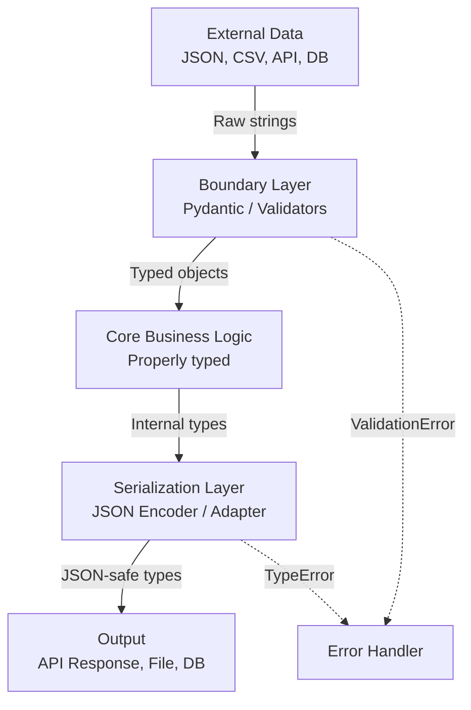
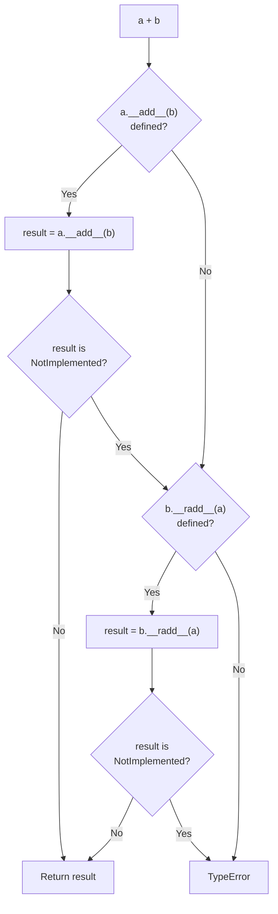
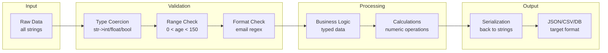

# Python Type Casting -- Senior Level

## Table of Contents

1. [Introduction](#introduction)
2. [Prerequisites](#prerequisites)
3. [Architecture of Type Conversion Systems](#architecture-of-type-conversion-systems)
4. [Advanced Custom Casting with Metaclasses](#advanced-custom-casting-with-metaclasses)
5. [Type Coercion in Operator Overloading](#type-coercion-in-operator-overloading)
6. [Protocol-Based Casting with typing.Protocol](#protocol-based-casting-with-typingprotocol)
7. [Performance Profiling and Optimization](#performance-profiling-and-optimization)
8. [Serialization and Deserialization Patterns](#serialization-and-deserialization-patterns)
9. [Data Validation Frameworks](#data-validation-frameworks)
10. [Concurrency and Type Casting](#concurrency-and-type-casting)
11. [Best Practices for Large Codebases](#best-practices-for-large-codebases)
12. [Edge Cases at Scale](#edge-cases-at-scale)
13. [Test](#test)
14. [Diagrams & Visual Aids](#diagrams--visual-aids)

---

## Introduction

> Focus: "How to optimize?" and "How to architect?"

At the senior level, type casting is not just about calling `int()` or `str()`. It is about designing robust type conversion architectures for large systems, understanding the performance implications of different casting strategies, building custom serialization layers, and leveraging Python's protocol system to create castable types that integrate seamlessly with the broader ecosystem. You need to profile, optimize, and make architectural decisions about where and how conversions happen in your application.

---

## Prerequisites

- **Required:** Middle-level type casting -- dunder methods, promotion hierarchy, custom conversions
- **Required:** Metaclasses and descriptors -- understanding `__new__`, `__init_subclass__`, descriptors
- **Required:** `typing` module -- `Protocol`, `TypeVar`, `Generic`, `overload`
- **Required:** Profiling tools -- `cProfile`, `timeit`, `memory_profiler`
- **Required:** Pydantic / dataclasses -- production data validation patterns
- **Helpful:** `struct`, `ctypes`, `memoryview` -- binary data handling

---

## Architecture of Type Conversion Systems

### The Registry Pattern for Extensible Casting

```python
from typing import Any, Callable, Dict, Tuple, Type, TypeVar, Optional
from functools import singledispatch

T = TypeVar('T')


class TypeRegistry:
    """Central registry for type conversions with priority support."""

    def __init__(self):
        self._converters: Dict[Tuple[type, type], Callable] = {}

    def register(self, from_type: type, to_type: type, converter: Callable):
        """Register a converter function for a type pair."""
        self._converters[(from_type, to_type)] = converter

    def convert(self, value: Any, to_type: Type[T]) -> T:
        """Convert value to the target type using registered converters."""
        from_type = type(value)

        # Exact match
        key = (from_type, to_type)
        if key in self._converters:
            return self._converters[key](value)

        # Check MRO for inheritance
        for base in from_type.__mro__:
            key = (base, to_type)
            if key in self._converters:
                return self._converters[key](value)

        # Fallback to constructor
        try:
            return to_type(value)
        except (TypeError, ValueError) as e:
            raise TypeError(
                f"No converter registered for {from_type.__name__} -> {to_type.__name__}"
            ) from e


# Usage
registry = TypeRegistry()

# Register custom converters
registry.register(str, bool, lambda s: s.lower() in ('true', 'yes', '1', 'on'))
registry.register(str, list, lambda s: [x.strip() for x in s.split(',')])
registry.register(float, str, lambda f: f"{f:.2f}")

print(registry.convert("true", bool))              # True
print(registry.convert("a, b, c", list))            # ['a', 'b', 'c']
print(registry.convert(3.14159, str))               # '3.14'
print(registry.convert("42", int))                  # 42 (fallback to int())
```

### The Adapter Pattern for Cross-System Type Mapping

```python
from dataclasses import dataclass
from datetime import datetime, date
from typing import Any, Dict, Type
import json


class TypeAdapter:
    """Adapts between Python types and external system types (JSON, SQL, etc.)."""

    _python_to_json: Dict[type, Callable] = {
        datetime: lambda dt: dt.isoformat(),
        date: lambda d: d.isoformat(),
        set: lambda s: sorted(list(s)),
        frozenset: lambda s: sorted(list(s)),
        bytes: lambda b: b.hex(),
        complex: lambda c: {"real": c.real, "imag": c.imag},
    }

    _json_to_python: Dict[str, Callable] = {
        "datetime": lambda s: datetime.fromisoformat(s),
        "date": lambda s: date.fromisoformat(s),
        "set": lambda lst: set(lst),
        "bytes": lambda s: bytes.fromhex(s),
        "complex": lambda d: complex(d["real"], d["imag"]),
    }

    @classmethod
    def to_json_safe(cls, obj: Any) -> Any:
        """Convert a Python object to a JSON-serializable form."""
        obj_type = type(obj)
        if obj_type in cls._python_to_json:
            return {"__type__": obj_type.__name__, "__value__": cls._python_to_json[obj_type](obj)}
        return obj

    @classmethod
    def from_json_safe(cls, data: Any) -> Any:
        """Restore a Python object from its JSON-safe form."""
        if isinstance(data, dict) and "__type__" in data:
            type_name = data["__type__"]
            if type_name in cls._json_to_python:
                return cls._json_to_python[type_name](data["__value__"])
        return data


# Round-trip test
original_data = {
    "timestamp": datetime(2024, 1, 15, 10, 30),
    "tags": {3, 1, 2},
    "secret": b'\xde\xad\xbe\xef',
    "impedance": complex(3, 4),
}

# Serialize
json_ready = {k: TypeAdapter.to_json_safe(v) for k, v in original_data.items()}
json_str = json.dumps(json_ready, indent=2)
print(json_str)

# Deserialize
loaded = json.loads(json_str)
restored = {k: TypeAdapter.from_json_safe(v) for k, v in loaded.items()}
print(restored)
assert restored["timestamp"] == original_data["timestamp"]
assert restored["tags"] == original_data["tags"]
```

---

## Advanced Custom Casting with Metaclasses

### Auto-Registering Castable Types

```python
from typing import Dict, Type, Any


class CastableMeta(type):
    """Metaclass that automatically registers type conversion methods."""

    _registry: Dict[str, Type] = {}

    def __new__(mcs, name, bases, namespace):
        cls = super().__new__(mcs, name, bases, namespace)
        if name != 'Castable':  # Don't register the base class
            mcs._registry[name.lower()] = cls
        return cls

    @classmethod
    def cast_to(mcs, value: Any, target_name: str) -> Any:
        """Cast a value to a registered type by name."""
        target_name = target_name.lower()
        if target_name not in mcs._registry:
            raise TypeError(f"Unknown type: {target_name}")
        target_cls = mcs._registry[target_name]
        if hasattr(target_cls, 'from_value'):
            return target_cls.from_value(value)
        return target_cls(value)


class Castable(metaclass=CastableMeta):
    """Base class for auto-registered castable types."""
    pass


class Celsius(Castable):
    def __init__(self, temp: float):
        self.temp = float(temp)

    @classmethod
    def from_value(cls, value):
        if isinstance(value, Fahrenheit):
            return cls((value.temp - 32) * 5 / 9)
        return cls(float(value))

    def __repr__(self):
        return f"Celsius({self.temp:.1f})"

    def __float__(self):
        return self.temp


class Fahrenheit(Castable):
    def __init__(self, temp: float):
        self.temp = float(temp)

    @classmethod
    def from_value(cls, value):
        if isinstance(value, Celsius):
            return cls(value.temp * 9 / 5 + 32)
        return cls(float(value))

    def __repr__(self):
        return f"Fahrenheit({self.temp:.1f})"

    def __float__(self):
        return self.temp


# Usage via registry
c = Celsius(100)
f = CastableMeta.cast_to(c, "fahrenheit")
print(f)  # Fahrenheit(212.0)

c2 = CastableMeta.cast_to(f, "celsius")
print(c2)  # Celsius(100.0)
```

---

## Type Coercion in Operator Overloading

### Implementing Full Numeric Protocol

```python
from __future__ import annotations
import math


class Decimal:
    """Fixed-precision decimal that supports full operator protocol with coercion."""

    __slots__ = ('_value', '_precision')

    def __init__(self, value: float | int | str = 0, precision: int = 2):
        if isinstance(value, str):
            value = float(value)
        self._precision = precision
        self._value = round(float(value), precision)

    # -- Coercion helpers --
    def _coerce(self, other) -> tuple[float, float]:
        """Coerce self and other to comparable float values."""
        if isinstance(other, Decimal):
            return self._value, other._value
        if isinstance(other, (int, float)):
            return self._value, float(other)
        return NotImplemented, NotImplemented

    # -- Arithmetic --
    def __add__(self, other) -> Decimal | type(NotImplemented):
        a, b = self._coerce(other)
        if a is NotImplemented:
            return NotImplemented
        return Decimal(a + b, self._precision)

    def __radd__(self, other) -> Decimal:
        return self.__add__(other)

    def __sub__(self, other) -> Decimal | type(NotImplemented):
        a, b = self._coerce(other)
        if a is NotImplemented:
            return NotImplemented
        return Decimal(a - b, self._precision)

    def __rsub__(self, other) -> Decimal:
        a, b = self._coerce(other)
        if a is NotImplemented:
            return NotImplemented
        return Decimal(b - a, self._precision)

    def __mul__(self, other) -> Decimal | type(NotImplemented):
        a, b = self._coerce(other)
        if a is NotImplemented:
            return NotImplemented
        return Decimal(a * b, self._precision)

    def __rmul__(self, other) -> Decimal:
        return self.__mul__(other)

    def __truediv__(self, other) -> Decimal | type(NotImplemented):
        a, b = self._coerce(other)
        if a is NotImplemented:
            return NotImplemented
        if b == 0:
            raise ZeroDivisionError("division by zero")
        return Decimal(a / b, self._precision)

    # -- Comparison --
    def __eq__(self, other) -> bool:
        a, b = self._coerce(other)
        if a is NotImplemented:
            return NotImplemented
        return a == b

    def __lt__(self, other) -> bool:
        a, b = self._coerce(other)
        if a is NotImplemented:
            return NotImplemented
        return a < b

    def __le__(self, other) -> bool:
        return self == other or self < other

    def __gt__(self, other) -> bool:
        a, b = self._coerce(other)
        if a is NotImplemented:
            return NotImplemented
        return a > b

    def __ge__(self, other) -> bool:
        return self == other or self > other

    # -- Type casting --
    def __int__(self) -> int:
        return int(self._value)

    def __float__(self) -> float:
        return self._value

    def __bool__(self) -> bool:
        return self._value != 0.0

    def __str__(self) -> str:
        return f"{self._value:.{self._precision}f}"

    def __repr__(self) -> str:
        return f"Decimal({self._value!r}, precision={self._precision})"

    def __hash__(self) -> int:
        return hash(self._value)

    def __abs__(self) -> Decimal:
        return Decimal(abs(self._value), self._precision)

    def __neg__(self) -> Decimal:
        return Decimal(-self._value, self._precision)


# Test
d = Decimal("19.99")
print(d + 5)         # 24.99
print(5 + d)         # 24.99
print(d * 3)         # 59.97
print(d > 10)        # True
print(int(d))        # 19
print(float(d))      # 19.99
print(f"Price: {d}") # Price: 19.99
```

---

## Protocol-Based Casting with typing.Protocol

```python
from typing import Protocol, runtime_checkable, TypeVar

T = TypeVar('T')


@runtime_checkable
class SupportsInt(Protocol):
    def __int__(self) -> int: ...


@runtime_checkable
class SupportsFloat(Protocol):
    def __float__(self) -> float: ...


@runtime_checkable
class SupportsStr(Protocol):
    def __str__(self) -> str: ...


@runtime_checkable
class SupportsIndex(Protocol):
    def __index__(self) -> int: ...


def safe_to_int(obj: object) -> int | None:
    """Convert to int using protocol checking."""
    if isinstance(obj, SupportsIndex):
        return obj.__index__()
    if isinstance(obj, SupportsInt):
        return obj.__int__()
    if isinstance(obj, str):
        try:
            return int(obj)
        except ValueError:
            return None
    return None


# Test
print(safe_to_int(42))         # 42
print(safe_to_int(3.14))       # 3
print(safe_to_int("100"))      # 100
print(safe_to_int("hello"))    # None
print(safe_to_int(True))       # 1
```

---

## Performance Profiling and Optimization

### Profiling Type Conversion Bottlenecks

```python
import cProfile
import timeit
from io import StringIO
import pstats


def simulate_data_pipeline(n: int = 100_000):
    """Simulate a data processing pipeline with type conversions."""
    raw_data = [
        {"id": str(i), "value": str(i * 1.5), "active": "true" if i % 2 == 0 else "false"}
        for i in range(n)
    ]

    results = []
    for record in raw_data:
        results.append({
            "id": int(record["id"]),
            "value": float(record["value"]),
            "active": record["active"] == "true",
        })
    return results


# Profile the pipeline
profiler = cProfile.Profile()
profiler.enable()
result = simulate_data_pipeline()
profiler.disable()

# Print stats
stream = StringIO()
stats = pstats.Stats(profiler, stream=stream).sort_stats('cumulative')
stats.print_stats(10)
print(stream.getvalue())
```

### Optimized Batch Conversion with `__slots__` and `memoryview`

```python
import array
import struct
import timeit


def convert_with_list(data: list[str]) -> list[int]:
    """Standard conversion: list of strings to list of ints."""
    return [int(x) for x in data]


def convert_with_map(data: list[str]) -> list[int]:
    """Using map() -- avoids Python-level loop overhead."""
    return list(map(int, data))


def convert_with_array(data: list[int]) -> array.array:
    """Using array.array for memory-efficient storage."""
    return array.array('i', data)


# Benchmark
data_str = [str(i) for i in range(500_000)]
data_int = list(range(500_000))

t1 = timeit.timeit(lambda: convert_with_list(data_str), number=10)
t2 = timeit.timeit(lambda: convert_with_map(data_str), number=10)
t3 = timeit.timeit(lambda: convert_with_array(data_int), number=10)

print(f"List comprehension: {t1:.3f}s")
print(f"map(int, ...):      {t2:.3f}s")
print(f"array.array:        {t3:.3f}s")

# Memory comparison
import sys
lst = list(range(100_000))
arr = array.array('i', range(100_000))
print(f"\nlist memory:  {sys.getsizeof(lst):>10,} bytes")
print(f"array memory: {sys.getsizeof(arr):>10,} bytes")
# array.array is ~4x more memory-efficient for homogeneous int data
```

---

## Serialization and Deserialization Patterns

### Custom JSON Encoder/Decoder

```python
import json
from datetime import datetime, date
from decimal import Decimal as StdDecimal
from enum import Enum
from typing import Any


class SmartEncoder(json.JSONEncoder):
    """JSON encoder that handles common Python types."""

    def default(self, obj: Any) -> Any:
        if isinstance(obj, (datetime, date)):
            return {"__type__": type(obj).__name__, "__value__": obj.isoformat()}
        if isinstance(obj, StdDecimal):
            return {"__type__": "Decimal", "__value__": str(obj)}
        if isinstance(obj, set):
            return {"__type__": "set", "__value__": sorted(list(obj))}
        if isinstance(obj, bytes):
            return {"__type__": "bytes", "__value__": obj.hex()}
        if isinstance(obj, Enum):
            return {"__type__": f"Enum:{type(obj).__name__}", "__value__": obj.value}
        if isinstance(obj, complex):
            return {"__type__": "complex", "__value__": [obj.real, obj.imag]}
        return super().default(obj)


def smart_decoder(dct: dict) -> Any:
    """JSON object hook that restores Python types."""
    if "__type__" not in dct:
        return dct

    type_name = dct["__type__"]
    value = dct["__value__"]

    decoders = {
        "datetime": lambda v: datetime.fromisoformat(v),
        "date": lambda v: date.fromisoformat(v),
        "Decimal": lambda v: StdDecimal(v),
        "set": lambda v: set(v),
        "bytes": lambda v: bytes.fromhex(v),
        "complex": lambda v: complex(v[0], v[1]),
    }

    if type_name in decoders:
        return decoders[type_name](value)
    return dct


# Round-trip test
data = {
    "name": "Alice",
    "balance": StdDecimal("1234.56"),
    "created": datetime(2024, 1, 15, 10, 30),
    "tags": {"python", "coding"},
    "token": b'\xca\xfe\xba\xbe',
    "impedance": 3 + 4j,
}

encoded = json.dumps(data, cls=SmartEncoder, indent=2)
print(encoded)

decoded = json.loads(encoded, object_hook=smart_decoder)
print(decoded)
assert decoded["balance"] == data["balance"]
assert decoded["created"] == data["created"]
assert decoded["tags"] == data["tags"]
print("Round-trip successful!")
```

---

## Data Validation Frameworks

### Pydantic-Style Validation with Type Coercion

```python
from dataclasses import dataclass, field
from typing import Any, get_type_hints
import re


class ValidationError(Exception):
    def __init__(self, errors: list):
        self.errors = errors
        super().__init__(f"{len(errors)} validation error(s)")


def coerce_field(value: Any, expected_type: type) -> Any:
    """Coerce a value to the expected type with smart rules."""
    if isinstance(value, expected_type):
        return value

    # bool from string
    if expected_type is bool and isinstance(value, str):
        if value.lower() in ('true', 'yes', '1', 'on'):
            return True
        if value.lower() in ('false', 'no', '0', 'off'):
            return False
        raise ValueError(f"Cannot coerce {value!r} to bool")

    # Standard numeric/string casts
    try:
        return expected_type(value)
    except (TypeError, ValueError) as e:
        raise ValueError(f"Cannot coerce {value!r} to {expected_type.__name__}: {e}")


@dataclass
class User:
    name: str
    age: int
    score: float
    active: bool

    def __post_init__(self):
        errors = []
        hints = get_type_hints(type(self))

        for field_name, expected_type in hints.items():
            current_value = getattr(self, field_name)
            try:
                coerced = coerce_field(current_value, expected_type)
                object.__setattr__(self, field_name, coerced)
            except ValueError as e:
                errors.append(f"Field '{field_name}': {e}")

        if errors:
            raise ValidationError(errors)


# Test -- all fields are strings, but get coerced
user = User(name="Alice", age="30", score="95.5", active="yes")
print(user)
print(f"age type: {type(user.age)}")        # <class 'int'>
print(f"score type: {type(user.score)}")    # <class 'float'>
print(f"active type: {type(user.active)}")  # <class 'bool'>

# Test validation failure
try:
    bad_user = User(name="Bob", age="old", score="bad", active="maybe")
except ValidationError as e:
    for err in e.errors:
        print(f"  Error: {err}")
```

---

## Concurrency and Type Casting

### Thread-Safe Type Conversion Cache

```python
import threading
from typing import Any, Type, TypeVar, Dict, Tuple
from functools import lru_cache

T = TypeVar('T')


class ThreadSafeConverter:
    """Thread-safe type converter with caching."""

    def __init__(self):
        self._lock = threading.Lock()
        self._stats: Dict[str, int] = {"hits": 0, "misses": 0, "errors": 0}
        self._cache: Dict[Tuple[type, type, Any], Any] = {}

    def convert(self, value: Any, target: Type[T]) -> T:
        """Convert with thread-safe caching for immutable values."""
        cache_key = (type(value), target, value)

        # Check cache (read lock not strictly needed for dict reads in CPython due to GIL)
        if cache_key in self._cache:
            with self._lock:
                self._stats["hits"] += 1
            return self._cache[cache_key]

        # Perform conversion
        try:
            result = target(value)
            # Only cache hashable, immutable values
            if isinstance(value, (str, int, float, bool, bytes, tuple)):
                self._cache[cache_key] = result
            with self._lock:
                self._stats["misses"] += 1
            return result
        except (ValueError, TypeError) as e:
            with self._lock:
                self._stats["errors"] += 1
            raise

    @property
    def stats(self) -> Dict[str, int]:
        with self._lock:
            return dict(self._stats)


# Multi-threaded usage
converter = ThreadSafeConverter()

def worker(values, target_type):
    results = []
    for v in values:
        try:
            results.append(converter.convert(v, target_type))
        except (ValueError, TypeError):
            pass
    return results


threads = []
for batch in [["1", "2", "3"], ["4", "5", "6"], ["1", "2", "7"]]:
    t = threading.Thread(target=worker, args=(batch, int))
    threads.append(t)
    t.start()

for t in threads:
    t.join()

print(f"Converter stats: {converter.stats}")
```

---

## Best Practices for Large Codebases

1. **Centralize type conversion logic** -- Create a `converters.py` module with all custom conversion functions rather than scattering `int()` and `float()` calls everywhere.

2. **Use Pydantic models at boundaries** -- Let Pydantic handle coercion at API boundaries (request parsing, config loading). Internally, work with properly typed objects.

3. **Fail fast on type mismatches** -- Use `mypy --strict` to catch type errors statically. Runtime casting should be reserved for external data.

4. **Profile before optimizing** -- Use `cProfile` to identify actual bottlenecks. Do not prematurely optimize casting unless profiling shows it matters.

5. **Implement `__repr__` for all custom types** -- Debugging becomes much easier when objects have informative string representations.

6. **Use `__slots__` for performance-critical castable types** -- Reduces memory usage and speeds up attribute access.

7. **Document coercion rules explicitly** -- When a function accepts multiple types and coerces internally, document exactly what types are accepted and how they are converted.

---

## Edge Cases at Scale

### Large Integer Precision Through Float

```python
# DANGER: float has 53 bits of precision
large_int = 2**60
via_float = int(float(large_int))
direct = large_int

print(f"Direct:    {direct}")
print(f"Via float: {via_float}")
print(f"Equal:     {direct == via_float}")  # False!
print(f"Diff:      {direct - via_float}")

# Solution: use decimal.Decimal for precise large number handling
from decimal import Decimal as D
precise = int(D(str(large_int)))
print(f"Via Decimal: {precise}")
print(f"Equal:       {direct == precise}")  # True
```

### Unicode Edge Cases in ord/chr

```python
# Multi-byte Unicode
emoji = "🐍"
print(ord(emoji))         # 128013
print(chr(128013))        # 🐍
print(hex(ord(emoji)))    # 0x1f40d

# Surrogate pairs (important for JSON/UTF-16 interop)
import json
data = json.dumps({"emoji": emoji})
print(data)  # {"emoji": "\ud83d\udc0d"}

# ord() only works on single characters
try:
    ord("AB")  # TypeError: ord() expected a character, but string of length 2 found
except TypeError as e:
    print(e)
```

---

## Test

**Q1:** How would you implement a type registry pattern that supports inheritance-based fallbacks?

<details>
<summary>Answer</summary>

Walk the MRO (`type(value).__mro__`) to find the nearest registered converter. This allows base class converters to handle subclass instances when no specific converter exists.

</details>

**Q2:** Why is `array.array` more memory efficient than `list` for homogeneous numeric data?

<details>
<summary>Answer</summary>

`list` stores pointers to Python objects (28 bytes per int object + 8 bytes per pointer). `array.array` stores raw C values (e.g., 4 bytes per `'i'` int) without object overhead. For 100K integers, list uses ~3.6MB vs array's ~400KB.

</details>

**Q3:** What is the difference between `__int__`, `__index__`, and `__trunc__`?

<details>
<summary>Answer</summary>

- `__int__`: Called by `int()`. Can be lossy (e.g., truncating a float).
- `__index__`: Called for exact integer contexts (slicing, `bin()`, `hex()`). Must return exact `int`.
- `__trunc__`: Called by `math.trunc()` and as a fallback for `int()`. Returns the value truncated toward zero.

</details>

---

## Diagrams & Visual Aids

### Diagram 1: Type Conversion Architecture



### Diagram 2: Operator Coercion Resolution



### Diagram 3: Data Pipeline Casting Strategy


