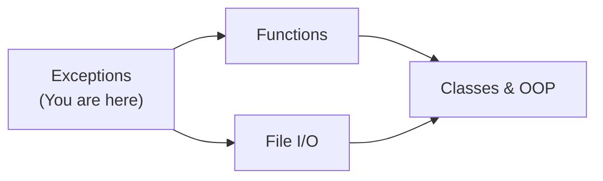
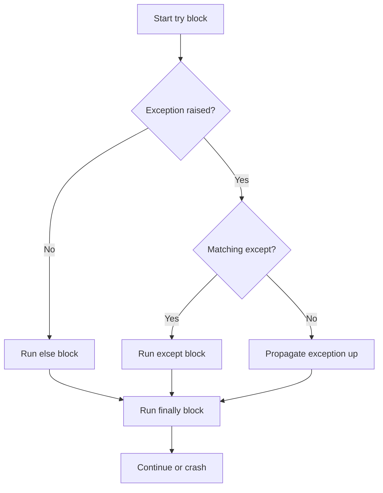
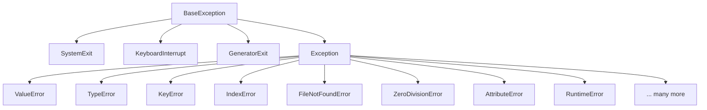
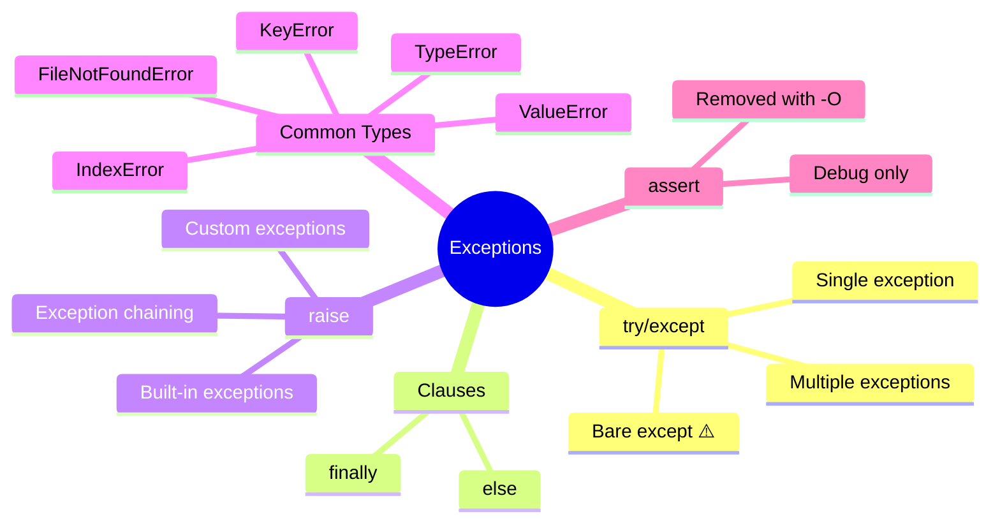

# Python Exceptions — Junior Level

## Table of Contents

1. [Introduction](#introduction)
2. [Prerequisites](#prerequisites)
3. [Glossary](#glossary)
4. [Core Concepts](#core-concepts)
5. [Real-World Analogies](#real-world-analogies)
6. [Mental Models](#mental-models)
7. [Pros & Cons](#pros--cons)
8. [Use Cases](#use-cases)
9. [Code Examples](#code-examples)
10. [Clean Code](#clean-code)
11. [Product Use / Feature](#product-use--feature)
12. [Error Handling](#error-handling)
13. [Security Considerations](#security-considerations)
14. [Performance Tips](#performance-tips)
15. [Metrics & Analytics](#metrics--analytics)
16. [Best Practices](#best-practices)
17. [Edge Cases & Pitfalls](#edge-cases--pitfalls)
18. [Common Mistakes](#common-mistakes)
19. [Common Misconceptions](#common-misconceptions)
20. [Tricky Points](#tricky-points)
21. [Test](#test)
22. [Tricky Questions](#tricky-questions)
23. [Cheat Sheet](#cheat-sheet)
24. [Summary](#summary)
25. [What You Can Build](#what-you-can-build)
26. [Further Reading](#further-reading)
27. [Related Topics](#related-topics)
28. [Diagrams & Visual Aids](#diagrams--visual-aids)

---

## Introduction

> Focus: "What is it?" and "How to use it?"

Exceptions are Python's way of signaling that something unexpected happened during the execution of your program. Instead of crashing silently or returning cryptic error codes, Python **raises** an exception — an object that describes what went wrong. You can **catch** these exceptions using `try/except` blocks and decide how to respond: log the error, retry the operation, show a message to the user, or gracefully shut down.

Every Python developer encounters exceptions from day one (`NameError`, `TypeError`, `SyntaxError`), so understanding how to handle them is fundamental to writing robust programs.

---

## Prerequisites

What you should know before studying this topic:

- **Required:** Basic Python syntax — you should be able to write variables, functions, and if/else statements
- **Required:** Variables and data types — understanding strings, integers, lists, and dictionaries
- **Helpful but not required:** Control flow (loops, conditionals) — exceptions often occur inside loops and conditionals

---

## Glossary

| Term | Definition |
|------|-----------|
| **Exception** | An event that disrupts the normal flow of a program |
| **Raise** | To intentionally trigger an exception using the `raise` keyword |
| **Catch** | To intercept an exception using `try/except` so the program does not crash |
| **Traceback** | The error report Python prints showing the chain of function calls that led to the exception |
| **try** | A block of code where exceptions might occur |
| **except** | A block that runs only if a specific exception is raised in the `try` block |
| **finally** | A block that always runs, whether an exception occurred or not |
| **else** | A block that runs only if no exception was raised in the `try` block |
| **BaseException** | The root class of all exceptions in Python |
| **Exception** | The base class for all "regular" exceptions (excludes SystemExit, KeyboardInterrupt) |

---

## Core Concepts

### Concept 1: What Is an Exception?

An exception is a Python object that represents an error. When Python encounters a problem it cannot handle — like dividing by zero or accessing a missing dictionary key — it creates an exception object and "raises" it. If nobody catches it, the program stops and prints a traceback.

```python
# This raises a ZeroDivisionError
result = 10 / 0  # ZeroDivisionError: division by zero
```

### Concept 2: The try/except Block

The `try/except` block lets you catch exceptions and handle them gracefully instead of crashing.

```python
try:
    result = 10 / 0
except ZeroDivisionError:
    print("Cannot divide by zero!")
# Output: Cannot divide by zero!
```

### Concept 3: The else Clause

The `else` block runs only when no exception was raised in the `try` block. It keeps your "happy path" code separate from error handling.

```python
try:
    result = 10 / 2
except ZeroDivisionError:
    print("Cannot divide by zero!")
else:
    print(f"Result is {result}")  # Result is 5.0
```

### Concept 4: The finally Clause

The `finally` block always runs — whether an exception occurred or not. It is used for cleanup operations like closing files or database connections.

```python
try:
    f = open("data.txt", "r")
    content = f.read()
except FileNotFoundError:
    print("File not found!")
finally:
    print("This always runs")
```

### Concept 5: Raising Exceptions

You can raise your own exceptions using the `raise` keyword to signal that something is wrong in your code.

```python
def set_age(age):
    if age < 0:
        raise ValueError("Age cannot be negative")
    return age

set_age(-5)  # ValueError: Age cannot be negative
```

### Concept 6: Common Built-in Exceptions

Python has many built-in exception types for different error situations:

| Exception | When It Happens |
|-----------|----------------|
| `ValueError` | Wrong value (e.g., `int("abc")`) |
| `TypeError` | Wrong type (e.g., `"a" + 1`) |
| `KeyError` | Missing dictionary key |
| `IndexError` | List index out of range |
| `FileNotFoundError` | File does not exist |
| `ZeroDivisionError` | Division by zero |
| `NameError` | Variable not defined |
| `AttributeError` | Object has no such attribute |

### Concept 7: Custom Exceptions

You can create your own exception classes by inheriting from `Exception`:

```python
class InsufficientFundsError(Exception):
    """Raised when a bank account has insufficient funds."""
    pass

def withdraw(balance, amount):
    if amount > balance:
        raise InsufficientFundsError(f"Cannot withdraw {amount}, balance is {balance}")
    return balance - amount
```

### Concept 8: The assert Statement

`assert` is a debugging tool that raises `AssertionError` if a condition is `False`. It is meant for development-time checks, not production error handling.

```python
def calculate_discount(price, discount_percent):
    assert 0 <= discount_percent <= 100, "Discount must be between 0 and 100"
    return price * (1 - discount_percent / 100)
```

---

## Real-World Analogies

| Concept | Analogy |
|---------|--------|
| **try/except** | Like wearing a seatbelt — you hope you won't need it, but if something goes wrong, it saves you from a crash |
| **finally** | Like closing the door when you leave — you do it whether the meeting went well or not |
| **raise** | Like pulling the fire alarm — you signal that something is wrong and someone needs to deal with it |
| **Traceback** | Like a breadcrumb trail — it shows you exactly where the problem started and how it got to where it crashed |

---

## Mental Models

**The intuition:** Think of exception handling as a safety net under a trapeze. The trapeze artist (your code) performs risky moves (operations that might fail). The safety net (`try/except`) catches them if they fall. The `finally` block is like the cleanup crew that always comes out after the performance, no matter what happened.

**Why this model helps:** It reminds you that `try/except` does not prevent errors — it catches them when they happen. Your code should still try to avoid errors in the first place.

---

## Pros & Cons

| Pros | Cons |
|------|------|
| Prevents program crashes from unexpected errors | Overusing try/except can hide real bugs |
| Makes error messages clear and actionable | Catching broad exceptions (`except Exception`) masks problems |
| Separates normal logic from error handling | Deeply nested try/except blocks reduce readability |
| Built-in exception hierarchy is rich and extensible | Performance overhead if exceptions are raised frequently |

### When to use:
- File I/O, network requests, user input — anything that can fail unpredictably
- Validating data before processing

### When NOT to use:
- As flow control — do not use exceptions instead of `if/else` for expected conditions
- Silently swallowing errors with bare `except: pass`

---

## Use Cases

- **Use Case 1:** Reading user input — converting strings to numbers with `int()` may raise `ValueError`
- **Use Case 2:** Opening files — the file may not exist (`FileNotFoundError`)
- **Use Case 3:** Accessing API responses — keys may be missing from JSON data (`KeyError`)
- **Use Case 4:** Database operations — connections can time out or queries can fail

---

## Code Examples

### Example 1: Basic try/except/else/finally

```python
def safe_divide(a, b):
    """Safely divide two numbers with full exception handling."""
    try:
        result = a / b
    except ZeroDivisionError:
        print(f"Error: Cannot divide {a} by zero")
        return None
    except TypeError as e:
        print(f"Error: Invalid types — {e}")
        return None
    else:
        print(f"{a} / {b} = {result}")
        return result
    finally:
        print("Division operation completed")


# Test it
safe_divide(10, 3)    # 10 / 3 = 3.333... → Division operation completed
safe_divide(10, 0)    # Error: Cannot divide 10 by zero → Division operation completed
safe_divide("a", 2)   # Error: Invalid types — ... → Division operation completed
```

**What it does:** Demonstrates all four clauses of exception handling working together.
**How to run:** `python safe_divide.py`

### Example 2: Multiple Exception Types

```python
def get_item(data, key_or_index):
    """Get an item from a dict or list safely."""
    try:
        return data[key_or_index]
    except KeyError:
        print(f"Key '{key_or_index}' not found in dictionary")
    except IndexError:
        print(f"Index {key_or_index} is out of range")
    except TypeError as e:
        print(f"Cannot access item: {e}")
    return None


# Test with different data types
user = {"name": "Alice", "age": 30}
scores = [95, 87, 72]

print(get_item(user, "name"))       # Alice
print(get_item(user, "email"))      # Key 'email' not found in dictionary → None
print(get_item(scores, 1))          # 87
print(get_item(scores, 10))         # Index 10 is out of range → None
```

### Example 3: Custom Exceptions

```python
class ValidationError(Exception):
    """Raised when input data fails validation."""
    def __init__(self, field, message):
        self.field = field
        self.message = message
        super().__init__(f"{field}: {message}")


class AgeError(ValidationError):
    """Raised when age value is invalid."""
    pass


def register_user(name: str, age: int) -> dict:
    """Register a new user with validation."""
    if not name or not name.strip():
        raise ValidationError("name", "Name cannot be empty")
    if not isinstance(age, int):
        raise ValidationError("age", "Age must be an integer")
    if age < 0 or age > 150:
        raise AgeError("age", f"Age {age} is not realistic")

    return {"name": name.strip(), "age": age}


# Test registration
try:
    user = register_user("Alice", 25)
    print(f"Registered: {user}")
except AgeError as e:
    print(f"Age problem: {e}")
except ValidationError as e:
    print(f"Validation failed: {e}")
```

### Example 4: File Handling with Exceptions

```python
def read_config(filepath: str) -> dict:
    """Read a configuration file and return its contents as a dict."""
    config = {}
    try:
        with open(filepath, "r") as f:
            for line_num, line in enumerate(f, 1):
                line = line.strip()
                if not line or line.startswith("#"):
                    continue
                if "=" not in line:
                    raise ValueError(f"Line {line_num}: Missing '=' in '{line}'")
                key, value = line.split("=", 1)
                config[key.strip()] = value.strip()
    except FileNotFoundError:
        print(f"Config file '{filepath}' not found, using defaults")
        config = {"host": "localhost", "port": "8080"}
    except PermissionError:
        print(f"No permission to read '{filepath}'")
        raise
    except ValueError as e:
        print(f"Config parse error: {e}")
        raise

    return config


# Usage
config = read_config("app.conf")
print(config)
```

### Example 5: Using assert for Debugging

```python
def calculate_average(numbers: list) -> float:
    """Calculate the average of a list of numbers."""
    assert isinstance(numbers, list), "Input must be a list"
    assert len(numbers) > 0, "List cannot be empty"
    assert all(isinstance(n, (int, float)) for n in numbers), "All items must be numbers"

    total = sum(numbers)
    average = total / len(numbers)

    # Post-condition check
    assert min(numbers) <= average <= max(numbers), "Average must be within range"

    return average


print(calculate_average([10, 20, 30]))  # 20.0
# calculate_average([])  # AssertionError: List cannot be empty
```

---

## Clean Code

### Naming (PEP 8 conventions)

```python
# ❌ Bad exception naming
class err(Exception): pass
class baddata(Exception): pass

# ✅ Good exception naming
class InvalidInputError(Exception): pass
class InsufficientFundsError(Exception): pass
class UserNotFoundError(Exception): pass
```

**Python naming rules for exceptions:**
- Exception classes: `PascalCase` ending with `Error` (`ValueError`, `ConnectionTimeoutError`)
- Exception variables: `snake_case` (`except ValueError as invalid_value:`)

### Short Functions

```python
# ❌ Too much in one try block
def process_data(filepath):
    try:
        f = open(filepath)
        data = f.read()
        parsed = parse(data)
        validated = validate(parsed)
        save(validated)
    except Exception:
        print("Something went wrong")

# ✅ Focused try blocks
def process_data(filepath):
    data = read_file(filepath)       # has its own try/except
    parsed = parse(data)             # has its own try/except
    validated = validate(parsed)
    save(validated)
```

---

## Product Use / Feature

### 1. Django Web Framework

- **How it uses Exceptions:** Django raises `Http404`, `PermissionDenied`, `ValidationError` — the framework catches them and converts them to HTTP responses automatically
- **Why it matters:** Developers write clean view logic without manually constructing error responses

### 2. Requests Library

- **How it uses Exceptions:** Raises `ConnectionError`, `Timeout`, `HTTPError` for network failures
- **Why it matters:** Makes it easy to handle different types of network problems separately

### 3. SQLAlchemy

- **How it uses Exceptions:** Raises `IntegrityError`, `OperationalError`, `NoResultFound` for database issues
- **Why it matters:** Database errors are clearly categorized so applications can respond appropriately

---

## Error Handling

### Error 1: FileNotFoundError

```python
# Code that produces this exception
data = open("missing_file.txt").read()
```

**Why it happens:** The file does not exist at the given path.
**How to fix:**

```python
import os

filepath = "missing_file.txt"
try:
    with open(filepath, "r") as f:
        data = f.read()
except FileNotFoundError:
    print(f"File '{filepath}' not found")
    data = ""
```

### Error 2: ValueError

```python
# Code that produces this exception
age = int("twenty")  # ValueError: invalid literal for int()
```

**Why it happens:** The string cannot be converted to the expected type.
**How to fix:**

```python
user_input = "twenty"
try:
    age = int(user_input)
except ValueError:
    print(f"'{user_input}' is not a valid number")
    age = 0
```

### Error 3: KeyError

```python
# Code that produces this exception
user = {"name": "Alice"}
email = user["email"]  # KeyError: 'email'
```

**Why it happens:** The key does not exist in the dictionary.
**How to fix:**

```python
user = {"name": "Alice"}

# Option 1: Use .get() with a default
email = user.get("email", "not provided")

# Option 2: Use try/except
try:
    email = user["email"]
except KeyError:
    email = "not provided"
```

---

## Security Considerations

### 1. Never expose internal details in error messages

```python
# ❌ Insecure — leaks internal paths and database info
try:
    connect_to_database()
except Exception as e:
    return f"Error: {e}"  # might show "password authentication failed for user 'admin'"

# ✅ Secure — generic message for users, detailed log for developers
import logging
logger = logging.getLogger(__name__)

try:
    connect_to_database()
except Exception as e:
    logger.exception("Database connection failed")  # full details in logs
    return "Service temporarily unavailable"         # safe message to user
```

**Risk:** Exposing tracebacks or exception messages to end users can reveal file paths, database structures, and credentials.
**Mitigation:** Always log the full exception internally and show a generic message to users.

### 2. Avoid bare except and overly broad catches

```python
# ❌ Catches KeyboardInterrupt, SystemExit — user cannot Ctrl+C!
try:
    main()
except:
    pass

# ✅ Catch only what you expect
try:
    main()
except Exception as e:
    logger.error("Unexpected error: %s", e)
```

---

## Performance Tips

### Tip 1: Avoid using exceptions for flow control

```python
# ❌ Slow — exception overhead on every missing key
def get_value_slow(data, key):
    try:
        return data[key]
    except KeyError:
        return "default"

# ✅ Faster for frequent misses — LBYL (Look Before You Leap)
def get_value_fast(data, key):
    if key in data:
        return data[key]
    return "default"

# ✅ Best — built-in method
def get_value_best(data, key):
    return data.get(key, "default")
```

**Why it's faster:** Raising and catching exceptions is expensive (Python must create a traceback object). Using `dict.get()` avoids this overhead entirely.

### Tip 2: Keep try blocks small

```python
# ❌ Slow to debug — too much code in try
try:
    data = load_data()
    processed = process(data)
    result = transform(processed)
    save(result)
except Exception:
    print("Something failed")

# ✅ Fast to debug — targeted try blocks
try:
    data = load_data()
except IOError as e:
    print(f"Load failed: {e}")
    return

processed = process(data)
result = transform(processed)

try:
    save(result)
except IOError as e:
    print(f"Save failed: {e}")
```

---

## Metrics & Analytics

### What to Measure

| Metric | Why it matters | Tool |
|--------|---------------|------|
| **Exception frequency** | Tracks error rate over time | `logging`, `sentry` |
| **Exception types** | Identifies most common failures | `collections.Counter` |
| **Time in except blocks** | Measures error-handling overhead | `time.perf_counter()` |

### Basic Instrumentation

```python
import time
import logging
from collections import Counter

logger = logging.getLogger(__name__)
error_counter = Counter()

def process_with_metrics(items):
    for item in items:
        start = time.perf_counter()
        try:
            result = process(item)
        except ValueError as e:
            error_counter["ValueError"] += 1
            logger.warning("ValueError for item %s: %s", item, e)
        except Exception as e:
            error_counter[type(e).__name__] += 1
            logger.error("Unexpected error: %s", e)
        else:
            elapsed = time.perf_counter() - start
            logger.debug("Processed item in %.3fs", elapsed)

    logger.info("Error summary: %s", dict(error_counter))
```

---

## Best Practices

- **Catch specific exceptions:** Always catch the most specific exception type, not `Exception` or bare `except`
- **Use `else` for success logic:** Keep success code in `else`, not in the `try` block
- **Use `finally` for cleanup:** Close files, release locks, disconnect from databases
- **Create custom exceptions for your domain:** `InsufficientFundsError` is clearer than `ValueError("not enough money")`
- **Always include the original exception:** Use `raise NewError("msg") from original_error` to preserve the chain

---

## Edge Cases & Pitfalls

### Pitfall 1: Mutable state in try blocks

```python
# ❌ Partial mutation before exception
results = []
try:
    for item in data:
        results.append(transform(item))  # fails on item 3
except TransformError:
    print(f"Error — but results has {len(results)} partial items!")

# ✅ Use a temporary list
try:
    temp_results = [transform(item) for item in data]
except TransformError:
    print("Transform failed — results unchanged")
else:
    results = temp_results
```

### Pitfall 2: Exception in finally

```python
# ❌ Exception in finally replaces the original exception
try:
    result = 1 / 0
finally:
    raise ValueError("Cleanup error")  # ZeroDivisionError is lost!
```

**What happens:** The `ValueError` from `finally` replaces the original `ZeroDivisionError`.
**How to fix:** Use try/except inside the finally block to handle cleanup errors separately.

---

## Common Mistakes

### Mistake 1: Bare except

```python
# ❌ Catches everything including KeyboardInterrupt and SystemExit
try:
    data = process()
except:
    pass

# ✅ Catch only Exception (or more specific)
try:
    data = process()
except Exception as e:
    logging.error("Processing failed: %s", e)
```

### Mistake 2: Silencing exceptions with pass

```python
# ❌ Error is completely hidden
try:
    user = get_user(user_id)
except Exception:
    pass  # user is now undefined — NameError later!

# ✅ At minimum, log the error
try:
    user = get_user(user_id)
except Exception as e:
    logging.error("Failed to get user %s: %s", user_id, e)
    user = None
```

### Mistake 3: Catching too broadly

```python
# ❌ Hides bugs — TypeError from a typo would be silenced
try:
    value = int(user_input)
    result = value / total
except Exception:
    print("Invalid input")

# ✅ Catch only expected exceptions
try:
    value = int(user_input)
except ValueError:
    print("Please enter a valid number")

try:
    result = value / total
except ZeroDivisionError:
    print("Total cannot be zero")
```

---

## Common Misconceptions

### Misconception 1: "try/except makes code slower"

**Reality:** The `try` block itself has negligible overhead. The cost comes only when an exception is actually raised. If exceptions are rare, try/except is just as fast as if/else.

**Why people think this:** They confuse the cost of entering a try block (nearly free) with the cost of handling an exception (expensive).

### Misconception 2: "assert is for input validation"

**Reality:** `assert` is a debugging tool. Python can be run with `-O` (optimize) flag which strips all `assert` statements. Never use `assert` to validate user input — use `if` + `raise ValueError` instead.

**Why people think this:** `assert` reads like English and feels natural for validation.

---

## Tricky Points

### Tricky Point 1: Exception variable scope

```python
try:
    result = 1 / 0
except ZeroDivisionError as e:
    error = e  # save it if you need it later

# 'e' is deleted after the except block in Python 3!
# print(e)  # NameError: name 'e' is not defined
print(error)  # This works because we saved it
```

**Why it's tricky:** Python 3 deletes the exception variable (`e`) after the except block to avoid reference cycles.
**Key takeaway:** If you need the exception object after the except block, assign it to another variable.

### Tricky Point 2: Return in finally

```python
def tricky():
    try:
        return "from try"
    finally:
        return "from finally"  # This OVERRIDES the try return!

print(tricky())  # "from finally"
```

**Why it's tricky:** The `finally` block's return replaces any return from `try` or `except`.
**Key takeaway:** Avoid `return` statements inside `finally` blocks.

---

## Test

### Multiple Choice

**1. What is the correct order of clauses in a try statement?**

- A) try → finally → except → else
- B) try → except → finally → else
- C) try → except → else → finally
- D) try → else → except → finally

<details>
<summary>Answer</summary>
<strong>C)</strong> — The correct order is: <code>try → except → else → finally</code>. The <code>else</code> runs only if no exception was raised, and <code>finally</code> always runs last.
</details>

**2. What does this code print?**

```python
try:
    print("A")
    x = 1 / 0
    print("B")
except ZeroDivisionError:
    print("C")
else:
    print("D")
finally:
    print("E")
```

- A) A B C E
- B) A C E
- C) A C D E
- D) A B D E

<details>
<summary>Answer</summary>
<strong>B)</strong> — "A" prints, then the exception occurs (so "B" is skipped). "C" prints in the except block. "D" is skipped because an exception occurred (else only runs on success). "E" always prints in finally.
</details>

### True or False

**3. `assert` statements are guaranteed to run in production code.**

<details>
<summary>Answer</summary>
<strong>False</strong> — Running Python with the <code>-O</code> flag removes all assert statements. Never rely on assert for production validation.
</details>

**4. A bare `except:` clause catches `KeyboardInterrupt` and `SystemExit`.**

<details>
<summary>Answer</summary>
<strong>True</strong> — A bare <code>except:</code> catches everything, including <code>KeyboardInterrupt</code> (Ctrl+C) and <code>SystemExit</code>. This is why you should always use <code>except Exception:</code> at minimum.
</details>

### What's the Output?

**5. What does this code print?**

```python
def f():
    try:
        return 1
    finally:
        return 2

print(f())
```

<details>
<summary>Answer</summary>
Output: <code>2</code><br>
Explanation: The <code>finally</code> block's return overrides the <code>try</code> block's return. The function returns 2, not 1.
</details>

**6. What does this code print?**

```python
try:
    raise ValueError("oops")
except ValueError as e:
    print(type(e).__name__)
    print(e)
```

<details>
<summary>Answer</summary>
Output:
<pre>
ValueError
oops
</pre>
<code>type(e).__name__</code> gives the exception class name, and <code>str(e)</code> gives the message passed to the constructor.
</details>

---

## Tricky Questions

**1. What happens when you raise an exception inside an except block?**

- A) It is silently ignored
- B) It replaces the current exception
- C) Both exceptions are printed
- D) Python enters an infinite loop

<details>
<summary>Answer</summary>
<strong>B)</strong> — The new exception replaces the current one. However, the original exception is attached as the <code>__context__</code> attribute and may be shown in the traceback as "During handling of the above exception, another exception occurred."
</details>

**2. Can you have a try block with only a finally (no except)?**

- A) No, except is required
- B) Yes, this is valid
- C) Only in Python 2
- D) Only with a bare except

<details>
<summary>Answer</summary>
<strong>B)</strong> — <code>try/finally</code> without <code>except</code> is perfectly valid. The exception still propagates, but the <code>finally</code> block runs first. This is useful for cleanup.
</details>

---

## Cheat Sheet

| What | Syntax | Example |
|------|--------|---------|
| Catch one exception | `except ExType:` | `except ValueError:` |
| Catch and name it | `except ExType as e:` | `except ValueError as e: print(e)` |
| Catch multiple types | `except (T1, T2):` | `except (ValueError, TypeError):` |
| Raise an exception | `raise ExType("msg")` | `raise ValueError("bad input")` |
| Re-raise current exception | `raise` | `except ValueError: raise` |
| Chain exceptions | `raise X from Y` | `raise RuntimeError("fail") from e` |
| Custom exception | `class MyError(Exception): pass` | `raise MyError("oops")` |
| Assert (debug only) | `assert cond, "msg"` | `assert x > 0, "must be positive"` |
| Success block | `else:` | runs if no exception |
| Cleanup block | `finally:` | always runs |

---

## Self-Assessment Checklist

### I can explain:
- [ ] What exceptions are and why they exist
- [ ] The difference between `try`, `except`, `else`, and `finally`
- [ ] When to use `raise` vs returning an error code
- [ ] Why bare `except` is dangerous

### I can do:
- [ ] Write try/except blocks to handle common exceptions
- [ ] Create custom exception classes
- [ ] Use `assert` for debugging (and know its limitations)
- [ ] Read and understand Python tracebacks

---

## Summary

- **Exceptions** are Python's mechanism for handling errors — they are objects that describe what went wrong
- Use **try/except** to catch exceptions, **else** for success logic, **finally** for cleanup
- Always catch **specific exceptions** — never use bare `except` or `except Exception` without good reason
- **raise** lets you create your own exceptions; use **custom exception classes** for domain-specific errors
- **assert** is for debugging only — never for production input validation
- The exception hierarchy starts with `BaseException` → `Exception` → specific types

**Next step:** Learn about functions and how to organize your exception handling into reusable, well-structured code.

---

## What You Can Build

### Projects you can create:
- **Input Validator:** A script that validates user form data with custom exceptions for each field
- **File Processor:** A tool that reads CSV files with proper error handling for missing files, bad encoding, and malformed data
- **Simple Calculator:** A CLI calculator that handles division by zero, invalid input, and overflow errors gracefully

### Technologies / tools that use this:
- **Flask / FastAPI** — understanding exceptions helps you build proper error responses and middleware
- **pytest** — testing exception handling with `pytest.raises()` is a core testing skill
- **logging** — combining exceptions with logging creates production-ready error tracking

### Learning path:



---

## Further Reading

- **Official docs:** [Python Errors and Exceptions](https://docs.python.org/3/tutorial/errors.html)
- **PEP 3134:** [Exception Chaining and Embedded Tracebacks](https://peps.python.org/pep-3134/) — how Python handles chained exceptions
- **Book chapter:** Fluent Python (Ramalho), Chapter 18 — context managers and exception handling patterns
- **Blog post:** [Real Python — Exception Handling](https://realpython.com/python-exceptions/) — comprehensive beginner guide

---

## Related Topics

- **[Functions](../07-functions/)** — where to put try/except for clean, reusable error handling
- **[Type Casting](../05-type-casting/)** — many casting operations raise ValueError or TypeError

---

## Diagrams & Visual Aids

### Exception Handling Flow



### Exception Hierarchy



### Mind Map


