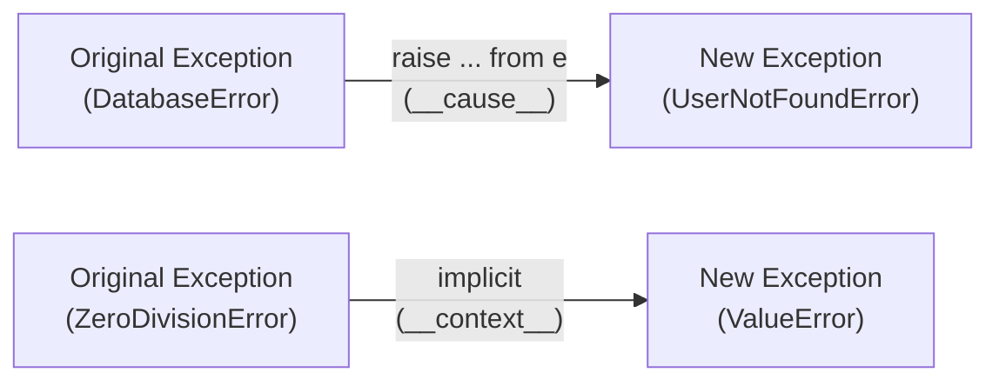
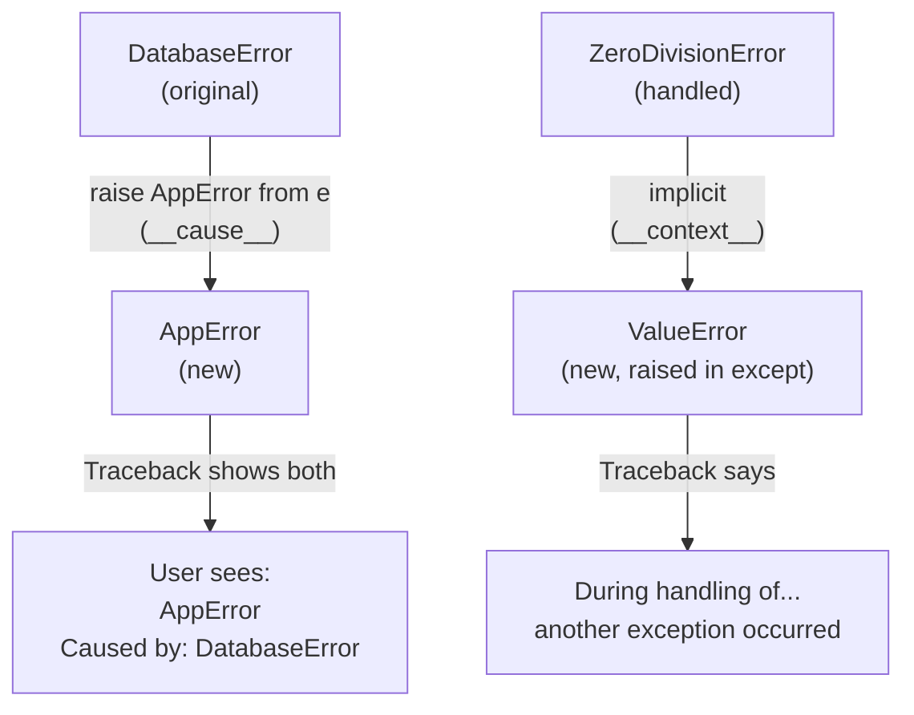
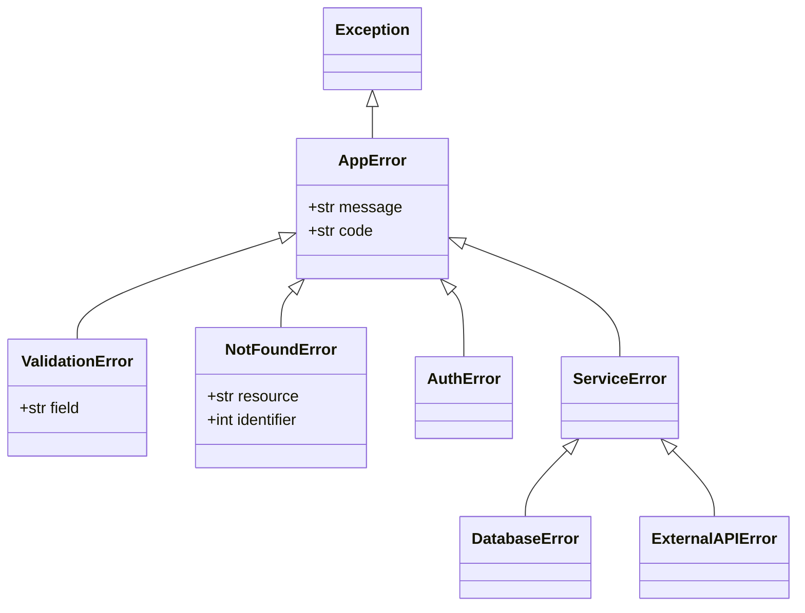
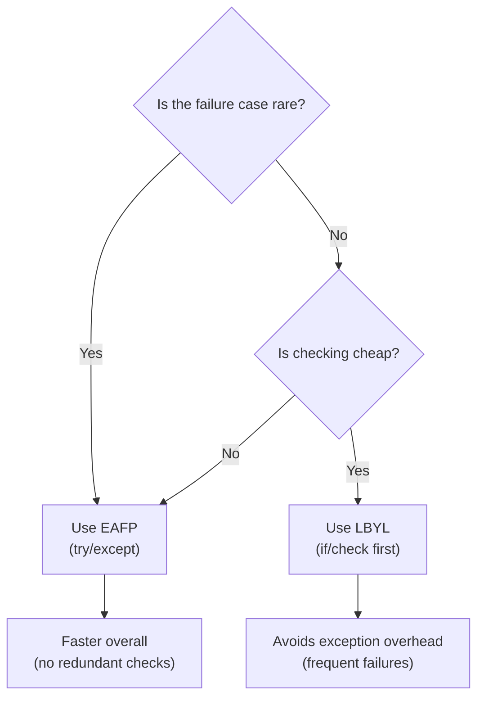

# Python Exceptions — Middle Level

## Table of Contents

1. [Introduction](#introduction)
2. [Core Concepts](#core-concepts)
3. [Evolution & Historical Context](#evolution--historical-context)
4. [Pros & Cons](#pros--cons)
5. [Alternative Approaches](#alternative-approaches)
6. [Code Examples](#code-examples)
7. [Coding Patterns](#coding-patterns)
8. [Clean Code](#clean-code)
9. [Product Use / Feature](#product-use--feature)
10. [Error Handling](#error-handling)
11. [Security Considerations](#security-considerations)
12. [Performance Optimization](#performance-optimization)
13. [Debugging Guide](#debugging-guide)
14. [Best Practices](#best-practices)
15. [Edge Cases & Pitfalls](#edge-cases--pitfalls)
16. [Comparison with Other Languages](#comparison-with-other-languages)
17. [Test](#test)
18. [Tricky Questions](#tricky-questions)
19. [Cheat Sheet](#cheat-sheet)
20. [Summary](#summary)
21. [Diagrams & Visual Aids](#diagrams--visual-aids)

---

## Introduction

> Focus: "Why?" and "When to use?"

This level goes beyond basic try/except syntax. You will learn:
- Exception chaining (`raise ... from ...`) and implicit chaining (`__context__`)
- Exception groups (Python 3.11+) and `ExceptionGroup` / `except*`
- Context managers as exception handlers
- The EAFP vs LBYL philosophy in depth
- Performance characteristics of exception handling in CPython
- Production patterns: retry logic, circuit breakers, structured error hierarchies

---

## Core Concepts

### Concept 1: Exception Chaining — Explicit and Implicit

When an exception occurs inside an `except` block, Python automatically sets the `__context__` attribute on the new exception (implicit chaining). You can also explicitly chain with `raise ... from ...` which sets `__cause__`.

```python
def fetch_user(user_id: int) -> dict:
    try:
        return database.query(f"SELECT * FROM users WHERE id = {user_id}")
    except DatabaseError as e:
        # Explicit chain — sets __cause__
        raise UserNotFoundError(f"User {user_id} not found") from e

# Implicit chain — Python sets __context__ automatically
try:
    x = 1 / 0
except ZeroDivisionError:
    raise ValueError("Computation failed")
    # Traceback shows: "During handling of the above exception, another exception occurred"
```



### Concept 2: Suppressing Exception Context

Sometimes you want to raise a new exception without showing the original chain:

```python
try:
    config = load_config()
except FileNotFoundError:
    # `from None` suppresses the chain in traceback
    raise ConfigError("Configuration missing") from None
```

### Concept 3: Exception Groups (Python 3.11+)

`ExceptionGroup` wraps multiple exceptions that occurred concurrently (e.g., in `asyncio.TaskGroup`):

```python
# Raising an exception group
def validate_fields(data: dict) -> None:
    errors = []
    if "name" not in data:
        errors.append(ValueError("Missing 'name'"))
    if "email" not in data:
        errors.append(ValueError("Missing 'email'"))
    if "age" in data and data["age"] < 0:
        errors.append(ValueError("Age must be non-negative"))
    if errors:
        raise ExceptionGroup("Validation failed", errors)

# Catching with except*
try:
    validate_fields({"age": -1})
except* ValueError as eg:
    for e in eg.exceptions:
        print(f"  - {e}")
```

### Concept 4: EAFP vs LBYL

Python idiomatically favors **EAFP** (Easier to Ask Forgiveness than Permission) over **LBYL** (Look Before You Leap):

```python
# LBYL — check before acting (non-Pythonic for many cases)
if key in dictionary:
    value = dictionary[key]
else:
    value = default

# EAFP — try and handle failure (Pythonic)
try:
    value = dictionary[key]
except KeyError:
    value = default

# Best — use built-in methods that embody EAFP
value = dictionary.get(key, default)
```

**When EAFP wins:** File operations, dictionary access, attribute access — race conditions make LBYL unreliable.
**When LBYL wins:** Expensive operations where checking is cheaper than failing.

### Concept 5: Context Managers as Exception Handlers

`contextlib.suppress()` and custom context managers provide elegant exception handling:

```python
from contextlib import suppress, contextmanager

# suppress() — ignore specific exceptions
with suppress(FileNotFoundError):
    os.remove("temp.txt")  # no error if file missing

# Custom context manager for error handling
@contextmanager
def error_boundary(error_type, fallback=None, log_func=print):
    try:
        yield
    except error_type as e:
        log_func(f"Handled {type(e).__name__}: {e}")
        if fallback is not None:
            return fallback

with error_boundary(ValueError, log_func=logger.warning):
    result = int("not_a_number")
```

---

## Evolution & Historical Context

**Python 2.x:**
- `except ValueError, e:` syntax (comma, not `as`)
- String exceptions were allowed: `raise "Error occurred"` (removed in 2.6)
- No exception chaining

**Python 3.0 (PEP 3134):**
- Introduced `__cause__` (explicit chaining with `from`) and `__context__` (implicit chaining)
- `except ValueError as e:` became the only syntax
- `raise` without arguments to re-raise

**Python 3.3:**
- `OSError` unified: `IOError`, `EnvironmentError`, `socket.error` all became aliases for `OSError`
- Fine-grained OS exceptions: `FileNotFoundError`, `PermissionError`, `FileExistsError`

**Python 3.11 (PEP 654):**
- `ExceptionGroup` and `except*` for handling multiple simultaneous exceptions
- Used heavily with `asyncio.TaskGroup`

**Python 3.11 (PEP 678):**
- `add_note()` method on exceptions for attaching additional context

```python
try:
    process_batch(items)
except ValueError as e:
    e.add_note(f"While processing batch of {len(items)} items")
    raise
```

---

## Pros & Cons

| Pros | Cons |
|------|------|
| Exception chaining preserves full error context | Complex chains can produce verbose tracebacks |
| ExceptionGroup handles concurrent errors elegantly | except* syntax has a learning curve |
| Context managers reduce boilerplate | Overusing suppress() can hide real bugs |
| EAFP philosophy avoids race conditions | EAFP can be slower when exceptions are frequent |

### Trade-off analysis:
- **EAFP vs LBYL:** EAFP is faster when exceptions are rare (no check overhead), LBYL is faster when exceptions are common
- **Specific vs broad exceptions:** Specific catches are safer but require more code; broad catches are concise but risk hiding bugs

---

## Alternative Approaches

| Alternative | How it works | When to use |
|-------------|--------------|-------------|
| **Result types** | Return `(value, error)` tuples | When exceptions are too expensive (hot loops) |
| **Optional/None returns** | Return `None` on failure | Simple cases with one failure mode |
| **Error codes (enums)** | Return an enum status | Interfacing with C libraries |
| **`contextlib.suppress()`** | Ignore specific exceptions | When the exception is genuinely expected |

---

## Code Examples

### Example 1: Production Retry Pattern with Exponential Backoff

```python
import time
import logging
from typing import TypeVar, Callable, Type

logger = logging.getLogger(__name__)
T = TypeVar("T")


def retry(
    func: Callable[..., T],
    max_attempts: int = 3,
    backoff_factor: float = 1.0,
    exceptions: tuple[Type[Exception], ...] = (Exception,),
) -> T:
    """Retry a function with exponential backoff.

    Args:
        func: Callable to retry.
        max_attempts: Maximum number of attempts.
        backoff_factor: Base delay multiplier (delay = backoff_factor * 2^attempt).
        exceptions: Tuple of exception types to catch.

    Returns:
        The return value of func.

    Raises:
        The last exception if all retries are exhausted.
    """
    last_exception: Exception | None = None

    for attempt in range(max_attempts):
        try:
            return func()
        except exceptions as e:
            last_exception = e
            delay = backoff_factor * (2 ** attempt)
            logger.warning(
                "Attempt %d/%d failed: %s. Retrying in %.1fs",
                attempt + 1, max_attempts, e, delay,
            )
            time.sleep(delay)

    raise last_exception  # type: ignore[misc]


# Usage
result = retry(
    lambda: requests.get("https://api.example.com/data", timeout=5).json(),
    max_attempts=3,
    backoff_factor=0.5,
    exceptions=(ConnectionError, TimeoutError),
)
```

### Example 2: Structured Exception Hierarchy for a Domain

```python
class AppError(Exception):
    """Base exception for the application."""
    def __init__(self, message: str, code: str | None = None):
        super().__init__(message)
        self.code = code


class ValidationError(AppError):
    """Input validation failed."""
    def __init__(self, field: str, message: str):
        super().__init__(f"{field}: {message}", code="VALIDATION_ERROR")
        self.field = field


class NotFoundError(AppError):
    """Resource not found."""
    def __init__(self, resource: str, identifier: str | int):
        super().__init__(
            f"{resource} with id '{identifier}' not found",
            code="NOT_FOUND",
        )
        self.resource = resource
        self.identifier = identifier


class AuthorizationError(AppError):
    """User lacks permission."""
    def __init__(self, action: str, resource: str):
        super().__init__(
            f"Not authorized to {action} on {resource}",
            code="FORBIDDEN",
        )


# Usage in a service layer
class UserService:
    def get_user(self, user_id: int) -> dict:
        if user_id <= 0:
            raise ValidationError("user_id", "Must be a positive integer")
        user = self.repo.find(user_id)
        if user is None:
            raise NotFoundError("User", user_id)
        return user
```

### Example 3: Exception-Safe Resource Management

```python
from contextlib import contextmanager
from typing import Generator
import logging

logger = logging.getLogger(__name__)


@contextmanager
def managed_connection(dsn: str) -> Generator:
    """Context manager for database connections with proper cleanup."""
    conn = None
    try:
        conn = create_connection(dsn)
        yield conn
        conn.commit()
    except DatabaseError as e:
        if conn is not None:
            conn.rollback()
            logger.error("Transaction rolled back: %s", e)
        raise
    finally:
        if conn is not None:
            conn.close()
            logger.debug("Connection closed")


# Usage — guaranteed cleanup
with managed_connection("postgresql://localhost/mydb") as conn:
    conn.execute("INSERT INTO users (name) VALUES (%s)", ("Alice",))
    conn.execute("INSERT INTO logs (action) VALUES (%s)", ("user_created",))
```

---

## Coding Patterns

### Pattern 1: Exception as Control Flow Sentinel

```python
class StopProcessing(Exception):
    """Signal to stop processing without indicating an error."""
    pass

def process_stream(stream):
    """Process items until a stop condition is met."""
    results = []
    try:
        for item in stream:
            if item == "STOP":
                raise StopProcessing()
            results.append(transform(item))
    except StopProcessing:
        pass  # Intentional — not an error
    return results
```

### Pattern 2: Error Accumulator

```python
from dataclasses import dataclass, field


@dataclass
class ValidationResult:
    errors: list[str] = field(default_factory=list)

    def add_error(self, msg: str) -> None:
        self.errors.append(msg)

    @property
    def is_valid(self) -> bool:
        return len(self.errors) == 0

    def raise_if_invalid(self) -> None:
        if not self.is_valid:
            raise ValidationError(
                f"Validation failed with {len(self.errors)} error(s): "
                + "; ".join(self.errors)
            )


def validate_user(data: dict) -> ValidationResult:
    result = ValidationResult()
    if not data.get("name"):
        result.add_error("Name is required")
    if not data.get("email"):
        result.add_error("Email is required")
    if "age" in data and (not isinstance(data["age"], int) or data["age"] < 0):
        result.add_error("Age must be a non-negative integer")
    return result
```

### Pattern 3: Fallback Chain

```python
def get_config_value(key: str) -> str:
    """Try multiple sources in order until one works."""
    sources = [
        ("environment", lambda: os.environ[key]),
        ("config file", lambda: config_file[key]),
        ("default", lambda: DEFAULTS[key]),
    ]
    errors = []
    for source_name, getter in sources:
        try:
            value = getter()
            logger.debug("Got %s from %s", key, source_name)
            return value
        except (KeyError, FileNotFoundError) as e:
            errors.append(f"{source_name}: {e}")

    raise ConfigError(
        f"Could not find '{key}' in any source: {'; '.join(errors)}"
    )
```

### Pattern 4: Exception Mapping (Adapter)

```python
from functools import wraps
from typing import Callable, Type


def map_exceptions(
    mapping: dict[Type[Exception], Type[Exception]]
) -> Callable:
    """Decorator that translates exceptions between layers."""
    def decorator(func):
        @wraps(func)
        def wrapper(*args, **kwargs):
            try:
                return func(*args, **kwargs)
            except tuple(mapping.keys()) as e:
                target_type = mapping[type(e)]
                raise target_type(str(e)) from e
        return wrapper
    return decorator


# Usage — translate database errors to domain errors
@map_exceptions({
    IntegrityError: DuplicateUserError,
    OperationalError: DatabaseUnavailableError,
})
def create_user(name: str, email: str) -> dict:
    return db.execute("INSERT INTO users ...", (name, email))
```

### Pattern 5: Graceful Degradation

```python
from typing import TypeVar, Callable, Any

T = TypeVar("T")


def graceful(
    func: Callable[..., T],
    *args: Any,
    fallback: T,
    log: bool = True,
    **kwargs: Any,
) -> T:
    """Call func and return fallback on any exception."""
    try:
        return func(*args, **kwargs)
    except Exception as e:
        if log:
            logger.warning("Graceful fallback for %s: %s", func.__name__, e)
        return fallback


# Usage
user_count = graceful(get_user_count, fallback=0)
config = graceful(load_remote_config, fallback=local_config)
```

---

## Clean Code

### SOLID Exception Design

```python
# ❌ God exception — handles everything
class AppError(Exception):
    def __init__(self, message, code, field=None, status=None):
        ...

# ✅ Single-responsibility exceptions
class AppError(Exception):
    """Base."""

class ValidationError(AppError):
    """Input validation."""
    def __init__(self, field: str, message: str): ...

class NotFoundError(AppError):
    """Resource lookup."""
    def __init__(self, resource: str, id: int): ...

class AuthError(AppError):
    """Authentication/authorization."""
    def __init__(self, reason: str): ...
```

### DRY with Exception Decorators

```python
from functools import wraps

def handle_db_errors(func):
    """Decorator to translate database errors."""
    @wraps(func)
    def wrapper(*args, **kwargs):
        try:
            return func(*args, **kwargs)
        except IntegrityError as e:
            raise DuplicateError(str(e)) from e
        except OperationalError as e:
            raise ServiceUnavailableError("Database is down") from e
    return wrapper

@handle_db_errors
def create_user(name: str) -> dict:
    return db.insert("users", {"name": name})
```

---

## Product Use / Feature

### 1. FastAPI — Exception Handlers

```python
from fastapi import FastAPI, HTTPException
from fastapi.responses import JSONResponse

app = FastAPI()

class ItemNotFoundError(Exception):
    def __init__(self, item_id: int):
        self.item_id = item_id

@app.exception_handler(ItemNotFoundError)
async def item_not_found_handler(request, exc):
    return JSONResponse(
        status_code=404,
        content={"error": f"Item {exc.item_id} not found"},
    )
```

### 2. Celery — Task Retry with Exceptions

```python
from celery import shared_task

@shared_task(bind=True, max_retries=3, default_retry_delay=60)
def send_email(self, to: str, subject: str, body: str):
    try:
        smtp.send(to, subject, body)
    except SMTPServerDisconnected as e:
        raise self.retry(exc=e)
```

### 3. Sentry — Automatic Exception Reporting

```python
import sentry_sdk

sentry_sdk.init(dsn="https://...")

# All unhandled exceptions are automatically reported
# You can also capture manually:
try:
    process_payment(order)
except PaymentError as e:
    sentry_sdk.capture_exception(e)
    raise
```

---

## Error Handling

### Exception Chaining in Practice

```python
import json

def load_user_config(path: str) -> dict:
    """Load and parse user configuration with proper error chaining."""
    try:
        with open(path) as f:
            raw = f.read()
    except FileNotFoundError as e:
        raise ConfigError(f"Config file not found: {path}") from e
    except PermissionError as e:
        raise ConfigError(f"Cannot read config: {path}") from e

    try:
        config = json.loads(raw)
    except json.JSONDecodeError as e:
        raise ConfigError(
            f"Invalid JSON in {path} at line {e.lineno}, col {e.colno}"
        ) from e

    return config
```

---

## Security Considerations

### 1. Information Leakage through Tracebacks

```python
# ❌ Leaks internal state
@app.errorhandler(500)
def handle_500(error):
    return traceback.format_exc(), 500  # exposes file paths, code

# ✅ Safe error response
@app.errorhandler(500)
def handle_500(error):
    logger.exception("Internal error")  # full trace in logs
    return {"error": "Internal server error"}, 500
```

### 2. Denial of Service via Exception Flooding

```python
# ❌ Attacker can trigger expensive exception handling
def parse_input(data: str) -> dict:
    try:
        return json.loads(data)
    except json.JSONDecodeError:
        logger.error("Bad JSON: %s", data)  # logs attacker's payload!
        raise

# ✅ Truncate logged data
def parse_input(data: str) -> dict:
    try:
        return json.loads(data)
    except json.JSONDecodeError:
        logger.error("Bad JSON (first 100 chars): %s", data[:100])
        raise ValueError("Invalid JSON input") from None
```

---

## Performance Optimization

### Benchmark: try/except vs if/else

```python
import timeit

data = {"key": "value"}

# EAFP approach — try/except
def eafp_hit():
    try:
        return data["key"]
    except KeyError:
        return None

def eafp_miss():
    try:
        return data["missing"]
    except KeyError:
        return None

# LBYL approach — if/else
def lbyl_hit():
    if "key" in data:
        return data["key"]
    return None

def lbyl_miss():
    if "missing" in data:
        return data["missing"]
    return None

# Results (typical CPython 3.12):
# eafp_hit:  ~45ns  (try block has negligible overhead when no exception)
# lbyl_hit:  ~55ns  (dict membership check + dict lookup = two operations)
# eafp_miss: ~350ns (exception creation + traceback = expensive)
# lbyl_miss: ~35ns  (just one membership check)
```

**Key insight:** `try/except` is faster than `if/else` when exceptions are rare. It is much slower when exceptions are common because creating exception objects and traceback frames is expensive.

### Optimize: Reduce Exception Object Creation

```python
# ❌ Creates exception objects in a hot loop
for item in million_items:
    try:
        process(item)
    except ValueError:
        errors.append(item)  # exception created + discarded every time

# ✅ Validate before processing — avoid exception overhead
for item in million_items:
    if is_valid(item):
        process(item)
    else:
        errors.append(item)
```

---

## Debugging Guide

### Reading Tracebacks Effectively

```
Traceback (most recent call last):        ← Start here (bottom-up)
  File "app.py", line 45, in main
    result = process_order(order)         ← Called from main()
  File "services.py", line 12, in process_order
    validate(order)                       ← Called from process_order()
  File "validators.py", line 8, in validate
    raise ValueError("Invalid quantity")  ← ROOT CAUSE
ValueError: Invalid quantity
```

**Read from bottom to top:** The last line is the exception type and message. Work upward to find the root cause.

### Using `traceback` module

```python
import traceback
import sys

try:
    risky_operation()
except Exception:
    # Print traceback without crashing
    traceback.print_exc()

    # Get traceback as string
    tb_str = traceback.format_exc()

    # Get exception info tuple
    exc_type, exc_value, exc_tb = sys.exc_info()
```

---

## Best Practices

- **Chain exceptions explicitly:** Always use `raise NewError("msg") from original` to preserve context
- **Use `add_note()` (3.11+):** Attach contextual information without creating wrapper exceptions
- **Create exception hierarchies:** One base `AppError`, then domain-specific subclasses
- **Translate exceptions at boundaries:** Database exceptions should not leak into API responses
- **Test exception paths:** Use `pytest.raises()` to verify your error handling

---

## Edge Cases & Pitfalls

### Pitfall 1: Generator Cleanup Exceptions

```python
def gen():
    try:
        yield 1
        yield 2
    finally:
        print("Cleanup")
        # If this raises, the original exception is lost!
        raise RuntimeError("Cleanup failed")

g = gen()
next(g)
g.close()  # RuntimeError: Cleanup failed — GeneratorExit is lost
```

### Pitfall 2: Exception in `__del__`

```python
class Resource:
    def __del__(self):
        raise ValueError("Cannot clean up!")

# Python ignores exceptions in __del__ and prints a warning
# This can cause resource leaks — use context managers instead
```

### Pitfall 3: Catching `StopIteration` Accidentally

```python
# ❌ StopIteration from inner generator leaks out
def process(items):
    it = iter(items)
    try:
        first = next(it)  # StopIteration if empty
    except StopIteration:
        return []
    return [first] + list(it)

# ✅ Use default value
def process(items):
    it = iter(items)
    sentinel = object()
    first = next(it, sentinel)
    if first is sentinel:
        return []
    return [first] + list(it)
```

---

## Comparison with Other Languages

| Feature | Python | Java | Go | Rust |
|---------|--------|------|----|------|
| Mechanism | Exceptions (try/except) | Exceptions (try/catch) | Error values (multiple return) | Result<T, E> enum |
| Hierarchy | Class-based (BaseException) | Class-based (Throwable) | No hierarchy | Enum variants |
| Checked exceptions | No | Yes (checked vs unchecked) | No | Compile-time via Result |
| Exception chaining | `raise ... from ...` | `initCause()` | `fmt.Errorf("%w", err)` | `.context()` (anyhow) |
| Multiple exceptions | ExceptionGroup (3.11+) | Multi-catch `|` | Multiple error values | N/A |
| Performance cost | High (traceback creation) | High (stack trace) | Zero (just a return value) | Zero (just an enum) |

---

## Test

### Multiple Choice

**1. What does `raise ValueError("bad") from None` do?**

- A) Raises ValueError without any message
- B) Raises ValueError and suppresses the exception chain in traceback
- C) Raises None
- D) Does nothing

<details>
<summary>Answer</summary>
<strong>B)</strong> — <code>from None</code> suppresses the implicit exception chain (<code>__context__</code>). The traceback will not show "During handling of the above exception..."
</details>

**2. Which attribute stores the explicitly chained exception?**

- A) `__context__`
- B) `__cause__`
- C) `__traceback__`
- D) `__chain__`

<details>
<summary>Answer</summary>
<strong>B)</strong> — <code>__cause__</code> is set by <code>raise X from Y</code> (explicit chaining). <code>__context__</code> is set automatically when an exception is raised inside an except block (implicit chaining).
</details>

**3. What happens if you raise an exception inside a finally block?**

- A) Both exceptions are reported
- B) The finally exception replaces the original
- C) Python creates an ExceptionGroup
- D) SyntaxError

<details>
<summary>Answer</summary>
<strong>B)</strong> — The exception from the finally block replaces the original exception. The original is lost unless you explicitly chain it.
</details>

**4. When is EAFP (try/except) faster than LBYL (if/check)?**

- A) Always
- B) When exceptions are raised frequently
- C) When exceptions are rarely raised
- D) Never — LBYL is always faster

<details>
<summary>Answer</summary>
<strong>C)</strong> — Entering a try block has near-zero cost, but raising an exception is expensive. If exceptions are rare, EAFP avoids the redundant check of LBYL.
</details>

**5. What does `except*` (Python 3.11+) handle?**

- A) Any exception
- B) Exception subclasses only
- C) ExceptionGroup instances
- D) Syntax errors

<details>
<summary>Answer</summary>
<strong>C)</strong> — <code>except*</code> is used with <code>ExceptionGroup</code> to handle multiple sub-exceptions selectively.
</details>

**6. What is the output?**

```python
try:
    try:
        raise ValueError("inner")
    except ValueError:
        raise TypeError("outer")
except TypeError as e:
    print(e.__context__)
```

<details>
<summary>Answer</summary>
Output: <code>inner</code><br>
The <code>TypeError</code> raised inside the <code>except ValueError</code> block has its <code>__context__</code> automatically set to the original <code>ValueError</code>.
</details>

### What's the Output?

**7. What does this print?**

```python
class A(Exception): pass
class B(A): pass

try:
    raise B("hello")
except A as e:
    print(f"Caught: {type(e).__name__}")
```

<details>
<summary>Answer</summary>
Output: <code>Caught: B</code><br>
Since <code>B</code> inherits from <code>A</code>, the <code>except A</code> clause catches <code>B</code>. The exception object is still a <code>B</code> instance.
</details>

**8. What does this print?**

```python
try:
    raise ValueError("first")
except ValueError:
    pass
finally:
    print("done")
```

<details>
<summary>Answer</summary>
Output: <code>done</code><br>
The exception is caught by <code>except</code>, so the program continues. The <code>finally</code> block always runs.
</details>

---

## Tricky Questions

**1. Can you use `except*` and `except` in the same try block?**

<details>
<summary>Answer</summary>
<strong>No.</strong> You cannot mix <code>except</code> and <code>except*</code> in the same try statement. A try block must use either traditional except or except* (for ExceptionGroup), not both.
</details>

**2. What happens if a generator's `close()` method triggers an exception in the generator's finally block?**

<details>
<summary>Answer</summary>
<code>close()</code> throws <code>GeneratorExit</code> into the generator. If the generator's <code>finally</code> block raises a <strong>different</strong> exception, that exception propagates out to the caller. The <code>GeneratorExit</code> is lost.
</details>

**3. Is `except (ValueError, TypeError) as e:` the same as `except ValueError, TypeError as e:`?**

<details>
<summary>Answer</summary>
In Python 3, the second form is a <strong>SyntaxError</strong>. The correct way to catch multiple exceptions is with a tuple: <code>except (ValueError, TypeError) as e:</code>. In Python 2, <code>except ValueError, e:</code> was valid (catching ValueError and naming it e), which caused confusion.
</details>

---

## Cheat Sheet

| Pattern | Code | Use When |
|---------|------|----------|
| Explicit chain | `raise X from e` | Translating exceptions between layers |
| Suppress chain | `raise X from None` | Hiding internal details |
| Add context | `e.add_note("info")` | Adding info without wrapping (3.11+) |
| Suppress silently | `with suppress(KeyError):` | Expected, harmless exceptions |
| Retry | `for _ in range(n): try: ...` | Network calls, flaky operations |
| Exception group | `raise ExceptionGroup("msg", [e1, e2])` | Concurrent errors (asyncio) |
| Catch group | `except* ValueError as eg:` | Handling sub-exceptions selectively |

---

## Summary

- **Exception chaining** (`from`) preserves error context across layers — always use explicit chaining
- **Exception groups** (3.11+) handle multiple concurrent errors elegantly
- **EAFP vs LBYL:** EAFP is Pythonic and faster when exceptions are rare
- **Performance:** entering try is nearly free; raising exceptions is expensive (~350ns vs ~45ns)
- **Patterns:** retry, fallback chain, error accumulator, exception mapping
- **Production:** translate exceptions at boundaries, never expose tracebacks to users

---

## Diagrams & Visual Aids

### Exception Chaining



### Exception Hierarchy for a Production App



### EAFP vs LBYL Decision


