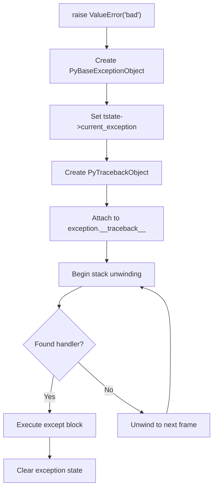
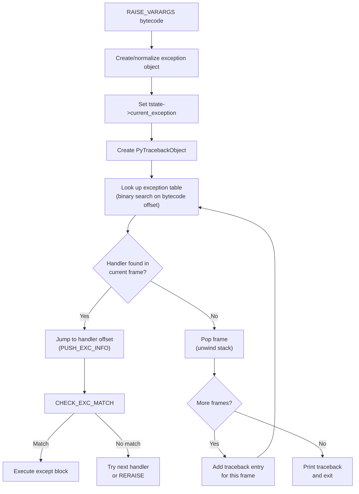
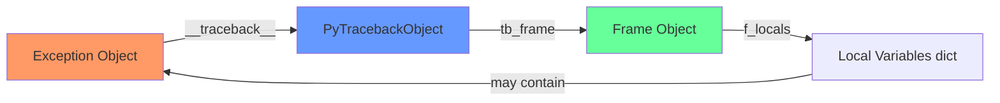
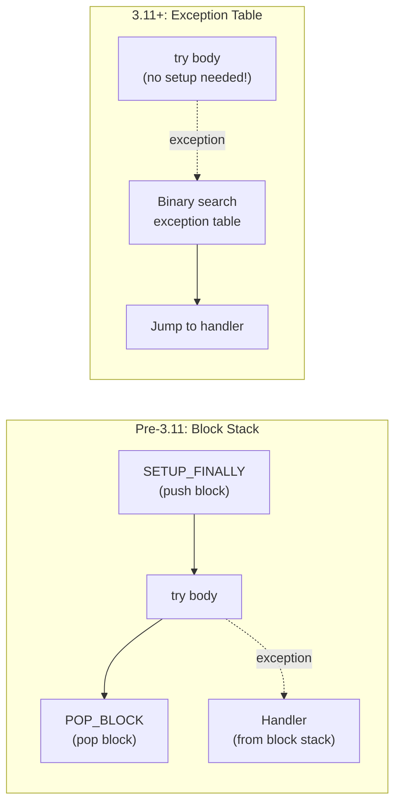

# Python Exceptions — Professional Level

## Table of Contents

1. [Introduction](#introduction)
2. [CPython Exception Handling Internals](#cpython-exception-handling-internals)
3. [Bytecode Analysis of try/except](#bytecode-analysis-of-tryexcept)
4. [Exception Object Internals](#exception-object-internals)
5. [Traceback Internals](#traceback-internals)
6. [Exception Matching Algorithm](#exception-matching-algorithm)
7. [GIL and Exceptions](#gil-and-exceptions)
8. [Memory Impact of Exceptions](#memory-impact-of-exceptions)
9. [C-Level Exception API](#c-level-exception-api)
10. [ExceptionGroup Internals](#exceptiongroup-internals)
11. [Diagrams & Visual Aids](#diagrams--visual-aids)

---

## Introduction

> Focus: "What happens under the hood?"

This document explores CPython's exception handling mechanism at the C source code and bytecode level. You will learn:
- How CPython compiles `try/except/else/finally` into bytecode instructions
- The internal structure of exception objects (`PyBaseExceptionObject`)
- How traceback objects are constructed and chained
- The exception matching algorithm (subclass check via `PyErr_GivenExceptionMatches`)
- Memory layout and reference counting implications
- The zero-cost exception model in CPython 3.11+ (PEP 657)

---

## CPython Exception Handling Internals

### The Exception State Machine

CPython maintains exception state per-thread in the `PyThreadState` structure:

```c
// CPython Include/cpython/pystate.h (simplified)
typedef struct _ts {
    // ...
    PyObject *current_exception;   // The current active exception (3.12+)

    // Before 3.12, it was three separate fields:
    // PyObject *curexc_type;
    // PyObject *curexc_value;
    // PyObject *curexc_traceback;
    // ...
} PyThreadState;
```

When an exception is raised:
1. CPython creates a `PyBaseExceptionObject` (or subclass)
2. The exception is stored in `tstate->current_exception`
3. A traceback object is created and attached to the exception's `__traceback__`
4. The interpreter begins unwinding the call stack, looking for exception handlers



### Zero-Cost Exception Handling (CPython 3.11+)

Before Python 3.11, entering a `try` block had a small overhead — CPython pushed a "block" onto a per-frame block stack (`f_blockstack`). In 3.11+, PEP 659 introduced **zero-cost exception handling**:

- No setup cost for `try` blocks — the compiler generates an **exception table** embedded in the code object
- The exception table maps bytecode offset ranges to handler addresses
- When an exception occurs, CPython looks up the handler in the table (binary search)
- This means `try` blocks are literally free when no exception is raised

```python
import dis
import sys

def example():
    try:
        x = 1
    except ValueError:
        x = 2

# In 3.11+, dis shows the exception table
dis.dis(example)
# The exception table is printed at the end:
# ExceptionTable:
#   2 to 6 -> 8 [0]
```

### The Exception Table Format

```python
# Inspect the exception table directly
code = example.__code__
print("Exception table entries:")
# co_exceptiontable is a bytes object in 3.11+
if hasattr(code, 'co_exceptiontable'):
    print(f"  Raw bytes: {code.co_exceptiontable!r}")
    print(f"  Length: {len(code.co_exceptiontable)} bytes")
```

The exception table encodes:
- **start**: beginning of the try block (bytecode offset)
- **end**: end of the try block
- **target**: offset of the handler (except clause)
- **depth**: stack depth at the handler entry
- **lasti**: whether to push the last instruction index

---

## Bytecode Analysis of try/except

### Basic try/except

```python
import dis

def basic_try():
    try:
        x = int("123")
    except ValueError:
        x = 0
    return x

dis.dis(basic_try)
```

**CPython 3.12 bytecode output:**

```
  # try:
  2           RESUME                   0

  # x = int("123")
  4           PUSH_EXC_INFO                    # (only when exception occurs)
              LOAD_GLOBAL              0 (int)
              LOAD_CONST               1 ('123')
              CALL                     1
              STORE_FAST               0 (x)

  # except ValueError:
  6           LOAD_GLOBAL              2 (ValueError)
              CHECK_EXC_MATCH                  # isinstance(exc, ValueError)?
              POP_JUMP_IF_FALSE        ...
              POP_TOP                          # pop exception
              STORE_FAST               0 (x)   # x = 0
              LOAD_CONST               2 (0)

  # return x
  8           LOAD_FAST                0 (x)
              RETURN_VALUE

ExceptionTable:
  4 to 10 -> 12 [0]                           # try block -> handler offset
```

### Key Bytecode Instructions

| Instruction | Purpose |
|-------------|---------|
| `PUSH_EXC_INFO` | Push current exception info onto the stack (entry to except) |
| `CHECK_EXC_MATCH` | Check if TOS matches the exception type (calls `PyErr_GivenExceptionMatches`) |
| `POP_EXCEPT` | Remove the exception from the stack, restore previous exception state |
| `RERAISE` | Re-raise the current exception (bare `raise`) |
| `SETUP_FINALLY` | (pre-3.11) Set up a try block; replaced by exception table in 3.11+ |

### try/except/else/finally Bytecode

```python
def full_try():
    try:
        result = 1 / 1
    except ZeroDivisionError:
        result = 0
    else:
        result *= 2
    finally:
        print(result)
    return result

dis.dis(full_try)
```

**Analysis of the compiled bytecode:**

```
# Phase 1: try block
LOAD_CONST          1 (1)
LOAD_CONST          1 (1)
BINARY_OP           11 (/)
STORE_FAST          0 (result)
# If no exception → jump to else block

# Phase 2: except handler (only reached via exception table)
PUSH_EXC_INFO
LOAD_GLOBAL         0 (ZeroDivisionError)
CHECK_EXC_MATCH
POP_JUMP_IF_FALSE   <re-raise>
POP_TOP
LOAD_CONST          2 (0)
STORE_FAST          0 (result)
POP_EXCEPT
# Jump to finally

# Phase 3: else block (only if no exception)
LOAD_FAST           0 (result)
LOAD_CONST          1 (1)       # actually 2
BINARY_OP           5 (*=)
STORE_FAST          0 (result)

# Phase 4: finally block (always executed)
# Compiler duplicates finally code for both paths
LOAD_GLOBAL         2 (print)
LOAD_FAST           0 (result)
CALL                1
POP_TOP

LOAD_FAST           0 (result)
RETURN_VALUE
```

**Key insight:** The `finally` block is duplicated in the bytecode — once for the normal path and once for the exception path. This is how "always runs" is implemented at the bytecode level.

---

## Exception Object Internals

### PyBaseExceptionObject Layout

```c
// CPython Objects/exceptions.c (simplified)
typedef struct {
    PyObject_HEAD                 // ob_refcnt + ob_type (16 bytes on 64-bit)
    PyObject *args;               // tuple of arguments
    PyObject *traceback;          // __traceback__ — PyTracebackObject
    PyObject *context;            // __context__ — implicit chain
    PyObject *cause;              // __cause__ — explicit chain (raise ... from ...)
    char suppress_context;        // __suppress_context__ — set by `from None`
    PyObject *notes;              // __notes__ — list of notes (3.11+)
} PyBaseExceptionObject;
```

### Memory Layout

```
+----------------------------------+
| PyBaseExceptionObject            |
|----------------------------------|
| ob_refcnt: Py_ssize_t (8 bytes) | ← Reference count
| ob_type: PyTypeObject* (8 bytes) | ← Pointer to ValueError type object
|----------------------------------|
| args: PyObject* (8 bytes)        | ← ("error message",) tuple
| traceback: PyObject* (8 bytes)   | ← PyTracebackObject chain
| context: PyObject* (8 bytes)     | ← Previous exception (__context__)
| cause: PyObject* (8 bytes)       | ← Explicit cause (__cause__)
| suppress_context: char (1 byte)  | ← True if `from None`
| notes: PyObject* (8 bytes)       | ← List of add_note() strings
+----------------------------------+
Total: ~73 bytes base + args tuple + traceback chain
```

### Inspecting Exception Internals

```python
import sys

def inspect_exception():
    try:
        try:
            raise ValueError("original")
        except ValueError as original:
            raise TypeError("wrapper") from original
    except TypeError as wrapper:
        print(f"Exception type: {type(wrapper).__name__}")
        print(f"args: {wrapper.args}")
        print(f"__cause__: {wrapper.__cause__}")
        print(f"__context__: {wrapper.__context__}")
        print(f"__suppress_context__: {wrapper.__suppress_context__}")
        print(f"__traceback__: {wrapper.__traceback__}")
        print(f"Memory size: {sys.getsizeof(wrapper)} bytes")

        # Traceback chain
        tb = wrapper.__traceback__
        while tb is not None:
            frame = tb.tb_frame
            print(f"  Frame: {frame.f_code.co_name} at line {tb.tb_lineno}")
            tb = tb.tb_next

inspect_exception()
```

---

## Traceback Internals

### PyTracebackObject Structure

```c
// CPython Include/cpython/traceback.h
typedef struct _traceback {
    PyObject_HEAD
    struct _traceback *tb_next;   // Next traceback (outer frame)
    PyFrameObject *tb_frame;      // Frame where exception occurred
    int tb_lasti;                  // Last bytecode instruction index
    int tb_lineno;                 // Line number in source code
} PyTracebackObject;
```

### How Tracebacks Are Built

When an exception propagates through call frames, CPython builds the traceback as a linked list:

```python
def level_3():
    raise ValueError("bottom")

def level_2():
    level_3()

def level_1():
    level_2()

try:
    level_1()
except ValueError as e:
    tb = e.__traceback__
    # tb points to level_1's frame
    # tb.tb_next points to level_2's frame
    # tb.tb_next.tb_next points to level_3's frame (where raise happened)
```

```
Traceback linked list (tb_next chain):

+-------------------+     +-------------------+     +-------------------+
| PyTracebackObject |     | PyTracebackObject |     | PyTracebackObject |
|-------------------|     |-------------------|     |-------------------|
| tb_frame: level_1 |---->| tb_frame: level_2 |---->| tb_frame: level_3 |
| tb_lineno: 9      |     | tb_lineno: 6      |     | tb_lineno: 2      |
| tb_next: ---------|     | tb_next: ---------|     | tb_next: NULL     |
+-------------------+     +-------------------+     +-------------------+
```

### PEP 657: Fine-Grained Error Locations (3.11+)

Python 3.11+ tracks column offsets for precise error locations:

```python
# Python 3.11+ shows exact expression that caused the error
x = {"a": {"b": {"c": None}}}
result = x["a"]["b"]["c"]["d"]
#        ~~~~~~~~~~~~~~~^^^^^
# TypeError: 'NoneType' object is not subscriptable
```

This is implemented via `co_positions()` in the code object, which stores (line, end_line, column, end_column) for each bytecode instruction.

---

## Exception Matching Algorithm

### How `except` Determines a Match

```c
// CPython Python/ceval.c — CHECK_EXC_MATCH handler (simplified)
int
PyErr_GivenExceptionMatches(PyObject *err, PyObject *exc)
{
    if (PyExceptionClass_Check(exc)) {
        // Standard case: isinstance check
        return PyObject_IsSubclass(err, exc);
    }
    if (PyTuple_Check(exc)) {
        // Tuple of exceptions: check each one
        for (Py_ssize_t i = 0; i < PyTuple_GET_SIZE(exc); i++) {
            if (PyErr_GivenExceptionMatches(err, PyTuple_GET_ITEM(exc, i))) {
                return 1;
            }
        }
        return 0;
    }
    return 0;
}
```

**Key points:**
- Exception matching uses `issubclass()`, not `isinstance()` on the type — this is why `except ValueError` catches `UnicodeDecodeError` (which inherits from ValueError)
- Tuples are checked left-to-right; the first match wins
- The order of `except` clauses matters — more specific exceptions must come before more general ones

```python
# This is WHY order matters:
try:
    raise UnicodeDecodeError("utf-8", b"", 0, 1, "bad")
except ValueError:
    print("Caught as ValueError")  # This runs!
except UnicodeDecodeError:
    print("Caught as UnicodeDecodeError")  # Never reached
```

---

## GIL and Exceptions

### Exception State Is Per-Thread

Each Python thread has its own exception state in `PyThreadState`. The GIL ensures that only one thread executes Python bytecode at a time, so exception handling is thread-safe:

```python
import threading
import sys

def thread_func(thread_id):
    """Each thread has independent exception state."""
    try:
        if thread_id % 2 == 0:
            raise ValueError(f"Thread {thread_id}")
        else:
            raise TypeError(f"Thread {thread_id}")
    except (ValueError, TypeError) as e:
        # sys.exc_info() returns THIS thread's exception
        exc_type, exc_value, exc_tb = sys.exc_info()
        print(f"Thread {thread_id}: {exc_type.__name__}: {exc_value}")

threads = [threading.Thread(target=thread_func, args=(i,)) for i in range(4)]
for t in threads:
    t.start()
for t in threads:
    t.join()
```

### GIL Release During Exception Handling

The GIL is **not released** during exception handling itself (bytecode execution). However, if the `except` block calls a C extension that releases the GIL (e.g., I/O operations), another thread can run:

```python
import threading
import time

def worker():
    try:
        raise ValueError("test")
    except ValueError:
        # GIL is held during Python bytecode
        time.sleep(0.1)  # GIL released during sleep → other threads can run
        print("Done handling")
```

---

## Memory Impact of Exceptions

### Reference Cycles with Tracebacks

Exceptions create reference cycles through tracebacks:

```
Exception → __traceback__ → PyTracebackObject → tb_frame → local variables → may reference exception
```

CPython's garbage collector handles these cycles, but they can delay cleanup. This is why Python 3 deletes the `except` variable after the block:

```python
# Python 3 compiles this:
try:
    raise ValueError("test")
except ValueError as e:
    pass

# Into approximately:
try:
    raise ValueError("test")
except ValueError as e:
    try:
        pass
    finally:
        del e  # Break reference cycle!
```

### Measuring Exception Memory Cost

```python
import sys
import tracemalloc

tracemalloc.start()

# Measure memory cost of exception creation
before = tracemalloc.get_traced_memory()

exceptions = []
for i in range(10_000):
    try:
        raise ValueError(f"Error #{i}")
    except ValueError as e:
        # Storing exceptions retains tracebacks and frames
        exceptions.append(e)

after = tracemalloc.get_traced_memory()
print(f"Memory for 10,000 exceptions: {(after[0] - before[0]) / 1024:.1f} KB")
print(f"Per exception: {(after[0] - before[0]) / 10_000:.0f} bytes")

# Clear tracebacks to free memory
for e in exceptions:
    e.__traceback__ = None
after_clear = tracemalloc.get_traced_memory()
print(f"After clearing tracebacks: {(after_clear[0] - before[0]) / 1024:.1f} KB")

tracemalloc.stop()
```

### Optimizing Memory: Clearing Tracebacks

```python
import logging

logger = logging.getLogger(__name__)

def process_batch(items: list) -> list:
    results = []
    errors = []

    for item in items:
        try:
            results.append(transform(item))
        except TransformError as e:
            # Log the traceback, then clear it to free memory
            logger.exception("Transform failed for item %s", item)
            e.__traceback__ = None  # Free the traceback and frame references
            errors.append((item, str(e)))

    return results
```

---

## C-Level Exception API

### Key C Functions for Exception Handling

```c
// Setting the current exception
void PyErr_SetString(PyObject *type, const char *message);
void PyErr_SetObject(PyObject *type, PyObject *value);
void PyErr_SetNone(PyObject *type);

// Checking and fetching the current exception
int PyErr_Occurred(void);              // Returns current exception type (or NULL)
PyObject *PyErr_GetRaisedException(void);  // Get and clear (3.12+)

// Exception matching
int PyErr_GivenExceptionMatches(PyObject *given, PyObject *exc);
int PyErr_ExceptionMatches(PyObject *exc);  // Check current exception

// Chaining
void _PyErr_ChainExceptions(PyObject *typ, PyObject *val, PyObject *tb);

// Fetching (old API, pre-3.12)
void PyErr_Fetch(PyObject **type, PyObject **value, PyObject **traceback);
void PyErr_Restore(PyObject *type, PyObject *value, PyObject *traceback);
void PyErr_NormalizeException(PyObject **type, PyObject **value, PyObject **traceback);
```

### How `raise` Works Internally

```c
// Simplified from CPython Python/ceval.c
// When the RAISE_VARARGS bytecode instruction executes:

case TARGET(RAISE_VARARGS): {
    PyObject *cause = NULL, *exc = NULL;
    switch (oparg) {
    case 2:
        cause = POP();  // The "from" part
        /* fall through */
    case 1:
        exc = POP();    // The exception to raise
        break;
    case 0:
        // Bare raise — re-raise current exception
        exc = _PyErr_GetTopmostException(tstate)->exc_value;
        if (exc == Py_None || exc == NULL) {
            // RuntimeError: No active exception to re-raise
            _PyErr_SetString(tstate, PyExc_RuntimeError,
                            "No active exception to re-raise");
            goto error;
        }
        Py_INCREF(exc);
        break;
    }
    // ... normalize exception, set cause, raise
}
```

---

## ExceptionGroup Internals

### How ExceptionGroup Works Under the Hood

```python
import dis

def except_star_example():
    try:
        raise ExceptionGroup("group", [ValueError("a"), TypeError("b")])
    except* ValueError as eg:
        print(f"ValueErrors: {eg.exceptions}")
    except* TypeError as eg:
        print(f"TypeErrors: {eg.exceptions}")

dis.dis(except_star_example)
```

**Key implementation details:**
- `except*` uses `CHECK_EG_MATCH` bytecode instruction instead of `CHECK_EXC_MATCH`
- `CHECK_EG_MATCH` calls `ExceptionGroup.split()` internally
- `split()` partitions the group into matching and non-matching sub-groups
- Non-matching exceptions are re-raised automatically after all `except*` clauses

```python
# Manual equivalent of what except* does:
eg = ExceptionGroup("group", [ValueError("a"), TypeError("b"), ValueError("c")])

# except* ValueError:
match, rest = eg.split(ValueError)
print(f"Matched: {match}")   # ExceptionGroup('group', [ValueError('a'), ValueError('c')])
print(f"Rest: {rest}")       # ExceptionGroup('group', [TypeError('b')])
```

### ExceptionGroup Memory Layout

```
+---------------------------+
| ExceptionGroup            |
|---------------------------|
| PyBaseExceptionObject      | ← Standard exception fields
|   args: ("group",)        |
|   traceback: ...           |
|   context: None            |
|   cause: None              |
|---------------------------|
| msg: "group"               | ← Group message
| excs: tuple(               | ← Tuple of sub-exceptions
|   ValueError("a"),         |
|   TypeError("b"),          |
|   ValueError("c"),         |
| )                          |
+---------------------------+
```

---

## Diagrams & Visual Aids

### CPython Exception Handling Flow (Internal)



### Exception Object Reference Cycle



### CPython 3.11+ Exception Table vs Pre-3.11 Block Stack


