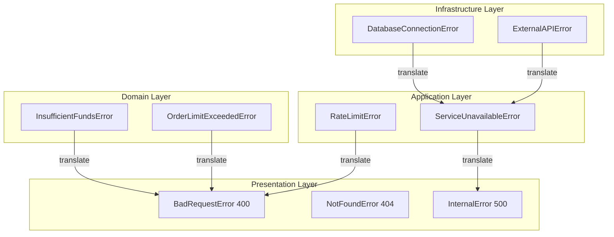
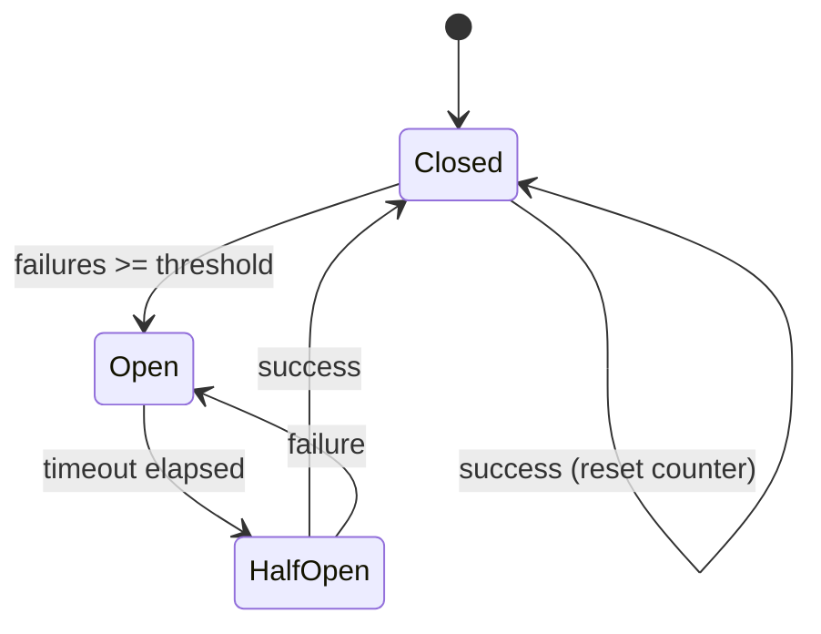
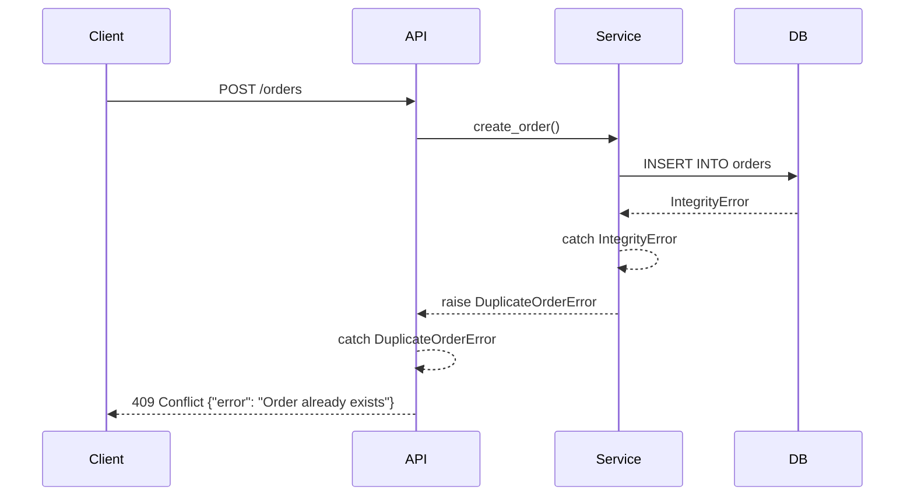
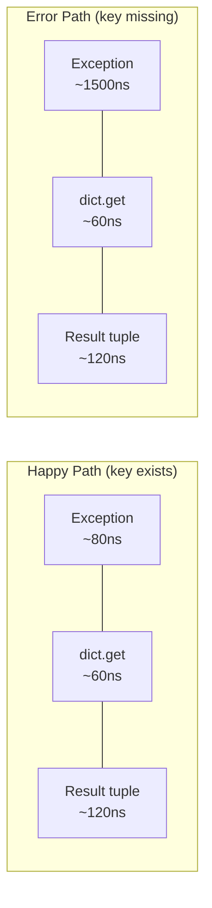

# Python Exceptions — Senior Level

## Table of Contents

1. [Introduction](#introduction)
2. [Architecture](#architecture)
3. [Exception Hierarchy Design](#exception-hierarchy-design)
4. [Benchmarks](#benchmarks)
5. [Advanced Patterns](#advanced-patterns)
6. [Best Practices](#best-practices)
7. [Performance Profiling](#performance-profiling)
8. [Testing Exception Handling](#testing-exception-handling)
9. [Production Error Management](#production-error-management)
10. [Test](#test)
11. [Diagrams & Visual Aids](#diagrams--visual-aids)

---

## Introduction

> Focus: "How to optimize?" and "How to architect?"

At the senior level, exception handling is an architectural concern, not just syntax. You design exception hierarchies that span multiple services, build resilient systems with circuit breakers and bulkheads, profile exception overhead in hot paths, and write comprehensive test suites that cover error paths as thoroughly as happy paths.

This document covers:
- Designing exception hierarchies for large codebases and microservices
- Benchmarking exception cost vs alternative error handling strategies
- Circuit breaker, bulkhead, and dead-letter-queue patterns
- Profiling exception-heavy code paths with `cProfile` and `py-spy`
- Testing exception paths with `pytest.raises`, hypothesis, and fault injection

---

## Architecture

### Layered Exception Architecture

In large applications, exceptions should be translated at each layer boundary. Internal implementation details (database drivers, HTTP clients) must never leak into the API layer.

```python
# Layer 1: Infrastructure (database, HTTP, filesystem)
class InfrastructureError(Exception):
    """Base for infrastructure-level errors."""

class DatabaseConnectionError(InfrastructureError): ...
class ExternalAPIError(InfrastructureError): ...

# Layer 2: Domain (business logic)
class DomainError(Exception):
    """Base for domain-level errors."""

class InsufficientFundsError(DomainError): ...
class OrderLimitExceededError(DomainError): ...

# Layer 3: Application (use cases, services)
class ApplicationError(Exception):
    """Base for application-level errors."""

class ServiceUnavailableError(ApplicationError): ...
class RateLimitError(ApplicationError): ...

# Layer 4: Presentation (API, CLI)
class PresentationError(Exception):
    """Base for API/presentation-level errors."""

class BadRequestError(PresentationError):
    status_code = 400

class NotFoundError(PresentationError):
    status_code = 404

class InternalError(PresentationError):
    status_code = 500
```



### Exception Translation at Boundaries

```python
from functools import wraps
from typing import Type, Callable


class ExceptionTranslator:
    """Translates exceptions at layer boundaries."""

    def __init__(self):
        self._mappings: list[tuple[Type[Exception], Callable]] = []

    def register(
        self,
        source: Type[Exception],
        target_factory: Callable[[Exception], Exception],
    ) -> None:
        self._mappings.append((source, target_factory))

    def __call__(self, func):
        @wraps(func)
        def wrapper(*args, **kwargs):
            try:
                return func(*args, **kwargs)
            except Exception as e:
                for source_type, factory in self._mappings:
                    if isinstance(e, source_type):
                        raise factory(e) from e
                raise
        return wrapper


# Usage
translate = ExceptionTranslator()
translate.register(
    IntegrityError,
    lambda e: BadRequestError(f"Duplicate entry: {e}"),
)
translate.register(
    OperationalError,
    lambda e: InternalError("Database unavailable"),
)

@translate
def create_order(order: dict) -> dict:
    return db.insert("orders", order)
```

---

## Exception Hierarchy Design

### Principles for Large Codebases

1. **One base exception per package/service** — allows catching all errors from one subsystem
2. **Semantic naming** — exceptions describe *what* went wrong, not *where*
3. **Carry structured data** — include fields for machine-readable error details
4. **HTTP-aware at the API boundary** — map to status codes at the outermost layer

```python
from dataclasses import dataclass, field
from typing import Any
from enum import Enum
import uuid


class ErrorSeverity(Enum):
    WARNING = "warning"
    ERROR = "error"
    CRITICAL = "critical"


@dataclass
class ErrorContext:
    """Structured error information for observability."""
    error_id: str = field(default_factory=lambda: str(uuid.uuid4()))
    severity: ErrorSeverity = ErrorSeverity.ERROR
    metadata: dict[str, Any] = field(default_factory=dict)

    def to_dict(self) -> dict:
        return {
            "error_id": self.error_id,
            "severity": self.severity.value,
            "metadata": self.metadata,
        }


class AppError(Exception):
    """Base application exception with structured context."""

    def __init__(
        self,
        message: str,
        *,
        severity: ErrorSeverity = ErrorSeverity.ERROR,
        **metadata: Any,
    ):
        super().__init__(message)
        self.context = ErrorContext(
            severity=severity,
            metadata=metadata,
        )

    @property
    def error_id(self) -> str:
        return self.context.error_id

    def to_response(self) -> dict:
        return {
            "error": type(self).__name__,
            "message": str(self),
            "error_id": self.error_id,
        }
```

---

## Benchmarks

### Exception Cost vs Alternatives

```python
import timeit
from dataclasses import dataclass
from typing import Optional


# Approach 1: Exception-based
class NotFoundError(Exception):
    pass

def find_by_exception(items: dict, key: str) -> str:
    try:
        return items[key]
    except KeyError:
        raise NotFoundError(f"{key} not found")


# Approach 2: Optional return
def find_by_optional(items: dict, key: str) -> Optional[str]:
    return items.get(key)


# Approach 3: Result tuple
def find_by_result(items: dict, key: str) -> tuple[str | None, str | None]:
    if key in items:
        return items[key], None
    return None, f"{key} not found"


# Approach 4: Result class
@dataclass
class Result:
    value: str | None = None
    error: str | None = None

    @property
    def is_ok(self) -> bool:
        return self.error is None

def find_by_result_class(items: dict, key: str) -> Result:
    if key in items:
        return Result(value=items[key])
    return Result(error=f"{key} not found")


# Benchmark
data = {f"key_{i}": f"value_{i}" for i in range(1000)}
N = 1_000_000

# Key exists (happy path)
print("=== Key EXISTS (happy path) ===")
print(f"Exception:    {timeit.timeit(lambda: find_by_exception(data, 'key_500'), number=N):.3f}s")
print(f"Optional:     {timeit.timeit(lambda: find_by_optional(data, 'key_500'), number=N):.3f}s")
print(f"Result tuple: {timeit.timeit(lambda: find_by_result(data, 'key_500'), number=N):.3f}s")
print(f"Result class: {timeit.timeit(lambda: find_by_result_class(data, 'key_500'), number=N):.3f}s")

# Key missing (error path)
print("\n=== Key MISSING (error path) ===")
def bench_exception_miss():
    try:
        find_by_exception(data, "missing")
    except NotFoundError:
        pass

print(f"Exception:    {timeit.timeit(bench_exception_miss, number=N):.3f}s")
print(f"Optional:     {timeit.timeit(lambda: find_by_optional(data, 'missing'), number=N):.3f}s")
print(f"Result tuple: {timeit.timeit(lambda: find_by_result(data, 'missing'), number=N):.3f}s")
print(f"Result class: {timeit.timeit(lambda: find_by_result_class(data, 'missing'), number=N):.3f}s")
```

**Typical results (CPython 3.12):**

| Approach | Happy Path (1M ops) | Error Path (1M ops) |
|----------|---------------------|---------------------|
| Exception | ~0.08s | ~1.5s |
| Optional (dict.get) | ~0.06s | ~0.06s |
| Result tuple | ~0.12s | ~0.12s |
| Result class | ~0.45s | ~0.45s |

**Conclusion:** Exceptions are competitive on the happy path but 10-25x slower on the error path due to traceback creation. In hot loops with frequent failures, use return values. For rare errors, exceptions are idiomatic and fast enough.

### Profiling Exception-Heavy Code

```python
import cProfile
import pstats

def process_batch(items: list[str]) -> list[int]:
    results = []
    for item in items:
        try:
            results.append(int(item))
        except ValueError:
            results.append(0)
    return results

# Profile with 50% bad data
test_data = [str(i) if i % 2 == 0 else "bad" for i in range(100_000)]

profiler = cProfile.Profile()
profiler.enable()
process_batch(test_data)
profiler.disable()

stats = pstats.Stats(profiler)
stats.sort_stats("cumulative")
stats.print_stats(10)
```

---

## Advanced Patterns

### Pattern 1: Circuit Breaker

```python
import time
from enum import Enum
from threading import Lock


class CircuitState(Enum):
    CLOSED = "closed"        # Normal operation
    OPEN = "open"            # Failing — reject calls
    HALF_OPEN = "half_open"  # Testing — allow one call


class CircuitBreakerError(Exception):
    """Raised when the circuit is open."""


class CircuitBreaker:
    """Circuit breaker for protecting external service calls."""

    def __init__(
        self,
        failure_threshold: int = 5,
        recovery_timeout: float = 30.0,
        expected_exceptions: tuple[type, ...] = (Exception,),
    ):
        self._failure_threshold = failure_threshold
        self._recovery_timeout = recovery_timeout
        self._expected_exceptions = expected_exceptions
        self._failure_count = 0
        self._last_failure_time = 0.0
        self._state = CircuitState.CLOSED
        self._lock = Lock()

    @property
    def state(self) -> CircuitState:
        if self._state == CircuitState.OPEN:
            if time.monotonic() - self._last_failure_time >= self._recovery_timeout:
                self._state = CircuitState.HALF_OPEN
        return self._state

    def __call__(self, func):
        def wrapper(*args, **kwargs):
            return self._execute(func, *args, **kwargs)
        return wrapper

    def _execute(self, func, *args, **kwargs):
        with self._lock:
            current_state = self.state
            if current_state == CircuitState.OPEN:
                raise CircuitBreakerError(
                    f"Circuit is OPEN. {self._failure_count} failures. "
                    f"Retry after {self._recovery_timeout}s."
                )

        try:
            result = func(*args, **kwargs)
        except self._expected_exceptions as e:
            self._record_failure()
            raise
        else:
            self._record_success()
            return result

    def _record_failure(self) -> None:
        with self._lock:
            self._failure_count += 1
            self._last_failure_time = time.monotonic()
            if self._failure_count >= self._failure_threshold:
                self._state = CircuitState.OPEN

    def _record_success(self) -> None:
        with self._lock:
            self._failure_count = 0
            self._state = CircuitState.CLOSED


# Usage
@CircuitBreaker(failure_threshold=3, recovery_timeout=60)
def call_payment_api(order_id: str) -> dict:
    response = requests.post(f"https://payments.example.com/charge/{order_id}")
    response.raise_for_status()
    return response.json()
```

### Pattern 2: Dead Letter Queue for Failed Operations

```python
import json
import logging
from datetime import datetime
from pathlib import Path
from typing import Any, Callable

logger = logging.getLogger(__name__)


class DeadLetterQueue:
    """Stores failed operations for later retry or investigation."""

    def __init__(self, storage_path: str = "dlq"):
        self._path = Path(storage_path)
        self._path.mkdir(parents=True, exist_ok=True)

    def enqueue(
        self,
        operation: str,
        payload: dict[str, Any],
        error: Exception,
    ) -> str:
        entry_id = f"{operation}_{datetime.utcnow().isoformat()}"
        entry = {
            "id": entry_id,
            "operation": operation,
            "payload": payload,
            "error_type": type(error).__name__,
            "error_message": str(error),
            "timestamp": datetime.utcnow().isoformat(),
        }
        filepath = self._path / f"{entry_id}.json"
        filepath.write_text(json.dumps(entry, indent=2))
        logger.warning("Dead-lettered operation %s: %s", operation, error)
        return entry_id


def with_dead_letter(
    dlq: DeadLetterQueue,
    operation_name: str,
) -> Callable:
    """Decorator that sends failed operations to a dead letter queue."""
    def decorator(func):
        def wrapper(*args, **kwargs):
            try:
                return func(*args, **kwargs)
            except Exception as e:
                dlq.enqueue(
                    operation=operation_name,
                    payload={"args": str(args), "kwargs": str(kwargs)},
                    error=e,
                )
                raise
        return wrapper
    return decorator


# Usage
dlq = DeadLetterQueue("/var/log/myapp/dlq")

@with_dead_letter(dlq, "send_invoice")
def send_invoice(customer_id: int, amount: float) -> None:
    # If this fails, the operation is logged to DLQ for manual retry
    smtp.send(customer_id, f"Invoice: ${amount}")
```

### Pattern 3: Structured Error Responses (API)

```python
from dataclasses import dataclass, field
from typing import Any
from http import HTTPStatus


@dataclass
class APIError(Exception):
    """Base API error with structured response format."""
    message: str
    status: HTTPStatus = HTTPStatus.INTERNAL_SERVER_ERROR
    code: str = "INTERNAL_ERROR"
    details: dict[str, Any] = field(default_factory=dict)

    def to_response(self) -> tuple[dict, int]:
        body = {
            "error": {
                "code": self.code,
                "message": self.message,
                "details": self.details,
            }
        }
        return body, self.status.value


@dataclass
class ValidationAPIError(APIError):
    status: HTTPStatus = HTTPStatus.BAD_REQUEST
    code: str = "VALIDATION_ERROR"
    field_errors: dict[str, list[str]] = field(default_factory=dict)

    def to_response(self) -> tuple[dict, int]:
        body, status = super().to_response()
        body["error"]["field_errors"] = self.field_errors
        return body, status


# FastAPI integration
from fastapi import FastAPI, Request
from fastapi.responses import JSONResponse

app = FastAPI()

@app.exception_handler(APIError)
async def api_error_handler(request: Request, exc: APIError):
    body, status = exc.to_response()
    return JSONResponse(status_code=status, content=body)
```

---

## Best Practices

### 1. Never catch exceptions you cannot handle

```python
# ❌ Catching and logging without action is not handling
try:
    result = process(data)
except Exception as e:
    logger.error("Error: %s", e)
    # Now what? result is undefined, and the caller thinks it succeeded

# ✅ Either handle it properly or let it propagate
try:
    result = process(data)
except ProcessingError as e:
    logger.warning("Processing failed, using fallback: %s", e)
    result = fallback_process(data)
```

### 2. Use exception groups for concurrent operations

```python
import asyncio

async def fetch_all(urls: list[str]) -> list[dict]:
    """Fetch all URLs concurrently, collecting all errors."""
    async with asyncio.TaskGroup() as tg:
        tasks = [tg.create_task(fetch(url)) for url in urls]
    # If any task fails, TaskGroup raises ExceptionGroup
    return [t.result() for t in tasks]

# Handle with except*
try:
    results = asyncio.run(fetch_all(["url1", "url2", "url3"]))
except* ConnectionError as eg:
    for e in eg.exceptions:
        logger.error("Connection failed: %s", e)
except* TimeoutError as eg:
    logger.error("%d requests timed out", len(eg.exceptions))
```

### 3. Include correlation IDs in exceptions

```python
import uuid
import logging

class TracedError(Exception):
    def __init__(self, message: str, correlation_id: str | None = None):
        self.correlation_id = correlation_id or str(uuid.uuid4())
        super().__init__(f"[{self.correlation_id}] {message}")

# In middleware
def handle_request(request):
    correlation_id = request.headers.get("X-Correlation-ID", str(uuid.uuid4()))
    try:
        return process(request)
    except Exception as e:
        raise TracedError(str(e), correlation_id=correlation_id) from e
```

### 4. Test both success and failure paths

```python
import pytest

class TestPaymentService:
    def test_successful_payment(self, payment_service):
        result = payment_service.charge(amount=100, card="valid")
        assert result.status == "success"

    def test_insufficient_funds(self, payment_service):
        with pytest.raises(InsufficientFundsError) as exc_info:
            payment_service.charge(amount=1_000_000, card="low_balance")
        assert "insufficient" in str(exc_info.value).lower()
        assert exc_info.value.amount == 1_000_000

    def test_invalid_card_raises_validation_error(self, payment_service):
        with pytest.raises(ValidationError, match="Invalid card number"):
            payment_service.charge(amount=100, card="invalid")

    def test_network_failure_retries(self, payment_service, mocker):
        mock_api = mocker.patch("payment_service.api.charge")
        mock_api.side_effect = [ConnectionError(), ConnectionError(), {"status": "ok"}]
        result = payment_service.charge(amount=100, card="valid")
        assert result["status"] == "ok"
        assert mock_api.call_count == 3

    def test_circuit_breaker_opens_after_threshold(self, payment_service, mocker):
        mock_api = mocker.patch("payment_service.api.charge")
        mock_api.side_effect = ConnectionError("timeout")

        for _ in range(5):
            with pytest.raises(ConnectionError):
                payment_service.charge(amount=100, card="valid")

        with pytest.raises(CircuitBreakerError):
            payment_service.charge(amount=100, card="valid")
```

---

## Performance Profiling

### Finding Exception Bottlenecks

```python
import cProfile
import io
import pstats


def profile_exceptions(func, *args, **kwargs):
    """Profile a function and highlight exception-related overhead."""
    pr = cProfile.Profile()
    pr.enable()
    try:
        result = func(*args, **kwargs)
    except Exception:
        pass
    pr.disable()

    s = io.StringIO()
    ps = pstats.Stats(pr, stream=s).sort_stats("cumulative")
    ps.print_stats(20)
    print(s.getvalue())


# Example: profiling a parser with many ValueError exceptions
def parse_numbers(raw_list: list[str]) -> list[int]:
    results = []
    for item in raw_list:
        try:
            results.append(int(item))
        except ValueError:
            pass
    return results


# 50% valid, 50% invalid
test_data = [str(i) if i % 2 == 0 else "bad" for i in range(100_000)]
profile_exceptions(parse_numbers, test_data)
```

### Optimization: Avoiding Exceptions in Hot Paths

```python
import re
import timeit

data = [str(i) if i % 3 != 0 else "bad" for i in range(10_000)]

# Approach 1: Try/except (slow with many exceptions)
def parse_with_exceptions(items):
    results = []
    for item in items:
        try:
            results.append(int(item))
        except ValueError:
            results.append(0)
    return results

# Approach 2: Pre-validate with str.isdigit (avoids exceptions)
def parse_with_validation(items):
    results = []
    for item in items:
        if item.lstrip("-").isdigit():
            results.append(int(item))
        else:
            results.append(0)
    return results

# Approach 3: Regex pre-filter
INT_RE = re.compile(r"^-?\d+$")
def parse_with_regex(items):
    return [int(item) if INT_RE.match(item) else 0 for item in items]

# Benchmark
print(f"Exceptions:  {timeit.timeit(lambda: parse_with_exceptions(data), number=100):.3f}s")
print(f"Validation:  {timeit.timeit(lambda: parse_with_validation(data), number=100):.3f}s")
print(f"Regex:       {timeit.timeit(lambda: parse_with_regex(data), number=100):.3f}s")
```

---

## Testing Exception Handling

### Comprehensive Exception Test Patterns

```python
import pytest
from unittest.mock import patch, MagicMock


class TestFileProcessor:
    """Tests covering all exception paths in file processing."""

    def test_file_not_found_returns_empty(self, processor):
        result = processor.process("nonexistent.csv")
        assert result == []

    def test_permission_error_raises_access_denied(self, processor):
        with patch("builtins.open", side_effect=PermissionError("denied")):
            with pytest.raises(AccessDeniedError):
                processor.process("protected.csv")

    def test_malformed_csv_raises_parse_error(self, processor, tmp_path):
        bad_csv = tmp_path / "bad.csv"
        bad_csv.write_text("a,b,c\n1,2\n")  # missing column
        with pytest.raises(ParseError, match="Expected 3 columns"):
            processor.process(str(bad_csv))

    def test_exception_chain_preserves_original(self, processor, tmp_path):
        bad_csv = tmp_path / "bad.csv"
        bad_csv.write_text("not,valid,csv\ndata")
        with pytest.raises(ParseError) as exc_info:
            processor.process(str(bad_csv))
        assert exc_info.value.__cause__ is not None

    @pytest.mark.parametrize("exception_type", [
        IOError, OSError, UnicodeDecodeError,
    ])
    def test_io_errors_are_wrapped(self, processor, exception_type):
        with patch("builtins.open", side_effect=exception_type("test", b"", 0, 1, "err")):
            with pytest.raises(FileProcessingError):
                processor.process("file.csv")

    def test_partial_failure_logs_and_continues(self, processor, tmp_path, caplog):
        csv_file = tmp_path / "data.csv"
        csv_file.write_text("name,age\nAlice,30\nBob,invalid\nCharlie,25\n")
        with caplog.at_level("WARNING"):
            result = processor.process(str(csv_file), skip_errors=True)
        assert len(result) == 2
        assert "Bob" in caplog.text

    def test_cleanup_runs_on_exception(self, processor, mocker):
        cleanup = mocker.spy(processor, "_cleanup")
        with pytest.raises(ProcessingError):
            processor.process("bad_file.csv")
        cleanup.assert_called_once()

    def test_exception_group_from_parallel_processing(self, processor):
        """Test that parallel processing collects all errors."""
        files = ["ok.csv", "bad1.csv", "bad2.csv"]
        with pytest.raises(ExceptionGroup) as exc_info:
            processor.process_batch(files)
        assert len(exc_info.value.exceptions) == 2
```

### Property-Based Testing with Hypothesis

```python
from hypothesis import given, strategies as st


@given(st.text())
def test_parse_never_crashes(text):
    """No input should cause an unhandled exception."""
    try:
        result = parse_input(text)
    except ValidationError:
        pass  # expected — validation errors are fine
    except Exception as e:
        pytest.fail(f"Unexpected exception: {type(e).__name__}: {e}")


@given(st.integers())
def test_process_integer_never_leaks_exceptions(n):
    """Process function should only raise DomainError or succeed."""
    try:
        process_number(n)
    except DomainError:
        pass
    except Exception as e:
        pytest.fail(f"Leaked exception: {type(e).__name__}: {e}")
```

---

## Production Error Management

### Structured Logging with Exceptions

```python
import logging
import json
import traceback
from typing import Any


class StructuredFormatter(logging.Formatter):
    """JSON log formatter that handles exceptions properly."""

    def format(self, record: logging.LogRecord) -> str:
        log_data: dict[str, Any] = {
            "timestamp": self.formatTime(record),
            "level": record.levelname,
            "message": record.getMessage(),
            "module": record.module,
            "function": record.funcName,
            "line": record.lineno,
        }
        if record.exc_info and record.exc_info[1]:
            exc = record.exc_info[1]
            log_data["exception"] = {
                "type": type(exc).__name__,
                "message": str(exc),
                "traceback": traceback.format_exception(*record.exc_info),
            }
            # Include custom exception attributes
            if hasattr(exc, "error_id"):
                log_data["error_id"] = exc.error_id
            if hasattr(exc, "context"):
                log_data["error_context"] = exc.context.to_dict()

        return json.dumps(log_data)
```

### Exception Monitoring Dashboard Metrics

```python
from prometheus_client import Counter, Histogram

exception_counter = Counter(
    "app_exceptions_total",
    "Total exceptions by type and handler",
    ["exception_type", "handler", "severity"],
)

exception_handling_duration = Histogram(
    "app_exception_handling_seconds",
    "Time spent handling exceptions",
    ["exception_type"],
)


def monitored_handler(func):
    """Decorator that tracks exception metrics."""
    def wrapper(*args, **kwargs):
        try:
            return func(*args, **kwargs)
        except Exception as e:
            exception_counter.labels(
                exception_type=type(e).__name__,
                handler=func.__name__,
                severity=getattr(e, "severity", "error"),
            ).inc()
            raise
    return wrapper
```

---

## Test

### Multiple Choice

**1. In a layered architecture, where should database-specific exceptions (e.g., IntegrityError) be translated to domain exceptions?**

- A) In the database driver
- B) At the repository/data-access layer boundary
- C) In the API endpoint
- D) In the exception class itself

<details>
<summary>Answer</summary>
<strong>B)</strong> — Exceptions should be translated at the layer boundary. The repository layer catches database-specific exceptions and raises domain exceptions. This prevents infrastructure details from leaking into business logic.
</details>

**2. What is the primary performance cost of raising an exception in CPython?**

- A) The `try` statement setup
- B) The `except` clause matching
- C) Creating the traceback object and unwinding the call stack
- D) The `finally` block execution

<details>
<summary>Answer</summary>
<strong>C)</strong> — The traceback object creation and stack unwinding are the most expensive parts. Entering a try block is nearly free (it just pushes a frame on the block stack).
</details>

**3. When should you use return values instead of exceptions for error handling?**

- A) Never — exceptions are always better in Python
- B) When errors are expected frequently in a hot loop
- C) Only when interfacing with C code
- D) When using asyncio

<details>
<summary>Answer</summary>
<strong>B)</strong> — In hot loops where errors are frequent (e.g., parsing invalid data), the cost of creating exception objects and tracebacks adds up. Return values (Optional, Result tuples) avoid this overhead.
</details>

**4. What does a circuit breaker pattern protect against?**

- A) Memory leaks
- B) Cascading failures from a failing dependency
- C) SQL injection
- D) Race conditions

<details>
<summary>Answer</summary>
<strong>B)</strong> — A circuit breaker detects when a dependency is failing (e.g., database, external API) and stops sending requests to it temporarily. This prevents cascading failures and gives the dependency time to recover.
</details>

**5. What is the purpose of `add_note()` (Python 3.11+) on exceptions?**

- A) To change the exception type
- B) To attach additional contextual information without wrapping in a new exception
- C) To suppress the exception
- D) To create an ExceptionGroup

<details>
<summary>Answer</summary>
<strong>B)</strong> — <code>add_note()</code> attaches a string note to an existing exception. This is useful for adding context (e.g., "while processing batch #42") without creating wrapper exceptions.
</details>

**6. In the benchmark, why is `dict.get()` faster than both EAFP and LBYL for dictionary lookups?**

- A) It is implemented in C
- B) It skips the hash computation
- C) It does a single hash lookup instead of two (check + access)
- D) Both A and C

<details>
<summary>Answer</summary>
<strong>D)</strong> — <code>dict.get()</code> is a C-implemented method that does a single hash lookup and returns the default if the key is not found. LBYL does two lookups (<code>key in dict</code> + <code>dict[key]</code>), and EAFP has exception overhead on miss.
</details>

**7. How should you test that an exception chain is preserved?**

```python
with pytest.raises(AppError) as exc_info:
    service.process(bad_data)
# How to verify the chain?
```

- A) `assert exc_info.value.__cause__ is not None`
- B) `assert exc_info.value.__context__ is not None`
- C) `assert exc_info.traceback is not None`
- D) `assert exc_info.value.__chain__ is not None`

<details>
<summary>Answer</summary>
<strong>A)</strong> — For explicit chaining (<code>raise X from Y</code>), check <code>__cause__</code>. For implicit chaining (exception raised inside except block), check <code>__context__</code>. Both are valid depending on the scenario.
</details>

**8. What is wrong with this circuit breaker implementation?**

```python
class CB:
    def call(self, func):
        if self.failures > 5:
            raise CircuitOpen()
        try:
            return func()
        except Exception:
            self.failures += 1
            raise
```

- A) It never resets the failure count
- B) It has no half-open state
- C) It is not thread-safe
- D) All of the above

<details>
<summary>Answer</summary>
<strong>D)</strong> — The implementation is missing: (1) success count reset, (2) half-open state with recovery timeout, (3) thread safety (lock for self.failures). A production circuit breaker needs all three.
</details>

---

## Tricky Questions

**1. If a context manager's `__exit__` returns True, what happens to the exception?**

<details>
<summary>Answer</summary>
The exception is <strong>suppressed</strong> — it does not propagate. If <code>__exit__</code> returns any falsy value (or None), the exception propagates normally. This is how <code>contextlib.suppress()</code> works internally.
</details>

**2. Can you catch `ExceptionGroup` with a regular `except` clause?**

<details>
<summary>Answer</summary>
<strong>Yes</strong>, you can catch <code>ExceptionGroup</code> with a regular <code>except ExceptionGroup as eg:</code>. However, you will get the entire group as one object and must iterate <code>eg.exceptions</code> manually. Using <code>except*</code> lets you handle sub-exceptions selectively and is the recommended approach.
</details>

**3. What happens if you `raise` inside a generator that was sent a `throw()`?**

<details>
<summary>Answer</summary>
The new exception propagates to the caller (the code that called <code>generator.throw()</code>). The original thrown exception is set as the <code>__context__</code> of the new exception (implicit chaining).
</details>

---

## Cheat Sheet

| Architecture Pattern | When to Use | Key Benefit |
|---------------------|-------------|-------------|
| Layer translation | Multi-layer apps | No leaking implementation details |
| Circuit breaker | External dependencies | Prevents cascading failures |
| Dead letter queue | Async/batch processing | No lost operations |
| Error accumulator | Form validation | All errors reported at once |
| Retry with backoff | Transient failures | Automatic recovery |
| Exception groups | Concurrent operations | Multiple errors handled |

---

## Summary

- **Architect exceptions in layers:** infrastructure, domain, application, presentation
- **Translate at boundaries:** never let database errors reach your API layer
- **Benchmark before optimizing:** exceptions are fast on happy paths; only optimize if profiling shows a bottleneck
- **Use circuit breakers and DLQs** for resilient production systems
- **Test exception paths as thoroughly as success paths** — use `pytest.raises`, parametrize, hypothesis
- **Monitor exceptions in production** — structured logging, Prometheus counters, Sentry

---

## Diagrams & Visual Aids

### Circuit Breaker State Machine



### Exception Flow in a Microservice



### Benchmark Comparison


