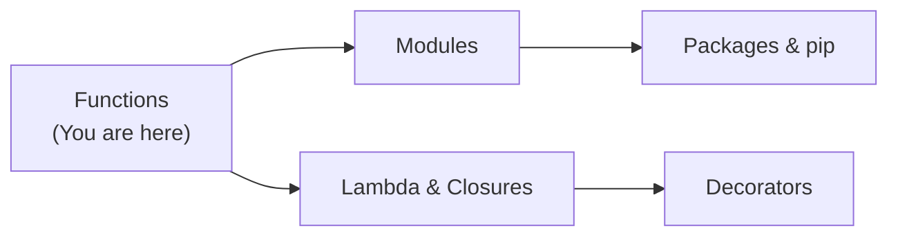
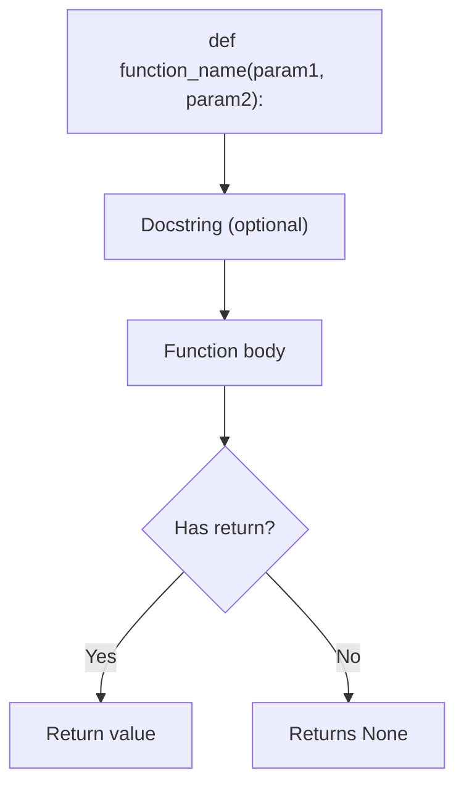
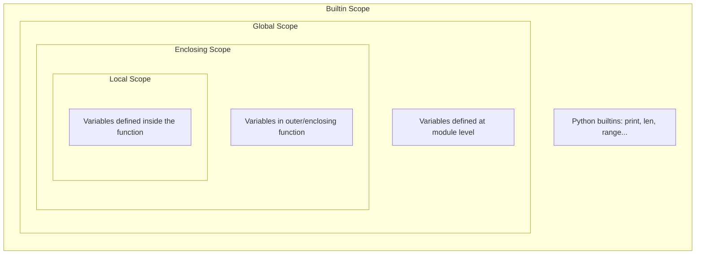
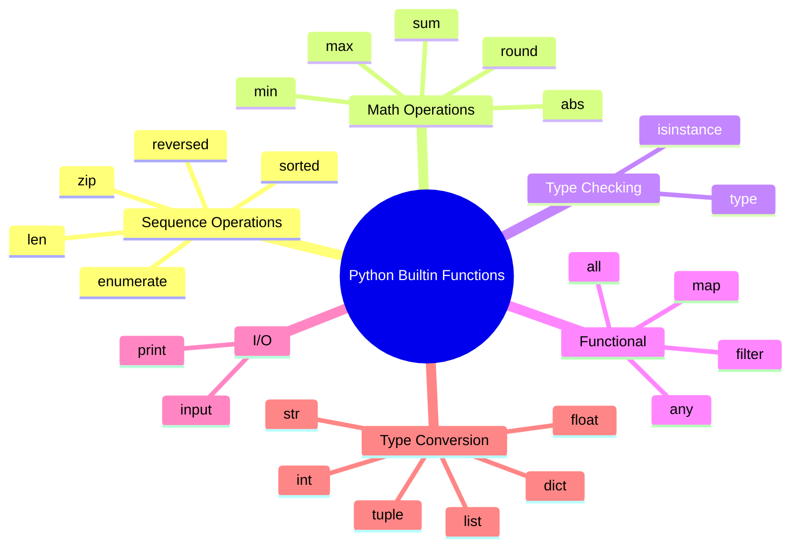

# Python Functions & Builtin Functions — Junior Level

## Table of Contents

1. [Introduction](#introduction)
2. [Prerequisites](#prerequisites)
3. [Glossary](#glossary)
4. [Core Concepts](#core-concepts)
5. [Real-World Analogies](#real-world-analogies)
6. [Mental Models](#mental-models)
7. [Pros & Cons](#pros--cons)
8. [Use Cases](#use-cases)
9. [Code Examples](#code-examples)
10. [Clean Code](#clean-code)
11. [Product Use / Feature](#product-use--feature)
12. [Error Handling](#error-handling)
13. [Security Considerations](#security-considerations)
14. [Performance Tips](#performance-tips)
15. [Metrics & Analytics](#metrics--analytics)
16. [Best Practices](#best-practices)
17. [Edge Cases & Pitfalls](#edge-cases--pitfalls)
18. [Common Mistakes](#common-mistakes)
19. [Common Misconceptions](#common-misconceptions)
20. [Tricky Points](#tricky-points)
21. [Test](#test)
22. [Tricky Questions](#tricky-questions)
23. [Cheat Sheet](#cheat-sheet)
24. [Summary](#summary)
25. [What You Can Build](#what-you-can-build)
26. [Further Reading](#further-reading)
27. [Related Topics](#related-topics)
28. [Diagrams & Visual Aids](#diagrams--visual-aids)

---

## Introduction

> Focus: "What is it?" and "How to use it?"

A **function** is a reusable block of code that performs a specific task. Instead of writing the same logic over and over, you define it once inside a function and call it whenever you need it. Python provides two kinds of functions: **user-defined functions** (created with `def`) and **builtin functions** (like `print()`, `len()`, `range()`) that come ready to use.

Functions are one of the most fundamental building blocks in Python. Every real program — from a simple calculator to a web server — is organized into functions.

---

## Prerequisites

What you should know before studying this topic:

- **Required:** Basic Python syntax — you should be able to write variables, if/else statements, and loops
- **Required:** Variables and data types — understanding strings, integers, lists, and dictionaries
- **Helpful but not required:** Basic understanding of how Python executes code line by line

---

## Glossary

| Term | Definition |
|------|-----------|
| **Function** | A named block of code that performs a task and can be called by name |
| **Parameter** | A variable listed in the function definition that acts as a placeholder |
| **Argument** | The actual value passed to a function when calling it |
| **Return value** | The result a function sends back to the caller using `return` |
| **def** | The keyword used to define a new function |
| **Docstring** | A string literal placed as the first statement in a function to describe what it does |
| **Scope** | The region of code where a variable is accessible |
| **Builtin function** | A function that comes pre-installed with Python (e.g., `print`, `len`, `type`) |
| **Call** | The act of executing a function by using its name followed by parentheses |
| **Default parameter** | A parameter that has a pre-assigned value if no argument is provided |

---

## Core Concepts

### Concept 1: Defining a Function with `def`

A function is created using the `def` keyword, followed by the function name, parentheses with optional parameters, and a colon. The function body is indented.

```python
def greet(name):
    """Print a greeting message."""
    print(f"Hello, {name}!")

greet("Alice")   # Output: Hello, Alice!
greet("Bob")     # Output: Hello, Bob!
```

### Concept 2: Return Values

Functions can send a result back to the caller using the `return` statement. If there is no `return`, the function returns `None` by default.

```python
def add(a, b):
    """Return the sum of two numbers."""
    return a + b

result = add(3, 5)
print(result)  # Output: 8
```

### Concept 3: Parameters and Arguments

**Positional arguments** are matched by their position. **Keyword arguments** are matched by name. **Default parameters** have a fallback value.

```python
def create_profile(name, age, city="Unknown"):
    """Create a user profile dictionary."""
    return {"name": name, "age": age, "city": city}

# Positional arguments
profile1 = create_profile("Alice", 30)
print(profile1)  # {'name': 'Alice', 'age': 30, 'city': 'Unknown'}

# Keyword arguments
profile2 = create_profile(age=25, name="Bob", city="London")
print(profile2)  # {'name': 'Bob', 'age': 25, 'city': 'London'}
```

### Concept 4: `*args` and `**kwargs`

`*args` collects extra positional arguments into a tuple. `**kwargs` collects extra keyword arguments into a dictionary.

```python
def log_message(level, *args, **kwargs):
    """Log a message with variable arguments."""
    print(f"[{level}]", *args)
    for key, value in kwargs.items():
        print(f"  {key}={value}")

log_message("INFO", "Server started", port=8080, host="localhost")
# [INFO] Server started
#   port=8080
#   host=localhost
```

### Concept 5: Docstrings

A docstring is a string placed as the first line inside a function. It documents what the function does and can be accessed via `help()` or `.__doc__`.

```python
def calculate_area(radius):
    """Calculate the area of a circle given its radius.

    Args:
        radius: The radius of the circle (must be non-negative).

    Returns:
        The area of the circle as a float.
    """
    import math
    return math.pi * radius ** 2

help(calculate_area)
```

### Concept 6: Builtin Functions

Python provides dozens of ready-to-use functions. Here are the most important ones:

```python
# len() — get the length of a collection
print(len([1, 2, 3]))        # 3
print(len("hello"))           # 5

# range() — generate a sequence of numbers
for i in range(5):
    print(i, end=" ")         # 0 1 2 3 4

# type() — check the type of an object
print(type(42))               # <class 'int'>
print(type("hello"))          # <class 'str'>

# input() — read user input
# name = input("Enter your name: ")

# isinstance() — check if an object is an instance of a type
print(isinstance(42, int))    # True
print(isinstance("hi", str))  # True

# min(), max(), sum()
numbers = [4, 2, 7, 1, 9]
print(min(numbers))           # 1
print(max(numbers))           # 9
print(sum(numbers))           # 23

# abs(), round()
print(abs(-5))                # 5
print(round(3.14159, 2))      # 3.14

# sorted() — return a new sorted list
print(sorted([3, 1, 4, 1, 5]))  # [1, 1, 3, 4, 5]

# enumerate() — loop with index
for i, fruit in enumerate(["apple", "banana", "cherry"]):
    print(f"{i}: {fruit}")

# zip() — combine two iterables
names = ["Alice", "Bob"]
ages = [30, 25]
for name, age in zip(names, ages):
    print(f"{name} is {age}")

# map() and filter()
squared = list(map(lambda x: x ** 2, [1, 2, 3]))
print(squared)                # [1, 4, 9]

evens = list(filter(lambda x: x % 2 == 0, [1, 2, 3, 4]))
print(evens)                  # [2, 4]

# any() and all()
print(any([False, False, True]))   # True
print(all([True, True, False]))    # False
```

---

## Real-World Analogies

| Concept | Analogy |
|---------|--------|
| **Function** | A recipe — it takes ingredients (parameters) and produces a dish (return value). You write it once, cook it many times. |
| **Parameters vs Arguments** | A recipe says "add 2 cups of flour" (parameter). When you actually pour flour (argument), you fill that placeholder with a real value. |
| **Return value** | A vending machine — you put in money (arguments), press a button (call), and get a product back (return value). |
| **Builtin functions** | Kitchen appliances that come with your house — you do not build them; you just use them (microwave = `print()`, measuring cup = `len()`). |

---

## Mental Models

**The intuition:** Think of a function as a **black box** with an input slot and an output slot. You drop data in (arguments), the box does some work, and a result comes out (return value). You do not need to know how it works inside to use it.

**Why this model helps:** It teaches you to think about functions in terms of their **interface** (inputs and outputs) rather than their implementation, which is the foundation of good software design.

---

## Pros & Cons

| Pros | Cons |
|------|------|
| Code reuse — write once, call many times | Over-abstraction — too many tiny functions can make code harder to follow |
| Readability — meaningful function names explain intent | Overhead — function calls have a small performance cost |
| Testability — each function can be tested independently | Naming difficulty — choosing good names is hard |
| Organization — break complex problems into manageable pieces | Scope confusion — beginners often struggle with local vs global variables |

### When to use:
- Whenever you have logic that repeats or could repeat
- When a block of code does one clear task

### When NOT to use:
- Extremely simple one-liner that is used only once (though even this is debatable)

---

## Use Cases

- **Use Case 1:** Validating user input — create a `validate_email()` function used across your application
- **Use Case 2:** Data transformation — write `convert_celsius_to_fahrenheit()` for a weather app
- **Use Case 3:** API helpers — write `fetch_user_data(user_id)` that wraps HTTP calls

---

## Code Examples

### Example 1: Temperature Converter

```python
def celsius_to_fahrenheit(celsius):
    """Convert Celsius to Fahrenheit.

    Args:
        celsius: Temperature in Celsius.

    Returns:
        Temperature in Fahrenheit.
    """
    return celsius * 9 / 5 + 32


def fahrenheit_to_celsius(fahrenheit):
    """Convert Fahrenheit to Celsius."""
    return (fahrenheit - 32) * 5 / 9


def main():
    temps_c = [0, 20, 37, 100]
    for c in temps_c:
        f = celsius_to_fahrenheit(c)
        print(f"{c}C = {f:.1f}F")

    # Using builtin functions
    temps_f = list(map(celsius_to_fahrenheit, temps_c))
    print(f"\nAll converted: {temps_f}")
    print(f"Hottest: {max(temps_f):.1f}F")
    print(f"Coldest: {min(temps_f):.1f}F")
    print(f"Average: {sum(temps_f) / len(temps_f):.1f}F")


if __name__ == "__main__":
    main()
```

**What it does:** Converts temperatures and demonstrates `map`, `max`, `min`, `sum`, `len`.
**How to run:** `python temperature.py`

### Example 2: Student Grade Analyzer

```python
def calculate_grade(score):
    """Determine letter grade from numeric score."""
    if score >= 90:
        return "A"
    elif score >= 80:
        return "B"
    elif score >= 70:
        return "C"
    elif score >= 60:
        return "D"
    else:
        return "F"


def analyze_scores(*scores):
    """Analyze a variable number of scores.

    Args:
        *scores: Variable number of numeric scores.

    Returns:
        Dictionary with analysis results.
    """
    if not scores:
        return {"error": "No scores provided"}

    grades = list(map(calculate_grade, scores))

    return {
        "scores": scores,
        "grades": grades,
        "average": round(sum(scores) / len(scores), 2),
        "highest": max(scores),
        "lowest": min(scores),
        "passing": len(list(filter(lambda s: s >= 60, scores))),
        "all_passing": all(s >= 60 for s in scores),
        "any_perfect": any(s == 100 for s in scores),
    }


def display_results(**kwargs):
    """Display results using keyword arguments."""
    for key, value in sorted(kwargs.items()):
        print(f"  {key}: {value}")


def main():
    result = analyze_scores(95, 87, 73, 62, 45, 100)
    print("Grade Analysis:")
    display_results(**result)

    # Using enumerate to show ranked scores
    print("\nRanked scores:")
    for rank, (score, grade) in enumerate(
        zip(
            sorted(result["scores"], reverse=True),
            sorted(result["grades"]),
        ),
        start=1,
    ):
        print(f"  #{rank}: {score} ({grade})")


if __name__ == "__main__":
    main()
```

**What it does:** Demonstrates `*args`, `**kwargs`, `map`, `filter`, `all`, `any`, `sorted`, `enumerate`, `zip`.
**How to run:** `python grades.py`

### Example 3: Builtin Functions Showcase

```python
def showcase_builtins():
    """Demonstrate the most useful Python builtin functions."""

    # --- len, type, isinstance ---
    data = [1, "hello", 3.14, True, None]
    print(f"Length: {len(data)}")
    print(f"Types: {[type(x).__name__ for x in data]}")
    print(f"Integers: {[x for x in data if isinstance(x, int)]}")

    # --- range ---
    squares = [x ** 2 for x in range(1, 6)]
    print(f"Squares 1-5: {squares}")

    # --- min, max, sum, abs, round ---
    values = [-3.7, 2.1, -1.5, 4.9, 0.3]
    print(f"Min: {min(values)}")
    print(f"Max: {max(values)}")
    print(f"Sum: {round(sum(values), 2)}")
    print(f"Absolute values: {list(map(abs, values))}")
    print(f"Rounded: {list(map(lambda x: round(x), values))}")

    # --- sorted with key ---
    words = ["banana", "apple", "cherry", "date"]
    print(f"Sorted alphabetically: {sorted(words)}")
    print(f"Sorted by length: {sorted(words, key=len)}")

    # --- zip and enumerate ---
    keys = ["name", "age", "city"]
    vals = ["Alice", 30, "NYC"]
    person = dict(zip(keys, vals))
    print(f"Person: {person}")

    for i, (k, v) in enumerate(person.items()):
        print(f"  Field {i}: {k} = {v}")

    # --- map, filter, any, all ---
    numbers = list(range(1, 11))
    doubled = list(map(lambda x: x * 2, numbers))
    odds = list(filter(lambda x: x % 2 != 0, numbers))
    print(f"Doubled: {doubled}")
    print(f"Odds: {odds}")
    print(f"Any > 8? {any(x > 8 for x in numbers)}")
    print(f"All > 0? {all(x > 0 for x in numbers)}")


if __name__ == "__main__":
    showcase_builtins()
```

**What it does:** Comprehensive demonstration of all major builtin functions.
**How to run:** `python builtins_demo.py`

---

## Clean Code

### Naming (PEP 8 conventions)

```python
# Bad
def d(x):
    return x * 2

def CALCULATE_SUM(A, B):
    return A + B

# Good
def double_value(number):
    return number * 2

def calculate_sum(a, b):
    return a + b
```

**Python naming rules:**
- Functions and variables: `snake_case` (`user_count`, `is_valid`)
- Constants: `UPPER_SNAKE_CASE` (`MAX_RETRIES`, `DEFAULT_TIMEOUT`)
- Classes: `PascalCase` (`UserService`, `HttpClient`)

### Short Functions

```python
# Bad — does too many things
def process_order(order_data):
    # validate, calculate, save, send email — 80 lines
    ...

# Good — each function does one thing
def validate_order(order_data):
    ...

def calculate_total(items):
    ...

def save_order(order):
    ...
```

### Docstrings

```python
# Bad — restates the code
def get_user(user_id):
    # get user
    ...

# Good — explains purpose, parameters, and return value
def get_user(user_id):
    """Retrieve a user by their unique database ID.

    Args:
        user_id: The user's database ID (must be positive).

    Returns:
        A dict with user data, or None if not found.
    """
    ...
```

---

## Product Use / Feature

### 1. Flask / FastAPI

- **How it uses functions:** Every route handler is a function. Parameters come from URL paths, query strings, or JSON bodies.
- **Why it matters:** Understanding functions is essential for building web APIs.

### 2. pandas

- **How it uses functions:** `df.apply(func)` applies a function to every row/column. `map()`, `filter()` patterns are everywhere.
- **Why it matters:** Data processing depends on passing functions as arguments.

### 3. pytest

- **How it uses functions:** Every test is a function that starts with `test_`. Fixtures are functions decorated with `@pytest.fixture`.
- **Why it matters:** You cannot write tests without understanding functions.

---

## Error Handling

### Error 1: TypeError — Wrong number of arguments

```python
def greet(name, greeting):
    print(f"{greeting}, {name}!")

# This raises TypeError: greet() missing 1 required positional argument
# greet("Alice")
```

**Why it happens:** The function expects 2 arguments but received only 1.

**How to fix:**

```python
# Option 1: Provide all required arguments
greet("Alice", "Hello")

# Option 2: Add a default parameter
def greet(name, greeting="Hello"):
    print(f"{greeting}, {name}!")

greet("Alice")  # Works: Hello, Alice!
```

### Error 2: NameError — Variable not in scope

```python
def set_value():
    x = 10  # local variable

set_value()
# print(x)  # NameError: name 'x' is not defined
```

**Why it happens:** `x` is local to the function and does not exist outside it.

**How to fix:**

```python
def set_value():
    return 10

x = set_value()
print(x)  # 10
```

---

## Security Considerations

### 1. Never use `eval()` on user input

```python
# Insecure — user can execute arbitrary code
# user_input = input("Enter expression: ")
# result = eval(user_input)  # DANGEROUS!

# Secure — use specific parsing
def safe_calculate(expression):
    """Only allow simple arithmetic."""
    allowed_chars = set("0123456789+-*/.(). ")
    if not set(expression).issubset(allowed_chars):
        raise ValueError("Invalid characters in expression")
    # Still risky — use ast.literal_eval for simple cases
    import ast
    return ast.literal_eval(expression)
```

### 2. Validate function inputs

```python
def process_file(filename):
    """Process a file safely."""
    import os
    # Prevent path traversal
    if ".." in filename or filename.startswith("/"):
        raise ValueError("Invalid filename")
    safe_path = os.path.join("uploads", os.path.basename(filename))
    # ... process the file
```

---

## Performance Tips

### Tip 1: Use builtin functions instead of manual loops

```python
import time

numbers = list(range(1_000_000))

# Slow — manual loop
start = time.perf_counter()
total = 0
for n in numbers:
    total += n
loop_time = time.perf_counter() - start

# Fast — builtin sum()
start = time.perf_counter()
total = sum(numbers)
builtin_time = time.perf_counter() - start

print(f"Loop: {loop_time:.4f}s")
print(f"Builtin: {builtin_time:.4f}s")
# Builtin is typically 5-10x faster
```

**Why it's faster:** Builtin functions are implemented in C and avoid Python's per-iteration overhead.

### Tip 2: Avoid calling `len()` repeatedly in a loop

```python
# Unnecessary repeated calls
data = list(range(1000))

# Less efficient
for i in range(len(data)):
    if i < len(data) - 1:  # len() called each iteration
        pass

# More efficient
length = len(data)
for i in range(length):
    if i < length - 1:
        pass
```

---

## Metrics & Analytics

| Metric | Why it matters | Tool |
|--------|---------------|------|
| **Function call count** | Detect hot paths | `cProfile` |
| **Execution time per call** | Find slow functions | `time.perf_counter()` |

### Basic Instrumentation

```python
import time

def timed(func):
    """Simple timing wrapper."""
    def wrapper(*args, **kwargs):
        start = time.perf_counter()
        result = func(*args, **kwargs)
        elapsed = time.perf_counter() - start
        print(f"{func.__name__} took {elapsed:.4f}s")
        return result
    return wrapper

@timed
def slow_function():
    total = sum(range(10_000_000))
    return total

slow_function()
```

---

## Best Practices

- **Do this:** Give functions descriptive names that describe what they do (`calculate_total`, not `calc`)
- **Do this:** Keep functions short — ideally under 20 lines
- **Do this:** Each function should do one thing (Single Responsibility Principle)
- **Do this:** Always add docstrings to public functions
- **Do this:** Use type hints for clarity: `def add(a: int, b: int) -> int:`

---

## Edge Cases & Pitfalls

### Pitfall 1: Mutable default argument

```python
# Bad — the list is shared across all calls!
def append_item(item, lst=[]):
    lst.append(item)
    return lst

print(append_item(1))  # [1]
print(append_item(2))  # [1, 2] — unexpected!

# Good — use None as sentinel
def append_item(item, lst=None):
    if lst is None:
        lst = []
    lst.append(item)
    return lst

print(append_item(1))  # [1]
print(append_item(2))  # [2] — correct!
```

### Pitfall 2: Returning None accidentally

```python
def find_max(numbers):
    if numbers:
        max_val = max(numbers)
        # Forgot to return!

result = find_max([1, 2, 3])
print(result)  # None — forgot the return statement!

# Fix: always return explicitly
def find_max(numbers):
    if numbers:
        return max(numbers)
    return None  # explicit is better than implicit
```

---

## Common Mistakes

### Mistake 1: Confusing `print()` and `return`

```python
# Wrong — prints but does not return
def add(a, b):
    print(a + b)

result = add(3, 5)  # Prints 8
print(result)        # None!

# Correct
def add(a, b):
    return a + b

result = add(3, 5)
print(result)  # 8
```

### Mistake 2: Modifying a list while iterating

```python
# Wrong — skips elements
def remove_evens(numbers):
    for n in numbers:
        if n % 2 == 0:
            numbers.remove(n)
    return numbers

# Correct — use filter or list comprehension
def remove_evens(numbers):
    return list(filter(lambda x: x % 2 != 0, numbers))

# Or even better:
def remove_evens(numbers):
    return [n for n in numbers if n % 2 != 0]
```

### Mistake 3: Shadowing builtin names

```python
# Wrong — overwrites the builtin!
list = [1, 2, 3]
# Now list() constructor is broken!
# new_list = list(range(5))  # TypeError!

# Correct — use descriptive names
items = [1, 2, 3]
numbers = list(range(5))  # Works fine
```

---

## Common Misconceptions

### Misconception 1: "Functions always need to return something"

**Reality:** Functions return `None` by default. Side-effect functions (like `print()`) are perfectly valid. Not every function needs a return statement.

**Why people think this:** Many tutorials emphasize return values, making beginners think a function without `return` is broken.

### Misconception 2: "`*args` and `**kwargs` are magic keywords"

**Reality:** The `*` and `**` operators are what matter. You could write `*items` and `**options` — the names `args` and `kwargs` are just conventions.

---

## Tricky Points

### Tricky Point 1: Variable scope

```python
x = 10

def modify():
    x = 20  # This creates a NEW local variable
    print(f"Inside: {x}")

modify()           # Inside: 20
print(f"Outside: {x}")  # Outside: 10 — not changed!
```

**Why it's tricky:** Assignment inside a function creates a local variable, even if a global variable has the same name.
**Key takeaway:** Python looks up variables using the LEGB rule (Local, Enclosing, Global, Builtin).

### Tricky Point 2: Default arguments are evaluated once

```python
import time

def log_event(message, timestamp=time.time()):
    print(f"[{timestamp}] {message}")

log_event("First")   # [1234567890.123] First
time.sleep(1)
log_event("Second")  # [1234567890.123] Second — same timestamp!

# Fix: use None and compute inside
def log_event(message, timestamp=None):
    if timestamp is None:
        timestamp = time.time()
    print(f"[{timestamp}] {message}")
```

**Why it's tricky:** Default values are computed when the function is defined, not when it is called.
**Key takeaway:** Never use mutable objects or function calls as default parameter values.

---

## Test

### Multiple Choice

**1. What does `def` stand for in Python?**

- A) Default
- B) Define
- C) Defer
- D) Defend

<details>
<summary>Answer</summary>
<strong>B)</strong> — <code>def</code> is short for "define". It defines a new function.
</details>

**2. What is the output of this code?**

```python
def greet(name="World"):
    return f"Hello, {name}!"

print(greet())
```

- A) `Hello, !`
- B) `Hello, name!`
- C) `Hello, World!`
- D) Error

<details>
<summary>Answer</summary>
<strong>C)</strong> — The default parameter <code>"World"</code> is used when no argument is provided.
</details>

### True or False

**3. `*args` collects extra keyword arguments into a dictionary.**

<details>
<summary>Answer</summary>
<strong>False</strong> — <code>*args</code> collects extra <em>positional</em> arguments into a <em>tuple</em>. <code>**kwargs</code> collects extra keyword arguments into a dictionary.
</details>

### What's the Output?

**4. What does this code print?**

```python
def mystery(a, b=2, *args):
    return sum(args) + a + b

print(mystery(1, 3, 5, 7))
```

<details>
<summary>Answer</summary>
Output: <code>16</code>
Explanation: <code>a=1</code>, <code>b=3</code> (overrides default), <code>args=(5, 7)</code>. So <code>sum((5, 7)) + 1 + 3 = 16</code>.
</details>

**5. What does this code print?**

```python
x = [1, 2, 3]
print(type(x).__name__, len(x), isinstance(x, list))
```

<details>
<summary>Answer</summary>
Output: <code>list 3 True</code>
</details>

**6. What is the output?**

```python
print(list(zip([1, 2, 3], ["a", "b"])))
```

<details>
<summary>Answer</summary>
Output: <code>[(1, 'a'), (2, 'b')]</code>
Explanation: <code>zip()</code> stops at the shortest iterable. The <code>3</code> is dropped.
</details>

**7. What does this return?**

```python
def func():
    print("hello")

result = func()
print(result)
```

<details>
<summary>Answer</summary>
Output:
<pre>
hello
None
</pre>
The function prints "hello" but returns <code>None</code> because there is no <code>return</code> statement.
</details>

---

## Tricky Questions

**1. What is the output?**

```python
def f(a, b=[]):
    b.append(a)
    return b

print(f(1))
print(f(2))
print(f(3))
```

- A) `[1]`, `[2]`, `[3]`
- B) `[1]`, `[1, 2]`, `[1, 2, 3]`
- C) Error
- D) `[1, 2, 3]`, `[1, 2, 3]`, `[1, 2, 3]`

<details>
<summary>Answer</summary>
<strong>B)</strong> — The default list <code>[]</code> is created once when the function is defined. Each call appends to the <em>same</em> list object.
</details>

**2. What does `sorted("hello")` return?**

- A) `"ehllo"`
- B) `['e', 'h', 'l', 'l', 'o']`
- C) `['h', 'e', 'l', 'l', 'o']`
- D) Error

<details>
<summary>Answer</summary>
<strong>B)</strong> — <code>sorted()</code> always returns a list. It sorts the characters of the string alphabetically.
</details>

---

## Cheat Sheet

| What | Syntax | Example |
|------|--------|---------|
| Define a function | `def name(params):` | `def greet(name): ...` |
| Return a value | `return value` | `return x + y` |
| Default parameter | `param=value` | `def f(x, y=10):` |
| Variable positional | `*args` | `def f(*args):` |
| Variable keyword | `**kwargs` | `def f(**kwargs):` |
| Docstring | `"""..."""` | `"""Calculate area."""` |
| Get length | `len(obj)` | `len([1,2,3])` -> `3` |
| Generate range | `range(start, stop, step)` | `range(0, 10, 2)` |
| Sort a collection | `sorted(iterable, key=)` | `sorted(lst, key=len)` |
| Combine iterables | `zip(a, b)` | `zip([1,2], ["a","b"])` |
| Loop with index | `enumerate(iterable)` | `enumerate(["a","b"])` |
| Apply function | `map(func, iterable)` | `map(str, [1,2,3])` |
| Filter items | `filter(func, iterable)` | `filter(bool, [0,1,2])` |
| Check any/all | `any(it)` / `all(it)` | `any([F, T])` -> `True` |

---

## Summary

- Functions are defined with `def`, take parameters, and return values with `return`
- Parameters can be positional, keyword, default, `*args` (tuple), or `**kwargs` (dict)
- Docstrings document what a function does and help other developers
- Python has powerful builtin functions: `len`, `range`, `sorted`, `zip`, `enumerate`, `map`, `filter`, `any`, `all`, `min`, `max`, `sum`, `abs`, `round`, `type`, `isinstance`, `print`, `input`
- Variables inside functions are local by default (LEGB rule)
- Never use mutable objects as default parameter values

**Next step:** Learn about modules and how to organize functions across files.

---

## What You Can Build

### Projects you can create:
- **Calculator app:** Define functions for each operation — uses parameters, return values, and input validation
- **Contact book:** Functions to add, search, delete, and display contacts — uses `*args`, `sorted()`, `filter()`
- **Quiz game:** Functions for question logic, scoring, and display — uses `enumerate()`, `sum()`, `any()`

### Technologies / tools that use this:
- **Flask / FastAPI** — every route is a function; knowing parameters is essential
- **pandas** — `apply()`, `map()`, `filter()` are used constantly
- **pytest** — every test is a function

### Learning path:



---

## Further Reading

- **Official docs:** [Python Functions](https://docs.python.org/3/tutorial/controlflow.html#defining-functions)
- **Official docs:** [Built-in Functions](https://docs.python.org/3/library/functions.html)
- **Book chapter:** Fluent Python (Ramalho), Chapter 7 — Functions as First-Class Objects
- **PEP 257:** [Docstring Conventions](https://peps.python.org/pep-0257/) — how to write proper docstrings

---

## Related Topics

- **[Exceptions](../06-exceptions/)** — functions raise exceptions when things go wrong
- **[Loops](../04-loops/)** — often used together with functions like `range()`, `enumerate()`
- **[Lists](../08-lists/)** — many builtin functions operate on lists
- **[Dictionaries](../11-dictionaries/)** — `**kwargs` creates dictionaries from keyword arguments

---

## Diagrams & Visual Aids

### Function Anatomy



### LEGB Scope Rule



### Builtin Functions Mind Map


