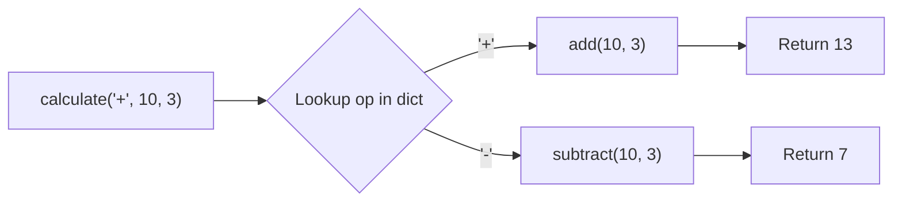
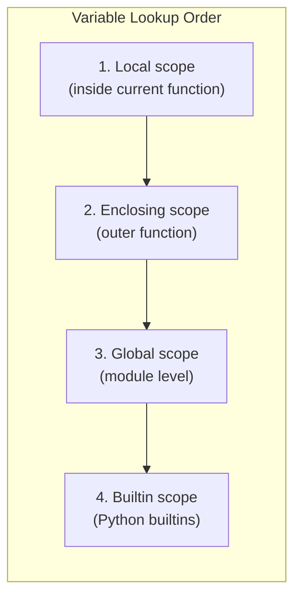
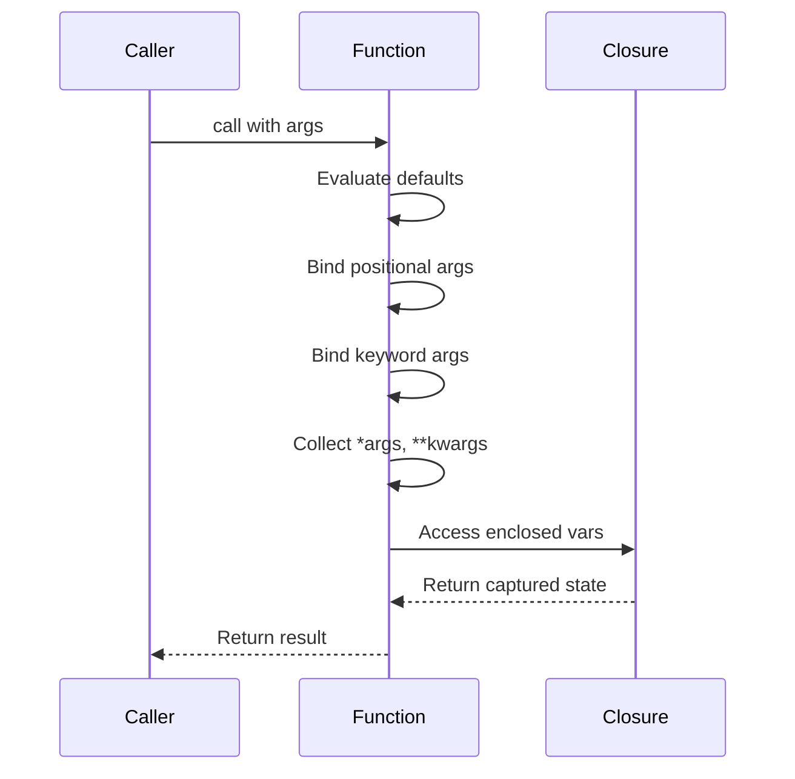
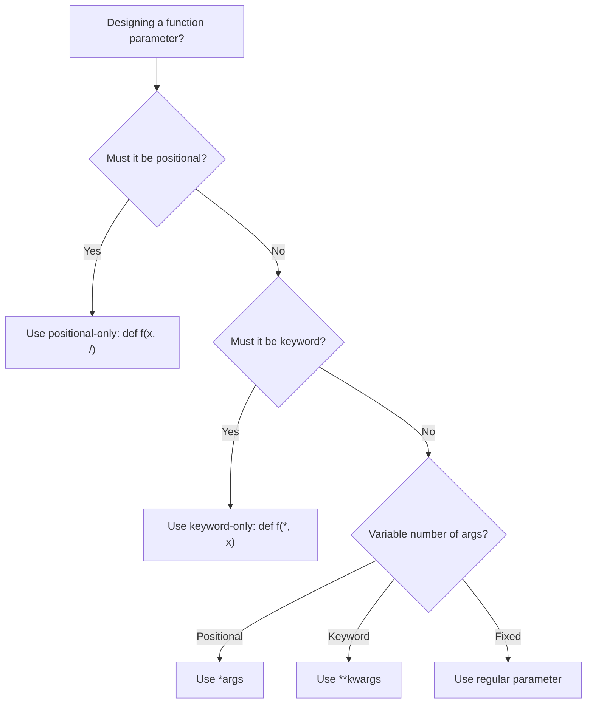
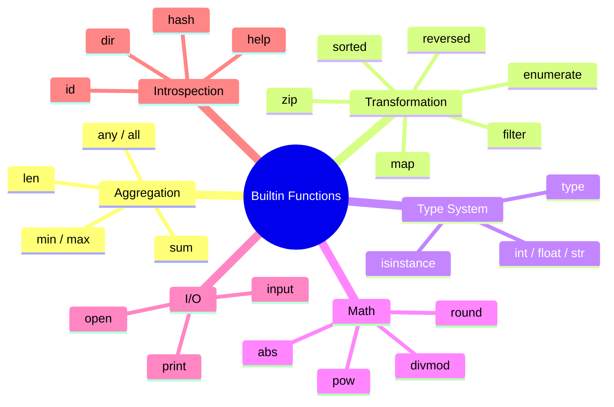

# Python Functions & Builtin Functions — Middle Level

## Table of Contents

1. [Introduction](#introduction)
2. [Core Concepts](#core-concepts)
3. [Evolution & Historical Context](#evolution--historical-context)
4. [Pros & Cons](#pros--cons)
5. [Alternative Approaches](#alternative-approaches)
6. [Use Cases](#use-cases)
7. [Code Examples](#code-examples)
8. [Clean Code](#clean-code)
9. [Product Use / Feature](#product-use--feature)
10. [Error Handling](#error-handling)
11. [Security Considerations](#security-considerations)
12. [Performance Optimization](#performance-optimization)
13. [Debugging Guide](#debugging-guide)
14. [Best Practices](#best-practices)
15. [Edge Cases & Pitfalls](#edge-cases--pitfalls)
16. [Common Mistakes](#common-mistakes)
17. [Tricky Points](#tricky-points)
18. [Comparison with Other Languages](#comparison-with-other-languages)
19. [Test](#test)
20. [Tricky Questions](#tricky-questions)
21. [Cheat Sheet](#cheat-sheet)
22. [Summary](#summary)
23. [Further Reading](#further-reading)
24. [Diagrams & Visual Aids](#diagrams--visual-aids)

---

## Introduction

> Focus: "Why?" and "When to use?"

At the middle level, you already know how to write functions. Now we go deeper: **closures**, **first-class functions**, **higher-order patterns**, **the LEGB rule in detail**, **`global`/`nonlocal` keywords**, **type hints for function signatures**, **decorator basics**, and **production-ready patterns** with builtin functions. You will understand *why* Python functions behave the way they do, and *when* to choose one pattern over another.

---

## Core Concepts

### Concept 1: Functions as First-Class Objects

In Python, functions are objects. You can assign them to variables, pass them as arguments, return them from other functions, and store them in data structures.

```python
def add(a: int, b: int) -> int:
    return a + b

def subtract(a: int, b: int) -> int:
    return a - b

# Functions stored in a dictionary
operations: dict[str, callable] = {
    "+": add,
    "-": subtract,
}

# Dispatch pattern
def calculate(op: str, a: int, b: int) -> int:
    func = operations.get(op)
    if func is None:
        raise ValueError(f"Unknown operation: {op}")
    return func(a, b)

print(calculate("+", 10, 3))  # 13
print(calculate("-", 10, 3))  # 7
```



### Concept 2: Closures and `nonlocal`

A closure is a function that captures variables from its enclosing scope. The inner function "remembers" the environment in which it was created.

```python
def make_counter(start: int = 0):
    """Create a counter function with an internal state."""
    count = start

    def increment(step: int = 1) -> int:
        nonlocal count  # modify the enclosing variable
        count += step
        return count

    return increment

counter = make_counter(10)
print(counter())      # 11
print(counter())      # 12
print(counter(5))     # 17

# Each call to make_counter creates a separate closure
counter2 = make_counter(0)
print(counter2())     # 1
print(counter())      # 18 — independent state
```

### Concept 3: LEGB Rule in Detail

Python resolves variable names using four scopes in order: **L**ocal, **E**nclosing, **G**lobal, **B**uiltin.

```python
x = "global"

def outer():
    x = "enclosing"

    def inner():
        x = "local"
        print(f"inner sees: {x}")       # local

    inner()
    print(f"outer sees: {x}")           # enclosing

outer()
print(f"module sees: {x}")              # global
print(f"builtin 'len' is: {len}")       # <built-in function len>
```



### Concept 4: `global` and `nonlocal` Keywords

```python
# global — modifies a module-level variable from inside a function
total_requests = 0

def handle_request():
    global total_requests
    total_requests += 1
    return total_requests

print(handle_request())  # 1
print(handle_request())  # 2

# nonlocal — modifies a variable in the nearest enclosing scope
def make_accumulator():
    total = 0

    def add(value: float) -> float:
        nonlocal total
        total += value
        return total

    return add

acc = make_accumulator()
print(acc(10))   # 10
print(acc(20))   # 30
print(acc(5))    # 35
```

### Concept 5: Keyword-Only and Positional-Only Parameters

Python 3 introduced explicit control over how arguments can be passed:

```python
# Keyword-only: everything after * must be keyword
def fetch_data(url: str, *, timeout: int = 30, retries: int = 3) -> dict:
    """timeout and retries can only be passed as keyword arguments."""
    print(f"Fetching {url} with timeout={timeout}, retries={retries}")
    return {}

fetch_data("https://api.example.com", timeout=10)
# fetch_data("https://api.example.com", 10)  # TypeError!

# Positional-only (Python 3.8+): everything before / must be positional
def pow(base: float, exp: float, /) -> float:
    """base and exp can only be passed positionally."""
    return base ** exp

print(pow(2, 10))      # 1024
# print(pow(base=2, exp=10))  # TypeError!

# Combined: positional-only, normal, keyword-only
def mixed(a: int, b: int, /, c: int = 0, *, d: int = 0) -> int:
    return a + b + c + d

print(mixed(1, 2, c=3, d=4))  # 10
```

### Concept 6: Advanced Builtin Function Patterns

```python
from typing import Any

# sorted() with complex keys
users = [
    {"name": "Alice", "age": 30, "score": 95},
    {"name": "Bob", "age": 25, "score": 87},
    {"name": "Charlie", "age": 35, "score": 92},
]

# Sort by age, then by score descending
by_age = sorted(users, key=lambda u: u["age"])
by_score_desc = sorted(users, key=lambda u: -u["score"])
# Multi-key sort
by_age_then_score = sorted(users, key=lambda u: (u["age"], -u["score"]))

print([u["name"] for u in by_age_then_score])
# ['Bob', 'Alice', 'Charlie']

# zip() with itertools.zip_longest
from itertools import zip_longest

keys = ["a", "b", "c", "d"]
values = [1, 2]

paired = dict(zip_longest(keys, values, fillvalue=0))
print(paired)  # {'a': 1, 'b': 2, 'c': 0, 'd': 0}

# enumerate with custom start
lines = ["first", "second", "third"]
for line_num, text in enumerate(lines, start=1):
    print(f"Line {line_num}: {text}")

# map() with multiple iterables
a = [1, 2, 3]
b = [10, 20, 30]
sums = list(map(lambda x, y: x + y, a, b))
print(sums)  # [11, 22, 33]

# isinstance() with tuple of types
def process(value: Any) -> str:
    if isinstance(value, (int, float)):
        return f"number: {value}"
    elif isinstance(value, str):
        return f"string: {value}"
    return f"other: {type(value).__name__}"

print(process(42))       # number: 42
print(process("hello"))  # string: hello
print(process([1, 2]))   # other: list
```

---

## Evolution & Historical Context

**Before Python 3:**
- No keyword-only arguments (introduced in PEP 3102)
- No positional-only parameters (PEP 570, Python 3.8)
- `print` was a statement, not a function (`print "hello"`)
- `range()` returned a list; `xrange()` was the lazy version

**Key PEPs that shaped functions:**
- **PEP 3102** (2006) — Keyword-only arguments with `*` separator
- **PEP 570** (2019) — Positional-only parameters with `/` separator
- **PEP 3107** (2006) — Function annotations (the basis for type hints)
- **PEP 484** (2014) — Type hints using `typing` module
- **PEP 257** (2001) — Docstring conventions

**The shift:** Python deliberately made `print()` a function in Python 3 to enable `print(..., file=sys.stderr)` and other keyword arguments, demonstrating how function design enables flexibility.

---

## Pros & Cons

| Pros | Cons |
|------|------|
| First-class functions enable powerful patterns (decorators, callbacks) | Closures can create hard-to-debug state |
| `*args`/`**kwargs` make APIs flexible | Too much flexibility leads to unclear interfaces |
| Keyword-only args prevent argument-order bugs | Learning curve for `/` and `*` parameter syntax |
| Builtin functions are C-optimized | Some builtins are lazy (return iterators), causing confusion |

### Trade-off analysis:
- **Closures vs Classes:** Closures are lighter for simple state; classes are better when state grows complex
- **`*args/**kwargs` vs explicit params:** Flexibility vs readability and IDE support

---

## Alternative Approaches

| Alternative | How it works | When to use |
|-------------|--------------|-------------|
| **Lambda functions** | Anonymous single-expression functions | Short callbacks for `sorted()`, `map()`, `filter()` |
| **Classes with `__call__`** | Objects that behave like functions | When function needs complex state or configuration |
| **functools.partial** | Pre-fill some arguments | When you want a specialized version of a general function |

```python
from functools import partial

def multiply(a: float, b: float) -> float:
    return a * b

double = partial(multiply, b=2)
triple = partial(multiply, b=3)

print(double(5))   # 10
print(triple(5))   # 15
```

---

## Use Cases

- **Use Case 1:** FastAPI dependency injection — functions are injected as dependencies
- **Use Case 2:** Data pipelines — chain `map()`, `filter()`, `sorted()` to transform data
- **Use Case 3:** Configuration callbacks — pass functions to frameworks for event handling
- **Use Case 4:** Strategy pattern — swap algorithm implementations via first-class functions

---

## Code Examples

### Example 1: Production-Ready Retry Function

```python
import time
import logging
from typing import TypeVar, Callable, Any

logger = logging.getLogger(__name__)
T = TypeVar("T")


def retry(
    func: Callable[..., T],
    *args: Any,
    max_attempts: int = 3,
    delay: float = 1.0,
    backoff: float = 2.0,
    exceptions: tuple[type[Exception], ...] = (Exception,),
    **kwargs: Any,
) -> T:
    """Retry a function with exponential backoff.

    Args:
        func: The function to call.
        *args: Positional arguments for func.
        max_attempts: Maximum number of attempts.
        delay: Initial delay between retries in seconds.
        backoff: Multiplier for delay after each attempt.
        exceptions: Tuple of exception types to catch.
        **kwargs: Keyword arguments for func.

    Returns:
        The return value of func.

    Raises:
        The last exception if all attempts fail.
    """
    last_exception: Exception | None = None
    current_delay = delay

    for attempt in range(1, max_attempts + 1):
        try:
            result = func(*args, **kwargs)
            if attempt > 1:
                logger.info(
                    "Succeeded on attempt %d/%d", attempt, max_attempts
                )
            return result
        except exceptions as e:
            last_exception = e
            logger.warning(
                "Attempt %d/%d failed: %s. Retrying in %.1fs",
                attempt, max_attempts, e, current_delay,
            )
            if attempt < max_attempts:
                time.sleep(current_delay)
                current_delay *= backoff

    raise last_exception  # type: ignore[misc]


# Usage
def fetch_data(url: str) -> dict:
    """Simulate an unreliable network call."""
    import random
    if random.random() < 0.7:
        raise ConnectionError(f"Failed to connect to {url}")
    return {"status": "ok", "url": url}


if __name__ == "__main__":
    logging.basicConfig(level=logging.INFO)
    result = retry(
        fetch_data,
        "https://api.example.com/data",
        max_attempts=5,
        delay=0.5,
        exceptions=(ConnectionError,),
    )
    print(result)
```

**Why this pattern:** Demonstrates `*args`, `**kwargs`, type hints with `TypeVar`, keyword-only params via naming convention, and real-world error handling.

### Example 2: Functional Data Pipeline with Builtins

```python
from typing import NamedTuple


class Employee(NamedTuple):
    name: str
    department: str
    salary: float
    years: int


def build_report(employees: list[Employee]) -> dict:
    """Build a salary report using builtin functions.

    Demonstrates: sorted, filter, map, min, max, sum, len,
    zip, enumerate, any, all, isinstance, round.
    """
    # Validate input
    if not all(isinstance(e, Employee) for e in employees):
        raise TypeError("All items must be Employee instances")

    # Filter senior employees (5+ years)
    seniors = list(filter(lambda e: e.years >= 5, employees))

    # Sort by salary descending
    by_salary = sorted(employees, key=lambda e: e.salary, reverse=True)

    # Calculate stats
    salaries = list(map(lambda e: e.salary, employees))
    total_salary = sum(salaries)
    avg_salary = round(total_salary / len(salaries), 2) if salaries else 0

    # Department breakdown using zip patterns
    departments = sorted(set(map(lambda e: e.department, employees)))
    dept_counts = []
    dept_avgs = []
    for dept in departments:
        dept_employees = [e for e in employees if e.department == dept]
        dept_counts.append(len(dept_employees))
        dept_salaries = [e.salary for e in dept_employees]
        dept_avgs.append(round(sum(dept_salaries) / len(dept_salaries), 2))

    dept_summary = dict(zip(departments, zip(dept_counts, dept_avgs)))

    # Top 3 with rank
    top_3 = [
        (rank, emp.name, emp.salary)
        for rank, emp in enumerate(by_salary[:3], start=1)
    ]

    return {
        "total_employees": len(employees),
        "total_salary": total_salary,
        "avg_salary": avg_salary,
        "min_salary": min(salaries),
        "max_salary": max(salaries),
        "salary_range": abs(max(salaries) - min(salaries)),
        "senior_count": len(seniors),
        "any_above_100k": any(s > 100_000 for s in salaries),
        "all_above_30k": all(s > 30_000 for s in salaries),
        "top_3": top_3,
        "dept_summary": dept_summary,
    }


if __name__ == "__main__":
    team = [
        Employee("Alice", "Engineering", 120_000, 8),
        Employee("Bob", "Engineering", 95_000, 3),
        Employee("Charlie", "Marketing", 85_000, 5),
        Employee("Diana", "Marketing", 78_000, 2),
        Employee("Eve", "Engineering", 110_000, 6),
        Employee("Frank", "Sales", 72_000, 4),
    ]

    report = build_report(team)
    for key, value in report.items():
        print(f"  {key}: {value}")
```

**How to run:** `python report.py`

### Example 3: Closure-Based Configuration

```python
from typing import Callable


def make_validator(
    *,
    min_length: int = 0,
    max_length: int = 255,
    required: bool = True,
    pattern: str | None = None,
) -> Callable[[str], tuple[bool, str]]:
    """Create a string validator using closure over configuration.

    Args:
        min_length: Minimum allowed length.
        max_length: Maximum allowed length.
        required: Whether empty string is rejected.
        pattern: Optional regex pattern to match.

    Returns:
        A validator function that returns (is_valid, error_message).
    """
    import re
    compiled_pattern = re.compile(pattern) if pattern else None

    def validate(value: str) -> tuple[bool, str]:
        if not isinstance(value, str):
            return False, f"Expected str, got {type(value).__name__}"
        if required and len(value) == 0:
            return False, "Value is required"
        if len(value) < min_length:
            return False, f"Too short (min {min_length})"
        if len(value) > max_length:
            return False, f"Too long (max {max_length})"
        if compiled_pattern and not compiled_pattern.match(value):
            return False, f"Does not match pattern: {pattern}"
        return True, ""

    return validate


# Create specialized validators
validate_username = make_validator(
    min_length=3, max_length=20, pattern=r"^[a-zA-Z0-9_]+$"
)
validate_email = make_validator(
    min_length=5, max_length=254, pattern=r"^[^@]+@[^@]+\.[^@]+$"
)

# Test them
test_cases = [
    ("username", validate_username, "alice_123"),
    ("username", validate_username, "ab"),
    ("username", validate_username, "bad name!"),
    ("email", validate_email, "alice@example.com"),
    ("email", validate_email, "not-an-email"),
]

for field, validator, value in test_cases:
    is_valid, error = validator(value)
    status = "PASS" if is_valid else f"FAIL: {error}"
    print(f"  {field}({value!r}) -> {status}")
```

---

## Clean Code

### Naming & Readability

```python
# Bad — cryptic function signature
def proc(d: bytes, f: bool) -> bytes: ...

# Good — self-documenting
def compress_payload(input_data: bytes, include_checksum: bool) -> bytes: ...
```

| Element | Python Rule | Example |
|---------|-------------|---------|
| Functions | verb + noun, snake_case | `fetch_user_by_id`, `validate_token` |
| Boolean params | `is_/has_/can_` prefix | `is_active`, `has_permission` |
| Callbacks | `on_` prefix | `on_complete`, `on_error` |
| Factory functions | `make_` / `create_` prefix | `make_validator`, `create_connection` |

### DRY with Higher-Order Functions

```python
# Bad — repeated validation logic
def create_user(name: str, email: str) -> None:
    if not name: raise ValueError("name required")
    if not email: raise ValueError("email required")
    ...

def update_user(name: str, email: str) -> None:
    if not name: raise ValueError("name required")
    if not email: raise ValueError("email required")
    ...

# Good — extract into reusable function
def require_non_empty(**fields: str) -> None:
    for name, value in fields.items():
        if not value:
            raise ValueError(f"{name} is required")

def create_user(name: str, email: str) -> None:
    require_non_empty(name=name, email=email)
    ...
```

---

## Product Use / Feature

### 1. FastAPI

- **How it uses functions:** Route handlers and dependency injection are pure functions. FastAPI inspects function signatures (parameters, type hints, defaults) to auto-generate docs and validate input.
- **Scale:** Used by Microsoft, Netflix, Uber.

### 2. Django

- **How it uses functions:** View functions, middleware functions, template filters are all function-based. `@login_required` is a decorator wrapping view functions.
- **Scale:** Instagram, Pinterest, Spotify.

### 3. pandas

- **How it uses functions:** `df.apply()`, `df.map()`, `df.agg()` take functions as arguments. `groupby().apply(custom_func)` enables custom aggregations.
- **Scale:** Standard for data analysis across industries.

---

## Error Handling

### Pattern 1: Custom exception hierarchy for function validation

```python
class ValidationError(Exception):
    def __init__(self, field: str, message: str):
        self.field = field
        self.message = message
        super().__init__(f"{field}: {message}")


class RequiredFieldError(ValidationError):
    def __init__(self, field: str):
        super().__init__(field, "This field is required")


def validate_input(
    *,
    name: str,
    age: int,
    email: str,
) -> dict:
    """Validate input with descriptive errors."""
    errors: list[ValidationError] = []

    if not name.strip():
        errors.append(RequiredFieldError("name"))
    if age < 0 or age > 150:
        errors.append(ValidationError("age", f"Invalid age: {age}"))
    if "@" not in email:
        errors.append(ValidationError("email", "Invalid email format"))

    if errors:
        # Raise the first error; in production, collect all
        raise errors[0]

    return {"name": name.strip(), "age": age, "email": email.lower()}
```

### Pattern 2: Graceful fallback with builtins

```python
from typing import TypeVar, Iterable

T = TypeVar("T")


def safe_min(iterable: Iterable[T], *, default: T) -> T:
    """Like min() but with a default for empty iterables."""
    try:
        return min(iterable)
    except ValueError:
        return default


print(safe_min([], default=0))       # 0
print(safe_min([3, 1, 4], default=0))  # 1
```

---

## Security Considerations

### 1. Avoid `exec()` and `eval()` with dynamic code

```python
# Insecure — arbitrary code execution
def apply_formula(formula: str, value: float) -> float:
    return eval(formula)  # NEVER do this with user input!

# Secure — use a whitelist approach
import operator

SAFE_OPS: dict[str, callable] = {
    "+": operator.add,
    "-": operator.sub,
    "*": operator.mul,
    "/": operator.truediv,
}

def apply_operation(op: str, a: float, b: float) -> float:
    func = SAFE_OPS.get(op)
    if func is None:
        raise ValueError(f"Unsupported operation: {op}")
    return func(a, b)
```

### 2. Prevent argument injection via `**kwargs`

```python
# Risky — user-controlled kwargs passed to database query
def search_users(**filters):
    # If filters come from user input, they could include
    # admin=True or password__contains="..."
    query = db.users.filter(**filters)  # Dangerous!

# Safe — whitelist allowed filters
ALLOWED_FILTERS = {"name", "age", "city"}

def search_users(**filters):
    safe_filters = {
        k: v for k, v in filters.items()
        if k in ALLOWED_FILTERS
    }
    query = db.users.filter(**safe_filters)
```

---

## Performance Optimization

### Optimization 1: `functools.lru_cache` for expensive functions

```python
import functools
import time


@functools.lru_cache(maxsize=128)
def expensive_computation(n: int) -> int:
    """Simulate expensive work — cached after first call."""
    time.sleep(0.1)  # simulate delay
    return sum(range(n))


start = time.perf_counter()
result1 = expensive_computation(1_000_000)
first_call = time.perf_counter() - start

start = time.perf_counter()
result2 = expensive_computation(1_000_000)
cached_call = time.perf_counter() - start

print(f"First call: {first_call:.4f}s")
print(f"Cached call: {cached_call:.6f}s")
print(f"Cache info: {expensive_computation.cache_info()}")
```

### Optimization 2: Use `operator` module instead of lambdas

```python
import operator
from functools import reduce

numbers = [1, 2, 3, 4, 5]

# Slower — lambda creates a new function object
total = reduce(lambda a, b: a + b, numbers)

# Faster — operator.add is a C-level function
total = reduce(operator.add, numbers)

# Even faster — just use sum()
total = sum(numbers)
```

### Optimization 3: Generator expressions with builtins

```python
# Bad — creates intermediate list
result = sum(list(map(lambda x: x ** 2, range(1_000_000))))

# Good — generator expression, no intermediate list
result = sum(x ** 2 for x in range(1_000_000))
```

---

## Debugging Guide

### Inspecting function signatures at runtime

```python
import inspect

def example_func(a: int, b: str = "hello", *args, **kwargs) -> None:
    pass

sig = inspect.signature(example_func)
print(f"Parameters: {sig}")
for name, param in sig.parameters.items():
    print(f"  {name}: kind={param.kind.name}, default={param.default}")
```

### Checking closures

```python
def make_multiplier(factor):
    def multiply(x):
        return x * factor
    return multiply

double = make_multiplier(2)

# Inspect closure variables
print(double.__closure__[0].cell_contents)  # 2
print(double.__code__.co_freevars)           # ('factor',)
```

---

## Best Practices

- **Do this:** Use keyword-only arguments for configuration params: `def fetch(url, *, timeout=30):`
- **Do this:** Use `functools.wraps` when writing decorators to preserve function metadata
- **Do this:** Prefer generator expressions over `map()`/`filter()` for readability
- **Do this:** Use `isinstance(x, (int, float))` instead of `type(x) == int or type(x) == float`
- **Do this:** Return early to reduce nesting — guard clauses at the top

---

## Edge Cases & Pitfalls

### Pitfall 1: Late binding in closures

```python
# Bug — all functions capture the same variable
funcs = [lambda: i for i in range(5)]
print([f() for f in funcs])  # [4, 4, 4, 4, 4] — all 4!

# Fix — capture current value with default argument
funcs = [lambda i=i: i for i in range(5)]
print([f() for f in funcs])  # [0, 1, 2, 3, 4]
```

### Pitfall 2: `sorted()` stability

```python
# sorted() is stable — equal elements preserve original order
data = [("Alice", 30), ("Bob", 25), ("Charlie", 30)]
# Sort by age — Alice and Charlie both age 30, Alice stays first
result = sorted(data, key=lambda x: x[1])
print(result)
# [('Bob', 25), ('Alice', 30), ('Charlie', 30)]
```

### Pitfall 3: `zip()` silent truncation

```python
# zip() silently drops extra elements
a = [1, 2, 3, 4, 5]
b = ["a", "b", "c"]

print(list(zip(a, b)))  # [(1, 'a'), (2, 'b'), (3, 'c')]
# 4 and 5 are silently lost!

# In Python 3.10+ use strict mode
# list(zip(a, b, strict=True))  # ValueError!

# Or use itertools.zip_longest
from itertools import zip_longest
print(list(zip_longest(a, b, fillvalue="?")))
# [(1, 'a'), (2, 'b'), (3, 'c'), (4, '?'), (5, '?')]
```

---

## Common Mistakes

### Mistake 1: Unpacking `enumerate` incorrectly

```python
# Wrong
for i, value in enumerate(["a", "b"]):
    # i is the index, value is the element
    pass

# Common bug — forgetting to unpack
for pair in enumerate(["a", "b"]):
    print(pair)  # (0, 'a') — it is a tuple!
```

### Mistake 2: Using `map()` when a list comprehension is clearer

```python
# Less readable
result = list(map(lambda x: x.strip().lower(), raw_strings))

# More Pythonic
result = [s.strip().lower() for s in raw_strings]
```

### Mistake 3: Forgetting `functools.wraps` in decorators

```python
import functools

# Bad — loses function metadata
def my_decorator(func):
    def wrapper(*args, **kwargs):
        return func(*args, **kwargs)
    return wrapper

# Good — preserves __name__, __doc__, etc.
def my_decorator(func):
    @functools.wraps(func)
    def wrapper(*args, **kwargs):
        return func(*args, **kwargs)
    return wrapper
```

---

## Tricky Points

### Tricky Point 1: `*` in function calls (unpacking)

```python
def add(a, b, c):
    return a + b + c

args = [1, 2, 3]
print(add(*args))      # 6 — unpacks list into positional args

kwargs = {"a": 1, "b": 2, "c": 3}
print(add(**kwargs))    # 6 — unpacks dict into keyword args

# Combining
print(add(*[1, 2], **{"c": 3}))  # 6
```

### Tricky Point 2: Parameter evaluation order

```python
# Parameters are evaluated left to right
def show(a=print("a"), b=print("b")):
    pass

# When the function is DEFINED (not called), this prints:
# a
# b
```

---

## Comparison with Other Languages

| Feature | Python | JavaScript | Go | Java |
|---------|--------|------------|-----|------|
| First-class functions | Yes | Yes | Yes | Yes (with `Function<>`) |
| Default parameters | `def f(x=10)` | `function f(x=10)` | No defaults | Method overloading |
| `*args`/`**kwargs` | `*args, **kwargs` | `...args` (rest) | `...args` (variadic) | `Object... args` |
| Closures | Yes | Yes | Yes | Effectively final only |
| Keyword-only params | `*, key=val` | No | No | No |
| Positional-only | `/, param` | No | No | No |
| Return multiple values | Tuple unpacking | Array/Object destructuring | Multiple returns | No (use object) |
| Builtin `map/filter` | Functions | `Array.map()` | No builtin | Streams API |

---

## Test

### Multiple Choice

**1. What does this code print?**

```python
def outer():
    x = 10
    def inner():
        nonlocal x
        x += 5
        return x
    return inner()

print(outer())
```

- A) 10
- B) 15
- C) Error: cannot use nonlocal on x
- D) 5

<details>
<summary>Answer</summary>
<strong>B) 15</strong> — <code>nonlocal x</code> allows <code>inner()</code> to modify <code>x</code> in the enclosing scope. 10 + 5 = 15.
</details>

**2. What is the output?**

```python
funcs = [lambda x: x + i for i in range(3)]
print([f(10) for f in funcs])
```

- A) `[10, 11, 12]`
- B) `[12, 12, 12]`
- C) `[10, 10, 10]`
- D) Error

<details>
<summary>Answer</summary>
<strong>B) [12, 12, 12]</strong> — Late binding: all lambdas reference the same <code>i</code>, which is 2 after the loop. Fix: <code>lambda x, i=i: x + i</code>.
</details>

**3. What does `zip(*matrix)` do?**

```python
matrix = [[1, 2, 3], [4, 5, 6], [7, 8, 9]]
result = list(zip(*matrix))
```

- A) `[[1, 2, 3], [4, 5, 6], [7, 8, 9]]`
- B) `[(1, 4, 7), (2, 5, 8), (3, 6, 9)]`
- C) `[(1, 2, 3), (4, 5, 6), (7, 8, 9)]`
- D) Error

<details>
<summary>Answer</summary>
<strong>B)</strong> — <code>zip(*matrix)</code> transposes the matrix. The <code>*</code> unpacks the list of rows into separate arguments to <code>zip()</code>.
</details>

### True or False

**4. `sorted()` modifies the original list in place.**

<details>
<summary>Answer</summary>
<strong>False</strong> — <code>sorted()</code> returns a new list. <code>list.sort()</code> sorts in place.
</details>

### What's the Output?

**5. What does this print?**

```python
def f(a, b=[], /):
    b.append(a)
    return b

print(f(1))
print(f(2))
```

<details>
<summary>Answer</summary>
<code>[1]</code> and <code>[1, 2]</code> — The mutable default list is shared across calls. The <code>/</code> makes both positional-only, but the mutable default bug still applies.
</details>

---

## Tricky Questions

**1. What is `type(lambda: None)`?**

- A) `<class 'lambda'>`
- B) `<class 'function'>`
- C) `<class 'NoneType'>`
- D) Error

<details>
<summary>Answer</summary>
<strong>B) <code>&lt;class 'function'&gt;</code></strong> — Lambda functions are regular function objects. There is no separate "lambda" type in Python.
</details>

**2. Can you call `max()` with no arguments?**

<details>
<summary>Answer</summary>
<code>max()</code> with no arguments raises <code>TypeError</code>. <code>max([])</code> raises <code>ValueError</code>. Use <code>max(iterable, default=value)</code> for safe empty-iterable handling (Python 3.4+).
</details>

---

## Cheat Sheet

| Pattern | Syntax | Example |
|---------|--------|---------|
| Keyword-only params | `def f(*, key=val)` | `def fetch(*, timeout=30)` |
| Positional-only params | `def f(pos, /)` | `def pow(x, y, /)` |
| Closure | Return inner function | `def make_counter(): ...` |
| `nonlocal` | Modify enclosing var | `nonlocal count; count += 1` |
| `global` | Modify module var | `global total; total += 1` |
| Unpack into call | `func(*args, **kw)` | `print(*items, sep=", ")` |
| `partial` | Freeze some args | `partial(mul, b=2)` |
| `lru_cache` | Memoize results | `@lru_cache(maxsize=128)` |
| Multi-key sort | `key=lambda x: (...)` | `sorted(d, key=lambda x: (x[1], -x[2]))` |
| Transpose matrix | `zip(*matrix)` | `list(zip(*rows))` |

---

## Summary

- Functions in Python are first-class objects — they can be passed, returned, and stored
- Closures capture variables from enclosing scope; `nonlocal` allows modification
- LEGB rule governs variable lookup: Local > Enclosing > Global > Builtin
- Keyword-only (`*`) and positional-only (`/`) params control how args are passed
- `functools.partial` and `lru_cache` are powerful function utilities
- Builtin functions like `sorted`, `zip`, `enumerate`, `map`, `filter` have advanced usage patterns
- Late binding in closures is a common source of bugs

**Next step:** Decorators, context managers, and the `functools` module.

---

## Further Reading

- **PEP 3102:** [Keyword-Only Arguments](https://peps.python.org/pep-3102/)
- **PEP 570:** [Positional-Only Parameters](https://peps.python.org/pep-0570/)
- **Book:** Fluent Python (Ramalho), Chapters 7-9 — Functions as objects, decorators, closures
- **Official docs:** [functools](https://docs.python.org/3/library/functools.html)

---

## Diagrams & Visual Aids

### Function Call Flow



### Parameter Types Decision Tree



### Builtin Functions Categories


