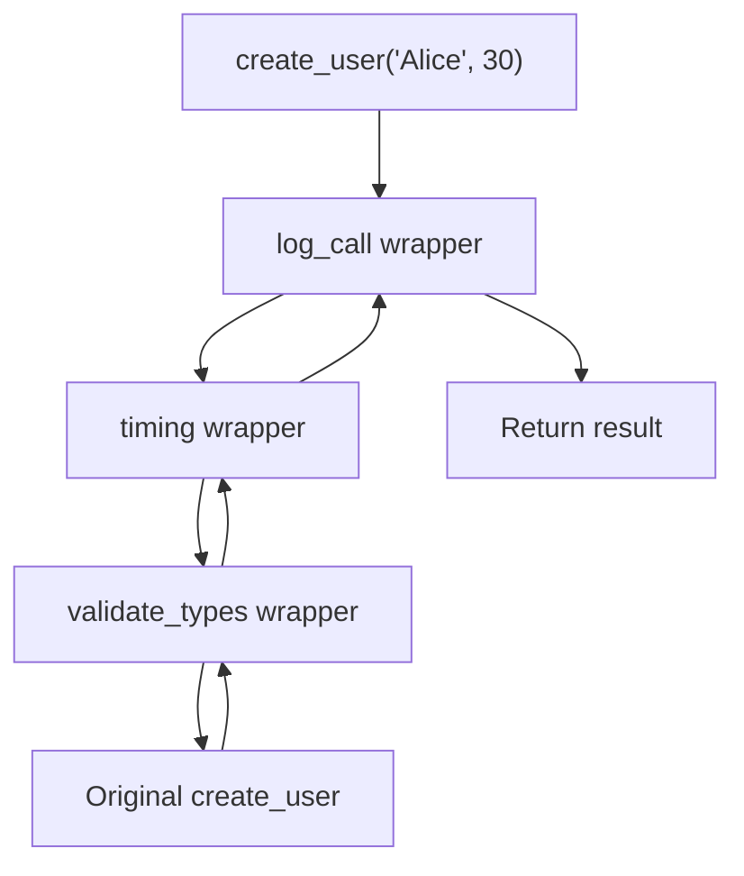
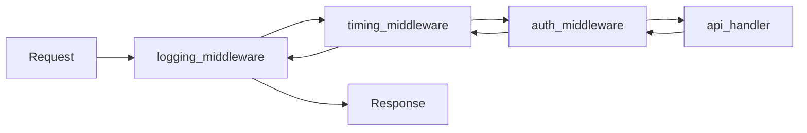
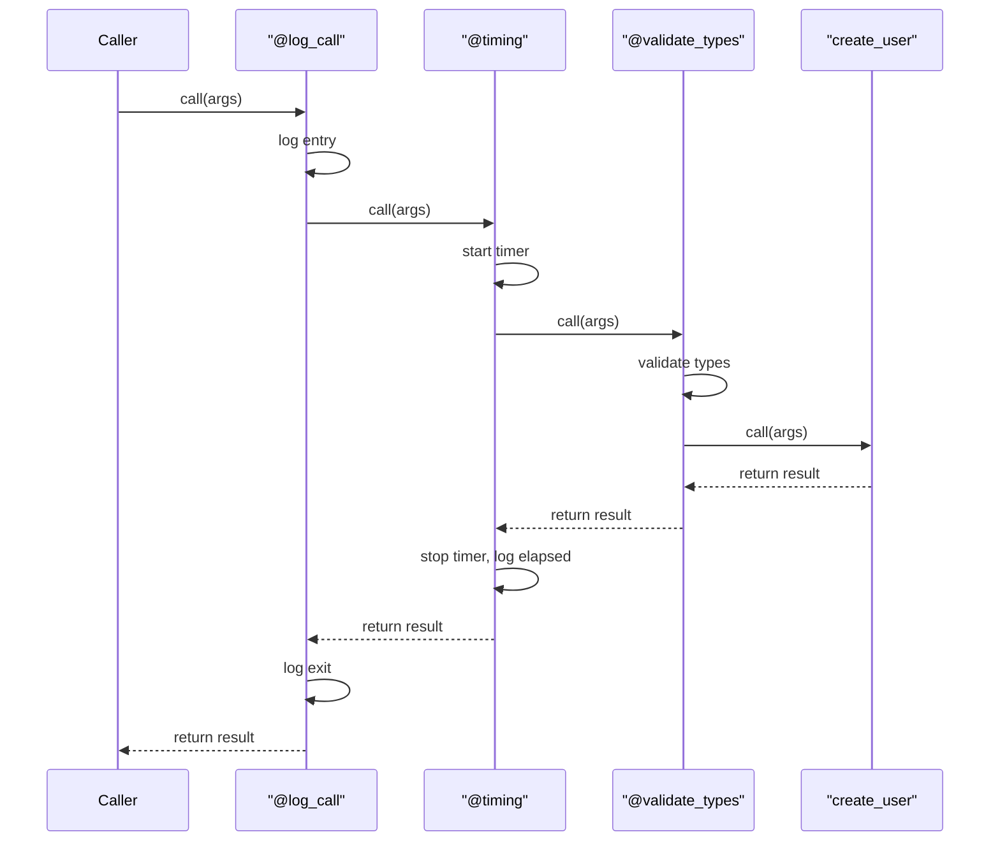
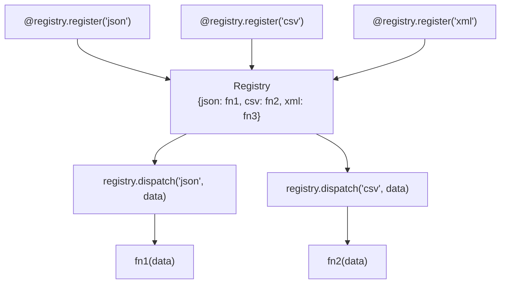
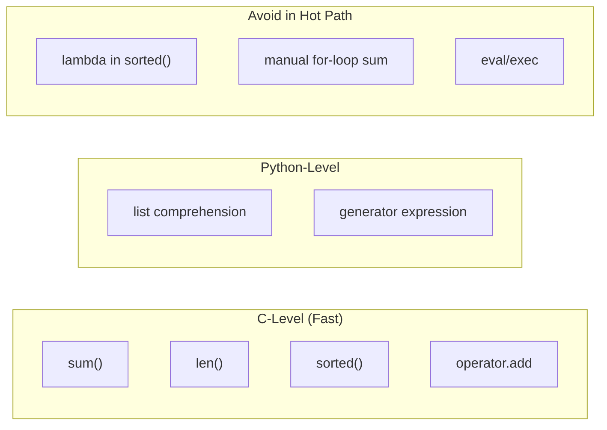

# Python Functions & Builtin Functions — Senior Level

## Table of Contents

1. [Introduction](#introduction)
2. [Core Concepts](#core-concepts)
3. [Architecture Patterns](#architecture-patterns)
4. [Performance Profiling](#performance-profiling)
5. [Code Examples](#code-examples)
6. [Advanced Builtin Patterns](#advanced-builtin-patterns)
7. [Error Handling Architecture](#error-handling-architecture)
8. [Security Hardening](#security-hardening)
9. [Testing Strategies](#testing-strategies)
10. [Performance Optimization](#performance-optimization)
11. [Edge Cases & Pitfalls](#edge-cases--pitfalls)
12. [Tricky Points](#tricky-points)
13. [Test](#test)
14. [Tricky Questions](#tricky-questions)
15. [Cheat Sheet](#cheat-sheet)
16. [Summary](#summary)
17. [Further Reading](#further-reading)
18. [Diagrams & Visual Aids](#diagrams--visual-aids)

---

## Introduction

> Focus: "How to optimize?" and "How to architect?"

At the senior level, you design function APIs that entire teams consume. You care about: **function signature design**, **decorator composition**, **performance profiling and micro-optimization**, **advanced closure patterns**, **metaclass interaction with functions**, **protocol-driven callable design**, **exhaustive use of `functools`**, and **squeezing maximum performance from builtins**. You make architectural decisions about when to use functions vs classes, how to design extensible callback systems, and how to profile and benchmark function performance.

---

## Core Concepts

### Concept 1: Decorator Composition and Stacking

Decorators are functions that wrap other functions. When stacked, execution order matters.

```python
import functools
import time
import logging
from typing import TypeVar, Callable, ParamSpec

P = ParamSpec("P")
T = TypeVar("T")

logger = logging.getLogger(__name__)


def log_call(func: Callable[P, T]) -> Callable[P, T]:
    """Log function entry and exit."""
    @functools.wraps(func)
    def wrapper(*args: P.args, **kwargs: P.kwargs) -> T:
        logger.info("Calling %s", func.__name__)
        result = func(*args, **kwargs)
        logger.info("Finished %s -> %r", func.__name__, result)
        return result
    return wrapper


def timing(func: Callable[P, T]) -> Callable[P, T]:
    """Measure and log execution time."""
    @functools.wraps(func)
    def wrapper(*args: P.args, **kwargs: P.kwargs) -> T:
        start = time.perf_counter()
        result = func(*args, **kwargs)
        elapsed = time.perf_counter() - start
        logger.info("%s took %.4fs", func.__name__, elapsed)
        return result
    return wrapper


def validate_types(**type_map: type) -> Callable:
    """Validate argument types at runtime."""
    def decorator(func: Callable[P, T]) -> Callable[P, T]:
        import inspect
        sig = inspect.signature(func)

        @functools.wraps(func)
        def wrapper(*args: P.args, **kwargs: P.kwargs) -> T:
            bound = sig.bind(*args, **kwargs)
            bound.apply_defaults()
            for param_name, expected_type in type_map.items():
                value = bound.arguments.get(param_name)
                if value is not None and not isinstance(value, expected_type):
                    raise TypeError(
                        f"{param_name} must be {expected_type.__name__}, "
                        f"got {type(value).__name__}"
                    )
            return func(*args, **kwargs)
        return wrapper
    return decorator


# Stacking decorators: bottom decorator is applied first
@log_call
@timing
@validate_types(name=str, age=int)
def create_user(name: str, age: int) -> dict:
    """Create a user record."""
    return {"name": name, "age": age}


if __name__ == "__main__":
    logging.basicConfig(level=logging.INFO)
    user = create_user("Alice", 30)
    print(user)
    # Order: validate_types runs first, then timing wraps it, then log_call wraps that
```



### Concept 2: Protocol-Based Callable Design

Using `typing.Protocol` to define callable interfaces:

```python
from typing import Protocol, runtime_checkable


@runtime_checkable
class Transformer(Protocol):
    """Protocol for data transformation functions."""
    def __call__(self, data: dict) -> dict: ...


@runtime_checkable
class AsyncTransformer(Protocol):
    """Protocol for async data transformation."""
    async def __call__(self, data: dict) -> dict: ...


def apply_pipeline(
    data: dict,
    transformers: list[Transformer],
) -> dict:
    """Apply a series of transformations."""
    result = data
    for transform in transformers:
        assert isinstance(transform, Transformer)
        result = transform(result)
    return result


# Functions naturally satisfy the Protocol
def add_timestamp(data: dict) -> dict:
    import time
    return {**data, "timestamp": time.time()}

def normalize_keys(data: dict) -> dict:
    return {k.lower().strip(): v for k, v in data.items()}

def add_version(data: dict) -> dict:
    return {**data, "version": "1.0"}


# Callable class also satisfies the Protocol
class AddField:
    def __init__(self, key: str, value: str):
        self.key = key
        self.value = value

    def __call__(self, data: dict) -> dict:
        return {**data, self.key: self.value}


pipeline: list[Transformer] = [
    normalize_keys,
    add_timestamp,
    add_version,
    AddField("source", "api"),
]

result = apply_pipeline({"Name": "Alice", "AGE": "30"}, pipeline)
print(result)
```

### Concept 3: `functools` Deep Dive

```python
import functools
from typing import Any


# --- singledispatch: function overloading by type ---
@functools.singledispatch
def serialize(obj: Any) -> str:
    """Serialize an object to string."""
    raise TypeError(f"Cannot serialize {type(obj).__name__}")


@serialize.register(int)
@serialize.register(float)
def _(obj: int | float) -> str:
    return str(obj)


@serialize.register(str)
def _(obj: str) -> str:
    return f'"{obj}"'


@serialize.register(list)
def _(obj: list) -> str:
    items = ", ".join(serialize(item) for item in obj)
    return f"[{items}]"


@serialize.register(dict)
def _(obj: dict) -> str:
    pairs = ", ".join(
        f"{serialize(k)}: {serialize(v)}" for k, v in obj.items()
    )
    return f"{{{pairs}}}"


print(serialize(42))                          # 42
print(serialize("hello"))                     # "hello"
print(serialize([1, "two", 3.0]))             # [1, "two", 3.0]
print(serialize({"name": "Alice", "age": 30}))  # {"name": "Alice", "age": 30}


# --- reduce with initializer ---
from functools import reduce
import operator

# Flatten a list of lists
nested = [[1, 2], [3, 4], [5]]
flat = reduce(operator.iadd, nested, [])
print(flat)  # [1, 2, 3, 4, 5]


# --- cached_property (Python 3.8+) ---
class DataAnalyzer:
    def __init__(self, data: list[float]):
        self._data = data

    @functools.cached_property
    def statistics(self) -> dict:
        """Computed once, then cached as an attribute."""
        print("Computing statistics...")
        return {
            "count": len(self._data),
            "sum": sum(self._data),
            "min": min(self._data),
            "max": max(self._data),
            "mean": sum(self._data) / len(self._data),
        }


analyzer = DataAnalyzer([1.0, 2.0, 3.0, 4.0, 5.0])
print(analyzer.statistics)  # Computing statistics... {count: 5, ...}
print(analyzer.statistics)  # No recomputation — uses cached value
```

---

## Architecture Patterns

### Pattern 1: Command Pattern with Functions

```python
from typing import Callable
from dataclasses import dataclass, field


@dataclass
class CommandHistory:
    """Undo/redo support using function-based commands."""
    _undo_stack: list[tuple[Callable, Callable]] = field(default_factory=list)
    _redo_stack: list[tuple[Callable, Callable]] = field(default_factory=list)

    def execute(self, do: Callable, undo: Callable) -> None:
        """Execute a command and save undo/redo pair."""
        do()
        self._undo_stack.append((do, undo))
        self._redo_stack.clear()

    def undo(self) -> None:
        if not self._undo_stack:
            raise IndexError("Nothing to undo")
        do, undo_fn = self._undo_stack.pop()
        undo_fn()
        self._redo_stack.append((do, undo_fn))

    def redo(self) -> None:
        if not self._redo_stack:
            raise IndexError("Nothing to redo")
        do, undo_fn = self._redo_stack.pop()
        do()
        self._undo_stack.append((do, undo_fn))


# Usage with closures
class TextEditor:
    def __init__(self):
        self.text = ""
        self.history = CommandHistory()

    def insert(self, position: int, content: str) -> None:
        old_text = self.text

        def do():
            self.text = self.text[:position] + content + self.text[position:]

        def undo():
            self.text = old_text

        self.history.execute(do, undo)

    def delete(self, start: int, end: int) -> None:
        old_text = self.text

        def do():
            self.text = self.text[:start] + self.text[end:]

        def undo():
            self.text = old_text

        self.history.execute(do, undo)


editor = TextEditor()
editor.insert(0, "Hello")
editor.insert(5, " World")
print(editor.text)  # Hello World

editor.history.undo()
print(editor.text)  # Hello

editor.history.redo()
print(editor.text)  # Hello World
```

### Pattern 2: Middleware Chain

```python
from typing import Callable, Any
import time
import logging

logger = logging.getLogger(__name__)

# Type for a handler function
Handler = Callable[[dict], dict]
# Type for a middleware that wraps a handler
Middleware = Callable[[Handler], Handler]


def logging_middleware(next_handler: Handler) -> Handler:
    """Log request and response."""
    def handler(request: dict) -> dict:
        logger.info("Request: %s", request.get("path", "unknown"))
        response = next_handler(request)
        logger.info("Response status: %s", response.get("status", "unknown"))
        return response
    return handler


def timing_middleware(next_handler: Handler) -> Handler:
    """Add timing information."""
    def handler(request: dict) -> dict:
        start = time.perf_counter()
        response = next_handler(request)
        elapsed = time.perf_counter() - start
        response["elapsed_ms"] = round(elapsed * 1000, 2)
        return response
    return handler


def auth_middleware(next_handler: Handler) -> Handler:
    """Check authentication token."""
    def handler(request: dict) -> dict:
        token = request.get("headers", {}).get("Authorization")
        if not token or not token.startswith("Bearer "):
            return {"status": 401, "body": "Unauthorized"}
        request["user"] = "authenticated_user"
        return next_handler(request)
    return handler


def build_handler(
    core_handler: Handler,
    middlewares: list[Middleware],
) -> Handler:
    """Build a handler by applying middlewares in order."""
    from functools import reduce
    # Apply middlewares in reverse so the first middleware runs first
    return reduce(lambda h, m: m(h), reversed(middlewares), core_handler)


# Core handler
def api_handler(request: dict) -> dict:
    return {"status": 200, "body": f"Hello, {request.get('user', 'guest')}!"}


# Build the chain
app = build_handler(
    api_handler,
    [logging_middleware, timing_middleware, auth_middleware],
)

# Test
if __name__ == "__main__":
    logging.basicConfig(level=logging.INFO)
    response = app({
        "path": "/api/greeting",
        "headers": {"Authorization": "Bearer token123"},
    })
    print(response)
```



---

## Performance Profiling

### Profiling Function Call Overhead

```python
import cProfile
import pstats
import io
from functools import lru_cache


def profile_function(func, *args, **kwargs):
    """Profile a function and return stats."""
    profiler = cProfile.Profile()
    profiler.enable()
    result = func(*args, **kwargs)
    profiler.disable()

    stream = io.StringIO()
    stats = pstats.Stats(profiler, stream=stream)
    stats.sort_stats("cumulative")
    stats.print_stats(20)
    print(stream.getvalue())
    return result


# Example: Compare recursive vs memoized fibonacci
def fib_naive(n: int) -> int:
    if n <= 1:
        return n
    return fib_naive(n - 1) + fib_naive(n - 2)


@lru_cache(maxsize=None)
def fib_cached(n: int) -> int:
    if n <= 1:
        return n
    return fib_cached(n - 1) + fib_cached(n - 2)


def fib_iterative(n: int) -> int:
    if n <= 1:
        return n
    a, b = 0, 1
    for _ in range(2, n + 1):
        a, b = b, a + b
    return b


if __name__ == "__main__":
    import time

    n = 35

    # Naive recursive
    start = time.perf_counter()
    result1 = fib_naive(n)
    t1 = time.perf_counter() - start

    # Cached recursive
    fib_cached.cache_clear()
    start = time.perf_counter()
    result2 = fib_cached(n)
    t2 = time.perf_counter() - start

    # Iterative
    start = time.perf_counter()
    result3 = fib_iterative(n)
    t3 = time.perf_counter() - start

    print(f"fib_naive({n})     = {result1} in {t1:.4f}s")
    print(f"fib_cached({n})    = {result2} in {t2:.6f}s")
    print(f"fib_iterative({n}) = {result3} in {t3:.6f}s")
    print(f"\nSpeedup (cached vs naive): {t1/t2:.0f}x")
    print(f"Speedup (iterative vs naive): {t1/t3:.0f}x")
```

### Benchmarking Builtin Functions

```python
import timeit


def benchmark_builtins():
    """Compare builtin function performance."""

    data = list(range(100_000))

    benchmarks = {
        "sum(data)": lambda: sum(data),
        "manual loop sum": lambda: _loop_sum(data),
        "sorted(data)": lambda: sorted(data),
        "min(data)": lambda: min(data),
        "max(data)": lambda: max(data),
        "len(data)": lambda: len(data),
        "any(x > 99999)": lambda: any(x > 99_999 for x in data),
        "all(x >= 0)": lambda: all(x >= 0 for x in data),
        "list(map(str, data[:1000]))": lambda: list(map(str, data[:1000])),
        "[str(x) for x in data[:1000]]": lambda: [str(x) for x in data[:1000]],
    }

    print(f"{'Operation':<40} {'Time (ms)':>10}")
    print("-" * 52)
    for name, func in benchmarks.items():
        t = timeit.timeit(func, number=100) / 100 * 1000
        print(f"{name:<40} {t:>10.3f}")


def _loop_sum(data):
    total = 0
    for x in data:
        total += x
    return total


if __name__ == "__main__":
    benchmark_builtins()
```

---

## Code Examples

### Example 1: Generic Retry Decorator with Backoff

```python
import functools
import time
import logging
import random
from typing import TypeVar, Callable, ParamSpec, Type

P = ParamSpec("P")
T = TypeVar("T")

logger = logging.getLogger(__name__)


def retry(
    max_attempts: int = 3,
    delay: float = 1.0,
    backoff: float = 2.0,
    jitter: bool = True,
    exceptions: tuple[Type[Exception], ...] = (Exception,),
    on_retry: Callable[[Exception, int], None] | None = None,
) -> Callable[[Callable[P, T]], Callable[P, T]]:
    """Production-grade retry decorator with exponential backoff.

    Args:
        max_attempts: Maximum number of attempts.
        delay: Initial delay between retries.
        backoff: Multiplier applied to delay after each retry.
        jitter: Add random jitter to prevent thundering herd.
        exceptions: Exception types to catch.
        on_retry: Optional callback invoked on each retry.

    Returns:
        Decorated function with retry behavior.
    """
    def decorator(func: Callable[P, T]) -> Callable[P, T]:
        @functools.wraps(func)
        def wrapper(*args: P.args, **kwargs: P.kwargs) -> T:
            current_delay = delay
            last_exception: Exception | None = None

            for attempt in range(1, max_attempts + 1):
                try:
                    return func(*args, **kwargs)
                except exceptions as e:
                    last_exception = e
                    if attempt == max_attempts:
                        logger.error(
                            "%s failed after %d attempts: %s",
                            func.__name__, max_attempts, e,
                        )
                        raise

                    actual_delay = current_delay
                    if jitter:
                        actual_delay *= (0.5 + random.random())

                    logger.warning(
                        "%s attempt %d/%d failed: %s (retry in %.2fs)",
                        func.__name__, attempt, max_attempts,
                        e, actual_delay,
                    )

                    if on_retry:
                        on_retry(e, attempt)

                    time.sleep(actual_delay)
                    current_delay *= backoff

            raise last_exception  # type: ignore

        # Attach config for introspection
        wrapper.retry_config = {  # type: ignore
            "max_attempts": max_attempts,
            "delay": delay,
            "backoff": backoff,
            "exceptions": exceptions,
        }
        return wrapper
    return decorator


@retry(max_attempts=5, delay=0.1, exceptions=(ConnectionError, TimeoutError))
def fetch_data(url: str) -> dict:
    """Simulate an unreliable API call."""
    if random.random() < 0.6:
        raise ConnectionError(f"Failed to connect to {url}")
    return {"status": "ok", "data": [1, 2, 3]}


if __name__ == "__main__":
    logging.basicConfig(level=logging.INFO, format="%(levelname)s: %(message)s")
    try:
        result = fetch_data("https://api.example.com")
        print(f"Success: {result}")
    except ConnectionError as e:
        print(f"All retries failed: {e}")
```

### Example 2: Function Registry Pattern

```python
from typing import Callable, Any
import functools


class Registry:
    """A function registry for plugin-style architectures."""

    def __init__(self, name: str = "default"):
        self.name = name
        self._handlers: dict[str, Callable] = {}

    def register(
        self,
        name: str | None = None,
        *,
        override: bool = False,
    ) -> Callable:
        """Register a function by name (or use the function name)."""
        def decorator(func: Callable) -> Callable:
            key = name or func.__name__
            if key in self._handlers and not override:
                raise ValueError(
                    f"Handler '{key}' already registered in '{self.name}'"
                )
            self._handlers[key] = func
            return func
        return decorator

    def dispatch(self, name: str, *args: Any, **kwargs: Any) -> Any:
        """Call a registered handler by name."""
        handler = self._handlers.get(name)
        if handler is None:
            available = ", ".join(sorted(self._handlers.keys()))
            raise KeyError(
                f"No handler '{name}' in '{self.name}'. "
                f"Available: {available}"
            )
        return handler(*args, **kwargs)

    def list_handlers(self) -> list[str]:
        return sorted(self._handlers.keys())


# Usage: Build an extensible serializer
serializers = Registry("serializers")


@serializers.register("json")
def to_json(data: dict) -> str:
    import json
    return json.dumps(data, indent=2)


@serializers.register("csv")
def to_csv(data: dict) -> str:
    headers = ",".join(data.keys())
    values = ",".join(str(v) for v in data.values())
    return f"{headers}\n{values}"


@serializers.register("xml")
def to_xml(data: dict) -> str:
    items = "\n".join(f"  <{k}>{v}</{k}>" for k, v in data.items())
    return f"<record>\n{items}\n</record>"


if __name__ == "__main__":
    sample = {"name": "Alice", "age": 30, "city": "NYC"}

    print("Available formats:", serializers.list_handlers())
    for fmt in serializers.list_handlers():
        print(f"\n--- {fmt.upper()} ---")
        print(serializers.dispatch(fmt, sample))
```

---

## Advanced Builtin Patterns

### Pattern 1: `sorted()` with `operator.attrgetter` / `operator.itemgetter`

```python
import operator
from dataclasses import dataclass


@dataclass
class Employee:
    name: str
    department: str
    salary: float
    years: int


employees = [
    Employee("Alice", "Eng", 120_000, 8),
    Employee("Bob", "Eng", 95_000, 3),
    Employee("Charlie", "Sales", 85_000, 5),
    Employee("Diana", "Eng", 110_000, 6),
    Employee("Eve", "Sales", 92_000, 4),
]

# operator.attrgetter is faster than lambda for attribute access
by_salary = sorted(employees, key=operator.attrgetter("salary"), reverse=True)
by_dept_salary = sorted(
    employees,
    key=operator.attrgetter("department", "salary"),
)

# For dictionaries, use itemgetter
dicts = [{"name": "A", "score": 90}, {"name": "B", "score": 85}]
by_score = sorted(dicts, key=operator.itemgetter("score"), reverse=True)

print("By salary:", [(e.name, e.salary) for e in by_salary])
print("By dept+salary:", [(e.name, e.department, e.salary) for e in by_dept_salary])
print("By score:", by_score)
```

### Pattern 2: Efficient `any()`/`all()` with short-circuit evaluation

```python
import time


def expensive_check(item: int) -> bool:
    """Simulate expensive validation."""
    time.sleep(0.01)
    return item > 0


data = [-1, 2, 3, 4, 5, 6, 7, 8, 9, 10]

# any() stops at the first True — only checks -1, then 2 (True)
start = time.perf_counter()
has_positive = any(expensive_check(x) for x in data)
any_time = time.perf_counter() - start

# all() stops at the first False — only checks -1 (False)
start = time.perf_counter()
all_positive = all(expensive_check(x) for x in data)
all_time = time.perf_counter() - start

print(f"any() found positive in {any_time:.3f}s (checked ~2 items)")
print(f"all() found non-positive in {all_time:.3f}s (checked ~1 item)")
# Without short-circuit, checking all 10 items would take ~0.1s
```

### Pattern 3: `zip()` for transposition, unzipping, and parallel iteration

```python
# Matrix transposition
matrix = [
    [1, 2, 3],
    [4, 5, 6],
    [7, 8, 9],
]
transposed = [list(row) for row in zip(*matrix)]
print("Transposed:", transposed)
# [[1, 4, 7], [2, 5, 8], [3, 6, 9]]

# Unzip: convert list of tuples to separate lists
pairs = [(1, "a"), (2, "b"), (3, "c")]
numbers, letters = zip(*pairs)
print("Numbers:", numbers)  # (1, 2, 3)
print("Letters:", letters)  # ('a', 'b', 'c')

# Sliding window using zip
def sliding_window(data: list, window_size: int) -> list[tuple]:
    """Create sliding windows using zip."""
    return list(zip(*(data[i:] for i in range(window_size))))

print("Windows:", sliding_window([1, 2, 3, 4, 5], 3))
# [(1, 2, 3), (2, 3, 4), (3, 4, 5)]

# Pairwise iteration (Python 3.10+)
from itertools import pairwise  # Python 3.10+
data = [10, 20, 15, 30, 25]
deltas = [b - a for a, b in pairwise(data)]
print("Deltas:", deltas)  # [10, -5, 15, -5]
```

---

## Error Handling Architecture

```python
from typing import Callable, TypeVar
import functools

T = TypeVar("T")


class FunctionError(Exception):
    """Base error for function execution failures."""
    def __init__(self, func_name: str, message: str, context: dict | None = None):
        self.func_name = func_name
        self.context = context or {}
        super().__init__(f"{func_name}: {message}")


class ValidationError(FunctionError):
    pass


class ExecutionError(FunctionError):
    pass


def safe_call(
    func: Callable[..., T],
    *args,
    default: T | None = None,
    on_error: Callable[[Exception], None] | None = None,
    **kwargs,
) -> T | None:
    """Call a function safely with error handling.

    Args:
        func: Function to call.
        *args: Positional arguments.
        default: Value to return on error.
        on_error: Callback for error handling.
        **kwargs: Keyword arguments.

    Returns:
        Function result or default on error.
    """
    try:
        return func(*args, **kwargs)
    except Exception as e:
        if on_error:
            on_error(e)
        return default


# Usage
result = safe_call(int, "not_a_number", default=0)
print(f"Safe parse: {result}")  # 0

result = safe_call(int, "42", default=0)
print(f"Safe parse: {result}")  # 42
```

---

## Security Hardening

### Preventing Function Injection

```python
import functools
from typing import Callable


# Rate limiting decorator
def rate_limit(max_calls: int, period: float) -> Callable:
    """Limit function call frequency."""
    import time
    import threading

    def decorator(func: Callable) -> Callable:
        call_times: list[float] = []
        lock = threading.Lock()

        @functools.wraps(func)
        def wrapper(*args, **kwargs):
            with lock:
                now = time.monotonic()
                # Remove old calls outside the period window
                call_times[:] = [t for t in call_times if now - t < period]
                if len(call_times) >= max_calls:
                    raise RuntimeError(
                        f"Rate limit exceeded: {max_calls} calls per {period}s"
                    )
                call_times.append(now)
            return func(*args, **kwargs)
        return wrapper
    return decorator


@rate_limit(max_calls=5, period=60.0)
def sensitive_operation(data: str) -> str:
    return f"Processed: {data}"


# Sandboxed function execution
def sandboxed_exec(
    code: str,
    allowed_builtins: dict | None = None,
) -> dict:
    """Execute code with restricted builtins.

    WARNING: This is NOT fully secure against all attacks.
    For true sandboxing, use subprocess with seccomp or containers.
    """
    if allowed_builtins is None:
        allowed_builtins = {
            "len": len, "range": range, "int": int, "float": float,
            "str": str, "list": list, "dict": dict, "tuple": tuple,
            "print": print, "abs": abs, "min": min, "max": max,
            "sum": sum, "round": round, "sorted": sorted,
            "enumerate": enumerate, "zip": zip, "map": map,
            "filter": filter, "any": any, "all": all,
            "isinstance": isinstance, "type": type, "bool": bool,
        }
    restricted_globals = {"__builtins__": allowed_builtins}
    local_namespace: dict = {}
    exec(code, restricted_globals, local_namespace)
    return local_namespace
```

---

## Testing Strategies

```python
import pytest
from typing import Callable
from unittest.mock import Mock, patch, call


# --- Testing functions with various parameter types ---
def calculate_price(
    base: float,
    *discounts: float,
    tax_rate: float = 0.1,
    **surcharges: float,
) -> float:
    """Calculate final price with discounts and surcharges."""
    price = base
    for discount in discounts:
        price *= (1 - discount)
    for name, amount in surcharges.items():
        price += amount
    return round(price * (1 + tax_rate), 2)


class TestCalculatePrice:
    def test_base_price_only(self):
        assert calculate_price(100) == 110.0

    def test_with_single_discount(self):
        assert calculate_price(100, 0.1) == 99.0  # 100 * 0.9 * 1.1

    def test_with_multiple_discounts(self):
        result = calculate_price(100, 0.1, 0.2)
        assert result == 79.2  # 100 * 0.9 * 0.8 * 1.1

    def test_with_custom_tax(self):
        assert calculate_price(100, tax_rate=0.2) == 120.0

    def test_with_surcharges(self):
        result = calculate_price(100, shipping=5, handling=3)
        # (100 + 5 + 3) * 1.1 = 118.8
        assert result == 118.8

    def test_combined(self):
        result = calculate_price(
            200, 0.1, 0.05,
            tax_rate=0.08,
            shipping=10,
        )
        # 200 * 0.9 * 0.95 = 171.0 + 10 = 181.0 * 1.08 = 195.48
        assert result == 195.48


# --- Testing closures ---
def make_counter(start: int = 0):
    count = start
    def increment(step: int = 1) -> int:
        nonlocal count
        count += step
        return count
    return increment


class TestMakeCounter:
    def test_basic_increment(self):
        counter = make_counter()
        assert counter() == 1
        assert counter() == 2

    def test_custom_start(self):
        counter = make_counter(10)
        assert counter() == 11

    def test_custom_step(self):
        counter = make_counter()
        assert counter(5) == 5
        assert counter(3) == 8

    def test_independent_instances(self):
        c1 = make_counter(0)
        c2 = make_counter(100)
        c1()
        c2()
        assert c1() == 2
        assert c2() == 102


# --- Testing higher-order functions ---
class TestBuiltinPatterns:
    def test_sorted_with_key(self):
        data = [{"name": "B", "age": 20}, {"name": "A", "age": 30}]
        result = sorted(data, key=lambda x: x["name"])
        assert result[0]["name"] == "A"

    def test_map_filter_chain(self):
        numbers = range(10)
        result = list(
            filter(lambda x: x > 10,
                   map(lambda x: x ** 2, numbers))
        )
        assert result == [16, 25, 36, 49, 64, 81]

    def test_zip_strict_length_mismatch(self):
        """Python 3.10+ zip strict mode."""
        import sys
        if sys.version_info >= (3, 10):
            with pytest.raises(ValueError):
                list(zip([1, 2], [3], strict=True))


if __name__ == "__main__":
    pytest.main([__file__, "-v"])
```

---

## Performance Optimization

### Optimization 1: `operator` module vs lambdas

```python
import timeit
import operator

data = list(range(100_000))

# Lambda — creates a Python function object
t1 = timeit.timeit(lambda: sorted(data, key=lambda x: -x), number=10)

# operator.neg — C-level callable
t2 = timeit.timeit(lambda: sorted(data, key=operator.neg), number=10)

print(f"Lambda sort: {t1:.3f}s")
print(f"Operator sort: {t2:.3f}s")
print(f"Speedup: {t1/t2:.1f}x")
```

### Optimization 2: Avoid redundant function calls

```python
# Bad — calls len() and max() repeatedly
def analyze(data: list[int]) -> dict:
    return {
        "ratio": max(data) / len(data),
        "normalized_max": max(data) / sum(data),
        "count": len(data),
        "density": sum(data) / len(data),
    }

# Good — compute once, reuse
def analyze(data: list[int]) -> dict:
    n = len(data)
    total = sum(data)
    maximum = max(data)
    return {
        "ratio": maximum / n,
        "normalized_max": maximum / total,
        "count": n,
        "density": total / n,
    }
```

### Optimization 3: `__slots__` for callable classes

```python
class Multiplier:
    """Callable with __slots__ for lower memory."""
    __slots__ = ("factor",)

    def __init__(self, factor: float):
        self.factor = factor

    def __call__(self, value: float) -> float:
        return value * self.factor


double = Multiplier(2)
print(double(21))  # 42

import sys
# Compare memory: Multiplier with __slots__ vs without
print(f"With __slots__: {sys.getsizeof(double)} bytes")
```

---

## Edge Cases & Pitfalls

### Pitfall 1: Generator arguments to builtins — single use

```python
gen = (x ** 2 for x in range(5))

print(sum(gen))    # 30
print(sum(gen))    # 0 — generator is exhausted!

# Fix: use a list if you need multiple passes
squares = [x ** 2 for x in range(5)]
print(sum(squares))  # 30
print(max(squares))  # 16
```

### Pitfall 2: `isinstance()` with ABC vs concrete types

```python
from collections.abc import Sequence, Mapping

# str is a Sequence!
print(isinstance("hello", Sequence))  # True
print(isinstance("hello", list))      # False

# If you want "list-like but not string":
def process_items(data):
    if isinstance(data, str):
        raise TypeError("Expected a list, got str")
    if not isinstance(data, Sequence):
        raise TypeError(f"Expected a sequence, got {type(data).__name__}")
    return list(data)
```

### Pitfall 3: `round()` banker's rounding

```python
# Python uses "round half to even" (banker's rounding)
print(round(0.5))   # 0 — rounds to even!
print(round(1.5))   # 2
print(round(2.5))   # 2 — rounds to even!
print(round(3.5))   # 4

# If you need "always round up at .5":
import math
def round_half_up(x: float, digits: int = 0) -> float:
    multiplier = 10 ** digits
    return math.floor(x * multiplier + 0.5) / multiplier

print(round_half_up(0.5))  # 1.0
print(round_half_up(2.5))  # 3.0
```

---

## Tricky Points

### Tricky Point 1: `*args` after default parameters

```python
def f(a, b=10, *args):
    print(f"a={a}, b={b}, args={args}")

f(1)           # a=1, b=10, args=()
f(1, 2)        # a=1, b=2, args=()
f(1, 2, 3, 4)  # a=1, b=2, args=(3, 4)

# You can NEVER use b's default when passing *args!
# To allow default b with extra args, use keyword-only:
def g(a, *args, b=10):
    print(f"a={a}, b={b}, args={args}")

g(1, 2, 3, 4)       # a=1, b=10, args=(2, 3, 4)
g(1, 2, 3, b=20)    # a=1, b=20, args=(2, 3)
```

### Tricky Point 2: `min()`/`max()` with custom key

```python
# key function affects comparison but NOT the returned value
data = ["hello", "hi", "hey"]
shortest = min(data, key=len)
print(shortest)  # "hi" (not 2!)
print(type(shortest))  # <class 'str'>

# Common mistake: thinking min(data, key=len) returns the length
```

---

## Test

**1. What does `ParamSpec` do in `typing`?**

- A) Specifies parameter count limits
- B) Captures the parameter signature of a callable for type-safe decorators
- C) Validates parameter types at runtime
- D) Creates parameterized functions

<details>
<summary>Answer</summary>
<strong>B)</strong> — <code>ParamSpec</code> (PEP 612) captures the full parameter specification (names, types, defaults) of a callable so that decorators can preserve the wrapped function's signature in type checking.
</details>

**2. What is the output?**

```python
from functools import reduce
result = reduce(lambda a, b: a * b, [1, 2, 3, 4], 10)
print(result)
```

<details>
<summary>Answer</summary>
<code>240</code> — The initial value is 10. Then: 10*1=10, 10*2=20, 20*3=60, 60*4=240.
</details>

**3. What does `round(2.5)` return in Python 3?**

<details>
<summary>Answer</summary>
<code>2</code> — Python 3 uses banker's rounding (round half to even). Since 2 is even, 2.5 rounds down to 2.
</details>

**4. What is wrong with this code?**

```python
from functools import lru_cache

@lru_cache(maxsize=128)
def get_users(filters: dict) -> list:
    return db.query(filters)
```

<details>
<summary>Answer</summary>
<code>dict</code> is unhashable, so <code>lru_cache</code> raises <code>TypeError</code>. Fix: convert to frozenset of items: <code>get_users(frozenset(filters.items()))</code> or use a hashable type.
</details>

---

## Tricky Questions

**1. How many function objects are created here?**

```python
def make_adders(n):
    return [lambda x: x + i for i in range(n)]

adders = make_adders(3)
```

<details>
<summary>Answer</summary>
3 lambda function objects are created. However, due to late binding, all three reference the same variable <code>i</code> which ends up as 2. So <code>adders[0](10) == adders[1](10) == adders[2](10) == 12</code>.
</details>

**2. What is `sum(range(10), start=100)`?**

<details>
<summary>Answer</summary>
<code>145</code> — <code>sum(range(10))</code> is 45, plus <code>start=100</code> gives 145. Note: in Python 3.8+, the start parameter can be passed as keyword.
</details>

---

## Cheat Sheet

| Pattern | Code | Notes |
|---------|------|-------|
| Decorator with args | `@retry(max=3)` | Returns decorator factory |
| `ParamSpec` typing | `P = ParamSpec("P")` | Preserves function sig in decorators |
| `singledispatch` | `@singledispatch` | Type-based function dispatch |
| `cached_property` | `@cached_property` | Compute-once attribute |
| `operator.attrgetter` | `key=attrgetter("name")` | Faster than `lambda x: x.name` |
| `operator.itemgetter` | `key=itemgetter("age")` | Faster than `lambda x: x["age"]` |
| `reduce` | `reduce(op, iterable, init)` | Fold / accumulate |
| Callable Protocol | `class P(Protocol): def __call__` | Type-safe callable interface |
| Registry pattern | `dict[str, Callable]` | Plugin architecture |
| Middleware chain | `reduce(lambda h, m: m(h), ...)` | Composable request handling |

---

## Summary

- Decorator composition requires understanding execution order (bottom-up application)
- `Protocol` enables type-safe callable interfaces without inheritance
- `functools` provides `singledispatch`, `cached_property`, `reduce`, `partial`, `wraps`
- `operator` module functions outperform lambdas for common operations
- Profile with `cProfile` and `timeit` before optimizing function calls
- Rate limiting, sandboxing, and input validation are critical security patterns
- `round()` uses banker's rounding; generators are single-use; `zip()` silently truncates

**Next step:** CPython internals — how functions are compiled to bytecode, frame objects, and the call stack.

---

## Further Reading

- **PEP 612:** [ParamSpec](https://peps.python.org/pep-0612/) — for typed decorators
- **PEP 443:** [Single-dispatch generic functions](https://peps.python.org/pep-0443/)
- **Book:** Fluent Python (Ramalho), Chapters 7-10 — Closures, decorators, design patterns
- **Talk:** Raymond Hettinger — "Super considered super!" (PyCon)
- **Docs:** [functools](https://docs.python.org/3/library/functools.html), [operator](https://docs.python.org/3/library/operator.html)

---

## Diagrams & Visual Aids

### Decorator Stack Execution



### Function Registry Architecture



### Performance Comparison


