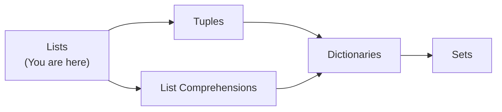
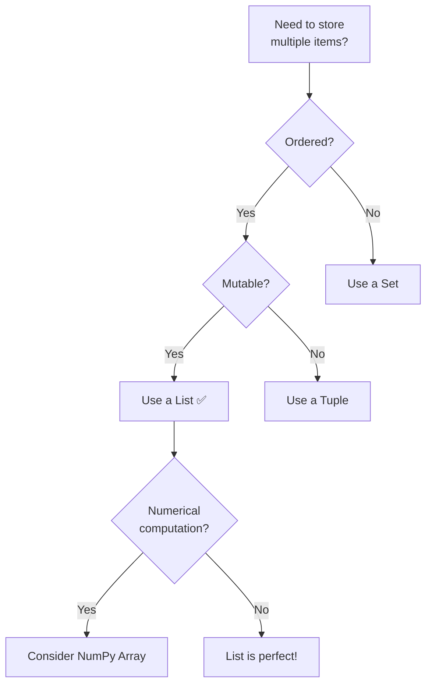

# Python Lists — Junior Level

## Table of Contents

1. [Introduction](#introduction)
2. [Prerequisites](#prerequisites)
3. [Glossary](#glossary)
4. [Core Concepts](#core-concepts)
5. [Real-World Analogies](#real-world-analogies)
6. [Mental Models](#mental-models)
7. [Pros & Cons](#pros--cons)
8. [Use Cases](#use-cases)
9. [Code Examples](#code-examples)
10. [Clean Code](#clean-code)
11. [Product Use / Feature](#product-use--feature)
12. [Error Handling](#error-handling)
13. [Security Considerations](#security-considerations)
14. [Performance Tips](#performance-tips)
15. [Metrics & Analytics](#metrics--analytics)
16. [Best Practices](#best-practices)
17. [Edge Cases & Pitfalls](#edge-cases--pitfalls)
18. [Common Mistakes](#common-mistakes)
19. [Common Misconceptions](#common-misconceptions)
20. [Tricky Points](#tricky-points)
21. [Test](#test)
22. [Tricky Questions](#tricky-questions)
23. [Cheat Sheet](#cheat-sheet)
24. [Summary](#summary)
25. [What You Can Build](#what-you-can-build)
26. [Further Reading](#further-reading)
27. [Related Topics](#related-topics)
28. [Diagrams & Visual Aids](#diagrams--visual-aids)

---

## Introduction

> Focus: "What is it?" and "How to use it?"

A **list** is Python's most versatile and commonly used data structure. It is an ordered, mutable collection that can hold items of any type — integers, strings, other lists, or even mixed types. Lists are defined with square brackets `[]` and are the go-to choice when you need to store a sequence of items that may change over time.

If you learn only one data structure in Python, make it lists — they appear in virtually every Python program.

---

## Prerequisites

What you should know before studying this topic:

- **Required:** Basic Python syntax — you need to know how to write and run Python scripts
- **Required:** Variables and data types — understanding how Python stores values (int, str, float, bool)
- **Required:** Loops (`for`, `while`) — iterating over items is central to working with lists
- **Helpful but not required:** Functions — helpful for writing reusable list operations

---

## Glossary

Key terms used in this topic:

| Term | Definition |
|------|-----------|
| **List** | An ordered, mutable sequence of elements enclosed in square brackets `[]` |
| **Index** | An integer position of an element in a list (starts at 0) |
| **Slice** | A way to extract a sub-list using `[start:stop:step]` syntax |
| **Mutable** | Can be changed after creation — elements can be added, removed, or modified |
| **Element / Item** | A single value stored inside a list |
| **Iterable** | Any object that can be looped over; lists are iterables |
| **List Comprehension** | A compact syntax to create lists: `[expr for item in iterable]` |
| **Nested List** | A list that contains other lists as its elements |
| **Unpacking** | Assigning list elements to individual variables in one statement |

---

## Core Concepts

### Concept 1: Creating Lists

You can create a list in several ways:

```python
# Empty list
empty = []
empty2 = list()

# List with values
numbers = [1, 2, 3, 4, 5]
fruits = ["apple", "banana", "cherry"]

# Mixed types (allowed, but not recommended)
mixed = [1, "hello", 3.14, True, None]

# From other iterables
from_range = list(range(5))       # [0, 1, 2, 3, 4]
from_string = list("hello")       # ['h', 'e', 'l', 'l', 'o']
```

### Concept 2: Indexing

Access individual elements by their position. Python uses **zero-based indexing** and supports **negative indexing** to count from the end.

```python
colors = ["red", "green", "blue", "yellow"]
print(colors[0])    # "red"     — first element
print(colors[-1])   # "yellow"  — last element
print(colors[-2])   # "blue"    — second from end
```

### Concept 3: Slicing

Extract a sub-list with `[start:stop:step]`. The `stop` index is **excluded**.

```python
nums = [0, 1, 2, 3, 4, 5, 6, 7, 8, 9]

print(nums[2:5])     # [2, 3, 4]
print(nums[:3])      # [0, 1, 2]
print(nums[7:])      # [7, 8, 9]
print(nums[::2])     # [0, 2, 4, 6, 8]   — every 2nd element
print(nums[::-1])    # [9, 8, 7, ..., 0]  — reversed copy
```

### Concept 4: Mutability

Lists can be modified in place — this is what "mutable" means:

```python
fruits = ["apple", "banana", "cherry"]
fruits[1] = "blueberry"       # Replace element
fruits.append("date")         # Add to end
fruits.remove("apple")        # Remove by value
del fruits[0]                 # Remove by index
print(fruits)                 # ['cherry', 'date']
```

### Concept 5: List Methods

Python lists come with many built-in methods:

```python
nums = [3, 1, 4, 1, 5, 9, 2, 6]

# Adding elements
nums.append(7)          # Add to end: [3, 1, 4, 1, 5, 9, 2, 6, 7]
nums.insert(0, 0)       # Insert at index 0: [0, 3, 1, ...]
nums.extend([8, 10])    # Add multiple: [..., 8, 10]

# Removing elements
nums.remove(1)          # Remove first occurrence of 1
popped = nums.pop()     # Remove and return last element
popped_at = nums.pop(2) # Remove and return element at index 2
nums.clear()            # Remove all elements

# Information methods
nums = [3, 1, 4, 1, 5]
print(nums.count(1))    # 2 — how many times 1 appears
print(nums.index(4))    # 2 — index of first occurrence of 4

# Ordering
nums.sort()              # Sort in-place (ascending)
nums.sort(reverse=True)  # Sort in-place (descending)
nums.reverse()           # Reverse in-place

# Copying
copy = nums.copy()       # Shallow copy
```

### Concept 6: List Comprehensions

A compact way to create lists using a single line:

```python
# Basic comprehension
squares = [x ** 2 for x in range(10)]
# [0, 1, 4, 9, 16, 25, 36, 49, 64, 81]

# With condition (filter)
evens = [x for x in range(20) if x % 2 == 0]
# [0, 2, 4, 6, 8, 10, 12, 14, 16, 18]

# With transformation + condition
upper_long = [word.upper() for word in ["hi", "hello", "hey"] if len(word) > 2]
# ['HELLO', 'HEY']
```

### Concept 7: Nested Lists

Lists inside lists — used for grids, matrices, and hierarchical data:

```python
matrix = [
    [1, 2, 3],
    [4, 5, 6],
    [7, 8, 9],
]

print(matrix[0])       # [1, 2, 3] — first row
print(matrix[1][2])    # 6         — row 1, column 2
```

### Concept 8: List Unpacking

Assign list elements to individual variables:

```python
coordinates = [10, 20, 30]
x, y, z = coordinates
print(x, y, z)  # 10 20 30

# Star unpacking — capture remaining items
first, *rest = [1, 2, 3, 4, 5]
print(first)  # 1
print(rest)   # [2, 3, 4, 5]

head, *middle, tail = [1, 2, 3, 4, 5]
print(head)    # 1
print(middle)  # [2, 3, 4]
print(tail)    # 5
```

---

## Real-World Analogies

| Concept | Analogy |
|---------|--------|
| **List** | A shopping list — you can add, remove, and reorder items freely |
| **Index** | Seat numbers in a theater — each seat has a unique number starting from 0 |
| **Slicing** | Cutting a piece of cake — you choose where to start and stop cutting |
| **Mutability** | A whiteboard — you can erase and rewrite content anytime |

---

## Mental Models

**The intuition:** Think of a Python list as a row of numbered boxes. Each box (index) holds one item. You can peek into any box by its number, swap items, add new boxes at the end, or insert boxes in the middle (shifting others over).

**Why this model helps:** It makes indexing intuitive (box 0 is the first), and it highlights that inserting/removing in the middle requires shifting — which is why `append()` is fast but `insert(0, x)` is slow.

---

## Pros & Cons

| Pros | Cons |
|------|------|
| Very flexible — holds any type | Slow for large-scale numerical computations (use NumPy) |
| Built-in methods for all common operations | Inserting/deleting at the beginning is O(n) |
| Dynamic size — grows and shrinks as needed | No type enforcement — can mix types accidentally |
| Excellent for prototyping and scripting | Higher memory usage than arrays/tuples |

### When to use:
- When you need an ordered, changeable collection of items
- When you frequently add/remove items from the end
- For general-purpose data storage in scripts and applications

### When NOT to use:
- When items should not change — use a **tuple** instead
- When you need uniqueness — use a **set** instead
- When you need key-value pairs — use a **dict** instead
- When doing heavy numerical computation — use **NumPy arrays**

---

## Use Cases

- **Use Case 1:** Storing user input — collecting multiple entries from a user in a loop
- **Use Case 2:** Processing CSV data — reading rows into lists for transformation
- **Use Case 3:** Building a to-do list — adding, completing, and removing tasks
- **Use Case 4:** Function arguments — passing multiple values to a function via `*args` (which is a tuple, but often converted to list)

---

## Code Examples

### Example 1: Simple To-Do List Manager

```python
def todo_manager():
    """A simple to-do list using Python lists."""
    todos = []

    while True:
        print("\n--- To-Do Manager ---")
        print("1. Add task")
        print("2. View tasks")
        print("3. Remove task")
        print("4. Quit")

        choice = input("Choose: ")

        if choice == "1":
            task = input("Enter task: ")
            todos.append(task)
            print(f"Added: {task}")

        elif choice == "2":
            if not todos:
                print("No tasks yet!")
            else:
                for i, task in enumerate(todos, 1):
                    print(f"  {i}. {task}")

        elif choice == "3":
            if not todos:
                print("Nothing to remove!")
            else:
                for i, task in enumerate(todos, 1):
                    print(f"  {i}. {task}")
                idx = int(input("Task number to remove: ")) - 1
                if 0 <= idx < len(todos):
                    removed = todos.pop(idx)
                    print(f"Removed: {removed}")
                else:
                    print("Invalid number!")

        elif choice == "4":
            print("Goodbye!")
            break


if __name__ == "__main__":
    todo_manager()
```

**What it does:** A CLI to-do list that demonstrates `append`, `pop`, `enumerate`, and list indexing.
**How to run:** `python todo.py`

### Example 2: Matrix Operations with Nested Lists

```python
def add_matrices(a: list, b: list) -> list:
    """Add two matrices represented as nested lists."""
    rows = len(a)
    cols = len(a[0])
    result = []
    for i in range(rows):
        row = []
        for j in range(cols):
            row.append(a[i][j] + b[i][j])
        result.append(row)
    return result


# Using list comprehension (more Pythonic)
def add_matrices_comp(a: list, b: list) -> list:
    return [
        [a[i][j] + b[i][j] for j in range(len(a[0]))]
        for i in range(len(a))
    ]


if __name__ == "__main__":
    m1 = [[1, 2], [3, 4]]
    m2 = [[5, 6], [7, 8]]
    print(add_matrices(m1, m2))       # [[6, 8], [10, 12]]
    print(add_matrices_comp(m1, m2))  # [[6, 8], [10, 12]]
```

**What it does:** Adds two matrices element-wise using nested lists.
**How to run:** `python matrix.py`

### Example 3: List as Stack and Queue

```python
from collections import deque

# --- Stack (LIFO) using list ---
stack = []
stack.append("a")  # push
stack.append("b")
stack.append("c")
print(stack.pop())  # "c" — last in, first out
print(stack.pop())  # "b"
print(stack)        # ["a"]

# --- Queue (FIFO) using deque (NOT list!) ---
queue = deque()
queue.append("a")    # enqueue
queue.append("b")
queue.append("c")
print(queue.popleft())  # "a" — first in, first out
print(queue.popleft())  # "b"
print(queue)            # deque(['c'])

# WARNING: list.pop(0) works but is O(n) — use deque for queues!
```

**What it does:** Shows how to use a list as a stack (efficient) and why deque is better for queues.
**How to run:** `python stack_queue.py`

---

## Clean Code

### Naming (PEP 8 conventions)

```python
# ❌ Bad
l = [1, 2, 3]
X = ["a", "b"]
def Proc(L): return L

# ✅ Clean Python naming
numbers = [1, 2, 3]
letters = ["a", "b"]
def process_items(items): return items
```

**Python naming rules:**
- Variables: `snake_case` (`user_names`, `active_items`)
- Constants: `UPPER_SNAKE_CASE` (`MAX_LIST_SIZE`, `DEFAULT_ITEMS`)
- Never use `l`, `O`, or `I` as single-character variable names (confusing with `1`, `0`)

### Short Functions

```python
# ❌ Too long — filter + transform + aggregate in one function
def analyze_scores(scores):
    # 40 lines of mixed logic
    ...

# ✅ Each function does one thing
def filter_passing(scores: list[int]) -> list[int]:
    return [s for s in scores if s >= 60]

def calculate_average(scores: list[int]) -> float:
    return sum(scores) / len(scores) if scores else 0.0

def get_grade(avg: float) -> str:
    if avg >= 90: return "A"
    if avg >= 80: return "B"
    return "C"
```

---

## Product Use / Feature

### 1. Django ORM QuerySets

- **How it uses Lists:** QuerySets evaluate lazily but are often converted to lists for template rendering. `list(queryset)` forces evaluation.
- **Why it matters:** Understanding lists helps you work with Django data efficiently.

### 2. pandas DataFrames

- **How it uses Lists:** DataFrames are often created from lists of dicts or lists of lists. Column values can be extracted as lists.
- **Why it matters:** Data science workflows start with lists.

### 3. Flask/FastAPI Request Handling

- **How it uses Lists:** Query parameters with multiple values (`?tag=python&tag=flask`) are returned as lists.
- **Why it matters:** Knowing list operations helps parse API inputs.

---

## Error Handling

### Error 1: IndexError

```python
nums = [1, 2, 3]
print(nums[5])  # IndexError: list index out of range
```

**Why it happens:** Accessing an index that does not exist.
**How to fix:**

```python
nums = [1, 2, 3]
index = 5

# Option 1: Check bounds
if index < len(nums):
    print(nums[index])

# Option 2: Try/except
try:
    print(nums[index])
except IndexError:
    print(f"Index {index} is out of range (list has {len(nums)} items)")
```

### Error 2: ValueError

```python
fruits = ["apple", "banana"]
fruits.remove("cherry")  # ValueError: list.remove(x): x not in list
```

**Why it happens:** Trying to remove an item that is not in the list.
**How to fix:**

```python
fruits = ["apple", "banana"]
item = "cherry"

if item in fruits:
    fruits.remove(item)
else:
    print(f"{item} not found in list")
```

### Error 3: TypeError — Unhashable Type

```python
my_set = {[1, 2, 3]}  # TypeError: unhashable type: 'list'
```

**Why it happens:** Lists are mutable and cannot be used as set elements or dict keys.
**How to fix:** Convert to a tuple:

```python
my_set = {(1, 2, 3)}  # tuples are hashable
```

---

## Security Considerations

### 1. Never use `eval()` to parse list input

```python
# ❌ Insecure — allows arbitrary code execution
user_input = input("Enter a list: ")
data = eval(user_input)  # user could type: __import__('os').system('rm -rf /')

# ✅ Secure — use ast.literal_eval for safe parsing
import ast
user_input = input("Enter a list: ")
try:
    data = ast.literal_eval(user_input)
except (ValueError, SyntaxError):
    print("Invalid list format")
```

**Risk:** `eval()` executes arbitrary Python code from user input.
**Mitigation:** Always use `ast.literal_eval()` for parsing literal Python data structures.

### 2. Validate list sizes from external input

```python
# ❌ No size check — DoS via huge list
data = json.loads(request.body)
items = data["items"]  # Could be millions of items

# ✅ Limit size
MAX_ITEMS = 1000
items = data["items"][:MAX_ITEMS]
```

---

## Performance Tips

### Tip 1: Use `append()` instead of `insert(0, x)`

```python
import timeit

# ❌ Slow — O(n) for each insert at beginning
def build_slow():
    lst = []
    for i in range(10000):
        lst.insert(0, i)

# ✅ Fast — O(1) amortized for append
def build_fast():
    lst = []
    for i in range(10000):
        lst.append(i)
    lst.reverse()

# append is ~100x faster for this pattern
```

**Why it's faster:** `append()` adds to the end in O(1) amortized time. `insert(0, x)` shifts all elements, making it O(n).

### Tip 2: Use list comprehensions instead of loops

```python
# ❌ Slower
result = []
for x in range(1000):
    result.append(x * 2)

# ✅ Faster — C-level loop
result = [x * 2 for x in range(1000)]
```

**Why it's faster:** List comprehensions run the loop in C internally, avoiding Python bytecode overhead per iteration.

### Tip 3: Use `in` for membership testing only for small lists

```python
# ❌ Slow for large lists — O(n) lookup
if item in large_list:  # scans every element
    ...

# ✅ Convert to set for O(1) lookup
large_set = set(large_list)
if item in large_set:
    ...
```

---

## Metrics & Analytics

### What to Measure

| Metric | Why it matters | Tool |
|--------|---------------|------|
| **List size** | Large lists consume memory | `sys.getsizeof()` |
| **Operation time** | Slow operations block execution | `timeit` |
| **Memory growth** | Unbounded lists cause OOM | `tracemalloc` |

### Basic Instrumentation

```python
import sys
import time

my_list = list(range(100000))

# Measure memory
print(f"List size: {sys.getsizeof(my_list)} bytes")

# Measure operation time
start = time.perf_counter()
my_list.sort()
elapsed = time.perf_counter() - start
print(f"Sort completed in {elapsed:.4f}s")
```

---

## Best Practices

- **Use list comprehensions** for simple transformations — they are faster and more readable than explicit loops
- **Prefer `append()` over `insert(0, x)`** — appending to the end is O(1), inserting at the beginning is O(n)
- **Use `enumerate()` instead of manual indexing** — `for i, item in enumerate(items)` is cleaner than tracking `i` manually
- **Avoid mutating a list while iterating over it** — create a new list or iterate over a copy
- **Use descriptive variable names** — `items`, `users`, `scores` instead of `l`, `x`, `arr`

---

## Edge Cases & Pitfalls

### Pitfall 1: Modifying a list while iterating

```python
# ❌ Skips elements!
nums = [1, 2, 3, 4, 5]
for n in nums:
    if n % 2 == 0:
        nums.remove(n)
print(nums)  # [1, 3, 5]? Actually: [1, 3, 5] — seems OK, but...

nums = [2, 4, 6, 8]
for n in nums:
    if n % 2 == 0:
        nums.remove(n)
print(nums)  # [4, 8] — NOT empty! Elements were skipped.
```

**What happens:** Removing elements shifts indices, causing the iterator to skip the next element.
**How to fix:**

```python
# ✅ Filter into a new list
nums = [2, 4, 6, 8]
nums = [n for n in nums if n % 2 != 0]
```

### Pitfall 2: Shallow copy vs deep copy

```python
import copy

original = [[1, 2], [3, 4]]
shallow = original.copy()
deep = copy.deepcopy(original)

original[0][0] = 99

print(shallow[0][0])  # 99 — shallow copy shares inner lists!
print(deep[0][0])     # 1  — deep copy is independent
```

### Pitfall 3: Mutable default argument

```python
# ❌ Bug — default list is shared across all calls
def add_item(item, lst=[]):
    lst.append(item)
    return lst

print(add_item("a"))  # ['a']
print(add_item("b"))  # ['a', 'b'] — not ['b']!

# ✅ Correct idiom
def add_item(item, lst=None):
    if lst is None:
        lst = []
    lst.append(item)
    return lst
```

---

## Common Mistakes

### Mistake 1: Using `=` to copy a list

```python
# ❌ Both variables point to the SAME list
a = [1, 2, 3]
b = a
b.append(4)
print(a)  # [1, 2, 3, 4] — a was modified too!

# ✅ Create a copy
b = a.copy()
# or
b = a[:]
# or
b = list(a)
```

### Mistake 2: Confusing `sort()` and `sorted()`

```python
nums = [3, 1, 2]

# sort() modifies in place and returns None
result = nums.sort()
print(result)  # None — not the sorted list!

# sorted() returns a new list
nums = [3, 1, 2]
result = sorted(nums)
print(result)  # [1, 2, 3]
print(nums)    # [3, 1, 2] — original unchanged
```

### Mistake 3: Creating a list of lists with `*`

```python
# ❌ All rows are the SAME object
grid = [[0] * 3] * 3
grid[0][0] = 1
print(grid)  # [[1, 0, 0], [1, 0, 0], [1, 0, 0]] — all rows changed!

# ✅ Use list comprehension
grid = [[0] * 3 for _ in range(3)]
grid[0][0] = 1
print(grid)  # [[1, 0, 0], [0, 0, 0], [0, 0, 0]]
```

---

## Common Misconceptions

### Misconception 1: "Lists and arrays are the same thing"

**Reality:** Python lists are dynamic, heterogeneous collections. Arrays (from the `array` module or NumPy) are typed, homogeneous, and more memory-efficient for numerical data. Lists store pointers to objects; arrays store raw values.

**Why people think this:** In many other languages (JavaScript, PHP), "array" and "list" are used interchangeably.

### Misconception 2: "`list.sort()` returns the sorted list"

**Reality:** `sort()` modifies the list in place and returns `None`. Use `sorted(list)` to get a new sorted list.

**Why people think this:** Many other methods (like `str.upper()`) return a new value. `sort()` is unusual because it modifies in place for memory efficiency.

---

## Tricky Points

### Tricky Point 1: List multiplication creates shallow copies

```python
row = [0, 0, 0]
matrix = [row] * 3  # 3 references to the SAME list
matrix[0][0] = 1
print(matrix)  # [[1, 0, 0], [1, 0, 0], [1, 0, 0]]
```

**Why it's tricky:** `*` replicates references, not values.
**Key takeaway:** Use comprehensions to create independent nested lists.

### Tricky Point 2: `is` vs `==` for lists

```python
a = [1, 2, 3]
b = [1, 2, 3]
print(a == b)   # True — same values
print(a is b)   # False — different objects in memory

c = a
print(a is c)   # True — same object
```

**Why it's tricky:** `==` checks values, `is` checks identity (same memory location).
**Key takeaway:** Almost always use `==` for list comparison.

---

## Test

### Multiple Choice

**1. What is the output of `[1, 2, 3] + [4, 5]`?**

- A) `[1, 2, 3, 4, 5]`
- B) `[5, 7, 3]`
- C) `[[1, 2, 3], [4, 5]]`
- D) Error

<details>
<summary>Answer</summary>
<strong>A)</strong> — The `+` operator concatenates two lists into a new list.
</details>

**2. What does `len([1, [2, 3], 4])` return?**

- A) 4
- B) 3
- C) 5
- D) Error

<details>
<summary>Answer</summary>
<strong>B)</strong> — The list has 3 elements: `1`, `[2, 3]` (a single nested list element), and `4`.
</details>

### True or False

**3. `list.append()` and `list.extend()` do the same thing.**

<details>
<summary>Answer</summary>
<strong>False</strong> — `append()` adds one element (even if it is a list). `extend()` adds each element from an iterable individually.

```python
a = [1, 2]
a.append([3, 4])   # [1, 2, [3, 4]]
b = [1, 2]
b.extend([3, 4])   # [1, 2, 3, 4]
```
</details>

**4. Lists can be used as dictionary keys.**

<details>
<summary>Answer</summary>
<strong>False</strong> — Lists are mutable and therefore unhashable. Only immutable types (like tuples) can be dict keys.
</details>

### What's the Output?

**5. What does this code print?**

```python
a = [1, 2, 3]
b = a
b += [4, 5]
print(a)
```

<details>
<summary>Answer</summary>
Output: `[1, 2, 3, 4, 5]`

`b = a` makes both variables point to the same list. `b += [4, 5]` calls `list.__iadd__` which modifies the list in place, so `a` is also modified.
</details>

**6. What does this code print?**

```python
nums = [1, 2, 3, 4, 5]
print(nums[1:4])
print(nums[::2])
```

<details>
<summary>Answer</summary>
Output:

```
[2, 3, 4]
[1, 3, 5]
```

`nums[1:4]` takes elements at indices 1, 2, 3. `nums[::2]` takes every 2nd element.
</details>

**7. What does this code print?**

```python
x = [1, 2, 3]
y = x.copy()
y.append(4)
print(x)
print(y)
```

<details>
<summary>Answer</summary>
Output:

```
[1, 2, 3]
[1, 2, 3, 4]
```

`.copy()` creates a new list, so modifying `y` does not affect `x`.
</details>

---

## Tricky Questions

**1. What is the output?**

```python
a = [1, 2, 3]
a[1:1] = [10, 20]
print(a)
```

- A) `[1, 10, 20, 2, 3]`
- B) `[1, [10, 20], 2, 3]`
- C) `[10, 20, 2, 3]`
- D) Error

<details>
<summary>Answer</summary>
<strong>A)</strong> — Slice assignment `a[1:1] = [10, 20]` inserts elements at index 1 without replacing anything (since the slice is empty). This is equivalent to `a.insert(1, 10); a.insert(2, 20)`.
</details>

**2. What is the output?**

```python
x = [[]] * 3
x[0].append(1)
print(x)
```

- A) `[[1], [], []]`
- B) `[[1], [1], [1]]`
- C) `[1, [], []]`
- D) Error

<details>
<summary>Answer</summary>
<strong>B)</strong> — `[[]] * 3` creates three references to the <em>same</em> inner list. Appending to one affects all three.
</details>

---

## Cheat Sheet

| What | Syntax | Example |
|------|--------|---------|
| Create list | `[]` or `list()` | `nums = [1, 2, 3]` |
| Access element | `list[index]` | `nums[0]` → `1` |
| Slice | `list[start:stop:step]` | `nums[1:3]` → `[2, 3]` |
| Add to end | `list.append(x)` | `nums.append(4)` |
| Add multiple | `list.extend(iter)` | `nums.extend([4, 5])` |
| Insert at index | `list.insert(i, x)` | `nums.insert(0, 0)` |
| Remove by value | `list.remove(x)` | `nums.remove(2)` |
| Remove by index | `list.pop(i)` | `nums.pop(0)` |
| Length | `len(list)` | `len(nums)` → `3` |
| Sort in-place | `list.sort()` | `nums.sort()` |
| Sorted copy | `sorted(list)` | `sorted(nums)` |
| Reverse | `list.reverse()` | `nums.reverse()` |
| Copy | `list.copy()` or `list[:]` | `copy = nums[:]` |
| Check membership | `x in list` | `2 in nums` → `True` |
| Comprehension | `[expr for x in iter]` | `[x*2 for x in nums]` |
| Unpack | `a, b, c = list` | `a, b, c = [1, 2, 3]` |

---

## Self-Assessment Checklist

### I can explain:
- [ ] What a list is and how it differs from tuples, sets, and dicts
- [ ] How indexing and slicing work (including negative indices)
- [ ] The difference between `sort()` and `sorted()`
- [ ] What mutability means and why it matters

### I can do:
- [ ] Create, modify, and iterate over lists
- [ ] Use list comprehensions for filtering and transforming data
- [ ] Properly copy a list (avoiding alias bugs)
- [ ] Handle IndexError and ValueError gracefully

---

## Summary

- **Lists** are ordered, mutable sequences — the most versatile Python data structure
- Use **indexing** (`[0]`) and **slicing** (`[1:3]`) to access elements
- **List methods**: `append`, `extend`, `insert`, `remove`, `pop`, `sort`, `reverse`, `copy`, `count`, `index`, `clear`
- **List comprehensions** provide a compact, fast way to create lists
- **Mutability** means lists can be changed in place — be careful with aliasing (`b = a` shares the same list)
- Use **`copy()`** or **`[:]`** for shallow copies; **`copy.deepcopy()`** for nested structures

**Next step:** Learn about **Tuples** — Python's immutable sequence type.

---

## What You Can Build

### Projects you can create:
- **Contact Book:** Store, search, and manage contacts using lists of dicts
- **Grade Calculator:** Collect scores in a list, compute averages and statistics
- **Simple Inventory System:** Track product quantities with nested lists

### Technologies / tools that use this:
- **Django / FastAPI** — lists are used for query parameters, serialized data, and template context
- **pandas / NumPy** — DataFrames are built from lists; array operations extend list concepts
- **pytest** — parameterized tests use lists of test cases

### Learning path:



---

## Further Reading

- **Official docs:** [Python Lists](https://docs.python.org/3/tutorial/datastructures.html#more-on-lists)
- **PEP 202:** [List Comprehensions](https://peps.python.org/pep-0202/) — the PEP that introduced list comprehensions
- **PEP 3132:** [Extended Iterable Unpacking](https://peps.python.org/pep-3132/) — star unpacking `a, *b = [1,2,3]`
- **Book:** Fluent Python (Ramalho), Chapter 2 — "An Array of Sequences"

---

## Related Topics

- **[Tuples](../09-tuples/)** — immutable version of lists
- **[Dictionaries](../10-dictionaries/)** — key-value mapping data structure
- **[Sets](../11-sets/)** — unordered collection of unique elements
- **[List Comprehensions](../../02-advanced-language-features/01-list-comprehensions/)** — advanced list creation patterns

---

## Diagrams & Visual Aids

### Mind Map

```mermaid
mindmap
  root((Python Lists))
    Creating
      Literal []
      list() constructor
      Comprehension
    Accessing
      Indexing [i]
      Slicing [start:stop:step]
      Negative index [-1]
    Modifying
      append / extend
      insert / remove / pop
      sort / reverse
    Patterns
      Unpacking
      Nested Lists
      Stack usage
    Related
      Tuples
      Arrays
      Deque
```

### List Operations Flowchart



### Memory Layout (Simplified)

```
Python List Object (PyListObject):
+---------------------------+
| ob_refcnt: 1              |  ← reference count
| ob_type: <list>           |  ← type pointer
| ob_size: 5                |  ← number of elements
| ob_item: ─────────┐      |  ← pointer to array of pointers
+---------------------------+
                     │
                     ▼
            ┌────┬────┬────┬────┬────┬────┐
            | *0 | *1 | *2 | *3 | *4 | .. |  ← allocated slots
            └──┬─┴──┬─┴──┬─┴──┬─┴──┬─┴────┘
               ▼    ▼    ▼    ▼    ▼
              10   20   30   40   50   ← actual PyObjects
```
