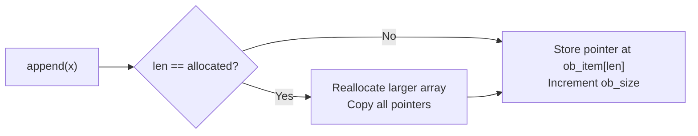
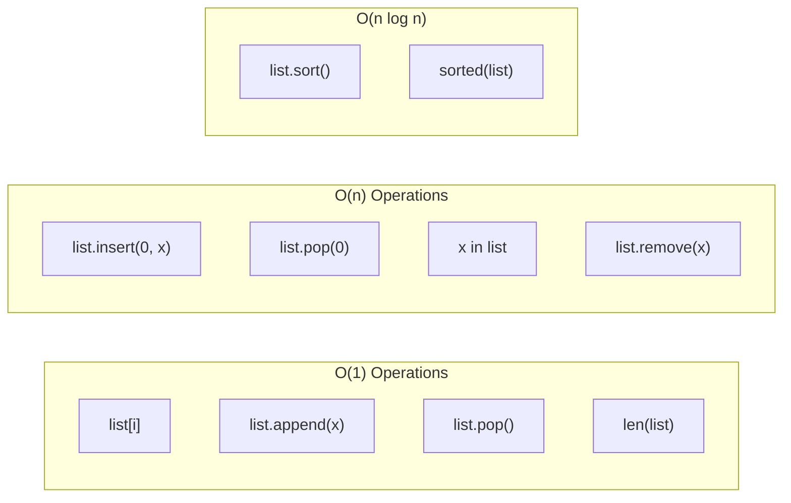
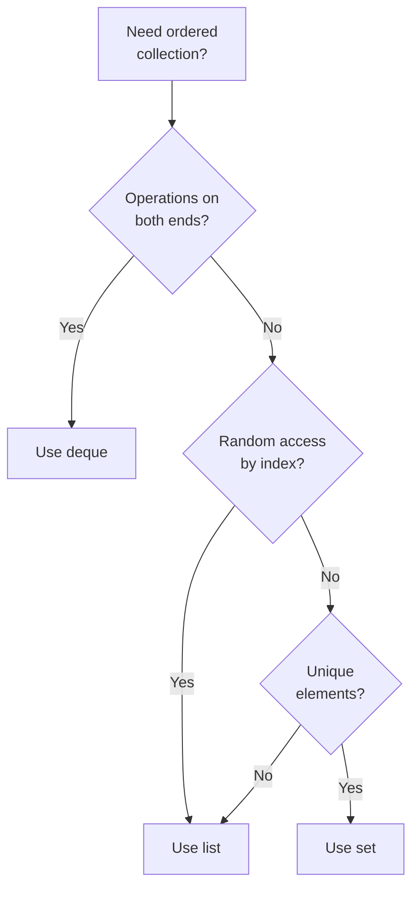

# Python Lists — Middle Level

## Table of Contents

1. [Introduction](#introduction)
2. [Core Concepts](#core-concepts)
3. [Evolution & Historical Context](#evolution--historical-context)
4. [Pros & Cons](#pros--cons)
5. [Alternative Approaches](#alternative-approaches)
6. [Code Examples](#code-examples)
7. [Coding Patterns](#coding-patterns)
8. [Clean Code](#clean-code)
9. [Product Use / Feature](#product-use--feature)
10. [Error Handling](#error-handling)
11. [Security Considerations](#security-considerations)
12. [Performance Optimization](#performance-optimization)
13. [Comparison with Other Languages](#comparison-with-other-languages)
14. [Debugging Guide](#debugging-guide)
15. [Best Practices](#best-practices)
16. [Edge Cases & Pitfalls](#edge-cases--pitfalls)
17. [Test](#test)
18. [Tricky Questions](#tricky-questions)
19. [Cheat Sheet](#cheat-sheet)
20. [Summary](#summary)
21. [Further Reading](#further-reading)
22. [Diagrams & Visual Aids](#diagrams--visual-aids)

---

## Introduction

> Focus: "Why?" and "When to use?"

Assumes you already know how to create, index, slice, and iterate lists. This level covers:
- How lists work internally in CPython (dynamic array, over-allocation)
- Production patterns with type hints, dataclasses, and decorators
- When lists are the wrong choice and what to use instead
- Performance characteristics and optimization strategies

---

## Core Concepts

### Concept 1: Lists Are Dynamic Arrays

Internally, a Python list is a **contiguous array of pointers** to Python objects. When the array fills up, CPython allocates a larger block and copies pointers over. This is called **over-allocation** — the list always reserves some extra space for future `append()` calls.

```python
import sys

lst = []
prev_size = sys.getsizeof(lst)
for i in range(64):
    lst.append(i)
    new_size = sys.getsizeof(lst)
    if new_size != prev_size:
        print(f"len={len(lst):>3}  size={new_size:>5} bytes  "
              f"(grew by {new_size - prev_size} bytes)")
        prev_size = new_size
```



### Concept 2: Time Complexity of List Operations

| Operation | Average Case | Worst Case | Notes |
|-----------|:----------:|:----------:|-------|
| `list[i]` | O(1) | O(1) | Direct pointer access |
| `list.append(x)` | O(1) amortized | O(n) | Reallocation on growth |
| `list.insert(i, x)` | O(n) | O(n) | Shifts elements right |
| `list.pop()` | O(1) | O(1) | Remove from end |
| `list.pop(0)` | O(n) | O(n) | Shifts all elements left |
| `x in list` | O(n) | O(n) | Linear scan |
| `list.sort()` | O(n log n) | O(n log n) | Timsort |
| `list[a:b]` | O(b-a) | O(b-a) | Creates new list |
| `list.extend(iter)` | O(k) | O(n+k) | k = len(iter) |
| `del list[i]` | O(n) | O(n) | Shifts elements left |

### Concept 3: Timsort — Python's Sorting Algorithm

Python's `sort()` uses **Timsort** (designed by Tim Peters in 2002). It is a hybrid of merge sort and insertion sort, optimized for real-world data that often has pre-existing order ("runs").

Key properties:
- **Stable** — equal elements keep their original order
- **Adaptive** — runs faster on partially sorted data
- **O(n log n)** worst case, **O(n)** best case (already sorted)

```python
# Stable sort example — secondary sort preserved
students = [
    ("Alice", 85),
    ("Bob", 92),
    ("Charlie", 85),
    ("Diana", 92),
]

# Sort by grade (descending), keeping name order for ties
students.sort(key=lambda s: s[1], reverse=True)
print(students)
# [('Bob', 92), ('Diana', 92), ('Alice', 85), ('Charlie', 85)]
# Bob comes before Diana — original order preserved for grade=92
```

### Concept 4: List vs Generator — Lazy Evaluation

```python
# List — eagerly creates all items in memory
squares_list = [x**2 for x in range(1_000_000)]  # ~8 MB

# Generator — lazily computes one item at a time
squares_gen = (x**2 for x in range(1_000_000))    # ~100 bytes

import sys
print(sys.getsizeof(squares_list))  # ~8,448,728
print(sys.getsizeof(squares_gen))   # 200
```

**Rule of thumb:** Use a generator when you only need to iterate once. Use a list when you need random access or multiple iterations.

### Concept 5: Typed Lists with Type Hints

```python
from typing import Optional


def find_outliers(
    values: list[float],
    threshold: float = 2.0,
) -> list[float]:
    """Find values that deviate more than threshold standard deviations."""
    if not values:
        return []

    mean = sum(values) / len(values)
    variance = sum((x - mean) ** 2 for x in values) / len(values)
    std_dev = variance ** 0.5

    return [v for v in values if abs(v - mean) > threshold * std_dev]


# Using list[T] syntax (Python 3.9+)
names: list[str] = ["Alice", "Bob"]
matrix: list[list[int]] = [[1, 2], [3, 4]]
optional_items: list[Optional[str]] = ["hello", None, "world"]
```

---

## Evolution & Historical Context

**Before list comprehensions (Python 1.x):**
- Developers used `map()` + `filter()` with lambdas — functional but less readable
- Explicit loops with `append()` were the standard

**How list comprehensions changed things (PEP 202, Python 2.0):**
- Introduced `[expr for x in iterable if cond]`
- More readable than `list(map(lambda x: expr, filter(lambda x: cond, iterable)))`
- Became the idiomatic Python way to create lists

**Modern additions:**
- **PEP 3132 (Python 3.0):** Extended unpacking — `first, *rest = [1, 2, 3, 4]`
- **PEP 448 (Python 3.5):** Generalized unpacking — `[*a, *b]` to merge lists
- **PEP 585 (Python 3.9):** `list[int]` instead of `typing.List[int]`

---

## Pros & Cons

| Pros | Cons |
|------|------|
| O(1) random access by index | O(n) search without sorting |
| O(1) amortized append | O(n) insert/delete at beginning |
| Dynamic resizing — no fixed capacity | Over-allocation wastes some memory |
| Heterogeneous — holds any type | No type safety without external tools |
| Rich set of built-in methods | Not thread-safe without locks |

### Trade-off analysis:
- **List vs tuple:** Use list when you need mutability; tuple when data should be fixed and hashable
- **List vs deque:** Use deque when you need O(1) operations on both ends
- **List vs set:** Use set when you need O(1) membership testing and uniqueness

---

## Alternative Approaches

| Alternative | How it works | When to use it |
|-------------|-------------|----------------|
| **`collections.deque`** | Double-ended queue with O(1) append/pop on both ends | Queue/FIFO operations |
| **`array.array`** | Typed array storing raw values (not pointers) | Memory-efficient storage of homogeneous numeric data |
| **`numpy.ndarray`** | C-level contiguous array with vectorized operations | Numerical computation |
| **`tuple`** | Immutable sequence | Fixed data, dict keys, function returns |
| **`set`** | Hash-based unordered collection | Fast membership testing, uniqueness |

---

## Code Examples

### Example 1: Type-safe list operations with dataclasses

```python
from dataclasses import dataclass, field
from typing import Optional


@dataclass
class Task:
    title: str
    priority: int
    done: bool = False


@dataclass
class TaskBoard:
    tasks: list[Task] = field(default_factory=list)

    def add(self, task: Task) -> None:
        self.tasks.append(task)

    def complete(self, title: str) -> Optional[Task]:
        for task in self.tasks:
            if task.title == title and not task.done:
                task.done = True
                return task
        return None

    def pending(self) -> list[Task]:
        return [t for t in self.tasks if not t.done]

    def by_priority(self) -> list[Task]:
        return sorted(self.tasks, key=lambda t: t.priority)


if __name__ == "__main__":
    board = TaskBoard()
    board.add(Task("Write tests", priority=2))
    board.add(Task("Deploy", priority=1))
    board.add(Task("Code review", priority=3))

    board.complete("Write tests")

    print("Pending:", [t.title for t in board.pending()])
    print("By priority:", [t.title for t in board.by_priority()])
```

**Why this pattern:** Dataclasses + typed lists provide structure and IDE support. `field(default_factory=list)` avoids the mutable default argument pitfall.

### Example 2: Advanced list comprehensions with walrus operator

```python
import re

# Walrus operator (:=) to avoid computing twice
raw_lines = ["  Hello  ", "", "   ", "World  ", "  Python  "]
cleaned = [stripped for line in raw_lines if (stripped := line.strip())]
print(cleaned)  # ['Hello', 'World', 'Python']

# Nested comprehension with multiple conditions
matrix = [[1, -2, 3], [-4, 5, -6], [7, -8, 9]]
positive_flat = [
    val
    for row in matrix
    for val in row
    if val > 0
]
print(positive_flat)  # [1, 3, 5, 7, 9]

# Dictionary comprehension from list
words = ["hello", "world", "python", "programming"]
word_lengths = {word: len(word) for word in words if len(word) > 5}
print(word_lengths)  # {'python': 6, 'programming': 11}
```

### Example 3: Custom sort with `key` and multi-level sorting

```python
from operator import attrgetter, itemgetter

# Sort dicts by multiple keys
employees = [
    {"name": "Alice", "dept": "Engineering", "salary": 95000},
    {"name": "Bob", "dept": "Marketing", "salary": 72000},
    {"name": "Charlie", "dept": "Engineering", "salary": 88000},
    {"name": "Diana", "dept": "Marketing", "salary": 81000},
]

# Sort by dept ascending, then salary descending
employees.sort(key=lambda e: (e["dept"], -e["salary"]))
for emp in employees:
    print(f"{emp['name']:>10} | {emp['dept']:>12} | ${emp['salary']:,}")

# Using itemgetter (faster for single key)
employees.sort(key=itemgetter("salary"), reverse=True)

# Sort objects with attrgetter
from dataclasses import dataclass

@dataclass
class Employee:
    name: str
    dept: str
    salary: int

staff = [Employee("Alice", "Eng", 95000), Employee("Bob", "Mkt", 72000)]
staff.sort(key=attrgetter("salary"))
```

---

## Coding Patterns

### Pattern 1: Sliding Window

```python
def sliding_window(data: list, window_size: int) -> list[list]:
    """Generate sliding windows over a list."""
    return [
        data[i:i + window_size]
        for i in range(len(data) - window_size + 1)
    ]

temps = [20, 22, 25, 23, 21, 24, 26]
windows = sliding_window(temps, 3)
averages = [sum(w) / len(w) for w in windows]
print(averages)  # [22.33, 23.33, 23.0, 22.67, 23.67]
```

### Pattern 2: Chunking

```python
def chunk(lst: list, size: int) -> list[list]:
    """Split a list into chunks of given size."""
    return [lst[i:i + size] for i in range(0, len(lst), size)]

items = list(range(10))
print(chunk(items, 3))  # [[0, 1, 2], [3, 4, 5], [6, 7, 8], [9]]
```

### Pattern 3: Flatten Nested Lists

```python
from itertools import chain

# One level deep
nested = [[1, 2], [3, 4], [5, 6]]
flat = [item for sublist in nested for item in sublist]
print(flat)  # [1, 2, 3, 4, 5, 6]

# Using itertools.chain (more efficient)
flat = list(chain.from_iterable(nested))

# Arbitrary depth recursion
def deep_flatten(lst):
    for item in lst:
        if isinstance(item, list):
            yield from deep_flatten(item)
        else:
            yield item

deeply_nested = [1, [2, [3, [4, 5]], 6], 7]
print(list(deep_flatten(deeply_nested)))  # [1, 2, 3, 4, 5, 6, 7]
```

### Pattern 4: Zip and Transpose

```python
# Transpose a matrix using zip
matrix = [
    [1, 2, 3],
    [4, 5, 6],
    [7, 8, 9],
]
transposed = [list(row) for row in zip(*matrix)]
print(transposed)
# [[1, 4, 7], [2, 5, 8], [3, 6, 9]]

# Pair elements from multiple lists
names = ["Alice", "Bob", "Charlie"]
scores = [92, 85, 78]
grades = ["A", "B", "C"]

combined = list(zip(names, scores, grades))
print(combined)
# [('Alice', 92, 'A'), ('Bob', 85, 'B'), ('Charlie', 78, 'C')]
```

### Pattern 5: Accumulate / Running Total

```python
from itertools import accumulate

sales = [100, 200, 150, 300, 250]
cumulative = list(accumulate(sales))
print(cumulative)  # [100, 300, 450, 750, 1000]

# Running maximum
import operator
running_max = list(accumulate(sales, max))
print(running_max)  # [100, 200, 200, 300, 300]
```

---

## Clean Code

### Production-Level List Operations

```python
# ❌ Imperative, hard to read
def get_active_premium_users_bad(users):
    result = []
    for user in users:
        if user.is_active:
            if user.plan == "premium":
                result.append(user.email)
    return result

# ✅ Declarative with comprehension
def get_active_premium_emails(users: list["User"]) -> list[str]:
    """Get emails of active premium users."""
    return [
        user.email
        for user in users
        if user.is_active and user.plan == "premium"
    ]
```

### SOLID — Single Responsibility

```python
# ❌ One function does everything
def process_orders(orders: list[dict]) -> dict:
    valid = [o for o in orders if o["amount"] > 0]
    total = sum(o["amount"] for o in valid)
    # ... 50 more lines ...
    return {"valid": valid, "total": total}

# ✅ Each function has one job
def filter_valid_orders(orders: list[dict]) -> list[dict]:
    return [o for o in orders if o["amount"] > 0]

def calculate_total(orders: list[dict]) -> float:
    return sum(o["amount"] for o in orders)
```

---

## Product Use / Feature

### 1. Django REST Framework (DRF)

- **How it uses Lists:** Serializers return `list[dict]` for collection endpoints. `ListSerializer` handles batch operations.
- **Scale:** Used by Instagram, Mozilla, and thousands of production APIs.

### 2. pandas

- **How it uses Lists:** `DataFrame.values.tolist()` converts data to nested lists. `groupby().apply()` returns list-like structures.
- **Scale:** Processes datasets with millions of rows.

### 3. Celery

- **How it uses Lists:** Task groups and chains use lists to batch and sequence tasks.
- **Scale:** Handles millions of distributed tasks per day.

---

## Error Handling

### Pattern 1: Safe list access with default

```python
def safe_get(lst: list, index: int, default=None):
    """Get list element safely with a default value."""
    try:
        return lst[index]
    except IndexError:
        return default

colors = ["red", "green", "blue"]
print(safe_get(colors, 5, "unknown"))  # "unknown"
```

### Pattern 2: Validating list inputs

```python
def process_items(items: list[str]) -> list[str]:
    """Process a list of items with validation."""
    if not isinstance(items, list):
        raise TypeError(f"Expected list, got {type(items).__name__}")
    if not items:
        raise ValueError("Items list cannot be empty")
    if len(items) > 10_000:
        raise ValueError(f"Too many items: {len(items)} (max 10,000)")

    return [item.strip().lower() for item in items if isinstance(item, str)]
```

---

## Security Considerations

### 1. Pickle deserialization of lists

```python
import pickle

# ❌ NEVER unpickle data from untrusted sources
data = pickle.loads(untrusted_bytes)  # can execute arbitrary code

# ✅ Use JSON for untrusted data
import json
data = json.loads(untrusted_string)  # safe — only creates basic types
```

### Security Checklist
- [ ] Never use `eval()` or `pickle.loads()` on untrusted list data
- [ ] Limit list sizes from external input to prevent memory exhaustion
- [ ] Validate element types when processing lists from APIs
- [ ] Use `ast.literal_eval()` instead of `eval()` for parsing literal list strings

---

## Performance Optimization

### Optimization 1: `collections.deque` for queue operations

```python
from collections import deque
import timeit

# ❌ Slow — O(n) for pop(0)
def list_queue(n):
    q = []
    for i in range(n):
        q.append(i)
    for _ in range(n):
        q.pop(0)

# ✅ Fast — O(1) for popleft
def deque_queue(n):
    q = deque()
    for i in range(n):
        q.append(i)
    for _ in range(n):
        q.popleft()

n = 10_000
t_list = timeit.timeit(lambda: list_queue(n), number=10)
t_deque = timeit.timeit(lambda: deque_queue(n), number=10)
print(f"list:  {t_list:.4f}s")
print(f"deque: {t_deque:.4f}s")
# list:  ~0.45s
# deque: ~0.01s  (~45x faster)
```

### Optimization 2: Pre-allocating vs dynamic append

```python
import timeit

n = 1_000_000

# ❌ Many reallocations
def dynamic_build():
    lst = []
    for i in range(n):
        lst.append(i)

# ✅ Single allocation with comprehension
def comprehension_build():
    lst = [i for i in range(n)]

# ✅✅ Even faster — use range directly
def range_build():
    lst = list(range(n))

t1 = timeit.timeit(dynamic_build, number=5)
t2 = timeit.timeit(comprehension_build, number=5)
t3 = timeit.timeit(range_build, number=5)
print(f"dynamic:       {t1:.4f}s")
print(f"comprehension: {t2:.4f}s")
print(f"list(range):   {t3:.4f}s")
```

### Performance Decision Matrix

| Scenario | Best Choice | Why |
|----------|------------|-----|
| Random access by index | `list` | O(1) index access |
| Frequent insert/remove at both ends | `deque` | O(1) on both ends |
| Membership testing | `set` | O(1) average lookup |
| Numerical computation | `numpy.ndarray` | Vectorized C-level ops |
| Fixed-size record | `tuple` or `namedtuple` | Less memory, hashable |
| Streaming data | Generator | O(1) memory |

---

## Comparison with Other Languages

| Feature | Python `list` | Java `ArrayList` | Go `slice` | JavaScript `Array` | Rust `Vec<T>` |
|---------|:------------:|:----------------:|:----------:|:------------------:|:-------------:|
| Dynamic size | Yes | Yes | Yes | Yes | Yes |
| Type safety | Runtime only | Generics (compile-time) | Compile-time | No | Compile-time |
| Heterogeneous | Yes | No (with generics) | No | Yes | No |
| Contiguous memory | Pointers are contiguous | Object refs contiguous | Values contiguous | Engine-dependent | Values contiguous |
| Built-in sort | Timsort | Timsort (Java 8+) | Pattern-defeating quicksort | Timsort | Pattern-defeating quicksort |
| Slice syntax | `a[1:3]` | `subList(1, 3)` | `a[1:3]` | `a.slice(1, 3)` | `&a[1..3]` |
| Thread-safe | No | No (use `Collections.synchronizedList`) | No (use sync.Mutex) | N/A (single-threaded) | Via `Arc<Mutex<Vec>>` |

---

## Debugging Guide

### Problem 1: List grows unbounded, causing OOM

**Diagnostic steps:**

```python
import tracemalloc

tracemalloc.start()

# ... your code that builds lists ...

snapshot = tracemalloc.take_snapshot()
top_stats = snapshot.statistics("lineno")
for stat in top_stats[:10]:
    print(stat)
```

**Common causes:**
- Forgetting to clear/trim lists in long-running processes
- Appending to a global list without bounds
- Accumulating results that should be processed in batches

### Problem 2: Unexpected list mutation

```python
# Use id() to check if two variables point to the same object
a = [1, 2, 3]
b = a
print(id(a) == id(b))  # True — same object!

# Visualize with sys.getrefcount
import sys
print(sys.getrefcount(a))  # 3 (a, b, and getrefcount's parameter)
```

---

## Best Practices

- **Prefer list comprehensions** over `map()`/`filter()` for readability — but use `map()` for simple function application
- **Use `enumerate()` instead of `range(len(...))`** — `for i, item in enumerate(items)` is more Pythonic
- **Use `zip()` to iterate multiple lists** — cleaner than manual indexing
- **Avoid `list * n` for mutable objects** — it creates references, not copies
- **Use `sorted()` when you need the original list unchanged** — `sort()` modifies in place
- **Choose the right data structure** — don't use a list when a set or dict would be more efficient

---

## Edge Cases & Pitfalls

### Pitfall 1: `+=` vs `=` with list aliasing

```python
# += modifies in place (calls __iadd__)
a = [1, 2, 3]
b = a
b += [4, 5]
print(a)  # [1, 2, 3, 4, 5] — a is affected!

# = creates a new object
a = [1, 2, 3]
b = a
b = b + [4, 5]
print(a)  # [1, 2, 3] — a is NOT affected
```

### Pitfall 2: Sorting with `None` values

```python
data = [3, None, 1, None, 2]
# data.sort()  # TypeError: '<' not supported between NoneType and int

# Handle None values explicitly
data.sort(key=lambda x: (x is None, x or 0))
print(data)  # [1, 2, 3, None, None]
```

### Pitfall 3: List comprehension variable scope (Python 3 fixed this)

```python
# In Python 3, comprehension variables don't leak
x = 10
squares = [x for x in range(5)]
print(x)  # 10 — x is unchanged (Python 3)
# In Python 2, x would be 4!
```

---

## Test

### Multiple Choice

**1. What is the time complexity of `list.pop(0)`?**

- A) O(1)
- B) O(log n)
- C) O(n)
- D) O(n log n)

<details>
<summary>Answer</summary>
<strong>C)</strong> — Removing the first element requires shifting all remaining elements one position to the left, which is O(n). Use `collections.deque.popleft()` for O(1).
</details>

**2. What does `sorted()` return when called on a list?**

- A) `None`
- B) The same list, sorted
- C) A new sorted list
- D) A generator of sorted elements

<details>
<summary>Answer</summary>
<strong>C)</strong> — `sorted()` always returns a new list. `list.sort()` sorts in place and returns `None`.
</details>

**3. Which sorting algorithm does CPython use?**

- A) Quicksort
- B) Merge sort
- C) Timsort
- D) Heapsort

<details>
<summary>Answer</summary>
<strong>C)</strong> — CPython uses Timsort, a hybrid of merge sort and insertion sort. It is stable and adaptive, with O(n log n) worst case and O(n) best case on partially sorted data.
</details>

### What's the Output?

**4. What does this code print?**

```python
a = [1, 2, 3]
b = a[:]
a.append(4)
print(b)
```

<details>
<summary>Answer</summary>
Output: `[1, 2, 3]`

`a[:]` creates a shallow copy. Modifying `a` does not affect `b`.
</details>

**5. What does this code print?**

```python
data = [[0]] * 3
data[0].append(1)
print(data)
```

<details>
<summary>Answer</summary>
Output: `[[0, 1], [0, 1], [0, 1]]`

`[[0]] * 3` creates three references to the same inner list. Appending to one affects all.
</details>

**6. What does this code print?**

```python
items = [1, 2, 3, 4, 5]
items[1:3] = [20, 30, 40]
print(items)
```

<details>
<summary>Answer</summary>
Output: `[1, 20, 30, 40, 4, 5]`

Slice assignment replaces elements at indices 1 and 2 with the three new elements, expanding the list.
</details>

**7. What does this code print?**

```python
x = [1, 2, 3]
y = [1, 2, 3]
print(x == y, x is y)
```

<details>
<summary>Answer</summary>
Output: `True False`

`==` compares values (equal), `is` compares identity (different objects in memory).
</details>

**8. What does this code print?**

```python
nums = [4, 2, 7, 1, 9]
result = nums.sort()
print(result)
print(nums)
```

<details>
<summary>Answer</summary>

```
None
[1, 2, 4, 7, 9]
```

`sort()` modifies the list in place and returns `None`. The list `nums` is now sorted.
</details>

**9. What does this code print?**

```python
a = [1, 2, 3]
b = a
a += [4]
c = a
a = a + [5]
print(b)
print(c)
print(a)
```

<details>
<summary>Answer</summary>

```
[1, 2, 3, 4]
[1, 2, 3, 4]
[1, 2, 3, 4, 5]
```

`a += [4]` modifies the original list in place (so `b` and `a` still reference the same list). `c = a` also points to the same list. But `a = a + [5]` creates a new list and rebinds `a`, leaving `b` and `c` pointing to the old list.
</details>

**10. What does this code print?**

```python
from itertools import chain
result = list(chain([1, 2], [3], [4, 5, 6]))
print(result)
```

<details>
<summary>Answer</summary>
Output: `[1, 2, 3, 4, 5, 6]`

`chain` lazily concatenates multiple iterables into a single sequence.
</details>

---

## Tricky Questions

**1. Why does `list.sort()` return `None` instead of the sorted list?**

<details>
<summary>Answer</summary>
By design (PEP 8 / Guido's convention): methods that modify an object in place return `None` to make it clear that no new object is created. This prevents confusion like `x = [3,1,2].sort()` where `x` would be `None`. Use `sorted()` when you need a new list.
</details>

**2. Given `a = [1, 2, 3]`, what is the difference between `a *= 2` and `a = a * 2`?**

<details>
<summary>Answer</summary>

- `a *= 2` calls `list.__imul__`, which extends the existing list in place. Any other reference to the same list object will see the change.
- `a = a * 2` calls `list.__mul__`, which creates a **new** list and rebinds `a`. Other references to the original list are unaffected.

```python
a = [1, 2, 3]
b = a
a *= 2
print(b)  # [1, 2, 3, 1, 2, 3] — b was affected

a = [1, 2, 3]
b = a
a = a * 2
print(b)  # [1, 2, 3] — b was NOT affected
```
</details>

---

## Cheat Sheet

| Pattern | Code | Notes |
|---------|------|-------|
| Flatten | `[x for sub in nested for x in sub]` | One level |
| Chunk | `[lst[i:i+n] for i in range(0, len(lst), n)]` | Split into groups |
| Transpose | `list(zip(*matrix))` | Rows to columns |
| Unique (preserve order) | `list(dict.fromkeys(lst))` | Python 3.7+ |
| Running total | `list(accumulate(lst))` | `from itertools import accumulate` |
| Merge sorted | `list(heapq.merge(a, b))` | `import heapq` |
| Top N | `heapq.nlargest(n, lst)` | Faster than full sort for small n |
| Safe access | `lst[i] if i < len(lst) else default` | No exception |

---

## Summary

- Lists are **dynamic arrays of pointers** — O(1) access, O(1) amortized append, O(n) insert/delete at front
- **Timsort** is stable, adaptive, and O(n log n) — leverage `key=` for custom sorting
- Use **generators** when you only need one pass; **lists** when you need random access
- Choose the **right data structure**: `deque` for queues, `set` for membership testing, `numpy` for numerics
- **Production patterns**: comprehensions with walrus operator, chunking, sliding window, flatten, transpose
- Always be aware of **aliasing** (`b = a` vs `b = a.copy()`) and **shallow vs deep copy**

---

## Further Reading

- **Official docs:** [Data Structures](https://docs.python.org/3/tutorial/datastructures.html)
- **PEP 202:** [List Comprehensions](https://peps.python.org/pep-0202/)
- **PEP 3132:** [Extended Iterable Unpacking](https://peps.python.org/pep-3132/)
- **Book:** Fluent Python (Ramalho), Chapter 2 — "An Array of Sequences"
- **CPython source:** [Objects/listobject.c](https://github.com/python/cpython/blob/main/Objects/listobject.c)

---

## Diagrams & Visual Aids

### List Operations Complexity



### List vs Deque Decision Diagram



### Over-Allocation Strategy

```
List growth pattern (CPython 3.11+):
Size:   0 → 4 → 8 → 16 → 24 → 32 → 40 → 52 → 64 → ...

Formula: new_allocated = (newsize >> 3) + (3 if newsize < 9 else 6) + newsize

Allocated: ████████░░░░  (█ = used, ░ = reserved)
           len=8, allocated=16

After 8 more appends:
Allocated: ████████████████░░░░░░░░
           len=16, allocated=24
```
