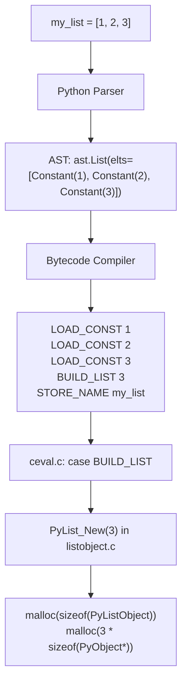
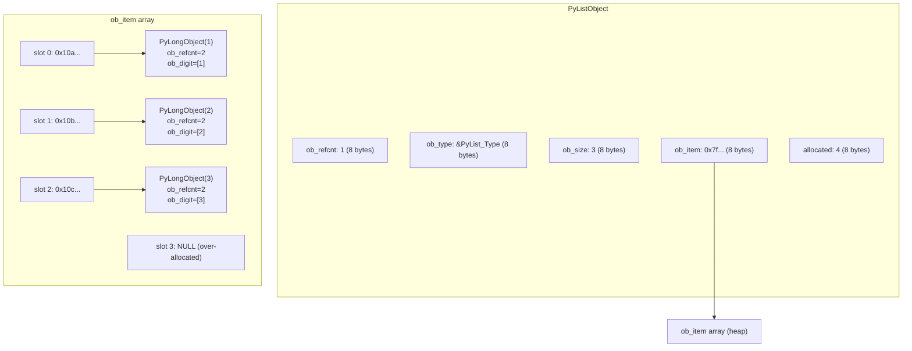
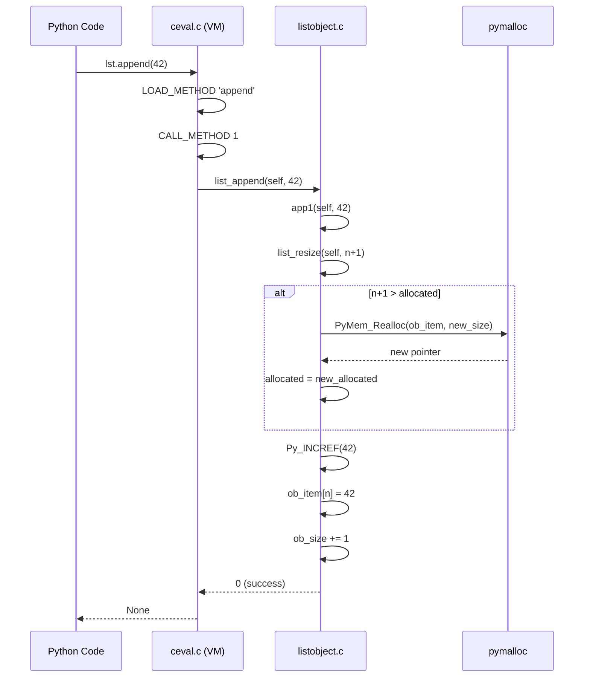

# Python Lists — Under the Hood

## Table of Contents

1. [Introduction](#introduction)
2. [How It Works Internally](#how-it-works-internally)
3. [CPython Bytecode](#cpython-bytecode)
4. [PyListObject Structure](#pylistobject-structure)
5. [Over-Allocation Strategy](#over-allocation-strategy)
6. [Memory Management & Reference Counting](#memory-management--reference-counting)
7. [GIL Internals](#gil-internals)
8. [CPython Source Walkthrough](#cpython-source-walkthrough)
9. [Performance Internals](#performance-internals)
10. [Edge Cases at the Lowest Level](#edge-cases-at-the-lowest-level)
11. [Test](#test)
12. [Summary](#summary)
13. [Further Reading](#further-reading)
14. [Diagrams & Visual Aids](#diagrams--visual-aids)

---

## Introduction

> Focus: "What happens under the hood?"

This document explores what CPython does internally when you use Python lists.
For developers who want to understand:
- The C structure `PyListObject` and how it manages memory
- What bytecode the Python compiler generates for list operations (`dis` module)
- How the GIL affects list operations
- How reference counting and cyclic GC handle lists
- The over-allocation strategy that makes `append()` O(1) amortized

---

## How It Works Internally

Step-by-step breakdown of what happens when CPython creates and manipulates a list:

1. **Source code** → `my_list = [1, 2, 3]`
2. **AST** → `ast.Assign(targets=[ast.Name('my_list')], value=ast.List(elts=[...]))`
3. **Bytecode** → `BUILD_LIST 3` instruction
4. **CPython VM** → `ceval.c` dispatches to `PyList_New(3)` in `listobject.c`
5. **C code** → Allocates `PyListObject` struct + array of `PyObject*` pointers



---

## CPython Bytecode

### List Creation Bytecode

```python
import dis

def create_list():
    nums = [1, 2, 3]
    return nums

dis.dis(create_list)
```

```
  2           0 LOAD_CONST               1 (1)
              2 LOAD_CONST               2 (2)
              4 LOAD_CONST               3 (3)
              6 BUILD_LIST               3
              8 STORE_FAST               0 (nums)

  3          10 LOAD_FAST                0 (nums)
             12 RETURN_VALUE
```

**Key instructions:**
- `LOAD_CONST` — pushes integer constants onto the evaluation stack
- `BUILD_LIST 3` — pops 3 items from the stack, calls `PyList_New(3)`, and stores them
- `STORE_FAST` — stores the list in a local variable slot (fast locals array)

### List Comprehension Bytecode

```python
import dis

def comprehension():
    return [x * 2 for x in range(5)]

dis.dis(comprehension)
```

```
  2           0 LOAD_CONST               1 (<code object <listcomp>>)
              2 MAKE_FUNCTION            0
              4 LOAD_GLOBAL              0 (range)
              6 LOAD_CONST               2 (5)
              8 CALL_FUNCTION            1
             10 GET_ITER
             12 CALL_FUNCTION            1
             14 RETURN_VALUE
```

**Key insight:** List comprehensions are compiled into a separate code object (a nested function). This is why comprehension variables don't leak into the outer scope in Python 3.

### Append vs Extend Bytecode

```python
import dis

def append_example():
    lst = []
    lst.append(1)

def extend_example():
    lst = []
    lst.extend([1, 2, 3])

print("=== append ===")
dis.dis(append_example)
print("\n=== extend ===")
dis.dis(extend_example)
```

**`append` uses `CALL_METHOD` (or `LOAD_ATTR` + `CALL_FUNCTION`):**
```
LOAD_FAST       0 (lst)
LOAD_METHOD     0 (append)      # lookup .append method
LOAD_CONST      1 (1)
CALL_METHOD     1               # call with 1 argument
POP_TOP
```

### Slice Bytecode

```python
import dis

def slice_example():
    lst = [1, 2, 3, 4, 5]
    return lst[1:3]

dis.dis(slice_example)
```

```
LOAD_FAST       0 (lst)
LOAD_CONST      1 (1)
LOAD_CONST      2 (3)
BUILD_SLICE     2            # creates a slice(1, 3) object
BINARY_SUBSCR                # calls lst.__getitem__(slice(1, 3))
```

---

## PyListObject Structure

The C structure for a Python list (from `Include/cpython/listobject.h`):

```c
typedef struct {
    PyObject_VAR_HEAD          // ob_refcnt, ob_type, ob_size
    PyObject **ob_item;        // pointer to array of PyObject pointers
    Py_ssize_t allocated;      // how many slots are allocated (>= ob_size)
} PyListObject;
```

### Memory Layout

```
PyListObject (on the heap):
┌─────────────────────────────────────┐
│ ob_refcnt:  Py_ssize_t (8 bytes)    │  ← reference count
│ ob_type:    PyTypeObject* (8 bytes) │  ← points to PyList_Type
│ ob_size:    Py_ssize_t (8 bytes)    │  ← len(list) — actual number of items
│ ob_item:    PyObject** (8 bytes)    │  ← pointer to array of PyObject*
│ allocated:  Py_ssize_t (8 bytes)    │  ← total allocated slots
└─────────────────────────────────────┘
         │
         │  ob_item points to:
         ▼
┌─────────┬─────────┬─────────┬─────────┬─────────┬─────────┐
│ *ptr[0]  │ *ptr[1]  │ *ptr[2]  │ (empty)  │ (empty)  │ (empty)  │
└────┬─────┴────┬─────┴────┬─────┴──────────┴──────────┴──────────┘
     │          │          │
     ▼          ▼          ▼
  PyLong(1)  PyLong(2)  PyLong(3)   ← actual Python objects on the heap
```

### Verifying with `sys` and `ctypes`

```python
import sys
import ctypes

lst = [10, 20, 30]

# Basic info
print(f"len(lst):       {len(lst)}")
print(f"sys.getsizeof:  {sys.getsizeof(lst)} bytes")
print(f"id(lst):        {id(lst):#x}")

# Inspect internal structure using ctypes
# PyListObject layout (simplified):
#   offset 0:  ob_refcnt (Py_ssize_t)
#   offset 8:  ob_type (pointer)
#   offset 16: ob_size (Py_ssize_t) — this is len()
#   offset 24: ob_item (pointer to array)
#   offset 32: allocated (Py_ssize_t)

addr = id(lst)
ob_size = ctypes.c_ssize_t.from_address(addr + 16).value
allocated = ctypes.c_ssize_t.from_address(addr + 32).value

print(f"ob_size (len):  {ob_size}")
print(f"allocated:      {allocated}")

# After appending
for i in range(10):
    lst.append(i)
    new_allocated = ctypes.c_ssize_t.from_address(addr + 32).value
    new_size = ctypes.c_ssize_t.from_address(addr + 16).value
    print(f"  len={new_size}, allocated={new_allocated}")
```

---

## Over-Allocation Strategy

### The Growth Formula

From `Objects/listobject.c` (CPython 3.12):

```c
/* This over-allocates proportional to the list size, making room
 * for additional growth.  The over-allocation is mild, but is
 * enough to give linear-time amortized behavior over a long
 * sequence of appends() in the presence of a poorly-performing
 * system realloc().
 */
static int
list_resize(PyListObject *self, Py_ssize_t newsize)
{
    Py_ssize_t new_allocated, num_allocated_bytes;

    /* ...checks... */

    new_allocated = ((size_t)newsize + (newsize >> 3) + 6) & ~(size_t)3;
    /* For small lists: add 3 instead of 6, mask rounds to 4 */
    if (newsize - allocated > (Py_ssize_t)(allocated >> 3))
        /* Don't overallocate if it smells like extend() or __init__() */
        new_allocated = ((size_t)newsize + 3) & ~(size_t)3;

    num_allocated_bytes = new_allocated * sizeof(PyObject *);
    items = (PyObject **)PyMem_Realloc(self->ob_item, num_allocated_bytes);
    /* ... */
}
```

### Visualizing Growth

```python
def simulate_growth():
    """Simulate CPython list growth pattern."""
    import sys

    lst = []
    prev_alloc = 0
    growth_points = []

    for i in range(100):
        lst.append(i)
        # We can't directly access allocated in pure Python,
        # but sys.getsizeof reveals allocation changes
        current_size = sys.getsizeof(lst)
        if i == 0 or current_size != prev_alloc:
            growth_points.append((len(lst), current_size))
            prev_alloc = current_size

    print(f"{'len':>5} | {'getsizeof':>10} | {'approx slots':>12}")
    print("-" * 35)
    for length, size in growth_points:
        # Each slot is 8 bytes (pointer), base overhead is ~56 bytes
        approx_slots = (size - 56) // 8
        print(f"{length:>5} | {size:>10} | {approx_slots:>12}")


simulate_growth()
```

Output pattern:
```
  len |  getsizeof | approx slots
-----------------------------------
    1 |         88 |            4
    5 |        120 |            8
    9 |        184 |           16
   17 |        248 |           24
   25 |        312 |           32
   33 |        376 |           40
   41 |        472 |           52
   53 |        568 |           64
```

---

## Memory Management & Reference Counting

### Reference Counting for List Elements

When you add an item to a list, CPython **increments** its reference count. When you remove it, the reference count is **decremented**. If the refcount hits 0, the object is immediately freed.

```python
import sys

a = [1, 2, 3]

# sys.getrefcount returns refcount + 1 (because the argument itself is a reference)
obj = object()
print(f"refcount before: {sys.getrefcount(obj)}")  # 2

lst = [obj, obj, obj]  # 3 more references
print(f"refcount after adding to list: {sys.getrefcount(obj)}")  # 5

lst.pop()  # remove one reference
print(f"refcount after pop: {sys.getrefcount(obj)}")  # 4

del lst  # remove the list (and all remaining references from it)
print(f"refcount after del lst: {sys.getrefcount(obj)}")  # 2
```

### Cyclic Garbage Collection

Lists can form reference cycles that reference counting alone cannot handle:

```python
import gc

# Create a reference cycle
a = []
b = []
a.append(b)
b.append(a)

# Now a → b → a → b → ... (cycle)
# Reference counting alone won't free these because each has refcount > 0

del a
del b
# Objects are still in memory! Only cyclic GC can collect them.

# Force cyclic GC
collected = gc.collect()
print(f"Collected {collected} objects")

# Inspect GC generations
for i, gen in enumerate(gc.get_count()):
    print(f"Generation {i}: {gen} objects tracked")
```

### The `tp_traverse` and `tp_clear` Protocol

Lists participate in cyclic GC through two C-level methods:
- **`list_traverse`** — visits all contained objects so the GC can trace references
- **`list_clear`** — removes all items (decrements refcounts) during cycle breaking

```c
/* From Objects/listobject.c */
static int
list_traverse(PyListObject *o, visitproc visit, void *arg)
{
    Py_ssize_t i;
    for (i = Py_SIZE(o); --i >= 0; )
        Py_VISIT(o->ob_item[i]);  /* visit each element */
    return 0;
}
```

---

## GIL Internals

### Which List Operations Are Atomic Under the GIL?

The GIL ensures that only one thread executes Python bytecode at a time. However, "atomic" depends on whether an operation is a single bytecode instruction:

| Operation | Bytecode | Atomic? | Notes |
|-----------|----------|:-------:|-------|
| `lst.append(x)` | `CALL_METHOD 1` | Yes* | Single C call, GIL held |
| `lst.pop()` | `CALL_METHOD 0` | Yes* | Single C call |
| `lst[i] = x` | `STORE_SUBSCR` | Yes* | Single bytecode |
| `lst[i]` | `BINARY_SUBSCR` | Yes* | Single bytecode |
| `lst.sort()` | `CALL_METHOD 0` | Yes* | GIL held for entire sort |
| `lst += [x]` | Multiple instructions | **No** | LOAD + IADD + STORE |
| `lst[i] += 1` | Multiple instructions | **No** | LOAD + ADD + STORE |

*Atomic at bytecode level, but "thread-safe" does not mean "correct" — compound operations (read-modify-write) are still racy.

### GIL Release During List Operations

```python
import dis

def increment_in_list(lst, i):
    lst[i] += 1  # NOT atomic!

dis.dis(increment_in_list)
```

```
LOAD_FAST        0 (lst)      # GIL held
LOAD_FAST        1 (i)        # GIL held
DUP_TOP_TWO                   # GIL held
BINARY_SUBSCR                 # GIL held — get lst[i]
LOAD_CONST       1 (1)        # GIL held
BINARY_ADD                    # GIL held — compute lst[i] + 1
ROT_THREE                     # GIL held
STORE_SUBSCR                  # GIL held — set lst[i]
```

Even though the GIL is held for each instruction, a thread switch can happen **between** any two bytecode instructions. Another thread could read the same `lst[i]` before the first thread writes back.

---

## CPython Source Walkthrough

### `PyList_New` — Creating a List

```c
/* Objects/listobject.c (simplified) */
PyObject *
PyList_New(Py_ssize_t size)
{
    PyListObject *op;

    /* Try to reuse a list from the free list (optimization) */
    if (numfree) {
        numfree--;
        op = free_list[numfree];
        _Py_NewReference((PyObject *)op);  /* reset refcount to 1 */
    } else {
        op = PyObject_GC_New(PyListObject, &PyList_Type);
    }

    if (size <= 0) {
        op->ob_item = NULL;
    } else {
        op->ob_item = (PyObject **) PyMem_Calloc(size, sizeof(PyObject *));
    }

    Py_SET_SIZE(op, size);     /* ob_size = size */
    op->allocated = size;       /* allocated = size (no over-allocation for new) */

    _PyObject_GC_TRACK(op);    /* register with cyclic GC */
    return (PyObject *) op;
}
```

**Key details:**
- **Free list**: CPython caches up to 80 empty list objects for reuse (avoids malloc/free)
- **GC tracking**: Lists are registered with the cyclic garbage collector immediately
- **No over-allocation** on initial creation — only `list_resize` over-allocates

### `list_append` — Appending an Element

```c
static int
app1(PyListObject *self, PyObject *v)
{
    Py_ssize_t n = PyList_GET_SIZE(self);

    if (list_resize(self, n + 1) < 0)  /* may over-allocate */
        return -1;

    Py_INCREF(v);                        /* increment refcount of item */
    PyList_SET_ITEM(self, n, v);         /* store pointer in slot n */
    return 0;
}
```

### `list_sort` — Timsort Implementation

The sort implementation lives in `Objects/listsort.txt` (design document) and `Objects/listobject.c`. Key points:

```c
/* During sort, the list is temporarily set to empty to prevent
 * modification during sorting */
static PyObject *
list_sort_impl(PyListObject *self, ...)
{
    /* Save items and set list to empty */
    saved_ob_item = self->ob_item;
    saved_ob_size = Py_SIZE(self);
    self->ob_item = NULL;
    Py_SET_SIZE(self, 0);
    self->allocated = -1;  /* signal to mutation-detecting code */

    /* ... perform Timsort on saved_ob_item ... */

    /* Restore items */
    self->ob_item = saved_ob_item;
    Py_SET_SIZE(self, saved_ob_size);
}
```

**Why empty during sort?** If a comparison function modifies the list, CPython detects it (allocated == -1) and raises `ValueError: list modified during sort`.

---

## Performance Internals

### Small Integer Caching

```python
# CPython caches integers from -5 to 256
# This affects list memory when storing small ints

a = [1, 1, 1, 1, 1]
# All 5 slots point to the SAME PyLongObject(1)
# Only 1 int object exists, not 5

print(a[0] is a[1])  # True — same object

# For larger integers:
b = [257, 257, 257]
print(b[0] is b[1])  # False in most cases — separate objects
# (CPython may intern them in the same code object, but not guaranteed)
```

### String Interning in Lists

```python
import sys

# Short strings are often interned
a = ["hello", "hello", "hello"]
print(a[0] is a[1])  # True — interned

# Longer or dynamically created strings are not
b = ["hello world 123", "hello world 123"]
print(b[0] is b[1])  # May be True (same constant) or False

# Force interning
c = [sys.intern("long dynamic string"), sys.intern("long dynamic string")]
print(c[0] is c[1])  # True — explicitly interned
```

### Free List Optimization

```python
# CPython maintains a "free list" of up to 80 empty list objects
# When you delete a list, its PyListObject struct may be cached
# and reused for the next list creation

import gc

# This loop does NOT allocate 1M PyListObject structs
for _ in range(1_000_000):
    tmp = [1, 2, 3]
    # tmp is freed here, PyListObject goes to free list
    # next iteration reuses the cached PyListObject

# Verify free list exists (CPython internals)
# In CPython 3.12, check via: python -c "import sys; print(sys._debugmallocstats())"
```

---

## Edge Cases at the Lowest Level

### Edge Case 1: List resizing during iteration

```python
# CPython does NOT raise an error when you mutate a list during iteration
# (unlike Java's ConcurrentModificationException)
# This is because the iterator only tracks an index, not a version counter

lst = [0, 1, 2, 3, 4]
result = []
for item in lst:
    result.append(item)
    if item == 2:
        lst.append(99)  # modifies list during iteration

print(result)  # [0, 1, 2, 3, 4, 99]
print(lst)     # [0, 1, 2, 3, 4, 99]
```

### Edge Case 2: `sys.maxsize` and list indexing

```python
import sys

# Negative indexing uses Py_ssize_t (signed)
# Maximum positive index: sys.maxsize - 1
# But you'll run out of memory long before reaching it

lst = [1]
try:
    lst[sys.maxsize]  # IndexError, not OverflowError
except IndexError:
    print("IndexError as expected")

# Slice bounds are clamped, not errored
print(lst[0:sys.maxsize])  # [1] — silently clamped
print(lst[-sys.maxsize:])  # [1] — silently clamped
```

### Edge Case 3: `__eq__` and recursive lists

```python
# Python detects recursive equality checks
a = [1, 2]
a.append(a)
b = [1, 2]
b.append(b)

# a == b would cause infinite recursion without detection
# CPython uses a stack of pending comparisons to detect this
print(a == b)  # True (CPython handles recursive comparison)
```

---

## Test

**1. What C function is called when you execute `my_list.append(42)` in CPython?**

<details>
<summary>Answer</summary>

`list_append` → `app1()` in `Objects/listobject.c`. The `app1` function calls `list_resize` (which may over-allocate), increments the reference count of the appended object with `Py_INCREF`, and stores the pointer in `self->ob_item[n]`.
</details>

**2. What bytecode instruction does `[1, 2, 3]` generate?**

<details>
<summary>Answer</summary>

Three `LOAD_CONST` instructions (one per element) followed by `BUILD_LIST 3`. The `BUILD_LIST` instruction pops 3 items from the evaluation stack and calls `PyList_New(3)` to create the list.
</details>

**3. Why does CPython set `allocated = -1` during `list.sort()`?**

<details>
<summary>Answer</summary>

To detect if the list is modified during sorting. The list's `ob_item` is temporarily saved and the list is set to empty. If a comparison function tries to modify the list, CPython checks `allocated == -1` and raises `ValueError: list modified during sort`. This prevents corruption of the sorting algorithm's internal state.
</details>

**4. How many `PyListObject` structs does CPython cache in its free list?**

<details>
<summary>Answer</summary>

Up to 80 (defined as `PyList_MAXFREELIST` in CPython source). When a list object is deleted, its `PyListObject` struct (not the items array) may be cached for reuse. This avoids repeated `malloc`/`free` calls for short-lived lists.
</details>

**5. What is the difference between `ob_size` and `allocated` in `PyListObject`?**

<details>
<summary>Answer</summary>

- `ob_size` = `len(list)` — the actual number of elements stored
- `allocated` = total number of slots available in the `ob_item` array

`allocated >= ob_size` always holds. The difference (`allocated - ob_size`) represents over-allocated slots reserved for future appends. When `ob_size == allocated` and a new append occurs, `list_resize` is called to grow the array.
</details>

**6. Is `lst.append(x)` thread-safe under the GIL?**

<details>
<summary>Answer</summary>

A single `append` call is atomic under the GIL because it executes as a single C function call. However, compound operations like "check length then append" are NOT atomic:

```python
# NOT safe:
if len(lst) < MAX:    # thread switch can happen here
    lst.append(x)     # another thread may have appended first
```

Use `threading.Lock` for compound operations or `queue.Queue` for producer-consumer patterns.
</details>

**7. How does CPython's cyclic GC handle lists with reference cycles?**

<details>
<summary>Answer</summary>

CPython uses a generational garbage collector (3 generations) that runs periodically. For lists, it:

1. **Traverse**: Calls `list_traverse` to visit all contained objects via `tp_traverse`
2. **Detect cycles**: Temporarily decrements reference counts of objects reachable from the generation being collected. Objects whose adjusted refcount is 0 are part of a cycle.
3. **Clear**: Calls `list_clear` (via `tp_clear`) to remove all items from cyclic lists, decrementing their refcounts
4. **Free**: Objects with refcount 0 after clearing are deallocated

Lists are tracked in generation 0 by default and promoted to higher generations if they survive collection.
</details>

**8. What happens at the C level when you do `del lst[0]`?**

<details>
<summary>Answer</summary>

1. `list_ass_subscript` is called with the index and `NULL` (deletion)
2. The reference count of `lst->ob_item[0]` is decremented with `Py_DECREF`
3. `memmove` shifts all elements from index 1..n-1 one position left
4. `ob_size` is decremented by 1
5. `list_resize` may be called to shrink the allocated array if it is significantly oversized

This is why `del lst[0]` is O(n) — the `memmove` copies `(n-1) * sizeof(PyObject*)` bytes.
</details>

---

## Summary

- **`PyListObject`** is a C struct with `ob_refcnt`, `ob_type`, `ob_size` (length), `ob_item` (pointer to array of `PyObject*`), and `allocated` (capacity)
- **Over-allocation** formula: `new_allocated = newsize + (newsize >> 3) + 6` (rounded to nearest 4), ensuring O(1) amortized append
- **Reference counting**: Items have their refcount incremented on add (`Py_INCREF`) and decremented on remove (`Py_DECREF`)
- **Cyclic GC**: Lists register with the cyclic garbage collector via `_PyObject_GC_TRACK` and implement `tp_traverse`/`tp_clear`
- **Free list**: Up to 80 empty `PyListObject` structs are cached for reuse
- **GIL**: Individual list methods are atomic, but compound operations are not thread-safe
- **Sort safety**: During `list.sort()`, the list is temporarily emptied to detect mutation

---

## Further Reading

- **CPython source — listobject.c:** [github.com/python/cpython/blob/main/Objects/listobject.c](https://github.com/python/cpython/blob/main/Objects/listobject.c)
- **CPython source — listobject.h:** [github.com/python/cpython/blob/main/Include/cpython/listobject.h](https://github.com/python/cpython/blob/main/Include/cpython/listobject.h)
- **Timsort description:** [github.com/python/cpython/blob/main/Objects/listsort.txt](https://github.com/python/cpython/blob/main/Objects/listsort.txt)
- **Book:** CPython Internals (Anthony Shaw) — Chapter on sequences
- **PEP 3131:** [Garbage Collection](https://devguide.python.org/internals/garbage-collector/)

---

## Diagrams & Visual Aids

### CPython List Object Memory Layout



### List Append Lifecycle



### Reference Counting Flow

```
Before: lst = [a, b, c]

  lst.ob_item[0] ──→ a (refcount=2)
  lst.ob_item[1] ──→ b (refcount=1)
  lst.ob_item[2] ──→ c (refcount=3)

After: lst.pop(1)  # removes b

  Step 1: tmp = ob_item[1]          → tmp points to b
  Step 2: memmove(ob_item+1, ob_item+2, sizeof(PyObject*))
  Step 3: ob_size -= 1
  Step 4: Py_DECREF(tmp)            → b.refcount becomes 0
  Step 5: If b.refcount == 0:
           call b's tp_dealloc()    → b is freed from heap
```
