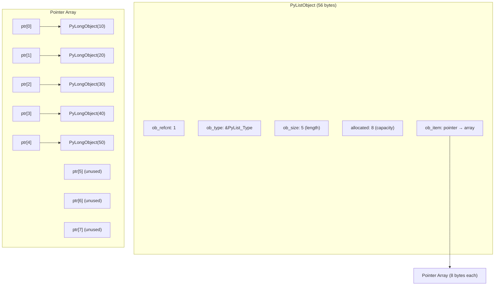
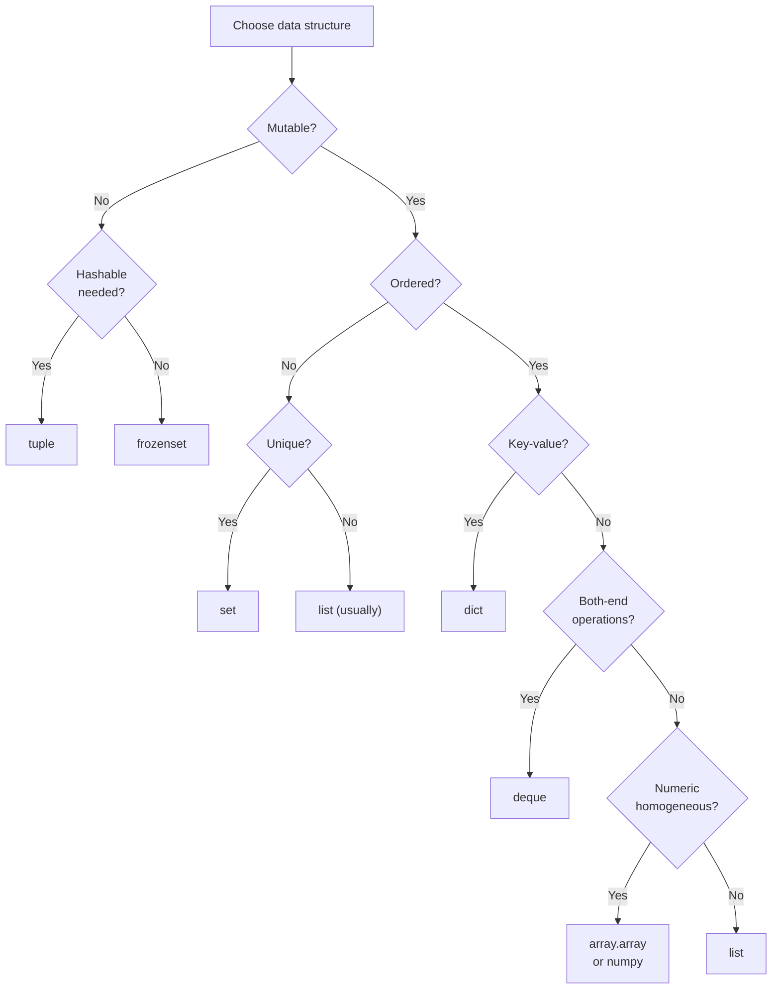

# Python Lists — Senior Level

## Table of Contents

1. [Introduction](#introduction)
2. [Architecture Patterns](#architecture-patterns)
3. [Advanced Internals](#advanced-internals)
4. [Benchmarks](#benchmarks)
5. [Production Patterns](#production-patterns)
6. [Thread Safety & Concurrency](#thread-safety--concurrency)
7. [Memory Profiling](#memory-profiling)
8. [Best Practices](#best-practices)
9. [Edge Cases at Scale](#edge-cases-at-scale)
10. [Test](#test)
11. [Summary](#summary)
12. [Further Reading](#further-reading)
13. [Diagrams & Visual Aids](#diagrams--visual-aids)

---

## Introduction

> Focus: "How to optimize?" and "How to architect?"

This document is for developers who already understand list operations and their time complexity. Here we focus on:
- Architectural decisions involving lists at scale
- Benchmarking and profiling list-heavy code
- Thread safety and concurrent access patterns
- Memory-efficient alternatives for production systems
- Advanced patterns for high-performance Python

---

## Architecture Patterns

### Pattern 1: Immutable Data Pipelines

In production systems, avoid mutating shared lists. Use functional transformations that create new lists at each step.

```python
from typing import Callable
from dataclasses import dataclass, field
from functools import reduce


@dataclass(frozen=True)
class Pipeline:
    """Immutable data pipeline that chains list transformations."""
    transforms: tuple[Callable, ...] = field(default_factory=tuple)

    def add(self, fn: Callable) -> "Pipeline":
        return Pipeline(transforms=(*self.transforms, fn))

    def execute(self, data: list) -> list:
        return reduce(lambda acc, fn: fn(acc), self.transforms, data)


# Usage
pipeline = (
    Pipeline()
    .add(lambda items: [x for x in items if x is not None])
    .add(lambda items: [x.strip().lower() for x in items])
    .add(lambda items: list(dict.fromkeys(items)))  # deduplicate, preserve order
    .add(sorted)
)

raw = ["  Hello ", None, "WORLD", "hello", " World ", None]
result = pipeline.execute(raw)
print(result)  # ['hello', 'world']
```

### Pattern 2: Batch Processing with Backpressure

```python
import asyncio
from collections.abc import AsyncIterator
from typing import TypeVar

T = TypeVar("T")


async def batch_processor(
    source: AsyncIterator[T],
    batch_size: int = 100,
    max_pending: int = 3,
) -> AsyncIterator[list[T]]:
    """Process items in batches with backpressure control."""
    semaphore = asyncio.Semaphore(max_pending)
    batch: list[T] = []

    async for item in source:
        batch.append(item)
        if len(batch) >= batch_size:
            async with semaphore:
                yield batch
            batch = []  # new list — old one is being processed

    if batch:
        async with semaphore:
            yield batch


# Usage
async def data_source() -> AsyncIterator[int]:
    for i in range(1000):
        yield i
        await asyncio.sleep(0.001)


async def main():
    async for batch in batch_processor(data_source(), batch_size=50):
        print(f"Processing batch of {len(batch)} items")
        await asyncio.sleep(0.1)  # simulate work
```

### Pattern 3: Ring Buffer with Fixed-Size List

```python
from typing import Generic, TypeVar, Optional

T = TypeVar("T")


class RingBuffer(Generic[T]):
    """Fixed-size circular buffer using a pre-allocated list."""

    __slots__ = ("_buffer", "_size", "_head", "_count")

    def __init__(self, capacity: int) -> None:
        self._buffer: list[Optional[T]] = [None] * capacity
        self._size = capacity
        self._head = 0
        self._count = 0

    def push(self, item: T) -> Optional[T]:
        """Add item, return evicted item if buffer was full."""
        evicted = self._buffer[self._head] if self._count == self._size else None
        self._buffer[self._head] = item
        self._head = (self._head + 1) % self._size
        if self._count < self._size:
            self._count += 1
        return evicted

    def to_list(self) -> list[T]:
        """Return items in insertion order."""
        if self._count < self._size:
            return [x for x in self._buffer[:self._count] if x is not None]
        start = self._head
        return [
            self._buffer[(start + i) % self._size]
            for i in range(self._size)
        ]

    def __len__(self) -> int:
        return self._count


# Usage: keep last 5 events
buf = RingBuffer(5)
for i in range(8):
    buf.push(f"event_{i}")
print(buf.to_list())  # ['event_3', 'event_4', 'event_5', 'event_6', 'event_7']
```

---

## Advanced Internals

### Over-Allocation Formula (CPython 3.12+)

When a list needs to grow, CPython does not allocate exactly the needed space. It over-allocates to amortize future appends:

```python
def cpython_list_resize(newsize: int) -> int:
    """Simulate CPython's over-allocation formula from listobject.c"""
    new_allocated = (newsize >> 3) + (3 if newsize < 9 else 6) + newsize
    return new_allocated


# Show growth pattern
size = 0
for i in range(50):
    if i >= size:
        size = cpython_list_resize(i + 1)
        print(f"len={i + 1:>3}, allocated={size:>3}, waste={size - i - 1:>3}")
```

### `__slots__` for List-like Objects

When you have millions of small objects stored in lists, `__slots__` can save significant memory:

```python
import sys


class PointRegular:
    def __init__(self, x, y, z):
        self.x = x
        self.y = y
        self.z = z


class PointSlots:
    __slots__ = ("x", "y", "z")

    def __init__(self, x, y, z):
        self.x = x
        self.y = y
        self.z = z


regular = PointRegular(1.0, 2.0, 3.0)
slotted = PointSlots(1.0, 2.0, 3.0)

print(f"Regular: {sys.getsizeof(regular)} bytes")   # ~48 bytes + __dict__
print(f"Slotted: {sys.getsizeof(slotted)} bytes")   # ~64 bytes, no __dict__

# With 1M objects in a list
# Regular: ~200 MB (each has __dict__)
# Slotted: ~80 MB (no __dict__)
```

---

## Benchmarks

### Benchmark 1: List Creation Methods

```python
import timeit

n = 100_000

benchmarks = {
    "for loop + append": "lst = []\nfor i in range(%d): lst.append(i)" % n,
    "list comprehension": "[i for i in range(%d)]" % n,
    "list(range())":      "list(range(%d))" % n,
    "list(map())":        "list(map(lambda x: x, range(%d)))" % n,
    "[*range()]":         "[*range(%d)]" % n,
}

for name, code in benchmarks.items():
    t = timeit.timeit(code, number=100)
    print(f"{name:>25}: {t:.4f}s")

# Typical results:
#     for loop + append: 0.4812s
#     list comprehension: 0.2584s
#          list(range()): 0.1021s
#            list(map()): 0.5136s
#             [*range()]: 0.1045s
```

### Benchmark 2: Membership Testing

```python
import timeit

n = 10_000
setup = f"""
import random
data = list(range({n}))
random.shuffle(data)
target = {n // 2}
data_set = set(data)
"""

t_list = timeit.timeit("target in data", setup=setup, number=10_000)
t_set = timeit.timeit("target in data_set", setup=setup, number=10_000)

print(f"list 'in': {t_list:.4f}s")
print(f"set  'in': {t_set:.4f}s")
print(f"set is {t_list / t_set:.0f}x faster")
# set is ~200x faster for n=10,000
```

### Benchmark 3: Sort Performance on Different Data Patterns

```python
import timeit
import random

n = 100_000

def benchmark_sort(name, data_fn):
    setup_code = f"""
import random
data = {data_fn}
"""
    t = timeit.timeit("sorted(data)", setup=setup_code, number=20)
    print(f"{name:>25}: {t:.4f}s")

benchmark_sort("Random", f"[random.randint(0, {n}) for _ in range({n})]")
benchmark_sort("Already sorted", f"list(range({n}))")
benchmark_sort("Reverse sorted", f"list(range({n}, 0, -1))")
benchmark_sort("Nearly sorted (1% swaps)", f"""
(lambda d: [d.__setitem__(random.randint(0,{n}-1), random.randint(0,{n})) or None for _ in range({n}//100)] and d or d)(list(range({n})))
""".strip())

# Timsort adapts: already/nearly sorted data is ~5-10x faster than random
```

### Benchmark 4: Copy Methods

```python
import timeit
import copy

n = 100_000
setup = f"data = list(range({n}))"

methods = {
    "list.copy()":       "data.copy()",
    "list(data)":        "list(data)",
    "data[:]":           "data[:]",
    "[*data]":           "[*data]",
    "copy.copy()":       "import copy; copy.copy(data)",
    "copy.deepcopy()":   "import copy; copy.deepcopy(data)",
}

for name, code in methods.items():
    t = timeit.timeit(code, setup=setup, number=100)
    print(f"{name:>20}: {t:.4f}s")

# deepcopy is ~100x slower than shallow copies
```

---

## Production Patterns

### Pattern 1: Sorted List with Bisect for O(log n) Search

```python
import bisect
from typing import TypeVar, Generic, Optional

T = TypeVar("T")


class SortedList(Generic[T]):
    """Maintain a sorted list with O(log n) insertion and search."""

    def __init__(self) -> None:
        self._data: list[T] = []

    def insert(self, item: T) -> None:
        bisect.insort(self._data, item)

    def find(self, item: T) -> Optional[int]:
        idx = bisect.bisect_left(self._data, item)
        if idx < len(self._data) and self._data[idx] == item:
            return idx
        return None

    def range_query(self, lo: T, hi: T) -> list[T]:
        left = bisect.bisect_left(self._data, lo)
        right = bisect.bisect_right(self._data, hi)
        return self._data[left:right]

    def __len__(self) -> int:
        return len(self._data)


# Usage
sl = SortedList()
for val in [5, 2, 8, 1, 9, 3, 7]:
    sl.insert(val)

print(sl.find(7))           # 4
print(sl.range_query(3, 8)) # [3, 5, 7, 8]
```

### Pattern 2: Memory-Mapped List for Large Datasets

```python
import mmap
import struct
from pathlib import Path


class MMapIntList:
    """Memory-mapped list of integers — supports datasets larger than RAM."""

    ITEM_SIZE = 8  # int64

    def __init__(self, path: Path, capacity: int = 0) -> None:
        self._path = path
        if not path.exists() or capacity > 0:
            size = max(capacity, 1) * self.ITEM_SIZE
            path.write_bytes(b"\x00" * size)

        self._file = open(path, "r+b")
        self._mm = mmap.mmap(self._file.fileno(), 0)
        self._len = len(self._mm) // self.ITEM_SIZE

    def __getitem__(self, idx: int) -> int:
        offset = idx * self.ITEM_SIZE
        return struct.unpack_from("q", self._mm, offset)[0]

    def __setitem__(self, idx: int, value: int) -> None:
        offset = idx * self.ITEM_SIZE
        struct.pack_into("q", self._mm, offset, value)

    def __len__(self) -> int:
        return self._len

    def close(self) -> None:
        self._mm.close()
        self._file.close()


# Usage
from pathlib import Path
path = Path("/tmp/large_list.bin")
ml = MMapIntList(path, capacity=1_000_000)
ml[0] = 42
ml[999_999] = 99
print(ml[0], ml[999_999])  # 42, 99
ml.close()
```

---

## Thread Safety & Concurrency

### GIL Does NOT Make Lists Thread-Safe

```python
import threading

counter_list = [0]

def increment(n: int) -> None:
    for _ in range(n):
        counter_list[0] += 1  # NOT atomic!

threads = [threading.Thread(target=increment, args=(100_000,)) for _ in range(4)]
for t in threads:
    t.start()
for t in threads:
    t.join()

print(counter_list[0])  # Expected: 400_000, Actual: less (race condition)
```

### Safe Patterns for Concurrent List Access

```python
import threading
from queue import Queue
from typing import TypeVar

T = TypeVar("T")


class ThreadSafeList:
    """Thread-safe list wrapper using a lock."""

    def __init__(self) -> None:
        self._list: list = []
        self._lock = threading.RLock()

    def append(self, item) -> None:
        with self._lock:
            self._list.append(item)

    def pop(self, index: int = -1):
        with self._lock:
            return self._list.pop(index)

    def snapshot(self) -> list:
        """Return a copy for safe iteration."""
        with self._lock:
            return self._list.copy()

    def __len__(self) -> int:
        with self._lock:
            return len(self._list)


# Better approach for producer-consumer: use queue.Queue
def producer_consumer_example():
    q: Queue[int] = Queue(maxsize=100)

    def producer():
        for i in range(1000):
            q.put(i)
        q.put(None)  # sentinel

    def consumer():
        results = []
        while True:
            item = q.get()
            if item is None:
                break
            results.append(item * 2)
        return results

    t1 = threading.Thread(target=producer)
    t1.start()
    # consumer runs in main thread
    t1.join()
```

### Asyncio Pattern: Gather Results into List

```python
import asyncio
from typing import Any


async def fetch_data(url: str) -> dict:
    """Simulate async HTTP fetch."""
    await asyncio.sleep(0.1)
    return {"url": url, "status": 200}


async def fetch_all(urls: list[str]) -> list[dict]:
    """Fetch all URLs concurrently, return results as a list."""
    tasks = [asyncio.create_task(fetch_data(url)) for url in urls]
    results = await asyncio.gather(*tasks, return_exceptions=True)

    # Separate successes and failures
    successes: list[dict] = []
    errors: list[Exception] = []
    for result in results:
        if isinstance(result, Exception):
            errors.append(result)
        else:
            successes.append(result)

    if errors:
        print(f"Warning: {len(errors)} fetches failed")

    return successes
```

---

## Memory Profiling

### Measuring List Memory Usage

```python
import sys
import tracemalloc


def measure_list_memory():
    tracemalloc.start()

    # Create a large list
    data = [i for i in range(1_000_000)]

    current, peak = tracemalloc.get_traced_memory()
    print(f"Current memory: {current / 1024 / 1024:.2f} MB")
    print(f"Peak memory:    {peak / 1024 / 1024:.2f} MB")

    # List of ints vs list of strings
    snapshot = tracemalloc.take_snapshot()
    for stat in snapshot.statistics("lineno")[:5]:
        print(stat)

    tracemalloc.stop()


def compare_structures():
    """Compare memory of list vs tuple vs array."""
    import array

    n = 1_000_000

    lst = list(range(n))
    tpl = tuple(range(n))
    arr = array.array("q", range(n))  # signed long long

    print(f"list:  {sys.getsizeof(lst):>12,} bytes")
    print(f"tuple: {sys.getsizeof(tpl):>12,} bytes")
    print(f"array: {sys.getsizeof(arr):>12,} bytes")

    # list:    8,448,728 bytes  (pointers + over-allocation)
    # tuple:   8,000,040 bytes  (pointers, no over-allocation)
    # array:   8,000,064 bytes  (raw values, no pointers)
    # Note: list/tuple sizes don't include the int objects themselves!


if __name__ == "__main__":
    measure_list_memory()
    compare_structures()
```

---

## Best Practices

- **Profile before optimizing** — use `cProfile`, `line_profiler`, and `timeit` to find actual bottlenecks
- **Use `__slots__` on objects stored in large lists** — saves ~40-50% memory per object
- **Prefer `bisect` for sorted list operations** — O(log n) search instead of O(n)
- **Use generators for intermediate transformations** — avoid creating temporary lists
- **Choose the right concurrency model**: `threading` + `Queue` for I/O-bound, `multiprocessing` for CPU-bound, `asyncio` for high-concurrency I/O
- **Freeze lists that should not change** — convert to `tuple` after construction
- **Batch database/API operations** — collect items in a list, then bulk-insert
- **Use `array.array` or NumPy for homogeneous numeric data** — 2-8x less memory than list of ints
- **Pre-size lists when possible** — `[None] * n` avoids repeated reallocations
- **Document list invariants** — annotate whether lists are sorted, unique, bounded, etc.

---

## Edge Cases at Scale

### Edge Case 1: Memory fragmentation with large lists

```python
# Creating and destroying many large lists fragments the heap
# Python's memory allocator (pymalloc) uses arenas of 256KB
# Large objects (>512 bytes) go directly to the OS allocator

# Symptom: RSS grows but never shrinks
# Solution: use gc.collect() and consider object pools

import gc

def process_batch():
    data = list(range(10_000_000))
    result = sum(data)
    del data
    gc.collect()  # Force garbage collection
    return result
```

### Edge Case 2: Recursive list structures

```python
# Lists can contain themselves — this creates a reference cycle
a = [1, 2, 3]
a.append(a)  # a = [1, 2, 3, [...]]

print(a[3] is a)  # True
print(a[3][3][3][0])  # 1 — infinite recursion in data structure

# This is handled by Python's cyclic garbage collector
# but repr() and deepcopy will struggle
# print(a)  # [1, 2, 3, [...]] — Python detects the cycle for repr
```

### Edge Case 3: sys.maxsize and list limits

```python
import sys

# Maximum list size is sys.maxsize (platform dependent)
print(f"Max list size: {sys.maxsize:,}")
# 64-bit: 9,223,372,036,854,775,807

# In practice, you'll run out of memory long before reaching this
# A list of sys.maxsize pointers would need ~64 PB of RAM
```

---

## Test

**1. What is the amortized time complexity of `list.append()` and why?**

<details>
<summary>Answer</summary>
O(1) amortized. CPython over-allocates the internal array, so most appends just store a pointer in an existing slot. When reallocation is needed (O(n) copy), it happens infrequently enough that the average cost per append remains O(1). The growth pattern is roughly 0, 4, 8, 16, 24, 32, 40, 52, 64... — each reallocation adds ~12.5% extra capacity.
</details>

**2. What does this code print and why?**

```python
def make_multipliers():
    return [lambda x: x * i for i in range(4)]

fns = make_multipliers()
print([f(2) for f in fns])
```

<details>
<summary>Answer</summary>

Output: `[6, 6, 6, 6]`

This is the **late binding closure** problem. All lambdas capture the variable `i` by reference (not by value). When the lambdas are called, `i` has already been set to 3 (the last value of the loop). Fix:

```python
# Fix: use default argument to capture current value
def make_multipliers():
    return [lambda x, i=i: x * i for i in range(4)]
# Output: [0, 2, 4, 6]
```
</details>

**3. Given a list of 10 million integers, how would you find the top 10 largest values efficiently?**

<details>
<summary>Answer</summary>

Use `heapq.nlargest(10, data)` — this runs in O(n log k) time where k=10, much faster than sorting the entire list (O(n log n)).

```python
import heapq
data = list(range(10_000_000))
top10 = heapq.nlargest(10, data)
```

For the special case of top-1, just use `max(data)` which is O(n).
</details>

**4. Explain the difference between `list.copy()`, `list[:]`, and `copy.deepcopy(list)`.**

<details>
<summary>Answer</summary>

- `list.copy()` and `list[:]` both create a **shallow copy** — a new list with the same references to the original objects. If the list contains mutable objects (like nested lists), changes to those nested objects will be visible in both copies.
- `copy.deepcopy()` creates a **deep copy** — recursively copies all nested objects, creating completely independent data structures. It is ~100x slower than shallow copies.

```python
import copy
a = [[1, 2], [3, 4]]
b = a.copy()       # shallow
c = copy.deepcopy(a)  # deep

a[0][0] = 99
print(b[0][0])  # 99 — shallow copy shares inner lists
print(c[0][0])  # 1  — deep copy is independent
```
</details>

**5. Why is `list * n` dangerous for lists of mutable objects?**

<details>
<summary>Answer</summary>

`list * n` replicates **references**, not values. All copies point to the same objects.

```python
grid = [[0, 0, 0]] * 3
grid[0][0] = 1
print(grid)  # [[1, 0, 0], [1, 0, 0], [1, 0, 0]]
# All rows are the same object!

# Fix:
grid = [[0, 0, 0] for _ in range(3)]
```
</details>

**6. How does Python's Timsort achieve O(n) on already-sorted data?**

<details>
<summary>Answer</summary>

Timsort first scans the input for "runs" — naturally occurring sorted subsequences (either ascending or strictly descending). If the data is already sorted, the entire array is one run, and Timsort recognizes this in a single O(n) pass without any merging. For nearly-sorted data, Timsort finds a few runs and merges them efficiently, resulting in near-O(n) performance.
</details>

**7. What does this code print?**

```python
a = [1, 2, 3]
b = a
a = a + [4]
print(a is b)
print(a, b)
```

<details>
<summary>Answer</summary>

```
False
[1, 2, 3, 4] [1, 2, 3]
```

`a = a + [4]` creates a new list and rebinds `a`. `b` still references the original list. This is different from `a += [4]` which modifies in place.
</details>

**8. How would you implement an LRU cache using list operations?**

<details>
<summary>Answer</summary>

While `functools.lru_cache` exists for functions, here is a manual implementation concept:

```python
from collections import OrderedDict

class LRUCache:
    def __init__(self, capacity: int):
        self._cache = OrderedDict()
        self._capacity = capacity

    def get(self, key):
        if key in self._cache:
            self._cache.move_to_end(key)
            return self._cache[key]
        return None

    def put(self, key, value):
        if key in self._cache:
            self._cache.move_to_end(key)
        elif len(self._cache) >= self._capacity:
            self._cache.popitem(last=False)
        self._cache[key] = value
```

Using a plain list would be O(n) for cache lookup. `OrderedDict` provides O(1) access with O(1) reordering. In CPython, `OrderedDict` uses a doubly-linked list internally.
</details>

**9. What is the memory overhead of a Python list compared to a C array?**

<details>
<summary>Answer</summary>

A Python list of `n` integers requires:
- `PyListObject` header: ~56 bytes (refcount, type, size, allocated, pointer array)
- Array of pointers: `8n` bytes (on 64-bit)
- Each `int` object: ~28 bytes (for small ints, Python caches -5 to 256)

Total: ~56 + 8n + 28n = 56 + 36n bytes

A C `int64_t` array: 8n bytes

So a Python list is ~4.5x more memory than a C array, plus the 56-byte header overhead.
</details>

**10. What is the output?**

```python
def f(x, lst=[]):
    lst.append(x)
    return lst

a = f(1)
b = f(2)
c = f(3, [])
print(a, b, c)
print(a is b)
```

<details>
<summary>Answer</summary>

```
[1, 2] [1, 2] [3]
True
```

`a` and `b` share the same default list (mutable default argument problem). `c` uses a new list passed explicitly. `a is b` is `True` because both reference the same default list object, which now contains `[1, 2]`.
</details>

**11. How can you make list operations atomic in a multithreaded program?**

<details>
<summary>Answer</summary>

Use `threading.Lock` or `threading.RLock`:

```python
import threading

lock = threading.Lock()
shared_list = []

def safe_append(item):
    with lock:
        shared_list.append(item)
```

Or better, use `queue.Queue` for producer-consumer patterns, which handles locking internally. For read-heavy workloads, consider `threading.RLock` (re-entrant) or creating snapshots with `list.copy()` under a lock.
</details>

**12. What is the output and why?**

```python
lst = [1, 2, 3, 4, 5]
it = iter(lst)
print(next(it))
lst.insert(0, 0)
print(next(it))
print(list(it))
```

<details>
<summary>Answer</summary>

```
1
2
[3, 4, 5]
```

The iterator tracks its position by index. After `next(it)` returns `1` (index 0), the iterator is at position 1. Inserting `0` at the beginning shifts all elements right, but the iterator still advances to index 1, which is now `2` (originally at index 1 before insert). The iterator does **not** detect structural modification (unlike Java's `ConcurrentModificationException`). This can lead to skipping or repeating elements.
</details>

---

## Summary

- **Architecture**: Use immutable pipelines, batch processing with backpressure, and ring buffers for production-grade list usage
- **Benchmarks**: `list(range())` is fastest for creation; `bisect` gives O(log n) search on sorted lists; `heapq.nlargest` beats full sorting for top-K queries
- **Thread safety**: Lists are NOT thread-safe despite the GIL; use locks, `Queue`, or copy-on-read patterns
- **Memory**: Profile with `tracemalloc`; use `__slots__`, `array.array`, or NumPy for memory-critical workloads
- **Best practice**: Profile first, choose the right data structure, document invariants, prefer immutability where possible

---

## Further Reading

- **CPython source:** [Objects/listobject.c](https://github.com/python/cpython/blob/main/Objects/listobject.c)
- **Timsort paper:** [Original description by Tim Peters](https://github.com/python/cpython/blob/main/Objects/listsort.txt)
- **Book:** High Performance Python (Gorelick & Ozsvald), Chapter 3 — "Lists and Tuples"
- **PEP 3132:** [Extended Unpacking](https://peps.python.org/pep-3132/)
- **Talk:** Raymond Hettinger — "Transforming Code into Beautiful, Idiomatic Python"

---

## Diagrams & Visual Aids

### List Memory Layout



### Data Structure Decision Tree



### Performance Comparison Chart

```
Operation         | list      | deque     | set       | dict
------------------+-----------+-----------+-----------+----------
append/add        | O(1)*     | O(1)      | O(1)*     | O(1)*
prepend           | O(n)      | O(1)      | N/A       | N/A
pop last          | O(1)      | O(1)      | N/A       | N/A
pop first         | O(n)      | O(1)      | N/A       | N/A
access by index   | O(1)      | O(n)      | N/A       | N/A
search (in)       | O(n)      | O(n)      | O(1)*     | O(1)*
sort              | O(n lg n) | N/A       | N/A       | N/A

* = amortized
```
